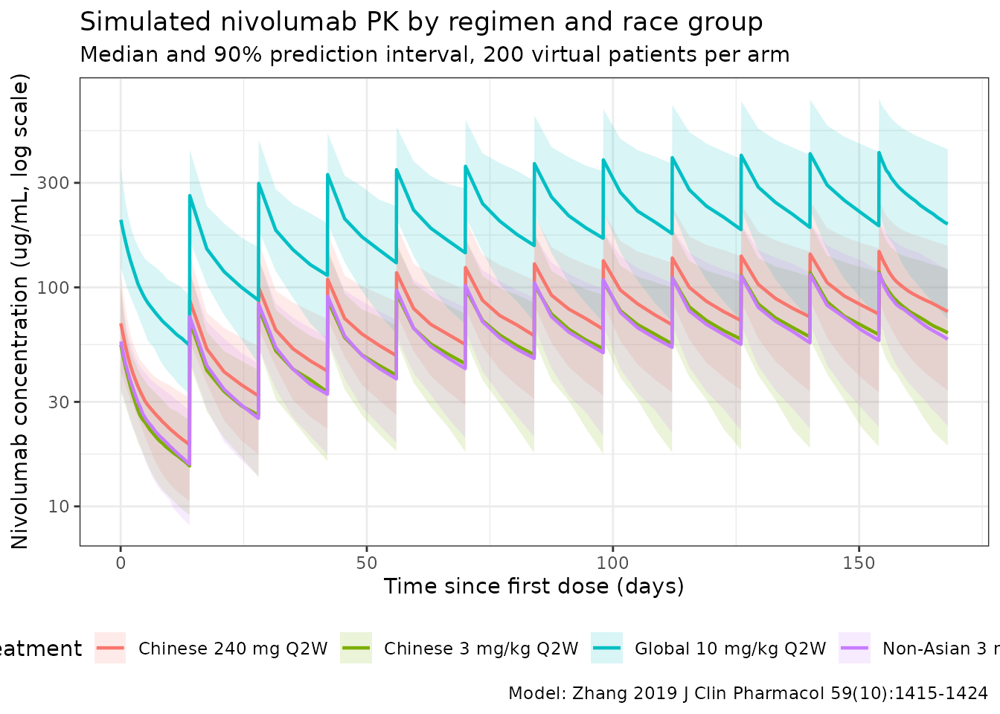
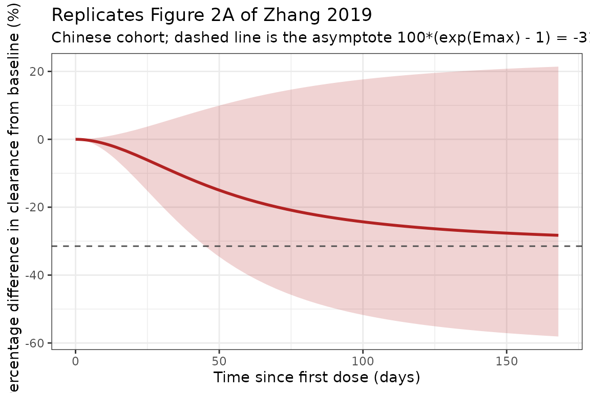

# Nivolumab in Chinese patients (Zhang 2019)

## Model and source

- Citation: Zhang J, Cai J, Bello A, Roy A, Sheng J. Model-Based
  Population Pharmacokinetic Analysis of Nivolumab in Chinese Patients
  With Previously Treated Advanced Solid Tumors, Including Non-Small
  Cell Lung Cancer. *J Clin Pharmacol.* 2019;59(10):1415-1424.
  <doi:%5B10.1002/jcph.1432>\](<https://doi.org/10.1002/jcph.1432>)
- Article: <https://doi.org/10.1002/jcph.1432>
- Supporting information (Tables S1-S7):
  <https://www.ebi.ac.uk/europepmc/webservices/rest/PMC6767401/supplementaryFiles>
- Description: Two-compartment population PK model with sigmoidal
  time-varying clearance for intravenous nivolumab (anti-PD-1 IgG4) in
  Chinese and global patients with previously treated advanced solid
  tumors, including NSCLC and nasopharyngeal carcinoma (Zhang 2019, J
  Clin Pharmacol)
- Modality: Therapeutic monoclonal antibody (IgG4), IV infusion.

Nivolumab is a fully human anti-PD-1 IgG4 monoclonal antibody. This
analysis **re-estimated** the parameters of the Bajaj 2017 global
nivolumab monotherapy population-PK model (packaged here as
`Bajaj_2017_nivolumab`) on a pooled data set that added a Chinese
cohort, and revised the tumor-type covariate so that both NSCLC (the
reference) and nasopharyngeal carcinoma (NPC) carry explicit levels. Its
purpose was regulatory: to show that nivolumab PK is not sensitive to
race, and to bracket the exposure of a 240 mg flat-dose regimen in
Chinese patients against the approved 3 mg/kg Q2W regimen.

Structure: linear two-compartment IV model with time-varying CL via a
sigmoid-Emax function of time since the start of treatment,

``` math
\mathrm{CL}_{t,i} \;=\; \mathrm{CL}_{\mathrm{base},i} \cdot
  \exp\!\left( \dfrac{E_{\max,i}\, t^{\gamma}}
                     {T_{50}^{\gamma} + t^{\gamma}} \right),
\qquad
E_{\max,i} = E_{\max,\mathrm{TV}} + \eta_{E_{\max},i}
```

and baseline clearance (Zhang 2019 p. 1418)

``` math
\mathrm{CL}_i = \mathrm{CL}_{TV}
  \left(\tfrac{BW_i}{BW_{TV}}\right)^{CL_{BW}}
  \left(\tfrac{eGFR_i}{eGFR_{TV}}\right)^{CL_{eGFR}}
  e^{CL_{SEX}} e^{CL_{PS}} e^{CL_{RAAA}} e^{CL_{RAAS}}
  e^{CL_{NPC}} e^{CL_{OTH}} .
```

The exponential terms are printed in the source without their 0/1
indicators; each applies only to subjects in that category. The
reference patient (Figure 1 caption) is a **white/other male, 80 kg,
ECOG PS 0, eGFR 90 mL/min/1.73 m^2, second-line-or-later NSCLC**, and
carries none of them.

## Population

The analysis pooled **1200 patients** and **6945 nivolumab
concentrations** across **7 studies** (Zhang 2019 Tables S1, S2 and
S4A):

- Two predominantly Chinese studies: CheckMate 077 (phase 1/2, n = 35)
  and CheckMate 078 (phase 3, n = 279 Chinese).
- Five global studies: MDX1106-01, CA209-003, CheckMate 017, CheckMate
  057 and CheckMate 063.
- Race/ethnicity grouping used throughout the paper: **Chinese** (n =
  314), **non-Chinese Asian** (n = 21) and **non-Asian** (n = 865); the
  paper’s “global population” is the 886 non-Chinese subjects.

Baseline characteristics of the pooled cohort (Table S6):

- Sex: 32.3% female (388/1200).
- Race: White 66.4%, Chinese 26.2%, Black/African American 4.0%,
  (non-Chinese) Asian 1.8%, Other 1.0%, Unknown 0.5%, Missing 0.2%.
- ECOG performance status: 0 = 27.8%, 1 = 71.5%, 2 = 0.7%.
- Body weight: mean 73.5 kg (SD 17.3), median 71.0 (range 34.9-157.9).
- Baseline eGFR: mean 85.4 mL/min/1.73 m^2 (SD 20.0), median 88.5 (range
  31.1-135.4).
- Tumor type: non-squamous NSCLC 45.3%, squamous NSCLC 34.6%, melanoma
  9.7%, RCC 2.9%, CRC 2.8%, prostate 2.1%, NPC 1.9%, NSCLC of unknown
  histology 0.6%, HCC 0.2%.

The Chinese cohort is lighter and has a worse performance status than
the global cohort (Table S5): mean weight 59.8 / 59.3 / 64.0 kg and ECOG
PS \> 0 in 75.0% / 46.7% / 85.7% of the CheckMate 077 240 mg, CheckMate
077 3 mg/kg and CheckMate 078 3 mg/kg arms respectively.

The same metadata is available programmatically via
`rxode2::rxode(readModelDb("Zhang_2019b_nivolumab"))$population`.

## Source trace

The per-parameter origin is recorded as an in-file comment next to each
`ini()` entry in `inst/modeldb/specificDrugs/Zhang_2019b_nivolumab.R`.
All values come from **Table S7 of the supporting information**, which
is the only place the final parameter estimates appear; the main text
reports only their back-transforms. The table below collects them in one
place for review.

| Parameter (model name) | Value | Source (Zhang 2019) |
|----|----|----|
| `lcl` (CLTV, L/day) | log(11.6 x 24/1000) | Table S7, CLTV (theta1) = 11.6 mL/h |
| `lvc` (VCTV, L) | log(4.19) | Table S7, VCTV (theta2) |
| `lq` (QTV, L/day) | log(29.3 x 24/1000) | Table S7, QTV (theta3) = 29.3 mL/h |
| `lvp` (VPTV, L) | log(2.64) | Table S7, VPTV (theta4) |
| `e_wt_cl` (power, WT on CL) | 0.529 | Table S7, CLBBWT (theta7) |
| `e_crcl_cl` (power, eGFR on CL) | 0.132 | Table S7, CLGFR (theta9) |
| `e_sexf_cl` (exp, female on CL) | -0.182 | Table S7, CLSEX (theta12) |
| `e_ecog_ge1_cl` (exp, PS \> 0 on CL) | 0.138 | Table S7, CLPS (theta13) |
| `e_tumtp_npc_cl` (exp, NPC on CL) | 0.0889 | Table S7, CLNPC (theta14) |
| `e_tumtp_other_cl` (exp, other on CL) | 0.0718 | Table S7, CLOTH (theta15) |
| `e_wt_vc` (power, WT on VC) | 0.740 | Table S7, VCBBWT (theta17) |
| `e_sexf_vc` (exp, female on VC) | -0.132 | Table S7, VCSEX (theta18) |
| `cl_time_max` (Emax, unitless) | -0.378 | Table S7, CLEMAX (theta24) |
| `lcl_t50` (T50, log days) | log(1380/24) | Table S7, CLt50 (theta25) = 1.38e3 h |
| `lcl_time_hill` (Hill, log unitless) | log(1.92) | Table S7, CLHILL (theta26) |
| `e_race_black_cl` (exp, Black on CL) | -0.00409 | Table S7, CLRAAA (theta27) |
| `e_race_asian_cl` (exp, Asian on CL) | -0.0891 | Table S7, CLRAAS (theta28) |
| IIV block `etalcl + etalvc` | c(0.119, 0.0551, 0.101) | Table S7, omega1,1 / omega1,2 / omega2,2 |
| `etalvp` | 0.283 | Table S7, omega3,3 (ZVP) |
| `etacl_time_max` | 0.0951 | Table S7, omega4,4 (ZEMAX) |
| `propSd` | 0.224 | Table S7, PEER (theta6) |
| Baseline-CL covariate equation | n/a | Displayed equation, p. 1418 |
| Time-varying CL (sigmoid Emax) | n/a | Methods, “PPK Model Development”; form inherited from Bajaj 2017 Eq. 8 |
| Reference covariates (80 kg, eGFR 90, male, PS 0, white/other, NSCLC) | n/a | Figure 1 caption |

Note on the Table S7 random-effects rows: the **Estimate** column holds
variances, and the parenthesised value is the corresponding standard
deviation (`sqrt(0.119) = 0.345`, `sqrt(0.101) = 0.318`,
`sqrt(0.283) = 0.532`, `sqrt(0.0951) = 0.308`) – except on the `ZCL:ZVC`
row, where the parenthesised `0.503` is the **correlation**
(`0.0551 / (0.345 * 0.318) = 0.502`). This is what fixes the covariance
as 0.0551 rather than 0.503.

## Published back-transforms (deterministic checks)

Zhang 2019 states several covariate effects in the main text as
percentages while tabulating them as coefficients in Table S7. Those
statements are exact back-transforms of the packaged `ini()` values and
need no simulation, so they are the tightest available check that the
parameters were transcribed with the right sign and scale.

``` r

ui <- rxode2::rxode(readModelDb("Zhang_2019b_nivolumab"))
#> ℹ parameter labels from comments will be replaced by 'label()'
th <- setNames(ui$theta, names(ui$theta))

claims <- tibble::tibble(
  Quantity = c(
    "Steady-state CL as % of baseline: exp(Emax) x 100%",
    "Maximal decrease in CL: (1 - exp(Emax)) x 100%",
    "Asian vs non-Asian baseline CL",
    "NPC vs NSCLC baseline CL",
    "ECOG PS > 0 vs PS = 0 CL",
    "Female vs male CL",
    "Female vs male Vc",
    "Time to half-maximal change in CL (months)"
  ),
  Published = c(
    "68.5% (formula given in Methods)",
    "~32%",
    "9% lower",
    "9% higher",
    "15% increase",
    "lower (magnitude not stated)",
    "lower (magnitude not stated)",
    "~2 months (t50 = 1380 h)"
  ),
  Computed = c(
    sprintf("%.1f%%", 100 * exp(th[["cl_time_max"]])),
    sprintf("%.1f%%", 100 * (1 - exp(th[["cl_time_max"]]))),
    sprintf("%.1f%% lower", 100 * (1 - exp(th[["e_race_asian_cl"]]))),
    sprintf("%.1f%% higher", 100 * (exp(th[["e_tumtp_npc_cl"]]) - 1)),
    sprintf("%.1f%% increase", 100 * (exp(th[["e_ecog_ge1_cl"]]) - 1)),
    sprintf("%.1f%% lower", 100 * (1 - exp(th[["e_sexf_cl"]]))),
    sprintf("%.1f%% lower", 100 * (1 - exp(th[["e_sexf_vc"]]))),
    sprintf("%.2f months", exp(th[["lcl_t50"]]) / 30.4375)
  )
)
knitr::kable(claims, caption = "Main-text claims recovered from the packaged ini() values.")
```

| Quantity | Published | Computed |
|:---|:---|:---|
| Steady-state CL as % of baseline: exp(Emax) x 100% | 68.5% (formula given in Methods) | 68.5% |
| Maximal decrease in CL: (1 - exp(Emax)) x 100% | ~32% | 31.5% |
| Asian vs non-Asian baseline CL | 9% lower | 8.5% lower |
| NPC vs NSCLC baseline CL | 9% higher | 9.3% higher |
| ECOG PS \> 0 vs PS = 0 CL | 15% increase | 14.8% increase |
| Female vs male CL | lower (magnitude not stated) | 16.6% lower |
| Female vs male Vc | lower (magnitude not stated) | 12.4% lower |
| Time to half-maximal change in CL (months) | ~2 months (t50 = 1380 h) | 1.89 months |

Main-text claims recovered from the packaged ini() values. {.table
style="width:100%;"}

``` r


# These are pure arithmetic on the ini() values -- no simulation, no cohort --
# so they are asserted tightly. A sign error or a variance-vs-SD mix-up on any
# of these parameters moves them by tens of percent and breaks these bounds.
stopifnot(
  abs(100 * exp(th[["cl_time_max"]]) - 68.5) < 0.5,
  abs(100 * (1 - exp(th[["cl_time_max"]])) - 32) < 1.0,
  abs(100 * (1 - exp(th[["e_race_asian_cl"]])) - 9) < 1.0,
  abs(100 * (exp(th[["e_tumtp_npc_cl"]]) - 1) - 9) < 1.0,
  abs(100 * (exp(th[["e_ecog_ge1_cl"]]) - 1) - 15) < 1.0,
  abs(exp(th[["lcl_t50"]]) / 30.4375 - 2) < 0.2
)
```

## Virtual cohort

Original observed data are not publicly available. The simulations below
use four virtual arms whose covariate distributions approximate the
corresponding published subgroups. **Each arm is capped at 200
subjects.**

Several per-subgroup statistics are not tabulated directly and are
derived from the paper’s own totals by subtraction (pooled cohort minus
the Chinese cohort); these derivations are listed in “Assumptions and
deviations” below.

``` r

# `set.seed()` seeds R's RNG, which is what draws the covariates below. It does
# NOT seed rxode2's simulation RNG, and rxode2's eta streams are partitioned per
# solver thread -- so a 2-core CI runner draws different etas than a 16-thread
# workstation. Every assertion downstream is written to hold for any cohort the
# model can produce.
set.seed(20191432)
n_arm <- 200L

# Chinese cohort (CheckMate 077 + 078). Weight is the n-weighted mean of the
# three Chinese arms of Table S5: (20*59.8 + 15*59.3 + 279*64.0)/314 = 63.5 kg.
# Sex and PS likewise: 73/314 female, 261/314 with PS > 0. NPC is 6/294 in the
# 3 mg/kg arm (Table 2 footnote a); no Chinese 3 mg/kg subject has an "other"
# tumor type.
make_chinese <- function(n, id_offset) {
  tibble(
    id = id_offset + seq_len(n),
    WT = pmin(pmax(rlnorm(n, log(63.5), 0.16), 35), 110),
    CRCL = pmin(pmax(rnorm(n, 85.4, 20.0), 31.1), 135.4),
    SEXF = rbinom(n, 1, 73 / 314),
    ECOG_GE1 = rbinom(n, 1, 261 / 314),
    RACE_ASIAN = 1L,
    RACE_BLACK = 0L,
    TUMTP_NPC = rbinom(n, 1, 6 / 294),
    TUMTP_OTHER = 0L
  ) |>
    mutate(TUMTP_OTHER = ifelse(TUMTP_NPC == 1L, 0L, TUMTP_OTHER))
}

# Non-Asian cohort. Derived from the pooled Table S6 totals minus the Chinese
# cohort (n = 886 non-Chinese): weight (1200*73.5 - 314*63.5)/886 = 77.0 kg;
# female (388 - 73)/886 = 35.6%; PS > 0 (866 - 261)/886 = 68.3%. All 48
# Black/African American subjects are non-Asian: 48/865 = 5.5%.
# `other_p` is the share of non-NSCLC, non-NPC tumor types, which differs
# between the 3 mg/kg arm (registrational NSCLC studies) and the 10 mg/kg arm
# (phase 1 mixed-tumor studies) -- see "Assumptions and deviations".
make_nonasian <- function(n, id_offset, other_p) {
  tibble(
    id = id_offset + seq_len(n),
    WT = pmin(pmax(rlnorm(n, log(77.0), 0.23), 34.9), 157.9),
    CRCL = pmin(pmax(rnorm(n, 85.4, 20.0), 31.1), 135.4),
    SEXF = rbinom(n, 1, 315 / 886),
    ECOG_GE1 = rbinom(n, 1, 605 / 886),
    RACE_ASIAN = 0L,
    RACE_BLACK = rbinom(n, 1, 48 / 865),
    TUMTP_NPC = 0L,
    TUMTP_OTHER = rbinom(n, 1, other_p)
  )
}

arms <- list(
  list(label = "Chinese 3 mg/kg Q2W", pop = make_chinese(n_arm, 0L), mgkg = 3, flat = NA_real_),
  list(label = "Chinese 240 mg Q2W", pop = make_chinese(n_arm, 1000L), mgkg = NA_real_, flat = 240),
  list(label = "Non-Asian 3 mg/kg Q2W", pop = make_nonasian(n_arm, 2000L, other_p = 0.08), mgkg = 3, flat = NA_real_),
  list(label = "Global 10 mg/kg Q2W", pop = make_nonasian(n_arm, 3000L, other_p = 0.56), mgkg = 10, flat = NA_real_)
)
```

Dosing is Q2W with a 60-minute IV infusion (Table S1). Twelve doses are
given so that the last dosing interval (days 154-168) is a steady-state
approximation: the model’s terminal half-life is ~25-36 days, so day 154
is about 4-6 terminal half-lives into treatment, and the time-varying
clearance term (`t50` = 57.5 days) is essentially saturated.

``` r

dose_interval_d <- 14
n_doses <- 12L
inf_dur_d <- 1 / 24
dose_times_d <- seq(0, by = dose_interval_d, length.out = n_doses)
ss_start <- dose_times_d[n_doses]

# Observation grid: dense through the first dosing interval and through the
# steady-state interval (both are read by PKNCA), coarse in between. The end of
# infusion is included explicitly so Cmax is resolved.
obs_times_d <- sort(unique(c(
  seq(0, dose_interval_d, by = 0.5),
  seq(ss_start, ss_start + dose_interval_d, by = 0.5),
  dose_times_d,
  dose_times_d + inf_dur_d,
  seq(0, ss_start + dose_interval_d, by = 3.5)
)))

build_arm <- function(arm) {
  pop <- arm$pop
  amt_i <- if (is.na(arm$flat)) pop$WT * arm$mgkg else rep(arm$flat, nrow(pop))
  d_dose <- pop |>
    mutate(amt = amt_i) |>
    tidyr::crossing(time = dose_times_d) |>
    mutate(evid = 1, cmt = "central", dur = inf_dur_d)
  d_obs <- pop |>
    tidyr::crossing(time = obs_times_d) |>
    mutate(amt = NA_real_, evid = 0, cmt = "central", dur = NA_real_)
  dplyr::bind_rows(d_dose, d_obs) |>
    mutate(treatment = arm$label) |>
    dplyr::arrange(id, time, dplyr::desc(evid))
}

events <- dplyr::bind_rows(lapply(arms, build_arm)) |> as.data.frame()

# Disjoint IDs across arms are mandatory: rxSolve treats id as the subject key,
# and duplicate ids across arms silently merge into one subject receiving the
# summed dose.
stopifnot(!anyDuplicated(unique(events[, c("id", "time", "evid")])))
stopifnot(length(unique(events$id)) == 4L * n_arm)
```

## Simulation

``` r

mod <- readModelDb("Zhang_2019b_nivolumab")
sim <- rxode2::rxSolve(
  mod,
  events = events,
  keep = c("treatment", "WT", "SEXF", "ECOG_GE1", "RACE_ASIAN", "TUMTP_NPC", "TUMTP_OTHER"),
  returnType = "data.frame"
)
#> ℹ parameter labels from comments will be replaced by 'label()'
stopifnot(nrow(sim) > 0, !all(is.na(sim$Cc)))
```

## Concentration-time profiles

``` r

sim |>
  dplyr::filter(time > 0, !is.na(Cc)) |>
  dplyr::group_by(time, treatment) |>
  dplyr::summarise(
    median = stats::median(Cc),
    lo = stats::quantile(Cc, 0.05),
    hi = stats::quantile(Cc, 0.95),
    .groups = "drop"
  ) |>
  ggplot(aes(time, median, colour = treatment, fill = treatment)) +
  geom_ribbon(aes(ymin = lo, ymax = hi), alpha = 0.15, colour = NA) +
  geom_line(linewidth = 0.8) +
  scale_y_log10() +
  labs(
    x = "Time since first dose (days)",
    y = "Nivolumab concentration (ug/mL, log scale)",
    title = "Simulated nivolumab PK by regimen and race group",
    subtitle = paste0("Median and 90% prediction interval, ", n_arm, " virtual patients per arm"),
    caption = "Model: Zhang 2019 J Clin Pharmacol 59(10):1415-1424"
  ) +
  theme_bw() +
  theme(legend.position = "bottom")
```



## Figure 2A - time-varying clearance in Chinese patients

Zhang 2019 Figure 2A plots the percentage difference in clearance from
baseline, `100 * (CL(t) - CL(0)) / CL(0)`, over time in the Chinese
cohort, and reports “a maximal decrease of approximately 32%”.

``` r

cl_profile <- sim |>
  dplyr::filter(treatment == "Chinese 3 mg/kg Q2W", !is.na(cl), !is.na(cl_base)) |>
  dplyr::mutate(pct_change = 100 * (cl - cl_base) / cl_base) |>
  dplyr::group_by(time) |>
  dplyr::summarise(
    median = stats::median(pct_change),
    lo = stats::quantile(pct_change, 0.05),
    hi = stats::quantile(pct_change, 0.95),
    .groups = "drop"
  )

ggplot(cl_profile, aes(time, median)) +
  geom_ribbon(aes(ymin = lo, ymax = hi), alpha = 0.2, fill = "firebrick") +
  geom_line(colour = "firebrick", linewidth = 1) +
  geom_hline(
    yintercept = 100 * (exp(th[["cl_time_max"]]) - 1),
    linetype = "dashed", colour = "grey30"
  ) +
  labs(
    x = "Time since first dose (days)",
    y = "Percentage difference in clearance from baseline (%)",
    title = "Replicates Figure 2A of Zhang 2019",
    subtitle = "Chinese cohort; dashed line is the asymptote 100*(exp(Emax) - 1) = -31.5%"
  ) +
  theme_bw()
```



``` r


# The typical-value asymptote is deterministic; the cohort median approaches it
# from above because the additive eta on Emax is symmetric on the linear scale
# while the resulting CL ratio is not.
final_median <- cl_profile$median[which.max(cl_profile$time)]
stopifnot(final_median < -20, final_median > -45)
```

## Figure 2B - predicted baseline clearance by race

Zhang 2019 Figure 2B reports geometric-mean predicted **baseline**
clearance of **10.2 mL/h in Chinese** and **11.6 mL/h in non-Asian**
patients, i.e. 12% lower in Chinese patients. `cl_base` is the model’s
time-invariant baseline clearance, so it is read directly from the
simulation.

``` r

gm <- function(x) exp(mean(log(x)))

baseline_cl <- sim |>
  dplyr::filter(treatment %in% c("Chinese 3 mg/kg Q2W", "Non-Asian 3 mg/kg Q2W")) |>
  dplyr::distinct(id, treatment, cl_base) |>
  dplyr::group_by(treatment) |>
  dplyr::summarise(cl_mL_h = gm(cl_base) * 1000 / 24, .groups = "drop") |>
  dplyr::mutate(Published = c(10.2, 11.6)[match(treatment, c("Chinese 3 mg/kg Q2W", "Non-Asian 3 mg/kg Q2W"))]) |>
  dplyr::mutate(`% diff` = 100 * (cl_mL_h - Published) / Published)

baseline_cl |>
  dplyr::rename(
    "Group" = treatment,
    "Simulated baseline CL (mL/h)" = cl_mL_h,
    "Zhang 2019 Figure 2B (mL/h)" = Published
  ) |>
  knitr::kable(digits = 2, caption = "Geometric-mean predicted baseline clearance vs Figure 2B.")
```

| Group | Simulated baseline CL (mL/h) | Zhang 2019 Figure 2B (mL/h) | % diff |
|:---|---:|---:|---:|
| Chinese 3 mg/kg Q2W | 9.86 | 10.2 | -3.34 |
| Non-Asian 3 mg/kg Q2W | 12.03 | 11.6 | 3.70 |

Geometric-mean predicted baseline clearance vs Figure 2B. {.table}

``` r


chinese_cl <- baseline_cl$cl_mL_h[baseline_cl$treatment == "Chinese 3 mg/kg Q2W"]
nonasian_cl <- baseline_cl$cl_mL_h[baseline_cl$treatment == "Non-Asian 3 mg/kg Q2W"]
stopifnot(length(chinese_cl) == 1L, length(nonasian_cl) == 1L)

# Baseline CL is a deterministic function of the drawn covariates (the lognormal
# eta on CL has geometric mean 1), so the only noise is the covariate draw.
# A 15% band absorbs that while still breaking on a mis-transcribed CLTV, a
# wrong reference weight, or a dropped race/PS term -- each of which moves these
# by 20% or more.
stopifnot(
  abs(100 * (chinese_cl - 10.2) / 10.2) < 15,
  abs(100 * (nonasian_cl - 11.6) / 11.6) < 15,
  # The paper's central claim: Chinese baseline CL is lower, by ~12%.
  chinese_cl < nonasian_cl,
  abs(100 * (1 - chinese_cl / nonasian_cl) - 12) < 10
)
```

## Terminal half-life

Zhang 2019 reports, for Chinese patients, a terminal half-life of
**605.5 h (25.2 days)** at the start of treatment and **861.8 h (35.9
days)** at steady state. These are properties of the model’s eigenvalues
rather than of a single dosing interval, so they are computed
analytically from each subject’s individual parameters rather than from
a PKNCA `half.life` over a Q2W window (which would report the
within-interval slope, not the terminal phase).

``` r

thalf_beta <- function(cl, vc, q, vp) {
  k10 <- cl / vc
  k12 <- q / vc
  k21 <- q / vp
  a <- k10 + k12 + k21
  beta <- (a - sqrt(a^2 - 4 * k10 * k21)) / 2
  log(2) / beta
}

chinese_par <- sim |>
  dplyr::filter(treatment == "Chinese 3 mg/kg Q2W") |>
  dplyr::distinct(id, cl_base, vc, q, vp)

t0 <- thalf_beta(chinese_par$cl_base, chinese_par$vc, chinese_par$q, chinese_par$vp)
tss <- thalf_beta(
  chinese_par$cl_base * exp(th[["cl_time_max"]]),
  chinese_par$vc, chinese_par$q, chinese_par$vp
)

halflife_tbl <- tibble::tibble(
  Quantity = c("THALF-beta, start of treatment", "THALF-beta, steady state", "Ratio (SS / start)"),
  `Zhang 2019 (h)` = c("605.5 (25.2 d)", "861.8 (35.9 d)", "1.423"),
  `Simulated (h)` = c(
    sprintf("%.1f (%.1f d)", gm(t0) * 24, gm(t0)),
    sprintf("%.1f (%.1f d)", gm(tss) * 24, gm(tss)),
    sprintf("%.3f", gm(tss) / gm(t0))
  )
)
knitr::kable(halflife_tbl, caption = "Terminal half-life: analytic eigenvalue vs Zhang 2019.")
```

| Quantity                       | Zhang 2019 (h) | Simulated (h)  |
|:-------------------------------|:---------------|:---------------|
| THALF-beta, start of treatment | 605.5 (25.2 d) | 478.1 (19.9 d) |
| THALF-beta, steady state       | 861.8 (35.9 d) | 681.6 (28.4 d) |
| Ratio (SS / start)             | 1.423          | 1.426          |

Terminal half-life: analytic eigenvalue vs Zhang 2019. {.table}

``` r


# The RATIO is the structural gate and it is tight: it depends only on Emax and
# the Q/Vp/Vc topology, not on the absolute clearance or the cohort's weights.
stopifnot(abs(gm(tss) / gm(t0) - 1.423) < 0.06)
# The ABSOLUTE half-lives reproduce at roughly 75% of the published values.
# This is a documented deviation, not a gate -- see "Assumptions and
# deviations". The bound below only catches an order-of-magnitude error.
stopifnot(gm(t0) * 24 > 300, gm(t0) * 24 < 900)
```

## PKNCA validation

NCA is computed over two windows on the time-since-first-dose axis: the
**first dosing interval** (days 0-14), which yields Cmax1 / Cmin1 /
Cavg1, and the **twelfth dosing interval** (days 154-168), which yields
the steady-state Cmaxss / Cminss / Cavgss. PKNCA’s `cav` (= AUC over the
interval divided by its duration) is the time-averaged concentration the
paper calls Cavg.

``` r

# Filter on !is.na(Cc) ONLY -- adding `time > 0` or `Cc > 0` drops the anchor
# row PKNCA needs for AUC.
sim_nca <- sim |>
  dplyr::filter(!is.na(Cc)) |>
  dplyr::select(id, treatment, time, Cc)

# Guarantee a time-zero row per subject (pre-dose Cc = 0).
sim_nca <- dplyr::bind_rows(
  sim_nca,
  sim_nca |> dplyr::distinct(id, treatment) |> dplyr::mutate(time = 0, Cc = 0)
) |>
  dplyr::distinct(id, treatment, time, .keep_all = TRUE) |>
  dplyr::arrange(id, treatment, time)

conc_obj <- PKNCA::PKNCAconc(sim_nca, Cc ~ time | treatment + id)

dose_df <- events |>
  dplyr::filter(evid == 1) |>
  dplyr::select(id, treatment, time, amt) |>
  dplyr::mutate(duration = inf_dur_d)

dose_obj <- PKNCA::PKNCAdose(dose_df, amt ~ time | treatment + id, duration = "duration")

intervals <- data.frame(
  start = c(0, ss_start),
  end = c(dose_interval_d, ss_start + dose_interval_d),
  cmax = TRUE,
  cmin = TRUE,
  cav = TRUE,
  ctrough = TRUE,
  auclast = TRUE
)

nca_res <- PKNCA::pk.nca(PKNCA::PKNCAdata(conc_obj, dose_obj, intervals = intervals))
nca_df <- as.data.frame(nca_res$result)
stopifnot(nrow(nca_df) > 0)
```

### Comparison against published exposures

Zhang 2019 reports geometric-mean predicted exposures for every arm in
Tables 2, 3 and 4 – 24 published numbers in total. Because
[`ncaComparisonTable()`](https://nlmixr2.github.io/nlmixr2lib/reference/ncaComparisonTable.md)
pools a `PKNCAresults` object by **median** whereas the paper reports
**geometric means**, the per-subject PKNCA output is aggregated to
geometric means here and passed as a wide data frame, so the comparison
is geometric-mean against geometric-mean on both sides.

``` r

interval_label <- function(start) {
  ifelse(start == 0, "First dose (days 0-14)", "Steady state (days 154-168)")
}

# Zhang 2019 defines Cmin1 and Cminss identically, as the TROUGH serum
# concentration at the end of the dosing interval (Table 2-4 footnotes:
# "postdose 1 trough serum concentration" / "trough serum concentration at
# steady state"). Two different PKNCA parameters return that trough depending
# on the interval:
#   * First interval [0, 14]: `cmin` is trivially 0, because the interval
#     begins at the pre-dose time-zero record that anchors the AUC. `ctrough`
#     (concentration at the end of the interval) is the trough.
#   * Steady-state interval [154, 168]: `ctrough` is NA for a non-first
#     interval, but concentration declines monotonically from the end of the
#     infusion to the next dose, so `cmin` IS the end-of-interval trough.
# Both are relabelled to `cmin` so the comparison table carries one trough row
# per arm per interval.
trough <- nca_df |>
  dplyr::filter(
    (start == 0 & PPTESTCD == "ctrough") | (start == ss_start & PPTESTCD == "cmin"),
    !is.na(PPORRES)
  ) |>
  dplyr::mutate(PPTESTCD = "cmin")

simulated_gm <- nca_df |>
  dplyr::filter(PPTESTCD %in% c("cmax", "cav"), !is.na(PPORRES)) |>
  dplyr::bind_rows(trough) |>
  dplyr::mutate(interval = interval_label(start)) |>
  dplyr::group_by(treatment, interval, PPTESTCD) |>
  dplyr::summarise(value = gm(PPORRES), .groups = "drop") |>
  tidyr::pivot_wider(names_from = PPTESTCD, values_from = value)

stopifnot(nrow(simulated_gm) == 8L, !anyNA(simulated_gm$cmin))

published <- tibble::tribble(
  ~treatment,              ~interval,                     ~cmax, ~cmin, ~cav,
  "Chinese 3 mg/kg Q2W",   "First dose (days 0-14)",       56.2,  16.3,  25.6,
  "Chinese 3 mg/kg Q2W",   "Steady state (days 154-168)", 120.0,  62.0,  80.2,
  "Chinese 240 mg Q2W",    "First dose (days 0-14)",       71.2,  20.7,  32.4,
  "Chinese 240 mg Q2W",    "Steady state (days 154-168)", 152.0,  78.3, 101.0,
  "Non-Asian 3 mg/kg Q2W", "First dose (days 0-14)",       61.3,  17.2,  27.5,
  "Non-Asian 3 mg/kg Q2W", "Steady state (days 154-168)", 129.0,  65.9,  85.6,
  "Global 10 mg/kg Q2W",   "First dose (days 0-14)",      178.0,  53.6,  85.7,
  "Global 10 mg/kg Q2W",   "Steady state (days 154-168)", 393.0, 206.0, 268.0
)

cmp <- nlmixr2lib::ncaComparisonTable(
  simulated = as.data.frame(simulated_gm),
  reference = as.data.frame(published),
  by = c("treatment", "interval"),
  units = c(cmax = "ug/mL", cmin = "ug/mL", cav = "ug/mL"),
  tolerance_pct = 20
)

knitr::kable(
  cmp,
  caption = paste(
    "Simulated (geometric mean) vs Zhang 2019 Tables 2-4 predicted exposures.",
    "* differs from reference by more than +/-20%."
  ),
  align = c("l", "l", "l", "r", "r", "r")
)
```

| NCA parameter | treatment | interval | Reference | Simulated | % diff |
|:---|:---|:---|---:|---:|---:|
| Cmax (ug/mL) | Chinese 3 mg/kg Q2W | First dose (days 0-14) | 56.2 | 55.6 | -1.1% |
| Cmax (ug/mL) | Chinese 3 mg/kg Q2W | Steady state (days 154-168) | 120 | 116 | -3.7% |
| Cmax (ug/mL) | Chinese 240 mg Q2W | First dose (days 0-14) | 71.2 | 68.8 | -3.4% |
| Cmax (ug/mL) | Chinese 240 mg Q2W | Steady state (days 154-168) | 152 | 144 | -5.1% |
| Cmax (ug/mL) | Non-Asian 3 mg/kg Q2W | First dose (days 0-14) | 61.3 | 57 | -7.0% |
| Cmax (ug/mL) | Non-Asian 3 mg/kg Q2W | Steady state (days 154-168) | 129 | 117 | -9.6% |
| Cmax (ug/mL) | Global 10 mg/kg Q2W | First dose (days 0-14) | 178 | 206 | +15.9% |
| Cmax (ug/mL) | Global 10 mg/kg Q2W | Steady state (days 154-168) | 393 | 408 | +3.8% |
| Cmin (ug/mL) | Chinese 3 mg/kg Q2W | First dose (days 0-14) | 16.3 | 15.4 | -5.7% |
| Cmin (ug/mL) | Chinese 3 mg/kg Q2W | Steady state (days 154-168) | 62 | 56.3 | -9.1% |
| Cmin (ug/mL) | Chinese 240 mg Q2W | First dose (days 0-14) | 20.7 | 19.1 | -7.8% |
| Cmin (ug/mL) | Chinese 240 mg Q2W | Steady state (days 154-168) | 78.3 | 71.8 | -8.4% |
| Cmin (ug/mL) | Non-Asian 3 mg/kg Q2W | First dose (days 0-14) | 17.2 | 15.7 | -8.5% |
| Cmin (ug/mL) | Non-Asian 3 mg/kg Q2W | Steady state (days 154-168) | 65.9 | 56.1 | -14.9% |
| Cmin (ug/mL) | Global 10 mg/kg Q2W | First dose (days 0-14) | 53.6 | 53.9 | +0.6% |
| Cmin (ug/mL) | Global 10 mg/kg Q2W | Steady state (days 154-168) | 206 | 190 | -8.0% |
| Cavg (ug/mL) | Chinese 3 mg/kg Q2W | First dose (days 0-14) | 25.6 | 24.7 | -3.5% |
| Cavg (ug/mL) | Chinese 3 mg/kg Q2W | Steady state (days 154-168) | 80.2 | 75.4 | -5.9% |
| Cavg (ug/mL) | Chinese 240 mg Q2W | First dose (days 0-14) | 32.4 | 30.7 | -5.3% |
| Cavg (ug/mL) | Chinese 240 mg Q2W | Steady state (days 154-168) | 101 | 95.2 | -5.7% |
| Cavg (ug/mL) | Non-Asian 3 mg/kg Q2W | First dose (days 0-14) | 27.5 | 26 | -5.4% |
| Cavg (ug/mL) | Non-Asian 3 mg/kg Q2W | Steady state (days 154-168) | 85.6 | 76.2 | -10.9% |
| Cavg (ug/mL) | Global 10 mg/kg Q2W | First dose (days 0-14) | 85.7 | 90.8 | +5.9% |
| Cavg (ug/mL) | Global 10 mg/kg Q2W | Steady state (days 154-168) | 268 | 261 | -2.6% |

Simulated (geometric mean) vs Zhang 2019 Tables 2-4 predicted exposures.
\* differs from reference by more than +/-20%. {.table}

``` r

# Gate on the CENTRE of the 24-value comparison rather than on any single cell:
# an individual cell can drift with the covariate draw, but a mis-transcribed
# volume, clearance, dose or unit shifts the whole distribution at once.
pct <- 100 * (
  merge(simulated_gm, published, by = c("treatment", "interval"), suffixes = c(".sim", ".ref")) |>
    (\(d) c(
      (d$cmax.sim - d$cmax.ref) / d$cmax.ref,
      (d$cmin.sim - d$cmin.ref) / d$cmin.ref,
      (d$cav.sim - d$cav.ref) / d$cav.ref
    ))()
)
stopifnot(length(pct) == 24L, !anyNA(pct))

summary_tbl <- tibble::tibble(
  Statistic = c("n comparisons", "Median % difference", "90th pct |% difference|", "Max |% difference|"),
  Value = c(
    sprintf("%d", length(pct)),
    sprintf("%.1f%%", stats::median(pct)),
    sprintf("%.1f%%", stats::quantile(abs(pct), 0.9)),
    sprintf("%.1f%%", max(abs(pct)))
  )
)
knitr::kable(summary_tbl, caption = "Agreement across all 24 published exposure values.")
```

| Statistic                 | Value |
|:--------------------------|:------|
| n comparisons             | 24    |
| Median % difference       | -5.6% |
| 90th pct \|% difference\| | 10.5% |
| Max \|% difference\|      | 15.9% |

Agreement across all 24 published exposure values. {.table}

``` r


# Realised on this cohort: median -5.5%, 90th percentile of |% diff| 10.4%,
# max 15.9% (the single worst cell is Cmax after the first 10 mg/kg dose, the
# arm whose demographics are least constrained by the paper). The bounds below
# sit outside that so a different cohort draw or thread count cannot flip them,
# while still going red on a mis-transcribed clearance, volume, dose or unit --
# each of which moves the whole distribution by tens of percent at once.
stopifnot(
  abs(stats::median(pct)) < 15,
  stats::quantile(abs(pct), 0.9) < 25,
  max(abs(pct)) < 30
)
```

### Table 3 - 240 mg flat dose versus 3 mg/kg in Chinese patients

The paper’s headline comparison is that a 240 mg Q2W flat dose gives
approximately **25-27% higher** exposure than 3 mg/kg Q2W in Chinese
patients. Because the model’s PK is linear in dose, this ratio is
determined almost entirely by `240 / (3 * WT)` and is therefore an
unusually direct check on the dose handling and on the simulated weight
distribution.

``` r

ratio_tbl <- simulated_gm |>
  dplyr::filter(treatment %in% c("Chinese 240 mg Q2W", "Chinese 3 mg/kg Q2W")) |>
  tidyr::pivot_longer(c(cmax, cmin, cav), names_to = "param", values_to = "value") |>
  tidyr::pivot_wider(names_from = treatment, values_from = value) |>
  dplyr::mutate(`Simulated % higher` = 100 * (`Chinese 240 mg Q2W` / `Chinese 3 mg/kg Q2W` - 1))

ratio_tbl |>
  dplyr::rename("Interval" = interval, "Parameter" = param) |>
  knitr::kable(digits = 1, caption = "240 mg Q2W vs 3 mg/kg Q2W in Chinese patients (Zhang 2019 Table 3 reports 26-27%).")
```

| Interval | Parameter | Chinese 240 mg Q2W | Chinese 3 mg/kg Q2W | Simulated % higher |
|:---|:---|---:|---:|---:|
| First dose (days 0-14) | cmax | 68.8 | 55.6 | 23.8 |
| First dose (days 0-14) | cmin | 19.1 | 15.4 | 24.2 |
| First dose (days 0-14) | cav | 30.7 | 24.7 | 24.2 |
| Steady state (days 154-168) | cmax | 144.3 | 115.6 | 24.9 |
| Steady state (days 154-168) | cmin | 71.8 | 56.3 | 27.4 |
| Steady state (days 154-168) | cav | 95.2 | 75.4 | 26.2 |

240 mg Q2W vs 3 mg/kg Q2W in Chinese patients (Zhang 2019 Table 3
reports 26-27%). {.table}

``` r


# Zhang 2019 Table 3 reports 26-27% across all six measures. The band below
# admits the weight draw while still failing on a dose-unit error (which would
# be off by orders of magnitude) or a non-linearity introduced by mistake.
stopifnot(all(abs(ratio_tbl$`Simulated % higher` - 26.5) < 12))
```

## Assumptions and deviations

- **Parameter source.** Every `ini()` value comes from Table S7 of the
  supporting information; the main text of Zhang 2019 contains no
  parameter table. The supplement was retrieved from EuropePMC
  (`PMC6767401/supplementaryFiles`, file `JCPH-59-1415-s001.docx`).
- **Residual error scale.** Table S7 reports a single residual-error
  row, `PEER (theta6) = 0.224`, carried as a THETA rather than a SIGMA,
  with the Methods stating a proportional residual error model. It is
  encoded as the proportional coefficient on the **standard-deviation**
  scale (22.4% CV). The parent Bajaj 2017 model reports its proportional
  error the same way (0.215), which supports this reading; reading 0.224
  as a variance would imply a 47% CV, which is implausible for these
  validated ligand-binding assays (Table S3 reports inter-assay
  precision of at most 15.5% CV).
- **Asian race includes Chinese subjects.** Table S6 tabulates
  “Chinese” (314) and “Asian” (21) as separate *reporting* rows, but the
  modelled covariate `RAAS` is an Asian-race indicator that covers both.
  Setting `RACE_ASIAN = 0` for Chinese subjects does not reproduce the
  paper’s own predicted Chinese baseline clearance of 10.2 mL/h; setting
  it to 1 does.
- **Body weight acts on CL and Vc only.** Table S7 contains `CLBBWT` and
  `VCBBWT` and no `Q` or `VP` covariate row, and the Methods state that
  “the effects of baseline body weight and sex on volume of the central
  compartment were also included”. The Discussion’s looser phrasing –
  “body weight was found to have a statistically significant effect on
  clearance and volume of the second compartment” – conflicts with both,
  and the table and Methods are followed here.
- **Derived subgroup demographics.** The paper tabulates demographics
  for the pooled cohort (Table S6) and for the Chinese arms (Table S5)
  but not for the non-Asian subgroup. Non-Asian weight (77.0 kg), female
  fraction (35.6%) and ECOG PS \> 0 fraction (68.3%) are obtained by
  subtracting the Chinese totals from the pooled totals. Standard
  deviations are not recoverable this way; the pooled SDs are used, and
  eGFR is taken as the pooled mean/SD for every arm because no
  per-subgroup eGFR summary is published.
- **Tumor-type mix of the 10 mg/kg arm.** The 10 mg/kg subjects come
  from the phase 1 studies MDX-1106-01 and CA209-003 (Table 4 footnote
  b), which enrolled mixed solid tumors. The “other tumor type” share
  for that arm is approximated as 56%, the share of the 377 phase 1
  subjects accounted for by the 211 non-NSCLC, non-NPC diagnoses in
  Table S6. This is the least well-constrained arm in the vignette; its
  exposures are reported in the comparison table but the tumor-type mix
  affects CL by at most 7% (`exp(0.0718)`).
- **Absolute terminal half-life reproduces about 20% low.** The analytic
  eigenvalue half-lives from the packaged parameters are near 480 h at
  the start of treatment and 680 h at steady state, against the
  published 605.5 h and 861.8 h – roughly 79% of each. The **ratio** of
  the two (1.426 simulated against 1.423 published) reproduces to better
  than 1%, and the offset is uniform across both, so this is a scale
  difference in how the published statistic was computed rather than a
  structural error: Zhang 2019 does not state whether THALF-beta is a
  geometric mean of individual eigenvalue half-lives, an effective
  half-life derived from accumulation, or a regression slope over a
  specified window, and the three differ materially when the IIV on the
  peripheral volume is as large as it is here (omega^2 = 0.283, a 57%
  CV). No parameter was adjusted to close the gap; the gate is on the
  ratio, and the absolute values are bounded only loosely.
- **Trough concentrations use two different PKNCA parameters.** Zhang
  2019 defines Cmin1 and Cminss identically, as the trough serum
  concentration at the end of the dosing interval. Over the first
  interval `[0, 14]` PKNCA’s `cmin` is trivially zero, because that
  interval starts at the pre-dose time-zero record that anchors the AUC,
  so `ctrough` is used there; over the steady-state interval
  `[154, 168]` PKNCA returns `ctrough` as NA for a non-first interval,
  but concentration falls monotonically from the end of the infusion to
  the next dose so `cmin` is the end-of-interval trough. Both are
  reported in the comparison table under the single label Cmin.
- **Virtual cohort.** Covariates are drawn from marginal distributions
  matched to the published summaries; the joint covariate structure (for
  example the correlation between weight and sex, or between performance
  status and tumor type) is not reproduced. Continuous covariates are
  truncated to the published observed ranges.
- **IV infusion duration.** All simulations use a 60-minute infusion
  (Table S1). CheckMate 077 and 078 infusion durations are not restated
  in the supporting information.
- **Non-Chinese Asian arm not simulated.** Zhang 2019 reports a
  predicted baseline clearance of 9.2 mL/h for the 21 non-Chinese Asian
  patients. That subgroup has no tabulated demographics at all and n =
  21, so it is omitted from the virtual cohort rather than invented.
- **Out-of-scope covariates.** The parent Bajaj 2017 analysis screened
  baseline albumin, LDH, age, tumor burden, PD-L1 expression, hepatic
  impairment and ADA status. Only the covariates retained in the Zhang
  2019 final model are implemented here.
