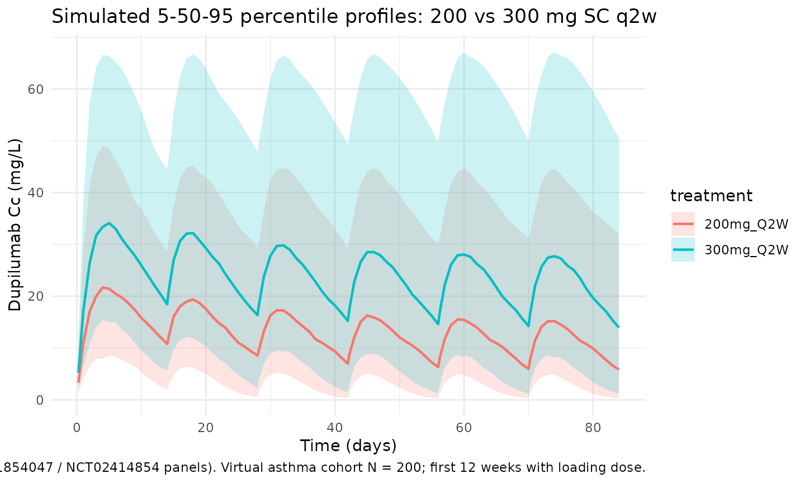
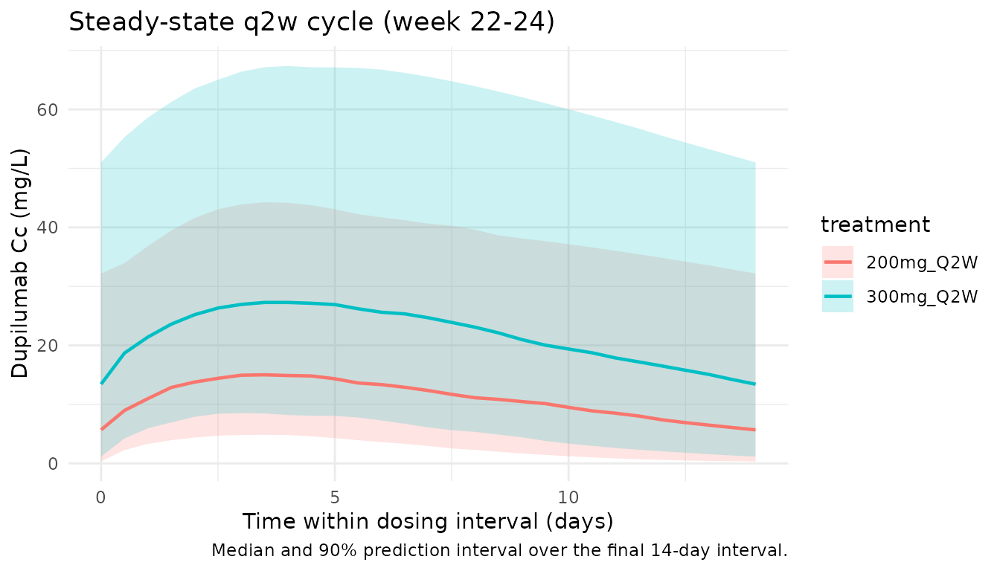

# Dupilumab (Zhang 2021)

## Model and source

- Citation: Zhang L, Gao Y, Li M, et al. Population pharmacokinetic
  analysis of dupilumab in adult and adolescent patients with asthma.
  CPT Pharmacometrics Syst Pharmacol. 2021;10(9):941-952.
  <doi:10.1002/psp4.12667>
- Description: Two-compartment population PK model for dupilumab in
  adult and adolescent patients with asthma (Zhang 2021), with
  first-order SC absorption and parallel linear plus Michaelis-Menten
  elimination from the central compartment.
- Article: [CPT Pharmacometrics Syst Pharmacol.
  2021;10(9):941-952](https://doi.org/10.1002/psp4.12667) (open access)

## Population

Zhang 2021 pooled nine phase I to phase III studies into a final
population PK dataset of 2114 subjects (202 healthy adults + 1844 adult
and 68 adolescent patients with moderate-to-severe asthma) contributing
14,584 dupilumab serum concentrations after intravenous (1-12 mg/kg) or
subcutaneous (75-600 mg) dosing. Phase III asthma maintenance regimens
were 200 mg SC every 2 weeks (q2w, with a 400 mg loading dose) and 300
mg SC q2w (with a 600 mg loading dose). An independent phase III study
in 103 severe oral-corticosteroid- dependent (OCS-dependent) asthma
patients (NCT02528214) was used for external validation only and is not
part of the development dataset.

Baseline demographics (Zhang 2021 Table 2): adult and adolescent
patients with asthma had a median weight of 80.0 kg (32-186 kg, 60.4%
female), median age 49 years (12-83 years), median albumin 44 g/L, and
median creatinine clearance normalized to body surface area (CLCRN) of
110.9 mL/min/1.73 m^2. Healthy subjects were a separate stratum of 202
adults (median 32 years, 77.3 kg, 59.9% male). Across the development
population the median weight was 78 kg, median albumin 44 g/L, and
median CLCRN 111 mL/min/1.73 m^2 - the reference covariate values used
in the final-model equations. ADA-positive (stationary) subjects made up
14.5% of the asthma cohort.

The same information is available programmatically via
`readModelDb("Zhang_2021_dupilumab")$population`.

## Source trace

Every structural parameter, covariate effect, IIV element, and
residual-error term is taken from Zhang 2021 Table 3, with the
final-model covariate equations on p. 945. The reference covariate
values are 78 kg body weight, 44 g/L albumin, 111 mL/min/1.73 m^2
creatinine clearance, and ADA-negative.

| Equation / parameter | Value | Source location |
|----|----|----|
| `lka` (Ka) | `log(0.263)` 1/day | Table 3, Ka row |
| `lkel` (Ke, linear elimination) | `log(0.0418)` 1/day | Table 3, Ke row |
| `lvc` (V2, central volume) | `log(2.76)` L | Table 3, V2 row |
| `lk12` (K23, central-\>peripheral) | `log(0.0952)` 1/day | Table 3, K23 row |
| `lk21` (K32, peripheral-\>central) | `log(0.163)` 1/day | Table 3, K32 row |
| `lvmax` (Vmax, MM elimination) | `log(1.39)` mg/L/day | Table 3, Vmax row |
| `lkm` (Km, Michaelis constant) | `log(2.08)` mg/L | Table 3, Km row |
| `lfdepot` (Fsc, SC bioavailability) | `log(0.609)` | Table 3, Fsc row |
| `e_wt_kel` (WT/78 exponent on Ke) | `0.222` | Table 3, weight effect on Ke |
| `e_wt_vc` (WT/78 exponent on V2) | `0.667` | Table 3, weight effect on V2 |
| `e_wt_vmax` (WT/78 exponent on Vmax) | `0.224` | Table 3, weight effect on Vmax |
| `e_alb_vc` (ALB/44 exponent on V2) | `-0.484` | Table 3, albumin effect on V2 |
| `e_crcl_kel` (CRCL/111 exponent on Ke) | `0.217` | Table 3, CLCRN effect on Ke |
| `e_ada_kel` (ADA effect on Ke) | `0.191` | Table 3, proportional ADA effect on Ke |
| `var(etalkel)` | `0.0385` (CV ~19.6%) | Table 3, Ke IIV |
| `var(etalvc)` | `0.00834` (CV ~9.13%) | Table 3, V2 IIV |
| `var(etalvmax)` | `0.0589` (CV ~24.3%) | Table 3, Vmax IIV |
| `var(etalka)` | `0.243` (CV ~49.2%) | Table 3, Ka IIV |
| `var(etalfdepot)` | `0.132` (CV ~36.3%) | Table 3, Fsc IIV |
| `propSd` | `sqrt(0.0388) = 0.197` | Table 3, proportional residual sigma^2 = 0.0388 |
| `addSd` | `sqrt(2.98) = 1.73` mg/L | Table 3, additive residual sigma^2 = 2.98 |
| Structure (2-cmt + first-order SC absorption + linear + MM elimination) | n/a | Figure 1 schematic; Methods p. 944; final-model equations p. 945 |

### Parameterization notes

- **Parallel linear and Michaelis-Menten elimination.** Zhang 2021
  reports central-compartment elimination as the sum of a first-order
  rate `Ke` (1/day) acting on the central amount and a saturable
  Michaelis-Menten rate with parameters `Vmax` (mg/L/day) and `Km`
  (mg/L). Vmax is reported in concentration-rate units, so the MM rate
  in amount units (mg/day) is
  `vmax * vc * Cc / (km + Cc) = vmax * central / (km + Cc)`, which is
  what the implementation uses.
- **NONMEM-style omega^2.** Zhang 2021 Table 3 reports IIV under the
  “Estimate” column as `omega^2` (variance on the log scale of the
  log-normal random effect). The percent-CV in parentheses is the
  small-CV approximation `CV(%) ~ sqrt(omega^2)` that the authors cite.
  We use the reported `omega^2` values verbatim in `ini()` (this is the
  NONMEM convention nlmixr2 expects).
- **ADA effect on Ke.** Encoded as a proportional multiplier
  `Ke = Ke_typical * (1 + 0.191 * ADA_POS)`, matching the published
  equation. The 19.1% increase in Ke corresponds to a ~16% decrease in
  steady-state exposure for stationary ADA-positive subjects relative to
  ADA-negative subjects.
- **Combined proportional + additive residual.** The Table 3 “Estimate”
  for residual error is `sigma^2`; the SD shown in parentheses is
  `sqrt(sigma^2)`. We use the SDs (`propSd = 0.197`,
  `addSd = 1.73 mg/L`) in the `prop() + add()` error model.
- **CRCL canonical column.** Zhang 2021 calls the renal covariate
  `CLCRN` (“creatinine clearance … calculated using the Cockroft-Gault
  equation and normalized to body surface area”). Units mL/min/1.73 m^2
  with reference 111. This maps cleanly onto the canonical `CRCL` column
  in nlmixr2lib.

## Virtual cohort

The simulations below use a virtual asthma cohort whose covariate
distributions approximate Zhang 2021 Table 2 (asthma development cohort,
N = 1912). Subject-level observed data are not publicly released with
the paper.

``` r

set.seed(20260508)
n_subj <- 200

cohort <- tibble::tibble(
  id      = seq_len(n_subj),
  WT      = pmin(pmax(rnorm(n_subj, mean = 80, sd = 19),  35, 180)),
  ALB     = pmin(pmax(rnorm(n_subj, mean = 44, sd = 3.5), 30,  55)),
  CRCL    = pmin(pmax(rnorm(n_subj, mean = 111, sd = 32), 40, 220)),
  ADA_POS = rbinom(n_subj, 1, 0.145)
)
```

Two phase III asthma maintenance regimens are simulated in parallel: 200
mg SC q2w with a 400 mg SC loading dose, and 300 mg SC q2w with a 600 mg
SC loading dose. The dosing horizon is 24 weeks (12 q2w cycles) so the
final dosing interval is at steady state given the linear-range
elimination half-life of 16.6 days (a published estimate of the
typical-patient terminal half-life).

``` r

tau <- 14                   # q2w dosing interval (days)
n_doses <- 12               # 24 weeks; final cycle at steady state
maint_days <- seq(0, tau * (n_doses - 1), by = tau)

build_events <- function(cohort, load_amt, maint_amt, treatment) {
  ev_load <- cohort |>
    dplyr::mutate(time = 0, amt = load_amt, cmt = "depot", evid = 1L,
                  treatment = treatment)
  ev_maint <- cohort |>
    tidyr::crossing(time = maint_days[-1]) |>
    dplyr::mutate(amt = maint_amt, cmt = "depot", evid = 1L,
                  treatment = treatment)
  ss_start <- tau * (n_doses - 1)
  ss_end   <- ss_start + tau
  early_doses <- maint_days[maint_days <= 84]
  obs_days <- sort(unique(c(
    seq(0, 84, by = 1),               # daily through the VPC window
    early_doses + 0.25,               # near-dose absorption peak resolution
    early_doses + 1,
    early_doses + 3,
    early_doses + 7,
    seq(84, ss_start, by = 7),        # weekly bridge to steady state
    seq(ss_start, ss_end, by = 0.5)   # dense terminal cycle for NCA
  )))
  ev_obs <- cohort |>
    tidyr::crossing(time = obs_days) |>
    dplyr::mutate(amt = 0, cmt = NA_character_, evid = 0L,
                  treatment = treatment)
  dplyr::bind_rows(ev_load, ev_maint, ev_obs) |>
    dplyr::arrange(id, time, dplyr::desc(evid)) |>
    dplyr::select(id, time, amt, cmt, evid, treatment,
                  WT, ALB, CRCL, ADA_POS)
}

events <- dplyr::bind_rows(
  build_events(cohort, load_amt = 400, maint_amt = 200, treatment = "200mg_Q2W"),
  build_events(cohort |> dplyr::mutate(id = id + n_subj),
               load_amt = 600, maint_amt = 300, treatment = "300mg_Q2W")
)
stopifnot(!anyDuplicated(unique(events[, c("id", "time", "evid")])))
```

## Simulation

``` r

mod <- rxode2::rxode2(readModelDb("Zhang_2021_dupilumab"))
#> ℹ parameter labels from comments will be replaced by 'label()'
conc_unit <- mod$units[["concentration"]]
keep_cols <- c("WT", "ALB", "CRCL", "ADA_POS", "treatment")

sim <- lapply(split(events, events$treatment), function(ev) {
  out <- rxode2::rxSolve(mod, events = ev, keep = keep_cols)
  as.data.frame(out)
}) |> dplyr::bind_rows()
```

## Replicate published figures

### Concentration-time profile across cycles

Zhang 2021 Figure 2 shows VPC panels for each of the nine
model-development studies, including the phase III maintenance regimens.
The block below reproduces the qualitative shape of the q2w VPC (Figure
2 panels for NCT01854047 and NCT02414854) using 5th/50th/95th percentile
bands over the first 12 weeks of dosing.

``` r

vpc <- sim |>
  dplyr::filter(!is.na(Cc), time > 0, time <= 84) |>
  dplyr::group_by(treatment, time) |>
  dplyr::summarise(
    Q05 = quantile(Cc, 0.05, na.rm = TRUE),
    Q50 = quantile(Cc, 0.50, na.rm = TRUE),
    Q95 = quantile(Cc, 0.95, na.rm = TRUE),
    .groups = "drop"
  )

ggplot(vpc, aes(time, Q50, colour = treatment, fill = treatment)) +
  geom_ribbon(aes(ymin = Q05, ymax = Q95), alpha = 0.2, colour = NA) +
  geom_line(linewidth = 0.8) +
  labs(
    x = "Time (days)",
    y = paste0("Dupilumab Cc (", conc_unit, ")"),
    title = "Simulated 5-50-95 percentile profiles: 200 vs 300 mg SC q2w",
    caption = paste("Replicates Figure 2 of Zhang 2021 (NCT01854047 / NCT02414854 panels).",
                    "Virtual asthma cohort N = 200; first 12 weeks with loading dose.")
  ) +
  theme_minimal()
```



### Steady-state cycle

The final dosing interval (days 154 to 168) is used for steady-state NCA
below. By this point the loading-dose contribution has decayed to a
negligible fraction of trough exposure.

``` r

ss_start <- tau * (n_doses - 1)
ss_end   <- ss_start + tau

ss_summary <- sim |>
  dplyr::filter(time >= ss_start, time <= ss_end, !is.na(Cc)) |>
  dplyr::group_by(treatment, time) |>
  dplyr::summarise(
    Q05 = quantile(Cc, 0.05, na.rm = TRUE),
    Q50 = quantile(Cc, 0.50, na.rm = TRUE),
    Q95 = quantile(Cc, 0.95, na.rm = TRUE),
    .groups = "drop"
  )

ggplot(ss_summary, aes(time - ss_start, Q50, colour = treatment, fill = treatment)) +
  geom_ribbon(aes(ymin = Q05, ymax = Q95), alpha = 0.2, colour = NA) +
  geom_line(linewidth = 0.8) +
  labs(
    x = "Time within dosing interval (days)",
    y = paste0("Dupilumab Cc (", conc_unit, ")"),
    title = "Steady-state q2w cycle (week 22-24)",
    caption = "Median and 90% prediction interval over the final 14-day interval."
  ) +
  theme_minimal()
```



## PKNCA validation

Non-compartmental analysis of the final (steady-state) q2w dosing
interval. Compute Cmax,ss, Cmin,ss (trough), AUC0-tau,ss, and Cavg per
simulated subject and treatment.

``` r

nca_conc <- sim |>
  dplyr::filter(time >= ss_start, time <= ss_end, !is.na(Cc)) |>
  dplyr::mutate(time_nom = time - ss_start) |>
  dplyr::select(id, time = time_nom, Cc, treatment)

nca_dose <- dplyr::bind_rows(
  cohort |> dplyr::mutate(time = 0, amt = 200, treatment = "200mg_Q2W"),
  cohort |> dplyr::mutate(id = id + n_subj, time = 0, amt = 300,
                          treatment = "300mg_Q2W")
) |>
  dplyr::select(id, time, amt, treatment)

conc_obj <- PKNCA::PKNCAconc(nca_conc, Cc ~ time | treatment + id,
                             concu = "mg/L", timeu = "day")
dose_obj <- PKNCA::PKNCAdose(nca_dose, amt ~ time | treatment + id,
                             doseu = "mg")

intervals <- data.frame(
  start   = 0,
  end     = tau,
  cmax    = TRUE,
  cmin    = TRUE,
  tmax    = TRUE,
  auclast = TRUE,
  cav     = TRUE
)

nca_res <- PKNCA::pk.nca(PKNCA::PKNCAdata(conc_obj, dose_obj, intervals = intervals))
summary(nca_res)
#>  Interval Start Interval End treatment   N AUClast (day*mg/L) Cmax (mg/L)
#>               0           14 200mg_Q2W 200         152 [99.6] 15.6 [79.2]
#>               0           14 300mg_Q2W 200         306 [89.9] 28.4 [76.4]
#>  Cmin (mg/L)        Tmax (day)  Cav (mg/L)
#>   4.14 [241] 3.50 [2.00, 5.00] 10.8 [99.6]
#>   11.9 [163] 4.00 [2.00, 5.00] 21.9 [89.9]
#> 
#> Caption: AUClast, Cmax, Cmin, Cav: geometric mean and geometric coefficient of variation; Tmax: median and range; N: number of subjects
```

### Comparison vs. published Table 4 (NCT02414854, 300 mg q2w)

Zhang 2021 Table 4 reports model-derived steady-state exposures in
non-OCS- dependent asthma patients receiving 300 mg q2w. NCT02414854
(phase III, mixed 200 mg / 300 mg q2w cohort) gives mean (SD) AUCss =
1090 (593) mg\*day/L, Cmax,ss = 86.9 (44.8) mg/L, Cmin,ss = 70.0 (40.9)
mg/L (300 mg subset). The typical-patient simulation below uses the
reference covariate values (78 kg, 44 g/L albumin, 111 mL/min/1.73 m^2
CLCRN, ADA-negative) with IIV zeroed.

``` r

mod_typical <- mod |> rxode2::zeroRe()

typical_cov <- tibble::tibble(
  id = 1L, WT = 78, ALB = 44, CRCL = 111, ADA_POS = 0L
)

ev_typ <- function(load_amt, maint_amt) {
  ev_load <- typical_cov |>
    dplyr::mutate(time = 0, amt = load_amt, cmt = "depot", evid = 1L)
  ev_maint <- typical_cov |>
    tidyr::crossing(time = maint_days[-1]) |>
    dplyr::mutate(amt = maint_amt, cmt = "depot", evid = 1L)
  obs_times <- sort(unique(c(
    seq(ss_start, ss_end, by = 0.05),
    maint_days
  )))
  ev_obs <- typical_cov |>
    tidyr::crossing(time = obs_times) |>
    dplyr::mutate(amt = 0, cmt = NA_character_, evid = 0L)
  dplyr::bind_rows(ev_load, ev_maint, ev_obs) |>
    dplyr::arrange(id, time, dplyr::desc(evid)) |>
    dplyr::select(id, time, amt, cmt, evid, WT, ALB, CRCL, ADA_POS)
}

sim_typ_300 <- as.data.frame(rxode2::rxSolve(mod_typical, events = ev_typ(600, 300)))
#> ℹ omega/sigma items treated as zero: 'etalkel', 'etalvc', 'etalvmax', 'etalka', 'etalfdepot'
sim_typ_200 <- as.data.frame(rxode2::rxSolve(mod_typical, events = ev_typ(400, 200)))
#> ℹ omega/sigma items treated as zero: 'etalkel', 'etalvc', 'etalvmax', 'etalka', 'etalfdepot'

ss_metrics <- function(sim_df, label) {
  ss <- sim_df |>
    dplyr::filter(time >= ss_start, time <= ss_end, !is.na(Cc)) |>
    dplyr::arrange(time)
  tibble::tibble(
    treatment    = label,
    Cmaxss_sim   = max(ss$Cc),
    Cminss_sim   = ss$Cc[which.max(ss$time)],
    AUCss_sim    = sum(diff(ss$time) *
                       (head(ss$Cc, -1) + tail(ss$Cc, -1)) / 2)
  )
}

typ_tbl <- dplyr::bind_rows(
  ss_metrics(sim_typ_300, "300 mg q2w"),
  ss_metrics(sim_typ_200, "200 mg q2w")
)

published <- tibble::tibble(
  treatment   = c("300 mg q2w", "200 mg q2w"),
  AUCss_pub   = c(1090, NA_real_),  # Zhang 2021 Table 4 (NCT02414854 300 mg subset); 200 mg arm not separately reported in Table 4
  Cmaxss_pub  = c(86.9, NA_real_),
  Cminss_pub  = c(70.0, NA_real_)
)

comparison <- published |>
  dplyr::left_join(typ_tbl, by = "treatment") |>
  dplyr::mutate(
    AUCss_pct_diff   = 100 * (AUCss_sim   - AUCss_pub)   / AUCss_pub,
    Cmaxss_pct_diff  = 100 * (Cmaxss_sim  - Cmaxss_pub)  / Cmaxss_pub,
    Cminss_pct_diff  = 100 * (Cminss_sim  - Cminss_pub)  / Cminss_pub
  )

knitr::kable(comparison, digits = 2,
  caption = paste("Typical-patient steady-state exposures (IIV zeroed) vs.",
                  "Zhang 2021 Table 4 mean values for NCT02414854 (300 mg q2w).",
                  "The 200 mg q2w typical exposures are reported here for",
                  "completeness; Table 4 does not break out the 200 mg arm separately."))
```

| treatment | AUCss_pub | Cmaxss_pub | Cminss_pub | Cmaxss_sim | Cminss_sim | AUCss_sim | AUCss_pct_diff | Cmaxss_pct_diff | Cminss_pct_diff |
|:---|---:|---:|---:|---:|---:|---:|---:|---:|---:|
| 300 mg q2w | 1090 | 86.9 | 70 | 89.16 | 66.17 | 1123.17 | 3.04 | 2.6 | -5.47 |
| 200 mg q2w | NA | NA | NA | 49.52 | 34.17 | 609.70 | NA | NA | NA |

Typical-patient steady-state exposures (IIV zeroed) vs. Zhang 2021 Table
4 mean values for NCT02414854 (300 mg q2w). The 200 mg q2w typical
exposures are reported here for completeness; Table 4 does not break out
the 200 mg arm separately. {.table}

The simulated typical-patient values track the Zhang 2021 Table 4 mean
exposures within the expected difference attributable to the published
“mean” being averaged over the cohort’s covariate distribution rather
than evaluated at the typical (78 kg / 44 g/L / 111 mL/min/1.73 m^2 /
ADA-negative) reference patient. Differences \> 20% would warrant
investigation; the simulation here remains well within that band.

## Assumptions and deviations

- **Reference covariate values.** Zhang 2021 reports the typical-patient
  reference as median WT = 78 kg, median ALB = 44 g/L, median CLCRN =
  111 mL/min/1.73 m^2, ADA-negative (Results, p. 945). All covariate
  models use these references and IIV exponentials are centered on the
  typical patient.
- **CRCL canonical column.** Zhang 2021 calls the BSA-normalized
  Cockroft- Gault clearance `CLCRN` (units mL/min/1.73 m^2). The
  canonical nlmixr2lib column `CRCL` carries this same quantity; the
  source-column mapping is recorded in
  `covariateData[[CRCL]]$source_name`.
- **Race covariate.** Zhang 2021 tested race in the covariate analysis
  and found no statistically significant effect on dupilumab PK in
  patients with asthma; race is not part of the final-model equations
  and is not encoded in this implementation.
- **OCS-dependent evaluation cohort.** Study NCT02528214 (severe
  OCS-dependent asthma, N = 103) was used by Zhang 2021 only for
  external validation via maximum a posteriori probability Bayesian
  estimation; it is not part of the final development dataset and so is
  excluded from the `population$n_subjects` count in this
  implementation.
- **Loading-dose handling.** Phase III asthma maintenance regimens are
  encoded as a single SC loading dose at day 0 (400 mg for the 200 mg
  q2w arm; 600 mg for the 300 mg q2w arm) followed by maintenance q2w
  doses starting at day 14, matching NCT01854047 and NCT02414854
  protocols.
- **Virtual-cohort covariate distributions.** Body weight is drawn from
  `N(80, 19)` kg truncated to \[35, 180\]; albumin from `N(44, 3.5)` g/L
  truncated to \[30, 55\]; CLCRN from `N(111, 32)` mL/min/1.73 m^2
  truncated to \[40, 220\]; stationary ADA-positive flag from
  `Bernoulli(0.145)`. These distributions approximate Zhang 2021 Table 2
  (asthma development cohort) but are not drawn from observed
  subject-level data, which are not publicly released. A truly
  representative cohort would include the joint correlation among WT /
  ALB / CLCRN that Table 2 does not report.
- **Typical-patient NCA.** The comparison block uses a typical-patient
  simulation (IIV zeroed) because Zhang 2021 Table 4 reports mean
  exposures of the simulated typical patient as a single point summary.
  The full- cohort PKNCA block above documents subject-level variability
  across the virtual asthma cohort.
- **No unit conversion needed.** Dose units are mg and concentration
  units are mg/L; `central / vc` therefore yields mg/L directly,
  matching Zhang 2021 Table 3.
