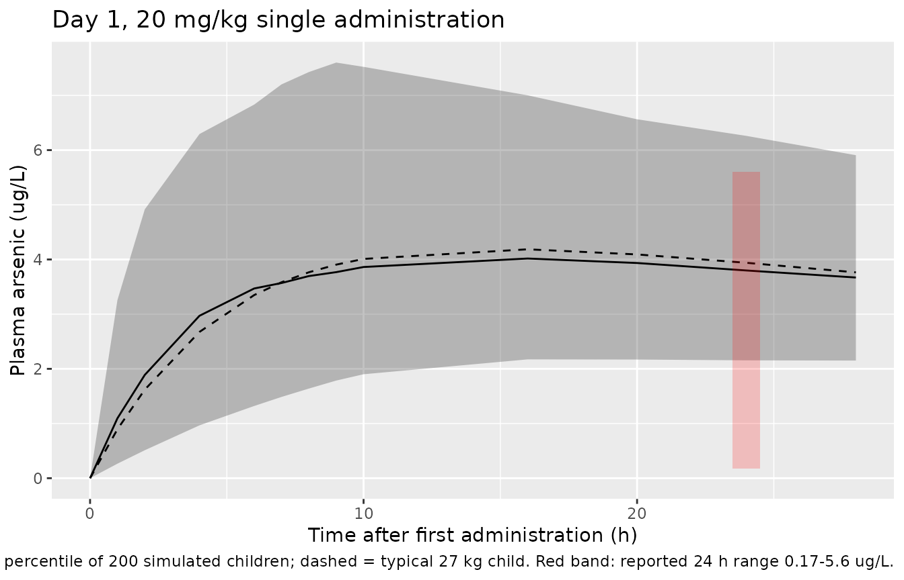

# Realgar-Indigo Naturalis Formula (Zhang 2021)

## Model and source

- Citation: Zhang L, Yang XM, Chen J, Hu L, Yang F, Zhou Y, Zhao BB,
  Zhao W, Zhu XF. Population Pharmacokinetics and Safety of Oral
  Tetra-Arsenic Tetra-Sulfide Formula in Pediatric Acute Promyelocytic
  Leukemia. Drug Des Devel Ther. 2021;15:1633-1640.
  <doi:10.2147/DDDT.S305244>
- Description: One-compartment population PK model with first-order
  absorption and first-order elimination for total plasma arsenic after
  oral tetra-arsenic tetra-sulfide (As4S4) formula (Realgar-Indigo
  Naturalis Formula, RIF) given three times daily to Chinese children
  with acute promyelocytic leukemia aged 4-14 years (Zhang 2021). Dose
  is the mass of RIF formula (mg) and the observation is total arsenic
  concentration (ug/L), so CL/F and V/F are apparent values relative to
  the formula dose. Apparent oral clearance CL/F scales with body weight
  as a power function with an estimated exponent of 0.629 referenced to
  the 27 kg cohort median; V/F and ka carry no covariates. Very slow
  absorption (ka 0.013 1/h, flip-flop kinetics). Diagonal exponential
  inter-individual variability on ka, CL/F and V/F; additive residual
  error.
- Article: <https://doi.org/10.2147/DDDT.S305244>

The oral tetra-arsenic tetra-sulfide (As4S4) formula studied here is the
Realgar-Indigo Naturalis Formula (RIF). Doses are expressed as mg of the
formula and the measured analyte is total plasma arsenic (ug/L), so the
clearance and volume are apparent values relative to the formula dose. A
literature check on 2026-09-28 (EuropePMC) found no erratum or
correction for this article.

## Population

Twelve Chinese children with acute promyelocytic leukemia (11 newly
diagnosed, 1 relapsed) were studied at a single centre in Tianjin
between July 2016 and July 2019 (Zhang 2021 Table 1;
ChiCTR-OIC-16010014). Median age was 8 years (range 4-14) and median
body weight 27 kg (range 16-63; mean 30.03, SD 14.06). All patients
received RIF at 60 mg/kg/day divided three times daily (median 540 mg
per administration, range 320-1350 mg) together with ATRA, either as
maintenance (regimen A, n = 7) or consolidation (regimen B, n = 5)
therapy. Sex distribution was not reported. The 107 arsenic
concentrations modelled ranged from 0.1 to 75.0 ug/L.

## Source trace

| Element | Value | Source |
|----|----|----|
| Structure | one compartment, first-order absorption and elimination | Results, ‘Population Pharmacokinetic Analysis’ |
| `lka` | log(0.013) 1/h | Table 2, theta1 |
| `lcl` | log(1380) L/h at 27 kg | Table 2, theta2 |
| `lvc` | log(7080) L | Table 2, theta3 |
| `e_wt_cl` | 0.629 on (WT/27) | Table 2, theta4 and ‘F WT-CL = (CW/27)^theta4’ |
| `etalka` | 0.353^2 | Table 2, IIV Ka |
| `etalcl` | 0.167^2 | Table 2, IIV CL |
| `etalvc` | 0.787^2 | Table 2, IIV V |
| `addSd` | 3.619 ug/L | Table 2, residual variability (scale: see below) |
| Covariate screen | WT, age, creatinine, ALB, AST, ALT; only WT retained | Methods and Results |
| Cc = central / vc x 1000 | mg/L to ug/L | units of Table 1 dose and reported concentrations |

## Model

``` r

mod <- readModelDb("Zhang_2021_realgar_indigo")
ui <- rxode2::rxode2(mod)
#> ℹ parameter labels from comments will be replaced by 'label()'
ui
#>  ── rxode2-based free-form 2-cmt ODE model ────────────────────────────────────── 
#>  ── Initalization: ──  
#> Fixed Effects ($theta): 
#>       lka       lcl       lvc   e_wt_cl     addSd 
#> -4.342806  7.229839  8.865029  0.629000  3.619000 
#> 
#> Omega ($omega): 
#>          etalka   etalcl   etalvc
#> etalka 0.124609 0.000000 0.000000
#> etalcl 0.000000 0.027889 0.000000
#> etalvc 0.000000 0.000000 0.619369
#> attr(,"lotriLabels")
#> [1] "Table 2 IIV Ka 0.353 (RSE 48.2%; bootstrap median 0.339, 5th-95th 0.075-0.445) -> 0.353^2"
#> [2] "Table 2 IIV CL 0.167 (RSE 39.3%; bootstrap median 0.139, 5th-95th 0.078-0.196) -> 0.167^2"
#> [3] "Table 2 IIV V 0.787 (RSE 52.6%; bootstrap median 0.781, 5th-95th 0.023-1.148) -> 0.787^2" 
#> attr(,"lotriFix")
#>        etalka etalcl etalvc
#> etalka  FALSE  FALSE  FALSE
#> etalcl  FALSE  FALSE  FALSE
#> etalvc  FALSE  FALSE  FALSE
#> 
#> States ($state or $stateDf): 
#>   Compartment Number Compartment Name
#> 1                  1            depot
#> 2                  2          central
#>  ── μ-referencing ($muRefTable): ──  
#>   theta    eta level
#> 1   lka etalka    id
#> 2   lcl etalcl    id
#> 3   lvc etalvc    id
#> 
#>  ── Model (Normalized Syntax): ── 
#> function() {
#>     compartmentData <- list(depot = list(analyte = "Realgar-Indigo Naturalis Formula (As4S4 formula)", 
#>         units = "mg", specimen = "administration site", verified = TRUE), 
#>         central = list(analyte = "Realgar-Indigo Naturalis Formula (As4S4 formula) dose-equivalent, observed as total arsenic", 
#>             units = "mg", specimen = "plasma", verified = TRUE))
#>     covariateData <- list(WT = list(description = "Current body weight", 
#>         units = "kg", type = "continuous", reference_category = NULL, 
#>         notes = "Power effect on CL/F, (WT/27)^0.629, referenced to the cohort median weight of 27 kg (Table 2 'F WT-CL = (CW/27)^theta4'). Cohort mean (SD) 30.03 (14.06) kg, median 27 kg, range 16.0-63.0 kg (Table 1). Treated as time-fixed.", 
#>         source_name = "CW"))
#>     covariatesDataExcluded <- list(AGE = list(description = "Age", 
#>         units = "years", type = "continuous", notes = "Screened on the PK parameters but not retained in the final model (Results, 'Population Pharmacokinetic Analysis'). Cohort median 8 years, range 4-14 (Table 1)."), 
#>         CREAT = list(description = "Serum creatinine", units = "umol/L", 
#>             type = "continuous", notes = "Screened but not retained. Cohort median 32.6 umol/L, range 18.4-58.4 (Table 1)."), 
#>         ALB = list(description = "Serum albumin", units = "g/L", 
#>             type = "continuous", notes = "Screened but not retained. Cohort median 43.8 g/L, range 40.4-49.6 (Table 1)."), 
#>         AST = list(description = "Aspartate aminotransferase", 
#>             units = "U/L", type = "continuous", notes = "Screened but not retained. Cohort median 26.2 U/L, range 17.7-38.0 (Table 1)."), 
#>         ALT = list(description = "Alanine aminotransferase", 
#>             units = "U/L", type = "continuous", notes = "Screened but not retained. Cohort median 15.2 U/L (Table 1 prints the range as '9.0-4.4', an evident typo)."))
#>     description <- "One-compartment population PK model with first-order absorption and first-order elimination for total plasma arsenic after oral tetra-arsenic tetra-sulfide (As4S4) formula (Realgar-Indigo Naturalis Formula, RIF) given three times daily to Chinese children with acute promyelocytic leukemia aged 4-14 years (Zhang 2021). Dose is the mass of RIF formula (mg) and the observation is total arsenic concentration (ug/L), so CL/F and V/F are apparent values relative to the formula dose. Apparent oral clearance CL/F scales with body weight as a power function with an estimated exponent of 0.629 referenced to the 27 kg cohort median; V/F and ka carry no covariates. Very slow absorption (ka 0.013 1/h, flip-flop kinetics). Diagonal exponential inter-individual variability on ka, CL/F and V/F; additive residual error."
#>     population <- list(species = "human", n_subjects = 12L, n_studies = 1L, 
#>         n_observations = 107L, age_range = "4-14 years", age_median = "8 years", 
#>         age_mean_sd = "7.73 (3.169) years", weight_range = "16.0-63.0 kg", 
#>         weight_median = "27 kg", weight_mean_sd = "30.03 (14.06) kg", 
#>         sex_female_pct = NA_real_, race_ethnicity = "Chinese (12 of 12; Table 1).", 
#>         disease_state = "Pediatric acute promyelocytic leukemia (PML/RARa-positive) in complete remission: 11 newly diagnosed patients and 1 relapsed patient. Seven received RIF in maintenance therapy (regimen A) and five in consolidation therapy (regimen B), together with ATRA; patients with abnormal renal or liver function were excluded.", 
#>         dose_range = "RIF 60 mg/kg/day divided three times daily (20 mg/kg per administration); actual per-administration dose median 540 mg, range 320-1350 mg (Table 1).", 
#>         regions = "China (Institute of Hematology and Blood Diseases Hospital, Tianjin).", 
#>         sampling = "Pre-dose and 1, 2, 4, 6, 7, 8, 9, 10, 16, 20, 24 and 28 h after administration on day 1; weekly pre-dose samples from day 8 to day 28; four samples over the 2 weeks after stopping RIF.", 
#>         assay = "Total plasma arsenic by ICP-MS (Agilent 7700x); calibration range 0.015-50 ug/L; lower limit of detection 0.015 ug/L. Observed concentrations 0.1-75.0 ug/L.", 
#>         notes = "Single-centre prospective open-label study, July 2016 to July 2019 (ChiCTR-OIC-16010014). NONMEM 7.2, FOCE with interaction. Sex distribution not reported.")
#>     reference <- "Zhang L, Yang XM, Chen J, Hu L, Yang F, Zhou Y, Zhao BB, Zhao W, Zhu XF. Population Pharmacokinetics and Safety of Oral Tetra-Arsenic Tetra-Sulfide Formula in Pediatric Acute Promyelocytic Leukemia. Drug Des Devel Ther. 2021;15:1633-1640. doi:10.2147/DDDT.S305244"
#>     units <- list(time = "h", dosing = "mg", concentration = "ug/L")
#>     vignette <- "Zhang_2021_realgar_indigo"
#>     ini({
#>         lka <- -4.3428059215206
#>         label("Absorption rate constant ka (1/h)")
#>         lcl <- 7.22983877815125
#>         label("Apparent oral clearance CL/F at WT = 27 kg (L/h)")
#>         lvc <- 8.86502918668777
#>         label("Apparent volume of distribution V/F (L)")
#>         e_wt_cl <- 0.629
#>         label("Power exponent of (WT/27) on CL/F (unitless)")
#>         addSd <- c(0, 3.619)
#>         label("Additive residual error (ug/L)")
#>         etalka ~ 0.124609
#>         label("Table 2 IIV Ka 0.353 (RSE 48.2%; bootstrap median 0.339, 5th-95th 0.075-0.445) -> 0.353^2")
#>         etalcl ~ 0.027889
#>         label("Table 2 IIV CL 0.167 (RSE 39.3%; bootstrap median 0.139, 5th-95th 0.078-0.196) -> 0.167^2")
#>         etalvc ~ 0.619369
#>         label("Table 2 IIV V 0.787 (RSE 52.6%; bootstrap median 0.781, 5th-95th 0.023-1.148) -> 0.787^2")
#>     })
#>     model({
#>         ka <- exp(lka + etalka)
#>         cl <- exp(lcl + etalcl) * (WT/27)^e_wt_cl
#>         vc <- exp(lvc + etalvc)
#>         kel <- cl/vc
#>         d/dt(depot) <- -ka * depot
#>         d/dt(central) <- ka * depot - kel * central
#>         Cc <- central/vc * 1000
#>         Cc ~ add(addSd)
#>     })
#> }
```

## Virtual cohort

Individual weights were not published. The cohort below draws weights
from a log-normal distribution matched to the Table 1 mean (30.03 kg)
and SD (14.06 kg), rejecting and redrawing any value outside the
observed 16-63 kg range. The same 200 body weights are used in every
dose arm; the random effects are drawn independently per arm (the
dose-proportionality check below holds them fixed across arms instead).

``` r

set.seed(8071704)
rxode2::rxSetSeed(8071704)
n_sub <- 200
cv_wt <- 14.06 / 30.03
sdlog_wt <- sqrt(log(1 + cv_wt^2))
meanlog_wt <- log(30.03) - sdlog_wt^2 / 2
draw_wt <- function(n) {
  out <- numeric(0)
  while (length(out) < n) {
    x <- stats::rlnorm(n, meanlog_wt, sdlog_wt)
    out <- c(out, x[x >= 16 & x <= 63])
  }
  out[seq_len(n)]
}
cohort <- data.frame(id = seq_len(n_sub), WT = draw_wt(n_sub))
summary(cohort$WT)
#>    Min. 1st Qu.  Median    Mean 3rd Qu.    Max. 
#>   16.27   22.72   28.31   30.51   36.80   62.32
```

## Day-1 profile after the first administration

On day 1 samples were drawn over 28 h after a single administration, and
the Results report plasma arsenic of 0.17-5.6 ug/L 24 h after the dose.
With ka = 0.013 1/h (absorption half-life 53 h) against an elimination
rate constant of 1380/7080 = 0.195 1/h, the kinetics are flip-flop: the
terminal decline reflects absorption, not elimination.

``` r

obs_times <- c(0, 1, 2, 4, 6, 7, 8, 9, 10, 16, 20, 24, 28)
ev_day1 <- bind_rows(
  cohort |> mutate(time = 0, amt = 20 * WT, evid = 1L, cmt = "depot"),
  tidyr::crossing(cohort, time = obs_times) |>
    mutate(amt = 0, evid = 0L, cmt = "central")
) |>
  arrange(id, time, desc(evid))
sim_day1 <- rxode2::rxSolve(mod, events = ev_day1, returnType = "data.frame")
#> ℹ parameter labels from comments will be replaced by 'label()'

typ_day1 <- rxode2::rxSolve(
  rxode2::zeroRe(mod),
  events = ev_day1 |> filter(id == 1) |> mutate(WT = 27, amt = ifelse(evid == 1, 540, 0)),
  returnType = "data.frame"
)
#> ℹ parameter labels from comments will be replaced by 'label()'
#> ℹ omega/sigma items treated as zero: 'etalka', 'etalcl', 'etalvc'
c24_typ <- typ_day1$Cc[typ_day1$time == 24]
c24_typ
#> [1] 3.938973

sim_day1 |>
  group_by(time) |>
  summarise(
    p05 = quantile(Cc, 0.05), p50 = median(Cc), p95 = quantile(Cc, 0.95),
    .groups = "drop"
  ) |>
  ggplot(aes(time, p50)) +
  geom_ribbon(aes(ymin = p05, ymax = p95), alpha = 0.3) +
  geom_line() +
  geom_line(data = typ_day1, aes(time, Cc), linetype = 2) +
  annotate("rect", xmin = 23.5, xmax = 24.5, ymin = 0.17, ymax = 5.6, alpha = 0.2, fill = "red") +
  labs(
    x = "Time after first administration (h)", y = "Plasma arsenic (ug/L)",
    title = "Day 1, 20 mg/kg single administration",
    caption = "Median and 5th-95th percentile of 200 simulated children; dashed = typical 27 kg child. Red band: reported 24 h range 0.17-5.6 ug/L."
  )
```



``` r


# The typical 27 kg child sits inside the reported 24 h range. Three
# administrations in the first 24 h would put it at about 12 ug/L, outside
# the range, which supports reading the day-1 samples as a single dose.
stopifnot(c24_typ > 0.17, c24_typ < 5.6)
```

## Steady state at 30, 45 and 60 mg/kg/day

The Monte Carlo simulation in the Results reports median steady-state
trough concentrations of 25.38, 38.17 and 50.66 ug/L for RIF 30, 45 and
60 mg/kg/day given three times daily (10, 15 and 20 mg/kg per
administration). Steady state is imposed with `ss = 1`, so the
absorption half-life of about two days does not require a long loading
period.

``` r

arms <- data.frame(
  treatment = c("30 mg/kg/d", "45 mg/kg/d", "60 mg/kg/d"),
  mg_per_kg = c(10, 15, 20)
)
tau <- 8
ss_times <- seq(0, tau, by = 0.5)
ev_ss <- bind_rows(lapply(seq_len(nrow(arms)), function(i) {
  cohort_i <- cohort |> mutate(id = id + (i - 1) * n_sub, treatment = arms$treatment[i])
  bind_rows(
    cohort_i |> mutate(
      time = 0, amt = arms$mg_per_kg[i] * WT, ii = tau, ss = 1L,
      evid = 1L, cmt = "depot"
    ),
    tidyr::crossing(cohort_i, time = ss_times) |>
      mutate(amt = 0, ii = 0, ss = 0L, evid = 0L, cmt = "central")
  )
})) |>
  arrange(id, time, desc(evid))

sim_ss <- rxode2::rxSolve(
  mod,
  events = ev_ss, returnType = "data.frame",
  rtol = 1e-10, atol = 1e-12, ssRtol = 1e-10, ssAtol = 1e-12,
  keep = "treatment"
)
trough <- sim_ss |>
  filter(time == 0) |>
  group_by(treatment) |>
  summarise(median_cmin = median(Cc), .groups = "drop") |>
  mutate(published = c(25.38, 38.17, 50.66), pct_diff = 100 * (median_cmin / published - 1))
knitr::kable(
  trough |>
    rename(
      "Regimen" = treatment, "Simulated median Css,min (ug/L)" = median_cmin,
      "Published median (ug/L)" = published, "% diff" = pct_diff
    ),
  digits = 2,
  caption = "Median steady-state trough, simulated vs Zhang 2021 Results."
)
```

| Regimen    | Simulated median Css,min (ug/L) | Published median (ug/L) | % diff |
|:-----------|--------------------------------:|------------------------:|-------:|
| 30 mg/kg/d |                           24.83 |                   25.38 |  -2.18 |
| 45 mg/kg/d |                           37.51 |                   38.17 |  -1.73 |
| 60 mg/kg/d |                           51.46 |                   50.66 |   1.57 |

Median steady-state trough, simulated vs Zhang 2021 Results. {.table}

``` r


# The medians carry the cohort weight distribution, which was not published;
# a mis-transcribed CL/F, dose or unit would move them by far more than 10%.
stopifnot(all(abs(trough$pct_diff) < 10))
```

The published medians are exactly proportional to dose (25.38 / 50.66 =
0.501, 38.17 / 50.66 = 0.7535), as the linear model requires when the
same virtual children receive each dose. The same holds for the model
with etas held fixed across arms:

``` r

# Fixed-eta solve: one set of etas as data columns, typical-value model.
set.seed(20210427)
om <- ui$omega
# The omega matrix is diagonal, so independent normal draws suffice.
eta_draw <- sapply(colnames(om), function(nm) stats::rnorm(n_sub, 0, sqrt(om[nm, nm])))
ev_fix <- ev_ss |>
  mutate(base_id = (id - 1) %% n_sub + 1) |>
  left_join(data.frame(base_id = seq_len(n_sub), eta_draw), by = "base_id") |>
  select(-base_id)
sim_fix <- rxode2::rxSolve(
  rxode2::zeroRe(mod),
  events = ev_fix, returnType = "data.frame",
  rtol = 1e-10, atol = 1e-12, ssRtol = 1e-10, ssAtol = 1e-12,
  keep = "treatment"
)
#> ℹ parameter labels from comments will be replaced by 'label()'
#> ℹ omega/sigma items treated as zero: 'etalka', 'etalcl', 'etalvc'
#> Warning: multi-subject simulation without without 'omega'
med_fix <- sim_fix |>
  filter(time == 0) |>
  group_by(treatment) |>
  summarise(m = median(Cc), .groups = "drop")
# The supplied etas must actually reach the solve: with them, log(CL/F)
# varies beyond what body weight explains.
cl_resid <- sim_fix |>
  filter(time == 0) |>
  mutate(r = log(cl) - log(1380) - 0.629 * log(WT / 27)) |>
  pull(r)
stopifnot(sd(cl_resid) > 0.1)
ratio_30 <- med_fix$m[1] / med_fix$m[3]
ratio_45 <- med_fix$m[2] / med_fix$m[3]
c(ratio_30 = ratio_30, ratio_45 = ratio_45)
#> ratio_30 ratio_45 
#>     0.50     0.75
stopifnot(abs(ratio_30 - 0.5) < 1e-6, abs(ratio_45 - 0.75) < 1e-6)
```

## PKNCA over the steady-state dosing interval

``` r

conc_ss <- sim_ss |>
  filter(!is.na(Cc)) |>
  select(id, time, Cc, treatment)
dose_ss <- ev_ss |>
  filter(evid == 1) |>
  select(id, time, amt, treatment)
conc_obj <- PKNCA::PKNCAconc(conc_ss, Cc ~ time | treatment + id)
dose_obj <- PKNCA::PKNCAdose(dose_ss, amt ~ time | treatment + id)
intervals <- data.frame(
  start = 0, end = tau,
  cmax = TRUE, tmax = TRUE, cmin = TRUE, auclast = TRUE, cav = TRUE
)
nca_res <- suppressMessages(
  PKNCA::pk.nca(PKNCA::PKNCAdata(conc_obj, dose_obj, intervals = intervals))
)
nca_long <- as.data.frame(nca_res)
knitr::kable(summary(nca_res), caption = "Steady-state NCA over one 8 h interval (Cc in ug/L, AUC in ug*h/L).")
```

| start | end | treatment | N | auclast | cmax | cmin | tmax | cav |
|---:|---:|:---|:---|:---|:---|:---|:---|:---|
| 0 | 8 | 30 mg/kg/d | 200 | 198 \[18.6\] | 25.0 \[18.6\] | 24.4 \[18.7\] | 3.50 \[2.00, 4.00\] | 24.8 \[18.6\] |
| 0 | 8 | 45 mg/kg/d | 200 | 301 \[21.2\] | 37.9 \[21.2\] | 37.0 \[21.2\] | 3.50 \[1.50, 4.00\] | 37.6 \[21.2\] |
| 0 | 8 | 60 mg/kg/d | 200 | 418 \[20.6\] | 52.7 \[20.6\] | 51.4 \[20.7\] | 3.50 \[1.50, 4.00\] | 52.2 \[20.6\] |

Steady-state NCA over one 8 h interval (Cc in ug/L, AUC in ug\*h/L).
{.table}

``` r


sim_summary <- nca_long |>
  filter(PPTESTCD %in% c("cmin", "auclast")) |>
  group_by(treatment, PPTESTCD) |>
  summarise(PPORRES = median(PPORRES), .groups = "drop")
reference <- data.frame(
  treatment = arms$treatment,
  cmin = c(25.38, 38.17, 50.66)
)
cmp <- nlmixr2lib::ncaComparisonTable(
  sim_summary, reference,
  by = "treatment", params = "cmin",
  units = c(cmin = "ug/L")
)
knitr::kable(cmp, caption = "Median steady-state Cmin: published Monte Carlo vs simulated.")
```

| NCA parameter | treatment  | Reference | Simulated | % diff |
|:--------------|:-----------|:----------|:----------|:-------|
| Cmin (ug/L)   | 30 mg/kg/d | 25.4      | 24.8      | -2.2%  |
| Cmin (ug/L)   | 45 mg/kg/d | 38.2      | 37.5      | -1.7%  |
| Cmin (ug/L)   | 60 mg/kg/d | 50.7      | 51.5      | +1.6%  |

Median steady-state Cmin: published Monte Carlo vs simulated. {.table}

### AUC and individual clearance

The Results give the individual (post hoc) median and range of
weight-normalised CL/F as 45.26 (35.63-82.18) L/h/kg and state that the
steady-state AUC0-24 “ranged from 0.24 to 0.56 mg*h/L”. A daily AUC at
60 mg/kg/day would be 60 / CL, i.e. 0.73-1.68 mg*h/L over that clearance
range, so the quoted range cannot be a 24 h AUC. It is reproduced
exactly as the AUC over one 8 h interval, 20 mg/kg / CL:

``` r

round(c(auc_low = 20 / 82.18, auc_high = 20 / 35.63), 3)
#>  auc_low auc_high 
#>    0.243    0.561
stopifnot(abs(20 / 82.18 - 0.24) < 0.005, abs(20 / 35.63 - 0.56) < 0.005)

auc60 <- nca_long |>
  filter(treatment == "60 mg/kg/d", PPTESTCD == "auclast") |>
  pull(PPORRES) / 1000
quantile(auc60, c(0.05, 0.5, 0.95))
#>        5%       50%       95% 
#> 0.2984207 0.4222720 0.5619215
# Median simulated interval AUC sits inside the published individual range.
stopifnot(median(auc60) > 0.24, median(auc60) < 0.56)

indiv <- sim_ss |>
  filter(treatment == "60 mg/kg/d", time == 0) |>
  transmute(cl_per_kg = cl / WT, v_per_kg = vc / WT)
data.frame(
  quantity = c("CL/F (L/h/kg)", "V/F (L/kg)"),
  typical_27kg = c(1380 / 27, 7080 / 27),
  simulated_median = c(median(indiv$cl_per_kg), median(indiv$v_per_kg)),
  published_median = c(45.26, 230.37),
  published_range = c("35.63-82.18", "85.96-495.68")
) |>
  knitr::kable(digits = 2, caption = "Weight-normalised apparent CL and V. Published values are post hoc estimates in 12 children.")
```

| quantity      | typical_27kg | simulated_median | published_median | published_range |
|:--------------|-------------:|-----------------:|-----------------:|:----------------|
| CL/F (L/h/kg) |        51.11 |            47.36 |            45.26 | 35.63-82.18     |
| V/F (L/kg)    |       262.22 |           234.28 |           230.37 | 85.96-495.68    |

Weight-normalised apparent CL and V. Published values are post hoc
estimates in 12 children. {.table}

The simulated cohort medians land close to the published post hoc
medians. The published values are empirical-Bayes estimates for only 12
children, and a median of 200 simulated children with a V/F IIV SD of
0.787 moves by several percent between seeds, so this table is shown for
context and not asserted; the steady-state trough medians above are the
quantitative check.

## Residual error scale

Table 2 prints ‘Residual variability (%)’ = 3.619 and the Results text
says a proportional model was chosen. The paper’s own Figure 1B
(observed vs individual predicted concentrations) contradicts a 3.6%
proportional error. The points below were digitised by the maintainers
from Figure 1B (single, well-separated points only; the overlapping
cluster below 5 ug/L is omitted).

``` r

fig1b <- data.frame(
  dv = c(
    4.40, 10.92, 15.44, 8.21, 4.03, 11.53, 13.45, 14.29, 18.06, 22.50, 30.48,
    24.80, 28.11, 26.17, 36.46, 30.02, 32.64, 39.52, 39.17, 31.19, 40.69, 47.40,
    38.70, 43.19, 34.27, 40.96, 44.43, 53.84, 49.74, 55.36, 44.05, 50.48, 52.36,
    60.95, 56.88, 50.83, 52.96, 56.81, 61.43, 50.50, 62.91, 57.26, 64.80, 64.80,
    75.00, 71.67
  ),
  ipred = c(
    1.38, 4.68, 5.53, 6.52, 8.82, 10.38, 15.89, 17.87, 21.13, 21.60, 24.40,
    26.81, 26.83, 30.33, 30.50, 33.78, 34.30, 36.31, 39.01, 40.43, 41.39, 41.39,
    42.03, 42.78, 43.38, 43.70, 45.53, 46.10, 46.55, 46.57, 49.93, 52.20, 53.17,
    53.62, 54.49, 54.61, 55.77, 56.43, 56.45, 58.42, 61.43, 61.70, 65.39, 68.23,
    68.23, 68.65
  )
)
resid_bins <- fig1b |>
  mutate(ipred_bin = cut(ipred, c(0, 20, 40, 80))) |>
  group_by(ipred_bin) |>
  summarise(
    n = n(),
    abs_sd = sqrt(mean((dv - ipred)^2)),
    rel_sd = sqrt(mean((dv / ipred - 1)^2)),
    .groups = "drop"
  )
knitr::kable(resid_bins, digits = 3, caption = "Root-mean-square DV - IPRED residual by IPRED bin, digitised from Figure 1B.")
```

| ipred_bin |   n | abs_sd | rel_sd |
|:----------|----:|-------:|-------:|
| (0,20\]   |   8 |  4.901 |  1.130 |
| (20,40\]  |  11 |  3.476 |  0.125 |
| (40,80\]  |  27 |  4.977 |  0.103 |

Root-mean-square DV - IPRED residual by IPRED bin, digitised from Figure
1B. {.table}

``` r


# Relative spread is roughly 10-fold larger at low concentrations while the
# absolute spread stays within a factor of 1.5: an additive, not a
# proportional, error. Individual-fit residuals are also shrunk toward zero,
# so their spread should not exceed sigma by much; 3-5 ug/L is consistent
# with an additive SD of 3.619 ug/L and not with a 3.6% proportional SD or
# with an additive variance of 3.619 (SD 1.90 ug/L).
stopifnot(
  resid_bins$rel_sd[1] / resid_bins$rel_sd[3] > 5,
  max(resid_bins$abs_sd) / min(resid_bins$abs_sd) < 2,
  min(resid_bins$abs_sd) > 3.619 * 0.75
)
```

## Assumptions and deviations

- **Residual error encoded as additive, 3.619 ug/L.** The paper’s text
  and column header say proportional (%), but its Figure 1B shows
  residuals of roughly constant absolute size (above), which a 3.6%
  proportional error cannot produce. Users who prefer the printed
  description can replace `Cc ~ add(addSd)` with `Cc ~ prop(propSd)` and
  `propSd = 0.03619`.
- **IIV read as the SD of eta.** Table 2 lists the IIV rows as 0.353,
  0.167 and 0.787 under a ‘(%)’ header. They are squared to give the eta
  variances. A variance reading is excluded because the CL row’s printed
  RSE (39.3%) and the bootstrap intervals imply relative standard errors
  below the floor of sqrt(2/12) = 40.8% for a variance estimated from 12
  subjects. The lognormal-CV reading cannot be excluded; it would give
  variances of 0.117, 0.0275 and 0.486. The Results text says IIV was
  ‘best described by an additive model’, but Table 2 prints exponential
  equations (Ka = theta1 x EXP(eta1), etc.) and those equations are
  followed.
- **Dose is formula mass.** The model is dosed in mg of RIF formula, not
  mg of arsenic. This is what the reported CL/F and troughs imply: 540
  mg every 8 h / 1380 L/h = 49 ug/L, matching the reported trough
  medians.
- **AUC0-24 in the Results is the AUC over one 8 h interval** (see
  above).
- **Weight distribution** of the virtual cohort is an assumption
  (log-normal matched to the Table 1 mean and SD, restricted to 16-63
  kg); individual weights were not published.
- Table 1 prints the ALT range as ‘9.0-4.4’, an evident typo; ALT was
  not retained in the model.
