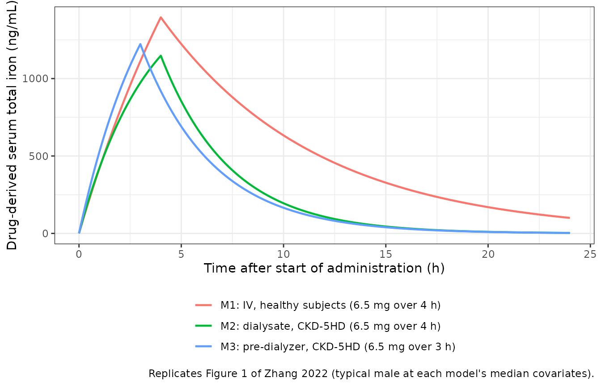
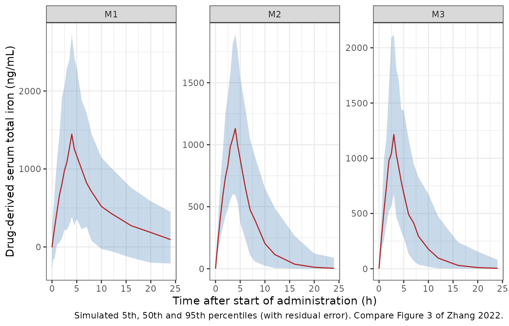

# Ferric pyrophosphate citrate by IV, dialysate and pre-dialyzer routes (Zhang 2022)

## Model and source

Zhang et al. (2022) developed three separate one-compartment population
PK models for ferric pyrophosphate citrate (FPC, Triferic), one per
route of administration, to test whether the PK of FPC differs between
Asian and non-Asian subjects:

| Model | nlmixr2lib name | Route and population |
|----|----|----|
| M1 | `Zhang_2022_ferricPyrophosphateCitrate_iv` | 4-h IV infusion, healthy adults |
| M2 | `Zhang_2022_ferricPyrophosphateCitrate_dialysate` | via the dialysate over a 4-h session, CKD-5HD |
| M3 | `Zhang_2022_ferricPyrophosphateCitrate_predialyzer` | 3-h infusion into the pre-dialyzer blood line, CKD-5HD |

- Citation: Zhang L, Gan L, Li K, Xie P, Tan Y, Wei G, Yuan X, Pratt R,
  Zhou Y, Hui AM, Fang Y, Zuo L, Zheng Q. Ethnicity evaluation of ferric
  pyrophosphate citrate among Asian and Non-Asian populations: a
  population pharmacokinetics analysis. Eur J Clin Pharmacol.
  2022;78(9):1421-1434. <doi:10.1007/s00228-022-03328-9>
- Article: <https://doi.org/10.1007/s00228-022-03328-9> (open access, CC
  BY 4.0)
- Supplement: Online Resources 1-6 (Supplementary Tables 1-5 and
  Supplementary Figure 1) at the same DOI.

``` r

mod_iv <- readModelDb("Zhang_2022_ferricPyrophosphateCitrate_iv")
mod_dial <- readModelDb("Zhang_2022_ferricPyrophosphateCitrate_dialysate")
mod_pre <- readModelDb("Zhang_2022_ferricPyrophosphateCitrate_predialyzer")
```

The modelled concentration is the drug-derived serum total iron, that
is, the increment above each subject’s endogenous baseline. The
endogenous baseline enters only as a covariate. This is how the paper’s
own simulated exposures behave: in Table 3 the predicted Cmax changes by
about 300 ng/mL between the 5th and 95th percentile of baseline iron,
while the baseline itself differs by about 760 ng/mL. That rules out a
model that adds the baseline back to the prediction. The closed-form
check in the next sections reproduces Table 3 to within 0.1%, which
confirms the reading.

## Population

The pooled analysis set held 91 subjects from six studies (Table 1 and
Supplementary Table 4):

- **M1 (n = 40)**: healthy adults, 14 Chinese (CHN-FPC-14) and 26
  non-Asian (USA-FPC-12, n = 12; USA-FPC-18, n = 14); 5 of 40 female;
  age 19-62 years; weight 53.3-104.9 kg. Single 4-h IV infusions of 6.5,
  6 or 6.6 mg iron.
- **M2 (n = 50)**: CKD-5HD patients, 12 Chinese (CHN-FPC-21) and 38
  non-Asian (USA-FPC-16, n = 13; USA-FPC-20, n = 25); 10 of 50 female;
  age 25-77 years. FPC added to the dialysate (95 ug/L or 2 uM iron) for
  a 4-h session.
- **M3 (n = 51)**: the same CKD-5HD patients (USA-FPC-20, n = 26); 10 of
  51 female. 6.5 or 6.6 mg iron infused into the pre-dialyzer blood
  circuit over 3 h.

The same information is available programmatically, e.g.
`readModelDb("Zhang_2022_ferricPyrophosphateCitrate_iv")()$population`.

## Source trace

Every `ini()` value carries an in-file comment pointing to its source.
The table collects them.

| Model | Parameter | Value | Source location |
|----|----|----|----|
| all | Structure: one compartment, first-order elimination | n/a | Methods ‘Base model development’; Supplementary Figure 1 |
| all | IIV `P_i = P_TV * exp(eta_i)` | n/a | Methods Eq. 1 |
| M1 | `lcl` | log(0.477 L/h) | Table 2, M1 CL |
| M1 | `lvc` | log(3.62 L) | Table 2, M1 Vd |
| M1 | `e_lbm_vc` | 3.26 | Table 2, M1 ‘LBM on Vd’; footnote a `(LBM/55.24)^3.26` |
| M1 | `e_iron_bl_vc` | 0.000771 per ng/mL | Table 2, M1 ‘Fe.av on Vd (x10^-4)’ 7.71; footnote a `1 + 0.000771 x (Fe.av - 1110)` |
| M1 | `e_sexf_vc` | 1.80 | Table 2, M1 ‘theta sex on Vd’; footnote a `COVfemale = 1 + theta = 2.8` |
| M1 | `etalcl`, `etalvc` | 0.428^2, 0.338^2 | Table 2, M1 omega1 42.8%, omega2 33.8% |
| M1 | `addSd` | 174 ng/mL | Table 2, M1 sigma (add) |
| M2 | `lcl` | log(0.982 L/h) | Table 2, M2 CL/F |
| M2 | `lvc` | log(3.32 L) | Table 2, M2 Vd/F |
| M2 | `e_iron_bl_cl` | -0.000728 per ng/mL | Table 2, M2 ‘Fe baseline on CL/F (x10^-4)’ -7.28; footnote b `1 - 0.000728 x (Fe baseline - 642.00)` |
| M2 | `e_lbm_vc` | 0.726 | Table 2, M2 ‘LBM on Vd/F’; footnote b `(LBM/56.28)^0.726` |
| M2 | `etalcl`, `etalvc` | 0.415^2, 0.181^2 | Table 2, M2 omega1 41.5%, omega2 18.1% |
| M2 | `propSd`, `addSd` | 0.236, 0.0220 ng/mL (fixed) | Table 2, M2 sigma1, sigma2 |
| M3 | `lcl` | log(1.02 L/h) | Table 2, M3 CL/F |
| M3 | `lvc` | log(3.57 L) | Table 2, M3 Vd/F |
| M3 | `e_iron_bl_cl` | -0.000702 per ng/mL | Table 2, M3 ‘Fe baseline on CL/F (x10^-4)’ -7.02; footnote c `1 - 0.000702 x (Fe baseline - 660.80)` |
| M3 | `e_lbm_vc` | 1.14 | Table 2, M3 ‘LBM on Vd/F’; footnote c `(LBM/55.85)^1.14` |
| M3 | `etalcl`, `etalvc` | 0.366^2, 0.210^2 | Table 2, M3 omega1 36.6%, omega2 21.0% |
| M3 | `propSd`, `addSd` | 0.271, 0.0710 ng/mL (fixed) | Table 2, M3 sigma1, sigma2 |
| M2, M3 | Combined error `Y = F(1 + eps1) + eps2` | n/a | Methods Eq. 4; Results |
| M2, M3 | Dose: 6.5 mg zero-order input over 4 h (M2) or 3 h (M3) | n/a | Figure 1 caption; Supplementary Tables 1-2 |

The IIV variances are the squared IIV entries of Table 2 divided by 100.
The check below fails if a value is re-encoded with `log(1 + CV^2)`.

``` r

omega_diag <- function(m) diag(rxode2::rxode(m)$omega)
stopifnot(
  isTRUE(all.equal(unname(omega_diag(mod_iv)), c(0.428, 0.338)^2)),
  isTRUE(all.equal(unname(omega_diag(mod_dial)), c(0.415, 0.181)^2)),
  isTRUE(all.equal(unname(omega_diag(mod_pre)), c(0.366, 0.210)^2))
)
#> ℹ parameter labels from comments will be replaced by 'label()'
#> ℹ parameter labels from comments will be replaced by 'label()'
#> ℹ parameter labels from comments will be replaced by 'label()'
```

## Typical-value check against the paper’s covariate scenarios

Table 3 (M2, M3) and Supplementary Table 5 (M1) tabulate model-predicted
Cmax and partial AUCs of a typical subject at the 5th and 95th
percentiles of each retained covariate. The “5th LBM + 95th Fe baseline”
and “95th LBM + 5th Fe baseline” rows of Table 3 fix every covariate, so
each one pins the model exactly. For M1, the LBM and sex rows of
Supplementary Table 5 hold the remaining covariates at the reference
values (male, LBM 55.24 kg, Fe.av 1110 ng/mL). The scenarios below are
solved without random effects and the exposures computed with PKNCA. The
gate compares one model against the paper’s own predictions from the
same model, so the only error is numerical and the tolerance is tight.

``` r

scen <- tibble::tribble(
  ~model, ~scenario, ~LBM, ~IRON_BL, ~SEXF, ~dose, ~tinf, ~cmax, ~auc_early, ~auc12, ~auc24,
  # Table 3, dialysate, Asians and non-Asians, LBM + Fe baseline rows
  "M2", "Asian 5th LBM / 95th Fe", 39.01, 1099.28, 0, 6.5, 4, 1594.9, 3727.58, 9132.32, 9886.06,
  "M2", "Asian 95th LBM / 5th Fe", 58.3, 453.32, 0, 6.5, 4, 1063, 2577.76, 5584.30, 5814.94,
  "M2", "non-Asian 5th LBM / 95th Fe", 45.73, 1040, 0, 6.5, 4, 1452.8, 3371.2, 8476.34, 9274.23,
  "M2", "non-Asian 95th LBM / 5th Fe", 68.55, 280, 0, 6.5, 4, 951.12, 2301.73, 5018.32, 5233.9,
  # Table 3, pre-dialyzer, Asians and non-Asians, LBM + Fe baseline rows
  "M3", "Asian 5th LBM / 95th Fe", 39.07, 1146.6, 0, 6.5, 3, 1842.7, 3157.27, 9159.71, 9652.91,
  "M3", "Asian 95th LBM / 5th Fe", 58.23, 517.4, 0, 6.5, 3, 1144, 1974.28, 5532.7, 5782.38,
  "M3", "non-Asian 5th LBM / 95th Fe", 48.4, 1022, 0, 6.5, 3, 1504.9, 2543.26, 7911.29, 8506.17,
  "M3", "non-Asian 95th LBM / 5th Fe", 68.66, 317, 0, 6.5, 3, 972.35, 1664.09, 4854.89, 5123.69,
  # Supplementary Table 5, IV in healthy subjects, LBM and sex rows
  "M1", "LBM 5th (41.5 kg)", 41.5, 1110, 0, 6.5, 4, 2513.8, 6116.8, 13110.9, 13617.5,
  "M1", "LBM 95th (65.9 kg)", 65.9, 1110, 0, 6.5, 4, 874.1, 1834.5, 7109.8, 10949.4,
  "M1", "Male", 55.24, 1110, 0, 6.5, 4, 1395.6, 3035.2, 9935.7, 12867.5,
  "M1", "Female", 55.24, 1110, 1, 6.5, 4, 584.5, 1205.7, 5102.5, 8780.6
) |>
  mutate(id = row_number())

mods <- list(M1 = mod_iv, M2 = mod_dial, M3 = mod_pre)

make_typical_events <- function(s) {
  obs_times <- sort(unique(c(seq(0, 24, by = 0.05), s$tinf)))
  dplyr::bind_rows(
    tibble(id = s$id, time = 0, evid = 1, amt = s$dose, rate = s$dose / s$tinf, cmt = "central"),
    tibble(id = s$id, time = obs_times, evid = 0, amt = 0, rate = 0, cmt = "central")
  ) |>
    mutate(LBM = s$LBM, IRON_BL = s$IRON_BL, SEXF = s$SEXF)
}

sim_typ <- lapply(split(scen, scen$model), function(sc) {
  ev <- dplyr::bind_rows(lapply(seq_len(nrow(sc)), function(i) make_typical_events(sc[i, ])))
  out <- rxode2::rxSolve(rxode2::zeroRe(mods[[sc$model[1]]]), events = ev, returnType = "data.frame")
  dplyr::transmute(out, id = as.integer(as.character(id)), time, Cc)
}) |>
  dplyr::bind_rows() |>
  dplyr::left_join(dplyr::select(scen, id, model, tinf), by = "id")
#> ℹ parameter labels from comments will be replaced by 'label()'
#> ℹ omega/sigma items treated as zero: 'etalcl', 'etalvc'
#> Warning: multi-subject simulation without without 'omega'
#> ℹ parameter labels from comments will be replaced by 'label()'
#> ℹ omega/sigma items treated as zero: 'etalcl', 'etalvc'
#> Warning: multi-subject simulation without without 'omega'
#> ℹ parameter labels from comments will be replaced by 'label()'
#> ℹ omega/sigma items treated as zero: 'etalcl', 'etalvc'
#> Warning: multi-subject simulation without without 'omega'
```

``` r

conc_typ <- PKNCA::PKNCAconc(dplyr::filter(sim_typ, !is.na(Cc)), Cc ~ time | model + id)
dose_typ <- PKNCA::PKNCAdose(
  dplyr::transmute(scen, model, id, time = 0, amt = dose),
  amt ~ time | model + id
)
early <- dplyr::distinct(scen, model, id, tinf) |>
  dplyr::transmute(model, id, start = 0, end = tinf, auclast = TRUE)
int_typ <- dplyr::bind_rows(
  dplyr::mutate(early, cmax = FALSE),
  dplyr::distinct(scen, model, id) |> dplyr::mutate(start = 0, end = 24, cmax = TRUE, auclast = TRUE),
  dplyr::distinct(scen, model, id) |> dplyr::mutate(start = 0, end = 12, cmax = FALSE, auclast = TRUE)
)
nca_typ <- PKNCA::pk.nca(PKNCA::PKNCAdata(conc_typ, dose_typ, intervals = int_typ))

typ_res <- as.data.frame(nca_typ) |>
  dplyr::filter(PPTESTCD %in% c("cmax", "auclast")) |>
  dplyr::mutate(param = dplyr::case_when(
    PPTESTCD == "cmax" ~ "cmax",
    end == 12 ~ "auc12",
    end == 24 ~ "auc24",
    TRUE ~ "auc_early"
  )) |>
  dplyr::select(id, param, simulated = PPORRES)

typ_cmp <- scen |>
  tidyr::pivot_longer(c(cmax, auc_early, auc12, auc24), names_to = "param", values_to = "published") |>
  dplyr::left_join(typ_res, by = c("id", "param")) |>
  dplyr::mutate(pct_diff = 100 * (simulated - published) / published)

typ_cmp |>
  dplyr::mutate(
    param = dplyr::recode(param,
      cmax = "Cmax (ng/mL)", auc_early = "AUC0-tinf (h.ng/mL)",
      auc12 = "AUC0-12 (h.ng/mL)", auc24 = "AUC0-24 (h.ng/mL)"
    ),
    simulated = signif(simulated, 5),
    pct_diff = round(pct_diff, 2)
  ) |>
  dplyr::select(model, scenario, param, published, simulated, pct_diff) |>
  dplyr::rename(
    "Model" = model, "Scenario" = scenario, "Quantity" = param,
    "Published" = published, "Simulated" = simulated, "% difference" = pct_diff
  ) |>
  knitr::kable(caption = "Typical-value exposures vs. Table 3 (M2, M3) and Supplementary Table 5 (M1). The early AUC runs to the end of the infusion: 0-4 h for M1 and M2, 0-3 h for M3.")
```

| Model | Scenario | Quantity | Published | Simulated | % difference |
|:---|:---|:---|---:|---:|---:|
| M2 | Asian 5th LBM / 95th Fe | Cmax (ng/mL) | 1594.90 | 1594.90 | 0.00 |
| M2 | Asian 5th LBM / 95th Fe | AUC0-tinf (h.ng/mL) | 3727.58 | 3727.80 | 0.00 |
| M2 | Asian 5th LBM / 95th Fe | AUC0-12 (h.ng/mL) | 9132.32 | 9132.50 | 0.00 |
| M2 | Asian 5th LBM / 95th Fe | AUC0-24 (h.ng/mL) | 9886.06 | 9886.20 | 0.00 |
| M2 | Asian 95th LBM / 5th Fe | Cmax (ng/mL) | 1063.00 | 1063.00 | 0.00 |
| M2 | Asian 95th LBM / 5th Fe | AUC0-tinf (h.ng/mL) | 2577.76 | 2577.90 | 0.01 |
| M2 | Asian 95th LBM / 5th Fe | AUC0-12 (h.ng/mL) | 5584.30 | 5584.40 | 0.00 |
| M2 | Asian 95th LBM / 5th Fe | AUC0-24 (h.ng/mL) | 5814.94 | 5815.10 | 0.00 |
| M2 | non-Asian 5th LBM / 95th Fe | Cmax (ng/mL) | 1452.80 | 1452.80 | 0.00 |
| M2 | non-Asian 5th LBM / 95th Fe | AUC0-tinf (h.ng/mL) | 3371.20 | 3371.30 | 0.00 |
| M2 | non-Asian 5th LBM / 95th Fe | AUC0-12 (h.ng/mL) | 8476.34 | 8476.50 | 0.00 |
| M2 | non-Asian 5th LBM / 95th Fe | AUC0-24 (h.ng/mL) | 9274.23 | 9274.30 | 0.00 |
| M2 | non-Asian 95th LBM / 5th Fe | Cmax (ng/mL) | 951.12 | 951.12 | 0.00 |
| M2 | non-Asian 95th LBM / 5th Fe | AUC0-tinf (h.ng/mL) | 2301.73 | 2301.80 | 0.00 |
| M2 | non-Asian 95th LBM / 5th Fe | AUC0-12 (h.ng/mL) | 5018.32 | 5018.40 | 0.00 |
| M2 | non-Asian 95th LBM / 5th Fe | AUC0-24 (h.ng/mL) | 5233.90 | 5234.00 | 0.00 |
| M3 | Asian 5th LBM / 95th Fe | Cmax (ng/mL) | 1842.70 | 1844.10 | 0.08 |
| M3 | Asian 5th LBM / 95th Fe | AUC0-tinf (h.ng/mL) | 3157.27 | 3152.80 | -0.14 |
| M3 | Asian 5th LBM / 95th Fe | AUC0-12 (h.ng/mL) | 9159.71 | 9159.70 | 0.00 |
| M3 | Asian 5th LBM / 95th Fe | AUC0-24 (h.ng/mL) | 9652.91 | 9653.30 | 0.00 |
| M3 | Asian 95th LBM / 5th Fe | Cmax (ng/mL) | 1144.00 | 1144.90 | 0.08 |
| M3 | Asian 95th LBM / 5th Fe | AUC0-tinf (h.ng/mL) | 1974.28 | 1971.40 | -0.14 |
| M3 | Asian 95th LBM / 5th Fe | AUC0-12 (h.ng/mL) | 5532.70 | 5532.70 | 0.00 |
| M3 | Asian 95th LBM / 5th Fe | AUC0-24 (h.ng/mL) | 5782.38 | 5782.60 | 0.00 |
| M3 | non-Asian 5th LBM / 95th Fe | Cmax (ng/mL) | 1504.90 | 1505.90 | 0.06 |
| M3 | non-Asian 5th LBM / 95th Fe | AUC0-tinf (h.ng/mL) | 2543.26 | 2539.60 | -0.14 |
| M3 | non-Asian 5th LBM / 95th Fe | AUC0-12 (h.ng/mL) | 7911.29 | 7911.20 | 0.00 |
| M3 | non-Asian 5th LBM / 95th Fe | AUC0-24 (h.ng/mL) | 8506.17 | 8506.40 | 0.00 |
| M3 | non-Asian 95th LBM / 5th Fe | Cmax (ng/mL) | 972.35 | 973.07 | 0.07 |
| M3 | non-Asian 95th LBM / 5th Fe | AUC0-tinf (h.ng/mL) | 1664.09 | 1661.70 | -0.14 |
| M3 | non-Asian 95th LBM / 5th Fe | AUC0-12 (h.ng/mL) | 4854.89 | 4854.90 | 0.00 |
| M3 | non-Asian 95th LBM / 5th Fe | AUC0-24 (h.ng/mL) | 5123.69 | 5123.90 | 0.00 |
| M1 | LBM 5th (41.5 kg) | Cmax (ng/mL) | 2513.80 | 2513.80 | 0.00 |
| M1 | LBM 5th (41.5 kg) | AUC0-tinf (h.ng/mL) | 6116.80 | 6117.20 | 0.01 |
| M1 | LBM 5th (41.5 kg) | AUC0-12 (h.ng/mL) | 13110.90 | 13111.00 | 0.00 |
| M1 | LBM 5th (41.5 kg) | AUC0-24 (h.ng/mL) | 13617.50 | 13617.00 | 0.00 |
| M1 | LBM 95th (65.9 kg) | Cmax (ng/mL) | 874.10 | 874.15 | 0.01 |
| M1 | LBM 95th (65.9 kg) | AUC0-tinf (h.ng/mL) | 1834.50 | 1834.60 | 0.00 |
| M1 | LBM 95th (65.9 kg) | AUC0-12 (h.ng/mL) | 7109.80 | 7109.90 | 0.00 |
| M1 | LBM 95th (65.9 kg) | AUC0-24 (h.ng/mL) | 10949.40 | 10949.00 | 0.00 |
| M1 | Male | Cmax (ng/mL) | 1395.60 | 1395.60 | 0.00 |
| M1 | Male | AUC0-tinf (h.ng/mL) | 3035.20 | 3035.30 | 0.00 |
| M1 | Male | AUC0-12 (h.ng/mL) | 9935.70 | 9935.80 | 0.00 |
| M1 | Male | AUC0-24 (h.ng/mL) | 12867.50 | 12867.00 | 0.00 |
| M1 | Female | Cmax (ng/mL) | 584.50 | 584.54 | 0.01 |
| M1 | Female | AUC0-tinf (h.ng/mL) | 1205.70 | 1205.70 | 0.00 |
| M1 | Female | AUC0-12 (h.ng/mL) | 5102.50 | 5102.60 | 0.00 |
| M1 | Female | AUC0-24 (h.ng/mL) | 8780.60 | 8780.60 | 0.00 |

Typical-value exposures vs. Table 3 (M2, M3) and Supplementary Table 5
(M1). The early AUC runs to the end of the infusion: 0-4 h for M1 and
M2, 0-3 h for M3. {.table style="width:100%;"}

``` r


# Same parameters on both sides, so the residual is numerical (PKNCA
# trapezoids on a 0.05 h grid against the paper's own computation and
# rounding of the printed values).
stopifnot(max(abs(typ_cmp$pct_diff)) < 1)
```

The Fe.av rows of Supplementary Table 5 (M1) are not used as a gate.
Under the footnote-a equation they are not reproduced by any reference
choice for the other covariates. The ratio of the 95th to the 5th
percentile scenario volumes implied by the printed Cmax values (about
2.7) does match the published slope:
`(1 + 0.000771 x 866.9) / (1 + 0.000771 x -496.3) = 2.70`. But both
scenario volumes are about 2.5 times larger than a male at the reference
LBM would have. So the other covariates in those two rows were evidently
held at values the table does not state.

## Figure 1: typical concentration-time profiles

``` r

fig1 <- tibble::tribble(
  ~model, ~label, ~tinf, ~LBM, ~IRON_BL,
  "M1", "M1: IV, healthy subjects (6.5 mg over 4 h)", 4, 55.24, 1110,
  "M2", "M2: dialysate, CKD-5HD (6.5 mg over 4 h)", 4, 56.28, 642,
  "M3", "M3: pre-dialyzer, CKD-5HD (6.5 mg over 3 h)", 3, 55.85, 660.8
) |>
  mutate(id = row_number(), SEXF = 0, dose = 6.5)

sim_fig1 <- lapply(seq_len(nrow(fig1)), function(i) {
  ev <- make_typical_events(fig1[i, ])
  rxode2::rxSolve(rxode2::zeroRe(mods[[fig1$model[i]]]), events = ev, returnType = "data.frame") |>
    dplyr::mutate(label = fig1$label[i])
}) |>
  dplyr::bind_rows()
#> ℹ parameter labels from comments will be replaced by 'label()'
#> ℹ omega/sigma items treated as zero: 'etalcl', 'etalvc'
#> ℹ parameter labels from comments will be replaced by 'label()'
#> ℹ omega/sigma items treated as zero: 'etalcl', 'etalvc'
#> ℹ parameter labels from comments will be replaced by 'label()'
#> ℹ omega/sigma items treated as zero: 'etalcl', 'etalvc'

ggplot(sim_fig1, aes(time, Cc, colour = label)) +
  geom_line(linewidth = 0.8) +
  labs(
    x = "Time after start of administration (h)",
    y = "Drug-derived serum total iron (ng/mL)",
    colour = NULL,
    caption = "Replicates Figure 1 of Zhang 2022 (typical male at each model's median covariates)."
  ) +
  theme_bw() +
  theme(legend.position = "bottom", legend.direction = "vertical")
```



## Virtual cohort

The observed data are not public. Each model gets a virtual cohort of
100 Asian and 100 non-Asian subjects. Lean body mass and baseline serum
iron are drawn per study from normal distributions with the study means
and SDs of Supplementary Table 4, truncated to each study’s observed
range. Female sex is drawn with each study’s observed proportion (M1
only). Doses follow Supplementary Table 1.

``` r

set.seed(20220617)
rxode2::rxSetSeed(20220617)

# One row per contributing study: per-study covariate summaries from
# Supplementary Table 4; dose and infusion length from Supplementary Table 1.
studies <- tibble::tribble(
  ~model, ~study, ~ethnicity, ~n_obs, ~lbm_m, ~lbm_sd, ~lbm_lo, ~lbm_hi, ~fe_m, ~fe_sd, ~fe_lo, ~fe_hi, ~p_female, ~dose, ~tinf,
  "M1", "CHN-FPC-14", "Asian", 14, 51.81, 5.01, 37.92, 56.31, 946.40, 221.42, 583.1, 1250.2, 1 / 14, 6.5, 4,
  "M1", "USA-FPC-12", "Non-Asian", 12, 59.10, 8.76, 41.71, 70.36, 1170.76, 352.79, 490.7, 1732.9, 2 / 12, 6.0, 4,
  "M1", "USA-FPC-18", "Non-Asian", 14, 54.02, 6.82, 37.62, 64.24, 1425.59, 554.67, 693.3, 2828.6, 2 / 14, 6.6, 4,
  "M2", "CHN-FPC-21", "Asian", 12, 50.59, 6.62, 37.70, 61.14, 798.93, 226.91, 425.6, 1204, 0, 6.5, 4,
  "M2", "USA-FPC-16", "Non-Asian", 13, 62.29, 8.63, 49.00, 76.99, 563.85, 194.23, 280, 860, 0, 6.5, 4,
  "M2", "USA-FPC-20", "Non-Asian", 25, 57.26, 5.92, 43.15, 67.71, 613.20, 246.18, 210, 1100, 0, 6.5, 4,
  "M3", "CHN-FPC-21", "Asian", 12, 50.55, 6.59, 37.80, 61.14, 794.73, 223.00, 369.6, 1254.4, 0, 6.5, 3,
  "M3", "USA-FPC-16", "Non-Asian", 13, 62.36, 8.50, 48.71, 76.76, 594.62, 206.18, 320, 920, 0, 6.6, 3,
  "M3", "USA-FPC-20", "Non-Asian", 26, 57.11, 5.68, 43.83, 67.74, 656.15, 246.48, 230, 1320, 0, 6.5, 3
)

rtrunc_norm <- function(n, m, s, lo, hi) pmin(pmax(rnorm(n, m, s), lo), hi)

n_per_arm <- 100L
cohort <- studies |>
  dplyr::group_by(model, ethnicity) |>
  dplyr::mutate(n_sim = round(n_per_arm * n_obs / sum(n_obs))) |>
  dplyr::ungroup()
stopifnot(all(tapply(cohort$n_sim, paste(cohort$model, cohort$ethnicity), sum) == n_per_arm))

subjects <- dplyr::bind_rows(lapply(seq_len(nrow(cohort)), function(i) {
  s <- cohort[i, ]
  tibble(
    model = s$model, study = s$study, ethnicity = s$ethnicity,
    LBM = rtrunc_norm(s$n_sim, s$lbm_m, s$lbm_sd, s$lbm_lo, s$lbm_hi),
    IRON_BL = rtrunc_norm(s$n_sim, s$fe_m, s$fe_sd, s$fe_lo, s$fe_hi),
    SEXF = rbinom(s$n_sim, 1, s$p_female),
    dose = s$dose, tinf = s$tinf
  )
})) |>
  dplyr::mutate(id = dplyr::row_number())

obs_grid <- c(0, 0.25, 0.5, 1, 1.5, 2, 2.5, 3, 3.5, 4, 4.5, 5, 6, 7, 8, 10, 12, 16, 20, 24)
events <- dplyr::bind_rows(
  dplyr::transmute(subjects, id, time = 0, evid = 1, amt = dose, rate = dose / tinf, cmt = "central"),
  tidyr::crossing(dplyr::select(subjects, id), time = obs_grid) |>
    dplyr::mutate(evid = 0, amt = 0, rate = 0, cmt = "central")
) |>
  dplyr::left_join(dplyr::select(subjects, id, model, ethnicity, LBM, IRON_BL, SEXF), by = "id") |>
  dplyr::arrange(id, time, dplyr::desc(evid))
stopifnot(!anyDuplicated(events[, c("id", "time", "evid")]))
```

## Simulation

``` r

sim <- lapply(names(mods), function(m) {
  ev <- dplyr::filter(events, model == m)
  rxode2::rxSolve(mods[[m]], events = ev, keep = c("model", "ethnicity"), returnType = "data.frame")
}) |>
  dplyr::bind_rows()
#> ℹ parameter labels from comments will be replaced by 'label()'
#> ℹ parameter labels from comments will be replaced by 'label()'
#> ℹ parameter labels from comments will be replaced by 'label()'
stopifnot(!anyNA(sim$Cc))
```

### Figure 3: prediction intervals by model

``` r

sim |>
  dplyr::group_by(model, time) |>
  dplyr::summarise(
    Q05 = quantile(sim, 0.05), Q50 = quantile(sim, 0.50), Q95 = quantile(sim, 0.95),
    .groups = "drop"
  ) |>
  ggplot(aes(time, Q50)) +
  geom_ribbon(aes(ymin = Q05, ymax = Q95), fill = "steelblue", alpha = 0.3) +
  geom_line(colour = "firebrick") +
  facet_wrap(~model, scales = "free_y") +
  labs(
    x = "Time after start of administration (h)",
    y = "Drug-derived serum total iron (ng/mL)",
    caption = "Simulated 5th, 50th and 95th percentiles (with residual error). Compare Figure 3 of Zhang 2022."
  ) +
  theme_bw()
```



## PKNCA validation

``` r

sim_nca <- sim |>
  dplyr::filter(!is.na(Cc)) |>
  dplyr::mutate(treatment = paste(model, ethnicity, sep = " / ")) |>
  dplyr::select(id, time, Cc, treatment)

conc_obj <- PKNCA::PKNCAconc(sim_nca, Cc ~ time | treatment + id)
dose_obj <- PKNCA::PKNCAdose(
  dplyr::transmute(subjects, id, time = 0, amt = dose, treatment = paste(model, ethnicity, sep = " / ")),
  amt ~ time | treatment + id
)

treatments <- unique(sim_nca$treatment)
early_end <- ifelse(startsWith(treatments, "M3"), 3, 4)
intervals <- dplyr::bind_rows(
  data.frame(treatment = treatments, start = 0, end = early_end, auclast = TRUE),
  data.frame(treatment = treatments, start = 0, end = 12, auclast = TRUE),
  data.frame(treatment = treatments, start = 0, end = 24, auclast = TRUE),
  data.frame(treatment = treatments, start = 0, end = Inf, cmax = TRUE, aucinf.obs = TRUE)
)
intervals[is.na(intervals)] <- FALSE

nca_res <- PKNCA::pk.nca(PKNCA::PKNCAdata(conc_obj, dose_obj, intervals = intervals))
```

### Comparison against Table 4

Table 4 reports geometric least-squares means of the final-model
exposures by ethnicity “after covariate correction”, that is, adjusted
to a common covariate profile. The simulated values below are medians of
a cohort that keeps each group’s own covariates. The Asian cohorts have
lower lean body mass and, among the CKD-5HD patients, higher baseline
serum iron (lower CL/F), so their simulated exposures are expected to
sit above the adjusted Table 4 means. The non-Asian rows, which hold
most of the subjects behind the adjustment, are the closer comparison.
The partial AUCs are renamed to their own codes by interval end so a
single comparison table holds them.

``` r

nca_wide <- as.data.frame(nca_res) |>
  dplyr::filter(PPTESTCD %in% c("cmax", "auclast", "aucinf.obs")) |>
  dplyr::mutate(PPTESTCD = dplyr::case_when(
    PPTESTCD == "auclast" & end == 12 ~ "auc12",
    PPTESTCD == "auclast" & end == 24 ~ "auc24",
    PPTESTCD == "auclast" ~ "auc_early",
    TRUE ~ PPTESTCD
  ))

published <- tibble::tribble(
  ~treatment, ~cmax, ~auc_early, ~auc12, ~auc24, ~aucinf.obs,
  "M1 / Asian", 1477.7, 3261.4, 9982.2, 12322.1, 12869.9,
  "M1 / Non-Asian", 1189.9, 2338.2, 7743.2, 12210.2, 13189.8,
  "M2 / Asian", 1116.8, 2742.9, 5787.0, 6074.9, 6102.0,
  "M2 / Non-Asian", 1100.8, 2630.0, 6202.0, 6741.6, 6801.5,
  "M3 / Asian", 1272.8, 3290.1, 6068.0, 6390.8, 6411.0,
  "M3 / Non-Asian", 1182.3, 3046.2, 5864.1, 6289.6, 6336.6
)

cmp <- nlmixr2lib::ncaComparisonTable(
  simulated = nca_wide,
  reference = published,
  by = "treatment",
  units = c(
    cmax = "ng/mL", auc_early = "h.ng/mL", auc12 = "h.ng/mL",
    auc24 = "h.ng/mL", aucinf.obs = "h.ng/mL"
  ),
  tolerance_pct = 20
)
#> Warning: ncaParamLabel(): unknown PKNCA code(s) returned as-is: 'auc_early',
#> 'auc12', 'auc24'
knitr::kable(
  cmp,
  caption = "Simulated cohort medians vs. Table 4 final-model GM LS means. auc_early is AUC0-4 h (M1, M2) or AUC0-3 h (M3). * differs from the reference by more than 20%."
)
```

| NCA parameter          | treatment      | Reference | Simulated | % diff   |
|:-----------------------|:---------------|:----------|:----------|:---------|
| Cmax (ng/mL)           | M1 / Asian     | 1480      | 1790      | +21.2%\* |
| Cmax (ng/mL)           | M1 / Non-Asian | 1190      | 1000      | -15.7%   |
| Cmax (ng/mL)           | M2 / Asian     | 1120      | 1250      | +12.2%   |
| Cmax (ng/mL)           | M2 / Non-Asian | 1100      | 1120      | +1.7%    |
| Cmax (ng/mL)           | M3 / Asian     | 1270      | 1380      | +8.7%    |
| Cmax (ng/mL)           | M3 / Non-Asian | 1180      | 1110      | -5.9%    |
| AUC0-∞ (obs) (h.ng/mL) | M1 / Asian     | 12900     | 14500     | +13.0%   |
| AUC0-∞ (obs) (h.ng/mL) | M1 / Non-Asian | 13200     | 13100     | -0.8%    |
| AUC0-∞ (obs) (h.ng/mL) | M2 / Asian     | 6100      | 7370      | +20.8%\* |
| AUC0-∞ (obs) (h.ng/mL) | M2 / Non-Asian | 6800      | 7020      | +3.2%    |
| AUC0-∞ (obs) (h.ng/mL) | M3 / Asian     | 6410      | 7400      | +15.4%   |
| AUC0-∞ (obs) (h.ng/mL) | M3 / Non-Asian | 6340      | 6100      | -3.8%    |
| auc_early (h.ng/mL)    | M1 / Asian     | 3260      | 4040      | +23.8%\* |
| auc_early (h.ng/mL)    | M1 / Non-Asian | 2340      | 2120      | -9.3%    |
| auc_early (h.ng/mL)    | M2 / Asian     | 2740      | 2940      | +7.1%    |
| auc_early (h.ng/mL)    | M2 / Non-Asian | 2630      | 2560      | -2.5%    |
| auc_early (h.ng/mL)    | M3 / Asian     | 3290      | 2350      | -28.6%\* |
| auc_early (h.ng/mL)    | M3 / Non-Asian | 3050      | 1960      | -35.7%\* |
| auc12 (h.ng/mL)        | M1 / Asian     | 9980      | 11400     | +13.8%   |
| auc12 (h.ng/mL)        | M1 / Non-Asian | 7740      | 7590      | -2.0%    |
| auc12 (h.ng/mL)        | M2 / Asian     | 5790      | 6840      | +18.3%   |
| auc12 (h.ng/mL)        | M2 / Non-Asian | 6200      | 6310      | +1.7%    |
| auc12 (h.ng/mL)        | M3 / Asian     | 6070      | 7090      | +16.8%   |
| auc12 (h.ng/mL)        | M3 / Non-Asian | 5860      | 5670      | -3.4%    |
| auc24 (h.ng/mL)        | M1 / Asian     | 12300     | 13900     | +12.8%   |
| auc24 (h.ng/mL)        | M1 / Non-Asian | 12200     | 10500     | -13.7%   |
| auc24 (h.ng/mL)        | M2 / Asian     | 6070      | 7350      | +21.0%\* |
| auc24 (h.ng/mL)        | M2 / Non-Asian | 6740      | 6960      | +3.2%    |
| auc24 (h.ng/mL)        | M3 / Asian     | 6390      | 7320      | +14.5%   |
| auc24 (h.ng/mL)        | M3 / Non-Asian | 6290      | 6090      | -3.2%    |

Simulated cohort medians vs. Table 4 final-model GM LS means. auc_early
is AUC0-4 h (M1, M2) or AUC0-3 h (M3). \* differs from the reference by
more than 20%. {.table}

``` r

sim_med <- nca_wide |>
  dplyr::group_by(treatment, PPTESTCD) |>
  dplyr::summarise(sim = median(PPORRES, na.rm = TRUE), .groups = "drop")
gate <- published |>
  tidyr::pivot_longer(-treatment, names_to = "PPTESTCD", values_to = "ref") |>
  dplyr::inner_join(sim_med, by = c("treatment", "PPTESTCD")) |>
  dplyr::mutate(pct_diff = 100 * (sim - ref) / ref)

# M3 AUC0-3 h is excluded: Table 4 prints a final-model value larger than the
# base-model value and larger than every typical-value AUC0-3 h of Table 3,
# which the same model cannot produce (see Assumptions and deviations).
gate_used <- dplyr::filter(gate, !(startsWith(treatment, "M3") & PPTESTCD == "auc_early"))
stopifnot(
  # Exposure is set by dose / CL and the covariate distributions; a wrong
  # clearance, unit or dose moves the whole set by tens of percent. The
  # Asian rows sit about 10-25% above the covariate-adjusted Table 4 means
  # by construction (see above). Observed while authoring: median +5%,
  # 90th percentile of |difference| 21%.
  abs(median(gate_used$pct_diff)) < 15,
  quantile(abs(gate_used$pct_diff), 0.9) < 35
)
```

## Assumptions and deviations

- **Modelled quantity.** The paper describes its observations as total
  serum iron. The model output is the drug-derived increment above the
  endogenous baseline: the typical-value scenarios of Table 3 and
  Supplementary Table 5 are reproduced to within 1% only under that
  reading (see the checks above). To predict total serum iron, add the
  subject’s baseline (`IRON_BL`) to `Cc`.
- **Dialysate dose amount.** In the studies FPC was added to the
  dialysate at a concentration (95 ug/L or 2 uM iron), so the amount
  entering the patient was not measured. The models estimate CL/F and
  Vd/F. Figure 1 and Table 3 use a 6.5 mg zero-order input over the 4-h
  session, and that convention is the one that reproduces Table 3 here.
  Use the same convention when simulating M2.
- **IIV scale.** Table 2 prints each IIV as a percentage. The models
  encode it as 100 x the SD of eta (variance = (P/100)^2) rather than as
  a log-normal
  105. The printed 95% CI of the M1 CL row is on that SD-fraction scale
       (0.235-0.621 around 0.428), as are the proportional
       residual-error rows (23.6% with CI 0.195-0.277). Reading the
       values as CVs instead, `log(1 + CV^2)`, would lower each variance
       by about 1-9%.
- **Additive residual error in M2 and M3.** Table 2 reports 0.0220 and
  0.0710 ng/mL with an RSE of 0.0, no confidence interval, and a
  bootstrap median equal to the estimate with no percentile interval.
  Both are encoded as fixed. They are negligible against the
  proportional term.
- **Baseline iron covariate.** M1 uses Fe.av, the average serum total
  iron over the 6 h of baseline-period sampling before the dosing day.
  M2 and M3 use Fe baseline, the single pre-dose value. All three map to
  the `IRON_BL` column. The averaging window differs and is recorded per
  model in `covariateData`.
- **Lean body mass formula.** The paper does not say how LBM was
  computed. Users should check that their formula reproduces the
  per-study means of Supplementary Table 4 (about 51-62 kg).
- **Supplementary Table 3 covariate labels for M3.** The
  covariate-selection log labels the M3 effects as “LBM on CL” and “Fe
  baseline on V”. Table 2 footnote c, the Results text and the Table 3
  exposure pattern (LBM changes Cmax and early AUC but leaves AUC0-24 at
  a ratio of 1.00; Fe baseline changes AUC0-24) all place LBM on Vd/F
  and Fe baseline on CL/F. The models follow Table 2.
- **Supplementary Table 5 Fe.av rows (M1).** These are not reproduced by
  the footnote-a equation at the reference covariate values. The
  relative effect between the two rows matches the published slope,
  which points to unstated reference values for the other covariates
  rather than to a different equation.
- **Table 4 M3 AUC0-3 h.** The final-model GM LS means (3290.1 and
  3046.2 h.ng/mL) exceed the base-model values (2386.9 and 1957.9) and
  every typical-value AUC0-3 h in Table 3 (1664-3157). The simulation
  gives about 2200 h.ng/mL. This entry is excluded from the gate.
- **Virtual cohort.** Covariates are drawn independently per study from
  truncated normal distributions with the Supplementary Table 4
  summaries. The paper’s individual covariate data and their
  correlations are not available. Table 4 summarizes the observed
  subjects (geometric LS means), while the comparison uses
  virtual-cohort medians.
- No erratum or correction notice was found for this article as of
  2026-10-05.
