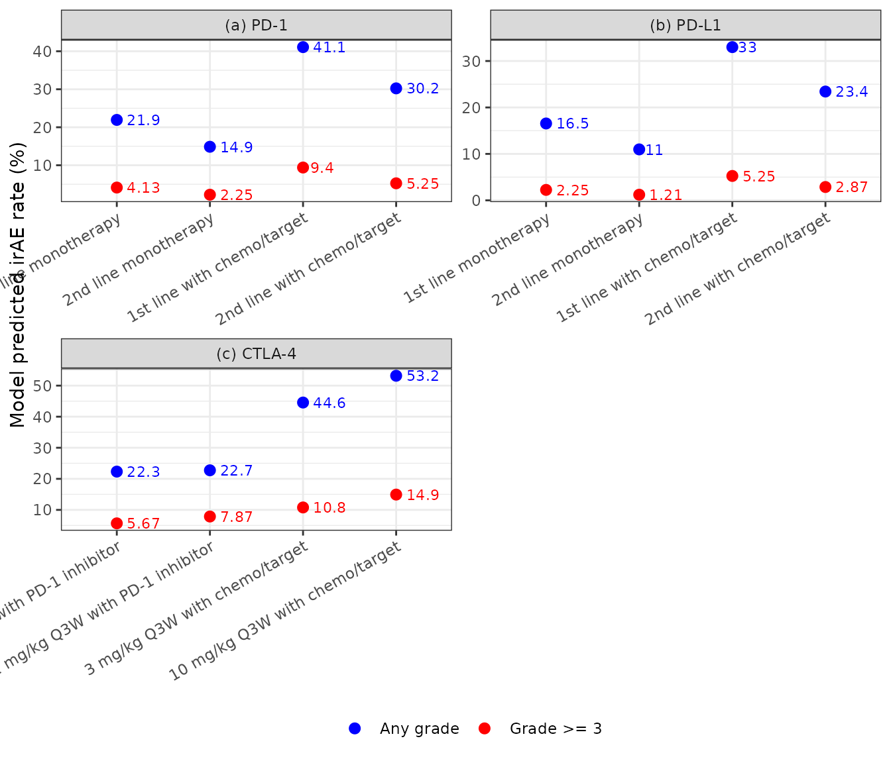
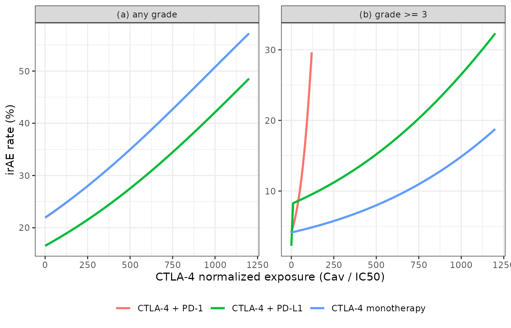

# Immune-related adverse events of checkpoint inhibitors in NSCLC (Zhang 2022)

## Model and source

Zhang et al. pooled trial-level immune-related adverse event (irAE)
rates from 129 cohorts of patients with non-small cell lung cancer
(NSCLC) treated with immune checkpoint inhibitors (ICIs): the anti-PD-1
antibodies nivolumab and pembrolizumab, the anti-PD-L1 antibodies
atezolizumab, durvalumab and avelumab, and the anti-CTLA-4 antibodies
ipilimumab and tremelimumab. Each cohort’s regimen was converted to a
steady-state average plasma concentration with a published population PK
model and divided by the antibody’s in vitro IC50 to give a normalized
exposure. Logit-transformed irAE rates were then regressed on normalized
exposure, the drug class and trial-level covariates.

- Article: <https://doi.org/10.1002/psp4.12834> (PMC9381889), CPT
  Pharmacometrics Syst Pharmacol. 2022;11(8):1135-1146.
- Supporting Information: Supplementary Tables S1-S7 (Table S3 holds the
  PK parameters and IC50 values) and the authors’ cohort-level analysis
  dataset.

The paper’s final models are two study-level logit meta-regressions with
no time axis, one per endpoint:

| Model | Endpoint | Source |
|----|----|----|
| `Zhang_2022_ici_irae_mbma` | any-grade irAE | Equation 4, Table 3 (126 cohorts) |
| `Zhang_2022_ici_irae_grade3_mbma` | grade \>= 3 irAE | Equation 5, Table 3 (120 cohorts) |

``` r

mod_names <- c(
  any = "Zhang_2022_ici_irae_mbma",
  g3 = "Zhang_2022_ici_irae_grade3_mbma"
)
mods <- lapply(mod_names, function(n) rxode2::rxode(readModelDb(n)))
coefs <- lapply(mods, function(m) stats::setNames(m$iniDf$est, m$iniDf$name))
```

### Structure

Anti-PD-(L)1 exposure was not associated with either endpoint, so the
anti-PD-1 and anti-PD-L1 classes enter as indicators. Only anti-CTLA-4
exposure enters continuously:

``` math
 \text{logit}(P_{any}) = \beta_0 + \beta_1 F_{PD\text{-}L1} + \beta_2 C_{CTLA4} + \beta_3\,\text{line2+} + \beta_4\,\text{chemo/target} 
```

``` math
 \text{logit}(P_{\ge 3}) = \beta_0 + \beta_1 F_{PD\text{-}L1} + \beta_2 C_{CTLA4} + \beta_3 F_{PD\text{-}1} C_{CTLA4} + \beta_4 F_{PD\text{-}L1} F_{CTLA4} + \beta_5\,\text{line2+} + \beta_6\,\text{chemo/target} 
```

Here $`C_{CTLA4} = C_{av}/IC_{50}`$ is the normalized anti-CTLA-4
exposure (`CAV / IC50_CTLA4`). $`F_{PD\text{-}1}`$ (`TRT_ANTIPD1`) and
$`F_{PD\text{-}L1}`$ (`TRT_ANTIPDL1`) are 1 when the regimen contains an
antibody of that class. $`F_{CTLA4}`$ is 1 when it contains an
anti-CTLA-4 antibody, which the models derive as `CAV > 0`. line2+ is
formed as `1 - LINE_1L`. The paper’s single chemo/target indicator is
formed as `max(CONMED_CHEMO, CONMED_NONCHEMO_OTHER)`. The intercept is
the rate for first-line anti-PD-1 monotherapy.

## Population

The analysis included 81 studies with 19,322 patients published up to
April 30, 2021: 53 randomized controlled trials, 18 dose-escalation
trials, 21 single-arm trials, 20 nonrandomized trials and 17 real-world
studies (Results, “Literature data”). By drug class, there were 73
anti-PD-1, 33-36 anti-PD-L1, 5 anti-CTLA-4, 10 anti-CTLA-4 + anti-PD-1
and 5 anti-CTLA-4 + anti-PD-L1 cohorts (Table 1). Supplementary Table S6
summarizes the cohort characteristics:

- median cohort age 64.3 years (range 50-72);
- median 61.8% male;
- median 56.3% PD-L1 positive;
- median 85.0% current or former smokers;
- median 81.8% stage IV;
- median 25.8% squamous histology.

51 cohorts were first-line and 62 second-line or later; the rest were
imputed or rounded. 71 were ICI monotherapy, 34 added chemotherapy and
12 added targeted therapy. Age, sex, PD-L1 status, smoking, stage,
histology and the individual drug within a target class were screened
and not retained.

The same information is available programmatically via each model’s
`population` metadata,
e.g. `rxode2::rxode(readModelDb("Zhang_2022_ici_irae_mbma"))$population`.

## Source trace

| Equation / parameter | Value | Source location |
|----|----|----|
| Any-grade final model | n/a | Methods, “Statistical analysis”, Equation 4 |
| Grade \>= 3 final model | n/a | Methods, “Statistical analysis”, Equation 5 |
| Indicator definitions (Factor_PD-1, Factor_PD-L1, Factor_CTLA-4) | n/a | Methods, text after Equation 3 |
| `cnorm_ctla4 <- CAV / IC50_CTLA4` | n/a | Methods, “ICI exposure normalization”; Table S3 |
| any `logit_ref` ($`\beta_0`$) | -1.2696 | Table 3, any grade |
| any `e_antipdl1_logit` ($`\beta_1`$) | -0.3484 | Table 3, any grade |
| any `e_cnorm_ctla4_logit` ($`\beta_2`$) | 0.0013 | Table 3, any grade |
| any `e_line2_logit` ($`\beta_3`$) | -0.4757 | Table 3, any grade |
| any `e_chemo_target_logit` ($`\beta_4`$) | 0.9093 | Table 3, any grade |
| grade \>= 3 `logit_ref` ($`\beta_0`$) | -3.1445 | Table 3, grade \>= 3 |
| grade \>= 3 `e_antipdl1_logit` ($`\beta_1`$) | -0.6271 | Table 3, grade \>= 3 |
| grade \>= 3 `e_cnorm_ctla4_logit` ($`\beta_2`$) | 0.0014 | Table 3, grade \>= 3 |
| grade \>= 3 `e_cnorm_ctla4_antipd1_logit` ($`\beta_3`$) | 0.0176 | Table 3, grade \>= 3 |
| grade \>= 3 `e_antipdl1_antictla4_logit` ($`\beta_4`$) | 1.3525 | Table 3, grade \>= 3 |
| grade \>= 3 `e_line2_logit` ($`\beta_5`$) | -0.6285 | Table 3, grade \>= 3 |
| grade \>= 3 `e_chemo_target_logit` ($`\beta_6`$) | 0.8790 | Table 3, grade \>= 3 |
| `addSd_prob_*` | 0.001 (fixed) | not from source; see Assumptions |
| Ipilimumab / tremelimumab PK parameters and IC50 | see table below | Supplementary Table S3 |
| Normalized exposure per anti-CTLA-4 regimen | see table below | Supplementary dataset, column CCTLA4 |

## Exposure input

The models do not take a dose. The input is the cohort’s average
anti-CTLA-4 concentration `CAV` and the antibody’s `IC50_CTLA4`, in the
same unit. Only their ratio enters. Table S3 gives the two-compartment
PK parameters and IC50 values the authors used. The paper does not give
the body weight for mg/kg doses or the averaging window. The authors’
supplementary dataset, however, lists the normalized exposure of every
cohort. Those are the values the coefficients were fitted on, so they
are the values to supply.

``` r

pk_par <- tibble::tribble(
  ~drug,          ~cl,   ~vc,  ~q,    ~vp,  ~ic50,
  "ipilimumab",   0.360, 4.15, 0.986, 3.11, 200,
  "tremelimumab", 0.262, 3.72, 0.413, 3.31, 95.15
)
pk_par |>
  dplyr::rename(
    Drug = drug, "CL (L/day)" = cl, "Vc (L)" = vc, "Q (L/day)" = q,
    "Vp (L)" = vp, "IC50 (ng/mL)" = ic50
  ) |>
  knitr::kable(caption = "Supplementary Table S3 of Zhang 2022 (anti-CTLA-4 rows).")
```

| Drug         | CL (L/day) | Vc (L) | Q (L/day) | Vp (L) | IC50 (ng/mL) |
|:-------------|-----------:|-------:|----------:|-------:|-------------:|
| ipilimumab   |      0.360 |   4.15 |     0.986 |   3.11 |       200.00 |
| tremelimumab |      0.262 |   3.72 |     0.413 |   3.31 |        95.15 |

Supplementary Table S3 of Zhang 2022 (anti-CTLA-4 rows). {.table}

``` r


regimens <- tibble::tribble(
  ~regimen,                    ~drug,          ~mgkg, ~tau, ~cnorm_dataset,
  "ipilimumab 1 mg/kg Q12W",   "ipilimumab",   1,     84,   8,
  "ipilimumab 1 mg/kg Q6W",    "ipilimumab",   1,     42,   17.5,
  "ipilimumab 1 mg/kg Q3W",    "ipilimumab",   1,     21,   36,
  "ipilimumab 3 mg/kg Q3W",    "ipilimumab",   3,     21,   109,
  "ipilimumab 10 mg/kg Q3W",   "ipilimumab",   10,    21,   375,
  "tremelimumab 1 mg/kg Q4W",  "tremelimumab", 1,     28,   115.61,
  "tremelimumab 3 mg/kg Q4W",  "tremelimumab", 3,     28,   346.83,
  "tremelimumab 10 mg/kg Q4W", "tremelimumab", 10,    28,   1156.1
) |>
  dplyr::left_join(pk_par, by = "drug") |>
  dplyr::mutate(id = dplyr::row_number())
```

To show how these values relate to Table S3, each regimen is simulated
at 70 kg with the Table S3 parameters. PKNCA computes the average
concentration over the interval between the 3rd and 4th doses. The
closed-form steady-state value `Dose / (CL * tau)` is shown alongside.

``` r

pk_mod <- rxode2::rxode2({
  d / dt(central) <- -cl / vc * central - q / vc * central + q / vp * peripheral1
  d / dt(peripheral1) <- q / vc * central - q / vp * peripheral1
  Cc <- 1000 * central / vc # ng/mL from mg and L
})
wt <- 70 # kg; see Assumptions

sim_one <- function(r) {
  obs_times <- sort(unique(c(seq(0, 4 * r$tau, length.out = 801), 2 * r$tau, 3 * r$tau)))
  ev <- rxode2::et(amt = r$mgkg * wt, ii = r$tau, addl = 3, cmt = "central") |>
    rxode2::et(obs_times, cmt = "central")
  s <- rxode2::rxSolve(
    pk_mod,
    params = c(cl = r$cl, vc = r$vc, q = r$q, vp = r$vp),
    events = ev, returnType = "data.frame"
  )
  data.frame(id = r$id, regimen = r$regimen, time = s$time, Cc = s$Cc)
}
conc <- dplyr::bind_rows(lapply(split(regimens, regimens$id), sim_one))
dose_df <- dplyr::bind_rows(lapply(split(regimens, regimens$id), function(r) {
  data.frame(id = r$id, regimen = r$regimen, time = r$tau * 0:3, amt = r$mgkg * wt)
}))

conc_obj <- PKNCA::PKNCAconc(
  dplyr::filter(conc, !is.na(Cc)), Cc ~ time | regimen + id,
  concu = "ng/mL", timeu = "day"
)
dose_obj <- PKNCA::PKNCAdose(dose_df, amt ~ time | regimen + id, doseu = "mg")
intervals <- regimens |>
  dplyr::transmute(regimen, id, start = 2 * tau, end = 3 * tau, cav = TRUE)
nca <- PKNCA::pk.nca(PKNCA::PKNCAdata(conc_obj, dose_obj, intervals = intervals))

cav <- as.data.frame(nca$result) |>
  dplyr::filter(PPTESTCD == "cav") |>
  dplyr::select(id, cav_d34 = PPORRES)

exposure <- regimens |>
  dplyr::left_join(cav, by = "id") |>
  dplyr::mutate(
    cav_ss = 1000 * mgkg * wt / (cl * tau),
    cnorm_d34 = cav_d34 / ic50,
    cnorm_ss = cav_ss / ic50,
    ratio = cnorm_dataset / cnorm_ss,
    CAV = cnorm_dataset * ic50
  )

exposure |>
  dplyr::select(regimen, cnorm_d34, cnorm_ss, cnorm_dataset, ratio, CAV) |>
  dplyr::mutate(dplyr::across(where(is.numeric), ~ signif(.x, 3))) |>
  dplyr::rename(
    Regimen = regimen,
    "Cav/IC50, doses 3-4 at 70 kg" = cnorm_d34,
    "Cav/IC50, Dose/(CL tau) at 70 kg" = cnorm_ss,
    "Cav/IC50, authors' dataset" = cnorm_dataset,
    "Dataset / steady state" = ratio,
    "CAV to supply (ng/mL)" = CAV
  ) |>
  knitr::kable(caption = "Normalized anti-CTLA-4 exposure by regimen.")
```

| Regimen | Cav/IC50, doses 3-4 at 70 kg | Cav/IC50, Dose/(CL tau) at 70 kg | Cav/IC50, authors’ dataset | Dataset / steady state | CAV to supply (ng/mL) |
|:---|---:|---:|---:|---:|---:|
| ipilimumab 1 mg/kg Q12W | 11.8 | 11.6 | 8.0 | 0.691 | 1600 |
| ipilimumab 1 mg/kg Q6W | 23.3 | 23.1 | 17.5 | 0.756 | 3500 |
| ipilimumab 1 mg/kg Q3W | 44.2 | 46.3 | 36.0 | 0.778 | 7200 |
| ipilimumab 3 mg/kg Q3W | 133.0 | 139.0 | 109.0 | 0.785 | 21800 |
| ipilimumab 10 mg/kg Q3W | 442.0 | 463.0 | 375.0 | 0.810 | 75000 |
| tremelimumab 1 mg/kg Q4W | 95.1 | 100.0 | 116.0 | 1.150 | 11000 |
| tremelimumab 3 mg/kg Q4W | 285.0 | 301.0 | 347.0 | 1.150 | 33000 |
| tremelimumab 10 mg/kg Q4W | 951.0 | 1000.0 | 1160.0 | 1.150 | 110000 |

Normalized anti-CTLA-4 exposure by regimen. {.table}

``` r

ipi <- dplyr::filter(exposure, drug == "ipilimumab")
tre <- dplyr::filter(exposure, drug == "tremelimumab")
stopifnot(
  # The 3rd-4th interval average does not exceed steady state beyond
  # trapezoidal error.
  all(exposure$cnorm_d34 < exposure$cnorm_ss * 1.02),
  # The authors' ipilimumab values sit 0.65-0.85 times the 70 kg steady state,
  # and their tremelimumab values are dose-proportional at about 1.15 times it.
  all(ipi$ratio > 0.65 & ipi$ratio < 0.85),
  all(abs(tre$ratio - 1.153) < 0.005)
)
```

Neither averaging convention at 70 kg reproduces the authors’ values.
The ipilimumab values are 0.69-0.81 times steady state and do not scale
exactly with dose / interval. The tremelimumab values are exactly
dose-proportional but 1.15 times steady state. The maintainers could not
find a single body weight or averaging window that gives both. Use the
dataset values (the last column) for these regimens. For other regimens,
the closed-form steady state is the nearest documented approximation,
and it puts ipilimumab exposure 25-45% higher than the fitted axis.

## Replicating Figure 4

Figure 4 of the paper prints the model-predicted any-grade and grade \>=
3 irAE rates for the following scenarios:

- first- vs second-line anti-PD-1 (a) and anti-PD-L1 (b) therapy, alone
  or with chemotherapy / targeted therapy;
- first-line ipilimumab (c), at 1 mg/kg Q6W or Q3W with an anti-PD-1
  antibody, or at 3 or 10 mg/kg Q3W with chemotherapy / targeted
  therapy.

All 24 printed values are reproduced from the Table 3 coefficients.

``` r

ipi_cnorm <- stats::setNames(ipi$cnorm_dataset, ipi$regimen)
scen <- tibble::tribble(
  ~panel, ~scenario, ~TRT_ANTIPD1, ~TRT_ANTIPDL1, ~LINE_1L, ~CONMED_CHEMO, ~cnorm,
  "(a) PD-1", "1st line monotherapy", 1, 0, 1, 0, 0,
  "(a) PD-1", "2nd line monotherapy", 1, 0, 0, 0, 0,
  "(a) PD-1", "1st line with chemo/target", 1, 0, 1, 1, 0,
  "(a) PD-1", "2nd line with chemo/target", 1, 0, 0, 1, 0,
  "(b) PD-L1", "1st line monotherapy", 0, 1, 1, 0, 0,
  "(b) PD-L1", "2nd line monotherapy", 0, 1, 0, 0, 0,
  "(b) PD-L1", "1st line with chemo/target", 0, 1, 1, 1, 0,
  "(b) PD-L1", "2nd line with chemo/target", 0, 1, 0, 1, 0,
  "(c) CTLA-4", "1 mg/kg Q6W with PD-1 inhibitor", 1, 0, 1, 0,
  ipi_cnorm[["ipilimumab 1 mg/kg Q6W"]],
  "(c) CTLA-4", "1 mg/kg Q3W with PD-1 inhibitor", 1, 0, 1, 0,
  ipi_cnorm[["ipilimumab 1 mg/kg Q3W"]],
  "(c) CTLA-4", "3 mg/kg Q3W with chemo/target", 0, 0, 1, 1,
  ipi_cnorm[["ipilimumab 3 mg/kg Q3W"]],
  "(c) CTLA-4", "10 mg/kg Q3W with chemo/target", 0, 0, 1, 1,
  ipi_cnorm[["ipilimumab 10 mg/kg Q3W"]]
) |>
  dplyr::mutate(
    id = dplyr::row_number(), time = 0, IC50_CTLA4 = 200,
    CAV = cnorm * IC50_CTLA4, CONMED_NONCHEMO_OTHER = 0,
    # Figure 4 of Zhang 2022, printed labels
    any_printed = c(21.9, 14.9, 41.1, 30.2, 16.5, 11.0, 33.0, 23.4, 22.3, 22.7, 44.6, 53.2),
    g3_printed = c(4.13, 2.25, 9.40, 5.25, 2.25, 1.21, 5.25, 2.87, 5.67, 7.87, 10.8, 14.9)
  )

cov_cols <- c(
  "id", "time", "TRT_ANTIPD1", "TRT_ANTIPDL1", "LINE_1L", "CONMED_CHEMO",
  "CONMED_NONCHEMO_OTHER", "CAV", "IC50_CTLA4"
)
solve_prob <- function(mod, data) {
  d <- data[, cov_cols]
  s <- rxode2::rxSolve(mod, d, returnType = "data.frame")
  s[, grep("^prob_", names(s))[1]]
}
scen$any_model <- 100 * solve_prob(mods$any, scen)
#> Warning: multi-subject simulation without without 'omega'
scen$g3_model <- 100 * solve_prob(mods$g3, scen)
#> Warning: multi-subject simulation without without 'omega'

scen |>
  dplyr::mutate(dplyr::across(c(any_model, g3_model), ~ round(.x, 2))) |>
  dplyr::select(panel, scenario, any_model, any_printed, g3_model, g3_printed) |>
  dplyr::rename(
    Panel = panel, Scenario = scenario,
    "Any grade, model (%)" = any_model, "Any grade, Figure 4 (%)" = any_printed,
    "Grade >= 3, model (%)" = g3_model, "Grade >= 3, Figure 4 (%)" = g3_printed
  ) |>
  knitr::kable(caption = "Model predictions vs. the values printed in Figure 4.")
```

| Panel | Scenario | Any grade, model (%) | Any grade, Figure 4 (%) | Grade \>= 3, model (%) | Grade \>= 3, Figure 4 (%) |
|:---|:---|---:|---:|---:|---:|
| \(a\) PD-1 | 1st line monotherapy | 21.93 | 21.9 | 4.13 | 4.13 |
| \(a\) PD-1 | 2nd line monotherapy | 14.86 | 14.9 | 2.25 | 2.25 |
| \(a\) PD-1 | 1st line with chemo/target | 41.09 | 41.1 | 9.40 | 9.40 |
| \(a\) PD-1 | 2nd line with chemo/target | 30.24 | 30.2 | 5.25 | 5.25 |
| \(b\) PD-L1 | 1st line monotherapy | 16.55 | 16.5 | 2.25 | 2.25 |
| \(b\) PD-L1 | 2nd line monotherapy | 10.97 | 11.0 | 1.21 | 1.21 |
| \(b\) PD-L1 | 1st line with chemo/target | 32.99 | 33.0 | 5.25 | 5.25 |
| \(b\) PD-L1 | 2nd line with chemo/target | 23.43 | 23.4 | 2.87 | 2.87 |
| \(c\) CTLA-4 | 1 mg/kg Q6W with PD-1 inhibitor | 22.32 | 22.3 | 5.67 | 5.67 |
| \(c\) CTLA-4 | 1 mg/kg Q3W with PD-1 inhibitor | 22.74 | 22.7 | 7.87 | 7.87 |
| \(c\) CTLA-4 | 3 mg/kg Q3W with chemo/target | 44.56 | 44.6 | 10.78 | 10.80 |
| \(c\) CTLA-4 | 10 mg/kg Q3W with chemo/target | 53.18 | 53.2 | 14.92 | 14.90 |

Model predictions vs. the values printed in Figure 4. {.table}

``` r

# Deterministic: no cohort, no random draws. The printed labels carry 3
# significant figures, so the bound is the resolution of the printed values.
stopifnot(
  all(abs(scen$any_model - scen$any_printed) < 0.06),
  all(abs(scen$g3_model - scen$g3_printed) < 0.06)
)
```

``` r

scen |>
  dplyr::select(panel, scenario, any_model, g3_model) |>
  tidyr::pivot_longer(c(any_model, g3_model), names_to = "endpoint", values_to = "p") |>
  dplyr::mutate(
    endpoint = ifelse(endpoint == "any_model", "Any grade", "Grade >= 3"),
    scenario = factor(scenario, levels = unique(scen$scenario))
  ) |>
  ggplot(aes(scenario, p, colour = endpoint)) +
  geom_point(size = 2.5) +
  geom_text(aes(label = signif(p, 3)), hjust = -0.3, size = 3, show.legend = FALSE) +
  facet_wrap(~panel, ncol = 2, scales = "free") +
  scale_colour_manual(values = c("Any grade" = "blue", "Grade >= 3" = "red")) +
  labs(x = NULL, y = "Model predicted irAE rate (%)", colour = NULL) +
  theme_bw() +
  theme(axis.text.x = element_text(angle = 30, hjust = 1), legend.position = "bottom")
```



Replicates Figure 4 of Zhang 2022 (point predictions; the paper’s 95%
confidence intervals need the coefficient covariance, which is not
published).

## Exposure dependence

Figure 2e,f plots the irAE rates against normalized anti-CTLA-4
exposure. The curves below show the typical first-line predictions
without chemotherapy or targeted therapy for anti-CTLA-4 monotherapy and
its combinations. Panel (a) is any grade; panel (b) is grade \>= 3,
where the anti-PD-1 combination steepens the slope and the anti-PD-L1
combination raises the baseline.

``` r

grid <- tidyr::expand_grid(
  cnorm = seq(0, 1200, by = 10),
  combo = c("CTLA-4 monotherapy", "CTLA-4 + PD-1", "CTLA-4 + PD-L1")
) |>
  dplyr::filter(combo != "CTLA-4 + PD-1" | cnorm <= 120) |>
  dplyr::mutate(
    id = dplyr::row_number(), time = 0, IC50_CTLA4 = 1, CAV = cnorm,
    TRT_ANTIPD1 = as.numeric(combo == "CTLA-4 + PD-1"),
    TRT_ANTIPDL1 = as.numeric(combo == "CTLA-4 + PD-L1"),
    LINE_1L = 1, CONMED_CHEMO = 0, CONMED_NONCHEMO_OTHER = 0
  )
grid$any <- 100 * solve_prob(mods$any, grid)
#> Warning: multi-subject simulation without without 'omega'
grid$g3 <- 100 * solve_prob(mods$g3, grid)
#> Warning: multi-subject simulation without without 'omega'

grid |>
  tidyr::pivot_longer(c(any, g3), names_to = "endpoint", values_to = "p") |>
  dplyr::mutate(endpoint = ifelse(endpoint == "any", "(a) any grade", "(b) grade >= 3")) |>
  ggplot(aes(cnorm, p, colour = combo)) +
  geom_line(linewidth = 1) +
  facet_wrap(~endpoint, scales = "free_y") +
  labs(
    x = "CTLA-4 normalized exposure (Cav / IC50)", y = "irAE rate (%)",
    colour = NULL
  ) +
  theme_bw() +
  theme(legend.position = "bottom")
```



The anti-CTLA-4 + anti-PD-1 curves are drawn only up to a normalized
exposure of 120, just above the highest combination cohort (109). The
anti-CTLA-4 + anti-PD-L1 curve in panel (a) coincides with the
anti-PD-L1 shift alone, because the any-grade model has no combination
term.

``` r

# Table 3 odds ratios are exp(beta) of the printed coefficients.
or_tab <- tibble::tribble(
  ~model, ~parameter,                    ~or_printed,
  "any",  "e_antipdl1_logit",            0.7058,
  "any",  "e_cnorm_ctla4_logit",         1.0013,
  "any",  "e_line2_logit",               0.6215,
  "any",  "e_chemo_target_logit",        2.4826,
  "g3",   "e_antipdl1_logit",            0.5341,
  "g3",   "e_cnorm_ctla4_logit",         1.0014,
  "g3",   "e_cnorm_ctla4_antipd1_logit", 1.0178,
  "g3",   "e_antipdl1_antictla4_logit",  3.8671,
  "g3",   "e_line2_logit",               0.5334,
  "g3",   "e_chemo_target_logit",        2.4085
)
or_tab$or_model <- mapply(function(m, p) exp(coefs[[m]][[p]]), or_tab$model, or_tab$parameter)
or_tab |>
  dplyr::mutate(or_model = round(or_model, 4)) |>
  dplyr::rename(
    Model = model, Parameter = parameter,
    "OR, Table 3" = or_printed, "OR, exp(coefficient)" = or_model
  ) |>
  knitr::kable(caption = "Odds ratios in Table 3 vs. exp() of the encoded coefficients.")
```

| Model | Parameter                   | OR, Table 3 | OR, exp(coefficient) |
|:------|:----------------------------|------------:|---------------------:|
| any   | e_antipdl1_logit            |      0.7058 |               0.7058 |
| any   | e_cnorm_ctla4_logit         |      1.0013 |               1.0013 |
| any   | e_line2_logit               |      0.6215 |               0.6214 |
| any   | e_chemo_target_logit        |      2.4826 |               2.4826 |
| g3    | e_antipdl1_logit            |      0.5341 |               0.5341 |
| g3    | e_cnorm_ctla4_logit         |      1.0014 |               1.0014 |
| g3    | e_cnorm_ctla4_antipd1_logit |      1.0178 |               1.0178 |
| g3    | e_antipdl1_antictla4_logit  |      3.8671 |               3.8671 |
| g3    | e_line2_logit               |      0.5334 |               0.5334 |
| g3    | e_chemo_target_logit        |      2.4085 |               2.4085 |

Odds ratios in Table 3 vs. exp() of the encoded coefficients. {.table}

``` r

stopifnot(all(abs(or_tab$or_model - or_tab$or_printed) < 0.0005))
```

## Assumptions and deviations

- **Study-level model.** Both models predict the expected irAE
  proportion of a trial cohort; they are not individual-patient risk
  models. There is no time axis and no dose event: exposure enters as
  the covariate columns `CAV` and `IC50_CTLA4`.
- **No residual or between-cohort variance.** The paper fits generalized
  linear mixed meta-regressions with a random cohort intercept and does
  not report the between-cohort variance. Each model carries a
  placeholder additive residual `addSd_prob_* = fixed(0.001)` so rxode2
  has an error model; it is not a published quantity. Read the `prob_*`
  column for typical-value predictions. The maintainers refitted
  Equations 2-5 to the authors’ supplementary dataset as a binomial
  mixed model with a random cohort intercept (`lme4::glmer`, 7-point
  adaptive quadrature). The fixed effects reproduced Tables 2 and 3 to
  all four printed decimals. The between-cohort SD of the logit
  intercept from that refit was 0.69 (any grade) and 0.46 (grade \>= 3).
  These values are not encoded in the models because the paper does not
  report them. Because of the random intercept,
  [`expit()`](https://nlmixr2.github.io/rxode2/reference/logit.html) of
  the linear predictor is the median-cohort rate, which is how Figure 4
  reports it, rather than the mean across cohorts.
- **Exposure input.** Supply `CAV` and `IC50_CTLA4` in the same unit.
  The models document ng/mL, as Table S3 prints the IC50 values. For the
  anti-CTLA-4 regimens in the analysis, use the authors’ normalized
  exposures (see “Exposure input”). The 70 kg simulations above only
  illustrate how those values relate to Table S3.
- **Anti-CTLA-4 indicator.** The paper’s Factor_CTLA-4 enters only
  through its product with Factor_PD-L1, i.e. it marks the anti-CTLA-4 +
  anti-PD-L1 combination. The grade \>= 3 model derives it as `CAV > 0`
  rather than taking a separate column, so a regimen with an anti-CTLA-4
  antibody must have a positive `CAV`.
- **Chemotherapy or targeted therapy.** The paper fits one coefficient
  for combination with chemotherapy or targeted therapy. It is encoded
  through the two indicators `CONMED_CHEMO` and `CONMED_NONCHEMO_OTHER`,
  combined with [`max()`](https://rdrr.io/r/base/Extremes.html). The
  targeted agents are not named individually in Supplementary Table S4.
- **Line of therapy.** The source covariate line2+ is encoded through
  the canonical `LINE_1L` as `1 - LINE_1L`. Cohorts that mixed lines
  were rounded to 0 or 1 by the majority line, and missing values were
  imputed; the models are defined only for `LINE_1L` equal to 0 or 1.

## Errata

- **Figure 4c vs. Methods.** Methods (“Model simulation”) lists the
  simulated ipilimumab regimens with chemotherapy / targeted therapy as
  “1 or 10 mg/kg Q3W”; Figure 4c labels them 3 mg/kg and 10 mg/kg Q3W.
  The printed Figure 4c values (44.6% and 10.8%) are reproduced only
  with the 3 mg/kg Q3W normalized exposure (109), so the figure label is
  correct and the Methods text is not.
- **Table 3, any-grade $`\beta_4`$ standard error.** Table 3 prints SE
  1.2124 with 95% CI \[0.6061, 1.1893\] and p \< 0.0001 for the
  chemo/target coefficient 0.9093. An SE of 1.2124 is inconsistent with
  that CI and p-value. The maintainers’ refit gives SE 0.1547 and CI
  \[0.606, 1.213\]; the printed upper bound repeats the grade \>= 3
  $`\beta_6`$ row. The point estimate is unaffected.
- **Table 2, any-grade $`\beta_1`$ CI.** The base-model any-grade
  $`\beta_1`$ (-0.3862, SE 0.1837) carries the CI \[-1.0287, -0.1825\]
  of the grade \>= 3 row below it; -0.3862 +/- 1.96 x 0.1837 gives
  \[-0.746, -0.026\]. The base model is not shipped.
- **Factor_CTLA-4 definition.** Methods says Factor_CTLA-4 “is set to 1
  only if a CTLA-4 inhibitor was given with a PD-L1 inhibitor”. The
  supplementary dataset sets it to 1 for every anti-CTLA-4 regimen. The
  two readings give identical predictions because the factor appears
  only in the product with Factor_PD-L1.
- Checked on 2026-10-05: no erratum or correction for this article was
  found.
