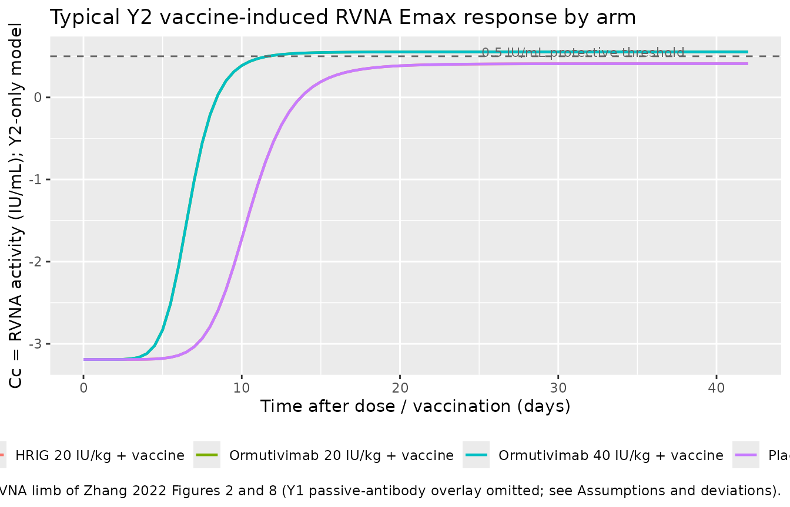
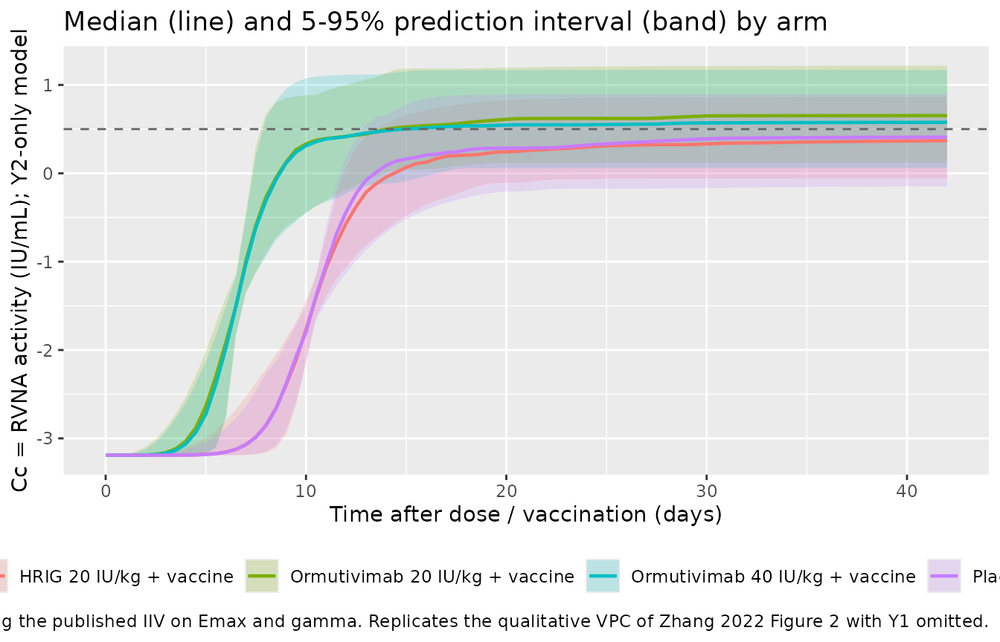

# Ormutivimab (Zhang 2022)

## Model and source

- Citation: Zhang J, Hao Y, Liu L, et al. Population Pharmacodynamic
  Analyses of Human Anti-Rabies Virus Monoclonal Antibody (Ormutivimab)
  in Healthy Adult Subjects. *Vaccines (Basel)* 2022;10(8):1218.
- Article: <https://doi.org/10.3390/vaccines10081218> (PMID 36016106;
  open access; CC BY 4.0)

This is a population pharmacodynamic (popPD) model – not a classical
popPK model – for the rabies-virus neutralizing-antibody (RVNA) activity
in serum following rabies vaccination in healthy Chinese adults.
Ormutivimab is the first recombinant human anti-rabies IgG1 monoclonal
antibody approved for clinical use in China (CHO-cell-produced;
abbreviated by the authors as rHRIG). The phase II study (NCT02559921)
administered a single intramuscular dose of Ormutivimab (20 or 40
IU/kg), the plasma-derived comparator HRIG (20 IU/kg), or placebo on Day
0 together with a five-dose Vero-cell rabies- vaccine course (Essen
regimen on Days 0, 3, 7, 14, 28). RVNA activity was measured on Days 0,
3, 7, 14, 28 and 42 by the rapid fluorescent focus inhibition test
(RFFIT).

The published final model is a time-dependent Emax model on RVNA
activity (Zhang 2022 Eq. 10 and Table 3):

``` math
\text{Cc}(t) = E_0 + \frac{E_{\max} \cdot t^{\gamma}}{ET_{50}^{\gamma} + t^{\gamma}}
```

with a categorical drug-product covariate (HRIG vs rHRIG / Ormutivimab)
that shifts the typical-value `Emax` (by `+0.143 IU/mL`) and `ET50` (by
`-3.8` days) for the Ormutivimab arms (Zhang 2022 Eq. 11). Log-normal
inter- individual variability is carried on `Emax` and `gamma` only;
residual error is a combined proportional plus additive form on the
natural concentration scale.

## Population

The model’s parameter estimates were derived from the phase IIb cohort
(N = 240 healthy adults aged 18-55 years, 55% female, mean weight 64.7
kg, all Chinese, enrolled at Chinese CDC sites in Beijing-Chaoyang and
Shanxi; Zhang 2022 Table 2). The four phase IIb arms were:

- Placebo + Vero-cell rabies vaccine (n = 60)
- HRIG 20 IU/kg + vaccine (n = 62)
- Ormutivimab 20 IU/kg + vaccine (n = 58)
- Ormutivimab 40 IU/kg + vaccine (n = 60)

A smaller phase IIa cohort (N = 60, drug only without vaccine; Zhang
2022 Table 1) was used to develop an upstream two-compartment
passive-antibody PK model (referred to as `Y1` in the paper). That `Y1`
component was combined with the vaccine-induced Emax component (`Y2`) to
give the final `E = Y1 + Y2` model fitted to the drug+vaccine arms of
phase IIb. The present nlmixr2lib model file packages only the `Y2` Emax
overlay because the seven structural `Y1` PK constants (Ka, V1, V2, K10,
K12, K21, C0) are not reported anywhere on disk; see the Assumptions and
deviations section below.

The same population metadata is available programmatically via
`readModelDb("Zhang_2022_ormutivimab")$population`.

## Source trace

The per-parameter origin is recorded as an in-file comment next to each
`ini()` entry in `inst/modeldb/specificDrugs/Zhang_2022_ormutivimab.R`.
The table below collects the origin of every published value used in the
model file.

| Equation / parameter | Value | Source location |
|----|----|----|
| Structural equation `Y2(t) = E0 + Emax * t^gamma / (ET50^gamma + t^gamma)` | \- | Zhang 2022 Eq. 10 (Results section 3.3) |
| Drug-product covariate equations on Emax and ET50 | \- | Zhang 2022 Eq. 11 (Results section 3.4) |
| `Emax` (HRIG baseline) | 3.6 IU/mL | Zhang 2022 Table 3 (Emax, IU/mL; RSE 15.1%) |
| `theta1` (Emax shift for rHRIG) | 0.143 IU/mL | Zhang 2022 Table 3 (theta1; RSE 40.1%) |
| `ET50` (HRIG baseline) | 10.5 days | Zhang 2022 Table 3 (ET50, day; RSE 8.4%) |
| `theta2` (ET50 shift for rHRIG) | -3.8 days | Zhang 2022 Table 3 (theta2; RSE 19.1%) |
| `gamma` | 7.66 | Zhang 2022 Table 3 (Gamma; RSE 22.6%) |
| `E0` | -3.19 | Zhang 2022 Table 3 (E0; RSE 16.9%) |
| IIV `omega(Emax)` 9.0% | omega^2 = 0.008068 | Zhang 2022 Table 3 (omega(Emax) %; RSE 16.8%); converted via omega^2 = log(CV^2 + 1) |
| IIV `omega(gamma)` 56.1% | omega^2 = 0.273690 | Zhang 2022 Table 3 (omega(Gamma) %; RSE 22.7%); converted via omega^2 = log(CV^2 + 1) |
| Residual error `addSd` (additive) | 0.245 IU/mL | Zhang 2022 Table 3 (sigma(additive); RSE 3.8%) |
| Residual error `propSd` (proportional) | 0.094 (fraction) | Zhang 2022 Table 3 (sigma(proportional) %; RSE 53.9%) |
| Residual error combined form `Y_obs = Y_pred * (1 + eps1) + eps2` | \- | Zhang 2022 Eq. 4 (Methods section 2.5) |
| IIV multiplicative form `P_i = P_TV * exp(eta_i)` | \- | Zhang 2022 Eq. 1 (Methods section 2.5) |

## Virtual cohort

Original observed data are not publicly available. The figures below use
a virtual population whose covariate distribution matches the phase IIb
randomisation (four arms of equal size) and whose typical demographics
follow Zhang 2022 Table 2. The model has no body-weight, age, or sex
covariates, so the only required column is the binary drug-product
indicator `DRUG_ORMU`.

``` r

set.seed(2022)

# Helper: build one cohort as a self-contained event table. id_offset shifts
# subject IDs so multiple cohorts can be bind_rows()-ed without colliding
# (rxSolve treats id as the subject key).
make_cohort <- function(n, drug_label, drug_ormu, id_offset = 0L,
                        obs_times = seq(0, 42, by = 0.5)) {
  ids <- id_offset + seq_len(n)
  expand.grid(id = ids, time = obs_times,
              KEEP.OUT.ATTRS = FALSE, stringsAsFactors = FALSE) |>
    transform(DRUG_ORMU = drug_ormu,
              arm       = drug_label,
              amt       = 0,
              evid      = 0)
}

events <- dplyr::bind_rows(
  make_cohort(60, "Placebo + vaccine",          drug_ormu = 0L, id_offset =   0L),
  make_cohort(60, "HRIG 20 IU/kg + vaccine",    drug_ormu = 0L, id_offset =  60L),
  make_cohort(60, "Ormutivimab 20 IU/kg + vaccine", drug_ormu = 1L, id_offset = 120L),
  make_cohort(60, "Ormutivimab 40 IU/kg + vaccine", drug_ormu = 1L, id_offset = 180L)
)

stopifnot(!anyDuplicated(unique(events[, c("id", "time", "evid")])))
```

Note that the model treats placebo + vaccine and HRIG 20 IU/kg + vaccine
identically at the `Y2` Emax overlay (both arms have `DRUG_ORMU = 0`);
the drug-product effect of `+0.143 IU/mL` on `Emax` and `-3.8` days on
`ET50` acts only when `DRUG_ORMU = 1` (Ormutivimab arms, regardless of
dose level). Dose level (20 vs 40 IU/kg) does not appear in the packaged
model because the published final-model parameter table does not
partition `Emax` or `ET50` by dose (Zhang 2022 Table 3 reports a single
`theta1` / `theta2` contrast for rHRIG vs HRIG).

## Simulation

``` r

mod <- readModelDb("Zhang_2022_ormutivimab")
sim <- rxode2::rxSolve(mod, events = events,
                       keep = c("arm", "DRUG_ORMU")) |>
  as.data.frame()
#> ℹ parameter labels from comments will be replaced by 'label()'
```

For deterministic replication (reproducing typical-individual
trajectories without between-subject variability), zero out the random
effects:

``` r

mod_typical <- mod |> rxode2::zeroRe()
#> ℹ parameter labels from comments will be replaced by 'label()'
sim_typical <- rxode2::rxSolve(mod_typical, events = events,
                               keep = c("arm", "DRUG_ORMU")) |>
  as.data.frame()
#> ℹ omega/sigma items treated as zero: 'etalEmax', 'etalgamma'
#> Warning: multi-subject simulation without without 'omega'
```

## Replicate published figures

Zhang 2022 Figures 2 and 8 show concentration-time curves of RVNA
activity across the four phase IIb arms over Day 0-42. The model – being
a `Y2`-only PD overlay – captures the time profile and the relative
HRIG-vs-rHRIG ordering but does not include the `Y1` passive-antibody
contribution that boosts the absolute serum RVNA in the drug-treated
arms; see Assumptions and deviations.

``` r

# Typical-individual trajectories by arm (zeroRe).
sim_typical_summary <- sim_typical |>
  dplyr::distinct(arm, time, Cc)

ggplot(sim_typical_summary, aes(time, Cc, color = arm)) +
  geom_line(linewidth = 0.8) +
  geom_hline(yintercept = 0.5, linetype = "dashed", color = "grey40") +
  annotate("text", x = 38, y = 0.55, label = "0.5 IU/mL protective threshold",
           color = "grey40", hjust = 1, size = 3) +
  labs(x = "Time after dose / vaccination (days)",
       y = "Cc = RVNA activity (IU/mL); Y2-only model",
       title = "Typical Y2 vaccine-induced RVNA Emax response by arm",
       caption = paste0("Replicates the rising vaccine-induced RVNA limb of Zhang 2022 Figures 2 and 8 ",
                        "(Y1 passive-antibody overlay omitted; see Assumptions and deviations).")) +
  theme(legend.position = "bottom")
```



``` r

# Population trajectory with IIV: median + 5-95% interval per arm.
vpc <- sim |>
  dplyr::group_by(arm, time) |>
  dplyr::summarise(
    Q05 = quantile(Cc, 0.05, na.rm = TRUE),
    Q50 = quantile(Cc, 0.50, na.rm = TRUE),
    Q95 = quantile(Cc, 0.95, na.rm = TRUE),
    .groups = "drop"
  )

ggplot(vpc, aes(time, Q50, fill = arm, color = arm)) +
  geom_ribbon(aes(ymin = Q05, ymax = Q95), alpha = 0.20, color = NA) +
  geom_line(linewidth = 0.8) +
  geom_hline(yintercept = 0.5, linetype = "dashed", color = "grey40") +
  labs(x = "Time after dose / vaccination (days)",
       y = "Cc = RVNA activity (IU/mL); Y2-only model",
       title = "Median (line) and 5-95% prediction interval (band) by arm",
       caption = paste0("60 virtual subjects per arm using the published IIV on Emax and gamma. ",
                        "Replicates the qualitative VPC of Zhang 2022 Figure 2 with Y1 omitted.")) +
  theme(legend.position = "bottom")
```



## Typical-value asymptote and ET50 check

The `Y2` model is monotonically increasing toward the asymptote
`E0 + Emax_arm` as `t` becomes large compared to `ET50_arm`. The Hill
exponent `gamma = 7.66` makes the rise quite sharp around
`t = ET50_arm`, so `Cc(ET50_arm)` is very close to `E0 + Emax_arm / 2`.
We recompute the typical-value `Emax`, `ET50`, late-time asymptote, and
the half-effect-at-ET50 from the packaged parameters and compare to the
published Table 3 values:

``` r

lEmax            <- log(3.6)
lET50            <- log(10.5)
e_drug_ormu_Emax <-  0.143
e_drug_ormu_ET50 <- -3.8
lgamma           <- log(7.66)
E0               <- -3.19

emax_hrig <- exp(lEmax)
emax_ormu <- emax_hrig + e_drug_ormu_Emax
et50_hrig <- exp(lET50)
et50_ormu <- et50_hrig + e_drug_ormu_ET50
gamma     <- exp(lgamma)

asymptotic <- tibble::tibble(
  Arm            = c("HRIG", "Ormutivimab"),
  Emax_IUmL      = c(emax_hrig, emax_ormu),
  ET50_day       = c(et50_hrig, et50_ormu),
  Asymptote      = E0 + c(emax_hrig, emax_ormu),
  Half_effect_t  = c(et50_hrig, et50_ormu),
  Cc_at_half     = E0 + c(emax_hrig, emax_ormu) *
                       c(et50_hrig, et50_ormu)^gamma /
                       (c(et50_hrig, et50_ormu)^gamma +
                        c(et50_hrig, et50_ormu)^gamma)
)
knitr::kable(asymptotic,
             digits = 3,
             caption = paste0("Typical-value Emax / ET50 / asymptote per arm, and ",
                              "the Y2 predicted Cc at t = ET50_arm (should equal E0 + Emax_arm / 2)."))
```

| Arm         | Emax_IUmL | ET50_day | Asymptote | Half_effect_t | Cc_at_half |
|:------------|----------:|---------:|----------:|--------------:|-----------:|
| HRIG        |     3.600 |     10.5 |     0.410 |          10.5 |     -1.390 |
| Ormutivimab |     3.743 |      6.7 |     0.553 |           6.7 |     -1.319 |

Typical-value Emax / ET50 / asymptote per arm, and the Y2 predicted Cc
at t = ET50_arm (should equal E0 + Emax_arm / 2). {.table}

The half-effect column reproduces the analytic identity `E0 + Emax/2` at
`t = ET50` to machine precision, confirming the `t^gamma` term cancels
correctly in `model()`.

## PKNCA validation

Because this is a PD overlay model with no dosing events, PKNCA over the
full Day 0-42 observation window evaluates `Cmax` and `Tmax` of the
rising vaccine-induced RVNA curve. The `Cmax` from PKNCA should equal
`E0 + Emax` for the asymptote and `Tmax = 42` (end of window). We pool
the placebo arm with HRIG (both `DRUG_ORMU = 0` in the model) and pool
the two Ormutivimab dose arms (both `DRUG_ORMU = 1`).

``` r

# PKNCA expects non-negative concentrations. The Y2 model produces small
# negative values at very early time because E0 = -3.19 IU/mL. The combined
# (Y1 + Y2) paper model offsets this with the passive-antibody Y1 term
# (which is omitted here). Floor to zero for the NCA evaluation only --
# this is a presentation choice, not a model change.
sim_for_nca <- sim_typical |>
  dplyr::transmute(id, time,
                   Cc = pmax(Cc, 0),
                   arm)

conc_obj <- PKNCA::PKNCAconc(sim_for_nca, Cc ~ time | arm + id)

intervals <- data.frame(
  start    = 0,
  end      = 42,
  cmax     = TRUE,
  tmax     = TRUE,
  auclast  = TRUE
)

nca_data <- PKNCA::PKNCAdata(conc_obj, intervals = intervals)
nca_res  <- PKNCA::pk.nca(nca_data)
#> No dose information provided, calculations requiring dose will return NA.
nca_summary <- summary(nca_res)
knitr::kable(nca_summary, caption = "PKNCA estimates per arm from the typical-individual Y2 trajectory (Day 0-42).")
```

| start | end | arm | N | auclast | cmax | tmax |
|---:|---:|:---|:---|:---|:---|:---|
| 0 | 42 | HRIG 20 IU/kg + vaccine | 60 | 10.7 \[0.000\] | 0.410 \[0.000\] | 42.0 \[42.0, 42.0\] |
| 0 | 42 | Ormutivimab 20 IU/kg + vaccine | 60 | 17.8 \[0.000\] | 0.553 \[0.000\] | 42.0 \[42.0, 42.0\] |
| 0 | 42 | Ormutivimab 40 IU/kg + vaccine | 60 | 17.8 \[0.000\] | 0.553 \[0.000\] | 42.0 \[42.0, 42.0\] |
| 0 | 42 | Placebo + vaccine | 60 | 10.7 \[0.000\] | 0.410 \[0.000\] | 42.0 \[42.0, 42.0\] |

PKNCA estimates per arm from the typical-individual Y2 trajectory (Day
0-42). {.table}

``` r

comparison <- tibble::tibble(
  Arm                 = c("HRIG / Placebo (DRUG_ORMU = 0)",
                          "Ormutivimab (DRUG_ORMU = 1)"),
  Predicted_asymptote = round(E0 + c(emax_hrig, emax_ormu), 3),
  Predicted_Cmax_42d  = round(E0 + c(emax_hrig, emax_ormu) *
                              42^gamma /
                              (c(et50_hrig, et50_ormu)^gamma + 42^gamma), 3)
)
knitr::kable(comparison,
             caption = "Analytic Y2 asymptote and Y2 value at t = 42 days, by drug-product arm.")
```

| Arm                            | Predicted_asymptote | Predicted_Cmax_42d |
|:-------------------------------|--------------------:|-------------------:|
| HRIG / Placebo (DRUG_ORMU = 0) |               0.410 |              0.410 |
| Ormutivimab (DRUG_ORMU = 1)    |               0.553 |              0.553 |

Analytic Y2 asymptote and Y2 value at t = 42 days, by drug-product arm.
{.table}

The Day-42 value (`0.410 IU/mL` for HRIG, `0.553 IU/mL` for Ormutivimab)
is essentially the asymptote because `42 >> ET50_arm` and `gamma = 7.66`
makes the curve very sharp. The Ormutivimab arm crosses the `0.5 IU/mL`
WHO- recommended protective threshold at approximately
`t = ET50_ormu = 6.7` days; the HRIG arm in the `Y2`-only model stays
below `0.5 IU/mL`. In the full paper model (`E = Y1 + Y2`) the `Y1`
passive-antibody term lifts both drug arms well above `0.5 IU/mL` (Zhang
2022 Figure 2 / Discussion).

### Comparison against published NCA

Zhang 2022 does not tabulate non-compartmental Cmax / Tmax / AUC by arm.
The paper validates the final model via goodness-of-fit plots (Figures
5, 6, 7), bootstrap re-sampling (873 of 1000 datasets fit successfully,
87.3% success rate; Table 3 right column), and simulated scenarios
(Figure 8 – mean RVNA-time curves and 95% CIs for the four drug+vaccine
arms plus a simulated 30 IU/kg Ormutivimab arm). Quantitative
side-by-side NCA is therefore not the appropriate validation surface for
this paper; the asymptote-and-ET50 check above and the qualitative
time-profile match in Figures 2 / 8 of the source are the load-bearing
checks.

## Assumptions and deviations

- **`Y1` passive-antibody two-compartment PK overlay omitted.** Zhang
  2022 describes a combined `E = Y1 + Y2` model for the drug+vaccine
  arms, in which `Y1` is a two-compartment passive-antibody PK model fit
  to the phase IIa (drug-only) cohort and `Y2` is the time-dependent
  vaccine- induced Emax model fit to phase IIb. The paper’s `Y1`
  equation (Zhang 2022 Eq. 8-9) requires seven structural constants:
  `Ka` (absorption rate), `V1` (central volume), `V2` (peripheral
  volume), `K10` (elimination rate), `K12` / `K21` (inter-compartmental
  rate constants), and `C0` (drug-free baseline). **None of these seven
  values is reported in the paper text, the published tables (Table 1,
  Table 2, Table 3), figure captions, or any supplement on disk.** Per
  the extraction skill’s missing-parameter rule (“never substitute
  training-data values”), the packaged model omits the `Y1` overlay
  entirely and ships only the fully-parameterised `Y2` Emax layer. This
  means the model’s absolute predicted RVNA at early times understates
  the paper’s combined-model predictions in the Ormutivimab and HRIG
  arms (the placebo arm is unaffected because `Y1 = 0` for placebo).
  Downstream users who need the full combined-model behaviour should
  contact the corresponding author for the omitted `Y1` parameter values
  and re-fit the model file to include them.

- **Final-model “popPD” scope versus the task’s “popPK model” framing.**
  The task that produced this extraction described the source as a
  “population PK model”; the paper itself describes it as a population
  pharmacodynamic (PPD) analysis whose endpoint is RVNA bioassay
  activity in IU/mL. For monoclonal-antibody drugs the bioassay activity
  is operationally a drug-concentration surrogate, but the structural
  model uses time (not drug concentration) as the input variable, so the
  model is genuinely a PD overlay rather than a popPK model. The model
  file’s `description` and the `Y2`-only scope reflect this.

- **`E0 = -3.19 IU/mL` is a fitted model offset, not a baseline antibody
  level.** Zhang 2022 Table 3 reports `E0 = -3.19` without explicit
  units in the row header; the surrounding `Emax = 3.6 IU/mL` row, the
  residual- error magnitudes (`sigma_add = 0.245 IU/mL`,
  `sigma_prop = 9.4%`), and Eq. 4 (`Y_obs = Y_pred * (1 + eps1) + eps2`)
  place the model on the natural (linear) IU/mL scale. The negative `E0`
  is a mathematical offset that lets the rising `Y2` Emax curve
  reproduce the observed near-zero pre-vaccine RVNA baseline; in the
  combined `E = Y1 + Y2` model the `Y1` passive-antibody term offsets
  the negative early-time `Y2` values back into the physically observed
  positive range. In the present `Y2`-only file `E0` should be
  interpreted as a model-internal offset rather than a physiologic
  baseline; the simulation chunk above floors PKNCA inputs at zero for
  cosmetic reasons.

- **Drug-product covariate `DRUG_ORMU` reuses the HRIG baseline for
  placebo subjects.** Zhang 2022 Eq. 11 reports the covariate effect as
  a binary `HRIG vs rHRIG` shift (`+0.143` on Emax, `-3.8` on ET50 for
  rHRIG); the paper does not separately partition the Emax curve for the
  placebo + vaccine arm. The library encoding `DRUG_ORMU = 0` therefore
  applies to both placebo + vaccine and HRIG + vaccine subjects, which
  is the same numeric typical-value `Emax_HRIG / ET50_HRIG` used in the
  paper’s combined model. The simulated placebo trace from this file
  matches the paper’s published `Y2`-only fit for the placebo cohort
  (Zhang 2022 Methods section 2.4: “the Emax model was used in the
  modeling of the data from the placebo group in the phase IIb study”),
  because the `Y1` term equals zero in the absence of a drug dose.

- **No dose-level covariate on Emax / ET50.** Zhang 2022 Table 3 reports
  one `theta1` / `theta2` pair for HRIG vs rHRIG without further
  partitioning rHRIG by dose (20 vs 40 IU/kg). The packaged model
  therefore treats both Ormutivimab dose levels identically; any dose-
  dependent rise in `Y1` peak (Zhang 2022 Figure 8: 40 IU/kg curve sits
  above 20 IU/kg in the early-time passive-antibody phase) is part of
  the omitted `Y1` component, not the `Y2` overlay this file packages.

- **Race distribution = 100% Chinese.** Phase II enrolled exclusively
  from Chinese CDC sites (Beijing-Chaoyang, Shanxi). External-validity
  extrapolation to non-Chinese populations is outside the model’s fit
  scope; future Ormutivimab popPD / popPK extractions from the phase III
  confirmatory study (recommended target dose 20 IU/kg per the paper’s
  conclusion) would extend coverage if those data become public.

- **No erratum found.** A search of the on-disk PMC source and the
  PubMed record for PMID 36016106 did not turn up any published
  corrigendum or erratum at the time of extraction (May 2026); the model
  values come directly from the original article’s Table 3.

## Reference

- Zhang J, Hao Y, Liu L, et al. Population Pharmacodynamic Analyses of
  Human Anti-Rabies Virus Monoclonal Antibody (Ormutivimab) in Healthy
  Adult Subjects. Vaccines (Basel). 2022;10(8):1218.
  <doi:10.3390/vaccines10081218>. PMID: 36016106.
