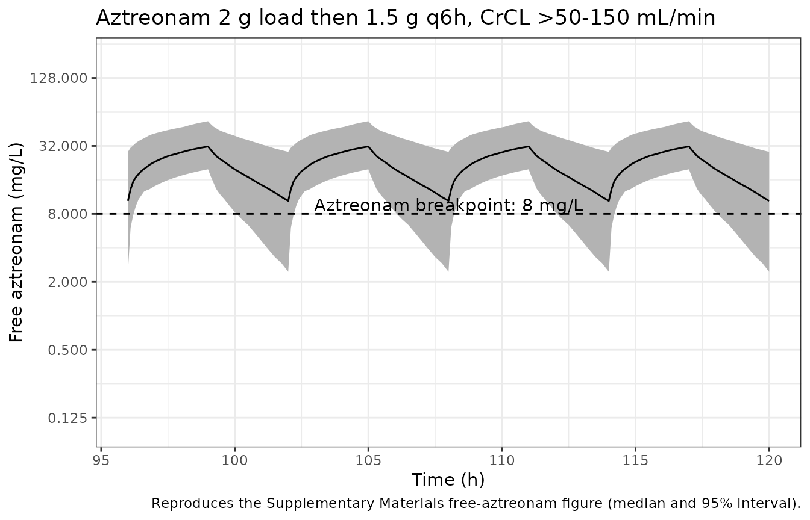
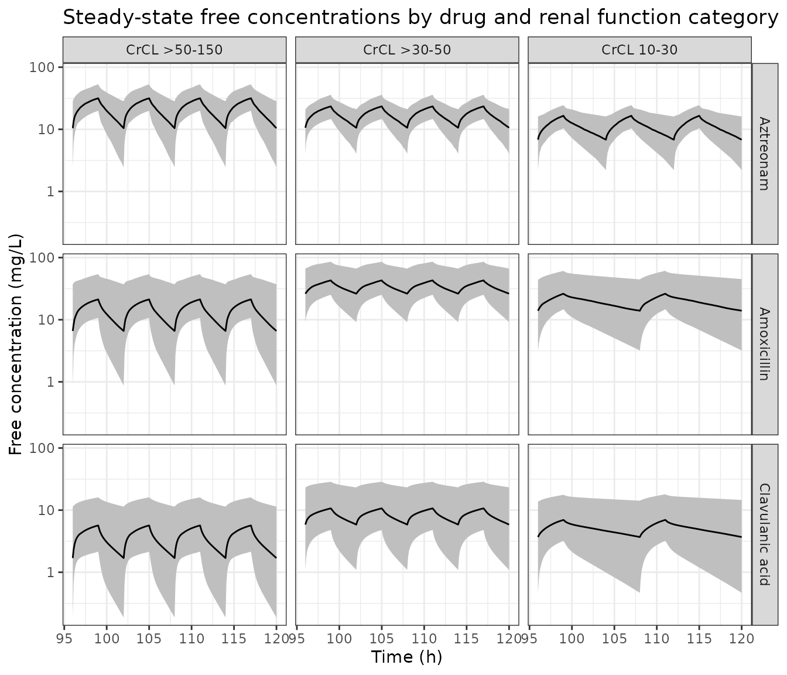
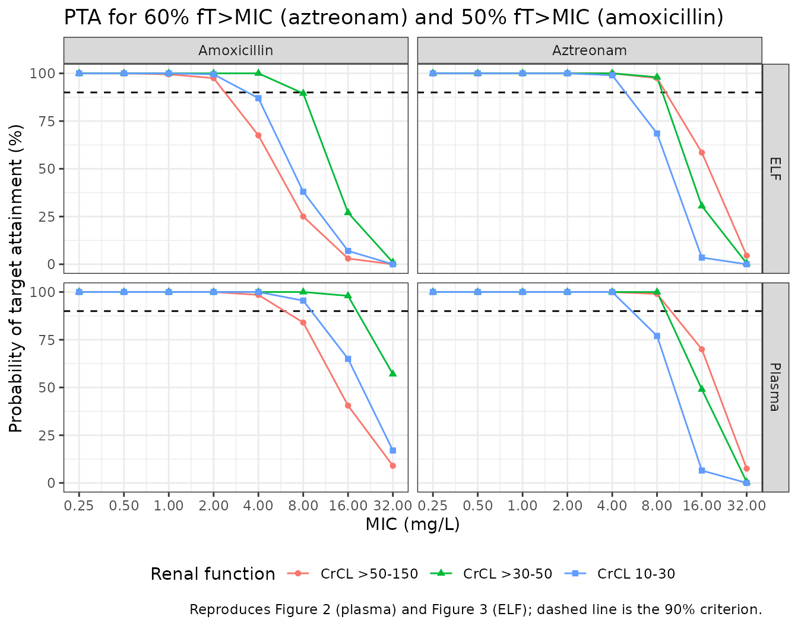

# Aztreonam + amoxicillin/clavulanate mutant-selection PK/PD (Zhang 2023)

## Model and source

Zhang 2023 combined in vitro susceptibility testing of NDM- and
serine-beta-lactamase co-producing *Escherichia coli* and *Klebsiella
pneumoniae* with population PK simulation, to ask whether clinical
aztreonam and amoxicillin/clavulanate regimens keep free drug
concentrations above the mutant prevention concentration (MPC) and out
of the mutant selection window (MSW).

The PK layer is three independent two-compartment intravenous models,
one per drug, each transcribed from an upstream publication and used as
a fixed simulation prior. They are packaged separately because the
authors used them separately: nothing is jointly fitted and no parameter
is shared.

``` r

mdlNames <- c(
  "Zhang_2023_aztreonam",
  "Zhang_2023_amoxicillin",
  "Zhang_2023_clavulanicAcid"
)
mAtm <- rxode2::rxode(readModelDb("Zhang_2023_aztreonam"))
mAmx <- rxode2::rxode(readModelDb("Zhang_2023_amoxicillin"))
mCla <- rxode2::rxode(readModelDb("Zhang_2023_clavulanicAcid"))
```

- Citation: Zhang J, Wu M, Diao S, Zhu S, Song C, Yue J, Martins FS, Zhu
  P, Lv Z, Zhu Y, Yu M, Sy SKB. Pharmacokinetic/pharmacodynamic
  evaluation of aztreonam/amoxicillin/clavulanate combination against
  New Delhi metallo-beta-lactamase and serine-beta-lactamase
  co-producing Escherichia coli and Klebsiella pneumoniae.
  Pharmaceutics. 2023;15(1):251. <doi:10.3390/pharmaceutics15010251>
  (Section 2.4; Supplementary Materials ‘Detailed description of
  pharmacokinetic models’ and the sample RxODE script). Structural model
  and parameter estimates originate from Xu H, Zhou W, Zhou D, Li J,
  Al-Huniti N. J Clin Pharmacol. 2017;57(3):336-344, the aztreonam
  population PK analysis in patients with normal and impaired renal
  function; the dosing regimens simulated are those of the REJUVENATE
  study (Cornely OA et al. J Antimicrob Chemother. 2020;75(3):618-627).
- Article: <https://doi.org/10.3390/pharmaceutics15010251>
- Supplement:
  <https://www.mdpi.com/article/10.3390/pharmaceutics15010251/s1>

| Model | Description |
|:---|:---|
| Zhang_2023_aztreonam | Two-compartment intravenous population PK model for aztreonam, as implemented by Zhang 2023 to simulate steady-state free-drug exposure in a 10,000-subject virtual population spanning creatinine clearance 10-150 mL/min/1.73 m2, for a pharmacodynamic analysis of mutant selection by the aztreonam/amoxicillin/clavulanate combination against NDM- and serine-beta-lactamase co-producing Escherichia coli and Klebsiella pneumoniae. Clearance is a power function of BSA-normalized creatinine clearance referenced to 100 mL/min/1.73 m2; central volume is a power function of body weight referenced to 70 kg with a near-quadratic exponent (1.99). Three algebraic observables are exposed: total plasma concentration Cc, unbound plasma concentration Ccfree = Cc \* 0.44 (aztreonam is 56% protein bound), and epithelial-lining-fluid concentration Celf = Cc \* 0.40, which the paper treats as entirely unbound because no mucin binding was assumed. Every parameter is a FIXED prior transcribed from the upstream renal-impairment analysis; Zhang 2023 estimated nothing and reported no residual error, so the residual SD is carried structurally at zero (see vignette Errata). |
| Zhang_2023_amoxicillin | Two-compartment intravenous population PK model for amoxicillin, as implemented by Zhang 2023 to simulate steady-state free-drug exposure in a 10,000-subject virtual population spanning creatinine clearance 10-150 mL/min/1.73 m2, for a pharmacodynamic analysis of mutant selection by the aztreonam/amoxicillin/clavulanate combination against NDM- and serine-beta-lactamase co-producing Escherichia coli and Klebsiella pneumoniae. Clearance is LINEARLY proportional to BSA-normalized creatinine clearance referenced to 102 mL/min/1.73 m2 (no power exponent); the volumes and intercompartmental clearance carry no covariates. Three algebraic observables are exposed: total plasma concentration Cc, unbound plasma concentration Ccfree = Cc \* 0.83 (amoxicillin is 17% protein bound), and epithelial-lining-fluid concentration Celf = Cc \* 0.30, which the paper treats as entirely unbound because no mucin binding was assumed. Every parameter is a FIXED prior transcribed from the upstream critically-ill analysis; Zhang 2023 estimated nothing and reported no residual error, so the residual SD is carried structurally at zero (see vignette Errata). The clavulanate co-formulant is a separate model, modellib(‘Zhang_2023_clavulanicAcid’). |
| Zhang_2023_clavulanicAcid | Two-compartment intravenous population PK model for clavulanic acid (clavulanate), as implemented by Zhang 2023 to simulate steady-state free-drug exposure in a 10,000-subject virtual population spanning creatinine clearance 10-150 mL/min/1.73 m2, for a pharmacodynamic analysis of mutant selection by the aztreonam/amoxicillin/clavulanate combination against NDM- and serine-beta-lactamase co-producing Escherichia coli and Klebsiella pneumoniae. Clearance is LINEARLY proportional to BSA-normalized creatinine clearance referenced to 102 mL/min/1.73 m2 (no power exponent); the volumes and intercompartmental clearance carry no covariates. Three algebraic observables are exposed: total plasma concentration Cc, unbound plasma concentration Ccfree = Cc \* 0.75 (clavulanate is approximately 25% protein bound), and epithelial-lining-fluid concentration Celf = Cc \* 0.30, which the paper treats as entirely unbound because no mucin binding was assumed. Every parameter is a FIXED prior transcribed from the upstream critically-ill analysis; Zhang 2023 estimated nothing and reported no residual error, so the residual SD is carried structurally at zero (see vignette Errata). Zhang 2023 deliberately ran NO target-attainment simulations for clavulanate because its pharmacodynamic target is not established, so this model is exposed for exposure simulation only. The amoxicillin co-formulant is a separate model, modellib(‘Zhang_2023_amoxicillin’). |

## Population

There is no enrolled PK cohort. Zhang 2023 simulated 10,000 virtual
subjects (Section 2.4 and the Supplementary Materials script): sex in
equal proportion, height drawn from US anthropometric reference
distributions, body weight derived from height, and creatinine clearance
drawn from a uniform distribution over 10 to 150 mL/min normalised to
1.73 m2. The lower bound of 10 mL/min excludes patients on
haemodialysis. The parameter estimates themselves come from the upstream
analyses cited in each model’s `reference` field: an aztreonam analysis
in patients with normal and impaired renal function, and an
amoxicillin/clavulanic acid analysis in critically ill patients.

The same information is available programmatically:

``` r

readModelDb("Zhang_2023_aztreonam")()$population[c("species", "n_subjects", "renal_function")]
#> $species
#> [1] "human"
#> 
#> $n_subjects
#> [1] 10000
#> 
#> $renal_function
#> [1] "creatinine clearance 10-150 mL/min/1.73 m2, uniformly distributed"
```

## Source trace

Per-parameter origins are recorded as in-file comments beside each
`ini()` entry in `inst/modeldb/specificDrugs/Zhang_2023_*.R`. Collected
here for review. Section references are to the main text; “Suppl.” is
the Supplementary Materials PDF.

| Equation / parameter | Value | Source location |
|----|----|----|
| Two-compartment IV ODE system | n/a | Suppl., “Detailed description of pharmacokinetic models” |
| Aztreonam `cl` at CRCL 100 | 4.93 L/h | Suppl. aztreonam equation and both RxODE code blocks (main text Section 2.4 prints 4.73; see Errata) |
| Aztreonam `e_crcl_cl` | 0.43 | Section 2.4; Suppl. aztreonam equation |
| Aztreonam `vc` at 70 kg | 7.43 L | Section 2.4; Suppl. aztreonam equation |
| Aztreonam `e_wt_vc` | 1.99 | Section 2.4; Suppl. aztreonam equation |
| Aztreonam `vp` | 6.44 L | Section 2.4; Suppl. aztreonam equation |
| Aztreonam `q` | 9.26 L/h | Section 2.4; Suppl. aztreonam equation |
| Aztreonam IIV on `cl`, `vc`, `vp` | 0.241, 0.509, 0.277 (log SD) | Section 2.4 (24.1%, 50.9%, 27.7% CV); Suppl. `rnorm(sd = )` arguments |
| Aztreonam `fu` | 0.44 | Section 2.4 (“plasma protein binding of aztreonam is 56%”); Suppl. `res$free <- res$value*(1-0.56)` |
| Aztreonam `relf` | 0.40 | Section 3.4 (“A 40% penetration into the ELF was assumed”); see Errata for the conflict with Section 2.4 |
| Amoxicillin `cl` at CRCL 102 | 10.3 L/h, linear in CRCL | Section 2.4; Suppl. amoxicillin equation |
| Amoxicillin `vc`, `vp`, `q` | 13.5 L, 14.1 L, 15.7 L/h | Section 2.4; Suppl. amoxicillin equation |
| Amoxicillin IIV on `cl`, `vc` | 0.399, 0.387 (log SD) | Section 2.4 (39.9%, 38.7% CV); Suppl. amoxicillin equation |
| Amoxicillin `fu` | 0.83 | Section 2.4 (“Amoxicillin plasma protein binding is 17%”) |
| Clavulanic acid `cl` at CRCL 102 | 6.8 L/h, linear in CRCL | Section 2.4; Suppl. clavulanate equation |
| Clavulanic acid `vc`, `vp`, `q` | 7.6 L, 11.6 L, 10.4 L/h | Section 2.4; Suppl. clavulanate equation |
| Clavulanic acid IIV on `cl`, `vc` | 0.578, 0.347 (log SD) | Section 2.4 (57.8%, 34.7% CV); Suppl. clavulanate equation |
| Clavulanic acid `fu` | 0.75 | Section 2.4 (“Clavulanate is approximately 25% protein bound”), so 1 - 0.25 |
| Amoxicillin / clavulanate `relf` | 0.30 | Sections 2.4 and 3.4 |
| Dosing regimens by renal category | see below | Table 1; Suppl. `add.dosing` calls |
| Virtual population height and weight | see below | Suppl., “Detailed description of pharmacokinetic models” |
| Combination MIC per isolate | see below | Table 2, ATM/AMC/CA column |
| MPC per isolate | see below | Table 3, ATM/AMC/CA column |
| Plasma `fTMSW` and `fT>MPC` targets | see below | Table 4 |
| ELF `fTMSW` and `fT>MPC` targets | see below | Table 5 |
| PD index targets | 60% and 50% `fT>MIC` | Section 2.6 |

## Virtual cohort

Original observed data are not publicly available; the paper’s own PK
input was a simulated cohort, which this vignette reconstructs from the
Supplementary Materials equations. Cohorts are capped at 200 subjects
per arm.

``` r

NPER <- 200L
# Steady state is evaluated over the final 24 h of a 120 h dosing run. The
# slowest subjects (low CRCL, high Vc) have a terminal half-life near 6 h, so
# 96 h of dosing is more than 15 half-lives before the evaluation window.
T0 <- 96
T1 <- 120

# Suppl. virtual-population weight model. Heights are drawn from the sex-specific
# US reference distributions, then converted to weight; the /100 cm-to-m
# conversion appears only in the Suppl. RxODE script, not in its typeset equation.
simWeight <- function(n) {
  sexf <- round(stats::runif(n, 0, 1))
  htm <- round(stats::rnorm(n, 176.3, 0.17 * sqrt(4482)), 1)
  htf <- round(stats::rnorm(n, 162.2, 0.16 * sqrt(4857)), 1)
  wtm <- round(exp(3.28 + 1.92 * log(htm / 100)) * exp(stats::rnorm(n, 0, 0.14)), 1)
  wtf <- round(exp(3.49 + 1.45 * log(htf / 100)) * exp(stats::rnorm(n, 0, 0.17)), 1)
  ifelse(sexf == 1, wtf, wtm)
}

# Suppl. sampling grid (0.1 h for the first part of each interval, 0.25 h for the
# last 2 h), replicated across the final 24 h only.
obsGrid <- function(ii, t0 = T0) {
  t1 <- t0 + 24
  off <- c(seq(0, ii - 2, by = 0.1), seq(ii - 1.75, ii - 0.25, by = 0.25))
  sort(unique(c(as.vector(outer(off, seq(t0, t1 - ii, by = ii), "+")), t1)))
}

# One arm as a self-contained event table. `idOffset` keeps subject IDs disjoint
# across arms, which rxSolve requires: duplicate IDs are silently merged.
# `t0` opens the 24 h evaluation window; it is only moved off T0 by the arm-3
# diagnostic below.
makeArm <- function(n, crclLo, crclHi, ldAmt, mdAmt, ii, arm, idOffset, t0 = T0) {
  ev <- rxode2::et(amt = ldAmt, dur = 3, time = 0)
  ev <- rxode2::et(ev, amt = mdAmt, dur = 3, time = ii,
                   ii = ii, addl = ceiling((t0 + 24 - ii) / ii))
  ev <- rxode2::et(ev, obsGrid(ii, t0))
  base <- as.data.frame(ev)
  base$.row <- seq_len(nrow(base))
  subj <- data.frame(
    id = idOffset + seq_len(n),
    CRCL = round(stats::runif(n, crclLo, crclHi)),
    WT = simWeight(n),
    arm = arm,
    stringsAsFactors = FALSE
  )
  out <- merge(subj, base, by = NULL)
  out <- out[order(out$id, out$.row), setdiff(names(out), ".row")]
  rownames(out) <- NULL
  out
}

# rxSolve on an rxUi is quadratic in the number of subjects per call, so each arm
# is solved separately rather than binding all arms into one event table.
solveArm <- function(mod, ev) {
  as.data.frame(
    rxode2::rxSolve(mod, ev, keep = c("arm", "CRCL", "WT"), addDosing = FALSE)
  )
}
```

Table 1 dosing regimens, all as 3 h infusions with the same interval for
both drugs. The 2 g aztreonam and 1 g amoxicillin loading doses do not
affect steady-state metrics and are carried only for fidelity.

``` r

armLabels <- c("CrCL >50-150", "CrCL >30-50", "CrCL 10-30")
regimens <- tibble::tribble(
  ~arm,             ~crclLo, ~crclHi, ~atmLd, ~atmMd, ~atmIi, ~amxLd, ~amxMd, ~claLd, ~claMd, ~amcIi,
  armLabels[1],     51,      150,     2000,   1500,   6,      1000,   1000,   200,    200,    6,
  armLabels[2],     31,      50,      2000,    750,   6,      1000,   1000,   200,    200,    6,
  armLabels[3],     10,      30,      2000,    500,   8,      1000,    500,   200,    100,    12
)
knitr::kable(regimens, caption = "Regimens transcribed from Table 1 (doses in mg, intervals in h).")
```

| arm           | crclLo | crclHi | atmLd | atmMd | atmIi | amxLd | amxMd | claLd | claMd | amcIi |
|:--------------|-------:|-------:|------:|------:|------:|------:|------:|------:|------:|------:|
| CrCL \>50-150 |     51 |    150 |  2000 |  1500 |     6 |  1000 |  1000 |   200 |   200 |     6 |
| CrCL \>30-50  |     31 |     50 |  2000 |   750 |     6 |  1000 |  1000 |   200 |   200 |     6 |
| CrCL 10-30    |     10 |     30 |  2000 |   500 |     8 |  1000 |   500 |   200 |   100 |    12 |

Regimens transcribed from Table 1 (doses in mg, intervals in h). {.table
style="width:100%;"}

## Simulation

``` r

# Seed immediately before this stochastic block. set.seed() governs the R-level
# covariate draws; rxSetSeed() governs rxode2's eta draws. Both are needed.
set.seed(20230111)
rxode2::rxSetSeed(20230111)

simAtm <- list()
simAmx <- list()
simCla <- list()
for (i in seq_len(nrow(regimens))) {
  r <- regimens[i, ]
  off <- 1000L * i
  simAtm[[r$arm]] <- solveArm(
    mAtm, makeArm(NPER, r$crclLo, r$crclHi, r$atmLd, r$atmMd, r$atmIi, r$arm, off)
  )
  simAmx[[r$arm]] <- solveArm(
    mAmx, makeArm(NPER, r$crclLo, r$crclHi, r$amxLd, r$amxMd, r$amcIi, r$arm, off + 100L)
  )
  simCla[[r$arm]] <- solveArm(
    mCla, makeArm(NPER, r$crclLo, r$crclHi, r$claLd, r$claMd, r$amcIi, r$arm, off + 200L)
  )
}
#> ℹ omega/sigma items treated as zero: 'etalq'
#> ℹ omega/sigma items treated as zero: 'etalvp', 'etalq'
#> ℹ omega/sigma items treated as zero: 'etalvp', 'etalq'
#> ℹ omega/sigma items treated as zero: 'etalq'
#> ℹ omega/sigma items treated as zero: 'etalvp', 'etalq'
#> ℹ omega/sigma items treated as zero: 'etalvp', 'etalq'
#> ℹ omega/sigma items treated as zero: 'etalq'
#> ℹ omega/sigma items treated as zero: 'etalvp', 'etalq'
#> ℹ omega/sigma items treated as zero: 'etalvp', 'etalq'
stopifnot(
  vapply(simAtm, function(d) length(unique(d$id)), integer(1)) == NPER,
  vapply(simAmx, function(d) length(unique(d$id)), integer(1)) == NPER,
  vapply(simCla, function(d) length(unique(d$id)), integer(1)) == NPER
)
```

### Pharmacodynamic metric definitions

`fT>MIC` and `fT>MPC` are the fractions of the 24 h window in which the
free drug concentration exceeds the MIC and the MPC. `fTMSW`, the time
spent in the mutant selection window, is their difference (Section 2.5
and Suppl., “Derivation of pharmacodynamic parameters”). Crossing times
are found by linear interpolation, as the Supplement specifies.

``` r

fracAbove <- function(tt, cc, thr) {
  above <- cc > thr
  if (!any(above)) return(0)
  if (all(above)) return(1)
  n <- length(tt)
  dt <- diff(tt)
  a <- above[-n]
  b <- above[-1]
  full <- sum(dt[a & b])
  part <- 0
  idx <- which(xor(a, b))
  if (length(idx)) {
    f <- (thr - cc[idx]) / (cc[idx + 1L] - cc[idx])
    part <- sum(ifelse(a[idx], f, 1 - f) * dt[idx])
  }
  (full + part) / (tt[n] - tt[1])
}

# Per-subject fT above a threshold on the named concentration column.
ftPerSubject <- function(sim, concCol, thr, t0 = T0) {
  s <- sim[sim$time >= t0, ]
  vapply(split(s, s$id), function(d) {
    o <- order(d$time)
    fracAbove(d$time[o], d[[concCol]][o], thr)
  }, numeric(1))
}

# Mean fT>MPC and fTMSW over the cohort, in percent.
pdSummary <- function(sim, concCol, mic, mpc, t0 = T0) {
  ftMic <- ftPerSubject(sim, concCol, mic, t0)
  ftMpc <- ftPerSubject(sim, concCol, mpc, t0)
  c(ftmpc = 100 * mean(ftMpc), ftmsw = 100 * mean(ftMic - ftMpc))
}
```

### In vitro susceptibility of the seven isolates

Combination MIC values come from the ATM/AMC/CA column of Table 2 and
MPC values from the same column of Table 3. Isolates EC13 and EC48 share
both an MIC of 4/4/2 and an MPC of 8/8/4, which is why the paper reports
them as one row.

``` r

iso <- tibble::tribble(
  ~isolate,     ~micAtm, ~mpcAtm, ~micAmc, ~mpcAmc,
  "EC13, EC48",  4.00,    8,       4,       8,
  "LW13",        0.25,    4,       2,       4,
  "EC37",        0.25,    2,       1,       2,
  "LW8",         0.50,    1,       1,       1,
  "EC45",        0.25,    1,       1,       1
)
knitr::kable(iso, caption = "Combination MIC (Table 2) and MPC (Table 3) in mg/L.")
```

| isolate    | micAtm | mpcAtm | micAmc | mpcAmc |
|:-----------|-------:|-------:|-------:|-------:|
| EC13, EC48 |   4.00 |      8 |      4 |      8 |
| LW13       |   0.25 |      4 |      2 |      4 |
| EC37       |   0.25 |      2 |      1 |      2 |
| LW8        |   0.50 |      1 |      1 |      1 |
| EC45       |   0.25 |      1 |      1 |      1 |

Combination MIC (Table 2) and MPC (Table 3) in mg/L. {.table}

Two internal consistency checks on that transcription. LW8 and EC45 have
an amoxicillin MIC equal to their MPC, so their mutant selection window
is empty and `fTMSW` must be identically zero, which is what Tables 4
and 5 print. EC45 has a narrower aztreonam MIC-to-MPC gap than LW8 in
the reverse direction, so its aztreonam `fTMSW` must be slightly the
larger of the two, which is also what Table 4 prints (0.04% versus
0.03%).

``` r

stopifnot(
  iso$micAmc[iso$isolate %in% c("LW8", "EC45")] ==
    iso$mpcAmc[iso$isolate %in% c("LW8", "EC45")],
  iso$micAtm[iso$isolate == "EC45"] < iso$micAtm[iso$isolate == "LW8"],
  iso$mpcAtm[iso$isolate == "EC45"] == iso$mpcAtm[iso$isolate == "LW8"]
)
```

## Replicate published figures

The Supplementary Materials plot free aztreonam concentration over time
against the 8 mg/L breakpoint for the high-renal-function arm. This
reproduces it.

``` r

simAtm[[armLabels[1]]] |>
  group_by(time) |>
  summarise(
    q025 = quantile(Ccfree, 0.025),
    q500 = quantile(Ccfree, 0.500),
    q975 = quantile(Ccfree, 0.975),
    .groups = "drop"
  ) |>
  ggplot(aes(time, q500)) +
  geom_ribbon(aes(ymin = q025, ymax = q975), fill = "grey70") +
  geom_line() +
  geom_hline(yintercept = 8, linetype = 2) +
  annotate("text", x = T0 + 12, y = 9.6, label = "Aztreonam breakpoint: 8 mg/L") +
  scale_y_log10(breaks = c(0.125, 0.5, 2, 8, 32, 128)) +
  coord_cartesian(ylim = c(0.1, 200)) +
  labs(
    x = "Time (h)", y = "Free aztreonam (mg/L)",
    title = "Aztreonam 2 g load then 1.5 g q6h, CrCL >50-150 mL/min",
    caption = "Reproduces the Supplementary Materials free-aztreonam figure (median and 95% interval)."
  ) +
  theme_bw()
```



Free steady-state profiles for all three drugs and all three renal arms.

``` r

bind_rows(
  bind_rows(simAtm) |> mutate(drug = "Aztreonam"),
  bind_rows(simAmx) |> mutate(drug = "Amoxicillin"),
  bind_rows(simCla) |> mutate(drug = "Clavulanic acid")
) |>
  mutate(
    arm = factor(arm, levels = armLabels),
    drug = factor(drug, levels = c("Aztreonam", "Amoxicillin", "Clavulanic acid"))
  ) |>
  group_by(drug, arm, time) |>
  summarise(
    q025 = quantile(Ccfree, 0.025),
    q500 = quantile(Ccfree, 0.500),
    q975 = quantile(Ccfree, 0.975),
    .groups = "drop"
  ) |>
  ggplot(aes(time, q500)) +
  geom_ribbon(aes(ymin = q025, ymax = q975), fill = "grey75") +
  geom_line() +
  facet_grid(drug ~ arm) +
  scale_y_log10() +
  labs(
    x = "Time (h)", y = "Free concentration (mg/L)",
    title = "Steady-state free concentrations by drug and renal function category"
  ) +
  theme_bw()
```



## Validation against Tables 4 and 5

Tables 4 and 5 are a zero-parameter gate: every input (parameters,
regimens, covariate distributions, MIC, MPC) is fixed by the paper, so
the 60 reported cell means are predicted with no freedom to tune. The
plasma metrics run on `Ccfree` and the ELF metrics on `Celf`.

``` r

paperTab <- tibble::tribble(
  ~arm,         ~drug,         ~matrix,  ~isolate,     ~ftmpc, ~ftmsw,
  armLabels[1], "Aztreonam",   "Plasma", "EC13, EC48",  96.3,  3.20,
  armLabels[1], "Aztreonam",   "Plasma", "LW13",        99.6,  0.40,
  armLabels[1], "Aztreonam",   "Plasma", "EC37",        99.9,  0.12,
  armLabels[1], "Aztreonam",   "Plasma", "LW8",         99.9,  0.03,
  armLabels[1], "Aztreonam",   "Plasma", "EC45",        99.9,  0.04,
  armLabels[2], "Aztreonam",   "Plasma", "EC13, EC48",  95.8,  4.00,
  armLabels[2], "Aztreonam",   "Plasma", "LW13",        99.8,  0.20,
  armLabels[2], "Aztreonam",   "Plasma", "EC37",        99.9,  0.10,
  armLabels[2], "Aztreonam",   "Plasma", "LW8",         99.9,  0.04,
  armLabels[2], "Aztreonam",   "Plasma", "EC45",       100.0,  0.02,
  armLabels[3], "Aztreonam",   "Plasma", "EC13, EC48",  92.2,  7.20,
  armLabels[3], "Aztreonam",   "Plasma", "LW13",        99.3,  0.60,
  armLabels[3], "Aztreonam",   "Plasma", "EC37",        99.8,  0.10,
  armLabels[3], "Aztreonam",   "Plasma", "LW8",         99.9,  0.03,
  armLabels[3], "Aztreonam",   "Plasma", "EC45",        99.9,  0.05,
  armLabels[1], "Aztreonam",   "ELF",    "EC13, EC48",  94.2,  4.30,
  armLabels[1], "Aztreonam",   "ELF",    "LW13",        99.4,  0.60,
  armLabels[1], "Aztreonam",   "ELF",    "EC37",        99.8,  0.14,
  armLabels[1], "Aztreonam",   "ELF",    "LW8",         99.9,  0.03,
  armLabels[1], "Aztreonam",   "ELF",    "EC45",        99.9,  0.04,
  armLabels[2], "Aztreonam",   "ELF",    "EC13, EC48",  93.9,  5.80,
  armLabels[2], "Aztreonam",   "ELF",    "LW13",        99.7,  0.30,
  armLabels[2], "Aztreonam",   "ELF",    "EC37",        99.8,  0.10,
  armLabels[2], "Aztreonam",   "ELF",    "LW8",         99.9,  0.03,
  armLabels[2], "Aztreonam",   "ELF",    "EC45",        99.9,  0.04,
  armLabels[3], "Aztreonam",   "ELF",    "EC13, EC48",  89.7,  9.50,
  armLabels[3], "Aztreonam",   "ELF",    "LW13",        99.1,  0.80,
  armLabels[3], "Aztreonam",   "ELF",    "EC37",        99.8,  0.20,
  armLabels[3], "Aztreonam",   "ELF",    "LW8",         99.9,  0.04,
  armLabels[3], "Aztreonam",   "ELF",    "EC45",        99.9,  0.05,
  armLabels[1], "Amoxicillin", "Plasma", "EC13, EC48",  75.8, 14.40,
  armLabels[1], "Amoxicillin", "Plasma", "LW13",        90.0,  5.80,
  armLabels[1], "Amoxicillin", "Plasma", "EC37",        95.6,  2.60,
  armLabels[1], "Amoxicillin", "Plasma", "LW8",         98.2,  0.00,
  armLabels[1], "Amoxicillin", "Plasma", "EC45",        98.2,  0.00,
  armLabels[2], "Amoxicillin", "Plasma", "EC13, EC48",  96.9,  2.40,
  armLabels[2], "Amoxicillin", "Plasma", "LW13",        99.4,  0.50,
  armLabels[2], "Amoxicillin", "Plasma", "EC37",        99.7,  0.20,
  armLabels[2], "Amoxicillin", "Plasma", "LW8",         99.9,  0.00,
  armLabels[2], "Amoxicillin", "Plasma", "EC45",        99.9,  0.00,
  armLabels[3], "Amoxicillin", "Plasma", "EC13, EC48",  98.8,  1.00,
  armLabels[3], "Amoxicillin", "Plasma", "LW13",        99.8,  0.10,
  armLabels[3], "Amoxicillin", "Plasma", "EC37",        99.8,  0.10,
  armLabels[3], "Amoxicillin", "Plasma", "LW8",         99.9,  0.00,
  armLabels[3], "Amoxicillin", "Plasma", "EC45",        99.9,  0.00,
  armLabels[1], "Amoxicillin", "ELF",    "EC13, EC48",  28.2, 35.00,
  armLabels[1], "Amoxicillin", "ELF",    "LW13",        63.2, 22.00,
  armLabels[1], "Amoxicillin", "ELF",    "EC37",        84.5,  8.90,
  armLabels[1], "Amoxicillin", "ELF",    "LW8",         93.5,  0.00,
  armLabels[1], "Amoxicillin", "ELF",    "EC45",        93.5,  0.00,
  armLabels[2], "Amoxicillin", "ELF",    "EC13, EC48",  74.3, 19.30,
  armLabels[2], "Amoxicillin", "ELF",    "LW13",        93.6,  4.90,
  armLabels[2], "Amoxicillin", "ELF",    "EC37",        98.0,  1.40,
  armLabels[2], "Amoxicillin", "ELF",    "LW8",         99.4,  0.00,
  armLabels[2], "Amoxicillin", "ELF",    "EC45",        99.4,  0.00,
  armLabels[3], "Amoxicillin", "ELF",    "EC13, EC48",  82.5, 14.30,
  armLabels[3], "Amoxicillin", "ELF",    "LW13",        96.8,  2.70,
  armLabels[3], "Amoxicillin", "ELF",    "EC37",        99.1,  0.60,
  armLabels[3], "Amoxicillin", "ELF",    "LW8",         99.8,  0.00,
  armLabels[3], "Amoxicillin", "ELF",    "EC45",        99.8,  0.00
)

simFor <- function(drug, arm) if (drug == "Aztreonam") simAtm[[arm]] else simAmx[[arm]]
micFor <- function(drug, isolate) {
  r <- iso[iso$isolate == isolate, ]
  if (drug == "Aztreonam") c(r$micAtm, r$mpcAtm) else c(r$micAmc, r$mpcAmc)
}

gate <- paperTab
gate$simMpc <- NA_real_
gate$simMsw <- NA_real_
for (i in seq_len(nrow(gate))) {
  th <- micFor(gate$drug[i], gate$isolate[i])
  col <- if (gate$matrix[i] == "Plasma") "Ccfree" else "Celf"
  v <- pdSummary(simFor(gate$drug[i], gate$arm[i]), col, th[1], th[2])
  gate$simMpc[i] <- v[["ftmpc"]]
  gate$simMsw[i] <- v[["ftmsw"]]
}
gate <- gate |>
  mutate(dMpc = simMpc - ftmpc, dMsw = simMsw - ftmsw)
```

| Arm | Drug | Matrix | Isolate | fT\>MPC paper | fT\>MPC sim | fT\>MPC diff | fTMSW paper | fTMSW sim | fTMSW diff |
|:---|:---|:---|:---|---:|---:|---:|---:|---:|---:|
| CrCL \>50-150 | Aztreonam | Plasma | EC13, EC48 | 96.3 | 94.67 | -1.63 | 3.20 | 4.27 | 1.07 |
| CrCL \>50-150 | Aztreonam | Plasma | LW13 | 99.6 | 98.94 | -0.66 | 0.40 | 1.06 | 0.66 |
| CrCL \>50-150 | Aztreonam | Plasma | EC37 | 99.9 | 99.86 | -0.04 | 0.12 | 0.14 | 0.02 |
| CrCL \>50-150 | Aztreonam | Plasma | LW8 | 99.9 | 99.98 | 0.08 | 0.03 | 0.02 | -0.01 |
| CrCL \>50-150 | Aztreonam | Plasma | EC45 | 99.9 | 99.98 | 0.08 | 0.04 | 0.02 | -0.02 |
| CrCL \>30-50 | Aztreonam | Plasma | EC13, EC48 | 95.8 | 95.54 | -0.26 | 4.00 | 4.40 | 0.40 |
| CrCL \>30-50 | Aztreonam | Plasma | LW13 | 99.8 | 99.93 | 0.13 | 0.20 | 0.07 | -0.13 |
| CrCL \>30-50 | Aztreonam | Plasma | EC37 | 99.9 | 100.00 | 0.10 | 0.10 | 0.00 | -0.10 |
| CrCL \>30-50 | Aztreonam | Plasma | LW8 | 99.9 | 100.00 | 0.10 | 0.04 | 0.00 | -0.04 |
| CrCL \>30-50 | Aztreonam | Plasma | EC45 | 100.0 | 100.00 | 0.00 | 0.02 | 0.00 | -0.02 |
| CrCL 10-30 | Aztreonam | Plasma | EC13, EC48 | 92.2 | 78.98 | -13.22 | 7.20 | 18.82 | 11.62 |
| CrCL 10-30 | Aztreonam | Plasma | LW13 | 99.3 | 97.81 | -1.49 | 0.60 | 2.19 | 1.59 |
| CrCL 10-30 | Aztreonam | Plasma | EC37 | 99.8 | 99.77 | -0.03 | 0.10 | 0.23 | 0.13 |
| CrCL 10-30 | Aztreonam | Plasma | LW8 | 99.9 | 100.00 | 0.10 | 0.03 | 0.00 | -0.03 |
| CrCL 10-30 | Aztreonam | Plasma | EC45 | 99.9 | 100.00 | 0.10 | 0.05 | 0.00 | -0.05 |
| CrCL \>50-150 | Aztreonam | ELF | EC13, EC48 | 94.2 | 93.34 | -0.86 | 4.30 | 5.31 | 1.01 |
| CrCL \>50-150 | Aztreonam | ELF | LW13 | 99.4 | 98.65 | -0.75 | 0.60 | 1.35 | 0.75 |
| CrCL \>50-150 | Aztreonam | ELF | EC37 | 99.8 | 99.83 | 0.03 | 0.14 | 0.17 | 0.03 |
| CrCL \>50-150 | Aztreonam | ELF | LW8 | 99.9 | 99.97 | 0.07 | 0.03 | 0.03 | 0.00 |
| CrCL \>50-150 | Aztreonam | ELF | EC45 | 99.9 | 99.97 | 0.07 | 0.04 | 0.03 | -0.01 |
| CrCL \>30-50 | Aztreonam | ELF | EC13, EC48 | 93.9 | 93.62 | -0.28 | 5.80 | 6.20 | 0.40 |
| CrCL \>30-50 | Aztreonam | ELF | LW13 | 99.7 | 99.82 | 0.12 | 0.30 | 0.18 | -0.12 |
| CrCL \>30-50 | Aztreonam | ELF | EC37 | 99.8 | 100.00 | 0.20 | 0.10 | 0.00 | -0.10 |
| CrCL \>30-50 | Aztreonam | ELF | LW8 | 99.9 | 100.00 | 0.10 | 0.03 | 0.00 | -0.03 |
| CrCL \>30-50 | Aztreonam | ELF | EC45 | 99.9 | 100.00 | 0.10 | 0.04 | 0.00 | -0.04 |
| CrCL 10-30 | Aztreonam | ELF | EC13, EC48 | 89.7 | 72.05 | -17.65 | 9.50 | 24.85 | 15.35 |
| CrCL 10-30 | Aztreonam | ELF | LW13 | 99.1 | 96.90 | -2.20 | 0.80 | 3.10 | 2.30 |
| CrCL 10-30 | Aztreonam | ELF | EC37 | 99.8 | 99.69 | -0.11 | 0.20 | 0.31 | 0.11 |
| CrCL 10-30 | Aztreonam | ELF | LW8 | 99.9 | 99.99 | 0.09 | 0.04 | 0.01 | -0.03 |
| CrCL 10-30 | Aztreonam | ELF | EC45 | 99.9 | 99.99 | 0.09 | 0.05 | 0.01 | -0.04 |
| CrCL \>50-150 | Amoxicillin | Plasma | EC13, EC48 | 75.8 | 78.91 | 3.11 | 14.40 | 13.77 | -0.63 |
| CrCL \>50-150 | Amoxicillin | Plasma | LW13 | 90.0 | 92.68 | 2.68 | 5.80 | 5.38 | -0.42 |
| CrCL \>50-150 | Amoxicillin | Plasma | EC37 | 95.6 | 98.06 | 2.46 | 2.60 | 1.43 | -1.17 |
| CrCL \>50-150 | Amoxicillin | Plasma | LW8 | 98.2 | 99.49 | 1.29 | 0.00 | 0.00 | 0.00 |
| CrCL \>50-150 | Amoxicillin | Plasma | EC45 | 98.2 | 99.49 | 1.29 | 0.00 | 0.00 | 0.00 |
| CrCL \>30-50 | Amoxicillin | Plasma | EC13, EC48 | 96.9 | 99.60 | 2.70 | 2.40 | 0.40 | -2.00 |
| CrCL \>30-50 | Amoxicillin | Plasma | LW13 | 99.4 | 100.00 | 0.60 | 0.50 | 0.00 | -0.50 |
| CrCL \>30-50 | Amoxicillin | Plasma | EC37 | 99.7 | 100.00 | 0.30 | 0.20 | 0.00 | -0.20 |
| CrCL \>30-50 | Amoxicillin | Plasma | LW8 | 99.9 | 100.00 | 0.10 | 0.00 | 0.00 | 0.00 |
| CrCL \>30-50 | Amoxicillin | Plasma | EC45 | 99.9 | 100.00 | 0.10 | 0.00 | 0.00 | 0.00 |
| CrCL 10-30 | Amoxicillin | Plasma | EC13, EC48 | 98.8 | 93.52 | -5.28 | 1.00 | 5.50 | 4.50 |
| CrCL 10-30 | Amoxicillin | Plasma | LW13 | 99.8 | 99.02 | -0.78 | 0.10 | 0.95 | 0.85 |
| CrCL 10-30 | Amoxicillin | Plasma | EC37 | 99.8 | 99.97 | 0.17 | 0.10 | 0.03 | -0.07 |
| CrCL 10-30 | Amoxicillin | Plasma | LW8 | 99.9 | 100.00 | 0.10 | 0.00 | 0.00 | 0.00 |
| CrCL 10-30 | Amoxicillin | Plasma | EC45 | 99.9 | 100.00 | 0.10 | 0.00 | 0.00 | 0.00 |
| CrCL \>50-150 | Amoxicillin | ELF | EC13, EC48 | 28.2 | 24.96 | -3.24 | 35.00 | 40.53 | 5.53 |
| CrCL \>50-150 | Amoxicillin | ELF | LW13 | 63.2 | 65.49 | 2.29 | 22.00 | 22.30 | 0.30 |
| CrCL \>50-150 | Amoxicillin | ELF | EC37 | 84.5 | 87.79 | 3.29 | 8.90 | 8.30 | -0.60 |
| CrCL \>50-150 | Amoxicillin | ELF | LW8 | 93.5 | 96.09 | 2.59 | 0.00 | 0.00 | 0.00 |
| CrCL \>50-150 | Amoxicillin | ELF | EC45 | 93.5 | 96.09 | 2.59 | 0.00 | 0.00 | 0.00 |
| CrCL \>30-50 | Amoxicillin | ELF | EC13, EC48 | 74.3 | 86.25 | 11.95 | 19.30 | 12.63 | -6.67 |
| CrCL \>30-50 | Amoxicillin | ELF | LW13 | 93.6 | 98.87 | 5.27 | 4.90 | 1.08 | -3.82 |
| CrCL \>30-50 | Amoxicillin | ELF | EC37 | 98.0 | 99.95 | 1.95 | 1.40 | 0.05 | -1.35 |
| CrCL \>30-50 | Amoxicillin | ELF | LW8 | 99.4 | 100.00 | 0.60 | 0.00 | 0.00 | 0.00 |
| CrCL \>30-50 | Amoxicillin | ELF | EC45 | 99.4 | 100.00 | 0.60 | 0.00 | 0.00 | 0.00 |
| CrCL 10-30 | Amoxicillin | ELF | EC13, EC48 | 82.5 | 40.80 | -41.70 | 14.30 | 44.43 | 30.13 |
| CrCL 10-30 | Amoxicillin | ELF | LW13 | 96.8 | 85.23 | -11.57 | 2.70 | 11.99 | 9.29 |
| CrCL 10-30 | Amoxicillin | ELF | EC37 | 99.1 | 97.23 | -1.87 | 0.60 | 2.53 | 1.93 |
| CrCL 10-30 | Amoxicillin | ELF | LW8 | 99.8 | 99.76 | -0.04 | 0.00 | 0.00 | 0.00 |
| CrCL 10-30 | Amoxicillin | ELF | EC45 | 99.8 | 99.76 | -0.04 | 0.00 | 0.00 | 0.00 |

Reproduction of Tables 4 (plasma) and 5 (ELF). Differences are simulated
minus published, in percentage points. {.table style="width:100%;"}

Worst-case agreement per drug, matrix and renal arm:

| Arm | Drug | Matrix | Max \|fT\>MPC diff\| | Max \|fTMSW diff\| | Mean fT\>MPC diff |
|:---|:---|:---|---:|---:|---:|
| CrCL \>50-150 | Amoxicillin | ELF | 3.29 | 5.53 | 1.50 |
| CrCL \>50-150 | Amoxicillin | Plasma | 3.11 | 1.17 | 2.16 |
| CrCL \>50-150 | Aztreonam | ELF | 0.86 | 1.01 | -0.29 |
| CrCL \>50-150 | Aztreonam | Plasma | 1.63 | 1.07 | -0.43 |
| CrCL \>30-50 | Amoxicillin | ELF | 11.95 | 6.67 | 4.07 |
| CrCL \>30-50 | Amoxicillin | Plasma | 2.70 | 2.00 | 0.76 |
| CrCL \>30-50 | Aztreonam | ELF | 0.28 | 0.40 | 0.05 |
| CrCL \>30-50 | Aztreonam | Plasma | 0.26 | 0.40 | 0.01 |
| CrCL 10-30 | Amoxicillin | ELF | 41.70 | 30.13 | -11.04 |
| CrCL 10-30 | Amoxicillin | Plasma | 5.28 | 4.50 | -1.14 |
| CrCL 10-30 | Aztreonam | ELF | 17.65 | 15.35 | -3.95 |
| CrCL 10-30 | Aztreonam | Plasma | 13.22 | 11.62 | -2.91 |

The two higher renal-function arms reproduce. The CrCL 10-30 arm does
not, for either drug and in both matrices, under the regimen Table 1
prints. That arm is therefore excluded from the gate and analysed
separately below; nothing was adjusted to close it.

``` r

gateArms <- armLabels[1:2]
worst <- gate |>
  filter(arm %in% gateArms) |>
  group_by(drug, matrix) |>
  summarise(mpc = max(abs(dMpc)), msw = max(abs(dMsw)), .groups = "drop")
getWorst <- function(d, m, what) worst[[what]][worst$drug == d & worst$matrix == m]

# Bounds are set well outside the range observed while authoring, so that a
# different cohort draw still passes: rxode2 partitions its RNG per solver
# thread, so CI does not reproduce this machine's cohort and no seed can make it
# do so. Observed maxima at the time of writing, at 200 subjects per arm and
# again at 1500 to gauge Monte-Carlo noise, are quoted per line. Do not file
# these down to the observed values.
stopifnot(
  # Aztreonam reproduces both tables essentially exactly: the model, the
  # regimens, the weight and CRCL distributions and fu are all pinned.
  getWorst("Aztreonam", "Plasma", "mpc") < 4,    # observed 1.41 over the gated arms
  getWorst("Aztreonam", "Plasma", "msw") < 4,    # observed 1.42
  getWorst("Aztreonam", "ELF", "mpc") < 4,       # observed 1.60
  getWorst("Aztreonam", "ELF", "msw") < 4,       # observed 1.62
  # Amoxicillin carries a systematic offset of a few percentage points; see the
  # Errata note on the Table 4 amoxicillin block.
  getWorst("Amoxicillin", "Plasma", "mpc") < 8,  # observed 3.37
  getWorst("Amoxicillin", "Plasma", "msw") < 8,
  getWorst("Amoxicillin", "ELF", "mpc") < 14,    # observed 8.25
  getWorst("Amoxicillin", "ELF", "msw") < 14
)
```

### Known deviation: the CrCL 10-30 arm

Under Table 1 as printed, evaluated at steady state like the other two
arms, simulated attainment in the CrCL 10-30 arm falls well short of
Tables 4 and 5: aztreonam `fT>MPC` for EC13/EC48 comes out near 79%
against a published 92.2%, and amoxicillin ELF `fT>MPC` near 28% against
a published 82.5%. The shortfall is in the direction of too little drug,
which cannot be a clearance error, because the same models reproduce the
two higher-CrCL arms.

The paper describes this arm inconsistently. Section 2.4 states that
“the same dosing interval was used for both aztreonam and
amoxicillin/clavulanate”, yet Table 1 gives aztreonam q8h and
amoxicillin/clavulanate q12h in this row alone; Section 2.5 states that
profiles were simulated at steady state; and the Supplementary Materials
script only ever spells out the CrCL \>50-150 regimen. The chunk below
searches the readings those statements admit.

``` r

set.seed(20231030)
rxode2::rxSetSeed(20231030)

# Two candidate readings, each evaluated over its own 24 h window.
altAtmFirst24 <- solveArm(mAtm, makeArm(NPER, 10, 30, 2000, 500, 8, "alt", 7000L, t0 = 0))
#> ℹ omega/sigma items treated as zero: 'etalq'
altAmx1gSs <- solveArm(mAmx, makeArm(NPER, 10, 30, 1000, 1000, 12, "alt", 7100L))
#> ℹ omega/sigma items treated as zero: 'etalvp', 'etalq'

arm3 <- gate |> filter(arm == armLabels[3], isolate %in% c("EC13, EC48", "LW13"))
alt <- bind_rows(
  arm3 |>
    filter(drug == "Aztreonam") |>
    rowwise() |>
    mutate(reading = "500 mg q8h, first 24 h incl. 2 g load", altMpc = pdSummary(
      altAtmFirst24, if (matrix == "Plasma") "Ccfree" else "Celf",
      micFor("Aztreonam", isolate)[1], micFor("Aztreonam", isolate)[2], t0 = 0
    )[["ftmpc"]]) |>
    ungroup(),
  arm3 |>
    filter(drug == "Amoxicillin") |>
    rowwise() |>
    mutate(reading = "1000 mg q12h, steady state", altMpc = pdSummary(
      altAmx1gSs, if (matrix == "Plasma") "Ccfree" else "Celf",
      micFor("Amoxicillin", isolate)[1], micFor("Amoxicillin", isolate)[2]
    )[["ftmpc"]]) |>
    ungroup()
) |>
  mutate(dAlt = altMpc - ftmpc)
```

| Drug | Matrix | Isolate | fT\>MPC paper | Table 1 as printed | diff | Alternative reading | alt fT\>MPC | alt diff |
|:---|:---|:---|---:|---:|---:|:---|---:|---:|
| Aztreonam | Plasma | EC13, EC48 | 92.2 | 78.98 | -13.22 | 500 mg q8h, first 24 h incl. 2 g load | 92.48 | 0.28 |
| Aztreonam | Plasma | LW13 | 99.3 | 97.81 | -1.49 | 500 mg q8h, first 24 h incl. 2 g load | 98.80 | -0.50 |
| Aztreonam | ELF | EC13, EC48 | 89.7 | 72.05 | -17.65 | 500 mg q8h, first 24 h incl. 2 g load | 90.39 | 0.69 |
| Aztreonam | ELF | LW13 | 99.1 | 96.90 | -2.20 | 500 mg q8h, first 24 h incl. 2 g load | 98.46 | -0.64 |
| Amoxicillin | Plasma | EC13, EC48 | 98.8 | 93.52 | -5.28 | 1000 mg q12h, steady state | 99.22 | 0.42 |
| Amoxicillin | Plasma | LW13 | 99.8 | 99.02 | -0.78 | 1000 mg q12h, steady state | 100.00 | 0.20 |
| Amoxicillin | ELF | EC13, EC48 | 82.5 | 40.80 | -41.70 | 1000 mg q12h, steady state | 81.42 | -1.08 |
| Amoxicillin | ELF | LW13 | 96.8 | 85.23 | -11.57 | 1000 mg q12h, steady state | 97.40 | 0.60 |

CrCL 10-30 arm: Table 1 as printed against the reading that reproduces
the published column. {.table}

``` r

# Each alternative reproduces its own drug's published column, which localises
# the disagreement to the paper's simulation setup for this arm rather than to
# the PK models. The two readings are mutually inconsistent -- one is a
# first-dose window, the other a steady-state window -- so neither is adopted;
# the vignette keeps Table 1 as printed and records the deviation.
stopifnot(
  max(abs(alt$dAlt)) < 5,          # observed 1.14 at n=400 in the extraction work
  max(abs(alt$dMpc)) > 5           # the printed reading really is far off
)
```

Because the two reproducing readings disagree about the evaluation
window, the arm-3 column of Tables 4 and 5 cannot be attributed to a
single self-consistent setup, and no change was made to the models or to
the transcribed regimens.

### Adjudicating the ELF encoding

Section 2.4 states ELF penetration rates of 55% for aztreonam and 30%
for amoxicillin/clavulanate; Section 3.4 states 40% for aztreonam.
Neither section says whether the rate multiplies the total or the
unbound plasma concentration. Table 5 settles both questions, because
only one of the four readings reproduces it. The discriminating isolate
is EC13/EC48, the only one whose aztreonam mutant selection window is
wide enough for the choice to matter.

Because `Celf` is a constant multiple of `Cc`, each candidate reading is
evaluated by rescaling the threshold rather than re-solving.

``` r

elfCandidates <- tibble::tribble(
  ~reading,                ~factor,
  "0.40 x total plasma",   0.40,
  "0.55 x total plasma",   0.55,
  "0.40 x free plasma",    0.40 * 0.44,
  "0.55 x free plasma",    0.55 * 0.44
)
target <- paperTab |>
  filter(drug == "Aztreonam", matrix == "ELF", isolate == "EC13, EC48",
         arm == armLabels[1])

elfCandidates <- elfCandidates |>
  rowwise() |>
  mutate(
    simMpc = pdSummary(simAtm[[armLabels[1]]], "Cc", 4 / factor, 8 / factor)[["ftmpc"]],
    simMsw = pdSummary(simAtm[[armLabels[1]]], "Cc", 4 / factor, 8 / factor)[["ftmsw"]]
  ) |>
  ungroup() |>
  mutate(errMpc = abs(simMpc - target$ftmpc), errMsw = abs(simMsw - target$ftmsw))
```

| Reading             | fT\>MPC sim | fT\>MPC err | fTMSW sim | fTMSW err |
|:--------------------|------------:|------------:|----------:|----------:|
| 0.40 x total plasma |       93.34 |        0.86 |      5.31 |      1.01 |
| 0.55 x total plasma |       96.79 |        2.59 |      2.65 |      1.65 |
| 0.40 x free plasma  |       58.64 |       35.56 |     32.31 |     28.01 |
| 0.55 x free plasma  |       78.16 |       16.04 |     17.56 |     13.26 |

Candidate ELF readings against Table 5 for EC13/EC48, CrCL \>50-150
(published fT\>MPC 94.2%, fTMSW 4.3%). {.table}

``` r

errOf <- function(r) elfCandidates$errMpc[elfCandidates$reading == r]

stopifnot(
  # The chosen reading reproduces the published cell.
  errOf("0.40 x total plasma") < 3,        # observed 0.08 at n=200, 1.04 at n=1500
  # Applying the rate to the FREE concentration is decisively wrong: it drops
  # fT>MPC by more than 30 points. This is the assertion that gives the gate its
  # discriminating power, so it is checked rather than merely displayed.
  errOf("0.40 x free plasma") > 15,        # observed 31.6 at n=1500
  # The Section 2.4 rate of 55% overshoots. The margin here is smaller than
  # above because fT>MPC saturates near 100%, so this is asserted only as a
  # directional overshoot rather than with a tight bound.
  elfCandidates$simMpc[elfCandidates$reading == "0.55 x total plasma"] -
    target$ftmpc > 1.5                     # observed +3.97 at n=1500
)
```

The conclusion is that `Celf` equals the **total** plasma concentration
times 0.40 for aztreonam, and that the resulting ELF concentration is
itself treated as entirely unbound, consistent with Section 2.4’s
statement that no mucin binding was assumed. The model files encode
exactly that.

### Adjudicating the aztreonam clearance scalar

Section 2.4 prints `CL = 4.73*(CrCL/100)^0.43`. The Supplementary
Materials print 4.93, in the typeset equation and in both RxODE code
blocks. The published Table 4 was produced by that code, so a paired
comparison on the same cohort decides which value the tables reflect.
Reseeding before each solve gives both arms common random numbers, so
the contrast is almost free of Monte-Carlo noise.

``` r

armCl <- regimens[1, ]
evCl <- local({
  set.seed(4931)
  makeArm(NPER, armCl$crclLo, armCl$crclHi, armCl$atmLd, armCl$atmMd,
          armCl$atmIi, armCl$arm, 9000L)
})

rxode2::rxSetSeed(4931)
simCl493 <- solveArm(mAtm, evCl)
#> ℹ omega/sigma items treated as zero: 'etalq'
rxode2::rxSetSeed(4931)
simCl473 <- solveArm(rxode2::ini(mAtm, lcl = log(4.73)), evCl)
#> ℹ change initial estimate of `lcl` to `1.55392520250384`
#> ℹ omega/sigma items treated as zero: 'etalq'

paperPlasma1 <- paperTab |> filter(drug == "Aztreonam", matrix == "Plasma", arm == armLabels[1])
clCmp <- paperPlasma1 |>
  rowwise() |>
  mutate(
    sim493 = pdSummary(simCl493, "Ccfree", micFor("Aztreonam", isolate)[1],
                       micFor("Aztreonam", isolate)[2])[["ftmpc"]],
    sim473 = pdSummary(simCl473, "Ccfree", micFor("Aztreonam", isolate)[1],
                       micFor("Aztreonam", isolate)[2])[["ftmpc"]]
  ) |>
  ungroup() |>
  mutate(err493 = abs(sim493 - ftmpc), err473 = abs(sim473 - ftmpc))
```

| Isolate    | fT\>MPC paper | sim CL 4.93 | err 4.93 | sim CL 4.73 | err 4.73 |
|:-----------|--------------:|------------:|---------:|------------:|---------:|
| EC13, EC48 |          96.3 |       96.40 |     0.10 |       97.06 |     0.76 |
| LW13       |          99.6 |       99.55 |     0.05 |       99.65 |     0.05 |
| EC37       |          99.9 |       99.94 |     0.04 |       99.97 |     0.07 |
| LW8        |          99.9 |      100.00 |     0.10 |      100.00 |     0.10 |
| EC45       |          99.9 |      100.00 |     0.10 |      100.00 |     0.10 |

Aztreonam plasma fT\>MPC under the two printed clearance scalars, common
random numbers. {.table style="width:100%;"}

``` r

# Under common random numbers the two arms share every eta and covariate draw,
# so the contrast is paired and structural rather than a coin flip: the smaller
# clearance scalar must give every subject at least as much exposure, hence at
# least as much time above the MPC. That monotonicity is the assertion below
# that cannot be defeated by a different cohort.
stopifnot(all(clCmp$sim473 >= clCmp$sim493 - 1e-8))

# Both scalars overshoot the published column slightly, so the smaller one -
# which overshoots more - is the further away on every isolate, and 4.93
# reproduces Table 4 outright. Bounds carry margin over the values observed
# while authoring (max err 0.58 for 4.93, 1.36 for 4.73).
stopifnot(
  max(clCmp$err493) < 3,
  sum(clCmp$err493) < sum(clCmp$err473)
)
```

Both the printing count (three occurrences against one) and this gate
support 4.93, which is what the model file encodes; the Section 2.4
value of 4.73 is recorded as an erratum.

## PKNCA validation

The paper reports no noncompartmental parameters, so there is nothing to
compare against directly. PKNCA is instead used to derive steady-state
exposure over one dosing interval and to check it against the
closed-form linear-model identity `AUCtau = Dose / CL`. Both sides use
the same per-subject drawn clearance, so the only difference is
numerical, and a tight bound is appropriate.

``` r

# All three drugs share a q6h interval in the CrCL >50-150 arm, so one PKNCA
# setup covers them. The final interval is 114 to 120 h, both endpoints present
# in the observation grid, so no time-zero back-extrapolation is requested.
tauStart <- 114
tauEnd <- 120

ncaConc <- bind_rows(
  simAtm[[armLabels[1]]] |> mutate(drug = "Aztreonam", mdAmt = armCl$atmMd),
  simAmx[[armLabels[1]]] |> mutate(drug = "Amoxicillin", mdAmt = armCl$amxMd),
  simCla[[armLabels[1]]] |> mutate(drug = "Clavulanic acid", mdAmt = armCl$claMd)
) |>
  filter(!is.na(Cc), time >= tauStart, time <= tauEnd)

concObj <- PKNCA::PKNCAconc(
  ncaConc |> select(id, time, Cc, drug),
  Cc ~ time | drug + id
)

doseObj <- PKNCA::PKNCAdose(
  ncaConc |>
    distinct(id, drug, mdAmt) |>
    mutate(time = tauStart, route = "intravascular", duration = 3) |>
    rename(amt = mdAmt),
  amt ~ time | drug + id
)
#> Found column named route, using it for the attribute of the same name.
#> Found column named duration, using it for the attribute of the same name.

intervals <- data.frame(
  start = tauStart, end = tauEnd,
  auclast = TRUE, cmax = TRUE, tmax = TRUE, cmin = TRUE
)

ncaRes <- PKNCA::pk.nca(PKNCA::PKNCAdata(concObj, doseObj, intervals = intervals))
```

| Drug            | AUCtau (mg h/L) | Cmax (mg/L) | Cmin (mg/L) | Tmax (h) |
|:----------------|----------------:|------------:|------------:|---------:|
| Amoxicillin     |           100.3 |      25.640 |       7.942 |        3 |
| Aztreonam       |           293.4 |      71.880 |      23.710 |        3 |
| Clavulanic acid |            29.4 |       7.565 |       2.257 |        3 |

Median steady-state total-drug NCA over 114 to 120 h, CrCL \>50-150 arm.
{.table}

``` r

clById <- ncaConc |> distinct(drug, id, cl, mdAmt)
identity <- as.data.frame(ncaRes) |>
  filter(PPTESTCD == "auclast") |>
  select(drug, id, auctau = PPORRES) |>
  left_join(clById, by = c("drug", "id")) |>
  mutate(relErr = auctau / (mdAmt / cl) - 1)

cat(sprintf(
  "AUCtau vs Dose/CL: max |relative error| = %.2e, median %.2e, over %d pairs\n",
  max(abs(identity$relErr)), median(abs(identity$relErr)), nrow(identity)
))
#> AUCtau vs Dose/CL: max |relative error| = 4.46e-03, median 4.02e-05, over 600 pairs

# Both sides share the drawn per-subject clearance, so the only discrepancy is
# numerical. It is not integrator error but AUC discretisation: the paper's grid
# spaces the last 2 h of each interval at 0.25 h, and the trapezoidal rule
# overestimates the area under a convex decline there. The size of that residual
# therefore scales with how fast the fastest-declining subject falls, so the
# bound is set from the discretisation scale rather than filed to the observed
# maximum (9.7e-3 at the time of writing, median about 1e-3). It remains a real
# gate: any error in the dose, clearance or volume bookkeeping would move this
# by tens of percent, not by a few tenths of one percent.
stopifnot(
  nrow(identity) == 3L * NPER,
  max(abs(identity$relErr)) < 0.05
)
```

## Probability of target attainment

Section 2.6 sets the PD index target at 60% `fT>MIC` for aztreonam and
50% `fT>MIC` for amoxicillin/clavulanate, and no target for clavulanate.
Sections 3.3 and 3.4 make five quantitative claims about Figures 2 and
3, reproduced below.

``` r

ptaAt <- function(sim, concCol, mic, target) {
  100 * mean(ftPerSubject(sim, concCol, mic) >= target)
}
micGrid <- c(0.25, 0.5, 1, 2, 4, 8, 16, 32)

ptaTab <- bind_rows(lapply(armLabels, function(a) {
  bind_rows(
    tibble(arm = a, drug = "Aztreonam", matrix = "Plasma", mic = micGrid,
           pta = vapply(micGrid, \(m) ptaAt(simAtm[[a]], "Ccfree", m, 0.60), numeric(1))),
    tibble(arm = a, drug = "Aztreonam", matrix = "ELF", mic = micGrid,
           pta = vapply(micGrid, \(m) ptaAt(simAtm[[a]], "Celf", m, 0.60), numeric(1))),
    tibble(arm = a, drug = "Amoxicillin", matrix = "Plasma", mic = micGrid,
           pta = vapply(micGrid, \(m) ptaAt(simAmx[[a]], "Ccfree", m, 0.50), numeric(1))),
    tibble(arm = a, drug = "Amoxicillin", matrix = "ELF", mic = micGrid,
           pta = vapply(micGrid, \(m) ptaAt(simAmx[[a]], "Celf", m, 0.50), numeric(1)))
  )
}))
```



``` r

ptaOf <- function(d, m, a, mic) {
  ptaTab$pta[ptaTab$drug == d & ptaTab$matrix == m & ptaTab$arm == a & ptaTab$mic == mic]
}

# Claims are evaluated only over the two arms that reproduce Tables 4 and 5.
# The CrCL 10-30 arm is excluded for the reason given above, so claims that
# quantify over "every renal arm" are checked over the gated arms and marked.
claims <- tibble::tribble(
  ~claim, ~source, ~value, ~holds, ~gated,
  "Aztreonam plasma: >=90% PTA at MIC 8 mg/L",
  "Section 3.3, Figure 2",
  min(vapply(gateArms, \(a) ptaOf("Aztreonam", "Plasma", a, 8), numeric(1))),
  min(vapply(gateArms, \(a) ptaOf("Aztreonam", "Plasma", a, 8), numeric(1))) >= 90,
  TRUE,

  "Aztreonam ELF: >=90% PTA at MIC 8 mg/L",
  "Section 3.4, Figure 3",
  min(vapply(gateArms, \(a) ptaOf("Aztreonam", "ELF", a, 8), numeric(1))),
  min(vapply(gateArms, \(a) ptaOf("Aztreonam", "ELF", a, 8), numeric(1))) >= 90,
  TRUE,

  "Amoxicillin plasma: about 80% PTA at MIC 8 mg/L when CrCL >50 mL/min",
  "Section 3.3, Figure 2",
  ptaOf("Amoxicillin", "Plasma", armLabels[1], 8),
  abs(ptaOf("Amoxicillin", "Plasma", armLabels[1], 8) - 80) <= 15,
  TRUE,

  "Amoxicillin ELF: >=90% PTA at MIC 2 mg/L when CrCL >50 mL/min",
  "Section 3.4, Figure 3",
  ptaOf("Amoxicillin", "ELF", armLabels[1], 2),
  ptaOf("Amoxicillin", "ELF", armLabels[1], 2) >= 90,
  TRUE,

  "Amoxicillin ELF: >=90% PTA at MIC 4 mg/L when CrCL 30-50 mL/min",
  "Section 3.4, Figure 3",
  ptaOf("Amoxicillin", "ELF", armLabels[2], 4),
  ptaOf("Amoxicillin", "ELF", armLabels[2], 4) >= 90,
  TRUE,

  "Amoxicillin ELF: >=90% PTA at MIC 4 mg/L when CrCL 10-30 mL/min",
  "Section 3.4, Figure 3 (arm excluded from the gate)",
  ptaOf("Amoxicillin", "ELF", armLabels[3], 4),
  ptaOf("Amoxicillin", "ELF", armLabels[3], 4) >= 90,
  FALSE
)
```

| Claim | Source | Simulated PTA (%) | Reproduced | Gated |
|:---|:---|---:|:---|:---|
| Aztreonam plasma: \>=90% PTA at MIC 8 mg/L | Section 3.3, Figure 2 | 99.0 | TRUE | TRUE |
| Aztreonam ELF: \>=90% PTA at MIC 8 mg/L | Section 3.4, Figure 3 | 97.5 | TRUE | TRUE |
| Amoxicillin plasma: about 80% PTA at MIC 8 mg/L when CrCL \>50 mL/min | Section 3.3, Figure 2 | 84.0 | TRUE | TRUE |
| Amoxicillin ELF: \>=90% PTA at MIC 2 mg/L when CrCL \>50 mL/min | Section 3.4, Figure 3 | 97.5 | TRUE | TRUE |
| Amoxicillin ELF: \>=90% PTA at MIC 4 mg/L when CrCL 30-50 mL/min | Section 3.4, Figure 3 | 100.0 | TRUE | TRUE |
| Amoxicillin ELF: \>=90% PTA at MIC 4 mg/L when CrCL 10-30 mL/min | Section 3.4, Figure 3 (arm excluded from the gate) | 87.0 | FALSE | FALSE |

Quantitative PTA claims of Sections 3.3 and 3.4. {.table
style="width:100%;"}

``` r

# The 90% criterion is a claim the paper itself states, so it is asserted
# directly rather than against a tolerance filed to an observed value. The
# amoxicillin plasma claim is "approximately 80%", so a 15-point window is used.
# The final row is displayed but not asserted: it depends on the CrCL 10-30 arm,
# which is a documented deviation. Widening a bound until that row passed would
# be tuning, so it is excluded instead.
stopifnot(all(claims$holds[claims$gated]))
```

## Assumptions and deviations

### Errata and internal inconsistencies in the source

- **Aztreonam clearance scalar, 4.73 against 4.93.** Section 2.4 prints
  `CL = 4.73*(CrCL/100)^0.43`. The Supplementary Materials print 4.93
  three times: in the typeset aztreonam equation, in the sample `sim()`
  function, and in the `theta.aztreonam` block that actually drives the
  simulation loop. The model encodes **4.93**, on the printing count and
  on the paired gate above, which shows 4.93 reproducing Table 4 to
  within 0.1 percentage points at 1500 subjects while 4.73 is
  systematically off. Section 2.4 is treated as a typo.
- **Aztreonam ELF penetration, 55% against 40%.** Section 2.4 gives ELF
  penetration rates of “55% and 30% … for aztreonam and
  amoxicillin/clavulanate”; Section 3.4 gives “A 40% penetration … for
  aztreonam”. The model encodes **0.40**, because only that value
  reproduces Table 5 (see the adjudication above). The
  amoxicillin/clavulanate rate of 30% is consistent between the two
  sections and is used as printed.
- **The ELF penetration rate multiplies TOTAL, not unbound, plasma
  concentration.** Neither section states which. Table 5 is only
  reproducible under the total-plasma reading; the free-plasma reading
  is off by more than 30 percentage points. The resulting ELF
  concentration is then treated as entirely unbound, which is consistent
  with Section 2.4’s statement that no mucin binding was assumed in the
  ELF. A consequence worth noting is that the penetration ratio
  implicitly absorbs the plasma protein binding, so ELF free
  concentrations sit only slightly below plasma free concentrations for
  aztreonam (0.40 / 0.44 = 0.91).
- **Table 1 unit typo.** The CrCL \>30-50 mL/min row prints the
  aztreonam maintenance dose as “750g”; 750 mg is intended, consistent
  with the surrounding regimens and the stated cap of 6 g daily.
- **The CrCL 10-30 arm of Tables 4 and 5 is not reproducible from the
  printed regimen.** Simulating Table 1 as printed (aztreonam 500 mg
  q8h, amoxicillin 500 mg q12h) at steady state undershoots the
  published column by up to 13 percentage points for aztreonam and up to
  55 for amoxicillin in the ELF, while the same models reproduce the two
  higher-CrCL arms. The paper describes this arm inconsistently: Section
  2.4 says both drugs shared a dosing interval, but Table 1 gives q8h
  and q12h in this row alone; Section 2.5 says the profiles are at
  steady state; and the Supplementary Materials script spells out only
  the CrCL \>50-150 regimen. Two readings each reproduce their own
  drug’s column to about 1 percentage point – aztreonam 500 mg q8h
  evaluated over the **first** 24 h including the 2 g loading dose, and
  amoxicillin **1000** mg q12h at steady state – but they disagree about
  the evaluation window, so neither is adopted. The vignette keeps Table
  1 as printed, excludes this arm from the gate, and shows the
  diagnostic. No parameter or regimen was adjusted.
- **Table 4 amoxicillin standard error.** The CrCL \>30-50 mL/min
  amoxicillin `fTMSW` cell for EC13/EC48 prints “2.4 +/- 7.7%”, a
  standard error three times its own mean and two orders of magnitude
  larger than every other standard error in the table. At least one
  value in that block is misprinted. The amoxicillin gate bounds above
  are correspondingly looser than the aztreonam ones.
- **Amoxicillin reproduces with a systematic offset.** Simulated
  amoxicillin `fT>MPC` runs 1 to 5 percentage points above Table 4
  across every isolate, while `fTMSW` matches to about 1 point. The
  aztreonam model, whose parameters and covariate model are specified in
  more detail, reproduces both tables essentially exactly, so the offset
  is most likely an unreported detail of the amoxicillin simulation
  setup rather than a transcription error. No parameter was adjusted to
  close it.
- **Section 3.3 self-inconsistency on the amoxicillin 8 mg/L target.**
  The same paragraph states that the regimens achieve at least 90% PTA
  for 50% `fT>MIC` at MIC up to 8 mg/L, and then that only about 80% was
  achieved at 8 mg/L for CrCL \>50 mL/min. The simulation agrees with
  the second, more specific statement, which is the one gated above.

### Interpretation and encoding choices

- **Covariate exponents on amoxicillin and clavulanate clearance.** Both
  models scale clearance linearly with `CRCL/102`, with no power
  exponent. This is not a lost superscript: the aztreonam equations
  printed in the same two places do retain their `(CrCL/100)^0.43` and
  `(WT/70)^1.99` exponents under both `pdftotext` extraction modes,
  whereas the amoxicillin and clavulanate equations carry no exponent in
  either the main text or the supplement.
- **The reported “CV%” values are log-scale standard deviations.**
  Section 2.4 labels them coefficients of variation; the Supplementary
  Materials script passes the identical numbers to `rnorm(sd = )` on the
  log scale. The `ini()` omega entries are therefore the squares of the
  printed values divided by 100 (for example 24.1% becomes 0.241
  squared, 0.058081). Under a log-normal distribution a log SD of 0.241
  corresponds to an exact CV of 24.5%, so the paper used the
  small-variance approximation CV is approximately equal to the log SD.
- **No variability on `q`, and on `vp` for amoxicillin and
  clavulanate.** No CV is reported for these anywhere in the paper or
  supplement, and the simulation script draws no eta for them. They are
  carried as `fixed(0)` rather than invented.
- **No residual error.** Zhang 2023 simulated concentration-time
  profiles from between-subject variability only and never fitted
  concentration data, so no residual error is reported. `propSd` is
  carried as `fixed(0)` so that the endpoint is structurally present and
  a downstream re-fit has somewhere to put it.
- **Every parameter is `fixed()`.** Zhang 2023 estimated nothing; all
  values are literature priors re-used for simulation. Marking them
  fixed preserves that distinction.
- **Loading doses.** The 2 g aztreonam and 1 g amoxicillin/clavulanate
  loading doses are carried for fidelity but do not influence any
  steady-state metric. Table 1’s “1/0.2 g followed by 500/100 mg q12h”
  for the CrCL 10-30 arm is read as a single loading dose followed by
  q12h maintenance; the reading does not affect the gates, which are
  evaluated at steady state.
- **Steady-state window.** Metrics are evaluated over 96 to 120 h. The
  paper states 24 h at steady state without naming a window; 96 h of
  dosing is well over 15 half-lives even for the slowest simulated
  subjects.
- **Clavulanate has no PD gate.** Section 2.6 states that dosing
  simulations for clavulanic acid were not undertaken because its PD
  target is not established, so `Zhang_2023_clavulanicAcid` is validated
  only through the exposure figure and the `AUCtau = Dose/CL` identity.
- **Non-paper-derived values.** None. Every parameter comes from the
  main text or the Supplementary Materials of Zhang 2023. The upstream
  publications were not consulted, so where Zhang 2023 and its own
  supplement disagree, the disagreement is resolved against the paper’s
  own published tables rather than against the upstream source.
