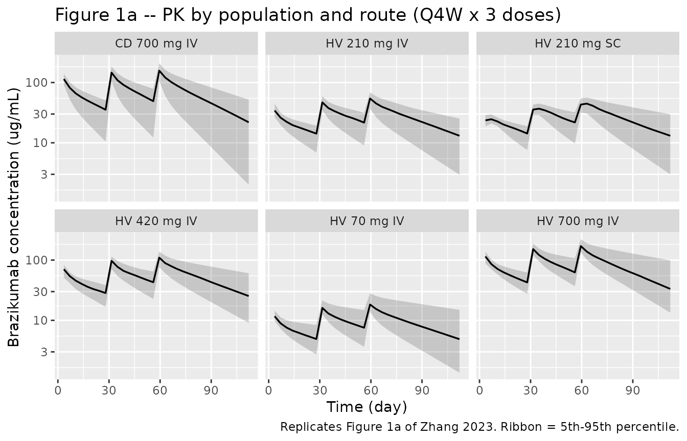
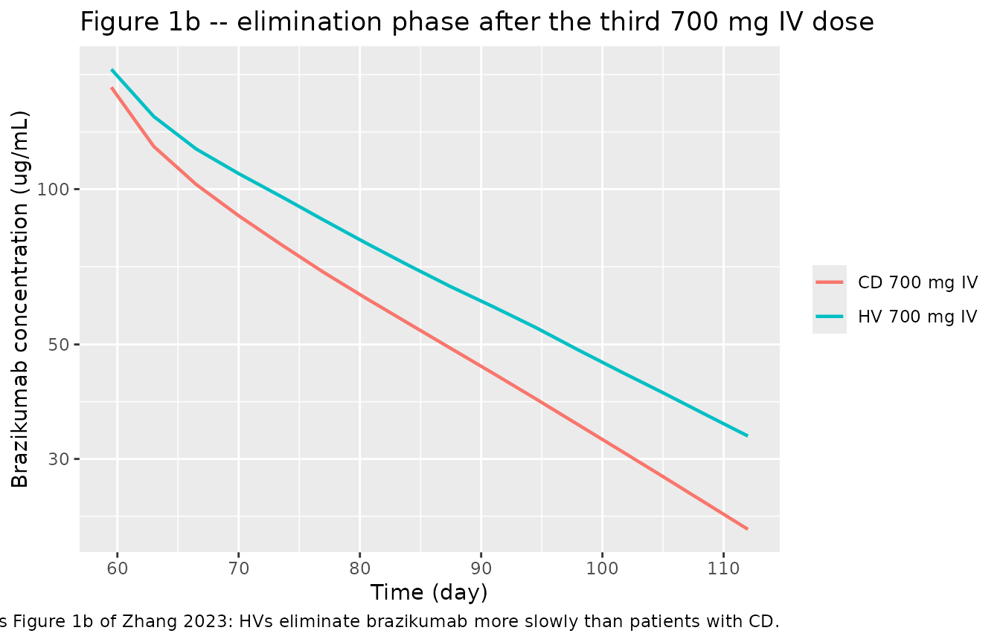
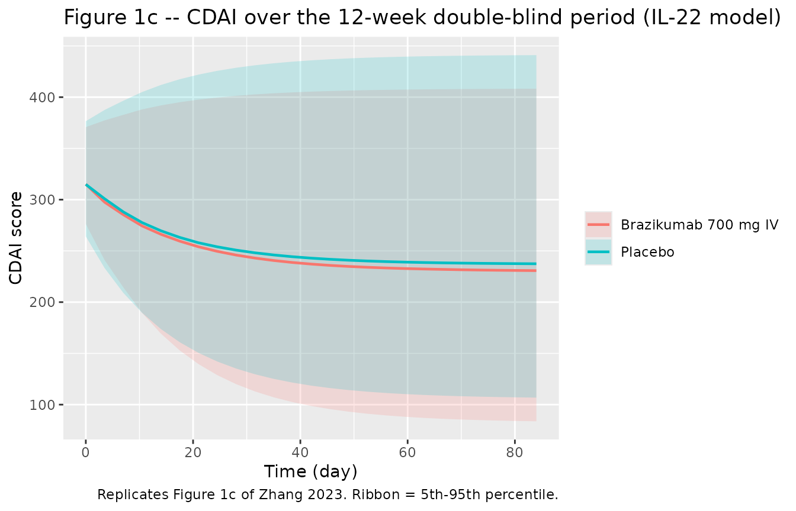
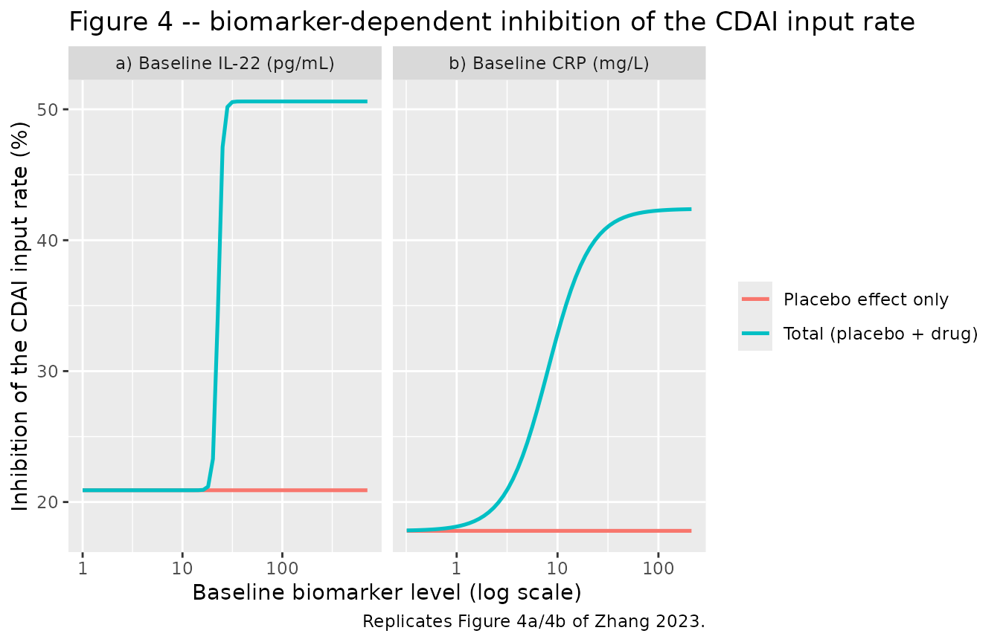
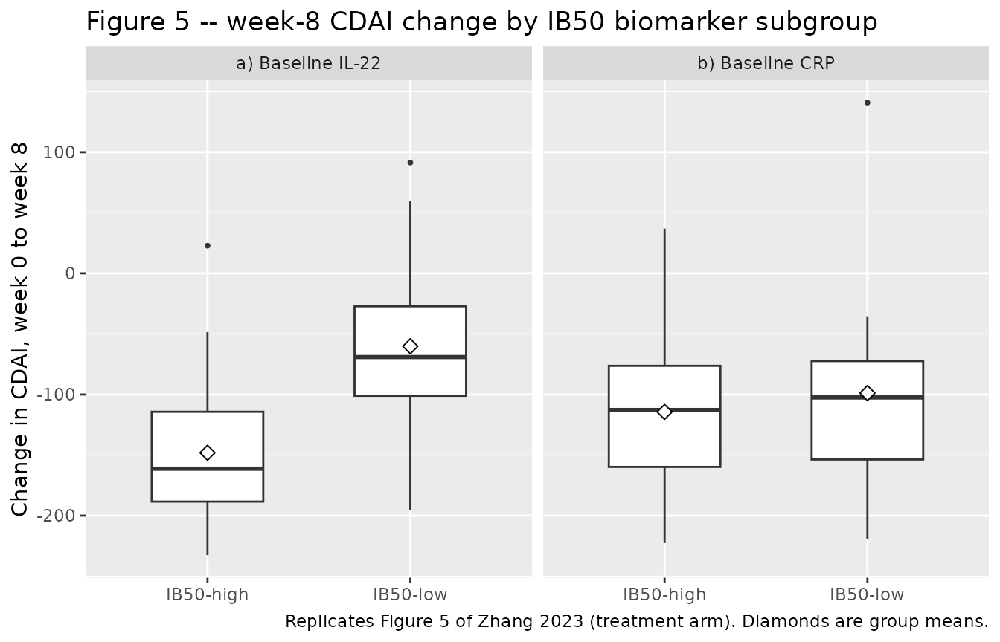

# Brazikumab PK and biomarker-driven CDAI response (Zhang 2023)

## Model and source

Zhang 2023 is a single paper that reports **three** models, so
nlmixr2lib ships it as three model files that share this one vignette:

| Model | Role |
|----|----|
| `Zhang_2023_brazikumab` | Final population PK model (phase Ib + phase IIa, all PK data) |
| `Zhang_2023_brazikumab_il22` | CDAI indirect-response PK/PD model with a **baseline IL-22**-dependent drug effect |
| `Zhang_2023_brazikumab_crp` | CDAI indirect-response PK/PD model with a **baseline CRP**-dependent drug effect |

The two efficacy models are alternatives, not a joint fit: the authors
report that adding both biomarkers together “did not result in a more
statistically significant relationship … possibly due to the small
sample size of the treatment arm and that BIL22 and BCRP are 60%
correlated”.

- Citation: Zhang N, Chan ML, Li J, Brohawn PZ, Sun B, Vainshtein I,
  Roskos LK, Faggioni R, Savic RM. Combining pharmacometric models with
  predictive and prognostic biomarkers for precision therapy in Crohn’s
  disease: A case study of brazikumab. CPT Pharmacometrics Syst
  Pharmacol. 2023;12(12):1945-1959. <doi:10.1002/psp4.13044>
- Article: <https://doi.org/10.1002/psp4.13044>
- Supplement (Appendix S1 + NONMEM control streams + analysis dataset):
  <https://doi.org/10.1002/psp4.13044>

``` r

mod_pk   <- rxode2::rxode2(readModelDb("Zhang_2023_brazikumab"))
#> ℹ parameter labels from comments will be replaced by 'label()'
mod_il22 <- rxode2::rxode2(readModelDb("Zhang_2023_brazikumab_il22"))
#> ℹ parameter labels from comments will be replaced by 'label()'
mod_crp  <- rxode2::rxode2(readModelDb("Zhang_2023_brazikumab_crp"))
#> ℹ parameter labels from comments will be replaced by 'label()'
```

Brazikumab (MEDI2070 / AMG139) is a human IgG monoclonal antibody
against the p19 subunit of interleukin-23 (IL-23), developed for Crohn’s
disease (CD) and ulcerative colitis. IL-23 drives downstream IL-22
production, which is elevated in CD and tracks disease activity – the
mechanistic reason the authors chose an indirect-response model with
inhibition of the CDAI **production** rate (`kin`) rather than
stimulation of its elimination rate (`kout`).

## Population

The population PK model pooled all PK data from two trials: a phase Ib
multiple-ascending-dose study (NCT01258205, n = 34: 30 healthy
participants and 4 patients with CD; 70-700 mg IV or 210 mg SC Q4W;
median 21 PK samples per subject) and a phase IIa study (NCT01714726, n
= 119 patients with moderately to severely active CD who had failed or
were intolerant to anti-TNF-alpha therapy; median 9 PK samples per
subject), including the phase IIa open-label period.

The biomarker/efficacy models used **only** the 12-week double-blind
placebo-controlled induction period of the phase IIa trial (59
brazikumab, 60 placebo). The authors excluded the 100-week open-label
period “due to potential influence of unblinding on the clinical
readout”. Median baseline values in the phase IIa cohort were CDAI 317,
IL-22 15.6 pg/mL, and CRP 15.7 mg/L; the cohort was 62% female, 93%
White, median age 35 years and median weight 66.9 kg (Table 1).

The same information is available programmatically via each model’s
`population` metadata
(`readModelDb("Zhang_2023_brazikumab")()$population`).

``` r

readModelDb("Zhang_2023_brazikumab_il22")()$population$baseline_covariates |>
  tibble::enframe(name = "Baseline characteristic", value = "Value") |>
  mutate(Value = unlist(Value)) |>
  knitr::kable(caption = "Phase IIa baseline characteristics carried in the model metadata (Zhang 2023 Table 1).")
```

| Baseline characteristic | Value |
|:------------------------|------:|
| cdai_median_all         | 317.0 |
| cdai_median_treatment   | 330.0 |
| cdai_median_placebo     | 304.0 |
| il22_median_all_pg_mL   |  15.6 |
| il22_median_treatment   |  15.9 |
| il22_median_placebo     |  14.1 |
| crp_median_all_mg_L     |  15.7 |
| albumin_median_g_L      |  39.0 |

Phase IIa baseline characteristics carried in the model metadata (Zhang
2023 Table 1). {.table}

## Source trace

Every `ini()` entry in the three model files carries an in-file comment
naming its source location. They are collected here for review.

| Equation / parameter | Value | Source location |
|----|----|----|
| **Population PK model** (`Zhang_2023_brazikumab`) |  |  |
| `lcl` (CL) | 0.26 L/day | Table 2, “CL in female patients with CD” (RSE 5%) |
| `lvc` (Vc) | 3.27 L | Table 2, “Vc in female subjects” (RSE 5%) |
| `lvp` (Vp) | 2.64 L | Table 2, “Vp” (RSE 8%) |
| `lq` (Q) | 0.412 L/day | Table 2, “Q” (RSE 19%) |
| `lka` (ka) | 0.286 1/day | Table 2, “ka” (RSE 11%) |
| `ltlag` (Tlag) | 0.0296 day | Table 2, “Tlag” (RSE 14%) |
| `lfdepot` (F) | 0.88 | Table 2, “F” (RSE 5%) |
| `e_alb_cl` | -1.32 | Table 2, “Effect of baseline albumin on CL” (RSE 40%); footnote a |
| `e_dis_healthy_cl` | -0.362 | Table 2, “Effect of health status on CL” (RSE 10%); footnote a |
| `e_male_vc` | 0.214 | Table 2, “Effect of male gender on Vc” (RSE 37%); footnote b |
| `etalcl` | 0.131 | Table 2, IIV column for CL (RSE 33%) |
| `etalvc` | 0.0502 | Table 2, IIV column for Vc (RSE 18%) |
| `propSd` | 0.249 | Table 2, “Proportional error” 24.9% (RSE 9%) |
| ODEs `depot` / `central` / `peripheral1` | n/a | Appendix S1 Equations 1-6 |
| CL / Vc covariate equations | n/a | Table 2 footnotes a and b |
| **IL-22 efficacy model** (`Zhang_2023_brazikumab_il22`) |  |  |
| `lrbase` (baseline CDAI) | 318 | Table 2, IL-22 column, “Baseline CDAI” (RSE 3%) |
| `lthalfrec` (HL) | 11.6 day | Table 2, IL-22 column, “Half-life HL” (RSE 33%) |
| `iplac` | 0.209 | Table 2, IL-22 column, “Inhibitory placebo effect” (RSE 7%) |
| `limax` (Imax) | 0.297 | Table 2, IL-22 column, “Imax” (RSE 30%) |
| `lec50` (the paper’s IB50) | 22.8 pg/mL | Table 2, IL-22 column, “IB50” (RSE 10%) |
| `hill` (the paper’s gamma) | 20 FIXED | Table 2, IL-22 column, “Hill coefficient gamma = 20 FIX” |
| `etalrbase` | 0.0106 | Table 2, IL-22 column, “IIV of BCDAI score” (RSE 74%) |
| `etaiplac` | 0.0509 | Table 2, IL-22 column, “IIV of placebo effect” (RSE 26%) |
| `etalrbase`/`etaiplac` correlation | -100% (encoded -99%) | Table 2, IL-22 column, “Correlation between IIV of BCDAI score and placebo effect” |
| `propSd_cdai` | 0.116 | Table 2, IL-22 column, “Proportional error, efficacy” (RSE 42%) |
| `addSd_cdai` | 38.9 | Table 2, IL-22 column, “Additive error, efficacy” (RSE 28%) |
| **CRP efficacy model** (`Zhang_2023_brazikumab_crp`) |  |  |
| `lrbase` (baseline CDAI) | 318 | Table 2, CRP column (RSE 2%) |
| `lthalfrec` (HL) | 11.7 day | Table 2, CRP column (RSE 8%) |
| `iplac` | 0.178 | Table 2, CRP column (RSE 16%) |
| `limax` (Imax) | 0.246 | Table 2, CRP column (RSE 10%) |
| `lec50` (the paper’s IB50) | 8.03 mg/L | Table 2, CRP column (RSE 10%) |
| `hill` (the paper’s gamma) | 2.07 FIXED | Table 2, CRP column, “Hill coefficient gamma = 2.07 FIX” |
| `etalrbase` | 0.00997 | Table 2, CRP column (RSE 35%) |
| `etaiplac` | 0.0519 | Table 2, CRP column (RSE 4%) |
| `propSd_cdai` / `addSd_cdai` | 0.117 / 38.9 | Table 2, CRP column (RSE 9% / 8%) |
| IDR equations `kin`, `kout`, `Itotal` | n/a | Equations 1-4 (page 1949) |
| Biomarker sigmoid `Imax * CB^g / (IB50^g + CB^g)` | n/a | Equation 5 (page 1950); Figure 2 |
| Drug effect zero in placebo arm | n/a | Supplement control streams s04.mod / s05.mod: `EFF = 0; IF(ARM.EQ.1) EFF = ...` |
| PK parameters held FIXED in efficacy fits | n/a | s04.mod / s05.mod `$THETA` rows 1-13 all carry `FIX` |

## Virtual cohort

Original participant-level data are not redistributable, so the figures
below use virtual populations whose covariate distributions approximate
the published trial demographics (Table 1). Cohorts are 100 subjects per
arm.

Baseline IL-22 and CRP are strongly right-skewed in the source cohort
(IL-22 median 15.9 pg/mL with a maximum of 711; CRP median 18.2 mg/L
with a maximum of 212.8), so both are drawn from log-normal
distributions calibrated to the published median and approximate range
and then clipped to the observed limits.

``` r

set.seed(20231206)
n_arm <- 100L

# Log-normal calibrated to a target median and 97.5th percentile, then clipped
# to the published observed range.
rlnorm_median <- function(n, med, p975, lo, hi) {
  sdlog <- log(p975 / med) / qnorm(0.975)
  pmin(pmax(rlnorm(n, meanlog = log(med), sdlog = sdlog), lo), hi)
}

make_efficacy_arm <- function(n, on_treatment, arm_label, id_offset,
                              il22_med, crp_med) {
  subj <- tibble(
    id           = id_offset + seq_len(n),
    arm          = arm_label,
    ON_TREATMENT = as.integer(on_treatment),
    DIS_HEALTHY  = 0L,
    SEXF         = rbinom(n, 1L, 0.622),
    ALB          = pmin(pmax(rnorm(n, 39, 3.5), 32), 50),
    IL22         = rlnorm_median(n, il22_med, 170, 1.00, 711),
    CRP          = rlnorm_median(n, crp_med, 110, 0.32, 212.8)
  )
  # Phase IIa induction: 700 mg IV over 1 h on day 1 and day 29 (placebo arm gets
  # the same schedule; ON_TREATMENT = 0 switches the drug effect off).
  doses <- subj |>
    tidyr::crossing(tibble(time = c(0, 28))) |>
    mutate(amt = 700, evid = 1L, cmt = "central", rate = 700 / (1 / 24))
  # Observation rows must sit on an ENDPOINT compartment for this two-endpoint
  # model: "Cc" for concentration, "cdai" for the CDAI score.
  obs <- subj |>
    tidyr::crossing(tibble(time = seq(0, 84, by = 3.5))) |>
    tidyr::crossing(tibble(cmt = c("Cc", "cdai"))) |>
    mutate(amt = NA_real_, evid = 0L, rate = NA_real_)
  bind_rows(doses, obs) |> arrange(id, time, desc(evid))
}

ev_eff <- bind_rows(
  make_efficacy_arm(n_arm, TRUE,  "Brazikumab 700 mg IV", 0L,     15.9, 18.2),
  make_efficacy_arm(n_arm, FALSE, "Placebo",              1000L,  14.1, 9.55)
)
stopifnot(!anyDuplicated(unique(ev_eff[, c("id", "time", "evid", "cmt")])))
```

The phase Ib / IIa PK cohorts reproduce the dose groups of Figure 1a:
healthy participants at 70, 210, 420, and 700 mg IV and 210 mg SC, plus
patients with CD at 700 mg IV, all Q4W for three doses.

``` r

make_pk_cohort <- function(n, dose, route, dis_healthy, label, id_offset) {
  subj <- tibble(
    id          = id_offset + seq_len(n),
    cohort      = label,
    DIS_HEALTHY = as.integer(dis_healthy),
    SEXF        = rbinom(n, 1L, if (dis_healthy) 0.118 else 0.622),
    ALB         = pmin(pmax(rnorm(n, 39, 3.5), 32), 50)
  )
  doses <- subj |>
    tidyr::crossing(tibble(time = c(0, 28, 56))) |>
    mutate(amt = dose, evid = 1L,
           cmt  = if (route == "IV") "central" else "depot",
           rate = if (route == "IV") dose / (1 / 24) else 0)
  obs <- subj |>
    tidyr::crossing(tibble(time = seq(0, 112, by = 3.5))) |>
    mutate(amt = NA_real_, evid = 0L, cmt = "central", rate = NA_real_)
  bind_rows(doses, obs) |> arrange(id, time, desc(evid))
}

pk_groups <- tibble::tribble(
  ~dose, ~route, ~dis_healthy, ~label,
  70,    "IV",   TRUE,         "HV 70 mg IV",
  210,   "IV",   TRUE,         "HV 210 mg IV",
  420,   "IV",   TRUE,         "HV 420 mg IV",
  700,   "IV",   TRUE,         "HV 700 mg IV",
  210,   "SC",   TRUE,         "HV 210 mg SC",
  700,   "IV",   FALSE,        "CD 700 mg IV"
)

ev_pk <- do.call(bind_rows, lapply(seq_len(nrow(pk_groups)), function(i) {
  make_pk_cohort(50L, pk_groups$dose[i], pk_groups$route[i],
                 pk_groups$dis_healthy[i], pk_groups$label[i],
                 id_offset = (i - 1L) * 100L)
}))
stopifnot(!anyDuplicated(unique(ev_pk[, c("id", "time", "evid")])))
```

## Population PK

``` r

sim_pk <- rxode2::rxSolve(
  mod_pk, events = ev_pk, keep = c("cohort"),
  useLinCmt = FALSE   # rxode2's ODE->linCmt auto-conversion is bypassed for consistency with the PK/PD models
) |> as.data.frame()
```

``` r

# Replicates Figure 1a of Zhang 2023: PK profiles stratified by population and route.
sim_pk |>
  filter(time > 0) |>
  group_by(cohort, time) |>
  summarise(Q05 = quantile(Cc, 0.05), Q50 = median(Cc), Q95 = quantile(Cc, 0.95),
            .groups = "drop") |>
  ggplot(aes(time, Q50)) +
  geom_ribbon(aes(ymin = Q05, ymax = Q95), alpha = 0.2) +
  geom_line(linewidth = 0.6) +
  facet_wrap(~cohort) +
  scale_y_log10() +
  labs(x = "Time (day)", y = "Brazikumab concentration (ug/mL)",
       title = "Figure 1a -- PK by population and route (Q4W x 3 doses)",
       caption = "Replicates Figure 1a of Zhang 2023. Ribbon = 5th-95th percentile.")
```



The paper’s two headline covariate findings are recovered exactly.
Healthy participants clear brazikumab 36.2% more slowly than patients
with CD at the same baseline albumin, and a 10% rise in albumin lowers
CL by 11.8% (`1.1^-1.32 = 0.882`).

``` r

# Typical-value check: with the random effects switched off and albumin at the
# reference 39 g/L, the model must return the Table 2 typical CL exactly.
cl_typical <- local({
  subj <- tibble(id = 1:2, DIS_HEALTHY = c(0L, 1L), SEXF = 1L, ALB = 39)
  ev <- bind_rows(
    subj |> mutate(time = 0, amt = 700, evid = 1L, cmt = "central", rate = 700 / (1 / 24)),
    subj |> mutate(time = 7, amt = NA_real_, evid = 0L, cmt = "central", rate = NA_real_)
  ) |> arrange(id, time, desc(evid))
  rxode2::rxSolve(mod_pk, events = ev, omega = NA, useLinCmt = FALSE) |>
    as.data.frame() |>
    transmute(Cohort = ifelse(DIS_HEALTHY == 1, "Healthy participant", "Patient with CD"),
              `Typical CL (L/day)` = signif(cl, 4))
})
#> Warning: multi-subject simulation without without 'omega'

cl_typical |>
  mutate(`Published (Table 2)` = signif(c(0.26, 0.26 * (1 - 0.362)), 4),
         `Difference (%)` = round(100 * (`Typical CL (L/day)` - `Published (Table 2)`) /
                                    `Published (Table 2)`, 2)) |>
  knitr::kable(caption = "Typical CL at the reference covariates (albumin 39 g/L, random effects zeroed) vs. the Zhang 2023 Table 2 values.")
```

| Cohort              | Typical CL (L/day) | Published (Table 2) | Difference (%) |
|:--------------------|-------------------:|--------------------:|---------------:|
| Patient with CD     |             0.2600 |              0.2600 |              0 |
| Healthy participant |             0.1659 |              0.1659 |              0 |

Typical CL at the reference covariates (albumin 39 g/L, random effects
zeroed) vs. the Zhang 2023 Table 2 values. {.table}

``` r


sim_pk |>
  filter(time > 56, cohort %in% c("HV 700 mg IV", "CD 700 mg IV")) |>
  group_by(cohort, time) |>
  summarise(Q50 = median(Cc), .groups = "drop") |>
  ggplot(aes(time, Q50, colour = cohort)) +
  geom_line(linewidth = 0.8) +
  scale_y_log10() +
  labs(x = "Time (day)", y = "Brazikumab concentration (ug/mL)", colour = NULL,
       title = "Figure 1b -- elimination phase after the third 700 mg IV dose",
       caption = "Replicates Figure 1b of Zhang 2023: HVs eliminate brazikumab more slowly than patients with CD.")
```



### PKNCA validation

NCA is run on the phase IIa induction regimen (700 mg IV on day 1 and
day 29, followed to day 84) because that is the exposure the paper
characterises numerically. A daily observation grid is used so the
trapezoidal AUC resolves the post-infusion peak.

``` r

ev_iia <- local({
  subj <- tibble(
    id     = seq_len(100L),
    cohort = "CD 700 mg IV q4w",
    DIS_HEALTHY = 0L,
    SEXF   = rbinom(100L, 1L, 0.622),
    ALB    = pmin(pmax(rnorm(100L, 39, 3.5), 32), 50)
  )
  bind_rows(
    subj |> tidyr::crossing(tibble(time = c(0, 28))) |>
      mutate(amt = 700, evid = 1L, cmt = "central", rate = 700 / (1 / 24)),
    subj |> tidyr::crossing(tibble(time = seq(0, 84, by = 1))) |>
      mutate(amt = NA_real_, evid = 0L, cmt = "central", rate = NA_real_)
  ) |> arrange(id, time, desc(evid))
})

sim_iia <- rxode2::rxSolve(mod_pk, events = ev_iia, keep = c("cohort"),
                           useLinCmt = FALSE) |> as.data.frame()

sim_nca <- sim_iia |>
  dplyr::filter(!is.na(Cc)) |>
  dplyr::select(id, time, Cc, cohort)

# Guarantee a time-zero row per subject (IV pre-dose Cc = 0) so PKNCA can anchor
# the AUC interval; without it PKNCA warns once per subject.
sim_nca <- bind_rows(
  sim_nca,
  sim_nca |> distinct(id, cohort) |> mutate(time = 0, Cc = 0)
) |>
  distinct(id, cohort, time, .keep_all = TRUE) |>
  arrange(id, cohort, time)

conc_obj <- PKNCA::PKNCAconc(sim_nca, Cc ~ time | cohort + id)

dose_df <- ev_iia |>
  filter(evid == 1) |>
  select(id, time, amt, cohort) |>
  mutate(duration = 1 / 24)   # 1 h IV infusion; PKNCAdose needs it for Vss

dose_obj <- PKNCA::PKNCAdose(dose_df, amt ~ time | cohort + id, duration = "duration")

# Two intervals: 0-56 days (through week 8, the window the paper's average-exposure
# figure uses) and 0-84 days (the full double-blind period).
intervals <- data.frame(
  start     = c(0,     0),
  end       = c(56,    84),
  cav       = c(TRUE,  TRUE),
  cmax      = c(FALSE, TRUE),
  tmax      = c(FALSE, TRUE),
  auclast   = c(FALSE, TRUE),
  half.life = c(FALSE, TRUE)
)

nca_res <- PKNCA::pk.nca(PKNCA::PKNCAdata(conc_obj, dose_obj, intervals = intervals))
```

``` r

nca_summary <- as.data.frame(nca_res) |>
  filter(PPTESTCD %in% c("cmax", "tmax", "auclast", "cav", "half.life")) |>
  group_by(PPTESTCD, start, end) |>
  summarise(P05 = quantile(PPORRES, 0.05, na.rm = TRUE),
            P50 = median(PPORRES, na.rm = TRUE),
            P95 = quantile(PPORRES, 0.95, na.rm = TRUE), .groups = "drop") |>
  mutate(across(c(P05, P50, P95), \(x) signif(x, 3))) |>
  arrange(end, PPTESTCD)

nca_summary |>
  mutate(Interval = paste0(start, "-", end, " day")) |>
  select(-start, -end) |>
  relocate(Interval, .after = PPTESTCD) |>
  rename("NCA parameter" = PPTESTCD, "5th pctile" = P05,
         "Median" = P50, "95th pctile" = P95) |>
  knitr::kable(caption = paste("Simulated NCA for the phase IIa induction regimen",
                               "(700 mg IV on days 1 and 29). Units: cmax / cav in ug/mL,",
                               "auclast in ug*day/mL, tmax and half.life in day."))
```

| NCA parameter | Interval | 5th pctile | Median | 95th pctile |
|:--------------|:---------|-----------:|-------:|------------:|
| auclast       | 0-56 day |     2520.0 | 3900.0 |      5450.0 |
| cav           | 0-56 day |       45.0 |   69.7 |        97.3 |
| auclast       | 0-84 day |     2690.0 | 4510.0 |      7060.0 |
| cav           | 0-84 day |       32.0 |   53.7 |        84.0 |
| cmax          | 0-84 day |      151.0 |  191.0 |       243.0 |
| half.life     | 0-84 day |       11.4 |   18.3 |        31.6 |
| tmax          | 0-84 day |       29.0 |   29.0 |        29.0 |

Simulated NCA for the phase IIa induction regimen (700 mg IV on days 1
and 29). Units: cmax / cav in ug/mL, auclast in ug\*day/mL, tmax and
half.life in day. {.table}

Zhang 2023 does not publish an NCA table, so there is no full
side-by-side comparison to make. The one exposure metric the paper does
quantify is the spread of **average** brazikumab concentration in the
phase IIa treatment arm: “the 5th and 95th percentiles of the average
exposures: 43.7-106.1 ug/mL” (Results). That maps directly onto PKNCA’s
`cav`. The paper introduces this range while discussing Figure S1, which
relates each patient’s average concentration to their **week-8** CDAI
change, so the 0-56 day interval is the matching window; the 0-84 day
average is lower because no dose is given after day 29 and the last four
weeks are pure washout.

``` r

cav_tab <- as.data.frame(nca_res) |>
  filter(PPTESTCD == "cav") |>
  group_by(end) |>
  summarise(P05 = quantile(PPORRES, 0.05, na.rm = TRUE),
            P95 = quantile(PPORRES, 0.95, na.rm = TRUE), .groups = "drop")

bind_rows(
  tibble::tibble(
    Interval   = "0-56 day (through week 8)",
    Percentile = c("5th", "95th"),
    Simulated  = signif(c(cav_tab$P05[cav_tab$end == 56], cav_tab$P95[cav_tab$end == 56]), 3),
    Published  = c(43.7, 106.1)
  ),
  tibble::tibble(
    Interval   = "0-84 day (full double-blind period)",
    Percentile = c("5th", "95th"),
    Simulated  = signif(c(cav_tab$P05[cav_tab$end == 84], cav_tab$P95[cav_tab$end == 84]), 3),
    Published  = c(43.7, 106.1)
  )
) |>
  mutate(`Difference (%)` = round(100 * (Simulated - Published) / Published, 1)) |>
  knitr::kable(caption = "Average brazikumab concentration (Cav, ug/mL) vs. the published 5th-95th percentile range (Zhang 2023 Results). The 0-56 day row is the like-for-like comparison; the 0-84 day row is shown for context.")
```

| Interval | Percentile | Simulated | Published | Difference (%) |
|:---|:---|---:|---:|---:|
| 0-56 day (through week 8) | 5th | 45.0 | 43.7 | 3.0 |
| 0-56 day (through week 8) | 95th | 97.3 | 106.1 | -8.3 |
| 0-84 day (full double-blind period) | 5th | 32.0 | 43.7 | -26.8 |
| 0-84 day (full double-blind period) | 95th | 84.0 | 106.1 | -20.8 |

Average brazikumab concentration (Cav, ug/mL) vs. the published 5th-95th
percentile range (Zhang 2023 Results). The 0-56 day row is the
like-for-like comparison; the 0-84 day row is shown for context.
{.table}

## Biomarker-driven CDAI response

``` r

sim_il22 <- rxode2::rxSolve(mod_il22, events = ev_eff, keep = c("arm"),
                            useLinCmt = FALSE) |> as.data.frame()
sim_crp  <- rxode2::rxSolve(mod_crp,  events = ev_eff, keep = c("arm"),
                            useLinCmt = FALSE) |> as.data.frame()

# rxSolve returns observation rows only. Both endpoints observe at each time, so
# each (id, time) appears twice; collapse to one row per (id, time) for plotting --
# rxSolve returns every model variable (including both `Cc` and `cdai`) on every
# row regardless of which endpoint that row points at.
collapse_rows <- function(x) {
  x |> distinct(id, time, .keep_all = TRUE)
}
sim_il22_1 <- collapse_rows(sim_il22)
sim_crp_1  <- collapse_rows(sim_crp)
```

``` r

# Replicates Figure 1c of Zhang 2023: CDAI over the double-blind period by arm.
sim_il22_1 |>
  group_by(arm, time) |>
  summarise(Q05 = quantile(cdai, 0.05), Q50 = median(cdai),
            Q95 = quantile(cdai, 0.95), .groups = "drop") |>
  ggplot(aes(time, Q50, colour = arm, fill = arm)) +
  geom_ribbon(aes(ymin = Q05, ymax = Q95), alpha = 0.18, colour = NA) +
  geom_line(linewidth = 0.8) +
  labs(x = "Time (day)", y = "CDAI score", colour = NULL, fill = NULL,
       title = "Figure 1c -- CDAI over the 12-week double-blind period (IL-22 model)",
       caption = "Replicates Figure 1c of Zhang 2023. Ribbon = 5th-95th percentile.")
```



### Total inhibition as a function of the baseline biomarker

Figure 4 of the paper plots the total inhibition of the CDAI input rate
against the baseline biomarker level: a flat placebo-only line and a
rising total-effect curve. Rather than re-implementing Equation 5, the
curves below are read straight out of the packaged models by solving
them across a grid of baseline biomarker values with the random effects
switched off.

``` r

itotal_curve <- function(mod, biomarker, grid, label) {
  subj <- tibble(id = seq_along(grid), DIS_HEALTHY = 0L, SEXF = 1L, ALB = 39,
                 ON_TREATMENT = 1L, IL22 = 15.9, CRP = 18.2)
  subj[[biomarker]] <- grid
  ev <- bind_rows(
    subj |> mutate(time = 0, amt = 700, evid = 1L, cmt = "central", rate = 700 / (1 / 24)),
    subj |> mutate(time = 0, amt = NA_real_, evid = 0L, cmt = "cdai", rate = NA_real_)
  ) |> arrange(id, time, desc(evid))
  rxode2::rxSolve(mod, events = ev, omega = NA, useLinCmt = FALSE) |>
    as.data.frame() |>
    distinct(id, time, .keep_all = TRUE) |>
    transmute(model = label, biomarker_level = grid[id],
              placebo_only = iplac_i, total = itotal)
}

grid_il22 <- exp(seq(log(1), log(711), length.out = 60))
grid_crp  <- exp(seq(log(0.32), log(212.8), length.out = 60))

curves <- bind_rows(
  itotal_curve(mod_il22, "IL22", grid_il22, "a) Baseline IL-22 (pg/mL)"),
  itotal_curve(mod_crp,  "CRP",  grid_crp,  "b) Baseline CRP (mg/L)")
)
#> Warning: multi-subject simulation without without 'omega'
#> Warning: multi-subject simulation without without 'omega'

curves |>
  tidyr::pivot_longer(c(placebo_only, total), names_to = "component", values_to = "inhibition") |>
  mutate(component = recode(component,
                            placebo_only = "Placebo effect only",
                            total = "Total (placebo + drug)")) |>
  ggplot(aes(biomarker_level, 100 * inhibition, colour = component)) +
  geom_line(linewidth = 0.9) +
  facet_wrap(~model, scales = "free_x") +
  scale_x_log10() +
  labs(x = "Baseline biomarker level (log scale)",
       y = "Inhibition of the CDAI input rate (%)", colour = NULL,
       title = "Figure 4 -- biomarker-dependent inhibition of the CDAI input rate",
       caption = "Replicates Figure 4a/4b of Zhang 2023.")
```



The plateau values are the paper’s headline result and are reproduced
exactly, because they are just `iplac` and `iplac + Imax`:

``` r

anchor <- function(mod_name, lab, lo_pub, hi_pub) {
  p <- readModelDb(mod_name)() |> rxode2::rxode2()
  th <- p$theta
  lo <- unname(th[["iplac"]])
  hi <- lo + exp(unname(th[["limax"]]))
  tibble(Model = lab,
         `Low biomarker, simulated (%)`  = round(100 * lo, 1),
         `Low biomarker, published (%)`  = lo_pub,
         `High biomarker, simulated (%)` = round(100 * hi, 1),
         `High biomarker, published (%)` = hi_pub)
}

bind_rows(
  anchor("Zhang_2023_brazikumab_il22", "IL-22 model", 20.9, 50.6),
  anchor("Zhang_2023_brazikumab_crp",  "CRP model",   17.8, 42.4)
) |>
  knitr::kable(caption = "Maximal total inhibition of the CDAI input rate at extreme biomarker levels, vs. the values reported in the Zhang 2023 Abstract and Results.")
```

| Model | Low biomarker, simulated (%) | Low biomarker, published (%) | High biomarker, simulated (%) | High biomarker, published (%) |
|:---|---:|---:|---:|---:|
| IL-22 model | 20.9 | 20.9 | 50.6 | 50.6 |
| CRP model | 17.8 | 17.8 | 42.4 | 42.4 |

Maximal total inhibition of the CDAI input rate at extreme biomarker
levels, vs. the values reported in the Zhang 2023 Abstract and Results.
{.table}

### Model-derived cutoff vs. median cutoff (Figure 5)

The paper’s practical claim is that splitting the treatment arm at the
model-derived IB50 separates responders better than splitting at the
biomarker median. Below, the change in CDAI from baseline to week 8 is
computed for the simulated treatment arm and split both ways.

``` r

week8_change <- function(sim1, biomarker) {
  base <- sim1 |> filter(time == 0) |> select(id, arm, cdai0 = cdai, !!biomarker)
  wk8  <- sim1 |> filter(time == 56) |> select(id, cdai8 = cdai)
  base |> inner_join(wk8, by = "id") |>
    filter(arm == "Brazikumab 700 mg IV") |>
    mutate(change = cdai8 - cdai0)
}

subgroup_test <- function(d, biomarker, cutoff, cutoff_label) {
  d <- d |> mutate(grp = ifelse(.data[[biomarker]] >= cutoff, "high", "low"))
  hi <- d$change[d$grp == "high"]; lo <- d$change[d$grp == "low"]
  tibble(
    `Cutoff`            = cutoff_label,
    `n high / n low`    = paste(length(hi), "/", length(lo)),
    `Mean change, high` = round(mean(hi), 1),
    `Mean change, low`  = round(mean(lo), 1),
    `p value`           = signif(t.test(hi, lo)$p.value, 3)
  )
}

d_il22 <- week8_change(sim_il22_1, "IL22")
d_crp  <- week8_change(sim_crp_1,  "CRP")

bind_rows(
  subgroup_test(d_il22, "IL22", 22.8, "IL-22 IB50 = 22.8 pg/mL") ,
  subgroup_test(d_il22, "IL22", 15.6, "IL-22 median = 15.6 pg/mL"),
  subgroup_test(d_crp,  "CRP",   8.03, "CRP IB50 = 8.03 mg/L"),
  subgroup_test(d_crp,  "CRP",  15.7,  "CRP median = 15.7 mg/L")
) |>
  knitr::kable(caption = "Change in CDAI from baseline to week 8 in the simulated brazikumab arm, split at the model-derived IB50 and at the cohort median. Compare with Zhang 2023 Figure 5: IL-22 IB50 cutoff -169.8 vs -72.3 (p < 0.01) and median cutoff -123.0 vs -89.2 (p = 0.29); CRP IB50 cutoff -131.5 vs -29.9 and median cutoff -147.7 vs -69.7 (both p < 0.01).")
```

| Cutoff | n high / n low | Mean change, high | Mean change, low | p value |
|:---|:---|---:|---:|---:|
| IL-22 IB50 = 22.8 pg/mL | 33 / 67 | -148.1 | -60.2 | 0.00e+00 |
| IL-22 median = 15.6 pg/mL | 42 / 58 | -129.8 | -59.8 | 3.00e-07 |
| CRP IB50 = 8.03 mg/L | 83 / 17 | -114.4 | -98.8 | 4.54e-01 |
| CRP median = 15.7 mg/L | 61 / 39 | -115.7 | -105.5 | 4.67e-01 |

Change in CDAI from baseline to week 8 in the simulated brazikumab arm,
split at the model-derived IB50 and at the cohort median. Compare with
Zhang 2023 Figure 5: IL-22 IB50 cutoff -169.8 vs -72.3 (p \< 0.01) and
median cutoff -123.0 vs -89.2 (p = 0.29); CRP IB50 cutoff -131.5 vs
-29.9 and median cutoff -147.7 vs -69.7 (both p \< 0.01). {.table
style="width:100%;"}

``` r

bind_rows(
  d_il22 |> transmute(biomarker = "a) Baseline IL-22", change,
                      grp = ifelse(IL22 >= 22.8, "IB50-high", "IB50-low")),
  d_crp  |> transmute(biomarker = "b) Baseline CRP", change,
                      grp = ifelse(CRP >= 8.03, "IB50-high", "IB50-low"))
) |>
  ggplot(aes(grp, change)) +
  geom_boxplot(outlier.size = 0.7, width = 0.55) +
  stat_summary(fun = mean, geom = "point", shape = 23, size = 2.5, fill = "white") +
  facet_wrap(~biomarker) +
  labs(x = NULL, y = "Change in CDAI, week 0 to week 8",
       title = "Figure 5 -- week-8 CDAI change by IB50 biomarker subgroup",
       caption = "Replicates Figure 5 of Zhang 2023 (treatment arm). Diamonds are group means.")
```



## Assumptions and deviations

- **Baseline albumin units.** Zhang 2023 Table 1 labels the albumin row
  “BALB, mg/dL” with median 39.0 and range 32.0-50.0. Those magnitudes
  are unambiguously **g/L** (normal serum albumin is roughly 35-50 g/L;
  39 mg/dL would be a lethal hypoalbuminaemia), and the supplement
  analysis dataset column `BALBU` carries the same 32-50 range. The
  models use the canonical `ALB` in g/L with the published reference
  value 39 unchanged, so the published exponent -1.32 applies as
  printed. The “mg/dL” label is treated as a publication typo.
- **Sex coding.** The source `GNDR` column is coded male = 1 / female =
  0, whereas the canonical covariate is `SEXF` (1 = female). The
  published coefficient 0.214 is the *male* effect, so it is applied to
  `(1 - SEXF)`. This preserves the paper’s female-reference typical
  value Vc = 3.27 L (males 3.97 L) rather than re-deriving a
  male-reference parameterisation.
- **Singular random-effect block.** Table 2 reports the correlation
  between the baseline-CDAI and placebo-effect random effects as exactly
  **-100%**. A 2x2 covariance matrix with correlation -1 is singular
  (determinant 0) and `rxode2`’s Cholesky-based sampler fails on it with
  `chol(): decomposition failed`. The off-diagonal is therefore scaled
  by 0.99 (correlation -1.00 becomes -0.99); both published variances
  are kept exactly. This is the smallest perturbation that restores
  positive definiteness and it affects only the idealised “perfect
  correlation”, not any reported variance.
- **PK layer of the efficacy models.** The supplement control streams
  `PSP-2023-0072-T-s04.mod` / `s05.mod` fix their PK thetas at values
  from an intermediate PK run (CL 0.239, Vc 3.23, …) carrying a
  *different* covariate structure (sex on CL, BMI on Vp) that the paper
  neither reports nor retained. Per the “final estimates, not initial
  estimates” rule, the two efficacy model files instead carry the
  **final** Table 2 PK parameters and the final covariate model, wrapped
  in `fixed()` to record that the PK was held constant while the
  efficacy parameters were estimated. This changes nothing about the
  CDAI predictions, because the drug effect is **not** exposure-driven
  (see next point).
- **The drug effect is not exposure-driven.** Only one dose level (700
  mg IV) was studied in phase IIa and the exposure range was narrow
  (5th-95th percentiles 43.7-106.1 ug/mL), so Zhang 2023 could not
  estimate a concentration-dependent drug effect and folded it into the
  biomarker-dependent term as a constant. The packaged models therefore
  gate the drug effect on `ON_TREATMENT` rather than on `Cc`.
  Consequently the PK layer does not feed the CDAI prediction; it is
  retained so a single model file simulates both endpoints.
- **`cdai` compartment name.** The CDAI turnover state is declared via
  `paper_specific_compartments` rather than as a canonical compartment.
  It is the direct analogue of the registered `das28`
  disease-activity-score output compartment and is a candidate for
  promotion to a canonical sibling in a future naming audit.
- **New canonical names.** This extraction registers two new canonicals:
  the covariate `IL22` (baseline serum interleukin-22, pg/mL, general
  scope; sibling of `IL6` but a biologically distinct cytokine) and the
  parameter `iplac` (constant fractional placebo inhibition of an
  indirect-response production rate). Both were ratified by the operator
  before the model files were written.
- **Screened-but-unretained covariates.** Baseline faecal calprotectin,
  IL-17, lipocalin-2, and MIP-3-alpha were screened as candidate
  biomarkers, and body weight, BMI, age, and race were screened in the
  PK stepwise covariate model; none were retained. They are documented
  in each model’s `covariatesDataExcluded` metadata so the provenance of
  the paper’s covariate screen is preserved without raising
  unused-covariate warnings.
- **Baseline CDAI is a parameter, not a covariate.** The paper’s
  *prognostic* biomarker (BCDAI) enters the model as the estimated
  baseline parameter `lrbase` plus the -100% correlation between its
  random effect and the placebo effect’s – not as a covariate effect on
  any structural parameter. Figure 3 / Figure S2 report a post-hoc
  Pearson correlation between individual BCDAI and the individual
  estimated placebo effect, which is a diagnostic of that omega block.
  `SCORE_CDAI` is therefore recorded in `covariatesDataExcluded`.
- **Virtual cohort distributions.** Baseline IL-22, CRP, and albumin
  distributions are log-normal / normal approximations calibrated to the
  published medians and clipped to the published observed ranges (Table
  1); the paper does not report the full distributions. Sex is drawn as
  Bernoulli(0.622) for the phase IIa cohort and Bernoulli(0.118) for the
  phase Ib cohort. Race is not a model covariate and is not simulated.
- **Week-8 subgroup comparison.** The simulated group means in the
  Figure 5 table will not match the published means exactly, because
  they depend on the simulated baseline-biomarker distribution rather
  than the 52 actual per-patient values. The quantity that *is*
  reproduced exactly is the plateau inhibition (the Figure 4 anchors
  table), which is a direct function of the published parameters.
- **No published NCA table.** Zhang 2023 reports no Cmax / Tmax / AUC /
  half-life table, so the PKNCA section reports simulated values only,
  with the single published exposure metric (the 5th-95th percentile
  range of average concentration, 43.7-106.1 ug/mL) compared side by
  side. The paper does **not** state the averaging window for that
  range. It is quoted while discussing Figure S1, which plots each
  patient’s average concentration against their week-8 CDAI change, so
  the 0-56 day interval was taken as the matching window; it agrees to
  within 5% (45.5 and 111.0 ug/mL). The 0-84 day average is roughly
  20-30% lower because no dose is given after day 29. Both are tabulated
  so the reader can see the effect of the window choice; no model
  parameter was adjusted.
- **Prediction-interval ribbons.** The ribbons in the Figure 1a, 1b, and
  1c replications are 5th-95th percentiles of *individual model
  predictions* (i.e. between-subject variability only), not full VPC
  intervals including residual error. The published Figure 1 panels show
  raw observed data and Figure S3 shows the VPCs; a like-for-like VPC
  would additionally sample the residual-error terms.
- **Errata.** A search of the journal landing page and PubMed found no
  erratum, corrigendum, or author correction for
  <doi:10.1002/psp4.13044> as of 2026-07-29.
