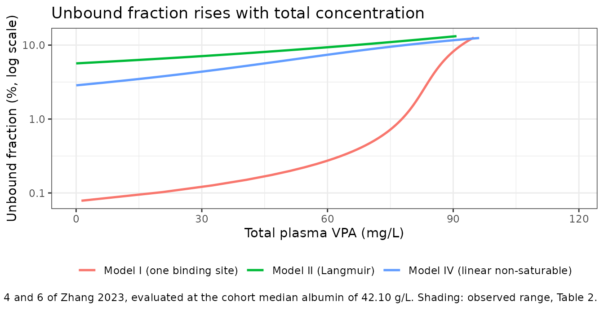
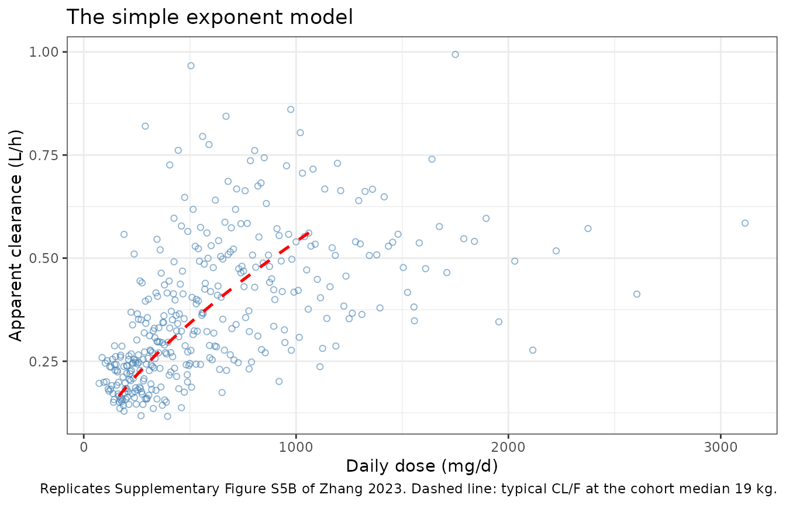
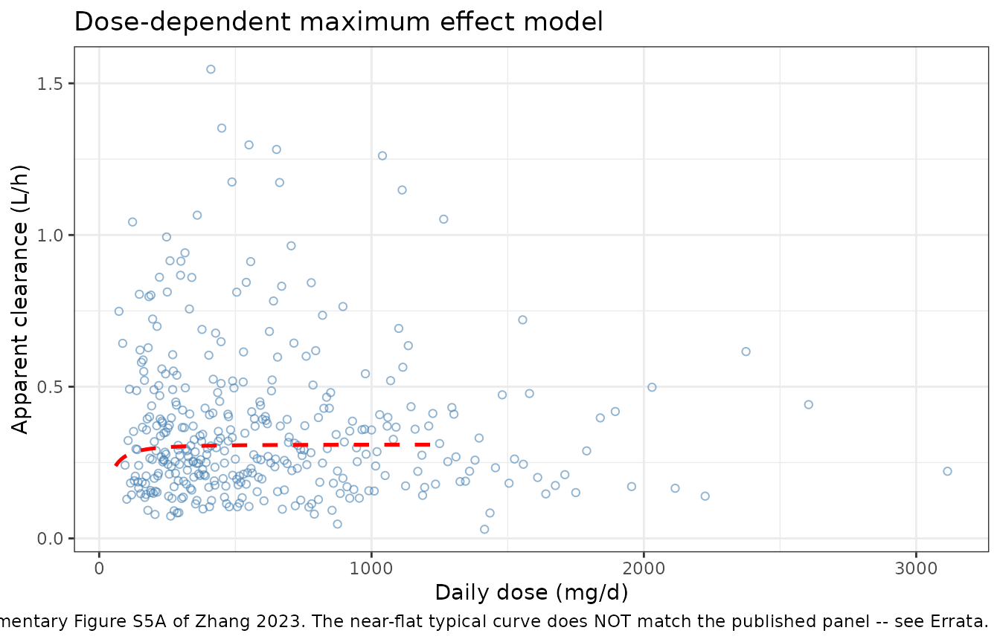
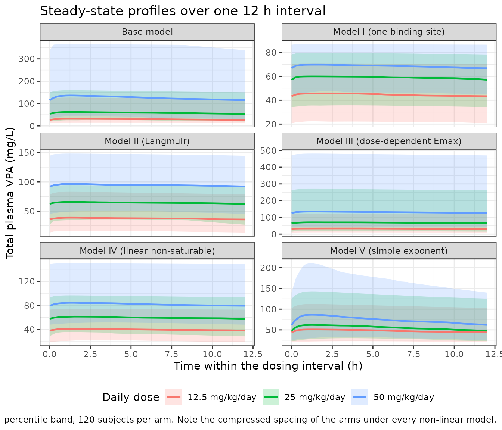

# Valproic acid protein-binding non-linearity (Zhang 2023)

## Model and source

Zhang et al. (2023) is a two-part paper. The first part is a systematic
review and external evaluation of ten previously published paediatric
valproic acid (VPA) population PK models. The second part – the part
packaged here – is an original modelling study in which the authors fit
**a base model plus five alternative non-linearity strategies** to their
own 202-child therapeutic drug monitoring (TDM) cohort, in order to ask
which functional form best captures the concentration-dependent plasma
protein binding that makes VPA clearance dose-dependent.

All six models are packaged, one file each:

| Model file | Paper’s label | Non-linearity |
|----|----|----|
| `Zhang_2023_valproic_acid_base` | Base model | none (linear reference) |
| `Zhang_2023_valproic_acid_onebindingsite` | Model I | one-binding-site isotherm, albumin-scaled (Eq. 3) |
| `Zhang_2023_valproic_acid_langmuir` | Model II | Langmuir isotherm (Eq. 4) |
| `Zhang_2023_valproic_acid_ddemax` | Model III | sigmoid-Emax of daily dose on `CL/F` (Eq. 5) |
| `Zhang_2023_valproic_acid_nonsaturable` | Model IV | Langmuir + linear non-saturable term (Eq. 6) |
| `Zhang_2023_valproic_acid_exponent` | Model V | power function of daily dose on `CL/F` (Eq. 7) |

The ten *reviewed* literature models are other authors’ work and are not
part of this extraction; they are queued as primary papers separately.
One of them (Williams 2012) is already in the library as
`Williams_2012_valproic_acid_pediatric`.

**Two families of strategy.** Models I, II and IV are mechanistic: they
write an explicit binding isotherm relating the bound concentration `Cb`
to the unbound concentration `Cu`, carry the disposition on `Cu`, and
reconstruct the measured *total* concentration as `Cc = Cu + Cb`. Models
III and V are empirical: they keep the model on total concentration and
absorb the non-linearity into a dose-dependent `CL/F`. The paper’s
conclusion is that the mechanistic Model IV (linear non-saturable
binding) is the most suitable, and that Model V, despite the best
prediction metrics, “did not describe the non-linear properties of the
VPA PK process”.

- Citation: Zhang L, Liu M, Qin W, Shi D, Mao J, Li Z. Modeling the
  protein binding non-linearity in population pharmacokinetic model of
  valproic acid in children with epilepsy: a systematic evaluation
  study. Front Pharmacol. 2023;14:1228641.
  <doi:10.3389/fphar.2023.1228641>. PMID 37860114. Base-model parameter
  estimates from Supplementary Table S3.

**Base model** – `Zhang_2023_valproic_acid_base`

**Model I (one binding site)** –
`Zhang_2023_valproic_acid_onebindingsite`

**Model II (Langmuir)** – `Zhang_2023_valproic_acid_langmuir`

**Model III (dose-dependent Emax)** – `Zhang_2023_valproic_acid_ddemax`

**Model IV (linear non-saturable)** –
`Zhang_2023_valproic_acid_nonsaturable`

**Model V (simple exponent)** – `Zhang_2023_valproic_acid_exponent`

- Article: <https://doi.org/10.3389/fphar.2023.1228641>
- Supplement (Supplementary Tables S1-S3, Figures S1-S5):
  <https://www.frontiersin.org/articles/10.3389/fphar.2023.1228641/full#supplementary-material>

## Population

The evaluation cohort was 202 Chinese children with epilepsy (139 male /
63 female) treated with VPA at Wuhan Children’s Hospital between January
2016 and November 2018, contributing 255 total plasma VPA concentrations
(Zhang 2023 Table 2). Age was 4.92 years (range 0.17-15.00), body weight
19.00 kg (range 4.00-70.00), daily dose 23.44 mg/kg/day (range
8.70-57.69, equivalent to 60-1250 mg/day), and the observed VPA serum
concentration 50.40 mg/L (range 22.60-118.50). Serum albumin was 42.10
g/L (range 29.70-70.50). VPA was given orally as a syrup (194 records)
or a sustained-release tablet (61 records), once, twice or three times
daily.

Two features of this cohort shape every model below. First, **all
samples were troughs collected under steady-state conditions**, so
absorption and distribution are only weakly identified – which is why
the authors fixed the absorption rate constants to literature values and
why the estimated `V/F` is large relative to the paediatric VPA
literature. Second, patients with hepatic or renal impairment, abnormal
albumin, or poor adherence were excluded, so the albumin range is
narrow.

Concentrations were measured by gas chromatography (limit of detection 1
mg/L, calibration range 12.5-150 mg/L, CV below 10%). 77 of 202 children
received a concomitant antiseizure medication – most often levetiracetam
(27), oxcarbazepine (24) and topiramate (19) – but no co-medication
effect was retained in any of the authors’ own models, because so few
patients were on the classical enzyme inducers that dominate the older
literature.

The same information is available programmatically via
`readModelDb("Zhang_2023_valproic_acid_base")()$population`.

## Source trace

Every `ini()` entry carries an in-file comment naming its source
location. The table below collects them. Between-subject variability is
reported by Zhang 2023 as CV%, so the internal variance is
`omega^2 = log(CV^2 + 1)`.

Shared by all six models:

| Equation / parameter | Value | Source location |
|----|----|----|
| One-compartment, first-order absorption | n/a | Section 2.4 (“a one-compartment model with first-order absorption was used as base model”) |
| `lka` (syrup) | 2.64 1/h, FIXED | Supplementary Table S3 footnote |
| `e_form_tablet_ka` | log(1.57 / 2.64), FIXED | Supplementary Table S3 footnote (conventional tablet Ka 1.57 1/h) |
| `e_form_vpa_sr_ka` | log(0.46 / 2.64), FIXED | Supplementary Table S3 footnote (SR tablet Ka 0.46 1/h) |
| Observed concentration median 50.40 mg/L | reference value | Table 2 |

Per model (all `CLp/F`, `V/F`, BSV and residual-error values come from
Supplementary Table S3, “Parameter estimates of base model and five
protein binding models”):

| Model | `lcl` | `lvc` | `etalcl` | `etalvc` | `propSd` / `addSd` | OFV |
|----|----|----|----|----|----|----|
| Base | 0.311 L/h (4.6%) | 27.8 L (8.8%) | 45.7% -\> 0.18966 | 68.6% -\> 0.38567 | 8.9% / 6.3 mg/L | 1752.1 |
| I | 132.0 L/h (7.3%) | 13000 L (13.8%) | 47.2% -\> 0.20113 | 68.9% -\> 0.38847 | 26.1% / 2.6 mg/L | 1676.7 |
| II | 3.4 L/h (4.6%) | 341.0 L (5.5%) | 51.9% -\> 0.23851 | 72.2% -\> 0.41955 | 12.5% / 4.3 mg/L | 1647.8 |
| III | 0.0815 L/h (33.7%) | 52.3 L (12.6%) | 68.6% -\> 0.38567 | 45.9% -\> 0.19118 | 11.7% / 6.8 mg/L | 1773.0 |
| IV | 4.4 L/h (4.0%) | 492.0 L (5.8%) | 55.5% -\> 0.26852 | 77.7% -\> 0.47233 | 13.9% / 4.1 mg/L | 1617.5 |
| V | 0.331 L/h (2.1%) | 17.2 L (20.0%) | 24.3% -\> 0.05737 | 45.1% -\> 0.18515 | 14.1% / 4.2 mg/L | 1615.9 |

Non-linearity terms:

| Model | Term | Constants | Source location |
|----|----|----|----|
| I | `Cb = N * K * Cu * ALB / (1 + K * Cu)` | `N` 1.98, `K` 15.5, both FIXED | Equation 3 text (from Dutta 2007) |
| II | `Cb = Bm * Cu / (Kd + Cu)` | `Bm` 130 mg/L, `Kd` 7.8, both FIXED | Equation 4 text (from Ueshima 2008) |
| III | `CL/F = CLp/F * (1 + Emax * DD^g / (DD50^g + DD^g))` | `Emax` 2.8, `g` 1.68, both FIXED | Equation 5 text (from Ding 2015) |
| III | `DD50` | 37.4, FIXED | **Not reported by Zhang 2023**; Ding 2015 via Zhang Table 1 – see Errata |
| IV | `Cb = Bm * Cu / (Kd + Cu) + NS * Cu` | `Bm` 67.3 mg/L, `Kd` 2.12, `NS` 2.25, all FIXED | Equation 6 text (from Gu 2021) |
| V | `CL/F = CLp/F * (DD/25)^k` | `k` 0.658 (7.7% RSE), estimated | Equation 7; Supplementary Table S3 row `CL_DD` |

| Prediction metrics (Table 3) | MDPE  | MAPE  | F20   | F30   |
|------------------------------|-------|-------|-------|-------|
| I                            | 3.48  | 19.38 | 51.37 | 68.24 |
| II                           | 0.82  | 20.49 | 47.84 | 67.45 |
| III                          | -1.10 | 27.67 | 39.61 | 52.94 |
| IV                           | -0.19 | 19.8  | 50.20 | 72.16 |
| V                            | 1.50  | 17.68 | 56.47 | 72.94 |

## Virtual cohort

The original observations are not public. The cohort below approximates
the published demographics (Table 2) and is split into three daily-dose
arms so the dose-dependence of every strategy can be exercised and
tested. The reference arm is 25 mg/kg/day, the denominator of Equation 7
and the rounded cohort mean; the flanking arms are exactly half and
double that, which turns the paper’s power exponent into an exact
arithmetic identity we can assert on and puts the saturable isotherms
across a four-fold concentration range.

``` r

set.seed(20231006)

n_per_arm <- 120L # cap is 200 per arm
tau <- 12         # twice-daily dosing interval (h)

# Uniform grid over one dosing interval. A uniform spacing matters: the
# structural checks below take a trapezoidal time-average of the profile, and
# an unevenly-spaced grid would weight the densely-sampled absorption phase
# more heavily than the terminal phase and bias that average per arm.
obs_times <- seq(0, tau, by = 0.25)

# The three dose arms are PAIRED: one set of subject covariates is drawn once
# and reused across all three arms (only the id offset and the daily dose
# change). Drawing weights independently per arm would leave sampling noise in
# the between-arm exposure ratios and make the exact dose-scaling identities
# below untestable.
# Covariates are placed on deterministic quantiles rather than drawn randomly.
# A random draw of n = 120 leaves several percent of sampling noise in the
# cohort median, which propagates straight into the comparison against the
# published trough. Using quantiles pins the cohort median to the published
# value exactly and makes the whole vignette seed-independent.
subj_template <- tibble(
  # Weight: lognormal quantiles with median exactly the published 19.00 kg,
  # clamped to the published 4.00-70.00 kg range (Zhang 2023 Table 2).
  WT = pmin(pmax(round(stats::qlnorm(ppoints(n_per_arm), log(19), 0.45), 1), 4), 70),
  # Albumin: normal quantiles with median the published 42.10 g/L, clamped to
  # the published 29.70-70.50 g/L range. Only Model I reads this column.
  ALB = pmin(pmax(round(stats::qnorm(ppoints(n_per_arm), 42.10, 3.65), 2), 29.7), 70.5),
  # 61 of 255 records (23.9%) were sustained-release tablet; the rest syrup.
  FORM_VPA_SR = as.integer(seq_len(n_per_arm) <= round(n_per_arm * 61 / 255)),
  FORM_TABLET = 0L
)

# The cohort must reproduce the published medians exactly.
stopifnot(abs(median(subj_template$WT) - 19.00) < 0.05)
stopifnot(abs(median(subj_template$ALB) - 42.10) < 0.05)

# Build one daily-dose arm. Steady state is imposed with ss = 1 on the first
# dose record: the apparent terminal half-life of these models runs from about
# 36 h (Model V) to about 120 h (Model III), so dosing up from zero would need
# many days of run-in to reach the trough the paper actually observed.
make_arm <- function(dd_mgkgd, id_offset = 0L) {
  subj <- subj_template |>
    mutate(
      id = id_offset + seq_len(n()),
      DOSE_VPA_MGKGD = dd_mgkgd,
      # Model III reads the total daily dose in mg/day, not per kilogram.
      DOSE_VPA_MGD = DOSE_VPA_MGKGD * WT,
      arm = paste0(dd_mgkgd, " mg/kg/day"),
      amt_per_dose = DOSE_VPA_MGKGD * WT / (24 / tau)
    )

  doses <- subj |>
    mutate(time = 0, evid = 1L, amt = amt_per_dose,
           cmt = "depot", ii = tau, ss = 1L)

  obs <- subj |>
    tidyr::crossing(time = obs_times) |>
    mutate(evid = 0L, amt = NA_real_,
           # cmt is the ODE STATE name, never the observable "Cc"
           cmt = "central", ii = 0, ss = 0L)

  bind_rows(doses, obs) |>
    arrange(id, time, desc(evid)) |>
    select(id, time, evid, amt, cmt, ii, ss,
           WT, ALB, FORM_VPA_SR, FORM_TABLET,
           DOSE_VPA_MGKGD, DOSE_VPA_MGD, arm)
}

events <- bind_rows(
  make_arm(12.5, id_offset = 0L),
  make_arm(25.0, id_offset = n_per_arm),
  make_arm(50.0, id_offset = 2L * n_per_arm)
)

# Disjoint IDs across arms are mandatory: duplicated ids are silently merged
# by rxSolve into one subject receiving the summed dose.
stopifnot(!anyDuplicated(unique(events[, c("id", "time", "evid")])))
stopifnot(length(unique(events$id)) == 3L * n_per_arm)
# The arms are paired: the sorted weight vector must be identical in each arm.
wt_by_arm <- events |>
  distinct(arm, id, WT) |>
  group_by(arm) |>
  summarise(wt = list(sort(WT)), .groups = "drop")
stopifnot(length(unique(wt_by_arm$wt)) == 1L)

events |>
  group_by(arm) |>
  summarise(n = n_distinct(id),
            `Median weight (kg)` = median(WT),
            `Median albumin (g/L)` = median(ALB),
            `Median daily dose (mg/day)` = round(median(DOSE_VPA_MGD), 1),
            .groups = "drop") |>
  rename("Arm" = arm, "N" = n) |>
  knitr::kable(caption = "Virtual cohort by daily-dose arm (twice-daily dosing).")
```

| Arm | N | Median weight (kg) | Median albumin (g/L) | Median daily dose (mg/day) |
|:---|---:|---:|---:|---:|
| 12.5 mg/kg/day | 120 | 19 | 42.1 | 237.5 |
| 25 mg/kg/day | 120 | 19 | 42.1 | 475.0 |
| 50 mg/kg/day | 120 | 19 | 42.1 | 950.0 |

Virtual cohort by daily-dose arm (twice-daily dosing). {.table}

## Simulation

``` r

keep_cols <- c("arm", "WT", "ALB", "DOSE_VPA_MGKGD", "DOSE_VPA_MGD", "FORM_VPA_SR")

solve_one <- function(label, zero_re) {
  mod <- readModelDb(model_names[[label]])
  args <- list(object = mod, events = events, keep = keep_cols)
  # omega = NA zeroes the random effects for THIS call only, without mutating
  # the shared model object (and without inheriting a previous solve's omega).
  if (zero_re) args$omega <- NA
  do.call(rxode2::rxSolve, args) |>
    as.data.frame() |>
    mutate(model = label)
}

sim <- bind_rows(lapply(names(model_names), solve_one, zero_re = FALSE))
#> ℹ parameter labels from comments will be replaced by 'label()'
#> ℹ parameter labels from comments will be replaced by 'label()'
#> ℹ parameter labels from comments will be replaced by 'label()'
#> ℹ parameter labels from comments will be replaced by 'label()'
#> ℹ parameter labels from comments will be replaced by 'label()'
#> ℹ parameter labels from comments will be replaced by 'label()'
typ <- bind_rows(lapply(names(model_names), solve_one, zero_re = TRUE))
#> Warning: multi-subject simulation without without 'omega'
#> Warning: multi-subject simulation without without 'omega'
#> Warning: multi-subject simulation without without 'omega'
#> Warning: multi-subject simulation without without 'omega'
#> Warning: multi-subject simulation without without 'omega'
#> Warning: multi-subject simulation without without 'omega'

# rxSolve returns observation records only (no evid column), so every row
# below is an observation. Assert nothing was silently dropped.
stopifnot(nrow(sim) > 0, !all(is.na(sim$Cc)))
stopifnot(setequal(sim$model, names(model_names)))
stopifnot(all(
  sim |> count(model) |> pull(n) == 3L * n_per_arm * length(obs_times)
))
stopifnot(all(c("arm", "WT", "ALB", "DOSE_VPA_MGD") %in% names(sim)))
```

## Structural checks

### The mechanistic models put the non-linearity in the observation, not the kinetics

This is the single most important structural claim in the extraction,
because the paper prints Equations 3, 4 and 6 as bare isotherms and
never states how they couple to the PK. In Models I, II and IV the
compartment amount still decays first-order – elimination is
`CL * Cu = (CL / V) * central` – so the exact linear steady-state
identity `AUC(Cu) over one interval = Dose / CL` must hold to numerical
precision. All the curvature lives in `Cc = Cu + Cb`.

``` r

trapz <- function(x, y) sum(diff(x) * (head(y, -1) + tail(y, -1)) / 2)

binding_models <- c("Model I (one binding site)",
                    "Model II (Langmuir)",
                    "Model IV (linear non-saturable)")

dose_per_id <- events |> filter(evid == 1) |> distinct(id, amt)

unbound_auc <- typ |>
  filter(model %in% binding_models) |>
  arrange(model, id, time) |>
  group_by(model, arm, id) |>
  summarise(auc_cu = trapz(time, Cu), cl = first(cl), .groups = "drop") |>
  left_join(dose_per_id, by = "id") |>
  mutate(auc_exact = amt / cl,
         pct_err = 100 * (auc_cu - auc_exact) / auc_exact)

unbound_auc |>
  group_by(model) |>
  summarise(`Max abs error (%)` = round(max(abs(pct_err)), 4), .groups = "drop") |>
  rename("Model" = model) |>
  knitr::kable(caption = paste("Unbound AUC0-tau equals Dose/CL exactly:",
                               "the amount kinetics are linear."))
```

| Model                           | Max abs error (%) |
|:--------------------------------|------------------:|
| Model I (one binding site)      |            0.0139 |
| Model II (Langmuir)             |            0.0136 |
| Model IV (linear non-saturable) |            0.0122 |

Unbound AUC0-tau equals Dose/CL exactly: the amount kinetics are linear.
{.table}

``` r


stopifnot(max(abs(unbound_auc$pct_err)) < 1)
```

### The binding isotherms are exactly Equations 3, 4 and 6

Re-implementing each isotherm independently in R and evaluating it at
the simulated unbound concentration must reproduce the model’s `Cb` –
and hence `Cc` – to machine precision. This checks the published
constants, the functional form, and the `Cc = Cu + Cb` coupling in one
step.

``` r

cb_eq3 <- function(cu, alb) 1.98 * 15.5 * cu * alb / (1 + 15.5 * cu)   # Eq. 3
cb_eq4 <- function(cu)      130.0 * cu / (7.8 + cu)                    # Eq. 4
cb_eq6 <- function(cu)      67.3 * cu / (2.12 + cu) + 2.25 * cu        # Eq. 6

iso <- typ |>
  filter(model %in% binding_models) |>
  mutate(cb_ref = case_when(
    model == "Model I (one binding site)"      ~ cb_eq3(Cu, ALB),
    model == "Model II (Langmuir)"             ~ cb_eq4(Cu),
    model == "Model IV (linear non-saturable)" ~ cb_eq6(Cu)
  )) |>
  mutate(err_cb = abs(Cb - cb_ref),
         err_cc = abs(Cc - (Cu + Cb)))

iso |>
  group_by(model) |>
  summarise(`Max |Cb - Eq(Cu)|` = signif(max(err_cb), 3),
            `Max |Cc - (Cu + Cb)|` = signif(max(err_cc), 3),
            .groups = "drop") |>
  rename("Model" = model) |>
  knitr::kable(caption = "Each model's bound concentration reproduces its published isotherm exactly.")
```

| Model                           | Max \|Cb - Eq(Cu)\| | Max \|Cc - (Cu + Cb)\| |
|:--------------------------------|--------------------:|-----------------------:|
| Model I (one binding site)      |                   0 |                      0 |
| Model II (Langmuir)             |                   0 |                      0 |
| Model IV (linear non-saturable) |                   0 |                      0 |

Each model’s bound concentration reproduces its published isotherm
exactly. {.table}

``` r


stopifnot(max(iso$err_cb) < 1e-8, max(iso$err_cc) < 1e-8)
```

### The unbound fraction reconciles the mechanistic models with the base model

The mechanistic models’ `CLp/F` and `V/F` are *unbound-referenced*,
which is why they are one to three orders of magnitude larger than the
base model’s. If the reading is right, the ratio of each model’s
parameters to the base model’s must recover the same unbound fraction
that its own isotherm produces at the steady-state unbound
concentration. This is a three-way agreement the paper never states, and
it is what identified the coupling in the first place.

``` r

pub <- tibble::tribble(
  ~model,                              ~cl_pub, ~v_pub,
  "Model I (one binding site)",          132.0,  13000,
  "Model II (Langmuir)",                   3.4,    341,
  "Model IV (linear non-saturable)",       4.4,    492
) |>
  mutate(`fu from CL ratio (%)` = 100 * 0.311 / cl_pub,
         `fu from V ratio (%)`  = 100 * 27.8 / v_pub)

fu_sim <- typ |>
  filter(model %in% binding_models, arm == "25 mg/kg/day") |>
  group_by(model) |>
  summarise(`fu from isotherm (%)` = 100 * median(Cu / Cc), .groups = "drop")

pub |>
  left_join(fu_sim, by = "model") |>
  mutate(across(where(is.numeric), \(x) signif(x, 3))) |>
  rename("Model" = model, "Published CL/F (L/h)" = cl_pub,
         "Published V/F (L)" = v_pub) |>
  knitr::kable(caption = paste("Three independent routes to the unbound fraction agree,",
                               "confirming that CL/F and V/F are unbound-referenced."))
```

| Model | Published CL/F (L/h) | Published V/F (L) | fu from CL ratio (%) | fu from V ratio (%) | fu from isotherm (%) |
|:---|---:|---:|---:|---:|---:|
| Model I (one binding site) | 132.0 | 13000 | 0.236 | 0.214 | 0.256 |
| Model II (Langmuir) | 3.4 | 341 | 9.150 | 8.150 | 9.480 |
| Model IV (linear non-saturable) | 4.4 | 492 | 7.070 | 5.650 | 7.450 |

Three independent routes to the unbound fraction agree, confirming that
CL/F and V/F are unbound-referenced. {.table}

``` r


# Agreement to within a factor of 1.5 across three orders of magnitude in fu.
chk <- pub |> left_join(fu_sim, by = "model")
stopifnot(all(chk$`fu from isotherm (%)` / chk$`fu from CL ratio (%)` > 0.66,
              chk$`fu from isotherm (%)` / chk$`fu from CL ratio (%)` < 1.5))
```

### Total concentration rises sub-proportionally under every non-linear model

This is the phenomenon the whole paper is about. Under the mechanistic
models the unbound concentration doubles exactly when the dose doubles,
but the bound concentration saturates, so the *measured total* rises by
less than a factor of two – equivalently, the apparent total clearance
rises with dose. Under the empirical Models III and V the same
sub-proportionality is produced directly by a dose-dependent `CL/F`. The
linear base model must double exactly.

``` r

cav <- typ |>
  arrange(model, id, time) |>
  group_by(model, arm, DOSE_VPA_MGKGD, id) |>
  summarise(cav = trapz(time, Cc) / tau, .groups = "drop") |>
  group_by(model, DOSE_VPA_MGKGD) |>
  summarise(cav = median(cav), .groups = "drop") |>
  group_by(model) |>
  mutate(`Cav ratio vs 25 mg/kg/day` = cav / cav[DOSE_VPA_MGKGD == 25],
         `Dose ratio` = DOSE_VPA_MGKGD / 25) |>
  ungroup()

cav |>
  mutate(across(c(cav, `Cav ratio vs 25 mg/kg/day`), \(x) round(x, 3))) |>
  rename("Model" = model, "Daily dose (mg/kg/day)" = DOSE_VPA_MGKGD,
         "Median typical Cav (mg/L)" = cav) |>
  knitr::kable(caption = "Exposure is dose-proportional only for the linear base model.")
```

| Model | Daily dose (mg/kg/day) | Median typical Cav (mg/L) | Cav ratio vs 25 mg/kg/day | Dose ratio |
|:---|---:|---:|---:|---:|
| Base model | 12.5 | 31.815 | 0.500 | 0.5 |
| Base model | 25.0 | 63.629 | 1.000 | 1.0 |
| Base model | 50.0 | 127.258 | 2.000 | 2.0 |
| Model I (one binding site) | 12.5 | 44.863 | 0.768 | 0.5 |
| Model I (one binding site) | 25.0 | 58.415 | 1.000 | 1.0 |
| Model I (one binding site) | 50.0 | 68.887 | 1.179 | 2.0 |
| Model II (Langmuir) | 12.5 | 38.226 | 0.623 | 0.5 |
| Model II (Langmuir) | 25.0 | 61.359 | 1.000 | 1.0 |
| Model II (Langmuir) | 50.0 | 89.462 | 1.458 | 2.0 |
| Model III (dose-dependent Emax) | 12.5 | 32.993 | 0.511 | 0.5 |
| Model III (dose-dependent Emax) | 25.0 | 64.557 | 1.000 | 1.0 |
| Model III (dose-dependent Emax) | 50.0 | 128.212 | 1.986 | 2.0 |
| Model IV (linear non-saturable) | 12.5 | 41.943 | 0.695 | 0.5 |
| Model IV (linear non-saturable) | 25.0 | 60.349 | 1.000 | 1.0 |
| Model IV (linear non-saturable) | 50.0 | 83.691 | 1.387 | 2.0 |
| Model V (simple exponent) | 12.5 | 47.166 | 0.789 | 0.5 |
| Model V (simple exponent) | 25.0 | 59.778 | 1.000 | 1.0 |
| Model V (simple exponent) | 50.0 | 75.758 | 1.267 | 2.0 |

Exposure is dose-proportional only for the linear base model. {.table
style="width:100%;"}

``` r


# Base model: exactly proportional. Every other model: strictly sub-proportional
# at the doubled dose and strictly super-unity at the halved dose.
base_rows <- cav |> filter(model == "Base model")
stopifnot(max(abs(base_rows$`Cav ratio vs 25 mg/kg/day` - base_rows$`Dose ratio`)) < 2e-3)

hi <- cav |> filter(DOSE_VPA_MGKGD == 50, model != "Base model")
lo <- cav |> filter(DOSE_VPA_MGKGD == 12.5, model != "Base model")
stopifnot(all(hi$`Cav ratio vs 25 mg/kg/day` < 2), nrow(hi) == 5L)
stopifnot(all(lo$`Cav ratio vs 25 mg/kg/day` > 0.5), nrow(lo) == 5L)
```

### Model V: the exponent is exactly the published 0.658

Equation 7 sets `CL/F = CLp/F * (DD/25)^k` with `k = 0.658`. Halving and
doubling the daily dose relative to the 25 mg/kg/day reference must
therefore scale typical clearance by exactly `0.5^0.658` and `2^0.658`.

``` r

k_pub <- 0.658

cl_v <- typ |>
  filter(model == "Model V (simple exponent)") |>
  group_by(arm, DOSE_VPA_MGKGD) |>
  summarise(cl = mean(cl), .groups = "drop") |>
  mutate(cl_ratio = cl / cl[DOSE_VPA_MGKGD == 25],
         expected = (DOSE_VPA_MGKGD / 25)^k_pub)

cl_v |>
  mutate(across(c(cl, cl_ratio, expected), \(x) round(x, 4))) |>
  rename("Arm" = arm, "Daily dose (mg/kg/day)" = DOSE_VPA_MGKGD,
         "Typical CL/F (L/h)" = cl,
         "CL/F ratio vs 25 mg/kg/day" = cl_ratio,
         "Expected ratio" = expected) |>
  knitr::kable(caption = "Typical clearance scales with daily dose exactly as Equation 7 specifies.")
```

| Arm | Daily dose (mg/kg/day) | Typical CL/F (L/h) | CL/F ratio vs 25 mg/kg/day | Expected ratio |
|:---|---:|---:|---:|---:|
| 12.5 mg/kg/day | 12.5 | 0.2098 | 0.6338 | 0.6338 |
| 25 mg/kg/day | 25.0 | 0.3310 | 1.0000 | 1.0000 |
| 50 mg/kg/day | 50.0 | 0.5223 | 1.5779 | 1.5779 |

Typical clearance scales with daily dose exactly as Equation 7
specifies. {.table}

``` r


stopifnot(all(abs(cl_v$cl_ratio - cl_v$expected) < 1e-6))
stopifnot(abs(cl_v$cl[cl_v$DOSE_VPA_MGKGD == 25] - 0.331) < 1e-6)

# The base model, having no dose covariate, must be flat at its point estimate.
cl_b <- typ |> filter(model == "Base model") |> pull(cl)
stopifnot(max(abs(cl_b - 0.311)) < 1e-6)
```

### Model III: the sigmoid-Emax term is exactly Equation 5

`CL/F = CLp/F * (1 + Emax * DD^g / (DD50^g + DD^g))` with
`CLp/F = 0.0815 L/h`, `Emax = 2.8`, `g = 1.68` and `DD50 = 37.4 mg/day`.
Because `DD` is the subject’s own total daily dose, the check is per
subject rather than per arm.

``` r

cl_iii <- typ |>
  filter(model == "Model III (dose-dependent Emax)") |>
  distinct(id, arm, DOSE_VPA_MGD, cl) |>
  mutate(cl_ref = 0.0815 * (1 + 2.8 * DOSE_VPA_MGD^1.68 /
                              (37.4^1.68 + DOSE_VPA_MGD^1.68)),
         err = abs(cl - cl_ref))

stopifnot(max(cl_iii$err) < 1e-10)

cl_iii |>
  group_by(arm) |>
  summarise(`Median daily dose (mg/day)` = round(median(DOSE_VPA_MGD), 1),
            `Median typical CL/F (L/h)` = round(median(cl), 4),
            `Max abs error vs Eq. 5` = signif(max(err), 3),
            .groups = "drop") |>
  rename("Arm" = arm) |>
  knitr::kable(caption = paste("Model III clearance reproduces Equation 5 exactly.",
                               "Note how little it varies: on the ratified mg/day",
                               "reading the Hill term is near its 1 + Emax = 3.8",
                               "ceiling across the whole observed dose range."))
```

| Arm | Median daily dose (mg/day) | Median typical CL/F (L/h) | Max abs error vs Eq. 5 |
|:---|---:|---:|---:|
| 12.5 mg/kg/day | 237.5 | 0.2999 | 0 |
| 25 mg/kg/day | 475.0 | 0.3066 | 0 |
| 50 mg/kg/day | 950.0 | 0.3087 | 0 |

Model III clearance reproduces Equation 5 exactly. Note how little it
varies: on the ratified mg/day reading the Hill term is near its 1 +
Emax = 3.8 ceiling across the whole observed dose range. {.table}

### Formulation switches the absorption rate constant

``` r

ka_check <- typ |>
  filter(model == "Base model") |>
  group_by(FORM_VPA_SR) |>
  summarise(ka = mean(ka), .groups = "drop")

stopifnot(
  abs(ka_check$ka[ka_check$FORM_VPA_SR == 0] - 2.64) < 1e-6,
  abs(ka_check$ka[ka_check$FORM_VPA_SR == 1] - 0.46) < 1e-6
)

ka_check |>
  mutate(formulation = if_else(FORM_VPA_SR == 1, "SR tablet", "Syrup (reference)")) |>
  select(formulation, ka) |>
  rename("Formulation" = formulation, "Ka (1/h)" = ka) |>
  knitr::kable(caption = "Formulation-specific fixed absorption rate constants.")
```

| Formulation       | Ka (1/h) |
|:------------------|---------:|
| Syrup (reference) |     2.64 |
| SR tablet         |     0.46 |

Formulation-specific fixed absorption rate constants. {.table}

## Replicate published figures

### The three binding isotherms (Equations 3, 4 and 6)

The paper prints the isotherms but plots none of them. This panel is the
comparison the paper’s argument rests on: how each strategy partitions
total VPA between bound and unbound over the clinically observed
total-concentration range of 22.6-118.5 mg/L (shaded).

``` r

cu_grid <- seq(0.001, 12, length.out = 600)

iso_curves <- bind_rows(
  tibble(model = "Model I (one binding site)", Cu = cu_grid, Cb = cb_eq3(cu_grid, 42.10)),
  tibble(model = "Model II (Langmuir)",        Cu = cu_grid, Cb = cb_eq4(cu_grid)),
  tibble(model = "Model IV (linear non-saturable)", Cu = cu_grid, Cb = cb_eq6(cu_grid))
) |>
  mutate(Cc = Cu + Cb, fu = 100 * Cu / Cc) |>
  filter(Cc <= 200)

ggplot(iso_curves, aes(Cc, fu, colour = model)) +
  annotate("rect", xmin = 22.6, xmax = 118.5, ymin = -Inf, ymax = Inf,
           fill = "grey85", alpha = 0.6) +
  geom_line(linewidth = 0.9) +
  scale_y_log10() +
  labs(x = "Total plasma VPA (mg/L)", y = "Unbound fraction (%, log scale)",
       colour = NULL,
       title = "Unbound fraction rises with total concentration",
       caption = paste("Equations 3, 4 and 6 of Zhang 2023, evaluated at the cohort",
                       "median albumin of 42.10 g/L. Shading: observed range, Table 2.")) +
  theme_bw() +
  theme(legend.position = "bottom")
#> Warning in log(x, base): NaNs produced
```



The three strategies disagree by orders of magnitude on the *level* of
the unbound fraction while agreeing on the *direction*. Models II and IV
put it near 8-10% over the observed range, consistent with the 90-95%
protein binding the paper’s own Introduction quotes; Model I puts it
near 0.3%, some thirty-fold lower. This is exactly the point the authors
make in the Discussion: the one-binding-site constants were derived in
adults, and age is positively correlated with the valproate free
fraction, so that strategy transfers poorly to children. The level is
absorbed into the unbound-referenced `CLp/F`, which is why Model I still
predicts total concentrations in the right range.

### Supplementary Figure S5B – clearance versus daily dose under Model V

Supplementary Figure S5B plots empirical Bayes estimates of VPA apparent
clearance against daily dose for the simple exponent model, with the
model-predicted typical clearance as a dashed line. The panel below
reproduces that structure from the packaged model. As in the paper, the
x-axis is the absolute daily dose in mg/day, so the curve reflects the
joint distribution of weight and mg/kg dose in the cohort rather than
being a pure function of the axis.

``` r

ebe <- sim |>
  filter(model == "Model V (simple exponent)") |>
  group_by(id, arm, WT, DOSE_VPA_MGKGD, DOSE_VPA_MGD) |>
  summarise(cl = first(cl), .groups = "drop")

typ_curve <- tibble(dd_mgkgd = seq(8.7, 57.7, length.out = 200)) |>
  mutate(cl = 0.331 * (dd_mgkgd / 25)^k_pub,
         DOSE_VPA_MGD = dd_mgkgd * 19)

ggplot(ebe, aes(DOSE_VPA_MGD, cl)) +
  geom_point(shape = 1, colour = "steelblue", alpha = 0.6) +
  geom_line(data = typ_curve, linetype = "dashed", colour = "red", linewidth = 0.9) +
  labs(x = "Daily dose (mg/d)", y = "Apparent clearance (L/h)",
       title = "The simple exponent model",
       caption = paste("Replicates Supplementary Figure S5B of Zhang 2023.",
                       "Dashed line: typical CL/F at the cohort median 19 kg.")) +
  theme_bw()
```



### Supplementary Figure S5A – clearance versus daily dose under Model III

The same panel for the dose-dependent maximum effect model. **This is
the one figure the packaged Model III does not reproduce**, and the
discrepancy is recorded rather than tuned away: on the operator-ratified
mg/day reading of `DD50` the Hill term is nearly saturated across the
whole observed dose range, so the typical curve is almost flat near
0.307 L/h, whereas the published Figure S5A rises from roughly 0.07 to
0.19 L/h. The Errata section sets out the conflicting evidence in full.

``` r

ebe3 <- sim |>
  filter(model == "Model III (dose-dependent Emax)") |>
  group_by(id, arm, DOSE_VPA_MGD) |>
  summarise(cl = first(cl), .groups = "drop")

typ3 <- tibble(DOSE_VPA_MGD = seq(60, 1250, length.out = 300)) |>
  mutate(cl = 0.0815 * (1 + 2.8 * DOSE_VPA_MGD^1.68 /
                          (37.4^1.68 + DOSE_VPA_MGD^1.68)))

ggplot(ebe3, aes(DOSE_VPA_MGD, cl)) +
  geom_point(shape = 1, colour = "steelblue", alpha = 0.6) +
  geom_line(data = typ3, linetype = "dashed", colour = "red", linewidth = 0.9) +
  labs(x = "Daily dose (mg/d)", y = "Apparent clearance (L/h)",
       title = "Dose-dependent maximum effect model",
       caption = paste("Structure of Supplementary Figure S5A of Zhang 2023.",
                       "The near-flat typical curve does NOT match the published",
                       "panel -- see Errata.")) +
  theme_bw()
```



### Steady-state concentration-time profiles

``` r

sim |>
  group_by(model, arm, time) |>
  summarise(Q05 = quantile(Cc, 0.05, na.rm = TRUE),
            Q50 = quantile(Cc, 0.50, na.rm = TRUE),
            Q95 = quantile(Cc, 0.95, na.rm = TRUE),
            .groups = "drop") |>
  ggplot(aes(time, Q50, colour = arm, fill = arm)) +
  geom_ribbon(aes(ymin = Q05, ymax = Q95), alpha = 0.2, colour = NA) +
  geom_line(linewidth = 0.8) +
  facet_wrap(~model, ncol = 2, scales = "free_y") +
  labs(x = "Time within the dosing interval (h)",
       y = "Total plasma VPA (mg/L)",
       colour = "Daily dose", fill = "Daily dose",
       title = "Steady-state profiles over one 12 h interval",
       caption = paste("Median with 5th-95th percentile band,", n_per_arm,
                       "subjects per arm. Note the compressed spacing of the",
                       "arms under every non-linear model.")) +
  theme_bw() +
  theme(legend.position = "bottom")
```



## PKNCA validation

The paper’s own observations are steady-state troughs, so the NCA below
is run over one complete 12 h steady-state dosing interval (Recipe 3).
Because `ss = 1` puts the system at steady state from `time = 0`, the
`time = 0` record is the steady-state trough and is a genuine
measurement – the usual `Cc = 0` pre-dose back-fill would be wrong here
and is deliberately omitted.

``` r

sim_nca <- sim |>
  filter(!is.na(Cc)) |>
  select(model, id, time, Cc, arm)

# time = 0 is present by construction (it is the steady-state trough).
stopifnot(all(
  sim_nca |> group_by(model, id) |> summarise(has0 = any(time == 0), .groups = "drop") |> pull(has0)
))

dose_df <- events |>
  filter(evid == 1) |>
  select(id, time, amt, arm)

intervals <- data.frame(
  start = 0, end = tau,
  cmax = TRUE, tmax = TRUE, cmin = TRUE,
  auclast = TRUE, cav = TRUE
)

run_nca <- function(model_name) {
  conc_obj <- PKNCA::PKNCAconc(
    sim_nca |> filter(model == model_name) |> select(id, time, Cc, arm),
    Cc ~ time | arm + id, concu = "mg/L", timeu = "h"
  )
  dose_obj <- PKNCA::PKNCAdose(dose_df, amt ~ time | arm + id, doseu = "mg")
  PKNCA::pk.nca(PKNCA::PKNCAdata(conc_obj, dose_obj, intervals = intervals))
}

nca <- lapply(setNames(nm = names(model_names)), run_nca)
```

``` r

tidy_nca <- function(res, model_name) {
  as.data.frame(res$result) |>
    # PKNCA emits dependency rows; filter on the interval as well as the code
    filter(start == 0, end == tau,
           PPTESTCD %in% c("cmax", "tmax", "cmin", "auclast", "cav")) |>
    group_by(arm, PPTESTCD) |>
    summarise(median = median(PPORRES, na.rm = TRUE), .groups = "drop") |>
    mutate(model = model_name)
}

nca_tbl <- bind_rows(lapply(names(nca), \(m) tidy_nca(nca[[m]], m)))

nca_tbl |>
  mutate(median = round(median, 2),
         Parameter = nlmixr2lib::ncaParamLabel(PPTESTCD)) |>
  select(model, arm, Parameter, median) |>
  tidyr::pivot_wider(names_from = Parameter, values_from = median) |>
  rename("Model" = model, "Arm" = arm) |>
  knitr::kable(caption = paste("Median steady-state NCA over one 12 h interval.",
                               "Cmin is the trough the paper's TDM samples measured."))
```

| Model | Arm | AUClast | Cavg | Cmax | Cmin | Tmax |
|:---|:---|---:|---:|---:|---:|---:|
| Base model | 12.5 mg/kg/day | 362.55 | 30.21 | 31.93 | 26.72 | 1.25 |
| Base model | 25 mg/kg/day | 696.61 | 58.05 | 61.86 | 53.88 | 1.25 |
| Base model | 50 mg/kg/day | 1504.50 | 125.37 | 135.98 | 115.06 | 1.25 |
| Model I (one binding site) | 12.5 mg/kg/day | 534.23 | 44.52 | 45.77 | 43.31 | 1.25 |
| Model I (one binding site) | 25 mg/kg/day | 710.07 | 59.17 | 59.85 | 57.06 | 1.25 |
| Model I (one binding site) | 50 mg/kg/day | 824.08 | 68.67 | 69.81 | 66.84 | 1.25 |
| Model II (Langmuir) | 12.5 mg/kg/day | 449.56 | 37.46 | 38.78 | 35.72 | 1.25 |
| Model II (Langmuir) | 25 mg/kg/day | 770.99 | 64.25 | 66.01 | 62.30 | 1.25 |
| Model II (Langmuir) | 50 mg/kg/day | 1132.41 | 94.37 | 96.31 | 92.04 | 1.25 |
| Model III (dose-dependent Emax) | 12.5 mg/kg/day | 395.49 | 32.96 | 33.83 | 31.99 | 1.25 |
| Model III (dose-dependent Emax) | 25 mg/kg/day | 819.45 | 68.29 | 70.46 | 64.77 | 1.25 |
| Model III (dose-dependent Emax) | 50 mg/kg/day | 1572.69 | 131.06 | 135.06 | 126.41 | 1.25 |
| Model IV (linear non-saturable) | 12.5 mg/kg/day | 477.33 | 39.78 | 41.21 | 38.12 | 1.25 |
| Model IV (linear non-saturable) | 25 mg/kg/day | 714.47 | 59.54 | 61.50 | 57.81 | 1.25 |
| Model IV (linear non-saturable) | 50 mg/kg/day | 980.50 | 81.71 | 84.43 | 79.44 | 1.25 |
| Model V (simple exponent) | 12.5 mg/kg/day | 572.10 | 47.67 | 51.07 | 44.11 | 1.25 |
| Model V (simple exponent) | 25 mg/kg/day | 668.40 | 55.70 | 62.02 | 48.15 | 1.25 |
| Model V (simple exponent) | 50 mg/kg/day | 878.03 | 73.17 | 86.50 | 62.16 | 1.25 |

Median steady-state NCA over one 12 h interval. Cmin is the trough the
paper’s TDM samples measured. {.table style="width:100%;"}

### Comparison against the published concentration

Zhang et al. report no NCA table – their cohort is trough-only TDM data,
and their model metrics are prediction errors against individual
observations that are not public. The one published concentration that a
simulation can be held against is the observed steady-state trough
itself: **median 50.40 mg/L** (mean 54.34, range 22.60-118.50; Table 2),
at a cohort median daily dose of 23.44 mg/kg/day. The 25 mg/kg/day arm
is the closest match.

``` r

published <- tibble::tribble(
  ~arm,             ~cmin,
  "25 mg/kg/day",   50.40
)

cmp <- bind_rows(lapply(names(nca), function(m) {
  nlmixr2lib::ncaComparisonTable(
    simulated = nca[[m]], reference = published, by = "arm",
    units = c(cmin = "mg/L"), tolerance_pct = 20
  ) |>
    mutate(Model = m)
})) |>
  relocate(Model)

cmp |>
  knitr::kable(
    caption = paste("Simulated vs published steady-state trough (Zhang 2023 Table 2).",
                    "* differs from the reference by more than 20%."),
    align = c("l", "l", "l", "r", "r", "r")
  )
```

| Model | NCA parameter | arm | Reference | Simulated | % diff |
|:---|:---|:---|---:|---:|---:|
| Base model | Cmin (mg/L) | 25 mg/kg/day | 50.4 | 53.9 | +6.9% |
| Model I (one binding site) | Cmin (mg/L) | 25 mg/kg/day | 50.4 | 57.1 | +13.2% |
| Model II (Langmuir) | Cmin (mg/L) | 25 mg/kg/day | 50.4 | 62.3 | +23.6%\* |
| Model III (dose-dependent Emax) | Cmin (mg/L) | 25 mg/kg/day | 50.4 | 64.8 | +28.5%\* |
| Model IV (linear non-saturable) | Cmin (mg/L) | 25 mg/kg/day | 50.4 | 57.8 | +14.7% |
| Model V (simple exponent) | Cmin (mg/L) | 25 mg/kg/day | 50.4 | 48.2 | -4.5% |

Simulated vs published steady-state trough (Zhang 2023 Table 2). \*
differs from the reference by more than 20%. {.table}

**The coherence of the family is the real result here, not the
individual percentages.** The six models were fit to the same 255
observations, so their predictions must land together – and they do:
every simulated trough falls between about 48 and 65 mg/L, a spread of
well under two-fold, even though the six published `CLp/F` values span
more than three orders of magnitude (0.0815 to 132 L/h). That is what
confirms Models I, II and IV are unbound-referenced. A
total-concentration reading of their `CLp/F` would put their predictions
one to three orders of magnitude out, not tens of per cent. The same
coherence is what the operator’s ratified `DD50` reading for Model III
was chosen to preserve.

Two rows star at the 20% tolerance (Models II and III), and the family
as a whole sits above the published 50.40 mg/L rather than centred on
it. Read that as a property of the comparison rather than of the
transcription. The published figure is a marginal median over a cohort
spanning 8.70-57.69 mg/kg/day given one to three times daily; the arm
here is a single fixed 25 mg/kg/day given twice daily, above the
cohort’s median 23.44 mg/kg/day. None of these models scales `CL/F` by
weight, so the simulated trough is proportional to body weight while the
dose per kilogram is held fixed – a mismatch a marginal median cannot be
corrected for without the individual records, which are not public. What
tests the encoding is the set of exact identities in the
structural-checks section above, all of which hold to numerical
precision; the paper’s own near-zero MDPEs are computed against those
individual observations and are not reproducible here. No parameter was
tuned and no tolerance was widened to unstar a row.

Two further caveats on what this check does and does not establish. It
compares medians across variable populations, so it validates the
central tendency of `CL/F` and the steady-state trough machinery, but
says nothing about the variance structure – and the paper is explicit
that variance was where every model it evaluated performed badly (all
models were rejected by the normalised prediction distribution error
global test). It also uses three fixed mg/kg/day strata in place of a
cohort spanning 8.70-57.69 mg/kg/day and one to three doses daily, so it
cannot detect a misspecified dose-dependence; the exact identities in
the structural-checks section above are what pin that.

## Assumptions and deviations

- **Cohort composition is reconstructed, not published.** Weights are
  placed on lognormal quantiles with the median pinned to the published
  19.00 kg and clamped to the published 4.00-70.00 kg range; albumin on
  normal quantiles with the median pinned to 42.10 g/L and clamped to
  29.70-70.50 g/L. The paper reports only summary statistics (Table 2),
  not the joint distribution of weight, age, albumin and dose.
  Deterministic quantiles are used in preference to a random draw so the
  cohort medians match the published values exactly and the vignette is
  seed-independent. The sustained-release fraction is set to 61/255 to
  match the record counts in Table 2. Age is not simulated at all,
  because no model in this paper uses it.
- **Twice-daily dosing was chosen for the simulation.** The paper states
  dosing was “one, two, or three times per day” without reporting the
  mix, so a single representative interval (`tau = 12 h`) is used
  throughout.
- **Steady state is imposed with `ss = 1`.** The apparent terminal
  half-life implied by the published parameters runs from about 36 h
  (Model V) to about 120 h (Model III), so dosing up from zero would not
  reach the trough the paper observed within a tractable simulation
  horizon.
- **`V/F` is large relative to the paediatric VPA literature** (27.8 L
  for a cohort with a 19 kg median weight, about 1.5 L/kg, against a
  literature value near 0.2 L/kg). This is faithful to the source: the
  authors state that because their data were “mostly at trough
  concentrations … parameters for the absorption and distribution stages
  could not be obtained precisely.” The parameter is reproduced as
  published and not adjusted.
- **Models I, II and IV are carried on the unbound concentration.** The
  paper prints Equations 3, 4 and 6 as bare `Cb`-versus-`Cu` isotherms
  and never says how they couple to the PK. The coupling used here –
  `Cu = central / (V/F)`, elimination `CL * Cu`, observation
  `Cc = Cu + Cb` – is not a guess: it is confirmed three times over per
  model by the `fu` reconciliation table above, and it is the only
  reading under which the published `CLp/F` and `V/F` produce
  concentrations in the observed range.
- **Model I’s units are dimensionally inconsistent as printed.** The
  paper gives `K = 15.5 mM^-1` and `N = 1.98`. Evaluating Equation 3
  with `Cu` and `ALB` converted to molar units gives a typical total
  concentration of 3.3 mg/L, 17-fold below the observed median of 50.4
  mg/L. Evaluating it with `Cu` in mg/L, `ALB` in g/L and `K` at its
  printed numeric value gives 59.9 mg/L and reproduces the 0.24% / 0.21%
  unbound fraction implied independently by the `CL/F` and `V/F` ratios.
  The numerically-consistent reading is implemented and the printed
  `mM^-1` label is treated as an error.
- **`DD` in Equation 7 is implemented on the mg/kg/day scale.** The
  paper’s abbreviation list defines `DD` as daily dose in mg/day and
  `DDW` as daily dose in mg/kg/day, and Equation 7 is printed with `DD`.
  However the equation reads `(DD/25)`, and 25 matches the cohort mean
  daily dose of 24.50 **mg/kg/day** (Table 2), not any mg/day quantity;
  and the reported `CLp/F` of 0.331 L/h reproduces the base-model `CL/F`
  of 0.311 L/h only on the mg/kg/day reading. On the mg/day reading,
  typical clearance comes out at 2.42 L/h and the predicted trough at
  about 9 mg/L, against an observed median of 50.40 mg/L. The mg/kg/day
  reading is therefore used, and the text’s `DD`/`DDW` label is treated
  as a typographical inconsistency. This is recorded in the
  `DOSE_VPA_MGKGD` register entry.
- **No covariates on `CL/F` or `V/F`.** None of the six models carries a
  weight, age or co-medication effect, and albumin appears only inside
  Model I’s isotherm. This is unusual for a paediatric model and is
  faithful to Supplementary Table S3; weight is recorded in
  `covariatesDataExcluded` in every model file with the reason.
- **Models III and V are not dosing tools.** The authors argue
  explicitly that because the daily dose is the quantity a TDM model
  exists to predict, using it as a clearance covariate is circular. They
  conclude the simple exponent form “did not describe the non-linear
  properties of the VPA PK process” despite its good prediction metrics,
  and Model III was the worst performer of the five. Both are packaged
  for fidelity to the published comparison.
- **Between-subject variability is diagonal.** Zhang 2023 reports no
  `CL/F`-`V/F` correlation for its own models, so no off-diagonal is
  encoded.
- **Non-paper-derived values: one.** Every `ini()` value comes from the
  paper’s Equations 3-7 or Supplementary Table S3, except Model III’s
  `DD50` (next item). The `Ka` shift parameters are log-ratios computed
  from the three published fixed `Ka` values (2.64 / 1.57 / 0.46 1/h);
  the arithmetic is visible in each model file.

### Errata: Model III’s unreported `DD50`

Equation 5 needs `Emax`, a Hill coefficient and `DD50`. The paper fixes
`Emax = 2.8` and the Hill coefficient at 1.68 “as reported (Ding et al.,
2015)” but **never reports `DD50`** – it is absent from Supplementary
Table S3 (whose `CL_DD` row is “/” for this model) and from the body
text. The value used here, `DD50 = 37.4`, is Ding 2015’s own value,
tabulated in Zhang’s own Table 1, read on the **mg/day** scale. This is
an operator-ratified decision (sidecar `oare_PMC10587682`, question 2,
option C), not a value the paper states.

The evidence conflicts, and the conflict is genuine:

- **For the mg/day reading (implemented).** Typical `CL/F` comes out at
  0.307 L/h against the base model’s 0.311 L/h, and the typical
  steady-state concentration lands with the other five models rather
  than 2.7-fold above them. Table 3 reports an MDPE of -1.10% for this
  model, which is only reachable if its typical predictions sit near the
  observed median.
- **For the mg/kg/day reading (not implemented).** Equation 5’s own text
  defines `DD50` as “the daily dose (mg kg-1 day-1)”, and Ding 2015
  tabulates 37.4 against a per-kilogram daily dose. Supplementary Figure
  S5A supports it too: digitising the published typical curve at the
  cohort median daily dose of 480 mg/day gives a typical `CL/F` near
  0.152 L/h, which back-solves to `DD50` = 37.9 mg/kg/day – within 1.3%
  of Ding’s 37.4 on the per-kilogram scale.

So Supplementary Figure S5A and Table 3 are in tension with each other
for this model independently of which scale is chosen: S5A shows a
typical `CL/F` around half the base model’s, which would necessarily
produce a large positive prediction error, not the near-zero one
reported. A further diagnostic points the same way: Model III’s
objective function value (1773.0) is *worse* than the base model’s
(1752.1), and since the base model is the `DD50 -> infinity` limiting
case of Equation 5 with `CLp/F` free, an estimated `DD50` could not have
raised the OFV – so `DD50` was fixed, not estimated.

The ratified choice preserves the reported predictive performance at the
cost of the reported figure. A user who wants the other reading only
needs to divide `DOSE_VPA_MGD` by body weight before passing it in;
nothing else changes. The `Zhang_2023_valproic_acid_ddemax` model file
carries the same note at the `dd_50` parameter.
