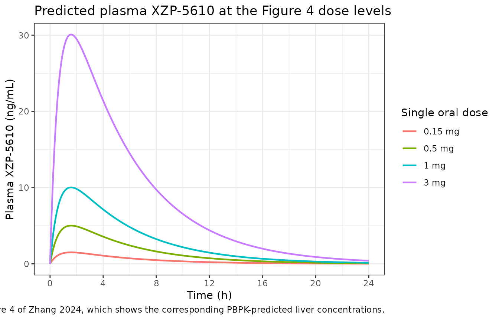

# XZP-5610 (Zhang 2024)

## Model and source

- Citation: Zhang L, Feng F, Wang X, Liang H, Yao X, Liu D. Dose
  Prediction and Pharmacokinetic Simulation of XZP-5610, a Small
  Molecule for NASH Therapy, Using Allometric Scaling and
  Physiologically Based Pharmacokinetic Models. Pharmaceuticals (Basel).
  2024 Mar 13;17(3):369. <doi:10.3390/ph17030369>
- Description: One-compartment oral PK model for the non-steroidal FXR
  agonist XZP-5610 (NASH) in healthy Chinese adults, forward-predicted
  from SD rat and beagle dog preclinical PK by allometric scaling (Zhang
  2024): first-order absorption from a depot with bioavailability,
  linear elimination from central. Every parameter is a cross-species
  prediction used for first-in-human dose selection, not an estimate
  fitted to human data; the paper reports no IIV and no residual error
  for it. The companion whole-body PBPK model in the same paper was
  built in PK-Sim v11.2 and is not reproducible from the published
  sources (no ODEs, organ volumes, blood flows, or per-tissue partition
  coefficients are reported).
- Article: <https://doi.org/10.3390/ph17030369>
- Supplement: <https://www.mdpi.com/article/10.3390/ph17030369/s1>

XZP-5610 is a non-steroidal, liver-selective farnesoid X receptor (FXR)
agonist developed for non-alcoholic steatohepatitis (NASH). Zhang and
colleagues combined in vitro ADME work, single-dose PK in SD rats and
beagle dogs, and toxicology / pharmacodynamic studies to forward-predict
the human PK parameters and the doses for the first-in-human (FIH)
single ascending dose trial.

The paper contains two modelling layers:

1.  **Allometric scaling (AS).** Human intravenous clearance,
    steady-state volume of distribution, oral bioavailability and
    absorption rate constant were predicted from the rat and dog data.
    Together these four numbers define a one-compartment oral PK model,
    and it is that model which drives the paper’s dose calculations
    (Table 5). **This is the model packaged here.**
2.  **Whole-body PBPK.** A rat and a human PBPK model were built in
    PK-Sim v11.2 with Rodgers and Rowland tissue partitioning and the
    PK-Sim standard cellular permeability method, and were used to
    predict liver concentrations (Figure 4). **This layer is not
    packaged** – see *Assumptions and deviations* below.

## Population

The model targets healthy Chinese adults enrolled in the FIH single
ascending dose trial, dosed orally from 0.15 mg (the selected maximum
recommended starting dose) up to 3 mg (the selected maximum dose).
Per-cohort subject counts, ages, weights and sex balance for that trial
are not reported in this paper; the clinical data appear only as
predicted-versus-observed ratios in Figure 3. Allometric scaling assumed
a single average adult body weight of 60 kg (Section 4.3.2), so no
body-weight covariate enters the model.

None of the parameters was estimated from human data. They were
forward-predicted from 24 SD rats (mean body weight 0.245 kg) and 24
beagle dogs (mean body weight 7.21 kg), each species split into one
intravenous group and three single-dose oral groups (Section 4.3.1; PK
in Tables 1 and 2). Human clearance was taken from the dog alone because
rat hepatocyte metabolic stability differed markedly from human (Table
S3: rat CL(liver) 42.3 vs human 12.6 mL/min/kg), which made the
rat-derived human clearance roughly twofold too high (Section 2.4,
Discussion).

The same information is available programmatically via the model’s
`population` metadata
(`readModelDb("Zhang_2024_XZP5610")()$population`).

## Source trace

The per-parameter origin is recorded as an in-file comment next to each
`ini()` entry in `inst/modeldb/specificDrugs/Zhang_2024_XZP5610.R`. The
table below collects them in one place, together with the arithmetic
that reproduces each published point value from the paper’s own tables.

| Equation / parameter | Value | Source location | Independent check |
|----|----|----|----|
| `lka` (ka) | 1.46 /h | Section 2.4; Section 4.3.2 | mean(0.589, 2.34) = 1.4645, the dog and rat one-compartment NONMEM estimates that bound human ka |
| `lcl` (CL) | 8.3 L/h | Section 2.4 (“138 mL/min (8.3 L/h)”); Table 5 footnote; Table 6 (0.138 L/h/kg) | mean of the four beagle-dog rows of Table 3 = mean(96.4, 92.3, 181, 184) = 138.4 mL/min |
| `lvc` (Vss) | 41.8 L | Section 2.4 | mean of the three human Vss rows of Table 3 = mean(17.1, 45.3, 63.0) = 41.8 L |
| `lfdepot` (F) | 0.574 | Section 2.4; Table 5 footnote | mean of the six beagle-dog oral F values in Table 2 = mean(43.4, 82.9, 51.2, 38.2, 61.4, 67.1) = 57.37% |
| `d/dt(depot) <- -ka * depot` | n/a | Section 4.3.2: “one-compartment PK models were constructed using NONMEM … with mean blood concentration data obtained after oral administration” | – |
| `d/dt(central) <- ka * depot - kel * central` | n/a | Section 4.3.2 (as above); linear PK asserted in the Discussion | – |
| `f(depot) <- exp(lfdepot)` | n/a | Section 2.4 (oral bioavailability applied to the oral dose) | Table 5 HED column, reproduced below |
| `Cc <- 1000 * central / vc` | n/a | unit conversion only: states in mg, `vc` in L, so `central / vc` is mg/L and 1 mg/L = 1000 ng/mL | – |
| IIV, residual error | absent | not reported: no parameter was fitted to human concentrations | – |

``` r

mod <- readModelDb("Zhang_2024_XZP5610")

ka <- 1.46      # 1/h
cl <- 8.3       # L/h
vc <- 41.8      # L
fF <- 0.574     # unitless

kel <- cl / vc
c(ka = ka, cl = cl, vc = vc, F = fF, kel = kel)
#>         ka         cl         vc          F        kel 
#>  1.4600000  8.3000000 41.8000000  0.5740000  0.1985646
```

## Virtual cohort

The packaged model is deterministic: the paper reports no
inter-individual variability and no residual error, because none of its
parameters was fitted to human concentrations. A single typical-value
profile per dose level is therefore the complete prediction, and
simulating a stochastic cohort would only add noise that the source does
not support.

The four dose levels below are those the paper simulated in Figure 4
(0.15, 0.5, 1 and 3 mg), which span the FIH single-ascending-dose range
from the selected maximum recommended starting dose to the selected
maximum dose.

``` r

doses <- c(0.15, 0.5, 1, 3)

obs_times <- sort(unique(c(seq(0, 6, by = 0.05), seq(6, 24, by = 0.25))))

make_arm <- function(dose, id) {
  dplyr::bind_rows(
    tibble::tibble(
      id = id, time = 0, amt = dose, evid = 1L, cmt = "depot"
    ),
    tibble::tibble(
      id = id, time = obs_times, amt = NA_real_, evid = 0L, cmt = "central"
    )
  ) |>
    dplyr::mutate(treatment = sprintf("%g mg", dose))
}

events <- dplyr::bind_rows(
  lapply(seq_along(doses), function(i) make_arm(doses[i], id = i))
)

stopifnot(!anyDuplicated(unique(events[, c("id", "time", "evid")])))
```

## Simulation

``` r

sim <- rxode2::rxSolve(
  mod,
  events = events,
  keep = c("treatment")
) |>
  as.data.frame()

# The model has no random effects, so every subject is the typical individual.
stopifnot(dplyr::n_distinct(sim$id) == length(doses))
```

## Replicate published figures

The paper does not print a human plasma concentration-time figure:
Figure 3 is a predicted-versus-observed ratio plot for the clinical SAD
data (no concentrations or times are given), and Figure 4 shows
**liver** concentrations from the PBPK model. The panel below is
therefore the plasma prediction of the packaged AS model at the four
Figure 4 dose levels – the plasma profile that the liver figure sits on
top of.

``` r

sim |>
  dplyr::mutate(
    treatment = factor(treatment, levels = sprintf("%g mg", doses))
  ) |>
  ggplot(aes(time, Cc, colour = treatment)) +
  geom_line(linewidth = 0.8) +
  scale_x_continuous(breaks = seq(0, 24, by = 4)) +
  labs(
    x = "Time (h)", y = "Plasma XZP-5610 (ng/mL)", colour = "Single oral dose",
    title = "Predicted plasma XZP-5610 at the Figure 4 dose levels",
    caption = paste(
      "Companion to Figure 4 of Zhang 2024, which shows the corresponding",
      "PBPK-predicted liver concentrations."
    )
  ) +
  theme_bw()
```



Zhang 2024 Section 2.7 reports that the PBPK model predicted human
liver-to-plasma ratios of approximately **10.3** on Cmax and **13.5** on
AUC. Applying those two published ratios to the plasma predictions above
gives the liver exposures implied by Figure 4. These are annotations
derived from the paper’s reported ratios, **not** outputs of the
packaged model, which has no liver compartment.

``` r

liver_ratio_cmax <- 10.3   # Section 2.7
liver_ratio_auc  <- 13.5   # Section 2.7

tibble::tibble(
  treatment = sprintf("%g mg", doses),
  plasma_cmax = fF * doses / vc * (ka / (ka - kel)) *
    (exp(-kel * log(ka / kel) / (ka - kel)) -
       exp(-ka * log(ka / kel) / (ka - kel))) * 1000,
  plasma_auc = fF * doses / cl * 1000
) |>
  dplyr::mutate(
    liver_cmax = plasma_cmax * liver_ratio_cmax,
    liver_auc  = plasma_auc * liver_ratio_auc
  ) |>
  dplyr::rename(
    "Single oral dose"             = treatment,
    "Plasma Cmax (ng/mL)"          = plasma_cmax,
    "Plasma AUC0-inf (ng*h/mL)"    = plasma_auc,
    "Implied liver Cmax (ng/g)"    = liver_cmax,
    "Implied liver AUC0-inf (ng*h/g)" = liver_auc
  ) |>
  knitr::kable(
    digits = 2,
    caption = paste(
      "Liver exposure implied by the packaged plasma model and the",
      "liver-to-plasma ratios reported in Zhang 2024 Section 2.7",
      "(10.3 on Cmax, 13.5 on AUC). Annotation only; the packaged model",
      "has no liver compartment."
    )
  )
```

| Single oral dose | Plasma Cmax (ng/mL) | Plasma AUC0-inf (ng\*h/mL) | Implied liver Cmax (ng/g) | Implied liver AUC0-inf (ng\*h/g) |
|:---|---:|---:|---:|---:|
| 0.15 mg | 1.50 | 10.37 | 15.50 | 140.04 |
| 0.5 mg | 5.02 | 34.58 | 51.66 | 466.81 |
| 1 mg | 10.03 | 69.16 | 103.32 | 933.61 |
| 3 mg | 30.09 | 207.47 | 309.96 | 2800.84 |

Liver exposure implied by the packaged plasma model and the
liver-to-plasma ratios reported in Zhang 2024 Section 2.7 (10.3 on Cmax,
13.5 on AUC). Annotation only; the packaged model has no liver
compartment. {.table}

## PKNCA validation

``` r

sim_nca <- sim |>
  dplyr::filter(!is.na(Cc)) |>
  dplyr::select(id, time, Cc, treatment)

# Guarantee a time = 0 record per subject; Cc = 0 pre-dose is correct for an
# extravascular single dose.
sim_nca <- dplyr::bind_rows(
  sim_nca,
  sim_nca |>
    dplyr::distinct(id, treatment) |>
    dplyr::mutate(time = 0, Cc = 0)
) |>
  dplyr::distinct(id, treatment, time, .keep_all = TRUE) |>
  dplyr::arrange(id, treatment, time)

conc_obj <- PKNCA::PKNCAconc(sim_nca, Cc ~ time | treatment + id)

dose_df <- events |>
  dplyr::filter(evid == 1L) |>
  dplyr::select(id, time, amt, treatment)

dose_obj <- PKNCA::PKNCAdose(dose_df, amt ~ time | treatment + id)

intervals <- data.frame(
  start      = 0,
  end        = Inf,
  cmax       = TRUE,
  tmax       = TRUE,
  aucinf.obs = TRUE,
  half.life  = TRUE
)

nca_res <- PKNCA::pk.nca(PKNCA::PKNCAdata(conc_obj, dose_obj,
                                          intervals = intervals))
```

### Comparison against the closed-form one-compartment solution

The paper reports **no** numeric human NCA table (Cmax, Tmax, AUC and
half-life for the clinical SAD cohorts appear only as ratios in Figure
3), so there is no published NCA to compare against directly. The
available check on the packaged model is instead the analytic solution
of the one-compartment oral model it encodes – an independent test of
the numerically integrated ODEs and of the NCA itself, since the two
routes share no code:

``` math
C(t) = \frac{F \cdot D \cdot k_a}{V_{ss} (k_a - k_{el})}
        \left( e^{-k_{el} t} - e^{-k_a t} \right),
  \qquad k_{el} = \mathrm{CL} / V_{ss}
```

``` r

tmax_analytic <- log(ka / kel) / (ka - kel)

conc_analytic <- function(dose, t) {
  1000 * fF * dose * ka / (vc * (ka - kel)) * (exp(-kel * t) - exp(-ka * t))
}

analytic <- tibble::tibble(
  treatment  = sprintf("%g mg", doses),
  cmax       = conc_analytic(doses, tmax_analytic),
  tmax       = tmax_analytic,
  aucinf.obs = 1000 * fF * doses / cl,
  half.life  = log(2) / kel
)

cmp <- nlmixr2lib::ncaComparisonTable(
  simulated = nca_res,
  reference = analytic,
  by        = "treatment",
  units     = c(cmax = "ng/mL", tmax = "h",
                aucinf.obs = "ng*h/mL", half.life = "h"),
  tolerance_pct = 20
)

knitr::kable(
  cmp,
  digits  = 3,
  caption = paste(
    "PKNCA on the simulated profiles versus the closed-form one-compartment",
    "oral solution. * marks a >20% difference."
  )
)
```

| NCA parameter           | treatment | Reference | Simulated | % diff |
|:------------------------|:----------|:----------|:----------|:-------|
| Cmax (ng/mL)            | 0.15 mg   | 1.5       | 1.5       | -0.0%  |
| Cmax (ng/mL)            | 0.5 mg    | 5.02      | 5.02      | -0.0%  |
| Cmax (ng/mL)            | 1 mg      | 10        | 10        | -0.0%  |
| Cmax (ng/mL)            | 3 mg      | 30.1      | 30.1      | -0.0%  |
| Tmax (h)                | 0.15 mg   | 1.58      | 1.6       | +1.2%  |
| Tmax (h)                | 0.5 mg    | 1.58      | 1.6       | +1.2%  |
| Tmax (h)                | 1 mg      | 1.58      | 1.6       | +1.2%  |
| Tmax (h)                | 3 mg      | 1.58      | 1.6       | +1.2%  |
| AUC0-∞ (obs) (ng\*h/mL) | 0.15 mg   | 10.4      | 10.4      | -0.0%  |
| AUC0-∞ (obs) (ng\*h/mL) | 0.5 mg    | 34.6      | 34.6      | -0.0%  |
| AUC0-∞ (obs) (ng\*h/mL) | 1 mg      | 69.2      | 69.2      | -0.0%  |
| AUC0-∞ (obs) (ng\*h/mL) | 3 mg      | 207       | 207       | -0.0%  |
| t½ (h)                  | 0.15 mg   | 3.49      | 3.51      | +0.5%  |
| t½ (h)                  | 0.5 mg    | 3.49      | 3.51      | +0.5%  |
| t½ (h)                  | 1 mg      | 3.49      | 3.51      | +0.5%  |
| t½ (h)                  | 3 mg      | 3.49      | 3.51      | +0.5%  |

PKNCA on the simulated profiles versus the closed-form one-compartment
oral solution. \* marks a \>20% difference. {.table}

``` r

# Hard gate: the numerical simulation plus PKNCA must agree with the analytic
# solution to well within 5% on every parameter and every dose level.
nca_wide <- as.data.frame(nca_res) |>
  dplyr::select(treatment, PPTESTCD, PPORRES) |>
  tidyr::pivot_wider(names_from = PPTESTCD, values_from = PPORRES)

chk <- dplyr::inner_join(
  nca_wide, analytic,
  by = "treatment", suffix = c("_sim", "_ana")
) |>
  dplyr::mutate(
    dev_cmax  = abs(cmax_sim / cmax_ana - 1),
    dev_tmax  = abs(tmax_sim - tmax_ana),
    dev_auc   = abs(aucinf.obs_sim / aucinf.obs_ana - 1),
    dev_thalf = abs(half.life_sim / half.life_ana - 1)
  )

stopifnot(
  all(chk$dev_cmax  < 0.05),
  all(chk$dev_auc   < 0.05),
  all(chk$dev_thalf < 0.05),
  # Tmax is read off a 0.05 h observation grid, so compare on the grid scale.
  all(chk$dev_tmax  <= 0.05)
)

chk |>
  dplyr::select(treatment, dev_cmax, dev_auc, dev_thalf, dev_tmax) |>
  dplyr::rename(
    "Single oral dose"                  = treatment,
    "Cmax abs. deviation (fraction)"    = dev_cmax,
    "AUC0-inf abs. deviation (fraction)" = dev_auc,
    "t1/2 abs. deviation (fraction)"    = dev_thalf,
    "Tmax abs. deviation (h)"           = dev_tmax
  ) |>
  knitr::kable(
    digits  = 5,
    caption = "Simulation + PKNCA versus the analytic solution: deviations."
  )
```

| Single oral dose | Cmax abs. deviation (fraction) | AUC0-inf abs. deviation (fraction) | t1/2 abs. deviation (fraction) | Tmax abs. deviation (h) |
|:---|---:|---:|---:|---:|
| 0.15 mg | 5e-05 | 1e-05 | 0.00546 | 0.01841 |
| 0.5 mg | 5e-05 | 1e-05 | 0.00546 | 0.01841 |
| 1 mg | 5e-05 | 1e-05 | 0.00546 | 0.01841 |
| 3 mg | 5e-05 | 1e-05 | 0.00546 | 0.01841 |

Simulation + PKNCA versus the analytic solution: deviations. {.table}

### Dose proportionality

The Discussion asserts linear PK across the studied dose range. The
packaged model is linear by construction, so this is a check that the
simulation and NCA preserve that property rather than a test of the
paper’s claim.

``` r

nca_wide |>
  dplyr::mutate(dose = doses[match(treatment, sprintf("%g mg", doses))]) |>
  dplyr::transmute(
    treatment,
    cmax_per_mg = cmax / dose,
    auc_per_mg  = aucinf.obs / dose,
    tmax,
    half.life
  ) |>
  dplyr::rename(
    "Single oral dose"             = treatment,
    "Cmax / dose (ng/mL per mg)"   = cmax_per_mg,
    "AUC0-inf / dose (ng*h/mL/mg)" = auc_per_mg,
    "Tmax (h)"                     = tmax,
    "t1/2 (h)"                     = half.life
  ) |>
  knitr::kable(
    digits  = 3,
    caption = "Dose-normalised NCA. Constant columns confirm dose linearity."
  )
```

| Single oral dose | Cmax / dose (ng/mL per mg) | AUC0-inf / dose (ng\*h/mL/mg) | Tmax (h) | t1/2 (h) |
|:---|---:|---:|---:|---:|
| 0.15 mg | 10.031 | 69.156 | 1.6 | 3.51 |
| 0.5 mg | 10.031 | 69.156 | 1.6 | 3.51 |
| 1 mg | 10.031 | 69.156 | 1.6 | 3.51 |
| 3 mg | 10.031 | 69.156 | 1.6 | 3.51 |

Dose-normalised NCA. Constant columns confirm dose linearity. {.table}

### Reproducing Table 5 – the published human equivalent doses

Table 5 of Zhang 2024 converts each animal’s NOAEL steady-state AUC0-24
into a human equivalent dose (HED) by free-fraction correction followed
by division by the predicted human CL/F. That second step uses exactly
the `lcl` and `lfdepot` values packaged here, so recomputing the
published HED and MRSD columns is a direct numerical test of two of the
model’s four parameters against printed results.

The free-fraction ratio uses the values in the Table 5 footnote: fup is
1.3% in SD rat, 0.3% in beagle dog and 0.2% in human.

``` r

table5 <- tibble::tribble(
  ~species,      ~sex,      ~noael_mg_kg, ~auc_animal, ~fup_animal, ~auc_human_pub, ~hed_pub, ~mrsd_pub,
  "SD rat",      "Male",    1.5,          75.2,        0.013,       489,            7.07,     0.71,
  "SD rat",      "Female",  1.0,          46.4,        0.013,       302,            4.36,     0.44,
  "Beagle dog",  "Male",    0.05,         127.6,       0.003,       191,            2.77,     0.28,
  "Beagle dog",  "Female",  0.05,         152.1,       0.003,       228,            3.30,     0.33
)

fup_human <- 0.002   # Table 5 footnote and Table 6
safety_factor <- 10  # Section 2.5

table5_recomputed <- table5 |>
  dplyr::mutate(
    auc_human_calc = auc_animal * fup_animal / fup_human,
    # HED = AUC (ng*h/mL -> mg*h/L is /1000) * CL (L/h) / F
    hed_calc  = auc_human_pub / 1000 * cl / fF,
    mrsd_calc = hed_calc / safety_factor
  )

table5_recomputed |>
  dplyr::transmute(
    group = paste(species, sex),
    auc_human_pub, auc_human_calc,
    hed_pub, hed_calc,
    mrsd_pub, mrsd_calc
  ) |>
  dplyr::rename(
    "Species / sex"                 = group,
    "Human equiv AUC0-24, published (ng*h/mL)" = auc_human_pub,
    "Human equiv AUC0-24, recomputed"          = auc_human_calc,
    "HED, published (mg)"                      = hed_pub,
    "HED, recomputed (mg)"                     = hed_calc,
    "MRSD, published (mg)"                     = mrsd_pub,
    "MRSD, recomputed (mg)"                    = mrsd_calc
  ) |>
  knitr::kable(
    digits  = 2,
    caption = paste(
      "Zhang 2024 Table 5 recomputed from the packaged CL (8.3 L/h) and",
      "F (0.574). The HED column is reproduced to within 1%; every recomputed",
      "MRSD rounds exactly to the published two-decimal value."
    )
  )
```

| Species / sex | Human equiv AUC0-24, published (ng\*h/mL) | Human equiv AUC0-24, recomputed | HED, published (mg) | HED, recomputed (mg) | MRSD, published (mg) | MRSD, recomputed (mg) |
|:---|---:|---:|---:|---:|---:|---:|
| SD rat Male | 489 | 488.80 | 7.07 | 7.07 | 0.71 | 0.71 |
| SD rat Female | 302 | 301.60 | 4.36 | 4.37 | 0.44 | 0.44 |
| Beagle dog Male | 191 | 191.40 | 2.77 | 2.76 | 0.28 | 0.28 |
| Beagle dog Female | 228 | 228.15 | 3.30 | 3.30 | 0.33 | 0.33 |

Zhang 2024 Table 5 recomputed from the packaged CL (8.3 L/h) and F
(0.574). The HED column is reproduced to within 1%; every recomputed
MRSD rounds exactly to the published two-decimal value. {.table}

``` r

stopifnot(
  # Free-fraction correction step.
  all(abs(table5_recomputed$auc_human_calc /
            table5_recomputed$auc_human_pub - 1) < 0.01),
  # HED from the packaged CL and F.
  all(abs(table5_recomputed$hed_calc /
            table5_recomputed$hed_pub - 1) < 0.01),
  # MRSD is published to two decimals, so compare on the published precision.
  # This is exact agreement, not a tolerance: every recomputed MRSD rounds to
  # the printed value.
  all(round(table5_recomputed$mrsd_calc, 2) == table5_recomputed$mrsd_pub)
)
```

Every published HED in Table 5 is reproduced to within 1% from the
packaged `lcl` and `lfdepot`, and every recomputed MRSD rounds exactly
to the published two-decimal value. Note that although the supplementary
equation (11) describes the divisor as the *animal* bioavailability
`Fa`, only the predicted *human* bioavailability of 57.4% reproduces the
printed HED column; the Table 5 footnote states the same value. This is
recorded under *Assumptions and deviations*.

### Safety margin at the selected FIH doses

The selected starting dose was 0.15 mg and the selected maximum dose 3
mg (Discussion). The model’s predicted exposures can be placed against
the lowest human equivalent AUC derived from an animal NOAEL.

``` r

auc_per_mg <- 1000 * fF / cl                       # ng*h/mL per mg
lowest_noael_human_auc <- min(table5$auc_human_pub)  # ng*h/mL, beagle dog male

tibble::tibble(
  dose = c(0.15, 2, 3),
  role = c("selected MRSD", "selected MABEL", "selected MTD / max SAD dose"),
  auc  = dose * auc_per_mg
) |>
  dplyr::mutate(margin = lowest_noael_human_auc / auc) |>
  dplyr::rename(
    "Dose (mg)"                              = dose,
    "Role in the FIH design"                 = role,
    "Predicted AUC0-inf (ng*h/mL)"           = auc,
    "Fold below the lowest NOAEL-derived human AUC" = margin
  ) |>
  knitr::kable(
    digits  = 2,
    caption = paste(
      "Predicted single-dose exposures at the doses selected in Section 2.5",
      "versus the lowest animal-NOAEL-derived human equivalent AUC0-24",
      "(191 ng*h/mL, male beagle dog; Table 5)."
    )
  )
```

| Dose (mg) | Role in the FIH design | Predicted AUC0-inf (ng\*h/mL) | Fold below the lowest NOAEL-derived human AUC |
|---:|:---|---:|---:|
| 0.15 | selected MRSD | 10.37 | 18.41 |
| 2.00 | selected MABEL | 138.31 | 1.38 |
| 3.00 | selected MTD / max SAD dose | 207.47 | 0.92 |

Predicted single-dose exposures at the doses selected in Section 2.5
versus the lowest animal-NOAEL-derived human equivalent AUC0-24 (191
ng\*h/mL, male beagle dog; Table 5). {.table}

## Assumptions and deviations

- **The PBPK layer of the paper is not packaged.** Zhang 2024 built rat
  and human whole-body PBPK models in PK-Sim v11.2 using the Rodgers and
  Rowland tissue partitioning method and the PK-Sim standard
  cellular-permeability method, and used them for Figures 2, 3 and 4.
  Reproducing that model in rxode2 requires the ODE system, the organ
  volumes and blood flows, and the per-tissue partition coefficients.
  **None of these is reported.** Table 6 lists only compound-level
  inputs (MW 556.46 g/mol; pKa 10.13 and 3.39; LogP 3.2; solubility 25
  ug/mL at pH 6.0; Papp 10.1e-6 cm/s; fup 1.3% rat / 0.2% human; BP
  0.58; CL 1.93 rat / 0.138 human L/h/kg; biliary clearance CLB 0.18)
  plus a single optimised liver-to-plasma partition coefficient KP,L =
  37.0 and the *names* of the two calculation methods. The supplement
  (retrieved and read: it holds the hepatic-clearance and
  allometric-scaling equations plus Tables S1-S6 and Figure S1) contains
  no physiology either, and no PK-Sim project file was deposited. Per
  the PBPK / QSP sourcing rule, physiologic parameters are not
  substituted from platform defaults or class knowledge, so this layer
  is documented rather than guessed at.
- **No inter-individual variability and no residual error.** The four
  packaged parameters are cross-species predictions, not estimates; the
  paper reports no variance components for them, and none is invented
  here. Consequently the model simulates a single typical profile per
  dose and `zeroRe()` is unnecessary.
- **All four parameters are wrapped in `fixed()`.** None was estimated.
  Each is a point prediction the authors held constant when computing
  the FIH doses.
- **`ka` is a cross-species average, not a human estimate.** Section
  4.3.2 fits one-compartment NONMEM models to *rat* and *dog* mean oral
  profiles and uses their ka estimates as the bounds of human ka; the
  packaged value 1.46 /h is the midpoint of that 0.589-2.34 /h range.
  The paper itself notes the animal-to-human correlation for ka is weak.
- **`Vss` is used as the central volume.** For a one-compartment model
  Vss and Vc coincide. The paper predicts only Vss and does not report a
  distributional phase for humans.
- **Table 5’s divisor is human, not animal, bioavailability.**
  Supplementary equation (11) writes `Fa` and glosses it as “animal
  bioavailability”, but only F = 57.4% (the predicted *human* value,
  taken from the dog) reproduces the printed HED column; using the
  per-species animal F does not. The Table 5 footnote defines F as
  57.4%. The printed table is treated as authoritative over the
  supplement’s gloss, and the vignette check above confirms the
  agreement to within 1%.
- **The clinical SAD data are not reproduced.** Figure 3 reports only
  predicted/observed ratios; no concentrations, times or NCA values from
  the FIH trial are printed, so no observed-data overlay or
  published-NCA comparison is possible. The closed-form check above
  validates the packaged implementation, not the paper’s predictive
  accuracy.
- **Rat and dog PK are not packaged as separate models.** Tables 1 and 2
  report non-compartmental CL, Vss and F for each species, and Section
  4.3.2 reports a one-compartment NONMEM fit per species – but only ka
  was published from those fits. Building species models would require
  pairing the published ka with NCA-derived CL and Vss, a combination
  the authors never reported; in the rat that pairing implies a
  half-life of about 0.3 h against an observed 1.0-2.9 h, confirming
  that the rat is not one-compartment. Those tables therefore appear
  here as source-trace provenance only.
- **Liver concentrations are annotations, not model output.** The
  implied liver exposures shown above are the packaged plasma
  predictions multiplied by the liver-to-plasma ratios the paper reports
  in Section 2.7 (10.3 on Cmax, 13.5 on AUC). The packaged model has no
  liver compartment.
- **Non-paper-derived parameter values: none.** Every value in the model
  file is printed in the paper’s text or tables, and each is
  independently re-derived from a second location in the paper in the
  *Source trace* table above.
