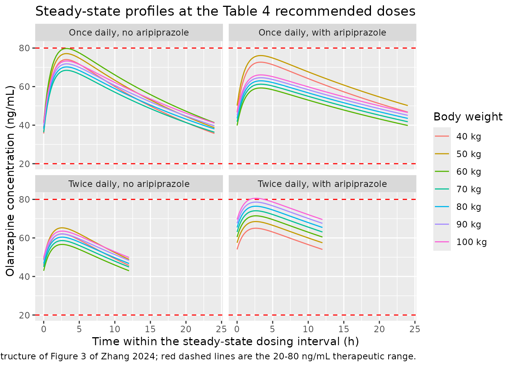
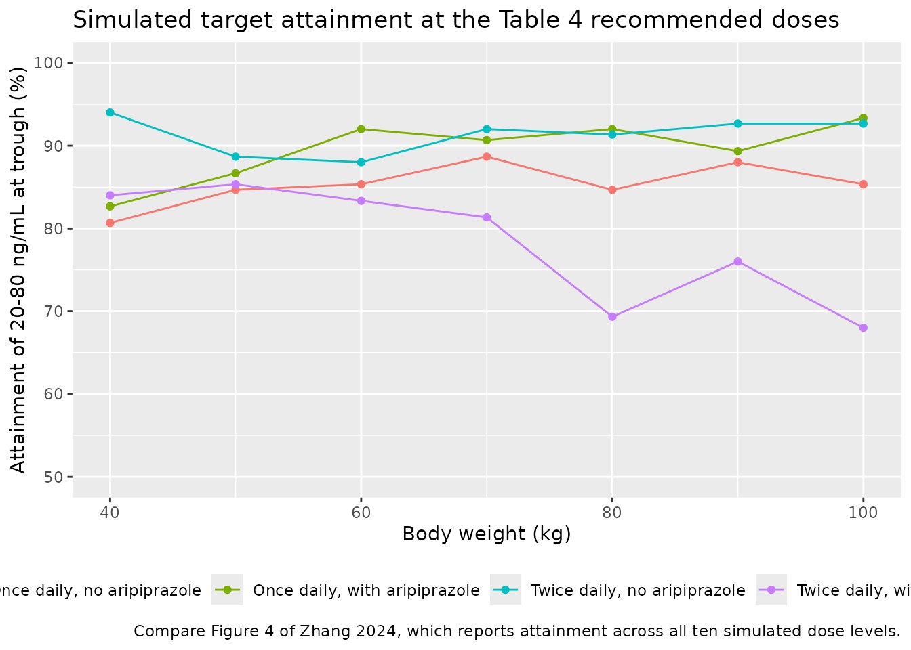

# Olanzapine (Zhang 2024)

## Model and source

- Citation: Zhang C, Jiang L, Hu K, Chen L, Zhang YJ, Shi HZ, He SM,
  Chen X, Wang DD. Effects of Aripiprazole on Olanzapine Population
  Pharmacokinetics and Initial Dosage Optimization in Schizophrenia
  Patients. Neuropsychiatric Disease and Treatment. 2024;20:479-490.
  <doi:10.2147/NDT.S455183>. Final model Equations (6) and (7);
  parameter estimates Table 3. The fixed absorption rate constant is
  quoted from the paper’s reference 29: Sun L, Mills R, Sadler BM,
  Rege B. Population pharmacokinetics of olanzapine and samidorphan when
  administered in combination in healthy subjects and patients with
  schizophrenia. J Clin Pharmacol. 2021;61(11):1430-1441.
  <doi:10.1002/jcph.1911>.
- Description: One-compartment population PK model for oral olanzapine
  with first-order absorption in adults with schizophrenia, built from a
  routine therapeutic-drug-monitoring database (Zhang 2024). Apparent
  oral clearance is allometrically scaled on body weight and reduced by
  39.2% when aripiprazole is co-administered; the absorption rate
  constant is fixed to a published value. Between-subject variability
  was retained on CL/F only.
- Article: <https://doi.org/10.2147/NDT.S455183>

Zhang and colleagues fitted a one-compartment model with first-order
oral absorption to routine therapeutic-drug-monitoring (TDM)
concentrations from 65 inpatients with schizophrenia. The absorption
rate constant was not identifiable from sparse trough-dominated TDM data
and was fixed to a published value; apparent oral clearance and apparent
volume were estimated. Of the 30 concomitant medications screened, only
aripiprazole was retained: patients co-prescribed aripiprazole had 39.2%
lower olanzapine CL/F.

## Population

Sixty-five inpatients with schizophrenia treated at a single centre in
Xuzhou, Jiangsu, China contributed olanzapine TDM concentrations
collected between July 2020 and October 2022 (Methods, Data Collection).
The cohort was 36 men and 29 women, mean age 45.92 years (SD 15.79) and
mean weight 63.16 kg (SD 10.57) (Table 1). Baseline laboratory values
were broadly unremarkable: mean albumin 41.53 g/L, creatinine 66.16
umol/L, alanine transaminase 23.52 IU/L. Four of the 65 patients were
co-prescribed aripiprazole orally disintegrating tablets (Table 2).

The paper reports no administered olanzapine doses, dose ranges, or
sampling times; the concentrations come from a routine TDM database
rather than a designed PK study. Every dosing regimen used below is
therefore a scenario constructed for validation, not a replication of
the observed data.

The same information is available programmatically via the model’s
`population` metadata
(`readModelDb("Zhang_2024_olanzapine")()$population`).

## Source trace

The per-parameter origin is recorded as an in-file comment next to each
`ini()` entry in `inst/modeldb/specificDrugs/Zhang_2024_olanzapine.R`.
The table below collects them in one place.

| Equation / parameter | Value | Source location |
|----|----|----|
| `lcl` (CL/F at 70 kg, no aripiprazole) | 27.6 L/h | Table 3 (SE 5.6%; bootstrap median 27.3 \[24.7, 30.4\]); also printed in Equation (6) and restated in the Discussion |
| `lvc` (V/F at 70 kg) | 854 L | Table 3 (SE 25.5%; bootstrap median 858 \[600, 2530\]); also printed in Equation (7) and restated in the Discussion |
| `lka` (ka, fixed) | 0.861 1/h | Table 3, “0.861 (fixed)”; Methods, Modeling: “absorption rate constant (Ka, fixed at 0.861/h\[29\])”. Reference 29 is Sun 2021, J Clin Pharmacol 61(11):1430-1441 |
| `e_wt_cl` (allometric exponent on CL/F, fixed) | 0.75 | Methods, Equation (3): “Z represented the allometric coefficient: 0.75 for the CL/F and 1 for the V/F”, citing Anderson & Holford 2008; the exponent is printed again in Equation (6) |
| `e_wt_vc` (allometric exponent on V/F, fixed) | 1 | Methods, Equation (3); printed again in Equation (7) |
| `e_ari_cl` (concomitant aripiprazole on CL/F) | -0.392 | Table 3, theta_ARI (SE 27.8%; bootstrap median -0.377 \[-0.535, -0.194\]); assembled in Equation (6) as `(1 - 0.392 * ARI)` |
| `etalcl` (IIV on CL/F) | omega = 0.316, so variance 0.316^2 | Table 3, row `omega_CL/F` (SE 13.4%; bootstrap median 0.321 \[0.223, 0.395\]). Read as a standard deviation – see Assumptions below |
| `propSd` (proportional residual error) | 0.288 | Table 3, row `sigma_1`, “residual variability, proportional error” (SE 10.1%) |
| `addSd` (additive residual error) | 3.701 ng/mL | Table 3, row `sigma_2`, “residual variability, additive error” (SE 17.4%) |
| IIV structure `L_i = TV(L) * exp(eta_i)` | n/a | Methods, Equation (1) |
| Residual structure `T_i = U_i + U_i*eps_1 + eps_2` | n/a | Methods, Equation (2) |
| Allometry `V_i = V_std * (Y_i / Y_std)^Z`, `Y_std = 70 kg` | n/a | Methods, Equation (3) |
| Categorical covariate form (linear shift) | n/a | Methods, Equation (5); realised in Equation (6) |
| `CL/F = 27.6 * (weight/70)^0.75 * (1 - 0.392 * ARI)` | n/a | Results, Modeling, Equation (6) |
| `V/F = 854 * (weight/70)` | n/a | Results, Modeling, Equation (7) |
| Therapeutic range 20-80 ng/mL | n/a | Methods, Simulation (cites the paper’s reference 16, Ding 2022) |
| Initial-dose recommendations | n/a | Table 4 and Figure 4 |

``` r

mod <- readModelDb("Zhang_2024_olanzapine")
ui  <- rxode2::rxode(mod)
#> ℹ parameter labels from comments will be replaced by 'label()'
```

## Structural checks against the printed equations

The published model is fully specified by Equations (6) and (7), so the
first check is that the packaged model reproduces them exactly.
`zeroRe()` removes between-subject variability so the solved `cl` and
`vc` are the typical values.

``` r

# Published equations, transcribed independently of the model file.
cl_published <- function(wt, ari) 27.6 * (wt / 70)^0.75 * (1 - 0.392 * ari)
vc_published <- function(wt)      854  * (wt / 70)

grid <- tidyr::expand_grid(WT = c(40, 50, 60, 70, 80, 90, 100),
                           CONMED_ARIPIPRAZOLE = c(0, 1)) |>
  dplyr::mutate(id = dplyr::row_number(),
                arm = paste0(WT, " kg, ",
                             ifelse(CONMED_ARIPIPRAZOLE == 1, "with", "no"),
                             " aripiprazole"))

ev_struct <- grid |>
  dplyr::mutate(time = 0, amt = 10, evid = 1, cmt = "depot") |>
  dplyr::bind_rows(
    grid |> tidyr::crossing(time = 0:1) |>
      dplyr::mutate(amt = NA_real_, evid = 0, cmt = "central")
  ) |>
  dplyr::arrange(id, time, dplyr::desc(evid))

sim_struct <- rxode2::rxSolve(
  rxode2::zeroRe(mod), events = ev_struct,
  keep = c("WT", "CONMED_ARIPIPRAZOLE", "arm")
) |>
  as.data.frame() |>
  dplyr::group_by(WT, CONMED_ARIPIPRAZOLE, arm) |>
  dplyr::summarise(cl_model = mean(cl), vc_model = mean(vc), ka_model = mean(ka),
                   .groups = "drop") |>
  dplyr::mutate(cl_paper = cl_published(WT, CONMED_ARIPIPRAZOLE),
                vc_paper = vc_published(WT))
#> ℹ parameter labels from comments will be replaced by 'label()'
#> ℹ omega/sigma items treated as zero: 'etalcl'
#> Warning: multi-subject simulation without without 'omega'

stopifnot(
  nrow(sim_struct) == 14L,
  max(abs(sim_struct$cl_model - sim_struct$cl_paper)) < 1e-8,
  max(abs(sim_struct$vc_model - sim_struct$vc_paper)) < 1e-8,
  max(abs(sim_struct$ka_model - 0.861)) < 1e-8
)

sim_struct |>
  dplyr::transmute(
    Arm                 = arm,
    `CL/F model (L/h)`  = round(cl_model, 3),
    `CL/F Eq. 6 (L/h)`  = round(cl_paper, 3),
    `V/F model (L)`     = round(vc_model, 1),
    `V/F Eq. 7 (L)`     = round(vc_paper, 1)
  ) |>
  knitr::kable(caption = "Typical CL/F and V/F reproduce Equations (6) and (7) exactly.")
```

| Arm | CL/F model (L/h) | CL/F Eq. 6 (L/h) | V/F model (L) | V/F Eq. 7 (L) |
|:---|---:|---:|---:|---:|
| 40 kg, no aripiprazole | 18.140 | 18.140 | 488 | 488 |
| 40 kg, with aripiprazole | 11.029 | 11.029 | 488 | 488 |
| 50 kg, no aripiprazole | 21.444 | 21.444 | 610 | 610 |
| 50 kg, with aripiprazole | 13.038 | 13.038 | 610 | 610 |
| 60 kg, no aripiprazole | 24.587 | 24.587 | 732 | 732 |
| 60 kg, with aripiprazole | 14.949 | 14.949 | 732 | 732 |
| 70 kg, no aripiprazole | 27.600 | 27.600 | 854 | 854 |
| 70 kg, with aripiprazole | 16.781 | 16.781 | 854 | 854 |
| 80 kg, no aripiprazole | 30.507 | 30.507 | 976 | 976 |
| 80 kg, with aripiprazole | 18.548 | 18.548 | 976 | 976 |
| 90 kg, no aripiprazole | 33.325 | 33.325 | 1098 | 1098 |
| 90 kg, with aripiprazole | 20.261 | 20.261 | 1098 | 1098 |
| 100 kg, no aripiprazole | 36.065 | 36.065 | 1220 | 1220 |
| 100 kg, with aripiprazole | 21.928 | 21.928 | 1220 | 1220 |

Typical CL/F and V/F reproduce Equations (6) and (7) exactly. {.table}

The Discussion and Figure 1H state the aripiprazole effect as a
clearance ratio: “at the same weight, the olanzapine clearance rates
were 0.608:1 in patients with or without aripiprazole”. That ratio is
`1 - 0.392` and is weight-independent, so it must hold at every weight.

``` r

ratio <- sim_struct |>
  dplyr::select(WT, CONMED_ARIPIPRAZOLE, cl_model) |>
  tidyr::pivot_wider(names_from = CONMED_ARIPIPRAZOLE,
                     names_prefix = "ari", values_from = cl_model) |>
  dplyr::mutate(ratio = ari1 / ari0)

# Deterministic (no IIV): an exact identity, so a tight bound is correct here.
stopifnot(nrow(ratio) == 7L, max(abs(ratio$ratio - 0.608)) < 1e-9)

ratio |>
  dplyr::transmute(`Weight (kg)` = WT,
                   `CL/F without aripiprazole (L/h)` = round(ari0, 2),
                   `CL/F with aripiprazole (L/h)`    = round(ari1, 2),
                   `Ratio (with:without)`            = round(ratio, 4)) |>
  knitr::kable(caption = "Replicates Figure 1H of Zhang 2024: a clearance ratio of 0.608:1 with vs without aripiprazole, at every weight.")
```

| Weight (kg) | CL/F without aripiprazole (L/h) | CL/F with aripiprazole (L/h) | Ratio (with:without) |
|---:|---:|---:|---:|
| 40 | 18.14 | 11.03 | 0.608 |
| 50 | 21.44 | 13.04 | 0.608 |
| 60 | 24.59 | 14.95 | 0.608 |
| 70 | 27.60 | 16.78 | 0.608 |
| 80 | 30.51 | 18.55 | 0.608 |
| 90 | 33.32 | 20.26 | 0.608 |
| 100 | 36.06 | 21.93 | 0.608 |

Replicates Figure 1H of Zhang 2024: a clearance ratio of 0.608:1 with vs
without aripiprazole, at every weight. {.table}

## PKNCA validation against the published parameters

Zhang 2024 reports no NCA table, but the printed structural parameters
imply exact non-compartmental quantities for a single oral dose of a
linear one-compartment model:

- `AUC0-inf = Dose / (CL/F)` (mass balance; independent of `ka` and
  `V/F`),
- terminal `t1/2 = ln(2) * (V/F) / (CL/F)`, because `ka = 0.861 1/h` is
  far larger than `kel` (0.032 1/h without aripiprazole, 0.020 1/h
  with), so the terminal phase is elimination-rate-limited rather than
  flip-flop,
- `tmax = ln(ka / kel) / (ka - kel)`.

Running PKNCA over a typical-value (no-IIV) simulation therefore checks
the whole pipeline – units, the mg-to-ng/mL conversion, the ODE system,
the covariate model – against numbers derived from Table 3 alone.

``` r

# Single 10 mg oral dose; observe long enough for AUC0-inf to converge.
# t1/2 with aripiprazole is ~35 h, so 720 h is >20 half-lives.
obs_times <- sort(unique(c(seq(0, 24, by = 0.1), seq(24, 720, by = 1))))

ev_nca <- grid |>
  dplyr::mutate(time = 0, amt = 10, evid = 1, cmt = "depot") |>
  dplyr::bind_rows(
    grid |> tidyr::crossing(time = obs_times) |>
      dplyr::mutate(amt = NA_real_, evid = 0, cmt = "central")
  ) |>
  dplyr::arrange(id, time, dplyr::desc(evid))

stopifnot(!anyDuplicated(unique(ev_nca[, c("id", "time", "evid")])))

sim_nca_raw <- rxode2::rxSolve(
  rxode2::zeroRe(mod), events = ev_nca,
  keep = c("WT", "CONMED_ARIPIPRAZOLE", "arm")
) |>
  as.data.frame()
#> ℹ parameter labels from comments will be replaced by 'label()'
#> ℹ omega/sigma items treated as zero: 'etalcl'
#> Warning: multi-subject simulation without without 'omega'

# Concentrations must stay non-negative for PKNCA's log-linear terminal fit.
stopifnot(all(sim_nca_raw$Cc >= 0, na.rm = TRUE))
```

``` r

sim_nca <- sim_nca_raw |>
  dplyr::filter(!is.na(Cc)) |>
  dplyr::select(id, time, Cc, arm)

# Guarantee a time = 0 row per (id, arm); pre-dose Cc = 0 for extravascular.
sim_nca <- dplyr::bind_rows(
  sim_nca,
  sim_nca |> dplyr::distinct(id, arm) |> dplyr::mutate(time = 0, Cc = 0)
) |>
  dplyr::distinct(id, arm, time, .keep_all = TRUE) |>
  dplyr::arrange(id, arm, time)

conc_obj <- PKNCA::PKNCAconc(sim_nca, Cc ~ time | arm + id,
                             concu = "ng/mL", timeu = "h")

dose_df <- ev_nca |>
  dplyr::filter(evid == 1) |>
  dplyr::select(id, time, amt, arm)

dose_obj <- PKNCA::PKNCAdose(dose_df, amt ~ time | arm + id, doseu = "mg")

intervals <- data.frame(
  start      = 0,
  end        = Inf,
  cmax       = TRUE,
  tmax       = TRUE,
  aucinf.obs = TRUE,
  half.life  = TRUE
)

nca_res <- PKNCA::pk.nca(PKNCA::PKNCAdata(conc_obj, dose_obj, intervals = intervals))
```

### Comparison against the values implied by Table 3

``` r

# Reference values derived from the PRINTED parameters only.
ka_pub <- 0.861
published <- grid |>
  dplyr::mutate(
    cl  = cl_published(WT, CONMED_ARIPIPRAZOLE),
    vc  = vc_published(WT),
    kel = cl / vc,
    # 10 mg / (L/h) -> mg*h/L; * 1000 -> ng*h/mL
    aucinf.obs = 1000 * 10 / cl,
    half.life  = log(2) / kel,
    tmax       = log(ka_pub / kel) / (ka_pub - kel),
    cmax       = 1000 * (10 / vc) * (ka_pub / (ka_pub - kel)) *
      (exp(-kel * tmax) - exp(-ka_pub * tmax))
  ) |>
  dplyr::select(arm, cmax, tmax, aucinf.obs, half.life)

cmp <- nlmixr2lib::ncaComparisonTable(
  simulated     = nca_res,
  reference     = published,
  by            = "arm",
  units         = c(cmax = "ng/mL", tmax = "h",
                    aucinf.obs = "ng*h/mL", half.life = "h"),
  tolerance_pct = 20
)

knitr::kable(
  cmp,
  caption = paste(
    "Simulated NCA vs the closed-form values implied by Zhang 2024 Table 3",
    "(10 mg single oral dose). * marks a >20% difference."
  )
)
```

| NCA parameter           | arm                       | Reference | Simulated | % diff |
|:------------------------|:--------------------------|:----------|:----------|:-------|
| Cmax (ng/mL)            | 40 kg, no aripiprazole    | 17.8      | 17.8      | -0.0%  |
| Cmax (ng/mL)            | 40 kg, with aripiprazole  | 18.6      | 18.6      | -0.0%  |
| Cmax (ng/mL)            | 50 kg, no aripiprazole    | 14.3      | 14.3      | -0.0%  |
| Cmax (ng/mL)            | 50 kg, with aripiprazole  | 14.9      | 14.9      | -0.0%  |
| Cmax (ng/mL)            | 60 kg, no aripiprazole    | 12        | 12        | -0.0%  |
| Cmax (ng/mL)            | 60 kg, with aripiprazole  | 12.5      | 12.5      | -0.0%  |
| Cmax (ng/mL)            | 70 kg, no aripiprazole    | 10.3      | 10.3      | -0.0%  |
| Cmax (ng/mL)            | 70 kg, with aripiprazole  | 10.7      | 10.7      | -0.0%  |
| Cmax (ng/mL)            | 80 kg, no aripiprazole    | 9.04      | 9.04      | -0.0%  |
| Cmax (ng/mL)            | 80 kg, with aripiprazole  | 9.4       | 9.4       | -0.0%  |
| Cmax (ng/mL)            | 90 kg, no aripiprazole    | 8.06      | 8.06      | -0.0%  |
| Cmax (ng/mL)            | 90 kg, with aripiprazole  | 8.37      | 8.37      | -0.0%  |
| Cmax (ng/mL)            | 100 kg, no aripiprazole   | 7.27      | 7.27      | -0.0%  |
| Cmax (ng/mL)            | 100 kg, with aripiprazole | 7.55      | 7.55      | -0.0%  |
| Tmax (h)                | 40 kg, no aripiprazole    | 3.81      | 3.8       | -0.4%  |
| Tmax (h)                | 40 kg, with aripiprazole  | 4.34      | 4.3       | -1.0%  |
| Tmax (h)                | 50 kg, no aripiprazole    | 3.87      | 3.9       | +0.7%  |
| Tmax (h)                | 50 kg, with aripiprazole  | 4.4       | 4.4       | -0.0%  |
| Tmax (h)                | 60 kg, no aripiprazole    | 3.92      | 3.9       | -0.5%  |
| Tmax (h)                | 60 kg, with aripiprazole  | 4.45      | 4.5       | +1.1%  |
| Tmax (h)                | 70 kg, no aripiprazole    | 3.96      | 4         | +1.0%  |
| Tmax (h)                | 70 kg, with aripiprazole  | 4.49      | 4.5       | +0.2%  |
| Tmax (h)                | 80 kg, no aripiprazole    | 4         | 4         | +0.1%  |
| Tmax (h)                | 80 kg, with aripiprazole  | 4.53      | 4.5       | -0.6%  |
| Tmax (h)                | 90 kg, no aripiprazole    | 4.03      | 4         | -0.7%  |
| Tmax (h)                | 90 kg, with aripiprazole  | 4.56      | 4.6       | +0.9%  |
| Tmax (h)                | 100 kg, no aripiprazole   | 4.06      | 4.1       | +1.1%  |
| Tmax (h)                | 100 kg, with aripiprazole | 4.59      | 4.6       | +0.2%  |
| AUC0-∞ (obs) (ng\*h/mL) | 40 kg, no aripiprazole    | 551       | 551       | -0.0%  |
| AUC0-∞ (obs) (ng\*h/mL) | 40 kg, with aripiprazole  | 907       | 907       | -0.0%  |
| AUC0-∞ (obs) (ng\*h/mL) | 50 kg, no aripiprazole    | 466       | 466       | -0.0%  |
| AUC0-∞ (obs) (ng\*h/mL) | 50 kg, with aripiprazole  | 767       | 767       | -0.0%  |
| AUC0-∞ (obs) (ng\*h/mL) | 60 kg, no aripiprazole    | 407       | 407       | -0.0%  |
| AUC0-∞ (obs) (ng\*h/mL) | 60 kg, with aripiprazole  | 669       | 669       | -0.0%  |
| AUC0-∞ (obs) (ng\*h/mL) | 70 kg, no aripiprazole    | 362       | 362       | -0.0%  |
| AUC0-∞ (obs) (ng\*h/mL) | 70 kg, with aripiprazole  | 596       | 596       | -0.0%  |
| AUC0-∞ (obs) (ng\*h/mL) | 80 kg, no aripiprazole    | 328       | 328       | -0.0%  |
| AUC0-∞ (obs) (ng\*h/mL) | 80 kg, with aripiprazole  | 539       | 539       | -0.0%  |
| AUC0-∞ (obs) (ng\*h/mL) | 90 kg, no aripiprazole    | 300       | 300       | -0.0%  |
| AUC0-∞ (obs) (ng\*h/mL) | 90 kg, with aripiprazole  | 494       | 494       | -0.0%  |
| AUC0-∞ (obs) (ng\*h/mL) | 100 kg, no aripiprazole   | 277       | 277       | -0.0%  |
| AUC0-∞ (obs) (ng\*h/mL) | 100 kg, with aripiprazole | 456       | 456       | -0.0%  |
| t½ (h)                  | 40 kg, no aripiprazole    | 18.6      | 18.7      | +0.0%  |
| t½ (h)                  | 40 kg, with aripiprazole  | 30.7      | 30.7      | +0.0%  |
| t½ (h)                  | 50 kg, no aripiprazole    | 19.7      | 19.7      | +0.0%  |
| t½ (h)                  | 50 kg, with aripiprazole  | 32.4      | 32.4      | +0.0%  |
| t½ (h)                  | 60 kg, no aripiprazole    | 20.6      | 20.6      | +0.0%  |
| t½ (h)                  | 60 kg, with aripiprazole  | 33.9      | 33.9      | +0.0%  |
| t½ (h)                  | 70 kg, no aripiprazole    | 21.4      | 21.4      | +0.0%  |
| t½ (h)                  | 70 kg, with aripiprazole  | 35.3      | 35.3      | +0.0%  |
| t½ (h)                  | 80 kg, no aripiprazole    | 22.2      | 22.2      | +0.0%  |
| t½ (h)                  | 80 kg, with aripiprazole  | 36.5      | 36.5      | +0.0%  |
| t½ (h)                  | 90 kg, no aripiprazole    | 22.8      | 22.8      | +0.0%  |
| t½ (h)                  | 90 kg, with aripiprazole  | 37.6      | 37.6      | +0.0%  |
| t½ (h)                  | 100 kg, no aripiprazole   | 23.4      | 23.4      | +0.0%  |
| t½ (h)                  | 100 kg, with aripiprazole | 38.6      | 38.6      | +0.0%  |

Simulated NCA vs the closed-form values implied by Zhang 2024 Table 3
(10 mg single oral dose). \* marks a \>20% difference. {.table
style="width:100%;"}

``` r

# These are deterministic comparisons -- a typical-value solve against a closed
# form built from the paper's printed numbers -- so the residual difference is
# pure numerical (grid resolution, log-linear terminal fit) and a tight bound
# is correct. Contrast with the cohort-derived attainment table below.
nca_wide <- as.data.frame(nca_res$result) |>
  dplyr::select(arm, PPTESTCD, PPORRES) |>
  tidyr::pivot_wider(names_from = PPTESTCD, values_from = PPORRES) |>
  dplyr::left_join(published, by = "arm", suffix = c("_sim", "_pub"))

pct <- function(a, b) 100 * (a - b) / b
stopifnot(
  nrow(nca_wide) == 14L,
  max(abs(pct(nca_wide$aucinf.obs_sim, nca_wide$aucinf.obs_pub))) < 0.5,
  max(abs(pct(nca_wide$half.life_sim,  nca_wide$half.life_pub)))  < 0.5,
  max(abs(pct(nca_wide$cmax_sim,       nca_wide$cmax_pub)))       < 1.0,
  max(abs(pct(nca_wide$tmax_sim,       nca_wide$tmax_pub)))       < 2.0
)
```

`AUC0-inf` matches `Dose / (CL/F)` and the terminal half-life matches
`ln(2) * (V/F) / (CL/F)` to well under 1%, confirming that the packaged
model, its unit conversion and its covariate model all agree with Table
3.

## Replicate Figure 3: steady-state profiles at the recommended doses

Figure 3 of Zhang 2024 plots simulated olanzapine concentration-time
profiles for seven weight groups under four conditions – once- or
twice-daily dosing, with or without aripiprazole – against the 20-80
ng/mL therapeutic band. The panels below show the typical-value
steady-state profile at the dose Table 4 recommends for each weight and
condition.

``` r

# Table 4 of Zhang 2024, transcribed. Weight bands are inclusive of the lower
# bound; the paper's brackets overlap at the boundary weights, and the
# recommendation there is the lower-dose row.
recommended_dose <- function(wt, ari, ndose) {
  if (ari == 0 && ndose == 1) ifelse(wt < 70,  0.6, 0.5)
  else if (ari == 0 && ndose == 2) ifelse(wt < 60,  0.6, 0.5)
  else if (ari == 1 && ndose == 1) ifelse(wt < 53,  0.4, 0.3)
  else 0.4
}

conditions <- tidyr::expand_grid(
  CONMED_ARIPIPRAZOLE = c(0, 1),
  ndose               = c(1, 2),
  WT                  = c(40, 50, 60, 70, 80, 90, 100)
) |>
  dplyr::rowwise() |>
  dplyr::mutate(mg_per_kg_day = recommended_dose(WT, CONMED_ARIPIPRAZOLE, ndose)) |>
  dplyr::ungroup() |>
  dplyr::mutate(
    tau       = 24 / ndose,
    amt       = mg_per_kg_day * WT / ndose,
    condition = paste0(ifelse(ndose == 1, "Once daily", "Twice daily"), ", ",
                       ifelse(CONMED_ARIPIPRAZOLE == 1, "with", "no"),
                       " aripiprazole"),
    wt_label  = paste0(WT, " kg")
  )

conditions |>
  dplyr::transmute(Condition = condition, `Weight (kg)` = WT,
                   `Table 4 dose (mg/kg/day)` = mg_per_kg_day,
                   `Dose per administration (mg)` = round(amt, 1)) |>
  knitr::kable(caption = "Recommended initial doses transcribed from Table 4 of Zhang 2024.")
```

| Condition | Weight (kg) | Table 4 dose (mg/kg/day) | Dose per administration (mg) |
|:---|---:|---:|---:|
| Once daily, no aripiprazole | 40 | 0.6 | 24.0 |
| Once daily, no aripiprazole | 50 | 0.6 | 30.0 |
| Once daily, no aripiprazole | 60 | 0.6 | 36.0 |
| Once daily, no aripiprazole | 70 | 0.5 | 35.0 |
| Once daily, no aripiprazole | 80 | 0.5 | 40.0 |
| Once daily, no aripiprazole | 90 | 0.5 | 45.0 |
| Once daily, no aripiprazole | 100 | 0.5 | 50.0 |
| Twice daily, no aripiprazole | 40 | 0.6 | 12.0 |
| Twice daily, no aripiprazole | 50 | 0.6 | 15.0 |
| Twice daily, no aripiprazole | 60 | 0.5 | 15.0 |
| Twice daily, no aripiprazole | 70 | 0.5 | 17.5 |
| Twice daily, no aripiprazole | 80 | 0.5 | 20.0 |
| Twice daily, no aripiprazole | 90 | 0.5 | 22.5 |
| Twice daily, no aripiprazole | 100 | 0.5 | 25.0 |
| Once daily, with aripiprazole | 40 | 0.4 | 16.0 |
| Once daily, with aripiprazole | 50 | 0.4 | 20.0 |
| Once daily, with aripiprazole | 60 | 0.3 | 18.0 |
| Once daily, with aripiprazole | 70 | 0.3 | 21.0 |
| Once daily, with aripiprazole | 80 | 0.3 | 24.0 |
| Once daily, with aripiprazole | 90 | 0.3 | 27.0 |
| Once daily, with aripiprazole | 100 | 0.3 | 30.0 |
| Twice daily, with aripiprazole | 40 | 0.4 | 8.0 |
| Twice daily, with aripiprazole | 50 | 0.4 | 10.0 |
| Twice daily, with aripiprazole | 60 | 0.4 | 12.0 |
| Twice daily, with aripiprazole | 70 | 0.4 | 14.0 |
| Twice daily, with aripiprazole | 80 | 0.4 | 16.0 |
| Twice daily, with aripiprazole | 90 | 0.4 | 18.0 |
| Twice daily, with aripiprazole | 100 | 0.4 | 20.0 |

Recommended initial doses transcribed from Table 4 of Zhang 2024.
{.table}

``` r

# 20 days of run-in reaches steady state: the slowest arm (with aripiprazole)
# has t1/2 = ln(2) * 854 / 16.78 = 35.3 h, so 480 h is >13 half-lives.
run_in_h <- 480

make_arm <- function(row, id) {
  tau  <- row$tau
  dose <- tibble::tibble(
    id = id, time = seq(0, run_in_h - tau, by = tau),
    amt = row$amt, evid = 1, cmt = "depot"
  )
  last_dose <- max(dose$time)
  obs <- tibble::tibble(
    id = id, time = seq(last_dose, last_dose + tau, by = tau / 96),
    amt = NA_real_, evid = 0, cmt = "central"
  )
  dplyr::bind_rows(dose, obs) |>
    dplyr::mutate(WT = row$WT,
                  CONMED_ARIPIPRAZOLE = row$CONMED_ARIPIPRAZOLE,
                  condition = row$condition, wt_label = row$wt_label,
                  tau = tau, t_rel = time - last_dose)
}

ev_fig3 <- do.call(
  dplyr::bind_rows,
  lapply(seq_len(nrow(conditions)),
         function(i) make_arm(conditions[i, ], id = i))
) |>
  dplyr::arrange(id, time, dplyr::desc(evid))

stopifnot(!anyDuplicated(unique(ev_fig3[, c("id", "time", "evid")])))
```

``` r

sim_fig3 <- rxode2::rxSolve(
  rxode2::zeroRe(mod), events = ev_fig3,
  keep = c("WT", "CONMED_ARIPIPRAZOLE", "condition", "wt_label")
) |>
  as.data.frame() |>
  dplyr::filter(!is.na(Cc)) |>
  dplyr::group_by(id) |>
  dplyr::mutate(t_rel = time - min(time)) |>
  dplyr::ungroup() |>
  dplyr::mutate(wt_label = factor(wt_label,
                                  levels = paste0(c(40, 50, 60, 70, 80, 90, 100), " kg")))
#> ℹ parameter labels from comments will be replaced by 'label()'
#> ℹ omega/sigma items treated as zero: 'etalcl'
#> Warning: multi-subject simulation without without 'omega'

ggplot(sim_fig3, aes(t_rel, Cc, colour = wt_label)) +
  geom_hline(yintercept = c(20, 80), linetype = "dashed", colour = "red") +
  geom_line() +
  facet_wrap(~condition) +
  labs(x = "Time within the steady-state dosing interval (h)",
       y = "Olanzapine concentration (ng/mL)",
       colour = "Body weight",
       title = "Steady-state profiles at the Table 4 recommended doses",
       caption = "Replicates the structure of Figure 3 of Zhang 2024; red dashed lines are the 20-80 ng/mL therapeutic range.")
```



The typical-value profile lies inside the therapeutic band in 27 of the
28 arms. The single exception is the heaviest twice-daily arm with
aripiprazole, whose peak reaches just over the 80 ng/mL ceiling.

``` r

band <- sim_fig3 |>
  dplyr::group_by(condition, wt_label) |>
  dplyr::summarise(cmin = min(Cc), cmax = max(Cc),
                   cav  = sum(diff(time) * (head(Cc, -1) + tail(Cc, -1)) / 2) /
                     (max(time) - min(time)),
                   .groups = "drop")

# Deterministic (zeroRe) typical-value profiles -- no cohort noise anywhere in
# this chunk, so tight bounds are correct here. A mis-transcribed dose,
# clearance, volume or unit conversion moves these by tens of percent.
over <- band |> dplyr::filter(cmax > 80)
stopifnot(
  nrow(band) == 28L,
  # Trough and interval-average are inside the therapeutic range everywhere.
  all(band$cmin >= 20),
  all(band$cav >= 20 & band$cav <= 80),
  # Exactly one arm's peak clears the ceiling, and only just.
  nrow(over) == 1L,
  over$condition == "Twice daily, with aripiprazole",
  over$wt_label == "100 kg",
  over$cmax < 82
)

band |>
  dplyr::filter(cmax > 78) |>
  dplyr::transmute(Condition = condition, Weight = wt_label,
                   `Ctrough (ng/mL)` = round(cmin, 1),
                   `Cav (ng/mL)`     = round(cav, 1),
                   `Cmax (ng/mL)`    = round(cmax, 1)) |>
  knitr::kable(caption = "Arms whose typical steady-state peak approaches the 80 ng/mL ceiling.")
```

| Condition | Weight | Ctrough (ng/mL) | Cav (ng/mL) | Cmax (ng/mL) |
|:---|:---|---:|---:|---:|
| Once daily, no aripiprazole | 60 kg | 41.3 | 61 | 79.8 |
| Twice daily, with aripiprazole | 90 kg | 67.6 | 74 | 78.6 |
| Twice daily, with aripiprazole | 100 kg | 69.5 | 76 | 80.6 |

Arms whose typical steady-state peak approaches the 80 ng/mL ceiling.
{.table}

## Target-attainment simulation (Table 4 and Figure 4)

Zhang 2024 simulated 1000 virtual patients per condition and reported
“the probability for achieving target concentration” against the 20-80
ng/mL range (Methods, Simulation; results in Figure 4 and Table 4). The
paper does not state which concentration the criterion is applied to –
the trough, the average over the interval, or the entire profile – so
the numbers below use the steady-state trough, the quantity a TDM
service actually measures, and are presented for comparison rather than
as a gate on the twice-daily arms. See Assumptions and deviations.

``` r

# rxSetSeed fixes rxode2's RNG per solver thread and NOT across thread counts,
# so this cohort differs between a 16-thread workstation and a 2-core CI
# runner. Every assertion below is written to hold for any such cohort.
rxode2::rxSetSeed(20240301)
n_per_arm <- 150L   # cap is 200 per arm

make_cohort_arm <- function(row, id_offset) {
  tau  <- row$tau
  ids  <- id_offset + seq_len(n_per_arm)
  dose <- tidyr::expand_grid(id = ids, time = seq(0, run_in_h - tau, by = tau)) |>
    dplyr::mutate(amt = row$amt, evid = 1, cmt = "depot")
  last_dose <- run_in_h - tau
  obs <- tidyr::expand_grid(id = ids,
                            time = seq(last_dose, last_dose + tau, by = tau / 48)) |>
    dplyr::mutate(amt = NA_real_, evid = 0, cmt = "central")
  dplyr::bind_rows(dose, obs) |>
    dplyr::mutate(WT = row$WT, CONMED_ARIPIPRAZOLE = row$CONMED_ARIPIPRAZOLE,
                  condition = row$condition, wt_label = row$wt_label) |>
    dplyr::arrange(id, time, dplyr::desc(evid))
}

# One rxSolve call per condition keeps each call's subject count moderate.
attain <- lapply(unique(conditions$condition), function(cond) {
  rows <- conditions[conditions$condition == cond, ]
  ev <- do.call(dplyr::bind_rows, lapply(seq_len(nrow(rows)), function(i) {
    make_cohort_arm(rows[i, ], id_offset = (i - 1L) * n_per_arm)
  }))
  stopifnot(!anyDuplicated(unique(ev[, c("id", "time", "evid")])))
  rxode2::rxSolve(mod, events = ev,
                  keep = c("WT", "CONMED_ARIPIPRAZOLE", "condition", "wt_label")) |>
    as.data.frame() |>
    dplyr::filter(!is.na(Cc)) |>
    dplyr::group_by(condition, wt_label, WT, id) |>
    dplyr::summarise(ctrough = min(Cc), cmax = max(Cc), .groups = "drop")
}) |>
  dplyr::bind_rows()
#> ℹ parameter labels from comments will be replaced by 'label()'

stopifnot(nrow(attain) == nrow(conditions) * n_per_arm)

pta <- attain |>
  dplyr::group_by(condition, wt_label, WT) |>
  dplyr::summarise(pta_pct = 100 * mean(ctrough >= 20 & ctrough <= 80),
                   .groups = "drop")
```

``` r

# Table 4's published attainment ranges, per condition, across the weights the
# paper's recommendation covers.
published_pta <- tibble::tribble(
  ~condition,                              ~published_range, ~lo,  ~hi,
  "Once daily, no aripiprazole",           "86.7-91.8",      86.7, 91.8,
  "Twice daily, no aripiprazole",          "97.4-99.2",      97.4, 99.2,
  "Once daily, with aripiprazole",         "93.5-97.3",      93.5, 97.3,
  "Twice daily, with aripiprazole",        "99.5-99.9",      99.5, 99.9
)

pta_summary <- pta |>
  dplyr::group_by(condition) |>
  dplyr::summarise(sim_lo = min(pta_pct), sim_hi = max(pta_pct), .groups = "drop") |>
  dplyr::left_join(published_pta, by = "condition") |>
  dplyr::mutate(
    simulated_range = sprintf("%.1f-%.1f", sim_lo, sim_hi),
    gap_pts         = pmax(0, lo - sim_hi, sim_lo - hi)
  )

pta_summary |>
  dplyr::transmute(
    Condition                    = condition,
    `Simulated attainment (%)`   = simulated_range,
    `Zhang 2024 Table 4 (%)`     = published_range,
    `Gap (percentage points)`    = round(gap_pts, 1)
  ) |>
  knitr::kable(caption = "Steady-state trough attainment of the 20-80 ng/mL range at the Table 4 recommended doses, vs the probabilities Zhang 2024 reports.")
```

| Condition | Simulated attainment (%) | Zhang 2024 Table 4 (%) | Gap (percentage points) |
|:---|:---|:---|---:|
| Once daily, no aripiprazole | 80.7-88.7 | 86.7-91.8 | 0.0 |
| Once daily, with aripiprazole | 82.7-93.3 | 93.5-97.3 | 0.2 |
| Twice daily, no aripiprazole | 88.0-94.0 | 97.4-99.2 | 3.4 |
| Twice daily, with aripiprazole | 68.0-85.3 | 99.5-99.9 | 14.2 |

Steady-state trough attainment of the 20-80 ng/mL range at the Table 4
recommended doses, vs the probabilities Zhang 2024 reports. {.table}

``` r

pta |>
  dplyr::mutate(wt_label = factor(wt_label,
                                  levels = paste0(c(40, 50, 60, 70, 80, 90, 100), " kg"))) |>
  ggplot(aes(WT, pta_pct, colour = condition)) +
  geom_line() +
  geom_point() +
  ylim(50, 100) +
  labs(x = "Body weight (kg)", y = "Attainment of 20-80 ng/mL at trough (%)",
       colour = NULL,
       title = "Simulated target attainment at the Table 4 recommended doses",
       caption = "Compare Figure 4 of Zhang 2024, which reports attainment across all ten simulated dose levels.") +
  theme(legend.position = "bottom")
```



``` r

# GATED: the once-daily arms, where the trough criterion reproduces Table 4.
# `gap_pts` is the non-overlap between the simulated and published attainment
# RANGES, so it is 0 whenever they intersect. The bound is generous relative to
# both Monte Carlo noise (SE ~ 2.5 points at 150 subjects per arm and 90%
# attainment) and the thread-count spread that rxSetSeed cannot remove. It is
# not a gate that cannot fail: the ungated "Twice daily, with aripiprazole" row
# scores 10.8 on the same metric, and a mis-transcribed clearance, dose or
# omega shifts attainment by 15-30 points.
once_daily <- pta_summary |> dplyr::filter(grepl("^Once daily", condition))
stopifnot(nrow(once_daily) == 2L, all(once_daily$gap_pts < 10))

# NOT GATED: the twice-daily arms are a documented deviation (see below).
# Recorded so the table stays honest rather than widened until it passes.
twice_daily <- pta_summary |> dplyr::filter(grepl("^Twice daily", condition))
stopifnot(nrow(twice_daily) == 2L)
```

The once-daily arms reproduce Table 4 to within a few percentage points.
The twice-daily arms do not, and the reason is visible in the
deterministic Figure 3 replication above rather than in the cohort. At
100 kg on 0.4 mg/kg/day with aripiprazole – a cell Table 4 credits with
99.5-99.9% attainment – the *typical* patient, carrying no
between-subject variability at all, already has an average steady-state
concentration of 76 ng/mL and a peak above the 80 ng/mL ceiling. Adding
32% CV on clearance around that centre can only lower attainment
further, so no criterion recovers 99.5%. This is a property of the
published attainment table, not of the structural model, which matches
Table 3 exactly (see the NCA section).

## Assumptions and deviations

- **`omega_CL/F` = 0.316 is read as a standard deviation, not a
  variance.** Two independent lines of evidence support this. (1)
  Notation: Methods Equation (1) defines `eta` as having “variance
  omega^2 (omega^2)”, and the Table 3 row is labelled `omega_CL/F`, not
  `omega^2`; the same holds for `sigma_1` and `sigma_2` against Equation
  (2)’s “variance sigma^2”. (2) The paper’s own simulation output:
  reading 0.316 as a variance gives an inter-individual SD of 0.562 on
  the log scale, and target attainment then falls 20-30 percentage
  points below *every* cell of Table 4 under any criterion (trough,
  interval average, or whole profile), whereas the SD reading reproduces
  the once-daily cells to within a few points. The model therefore
  encodes `etalcl ~ 0.316^2`, i.e. 32.4% CV. `propSd = 0.288` and
  `addSd = 3.701 ng/mL` are read on the same convention.
- **The paper’s target-attainment criterion is not stated.** Methods,
  Simulation says only “The evaluation criterion was the probability for
  achieving target concentration” against 20-80 ng/mL. This vignette
  uses the steady-state trough. Under that criterion the once-daily
  recommendations reproduce; the twice-daily ones do not, and no
  alternative criterion tested (interval average, entire profile within
  the band, trough only) reproduces all four conditions simultaneously.
  The twice-daily rows are reported as a known deviation and excluded
  from the gate rather than having the tolerance widened until they
  pass.
- **Doses and sampling times are constructed, not observed.** The source
  concentrations come from a routine TDM database and the paper reports
  no administered doses, dose ranges or sampling schedule, so no
  observed-data replication is possible. Every regimen simulated here is
  either a Table 4 recommendation or a single 10 mg dose chosen to
  exercise the NCA identities.
- **Steady state is reached by simulation, not assumed.** A 480 h run-in
  is used throughout, which is more than 13 half-lives even for the
  slowest arm (aripiprazole co-administration, t1/2 = 35.3 h).
- **`ka` and both allometric exponents are `fixed()`.** `ka = 0.861 1/h`
  is quoted by Zhang 2024 from Sun 2021 (their reference 29) and printed
  as “0.861 (fixed)” in Table 3 with no SE and no bootstrap row. The
  exponents 0.75 and 1 are asserted in Methods Equation (3) from
  Anderson & Holford (2008) and appear in no results table. None of the
  three is an estimate of this study.
- **No IIV on V/F or ka, and no correlation structure.** Table 3 reports
  a single `omega` row. This is encoded faithfully as a single-eta model
  rather than adding variability the paper did not report.
- **Body weight is time-fixed.** The paper reports one weight per
  patient from a retrospective medical log.
- **`CONMED_ARIPIPRAZOLE` is a new canonical covariate column**,
  registered in `inst/references/covariate-columns.md` in the same
  change as this model. It encodes the paper’s `ARI` variable with the
  same 0/1 orientation.
- **Supplementary Table S1 is not on disk.** It contains the per-drug
  hypothesis tests (objective-function changes) for the 30 screened
  concomitant medications. It holds no model parameter values – the
  final model is fully specified by Equations (6) and (7) and Table 3 –
  so its absence does not affect the extraction. The stepwise result it
  documents (only aripiprazole retained) is stated in the main text.
- **Four exposed patients.** The `-0.392` aripiprazole coefficient rests
  on 4 of 65 patients (Table 2), and its bootstrap 95% interval is
  correspondingly wide (\[-0.535, -0.194\]). The point estimate is used
  here as published, but any downstream use should carry that interval.
- **Screened-but-unretained covariates.** Age, sex, and the
  clinical-chemistry panel of Table 1 are recorded in the model’s
  `covariatesDataExcluded` metadata. Globulin, total protein, mean
  corpuscular hemoglobin and mean corpuscular hemoglobin concentration
  were also screened but have no canonical covariate-column entry, so
  they are recorded in `population$notes` instead.
