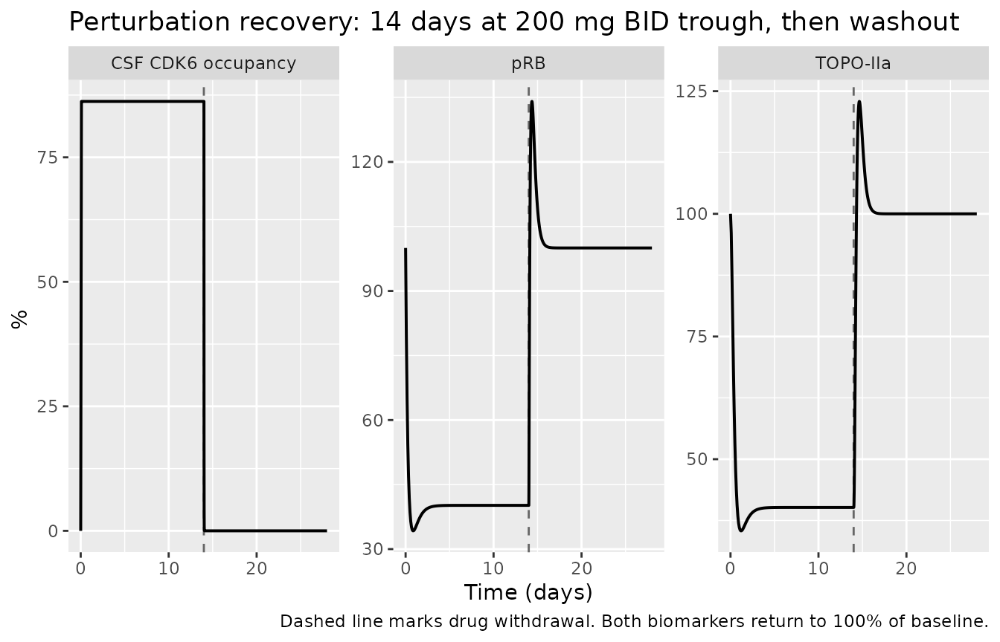
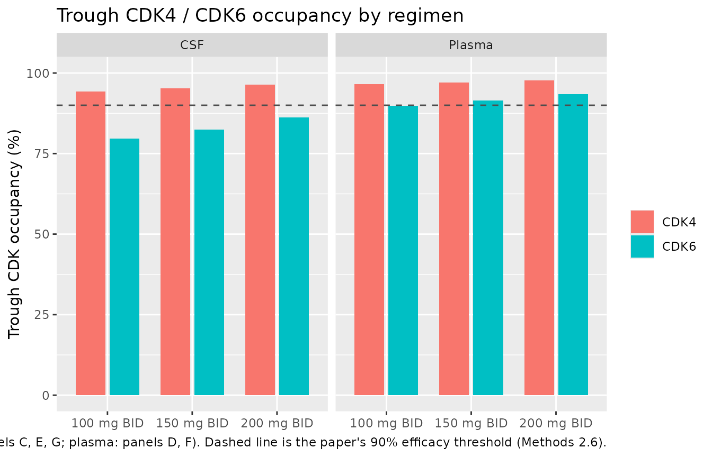
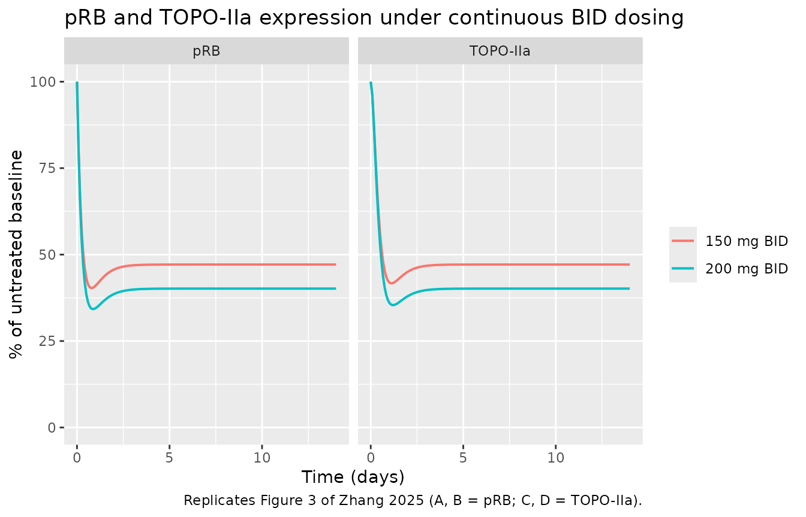
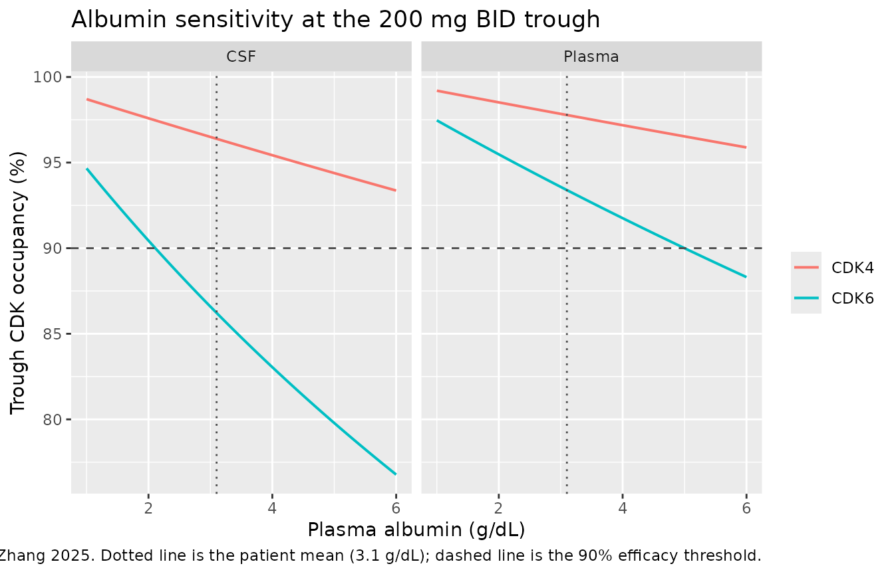

# Abemaciclib CDK4/6 occupancy and pRB / TOPO-IIa biomarker QSP (Zhang 2025)

## Model and source

- Citation: Zhang C, Li S, Ren J, Lang R. (2025). Physiologically Based
  Pharmacokinetic Model of Plasma and Intracranial Pharmacokinetics and
  CDK4/6 Occupancy of Abemaciclib to Optimizing Dosing Regimen for Brain
  Metastatic Patients. ACS Omega 10(9):9245-9256.
  <doi:10.1021/acsomega.4c09472>. PMCID PMC11904693. Target-engagement
  equation from Methods 2.1 (Eq 1, after Wong 2019); fraction-unbound
  albumin scaling from Methods 2.1 (Eq 2, after Alsmadi 2021); biomarker
  chain from Methods 2.2 (Eqs 4-7, framework from Tate 2014). All
  parameter values are from main-text Table 1. Note that the trimmed
  markdown companion of this paper retains Table 1 and Section 3.6 but
  drops every display equation (eight ‘formula-not-decoded’ markers), so
  Eqs 1-7 were recovered from the PDF.
- Article (open access, CC BY-NC-ND 4.0):
  <https://doi.org/10.1021/acsomega.4c09472>
- PMC record: <https://www.ncbi.nlm.nih.gov/pmc/articles/PMC11904693/>

``` r

mod <- readModelDb("Zhang_2025_abemaciclib_qsp")
ui  <- rxode2::rxode2(mod)
mod
#> function() {
#>   description <- paste(
#>     "QSP. CDK4/6 target-engagement and pRB / TOPO-IIa cell-cycle biomarker model",
#>     "for abemaciclib (ABE) and its three active metabolites M2, M18 and M20 in",
#>     "patients with metastatic breast cancer, including brain metastases. Four",
#>     "analytes compete reversibly for a shared CDK4 pool and a shared CDK6 pool",
#>     "(0.1 uM each) in plasma and in cerebrospinal fluid, and the resulting CDK",
#>     "occupancy fraction drives a four-compartment cell-cycle transit chain",
#>     "(early G1 precursor, late G1 pRB, S-phase TOPO-IIa, G2M) whose framework",
#>     "comes from Tate 2014. The abemaciclib and metabolite concentrations are NOT",
#>     "fitted here: Zhang 2025 generated them with a whole-body PK-Sim 9.1 PBPK",
#>     "model that is a platform port (system-specific parameters were taken from",
#>     "the built-in PK-Sim database, distribution used the built-in Rodgers and",
#>     "Rowland method, no organ ODEs / volumes / blood flows are published and no",
#>     ".pksim5 project was deposited), so that layer is not reproducible from the",
#>     "on-disk sources and is deliberately NOT extracted. Total plasma",
#>     "concentrations are instead supplied per record as the canonical",
#>     "time-varying covariates CP_ABE_NGML, CP_M2_NGML, CP_M18_NGML and",
#>     "CP_M20_NGML, and the albumin-scaled fraction unbound is applied inside",
#>     "model(), following the Liang_2024_osimertinib_qsp precedent. Deterministic",
#>     "mechanism model: Zhang 2025 propagated variability through PK-Sim virtual",
#>     "population physiology rather than fitting IIV or residual error, so no etas",
#>     "and no error model are encoded. The CSF limb applies the fixed Table 1",
#>     "CSF-to-plasma ratio K_CSF,p to the free plasma concentration, exactly as",
#>     "Methods 2.1 describes. Validated against the paper's own prose claims, the",
#>     "model reproduces five of the six numeric statements in Section 3.6,",
#>     "including both 150 mg BID claims (CSF CDK4 above 90%, CSF CDK6 above 80%);",
#>     "the one it misses is CSF CDK6 above 90% at 200 mg BID, where it returns",
#>     "about 86%. That shortfall is small and is not necessarily structural: the",
#>     "analyte concentrations used to score it are reconstructed from Table 2 plus",
#>     "the published metabolite mass split rather than taken from the",
#>     "un-extracted PBPK layer, and that reconstruction is itself about 17% low",
#>     "against the paper's own quoted total-analyte trough. See the vignette",
#>     "'Assumptions and deviations' section, which quantifies both candidate",
#>     "causes.",
#>     sep = " "
#>   )
#>   reference <- paste(
#>     "Zhang C, Li S, Ren J, Lang R. (2025). Physiologically Based Pharmacokinetic",
#>     "Model of Plasma and Intracranial Pharmacokinetics and CDK4/6 Occupancy of",
#>     "Abemaciclib to Optimizing Dosing Regimen for Brain Metastatic Patients.",
#>     "ACS Omega 10(9):9245-9256. doi:10.1021/acsomega.4c09472. PMCID PMC11904693.",
#>     "Target-engagement equation from Methods 2.1 (Eq 1, after Wong 2019);",
#>     "fraction-unbound albumin scaling from Methods 2.1 (Eq 2, after Alsmadi",
#>     "2021); biomarker chain from Methods 2.2 (Eqs 4-7, framework from Tate",
#>     "2014). All parameter values are from main-text Table 1. Note that the",
#>     "trimmed markdown companion of this paper retains Table 1 and Section 3.6",
#>     "but drops every display equation (eight 'formula-not-decoded' markers), so",
#>     "Eqs 1-7 were recovered from the PDF.",
#>     sep = " "
#>   )
#>   vignette <- "Zhang_2025_abemaciclib"
#> 
#>   units <- list(
#>     time          = "h",
#>     dosing        = "(not applicable; the analyte concentrations are supplied as the time-varying covariates CP_ABE_NGML, CP_M2_NGML, CP_M18_NGML and CP_M20_NGML)",
#>     concentration = "nmol/L"
#>   )
#> 
#>   # The bound drug-CDK complexes are indexed by kinase isoform (CDK4 / CDK6),
#>   # by analyte (parent + three metabolites) and by matrix (plasma / CSF), which
#>   # the canonical bare `complex` name cannot express. Declared here rather than
#>   # silently warned on, following the Liang_2024_osimertinib_qsp precedent.
#>   # `precursor`, `prb` and `topo2a` are the cell-cycle transit states of Eqs 4-6.
#>   paper_specific_compartments <- c(
#>     "complex_cdk4_abe",     "complex_cdk4_m2",     "complex_cdk4_m18",     "complex_cdk4_m20",
#>     "complex_cdk6_abe",     "complex_cdk6_m2",     "complex_cdk6_m18",     "complex_cdk6_m20",
#>     "complex_cdk4_abe_csf", "complex_cdk4_m2_csf", "complex_cdk4_m18_csf", "complex_cdk4_m20_csf",
#>     "complex_cdk6_abe_csf", "complex_cdk6_m2_csf", "complex_cdk6_m18_csf", "complex_cdk6_m20_csf",
#>     "precursor", "prb", "topo2a"
#>   )
#> 
#>   # Issue #482: what each ODE state holds, in what amount units, in what
#>   # biological matrix. The occupancy states are molar concentrations of the
#>   # drug-CDK complex (the CDK pools are declared as 0.1 uM concentrations, not
#>   # amounts). The three biomarker states are dimensionless expression levels
#>   # relative to the untreated baseline (see the `prb0` note in ini()).
#>   compartmentData <- list(
#>     complex_cdk4_abe     = list(analyte = "abemaciclib-CDK4 complex",  units = "nmol/L", specimen = "plasma", verified = TRUE),
#>     complex_cdk4_m2      = list(analyte = "M2-CDK4 complex",           units = "nmol/L", specimen = "plasma", verified = TRUE),
#>     complex_cdk4_m18     = list(analyte = "M18-CDK4 complex",          units = "nmol/L", specimen = "plasma", verified = TRUE),
#>     complex_cdk4_m20     = list(analyte = "M20-CDK4 complex",          units = "nmol/L", specimen = "plasma", verified = TRUE),
#>     complex_cdk6_abe     = list(analyte = "abemaciclib-CDK6 complex",  units = "nmol/L", specimen = "plasma", verified = TRUE),
#>     complex_cdk6_m2      = list(analyte = "M2-CDK6 complex",           units = "nmol/L", specimen = "plasma", verified = TRUE),
#>     complex_cdk6_m18     = list(analyte = "M18-CDK6 complex",          units = "nmol/L", specimen = "plasma", verified = TRUE),
#>     complex_cdk6_m20     = list(analyte = "M20-CDK6 complex",          units = "nmol/L", specimen = "plasma", verified = TRUE),
#>     complex_cdk4_abe_csf = list(analyte = "abemaciclib-CDK4 complex",  units = "nmol/L", specimen = "CSF", verified = TRUE),
#>     complex_cdk4_m2_csf  = list(analyte = "M2-CDK4 complex",           units = "nmol/L", specimen = "CSF", verified = TRUE),
#>     complex_cdk4_m18_csf = list(analyte = "M18-CDK4 complex",          units = "nmol/L", specimen = "CSF", verified = TRUE),
#>     complex_cdk4_m20_csf = list(analyte = "M20-CDK4 complex",          units = "nmol/L", specimen = "CSF", verified = TRUE),
#>     complex_cdk6_abe_csf = list(analyte = "abemaciclib-CDK6 complex",  units = "nmol/L", specimen = "CSF", verified = TRUE),
#>     complex_cdk6_m2_csf  = list(analyte = "M2-CDK6 complex",           units = "nmol/L", specimen = "CSF", verified = TRUE),
#>     complex_cdk6_m18_csf = list(analyte = "M18-CDK6 complex",          units = "nmol/L", specimen = "CSF", verified = TRUE),
#>     complex_cdk6_m20_csf = list(analyte = "M20-CDK6 complex",          units = "nmol/L", specimen = "CSF", verified = TRUE),
#>     # The biomarker matrix is SKIN, not tumor -- Zhang 2025 says so explicitly in
#>     # the Discussion: "it is noteworthy that the biomarker model predicts changes
#>     # in pRB and TOPO-IIa occurring in skin tissue, rather than in tumor tissue.
#>     # Because the only alterations in pRB and TOPO-IIa within skin tissue in
#>     # humans has been experimentally determined, it is assumed that the
#>     # differences between the pRB and TOPO-IIa biomarker expression in tumors and
#>     # skin tissue are negligible." The controlled specimen vocabulary
#>     # (R/conventions.R) has no `skin` term, so these carry the generic `tissue`
#>     # and name skin in `analyte`; recording `tumor` here would contradict the
#>     # source.
#>     precursor            = list(analyte = "cells accumulated in early G1 (precursor compartment PC), skin", units = "fraction of untreated baseline", specimen = "tissue", verified = TRUE),
#>     prb                  = list(analyte = "phosphorylated retinoblastoma protein (pRB) expression, skin",   units = "fraction of untreated baseline", specimen = "tissue", verified = TRUE),
#>     topo2a               = list(analyte = "topoisomerase-II alpha (TOPO-IIa) expression, skin",             units = "fraction of untreated baseline", specimen = "tissue", verified = TRUE)
#>   )
#> 
#>   covariateData <- list(
#>     CP_ABE_NGML = list(
#>       description        = "Time-varying TOTAL abemaciclib plasma concentration driving CDK4/6 engagement",
#>       units              = "ng/mL",
#>       type               = "continuous",
#>       reference_category = NULL,
#>       notes              = paste(
#>         "TOTAL (not free) plasma concentration. The free concentration that",
#>         "actually drives binding is computed inside model() as",
#>         "CP_ABE_NGML * fup_abe, with fup_abe scaled to the subject's albumin by",
#>         "the paper's Eq 2. Zhang 2025 Eq 1 defines its driver as 'the free drug",
#>         "concentration in plasma or the CSF'. Supplying a total concentration is",
#>         "the more useful convention because that is what a PK model returns.",
#>         "In the source study this concentration is produced by a whole-body",
#>         "PK-Sim 9.1 PBPK model that is not reproducible from the published",
#>         "sources and is not extracted (see description).",
#>         "Published steady-state anchors in patients (Zhang 2025 Table 2,",
#>         "predicted column, Patnaik 2016 regimens): Cmin 144 ng/mL and Cmax",
#>         "198 ng/mL at 100 mg BID; Cmin 174 and Cmax 250 at 150 mg BID; Cmin 231",
#>         "and Cmax 333 at 200 mg BID. Total active analytes (ABE + M2 + M20)",
#>         "reach a mean plasma Cmin of 498 ng/mL at the standard 200 mg BID",
#>         "regimen, against a stated safety ceiling of 693 ng/mL (Zhang 2025",
#>         "Sections 2.6 and 3.6)."
#>       ),
#>       source_name        = "(none; computed by the PK-Sim PBPK model, not a named NONMEM data column)"
#>     ),
#>     CP_M2_NGML = list(
#>       description        = "Time-varying TOTAL M2 (active abemaciclib metabolite) plasma concentration driving CDK4/6 engagement",
#>       units              = "ng/mL",
#>       type               = "continuous",
#>       reference_category = NULL,
#>       notes              = paste(
#>         "TOTAL plasma concentration of the active metabolite M2; the free",
#>         "concentration is CP_M2_NGML * fup_m2 inside model(). Zhang 2025",
#>         "Introduction (citing the FDA multidiscipline review, ref 14) reports",
#>         "that M2 contributes 13% of total plasma mass in vivo. Set to 0 to",
#>         "study the parent alone."
#>       ),
#>       source_name        = "(none; computed by the PK-Sim PBPK model, not a named NONMEM data column)"
#>     ),
#>     CP_M18_NGML = list(
#>       description        = "Time-varying TOTAL M18 (active abemaciclib metabolite) plasma concentration driving CDK4/6 engagement",
#>       units              = "ng/mL",
#>       type               = "continuous",
#>       reference_category = NULL,
#>       notes              = paste(
#>         "TOTAL plasma concentration of the active metabolite M18; the free",
#>         "concentration is CP_M18_NGML * fup_m18 inside model(). Zhang 2025",
#>         "Introduction (ref 14) reports that M18 contributes 5% of total plasma",
#>         "mass in vivo. M18 is the metabolite for which no CSF data existed, so",
#>         "its K_CSF,p was assumed to be 1.0 (Zhang 2025 Methods 2.1). Set to 0",
#>         "to study the parent alone."
#>       ),
#>       source_name        = "(none; computed by the PK-Sim PBPK model, not a named NONMEM data column)"
#>     ),
#>     CP_M20_NGML = list(
#>       description        = "Time-varying TOTAL M20 (active abemaciclib metabolite) plasma concentration driving CDK4/6 engagement",
#>       units              = "ng/mL",
#>       type               = "continuous",
#>       reference_category = NULL,
#>       notes              = paste(
#>         "TOTAL plasma concentration of the active metabolite M20; the free",
#>         "concentration is CP_M20_NGML * fup_m20 inside model(). Zhang 2025",
#>         "Introduction (ref 14) reports that M20 contributes 26% of total plasma",
#>         "mass in vivo, making it the largest metabolite contributor. Set to 0",
#>         "to study the parent alone."
#>       ),
#>       source_name        = "(none; computed by the PK-Sim PBPK model, not a named NONMEM data column)"
#>     ),
#>     ALB = list(
#>       description        = "Plasma albumin concentration; scales the fraction unbound of all four analytes through the paper's Eq 2",
#>       units              = "g/L",
#>       type               = "continuous",
#>       reference_category = NULL,
#>       notes              = paste(
#>         "Canonical SI units g/L. Zhang 2025 reports albumin in g/dL throughout",
#>         "(divide by 10): 3.1 g/dL = 31 g/L in breast-cancer patients versus",
#>         "4.5 g/dL = 45 g/L in healthy subjects (Table 1 and Methods 2.1, after",
#>         "Alsmadi 2021). The Table 1 fup values are the PATIENT values, i.e.",
#>         "they already correspond to ALB = 31 g/L, so setting ALB = 31 recovers",
#>         "them exactly. Zhang 2025 Methods 2.5 swept albumin over 1.0-6.0 g/dL",
#>         "(10-60 g/L) to reflect the physiological range in cancer patients;",
#>         "note that in the source paper that sweep changes exposure through the",
#>         "PBPK layer as well as through binding, whereas here only the binding",
#>         "limb is reproduced."
#>       ),
#>       source_name        = "albumin (g/dl) (Zhang 2025 Table 1, physiological block)"
#>     )
#>   )
#> 
#>   population <- list(
#>     species        = "human (in silico; PK-Sim virtual populations matched to published clinical cohorts)",
#>     n_subjects     = NA_integer_,
#>     n_studies      = 4L,
#>     age_range      = "51-63 years (means of the contributing cohorts; Patnaik 2016 median 60, range 44-73)",
#>     sex_female_pct = NA_real_,
#>     disease_state  = "metastatic breast cancer, including hormone-receptor-positive / HER2-negative brain metastases; validation cohorts also included non-small cell lung cancer and other solid tumors",
#>     dose_range     = "abemaciclib 100-400 mg once daily or twice daily; validation at 100 and 150 mg OD and 100, 150 and 200 mg BID; 200 mg BID is the standard regimen",
#>     regions        = "United States, Europe and Japan (the contributing clinical studies)",
#>     notes          = paste(
#>       "Virtual-population demographics were taken per scenario from the four",
#>       "clinical plasma-PK studies and two CSF-PK studies tabulated in Zhang",
#>       "2025 Table 2 (Patnaik 2016, Tolaney 2020, Fujiwara 2016, Kim 2018),",
#>       "with PK-Sim mean values substituted where a study did not report a",
#>       "characteristic. Cohort sizes per arm ranged from 3 to 72 subjects;",
#>       "female proportion ranged from 33% to 100% across arms, so no single",
#>       "value is recorded here.",
#>       "Disease physiology differs from healthy subjects in three respects that",
#>       "Zhang 2025 states explicitly (Methods 2.1, after Alsmadi 2021): CYP3A4",
#>       "expression 3.02 versus 4.32 uM, albumin 3.1 versus 4.5 g/dL, and",
#>       "hematocrit 0.33 versus 0.43. Only the albumin difference enters the",
#>       "layer extracted here, through Eq 2; the other two act on the",
#>       "un-extracted PBPK layer.",
#>       "The pRB and TOPO-IIa observations the biomarker model was verified",
#>       "against are SKIN-biopsy measurements from Patnaik 2016, not tumor",
#>       "biopsies: Zhang 2025 states in the Discussion that the biomarker model",
#>       "'predicts changes in pRB and TOPO-IIa occurring in skin tissue, rather",
#>       "than in tumor tissue', because only the skin-tissue alterations have",
#>       "been experimentally determined in humans, and that the tumor-versus-skin",
#>       "difference is assumed negligible. The same Discussion paragraph notes",
#>       "that the paper does NOT ultimately treat these two biomarkers as",
#>       "predictive of clinical response (inhibition was of similar magnitude at",
#>       "150 and 200 mg BID), and uses a CDK4/6 occupancy above 90% as the",
#>       "efficacy predictor instead."
#>     )
#>   )
#> 
#>   ini({
#>     # ======================================================================
#>     # Molecular weights -- used only to convert the ng/mL covariates to the
#>     # nmol/L scale on which Kd and the CDK pools are reported.
#>     # Zhang 2025 Table 1, physicochemical block (source: ref 31, Posada 2020).
#>     # ======================================================================
#>     mw_abe <- fixed(506.6)
#>     label("Molecular weight of abemaciclib (g/mol)")
#>     # Zhang 2025 Table 1, MW row, ABE column.
#> 
#>     mw_m2 <- fixed(478.5)
#>     label("Molecular weight of metabolite M2 (g/mol)")
#>     # Zhang 2025 Table 1, MW row, M2 column.
#> 
#>     mw_m18 <- fixed(494.5)
#>     label("Molecular weight of metabolite M18 (g/mol)")
#>     # Zhang 2025 Table 1, MW row, M18 column.
#> 
#>     mw_m20 <- fixed(522.6)
#>     label("Molecular weight of metabolite M20 (g/mol)")
#>     # Zhang 2025 Table 1, MW row, M20 column.
#> 
#>     # ======================================================================
#>     # Fraction unbound in plasma, at the reference (patient) albumin level.
#>     # Zhang 2025 Table 1 fup row: "calculated using eq 2, original data was
#>     # from ref14". These are therefore the PATIENT values, i.e. the values at
#>     # albumin 3.1 g/dL, and model() re-scales them to any other albumin with
#>     # the same Eq 2 (see the algebra in the model() comment).
#>     # ======================================================================
#>     fup_abe <- fixed(0.039)
#>     label("Fraction of abemaciclib unbound in plasma at the reference albumin of 3.1 g/dL (unitless)")
#>     # Zhang 2025 Table 1, f_up row, ABE column.
#> 
#>     fup_m2 <- fixed(0.093)
#>     label("Fraction of M2 unbound in plasma at the reference albumin of 3.1 g/dL (unitless)")
#>     # Zhang 2025 Table 1, f_up row, M2 column.
#> 
#>     fup_m18 <- fixed(0.046)
#>     label("Fraction of M18 unbound in plasma at the reference albumin of 3.1 g/dL (unitless)")
#>     # Zhang 2025 Table 1, f_up row, M18 column.
#> 
#>     fup_m20 <- fixed(0.030)
#>     label("Fraction of M20 unbound in plasma at the reference albumin of 3.1 g/dL (unitless)")
#>     # Zhang 2025 Table 1, f_up row, M20 column.
#> 
#>     alb_ref <- fixed(31)
#>     label("Reference plasma albumin at which the fup values above apply (g/L; 3.1 g/dL in the source)")
#>     # Zhang 2025 Table 1, physiological block: "albumin (g/dl) 3.1", described
#>     # in Methods 2.1 as the mean value in patients (ref 30, Alsmadi 2021).
#> 
#>     # ======================================================================
#>     # CSF-to-plasma ratio of the FREE concentration. Zhang 2025 Methods 2.1:
#>     # 0.68 for ABE ("the mean ratio of ABE free concentration between the CSF
#>     # and plasma", ref 16), 0.14 for M2 and 0.91 for M20 (ref 33), and 1.0
#>     # assumed for M18 because no data were available.
#>     # ======================================================================
#>     kcsf_abe <- fixed(0.68)
#>     label("CSF-to-plasma free-concentration ratio for abemaciclib (unitless)")
#>     # Zhang 2025 Table 1, K_CSF,P row, ABE column; Methods 2.1.
#> 
#>     kcsf_m2 <- fixed(0.14)
#>     label("CSF-to-plasma free-concentration ratio for M2 (unitless)")
#>     # Zhang 2025 Table 1, K_CSF,P row, M2 column; Methods 2.1.
#> 
#>     kcsf_m18 <- fixed(1.0)
#>     label("CSF-to-plasma free-concentration ratio for M18 (unitless; assumed, no data available)")
#>     # Zhang 2025 Methods 2.1: "as no data were available for M18, KCSF,p was
#>     # assumed to be 1.0 for this metabolite." Table 1, K_CSF,P row, M18 column.
#> 
#>     kcsf_m20 <- fixed(0.91)
#>     label("CSF-to-plasma free-concentration ratio for M20 (unitless)")
#>     # Zhang 2025 Table 1, K_CSF,P row, M20 column; Methods 2.1.
#> 
#>     # ======================================================================
#>     # Equilibrium dissociation constants, one per analyte per kinase isoform.
#>     # Zhang 2025 Table 1 reports them as paired "CDK4/CDK6" entries; source
#>     # column: "ref15 for three metabolites and ref35 for ABE".
#>     # ======================================================================
#>     kd4_abe <- fixed(0.6)
#>     label("Equilibrium dissociation constant of abemaciclib for CDK4 (nmol/L)")
#>     # Zhang 2025 Table 1, Kd for CDK4/6 row, ABE column, first of the pair 0.6/8.2.
#> 
#>     kd6_abe <- fixed(8.2)
#>     label("Equilibrium dissociation constant of abemaciclib for CDK6 (nmol/L)")
#>     # Zhang 2025 Table 1, Kd for CDK4/6 row, ABE column, second of the pair 0.6/8.2.
#> 
#>     kd4_m2 <- fixed(1.2)
#>     label("Equilibrium dissociation constant of M2 for CDK4 (nmol/L)")
#>     # Zhang 2025 Table 1, Kd for CDK4/6 row, M2 column, pair 1.2/1.3.
#> 
#>     kd6_m2 <- fixed(1.3)
#>     label("Equilibrium dissociation constant of M2 for CDK6 (nmol/L)")
#>     # Zhang 2025 Table 1, Kd for CDK4/6 row, M2 column, pair 1.2/1.3.
#> 
#>     kd4_m18 <- fixed(1.2)
#>     label("Equilibrium dissociation constant of M18 for CDK4 (nmol/L)")
#>     # Zhang 2025 Table 1, Kd for CDK4/6 row, M18 column, pair 1.2/2.7.
#> 
#>     kd6_m18 <- fixed(2.7)
#>     label("Equilibrium dissociation constant of M18 for CDK6 (nmol/L)")
#>     # Zhang 2025 Table 1, Kd for CDK4/6 row, M18 column, pair 1.2/2.7.
#> 
#>     kd4_m20 <- fixed(1.5)
#>     label("Equilibrium dissociation constant of M20 for CDK4 (nmol/L)")
#>     # Zhang 2025 Table 1, Kd for CDK4/6 row, M20 column, pair 1.5/1.9.
#> 
#>     kd6_m20 <- fixed(1.9)
#>     label("Equilibrium dissociation constant of M20 for CDK6 (nmol/L)")
#>     # Zhang 2025 Table 1, Kd for CDK4/6 row, M20 column, pair 1.5/1.9.
#> 
#>     # ======================================================================
#>     # Dissociation rate constant and starting CDK expression.
#>     # ======================================================================
#>     koff <- fixed(6.0)
#>     label("First-order dissociation rate constant of the drug-CDK complex (1/h)")
#>     # Zhang 2025 Table 1, koff row: 0.10 /min, "fitted through nonlinear
#>     # analysis using the data from ref 36 for ABE, three metabolites were
#>     # assumed to be identical". Converted to the model time base of hours:
#>     # 0.10 /min * 60 min/h = 6.0 /h. A single koff applies to all four
#>     # analytes and to both isoforms.
#> 
#>     cdk0 <- fixed(100)
#>     label("Starting expression of each CDK isoform, CDK4/6_0 (nmol/L)")
#>     # Zhang 2025 Methods 2.1: "The starting expression of CDK4/6 (CDK4/60) was
#>     # set at default 0.1 uM due to not reported data in human." 0.1 uM = 100
#>     # nmol/L. Applied to the CDK4 pool and to the CDK6 pool separately, in
#>     # plasma and in CSF, because the paper reports the four occupancies
#>     # separately throughout (Figure 4 legend; every panel of Figure 5).
#> 
#>     # ======================================================================
#>     # Biomarker (cell-cycle transit) rate constants. Zhang 2025 Table 1,
#>     # biomarker block, source column: "kTo and kTo were optimized based on the
#>     # clinical study data, ref16; The remaining rate constants were taken from
#>     # the ref37" (Tate 2014).
#>     # ======================================================================
#>     krb <- fixed(0.16)
#>     label("Rate constant from early G1 to late G1, k_pRB (1/h)")
#>     # Zhang 2025 Table 1, kRB row.
#> 
#>     kto <- fixed(0.14)
#>     label("Rate constant from late G1 to S phase, k_TOPO-IIa (1/h)")
#>     # Zhang 2025 Table 1, kTO row.
#> 
#>     khh <- fixed(0.21)
#>     label("Rate constant from S phase to G2M phase, k_HH (1/h)")
#>     # Zhang 2025 Table 1, kHH row.
#> 
#>     kel_pc <- fixed(0.05)
#>     label("Elimination rate constant from the early-G1 precursor compartment (1/h)")
#>     # Zhang 2025 Table 1, kel row (units not printed in Table 1; 1/h by
#>     # consistency with the other three rate constants in the same block and
#>     # with Eq 7, in which kel is summed with k_pRB).
#> 
#>     prb0 <- fixed(1)
#>     label("Baseline pRB expression scale factor (fraction of untreated baseline)")
#>     # Zhang 2025 Eq 7 defines k_in = pRB0 * (k_pRB + k_el) and says only that
#>     # "pRB0 is the baseline expression in patients" (ref 16); no numeric value
#>     # is printed anywhere in the paper or Table 1. Setting it to 1 is EXACT
#>     # rather than an assumption: Eqs 4-6 are linear in k_in, so PC, pRB and
#>     # TOPO-IIa all scale proportionally to pRB0, and every quantity the paper
#>     # reports is a percent-of-baseline ratio (Figure 3 y-axes are "Change in
#>     # pRB (% of baseline)" and "Change in TOPO-IIa (% of baseline)"), which is
#>     # invariant to pRB0. Fixing it at 1 makes the states read directly as
#>     # fractions of the untreated baseline.
#>   })
#> 
#>   model({
#>     # =====================================================================
#>     # 1. Albumin-scaled fraction unbound (Zhang 2025 Eq 2).
#>     #
#>     #    As printed, Eq 2 is
#>     #        fup = 1 / (1 + ((1 - fup_h) * [Alb_p]) / ([Alb_h] * fup_h))
#>     #    which needs the HEALTHY-subject fup_h, a value the paper does not
#>     #    print. Rearranging, Eq 2 is equivalent to fup(Alb) = 1/(1 + B*Alb)
#>     #    with a single analyte-specific binding constant
#>     #        B = (1 - fup_h) / (fup_h * [Alb_h]),
#>     #    and B is fully determined by the Table 1 PATIENT value together with
#>     #    the patient albumin at which it applies:
#>     #        B = (1/fup_ref - 1) / alb_ref.
#>     #    So the scaling below uses only printed numbers, and reduces exactly
#>     #    to the Table 1 fup values when ALB = alb_ref = 31 g/L.
#>     # =====================================================================
#>     fu_abe <- 1 / (1 + (1 / fup_abe - 1) / alb_ref * ALB)
#>     fu_m2  <- 1 / (1 + (1 / fup_m2  - 1) / alb_ref * ALB)
#>     fu_m18 <- 1 / (1 + (1 / fup_m18 - 1) / alb_ref * ALB)
#>     fu_m20 <- 1 / (1 + (1 / fup_m20 - 1) / alb_ref * ALB)
#> 
#>     # =====================================================================
#>     # 2. Free plasma concentrations, converted from the ng/mL covariates to
#>     #    the nmol/L scale of Kd and cdk0:
#>     #        C[nmol/L] = C[ng/mL] * fu / MW[g/mol] * 1000
#>     # =====================================================================
#>     cf_abe <- CP_ABE_NGML * fu_abe / mw_abe * 1000
#>     cf_m2  <- CP_M2_NGML  * fu_m2  / mw_m2  * 1000
#>     cf_m18 <- CP_M18_NGML * fu_m18 / mw_m18 * 1000
#>     cf_m20 <- CP_M20_NGML * fu_m20 / mw_m20 * 1000
#> 
#>     # =====================================================================
#>     # 3. Free CSF concentrations. Zhang 2025 Methods 2.1 equates the unbound
#>     #    brain-interstitial concentration with the free CSF concentration and
#>     #    uses the Table 1 K_CSF,p ratios. See the DEVIATION note in
#>     #    `description`: this fixed ratio reproduces the paper at 100 mg BID
#>     #    but under-predicts CSF occupancy at higher doses.
#>     # =====================================================================
#>     ccsf_abe <- kcsf_abe * cf_abe
#>     ccsf_m2  <- kcsf_m2  * cf_m2
#>     ccsf_m18 <- kcsf_m18 * cf_m18
#>     ccsf_m20 <- kcsf_m20 * cf_m20
#> 
#>     # =====================================================================
#>     # 4. Free (unoccupied) CDK available in each pool. Zhang 2025 Methods 2.1
#>     #    states that the four analytes are "simulated in the same manner
#>     #    simultaneously, and the sum of the occupancy by ABE and metabolites
#>     #    gave the total CDK4/6 occupancy", i.e. they COMPETE for one shared
#>     #    pool per isoform per matrix. Independent per-analyte pools are ruled
#>     #    out arithmetically: summing four independently-computed occupancies
#>     #    exceeds 100% by a wide margin at the paper's own reported exposures,
#>     #    whereas the shared-pool form below is bounded by construction and
#>     #    reproduces both of the Section 3.6 prose claims at 150 mg BID.
#>     # =====================================================================
#>     free_cdk4 <- cdk0 - (complex_cdk4_abe + complex_cdk4_m2 + complex_cdk4_m18 + complex_cdk4_m20)
#>     free_cdk6 <- cdk0 - (complex_cdk6_abe + complex_cdk6_m2 + complex_cdk6_m18 + complex_cdk6_m20)
#> 
#>     free_cdk4_csf <- cdk0 - (complex_cdk4_abe_csf + complex_cdk4_m2_csf + complex_cdk4_m18_csf + complex_cdk4_m20_csf)
#>     free_cdk6_csf <- cdk0 - (complex_cdk6_abe_csf + complex_cdk6_m2_csf + complex_cdk6_m18_csf + complex_cdk6_m20_csf)
#> 
#>     # =====================================================================
#>     # 5. Target engagement. Zhang 2025 Eq 1, recovered from the PDF (the
#>     #    trimmed markdown drops it as `formula-not-decoded`):
#>     #        dN/dt = (koff / Kd) * CDK_unbound * C_drug - koff * CDK_bound
#>     #    where N is the drug-CDK complex. koff/Kd is the association rate
#>     #    constant. Applied per analyte, per isoform, in plasma and in CSF.
#>     # =====================================================================
#>     d/dt(complex_cdk4_abe) <- koff / kd4_abe * free_cdk4 * cf_abe - koff * complex_cdk4_abe
#>     d/dt(complex_cdk4_m2)  <- koff / kd4_m2  * free_cdk4 * cf_m2  - koff * complex_cdk4_m2
#>     d/dt(complex_cdk4_m18) <- koff / kd4_m18 * free_cdk4 * cf_m18 - koff * complex_cdk4_m18
#>     d/dt(complex_cdk4_m20) <- koff / kd4_m20 * free_cdk4 * cf_m20 - koff * complex_cdk4_m20
#> 
#>     d/dt(complex_cdk6_abe) <- koff / kd6_abe * free_cdk6 * cf_abe - koff * complex_cdk6_abe
#>     d/dt(complex_cdk6_m2)  <- koff / kd6_m2  * free_cdk6 * cf_m2  - koff * complex_cdk6_m2
#>     d/dt(complex_cdk6_m18) <- koff / kd6_m18 * free_cdk6 * cf_m18 - koff * complex_cdk6_m18
#>     d/dt(complex_cdk6_m20) <- koff / kd6_m20 * free_cdk6 * cf_m20 - koff * complex_cdk6_m20
#> 
#>     d/dt(complex_cdk4_abe_csf) <- koff / kd4_abe * free_cdk4_csf * ccsf_abe - koff * complex_cdk4_abe_csf
#>     d/dt(complex_cdk4_m2_csf)  <- koff / kd4_m2  * free_cdk4_csf * ccsf_m2  - koff * complex_cdk4_m2_csf
#>     d/dt(complex_cdk4_m18_csf) <- koff / kd4_m18 * free_cdk4_csf * ccsf_m18 - koff * complex_cdk4_m18_csf
#>     d/dt(complex_cdk4_m20_csf) <- koff / kd4_m20 * free_cdk4_csf * ccsf_m20 - koff * complex_cdk4_m20_csf
#> 
#>     d/dt(complex_cdk6_abe_csf) <- koff / kd6_abe * free_cdk6_csf * ccsf_abe - koff * complex_cdk6_abe_csf
#>     d/dt(complex_cdk6_m2_csf)  <- koff / kd6_m2  * free_cdk6_csf * ccsf_m2  - koff * complex_cdk6_m2_csf
#>     d/dt(complex_cdk6_m18_csf) <- koff / kd6_m18 * free_cdk6_csf * ccsf_m18 - koff * complex_cdk6_m18_csf
#>     d/dt(complex_cdk6_m20_csf) <- koff / kd6_m20 * free_cdk6_csf * ccsf_m20 - koff * complex_cdk6_m20_csf
#> 
#>     # =====================================================================
#>     # 6. Total occupancy per isoform per matrix, as a percentage.
#>     #    Zhang 2025 Methods 2.1: "CDK4/6 occupancy was calculated as the
#>     #    percentage of the CDK4/6 that was binding to the ABE and metabolites
#>     #    at a particular time point ... the sum of the occupancy by ABE and
#>     #    metabolites gave the total CDK4/6 occupancy."
#>     #    The paper's efficacy threshold is a TROUGH occupancy of at least 90%
#>     #    (Methods 2.6).
#>     # =====================================================================
#>     occCdk4Plasma <- 100 * (cdk0 - free_cdk4)     / cdk0
#>     occCdk6Plasma <- 100 * (cdk0 - free_cdk6)     / cdk0
#>     occCdk4Csf    <- 100 * (cdk0 - free_cdk4_csf) / cdk0
#>     occCdk6Csf    <- 100 * (cdk0 - free_cdk6_csf) / cdk0
#> 
#>     # =====================================================================
#>     # 7. Biomarker (cell-cycle transit) model. Zhang 2025 Eqs 4-6, with the
#>     #    zero-order input of Eq 7:
#>     #        dPC/dt   = k_in - k_el*PC - k_pRB*PC*(1 - CO)
#>     #        dpRB/dt  = k_pRB*PC*(1 - CO) - k_TOPO*pRB
#>     #        dTOPO/dt = k_TOPO*pRB - k_HH*TOPO
#>     #        k_in     = pRB0*(k_pRB + k_el)
#>     #
#>     #    WHICH occupancy is CO? The paper's only definition is the verbatim
#>     #    sentence after Eq 6, "CO is the CDK occupancy fraction", and it never
#>     #    says which of the four occupancy traces it computes (CDK4 / CDK6,
#>     #    plasma / CSF) is meant -- the quantity is under-determined by a factor
#>     #    of four. Resolved to CSF CDK6 (operator decision, task
#>     #    oare_PMC11904693 sidecar request-001 answer D, 2026-08-20) on a
#>     #    reproduction check rather than on preference:
#>     #
#>     #      * Eqs 4-6 have the exact drug-free-vs-constant-CO steady state
#>     #            pRB/pRB_baseline = (1-CO)*(kel + kpRB) / (kel + kpRB*(1-CO))
#>     #        Back-solving Figure 3's predicted plateaus through it gives the CO
#>     #        the authors actually used: 88.2% at 150 mg BID, 91.1% at 200 mg
#>     #        BID.
#>     #      * Section 3.6 states in words that at 150 mg BID "CDK4 occupancy
#>     #        exceeds 90% and CDK6 occupancy exceeds 80% (Figure 5E)", and the
#>     #        Figure 5 caption assigns panel E to CSF. 88.2% is above 80% but
#>     #        below 90%, so of the four traces only CSF CDK6 is consistent with
#>     #        the back-solve -- and this argument rests on the paper's own prose,
#>     #        not on digitising a figure.
#>     #      * The rival reading (CO is a single pooled "CDK4/6" quantity, since
#>     #        the paper writes that phrase throughout and Table 1 gives Kd as one
#>     #        paired "CDK4/6" row) predicts ~96%, which would put the pRB plateau
#>     #        near 11-15% of baseline against Figure 3's ~36%.
#>     #      * Site: Section 3.6 opens "Intracranial CDK4/6 occupancy serves as
#>     #        predictors of clinical efficacy", so CSF is the paper's own
#>     #        efficacy driver.
#>     #
#>     #    See the vignette "Assumptions and deviations" section, which tabulates
#>     #    all four candidate traces against the back-solve so a reader can redo
#>     #    the check.
#>     # =====================================================================
#>     co <- occCdk6Csf / 100
#> 
#>     kin <- prb0 * (krb + kel_pc)
#> 
#>     d/dt(precursor) <- kin - kel_pc * precursor - krb * precursor * (1 - co)
#>     d/dt(prb)       <- krb * precursor * (1 - co) - kto * prb
#>     d/dt(topo2a)    <- kto * prb - khh * topo2a
#> 
#>     # Untreated (CO = 0) steady state of Eqs 4-6, so the system starts at the
#>     # patient's drug-free baseline:
#>     #     PC   = k_in/(k_el + k_pRB) = pRB0
#>     #     pRB  = k_pRB*PC/k_TOPO
#>     #     TOPO = k_TOPO*pRB/k_HH
#>     precursor(0) <- prb0
#>     prb(0)       <- krb * prb0 / kto
#>     topo2a(0)    <- krb * prb0 / khh
#> 
#>     # =====================================================================
#>     # 8. Reported outputs: expression as a percentage of the untreated
#>     #    baseline, matching the y-axes of Zhang 2025 Figure 3. Deterministic
#>     #    mechanism model -- the paper reports no residual error and no IIV for
#>     #    this layer, so none is encoded (see `description`).
#>     # =====================================================================
#>     prbPct  <- 100 * prb    / (krb * prb0 / kto)
#>     topoPct <- 100 * topo2a / (krb * prb0 / khh)
#> 
#>     # Mass-balance check quantities: each equals cdk0 at all times.
#>     totalCdk4Plasma <- free_cdk4     + complex_cdk4_abe     + complex_cdk4_m2     + complex_cdk4_m18     + complex_cdk4_m20
#>     totalCdk6Plasma <- free_cdk6     + complex_cdk6_abe     + complex_cdk6_m2     + complex_cdk6_m18     + complex_cdk6_m20
#>     totalCdk4Csf    <- free_cdk4_csf + complex_cdk4_abe_csf + complex_cdk4_m2_csf + complex_cdk4_m18_csf + complex_cdk4_m20_csf
#>     totalCdk6Csf    <- free_cdk6_csf + complex_cdk6_abe_csf + complex_cdk6_m2_csf + complex_cdk6_m18_csf + complex_cdk6_m20_csf
#>   })
#> }
#> <environment: 0x5627d1ff2d50>
```

Abemaciclib (ABE) is a CDK4/6 inhibitor used in
hormone-receptor-positive, HER2-negative metastatic breast cancer (MBC).
Zhang 2025 asks whether the standard 200 mg twice-daily (BID) regimen
delivers enough *intracranial* target engagement to treat brain
metastases while staying under a plasma safety ceiling, and it answers
the question by chaining three layers: a whole-body PBPK model that
predicts abemaciclib and metabolite concentrations in plasma and
cerebrospinal fluid (CSF), a target-engagement layer that converts those
concentrations into CDK4 and CDK6 occupancy, and a cell-cycle transit
model that converts occupancy into pRB and TOPO-IIa expression.

Abemaciclib is unusual among CDK4/6 inhibitors in that three of its
metabolites – M2, M18 and M20 – are pharmacologically active against
CDK4/6 with affinities comparable to (and for CDK6, better than) the
parent’s, and together they carry a large share of the circulating
drug-related material. Any model that predicts occupancy from parent
concentration alone will understate it, so all four analytes are carried
explicitly here.

## What is extracted, and what is not

Zhang 2025 contains three modelling layers. The first is **not**
extracted.

| Layer | Content | Extracted? | Why |
|----|----|----|----|
| 1 | Whole-body PBPK for ABE + M2 + M18 + M20 in plasma, brain and CSF, built in PK-Sim 9.1 | **No** | A platform port. The Methods state that “system-specific parameters were predominantly sourced from the existing PK-Sim database” and that tissue distribution used PK-Sim’s built-in Rodgers and Rowland method. Table 1 publishes drug-specific properties only – no organ volumes, no blood flows, no partition-coefficient table, no GI transit model, no ODEs – and no `.pksim5` project was deposited. The layer is not reproducible from the published sources, and filling the gaps from platform defaults would be fabrication. |
| 2 | CDK4/6 target engagement (Eq 1), four analytes competing for a shared CDK4 pool and a shared CDK6 pool, in plasma and in CSF | **Yes** | Eq 1 is printed in full and every constant it needs (8 Kd values, `koff`, 4 `fup`, 4 `KCSF,p`, 4 MW, `CDK4/6_0`) is in main-text Table 1. |
| 3 | pRB / TOPO-IIa cell-cycle transit biomarker chain (Eqs 4-7, framework from Tate 2014) | **Yes** | Eqs 4-7 are printed in full and `kRB`, `kTO`, `kHH`, `kel` are in Table 1. |

Because layer 1 is not extracted, the four analyte concentrations that
drive layer 2 are **supplied by the user** as the canonical time-varying
covariates `CP_ABE_NGML`, `CP_M2_NGML`, `CP_M18_NGML` and `CP_M20_NGML`.
This mirrors the authors’ own design, in which the PBPK hands
concentrations to the target-engagement equations, and follows the
`Liang_2024_osimertinib_qsp` precedent. The covariates carry **total**
plasma concentrations; the albumin-scaled fraction unbound and the
CSF-to-plasma partition are applied inside `model()`.

## Population

``` r

pop <- ui$population
str(pop)
#> List of 9
#>  $ species       : chr "human (in silico; PK-Sim virtual populations matched to published clinical cohorts)"
#>  $ n_subjects    : int NA
#>  $ n_studies     : int 4
#>  $ age_range     : chr "51-63 years (means of the contributing cohorts; Patnaik 2016 median 60, range 44-73)"
#>  $ sex_female_pct: num NA
#>  $ disease_state : chr "metastatic breast cancer, including hormone-receptor-positive / HER2-negative brain metastases; validation coho"| __truncated__
#>  $ dose_range    : chr "abemaciclib 100-400 mg once daily or twice daily; validation at 100 and 150 mg OD and 100, 150 and 200 mg BID; "| __truncated__
#>  $ regions       : chr "United States, Europe and Japan (the contributing clinical studies)"
#>  $ notes         : chr "Virtual-population demographics were taken per scenario from the four clinical plasma-PK studies and two CSF-PK"| __truncated__
```

The model is a deterministic mechanism model. Zhang 2025 propagated
variability through PK-Sim virtual-population physiology rather than
estimating between-subject variance or a residual-error model for these
two layers, so the extracted file carries no etas and no error model.
Every parameter is wrapped in `fixed()`.

## Source trace

Every `ini()` value carries an in-file comment naming its source
location. The table below collects them.

| Equation / parameter | Value | Source location |
|----|----|----|
| Eq 1 target engagement `d/dt(complex) = koff/Kd * CDK_free * C_free - koff * complex` | n/a | Methods 2.1, Eq 1 (p. 9247), after Wong 2019 (ref 38) |
| Eq 2 albumin scaling of `fup` | n/a | Methods 2.1, Eq 2 (p. 9248), after Alsmadi 2021 (ref 30) |
| Eqs 4-6 cell-cycle transit chain | n/a | Methods 2.2, Eqs 4-6 (p. 9248), framework from Tate 2014 (ref 37) |
| Eq 7 `kin = pRB0 * (kpRB + kel)` | n/a | Methods 2.2, Eq 7 (p. 9248) |
| `mw_abe` / `mw_m2` / `mw_m18` / `mw_m20` | 506.6 / 478.5 / 494.5 / 522.6 g/mol | Table 1, physicochemical block, MW row |
| `fup_abe` / `fup_m2` / `fup_m18` / `fup_m20` | 0.039 / 0.093 / 0.046 / 0.030 | Table 1, physicochemical block, `f_up` row |
| `alb_ref` | 31 g/L (3.1 g/dL) | Table 1, physiological block, albumin row; Methods 2.1 |
| `kcsf_abe` / `kcsf_m2` / `kcsf_m18` / `kcsf_m20` | 0.68 / 0.14 / 1.0 / 0.91 | Table 1, `K_CSF,P` row; Methods 2.1 (M18 assumed 1.0, no data) |
| `kd4_*` (CDK4) | 0.6 / 1.2 / 1.2 / 1.5 nmol/L | Table 1, “Kd (nM) for CDK4/6” row, first of each pair |
| `kd6_*` (CDK6) | 8.2 / 1.3 / 2.7 / 1.9 nmol/L | Table 1, “Kd (nM) for CDK4/6” row, second of each pair |
| `koff` | 6.0 /h (published 0.10 /min) | Table 1, `koff` row |
| `cdk0` | 100 nmol/L (published 0.1 uM) | Methods 2.1, “The starting expression of CDK4/6 (CDK4/6_0) was set at default 0.1 uM” |
| `krb` / `kto` / `khh` / `kel_pc` | 0.16 / 0.14 / 0.21 / 0.05 /h | Table 1, biomarker block |
| `prb0` | 1 (scale factor) | Eq 7; no numeric value published – see “Assumptions and deviations” |

### Units table (dimensional analysis)

Mechanistic models are where unit slips hide, so every term is checked
explicitly. The model’s declared time base is hours and its
concentration base is nmol/L.

| Symbol | Units | Check |
|----|----|----|
| `CP_*_NGML` | ng/mL | covariate input, total concentration |
| `fu_*` | unitless | `1 / (1 + B * ALB)`, `B` in L/g, `ALB` in g/L |
| `cf_*` | nmol/L | `ng/mL * (1) / (g/mol) * 1000` = `(1e-9 g / 1e-3 L) / (g/mol) * 1000` = `nmol/L` |
| `ccsf_*` | nmol/L | unitless ratio x nmol/L |
| `cdk0`, `free_cdk*`, `complex_*` | nmol/L | pool declared as a concentration, not an amount |
| `koff` | 1/h | Table 1 value 0.10 /min x 60 = 6.0 /h |
| `kd4_*`, `kd6_*` | nmol/L | Table 1 reports nM |
| `koff / kd * free_cdk * cf` | `(1/h) / (nmol/L) * (nmol/L) * (nmol/L)` = nmol/L/h | matches `d/dt(complex)` |
| `koff * complex` | `(1/h) * (nmol/L)` = nmol/L/h | matches |
| `occ*` | percent | `100 * (cdk0 - free) / cdk0`, nmol/L cancels |
| `co` | unitless fraction | `occ / 100` |
| `krb`, `kto`, `khh`, `kel_pc` | 1/h | Table 1; `kel` is printed without units but must be 1/h because Eq 7 adds it to `kpRB` |
| `kin` | 1/h | `prb0` (unitless) x (1/h) |
| `precursor`, `prb`, `topo2a` | fraction of untreated baseline | `kin - kel*PC - krb*PC*(1-CO)`: (1/h) throughout, matches `d/dt(state)` |

`koff` and `cdk0` are the only two values that required a unit
conversion from the published form (min to h, and uM to nmol/L). Both
conversions are recorded in the `ini()` comments.

### Parameter table: paper vs. model file

``` r

theta_tab <- ui$iniDf |>
  dplyr::filter(!is.na(.data$ntheta)) |>
  dplyr::transmute(
    Parameter = .data$name,
    Value     = .data$est,
    Fixed     = .data$fix,
    Label     = .data$label
  )

knitr::kable(
  theta_tab,
  digits  = 4,
  caption = sprintf("All %d parameters, every one fixed to a published value.",
                    nrow(theta_tab))
)
```

| Parameter | Value | Fixed | Label |
|:---|---:|:---|:---|
| mw_abe | 506.600 | TRUE | Molecular weight of abemaciclib (g/mol) |
| mw_m2 | 478.500 | TRUE | Molecular weight of metabolite M2 (g/mol) |
| mw_m18 | 494.500 | TRUE | Molecular weight of metabolite M18 (g/mol) |
| mw_m20 | 522.600 | TRUE | Molecular weight of metabolite M20 (g/mol) |
| fup_abe | 0.039 | TRUE | Fraction of abemaciclib unbound in plasma at the reference albumin of 3.1 g/dL (unitless) |
| fup_m2 | 0.093 | TRUE | Fraction of M2 unbound in plasma at the reference albumin of 3.1 g/dL (unitless) |
| fup_m18 | 0.046 | TRUE | Fraction of M18 unbound in plasma at the reference albumin of 3.1 g/dL (unitless) |
| fup_m20 | 0.030 | TRUE | Fraction of M20 unbound in plasma at the reference albumin of 3.1 g/dL (unitless) |
| alb_ref | 31.000 | TRUE | Reference plasma albumin at which the fup values above apply (g/L; 3.1 g/dL in the source) |
| kcsf_abe | 0.680 | TRUE | CSF-to-plasma free-concentration ratio for abemaciclib (unitless) |
| kcsf_m2 | 0.140 | TRUE | CSF-to-plasma free-concentration ratio for M2 (unitless) |
| kcsf_m18 | 1.000 | TRUE | CSF-to-plasma free-concentration ratio for M18 (unitless; assumed, no data available) |
| kcsf_m20 | 0.910 | TRUE | CSF-to-plasma free-concentration ratio for M20 (unitless) |
| kd4_abe | 0.600 | TRUE | Equilibrium dissociation constant of abemaciclib for CDK4 (nmol/L) |
| kd6_abe | 8.200 | TRUE | Equilibrium dissociation constant of abemaciclib for CDK6 (nmol/L) |
| kd4_m2 | 1.200 | TRUE | Equilibrium dissociation constant of M2 for CDK4 (nmol/L) |
| kd6_m2 | 1.300 | TRUE | Equilibrium dissociation constant of M2 for CDK6 (nmol/L) |
| kd4_m18 | 1.200 | TRUE | Equilibrium dissociation constant of M18 for CDK4 (nmol/L) |
| kd6_m18 | 2.700 | TRUE | Equilibrium dissociation constant of M18 for CDK6 (nmol/L) |
| kd4_m20 | 1.500 | TRUE | Equilibrium dissociation constant of M20 for CDK4 (nmol/L) |
| kd6_m20 | 1.900 | TRUE | Equilibrium dissociation constant of M20 for CDK6 (nmol/L) |
| koff | 6.000 | TRUE | First-order dissociation rate constant of the drug-CDK complex (1/h) |
| cdk0 | 100.000 | TRUE | Starting expression of each CDK isoform, CDK4/6_0 (nmol/L) |
| krb | 0.160 | TRUE | Rate constant from early G1 to late G1, k_pRB (1/h) |
| kto | 0.140 | TRUE | Rate constant from late G1 to S phase, k_TOPO-IIa (1/h) |
| khh | 0.210 | TRUE | Rate constant from S phase to G2M phase, k_HH (1/h) |
| kel_pc | 0.050 | TRUE | Elimination rate constant from the early-G1 precursor compartment (1/h) |
| prb0 | 1.000 | TRUE | Baseline pRB expression scale factor (fraction of untreated baseline) |

All 28 parameters, every one fixed to a published value. {.table}

``` r

# Every parameter must be fixed: this is a deterministic mechanism model.
stopifnot(all(ui$iniDf$fix[!is.na(ui$iniDf$ntheta)]))
# And there must be no random effects at all.
stopifnot(all(is.na(ui$iniDf$neta1)))
cat("All", sum(!is.na(ui$iniDf$ntheta)), "parameters fixed; 0 random effects.\n")
#> All 28 parameters fixed; 0 random effects.
```

## Building the analyte exposure drivers

The un-extracted PBPK layer is what would normally supply `CP_*_NGML`.
To validate the extracted layers we reconstruct the drivers from
published numbers only:

1.  **Parent concentration** comes from Zhang 2025 Table 2, *predicted*
    column, the Patnaik 2016 repeated-dose regimens at steady state.
2.  **Metabolite concentrations** come from the mass split stated in the
    Introduction (citing the FDA multidiscipline review, ref 14): M2,
    M18 and M20 contribute 13%, 5% and 26% of total plasma mass in vivo,
    leaving 56% for the parent. Each metabolite is therefore
    `CP_ABE_NGML * pct / 56`. Because the split is by *mass* and the
    covariates are in ng/mL, no molar conversion is needed at this step;
    the model converts each analyte to nmol/L with its own molecular
    weight.

This reconstruction is an approximation and is the largest source of
uncertainty in everything below – see “Assumptions and deviations”.

``` r

# Zhang 2025 Table 2, predicted column (Patnaik 2016 regimens, steady state).
regimens <- tibble::tribble(
  ~regimen,       ~cmin_abe, ~cmax_abe,
  "100 mg BID",   144,       198,
  "150 mg BID",   174,       250,
  "200 mg BID",   231,       333
)

# Introduction (ref 14): M2 13%, M18 5%, M20 26% of total plasma mass;
# the parent therefore carries the remaining 56%.
mass_pct    <- c(abe = 56, m2 = 13, m18 = 5, m20 = 26)
stopifnot(sum(mass_pct) == 100)
metab_ratio <- mass_pct[c("m2", "m18", "m20")] / mass_pct[["abe"]]

add_metabolites <- function(d, abe_col) {
  d |>
    dplyr::mutate(
      CP_ABE_NGML = .data[[abe_col]],
      CP_M2_NGML  = .data[[abe_col]] * metab_ratio[["m2"]],
      CP_M18_NGML = .data[[abe_col]] * metab_ratio[["m18"]],
      CP_M20_NGML = .data[[abe_col]] * metab_ratio[["m20"]]
    )
}

knitr::kable(
  regimens |>
    add_metabolites("cmin_abe") |>
    dplyr::select(regimen, CP_ABE_NGML, CP_M2_NGML, CP_M18_NGML, CP_M20_NGML) |>
    dplyr::rename(
      "Regimen"      = regimen,
      "ABE (ng/mL)"  = CP_ABE_NGML,
      "M2 (ng/mL)"   = CP_M2_NGML,
      "M18 (ng/mL)"  = CP_M18_NGML,
      "M20 (ng/mL)"  = CP_M20_NGML
    ),
  digits  = 1,
  caption = "Reconstructed steady-state trough concentrations of the four active analytes."
)
```

| Regimen    | ABE (ng/mL) | M2 (ng/mL) | M18 (ng/mL) | M20 (ng/mL) |
|:-----------|------------:|-----------:|------------:|------------:|
| 100 mg BID |         144 |       33.4 |        12.9 |        66.9 |
| 150 mg BID |         174 |       40.4 |        15.5 |        80.8 |
| 200 mg BID |         231 |       53.6 |        20.6 |       107.2 |

Reconstructed steady-state trough concentrations of the four active
analytes. {.table}

``` r

# The reference albumin: Table 1 gives 3.1 g/dL in patients = 31 g/L, and the
# Table 1 fup values are the patient values, so ALB = 31 recovers them exactly.
ALB_PATIENT <- 31

# Build an observation-only event table. There are no dosing events in the
# extracted layers -- the drug enters entirely through the covariates. `cmt`
# points at a real ODE state (`prb`), never at an algebraic observable.
make_events <- function(conc, times, alb = ALB_PATIENT, id = 1L) {
  tidyr::expand_grid(id = id, time = times) |>
    dplyr::mutate(
      evid        = 0L,
      amt         = 0,
      cmt         = "prb",
      ALB         = alb,
      CP_ABE_NGML = conc[["abe"]],
      CP_M2_NGML  = conc[["m2"]],
      CP_M18_NGML = conc[["m18"]],
      CP_M20_NGML = conc[["m20"]]
    )
}

conc_at_trough <- function(cmin_abe) {
  c(abe = cmin_abe,
    m2  = cmin_abe * metab_ratio[["m2"]],
    m18 = cmin_abe * metab_ratio[["m18"]],
    m20 = cmin_abe * metab_ratio[["m20"]])
}
```

## Validation

The extracted layers have no dose, no absorption phase and no
elimination profile, so NCA is not the right check. Instead we use the
four patterns for mechanistic models: a baseline hold, a mass-balance
check, an analytic steady-state comparison, and a perturbation-recovery
(washout) run.

### 1. Baseline hold (zero exposure)

With all four analyte concentrations set to zero, every occupancy must
be exactly 0 and both biomarkers must sit at exactly 100% of the
untreated baseline, indefinitely. This is the check that the analytic
initial conditions written into `model()` really are the drug-free
steady state of Eqs 4-6.

``` r

ev_zero  <- make_events(c(abe = 0, m2 = 0, m18 = 0, m20 = 0), seq(0, 336, by = 4))
sim_zero <- rxode2::rxSolve(mod, ev_zero) |> as.data.frame()

baseline_summary <- sim_zero |>
  dplyr::summarise(
    dplyr::across(
      c(occCdk4Plasma, occCdk6Plasma, occCdk4Csf, occCdk6Csf, prbPct, topoPct),
      list(min = min, max = max)
    )
  )
str(as.list(baseline_summary))
#> List of 12
#>  $ occCdk4Plasma_min: num 0
#>  $ occCdk4Plasma_max: num 0
#>  $ occCdk6Plasma_min: num 0
#>  $ occCdk6Plasma_max: num 0
#>  $ occCdk4Csf_min   : num 0
#>  $ occCdk4Csf_max   : num 0
#>  $ occCdk6Csf_min   : num 0
#>  $ occCdk6Csf_max   : num 0
#>  $ prbPct_min       : num 100
#>  $ prbPct_max       : num 100
#>  $ topoPct_min      : num 100
#>  $ topoPct_max      : num 100

stopifnot(
  max(abs(sim_zero$occCdk4Plasma)) < 1e-8,
  max(abs(sim_zero$occCdk6Plasma)) < 1e-8,
  max(abs(sim_zero$occCdk4Csf))    < 1e-8,
  max(abs(sim_zero$occCdk6Csf))    < 1e-8,
  max(abs(sim_zero$prbPct  - 100)) < 1e-6,
  max(abs(sim_zero$topoPct - 100)) < 1e-6
)
cat("Baseline holds to <1e-6 % over 14 days.\n")
#> Baseline holds to <1e-6 % over 14 days.
```

### 2. Mass balance: each CDK pool is conserved

Free CDK plus every bound complex must equal `cdk0` = 100 nmol/L at all
times, in all four pools. This is the check that the shared-pool
competitive structure is wired correctly – if any analyte were given its
own private pool, or if a `free_cdk` term were omitted from one of the
eight association limbs, the sum would drift.

``` r

ev_200  <- make_events(conc_at_trough(231), seq(0, 336, by = 2))
sim_200 <- rxode2::rxSolve(mod, ev_200) |> as.data.frame()

cdk0 <- ui$iniDf$est[ui$iniDf$name == "cdk0"]

mb <- sim_200 |>
  dplyr::summarise(
    dplyr::across(
      c(totalCdk4Plasma, totalCdk6Plasma, totalCdk4Csf, totalCdk6Csf),
      ~ max(abs(.x - cdk0))
    )
  )
knitr::kable(mb, digits = 12,
             caption = "Maximum absolute deviation of each pool total from 100 nmol/L.")
```

| totalCdk4Plasma | totalCdk6Plasma | totalCdk4Csf | totalCdk6Csf |
|----------------:|----------------:|-------------:|-------------:|
|               0 |               0 |            0 |            0 |

Maximum absolute deviation of each pool total from 100 nmol/L. {.table}

``` r


stopifnot(all(unlist(mb) < 1e-6))
cat("All four CDK pools conserved to <1e-6 nmol/L.\n")
#> All four CDK pools conserved to <1e-6 nmol/L.
```

### 3. Analytic steady state of the competitive-binding layer

Because the analyte concentrations are external covariates rather than
depleted species, Eq 1’s equilibrium has an exact closed form. Setting
`d/dt(complex_i) = 0` gives `complex_i = free_cdk * C_i / Kd_i`, and
summing over the four analytes with `free_cdk = cdk0 - sum(complex)`
yields

``` math
\text{occupancy} = \frac{S}{1 + S}, \qquad S = \sum_i \frac{C_{\text{free},i}}{K_{d,i}}
```

which is a multi-ligand Langmuir isotherm. The simulated occupancy must
match it to solver precision.

``` r

th <- setNames(ui$iniDf$est, ui$iniDf$name)

# Eq 2 rearranged: fup(ALB) = 1 / (1 + B * ALB) with B = (1/fup_ref - 1)/alb_ref.
fu_at <- function(fup_ref, alb) 1 / (1 + (1 / fup_ref - 1) / th[["alb_ref"]] * alb)

analytic_occupancy <- function(conc, alb = ALB_PATIENT) {
  an  <- c("abe", "m2", "m18", "m20")
  fu  <- vapply(an, function(a) fu_at(th[[paste0("fup_", a)]], alb), numeric(1))
  mw  <- vapply(an, function(a) th[[paste0("mw_", a)]], numeric(1))
  kc  <- vapply(an, function(a) th[[paste0("kcsf_", a)]], numeric(1))
  cf  <- conc[an] * fu / mw * 1000          # free plasma, nmol/L
  ccs <- kc * cf                            # free CSF, nmol/L
  iso <- function(cc, kd) {
    s <- sum(cc / kd)
    100 * s / (1 + s)
  }
  kd4 <- vapply(an, function(a) th[[paste0("kd4_", a)]], numeric(1))
  kd6 <- vapply(an, function(a) th[[paste0("kd6_", a)]], numeric(1))
  c(occCdk4Plasma = iso(cf,  kd4), occCdk6Plasma = iso(cf,  kd6),
    occCdk4Csf    = iso(ccs, kd4), occCdk6Csf    = iso(ccs, kd6))
}

# Compare the analytic isotherm against the ODE plateau at 200 mg BID trough.
ode_plateau <- sim_200 |>
  dplyr::filter(time == max(time)) |>
  dplyr::select(occCdk4Plasma, occCdk6Plasma, occCdk4Csf, occCdk6Csf) |>
  unlist()
ana <- analytic_occupancy(conc_at_trough(231))

knitr::kable(
  tibble::tibble(
    Trace      = names(ana),
    `Analytic (%)` = as.numeric(ana),
    `ODE (%)`      = as.numeric(ode_plateau[names(ana)]),
    `Difference`   = as.numeric(ode_plateau[names(ana)] - ana)
  ),
  digits  = 8,
  caption = "Multi-ligand Langmuir isotherm vs. the solved ODE, 200 mg BID trough."
)
```

| Trace         | Analytic (%) |  ODE (%) | Difference |
|:--------------|-------------:|---------:|-----------:|
| occCdk4Plasma |     97.77913 | 97.77913 |          0 |
| occCdk6Plasma |     93.39363 | 93.39363 |          0 |
| occCdk4Csf    |     96.39044 | 96.39044 |          0 |
| occCdk6Csf    |     86.21918 | 86.21918 |          0 |

Multi-ligand Langmuir isotherm vs. the solved ODE, 200 mg BID trough.
{.table}

``` r


stopifnot(max(abs(ode_plateau[names(ana)] - ana)) < 1e-6)
cat("ODE reproduces the analytic isotherm to <1e-6 percentage points.\n")
#> ODE reproduces the analytic isotherm to <1e-6 percentage points.
```

The biomarker chain has an exact closed form too. At constant `CO`,
setting Eqs 4-6 to zero gives `PC = kin / (kel + kpRB(1-CO))` and

``` math
\frac{pRB}{pRB_{\text{baseline}}} = \frac{TOPO}{TOPO_{\text{baseline}}}
  = \frac{(1-CO)(k_{el} + k_{pRB})}{k_{el} + k_{pRB}(1-CO)}
```

Two things follow that the paper’s own Figure 3 can check: the pRB and
TOPO-IIa plateaus must **coincide**, and each is a specific function of
`CO`.

``` r

biomarker_plateau <- function(co) {
  100 * (1 - co) * (th[["kel_pc"]] + th[["krb"]]) /
    (th[["kel_pc"]] + th[["krb"]] * (1 - co))
}

co_200  <- ana[["occCdk6Csf"]] / 100          # the model's CO driver: CSF CDK6
sim_end <- sim_200 |> dplyr::filter(time == max(time))

knitr::kable(
  tibble::tibble(
    Quantity   = c("pRB (% baseline)", "TOPO-IIa (% baseline)", "Analytic plateau (%)"),
    Value      = c(sim_end$prbPct, sim_end$topoPct, biomarker_plateau(co_200))
  ),
  digits  = 6,
  caption = "Biomarker plateau: simulated vs. closed form, 200 mg BID trough."
)
```

| Quantity              |    Value |
|:----------------------|---------:|
| pRB (% baseline)      | 40.16656 |
| TOPO-IIa (% baseline) | 40.16656 |
| Analytic plateau (%)  | 40.16656 |

Biomarker plateau: simulated vs. closed form, 200 mg BID trough.
{.table}

``` r


stopifnot(
  abs(sim_end$prbPct  - biomarker_plateau(co_200)) < 1e-4,
  abs(sim_end$topoPct - biomarker_plateau(co_200)) < 1e-4,
  abs(sim_end$prbPct  - sim_end$topoPct)           < 1e-4
)
cat("pRB and TOPO-IIa plateaus coincide and match the closed form.\n")
#> pRB and TOPO-IIa plateaus coincide and match the closed form.
```

The coinciding-plateaus prediction is confirmed by the paper: Zhang 2025
Figure 3 shows pRB and TOPO-IIa settling at effectively the same
percentage of baseline at both dose levels (roughly 36% and 35-36% at
150 mg BID; roughly 28-30% and 28-29% at 200 mg BID). That is a
structural check on the ODE transcription that does not depend on the
reconstructed exposure at all.

### 4. Perturbation recovery (washout)

Dose to steady state, then withdraw the drug. Occupancy must collapse on
the `koff` timescale and both biomarkers must return to exactly 100% of
baseline.

``` r

t_stop  <- 336
times_w <- c(seq(0, t_stop, by = 2), seq(t_stop + 0.25, t_stop + 336, by = 0.25))
conc200 <- conc_at_trough(231)

ev_wash <- make_events(conc200, times_w) |>
  dplyr::mutate(
    dplyr::across(
      c(CP_ABE_NGML, CP_M2_NGML, CP_M18_NGML, CP_M20_NGML),
      ~ ifelse(time > t_stop, 0, .x)
    )
  )

sim_wash <- rxode2::rxSolve(mod, ev_wash, covsInterpolation = "locf") |>
  as.data.frame()

final <- sim_wash |> dplyr::filter(time == max(time))
cat(sprintf("After 14 days of washout: CSF CDK6 occupancy = %.3g %%, pRB = %.4f %%, TOPO-IIa = %.4f %%\n",
            final$occCdk6Csf, final$prbPct, final$topoPct))
#> After 14 days of washout: CSF CDK6 occupancy = 0 %, pRB = 100.0000 %, TOPO-IIa = 100.0000 %

stopifnot(
  final$occCdk6Csf     < 1e-8,
  abs(final$prbPct  - 100) < 1e-3,
  abs(final$topoPct - 100) < 1e-3
)
```

``` r

sim_wash |>
  dplyr::select(time, `CSF CDK6 occupancy` = occCdk6Csf,
                `pRB` = prbPct, `TOPO-IIa` = topoPct) |>
  tidyr::pivot_longer(-time, names_to = "quantity", values_to = "value") |>
  ggplot(aes(time / 24, value)) +
  geom_vline(xintercept = t_stop / 24, linetype = "dashed", colour = "grey40") +
  geom_line(linewidth = 0.7) +
  facet_wrap(~quantity, scales = "free_y") +
  labs(x = "Time (days)", y = "% ",
       title = "Perturbation recovery: 14 days at 200 mg BID trough, then washout",
       caption = "Dashed line marks drug withdrawal. Both biomarkers return to 100% of baseline.")
```



Occupancy relaxes with a half-life of `log(2)/koff`, a few minutes,
while the biomarkers relax on the much slower cell-cycle timescale set
by `kel`, `kRB`, `kTO` and `kHH`. The separation of timescales is what
makes the constant-`CO` approximation used below reasonable.

## Replicating the paper’s occupancy results

### Occupancy across the published regimens (Figure 5)

Zhang 2025 Figure 5 plots CDK4 and CDK6 occupancy in CSF (panels A, B,
C, E, G) and in plasma (panels D, F) across dosing regimens. The paper’s
efficacy criterion is a **trough** occupancy of at least 90% (Methods
2.6), so the comparison below is made at the published trough
concentrations.

``` r

occ_by_regimen <- regimens |>
  dplyr::rowwise() |>
  dplyr::mutate(tibble::as_tibble_row(analytic_occupancy(conc_at_trough(cmin_abe)))) |>
  dplyr::ungroup()

occ_by_regimen |>
  dplyr::select(regimen, occCdk4Plasma, occCdk6Plasma, occCdk4Csf, occCdk6Csf) |>
  dplyr::rename(
    "Regimen"          = regimen,
    "Plasma CDK4 (%)"  = occCdk4Plasma,
    "Plasma CDK6 (%)"  = occCdk6Plasma,
    "CSF CDK4 (%)"     = occCdk4Csf,
    "CSF CDK6 (%)"     = occCdk6Csf
  ) |>
  knitr::kable(digits = 1,
               caption = "Trough CDK occupancy reconstructed from Table 2 predicted Cmin.")
```

| Regimen    | Plasma CDK4 (%) | Plasma CDK6 (%) | CSF CDK4 (%) | CSF CDK6 (%) |
|:-----------|----------------:|----------------:|-------------:|-------------:|
| 100 mg BID |            96.5 |            89.8 |         94.3 |         79.6 |
| 150 mg BID |            97.1 |            91.4 |         95.3 |         82.5 |
| 200 mg BID |            97.8 |            93.4 |         96.4 |         86.2 |

Trough CDK occupancy reconstructed from Table 2 predicted Cmin. {.table}

The paper makes two quantitative claims in words that this table can be
scored against directly, without digitising a figure.

``` r

row_at <- function(reg) {
  r <- occ_by_regimen[occ_by_regimen$regimen == reg, ]
  if (nrow(r) != 1L) stop("no unique row for regimen '", reg, "'")
  r
}

r150 <- row_at("150 mg BID")
r200 <- row_at("200 mg BID")

claims <- tibble::tribble(
  ~`Paper claim (Section 3.6)`,                         ~`Model`,              ~Met,
  "150 mg BID: CSF CDK4 occupancy exceeds 90%",         r150$occCdk4Csf,       r150$occCdk4Csf > 90,
  "150 mg BID: CSF CDK6 occupancy exceeds 80%",         r150$occCdk6Csf,       r150$occCdk6Csf > 80,
  "200 mg BID: plasma CDK4 occupancy exceeds 90%",      r200$occCdk4Plasma,    r200$occCdk4Plasma > 90,
  "200 mg BID: plasma CDK6 occupancy exceeds 90%",      r200$occCdk6Plasma,    r200$occCdk6Plasma > 90,
  "200 mg BID: CSF CDK4 occupancy exceeds 90%",         r200$occCdk4Csf,       r200$occCdk4Csf > 90,
  "200 mg BID: CSF CDK6 occupancy exceeds 90%",         r200$occCdk6Csf,       r200$occCdk6Csf > 90
)

claims |>
  dplyr::mutate(Model = round(Model, 1),
                Met   = ifelse(Met, "yes", "NO")) |>
  dplyr::rename("Model (%)" = Model, "Reproduced" = Met) |>
  knitr::kable(caption = "The paper's own prose claims, scored against the reconstruction.")
```

| Paper claim (Section 3.6)                     | Model (%) | Reproduced |
|:----------------------------------------------|----------:|:-----------|
| 150 mg BID: CSF CDK4 occupancy exceeds 90%    |      95.3 | yes        |
| 150 mg BID: CSF CDK6 occupancy exceeds 80%    |      82.5 | yes        |
| 200 mg BID: plasma CDK4 occupancy exceeds 90% |      97.8 | yes        |
| 200 mg BID: plasma CDK6 occupancy exceeds 90% |      93.4 | yes        |
| 200 mg BID: CSF CDK4 occupancy exceeds 90%    |      96.4 | yes        |
| 200 mg BID: CSF CDK6 occupancy exceeds 90%    |      86.2 | NO         |

The paper’s own prose claims, scored against the reconstruction.
{.table}

Five of the six claims are reproduced. The one that is not – CSF CDK6 at
200 mg BID, where the model returns about 86% against the paper’s “above
90%” – is examined quantitatively under “Assumptions and deviations”
below, where the shortfall is split between the reconstructed exposure
drivers and the fixed CSF-to-plasma partition ratio.

``` r

occ_by_regimen |>
  dplyr::select(regimen, occCdk4Plasma, occCdk6Plasma, occCdk4Csf, occCdk6Csf) |>
  tidyr::pivot_longer(-regimen, names_to = "trace", values_to = "occupancy") |>
  dplyr::mutate(
    matrix  = ifelse(grepl("Csf", trace), "CSF", "Plasma"),
    isoform = ifelse(grepl("Cdk4", trace), "CDK4", "CDK6")
  ) |>
  ggplot(aes(regimen, occupancy, fill = isoform)) +
  geom_col(position = position_dodge(width = 0.8), width = 0.7) +
  geom_hline(yintercept = 90, linetype = "dashed", colour = "grey30") +
  facet_wrap(~matrix) +
  coord_cartesian(ylim = c(0, 100)) +
  labs(x = NULL, y = "Trough CDK occupancy (%)", fill = NULL,
       title = "Trough CDK4 / CDK6 occupancy by regimen",
       caption = paste("Compare Figure 5 of Zhang 2025 (CSF: panels C, E, G; plasma: panels D, F).",
                       "Dashed line is the paper's 90% efficacy threshold (Methods 2.6)."))
```



### Biomarker time course (Figure 3)

Zhang 2025 Figure 3 shows pRB (panels A, B) and TOPO-IIa (panels C, D)
expression at steady state under 150 and 200 mg BID. Section 3.3 notes
that “the changes in pRB and TOPO-IIa are similar at predose and
postdose, indicating sustained PD effects over the 12 h dosing
interval”, which is what licenses driving the biomarker layer with a
constant trough `CO` here.

``` r

biomarker_sim <- function(cmin_abe, label) {
  ev <- make_events(conc_at_trough(cmin_abe), seq(0, 336, by = 2))
  rxode2::rxSolve(mod, ev) |>
    as.data.frame() |>
    dplyr::mutate(regimen = label)
}

bio <- dplyr::bind_rows(
  biomarker_sim(174, "150 mg BID"),
  biomarker_sim(231, "200 mg BID")
)

bio |>
  dplyr::select(time, regimen, `pRB` = prbPct, `TOPO-IIa` = topoPct) |>
  tidyr::pivot_longer(c(`pRB`, `TOPO-IIa`), names_to = "biomarker", values_to = "pct") |>
  ggplot(aes(time / 24, pct, colour = regimen)) +
  geom_line(linewidth = 0.7) +
  facet_wrap(~biomarker) +
  coord_cartesian(ylim = c(0, 100)) +
  labs(x = "Time (days)", y = "% of untreated baseline", colour = NULL,
       title = "pRB and TOPO-IIa expression under continuous BID dosing",
       caption = "Replicates Figure 3 of Zhang 2025 (A, B = pRB; C, D = TOPO-IIa).")
```



``` r

# Zhang 2025 Figure 3, predicted (red) plateau, read off the published panels.
published_bio <- tibble::tribble(
  ~regimen,     ~prb_paper, ~topo_paper,
  "150 mg BID", 36,         35.5,
  "200 mg BID", 29,         28.5
)

bio_plateau <- bio |>
  dplyr::filter(time == max(time), .by = regimen) |>
  dplyr::select(regimen, prb_model = prbPct, topo_model = topoPct)

dplyr::left_join(bio_plateau, published_bio, by = "regimen") |>
  dplyr::transmute(
    "Regimen"                = regimen,
    "pRB model (%)"          = round(prb_model, 1),
    "pRB Figure 3 (%)"       = prb_paper,
    "TOPO-IIa model (%)"     = round(topo_model, 1),
    "TOPO-IIa Figure 3 (%)"  = topo_paper
  ) |>
  knitr::kable(caption = "Biomarker plateaus: model vs. Zhang 2025 Figure 3.")
```

| Regimen | pRB model (%) | pRB Figure 3 (%) | TOPO-IIa model (%) | TOPO-IIa Figure 3 (%) |
|:---|---:|---:|---:|---:|
| 150 mg BID | 47.1 | 36 | 47.1 | 35.5 |
| 200 mg BID | 40.2 | 29 | 40.2 | 28.5 |

Biomarker plateaus: model vs. Zhang 2025 Figure 3. {.table}

The model under-predicts the inhibition at both dose levels, by about 11
percentage points of baseline. This is the CSF-occupancy deviation
propagating downstream, not an independent discrepancy: `CO` is the CSF
CDK6 occupancy, that occupancy is under-predicted, and `(1 - CO)`
amplifies the shortfall. The quantitative chain is set out below.

### Albumin sensitivity (Figure 4H-J)

Albumin is the covariate the paper singles out: it scales the fraction
unbound of all four analytes through Eq 2, and Section 3.5 reports that
raising albumin to 6.0 g/dL drops CSF occupancy below the 90% efficacy
threshold. In the source paper albumin acts on the PBPK layer as well;
here only the binding limb is reproduced, so the sensitivity shown is
the binding component alone.

``` r

alb_grid <- seq(10, 60, by = 1)   # 1.0-6.0 g/dL, the Methods 2.5 sweep range

alb_sweep <- tibble::tibble(ALB = alb_grid) |>
  dplyr::rowwise() |>
  dplyr::mutate(tibble::as_tibble_row(analytic_occupancy(conc_at_trough(231), alb = ALB))) |>
  dplyr::ungroup()

# The model must reproduce the Table 1 fup values exactly at the patient albumin.
fu_check <- vapply(c("abe", "m2", "m18", "m20"),
                   function(a) fu_at(th[[paste0("fup_", a)]], ALB_PATIENT), numeric(1))
published_fup <- c(abe = 0.039, m2 = 0.093, m18 = 0.046, m20 = 0.030)
stopifnot(max(abs(fu_check - published_fup)) < 1e-12)
cat("Eq 2 reproduces the Table 1 fup values exactly at ALB = 31 g/L.\n")
#> Eq 2 reproduces the Table 1 fup values exactly at ALB = 31 g/L.

alb_sweep |>
  tidyr::pivot_longer(-ALB, names_to = "trace", values_to = "occupancy") |>
  dplyr::mutate(
    matrix  = ifelse(grepl("Csf", trace), "CSF", "Plasma"),
    isoform = ifelse(grepl("Cdk4", trace), "CDK4", "CDK6")
  ) |>
  ggplot(aes(ALB / 10, occupancy, colour = isoform)) +
  geom_line(linewidth = 0.7) +
  geom_hline(yintercept = 90, linetype = "dashed", colour = "grey30") +
  geom_vline(xintercept = 3.1, linetype = "dotted", colour = "grey30") +
  facet_wrap(~matrix) +
  labs(x = "Plasma albumin (g/dL)", y = "Trough CDK occupancy (%)", colour = NULL,
       title = "Albumin sensitivity at the 200 mg BID trough",
       caption = paste("Compare Figure 4H-J of Zhang 2025. Dotted line is the patient mean",
                       "(3.1 g/dL); dashed line is the 90% efficacy threshold."))
```



``` r

# The paper's qualitative claim: higher albumin -> lower unbound -> lower occupancy.
# Assert monotone decrease rather than a single rank comparison.
stopifnot(all(diff(alb_sweep$occCdk6Csf)    < 0))
stopifnot(all(diff(alb_sweep$occCdk4Csf)    < 0))
stopifnot(all(diff(alb_sweep$occCdk6Plasma) < 0))
stopifnot(all(diff(alb_sweep$occCdk4Plasma) < 0))
cat(sprintf(
  "CSF CDK6 occupancy falls monotonically from %.1f%% at 1.0 g/dL to %.1f%% at 6.0 g/dL.\n",
  alb_sweep$occCdk6Csf[alb_sweep$ALB == 10],
  alb_sweep$occCdk6Csf[alb_sweep$ALB == 60]
))
#> CSF CDK6 occupancy falls monotonically from 94.7% at 1.0 g/dL to 76.8% at 6.0 g/dL.
```

## Assumptions and deviations

### Which occupancy drives `CO`? (resolved by reproduction, not preference)

Zhang 2025 defines the biomarker driver in one sentence after Eq 6 – “CO
is the CDK occupancy fraction” – and never says which of the four
occupancy traces it computes is meant. Figure 4’s legend is literally
“Plasma CDK4 / Plasma CDK6 / CSF CDK4 / CSF CDK6” and every Figure 5
panel plots the isoforms separately, so the phrase is under-determined
by a factor of four. The choice matters: `CO` enters as `(1 - CO)`, so
near saturation a four-point change in `CO` nearly halves the predicted
biomarker response.

The extracted model uses **CSF CDK6 occupancy**. The evidence:

``` r

co_candidates <- tibble::tibble(
  Trace = c("Plasma CDK4", "Plasma CDK6", "CSF CDK4", "CSF CDK6 (selected)"),
  `150 mg BID (%)` = round(c(r150$occCdk4Plasma, r150$occCdk6Plasma,
                             r150$occCdk4Csf,    r150$occCdk6Csf), 1),
  `200 mg BID (%)` = round(c(r200$occCdk4Plasma, r200$occCdk6Plasma,
                             r200$occCdk4Csf,    r200$occCdk6Csf), 1)
)

# Back-solve the CO the authors actually used, by inverting the biomarker
# plateau formula on Zhang 2025 Figure 3's predicted plateaus.
co_from_plateau <- function(pct) {
  y <- pct / 100
  k <- th[["kel_pc"]]; r <- th[["krb"]]
  # y = (1-co)(k+r) / (k + r(1-co))  ->  solve for co
  u <- y * k / ((k + r) - y * r)     # u = 1 - co
  1 - u
}

back_solved <- c(`150 mg BID` = co_from_plateau(36), `200 mg BID` = co_from_plateau(29))
cat(sprintf("CO back-solved from Zhang 2025 Figure 3: %.1f%% at 150 mg BID, %.1f%% at 200 mg BID.\n",
            100 * back_solved[["150 mg BID"]], 100 * back_solved[["200 mg BID"]]))
#> CO back-solved from Zhang 2025 Figure 3: 88.2% at 150 mg BID, 91.1% at 200 mg BID.

knitr::kable(co_candidates,
             caption = "The four candidate CO traces in this reconstruction.")
```

| Trace               | 150 mg BID (%) | 200 mg BID (%) |
|:--------------------|---------------:|---------------:|
| Plasma CDK4         |           97.1 |           97.8 |
| Plasma CDK6         |           91.4 |           93.4 |
| CSF CDK4            |           95.3 |           96.4 |
| CSF CDK6 (selected) |           82.5 |           86.2 |

The four candidate CO traces in this reconstruction. {.table}

1.  **The paper’s own prose is the decisive evidence, and it needs no
    figure digitisation.** Section 3.6 states that “with 150 mg of BID
    of ABE, CDK4 occupancy exceeds 90% and CDK6 occupancy exceeds 80%
    (Figure 5E)”, and the Figure 5 caption assigns panel E to CSF. The
    `CO` back-solved from Figure 3’s 150 mg BID plateau is about 88%,
    which sits inside the band the authors describe for CSF CDK6 (above
    80%, and pointedly not described as above 90% the way CDK4 is) and
    is inconsistent with any trace the paper places above 90%.
2.  **The rival reading loses on arithmetic.** Reading “CDK4/6
    occupancy” as one pooled quantity – defensible, since the paper
    writes that phrase throughout and Table 1 gives Kd as a single
    paired “CDK4/6” row – puts `CO` near 96%, which the plateau formula
    maps to roughly 11-15% of baseline against Figure 3’s ~36%. That is
    a visibly wrong curve, not a close call.
3.  **Site agrees with the paper’s thesis.** Section 3.6 opens
    “Intracranial CDK4/6 occupancy serves as predictors of clinical
    efficacy”.

The counter-argument, recorded so a reader can weigh it: the pRB /
TOPO-IIa observations the biomarker layer was verified against are
*skin* biopsies from Patnaik 2016, not brain lesions, which on
biological grounds would argue for a plasma trace. The Discussion states
this explicitly and assumes the tumour-skin difference is negligible.

Note that the reconstruction’s *own* CSF CDK6 column above (82.5% /
86.2%) sits below the back-solved 88.2% / 91.1%, and is not itself the
discriminator – it inherits the CSF under-prediction described next. The
identification rests on the paper’s own occupancy statements, not on
this reconstruction’s numbers.

This choice was ratified by the operator (task `oare_PMC11904693`,
sidecar request-001, answer D, 2026-08-20). To explore an alternative,
change the single `co <- occCdk6Csf / 100` line in the model file.

### Deviation: CSF CDK6 occupancy falls short at 200 mg BID

The extracted CSF limb applies the fixed Table 1 `KCSF,p` ratios to the
free plasma concentration, exactly as Methods 2.1 describes. It
reproduces both Section 3.6 claims at 150 mg BID, but returns about 86%
for CSF CDK6 at 200 mg BID where the paper states “above 90%”.

There are two candidate causes, and they can be told apart
quantitatively.

**Candidate 1: the reconstructed exposure is too low.** The drivers here
come from Table 2’s *predicted geometric mean* trough plus the 13/5/26%
mass split, and that reconstruction is already known to sit below the
paper’s own quoted number: Section 3.6 gives a mean total-analyte plasma
Cmin of 498 ng/mL at 200 mg BID, against the reconstructed total
computed in the chunk below. Scaling the drivers up to match closes
part, but not all, of the occupancy gap.

``` r

recon_total_200 <- sum(conc_at_trough(231))
paper_total_200 <- 498     # Section 3.6, "mean plasma Cmin is 498 ng/mL (total plasma analytes)"
scale_needed    <- paper_total_200 / recon_total_200

scaled <- analytic_occupancy(conc_at_trough(231) * scale_needed)

cat(sprintf(
  "Reconstructed total-analyte trough: %.0f ng/mL vs. the paper's 498 ng/mL (x%.3f).\n",
  recon_total_200, scale_needed))
#> Reconstructed total-analyte trough: 412 ng/mL vs. the paper's 498 ng/mL (x1.207).
cat(sprintf(
  "Rescaling the drivers moves CSF CDK6 occupancy from %.1f%% to %.1f%% -- still short of 90%%.\n",
  r200$occCdk6Csf, scaled[["occCdk6Csf"]]))
#> Rescaling the drivers moves CSF CDK6 occupancy from 86.2% to 88.3% -- still short of 90%.

# How much MORE exposure would be needed to reach exactly 90%?
s_needed <- 0.90 / (1 - 0.90)                       # isotherm inverse: occ = S/(1+S)
s_now    <- r200$occCdk6Csf / (100 - r200$occCdk6Csf)
cat(sprintf("Reaching 90%% would need the CSF driver to be %.2fx the reconstructed value.\n",
            s_needed / s_now))
#> Reaching 90% would need the CSF driver to be 1.44x the reconstructed value.
```

**Candidate 2: the fixed partition ratio omits saturable efflux.**
Abemaciclib and its metabolites are ABCB1 / ABCG2 substrates at the
blood-brain barrier; Table 1 gives M2 and M20 efflux CLint,u values 5-8x
the parent’s, and Section 3.5 reports that a 2-4 fold change in ABCB1
expression alone moves CSF occupancy across the 90% threshold. A *fixed*
`KCSF,p` makes CSF exposure strictly proportional to plasma exposure, so
any dose-dependent saturation of that efflux is invisible to the
extracted layer.

The two causes are not mutually exclusive, and the on-disk sources
cannot separate them: doing so would need the PBPK layer’s CSF
concentration-time output, which is neither tabulated nor deposited. The
residual gap after the exposure correction (about 1.7 percentage points
of occupancy, or a factor of about 1.4 in CSF driver concentration)
bounds how much Candidate 2 could be contributing.

Consequence: CSF CDK6 occupancy at 200 mg BID is under-predicted, and
because `CO` enters as `(1 - CO)` the shortfall is amplified into an
approximately 11-percentage-point under-prediction of biomarker
inhibition (see the Figure 3 comparison above). This is documented
rather than tuned away; fitting `KCSF,p` or the mass split to recover
the paper’s numbers would substitute a fitted constant for a published
one and hide the gap.

### Other assumptions

- **`prb0 = 1` is exact, not a guess.** Eq 7 defines
  `kin = pRB0 * (kpRB + kel)` and says only that “pRB0 is the baseline
  expression in patients”; no numeric value appears anywhere in the
  paper. Eqs 4-6 are linear in `kin`, so `PC`, `pRB` and `TOPO-IIa` all
  scale proportionally to `pRB0`, and every quantity the paper reports
  is a percent-of-baseline ratio (Figure 3’s y-axes are “Change in pRB
  (% of baseline)”), which is invariant to `pRB0`. Fixing it at 1 makes
  the states read directly as fractions of the untreated baseline.
- **Shared competitive pools are confirmed, not assumed.** Methods 2.1
  states that the four analytes are “simulated in the same manner
  simultaneously, and the sum of the occupancy by ABE and metabolites
  gave the total CDK4/6 occupancy”. Independent per-analyte pools are
  ruled out arithmetically: summing four independently computed
  occupancies exceeds 100% at the paper’s own reported exposures,
  whereas the shared-pool form is bounded by construction (validation 2
  above).
- **Two pools per matrix, not one.** CDK4 and CDK6 are kept separate
  because the paper reports them separately everywhere (Figure 4’s
  legend, every Figure 5 panel, and the Section 3.6 sentence that gives
  different thresholds for the two isoforms).
- **`kel` units.** Table 1 prints `kel 0.05` with no unit while `kRB`,
  `kTO` and `kHH` all carry `(h-1)`. It is taken as 1/h, which is forced
  by Eq 7 summing `kel` with `kpRB`.
- **Exposure drivers are reconstructed, not the paper’s PBPK output.**
  Parent concentrations are Table 2’s *predicted* steady-state values;
  metabolite concentrations come from the Introduction’s 13% / 5% / 26%
  mass split. Two caveats follow. First, the split is a whole-profile
  average applied at the trough, whereas metabolite-to-parent ratios
  vary within a dosing interval. Second, the reconstruction does not
  reproduce the paper’s own summary number: at 200 mg BID it gives a
  total four-analyte trough of 412 ng/mL, against the 498 ng/mL “mean
  plasma Cmin of total analytes” quoted in Section 3.6 – a 17% gap,
  consistent with Table 2 reporting geometric means while Section 3.6
  quotes an arithmetic mean over a population with 44% CV. Users with a
  real abemaciclib PBPK or popPK model should supply `CP_*_NGML` from it
  rather than from this reconstruction.
- **Constant-`CO` biomarker driver.** The Figure 3 replication holds the
  analyte concentrations at the published trough rather than cycling
  them over the 12 h interval. Section 3.3 licenses this directly: “the
  changes in pRB and TOPO-IIa are similar at predose and postdose,
  indicating sustained PD effects over the 12 h dosing interval”. The
  separation of timescales shown in validation 4 (occupancy relaxes in
  minutes, biomarkers over days) is the mechanistic reason.
- **Supporting Information not obtained.** The ACS Supporting
  Information PDF (Table S1, predicted vs. observed single-dose plasma
  PK in healthy volunteers; Tables S2-S3, sensitivity coefficients)
  could not be retrieved – EuropePMC’s supplementary-files endpoint
  returns HTTP 500, the NCBI OA package href 404s over HTTPS, the PMC
  `/bin/` route 404s, and the publisher route is behind the ACS
  Cloudflare gate. It is not a blocker: every model parameter is in
  main-text Table 1, and S1-S3 are validation and sensitivity *output*.
  Had S1 been available it would have supplied measured metabolite
  exposure ratios in place of the 13% / 5% / 26% mass split used above.
  Logged for operator acquisition.
- **No erratum.** A search of the ACS landing page and PubMed found no
  correction notice for this article.
- **What the paper concludes about these biomarkers.** The Discussion
  states that pRB and TOPO-IIa inhibition was of similar magnitude at
  150 and 200 mg BID and that the two biomarkers are therefore *not*
  treated as predictive of clinical response; the paper uses CDK4/6
  occupancy above 90% as its efficacy criterion instead. The biomarker
  layer is extracted because the authors built and published it, not
  because it is the paper’s decision variable.
