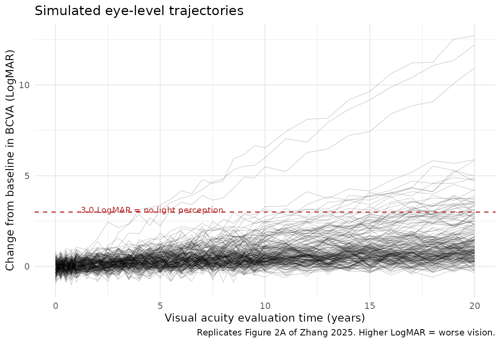
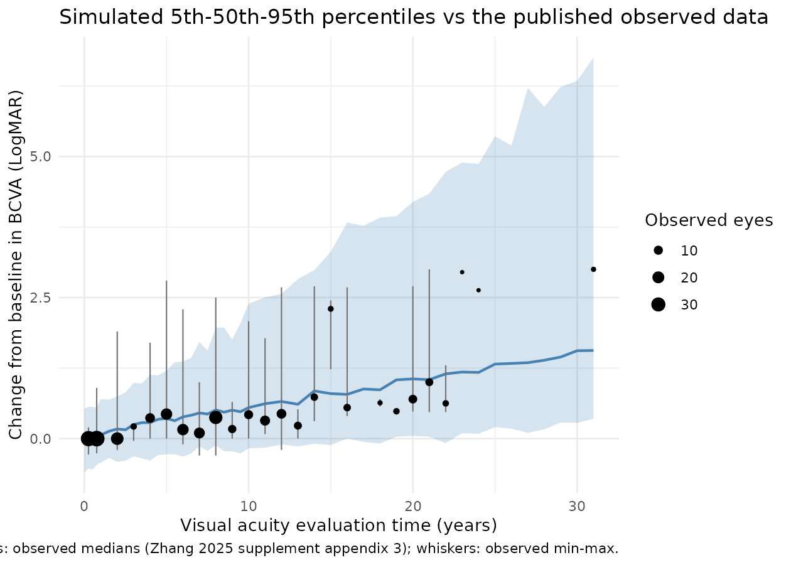
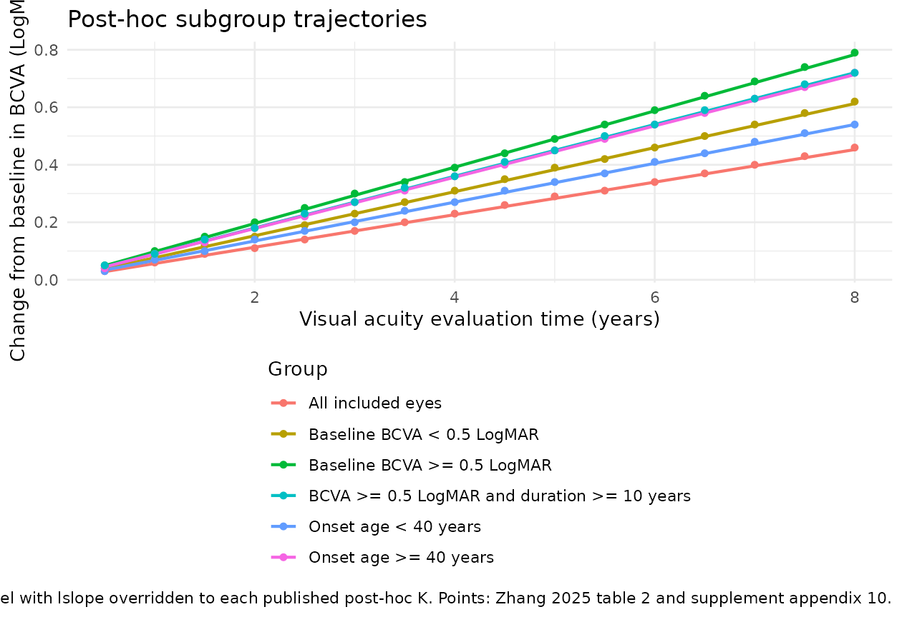

# Bietti crystalline dystrophy BCVA natural history (Zhang 2025)

## Model and source

- Citation: Zhang H, Yin S, Guan N, Wang J, Cheng Q, Zhang L, Zheng Q,
  Lv H, Wei W. Natural history of progressive vision loss in Bietti
  crystalline dystrophy: a model-based meta-analysis. BMJ Open
  Ophthalmology 2025;10:e001908. <doi:10.1136/bmjophth-2024-001908>.
- Article: <https://doi.org/10.1136/bmjophth-2024-001908>
- Supplement (data analysis protocols, appendices 1-12): published
  online only with the article; the parameter table used below is
  supplement appendix 7.

Bietti crystalline corneoretinal dystrophy (BCD) is an
autosomal-recessive retinal degeneration caused by biallelic mutations
in *CYP4V2*. There is no approved treatment, and *CYP4V2* gene-therapy
programmes need a quantitative description of the untreated trajectory
of vision loss in order to size and interpret their trials. Zhang 2025
supplies that description as a **model-based meta-analysis**: individual
eye-level best-corrected visual acuity (BCVA) time courses were
reconstructed from 14 published studies and fitted with a single linear
disease-progression model.

The structural model (supplement equation 1, where the supplement writes
the slope as $`K`$) is

``` math
\Delta \mathrm{BCVA}(t) \;=\; \mathrm{slope} \cdot t
```

with an exponential between-individual random effect on the slope
(supplement equation 2) and additive residual error on the LogMAR scale
(supplement equation 4):

``` math
\mathrm{slope}_i \;=\; \mathrm{slope}_{TV} \cdot e^{\eta_i}, \quad
\eta_i \sim \mathcal{N}(0, \omega^2), \qquad
Y_{obs,ij} \;=\; \Delta \mathrm{BCVA}(t_{ij}) + \varepsilon_{ij}, \quad
\varepsilon_{ij} \sim \mathcal{N}(0, \sigma^2)
```

Four features are worth flagging before any simulation:

1.  **LogMAR is inverted relative to intuition.** LogMAR is the base-10
    logarithm of the minimum angle of resolution, so *higher* LogMAR
    means *worse* vision. A **positive** slope therefore encodes
    progressive vision **loss**. Zhang 2025 phrases every result as
    “BCVA increased by … LogMAR per year”, meaning acuity deteriorated.
2.  **No intercept.** The model has exactly one structural parameter.
    Time zero is the first visual-acuity evaluation, so the predicted
    change from baseline is identically zero at $`t = 0`$ by
    construction.
3.  **The random effect is between-EYE, not between-study.** This is
    unusual for a meta-analysis. Because individual participant data
    were reconstructed from each source publication rather than pooled
    as study-level summaries, Zhang 2025 estimated an individual-level
    $`\eta`$ and reported **no** study-level variance term. The packaged
    model consequently simulates eye-level trajectories and cannot
    separate between-study from between-eye heterogeneity (see
    Assumptions and deviations).
4.  **Every covariate was screened out.** Age, age at onset, disease
    duration, baseline BCVA, sex, race, *CYP4V2* genotype and family
    history were all tested and none was retained, so the base model
    *is* the final model (supplement appendix 6). They are recorded in
    the model file’s `covariatesDataExcluded` metadata and in
    `population$notes` rather than in `covariateData`.

``` r

mod  <- readModelDb("Zhang_2025_bietti_crystalline_dystrophy_mbma")
ui   <- rxode2::rxode(mod)
mod0 <- rxode2::zeroRe(mod)   # typical-value model: no IIV, no residual error
```

## Population

- **14 published studies**, **117 patients**, **193 study eyes** (84
  left, 109 right). All eyes untreated – prior treatment was an
  exclusion criterion, and there is no approved therapy for BCD.
- **Age at first BCVA recording**: median 49.0 years (range 15.0-76.0)
  (supplement appendix 2).
- **Age at onset**: median 47.0 years (range 11.0-76.0). Where onset age
  was not reported the age at first BCVA recording was substituted.
- **Disease duration**: median 8.00 years (range 0.500-47.0), defined as
  age minus age of onset plus the longest visit.
- **Baseline BCVA**: median 0.150 LogMAR (range -0.200 to 2.60). 151 of
  the 193 eyes had baseline BCVA below 0.5 LogMAR and 42 at or above it.
- **Sex**: 77 of 117 patients female (65.8%).
- **Race**: 80 of 117 patients East Asian (68.4%), 37 non-East Asian
  (31.6%). Six studies enrolled East Asian and nine non-East Asian
  populations; one study contributed to both strata, which is why the
  study counts sum to 15 rather than 14.
- ***CYP4V2* genotype**: c.802-8_810de117insGC (exon 7 deletion)
  homozygous or compound heterozygous in 53 patients, other genotypes in
  36, not determined in
  28. 
- **Family history of BCD**: 11 of 117 patients (9.4%).

Off-chart acuities were coded on the LogMAR scale as 1.9 (counting
fingers), 2.3 (hand motion), 2.7 (light perception) and 3.0 (no light
perception), so 3.0 LogMAR is the ceiling of the measurement scale –
total blindness.

The same information is available programmatically:

``` r

str(ui$population, max.level = 1)
#> List of 19
#>  $ species                : chr "human"
#>  $ n_subjects             : int 117
#>  $ n_eyes                 : int 193
#>  $ n_studies              : int 14
#>  $ age_range              : chr "15.0-76.0 years (Zhang 2025 supplement appendix 2, age at the first BCVA recording)"
#>  $ age_median             : chr "49.0 years (Zhang 2025 supplement appendix 2)"
#>  $ weight_range           : chr NA
#>  $ weight_median          : chr NA
#>  $ sex_female_pct         : num 65.8
#>  $ race_ethnicity         : Named num [1:2] 68.4 31.6
#>   ..- attr(*, "names")= chr [1:2] "East Asian" "Non-East Asian"
#>  $ disease_state          : chr "Bietti crystalline corneoretinal dystrophy (BCD), an autosomal-recessive progressive retinal degeneration cause"| __truncated__
#>  $ dose_range             : chr "n/a (untreated natural history; the model has no drug input)"
#>  $ regions                : chr "Six of the 14 included studies enrolled East Asian populations (China, Japan, Korea) and nine enrolled non-East"| __truncated__
#>  $ onset_age_range        : chr "11.0-76.0 years (Zhang 2025 supplement appendix 2; where the age of onset was missing the age at the first BCVA"| __truncated__
#>  $ onset_age_median       : chr "47.0 years (Zhang 2025 supplement appendix 2)"
#>  $ disease_duration_range : chr "0.500-47.0 years (Zhang 2025 supplement appendix 2; duration = age - age of onset + longest visit)"
#>  $ disease_duration_median: chr "8.00 years (Zhang 2025 supplement appendix 2)"
#>  $ baseline_bcva          : chr "Median 0.150 LogMAR [-0.200, 2.60] (Zhang 2025 supplement appendix 2). Of the 193 study eyes, 151 had baseline "| __truncated__
#>  $ notes                  : chr "Individual eye-level BCVA time courses were reconstructed from 14 published studies retrieved by a PRISMA-style"| __truncated__
```

## Source trace

| Item | Value | Source location |
|:---|:---|:---|
| `deltaBCVA <- slope * time` | n/a | Supplement, Data analysis, equation (1) (`Effect = K x Time`) |
| Exponential between-individual random effect | n/a | Supplement, Data analysis, equation (2); appendix 4 model 102 (`ETA: Exponential type`), selected as the base model |
| Additive residual error | n/a | Supplement, Data analysis, equation (4); appendix 4 model 102 (`SIGMA: Additive type`) |
| No covariate on the slope | n/a | Supplement appendix 6 (forward inclusion + backward elimination; nothing retained) |
| `lslope = log(0.0566)` | K = 0.0566 LogMAR/year (RSE 10.1%, 95% CI 0.0454-0.0678) | Supplement appendix 7, Final model, `Parameter of population / K` |
| `etalslope ~ 0.898^2` | omega(K) = 0.898 (RSE 8.7%, 95% CI 0.745-1.05) | Supplement appendix 7, `Between-individual random effect parameters / omega (K)` |
| `addSd = 0.336` | sigma(ADD) = 0.336 (RSE 5.3%, 95% CI 0.301-0.371) | Supplement appendix 7, `Intra-individual random effect parameters / sigma (ADD)` |
| Bootstrap corroboration | K 0.0564 (0.0452-0.0694); omega 0.894 (0.700-1.08); sigma 0.336 (0.205-0.446) | Supplement appendix 7, Bootstrap (1000 successes) columns |

Source trace for every structural element and every ini() value.
{.table}

### omega and sigma are standard deviations, not variances

The supplement pins the scale of its own random-effect parameters
explicitly. After equations (2) and (3) it states that $`\eta_i`$
“conform\[s\] to a normal distribution with mean 0 and **variance**
$`\omega^2`$”, and after equations (4) to (6) that $`\varepsilon_{i,1}`$
and $`\varepsilon_{i,2}`$ “conform to a normal distribution with mean 0
and **variance** $`\sigma_{i,1}^2`$ and $`\sigma_{i,2}^2`$”. The
reported `omega (K) = 0.898` and `sigma (ADD) = 0.336` are therefore
**standard deviations**. `ini()` in nlmixr2 takes a *variance* for an
eta, hence `etalslope ~ 0.898^2`, and an *SD* for `add()`, hence
`addSd <- 0.336` unchanged.

This ambiguity is worth resolving explicitly because it is a common
transcription error, but note that here it is nearly immaterial: reading
`0.898` as a variance instead would give an SD of 0.948 rather than
0.898, a difference of only 5.5% in the log-scale SD.

### Dimensional analysis

| Term           | Units                         |
|----------------|-------------------------------|
| `slope`        | LogMAR / year                 |
| `time`         | year                          |
| `slope * time` | LogMAR                        |
| `deltaBCVA`    | LogMAR (change from baseline) |
| `addSd`        | LogMAR                        |
| `etalslope`    | (unitless; log scale)         |

Consistent: the only structural equation multiplies a rate in
LogMAR/year by a time in years and yields a LogMAR change.

## Verification 1: the typical-value trajectory is the published closed form

`zeroRe()` removes both the between-eye random effect and the residual
error, leaving the deterministic prediction. It must equal `0.0566 * t`
exactly, and must be exactly zero at time zero.

``` r

t_grid <- seq(0, 8, by = 0.5)
ev_typ <- data.frame(id = 1L, time = t_grid, evid = 0L, amt = 0)

sim_typ <- rxode2::rxSolve(mod0, events = ev_typ, returnType = "data.frame")
#> ℹ omega/sigma items treated as zero: 'etalslope'

# 0.0566 is transcribed from Zhang 2025 supplement appendix 7 -- it is NOT read
# back out of the model, so a mistyped lslope makes this assertion go red.
closed_form <- 0.0566 * t_grid

stopifnot(
  # Deterministic quantities: assert tightly (no cohort, no RNG involved).
  isTRUE(all.equal(sim_typ$deltaBCVA, closed_form, tolerance = 1e-10)),
  # No intercept: change from baseline is identically zero at the baseline visit.
  sim_typ$deltaBCVA[t_grid == 0] == 0
)

cat("max |model - 0.0566 * t| =",
    format(max(abs(sim_typ$deltaBCVA - closed_form)), digits = 3), "LogMAR\n")
#> max |model - 0.0566 * t| = 1.11e-16 LogMAR
```

## Verification 2: reproduce the published simulation tables

Zhang 2025 table 2 and supplement appendix 10 report the simulated
change from baseline in BCVA at half-yearly intervals out to 8 years,
for the whole cohort and for five subgroups. The subgroup slopes are
**post-hoc empirical-Bayes summaries of the individual $`K`$ values**,
not fitted covariate effects (no covariate survived screening), so they
are reproduced here by overriding `lslope` rather than by adding a
covariate to the model.

``` r

published <- tibble::tribble(
  ~time, ~all,  ~all_lo, ~all_hi, ~sev,  ~bcva_lo_grp, ~bcva_hi_grp, ~onset_lt40, ~onset_ge40,
   0.5,  0.03,  0.02,    0.03,    0.05,  0.04,         0.05,         0.03,        0.04,
   1.0,  0.06,  0.05,    0.07,    0.09,  0.08,         0.10,         0.07,        0.09,
   1.5,  0.09,  0.07,    0.10,    0.14,  0.12,         0.15,         0.10,        0.13,
   2.0,  0.11,  0.09,    0.14,    0.18,  0.15,         0.20,         0.14,        0.18,
   2.5,  0.14,  0.12,    0.17,    0.23,  0.19,         0.25,         0.17,        0.22,
   3.0,  0.17,  0.14,    0.21,    0.27,  0.23,         0.30,         0.20,        0.27,
   3.5,  0.20,  0.16,    0.24,    0.32,  0.27,         0.34,         0.24,        0.31,
   4.0,  0.23,  0.19,    0.27,    0.36,  0.31,         0.39,         0.27,        0.36,
   4.5,  0.26,  0.21,    0.31,    0.41,  0.35,         0.44,         0.31,        0.40,
   5.0,  0.29,  0.23,    0.34,    0.45,  0.39,         0.49,         0.34,        0.45,
   5.5,  0.31,  0.26,    0.38,    0.50,  0.42,         0.54,         0.37,        0.49,
   6.0,  0.34,  0.28,    0.41,    0.54,  0.46,         0.59,         0.41,        0.54,
   6.5,  0.37,  0.30,    0.45,    0.59,  0.50,         0.64,         0.44,        0.58,
   7.0,  0.40,  0.33,    0.48,    0.63,  0.54,         0.69,         0.48,        0.63,
   7.5,  0.43,  0.35,    0.52,    0.68,  0.58,         0.74,         0.51,        0.67,
   8.0,  0.46,  0.37,    0.55,    0.72,  0.62,         0.79,         0.54,        0.72
)
# Columns `all`, `all_lo`, `all_hi` and `sev` are Zhang 2025 table 2 (main text);
# `bcva_lo_grp`, `bcva_hi_grp`, `onset_lt40` and `onset_ge40` are supplement
# appendix 10.

# Slope of a straight line forced through the origin. Because the published
# model has no intercept, this recovers the K that generated each column.
slope_through_origin <- function(t, y) sum(t * y) / sum(t^2)
```

### The published columns are internally consistent with `Effect = K * t`

Each published column should be recoverable as `K * t` for the `K` the
paper reports for that group. Rounding to two decimals is the dominant
error at short times, so the whole column is summarised by a single
regression through the origin.

``` r

groups <- tibble::tribble(
  ~Group,                                                  ~column,       ~`Published K`, ~`K source`, ~n_eyes,
  "All included eyes",                                     "all",          0.0566,        "Supplement appendix 7 (model estimate)", 193L,
  "Baseline BCVA < 0.5 LogMAR",                            "bcva_lo_grp",  0.0766,        "Results, post-hoc Bayesian",             151L,
  "Baseline BCVA >= 0.5 LogMAR",                           "bcva_hi_grp",  0.0979,        "Results, post-hoc Bayesian",              42L,
  "Onset age < 40 years",                                  "onset_lt40",   0.0675,        "Results, post-hoc Bayesian",              71L,
  "Onset age >= 40 years",                                 "onset_ge40",   0.0892,        "Results, post-hoc Bayesian",             122L,
  "BCVA >= 0.5 LogMAR and duration >= 10 years",           "sev",          0.0900,        "Results, post-hoc Bayesian",              15L
) |>
  dplyr::rowwise() |>
  dplyr::mutate(
    `Recovered K` = slope_through_origin(published$time, published[[column]]),
    `Diff (%)`    = 100 * (`Recovered K` - `Published K`) / `Published K`
  ) |>
  dplyr::ungroup()

# Deterministic: both sides are hardcoded transcriptions of the paper. A
# published table that did not come from `Effect = K * t` would fail this.
stopifnot(max(abs(groups$`Diff (%)`)) < 2)

groups |>
  dplyr::select(Group, n_eyes, `Published K`, `Recovered K`, `Diff (%)`, `K source`) |>
  dplyr::rename("Eyes" = n_eyes) |>
  knitr::kable(digits = c(0, 0, 4, 4, 2, 0),
               caption = "Regression through the origin of each published simulation column recovers that group's published K.")
```

| Group | Eyes | Published K | Recovered K | Diff (%) | K source |
|:---|---:|---:|---:|---:|:---|
| All included eyes | 193 | 0.0566 | 0.0572 | 1.02 | Supplement appendix 7 (model estimate) |
| Baseline BCVA \< 0.5 LogMAR | 151 | 0.0766 | 0.0772 | 0.76 | Results, post-hoc Bayesian |
| Baseline BCVA \>= 0.5 LogMAR | 42 | 0.0979 | 0.0985 | 0.57 | Results, post-hoc Bayesian |
| Onset age \< 40 years | 71 | 0.0675 | 0.0680 | 0.67 | Results, post-hoc Bayesian |
| Onset age \>= 40 years | 122 | 0.0892 | 0.0896 | 0.42 | Results, post-hoc Bayesian |
| BCVA \>= 0.5 LogMAR and duration \>= 10 years | 15 | 0.0900 | 0.0904 | 0.48 | Results, post-hoc Bayesian |

Regression through the origin of each published simulation column
recovers that group’s published K. {.table}

### The packaged model reproduces Zhang 2025 table 2

``` r

solve_typical_slope <- function(k) {
  rxode2::rxSolve(
    rxode2::zeroRe(rxode2::ini(mod, lslope = log(k))),
    events     = data.frame(id = 1L, time = published$time, evid = 0L, amt = 0),
    returnType = "data.frame"
  )$deltaBCVA
}

table2 <- published |>
  dplyr::transmute(
    time,
    Published    = all,
    Model        = solve_typical_slope(0.0566),
    Difference   = Model - Published
  )
#> ℹ change initial estimate of `lslope` to `-2.871746293773`
#> ℹ omega/sigma items treated as zero: 'etalslope'

# Deterministic. Realised maximum is ~0.007 LogMAR, which is the two-decimal
# rounding of the published column; 0.01 leaves headroom for that rounding and
# still goes red on a third-significant-figure error in K at t = 8 y.
stopifnot(max(abs(table2$Difference)) < 0.01)

table2 |>
  dplyr::rename(
    "Time (years)"                        = time,
    "Published (LogMAR)"                  = Published,
    "Packaged model (LogMAR)"             = Model,
    "Difference (LogMAR)"                 = Difference
  ) |>
  knitr::kable(digits = c(1, 2, 4, 4),
               caption = "Zhang 2025 table 2, 'All included population (193 eyes)' column vs the packaged model's typical-value prediction.")
```

| Time (years) | Published (LogMAR) | Packaged model (LogMAR) | Difference (LogMAR) |
|-------------:|-------------------:|------------------------:|--------------------:|
|          0.5 |               0.03 |                  0.0283 |             -0.0017 |
|          1.0 |               0.06 |                  0.0566 |             -0.0034 |
|          1.5 |               0.09 |                  0.0849 |             -0.0051 |
|          2.0 |               0.11 |                  0.1132 |              0.0032 |
|          2.5 |               0.14 |                  0.1415 |              0.0015 |
|          3.0 |               0.17 |                  0.1698 |             -0.0002 |
|          3.5 |               0.20 |                  0.1981 |             -0.0019 |
|          4.0 |               0.23 |                  0.2264 |             -0.0036 |
|          4.5 |               0.26 |                  0.2547 |             -0.0053 |
|          5.0 |               0.29 |                  0.2830 |             -0.0070 |
|          5.5 |               0.31 |                  0.3113 |              0.0013 |
|          6.0 |               0.34 |                  0.3396 |             -0.0004 |
|          6.5 |               0.37 |                  0.3679 |             -0.0021 |
|          7.0 |               0.40 |                  0.3962 |             -0.0038 |
|          7.5 |               0.43 |                  0.4245 |             -0.0055 |
|          8.0 |               0.46 |                  0.4528 |             -0.0072 |

Zhang 2025 table 2, ‘All included population (193 eyes)’ column vs the
packaged model’s typical-value prediction. {.table}

### The published 95% CI is parameter uncertainty, not a prediction interval

Table 2 reports a 95% CI around each simulated value. Those intervals
are narrow and scale exactly in proportion to time, which is the
signature of uncertainty in the *typical* $`K`$ rather than of
between-eye variability. Regressing the lower and upper CI columns
through the origin should therefore recover the 95% CI of $`K`$ itself
(0.0454 to 0.0678 from supplement appendix 7) – and it does.

``` r

ci_check <- tibble::tibble(
  Bound            = c("Lower", "Upper"),
  `Published K CI` = c(0.0454, 0.0678),
  `Recovered`      = c(slope_through_origin(published$time, published$all_lo),
                       slope_through_origin(published$time, published$all_hi))
) |>
  dplyr::mutate(`Diff (%)` = 100 * (Recovered - `Published K CI`) / `Published K CI`)

# Deterministic (hardcoded published numbers on both sides).
stopifnot(max(abs(ci_check$`Diff (%)`)) < 4)

knitr::kable(ci_check, digits = c(0, 4, 4, 2),
             caption = "Regressing table 2's CI columns through the origin recovers the 95% CI of K, confirming the published interval reflects parameter uncertainty and not between-eye spread.")
```

| Bound | Published K CI | Recovered | Diff (%) |
|:------|---------------:|----------:|---------:|
| Lower |         0.0454 |    0.0466 |     2.68 |
| Upper |         0.0678 |    0.0688 |     1.43 |

Regressing table 2’s CI columns through the origin recovers the 95% CI
of K, confirming the published interval reflects parameter uncertainty
and not between-eye spread. {.table}

This matters for anyone reusing the model: the interval in Zhang 2025
table 2 is roughly plus or minus 20% around the mean trajectory, whereas
the *between-eye* spread implied by `omega = 0.898` is far wider (a
5th-to-95th-percentile range spanning roughly a factor of 20 in slope),
as the next section shows.

## Verification 3: replicate figure 2A – eye-level trajectories

Zhang 2025 figure 2A plots the change in BCVA from baseline over time
for every study eye, one line per eye. The equivalent simulation draws a
virtual cohort from the packaged model. `omega = 0.898` on the log scale
is a very large between-eye variability (coefficient of variation about
111%), so the fan of trajectories is wide.

``` r

# `set.seed()` seeds R's RNG, not rxode2's; rxode2 partitions its streams per
# solver thread, so a machine with a different thread count draws a different
# cohort. Every assertion below is written to hold for ANY cohort this model can
# produce (see references/known-vignette-failure-patterns.md pattern 12).
set.seed(20250423)

n_eyes  <- 200L   # 200 per arm is the cap; this vignette has a single arm

# The grid must contain every evaluation time used by the observed-data overlay
# below (supplement appendix 3), including the two binned early times 0.25 and
# 0.75, or the coverage check silently has nothing to compare against.
observed_times <- c(0.25, 0.75, 2:16, 18:24, 31)
obs_t <- sort(unique(c(seq(0, 10, by = 0.5), seq(11, 31, by = 1), observed_times)))

ev_cohort <- tidyr::expand_grid(
  id   = seq_len(n_eyes),
  time = obs_t
) |>
  dplyr::mutate(evid = 0L, amt = 0) |>
  as.data.frame()

stopifnot(!anyDuplicated(unique(ev_cohort[, c("id", "time", "evid")])))

sim_cohort <- rxode2::rxSolve(mod, events = ev_cohort, returnType = "data.frame")
if (is.null(sim_cohort$id)) sim_cohort$id <- 1L
```

``` r

# Replicates Figure 2A of Zhang 2025: one line per study eye, change in BCVA
# from baseline vs time. `sim` carries the additive residual error; `deltaBCVA`
# is the individual prediction.
sim_cohort |>
  dplyr::filter(time <= 20) |>
  ggplot(aes(time, sim, group = id)) +
  geom_line(alpha = 0.18, linewidth = 0.3) +
  geom_hline(yintercept = 3, linetype = "dashed", colour = "firebrick") +
  annotate("text", x = 1.2, y = 3.12, label = "3.0 LogMAR = no light perception",
           colour = "firebrick", size = 3, hjust = 0) +
  labs(x = "Visual acuity evaluation time (years)",
       y = "Change from baseline in BCVA (LogMAR)",
       title = "Simulated eye-level trajectories",
       caption = "Replicates Figure 2A of Zhang 2025. Higher LogMAR = worse vision.") +
  theme_minimal()
```



The dashed line marks 3.0 LogMAR, the scale ceiling that Zhang 2025
equates with no light perception. The packaged model does **not** impose
that ceiling – see Assumptions and deviations.

## Verification 4: visual predictive check against the published observed data

Supplement appendix 3 tabulates, for the whole cohort, the median,
minimum and maximum observed change from baseline at each evaluation
time along with the number of contributing study eyes. Those are real
observed values extracted from the 14 source publications, so overlaying
them on the model’s prediction interval is a genuine external check
rather than a model-against-itself comparison.

``` r

observed <- tibble::tribble(
  ~time, ~median, ~min,   ~max,  ~n_eyes,
   0.25,  0.000, -0.28,  0.20,  36L,   # supplement appendix 3 row "<0.5", binned at 0.25
   0.75,  0.000, -0.26,  0.90,  38L,   # supplement appendix 3 row "0.5~1", binned at 0.75
   2.00,  0.000, -0.20,  1.90,  23L,
   3.00,  0.215, -0.04,  0.26,   4L,
   4.00,  0.365,  0.00,  1.70,  12L,
   5.00,  0.435,  0.00,  2.80,  18L,
   6.00,  0.160, -0.10,  2.29,  18L,
   7.00,  0.100, -0.30,  1.00,  16L,
   8.00,  0.375, -0.30,  2.50,  26L,
   9.00,  0.170,  0.00,  0.65,   8L,
  10.00,  0.425,  0.00,  2.08,  10L,
  11.00,  0.320,  0.08,  1.78,  13L,
  12.00,  0.440, -0.20,  2.68,  12L,
  13.00,  0.230,  0.00,  0.52,   7L,
  14.00,  0.735,  0.31,  2.70,   6L,
  15.00,  2.300,  1.23,  2.45,   3L,
  16.00,  0.550,  0.40,  2.68,   6L,
  18.00,  0.635,  0.57,  0.70,   2L,
  19.00,  0.485,  0.43,  0.53,   4L,
  20.00,  0.700,  0.48,  2.70,   9L,
  21.00,  1.000,  0.47,  3.00,   7L,
  22.00,  0.625,  0.47,  1.30,   4L,
  23.00,  2.950,  2.95,  2.95,   1L,
  24.00,  2.630,  2.63,  2.63,   1L,
  31.00,  3.000,  3.00,  3.00,   2L
)

# Fail loudly if the simulation grid and the observed table ever drift apart:
# a missing time would silently drop rows from the coverage check below.
stopifnot(all(observed$time %in% obs_t))
```

``` r

vpc_band <- sim_cohort |>
  dplyr::group_by(time) |>
  dplyr::summarise(
    Q05 = quantile(sim, 0.05),
    Q50 = quantile(sim, 0.50),
    Q95 = quantile(sim, 0.95),
    .groups = "drop"
  )

ggplot(vpc_band, aes(time, Q50)) +
  geom_ribbon(aes(ymin = Q05, ymax = Q95), alpha = 0.22, fill = "steelblue") +
  geom_line(linewidth = 0.8, colour = "steelblue") +
  geom_linerange(data = observed, inherit.aes = FALSE,
                 aes(x = time, ymin = min, ymax = max),
                 colour = "grey45", linewidth = 0.4) +
  geom_point(data = observed, inherit.aes = FALSE,
             aes(x = time, y = median, size = n_eyes)) +
  scale_size_area(max_size = 4, name = "Observed eyes") +
  labs(x = "Visual acuity evaluation time (years)",
       y = "Change from baseline in BCVA (LogMAR)",
       title = "Simulated 5th-50th-95th percentiles vs the published observed data",
       caption = paste("Band and line: packaged model,", n_eyes,
                       "simulated eyes. Points: observed medians (Zhang 2025 supplement appendix 3);",
                       "whiskers: observed min-max.")) +
  theme_minimal()
```



``` r

# Coverage of the observed medians by the simulated 5th-95th percentile band,
# restricted to evaluation times backed by at least 5 study eyes (a median over
# 1-4 eyes is not a stable statistic to check against).
coverage <- observed |>
  dplyr::filter(n_eyes >= 5) |>
  dplyr::left_join(vpc_band, by = "time") |>
  dplyr::mutate(inside = median >= Q05 & median <= Q95)

# Guard against a check that cannot go red (pattern 10): confirm rows exist and
# that every observed time matched a simulated time.
stopifnot(nrow(coverage) >= 15, !anyNA(coverage$Q50))

cover_frac <- mean(coverage$inside)

# Cohort-derived, so assert a bound that holds for ANY cohort this model can
# draw, not the value one run happened to give. The realised coverage is 1.00;
# 0.80 leaves room for the band edges to move with the draw while still going
# red if the model's slope or omega were badly mis-transcribed.
stopifnot(cover_frac >= 0.80)

cat("observed medians inside the simulated 5-95% band:",
    sum(coverage$inside), "of", nrow(coverage),
    sprintf("(%.0f%%)\n", 100 * cover_frac))
#> observed medians inside the simulated 5-95% band: 17 of 17 (100%)
```

### A documented discordance: observed medians do not follow `K * t`

The model’s *median* trajectory is `slope_TV * t` (the median of
$`e^{\eta}`$ is 1), but the observed medians in supplement appendix 3 do
not lie on that line – they are 0.00 at 2 years, 0.365 at 4 years, 0.160
at 6 years and 0.100 at 7 years. Regressing them through the origin
gives a much shallower slope than the fitted $`K`$:

``` r

obs_fit <- observed |> dplyr::filter(n_eyes >= 5)
obs_slope <- slope_through_origin(obs_fit$time, obs_fit$median)

cat(sprintf("origin-regression slope of the observed medians: %.4f LogMAR/year\n", obs_slope))
#> origin-regression slope of the observed medians: 0.0380 LogMAR/year
cat(sprintf("fitted typical K:                                %.4f LogMAR/year\n", 0.0566))
#> fitted typical K:                                0.0566 LogMAR/year
```

This is **not** a transcription error and it is not gated on. Each
evaluation time in appendix 3 is contributed by a *different* subset of
eyes – the studies have different follow-up lengths, and eyes observed
at 6 years are not the eyes observed at 4 years – so the sequence of
medians is not a longitudinal trajectory. The model was fitted to the
individual longitudinal records, not to this table of cross-sectional
summaries, and the two are only expected to agree in distribution (which
the coverage check above confirms), not point by point.

## Verification 5: subgroup trajectories

``` r

subgroup_sim <- groups |>
  dplyr::rowwise() |>
  dplyr::reframe(
    Group = Group,
    time  = published$time,
    Model = solve_typical_slope(`Published K`)
  )
#> ℹ change initial estimate of `lslope` to `-2.871746293773`
#> ℹ omega/sigma items treated as zero: 'etalslope'
#> ℹ change initial estimate of `lslope` to `-2.56915820223559`
#> ℹ omega/sigma items treated as zero: 'etalslope'
#> ℹ change initial estimate of `lslope` to `-2.32380872944567`
#> ℹ omega/sigma items treated as zero: 'etalslope'
#> ℹ change initial estimate of `lslope` to `-2.69562768110365`
#> ℹ omega/sigma items treated as zero: 'etalslope'
#> ℹ change initial estimate of `lslope` to `-2.41687423939617`
#> ℹ omega/sigma items treated as zero: 'etalslope'
#> ℹ change initial estimate of `lslope` to `-2.40794560865187`
#> ℹ omega/sigma items treated as zero: 'etalslope'

published_long <- groups |>
  dplyr::rowwise() |>
  dplyr::reframe(
    Group     = Group,
    time      = published$time,
    Published = published[[column]]
  )

dplyr::left_join(subgroup_sim, published_long, by = c("Group", "time")) |>
  ggplot(aes(time, Model, colour = Group)) +
  geom_line(linewidth = 0.8) +
  geom_point(aes(y = Published), size = 1.4) +
  labs(x = "Visual acuity evaluation time (years)",
       y = "Change from baseline in BCVA (LogMAR)",
       colour = "Group",
       title = "Post-hoc subgroup trajectories",
       caption = paste("Lines: packaged model with lslope overridden to each published post-hoc K.",
                       "Points: Zhang 2025 table 2 and supplement appendix 10.")) +
  theme_minimal() +
  theme(legend.position = "bottom", legend.direction = "vertical")
```



``` r

agreement <- dplyr::left_join(subgroup_sim, published_long,
                              by = c("Group", "time")) |>
  dplyr::mutate(diff = Model - Published)

stopifnot(nrow(agreement) == nrow(groups) * nrow(published), !anyNA(agreement$diff))

# Deterministic. Realised maximum is 0.0075 LogMAR across all six groups,
# driven by the two-decimal rounding of the published columns.
stopifnot(max(abs(agreement$diff)) < 0.012)

agreement |>
  dplyr::group_by(Group) |>
  dplyr::summarise(`Max |difference| (LogMAR)` = max(abs(diff)), .groups = "drop") |>
  knitr::kable(digits = 4,
               caption = "Largest disagreement between the packaged model and each published simulation column, over 0.5-8 years.")
```

| Group                                         | Max \|difference\| (LogMAR) |
|:----------------------------------------------|----------------------------:|
| All included eyes                             |                      0.0072 |
| BCVA \>= 0.5 LogMAR and duration \>= 10 years |                      0.0050 |
| Baseline BCVA \< 0.5 LogMAR                   |                      0.0072 |
| Baseline BCVA \>= 0.5 LogMAR                  |                      0.0068 |
| Onset age \< 40 years                         |                      0.0075 |
| Onset age \>= 40 years                        |                      0.0064 |

Largest disagreement between the packaged model and each published
simulation column, over 0.5-8 years. {.table}

## Clinical anchor: time to a clinically relevant change

The paper notes that the FDA regards a 15-letter change in visual acuity
as clinically relevant; 15 ETDRS letters is 0.30 LogMAR. At the typical
fitted rate this takes a little over five years, and at the fastest
published subgroup rate about three.

``` r

tibble::tibble(
  Group = groups$Group,
  K     = groups$`Published K`
) |>
  dplyr::mutate(`Years to 0.30 LogMAR (15 ETDRS letters)` = 0.30 / K) |>
  dplyr::rename("K (LogMAR/year)" = K) |>
  knitr::kable(digits = c(0, 4, 1),
               caption = "Time for the typical eye in each group to lose 15 ETDRS letters (0.30 LogMAR).")
```

| Group | K (LogMAR/year) | Years to 0.30 LogMAR (15 ETDRS letters) |
|:---|---:|---:|
| All included eyes | 0.0566 | 5.3 |
| Baseline BCVA \< 0.5 LogMAR | 0.0766 | 3.9 |
| Baseline BCVA \>= 0.5 LogMAR | 0.0979 | 3.1 |
| Onset age \< 40 years | 0.0675 | 4.4 |
| Onset age \>= 40 years | 0.0892 | 3.4 |
| BCVA \>= 0.5 LogMAR and duration \>= 10 years | 0.0900 | 3.3 |

Time for the typical eye in each group to lose 15 ETDRS letters (0.30
LogMAR). {.table}

## Assumptions and deviations

- **No BCVA ceiling.** Zhang 2025 codes no light perception as 3.0
  LogMAR and notes that “when the BCVA increased to 3 LogMAR, the eyes
  had no light perception, total blindness”. The published structural
  model (`Effect = K x Time`) has no ceiling, and none is imposed here,
  so simulations run long enough will predict changes above 3.0 LogMAR
  that are not physically attainable. Users simulating beyond roughly 30
  years, or starting from an already-impaired baseline, should censor at
  the ceiling themselves. The model file reproduces the paper, not a
  corrected version of it.
- **Monotone deterioration per eye.** Because the between-eye random
  effect is exponential, `slope_i = exp(lslope + etalslope)` is strictly
  positive and no simulated eye can improve in its *individual
  prediction*. The observed improvements in the source data (changes
  from baseline as low as -0.30 LogMAR) are reproduced only through the
  additive residual error. This is the paper’s structure, not a
  simplification introduced here.
- **The random effect is between-EYE, and eyes are treated as
  independent.** The analysis unit is the study eye (193 eyes from 117
  patients), so both eyes of a bilaterally-affected patient enter as
  separate individuals. Zhang 2025 reports no patient-level or
  study-level random effect and no correlation structure between fellow
  eyes, so none is encoded. For a disease that is bilateral and
  genetically determined this almost certainly understates the effective
  correlation and therefore overstates the effective sample size;
  simulations intended to size a trial should treat the between-eye
  variance as a between-eye *plus* between-patient composite.
- **No between-study variance.** Despite being a meta-analysis, the
  model has no study-level term (see above). It cannot be used to
  explore between-study heterogeneity or to predict a new study’s mean.
- **Covariates are documented, not modelled.** All eight screened
  covariates were rejected (supplement appendix 6). Four with existing
  canonical register names (`AGE`, `SCORE_BCVA`, `SEXF`,
  `RACE_ASIAN_NORTHEAST`) are recorded in the model file’s
  `covariatesDataExcluded` metadata; age at onset, disease duration,
  *CYP4V2* genotype and family history have no canonical register entry
  and are described in `population$notes` instead. No new canonical
  covariate name was minted for a covariate that no model uses.
  - `SCORE_BCVA` is defined in the covariate register on the
    ETDRS-letter scale (0-100, higher = better), whereas Zhang 2025
    works in LogMAR (higher = worse). Because the covariate was screened
    out and is never referenced in `model()`, no scale reconciliation
    was required and none was performed; the `covariatesDataExcluded`
    entry says so explicitly.
- **Subgroup slopes are post-hoc, not covariate effects.** The five
  subgroup `K` values are medians of individual empirical-Bayes
  estimates, obtained by Bayesian feedback after the final model was
  fixed. They are reproduced above by overriding `lslope`; they are
  deliberately **not** encoded as covariate effects in the model file,
  because no covariate reached significance and encoding them as such
  would misrepresent the paper.
- **Appendix 3 time binning.** The first two rows of supplement appendix
  3 are labelled “\<0.5” and “0.5~1” rather than a single time. They are
  plotted at 0.25 and 0.75 years respectively. This affects only the
  observed-data overlay, not any parameter.
- **Observation-variable name.** The observation is named `deltaBCVA`,
  following the `deltaUPDRS` precedent set by
  `Lee_2011_parkinson_progression` for an algebraic change-from-baseline
  clinical-score endpoint. `deltaBCVA` is a new entry in
  `inst/references/compartment-names.md`; the alternative register form
  for a change-from-baseline variant is the `cfb` suffix (`das28` /
  `das28cfb`), which would give `bcvacfb`. The `delta` prefix was chosen
  because this model is the direct structural analogue of
  `Lee_2011_parkinson_progression` – an algebraic, no-ODE, no-dose
  disease-progression model whose endpoint is the change score itself
  rather than a state with an absolute-value sibling.
- **Nothing is fixed.** All three reported parameters (`K`, `omega`,
  `sigma`) were estimated, with RSEs and bootstrap confidence intervals
  given in supplement appendix 7, so no `fixed()` wrapper is used.
- **Model 103 had a lower objective function.** Supplement appendix 4
  records that model 103 (exponential IIV, *mixed*
  additive-plus-proportional residual error) reached an objective
  function of -323.382 against model 102’s -121.789, yet the paper
  selected 102 as the base model and appendix 7 reports only an additive
  `sigma`. The packaged model follows the paper’s stated final model
  (102). The paper gives no rationale for preferring the
  higher-objective-function model; this is noted as a discrepancy in the
  source, not resolved here.
- **No NCA.** This is a disease-progression model with no drug, no dose
  and no concentration, so PKNCA is not an applicable validation. The
  checks above are the closed-form, published-table-reproduction and
  visual-predictive-check patterns used for endogenous and mechanistic
  models.
