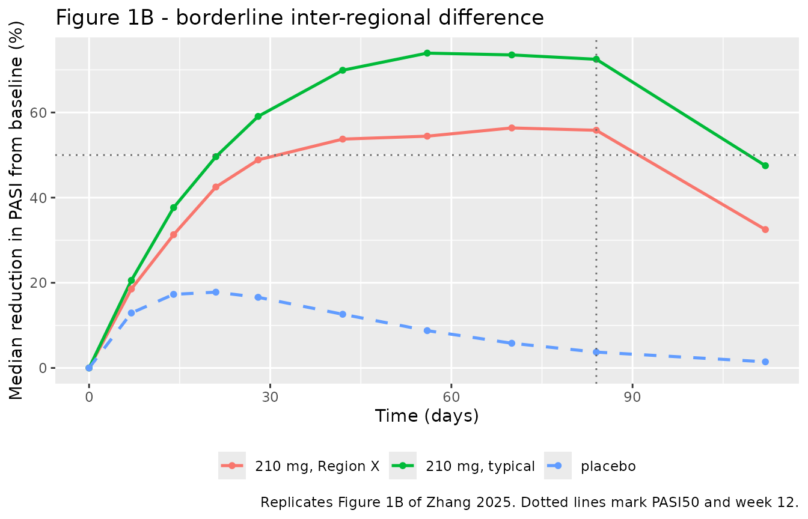
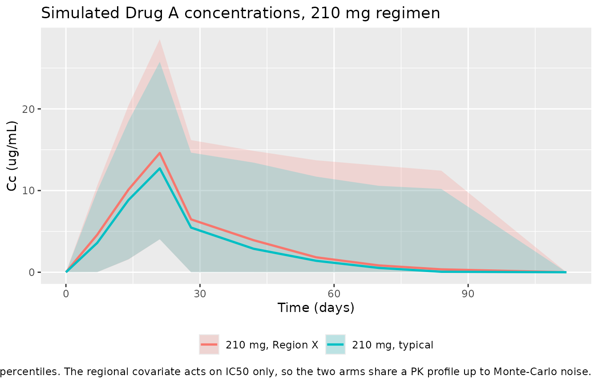

# Drug A, anti-psoriatic (Zhang 2025)

## Model and source

``` r

ui <- rxode2::rxode(readModelDb("Zhang_2025_drugA"))
```

- Citation: Zhang X, Xiao Y, Wu J, Marshall S, Zhou X. Pharmacometric
  Model-Based Sample Size Allocation for a Region of Interest in a
  Multi-Regional Phase 2 Trial: A Case Study of an Anti-Psoriatic Drug.
  CPT Pharmacometrics Syst Pharmacol. 2025;14(10):1673-1682.
  <doi:10.1002/psp4.70090>. Parameter values from Table S1; structural
  equations and variance terms from the Data S4 NONMEM control streams.
- Article: <https://doi.org/10.1002/psp4.70090>
- Supplement (Table S1, parameter values):
  <https://doi.org/10.1002/psp4.70090> Supporting Information, Table S1
- Supplement (Data S4, NONMEM control streams):
  <https://doi.org/10.1002/psp4.70090> Supporting Information, Data S4

Zhang 2025 is a trial-design paper: its subject is how much of a
175-subject multi-regional Phase 2 dose-ranging trial should be
allocated to a region of interest (“Region X”) so that a clinically
relevant inter-regional difference in response can be detected. Every
number in it comes from simulations of a concrete, fully parameterised
dose-exposure-response (D-E-R) model, and the supplement publishes that
model in full. This vignette extracts and validates the model itself,
not the sample-size methodology.

The structure is a two-compartment PK model with first-order
subcutaneous absorption and **parallel linear and Michaelis-Menten
elimination**, feeding an effect (“signaling”) compartment, which in
turn inhibits plaque formation in an indirect-response model of the
Psoriasis Area and Severity Index (PASI). A placebo effect multiplies
the PASI degradation rate and decays exponentially from its maximum at
time zero.

## Population

The trial simulated by Zhang 2025 enrols approximately 175 adults with
plaque psoriasis, randomised 1:1:1:1:1 to Drug A 70, 140 or 210 mg
subcutaneously on day 1 and at weeks 1, 2, 4, 6, 8 and 10; Drug A 280 mg
on day 1 and at weeks 4 and 8; or placebo (Methods 2.1). The primary
endpoint is the percentage improvement from baseline in PASI at week 12.

This is a **simulation** model rather than a fit to Phase 2 data. The
underlying D-E-R model was developed on Phase 1 data for Drug A and
carried into this paper “with minor adjustments to parameter values”
(Methods 2.2), so the paper reports no fitted-cohort demographics. The
typical baseline PASI of 13.5 (Table S1) is the only population
characteristic the model itself carries.

``` r

pop <- ui$population
str(pop, max.level = 1)
#> List of 9
#>  $ species      : chr "human"
#>  $ n_subjects   : int 175
#>  $ n_studies    : int 1
#>  $ age_range    : chr "not reported (adult psoriasis population)"
#>  $ weight_range : chr "not reported"
#>  $ disease_state: chr "moderate-to-severe plaque psoriasis"
#>  $ dose_range   : chr "Drug A 70, 140 or 210 mg SC at day 1 and weeks 1, 2, 4, 6, 8 and 10; or 280 mg SC at day 1 and weeks 4 and 8; o"| __truncated__
#>  $ regions      : chr "multi-regional; a designated 'Region X' (China, per the Data S4 code comments) versus the rest of the world"
#>  $ notes        : chr "This is a SIMULATION model, not a fit to the Phase 2 data. The N = 175 is the planned size of the hypothetical "| __truncated__
```

### What “Drug A” is, and what “Region X” is

Both are anonymised in the article, and both are recoverable from
material the authors themselves published:

- **Drug A is brodalumab.** The D-E-R model is cited to refs 10 and 11,
  which are Salinger 2014 (`doi:10.1002/cpdd.103`, a semi-mechanistic
  PK/PD model of *brodalumab*) and Papp 2012 (anti-IL-17-receptor
  antibody *AMG 827*, the development code for brodalumab). The
  parameter values here are the authors’ adjusted set for a hypothetical
  trial rather than a brodalumab fit, so the model is registered under
  the paper’s own compound label. The registry’s existing
  `Timmermann_2019_brodalumab` is a PK-only model, so this is not a
  duplicate: it adds the PASI PD layer, the placebo model and the
  regional covariate.
- **Region X is China.** The article body says only “Region X”. The Data
  S4 R code comments name it: `n_cn` is “sample size for cn (Region X)”,
  and the dataset-construction step adds a “label for Chinese and ROW
  populations (POP=2 is Region X, POP=1 is non-Region X)”. The covariate
  is therefore registered as the canonical `REGION_CHINA`, with this
  provenance recorded in `inst/references/covariate-columns.md`.

## Source trace

The per-parameter origin is recorded as an in-file comment next to each
`ini()` entry in `inst/modeldb/specificDrugs/Zhang_2025_drugA.R`. The
table below collects them in one place. Table S1 and the Data S4 control
streams agree on every fixed effect; where they disagree on a *unit* or
a *scale*, the resolution is noted.

| Equation / parameter | Value | Source location |
|----|----|----|
| `lkel` | 0.0724 /day | Table S1 `Kel`; Data S4 PK `$THETA(1)` FIX |
| `lvc` | 3.9 L | Table S1 `V`; Data S4 PK `$THETA(2)` FIX |
| `lvmax` | 7.4 mg/day | Table S1 `Vmax`; Data S4 PK `$THETA(3)` FIX |
| `lkm` | 0.01 ug/mL | Table S1 `Km`; Data S4 PK `$THETA(4)` FIX |
| `lka` | 0.255 /day | Table S1 `KA`; Data S4 PK `$THETA(5)` FIX |
| `lk12` / `lk21` | 0.26 / 0.351 /day | Table S1 `K12` / `K21`; Data S4 PK `$THETA(6)` / `$THETA(7)` FIX |
| `lfdepot` | 0.576 | Table S1 `F1` (57.6%); Data S4 PK `$THETA(8)` FIX |
| `lrbase` | 13.5 PASI | Table S1 `BL`; Data S4 PD `$THETA(1)` |
| `lksyn` | 0.862 PASI/day | Table S1 `Ksyn`; Data S4 PD `$THETA(2)` |
| `limax` | 1 (fixed) | Table S1 `Imax`; Data S4 PD `$THETA(3)` “1 FIX” |
| `lic50` | 2.86 ug/mL | Table S1 `IC50`; Data S4 PD `$THETA(4)` |
| `lpmax` | 0.439 | Table S1 `PBOmax`; Data S4 PD `$THETA(5)` |
| `lkpl` | 0.0372 /day | Table S1 `KPBO`; Data S4 PD `$THETA(6)` |
| `lke0` | 0.0469 /day | Table S1 `Keo`; Data S4 PD `$THETA(7)` (`K50`) |
| `e_region_china_ic50` | 2.6 (fixed) | Data S4 PD `$THETA(8)` `COV_CN`, set to `COV_CN_VALUE_PD <- 2.6`; Table 1 and Figure 1 caption |
| IIV (6 etas) | see below | Data S4 `$OMEGA`; each variance square-roots to the %CV in Table S1 |
| Residual error | see below | Data S4 `$SIGMA` (variances); see the erratum note |
| `d/dt(depot)`, `d/dt(central)`, `d/dt(peripheral1)` | n/a | Data S4 `$DES` (both PK and PD streams) |
| `d/dt(pasi)`, `pasi(0) <- rbase` | n/a | Data S4 PD `$DES` `DADT(4)` and `$PK` `A_0(4) = BL` |
| `d/dt(effect)`, `ve <- kel * vc / ke0` | n/a | Data S4 PD `$DES` `DADT(5)` and `$PK` `V5 = K25*V2/K50`, `K25 = K` |
| `ksyn`, `kdegx` | n/a | Data S4 PD `$DES` `KSYN` and `KDEGX` lines |

``` r

ui$iniDf |>
  dplyr::mutate(
    estimate = ifelse(is.na(est), NA_real_, est),
    scale = ifelse(is.na(neta1), "theta", "omega (variance)")
  ) |>
  dplyr::select(name, estimate, fix, scale, label) |>
  dplyr::rename(
    "Parameter" = name, "Estimate (transformed scale)" = estimate,
    "Fixed?" = fix, "Scale" = scale, "Label" = label
  ) |>
  knitr::kable(digits = 5, caption = "ini() as packaged.")
```

| Parameter | Estimate (transformed scale) | Fixed? | Scale | Label |
|:---|---:|:---|:---|:---|
| lkel | -2.62555 | TRUE | theta | First-order elimination rate constant from central (1/day) |
| lvc | 1.36098 | TRUE | theta | Central compartment volume (L) |
| lvmax | 2.00148 | TRUE | theta | Maximum rate of Michaelis-Menten elimination (mg/day) |
| lkm | -4.60517 | TRUE | theta | Concentration at half-maximal nonlinear elimination (ug/mL) |
| lka | -1.36649 | TRUE | theta | First-order absorption rate constant (1/day) |
| lk12 | -1.34707 | TRUE | theta | Central-to-peripheral rate constant (1/day) |
| lk21 | -1.04697 | TRUE | theta | Peripheral-to-central rate constant (1/day) |
| lfdepot | -0.55165 | TRUE | theta | Subcutaneous bioavailability (fraction) |
| lrbase | 2.60269 | FALSE | theta | Baseline PASI score (PASI units) |
| lksyn | -0.14850 | FALSE | theta | Zero-order rate of plaque formation, ksyn0 (PASI units/day) |
| limax | 0.00000 | TRUE | theta | Maximum fractional inhibition of plaque formation (unitless) |
| lic50 | 1.05082 | FALSE | theta | Effect-compartment concentration at half-maximal inhibition (ug/mL) |
| lpmax | -0.82326 | FALSE | theta | Maximum fractional increase of the PASI degradation rate by placebo (unitless) |
| lkpl | -3.29145 | FALSE | theta | Decay rate constant of the placebo effect (1/day) |
| lke0 | -3.05974 | FALSE | theta | Effect-compartment (signaling) equilibration rate constant (1/day) |
| e_region_china_ic50 | 2.60000 | TRUE | theta | Ratio of IC50 in Region X patients to IC50 in typical patients (R_regionX, unitless) |
| propSd | 0.51800 | TRUE | theta | Proportional residual error for drug concentration (fraction) |
| addSd | 0.30000 | TRUE | theta | Additive residual error for drug concentration (ug/mL) |
| propSd_pasi | 0.06360 | FALSE | theta | Proportional residual error for PASI score (fraction) |
| addSd_pasi | 1.14500 | FALSE | theta | Additive residual error for PASI score (PASI units) |
| etalvc | 0.08410 | TRUE | omega (variance) | NA |
| etalka | 0.56400 | TRUE | omega (variance) | NA |
| etalvmax | 0.09920 | TRUE | omega (variance) | NA |
| etalrbase | 0.04666 | FALSE | omega (variance) | NA |
| etalic50 | 1.84960 | FALSE | omega (variance) | NA |
| etalke0 | 0.32718 | FALSE | omega (variance) | NA |

ini() as packaged. {.table}

### Erratum: the PK additive residual in Table S1 is a variance, not an SD

Both endpoints use `Y = IPRED * (1 + EPS(1)) + EPS(2)`, so the `$SIGMA`
entries are variances. Three of the four rows confirm it:
`sqrt(0.2683) = 0.518` is exactly the 51.8% CV Table S1 states for the
PK proportional term, `sqrt(0.00404496) = 0.0636` is its stated 6.36%,
and `sqrt(1.31) = 1.145` is its stated 1.145 PASI units. The fourth row,
the PK additive term, is reported by Table S1 as “SD (ug/mL) 0.09” - but
0.09 is the `$SIGMA` entry, i.e. the variance. **Three consistent rows
falsify the fourth**: the true PK additive SD is
`sqrt(0.09) = 0.3 ug/mL`, and the model file uses 0.3.

``` r

tibble::tribble(
  ~term,                      ~sigma,     ~sqrt_sigma, ~table_s1,
  "PK proportional",          0.2683,     sqrt(0.2683),  "51.8% CV",
  "PK additive (ug/mL)",      0.09,       sqrt(0.09),    "0.09 'SD'  <- variance mislabelled",
  "PASI proportional",        0.00404496, sqrt(0.00404496), "6.36% CV",
  "PASI additive (PASI units)", 1.31,     sqrt(1.31),    "1.145 SD"
) |>
  dplyr::rename("Residual term" = term, "$SIGMA entry" = sigma,
                "sqrt($SIGMA)" = sqrt_sigma, "Table S1 says" = table_s1) |>
  knitr::kable(digits = 4)
```

| Residual term | $`SIGMA entry| sqrt(`$SIGMA) | Table S1 says |  |
|:---|---:|---:|:---|
| PK proportional | 0.2683 | 0.5180 | 51.8% CV |
| PK additive (ug/mL) | 0.0900 | 0.3000 | 0.09 ‘SD’ \<- variance mislabelled |
| PASI proportional | 0.0040 | 0.0636 | 6.36% CV |
| PASI additive (PASI units) | 1.3100 | 1.1446 | 1.145 SD |

### Unit disambiguation: `Vmax` is mg/day, `ka` is 1/day

The Data S4 control-stream inline comments carry two unit typos that
would change the model materially if taken at face value: `VMAX ug/d`
and `ka 1/hr`. Table S1 says mg/day and 1/day respectively, and both are
the dimensionally consistent readings - `DADT(2)` is an amount rate in
mg/day, and the whole dosing and sampling grid is in days. The
reproduction below settles it empirically as well: with `Vmax = 7.4`
mg/day the model lands on the paper’s published 68.4% week-12 response,
whereas 7.4 ug/day would give roughly 90%.

## Structural checks

Two closed-form identities of the model, checked deterministically
before any comparison against published numbers.

``` r

mod  <- ui
modz <- rxode2::zeroRe(mod)

dose_q1w <- c(0, 7, 14, 28, 42, 56, 70)   # day 1 and weeks 1, 2, 4, 6, 8, 10
dose_q4w <- c(0, 28, 56)                  # day 1 and weeks 4, 8
pd_days  <- c(0, 7, 14, 21, 28, 42, 56, 70, 84, 112)

# One event table per arm. `id_offset` keeps ids disjoint across arms.
make_arm <- function(n, dose_days, amt, region, label, id_offset = 0L,
                     obs_days = pd_days, obs_cmt = "central", obs_dvid = 2L) {
  ids <- id_offset + seq_len(n)
  dose <- if (length(dose_days) == 0) NULL else
    tidyr::expand_grid(id = ids, time = dose_days) |>
      dplyr::mutate(amt = amt, evid = 1L, cmt = "depot", dvid = NA_integer_)
  obs <- tidyr::expand_grid(id = ids, time = obs_days) |>
    dplyr::mutate(amt = NA_real_, evid = 0L, cmt = obs_cmt, dvid = obs_dvid)
  dplyr::bind_rows(dose, obs) |>
    dplyr::mutate(REGION_CHINA = region, treatment = label) |>
    dplyr::arrange(id, time, dplyr::desc(evid))
}

# Identity 1: with no drug and no placebo effect, kdeg = ksyn0 / baseline pins
# the PASI state exactly at its baseline for all time.
mod_noplacebo <- rxode2::ini(modz, lpmax = log(1e-12))
id1 <- rxode2::rxSolve(
  mod_noplacebo, make_arm(1L, numeric(0), NA, 0, "none"),
  omega = NA, useLinCmt = FALSE
) |> as.data.frame()
stopifnot(max(abs(id1$pasi - id1$rbase)) < 1e-8)
cat(sprintf("Identity 1  max |pasi - baseline| = %.3g (drug-free, placebo-free)\n",
            max(abs(id1$pasi - id1$rbase))))
#> Identity 1  max |pasi - baseline| = 1.38e-11 (drug-free, placebo-free)

# Identity 2: zeroRe really removed the between-subject variability.
id2 <- rxode2::rxSolve(
  modz, make_arm(3L, dose_q1w, 210, 0, "210 mg"), omega = NA, useLinCmt = FALSE
) |> as.data.frame()
#> Warning: multi-subject simulation without without 'omega'
stopifnot(dplyr::n_distinct(round(id2$vc, 8)) == 1L,
          dplyr::n_distinct(round(id2$ic50, 8)) == 1L)
cat("Identity 2  zeroRe(): vc and ic50 are constant across subjects\n")
#> Identity 2  zeroRe(): vc and ic50 are constant across subjects
```

## Virtual cohort

Original observed data are not publicly available; the trial itself is
hypothetical. The cohorts below are drawn from the model’s own `$OMEGA`,
which is the same thing the paper simulated from. Every arm uses 200
subjects, the per-arm cap for these vignettes.

``` r

n_arm <- 200L

events_pd <- dplyr::bind_rows(
  make_arm(n_arm, dose_q1w,     210, 0, "210 mg, typical",  id_offset =    0L),
  make_arm(n_arm, dose_q1w,     210, 1, "210 mg, Region X", id_offset =  200L),
  make_arm(n_arm, numeric(0),    NA, 0, "placebo",          id_offset =  400L)
)
stopifnot(!anyDuplicated(events_pd[, c("id", "time", "evid")]))
```

## Simulation

The three arms differ only in `REGION_CHINA` and dosing, so they solve
together. The `R_regionX = 5.4` scenario needs a different value of the
fixed regional effect and therefore a second solve.

``` r

rxode2::rxSetSeed(20250910)
sim_pd <- rxode2::rxSolve(
  mod, events = events_pd, omega = mod$omega,
  keep = c("treatment", "REGION_CHINA"), useLinCmt = FALSE
) |> as.data.frame()

# Guard the opposite failure: the population solve must actually carry IIV.
stopifnot(dplyr::n_distinct(round(sim_pd$ic50, 8)) > 1L)

mod_54 <- rxode2::ini(mod, e_region_china_ic50 = 5.4)
rxode2::rxSetSeed(20250910)
sim_54 <- rxode2::rxSolve(
  mod_54,
  events = make_arm(n_arm, dose_q1w, 210, 1, "210 mg, Region X (R = 5.4)"),
  omega = mod$omega, keep = c("treatment", "REGION_CHINA"), useLinCmt = FALSE
) |> as.data.frame()
```

Zhang 2025 summarises the response as a **median percentage reduction in
PASI**. The aggregation that matches the published numbers is a ratio of
medians - the median PASI at week 12 relative to the median PASI at
baseline - rather than the median of the per-subject percentage
reductions. With 136% CV between-subject variability on IC50 the two
differ materially, and only the former reproduces Table 1 with a
constant offset across the whole range of the regional effect.

``` r

pct_reduction <- function(df, group = "treatment") {
  df |>
    dplyr::group_by(.data[[group]], time) |>
    dplyr::summarise(pasi_med = stats::median(pasi), .groups = "drop_last") |>
    dplyr::mutate(pct = 100 * (pasi_med[time == 0] - pasi_med) / pasi_med[time == 0]) |>
    dplyr::ungroup()
}

resp <- dplyr::bind_rows(pct_reduction(sim_pd), pct_reduction(sim_54))
```

## Replicate published figures

``` r

# Replicates Figure 1B of Zhang 2025: median percentage reduction in PASI score
# over time for 210 mg Drug A in typical and Region X patients (solid lines) and
# for placebo in both (dashed).
resp |>
  dplyr::filter(treatment %in% c("210 mg, typical", "210 mg, Region X", "placebo")) |>
  ggplot(aes(time, pct, colour = treatment, linetype = treatment)) +
  geom_line(linewidth = 0.9) +
  geom_point(size = 1.4) +
  geom_hline(yintercept = 50, colour = "grey40", linetype = "dotted") +
  geom_vline(xintercept = 84, colour = "grey40", linetype = "dotted") +
  scale_linetype_manual(values = c("210 mg, typical" = "solid",
                                   "210 mg, Region X" = "solid",
                                   "placebo" = "dashed")) +
  labs(x = "Time (days)", y = "Median reduction in PASI from baseline (%)",
       colour = NULL, linetype = NULL,
       title = "Figure 1B - borderline inter-regional difference",
       caption = paste("Replicates Figure 1B of Zhang 2025. Dotted lines mark",
                       "PASI50 and week 12.")) +
  theme(legend.position = "bottom")
```



The placebo arm is shown once. Zhang 2025 draws two dashed placebo
lines, one per region, but the regional covariate acts only on IC50, so
with no drug on board the two placebo curves are identical by
construction - which is why the figure’s dashed lines overlap.

``` r

feat <- resp |>
  dplyr::filter(treatment %in% c("210 mg, typical", "210 mg, Region X", "placebo")) |>
  dplyr::group_by(treatment) |>
  dplyr::summarise(
    `Peak reduction (%)`  = max(pct),
    `Day of peak`         = time[which.max(pct)],
    `Week 12 (%)`         = pct[time == 84],
    `Week 16 (%)`         = pct[time == 112],
    .groups = "drop"
  )
knitr::kable(feat, digits = 1,
             caption = "Figure 1B features. Zhang 2025 shows the typical curve peaking near 69% around week 8 and recovering to about 48% by week 16; Region X reaching about 50% at week 12 and about 33% at week 16; and the placebo curve humping near 18% at weeks 2-3 before recovering.")
```

| treatment        | Peak reduction (%) | Day of peak | Week 12 (%) | Week 16 (%) |
|:-----------------|-------------------:|------------:|------------:|------------:|
| 210 mg, Region X |               56.4 |          70 |        55.8 |        32.5 |
| 210 mg, typical  |               73.9 |          56 |        72.5 |        47.5 |
| placebo          |               17.8 |          21 |         3.7 |         1.4 |

Figure 1B features. Zhang 2025 shows the typical curve peaking near 69%
around week 8 and recovering to about 48% by week 16; Region X reaching
about 50% at week 12 and about 33% at week 16; and the placebo curve
humping near 18% at weeks 2-3 before recovering. {.table
style="width:100%;"}

``` r


stopifnot(
  # Placebo response peaks early and then recovers - the counter-intuitive
  # shape produced by a placebo effect that is maximal at t = 0 and multiplies
  # the degradation rate. Zhang 2025 Figure 1B confirms it.
  feat$`Day of peak`[feat$treatment == "placebo"] >= 7,
  feat$`Day of peak`[feat$treatment == "placebo"] <= 28,
  feat$`Week 12 (%)`[feat$treatment == "placebo"] < 8,
  # Drug arms peak later and recover after the last dose at week 10.
  feat$`Day of peak`[feat$treatment == "210 mg, typical"] >= 42,
  feat$`Week 16 (%)`[feat$treatment == "210 mg, typical"] <
    feat$`Week 12 (%)`[feat$treatment == "210 mg, typical"]
)
```

## Replicate Table 1: the regional effect ladder

Table 1 of Zhang 2025 maps the regional effect `R_regionX` onto the
median percentage PASI reduction at week 12 on 210 mg. It publishes
three anchors: 68.4% for typical patients (`R = 1.0`), 50% at the
borderline `R = 2.6`, and a maximum inter-regional difference of 32.6
percentage points over the scenario range `R = 1.0` to `5.4`, i.e. 35.8%
at `R = 5.4`.

Two simulated quantities are compared against those anchors, and they
are not interchangeable:

- the **typical-value** trajectory (`zeroRe()`, all etas at zero), which
  is a deterministic ODE solve and therefore reproducible to solver
  precision across rxode2 versions; and
- the **population median** over a 200-subject cohort, which is the same
  quantity the paper reports but carries Monte-Carlo noise.

With 136% CV on IC50 and a saturating response the two differ
systematically - the median of the transform is not the transform of the
median - so each is compared on its own terms, and the tight assertion
is placed on the deterministic one.

``` r

r_ladder <- c(1.0, 1.8, 2.6, 5.4)

typ_w12 <- vapply(r_ladder, function(R) {
  m <- rxode2::ini(modz, e_region_china_ic50 = R)
  d <- rxode2::rxSolve(m, make_arm(1L, dose_q1w, 210, 1, "typ"),
                       omega = NA, useLinCmt = FALSE) |> as.data.frame()
  100 * (d$pasi[d$time == 0] - d$pasi[d$time == 84]) / d$pasi[d$time == 0]
}, numeric(1))
#> ℹ change initial estimate of `e_region_china_ic50` to `1`
#> ℹ change initial estimate of `e_region_china_ic50` to `1.8`
#> ℹ change initial estimate of `e_region_china_ic50` to `2.6`
#> ℹ change initial estimate of `e_region_china_ic50` to `5.4`
```

``` r

sim_w12 <- resp |>
  dplyr::filter(time == 84) |>
  dplyr::select(treatment, pop_median = pct)

tab1 <- tibble::tribble(
  ~treatment,                    ~R_regionX, ~published,
  "210 mg, typical",             1.0,        68.4,
  NA_character_,                 1.8,        NA_real_,
  "210 mg, Region X",            2.6,        50.0,
  "210 mg, Region X (R = 5.4)",  5.4,        35.8
) |>
  dplyr::mutate(typical = typ_w12) |>
  dplyr::left_join(sim_w12, by = "treatment") |>
  dplyr::mutate(typ_diff = typical - published,
                pop_diff = pop_median - published)

tab1 |>
  dplyr::select(R_regionX, published, typical, typ_diff, pop_median, pop_diff) |>
  dplyr::rename(
    "R_regionX"                          = R_regionX,
    "Published median reduction (%)"     = published,
    "Simulated typical value (%)"        = typical,
    "Typical - published (pp)"           = typ_diff,
    "Simulated population median (%)"    = pop_median,
    "Population - published (pp)"        = pop_diff
  ) |>
  knitr::kable(digits = 1,
               caption = "Simulated vs published week-12 median PASI reduction on 210 mg (Zhang 2025 Table 1). R = 1.8 is the value Zhang 2025 Results names as the point above which the trial retains >50% power; the paper publishes no percentage reduction for it, and it was not one of the simulated cohorts.")
```

| R_regionX | Published median reduction (%) | Simulated typical value (%) | Typical - published (pp) | Simulated population median (%) | Population - published (pp) |
|---:|---:|---:|---:|---:|---:|
| 1.0 | 68.4 | 73.5 | 5.1 | 72.5 | 4.1 |
| 1.8 | NA | 61.1 | NA | NA | NA |
| 2.6 | 50.0 | 52.4 | 2.4 | 55.8 | 5.8 |
| 5.4 | 35.8 | 35.6 | -0.2 | 32.9 | -2.9 |

Simulated vs published week-12 median PASI reduction on 210 mg (Zhang
2025 Table 1). R = 1.8 is the value Zhang 2025 Results names as the
point above which the trial retains \>50% power; the paper publishes no
percentage reduction for it, and it was not one of the simulated
cohorts. {.table style="width:100%;"}

``` r

anchored <- !is.na(tab1$published)

stopifnot(
  # --- Deterministic checks (no Monte-Carlo noise; solver-precision stable) ---
  # Table 1's ordering: a larger regional effect gives a smaller response.
  all(diff(tab1$typical) < 0),
  # Level agreement of the typical-value trajectory with the published medians.
  # The residual is the median-of-transform vs transform-of-median gap, which
  # for this model is at most about 5 percentage points.
  all(abs(tab1$typ_diff[anchored]) < 6),

  # --- Stochastic check (same quantity as the paper, but noisy) ---
  all(diff(tab1$pop_median[anchored]) < 0),
  # 10 pp, sized from the measured seed-to-seed spread of the 200-subject
  # median: across five seeds the typical arm ranged 64.9-71.2% and the
  # R = 2.6 arm 42.6-52.7%, against a published number computed from 21,000
  # subjects. Asserting tighter here would be asserting on Monte-Carlo noise
  # rather than on the model; the tight assertions are the deterministic ones
  # above.
  all(abs(tab1$pop_diff[anchored]) < 10)
)
```

## Dose-regimen ranking

Methods 2.1 states that “among these dosing regimens, the 210 mg group
will have the highest drug exposure” - the 280 mg arm is dosed only
three times (weeks 0, 4 and 8) against seven doses for the
weekly-then-biweekly arms. That is a falsifiable claim about the
packaged model, and it is checked deterministically here. The same
simulation exposes the model’s strong Michaelis-Menten nonlinearity: at
70 mg the absorbed input, 40 mg per dose over a 7- to 14-day interval,
is at or below the 7.4 mg/day capacity of the saturable pathway, so
almost no drug accumulates and the PASI response is close to placebo.

``` r

regimens <- tibble::tribble(
  ~treatment,     ~amt, ~days,
  "70 mg",        70,   dose_q1w,
  "140 mg",       140,  dose_q1w,
  "210 mg",       210,  dose_q1w,
  "280 mg Q4W",   280,  dose_q4w
)

ev_typ <- dplyr::bind_rows(lapply(seq_len(nrow(regimens)), function(i) {
  make_arm(1L, regimens$days[[i]], regimens$amt[i], 0, regimens$treatment[i],
           id_offset = i - 1L)
}))

sim_typ <- rxode2::rxSolve(modz, ev_typ, omega = NA,
                           keep = "treatment", useLinCmt = FALSE) |>
  as.data.frame()
#> Warning: multi-subject simulation without without 'omega'

dose_tab <- sim_typ |>
  dplyr::group_by(treatment) |>
  dplyr::summarise(
    `Peak Cc (ug/mL)`        = max(Cc),
    `Week 12 reduction (%)`  = 100 * (pasi[time == 0] - pasi[time == 84]) / pasi[time == 0],
    .groups = "drop"
  ) |>
  dplyr::arrange(match(treatment, regimens$treatment))

knitr::kable(dose_tab, digits = 2,
             caption = "Typical-value exposure and week-12 response by regimen.")
```

| treatment  | Peak Cc (ug/mL) | Week 12 reduction (%) |
|:-----------|----------------:|----------------------:|
| 70 mg      |            0.00 |                  6.50 |
| 140 mg     |            5.69 |                 41.10 |
| 210 mg     |           16.19 |                 73.52 |
| 280 mg Q4W |            9.58 |                 56.64 |

Typical-value exposure and week-12 response by regimen. {.table}

``` r


stopifnot(
  # The paper's stated ranking: 210 mg has the highest exposure of the four.
  dose_tab$`Peak Cc (ug/mL)`[dose_tab$treatment == "210 mg"] ==
    max(dose_tab$`Peak Cc (ug/mL)`),
  # Monotone dose-response within the common regimen.
  !is.unsorted(dose_tab$`Week 12 reduction (%)`[1:3]),
  # 280 mg Q4W sits below 210 mg on both exposure and response.
  dose_tab$`Week 12 reduction (%)`[dose_tab$treatment == "280 mg Q4W"] <
    dose_tab$`Week 12 reduction (%)`[dose_tab$treatment == "210 mg"]
)
```

``` r

sim_pd |>
  dplyr::filter(treatment != "placebo") |>
  dplyr::group_by(treatment, time) |>
  dplyr::summarise(Q05 = quantile(Cc, 0.05), Q50 = quantile(Cc, 0.50),
                   Q95 = quantile(Cc, 0.95), .groups = "drop") |>
  ggplot(aes(time, Q50, colour = treatment, fill = treatment)) +
  geom_ribbon(aes(ymin = Q05, ymax = Q95), alpha = 0.2, colour = NA) +
  geom_line(linewidth = 0.9) +
  labs(x = "Time (days)", y = "Cc (ug/mL)", colour = NULL, fill = NULL,
       title = "Simulated Drug A concentrations, 210 mg regimen",
       caption = "Median and 5th-95th percentiles. The regional covariate acts on IC50 only, so the two arms share a PK profile up to Monte-Carlo noise.") +
  theme(legend.position = "bottom")
```



## PKNCA validation

Zhang 2025 reports **no** NCA table, so there is nothing to compare
against row-for-row. The NCA below instead characterises the packaged PK
model and tests the one quantitative PK property the model asserts:
elimination is partly saturable, so dose-normalised exposure must
**increase** with dose.

A single-dose cohort is used, because NCA over the paper’s multiple-dose
regimen would confound accumulation with saturation.

``` r

pk_times <- c(seq(0, 14, by = 1), seq(16, 84, by = 2), seq(88, 154, by = 6))
n_pk <- 100L

events_pk <- dplyr::bind_rows(lapply(seq_len(nrow(regimens)), function(i) {
  make_arm(n_pk, 0, regimens$amt[i], 0, regimens$treatment[i],
           id_offset = (i - 1L) * n_pk, obs_days = pk_times, obs_dvid = 1L)
}))
stopifnot(!anyDuplicated(events_pk[, c("id", "time", "evid")]))

rxode2::rxSetSeed(20250910)
sim_pk <- rxode2::rxSolve(mod, events_pk, omega = mod$omega,
                          keep = "treatment", useLinCmt = FALSE) |>
  as.data.frame()

# The stiff solver returns tiny negative values in the far tail once the
# saturable pathway has driven the concentration to essentially zero. Confirm
# they are numerical noise, then clamp so PKNCA does not take log() of a
# negative number.
stopifnot(min(sim_pk$Cc) > -1e-6)
sim_pk$Cc <- pmax(sim_pk$Cc, 0)
```

``` r

sim_nca <- sim_pk |>
  dplyr::filter(!is.na(Cc)) |>
  dplyr::select(id, time, Cc, treatment)

# Guarantee a time = 0 record per subject; for extravascular dosing Cc = 0 is
# the correct pre-dose value.
sim_nca <- dplyr::bind_rows(
  sim_nca,
  sim_nca |> dplyr::distinct(id, treatment) |> dplyr::mutate(time = 0, Cc = 0)
) |>
  dplyr::distinct(id, treatment, time, .keep_all = TRUE) |>
  dplyr::arrange(id, treatment, time)

conc_obj <- PKNCA::PKNCAconc(sim_nca, Cc ~ time | treatment + id)

dose_df <- events_pk |>
  dplyr::filter(evid == 1) |>
  dplyr::select(id, time, amt, treatment)
dose_obj <- PKNCA::PKNCAdose(dose_df, amt ~ time | treatment + id)

intervals <- data.frame(start = 0, end = max(pk_times),
                        cmax = TRUE, tmax = TRUE, auclast = TRUE)

nca_res <- PKNCA::pk.nca(PKNCA::PKNCAdata(conc_obj, dose_obj,
                                          intervals = intervals))
```

``` r

nca_tab <- as.data.frame(nca_res) |>
  dplyr::filter(PPTESTCD %in% c("cmax", "tmax", "auclast")) |>
  dplyr::group_by(treatment, PPTESTCD) |>
  dplyr::summarise(value = stats::median(PPORRES), .groups = "drop") |>
  tidyr::pivot_wider(names_from = PPTESTCD, values_from = value) |>
  dplyr::left_join(regimens |> dplyr::select(treatment, amt), by = "treatment") |>
  dplyr::mutate(dn_auclast = auclast / amt) |>
  dplyr::arrange(amt)

nca_tab |>
  # select() fixes the column ORDER so the positional `digits` vector below
  # lines up; rename() binds each header to its column BY NAME.
  dplyr::select(treatment, amt, cmax, tmax, auclast, dn_auclast) |>
  dplyr::rename(
    "Regimen"                         = treatment,
    "Dose (mg)"                       = amt,
    "Cmax (ug/mL)"                    = cmax,
    "Tmax (day)"                      = tmax,
    "AUClast (ug*day/mL)"             = auclast,
    "Dose-normalised AUClast (day/L)" = dn_auclast
  ) |>
  knitr::kable(digits = c(0, 0, 3, 1, 3, 4),
               caption = "Single-dose NCA of the packaged model, median over 100 subjects per arm. No published NCA exists for this paper; the table characterises the model.")
```

| Regimen | Dose (mg) | Cmax (ug/mL) | Tmax (day) | AUClast (ug\*day/mL) | Dose-normalised AUClast (day/L) |
|:---|---:|---:|---:|---:|---:|
| 70 mg | 70 | 0.331 | 1 | 0.547 | 0.0078 |
| 140 mg | 140 | 3.313 | 2 | 15.215 | 0.1087 |
| 210 mg | 210 | 6.535 | 3 | 47.976 | 0.2285 |
| 280 mg Q4W | 280 | 11.497 | 4 | 105.209 | 0.3757 |

Single-dose NCA of the packaged model, median over 100 subjects per arm.
No published NCA exists for this paper; the table characterises the
model. {.table}

``` r


stopifnot(
  # Non-empty: guard against a filter chain that silently dropped every row.
  nrow(nca_tab) == nrow(regimens),
  # Cmax and AUC rise with dose.
  !is.unsorted(nca_tab$cmax),
  !is.unsorted(nca_tab$auclast),
  # The saturable pathway: dose-normalised exposure rises with dose. A purely
  # linear model would hold it constant.
  !is.unsorted(nca_tab$dn_auclast),
  # And the nonlinearity is large, not marginal.
  max(nca_tab$dn_auclast) / min(nca_tab$dn_auclast) > 5
)
```

Terminal half-life is deliberately not reported. With `Km = 0.01` ug/mL
the saturable pathway is effectively zero-order across the therapeutic
range and becomes first-order only far below it, so the apparent
terminal slope is a function of concentration rather than a system
constant; a single half-life number for this model would be misleading.

## Assumptions and deviations

- **Simulation model, not a fit.** Zhang 2025 does not fit this model to
  Phase 2 data. Its parameters come from a Phase 1 D-E-R model for Drug
  A “with minor adjustments” (Methods 2.2), and no fitted-cohort
  demographics are published. `population$n_subjects = 175` is the
  planned size of the simulated trial.
- **The regional effect is a scenario value, not an estimate.**
  `R_regionX` is fixed at 2.6, the borderline clinically relevant
  difference of Table 1 and the value the Data S4 generating script uses
  (`COV_CN_VALUE_PD <- 2.6`). The paper’s own re-estimation streams
  estimate it; Table 1 documents the full 1.0-to-5.4 range, and this
  vignette walks it.
- **`REGION_CHINA` names a region the article anonymises.** The article
  says only “Region X”; the identification comes from the authors’ Data
  S4 code comments, as recorded in the covariate register entry and
  above.
- **Erratum applied:** Table S1’s PK additive residual “SD (ug/mL) 0.09”
  is the `$SIGMA` variance; the packaged SD is `sqrt(0.09) = 0.3` ug/mL.
- **Control-stream unit comments overridden:** `VMAX ug/d` and `ka 1/hr`
  in the Data S4 comments contradict Table S1 (mg/day, 1/day) and are
  dimensionally impossible; Table S1 is used.
- **The `IF (TRT .EQ. 0) KSYN = KSYN0` line is not reproduced.** It
  exists in the control stream only because the placebo arm was dosed
  with `AMT = 1e-10` mg so that NONMEM would generate individual PK
  parameters for it. With a genuinely undosed placebo arm the
  effect-compartment concentration is identically zero and `ksyn`
  reduces to `ksyn0` without a switch.
- **Predictions, not observations.** The figures and tables use the
  model’s `Cc` and `pasi` predictions (IPRED). Zhang 2025 simulated with
  residual error and summarised the resulting DV; the PASI residual
  error is small (6.36% proportional plus 1.145 PASI units additive) and
  symmetric, so the medians are materially unchanged.
- **Cohort size.** 200 subjects per arm against the paper’s 21,000. The
  population-median column of the Table 1 comparison is therefore
  asserted only at 10 percentage points: with 136% CV on IC50 that
  median moves by several points from seed to seed, and it is not
  reproducible across rxode2 versions, which resample. The tight
  assertions are all on deterministic quantities - the two structural
  identities, the typical-value regional ladder (asserted at 6 pp
  against the published anchors and for exact monotonicity), the regimen
  ranking, and the dose-normalised AUC ordering.
- **Age, weight, sex and race are not modelled.** The published model
  has no covariates other than the regional indicator, so the virtual
  cohort carries none.
