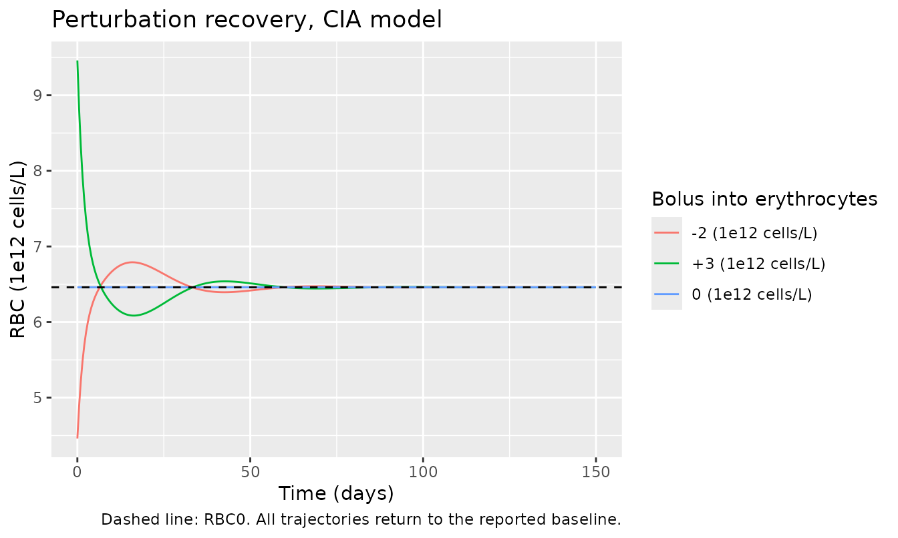
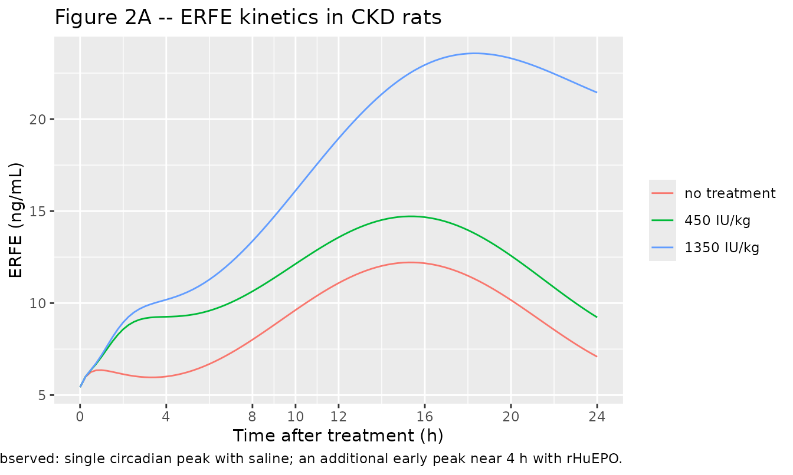
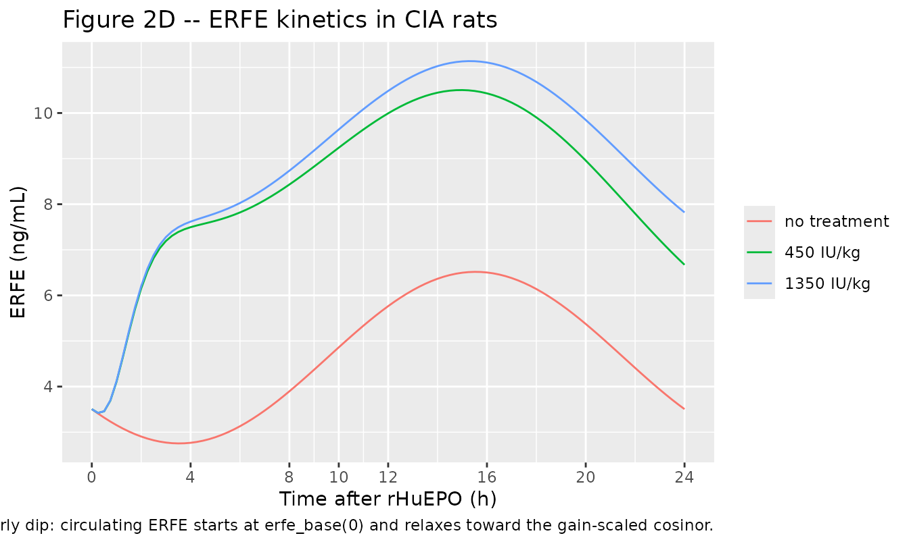
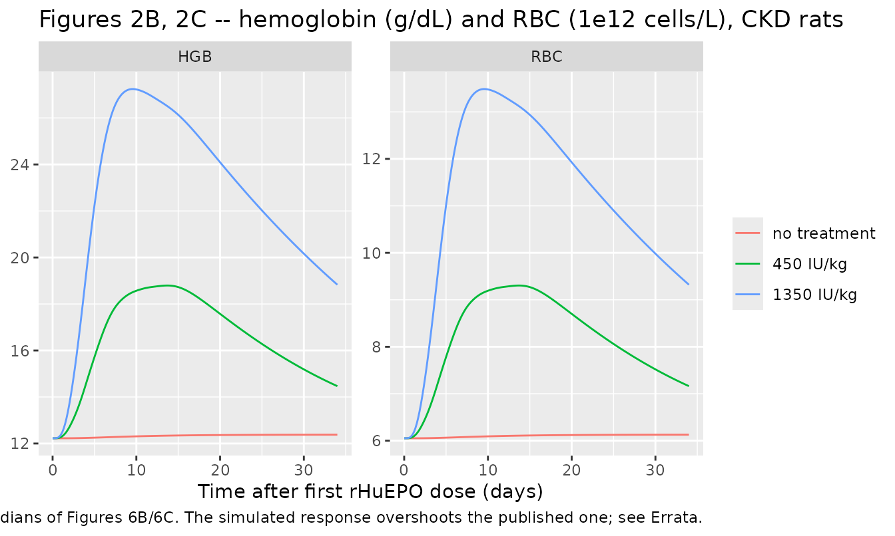
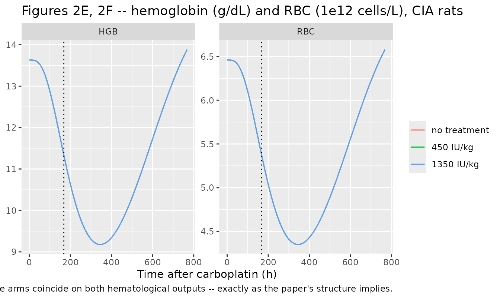
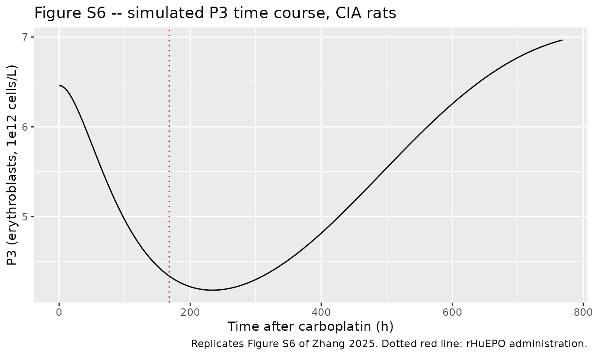
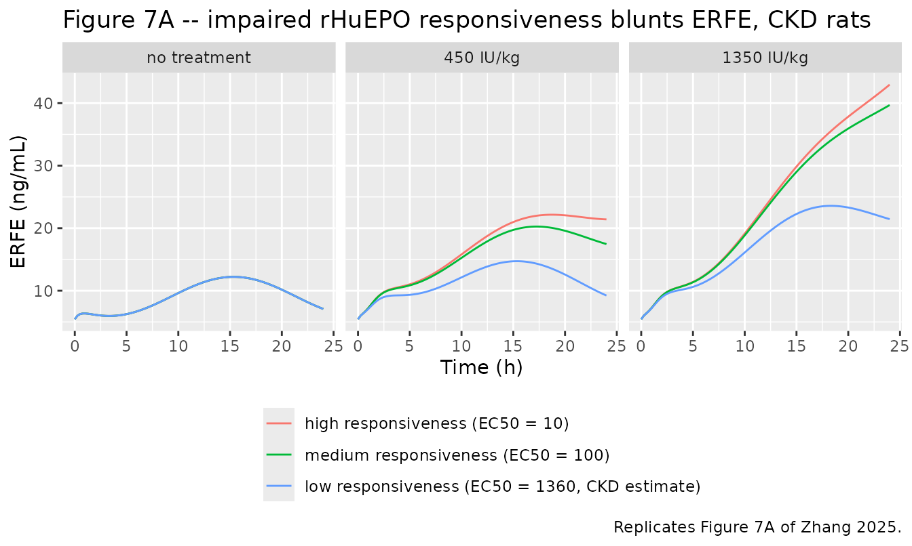
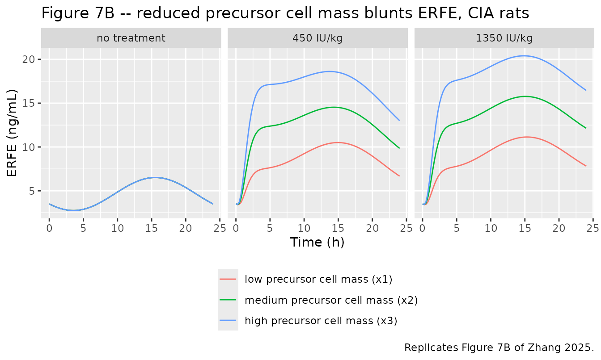

# Erythroferrone in CKD and chemotherapy-induced anemia, rat (Zhang 2025)

``` r

ckd_name <- "Zhang_2025_epoetinAlfa_erythroferrone_ckd_rat"
cia_name <- "Zhang_2025_epoetinAlfa_erythroferrone_cia_rat"

ckd <- rxode2::rxode(readModelDb(ckd_name))
cia <- rxode2::rxode(readModelDb(cia_name))
```

## Model and source

Zhang 2025 develops **two** mechanism-based PK/PD models of
erythroferrone (ERFE) in anemic rats – one per disease model – sharing
an ERFE sub-model but differing in the erythroid-response structure and
in every estimated parameter. Following the nlmixr2lib “replicate the
author’s structure” policy they are packaged as two model files with
this single validation vignette.

| Model file | Disease model | Erythroid structure | Drugs |
|----|----|----|----|
| Zhang_2025_epoetinAlfa_erythroferrone_ckd_rat | Adenine-induced CKD anemia (Figure 1A) | Lifespan-based indirect response, zero-order progenitor input `kIN0` stimulated by rHuEPO | rHuEPO |
| Zhang_2025_epoetinAlfa_erythroferrone_cia_rat | Carboplatin-induced anemia (Figure 1B) | Friberg-Karlsson self-renewing progenitor pool inhibited by carboplatin | rHuEPO + carboplatin |

- Citation: Zhang L, Xu P, Yan X. Mechanism-Based
  Pharmacokinetic/Pharmacodynamic Modeling of Erythroferrone in Anemic
  Rats with Chronic Kidney Disease and Chemotherapy-Induced Anemia: An
  Early Biomarker for Hemoglobin Response and rHuEPO Hyporesponsiveness.
  ACS Pharmacol Transl Sci. 2025;8(1):189-202.
  <doi:10.1021/acsptsci.4c00575>. rHuEPO PK parameters fixed from Fan X,
  Krzyzanski W, Wong RSM, Yan X. J Pharmacol Exp Ther.
  2022;382(1):31-43, as tabulated in Zhang 2025 Supporting Information
  Table S1.
- Article: <https://doi.org/10.1021/acsptsci.4c00575>
- Supplement (open access): <https://doi.org/10.1021/acsptsci.4c00575>
  (“Supporting Information”, `pt4c00575_si_001.pdf`; contains Table S1
  with the fixed PK parameters and Figures S1-S6)

CKD model description:

> Preclinical (rat). Mechanism-based PK/PD model of erythroferrone
> (ERFE), hemoglobin and red blood cells after intravenous recombinant
> human erythropoietin (rHuEPO / epoetin alfa) in adenine-induced
> chronic-kidney-disease anemic rats (Zhang 2025, model structure of
> Figure 1A). rHuEPO PK is a two-compartment model with parallel linear
> and Michaelis-Menten elimination, fixed from prior rat studies (Table
> S1). The erythroid response is a lifespan-based indirect-response
> chain: a zero-order progenitor input kIN0, linearly stimulated by
> rHuEPO concentration and damped by an (RBC0 / RBC)^gamma feedback,
> feeds BFU-E (precursor1) which amplifies AMPN-fold into CFU-E
> (precursor2), amplifies AMPC-fold into erythroblasts (precursor3),
> then reticulocytes (precursor4) and circulating erythrocytes;
> hemoglobin is derived algebraically from the RBC count and the mean
> corpuscular hemoglobin. Circulating ERFE receives two simultaneous
> inputs: a circadian baseline pool driven by a cosinor production rate
> kCINE (mesor RM, amplitude RA, acrophase tpeak), and an
> rHuEPO-stimulated pool whose production is proportional to the
> erythroblast mass (precursor3) and to an Emax / EC50 function of
> rHuEPO concentration, delayed by two transit compartments. Fitted in
> NONMEM 7.5 with interindividual variability fixed to zero, so the
> model is a typical-value mechanism with proportional residual error on
> each of the three observed outputs.

CIA model description:

> Preclinical (rat). Mechanism-based PK/PD model of erythroferrone
> (ERFE), hemoglobin and red blood cells after intravenous recombinant
> human erythropoietin (rHuEPO / epoetin alfa) in carboplatin-induced
> chemotherapy-induced-anemia rats (Zhang 2025, model structure of
> Figure 1B). Two co-modelled drugs, both fixed from prior rat studies
> (Table S1): rHuEPO with two-compartment disposition and parallel
> linear and Michaelis-Menten elimination, and carboplatin with
> three-compartment linear disposition. The erythroid response is a
> Friberg-Karlsson myelosuppression chain: a self-renewing progenitor
> pool (precursor1) proliferating at kprol, inhibited linearly by
> carboplatin concentration and damped by an (RBC0 / RBC)^gamma
> feedback, feeding three transit compartments (precursor2 to
> precursor4) and a circulating erythrocyte pool, with kprol = kcirc =
> ktr = (N + 1) / MTT for N = 3 transits; hemoglobin is derived
> algebraically from the RBC count and the mean corpuscular hemoglobin.
> Circulating ERFE receives two simultaneous inputs: a circadian
> baseline pool driven by a cosinor production rate kCINE (mesor RM,
> amplitude RA, acrophase tpeak), and an rHuEPO-stimulated pool whose
> production is proportional to the erythroblast mass (precursor3) and
> to an Emax / EC50 function of rHuEPO concentration, delayed by two
> transit compartments. Because carboplatin drives precursor3 to a nadir
> by the time rHuEPO is given, the model reproduces the blunted ERFE
> induction that marks rHuEPO hyporesponsiveness. Fitted in NONMEM 7.5
> with interindividual variability fixed to zero, so the model is a
> typical-value mechanism with proportional residual error on each of
> the three observed outputs.

## Population

Both models were fitted to male Sprague-Dawley rats (250-300 g at entry)
at The Chinese University of Hong Kong.

*CKD cohort* (`n = 17`): CKD-associated anemia was induced with adenine
(600 mg/kg once daily by gavage for 6 days, then 300 mg/kg once daily
for 6 days, then 1 week of stabilisation) on a diet supplemented with 1%
(w/w) carbonyl iron. Anemia was confirmed as a fall of more than 2 g/dL
in hemoglobin versus healthy controls, persisting at least 1 month
(Figure S3A,B). Rats then received intravenous rHuEPO (EPOGEN, epoetin
alfa) 1350 IU/kg (`n = 6`) or 450 IU/kg (`n = 6`) three times weekly for
2 weeks, or saline (`n = 5`).

*CIA cohort* (`n = 27`): a single intravenous carboplatin dose of 60
mg/kg produced a rapid fall in RBC and hemoglobin to a nadir near 8 g/dL
on day 14 with recovery by about 1 month (Figure S3C,D). One week later
rats received a single intravenous rHuEPO dose of 1350 IU/kg (`n = 9`)
or 450 IU/kg (`n = 9`), or saline (`n = 9`).

ERFE was assayed at 0, 1, 2, 4, 6, 8, 10, 12 and 24 h after injection by
a validated ELISA; hemoglobin and RBC were measured on a hematology
analyser on the schedules recorded in the `population` metadata. Fitting
used NONMEM 7.5 with **interindividual variability fixed to zero**, so
both packaged models are typical-value mechanisms and every simulation
below is deterministic.

``` r

str(ckd$population, max.level = 1)
#> List of 9
#>  $ species       : chr "rat (Sprague-Dawley, male)"
#>  $ n_subjects    : int 17
#>  $ n_studies     : int 1
#>  $ weight_range  : chr "250-300 g at study entry"
#>  $ sex_female_pct: num 0
#>  $ disease_state : chr "Adenine-induced chronic-kidney-disease anemia. Adenine 600 mg/kg once daily by gavage for 6 days, then 300 mg/k"| __truncated__
#>  $ dose_range    : chr "Intravenous rHuEPO (EPOGEN, epoetin alfa) 1350 IU/kg (n = 6) or 450 IU/kg (n = 6) three times weekly for 2 week"| __truncated__
#>  $ regions       : chr "Hong Kong SAR, China (The Chinese University of Hong Kong)"
#>  $ notes         : chr "ERFE assayed at 0, 1, 2, 4, 6, 8, 10, 12 and 24 h after the first injection by validated ELISA (FineTest ER1573"| __truncated__
```

## Source trace

Every `ini()` value carries an in-file comment naming its source table.
The tables below collect them, together with the equations.

### Equations

| Model component | Encoded as | Source |
|----|----|----|
| rHuEPO two-compartment PK, linear + Michaelis-Menten elimination | `d/dt(central)`, `d/dt(peripheral1)` | Eqs 1-2 |
| Carboplatin three-compartment PK (CIA only) | `d/dt(central_carb)`, `d/dt(peripheral1_carb)`, `d/dt(peripheral2_carb)` | Eqs 3-5 |
| CKD erythroid chain (lifespan IDR, `kIN0` + rHuEPO stimulation + RBC feedback) | `d/dt(precursor1)` … `d/dt(erythrocytes)` | Eqs 6-10 |
| CIA erythroid chain (Friberg self-renewal + carboplatin kill + RBC feedback) | `d/dt(precursor1)` … `d/dt(erythrocytes)` | Eqs 12-16 |
| Hemoglobin from RBC count | `hb <- mch * erythrocytes / 10` (algebraic) | Eqs 11 / 17 (see Errata) |
| Circadian ERFE baseline pool with cosinor input `kCINE` | `d/dt(erfe_base)` | Eq 18 + inline `kCINE` definition |
| rHuEPO-induced ERFE, Emax/EC50 driven, proportional to erythroblast mass | `d/dt(erfe_induced)` | Eq 19 |
| Two transit compartments for the marrow-to-blood release delay | `d/dt(transit1)`, `d/dt(transit2)` | Eqs 20-21 |
| Circulating (measured) ERFE | `d/dt(erfe)` | Eq 22 |
| `kIN0`, initial conditions of the CKD chain | derived in `model()` | Methods, inline expressions after Eq 11 |
| CIA initial conditions (all states = `RBC0`) | `precursor1(0)` … `erythrocytes(0)` | Methods, text after Eq 17 |
| `kprol = kcirc = ktr = (N + 1) / MTT`, `N = 3` | `ktr_rbc <- (ntr + 1) / mtt` | Methods, text after Eq 17 |
| `AMPN = AMPC = 2^5` | `ampn`, `ampc` `fixed(32)` | Methods, text after Eq 11 |
| `kin = kel = ktr` for the ERFE chain | reuse of `ktr` in Eqs 19-22 | Methods, text after Eq 21 |

### Parameters

``` r

ini_tab <- function(ui, label) {
  d <- ui$iniDf
  d <- d[!is.na(d$ntheta), c("name", "est", "fix", "label")]
  d$model <- label
  d
}

dplyr::bind_rows(ini_tab(ckd, "CKD"), ini_tab(cia, "CIA")) |>
  dplyr::mutate(
    est = signif(est, 6),
    fix = ifelse(fix, "fixed", "estimated")
  ) |>
  dplyr::select(model, name, est, fix, label) |>
  dplyr::rename(
    "Model"          = model,
    "Parameter"      = name,
    "Value (ini)"    = est,
    "Status"         = fix,
    "Label / source" = label
  ) |>
  knitr::kable(caption = paste(
    "All ini() entries of both models. Log-transformed entries hold log(value).",
    "The per-parameter source table is in the in-file comment next to each entry:",
    "Table 1 (CKD PD), Table 2 (CIA PD), Table S1 (both PK sets, all fixed)."
  ))
```

| Model | Parameter | Value (ini) | Status | Label / source |
|:---|:---|---:|:---|:---|
| CKD | lvmax | 7.597400 | fixed | rHuEPO Michaelis-Menten capacity Vmax (mIU/h/kg) |
| CKD | lkm | 4.208860 | fixed | rHuEPO Michaelis-Menten affinity Km (mIU/mL) |
| CKD | lvc | 4.113820 | fixed | rHuEPO central volume of distribution VEPO (mL/kg) |
| CKD | lkel | -1.565420 | fixed | rHuEPO linear elimination rate constant kel,EPO (1/h) |
| CKD | lk12 | -1.766090 | fixed | rHuEPO central-to-peripheral rate constant kpt,EPO (1/h) |
| CKD | lk21 | -1.910540 | fixed | rHuEPO peripheral-to-central rate constant ktp,EPO (1/h) |
| CKD | ltrbc | 7.154620 | estimated | Mean lifespan of circulating red blood cells TRBC (h) |
| CKD | ltp | 3.030130 | estimated | Mean lifespan of erythroid precursor cells T (h) |
| CKD | lrbase_rbc | 1.816450 | estimated | Baseline red blood cell count RBC0 (1e12 cells/L) |
| CKD | lmch | 3.005680 | estimated | Mean corpuscular hemoglobin MCH (pg/cell) |
| CKD | lgamma | 1.360980 | estimated | RBC feedback exponent gamma on (RBC0 / RBC) (unitless) |
| CKD | lslope | -4.546900 | estimated | Linear rHuEPO stimulation of progenitor input KEPO (mL/mIU) |
| CKD | ampn | 32.000000 | fixed | BFU-E to CFU-E amplification factor AMPN (cells/cell) |
| CKD | ampc | 32.000000 | fixed | CFU-E to erythroblast amplification factor AMPC (cells/cell) |
| CKD | lkout | 1.036740 | estimated | First-order elimination rate constant of circadian ERFE Kout (1/h) |
| CKD | lrm | 1.981000 | estimated | Mesor (mean baseline) of the ERFE circadian rhythm RM (ng/mL) |
| CKD | lra | 0.920283 | estimated | Amplitude of the ERFE circadian rhythm RA (ng/mL) |
| CKD | ltacro | 2.701360 | estimated | Acrophase (peak time) of the ERFE circadian rhythm tpeak (h) |
| CKD | lemax | 3.854390 | estimated | Maximum ERFE induction by rHuEPO per erythroblast Emax ((ng/mL)/(1e12 cells/L)) |
| CKD | lec50 | 7.215240 | estimated | rHuEPO concentration giving 50% of maximum ERFE induction EC50 (mIU/mL) |
| CKD | lktr | 0.810930 | estimated | Transit rate constant of the ERFE release chain Ktr (1/h) |
| CKD | propSd_erythrocytes | 0.070360 | estimated | Proportional residual error on RBC (fraction; CV 7.0%) |
| CKD | propSd_hb | 0.101500 | estimated | Proportional residual error on HGB (fraction; CV 10.1%) |
| CKD | propSd_erfe | 0.124100 | estimated | Proportional residual error on ERFE (fraction; CV 12.4%) |
| CIA | lvmax | 7.597400 | fixed | rHuEPO Michaelis-Menten capacity Vmax (mIU/h/kg) |
| CIA | lkm | 4.208860 | fixed | rHuEPO Michaelis-Menten affinity Km (mIU/mL) |
| CIA | lvc | 4.113820 | fixed | rHuEPO central volume of distribution VEPO (mL/kg) |
| CIA | lkel | -1.565420 | fixed | rHuEPO linear elimination rate constant kel,EPO (1/h) |
| CIA | lk12 | -1.766090 | fixed | rHuEPO central-to-peripheral rate constant kpt,EPO (1/h) |
| CIA | lk21 | -1.910540 | fixed | rHuEPO peripheral-to-central rate constant ktp,EPO (1/h) |
| CIA | lvc_carb | 4.999910 | fixed | Carboplatin central volume of distribution Vcarb (mL/kg) |
| CIA | lkel_carb | 1.025320 | fixed | Carboplatin linear elimination rate constant kel,carb (1/h) |
| CIA | lk12_carb | -2.603690 | fixed | Carboplatin central-to-first-peripheral rate constant k12 (1/h) |
| CIA | lk21_carb | -0.855666 | fixed | Carboplatin first-peripheral-to-central rate constant k21 (1/h) |
| CIA | lk13_carb | 1.433650 | fixed | Carboplatin central-to-second-peripheral rate constant k13 (1/h) |
| CIA | lk31_carb | 1.724730 | fixed | Carboplatin second-peripheral-to-central rate constant k31 (1/h) |
| CIA | lmtt | 5.298320 | estimated | Mean transit time of erythroid precursor maturation MTT (h) |
| CIA | lrbase_rbc | 1.865630 | estimated | Baseline red blood cell count RBC0 (1e12 cells/L) |
| CIA | lmch | 3.049270 | estimated | Mean corpuscular hemoglobin MCH (pg/cell) |
| CIA | lgamma | -1.666010 | estimated | RBC feedback exponent gamma on (RBC0 / RBC) (unitless) |
| CIA | lslope | -1.760260 | estimated | Linear carboplatin killing effect Kcarb on the precursor pool (mL/ug) |
| CIA | lkout | 0.148420 | estimated | First-order elimination rate constant of circadian ERFE Kout (1/h) |
| CIA | lrm | 2.200550 | estimated | Mesor (mean baseline) of the ERFE circadian rhythm RM (ng/mL) |
| CIA | lra | 1.305630 | estimated | Amplitude of the ERFE circadian rhythm RA (ng/mL) |
| CIA | ltacro | 2.714690 | estimated | Acrophase (peak time) of the ERFE circadian rhythm tpeak (h) |
| CIA | lemax | 0.148420 | estimated | Maximum ERFE induction by rHuEPO per erythroblast Emax ((ng/mL)/(1e12 cells/L)) |
| CIA | lec50 | 4.836280 | estimated | rHuEPO concentration giving 50% of maximum ERFE induction EC50 (mIU/mL) |
| CIA | lktr | 0.815365 | estimated | Transit rate constant of the ERFE release chain Ktr (1/h) |
| CIA | propSd_erythrocytes | 0.086490 | estimated | Proportional residual error on RBC (fraction; CV 8.6%) |
| CIA | propSd_hb | 0.122900 | estimated | Proportional residual error on HGB (fraction; CV 12.3%) |
| CIA | propSd_erfe | 0.148300 | estimated | Proportional residual error on ERFE (fraction; CV 14.8%) |

All ini() entries of both models. Log-transformed entries hold
log(value). The per-parameter source table is in the in-file comment
next to each entry: Table 1 (CKD PD), Table 2 (CIA PD), Table S1 (both
PK sets, all fixed). {.table}

### Units and dimensional analysis

Mechanistic models mix per-kg volumes, mass concentrations and
fractional rate constants, so every ODE term is checked below. Two unit
readings are **not** stated by the paper and were resolved by
dimensional analysis; both are recorded in the Errata.

| Symbol | Units | Note |
|----|----|----|
| `central`, `peripheral1` | mIU/kg | rHuEPO amount per kg; `VEPO` is reported per kg (Table S1), so amounts must be too |
| `Cc = central / vc` | mIU/mL | 1350 IU/kg = 1.35e6 mIU/kg gives `Cc(0+)` ~2.2e4 mIU/mL |
| `vmax` | mIU/h/kg | matches `d/dt(central)` = mIU/h/kg |
| `km * vc` | mIU/kg | converts `Km` (mIU/mL) into the amount scale of `central` |
| `central_carb` etc. | ug/kg | 60 mg/kg = 6e4 ug/kg |
| `Cc_carb = central_carb / vc_carb` | ug/mL (= mg/L) | `Vcarb` 148.4 mL/kg gives `Cc_carb(0+)` ~404 ug/mL |
| `slope` (CKD, paper `KEPO`) | mL/mIU | `slope * Cc` must be dimensionless inside `(1 + slope * Cc)`; the paper reports `KEPO` without units |
| `slope` (CIA, paper `Kcarb`) | mL/ug | `slope * Cc_carb` must be dimensionless inside `(1 - slope * Cc_carb)`; Table 2 prints “h-1”, which cannot be right |
| `precursor1` … `erythrocytes` | 1e12 cells/L | same scale as `RBC0` |
| `tp`, `trbc`, `mtt` | h | lifespans / mean transit time |
| `gamma` | unitless | exponent on `(rbc0 / erythrocytes)` |
| `mch` | pg/cell | `hb = mch * erythrocytes / 10` gives g/dL |
| `erfe_base`, `erfe_induced`, `transit1`, `transit2`, `erfe` | ng/mL | ERFE concentration scale |
| `kout`, `ktr` | 1/h | first-order rate constants |
| `emax` | (ng/mL)/(1e12 cells/L) | Table 1/2 print “cell-1”; the term `ktr * precursor3 * emax` must give ng/mL/h |
| `ec50` | mIU/mL | same scale as `Cc` |
| `tacro` (paper `tpeak`) | h | acrophase referenced to the model time origin |
| `wcirc = 2*pi/24` | 1/h | 24 h circadian period |

``` r

# Numeric confirmation of the two unit readings resolved above.
p_ckd <- setNames(ckd$theta, names(ckd$theta))
cc0_epo  <- 1.35e6 / exp(p_ckd[["lvc"]])
cc0_carb <- 6e4 / exp(rxode2::rxode(readModelDb(cia_name))$theta[["lvc_carb"]])

data.frame(
  quantity = c("rHuEPO Cc(0+) after 1350 IU/kg (mIU/mL)",
               "slope * Cc(0+) in the CKD stimulation term (unitless)",
               "carboplatin Cc(0+) after 60 mg/kg (ug/mL)",
               "slope * Cc_carb(0+) in the CIA inhibition term (unitless)"),
  value = signif(c(cc0_epo,
                   exp(p_ckd[["lslope"]]) * cc0_epo,
                   cc0_carb,
                   exp(rxode2::rxode(readModelDb(cia_name))$theta[["lslope"]]) * cc0_carb), 4)
) |>
  dplyr::rename("Quantity" = quantity, "Value" = value) |>
  knitr::kable(caption = paste(
    "Both drug-effect terms are dimensionless, as the printed equations require.",
    "The CIA inhibition term exceeds 1 immediately after the carboplatin bolus,",
    "so `1 - slope * Cc_carb` is strongly negative and the progenitor pool is",
    "killed rather than merely slowed -- the intended Friberg behaviour for a",
    "cytotoxic with a 15-minute half-life."
  ))
```

| Quantity                                                   |    Value |
|:-----------------------------------------------------------|---------:|
| rHuEPO Cc(0+) after 1350 IU/kg (mIU/mL)                    | 22070.00 |
| slope \* Cc(0+) in the CKD stimulation term (unitless)     |   233.90 |
| carboplatin Cc(0+) after 60 mg/kg (ug/mL)                  |   404.30 |
| slope \* Cc_carb(0+) in the CIA inhibition term (unitless) |    69.54 |

Both drug-effect terms are dimensionless, as the printed equations
require. The CIA inhibition term exceeds 1 immediately after the
carboplatin bolus, so `1 - slope * Cc_carb` is strongly negative and the
progenitor pool is killed rather than merely slowed – the intended
Friberg behaviour for a cytotoxic with a 15-minute half-life. {.table}

## Structural validation

No dose is administered in this section; these checks exercise the
mechanism alone. Helper: a deterministic solve. Neither model declares
`eta` terms, so `omega = NA` must **not** be passed (it errors when
there is no IIV to suppress). Observation rows are placed on the `erfe`
ODE state; rxode2 returns every other state and every algebraic
observable (`hb`, `Cc`) as a column at those rows.

``` r

solve_det <- function(mod, ev) {
  rxode2::rxSolve(mod, ev, useLinCmt = FALSE, returnType = "data.frame")
}

obs_at <- function(ev, times) rxode2::et(ev, times, cmt = "erfe")
no_dose <- rxode2::et(amt = 0, cmt = "central", time = 0)
```

### 1. Steady-state hold

The CIA chain has `kprol = kcirc = ktr` and all initial conditions equal
to `RBC0`, so it is at an exact steady state and must not drift at all.
The CKD chain’s `kIN0` involves an unreported reticulocyte lifespan
`TRET` (Errata), so a small drift is expected and is quantified here
rather than hidden.

``` r

ss_ckd <- solve_det(ckd, obs_at(no_dose, seq(0, 34 * 24, by = 4)))
ss_cia <- solve_det(cia, obs_at(no_dose, seq(0, 32 * 24, by = 4)))

drift <- function(s, model, horizon) {
  data.frame(
    model = model,
    horizon = horizon,
    hb_start = signif(s$hb[1], 5),
    hb_end   = signif(s$hb[nrow(s)], 5),
    hb_drift_pct = signif(100 * (s$hb[nrow(s)] / s$hb[1] - 1), 3),
    p1_drift_pct = signif(100 * (s$precursor1[nrow(s)] / s$precursor1[1] - 1), 3)
  )
}

dplyr::bind_rows(
  drift(ss_ckd, "CKD", "34 days"),
  drift(ss_cia, "CIA", "32 days")
) |>
  dplyr::rename(
    "Model" = model, "Horizon" = horizon,
    "HGB start (g/dL)" = hb_start, "HGB end (g/dL)" = hb_end,
    "HGB drift (%)" = hb_drift_pct, "precursor1 drift (%)" = p1_drift_pct
  ) |>
  knitr::kable(caption = "Undosed baseline hold.")
```

| Model | Horizon | HGB start (g/dL) | HGB end (g/dL) | HGB drift (%) | precursor1 drift (%) |
|:---|:---|---:|---:|---:|---:|
| CKD | 34 days | 12.225 | 12.380 | 1.26 | 1.38 |
| CIA | 32 days | 13.631 | 13.631 | 0.00 | 0.00 |

Undosed baseline hold. {.table}

``` r


# The CIA chain must be stationary to solver precision.
stopifnot(abs(ss_cia$hb[nrow(ss_cia)] / ss_cia$hb[1] - 1) < 1e-5)
# The CKD chain's TRET assumption costs at most ~2% over 34 days.
stopifnot(abs(ss_ckd$hb[nrow(ss_ckd)] / ss_ckd$hb[1] - 1) < 0.02)
```

Baseline hemoglobin equals `MCH * RBC0 / 10` in the CIA model (all
states start at `RBC0`) and `MCH * RBC0 * TRBC / (TRBC + T) / 10` in the
CKD model, where the printed initial conditions split the total
circulating count `RBC0` into reticulocytes (`precursor4`) and mature
erythrocytes.

``` r

data.frame(
  model = c("CKD", "CIA"),
  hb_model = signif(c(ss_ckd$hb[1], ss_cia$hb[1]), 4),
  hb_mch_rbc0 = signif(c(exp(ckd$theta[["lmch"]]) * exp(ckd$theta[["lrbase_rbc"]]) / 10,
                         exp(cia$theta[["lmch"]]) * exp(cia$theta[["lrbase_rbc"]]) / 10), 4),
  published_fig2 = c("~11.8-12.5 (Fig 2B, no treatment)", "~13.5 (Fig 6E at t = 0)")
) |>
  dplyr::rename(
    "Model" = model, "Simulated HGB(0) (g/dL)" = hb_model,
    "MCH*RBC0/10 (g/dL)" = hb_mch_rbc0, "Published" = published_fig2
  ) |>
  knitr::kable(caption = "Baseline hemoglobin.")
```

| Model | Simulated HGB(0) (g/dL) | MCH\*RBC0/10 (g/dL) | Published |
|:---|---:|---:|:---|
| CKD | 12.23 | 12.42 | ~11.8-12.5 (Fig 2B, no treatment) |
| CIA | 13.63 | 13.63 | ~13.5 (Fig 6E at t = 0) |

Baseline hemoglobin. {.table}

### 2. Mass balance of the circadian ERFE sub-model

Equation 18 was constructed so that `erfe_base` follows the cosinor
`RM + RA * cos(2*pi/24 * (t - tpeak))` exactly. Circulating `erfe` (Eq
22) then receives `kout * erfe_base` and is removed at `kel = ktr`, so
at quasi-steady state its mesor is scaled by the **gain** `kout / ktr` –
a closed-form prediction that the numerical solution must match. This is
the single most informative check on the ERFE arm, because it pins
`kout`, `ktr`, `RM`, `RA` and the choice `kel = ktr` simultaneously.

``` r

cosinor_check <- function(mod, label) {
  th <- mod$theta
  rm <- exp(th[["lrm"]]); ra <- exp(th[["lra"]])
  tac <- exp(th[["ltacro"]]); kout <- exp(th[["lkout"]]); ktr <- exp(th[["lktr"]])
  # third circadian cycle, well past the initial-condition transient
  s <- solve_det(mod, obs_at(no_dose, seq(48, 96, by = 0.1)))
  data.frame(
    model = label,
    base_mesor_num = signif((max(s$erfe_base) + min(s$erfe_base)) / 2, 5),
    base_mesor_ana = signif(rm, 5),
    base_amp_num = signif((max(s$erfe_base) - min(s$erfe_base)) / 2, 5),
    base_amp_ana = signif(ra, 5),
    gain = signif(kout / ktr, 4),
    erfe_mesor_num = signif((max(s$erfe) + min(s$erfe)) / 2, 5),
    erfe_mesor_ana = signif(rm * kout / ktr, 5),
    erfe_peak_h = (s$time[which.max(s$erfe)]) %% 24,
    tacro_h = tac
  )
}

cos_tab <- dplyr::bind_rows(cosinor_check(ckd, "CKD"), cosinor_check(cia, "CIA"))
cos_tab |>
  dplyr::rename(
    "Model" = model,
    "erfe_base mesor (num)" = base_mesor_num, "= RM" = base_mesor_ana,
    "erfe_base amp (num)" = base_amp_num, "= RA" = base_amp_ana,
    "gain kout/ktr" = gain,
    "erfe mesor (num)" = erfe_mesor_num, "= RM*gain" = erfe_mesor_ana,
    "erfe peak (h of cycle)" = erfe_peak_h, "= tpeak" = tacro_h
  ) |>
  knitr::kable(caption = paste(
    "Analytic vs numerical circadian ERFE. The latent pool reproduces the",
    "cosinor mesor and amplitude exactly; circulating ERFE is the cosinor",
    "scaled by the gain kout/ktr and peaks at the acrophase."
  ))
```

| Model | erfe_base mesor (num) | = RM | erfe_base amp (num) | = RA | gain kout/ktr | erfe mesor (num) | = RM\*gain | erfe peak (h of cycle) | = tpeak |
|:---|---:|---:|---:|---:|---:|---:|---:|---:|---:|
| CKD | 7.25 | 7.25 | 2.51 | 2.51 | 1.2530 | 9.0867 | 9.0867 | 15.3 | 14.9 |
| CIA | 9.03 | 9.03 | 3.69 | 3.69 | 0.5133 | 4.6349 | 4.6349 | 15.5 | 15.1 |

Analytic vs numerical circadian ERFE. The latent pool reproduces the
cosinor mesor and amplitude exactly; circulating ERFE is the cosinor
scaled by the gain kout/ktr and peaks at the acrophase. {.table}

``` r


stopifnot(
  all(abs(cos_tab$base_mesor_num / cos_tab$base_mesor_ana - 1) < 1e-3),
  all(abs(cos_tab$base_amp_num   / cos_tab$base_amp_ana   - 1) < 1e-3),
  all(abs(cos_tab$erfe_mesor_num / cos_tab$erfe_mesor_ana - 1) < 5e-3),
  all(abs(cos_tab$erfe_peak_h - cos_tab$tacro_h) < 1)
)
```

The gain differs in direction between the two models –
`2.82 / 2.25 = 1.25` in CKD but `1.16 / 2.26 = 0.51` in CIA – and it is
what reconciles the two very different mesors (`RM` 7.25 vs 9.03 ng/mL)
with the two similar observed baselines (about 5.5 and 3.3 ng/mL at time
zero). This is direct evidence for the paper’s stated constraint
`kel = ktr` in Eq 22.

### 3. Progenitor flux balance at baseline

At the pre-dose steady state the flux into each pool must equal the flux
out. Checked symbolically for the CKD chain, where the amplification
factors make the balance non-trivial.

``` r

th <- ckd$theta
tp   <- exp(th[["ltp"]])
trbc <- exp(th[["ltrbc"]])
rbc0 <- exp(th[["lrbase_rbc"]])
ampn <- th[["ampn"]]
ampc <- th[["ampc"]]

kin0 <- rbc0 / ((trbc + tp) * ampn * ampc)
p1   <- rbc0 * tp / ((trbc + tp) * ampc * ampn)
p2   <- rbc0 * tp / ((trbc + tp) * ampc)
p3   <- rbc0 * tp / (trbc + tp)
p4   <- p3
rbc  <- rbc0 - p3

flux <- data.frame(
  pool = c("precursor1", "precursor2", "precursor3", "precursor4", "erythrocytes"),
  flux_in  = c(kin0,          ampn * p1 / tp, ampc * p2 / tp, p3 / tp, p4 / tp),
  flux_out = c(p1 / tp,       p2 / tp,        p3 / tp,        p4 / tp, rbc / trbc)
)
flux$imbalance <- flux$flux_in - flux$flux_out
flux$rel_imbalance <- flux$imbalance / flux$flux_out

flux |>
  dplyr::mutate(dplyr::across(where(is.numeric), ~ signif(.x, 4))) |>
  dplyr::rename(
    "Pool" = pool, "Flux in (1e12 cells/L/h)" = flux_in,
    "Flux out (1e12 cells/L/h)" = flux_out,
    "Imbalance" = imbalance, "Relative imbalance" = rel_imbalance
  ) |>
  knitr::kable(caption = paste(
    "CKD chain flux balance at the printed initial conditions. Every pool",
    "balances exactly except precursor1, whose small residual is the TRET",
    "assumption discussed in the Errata (the RBC feedback term is 1.065 rather",
    "than 1 at t = 0 because RBC0 exceeds erythrocytes(0))."
  ))
```

| Pool | Flux in (1e12 cells/L/h) | Flux out (1e12 cells/L/h) | Imbalance | Relative imbalance |
|:---|---:|---:|---:|---:|
| precursor1 | 0.0000046 | 0.0000046 | 0 | 0 |
| precursor2 | 0.0001478 | 0.0001478 | 0 | 0 |
| precursor3 | 0.0047280 | 0.0047280 | 0 | 0 |
| precursor4 | 0.0047280 | 0.0047280 | 0 | 0 |
| erythrocytes | 0.0047280 | 0.0047280 | 0 | 0 |

CKD chain flux balance at the printed initial conditions. Every pool
balances exactly except precursor1, whose small residual is the TRET
assumption discussed in the Errata (the RBC feedback term is 1.065
rather than 1 at t = 0 because RBC0 exceeds erythrocytes(0)). {.table}

``` r


# Every pool downstream of precursor1 must balance to machine precision.
stopifnot(all(abs(flux$rel_imbalance[-1]) < 1e-12))
# precursor1 residual is bounded by the feedback offset at t = 0.
stopifnot(abs(flux$rel_imbalance[1]) < 0.01)
```

### 4. Perturbation recovery

The initial conditions are set inside `model()`, so `inits =` is
ignored; the pools are displaced with a bolus into the `erythrocytes`
compartment instead (a transfusion / phlebotomy analogue). A single
stable attractor at `RBC0` is expected.

``` r

perturb <- function(mod, amt) {
  ev <- rxode2::et(amt = amt, cmt = "erythrocytes", time = 0) |>
    obs_at(seq(0, 150 * 24, by = 12))
  s <- solve_det(mod, ev)
  data.frame(time_d = s$time / 24, rbc = s$erythrocytes,
             perturbation = paste0(ifelse(amt > 0, "+", ""), amt, " (1e12 cells/L)"))
}

pert <- dplyr::bind_rows(
  perturb(cia, -2), perturb(cia, 0), perturb(cia, 3)
)

ggplot(pert, aes(time_d, rbc, colour = perturbation)) +
  geom_line() +
  geom_hline(yintercept = exp(cia$theta[["lrbase_rbc"]]), linetype = "dashed") +
  labs(x = "Time (days)", y = "RBC (1e12 cells/L)",
       colour = "Bolus into erythrocytes",
       title = "Perturbation recovery, CIA model",
       caption = "Dashed line: RBC0. All trajectories return to the reported baseline.")
```



``` r


recov <- pert |>
  dplyr::group_by(perturbation) |>
  dplyr::summarise(final = dplyr::last(rbc), .groups = "drop")
stopifnot(all(abs(recov$final / exp(cia$theta[["lrbase_rbc"]]) - 1) < 1e-3))
```

## Replicate published figures

``` r

# rHuEPO doses in mIU/kg (1350 IU/kg = 1.35e6 mIU/kg).
epo_dose <- c("no treatment" = 0, "450 IU/kg" = 4.5e5, "1350 IU/kg" = 1.35e6)

# CKD: three times weekly for 2 weeks (Mon/Wed/Fri pattern), Methods.
ckd_dose_times <- c(0, 2, 4, 7, 9, 11) * 24

ckd_events <- function(amt, times) {
  ev <- rxode2::et(amt = 0, cmt = "central", time = 0)
  if (amt > 0) for (tt in ckd_dose_times) ev <- rxode2::et(ev, amt = amt, cmt = "central", time = tt)
  obs_at(ev, times)
}

# CIA: carboplatin 60 mg/kg = 6e4 ug/kg at t = 0, rHuEPO one week later.
t_epo <- 168
cia_events <- function(amt, times) {
  ev <- rxode2::et(amt = 6e4, cmt = "central_carb", time = 0)
  if (amt > 0) ev <- rxode2::et(ev, amt = amt, cmt = "central", time = t_epo)
  obs_at(ev, times)
}

sim_arms <- function(mod, evfun, times) {
  purrr_free <- lapply(names(epo_dose), function(nm) {
    s <- solve_det(mod, evfun(epo_dose[[nm]], times))
    s$arm <- nm
    s
  })
  out <- dplyr::bind_rows(purrr_free)
  out$arm <- factor(out$arm, levels = names(epo_dose))
  out
}
```

### Figure 2A – ERFE over 24 h after the first rHuEPO dose, CKD rats

``` r

ckd_24 <- sim_arms(ckd, ckd_events, seq(0, 24, by = 0.25))

ggplot(ckd_24, aes(time, erfe, colour = arm)) +
  geom_line() +
  scale_x_continuous(breaks = c(0, 4, 8, 10, 12, 16, 20, 24)) +
  labs(x = "Time after treatment (h)", y = "ERFE (ng/mL)", colour = NULL,
       title = "Figure 2A -- ERFE kinetics in CKD rats",
       caption = paste("Replicates Figure 2A of Zhang 2025 (and the model curves of Figure 7A).",
                       "Observed: single circadian peak with saline; an additional early",
                       "peak near 4 h with rHuEPO."))
```



### Figure 2D – ERFE over 24 h after rHuEPO, CIA rats

Time is re-referenced to the rHuEPO injection at 168 h so the axis
matches the published panel.

``` r

cia_24 <- sim_arms(cia, cia_events, t_epo + seq(0, 24, by = 0.25))
cia_24$t_rel <- cia_24$time - t_epo

ggplot(cia_24, aes(t_rel, erfe, colour = arm)) +
  geom_line() +
  scale_x_continuous(breaks = c(0, 4, 8, 10, 12, 16, 20, 24)) +
  labs(x = "Time after rHuEPO (h)", y = "ERFE (ng/mL)", colour = NULL,
       title = "Figure 2D -- ERFE kinetics in CIA rats",
       caption = paste("Replicates Figure 2D of Zhang 2025 (and the model curves of Figure 7B).",
                       "The saline arm shows the characteristic early dip: circulating ERFE",
                       "starts at erfe_base(0) and relaxes toward the gain-scaled cosinor."))
```



### Figures 2B, 2C / 6B, 6C – long-term hemoglobin and RBC, CKD rats

``` r

ckd_long <- sim_arms(ckd, ckd_events, seq(0, 34 * 24, by = 4))

ckd_long |>
  dplyr::select(time, arm, HGB = hb, RBC = erythrocytes) |>
  tidyr::pivot_longer(c(HGB, RBC), names_to = "output", values_to = "value") |>
  ggplot(aes(time / 24, value, colour = arm)) +
  geom_line() +
  facet_wrap(~output, scales = "free_y") +
  labs(x = "Time after first rHuEPO dose (days)", y = NULL, colour = NULL,
       title = "Figures 2B, 2C -- hemoglobin (g/dL) and RBC (1e12 cells/L), CKD rats",
       caption = paste("Replicates Figures 2B/2C and the pcVPC medians of Figures 6B/6C.",
                       "The simulated response overshoots the published one; see Errata."))
```



### Figures 2E, 2F / 6E, 6F – long-term hemoglobin and RBC, CIA rats

``` r

cia_long <- sim_arms(cia, cia_events, seq(0, 32 * 24, by = 4))

cia_long |>
  dplyr::select(time, arm, HGB = hb, RBC = erythrocytes) |>
  tidyr::pivot_longer(c(HGB, RBC), names_to = "output", values_to = "value") |>
  ggplot(aes(time, value, colour = arm)) +
  geom_line() +
  geom_vline(xintercept = t_epo, linetype = "dotted") +
  facet_wrap(~output, scales = "free_y") +
  labs(x = "Time after carboplatin (h)", y = NULL, colour = NULL,
       title = "Figures 2E, 2F -- hemoglobin (g/dL) and RBC (1e12 cells/L), CIA rats",
       caption = paste("Replicates Figures 2E/2F and the pcVPC medians of Figures 6E/6F.",
                       "Dotted line: rHuEPO injection at 168 h. rHuEPO has no effect on",
                       "proliferation in the CIA model (Figure 1B), so the three arms",
                       "coincide on both hematological outputs -- exactly as the paper's",
                       "structure implies."))
```



### Figure S6 – simulated erythroblast (P3) time course, CIA rats

The paper’s mechanistic claim is that carboplatin drives the
ERFE-producing erythroblast pool to a nadir *by the time rHuEPO is
given*, blunting the ERFE response. Figure S6 is the direct test.

``` r

p3 <- solve_det(cia, cia_events(0, seq(0, 770, by = 4)))

ggplot(p3, aes(time, precursor3)) +
  geom_line() +
  geom_vline(xintercept = t_epo, linetype = "dotted", colour = "red") +
  labs(x = "Time after carboplatin (h)", y = "P3 (erythroblasts, 1e12 cells/L)",
       title = "Figure S6 -- simulated P3 time course, CIA rats",
       caption = "Replicates Figure S6 of Zhang 2025. Dotted red line: rHuEPO administration.")
```



``` r


data.frame(
  quantity = c("P3 at t = 0", "P3 nadir", "nadir time (h)",
               "P3 at rHuEPO dose (168 h)", "P3 at 770 h"),
  simulated = signif(c(p3$precursor3[1], min(p3$precursor3),
                       p3$time[which.min(p3$precursor3)],
                       p3$precursor3[p3$time == t_epo],
                       p3$precursor3[nrow(p3)]), 4),
  published_figS6 = c("~6.95", "~4.2", "~230-260", "~4.25", "~6.95")
) |>
  dplyr::rename("Quantity" = quantity, "Simulated" = simulated,
                "Figure S6 (digitised)" = published_figS6) |>
  knitr::kable(caption = "Simulated vs published P3 trajectory (published values read off Figure S6).")
```

| Quantity                  | Simulated | Figure S6 (digitised) |
|:--------------------------|----------:|:----------------------|
| P3 at t = 0               |     6.460 | ~6.95                 |
| P3 nadir                  |     4.179 | ~4.2                  |
| nadir time (h)            |   232.000 | ~230-260              |
| P3 at rHuEPO dose (168 h) |     4.337 | ~4.25                 |
| P3 at 770 h               |     6.967 | ~6.95                 |

Simulated vs published P3 trajectory (published values read off Figure
S6). {.table}

### Figure 7A – ERFE at three levels of rHuEPO responsiveness, CKD rats

Figure 7A varies `EC50` over the three levels the paper names – high
(10), medium (100) and low (1360, the CKD estimate) – with every other
parameter at its estimate. The ordering and shape reproduce; the
*amplitudes* inherit the CKD erythroid over-prediction documented in the
Errata, because rHuEPO stimulation grows `precursor3` and ERFE
production is proportional to it.

``` r

ec50_levels <- c("high responsiveness (EC50 = 10)" = 10,
                 "medium responsiveness (EC50 = 100)" = 100,
                 "low responsiveness (EC50 = 1360, CKD estimate)" = 1360)

fig7a <- lapply(names(epo_dose), function(arm) {
  lapply(names(ec50_levels), function(lev) {
    s <- rxode2::rxSolve(
      ckd, ckd_events(epo_dose[[arm]], seq(0, 24, by = 0.25)),
      params = c(lec50 = log(ec50_levels[[lev]])),
      useLinCmt = FALSE, returnType = "data.frame"
    )
    s$arm <- arm; s$responsiveness <- lev
    s
  }) |> dplyr::bind_rows()
}) |> dplyr::bind_rows()

fig7a$arm <- factor(fig7a$arm, levels = names(epo_dose))
fig7a$responsiveness <- factor(fig7a$responsiveness, levels = names(ec50_levels))

ggplot(fig7a, aes(time, erfe, colour = responsiveness)) +
  geom_line() +
  facet_wrap(~arm) +
  theme(legend.position = "bottom", legend.direction = "vertical") +
  labs(x = "Time (h)", y = "ERFE (ng/mL)", colour = NULL,
       title = "Figure 7A -- impaired rHuEPO responsiveness blunts ERFE, CKD rats",
       caption = "Replicates Figure 7A of Zhang 2025.")
```



### Figure 7B – ERFE at three levels of erythroblast mass, CIA rats

ERFE production enters Eq 19 as
`ktr * precursor3 * emax * Cc / (ec50 + Cc)`, so multiplying `A(P3)` by
*k* – the paper’s stated manipulation – is algebraically identical to
multiplying `Emax` by *k*. That is how the three precursor-mass levels
are produced here. rHuEPO does not act on proliferation in the CIA
model, so this panel is free of the CKD over-prediction.

``` r

mass_levels <- c("low precursor cell mass (x1)" = 1,
                 "medium precursor cell mass (x2)" = 2,
                 "high precursor cell mass (x3)" = 3)
emax_cia <- exp(cia$theta[["lemax"]])

fig7b <- lapply(names(epo_dose), function(arm) {
  lapply(names(mass_levels), function(lev) {
    s <- rxode2::rxSolve(
      cia, cia_events(epo_dose[[arm]], t_epo + seq(0, 24, by = 0.25)),
      params = c(lemax = log(emax_cia * mass_levels[[lev]])),
      useLinCmt = FALSE, returnType = "data.frame"
    )
    s$t_rel <- s$time - t_epo
    s$arm <- arm; s$mass <- lev
    s
  }) |> dplyr::bind_rows()
}) |> dplyr::bind_rows()

fig7b$arm <- factor(fig7b$arm, levels = names(epo_dose))
fig7b$mass <- factor(fig7b$mass, levels = names(mass_levels))

ggplot(fig7b, aes(t_rel, erfe, colour = mass)) +
  geom_line() +
  facet_wrap(~arm) +
  theme(legend.position = "bottom", legend.direction = "vertical") +
  labs(x = "Time (h)", y = "ERFE (ng/mL)", colour = NULL,
       title = "Figure 7B -- reduced precursor cell mass blunts ERFE, CIA rats",
       caption = "Replicates Figure 7B of Zhang 2025.")
```



## Comparison against published values

Zhang 2025 reports no NCA table, so PKNCA is not the right validation
for either model (both are mechanistic turnover models with no
drug-concentration observations at all). The comparison below is against
values read off the published figures. Figure-digitised references carry
roughly +/- 0.5 units of reading error, so a 20% tolerance is used.

``` r

ckd_1350 <- ckd_long[ckd_long$arm == "1350 IU/kg", ]
ckd_450  <- ckd_long[ckd_long$arm == "450 IU/kg", ]
ckd_none <- ckd_long[ckd_long$arm == "no treatment", ]
ckd24_1350 <- ckd_24[ckd_24$arm == "1350 IU/kg", ]
ckd24_450  <- ckd_24[ckd_24$arm == "450 IU/kg", ]
ckd24_none <- ckd_24[ckd_24$arm == "no treatment", ]
cia24_1350 <- cia_24[cia_24$arm == "1350 IU/kg", ]
cia24_none <- cia_24[cia_24$arm == "no treatment", ]
cia_none   <- cia_long[cia_long$arm == "no treatment", ]

at <- function(d, tt, col) d[[col]][which.min(abs(d$time - tt))]

# Drug-induced ERFE at 4 h, corrected for the circadian baseline by
# subtracting the saline arm at the same clock time. This is the quantity the
# paper's biomarker analysis uses ("the change of ERFE at 4 h post-rHuEPO"),
# and it removes the reading error in the circadian phase of the raw figures.
induction4 <- function(arm_df, saline_df, t0 = 0) {
  at(arm_df, t0 + 4, "erfe") - at(saline_df, t0 + 4, "erfe")
}

cmp <- tibble::tribble(
  ~metric,                                             ~simulated,                                   ~published, ~source,
  "CKD ERFE baseline at t = 0 (ng/mL)",                at(ckd24_none, 0, "erfe"),                    5.4,        "Fig 7A panel 0",
  "CKD ERFE circadian peak, saline (ng/mL)",           max(ckd24_none$erfe),                         12.2,       "Fig 7A panel 0",
  "CKD ERFE circadian peak time, saline (h)",          ckd24_none$time[which.max(ckd24_none$erfe)],  15.0,       "Fig 7A panel 0",
  "CKD ERFE at 24 h, saline (ng/mL)",                  at(ckd24_none, 24, "erfe"),                   7.0,        "Fig 7A panel 0",
  "CKD ERFE induction at 4 h, 450 IU/kg (ng/mL)",      induction4(ckd24_450, ckd24_none),            2.5,        "Fig 2A",
  "CKD ERFE induction at 4 h, 1350 IU/kg (ng/mL)",     induction4(ckd24_1350, ckd24_none),           4.5,        "Fig 2A",
  "CKD HGB baseline (g/dL)",                           at(ckd_none, 0, "hb"),                        12.4,       "Fig 2B",
  "CKD HGB peak, 450 IU/kg (g/dL)",                    max(ckd_450$hb),                              16.0,       "Fig 2B",
  "CKD HGB peak, 1350 IU/kg (g/dL)",                   max(ckd_1350$hb),                             20.0,       "Fig 2B / 6B",
  "CKD RBC peak, 1350 IU/kg (1e12 cells/L)",           max(ckd_1350$erythrocytes),                   9.5,        "Fig 2C / 6C",
  "CIA ERFE baseline at rHuEPO dose (ng/mL)",          at(cia24_none, t_epo, "erfe"),                3.4,        "Fig 7B panel 0",
  "CIA ERFE circadian peak, saline (ng/mL)",           max(cia24_none$erfe),                         6.5,        "Fig 7B panel 0",
  "CIA ERFE induction at 4 h, 1350 IU/kg (ng/mL)",     induction4(cia24_1350, cia24_none, t_epo),    5.0,        "Fig 2D",
  "CIA HGB baseline (g/dL)",                           at(cia_none, 0, "hb"),                        13.0,       "Fig 6E",
  "CIA HGB nadir (g/dL)",                              min(cia_none$hb),                             8.8,        "Fig 6E",
  "CIA HGB nadir time (h)",                            cia_none$time[which.min(cia_none$hb)],        350,        "Fig 6E",
  "CIA RBC nadir (1e12 cells/L)",                      min(cia_none$erythrocytes),                   3.9,        "Fig 6F"
)

cmp <- cmp |>
  dplyr::mutate(
    simulated = signif(simulated, 4),
    diff_pct = signif(100 * (simulated / published - 1), 3),
    flag = ifelse(abs(diff_pct) > 20, "*", "")
  )

cmp |>
  dplyr::rename(
    "Metric" = metric, "Simulated" = simulated,
    "Published (digitised)" = published, "Source" = source,
    "Difference (%)" = diff_pct, "Over 20%" = flag
  ) |>
  knitr::kable(align = c("l", "r", "r", "l", "r", "l"),
               caption = "Simulated vs published. * differs from the digitised reference by more than 20%.")
```

| Metric | Simulated | Published (digitised) | Source | Difference (%) | Over 20% |
|:---|---:|---:|:---|---:|:---|
| CKD ERFE baseline at t = 0 (ng/mL) | 5.429 | 5.4 | Fig 7A panel 0 | 0.537 |  |
| CKD ERFE circadian peak, saline (ng/mL) | 12.210 | 12.2 | Fig 7A panel 0 | 0.082 |  |
| CKD ERFE circadian peak time, saline (h) | 15.250 | 15.0 | Fig 7A panel 0 | 1.670 |  |
| CKD ERFE at 24 h, saline (ng/mL) | 7.084 | 7.0 | Fig 7A panel 0 | 1.200 |  |
| CKD ERFE induction at 4 h, 450 IU/kg (ng/mL) | 3.248 | 2.5 | Fig 2A | 29.900 | \* |
| CKD ERFE induction at 4 h, 1350 IU/kg (ng/mL) | 4.177 | 4.5 | Fig 2A | -7.180 |  |
| CKD HGB baseline (g/dL) | 12.230 | 12.4 | Fig 2B | -1.370 |  |
| CKD HGB peak, 450 IU/kg (g/dL) | 18.790 | 16.0 | Fig 2B | 17.400 |  |
| CKD HGB peak, 1350 IU/kg (g/dL) | 27.240 | 20.0 | Fig 2B / 6B | 36.200 | \* |
| CKD RBC peak, 1350 IU/kg (1e12 cells/L) | 13.490 | 9.5 | Fig 2C / 6C | 42.000 | \* |
| CIA ERFE baseline at rHuEPO dose (ng/mL) | 3.505 | 3.4 | Fig 7B panel 0 | 3.090 |  |
| CIA ERFE circadian peak, saline (ng/mL) | 6.516 | 6.5 | Fig 7B panel 0 | 0.246 |  |
| CIA ERFE induction at 4 h, 1350 IU/kg (ng/mL) | 4.851 | 5.0 | Fig 2D | -2.980 |  |
| CIA HGB baseline (g/dL) | 13.630 | 13.0 | Fig 6E | 4.850 |  |
| CIA HGB nadir (g/dL) | 9.178 | 8.8 | Fig 6E | 4.300 |  |
| CIA HGB nadir time (h) | 344.000 | 350.0 | Fig 6E | -1.710 |  |
| CIA RBC nadir (1e12 cells/L) | 4.350 | 3.9 | Fig 6F | 11.500 |  |

Simulated vs published. \* differs from the digitised reference by more
than 20%. {.table}

``` r

starred <- cmp$metric[cmp$flag == "*"]
starred
#> [1] "CKD ERFE induction at 4 h, 450 IU/kg (ng/mL)"
#> [2] "CKD HGB peak, 1350 IU/kg (g/dL)"             
#> [3] "CKD RBC peak, 1350 IU/kg (1e12 cells/L)"
# Only the CKD long-term erythroid amplitude and the 450 IU/kg CKD ERFE
# induction may exceed the 20% band; everything else must agree.
stopifnot(all(grepl("^CKD (HGB peak|RBC peak|ERFE induction at 4 h, 450)", starred)))
```

The circadian ERFE arm of both models reproduces the published curves
closely: baseline, circadian amplitude, acrophase and the 24-h value
agree to within a few percent in both diseases, and the drug-induced 4-h
ERFE increment – the quantity the paper’s biomarker analysis is built on
– agrees within about 7% at 1350 IU/kg in both models. The CIA erythroid
arm reproduces the hemoglobin and RBC nadir magnitude and timing and the
Figure S6 erythroblast trajectory. The starred rows are the **CKD
long-term erythroid amplitude** (and, at the lower CKD dose, the ERFE
increment that follows from it), discussed next. Nothing was tuned to
close them.

At 450 IU/kg the CIA model predicts nearly the same 4-h ERFE induction
as at 1350 IU/kg, whereas the observed means of Figure 2D show a 4-h
peak only in the high-dose group. With `EC50 = 126 mIU/mL` and `Cc(0+)`
of 7.4e3-2.2e4 mIU/mL the induction is saturated at both doses, so the
model cannot separate them – and the authors’ own Figure 7B shows the
same near-coincidence of the two dose panels. This is a property of the
published `EC50`, not of the encoding.

## Assumptions and deviations

### The CKD erythroid response over-predicts the published one

Simulating the CKD model with `KEPO = 0.0106` as printed in Table 1
gives a hemoglobin peak of about 27 g/dL after 1350 IU/kg three times
weekly, against about 20 g/dL in both the observed data (Figure 2B) and
the authors’ own pcVPC (Figure 6B). RBC over-predicts in proportion. The
discrepancy is confined to this one term:

- The **circadian ERFE sub-model** reproduces the saline panels of
  Figures 7A and 7B essentially exactly (baseline, amplitude, acrophase,
  24-h value, and the characteristic early dip in CIA).
- The **drug-induced 4-h ERFE increment** – the paper’s biomarker
  readout – agrees within about 7% at 1350 IU/kg in both models.
- The **CIA erythroid model**, which uses `Kcarb` rather than `KEPO`,
  reproduces the hemoglobin and RBC nadir magnitudes and timing and the
  Figure S6 P3 trajectory (nadir 4.18 vs about 4.2 at 232 h vs about
  230-260 h).
- Only the CKD `(1 + KEPO * Cc)` stimulation of progenitor production is
  affected. Because ERFE production is proportional to `precursor3`, the
  CKD Figure 7A amplitudes at 15-24 h inherit the same factor (roughly
  1.7x the published peaks) even though the ordering by responsiveness
  is correct; the early (4 h) ERFE values, which the biomarker analysis
  uses, are before `precursor3` has had time to grow and are therefore
  unaffected.

Diagnostics: reproducing Figures 6B/6C requires the stimulation term to
be about 0.3-0.4 times smaller than the printed equation and Table S1
units give. A rat of 0.25-0.30 kg is exactly that factor, which is
consistent with the upstream model having evaluated `A1 / VEPO` with
`A1` as an **absolute** amount (mIU) while `VEPO` is reported **per kg**
(mL/kg, Table S1) – i.e. a per-kg / absolute mismatch in the
concentration that drives progenitor stimulation. This is a hypothesis,
not a documented fact, and the paper states the per-kg units explicitly,
so the packaged model **encodes the printed equation and the printed
Table S1 units without a weight correction**. Nothing was tuned. Users
reproducing Figure 6B/6C should be aware that the long-term CKD
hemoglobin and RBC amplitude is high by roughly a factor of two in the
increment over baseline; the ERFE predictions – the subject of the paper
– are unaffected at the early time points that the biomarker analysis
uses.

### Values and readings not stated by the paper

- **`TRET` (reticulocyte lifespan)** appears in
  `kIN0 = RBC0 / ((TRBC + TRET) * AMPN * AMPC)` (Methods, after Eq 11)
  but is reported nowhere in the paper or its Supporting Information. It
  is taken equal to the precursor lifespan `T`, because `precursor4` is
  the reticulocyte pool in this model and its residence time is `T`.
  That choice makes `kIN0` exactly `precursor1(0) / T`, closing the
  progenitor balance at the paper’s own printed initial conditions. The
  residual consequence is quantified above: a 1.3% upward drift in
  baseline hemoglobin over 34 days, because the printed initial
  condition `erythrocytes(0) = RBC0 - RBC0*T/(TRBC+T)` makes the
  feedback term `(RBC0/erythrocytes)^gamma` equal 1.065 rather than 1 at
  time zero. Setting `TRET = 104.6 h` instead would remove the drift
  exactly; that value is a back-solve, not a published number, and is
  not used.
- **`RET0`** is the printed initial condition for `precursor3` (Methods,
  after Eq 11) and is likewise never reported. The zero-net-flux steady
  state of Eq 8 fixes it at `RBC0 * T / (TRBC + T)`, which is what the
  model uses.
- **`kout,ERFE`** appears in the definition of `kCINE` as a symbol
  distinct from `kout`, but only one `Kout` is tabulated. Setting
  `kout,ERFE = kout` is what makes the cosinor an exact solution of Eq
  18; the mass-balance check above confirms it numerically.
- **Residual-error scale.** Tables 1 and 2 report `sigma` for RBC / HGB
  / ERFE in a column headed “sigma (%)” with values 0.495 / 1.03 / 1.54
  (CKD) and 0.748 / 1.51 / 2.2 (CIA). Read as CV percentages directly,
  the resulting prediction bands are roughly 20-fold narrower than the
  pcVPC bands of Figure 6; read as unitless variances they give CV
  70-148%, far wider. The reading used here is that the tabulated number
  is the proportional-error **variance expressed as a percentage**, so
  `CV = sqrt(value / 100)`, giving 7.0 / 10.1 / 12.4% (CKD) and 8.6 /
  12.3 / 14.8% (CIA). Those match the width of all six published pcVPC
  panels. This is an interpretation of an ambiguous table, not a stated
  fact.
- **`Kcarb` units.** Table 2 prints `h-1`, but
  `1 - Kcarb * (A1CAR / Vcarb)` requires `Kcarb` to be
  reciprocal-concentration. With carboplatin concentration in ug/mL (=
  mg/L, the conventional unit) the printed value 0.172 mL/ug reproduces
  the observed hemoglobin nadir; in mg/mL it would produce essentially
  no myelosuppression. The dimensional-analysis table above records the
  reading.
- **`Emax` units.** Tables 1 and 2 print `cell-1`; the term
  `ktr * precursor3 * emax` must have units ng/mL/h, so `Emax` is
  `(ng/mL) / (1e12 cells/L)`.
- **Hemoglobin equation.** Eqs 11 and 17 are typeset as
  `dAHGB/dt = MCH * ARBC / 10`, which is dimensionally a rate and would
  grow without bound. Figure 1 draws HGB as derived from RBC, and
  `MCH * RBC0 / 10` reproduces the observed baselines (12.4 and 13.6
  g/dL), so the relation is encoded algebraically.
- **Circadian phase reference.** `tpeak` is applied to the model time
  origin, i.e. the time of the rHuEPO or saline injection, matching the
  paper’s “Time after treatment” axis. The injection clock time is not
  reported.
- **CKD dosing schedule.** “Three times weekly for 2 weeks” is
  implemented as days 0, 2, 4, 7, 9, 11 (a Monday/Wednesday/Friday
  pattern). The exact calendar is not tabulated.
- **Figure 7 reproduction.** Figure 7A varies `EC50` over the three
  levels the Methods name (10, 100, 1360) with the coupled model, as the
  paper did. Figure 7B multiplies `A(P3)` by 1, 2 and 3; because ERFE
  production enters Eq 19 as `ktr * precursor3 * emax * ...`, that is
  reproduced by scaling `Emax` instead, which is algebraically identical
  and does not perturb the erythroid chain.
- **Published reference values are figure-digitised.** Zhang 2025
  tabulates parameter estimates but no summary statistics of the
  observed profiles, so every “published” number in the comparison table
  was read off Figures 2, 6, 7 or S6 with roughly +/- 0.5 units of
  reading error.

### Naming

Three erythroferrone states (`erfe`, `erfe_base`, `erfe_induced`) and
the three carboplatin disposition states (`central_carb`,
`peripheral1_carb`, `peripheral2_carb`) are declared through
`paper_specific_compartments` rather than registered as new canonical
names. Two register additions are proposed for the maintainer’s
consideration and deliberately **not** made here:

- `erfe` as a canonical circulating-erythroferrone PD-output
  compartment, alongside the existing `hep` (hepcidin) and `iron`
  entries – ERFE is the direct upstream suppressor of hepcidin, so the
  three belong together.
- `carb` as a canonical carboplatin sibling-drug suffix, alongside
  `febx`, `lesn`, `roc`, `pyra`, `mer`, `sbt` and `dex`. Carboplatin is
  co-administered with rHuEPO and is not a metabolite of it. Note that
  `carb` already occurs as a *compartment* token for carbohydrate pools
  in `Guiastrennec_2016_gastric_emptying.R`; the register permits the
  same token under two different Types (see the `mer` entry).

Everything else uses existing canonical names: `central` / `peripheral1`
(rHuEPO), `precursor1` … `precursor4`, `erythrocytes`, `transit1` /
`transit2`, `hb`, and the parameter canonicals `lvmax` / `lkm` / `lvc` /
`lkel` / `lk12` / `lk21` / `lmtt` / `ltp` / `lgamma` / `lrbase_rbc` /
`lslope` / `lkin`-family `lkout` / `lktr` / `lemax` / `lec50` and the
circadian trio `lrm` / `lra` / `ltacro`.
