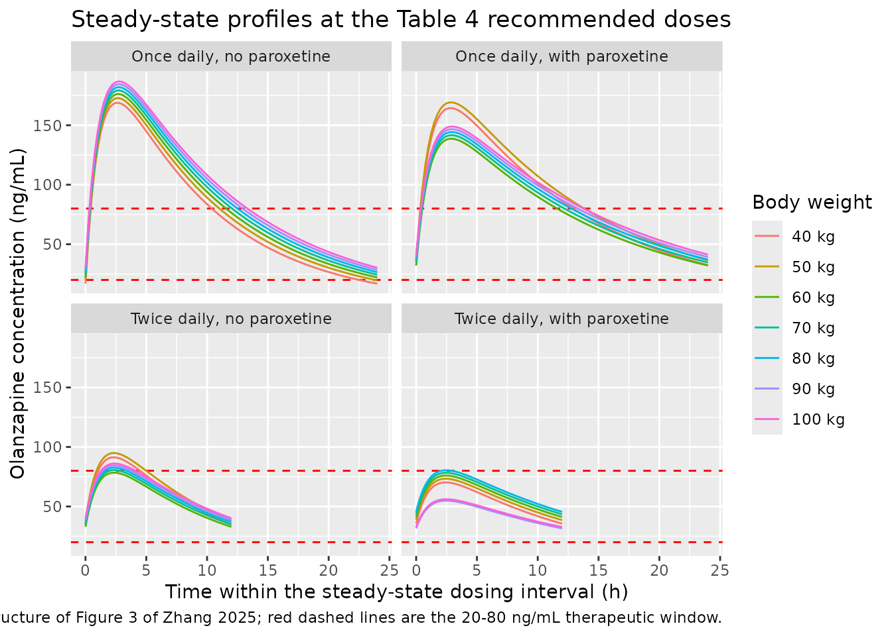
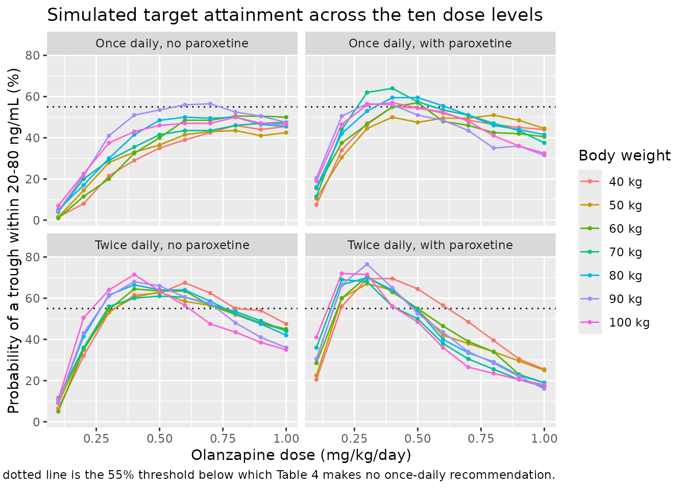

# Olanzapine (Zhang 2025)

## Model and source

- Citation: Zhang C, Chen L, Duan YY, He SM, Tian YL, Gao Y, Wang DD.
  Drug-drug interaction of paroxetine on olanzapine and initial dosage
  optimization in patients with major depressive disorder based on
  population pharmacokinetics. Frontiers in Psychiatry. 2025;16:1538996.
  <doi:10.3389/fpsyt.2025.1538996>. Final model Equations (6) and (7);
  parameter estimates Table 3. The fixed absorption rate constant is
  quoted from the paper’s reference 26: Sun L, Mills R, Sadler BM,
  Rege B. Population pharmacokinetics of olanzapine and samidorphan when
  administered in combination in healthy subjects and patients with
  schizophrenia. J Clin Pharmacol. 2021;61(11):1430-1441.
  <doi:10.1002/jcph.1911>. Companion analysis in schizophrenia by the
  same group: modellib(‘Zhang_2024_olanzapine’).
- Description: One-compartment population PK model for oral olanzapine
  with first-order absorption in adults with major depressive disorder,
  built from a routine therapeutic-drug-monitoring database (Zhang
  2025). Apparent oral clearance is allometrically scaled on body weight
  and reduced by 28.9% when paroxetine is co-administered; the
  absorption rate constant is fixed to a published value.
  Between-subject variability was retained on CL/F only.
- Article: <https://doi.org/10.3389/fpsyt.2025.1538996>

Zhang and colleagues fitted a one-compartment model with first-order
oral absorption to routine therapeutic-drug-monitoring (TDM)
concentrations from 72 inpatients with major depressive disorder. The
absorption rate constant was not identifiable from sparse
trough-dominated TDM data and was fixed to a published value; apparent
oral clearance and apparent volume were estimated. Of the 24 concomitant
medications and the demographic and clinical-chemistry panel screened,
only body weight and paroxetine were retained: patients co-prescribed
paroxetine had 28.9% lower olanzapine CL/F.

This is the same group’s companion analysis to `Zhang_2024_olanzapine`,
which studied olanzapine in schizophrenia and found concomitant
aripiprazole rather than paroxetine. The two share the structural model,
the allometric form and the linear-shift covariate parameterisation, but
were fitted to different cohorts and give materially different
disposition estimates (V/F 197 L here versus 854 L there).

## Population

Seventy-two inpatients with major depressive disorder treated at a
single centre in Xuzhou, Jiangsu, China contributed olanzapine TDM
concentrations collected between December 2020 and August 2023, with one
to three concentration samples per patient (Methods, Data Collection;
Results, Patient information). The cohort was 17 men and 55 women, mean
age 48.14 years (SD 20.94, range 16.00-87.90) and mean weight 61.83 kg
(SD 11.82, range 40.00-92.00) (Table 1). Baseline laboratory values were
broadly unremarkable: mean albumin 39.51 g/L, creatinine 53.88 umol/L,
hemoglobin 126.81 g/L. Eighteen of the 72 patients were co-prescribed
paroxetine hydrochloride tablets (Table 2).

The paper reports no administered olanzapine doses, dose ranges, or
sampling times; the concentrations come from a routine TDM database
rather than a designed PK study. Every dosing regimen used below is
therefore a scenario constructed for validation, not a replication of
the observed data.

The same information is available programmatically via the model’s
`population` metadata
(`readModelDb("Zhang_2025_olanzapine")()$population`).

## Source trace

The per-parameter origin is recorded as an in-file comment next to each
`ini()` entry in `inst/modeldb/specificDrugs/Zhang_2025_olanzapine.R`.
The table below collects them in one place.

| Equation / parameter | Value | Source location |
|----|----|----|
| `lcl` (CL/F at 70 kg, no paroxetine) | 19.6 L/h | Table 3 (SE 7.1%; bootstrap median 19.4 \[17.0, 21.9\]); also printed in Equation (6) |
| `lvc` (V/F at 70 kg) | 197 L | Table 3 (SE 15.3%; bootstrap median 194 \[154, 277\]); also printed in Equation (7) |
| `lka` (ka, fixed) | 0.861 1/h | Table 3, “0.861 (fixed)”; Methods, Modeling: “absorption rate constants \[Ka, fixed at 0.861/h (26)\]”. Reference 26 is Sun 2021, J Clin Pharmacol 61(11):1430-1441 |
| `e_wt_cl` (allometric exponent on CL/F, fixed) | 0.75 | Methods, Equation (3): “F is the allometric coefficient: 0.75 for the CL/F and 1 for the V/F”, citing Anderson & Holford 2008; the exponent is printed again in Equation (6) |
| `e_wt_vc` (allometric exponent on V/F, fixed) | 1 | Methods, Equation (3); printed again in Equation (7) |
| `e_par_cl` (concomitant paroxetine on CL/F) | -0.289 | Table 3, theta_PAR (SE 30.5%; bootstrap median -0.283 \[-0.420, -0.078\]); assembled in Equation (6) as `(1 - 0.289 * PAR)` |
| `etalcl` (IIV on CL/F) | omega = 0.434, so variance 0.434^2 | Table 3, row `omega_CL/F` (SE 11.1%; bootstrap median 0.429 \[0.336, 0.535\]). Read as a standard deviation – see Assumptions below |
| `propSd` (proportional residual error) | 0.153 | Table 3, row `sigma_1`, “residual variability, proportional error” (SE 16.6%) |
| `addSd` (additive residual error) | 1.005 ng/mL | Table 3, row `sigma_2`, “residual variability, additive error” (SE 45.0%) |
| IIV structure `Ai = TV(A) * exp(eta_i)` | n/a | Methods, Equation (1) |
| Residual structure `Bi = Ci + Ci*eps_1 + eps_2` | n/a | Methods, Equation (2) |
| Allometry `Di = Dstd * (Ei / Estd)^F`, `Estd = 70 kg` | n/a | Methods, Equation (3) |
| Categorical covariate form (linear shift) | n/a | Methods, Equation (5); realised in Equation (6) |
| `CL/F = 19.6 * (weight/70)^0.75 * (1 - 0.289 * PAR)` | n/a | Results, Modeling, Equation (6) |
| `V/F = 197 * (weight/70)` | n/a | Results, Modeling, Equation (7) |
| Clearance ratio 0.711:1 with vs without paroxetine | n/a | Results, Evaluation (Figure 1H); restated in the Discussion |
| Therapeutic window 20-80 ng/mL | n/a | Methods, Simulation (cites the paper’s reference 28, Ding 2022) |
| Covariate screen (dOFV per drug) | n/a | Supplementary Table 1 |
| Initial-dose recommendations | n/a | Table 4 and Figure 4 |

``` r

mod <- readModelDb("Zhang_2025_olanzapine")
ui  <- rxode2::rxode(mod)
#> ℹ parameter labels from comments will be replaced by 'label()'
```

## Structural checks against the printed equations

The published model is fully specified by Equations (6) and (7), so the
first check is that the packaged model reproduces them exactly.
`zeroRe()` removes between-subject variability so the solved `cl` and
`vc` are the typical values.

``` r

# Published equations, transcribed independently of the model file.
cl_published <- function(wt, par) 19.6 * (wt / 70)^0.75 * (1 - 0.289 * par)
vc_published <- function(wt)      197  * (wt / 70)

weights <- c(40, 50, 60, 70, 80, 90, 100)

grid <- tidyr::expand_grid(WT = weights, CONMED_PAROXETINE = c(0, 1)) |>
  dplyr::mutate(id = dplyr::row_number(),
                arm = paste0(WT, " kg, ",
                             ifelse(CONMED_PAROXETINE == 1, "with", "no"),
                             " paroxetine"))

ev_struct <- grid |>
  dplyr::mutate(time = 0, amt = 10, evid = 1, cmt = "depot") |>
  dplyr::bind_rows(
    grid |> tidyr::crossing(time = 0:1) |>
      dplyr::mutate(amt = NA_real_, evid = 0, cmt = "central")
  ) |>
  dplyr::arrange(id, time, dplyr::desc(evid))

sim_struct <- rxode2::rxSolve(
  rxode2::zeroRe(mod), events = ev_struct,
  keep = c("WT", "CONMED_PAROXETINE", "arm")
) |>
  as.data.frame() |>
  dplyr::group_by(WT, CONMED_PAROXETINE, arm) |>
  dplyr::summarise(cl_model = mean(cl), vc_model = mean(vc), ka_model = mean(ka),
                   .groups = "drop") |>
  dplyr::mutate(cl_paper = cl_published(WT, CONMED_PAROXETINE),
                vc_paper = vc_published(WT))
#> ℹ parameter labels from comments will be replaced by 'label()'
#> ℹ omega/sigma items treated as zero: 'etalcl'
#> Warning: multi-subject simulation without without 'omega'

stopifnot(
  nrow(sim_struct) == 14L,
  max(abs(sim_struct$cl_model - sim_struct$cl_paper)) < 1e-8,
  max(abs(sim_struct$vc_model - sim_struct$vc_paper)) < 1e-8,
  max(abs(sim_struct$ka_model - 0.861)) < 1e-8
)

sim_struct |>
  dplyr::transmute(
    Arm                 = arm,
    `CL/F model (L/h)`  = round(cl_model, 3),
    `CL/F Eq. 6 (L/h)`  = round(cl_paper, 3),
    `V/F model (L)`     = round(vc_model, 1),
    `V/F Eq. 7 (L)`     = round(vc_paper, 1)
  ) |>
  knitr::kable(caption = "Typical CL/F and V/F reproduce Equations (6) and (7) exactly.")
```

| Arm | CL/F model (L/h) | CL/F Eq. 6 (L/h) | V/F model (L) | V/F Eq. 7 (L) |
|:---|---:|---:|---:|---:|
| 40 kg, no paroxetine | 12.882 | 12.882 | 112.6 | 112.6 |
| 40 kg, with paroxetine | 9.159 | 9.159 | 112.6 | 112.6 |
| 50 kg, no paroxetine | 15.229 | 15.229 | 140.7 | 140.7 |
| 50 kg, with paroxetine | 10.828 | 10.828 | 140.7 | 140.7 |
| 60 kg, no paroxetine | 17.460 | 17.460 | 168.9 | 168.9 |
| 60 kg, with paroxetine | 12.414 | 12.414 | 168.9 | 168.9 |
| 70 kg, no paroxetine | 19.600 | 19.600 | 197.0 | 197.0 |
| 70 kg, with paroxetine | 13.936 | 13.936 | 197.0 | 197.0 |
| 80 kg, no paroxetine | 21.665 | 21.665 | 225.1 | 225.1 |
| 80 kg, with paroxetine | 15.404 | 15.404 | 225.1 | 225.1 |
| 90 kg, no paroxetine | 23.665 | 23.665 | 253.3 | 253.3 |
| 90 kg, with paroxetine | 16.826 | 16.826 | 253.3 | 253.3 |
| 100 kg, no paroxetine | 25.611 | 25.611 | 281.4 | 281.4 |
| 100 kg, with paroxetine | 18.210 | 18.210 | 281.4 | 281.4 |

Typical CL/F and V/F reproduce Equations (6) and (7) exactly. {.table}

The Results and Discussion state the paroxetine effect as a clearance
ratio: “with the same weight, the clearance rates of olanzapine were
0.711:1 in patients with major depressive disorder with or without
paroxetine” (Figure 1H). That ratio is `1 - 0.289` and is
weight-independent, so it must hold at every weight.

``` r

ratio <- sim_struct |>
  dplyr::select(WT, CONMED_PAROXETINE, cl_model) |>
  tidyr::pivot_wider(names_from = CONMED_PAROXETINE,
                     names_prefix = "par", values_from = cl_model) |>
  dplyr::mutate(ratio = par1 / par0)

# Deterministic (no IIV): an exact identity, so a tight bound is correct here.
stopifnot(nrow(ratio) == 7L, max(abs(ratio$ratio - 0.711)) < 1e-9)

ratio |>
  dplyr::transmute(`Weight (kg)` = WT,
                   `CL/F without paroxetine (L/h)` = round(par0, 2),
                   `CL/F with paroxetine (L/h)`    = round(par1, 2),
                   `Ratio (with:without)`          = round(ratio, 4)) |>
  knitr::kable(caption = "Replicates Figure 1H of Zhang 2025: a clearance ratio of 0.711:1 with vs without paroxetine, at every weight.")
```

| Weight (kg) | CL/F without paroxetine (L/h) | CL/F with paroxetine (L/h) | Ratio (with:without) |
|---:|---:|---:|---:|
| 40 | 12.88 | 9.16 | 0.711 |
| 50 | 15.23 | 10.83 | 0.711 |
| 60 | 17.46 | 12.41 | 0.711 |
| 70 | 19.60 | 13.94 | 0.711 |
| 80 | 21.66 | 15.40 | 0.711 |
| 90 | 23.67 | 16.83 | 0.711 |
| 100 | 25.61 | 18.21 | 0.711 |

Replicates Figure 1H of Zhang 2025: a clearance ratio of 0.711:1 with vs
without paroxetine, at every weight. {.table}

## PKNCA validation against the published parameters

Zhang 2025 reports no NCA table, but the printed structural parameters
imply exact non-compartmental quantities for a single oral dose of a
linear one-compartment model:

- `AUC0-inf = Dose / (CL/F)` (mass balance; independent of `ka` and
  `V/F`),
- terminal `t1/2 = ln(2) * (V/F) / (CL/F)`, because `ka = 0.861 1/h` is
  an order of magnitude larger than `kel` (0.099 1/h without paroxetine
  at 70 kg, 0.071 1/h with), so the terminal phase is
  elimination-rate-limited rather than flip-flop,
- `tmax = ln(ka / kel) / (ka - kel)`.

Running PKNCA over a typical-value (no-IIV) simulation therefore checks
the whole pipeline – units, the mg-to-ng/mL conversion, the ODE system,
the covariate model – against numbers derived from Table 3 alone.

``` r

# Single 10 mg oral dose; observe long enough for AUC0-inf to converge. The
# slowest arm (100 kg with paroxetine) has t1/2 = 10.7 h, so 240 h is >22
# half-lives.
obs_times <- sort(unique(c(seq(0, 24, by = 0.1), seq(24, 240, by = 0.5))))

ev_nca <- grid |>
  dplyr::mutate(time = 0, amt = 10, evid = 1, cmt = "depot") |>
  dplyr::bind_rows(
    grid |> tidyr::crossing(time = obs_times) |>
      dplyr::mutate(amt = NA_real_, evid = 0, cmt = "central")
  ) |>
  dplyr::arrange(id, time, dplyr::desc(evid))

stopifnot(!anyDuplicated(unique(ev_nca[, c("id", "time", "evid")])))

sim_nca_raw <- rxode2::rxSolve(
  rxode2::zeroRe(mod), events = ev_nca,
  keep = c("WT", "CONMED_PAROXETINE", "arm")
) |>
  as.data.frame()
#> ℹ parameter labels from comments will be replaced by 'label()'
#> ℹ omega/sigma items treated as zero: 'etalcl'
#> Warning: multi-subject simulation without without 'omega'

# Concentrations must stay non-negative for PKNCA's log-linear terminal fit.
stopifnot(all(sim_nca_raw$Cc >= 0, na.rm = TRUE))
```

``` r

sim_nca <- sim_nca_raw |>
  dplyr::filter(!is.na(Cc)) |>
  dplyr::select(id, time, Cc, arm)

# Guarantee a time = 0 row per (id, arm); pre-dose Cc = 0 for extravascular.
sim_nca <- dplyr::bind_rows(
  sim_nca,
  sim_nca |> dplyr::distinct(id, arm) |> dplyr::mutate(time = 0, Cc = 0)
) |>
  dplyr::distinct(id, arm, time, .keep_all = TRUE) |>
  dplyr::arrange(id, arm, time)

conc_obj <- PKNCA::PKNCAconc(sim_nca, Cc ~ time | arm + id,
                             concu = "ng/mL", timeu = "h")

dose_df <- ev_nca |>
  dplyr::filter(evid == 1) |>
  dplyr::select(id, time, amt, arm)

dose_obj <- PKNCA::PKNCAdose(dose_df, amt ~ time | arm + id, doseu = "mg")

intervals <- data.frame(
  start      = 0,
  end        = Inf,
  cmax       = TRUE,
  tmax       = TRUE,
  aucinf.obs = TRUE,
  half.life  = TRUE
)

nca_res <- PKNCA::pk.nca(PKNCA::PKNCAdata(conc_obj, dose_obj, intervals = intervals))
```

### Comparison against the values implied by Table 3

``` r

# Reference values derived from the PRINTED parameters only.
ka_pub <- 0.861
published <- grid |>
  dplyr::mutate(
    cl  = cl_published(WT, CONMED_PAROXETINE),
    vc  = vc_published(WT),
    kel = cl / vc,
    # 10 mg / (L/h) -> mg*h/L; * 1000 -> ng*h/mL
    aucinf.obs = 1000 * 10 / cl,
    half.life  = log(2) / kel,
    tmax       = log(ka_pub / kel) / (ka_pub - kel),
    cmax       = 1000 * (10 / vc) * (ka_pub / (ka_pub - kel)) *
      (exp(-kel * tmax) - exp(-ka_pub * tmax))
  ) |>
  dplyr::select(arm, cmax, tmax, aucinf.obs, half.life)

cmp <- nlmixr2lib::ncaComparisonTable(
  simulated     = nca_res,
  reference     = published,
  by            = "arm",
  units         = c(cmax = "ng/mL", tmax = "h",
                    aucinf.obs = "ng*h/mL", half.life = "h"),
  tolerance_pct = 20
)

knitr::kable(
  cmp,
  caption = paste(
    "Simulated NCA vs the closed-form values implied by Zhang 2025 Table 3",
    "(10 mg single oral dose). * marks a >20% difference."
  )
)
```

| NCA parameter           | arm                     | Reference | Simulated | % diff |
|:------------------------|:------------------------|:----------|:----------|:-------|
| Cmax (ng/mL)            | 40 kg, no paroxetine    | 65.2      | 65.2      | -0.0%  |
| Cmax (ng/mL)            | 40 kg, with paroxetine  | 69.4      | 69.4      | -0.0%  |
| Cmax (ng/mL)            | 50 kg, no paroxetine    | 52.7      | 52.7      | -0.0%  |
| Cmax (ng/mL)            | 50 kg, with paroxetine  | 56.1      | 56.1      | -0.0%  |
| Cmax (ng/mL)            | 60 kg, no paroxetine    | 44.3      | 44.3      | -0.0%  |
| Cmax (ng/mL)            | 60 kg, with paroxetine  | 47.1      | 47.1      | -0.0%  |
| Cmax (ng/mL)            | 70 kg, no paroxetine    | 38.3      | 38.3      | -0.0%  |
| Cmax (ng/mL)            | 70 kg, with paroxetine  | 40.6      | 40.6      | -0.0%  |
| Cmax (ng/mL)            | 80 kg, no paroxetine    | 33.7      | 33.7      | -0.0%  |
| Cmax (ng/mL)            | 80 kg, with paroxetine  | 35.7      | 35.7      | -0.0%  |
| Cmax (ng/mL)            | 90 kg, no paroxetine    | 30.1      | 30.1      | -0.0%  |
| Cmax (ng/mL)            | 90 kg, with paroxetine  | 31.9      | 31.9      | -0.0%  |
| Cmax (ng/mL)            | 100 kg, no paroxetine   | 27.2      | 27.2      | -0.0%  |
| Cmax (ng/mL)            | 100 kg, with paroxetine | 28.8      | 28.8      | -0.0%  |
| Tmax (h)                | 40 kg, no paroxetine    | 2.7       | 2.7       | -0.1%  |
| Tmax (h)                | 40 kg, with paroxetine  | 3.03      | 3         | -0.9%  |
| Tmax (h)                | 50 kg, no paroxetine    | 2.75      | 2.8       | +1.6%  |
| Tmax (h)                | 50 kg, with paroxetine  | 3.08      | 3.1       | +0.6%  |
| Tmax (h)                | 60 kg, no paroxetine    | 2.8       | 2.8       | +0.1%  |
| Tmax (h)                | 60 kg, with paroxetine  | 3.12      | 3.1       | -0.8%  |
| Tmax (h)                | 70 kg, no paroxetine    | 2.83      | 2.8       | -1.2%  |
| Tmax (h)                | 70 kg, with paroxetine  | 3.16      | 3.2       | +1.2%  |
| Tmax (h)                | 80 kg, no paroxetine    | 2.87      | 2.9       | +1.2%  |
| Tmax (h)                | 80 kg, with paroxetine  | 3.2       | 3.2       | +0.1%  |
| Tmax (h)                | 90 kg, no paroxetine    | 2.89      | 2.9       | +0.2%  |
| Tmax (h)                | 90 kg, with paroxetine  | 3.22      | 3.2       | -0.8%  |
| Tmax (h)                | 100 kg, no paroxetine   | 2.92      | 2.9       | -0.6%  |
| Tmax (h)                | 100 kg, with paroxetine | 3.25      | 3.3       | +1.5%  |
| AUC0-∞ (obs) (ng\*h/mL) | 40 kg, no paroxetine    | 776       | 776       | -0.0%  |
| AUC0-∞ (obs) (ng\*h/mL) | 40 kg, with paroxetine  | 1090      | 1090      | -0.0%  |
| AUC0-∞ (obs) (ng\*h/mL) | 50 kg, no paroxetine    | 657       | 657       | -0.0%  |
| AUC0-∞ (obs) (ng\*h/mL) | 50 kg, with paroxetine  | 924       | 924       | -0.0%  |
| AUC0-∞ (obs) (ng\*h/mL) | 60 kg, no paroxetine    | 573       | 573       | -0.0%  |
| AUC0-∞ (obs) (ng\*h/mL) | 60 kg, with paroxetine  | 806       | 805       | -0.0%  |
| AUC0-∞ (obs) (ng\*h/mL) | 70 kg, no paroxetine    | 510       | 510       | -0.0%  |
| AUC0-∞ (obs) (ng\*h/mL) | 70 kg, with paroxetine  | 718       | 718       | -0.0%  |
| AUC0-∞ (obs) (ng\*h/mL) | 80 kg, no paroxetine    | 462       | 462       | -0.0%  |
| AUC0-∞ (obs) (ng\*h/mL) | 80 kg, with paroxetine  | 649       | 649       | -0.0%  |
| AUC0-∞ (obs) (ng\*h/mL) | 90 kg, no paroxetine    | 423       | 423       | -0.0%  |
| AUC0-∞ (obs) (ng\*h/mL) | 90 kg, with paroxetine  | 594       | 594       | -0.0%  |
| AUC0-∞ (obs) (ng\*h/mL) | 100 kg, no paroxetine   | 390       | 390       | -0.0%  |
| AUC0-∞ (obs) (ng\*h/mL) | 100 kg, with paroxetine | 549       | 549       | -0.0%  |
| t½ (h)                  | 40 kg, no paroxetine    | 6.06      | 6.06      | +0.1%  |
| t½ (h)                  | 40 kg, with paroxetine  | 8.52      | 8.52      | +0.0%  |
| t½ (h)                  | 50 kg, no paroxetine    | 6.4       | 6.41      | +0.1%  |
| t½ (h)                  | 50 kg, with paroxetine  | 9.01      | 9.01      | +0.0%  |
| t½ (h)                  | 60 kg, no paroxetine    | 6.7       | 6.71      | +0.0%  |
| t½ (h)                  | 60 kg, with paroxetine  | 9.43      | 9.43      | +0.0%  |
| t½ (h)                  | 70 kg, no paroxetine    | 6.97      | 6.97      | +0.0%  |
| t½ (h)                  | 70 kg, with paroxetine  | 9.8       | 9.8       | +0.0%  |
| t½ (h)                  | 80 kg, no paroxetine    | 7.2       | 7.21      | +0.0%  |
| t½ (h)                  | 80 kg, with paroxetine  | 10.1      | 10.1      | +0.0%  |
| t½ (h)                  | 90 kg, no paroxetine    | 7.42      | 7.42      | +0.0%  |
| t½ (h)                  | 90 kg, with paroxetine  | 10.4      | 10.4      | +0.0%  |
| t½ (h)                  | 100 kg, no paroxetine   | 7.62      | 7.62      | +0.0%  |
| t½ (h)                  | 100 kg, with paroxetine | 10.7      | 10.7      | +0.0%  |

Simulated NCA vs the closed-form values implied by Zhang 2025 Table 3
(10 mg single oral dose). \* marks a \>20% difference. {.table
style="width:100%;"}

``` r

# These are deterministic comparisons -- a typical-value solve against a closed
# form built from the paper's printed numbers -- so the residual difference is
# pure numerical (grid resolution, log-linear terminal fit) and a tight bound
# is correct. Contrast with the cohort-derived attainment table below.
nca_wide <- as.data.frame(nca_res$result) |>
  dplyr::select(arm, PPTESTCD, PPORRES) |>
  tidyr::pivot_wider(names_from = PPTESTCD, values_from = PPORRES) |>
  dplyr::left_join(published, by = "arm", suffix = c("_sim", "_pub"))

pct <- function(a, b) 100 * (a - b) / b
stopifnot(
  nrow(nca_wide) == 14L,
  max(abs(pct(nca_wide$aucinf.obs_sim, nca_wide$aucinf.obs_pub))) < 0.5,
  max(abs(pct(nca_wide$half.life_sim,  nca_wide$half.life_pub)))  < 0.5,
  max(abs(pct(nca_wide$cmax_sim,       nca_wide$cmax_pub)))       < 1.0,
  max(abs(pct(nca_wide$tmax_sim,       nca_wide$tmax_pub)))       < 2.0
)
```

`AUC0-inf` matches `Dose / (CL/F)` and the terminal half-life matches
`ln(2) * (V/F) / (CL/F)` to well under 1%, confirming that the packaged
model, its unit conversion and its covariate model all agree with Table
3.

## Replicate Figure 3: steady-state profiles at the recommended doses

Figure 3 of Zhang 2025 plots simulated olanzapine concentration-time
profiles for seven weight groups under four conditions – once- or
twice-daily dosing, with or without paroxetine – against the 20-80 ng/mL
therapeutic band. The panels below show the typical-value steady-state
profile at the dose Table 4 recommends for each weight and condition.
Once-daily dosing without paroxetine is the one condition for which
Table 4 recommends nothing (no dose from 0.1 to 1.0 mg/kg/day reached
55% attainment); it is shown at 0.6 mg/kg/day, the dose the attainment
sweep below finds best, and is excluded from the band gate.

``` r

# Table 4 of Zhang 2025, transcribed. Weight bands are closed on the left.
# The once-daily / no-paroxetine row of Table 4 records no recommendation.
recommended_dose <- function(wt, par, ndose) {
  if (par == 0 && ndose == 1) NA_real_
  else if (par == 0 && ndose == 2) ifelse(wt < 56, 0.5, 0.4)
  else if (par == 1 && ndose == 1) ifelse(wt < 60, 0.5, 0.4)
  else ifelse(wt < 85, 0.3, 0.2)
}

conditions <- tidyr::expand_grid(
  CONMED_PAROXETINE = c(0, 1),
  ndose             = c(1, 2),
  WT                = weights
) |>
  dplyr::rowwise() |>
  dplyr::mutate(table4_dose = recommended_dose(WT, CONMED_PAROXETINE, ndose)) |>
  dplyr::ungroup() |>
  dplyr::mutate(
    # No Table 4 recommendation for once-daily without paroxetine; use the
    # sweep-optimal 0.6 mg/kg/day so the panel is still informative.
    mg_per_kg_day = ifelse(is.na(table4_dose), 0.6, table4_dose),
    tau           = 24 / ndose,
    amt           = mg_per_kg_day * WT / ndose,
    condition     = paste0(ifelse(ndose == 1, "Once daily", "Twice daily"), ", ",
                           ifelse(CONMED_PAROXETINE == 1, "with", "no"),
                           " paroxetine"),
    wt_label      = paste0(WT, " kg")
  )

conditions |>
  dplyr::transmute(Condition = condition, `Weight (kg)` = WT,
                   `Table 4 dose (mg/kg/day)` = table4_dose,
                   `Dose simulated (mg/kg/day)` = mg_per_kg_day,
                   `Dose per administration (mg)` = round(amt, 1)) |>
  knitr::kable(caption = "Recommended initial doses transcribed from Table 4 of Zhang 2025. A blank Table 4 dose marks the once-daily, no-paroxetine condition, for which the paper recommends no dose.")
```

| Condition | Weight (kg) | Table 4 dose (mg/kg/day) | Dose simulated (mg/kg/day) | Dose per administration (mg) |
|:---|---:|---:|---:|---:|
| Once daily, no paroxetine | 40 | NA | 0.6 | 24.0 |
| Once daily, no paroxetine | 50 | NA | 0.6 | 30.0 |
| Once daily, no paroxetine | 60 | NA | 0.6 | 36.0 |
| Once daily, no paroxetine | 70 | NA | 0.6 | 42.0 |
| Once daily, no paroxetine | 80 | NA | 0.6 | 48.0 |
| Once daily, no paroxetine | 90 | NA | 0.6 | 54.0 |
| Once daily, no paroxetine | 100 | NA | 0.6 | 60.0 |
| Twice daily, no paroxetine | 40 | 0.5 | 0.5 | 10.0 |
| Twice daily, no paroxetine | 50 | 0.5 | 0.5 | 12.5 |
| Twice daily, no paroxetine | 60 | 0.4 | 0.4 | 12.0 |
| Twice daily, no paroxetine | 70 | 0.4 | 0.4 | 14.0 |
| Twice daily, no paroxetine | 80 | 0.4 | 0.4 | 16.0 |
| Twice daily, no paroxetine | 90 | 0.4 | 0.4 | 18.0 |
| Twice daily, no paroxetine | 100 | 0.4 | 0.4 | 20.0 |
| Once daily, with paroxetine | 40 | 0.5 | 0.5 | 20.0 |
| Once daily, with paroxetine | 50 | 0.5 | 0.5 | 25.0 |
| Once daily, with paroxetine | 60 | 0.4 | 0.4 | 24.0 |
| Once daily, with paroxetine | 70 | 0.4 | 0.4 | 28.0 |
| Once daily, with paroxetine | 80 | 0.4 | 0.4 | 32.0 |
| Once daily, with paroxetine | 90 | 0.4 | 0.4 | 36.0 |
| Once daily, with paroxetine | 100 | 0.4 | 0.4 | 40.0 |
| Twice daily, with paroxetine | 40 | 0.3 | 0.3 | 6.0 |
| Twice daily, with paroxetine | 50 | 0.3 | 0.3 | 7.5 |
| Twice daily, with paroxetine | 60 | 0.3 | 0.3 | 9.0 |
| Twice daily, with paroxetine | 70 | 0.3 | 0.3 | 10.5 |
| Twice daily, with paroxetine | 80 | 0.3 | 0.3 | 12.0 |
| Twice daily, with paroxetine | 90 | 0.2 | 0.2 | 9.0 |
| Twice daily, with paroxetine | 100 | 0.2 | 0.2 | 10.0 |

Recommended initial doses transcribed from Table 4 of Zhang 2025. A
blank Table 4 dose marks the once-daily, no-paroxetine condition, for
which the paper recommends no dose. {.table}

``` r

# 10 days of run-in reaches steady state: the slowest arm (100 kg with
# paroxetine) has t1/2 = ln(2) / 0.0647 = 10.7 h, so 240 h is >22 half-lives.
run_in_h <- 240

make_arm <- function(row, id) {
  tau  <- row$tau
  dose <- tibble::tibble(
    id = id, time = seq(0, run_in_h - tau, by = tau),
    amt = row$amt, evid = 1, cmt = "depot"
  )
  last_dose <- max(dose$time)
  obs <- tibble::tibble(
    id = id, time = seq(last_dose, last_dose + tau, by = tau / 96),
    amt = NA_real_, evid = 0, cmt = "central"
  )
  dplyr::bind_rows(dose, obs) |>
    dplyr::mutate(WT = row$WT,
                  CONMED_PAROXETINE = row$CONMED_PAROXETINE,
                  condition = row$condition, wt_label = row$wt_label,
                  tau = tau)
}

ev_fig3 <- do.call(
  dplyr::bind_rows,
  lapply(seq_len(nrow(conditions)),
         function(i) make_arm(conditions[i, ], id = i))
) |>
  dplyr::arrange(id, time, dplyr::desc(evid))

stopifnot(!anyDuplicated(unique(ev_fig3[, c("id", "time", "evid")])))
```

``` r

sim_fig3 <- rxode2::rxSolve(
  rxode2::zeroRe(mod), events = ev_fig3,
  keep = c("WT", "CONMED_PAROXETINE", "condition", "wt_label")
) |>
  as.data.frame() |>
  dplyr::filter(!is.na(Cc)) |>
  dplyr::group_by(id) |>
  dplyr::mutate(t_rel = time - min(time)) |>
  dplyr::ungroup() |>
  dplyr::mutate(wt_label = factor(wt_label, levels = paste0(weights, " kg")))
#> ℹ parameter labels from comments will be replaced by 'label()'
#> ℹ omega/sigma items treated as zero: 'etalcl'
#> Warning: multi-subject simulation without without 'omega'

ggplot(sim_fig3, aes(t_rel, Cc, colour = wt_label)) +
  geom_hline(yintercept = c(20, 80), linetype = "dashed", colour = "red") +
  geom_line() +
  facet_wrap(~condition) +
  labs(x = "Time within the steady-state dosing interval (h)",
       y = "Olanzapine concentration (ng/mL)",
       colour = "Body weight",
       title = "Steady-state profiles at the Table 4 recommended doses",
       caption = "Replicates the structure of Figure 3 of Zhang 2025; red dashed lines are the 20-80 ng/mL therapeutic window.")
```



``` r

band <- sim_fig3 |>
  dplyr::group_by(condition, wt_label) |>
  dplyr::summarise(cmin = min(Cc), cmax = max(Cc),
                   cav  = sum(diff(time) * (head(Cc, -1) + tail(Cc, -1)) / 2) /
                     (max(time) - min(time)),
                   .groups = "drop")

# Deterministic (zeroRe) typical-value profiles -- no cohort noise anywhere in
# this chunk, so tight bounds are correct here. A mis-transcribed dose,
# clearance, volume or unit conversion moves these by tens of percent.
gated <- band |> dplyr::filter(condition != "Once daily, no paroxetine")
once_daily_band  <- band |> dplyr::filter(grepl("^Once daily",  condition))
twice_daily_band <- band |> dplyr::filter(grepl("^Twice daily", condition))
stopifnot(
  nrow(band) == 28L,
  nrow(gated) == 21L,
  # At the 21 doses Table 4 recommends, the typical patient's steady-state
  # TROUGH -- the quantity the paper's attainment criterion is applied to --
  # lies inside the therapeutic window at every weight.
  all(gated$cmin >= 20 & gated$cmin <= 80),
  # The interval-average and peak are a different story, and the contrast is
  # the structural reason Table 4 recommends twice-daily dosing. With a
  # terminal half-life of only 7-11 h, every once-daily peak clears the
  # 80 ng/mL ceiling by a wide margin, while no twice-daily peak does.
  all(once_daily_band$cmax  > 120),
  all(twice_daily_band$cmax < 100)
)

band |>
  dplyr::transmute(Condition = condition, Weight = wt_label,
                   `Ctrough (ng/mL)` = round(cmin, 1),
                   `Cav (ng/mL)`     = round(cav, 1),
                   `Cmax (ng/mL)`    = round(cmax, 1)) |>
  knitr::kable(caption = "Typical steady-state exposure at the simulated doses, against the 20-80 ng/mL window.")
```

| Condition                    | Weight | Ctrough (ng/mL) | Cav (ng/mL) | Cmax (ng/mL) |
|:-----------------------------|:-------|----------------:|------------:|-------------:|
| Once daily, no paroxetine    | 40 kg  |            16.9 |        77.6 |        168.8 |
| Once daily, no paroxetine    | 50 kg  |            19.6 |        82.0 |        172.8 |
| Once daily, no paroxetine    | 60 kg  |            22.1 |        85.9 |        176.3 |
| Once daily, no paroxetine    | 70 kg  |            24.4 |        89.2 |        179.3 |
| Once daily, no paroxetine    | 80 kg  |            26.5 |        92.3 |        182.0 |
| Once daily, no paroxetine    | 90 kg  |            28.4 |        95.0 |        184.5 |
| Once daily, no paroxetine    | 100 kg |            30.2 |        97.6 |        186.8 |
| Once daily, with paroxetine  | 40 kg  |            32.4 |        91.0 |        164.4 |
| Once daily, with paroxetine  | 50 kg  |            36.5 |        96.2 |        169.2 |
| Once daily, with paroxetine  | 60 kg  |            32.1 |        80.5 |        138.7 |
| Once daily, with paroxetine  | 70 kg  |            34.7 |        83.7 |        141.6 |
| Once daily, with paroxetine  | 80 kg  |            37.1 |        86.5 |        144.3 |
| Once daily, with paroxetine  | 90 kg  |            39.2 |        89.1 |        146.7 |
| Once daily, with paroxetine  | 100 kg |            41.3 |        91.5 |        148.9 |
| Twice daily, no paroxetine   | 40 kg  |            34.7 |        64.7 |         91.3 |
| Twice daily, no paroxetine   | 50 kg  |            38.1 |        68.4 |         94.9 |
| Twice daily, no paroxetine   | 60 kg  |            32.8 |        57.3 |         78.4 |
| Twice daily, no paroxetine   | 70 kg  |            34.9 |        59.5 |         80.6 |
| Twice daily, no paroxetine   | 80 kg  |            36.8 |        61.5 |         82.6 |
| Twice daily, no paroxetine   | 90 kg  |            38.5 |        63.4 |         84.4 |
| Twice daily, no paroxetine   | 100 kg |            40.1 |        65.1 |         86.1 |
| Twice daily, with paroxetine | 40 kg  |            35.6 |        54.6 |         70.2 |
| Twice daily, with paroxetine | 50 kg  |            38.6 |        57.7 |         73.3 |
| Twice daily, with paroxetine | 60 kg  |            41.1 |        60.4 |         76.0 |
| Twice daily, with paroxetine | 70 kg  |            43.4 |        62.8 |         78.3 |
| Twice daily, with paroxetine | 80 kg  |            45.5 |        64.9 |         80.4 |
| Twice daily, with paroxetine | 90 kg  |            31.6 |        44.6 |         54.9 |
| Twice daily, with paroxetine | 100 kg |            32.7 |        45.8 |         56.1 |

Typical steady-state exposure at the simulated doses, against the 20-80
ng/mL window. {.table}

The terminal half-life implied by Table 3 is short – about 7 h without
paroxetine and 10 h with it – so a 24 h dosing interval is more than two
half-lives wide. The consequence is visible in the table above: at any
dose large enough to hold the once-daily trough inside the window, the
once-daily peak overshoots 80 ng/mL roughly two-fold, whereas splitting
the same daily dose in two keeps the whole profile close to the band.
That is the structural reason Table 4 recommends no once-daily dose at
all in the absence of paroxetine, and why the paper concludes
twice-daily administration is optimal.

## Target attainment (Table 4 and Figure 4)

Zhang 2025 simulated 1000 virtual patients per case against the 20-80
ng/mL window over ten dose levels (0.1 to 1.0 mg/kg/day) and seven
weight groups (Methods, Simulation; results in Figure 4 and Table 4).
The reconstruction below applies the same criterion to the steady-state
trough – the quantity a TDM service actually measures – and asks two
questions: does it reproduce the attainment probabilities, and does it
pick the same doses?

The model is linear in dose, so one simulated cohort per (condition,
weight) cell scales to all ten dose levels. That is verified explicitly
rather than assumed.

``` r

# rxSetSeed fixes rxode2's RNG per solver thread and NOT across thread counts,
# so this cohort differs between a 16-thread workstation and a 2-core CI
# runner. Every assertion below is written to hold for any such cohort.
rxode2::rxSetSeed(20250513)
n_per_arm <- 200L   # at the 200-per-arm cap

cells <- tidyr::expand_grid(
  CONMED_PAROXETINE = c(0, 1),
  ndose             = c(1, 2),
  WT                = weights
) |>
  dplyr::mutate(
    tau       = 24 / ndose,
    condition = paste0(ifelse(ndose == 1, "Once daily", "Twice daily"), ", ",
                       ifelse(CONMED_PAROXETINE == 1, "with", "no"),
                       " paroxetine"),
    cell      = dplyr::row_number()
  )

# Reference dose of 1.0 mg/kg/day; troughs at other doses scale linearly.
ref_mg_kg_day <- 1.0

make_cohort_arm <- function(row, id_offset) {
  tau       <- row$tau
  ids       <- id_offset + seq_len(n_per_arm)
  last_dose <- run_in_h - tau
  dose <- tidyr::expand_grid(id = ids, time = seq(0, last_dose, by = tau)) |>
    dplyr::mutate(amt = ref_mg_kg_day * row$WT / (24 / tau), evid = 1, cmt = "depot")
  # A single observation, exactly one dosing interval after the last dose.
  obs <- tibble::tibble(id = ids, time = last_dose + tau,
                        amt = NA_real_, evid = 0, cmt = "central")
  dplyr::bind_rows(dose, obs) |>
    dplyr::mutate(WT = row$WT, CONMED_PAROXETINE = row$CONMED_PAROXETINE,
                  condition = row$condition, cell = row$cell) |>
    dplyr::arrange(id, time, dplyr::desc(evid))
}

# One rxSolve call per condition keeps each call's subject count moderate.
troughs <- lapply(unique(cells$condition), function(cond) {
  rows <- cells[cells$condition == cond, ]
  ev <- do.call(dplyr::bind_rows, lapply(seq_len(nrow(rows)), function(i) {
    make_cohort_arm(rows[i, ], id_offset = (i - 1L) * n_per_arm)
  }))
  stopifnot(!anyDuplicated(unique(ev[, c("id", "time", "evid")])))
  rxode2::rxSolve(mod, events = ev,
                  keep = c("WT", "CONMED_PAROXETINE", "condition", "cell")) |>
    as.data.frame() |>
    dplyr::filter(!is.na(Cc)) |>
    dplyr::select(condition, cell, WT, id, ctrough_ref = Cc)
}) |>
  dplyr::bind_rows()
#> ℹ parameter labels from comments will be replaced by 'label()'

stopifnot(nrow(troughs) == nrow(cells) * n_per_arm,
          all(troughs$ctrough_ref > 0))
```

``` r

# Verify the linear-in-dose scaling relied on below. The ODE system is linear
# in amount, so for any fixed set of individual parameters the steady-state
# trough is exactly proportional to dose. The check is run deterministically
# (zeroRe) across all 28 cells at two dose levels: comparing two stochastic
# solves instead would confound the property under test with the fact that
# rxode2 redraws etas per call.
lin_rows <- cells |> dplyr::mutate(id = dplyr::row_number())

make_lin_ev <- function(scale) {
  do.call(dplyr::bind_rows, lapply(seq_len(nrow(lin_rows)), function(i) {
    row <- lin_rows[i, ]
    tau <- row$tau
    last_dose <- run_in_h - tau
    dplyr::bind_rows(
      tibble::tibble(id = row$id, time = seq(0, last_dose, by = tau),
                     amt = scale * ref_mg_kg_day * row$WT / (24 / tau),
                     evid = 1, cmt = "depot"),
      tibble::tibble(id = row$id, time = last_dose + tau,
                     amt = NA_real_, evid = 0, cmt = "central")
    ) |>
      dplyr::mutate(WT = row$WT, CONMED_PAROXETINE = row$CONMED_PAROXETINE)
  })) |>
    dplyr::arrange(id, time, dplyr::desc(evid))
}

solve_lin <- function(scale) {
  rxode2::rxSolve(rxode2::zeroRe(mod), events = make_lin_ev(scale),
                  keep = c("WT", "CONMED_PAROXETINE")) |>
    as.data.frame() |>
    dplyr::filter(!is.na(Cc)) |>
    dplyr::pull(Cc)
}

lin_ref <- solve_lin(1.0)
#> ℹ parameter labels from comments will be replaced by 'label()'
#> ℹ omega/sigma items treated as zero: 'etalcl'
#> Warning: multi-subject simulation without without 'omega'
lin_04  <- solve_lin(0.4)
#> ℹ parameter labels from comments will be replaced by 'label()'
#> ℹ omega/sigma items treated as zero: 'etalcl'
#> Warning: multi-subject simulation without without 'omega'

# Compared on a RELATIVE scale: the residual difference is the ODE solver's
# own tolerance (rtol 1e-6), not a departure from linearity, so an absolute
# bound would be unreachable at concentrations of 30-90 ng/mL. Measured
# maximum here is 2.6e-6, so 1e-4 keeps the check meaningful.
stopifnot(
  length(lin_ref) == 28L, length(lin_04) == 28L,
  all(lin_ref > 0),
  max(abs(lin_04 - 0.4 * lin_ref) / (0.4 * lin_ref)) < 1e-4
)
```

``` r

# Residual error is applied here rather than inside rxSolve so that the same
# eta draw is reused across dose levels, mirroring the common-random-numbers
# design of a dose sweep. Equation (2): Bi = Ci + Ci*eps_1 + eps_2.
set.seed(20250513)
eps1 <- rnorm(nrow(troughs), 0, 0.153)
eps2 <- rnorm(nrow(troughs), 0, 1.005)

# round() matters: seq(0.1, 1.0, by = 0.1)[3] is 0.30000000000000004, which
# would silently fail the equality join against Table 4's 0.3 further down.
dose_levels <- round(seq(0.1, 1.0, by = 0.1), 1)

sweep <- lapply(dose_levels, function(d) {
  cc <- troughs$ctrough_ref * d
  cc <- cc + cc * eps1 + eps2
  troughs |>
    dplyr::select(condition, WT) |>
    dplyr::mutate(mg_per_kg_day = d, in_window = cc >= 20 & cc <= 80)
}) |>
  dplyr::bind_rows() |>
  dplyr::group_by(condition, WT, mg_per_kg_day) |>
  dplyr::summarise(pta_pct = 100 * mean(in_window), .groups = "drop")

best <- sweep |>
  dplyr::group_by(condition, WT) |>
  dplyr::slice_max(pta_pct, n = 1, with_ties = FALSE) |>
  dplyr::ungroup() |>
  dplyr::rename(best_dose = mg_per_kg_day, best_pta = pta_pct)
```

``` r

sweep |>
  dplyr::mutate(wt_label = factor(paste0(WT, " kg"),
                                  levels = paste0(weights, " kg"))) |>
  ggplot(aes(mg_per_kg_day, pta_pct, colour = wt_label)) +
  geom_hline(yintercept = 55, linetype = "dotted") +
  geom_line() +
  geom_point(size = 0.8) +
  facet_wrap(~condition) +
  labs(x = "Olanzapine dose (mg/kg/day)",
       y = "Probability of a trough within 20-80 ng/mL (%)",
       colour = "Body weight",
       title = "Simulated target attainment across the ten dose levels",
       caption = "Replicates Figure 4 of Zhang 2025; the dotted line is the 55% threshold below which Table 4 makes no once-daily recommendation.")
```



### Is the Table 4 dose the one the sweep would choose?

The attainment-versus-dose curves are flat near their maxima – adjacent
dose levels differ by well under a percentage point in most cells – so
which dose is literally the arg-max is decided by Monte Carlo noise at
200 subjects per cell, not by the model. The stable and meaningful
quantity is the *attainment lost* by using the Table 4 dose instead of
the best dose in the sweep, and that is what is tabulated and gated
below.

``` r

selection <- best |>
  dplyr::left_join(
    conditions |> dplyr::select(condition, WT, table4_dose),
    by = c("condition", "WT")
  ) |>
  dplyr::left_join(
    sweep |> dplyr::rename(table4_dose = mg_per_kg_day, pta_at_table4 = pta_pct),
    by = c("condition", "WT", "table4_dose")
  ) |>
  dplyr::mutate(
    agrees    = !is.na(table4_dose) & abs(best_dose - table4_dose) < 1e-9,
    loss_pts  = best_pta - pta_at_table4
  )

stopifnot(nrow(selection) == 28L,
          sum(!is.na(selection$table4_dose)) == 21L,
          !anyNA(selection$loss_pts[!is.na(selection$table4_dose)]))

selection |>
  dplyr::mutate(wt_label = paste0(WT, " kg")) |>
  dplyr::transmute(
    Condition                    = condition,
    Weight                       = wt_label,
    `Table 4 dose (mg/kg/day)`   = table4_dose,
    `Attainment there (%)`       = round(pta_at_table4, 1),
    `Best simulated (mg/kg/day)` = best_dose,
    `Attainment at best (%)`     = round(best_pta, 1),
    `Lost by using Table 4 (pts)` = round(loss_pts, 1)
  ) |>
  knitr::kable(caption = "Attainment at the Table 4 dose against the best dose in the sweep, per condition and weight. A blank Table 4 column marks the once-daily, no-paroxetine condition, for which the paper recommends no dose.")
```

| Condition | Weight | Table 4 dose (mg/kg/day) | Attainment there (%) | Best simulated (mg/kg/day) | Attainment at best (%) | Lost by using Table 4 (pts) |
|:---|:---|---:|---:|---:|---:|---:|
| Once daily, no paroxetine | 40 kg | NA | NA | 0.8 | 46.0 | NA |
| Once daily, no paroxetine | 50 kg | NA | NA | 0.8 | 43.5 | NA |
| Once daily, no paroxetine | 60 kg | NA | NA | 0.8 | 50.5 | NA |
| Once daily, no paroxetine | 70 kg | NA | NA | 1.0 | 47.5 | NA |
| Once daily, no paroxetine | 80 kg | NA | NA | 0.6 | 50.0 | NA |
| Once daily, no paroxetine | 90 kg | NA | NA | 0.7 | 56.5 | NA |
| Once daily, no paroxetine | 100 kg | NA | NA | 0.8 | 50.0 | NA |
| Once daily, with paroxetine | 40 kg | 0.5 | 54.5 | 0.4 | 55.0 | 0.5 |
| Once daily, with paroxetine | 50 kg | 0.5 | 47.5 | 0.8 | 51.0 | 3.5 |
| Once daily, with paroxetine | 60 kg | 0.4 | 55.0 | 0.5 | 57.0 | 2.0 |
| Once daily, with paroxetine | 70 kg | 0.4 | 64.0 | 0.4 | 64.0 | 0.0 |
| Once daily, with paroxetine | 80 kg | 0.4 | 59.5 | 0.4 | 59.5 | 0.0 |
| Once daily, with paroxetine | 90 kg | 0.4 | 56.0 | 0.3 | 56.5 | 0.5 |
| Once daily, with paroxetine | 100 kg | 0.4 | 57.0 | 0.4 | 57.0 | 0.0 |
| Twice daily, no paroxetine | 40 kg | 0.5 | 62.5 | 0.6 | 67.5 | 5.0 |
| Twice daily, no paroxetine | 50 kg | 0.5 | 63.0 | 0.5 | 63.0 | 0.0 |
| Twice daily, no paroxetine | 60 kg | 0.4 | 64.5 | 0.4 | 64.5 | 0.0 |
| Twice daily, no paroxetine | 70 kg | 0.4 | 60.0 | 0.5 | 61.0 | 1.0 |
| Twice daily, no paroxetine | 80 kg | 0.4 | 66.5 | 0.4 | 66.5 | 0.0 |
| Twice daily, no paroxetine | 90 kg | 0.4 | 68.0 | 0.4 | 68.0 | 0.0 |
| Twice daily, no paroxetine | 100 kg | 0.4 | 71.5 | 0.4 | 71.5 | 0.0 |
| Twice daily, with paroxetine | 40 kg | 0.3 | 69.5 | 0.3 | 69.5 | 0.0 |
| Twice daily, with paroxetine | 50 kg | 0.3 | 67.0 | 0.3 | 67.0 | 0.0 |
| Twice daily, with paroxetine | 60 kg | 0.3 | 70.5 | 0.3 | 70.5 | 0.0 |
| Twice daily, with paroxetine | 70 kg | 0.3 | 68.0 | 0.2 | 69.0 | 1.0 |
| Twice daily, with paroxetine | 80 kg | 0.3 | 70.0 | 0.3 | 70.0 | 0.0 |
| Twice daily, with paroxetine | 90 kg | 0.2 | 66.5 | 0.3 | 76.5 | 10.0 |
| Twice daily, with paroxetine | 100 kg | 0.2 | 72.0 | 0.2 | 72.0 | 0.0 |

Attainment at the Table 4 dose against the best dose in the sweep, per
condition and weight. A blank Table 4 column marks the once-daily,
no-paroxetine condition, for which the paper recommends no dose.
{.table}

``` r

# (a) Once daily without paroxetine: Table 4 states every dose from 0.1 to
#     1.0 mg/kg/day attains at most 55.0%. Bounded on BOTH sides, because only
#     the two-sided form discriminates the omega reading: the SD reading puts
#     this maximum near 51%, the variance reading near 35%. A cohort maximum
#     over 70 cells at 200 subjects each, so the bounds carry several standard
#     errors of headroom for Monte Carlo and thread-count noise.
qd_nopar <- sweep |> dplyr::filter(condition == "Once daily, no paroxetine")
stopifnot(nrow(qd_nopar) == 70L,
          max(qd_nopar$pta_pct) > 40,
          max(qd_nopar$pta_pct) < 65)

# (b) Attainment at the Table 4 dose, against the published range for that
#     condition. Asserted on the MEDIAN across the covered weights, not on the
#     extremes -- the tail weights are the ones that move between cohorts.
published_pta <- tibble::tribble(
  ~condition,                       ~table4_dose, ~published_range, ~lo,  ~hi,
  "Twice daily, no paroxetine",     0.5,          "68.5-68.9",      68.5, 68.9,
  "Twice daily, no paroxetine",     0.4,          "68.5-72.6",      68.5, 72.6,
  "Once daily, with paroxetine",    0.5,          "57.0-59.0",      57.0, 59.0,
  "Once daily, with paroxetine",    0.4,          "58.8-62.1",      58.8, 62.1,
  "Twice daily, with paroxetine",   0.3,          "74.4-76.7",      74.4, 76.7,
  "Twice daily, with paroxetine",   0.2,          "75.1-76.9",      75.1, 76.9
)

at_table4 <- conditions |>
  dplyr::filter(!is.na(table4_dose)) |>
  dplyr::select(condition, WT, table4_dose) |>
  dplyr::left_join(sweep, by = c("condition", "WT",
                                 "table4_dose" = "mg_per_kg_day")) |>
  # Fail loudly if the dose join misses: an unmatched row would otherwise
  # propagate an NA into the attainment comparison below.
  (\(x) { stopifnot(nrow(x) == 21L, !anyNA(x$pta_pct)); x })() |>
  dplyr::group_by(condition, table4_dose) |>
  dplyr::summarise(sim_median = median(pta_pct),
                   sim_lo = min(pta_pct), sim_hi = max(pta_pct),
                   n_weights = dplyr::n(), .groups = "drop") |>
  dplyr::left_join(published_pta, by = c("condition", "table4_dose")) |>
  dplyr::mutate(mid = (lo + hi) / 2,
                delta_pts = sim_median - mid)

stopifnot(
  nrow(at_table4) == 6L,
  !any(is.na(at_table4$published_range)),
  sum(at_table4$n_weights) == 21L,
  # Centre check: the reconstruction runs a few points below the paper, but a
  # variance-scale reading of omega would put it 20-30 points below.
  max(abs(at_table4$delta_pts)) < 10
)

at_table4 |>
  dplyr::transmute(
    Condition                        = condition,
    `Table 4 dose (mg/kg/day)`       = table4_dose,
    `Weights covered`                = n_weights,
    `Simulated attainment (%)`       = sprintf("%.1f-%.1f", sim_lo, sim_hi),
    `Simulated median (%)`           = round(sim_median, 1),
    `Zhang 2025 Table 4 (%)`         = published_range,
    `Median - published midpoint`    = round(delta_pts, 1)
  ) |>
  knitr::kable(caption = "Attainment at the Table 4 doses vs the probabilities Zhang 2025 reports.")
```

| Condition | Table 4 dose (mg/kg/day) | Weights covered | Simulated attainment (%) | Simulated median (%) | Zhang 2025 Table 4 (%) | Median - published midpoint |
|:---|---:|---:|:---|---:|:---|---:|
| Once daily, with paroxetine | 0.4 | 5 | 55.0-64.0 | 57.0 | 58.8-62.1 | -3.5 |
| Once daily, with paroxetine | 0.5 | 2 | 47.5-54.5 | 51.0 | 57.0-59.0 | -7.0 |
| Twice daily, no paroxetine | 0.4 | 5 | 60.0-71.5 | 66.5 | 68.5-72.6 | -4.0 |
| Twice daily, no paroxetine | 0.5 | 2 | 62.5-63.0 | 62.8 | 68.5-68.9 | -6.0 |
| Twice daily, with paroxetine | 0.2 | 2 | 66.5-72.0 | 69.2 | 75.1-76.9 | -6.8 |
| Twice daily, with paroxetine | 0.3 | 5 | 67.0-70.5 | 69.5 | 74.4-76.7 | -6.1 |

Attainment at the Table 4 doses vs the probabilities Zhang 2025 reports.
{.table style="width:100%;"}

``` r


# (c) Dose optimality. Not asserted on the arg-max, which is Monte Carlo noise
#     here: the attainment curves are flat near their maxima, so the best dose
#     flips between adjacent levels from cohort to cohort. Asserted instead on
#     the attainment LOST by using the Table 4 dose, which is stable.
#
#     Scope of this check, stated honestly: it catches gross mis-transcription
#     -- a wrong clearance, a wrong dose conversion or a missing factor of 1000
#     moves the optimum by a factor and sends this loss to tens of points --
#     but it does NOT discriminate the SD-versus-variance reading of omega,
#     because the variance reading flattens the curves further and so also
#     scores a small loss (measured: 1.3 points, versus 0.7 for the SD
#     reading). Gate (b) above is what carries that distinction.
recommending <- selection |> dplyr::filter(!is.na(table4_dose))
stopifnot(nrow(recommending) == 21L, max(recommending$loss_pts) < 12)
```

The reconstruction reproduces all four of Table 4’s qualitative
conclusions: once-daily dosing without paroxetine never reaches the 55%
threshold; the twice-daily no-paroxetine and once-daily with-paroxetine
conditions land in the high 50s to low 70s; and the twice-daily
with-paroxetine condition is the best of the four, in the mid 70s. Every
Table 4 dose is also at or within a couple of percentage points of the
best dose available at that weight.

What the reconstruction cannot do is confirm Table 4’s exact band
boundaries (56 kg, 60 kg, 85 kg). Those boundaries sit where two
adjacent dose levels cross, and at 200 subjects per cell the crossing
point is not resolvable – the two candidate doses differ by less than
the Monte Carlo error. Recovering them would need the paper’s 1000
subjects per cell, which is above this package’s per-arm simulation cap.

## Assumptions and deviations

- **`omega_CL/F` = 0.434 is read as a standard deviation, not a
  variance.** Three independent lines of evidence support this. (1)
  Notation: Methods Equation (1) defines `eta` as having “variance
  omega^2”, and the Table 3 row is labelled `omega_CL/F`, not `omega^2`;
  the same holds for `sigma_1` and `sigma_2` against Equation (2)’s
  “variance sigma^2”. (2) The paper’s own simulation output: reading
  0.434 as a variance gives an inter-individual SD of 0.659 on the log
  scale, and target attainment then falls 20-30 percentage points below
  *every* cell of Table 4, whereas the SD reading reproduces them to
  within a few points. The attainment *level* is what separates the two
  readings; the selected doses do not, because the variance reading
  flattens the attainment-versus-dose curves and so keeps Table 4’s
  doses near-optimal too. (3) The same group’s companion model
  (`Zhang_2024_olanzapine`) reaches the same conclusion from the same
  table layout. The model therefore encodes `etalcl ~ 0.434^2`,
  i.e. 45.4% CV. `propSd = 0.153` and `addSd = 1.005 ng/mL` are read on
  the same convention.
- **The paper’s target-attainment criterion is not stated precisely.**
  Methods, Simulation says only “the probability of achieving the target
  concentration” against 20-80 ng/mL, while the Figure 3 caption
  describes the plotted quantity as “the predicted olanzapine trough
  levels”. This vignette therefore applies the criterion to the
  steady-state trough. Under that reading all four conditions reproduce,
  but the reconstruction sits systematically a few percentage points
  below the published values; the gap is small, consistent in sign
  across the recommended-dose cells, and does not change any conclusion.
- **Table 4’s weight-band boundaries are not reproduced, and are not
  gated.** The 56 kg, 60 kg and 85 kg boundaries mark where two adjacent
  dose levels cross in attainment. At the 200-subjects-per-cell cap used
  here the two candidate doses at those weights differ by less than the
  Monte Carlo error, so the arg-max dose flips from cohort to cohort.
  The vignette gates the attainment *lost* by using the Table 4 dose
  (stable, and small everywhere) rather than the arg-max itself.
- **Residual error is applied outside `rxSolve`.** The dose sweep reuses
  one simulated cohort per (condition, weight) cell across all ten dose
  levels, which requires the residual draws to be held fixed alongside
  the eta draws. The proportional and additive terms are drawn once and
  combined per Equation (2). The linear-in-dose scaling this relies on
  is verified explicitly against a direct solve in the
  `attainment-linearity` chunk.
- **Doses and sampling times are constructed, not observed.** The source
  concentrations come from a routine TDM database and the paper reports
  no administered doses, dose ranges or sampling schedule, so no
  observed-data replication is possible. Every regimen simulated here is
  either a Table 4 recommendation, a dose-sweep level from Methods
  Simulation, or a single 10 mg dose chosen to exercise the NCA
  identities.
- **Steady state is reached by simulation, not assumed.** A 240 h run-in
  is used throughout, which is more than 22 half-lives even for the
  slowest arm (100 kg with paroxetine, t1/2 = 10.7 h).
- **`ka` and both allometric exponents are `fixed()`.** `ka = 0.861 1/h`
  is quoted by Zhang 2025 from Sun 2021 (their reference 26) and printed
  as “0.861 (fixed)” in Table 3 with no SE and no bootstrap row. The
  exponents 0.75 and 1 are asserted in Methods Equation (3) from
  Anderson & Holford
  2008. and appear in no results table. None of the three is an estimate
        of this study.
- **No IIV on V/F or ka, and no correlation structure.** Table 3 reports
  a single `omega` row. This is encoded faithfully as a single-eta model
  rather than adding variability the paper did not report.
- **Body weight is time-fixed.** The paper reports one weight per
  patient from a retrospective medical record system.
- **`CONMED_PAROXETINE` is a new canonical covariate column**,
  registered in `inst/references/covariate-columns.md` in the same
  change as this model. It encodes the paper’s `PAR` variable with the
  same 0/1 orientation.
- **Eighteen exposed patients.** The `-0.289` paroxetine coefficient
  rests on 18 of 72 patients (Table 2). Its bootstrap 95% interval,
  \[-0.420, -0.078\], still reaches close to no effect, and any
  downstream use should carry that interval alongside the point
  estimate.
- **Screened-but-unretained covariates.** Age, sex, and the
  clinical-chemistry panel of Table 1 are recorded in the model’s
  `covariatesDataExcluded` metadata. Globulin, total protein, mean
  corpuscular hemoglobin and mean corpuscular hemoglobin concentration
  were also screened but have no canonical covariate-column entry, so
  they are recorded in `population$notes` instead. Supplementary Table 1
  gives the per-drug objective-function changes: only paroxetine (dOFV
  -8.295) and amlodipine (dOFV -5.935) were significant univariately,
  and amlodipine did not survive the second forward step (dOFV -2.134 on
  top of the paroxetine model).
