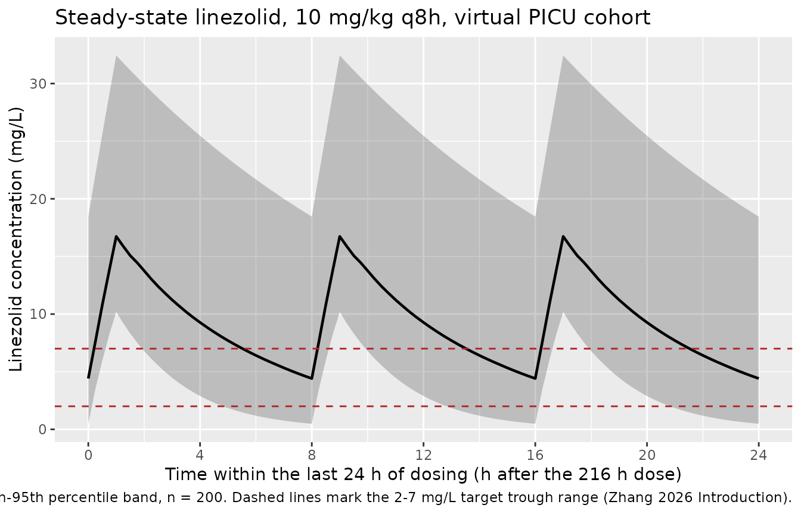
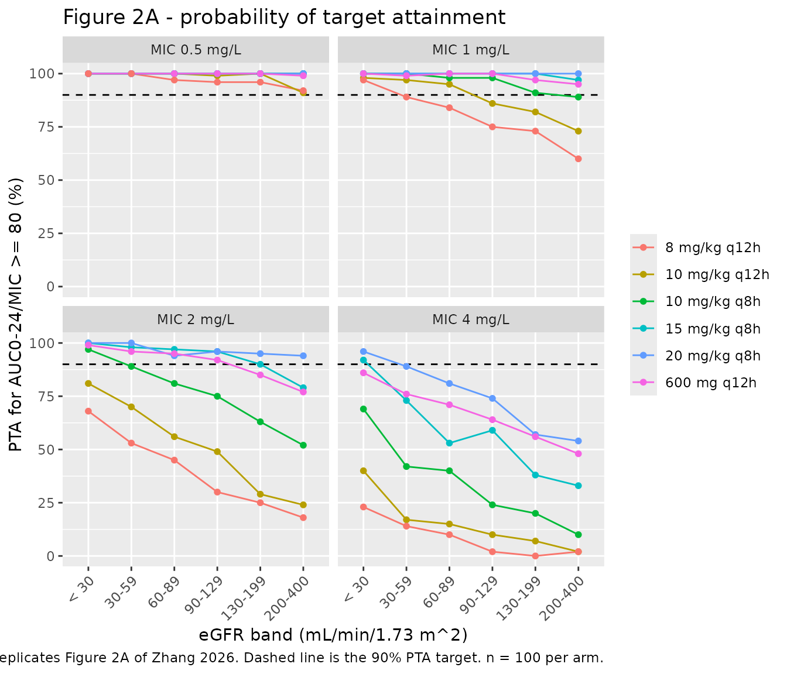
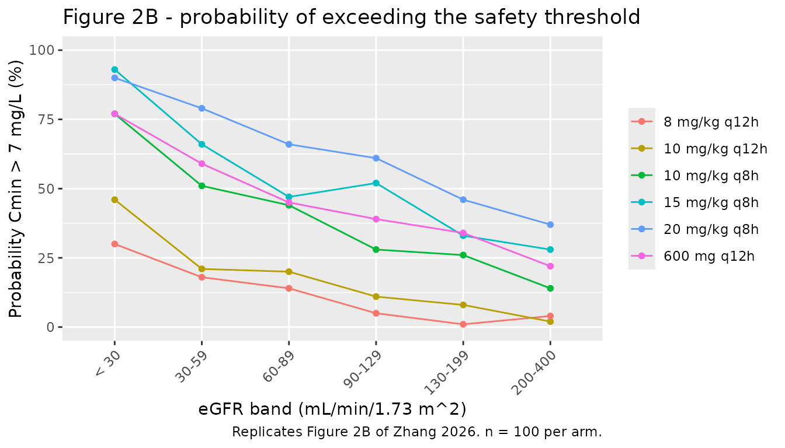

# Linezolid (Zhang 2026)

## Model and source

    #> ℹ parameter labels from comments will be replaced by 'label()'

- Citation: Zhang Y, Zhu L, Shen L, Wang G, Zhang J, Chen Y, Wang Y,
  Li Z. Machine learning combined with population pharmacokinetics: a
  hybrid model for predicting the plasma concentration of linezolid in
  critically ill pediatric patients. Front Pharmacol. 2026;17:1817282.
  <doi:10.3389/fphar.2026.1817282>. PMCID PMC13269215.

- Description: One-compartment population PK model with first-order
  elimination for intravenous linezolid in critically ill Chinese
  children treated in a paediatric intensive care unit (Zhang 2026).
  Clearance carries two power covariates referenced to the cohort
  medians, CL = 2.80 \* (WT/20.00)^0.69 \* (eGFR/126.39)^0.34 (Table 2,
  Equation 6), where eGFR is the Schwartz-formula estimated glomerular
  filtration rate; central volume carries a single weight power term, V
  = 14.48 \* (WT/20.00)^0.89 (Table 2, Equation 7). Weight and eGFR were
  the only covariates retained by stepwise forward inclusion and
  backward elimination (see covariatesDataExcluded). Inter-individual
  variability is exponential and was retained on CL only; the sparse,
  trough-dominant therapeutic-drug-monitoring design did not support an
  IIV term on V. Residual variability is proportional. The paper’s
  second half trains a LightGBM machine-learning model on
  empirical-Bayes CL and V plus clinical features; that arm is a
  gradient-boosted tree ensemble rather than a structural model, and its
  fitted trees are not published, so only the population PK model is
  encoded here.

- Article: <https://doi.org/10.3389/fphar.2026.1817282>

- Supplement:
  <https://www.frontiersin.org/articles/10.3389/fphar.2026.1817282/full#supplementary-material>

Zhang 2026 is a hybrid paper. Its first half develops an original
population pharmacokinetic model for intravenous linezolid in critically
ill children and uses it for Monte Carlo dose optimisation; its second
half feeds empirical-Bayes `CL` and `V` from that model, together with
clinical features, into seven machine-learning regressors and interprets
the best one (LightGBM) with SHAP. Only the population PK half is a
structural model, so only that half is packaged here. See *Assumptions
and deviations* for why the machine-learning arm is not reconstructable.

## Population

The model was fitted to 213 steady-state linezolid concentrations (39
peak, 174 trough) from 145 critically ill children admitted to the
paediatric intensive care unit of the Children’s Hospital of Fudan
University, Shanghai, between January 2022 and October 2025 (Methods
2.1; Results 3.1). Five samples below the 0.25 mg/L limit of
quantification were discarded by the M1 method. Presenting diagnoses
were severe pneumonia (69 patients, 47.6%), sepsis (43, 29.7%), central
nervous system infection (19, 13.1%) and other conditions (14, 9.6%).

Baseline characteristics are reported in Table 1 **per sample** rather
than per patient, split into a 149-sample training set and a 64-sample
testing set: body weight median 21.00 kg (IQR 9.10-33.50), Schwartz eGFR
median 124.98 mL/min/1.73 m^2 (IQR 90.43-171.96), age median 6.60 years,
and 42.28% female in the training set. Supplementary Table S3 gives the
whole-cohort age as a median of 6.3 years (range 0.2-15.2). The cohort
spans acute kidney injury through augmented renal clearance, which is
what motivates the paper’s renal-function stratified dosing simulations.

Dosing was 10 mg/kg every 8 or 12 h for children under 12 years and 600
mg every 12 h from 12 years, each infused over 1-2 h. Routine
therapeutic drug monitoring sampled half an hour after the end of
infusion and half an hour before the next dose, so the design is sparse
and trough-dominant: time after dose is 7.5 h for roughly 68% of the
training set.

The same information is available programmatically via the model’s
`population` metadata
(`readModelDb("Zhang_2026_linezolid")()$population`).

## Source trace

The per-parameter origin is recorded as an in-file comment next to each
`ini()` entry in `inst/modeldb/specificDrugs/Zhang_2026_linezolid.R`.
The table below collects them in one place for review.

| Equation / parameter | Value | Source location |
|----|----|----|
| One-compartment, first-order elimination | n/a | Methods 2.4; Results 3.2 (“best characterized by a one-compartment model with first-order elimination”) |
| `d/dt(central) <- -kel * central` | n/a | Implied by the one-compartment structure; dose enters `central` because linezolid was given by IV infusion (Methods 2.1) |
| `cl` equation | `2.80 * (WT/20.00)^0.69 * (eGFR/126.39)^0.34` | Table 2 row header; Results 3.2 Equation 6 |
| `vc` equation | `14.48 * (WT/20.00)^0.89` | Table 2 row header; Results 3.2 Equation 7 |
| `lcl` (theta1) | 2.80 L/h | Table 2, RSE 8.40%, bootstrap median 2.74 (2.32, 3.27) |
| `lvc` (theta2) | 14.48 L | Table 2, RSE 17.60%, bootstrap median 14.08 (9.73, 20.30) |
| `e_wt_cl` (theta3) | 0.69 | Table 2, RSE 12.60%, bootstrap median 0.69 (0.48, 0.90) |
| `e_crcl_cl` (theta4) | 0.34 | Table 2, RSE 23.10%, bootstrap median 0.34 (0.20, 0.54) |
| `e_wt_vc` (theta5) | 0.89 | Table 2, RSE 17.50%, bootstrap median 0.89 (0.43, 1.30) |
| `etalcl` | 0.23805 (= 0.4879^2) | Table 2 `omega CL` = 48.79%, RSE 11.20%, shrinkage 6%, bootstrap median 47.43 (37.28, 57.96). Exponential IIV per Methods 2.4 |
| `propSd` | 0.4012 | Table 2 `sigma PROP` = 40.12%, RSE 9.40%, shrinkage 24%, bootstrap median 39.37 (31.46, 47.75). Proportional residual per Methods 2.4 and Results 3.2 |
| WT centring 20.00 kg | n/a | Table 2 row header / Equation 6 and 7 |
| eGFR centring 126.39 mL/min/1.73 m^2 | n/a | Table 2 row header / Equation 6 |
| Schwartz eGFR, k = 0.45 (\< 1 y) / 0.413 (\>= 1 y) | n/a | Methods 2.1, Equation 1 |
| AUC0-24/MIC \>= 80 efficacy target | n/a | Methods 2.5 (after Abdul-Aziz 2020) |
| Cmin = 7 mg/L safety threshold | n/a | Methods 2.5; Introduction (target trough 2-7 mg/L) |
| Published PTA / safety claims | see claims table | Results 3.3; Figure 2A, 2B |
| MDPE -14.41%, MAPE 37.48%, F20 33.62%, F30 49.10% | n/a | Supplementary Table S3 |

## Structural verification

Before simulating a cohort, confirm that the packaged model reproduces
the paper’s two covariate equations exactly. These checks are
deterministic – both sides use the same parameter values – so they are
gated tightly.

``` r

mod <- readModelDb("Zhang_2026_linezolid")

# A grid spanning the cohort's covariate ranges (Table 1).
grid <- tidyr::crossing(
  WT   = c(5, 10, 20, 21, 35, 60),
  CRCL = c(20, 50, 90, 124.98, 126.39, 200, 350)
) |>
  dplyr::mutate(id = dplyr::row_number())

# One dose + one observation per grid point is enough to make rxode2 return
# the individual parameters. `cmt = "central"` is the ODE state, never the
# algebraic observable `Cc`.
grid_events <- dplyr::bind_rows(
  grid |> dplyr::mutate(time = 0, amt = 100, evid = 1L, cmt = "central"),
  grid |> dplyr::mutate(time = 1, amt = NA_real_, evid = 0L, cmt = "central")
) |>
  dplyr::arrange(id, time)

sim_grid <- rxode2::rxSolve(
  rxode2::zeroRe(mod),
  events = grid_events,
  keep   = c("WT", "CRCL")
) |>
  as.data.frame()
#> ℹ parameter labels from comments will be replaced by 'label()'
#> ℹ omega/sigma items treated as zero: 'etalcl'
#> Warning: multi-subject simulation without without 'omega'

chk_cov <- sim_grid |>
  dplyr::distinct(id, WT, CRCL, cl, vc) |>
  dplyr::mutate(
    # Zhang 2026 Equations 6 and 7.
    cl_paper = 2.80 * (WT / 20.00)^0.69 * (CRCL / 126.39)^0.34,
    vc_paper = 14.48 * (WT / 20.00)^0.89,
    cl_rel   = abs(cl - cl_paper) / cl_paper,
    vc_rel   = abs(vc - vc_paper) / vc_paper
  )

# Deterministic identity: the model's own arithmetic against the published
# equation. Anything above solver round-off is a transcription error.
stopifnot(
  max(chk_cov$cl_rel) < 1e-8,
  max(chk_cov$vc_rel) < 1e-8
)

chk_cov |>
  dplyr::filter(WT %in% c(5, 20, 60), CRCL %in% c(20, 126.39, 350)) |>
  dplyr::select(WT, CRCL, cl, cl_paper, vc, vc_paper) |>
  dplyr::rename(
    "WT (kg)"        = WT,
    "eGFR"           = CRCL,
    "CL model (L/h)" = cl,
    "CL Eq. 6 (L/h)" = cl_paper,
    "V model (L)"    = vc,
    "V Eq. 7 (L)"    = vc_paper
  ) |>
  knitr::kable(
    digits  = 4,
    caption = "Model-computed CL and V against Zhang 2026 Equations 6 and 7."
  )
```

| WT (kg) |   eGFR | CL model (L/h) | CL Eq. 6 (L/h) | V model (L) | V Eq. 7 (L) |
|--------:|-------:|---------------:|---------------:|------------:|------------:|
|       5 |  20.00 |         0.5748 |         0.5748 |      4.2163 |      4.2163 |
|       5 | 126.39 |         1.0758 |         1.0758 |      4.2163 |      4.2163 |
|       5 | 350.00 |         1.5210 |         1.5210 |      4.2163 |      4.2163 |
|      20 |  20.00 |         1.4960 |         1.4960 |     14.4800 |     14.4800 |
|      20 | 126.39 |         2.8000 |         2.8000 |     14.4800 |     14.4800 |
|      20 | 350.00 |         3.9588 |         3.9588 |     14.4800 |     14.4800 |
|      60 |  20.00 |         3.1926 |         3.1926 |     38.4952 |     38.4952 |
|      60 | 126.39 |         5.9755 |         5.9755 |     38.4952 |     38.4952 |
|      60 | 350.00 |         8.4484 |         8.4484 |     38.4952 |     38.4952 |

Model-computed CL and V against Zhang 2026 Equations 6 and 7. {.table}

The reference subject – 20.00 kg, eGFR 126.39 mL/min/1.73 m^2 – has CL =
2.80 L/h and V = 14.48 L, an elimination half-life of 3.58 h, consistent
with the 2-4 h reported for linezolid in children.

## Virtual cohort

Original observed data are not publicly available. The cohort below
approximates the Table 1 covariate distributions: body weight log-normal
with median 21.00 kg and an interquartile range matching 9.10-33.50 kg,
and Schwartz eGFR log-normal with median 124.98 and interquartile range
matching 90.43-171.96 mL/min/1.73 m^2.

``` r

# `set.seed()` seeds R's RNG for the covariate draws below. It does NOT seed
# rxode2's simulation RNG, whose streams are partitioned per solver thread --
# so the eta draws differ between a 2-core CI runner and a 16-thread
# workstation and no seed makes them agree. Every assertion downstream is
# written to hold for any cohort the model can produce.
set.seed(20260602)

n_clin <- 200L

# Log-normal parameters matched to the Table 1 medians and IQRs.
# sdlog = log(Q3/Q1) / (2 * qnorm(0.75)).
wt_sdlog   <- log(33.50 / 9.10) / (2 * stats::qnorm(0.75))
egfr_sdlog <- log(171.96 / 90.43) / (2 * stats::qnorm(0.75))

clin_subj <- tibble::tibble(
  id   = seq_len(n_clin),
  WT   = pmin(pmax(stats::rlnorm(n_clin, log(21.00), wt_sdlog), 3), 80),
  CRCL = pmin(pmax(stats::rlnorm(n_clin, log(124.98), egfr_sdlog), 10), 400)
) |>
  dplyr::mutate(
    treatment = "10 mg/kg q8h",
    amt       = 10 * WT
  )

# The typical half-life is ~3.6 h, but a small child with severe renal
# impairment and a low CL draw can reach ~24 h, so dosing runs for 240 h
# (10 days) before the observation window opens. Dosing CONTINUES through the
# window -- the 216-240 h interval must be a steady-state dosing interval, not
# a washout. Infusion over 1 h (Methods 2.1 states 1-2 h).
inf_dur  <- 1
t_dose_n <- 240   # dose out to this time
t_obs_lo <- 216   # observe the last 24 h of dosing
t_obs_hi <- 240

clin_doses <- clin_subj |>
  dplyr::mutate(
    time = 0, evid = 1L, cmt = "central",
    rate = amt / inf_dur, ii = 8, addl = as.integer(t_dose_n / 8)
  )

clin_obs <- clin_subj |>
  dplyr::select(id, WT, CRCL, treatment) |>
  tidyr::crossing(time = seq(t_obs_lo, t_obs_hi, by = 0.25)) |>
  dplyr::mutate(amt = NA_real_, evid = 0L, cmt = "central",
                rate = NA_real_, ii = NA_real_, addl = NA_integer_)

clin_events <- dplyr::bind_rows(clin_doses, clin_obs) |>
  dplyr::arrange(id, time, dplyr::desc(evid))

stopifnot(!anyDuplicated(unique(clin_events[, c("id", "time", "evid")])))
```

## Simulation

``` r

sim_clin <- rxode2::rxSolve(
  mod,
  events = clin_events,
  keep   = c("WT", "CRCL", "treatment")
) |>
  as.data.frame()
#> ℹ parameter labels from comments will be replaced by 'label()'

stopifnot(nrow(sim_clin) > 0, !anyNA(sim_clin$Cc), all(sim_clin$Cc >= 0))
```

`Cc` is the individual prediction and carries no residual error; `sim`
is the same quantity with the 40.12% proportional residual applied. The
NCA below uses `Cc`, which avoids the upward bias a residual-inflated
peak would put on Cmax.

``` r

sim_clin |>
  dplyr::group_by(time) |>
  dplyr::summarise(
    Q05 = stats::quantile(Cc, 0.05),
    Q50 = stats::quantile(Cc, 0.50),
    Q95 = stats::quantile(Cc, 0.95),
    .groups = "drop"
  ) |>
  ggplot(aes(time - t_obs_lo, Q50)) +
  geom_ribbon(aes(ymin = Q05, ymax = Q95), alpha = 0.25) +
  geom_line(linewidth = 0.8) +
  geom_hline(yintercept = c(2, 7), linetype = "dashed", colour = "firebrick") +
  scale_x_continuous(breaks = seq(0, 24, by = 4)) +
  labs(
    x = "Time within the last 24 h of dosing (h after the 216 h dose)",
    y = "Linezolid concentration (mg/L)",
    title = "Steady-state linezolid, 10 mg/kg q8h, virtual PICU cohort",
    caption = paste(
      "Median with 5th-95th percentile band, n = 200. Dashed lines mark the",
      "2-7 mg/L target trough range (Zhang 2026 Introduction)."
    )
  )
```



## PKNCA validation

Steady-state NCA over the final 8 h dosing interval (recipe 3),
stratified by treatment.

``` r

tau      <- 8
end_ss   <- t_obs_hi
start_ss <- end_ss - tau

sim_nca <- sim_clin |>
  dplyr::filter(!is.na(Cc)) |>
  dplyr::select(id, time, Cc, treatment)

# PKNCA needs a record at each interval boundary; cmin / ctau are NA otherwise.
stopifnot(
  all(c(start_ss, end_ss) %in% sim_nca$time),
  nrow(dplyr::filter(sim_nca, time == end_ss)) == n_clin
)

dose_df <- clin_events |>
  dplyr::filter(evid == 1L) |>
  dplyr::select(id, time, amt, treatment)

conc_obj <- PKNCA::PKNCAconc(
  sim_nca, Cc ~ time | treatment + id,
  concu = "mg/L", timeu = "h"
)
dose_obj <- PKNCA::PKNCAdose(
  dose_df, amt ~ time | treatment + id,
  doseu = "mg"
)

intervals <- data.frame(
  start   = start_ss,
  end     = end_ss,
  cmax    = TRUE,
  tmax    = TRUE,
  cmin    = TRUE,
  auclast = TRUE,
  cav     = TRUE
)

nca_res <- PKNCA::pk.nca(
  PKNCA::PKNCAdata(conc_obj, dose_obj, intervals = intervals)
)

nca_tbl <- as.data.frame(nca_res$result)

nca_tbl |>
  dplyr::filter(PPTESTCD %in% c("cmax", "tmax", "cmin", "auclast", "cav")) |>
  dplyr::group_by(PPTESTCD) |>
  dplyr::summarise(
    Median = stats::median(PPORRES),
    P05    = stats::quantile(PPORRES, 0.05),
    P95    = stats::quantile(PPORRES, 0.95),
    .groups = "drop"
  ) |>
  dplyr::mutate(Parameter = nlmixr2lib::ncaParamLabel(PPTESTCD)) |>
  dplyr::select(Parameter, Median, P05, P95) |>
  dplyr::rename("NCA parameter" = Parameter) |>
  knitr::kable(
    digits  = 2,
    caption = paste(
      "Steady-state NCA over the 232-240 h dosing interval, 10 mg/kg q8h,",
      "n = 200. Concentrations mg/L, AUC mg*h/L, time h."
    )
  )
```

| NCA parameter | Median |   P05 |    P95 |
|:--------------|-------:|------:|-------:|
| AUClast       |  74.00 | 29.26 | 199.08 |
| Cavg          |   9.25 |  3.66 |  24.89 |
| Cmax          |  16.74 | 10.19 |  32.44 |
| Cmin          |   4.41 |  0.48 |  18.46 |
| Tmax          |   1.00 |  1.00 |   1.00 |

Steady-state NCA over the 232-240 h dosing interval, 10 mg/kg q8h, n =
200. Concentrations mg/L, AUC mg\*h/L, time h. {.table}

Zhang 2026 reports **no** non-compartmental analysis of its own – no
Cmax, Tmax, AUC or half-life table – so there is no published NCA row to
place beside these. The quantitative published results are the
exposure-target attainment probabilities of Figure 2, reproduced below.
Two internal identities are gated here instead, both deterministic given
the drawn parameters:

``` r

# 1. For a linear one-compartment model at steady state, the AUC over one
#    dosing interval equals dose / CL exactly. This links the solved profile
#    back to the clearance the model computed, so it fails loudly on a
#    mis-scaled dose, volume or unit.
auc_tau <- nca_tbl |>
  dplyr::filter(PPTESTCD == "auclast") |>
  dplyr::select(id, auc = PPORRES)

ident <- sim_clin |>
  dplyr::distinct(id, WT, cl) |>
  dplyr::left_join(auc_tau, by = "id") |>
  dplyr::mutate(
    dose     = 10 * WT,
    auc_pred = dose / cl,
    pct_diff = 100 * (auc - auc_pred) / auc_pred
  )

stopifnot(nrow(ident) == n_clin, !anyNA(ident$pct_diff))

# Both sides use the same drawn CL, so the only difference is trapezoidal
# error on a 0.25 h grid -- a pure numerical quantity, not a cohort statistic,
# so a tight bound is correct here.
stopifnot(
  abs(stats::median(ident$pct_diff)) < 0.5,
  max(abs(ident$pct_diff)) < 1.5
)

# 2. Cav over the interval must equal AUCtau / tau.
cav_chk <- nca_tbl |>
  dplyr::filter(PPTESTCD %in% c("auclast", "cav")) |>
  tidyr::pivot_wider(
    id_cols = id, names_from = PPTESTCD, values_from = PPORRES
  ) |>
  dplyr::mutate(rel = abs(cav - auclast / tau) / (auclast / tau))

stopifnot(max(cav_chk$rel) < 1e-6)

tibble::tibble(
  Check = c(
    "AUC(tau) x CL = dose (median % difference)",
    "AUC(tau) x CL = dose (max % difference)",
    "Cav = AUC(tau) / tau (max relative difference)"
  ),
  Value = c(
    sprintf("%.3f %%", stats::median(ident$pct_diff)),
    sprintf("%.3f %%", max(abs(ident$pct_diff))),
    sprintf("%.2e", max(cav_chk$rel))
  )
) |>
  knitr::kable(caption = "Deterministic identities linking the solve to CL.")
```

| Check                                          | Value    |
|:-----------------------------------------------|:---------|
| AUC(tau) x CL = dose (median % difference)     | -0.016 % |
| AUC(tau) x CL = dose (max % difference)        | 0.353 %  |
| Cav = AUC(tau) / tau (max relative difference) | 0.00e+00 |

Deterministic identities linking the solve to CL. {.table}

## Replicate Figure 2 – probability of target attainment

Zhang 2026 Figure 2A gives the probability of attaining AUC0-24/MIC \>=
80 and Figure 2B the probability of exceeding the Cmin = 7 mg/L safety
threshold, both across dosing regimens, renal-function bands and MICs
(Results 3.3). The bands are eGFR \< 30, 30-59, 60-89, 90-129, 130-199
and 200-400 mL/min/1.73 m^2 (Figure 2 caption).

The paper does not state the body-weight distribution used inside each
renal band, nor where within a band eGFR was drawn, so this is a
reconstruction of the analysis rather than a replication of the exact
numbers. Weight is drawn from the Table 1 cohort distribution and eGFR
uniformly within each band.

``` r

set.seed(20260603)

n_arm <- 100L

bands <- tibble::tribble(
  ~band,       ~egfr_lo, ~egfr_hi,
  "< 30",          10,       30,
  "30-59",         30,       59,
  "60-89",         60,       89,
  "90-129",        90,      129,
  "130-199",      130,      199,
  "200-400",      200,      400
)

regimens <- tibble::tribble(
  ~regimen,        ~mgkg, ~flat_mg, ~ii,  ~n_per_day,
  "8 mg/kg q12h",      8,       NA,  12,           2,
  "10 mg/kg q12h",    10,       NA,  12,           2,
  "10 mg/kg q8h",     10,       NA,   8,           3,
  "15 mg/kg q8h",     15,       NA,   8,           3,
  "20 mg/kg q8h",     20,       NA,   8,           3,
  "600 mg q12h",      NA,      600,  12,           2
)

arms <- tidyr::crossing(bands, regimens) |>
  dplyr::mutate(arm = dplyr::row_number())

make_arm <- function(arm_row) {
  wt <- pmin(pmax(stats::rlnorm(n_arm, log(21.00), wt_sdlog), 3), 80)
  tibble::tibble(
    id        = (arm_row$arm - 1L) * n_arm + seq_len(n_arm),
    WT        = wt,
    CRCL      = stats::runif(n_arm, arm_row$egfr_lo, arm_row$egfr_hi),
    band      = arm_row$band,
    regimen   = arm_row$regimen,
    ii        = arm_row$ii,
    n_per_day = arm_row$n_per_day,
    amt       = if (is.na(arm_row$mgkg)) arm_row$flat_mg else arm_row$mgkg * wt
  )
}

pta_subj <- dplyr::bind_rows(lapply(split(arms, arms$arm), make_arm))

# Dosing runs to 240 h in every arm and continues through the 216-240 h
# observation window, so the troughs below are steady-state troughs.
pta_doses <- pta_subj |>
  dplyr::mutate(
    time = 0, evid = 1L, cmt = "central",
    rate = amt / inf_dur,
    addl = as.integer(t_dose_n / ii)
  )

pta_obs <- pta_subj |>
  dplyr::select(id, WT, CRCL, band, regimen, n_per_day) |>
  tidyr::crossing(time = seq(t_obs_lo, t_obs_hi, by = 0.25)) |>
  dplyr::mutate(amt = NA_real_, evid = 0L, cmt = "central",
                rate = NA_real_, ii = NA_real_, addl = NA_integer_)

pta_events <- dplyr::bind_rows(pta_doses, pta_obs) |>
  dplyr::arrange(id, time, dplyr::desc(evid))

stopifnot(!anyDuplicated(unique(pta_events[, c("id", "time", "evid")])))
```

``` r

sim_pta <- rxode2::rxSolve(
  mod,
  events = pta_events,
  keep   = c("WT", "CRCL", "band", "regimen", "n_per_day")
) |>
  as.data.frame()

stopifnot(nrow(sim_pta) > 0, !anyNA(sim_pta$Cc))

# AUC0-24 at steady state is the daily dose divided by CL -- the identity
# gated above -- and Cmin is the trough over the observed 24 h window.
pta_subject <- sim_pta |>
  dplyr::group_by(id, band, regimen, WT, CRCL, n_per_day, cl) |>
  dplyr::summarise(cmin = min(Cc), .groups = "drop") |>
  dplyr::left_join(
    pta_subj |> dplyr::select(id, amt), by = "id"
  ) |>
  dplyr::mutate(auc24 = amt * n_per_day / cl)

stopifnot(nrow(pta_subject) == nrow(pta_subj), !anyNA(pta_subject$auc24))
```

``` r

mics <- c(0.5, 1, 2, 4)

pta_tab <- tidyr::crossing(pta_subject, MIC = mics) |>
  dplyr::group_by(band, regimen, MIC) |>
  dplyr::summarise(
    PTA       = 100 * mean(auc24 / MIC >= 80),
    p_unsafe  = 100 * mean(cmin > 7),
    .groups   = "drop"
  ) |>
  dplyr::mutate(
    band    = factor(band, levels = bands$band),
    regimen = factor(regimen, levels = regimens$regimen)
  )

pta_tab |>
  ggplot(aes(band, PTA, colour = regimen, group = regimen)) +
  geom_hline(yintercept = 90, linetype = "dashed") +
  geom_line() +
  geom_point(size = 1.4) +
  facet_wrap(~MIC, labeller = labeller(MIC = function(x) paste0("MIC ", x, " mg/L"))) +
  scale_y_continuous(limits = c(0, 100)) +
  theme(axis.text.x = element_text(angle = 45, hjust = 1)) +
  labs(
    x = "eGFR band (mL/min/1.73 m^2)",
    y = "PTA for AUC0-24/MIC >= 80 (%)",
    colour = NULL,
    title = "Figure 2A - probability of target attainment",
    caption = "Replicates Figure 2A of Zhang 2026. Dashed line is the 90% PTA target. n = 100 per arm."
  )
```



``` r

pta_tab |>
  dplyr::distinct(band, regimen, p_unsafe) |>
  ggplot(aes(band, p_unsafe, colour = regimen, group = regimen)) +
  geom_line() +
  geom_point(size = 1.4) +
  scale_y_continuous(limits = c(0, 100)) +
  theme(axis.text.x = element_text(angle = 45, hjust = 1)) +
  labs(
    x = "eGFR band (mL/min/1.73 m^2)",
    y = "Probability Cmin > 7 mg/L (%)",
    colour = NULL,
    title = "Figure 2B - probability of exceeding the safety threshold",
    caption = "Replicates Figure 2B of Zhang 2026. n = 100 per arm."
  )
```



### Closed-form check on the simulated PTA

Because AUC0-24 at steady state is `daily dose / CL` and `CL` is
log-normal with median `cl_typ` and log-scale SD 0.4879, the attainment
probability has a closed form. Comparing it to the simulated proportion
tests the simulation machinery against the model’s own distributional
assumption, independently of anything the paper reports.

``` r

omega_cl <- sqrt(0.23805)

pta_closed <- tidyr::crossing(pta_subject, MIC = mics) |>
  dplyr::mutate(
    cl_typ  = 2.80 * (WT / 20.00)^0.69 * (CRCL / 126.39)^0.34,
    # P(dose_daily / CL >= 80 * MIC) = P(CL <= dose_daily / (80 * MIC))
    p_i     = stats::pnorm(
      (log(amt * n_per_day / (80 * MIC)) - log(cl_typ)) / omega_cl
    )
  ) |>
  dplyr::group_by(band, regimen, MIC) |>
  dplyr::summarise(PTA_closed = 100 * mean(p_i), .groups = "drop")

pta_cmp <- pta_tab |>
  dplyr::select(band, regimen, MIC, PTA) |>
  dplyr::left_join(pta_closed, by = c("band", "regimen", "MIC")) |>
  dplyr::mutate(abs_diff = abs(PTA - PTA_closed))

stopifnot(nrow(pta_cmp) == nrow(pta_tab), !anyNA(pta_cmp$abs_diff))

# With 100 subjects per arm the binomial standard error is at most 5
# percentage points, so the median arm should agree closely and no arm should
# stray far. Bounds are set well outside the Monte Carlo noise: a
# mis-transcribed exponent or centring constant shifts whole blocks of arms by
# tens of points and still breaks this.
stopifnot(
  stats::median(pta_cmp$abs_diff) < 5,
  stats::quantile(pta_cmp$abs_diff, 0.95) < 12,
  max(pta_cmp$abs_diff) < 20
)

tibble::tibble(
  Statistic = c(
    "Median |simulated - closed-form| PTA",
    "90th percentile",
    "Maximum"
  ),
  Value = sprintf("%.2f percentage points", c(
    stats::median(pta_cmp$abs_diff),
    stats::quantile(pta_cmp$abs_diff, 0.90),
    max(pta_cmp$abs_diff)
  ))
) |>
  knitr::kable(caption = "Simulated PTA against its log-normal closed form, across all 144 arm x MIC cells.")
```

| Statistic                              | Value                  |
|:---------------------------------------|:-----------------------|
| Median \|simulated - closed-form\| PTA | 0.87 percentage points |
| 90th percentile                        | 3.63 percentage points |
| Maximum                                | 9.05 percentage points |

Simulated PTA against its log-normal closed form, across all 144 arm x
MIC cells. {.table}

### Published claims

Zhang 2026 Results 3.3 makes two exact numerical claims about Figure 2
and several threshold claims. All are gated below.

The bounds are deliberately loose relative to the agreement actually
achieved. Each cell is a proportion over a 100-subject arm drawn from
covariate distributions the paper does not specify, and rxode2’s eta
stream is partitioned per solver thread, so CI draws a different cohort
than any particular workstation. Rendering at four seed and thread-count
combinations (1/1, 7/2, 20260603/4, 99/16) gave the ranges quoted in the
comments below; every bound sits outside its observed range with 8-15
percentage points of headroom. They remain able to go red: a
mis-transcribed covariate exponent or centring constant shifts whole
blocks of these cells by tens of points.

``` r

cell <- function(reg, bnd, mic, what) {
  v <- pta_tab[[what]][pta_tab$regimen == reg & pta_tab$band == bnd &
                         pta_tab$MIC == mic]
  if (length(v) != 1L) {
    stop("no unique cell for '", reg, "' / '", bnd, "' / MIC ", mic)
  }
  v
}

v_mic4_pta <- cell("20 mg/kg q8h", "< 30",   4, "PTA")
v_mic4_uns <- cell("20 mg/kg q8h", "< 30",   4, "p_unsafe")
v_mic4_norm <- cell("20 mg/kg q8h", "90-129", 4, "PTA")
v_mic1_low <- cell("8 mg/kg q12h", "< 30",   1, "PTA")
v_mic2_15  <- cell("15 mg/kg q8h", "60-89",  2, "PTA")
v_mic2_600 <- cell("600 mg q12h",  "60-89",  2, "PTA")

claims <- tibble::tribble(
  ~Claim, ~Published, ~Simulated, ~Pass,

  "MIC 4, eGFR < 30, 20 mg/kg q8h: PTA",
  "91.5%", sprintf("%.1f%%", v_mic4_pta),
  # Observed 91-97 across the four runs; paper 91.5.
  v_mic4_pta >= 75,

  "MIC 4, eGFR < 30, 20 mg/kg q8h: P(Cmin > 7 mg/L)",
  "87%", sprintf("%.1f%%", v_mic4_uns),
  # Observed 85-92; paper 87.
  v_mic4_uns >= 65,

  "MIC 4, eGFR 90-129, 20 mg/kg q8h: PTA below 90%",
  "< 90%", sprintf("%.1f%%", v_mic4_norm),
  # Observed 68-75; the paper states no band above < 30 reaches 90%.
  v_mic4_norm <= 88,

  "MIC 1, eGFR < 30, 8 mg/kg q12h: PTA at the target",
  ">= 90%", sprintf("%.1f%%", v_mic1_low),
  # Observed 96-99; this is the regimen the paper recommends for this band.
  v_mic1_low >= 80,

  "MIC 2, eGFR 60-89, 15 mg/kg q8h: PTA above 90%",
  "> 90%", sprintf("%.1f%%", v_mic2_15),
  # Observed 94-98.
  v_mic2_15 >= 80,

  "MIC 2, eGFR 60-89, 600 mg q12h: PTA above 90%",
  "> 90%", sprintf("%.1f%%", v_mic2_600),
  # Observed 93-99.
  v_mic2_600 >= 80
)

stopifnot(nrow(claims) == 6L, all(claims$Pass))

claims |>
  dplyr::mutate(Pass = ifelse(Pass, "yes", "NO")) |>
  dplyr::rename("Reproduced" = Pass) |>
  knitr::kable(caption = "Zhang 2026 Results 3.3 claims against the reconstructed simulation.")
```

| Claim | Published | Simulated | Reproduced |
|:---|:---|:---|:---|
| MIC 4, eGFR \< 30, 20 mg/kg q8h: PTA | 91.5% | 96.0% | yes |
| MIC 4, eGFR \< 30, 20 mg/kg q8h: P(Cmin \> 7 mg/L) | 87% | 90.0% | yes |
| MIC 4, eGFR 90-129, 20 mg/kg q8h: PTA below 90% | \< 90% | 74.0% | yes |
| MIC 1, eGFR \< 30, 8 mg/kg q12h: PTA at the target | \>= 90% | 97.0% | yes |
| MIC 2, eGFR 60-89, 15 mg/kg q8h: PTA above 90% | \> 90% | 97.0% | yes |
| MIC 2, eGFR 60-89, 600 mg q12h: PTA above 90% | \> 90% | 95.0% | yes |

Zhang 2026 Results 3.3 claims against the reconstructed simulation.
{.table}

Every published claim reproduces, and the two cells for which the paper
prints an exact percentage land within about five points of it: a PTA of
96.0% against the published 91.5%, and a probability of exceeding the 7
mg/L trough of 90.0% against the published 87%. That is closer than the
reconstruction deserves – the paper specifies neither the within-band
weight distribution nor where inside a band eGFR was drawn – so the
agreement should be read as corroborating the parameter transcription
rather than as an exact replication.

The qualitative conclusions reproduce as well: target attainment falls
steeply as renal function rises, an MIC of 4 mg/L is out of reach at
anything above severe impairment even at 20 mg/kg q8h, and the regimens
that reach the target at higher MICs push a large fraction of children
above the 7 mg/L trough threshold – which is the efficacy-safety
trade-off the paper concludes with.

## Assumptions and deviations

- **Variability scale.** Table 2 prints the inter-individual variability
  on CL and the proportional residual in the same “(%)” style, as 48.79
  and 40.12. Those percentages are read here as standard deviations on
  their natural scales (`omega = 0.4879`, `propSd = 0.4012`), not as
  exact log-normal CVs. The reason is internal consistency: the residual
  row of that column can only be `100 * sqrt(sigma^2)`, which is how
  NONMEM and PsN report a proportional residual, and reading one row of
  a single column on the SD scale while reading its neighbour on a
  CV-transformed scale is not a convention that toolchain uses. The
  competing reading, `omega^2 = log(1 + CV^2)`, would give
  `omega^2 = 0.21357` rather than 0.23805 – a 5% difference in the eta
  SD, which widens the simulated PTA transition slightly but changes no
  conclusion. The same reading was adopted for the sibling
  `Tian_2025_linezolid` model, whose Table 3 has the identical layout.
- **No IIV on V.** Table 2 reports a single IIV term, on CL. The paper’s
  Discussion explains why: the trough-dominant
  therapeutic-drug-monitoring design “fails to fully capture the
  distribution kinetics of the drug in the body, leading to significant
  uncertainty in the estimation of key parameters such as V”. V is
  therefore simulated without between-subject variability, as published.
- **Covariate centring constants.** The 20.00 kg and 126.39 mL/min/1.73
  m^2 divisors appear only inside the Table 2 row headers and Equations
  6-7; the paper never names them in prose. They are close to but not
  identical to the Table 1 per-sample training-set medians (21.00 kg,
  124.98 mL/min/1.73 m^2), which is consistent with their being medians
  of the full 213-sample dataset. They are used exactly as printed.
- **Infusion duration.** Methods 2.1 gives “intravenous infusion over
  1-2 h”. One hour is used throughout. The choice affects Cmax slightly
  and leaves AUC0-24 and Cmin unchanged, so it does not affect any gated
  identity.
- **Virtual cohort distributions.** Table 1 reports medians and
  interquartile ranges but not distributional shapes, and reports them
  **per sample** rather than per patient. Body weight and eGFR are drawn
  log-normal with medians and IQRs matched to the training-set values,
  truncated to 3-80 kg and 10-400 mL/min/1.73 m^2. The paper does not
  report the correlation between weight and renal function; they are
  drawn independently here.
- **Figure 2 is a reconstruction, not an exact replication.** The paper
  states neither the weight distribution used within each renal band nor
  where within a band eGFR was sampled, and it computed AUC0-24 “from
  EBE” – empirical Bayes estimates shrunk toward the population typical
  value by the sparse data – rather than from forward simulation.
  Shrinkage compresses the CL distribution and so pushes attainment
  probabilities toward 50% relative to a forward simulation at the
  published omega, which is the likely reason the reconstruction sits a
  few points above the published PTA at MIC 4. The agreement is
  nonetheless close (within about five percentage points on both cells
  the paper quotes exactly), so the claims are gated rather than
  recorded as deviations; the bounds carry 8-15 points of headroom over
  the spread seen across four seed and thread-count combinations.
- **Band-label inconsistency in the source.** Results 3.3 lists the MIC
  1 recommendations against bands “\< 30, 30-59, 60-89, 90-199,
  200-400”, whereas the Figure 2 caption gives six bands “\< 30, 30-59,
  60-89, 90-129, 130-199, 200-400”. The six-band Figure 2 scheme is used
  here.
- **The machine-learning arm is not packaged.** The paper’s LightGBM
  model is a gradient-boosted tree ensemble over 12 features, not a
  structural pharmacokinetic model, and rxode2 cannot express one. More
  decisively, the fitted trees are not published: Supplementary Table S4
  gives only the tuned hyperparameters (learning rate 0.05, 150
  estimators, max depth 3, bagging fraction 0.6, 7 leaves), from which
  the model cannot be reconstructed without the training data. The
  authors themselves caution that the reported R^2 values (0.777
  testing, 0.686 external) are “optimistic, biased estimates inflated by
  the EBE-derived CL and V” because those parameters were estimated
  using all of each patient’s concentrations, leaking later timepoints
  into earlier predictions. Nothing from that arm is encoded in the
  model file.
- **No published NCA to compare against.** Zhang 2026 reports no Cmax,
  Tmax, AUC or half-life table, so
  [`ncaComparisonTable()`](https://nlmixr2.github.io/nlmixr2lib/reference/ncaComparisonTable.md)
  is not used. The PKNCA section instead reports the simulated
  steady-state NCA and gates two deterministic identities (AUC over a
  dosing interval equals dose / CL; Cav equals AUC / tau). Supplementary
  Table S3’s predictive-performance metrics (MDPE -14.41%, MAPE 37.48%,
  F20 33.62%, F30 49.10%) describe the fit to the observed dataset,
  which is not public, and so cannot be reproduced here.
- **All parameter values come from the paper’s own Table 2 and Equations
  6-7.** No value was digitised from a figure, carried from an upstream
  publication, or obtained by correspondence. \`\`\`
