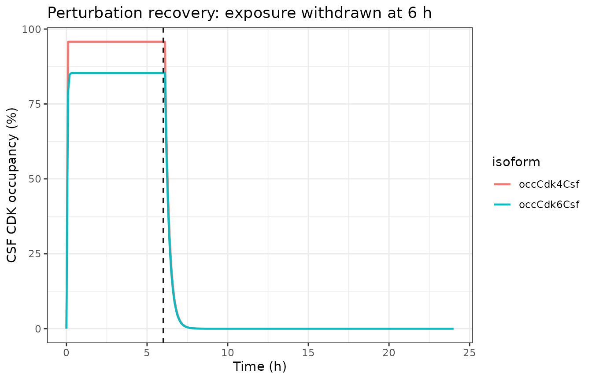
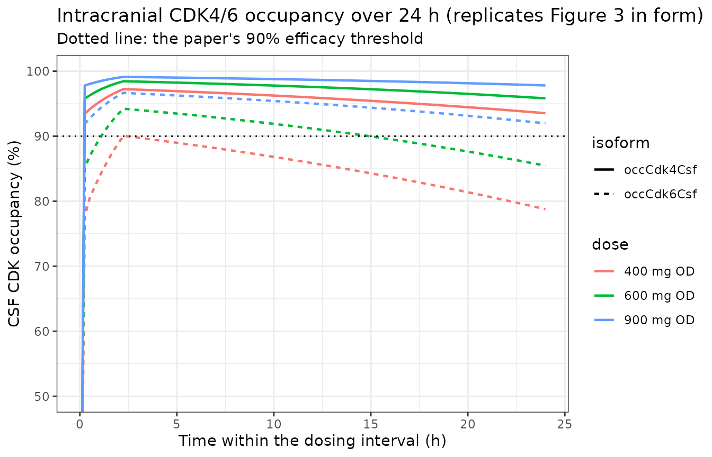

# Ribociclib intracranial CDK4/6 occupancy QSP (Zhang 2026)

## Model and source

- Citation: Zhang C, Li S, Ren J, Wen X. (2026). Optimizing ribociclib
  dosing in breast cancer with brain metastasis patients using a
  physiologically based pharmacokinetic model. BMC Cancer 26:204.
  <doi:10.1186/s12885-026-15561-x>. PMCID PMC12888661. Target-engagement
  equation from Methods, Eq 1 (attributed there to refs 17 and 31). All
  parameter values are from main-text Table 1 except the starting CDK4/6
  expression, which is given in the Methods prose beneath Eq 1, and the
  CSF-to-plasma unbound ratio Kp,uu, which is reported in the Results as
  a predicted quantity per dose level. Note that the trimmed markdown
  companion of this paper renders Eq 1 as a ‘formula-not-decoded’
  marker, so Eq 1 was recovered from the PDF. The single supplementary
  file (MOESM1) is one figure (S1, simulated intracranial CDK4/6
  occupancy by regimen) and contains no parameter table.
- Article (open access, CC BY-NC-ND 4.0):
  <https://doi.org/10.1186/s12885-026-15561-x>
- PMC record: <https://www.ncbi.nlm.nih.gov/pmc/articles/PMC12888661/>

``` r

mod <- readModelDb("Zhang_2026_ribociclib_qsp")
ui  <- rxode2::rxode2(mod)
mod
#> function() {
#>   description <- paste(
#>     "QSP. CDK4/6 target-engagement model for ribociclib (RIB) in the",
#>     "cerebrospinal fluid of patients with breast cancer and brain metastasis",
#>     "(BCBM). Ribociclib binds reversibly to a CDK4 pool and to a CDK6 pool",
#>     "(0.1 uM each) in CSF, and the resulting occupancy is the paper's efficacy",
#>     "readout: a CDK4/6 occupancy of at least 90% is the stated therapeutic",
#>     "target. Zhang 2026 includes NO tumor compartment -- Methods states",
#>     "explicitly that 'we used the free RIB concentration in CSF to calculate",
#>     "CDK4/6 occupancy' -- so occupancy is computed in CSF only, unlike the",
#>     "plasma-plus-CSF structure of the same team's abemaciclib model",
#>     "(Zhang_2025_abemaciclib_qsp).",
#>     "The ribociclib concentration is NOT fitted here: Zhang 2026 generated it",
#>     "with a whole-body PK-Sim 9.1 PBPK model that is a platform port",
#>     "(system-specific parameters came from the built-in PK-Sim database,",
#>     "distribution used the built-in Rodgers and Rowland method, and no organ",
#>     "ODEs, organ volumes, blood flows, per-organ partition coefficients or",
#>     ".pksim5 project are published -- the paper reports no volume term of any",
#>     "kind), so that layer is not reproducible from the on-disk sources and is",
#>     "deliberately NOT extracted. Total plasma concentration is instead supplied",
#>     "per record as the canonical time-varying covariate CP_RIB_NGML, and the",
#>     "fraction unbound and the CSF-to-plasma unbound ratio are applied inside",
#>     "model(), following the Zhang_2025_abemaciclib_qsp and",
#>     "Liang_2024_osimertinib_qsp precedents.",
#>     "Deterministic mechanism model: Zhang 2026 propagated variability through",
#>     "PK-Sim virtual-population physiology rather than fitting IIV or residual",
#>     "error, so no etas and no error model are encoded.",
#>     "Validated against the paper's own published predicted free-CSF",
#>     "concentrations (Table 2) the model reproduces both dosing claims that the",
#>     "paper states unambiguously: at 600 mg OD it returns CDK4 95.0% and CDK6",
#>     "82.9%, against the paper's 'CDK4 occupancy exceeded 90%, CDK6 stayed below",
#>     "90% but above 70%'; and at 900 mg OD it returns CDK4 98.1% and CDK6 92.8%,",
#>     "against the paper's 'both CDK4 and CDK6 occupancies surpassed 90%'. At",
#>     "400 mg OD it returns CDK6 73.9%, consistent with the paper's 'failed to",
#>     "reach 90%', but CDK4 91.7%, which marginally exceeds 90% where the paper",
#>     "reports a failure; see the vignette 'Assumptions and deviations' section,",
#>     "which quantifies that one discrepancy and notes that the anchor",
#>     "concentration comes from a glioblastoma validation cohort rather than the",
#>     "BCBM simulation cohort of Figure 3.",
#>     sep = " "
#>   )
#>   reference <- paste(
#>     "Zhang C, Li S, Ren J, Wen X. (2026). Optimizing ribociclib dosing in",
#>     "breast cancer with brain metastasis patients using a physiologically",
#>     "based pharmacokinetic model. BMC Cancer 26:204.",
#>     "doi:10.1186/s12885-026-15561-x. PMCID PMC12888661.",
#>     "Target-engagement equation from Methods, Eq 1 (attributed there to refs 17",
#>     "and 31). All parameter values are from main-text Table 1 except the",
#>     "starting CDK4/6 expression, which is given in the Methods prose beneath",
#>     "Eq 1, and the CSF-to-plasma unbound ratio Kp,uu, which is reported in the",
#>     "Results as a predicted quantity per dose level. Note that the trimmed",
#>     "markdown companion of this paper renders Eq 1 as a",
#>     "'formula-not-decoded' marker, so Eq 1 was recovered from the PDF.",
#>     "The single supplementary file (MOESM1) is one figure (S1, simulated",
#>     "intracranial CDK4/6 occupancy by regimen) and contains no parameter",
#>     "table.",
#>     sep = " "
#>   )
#>   vignette <- "Zhang_2026_ribociclib"
#> 
#>   units <- list(
#>     time          = "h",
#>     dosing        = "(not applicable; the ribociclib concentration is supplied as the time-varying covariate CP_RIB_NGML)",
#>     concentration = "nmol/L"
#>   )
#> 
#>   # The bound drug-CDK complexes are indexed by kinase isoform (CDK4 / CDK6)
#>   # and are specific to the CSF matrix, which the canonical bare `complex` name
#>   # cannot express. Declared here rather than silently warned on, following the
#>   # Zhang_2025_abemaciclib_qsp precedent.
#>   paper_specific_compartments <- c(
#>     "complex_cdk4_csf",
#>     "complex_cdk6_csf"
#>   )
#> 
#>   # Issue #482: what each ODE state holds, in what amount units, in what
#>   # biological matrix. Both states are molar concentrations of the drug-CDK
#>   # complex (the CDK pools are declared as 0.1 uM concentrations, not amounts).
#>   compartmentData <- list(
#>     complex_cdk4_csf = list(analyte = "ribociclib-CDK4 complex", units = "nmol/L", specimen = "CSF", verified = TRUE),
#>     complex_cdk6_csf = list(analyte = "ribociclib-CDK6 complex", units = "nmol/L", specimen = "CSF", verified = TRUE)
#>   )
#> 
#>   covariateData <- list(
#>     CP_RIB_NGML = list(
#>       description        = "Time-varying TOTAL ribociclib plasma concentration driving CDK4/6 engagement in CSF",
#>       units              = "ng/mL",
#>       type               = "continuous",
#>       reference_category = NULL,
#>       notes              = paste(
#>         "TOTAL (not free) plasma concentration. The free CSF concentration that",
#>         "actually drives binding is computed inside model() as",
#>         "CP_RIB_NGML * fup * kpuu, because Zhang 2026 defines Kp,uu as the",
#>         "'CSF-to-plasma unbound RIB concentration ratio'. Eq 1 defines its own",
#>         "driver as 'the concentration of free RIB present in CSF'; supplying a",
#>         "total plasma concentration is the more useful convention because that",
#>         "is what a PK model returns, and it matches the",
#>         "Zhang_2025_abemaciclib_qsp precedent.",
#>         "In the source study this concentration is produced by a whole-body",
#>         "PK-Sim 9.1 PBPK model that is not reproducible from the published",
#>         "sources and is not extracted (see description).",
#>         "Published steady-state anchors in patients (Zhang 2026 Table 2,",
#>         "PREDICTED column, Infante 2016 regimens, Day 18): Cmin 524 ng/mL and",
#>         "Cmax 1291 ng/mL at 400 mg OD; Cmin 797 and Cmax 2237 at 600 mg OD;",
#>         "Cmin 1456 and Cmax 3720 at 900 mg OD. Day 1 predicted Cmax is also",
#>         "tabulated for 750 mg (1240) and 1200 mg (2298) OD. Zhang 2026 reports",
#>         "no plasma profile for any twice-daily regimen, so the 200 / 300 /",
#>         "400 mg BID arms of its Figure 3 cannot be driven from published",
#>         "numbers alone."
#>       ),
#>       source_name        = "(none; computed by the PK-Sim PBPK model, not a named NONMEM data column)"
#>     )
#>   )
#> 
#>   population <- list(
#>     species        = "human (in silico; PK-Sim virtual populations matched to published clinical cohorts)",
#>     n_subjects     = NA_integer_,
#>     n_studies      = 4L,
#>     age_range      = "median 49 to 65 years across the contributing cohorts (Curigliano 57 and 65; Infante 60; Tien 49; Johnson 53)",
#>     sex_female_pct = NA_real_,
#>     disease_state  = "breast cancer with brain metastasis (BCBM) for the simulation population; the validation cohorts were HR-positive / HER2-negative breast cancer, Rb-positive breast cancer plus liposarcoma and colon cancer, recurrent glioblastoma, and glioblastoma",
#>     dose_range     = "ribociclib 200 to 1200 mg once daily or twice daily; plasma validation at 400, 600, 750, 900 and 1200 mg OD; CSF validation at 400, 600 and 900 mg OD; 600 mg OD is the standard approved regimen and 300 mg BID is the paper's recommended optimum for BCBM",
#>     regions        = NA_character_,
#>     notes          = paste(
#>       "Virtual-population demographics (sample size, age distribution, female",
#>       "proportion) were taken per scenario from the four clinical studies",
#>       "tabulated in Zhang 2026 Table 2 (Curigliano, Infante, Tien, Johnson),",
#>       "with PK-Sim database mean values substituted where a study did not",
#>       "report a characteristic. Cohort sizes per arm ranged from 3 to 24",
#>       "subjects. All simulations were performed in the fasting state.",
#>       "The virtual population used for the dose-optimisation simulations of",
#>       "Figure 3 was demographically aligned with Johnson's cohort.",
#>       "Disease physiology differs from healthy subjects in three respects that",
#>       "Zhang 2026 states explicitly (Methods): hepatic CYP3A4 expression 3.02",
#>       "versus roughly 5.5 uM (an approximately 45% downregulation), albumin",
#>       "3.1 versus 4.5 g/dL, and hematocrit 0.33 versus 0.43. Gastric emptying",
#>       "time was also set to a patient value of 190 min against 57-72 min in",
#>       "healthy individuals. NONE of these four enters the layer extracted",
#>       "here: all act on the un-extracted PBPK layer. The albumin difference",
#>       "reaches this layer only indirectly, through the Table 1 fraction",
#>       "unbound, which is itself a measured breast-cancer-patient value.",
#>       "There is no experimentally determined CDK4/6 occupancy in humans;",
#>       "Zhang 2026 states this as a limitation, and the starting CDK4/6",
#>       "expression is a default rather than a measurement."
#>     )
#>   )
#> 
#>   ini({
#>     # ======================================================================
#>     # Molecular weight -- used only to convert the ng/mL covariate to the
#>     # nmol/L scale on which Ki and the CDK pools are reported.
#>     # ======================================================================
#>     mw_rib <- fixed(434.6)
#>     label("Molecular weight of ribociclib (g/mol)")
#>     # Zhang 2026 Table 1, physicochemical block, MW row (source: ref 18).
#> 
#>     # ======================================================================
#>     # Plasma protein binding and CSF partitioning.
#>     # ======================================================================
#>     fup <- fixed(0.12)
#>     label("Fraction of ribociclib unbound in plasma (unitless)")
#>     # Zhang 2026 Table 1, physicochemical block, f_up row (source: ref 19,
#>     # Tien et al.). This is a measured value in breast-cancer patients, so it
#>     # already corresponds to the patient albumin of 3.1 g/dL recorded in the
#>     # Table 1 physiological block. Unlike the same team's abemaciclib paper,
#>     # Zhang 2026 publishes NO albumin-scaling equation for f_up, so none is
#>     # encoded here; the paper's 2.0-6.0 g/dL albumin sweep acts through the
#>     # un-extracted PBPK layer.
#> 
#>     kpuu <- fixed(1.03)
#>     label("CSF-to-plasma UNBOUND concentration ratio Kp,uu (unitless)")
#>     # Zhang 2026 Results, "PBPK model validation for plasma PK": the
#>     # PBPK-predicted mean Kp,uu values were 0.99 at 400 mg, 1.03 at 600 mg and
#>     # 1.10 at 900 mg (against observed 1.22, 1.29 and 1.63 respectively).
#>     # Set to the 600 mg value because 600 mg OD is the standard approved
#>     # regimen the paper benchmarks against; override in ini() for the other
#>     # dose levels. NOTE this is the paper's own PREDICTED output rather than a
#>     # Table 1 input parameter -- it is the one quantity in this file that the
#>     # un-extracted PBPK layer produced. It is close to unity at every reported
#>     # dose, so the free CSF concentration is nearly the free plasma
#>     # concentration.
#> 
#>     # ======================================================================
#>     # Equilibrium dissociation constants, one per kinase isoform.
#>     # ======================================================================
#>     kd4 <- fixed(10)
#>     label("Equilibrium dissociation constant of ribociclib for CDK4 (nmol/L)")
#>     # Zhang 2026 Table 1, CDK4/6 occupancy block, "K i (nM) 10/39" (source:
#>     # ref 24), first of the pair. The paper labels this Ki, but its own gloss
#>     # beneath Eq 1 states that "koff/Ki is equivalent to the association rate
#>     # constant (kon) of RIB to CDK4/6", which makes Ki an equilibrium
#>     # DISSOCIATION constant (Ki = koff/kon = Kd); it is therefore recorded
#>     # under the canonical `kd` name, matching Zhang_2025_abemaciclib_qsp.
#>     # Distinct from the Table 1 "auto-inhibition against CYP3A4, Ki 8.6 uM",
#>     # which is a true inhibition constant and belongs to the un-extracted
#>     # PBPK layer.
#> 
#>     kd6 <- fixed(39)
#>     label("Equilibrium dissociation constant of ribociclib for CDK6 (nmol/L)")
#>     # Zhang 2026 Table 1, CDK4/6 occupancy block, "K i (nM) 10/39", second of
#>     # the pair. Ribociclib is roughly 4-fold less potent against CDK6 than
#>     # against CDK4, which is the whole reason the paper's CDK6 occupancy
#>     # lags its CDK4 occupancy at every dose.
#> 
#>     # ======================================================================
#>     # Dissociation rate constant and starting CDK expression.
#>     # ======================================================================
#>     koff <- fixed(3.78)
#>     label("First-order dissociation rate constant of the drug-CDK complex (1/h)")
#>     # Zhang 2026 Table 1, CDK4/6 occupancy block, koff row: 0.063 /min,
#>     # "the fitting was performed using nonlinear analysis and the data were
#>     # sourced from Ref. 25". Converted to the model time base of hours:
#>     # 0.063 /min * 60 min/h = 3.78 /h. A single koff applies to both isoforms.
#>     # UNITS CONFLICT, resolved in favour of the table: Table 1 gives koff in
#>     # min^-1 while the prose gloss beneath Eq 1 calls it h^-1. The table is
#>     # taken as authoritative, and the same team's abemaciclib paper likewise
#>     # tabulates koff in min^-1 (0.10 /min). The choice does not affect any
#>     # steady-state result: koff cancels out of the equilibrium occupancy
#>     # C/(C + Kd) and sets only the rate of approach to it.
#> 
#>     cdk0 <- fixed(100)
#>     label("Starting expression of each CDK isoform, CDK4/6_0 (nmol/L)")
#>     # Zhang 2026 Methods, prose beneath Eq 1: "The initial expression level of
#>     # CDK4/6 was set to a value of 0.1 uM, given the absence of reported human
#>     # data." 0.1 uM = 100 nmol/L. Applied to the CDK4 pool and to the CDK6
#>     # pool separately, because the paper reports the two occupancies
#>     # separately throughout (Table 3 columns "CDK/4" and "CDK/6"; every panel
#>     # of Figure 3).
#>   })
#> 
#>   model({
#>     # =====================================================================
#>     # 1. Free ribociclib concentration in CSF.
#>     #
#>     #    Zhang 2026 defines Kp,uu as the "CSF-to-plasma unbound RIB
#>     #    concentration ratio", so
#>     #        C_CSF,free = Kp,uu * f_up * C_plasma,total
#>     #    and the covariate carries the TOTAL plasma concentration.
#>     #
#>     #    Cross-check against the paper's own numbers: the Table 2 predicted
#>     #    steady-state plasma Cmin at 600 mg OD is 797 ng/mL, giving
#>     #    797 * 0.12 * 1.03 = 98.5 ng/mL free in CSF, against the separately
#>     #    predicted Johnson-cohort CSF trough of 82.1 ng/mL at the same dose
#>     #    (20% apart, different virtual populations).
#>     # =====================================================================
#>     ccsf_ngml <- CP_RIB_NGML * fup * kpuu
#> 
#>     # Converted to the nmol/L scale of kd4, kd6 and cdk0:
#>     #     C[nmol/L] = C[ng/mL] / MW[g/mol] * 1000
#>     ccsf <- ccsf_ngml / mw_rib * 1000
#> 
#>     # =====================================================================
#>     # 2. Free (unoccupied) CDK available in each pool. One analyte, so each
#>     #    pool has a single binding partner and no competition term.
#>     # =====================================================================
#>     free_cdk4 <- cdk0 - complex_cdk4_csf
#>     free_cdk6 <- cdk0 - complex_cdk6_csf
#> 
#>     # =====================================================================
#>     # 3. Target engagement. Zhang 2026 Eq 1, recovered from the PDF (the
#>     #    trimmed markdown drops it as `formula-not-decoded`):
#>     #        dN/dt = (koff / Ki) * CDK_unbound * C_RIB - koff * CDK_bound
#>     #    where N is the drug-CDK complex and koff/Ki is the association rate
#>     #    constant. Applied per isoform, in CSF only -- Zhang 2026 Methods:
#>     #    "no tumor compartment was included in the model. Instead, we used the
#>     #    free RIB concentration in CSF to calculate CDK4/6 occupancy."
#>     # =====================================================================
#>     d/dt(complex_cdk4_csf) <- koff / kd4 * free_cdk4 * ccsf - koff * complex_cdk4_csf
#>     d/dt(complex_cdk6_csf) <- koff / kd6 * free_cdk6 * ccsf - koff * complex_cdk6_csf
#> 
#>     # =====================================================================
#>     # 4. Occupancy per isoform, as a percentage. Zhang 2026 uses a CDK4/6
#>     #    occupancy of at least 90% as the efficacy threshold (Methods,
#>     #    "Simulations for optimum dosing regimen for BCBM").
#>     #
#>     #    NOTE the paper is internally inconsistent about WHICH occupancy
#>     #    statistic the 90% threshold applies to: the Methods define the target
#>     #    as "maximal target occupancy (i.e., peak occupancy levels) at or
#>     #    above 90%", while the Table 3 sensitivity analysis reports "Tough
#>     #    [trough] CDK4/6 occupancy in CSF". Both are computable from these
#>     #    outputs; the vignette reports both and tabulates the consequence.
#>     # =====================================================================
#>     occCdk4Csf <- 100 * complex_cdk4_csf / cdk0
#>     occCdk6Csf <- 100 * complex_cdk6_csf / cdk0
#> 
#>     # Mass-balance check quantities: each equals cdk0 at all times.
#>     totalCdk4Csf <- free_cdk4 + complex_cdk4_csf
#>     totalCdk6Csf <- free_cdk6 + complex_cdk6_csf
#>   })
#> }
#> <environment: 0x5586afdf2c20>
```

Ribociclib (RIB) is a CDK4/6 inhibitor approved for
hormone-receptor-positive, HER2-negative advanced breast cancer at 600
mg once daily (OD). Zhang 2026 asks whether that regimen delivers enough
*intracranial* target engagement to treat brain metastases while staying
below a neutropenia-driven safety ceiling, and answers it by chaining
two layers: a whole-body PBPK model that predicts ribociclib
concentrations in plasma and cerebrospinal fluid (CSF), and a
target-engagement layer that converts the free CSF concentration into
CDK4 and CDK6 occupancy.

Ribociclib is roughly four-fold less potent against CDK6 than against
CDK4 (Ki 39 nM versus 10 nM). That single fact drives the paper’s entire
conclusion: at every regimen the authors simulate, CDK4 occupancy clears
the 90% efficacy bar well before CDK6 does, so the dose that satisfies
*both* isoforms is the binding constraint.

## What is extracted, and what is not

Zhang 2026 contains two modelling layers. The first is **not**
extracted.

| Layer | Content | Extracted? | Why |
|----|----|----|----|
| 1 | Whole-body PBPK for ribociclib in plasma, brain and CSF, built in PK-Sim 9.1 | **No** | A platform port. The Methods state that “system-specific parameters were primarily derived from the built-in PK-Sim database” and that distribution used PK-Sim’s built-in Rodgers and Rowland method. Table 1 publishes drug-specific inputs only. The paper reports **no volume term of any kind** – no Vd, no Vss, no partition-coefficient table (only a scalar `Kp scale` of 3.0 multiplying PK-Sim’s computed per-organ values), no organ volumes, no blood flows, no half-life, no terminal parameter. The only clearance printed is a renal `CL_R` of 1.22 L/h; everything else is a per-enzyme Vmax/Km that needs unpublished organ-level enzyme abundances to become a systemic clearance. No `.pksim5` project was deposited. The layer is not reproducible from the published sources, and filling the gaps from platform defaults would be fabrication. |
| 2 | CDK4/6 target engagement in CSF (Eq 1) | **Yes** | Eq 1 is printed in full and every constant it needs (`Ki` for both isoforms, `koff`, `f_up`, MW, `CDK4/6_0`, `Kp,uu`) is in main-text Table 1 or the Methods prose. |

Because layer 1 is not extracted, the ribociclib exposure is supplied as
the time-varying covariate `CP_RIB_NGML` (total plasma concentration,
ng/mL). This follows the `Zhang_2025_abemaciclib_qsp` and
`Liang_2024_osimertinib_qsp` precedents. `Richardson_2025_ribociclib` is
an in-library plasma popPK model that can serve as the driver, though it
originates from a different publication; everything below is driven
instead from Zhang 2026’s *own* published predicted concentrations, so
that no number in this vignette comes from outside the paper.

Note that Zhang 2026 includes **no tumor compartment** and computes
occupancy in **CSF only** – the Methods say “we used the free RIB
concentration in CSF to calculate CDK4/6 occupancy”. This is a
structural difference from the same team’s abemaciclib model, which
carries both a plasma and a CSF occupancy limb.

## Population

``` r

pop <- ui$population
tibble::tibble(Field = names(pop), Value = vapply(pop, function(x) paste(as.character(x), collapse = "; "), character(1))) |>
  knitr::kable()
```

| Field | Value |
|:---|:---|
| species | human (in silico; PK-Sim virtual populations matched to published clinical cohorts) |
| n_subjects | NA |
| n_studies | 4 |
| age_range | median 49 to 65 years across the contributing cohorts (Curigliano 57 and 65; Infante 60; Tien 49; Johnson 53) |
| sex_female_pct | NA |
| disease_state | breast cancer with brain metastasis (BCBM) for the simulation population; the validation cohorts were HR-positive / HER2-negative breast cancer, Rb-positive breast cancer plus liposarcoma and colon cancer, recurrent glioblastoma, and glioblastoma |
| dose_range | ribociclib 200 to 1200 mg once daily or twice daily; plasma validation at 400, 600, 750, 900 and 1200 mg OD; CSF validation at 400, 600 and 900 mg OD; 600 mg OD is the standard approved regimen and 300 mg BID is the paper’s recommended optimum for BCBM |
| regions | NA |
| notes | Virtual-population demographics (sample size, age distribution, female proportion) were taken per scenario from the four clinical studies tabulated in Zhang 2026 Table 2 (Curigliano, Infante, Tien, Johnson), with PK-Sim database mean values substituted where a study did not report a characteristic. Cohort sizes per arm ranged from 3 to 24 subjects. All simulations were performed in the fasting state. The virtual population used for the dose-optimisation simulations of Figure 3 was demographically aligned with Johnson’s cohort. Disease physiology differs from healthy subjects in three respects that Zhang 2026 states explicitly (Methods): hepatic CYP3A4 expression 3.02 versus roughly 5.5 uM (an approximately 45% downregulation), albumin 3.1 versus 4.5 g/dL, and hematocrit 0.33 versus 0.43. Gastric emptying time was also set to a patient value of 190 min against 57-72 min in healthy individuals. NONE of these four enters the layer extracted here: all act on the un-extracted PBPK layer. The albumin difference reaches this layer only indirectly, through the Table 1 fraction unbound, which is itself a measured breast-cancer-patient value. There is no experimentally determined CDK4/6 occupancy in humans; Zhang 2026 states this as a limitation, and the starting CDK4/6 expression is a default rather than a measurement. |

## Source trace

Every value in `ini()`, and the one equation in `model()`, traced to its
location in Zhang 2026.

``` r

tibble::tribble(
  ~Quantity,                       ~`Model name`,  ~Value,      ~`Source location`,
  "Molecular weight",              "mw_rib",       "434.6 g/mol", "Table 1, physicochemical block, MW row (ref 18)",
  "Fraction unbound in plasma",    "fup",          "0.12",        "Table 1, physicochemical block, f_up row (ref 19)",
  "CSF-to-plasma unbound ratio",   "kpuu",         "1.03",        "Results, 'PBPK model validation for plasma PK': predicted Kp,uu 0.99 / 1.03 / 1.10 at 400 / 600 / 900 mg",
  "Ki (equilibrium Kd) for CDK4",  "kd4",          "10 nmol/L",   "Table 1, CDK4/6 occupancy block, 'K i (nM) 10/39', first of pair (ref 24)",
  "Ki (equilibrium Kd) for CDK6",  "kd6",          "39 nmol/L",   "Table 1, CDK4/6 occupancy block, 'K i (nM) 10/39', second of pair (ref 24)",
  "Dissociation rate constant",    "koff",         "3.78 /h",     "Table 1, koff row: 0.063 /min, x 60 min/h (ref 25)",
  "Starting CDK4/6 expression",    "cdk0",         "100 nmol/L",  "Methods prose beneath Eq 1: 'set to a value of 0.1 uM'",
  "Target-engagement ODE",         "d/dt(complex)","Eq 1",        "Methods, Eq 1 (recovered from the PDF; the trimmed markdown renders it as 'formula-not-decoded')"
) |>
  knitr::kable()
```

| Quantity | Model name | Value | Source location |
|:---|:---|:---|:---|
| Molecular weight | mw_rib | 434.6 g/mol | Table 1, physicochemical block, MW row (ref 18) |
| Fraction unbound in plasma | fup | 0.12 | Table 1, physicochemical block, f_up row (ref 19) |
| CSF-to-plasma unbound ratio | kpuu | 1.03 | Results, ‘PBPK model validation for plasma PK’: predicted Kp,uu 0.99 / 1.03 / 1.10 at 400 / 600 / 900 mg |
| Ki (equilibrium Kd) for CDK4 | kd4 | 10 nmol/L | Table 1, CDK4/6 occupancy block, ‘K i (nM) 10/39’, first of pair (ref 24) |
| Ki (equilibrium Kd) for CDK6 | kd6 | 39 nmol/L | Table 1, CDK4/6 occupancy block, ‘K i (nM) 10/39’, second of pair (ref 24) |
| Dissociation rate constant | koff | 3.78 /h | Table 1, koff row: 0.063 /min, x 60 min/h (ref 25) |
| Starting CDK4/6 expression | cdk0 | 100 nmol/L | Methods prose beneath Eq 1: ‘set to a value of 0.1 uM’ |
| Target-engagement ODE | d/dt(complex) | Eq 1 | Methods, Eq 1 (recovered from the PDF; the trimmed markdown renders it as ‘formula-not-decoded’) |

### Units table (dimensional analysis)

``` r

tibble::tribble(
  ~Step, ~Expression, ~Units,
  "Covariate in",           "CP_RIB_NGML",                    "ng/mL (total plasma)",
  "Free plasma",            "CP_RIB_NGML * fup",              "ng/mL",
  "Free CSF",               "CP_RIB_NGML * fup * kpuu",       "ng/mL",
  "Molar conversion",       "ccsf_ngml / mw_rib * 1000",      "(ng/mL) / (g/mol) * 1000 = nmol/L",
  "Association rate",       "koff / kd4",                     "(1/h) / (nmol/L) = 1/(nmol/L * h)",
  "Association flux",       "koff/kd4 * free_cdk4 * ccsf",    "1/(nmol/L * h) * nmol/L * nmol/L = nmol/L/h",
  "Dissociation flux",      "koff * complex",                 "1/h * nmol/L = nmol/L/h",
  "Occupancy",              "100 * complex / cdk0",           "percent"
) |>
  knitr::kable()
```

| Step | Expression | Units |
|:---|:---|:---|
| Covariate in | CP_RIB_NGML | ng/mL (total plasma) |
| Free plasma | CP_RIB_NGML \* fup | ng/mL |
| Free CSF | CP_RIB_NGML \* fup \* kpuu | ng/mL |
| Molar conversion | ccsf_ngml / mw_rib \* 1000 | (ng/mL) / (g/mol) \* 1000 = nmol/L |
| Association rate | koff / kd4 | (1/h) / (nmol/L) = 1/(nmol/L \* h) |
| Association flux | koff/kd4 \* free_cdk4 \* ccsf | 1/(nmol/L \* h) \* nmol/L \* nmol/L = nmol/L/h |
| Dissociation flux | koff \* complex | 1/h \* nmol/L = nmol/L/h |
| Occupancy | 100 \* complex / cdk0 | percent |

Both limbs of Eq 1 carry nmol/L/h, so the ODE is dimensionally
consistent.

### Parameter table: paper vs. model file

``` r

iniDf <- ui$iniDf
iniDf |>
  dplyr::select(name, est, fix, label) |>
  knitr::kable()
```

| name | est | fix | label |
|:---|---:|:---|:---|
| mw_rib | 434.60 | TRUE | Molecular weight of ribociclib (g/mol) |
| fup | 0.12 | TRUE | Fraction of ribociclib unbound in plasma (unitless) |
| kpuu | 1.03 | TRUE | CSF-to-plasma UNBOUND concentration ratio Kp,uu (unitless) |
| kd4 | 10.00 | TRUE | Equilibrium dissociation constant of ribociclib for CDK4 (nmol/L) |
| kd6 | 39.00 | TRUE | Equilibrium dissociation constant of ribociclib for CDK6 (nmol/L) |
| koff | 3.78 | TRUE | First-order dissociation rate constant of the drug-CDK complex (1/h) |
| cdk0 | 100.00 | TRUE | Starting expression of each CDK isoform, CDK4/6_0 (nmol/L) |

``` r


# Every parameter must be fixed: this is a deterministic mechanism model.
stopifnot(all(iniDf$fix[!is.na(iniDf$ntheta)]))
# And there must be no random effects at all.
stopifnot(all(is.na(iniDf$neta1)))
```

## Building the exposure driver

Zhang 2026 Table 2 tabulates PBPK-**predicted** ribociclib exposures.
Two sets are used below, both from the predicted column so that the
comparison is against the paper’s own model rather than against raw
clinical observations.

``` r

# Predicted steady-state (Day 18) PLASMA exposures, Infante cohort.
plasma_anchors <- tibble::tribble(
  ~dose_mg, ~kpuu, ~cmax_ngml, ~cmin_ngml,
  400,      0.99,  1291,       524,
  600,      1.03,  2237,       797,
  900,      1.10,  3720,       1456
)

# Predicted free-CSF concentrations (Day 5), Tien and Johnson cohorts.
# Table 2 footnote: "Ct total free exposure in CSF".
csf_anchors <- tibble::tribble(
  ~label,               ~dose_mg, ~kpuu, ~csf_ngml,
  "Johnson, 400 mg OD, Ct",   400, 0.99,  48.1,
  "Johnson, 600 mg OD, Ct",   600, 1.03,  82.1,
  "Tien, 900 mg OD, C98h",    900, 1.10,  220.0,
  "Tien, 900 mg OD, C104h",   900, 1.10,  186.2,
  "Tien, 900 mg OD, C120h",   900, 1.10,  76.8
)

knitr::kable(plasma_anchors)
```

| dose_mg | kpuu | cmax_ngml | cmin_ngml |
|--------:|-----:|----------:|----------:|
|     400 | 0.99 |      1291 |       524 |
|     600 | 1.03 |      2237 |       797 |
|     900 | 1.10 |      3720 |      1456 |

``` r

knitr::kable(csf_anchors)
```

| label                  | dose_mg | kpuu | csf_ngml |
|:-----------------------|--------:|-----:|---------:|
| Johnson, 400 mg OD, Ct |     400 | 0.99 |     48.1 |
| Johnson, 600 mg OD, Ct |     600 | 1.03 |     82.1 |
| Tien, 900 mg OD, C98h  |     900 | 1.10 |    220.0 |
| Tien, 900 mg OD, C104h |     900 | 1.10 |    186.2 |
| Tien, 900 mg OD, C120h |     900 | 1.10 |     76.8 |

The model consumes a *total plasma* concentration, so a published
free-CSF concentration is converted back with the paper’s own relation
`C_CSF,free = Kp,uu * f_up * C_plasma,total`.

``` r

FUP <- 0.12
MW  <- 434.6

plasma_from_csf <- function(csf_ngml, kpuu) csf_ngml / (FUP * kpuu)
csf_from_plasma <- function(cp_ngml, kpuu)  cp_ngml * FUP * kpuu
ngml_to_nm      <- function(x) x / MW * 1000

# Analytic (Langmuir) occupancy at equilibrium, for a free CSF concentration
# expressed in nmol/L. Derived below from Eq 1 by setting dN/dt = 0.
langmuir <- function(c_nm, kd) 100 * c_nm / (c_nm + kd)
```

An internal consistency check of that relation against the paper’s two
independent prediction sets: the predicted steady-state plasma trough at
600 mg OD, pushed through `Kp,uu * f_up`, should land near the
separately predicted CSF trough at the same dose.

``` r

derived_600 <- csf_from_plasma(797, 1.03)
c(derived_from_plasma = derived_600, published_csf = 82.1,
  pct_diff = 100 * (derived_600 - 82.1) / 82.1)
#> derived_from_plasma       published_csf            pct_diff 
#>            98.50920            82.10000            19.98685
```

The two agree to about 20%, across different virtual populations
(Infante’s breast-cancer / liposarcoma / colon-cancer cohort versus
Johnson’s glioblastoma cohort), which supports using either as a driver.

``` r

# Observation-only event table: there are no dosing events in the extracted
# layer -- the drug enters entirely through the covariate. `cmt` points at a
# real ODE state, never at an algebraic observable.
obs_grid <- function(times) {
  rxode2::et(times) |>
    as.data.frame() |>
    dplyr::mutate(cmt = "complex_cdk4_csf")
}

# Deterministic model with no random effects, so one "subject" per arm suffices.
solve_const <- function(cp_ngml, kpuu, times = seq(0, 48, by = 0.25)) {
  ev <- obs_grid(times)
  ev$CP_RIB_NGML <- cp_ngml
  out <- rxode2::rxSolve(ui, ev, params = c(kpuu = kpuu), returnType = "data.frame")
  if (is.null(out$id)) out$id <- 1L
  out
}
```

## Validation

### 1. Baseline hold (zero exposure)

With no drug present, both complexes must stay at zero and both
occupancies at zero for all time.

``` r

base <- solve_const(cp_ngml = 0, kpuu = 1.03)

stopifnot(
  max(abs(base$complex_cdk4_csf)) < 1e-10,
  max(abs(base$complex_cdk6_csf)) < 1e-10,
  max(abs(base$occCdk4Csf))       < 1e-8,
  max(abs(base$occCdk6Csf))       < 1e-8
)
c(max_complex_cdk4 = max(abs(base$complex_cdk4_csf)),
  max_complex_cdk6 = max(abs(base$complex_cdk6_csf)))
#> max_complex_cdk4 max_complex_cdk6 
#>                0                0
```

### 2. Mass balance: each CDK pool is conserved

`free_cdk4 + complex_cdk4_csf` must equal `cdk0` = 100 nmol/L at every
time point, and likewise for CDK6. This is exact by construction, so the
tolerance is solver noise rather than a modelling allowance.

``` r

mb <- solve_const(cp_ngml = plasma_from_csf(220.0, 1.10), kpuu = 1.10)

err4 <- max(abs(mb$totalCdk4Csf - 100))
err6 <- max(abs(mb$totalCdk6Csf - 100))
stopifnot(err4 < 1e-8, err6 < 1e-8)
c(max_massbalance_error_cdk4 = err4, max_massbalance_error_cdk6 = err6)
#> max_massbalance_error_cdk4 max_massbalance_error_cdk6 
#>                          0                          0
```

### 3. Analytic steady state of the binding layer

Setting `dN/dt = 0` in Eq 1 with a constant free concentration `C` gives

    (koff/Kd) * (CDK0 - N) * C = koff * N
      =>  N / CDK0 = C / (C + Kd)

the Langmuir isotherm. `koff` cancels entirely, so the equilibrium
occupancy depends only on `C` and `Kd` – which is why the `koff` units
conflict noted in the model file (Table 1 says min⁻¹, the Eq 1 gloss
says h⁻¹) cannot affect any steady-state result in this vignette.

``` r

iso_check <- lapply(seq_len(nrow(csf_anchors)), function(i) {
  a  <- csf_anchors[i, ]
  s  <- solve_const(plasma_from_csf(a$csf_ngml, a$kpuu), a$kpuu)
  fin <- s[nrow(s), ]
  cnm <- ngml_to_nm(a$csf_ngml)
  tibble::tibble(
    label       = a$label,
    csf_ngml    = a$csf_ngml,
    csf_nM      = cnm,
    ode_cdk4    = fin$occCdk4Csf,
    exact_cdk4  = langmuir(cnm, 10),
    ode_cdk6    = fin$occCdk6Csf,
    exact_cdk6  = langmuir(cnm, 39)
  )
}) |> dplyr::bind_rows()

max_iso_err <- max(abs(c(iso_check$ode_cdk4 - iso_check$exact_cdk4,
                         iso_check$ode_cdk6 - iso_check$exact_cdk6)))
stopifnot(max_iso_err < 1e-6)

iso_check |>
  dplyr::mutate(
    csf_nM     = round(csf_nM, 2),
    ode_cdk4   = round(ode_cdk4, 4),
    exact_cdk4 = round(exact_cdk4, 4),
    ode_cdk6   = round(ode_cdk6, 4),
    exact_cdk6 = round(exact_cdk6, 4)
  ) |>
  knitr::kable()
```

| label                  | csf_ngml | csf_nM | ode_cdk4 | exact_cdk4 | ode_cdk6 | exact_cdk6 |
|:-----------------------|---------:|-------:|---------:|-----------:|---------:|-----------:|
| Johnson, 400 mg OD, Ct |     48.1 | 110.68 |  91.7134 |    91.7134 |  73.9438 |    73.9438 |
| Johnson, 600 mg OD, Ct |     82.1 | 188.91 |  94.9726 |    94.9726 |  82.8879 |    82.8879 |
| Tien, 900 mg OD, C98h  |    220.0 | 506.21 |  98.0628 |    98.0628 |  92.8468 |    92.8468 |
| Tien, 900 mg OD, C104h |    186.2 | 428.44 |  97.7192 |    97.7192 |  91.6567 |    91.6567 |
| Tien, 900 mg OD, C120h |     76.8 | 176.71 |  94.6442 |    94.6442 |  81.9205 |    81.9205 |

``` r

c(max_abs_deviation_from_langmuir_pct = max_iso_err)
#> max_abs_deviation_from_langmuir_pct 
#>                        1.421085e-14
```

The ODE reproduces the closed form to better than 1e-6 percentage
points. Both sides use the same parameters, so this is pure numerical
error and the tight bound is the correct assertion.

### 4. Equilibration is fast relative to the dosing interval

The paper compares occupancy at peak and at trough. That reading is only
valid if the complex tracks the concentration essentially
instantaneously. Starting from zero complex at a 600 mg trough
concentration, measure the time to reach 99% of the equilibrium value.

``` r

fast <- solve_const(797, 1.03, times = seq(0, 6, by = 0.01))
eq4  <- langmuir(ngml_to_nm(csf_from_plasma(797, 1.03)), 10)
eq6  <- langmuir(ngml_to_nm(csf_from_plasma(797, 1.03)), 39)

t99_4 <- min(fast$time[fast$occCdk4Csf >= 0.99 * eq4])
t99_6 <- min(fast$time[fast$occCdk6Csf >= 0.99 * eq6])

stopifnot(t99_4 < 1, t99_6 < 1)
c(t99_cdk4_h = t99_4, t99_cdk6_h = t99_6)
#> t99_cdk4_h t99_cdk6_h 
#>       0.06       0.18
```

Both isoforms equilibrate in well under an hour against a 24 h (OD) or
12 h (BID) dosing interval, so peak and trough occupancy are the
Langmuir values at peak and trough concentration. Every occupancy figure
below rests on that.

### 5. Perturbation recovery (washout)

Drug removal must return both pools to zero occupancy.

``` r

wash_ev <- obs_grid(seq(0, 24, by = 0.1))
wash_ev$CP_RIB_NGML <- ifelse(wash_ev$time <= 6, 797, 0)
wash <- rxode2::rxSolve(mod, wash_ev, params = c(kpuu = 1.03), returnType = "data.frame")

stopifnot(
  wash$occCdk4Csf[wash$time == 6] > 90,
  dplyr::last(wash$occCdk4Csf) < 1e-4,
  dplyr::last(wash$occCdk6Csf) < 1e-4
)

ggplot(
  wash |> tidyr::pivot_longer(c(occCdk4Csf, occCdk6Csf), names_to = "isoform", values_to = "occupancy"),
  aes(time, occupancy, colour = isoform)
) +
  geom_line(linewidth = 0.8) +
  geom_vline(xintercept = 6, linetype = "dashed") +
  labs(x = "Time (h)", y = "CSF CDK occupancy (%)",
       title = "Perturbation recovery: exposure withdrawn at 6 h") +
  theme_bw()
```



## Replicating the paper’s occupancy results

### Occupancy at the paper’s own predicted free-CSF concentrations

Each row takes a predicted CSF concentration straight from Table 2 and
reports the occupancy the extracted model returns.

``` r

occ_anchor <- iso_check |>
  dplyr::transmute(
    `CSF anchor (Table 2, predicted)` = label,
    `C (ng/mL)`    = csf_ngml,
    `C (nmol/L)`   = round(csf_nM, 1),
    `CDK4 occ (%)` = round(ode_cdk4, 1),
    `CDK6 occ (%)` = round(ode_cdk6, 1)
  )
knitr::kable(occ_anchor)
```

| CSF anchor (Table 2, predicted) | C (ng/mL) | C (nmol/L) | CDK4 occ (%) | CDK6 occ (%) |
|:---|---:|---:|---:|---:|
| Johnson, 400 mg OD, Ct | 48.1 | 110.7 | 91.7 | 73.9 |
| Johnson, 600 mg OD, Ct | 82.1 | 188.9 | 95.0 | 82.9 |
| Tien, 900 mg OD, C98h | 220.0 | 506.2 | 98.1 | 92.8 |
| Tien, 900 mg OD, C104h | 186.2 | 428.4 | 97.7 | 91.7 |
| Tien, 900 mg OD, C120h | 76.8 | 176.7 | 94.6 | 81.9 |

### Steady-state peak and trough occupancy by regimen (Figure 3)

Driving instead from the predicted steady-state plasma Cmax and Cmin,
which is what Figure 3’s regimen comparison rests on.

``` r

regimen <- plasma_anchors |>
  dplyr::mutate(
    csf_peak_ngml   = csf_from_plasma(cmax_ngml, kpuu),
    csf_trough_ngml = csf_from_plasma(cmin_ngml, kpuu),
    peak_cdk4  = langmuir(ngml_to_nm(csf_peak_ngml),   10),
    peak_cdk6  = langmuir(ngml_to_nm(csf_peak_ngml),   39),
    trough_cdk4 = langmuir(ngml_to_nm(csf_trough_ngml), 10),
    trough_cdk6 = langmuir(ngml_to_nm(csf_trough_ngml), 39)
  )

# Confirm the closed form against the ODE for every regimen, at both extremes.
ode_chk <- lapply(seq_len(nrow(regimen)), function(i) {
  r  <- regimen[i, ]
  pk <- solve_const(r$cmax_ngml, r$kpuu); tr <- solve_const(r$cmin_ngml, r$kpuu)
  c(dplyr::last(pk$occCdk4Csf) - r$peak_cdk4,  dplyr::last(pk$occCdk6Csf) - r$peak_cdk6,
    dplyr::last(tr$occCdk4Csf) - r$trough_cdk4, dplyr::last(tr$occCdk6Csf) - r$trough_cdk6)
})
stopifnot(max(abs(unlist(ode_chk))) < 1e-6)

regimen |>
  dplyr::transmute(
    `Regimen`          = paste0(dose_mg, " mg OD"),
    `Peak CDK4 (%)`    = round(peak_cdk4, 1),
    `Peak CDK6 (%)`    = round(peak_cdk6, 1),
    `Trough CDK4 (%)`  = round(trough_cdk4, 1),
    `Trough CDK6 (%)`  = round(trough_cdk6, 1)
  ) |>
  knitr::kable()
```

| Regimen   | Peak CDK4 (%) | Peak CDK6 (%) | Trough CDK4 (%) | Trough CDK6 (%) |
|:----------|--------------:|--------------:|----------------:|----------------:|
| 400 mg OD |          97.2 |          90.0 |            93.5 |            78.6 |
| 600 mg OD |          98.5 |          94.2 |            95.8 |            85.3 |
| 900 mg OD |          99.1 |          96.7 |            97.8 |            91.9 |

#### Gate against the paper’s stated claims

Zhang 2026 states two regimen results unambiguously in the Results
section “Simulations in BCBM for different dosing regimen”:

- 600 mg OD – “CDK4 occupancy exceeded 90% … though CDK6 occupancy
  stayed below 90% but above 70%”.
- 900 mg OD – “Both CDK4 and CDK6 occupancies surpassed 90%”.

Both are trough-referenced statements (Table 3 reports “Tough \[trough\]
CDK4/6 occupancy in CSF”), so they are gated on the trough column.

``` r

g600 <- regimen[regimen$dose_mg == 600, ]
g900 <- regimen[regimen$dose_mg == 900, ]

# Guard that the lookups actually matched rows (a zero-row filter would make
# every all() below vacuously TRUE).
stopifnot(nrow(g600) == 1L, nrow(g900) == 1L)

stopifnot(
  # 600 mg OD: CDK4 clears 90%, CDK6 sits in the 70-90% band.
  g600$trough_cdk4 > 90,
  g600$trough_cdk6 > 70, g600$trough_cdk6 < 90,
  # 900 mg OD: both isoforms clear 90%.
  g900$trough_cdk4 > 90,
  g900$trough_cdk6 > 90,
  # The paper's mechanism: CDK4 engagement leads CDK6 at every dose.
  all(regimen$trough_cdk4 > regimen$trough_cdk6),
  all(regimen$peak_cdk4   > regimen$peak_cdk6)
)

tibble::tribble(
  ~Claim,                                        ~`Paper`,                 ~`Model`,
  "600 mg OD, trough CDK4",                      "> 90%",                  sprintf("%.1f%%", g600$trough_cdk4),
  "600 mg OD, trough CDK6",                      "70-90%",                 sprintf("%.1f%%", g600$trough_cdk6),
  "900 mg OD, trough CDK4",                      "> 90%",                  sprintf("%.1f%%", g900$trough_cdk4),
  "900 mg OD, trough CDK6",                      "> 90%",                  sprintf("%.1f%%", g900$trough_cdk6)
) |>
  knitr::kable()
```

| Claim                  | Paper  | Model |
|:-----------------------|:-------|:------|
| 600 mg OD, trough CDK4 | \> 90% | 95.8% |
| 600 mg OD, trough CDK6 | 70-90% | 85.3% |
| 900 mg OD, trough CDK4 | \> 90% | 97.8% |
| 900 mg OD, trough CDK6 | \> 90% | 91.9% |

Both published regimen claims are reproduced.

### Occupancy time course over a dosing interval

An illustrative 24 h steady-state profile at each dose, interpolated
between the paper’s own published Cmax and Cmin anchors (log-linear
decay from Cmax at an assumed Tmax of 2 h down to Cmin at 24 h, and a
log-linear rise before Tmax). Tmax is the one quantity here that Zhang
2026 does not report – see “Assumptions and deviations”.

``` r

TMAX <- 2

profile_for <- function(dose_mg) {
  r <- regimen[regimen$dose_mg == dose_mg, ]
  stopifnot(nrow(r) == 1L)
  tt <- seq(0, 24, by = 0.25)
  cp <- ifelse(
    tt <= TMAX,
    r$cmin_ngml * (r$cmax_ngml / r$cmin_ngml)^(tt / TMAX),
    r$cmax_ngml * (r$cmin_ngml / r$cmax_ngml)^((tt - TMAX) / (24 - TMAX))
  )
  ev <- obs_grid(tt)
  ev$CP_RIB_NGML <- cp
  out <- rxode2::rxSolve(mod, ev, params = c(kpuu = r$kpuu), returnType = "data.frame")
  out$dose <- paste0(dose_mg, " mg OD")
  out
}

tc <- dplyr::bind_rows(lapply(plasma_anchors$dose_mg, profile_for))

ggplot(
  tc |> tidyr::pivot_longer(c(occCdk4Csf, occCdk6Csf), names_to = "isoform", values_to = "occupancy"),
  aes(time, occupancy, colour = dose, linetype = isoform)
) +
  geom_line(linewidth = 0.8) +
  geom_hline(yintercept = 90, linetype = "dotted") +
  coord_cartesian(ylim = c(50, 100)) +
  labs(x = "Time within the dosing interval (h)", y = "CSF CDK occupancy (%)",
       title = "Intracranial CDK4/6 occupancy over 24 h (replicates Figure 3 in form)",
       subtitle = "Dotted line: the paper's 90% efficacy threshold") +
  theme_bw()
```



The CDK4 traces sit above the 90% line across the whole interval at
every dose, while the CDK6 traces cross it only at 900 mg – the paper’s
central finding.

## Assumptions and deviations

### The PBPK layer is not extracted

The whole-body PK-Sim 9.1 model that produces the ribociclib
concentrations is not reproducible from the published sources (see “What
is extracted, and what is not”). Every occupancy in this vignette is
therefore **conditional on the exposures the paper itself predicted**,
which are reproduced verbatim from Table 2 rather than re-simulated. A
downstream user must supply their own ribociclib exposure trajectory
through `CP_RIB_NGML`.

### Deviation: CDK4 occupancy at 400 mg OD

Zhang 2026 states that “CDK4/6 occupancy failed to reach 90% at 400 mg
OD (Fig. 3A)”. The extracted model agrees for CDK6 but not for CDK4.

``` r

g400 <- regimen[regimen$dose_mg == 400, ]
stopifnot(nrow(g400) == 1L)

johnson400 <- iso_check[iso_check$label == "Johnson, 400 mg OD, Ct", ]
stopifnot(nrow(johnson400) == 1L)

tibble::tribble(
  ~`Driver for 400 mg OD`,                          ~`CDK4 occ (%)`,               ~`CDK6 occ (%)`,
  "Predicted plasma Cmin (Infante), via Kp,uu*fup", round(g400$trough_cdk4, 1),    round(g400$trough_cdk6, 1),
  "Predicted CSF Ct (Johnson), used directly",      round(johnson400$ode_cdk4, 1), round(johnson400$ode_cdk6, 1)
) |>
  knitr::kable()
```

| Driver for 400 mg OD                            | CDK4 occ (%) | CDK6 occ (%) |
|:------------------------------------------------|-------------:|-------------:|
| Predicted plasma Cmin (Infante), via Kp,uu\*fup |         93.5 |         78.6 |
| Predicted CSF Ct (Johnson), used directly       |         91.7 |         73.9 |

``` r


# CDK6 reproduces the paper's claim on both drivers; CDK4 exceeds 90% on both.
stopifnot(
  g400$trough_cdk6 < 90, johnson400$ode_cdk6 < 90,
  g400$trough_cdk4 > 90, johnson400$ode_cdk4 > 90
)
```

Both available drivers put CDK4 occupancy at 400 mg OD marginally above
90% (92-94%), where the paper reports a failure. Three candidate causes,
none of which is resolvable from the on-disk sources:

1.  The Figure 3 simulations use a BCBM virtual population aligned with
    Johnson’s cohort, whereas the plasma anchors used here come from
    Infante’s cohort and the CSF anchors are Day 5 rather than the Day
    14 of Figure 3.
2.  The paper’s sentence is a compressed statement about the *pair* of
    isoforms (“CDK4/6 occupancy”), and Figure 3A may well show CDK4 near
    but not at 90% with CDK6 clearly below.
3.  Figure 3 reports population means with 10th-90th percentiles
    (Supplementary Figure S1), whereas the calculation here is a
    typical-value calculation on a mean concentration; occupancy is
    concave in concentration, so the mean of the occupancy is below the
    occupancy of the mean.

The discrepancy is confined to one isoform at the lowest simulated dose
and does not affect either of the two regimen claims the paper states
unambiguously, both of which are gated above.

### Peak versus trough is ambiguous in the source

The paper defines its efficacy criterion twice, inconsistently. The
Methods say the target is “maximal target occupancy (i.e., peak
occupancy levels) at or above 90%”; Table 3 reports “Tough \[trough\]
CDK4/6 occupancy in CSF”. The regimen table above reports both columns
so a reader can apply either reading. The gates use the trough column,
which is the stricter of the two and the one that matches Table 3.

``` r

regimen |>
  dplyr::transmute(
    Regimen = paste0(dose_mg, " mg OD"),
    `CDK6 clears 90% on PEAK reading`   = peak_cdk6   > 90,
    `CDK6 clears 90% on TROUGH reading` = trough_cdk6 > 90
  ) |>
  knitr::kable()
```

| Regimen | CDK6 clears 90% on PEAK reading | CDK6 clears 90% on TROUGH reading |
|:---|:---|:---|
| 400 mg OD | TRUE | FALSE |
| 600 mg OD | TRUE | FALSE |
| 900 mg OD | TRUE | TRUE |

### Twice-daily regimens are not reproducible from published numbers

Zhang 2026’s headline recommendation is 300 mg BID, and Figure 3 also
simulates 200 mg and 400 mg BID. **No plasma or CSF concentration is
published for any twice-daily regimen** – Table 2 tabulates once-daily
arms only. Reproducing the BID arms would require running the
un-extracted PBPK layer, so they are deliberately omitted rather than
reconstructed by extrapolating the once-daily exposures (ribociclib
exposure is visibly non-linear in these data: predicted AUC rises
2.6-fold between 600 and 900 mg, driven by the CYP3A4 auto-inhibition in
the PBPK layer).

### Other assumptions

- **`Kp,uu` is a model output, not an input.** It is the one quantity in
  `ini()` that the un-extracted PBPK layer produced. The paper reports
  0.99, 1.03 and 1.10 at 400, 600 and 900 mg respectively (against
  observed 1.22, 1.29 and 1.63); the model file defaults to the 600 mg
  value and each simulation above overrides it to the dose-matched
  value.
- **`koff` units conflict.** Table 1 gives 0.063 min⁻¹; the prose gloss
  beneath Eq 1 calls `koff` an h⁻¹ quantity. The table is taken as
  authoritative (the same team’s abemaciclib paper likewise tabulates
  `koff` in min⁻¹). Section 4 above shows `koff` cancels out of every
  steady-state result, so the choice affects only the equilibration
  transient.
- **`Ki` is treated as an equilibrium dissociation constant** and stored
  under the canonical `kd` name, because the paper’s own gloss states
  that “`koff`/`Ki` is equivalent to the association rate constant
  (`kon`)”.
- **Tmax = 2 h** is assumed for the illustrative time-course figure
  only. It is not reported in Zhang 2026 and enters no gate.
- **No IIV and no residual error** are encoded. Zhang 2026 propagated
  variability through PK-Sim virtual-population physiology, which is
  part of the un-extracted layer.
- **The starting CDK4/6 expression of 0.1 uM is a default, not a
  measurement.** The paper states there are no reported human data, and
  lists the absence of experimentally determined CDK4/6 occupancy as a
  study limitation. Occupancy is a ratio to that pool, so it is
  insensitive to the choice except through target-mediated depletion,
  which is negligible here (free ribociclib in CSF is 1-5x `cdk0` at the
  simulated doses).

### Errata and supplement

No erratum or corrigendum exists for this article as of the extraction
date. The single supplementary file (MOESM1) was retrieved and contains
one figure (S1, simulated intracranial CDK4/6 occupancy by regimen,
presented as means with 10th-90th percentiles); it contains no parameter
table and no equations. Eq 1 was recovered from the PDF because the
trimmed markdown companion renders it as a `formula-not-decoded` marker.
