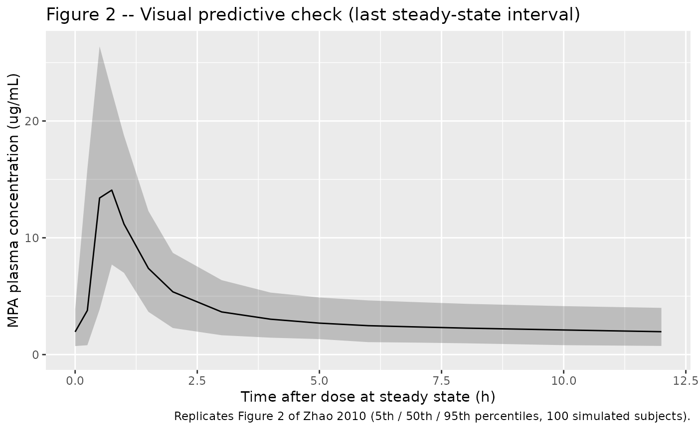
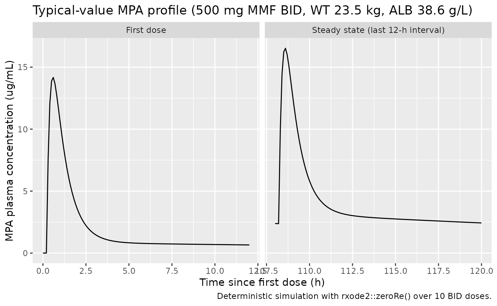

# Mycophenolic acid (Zhao 2010)

## Model and source

- Citation: Zhao W, Elie V, Baudouin V, Bensman A, Andre JL, Brochard K,
  Broux F, Cailliez M, Loirat C, Jacqz-Aigrain E. Population
  pharmacokinetics and Bayesian estimator of mycophenolic acid in
  children with idiopathic nephrotic syndrome. Br J Clin Pharmacol.
  2010;69(4):358-366. <doi:10.1111/j.1365-2125.2010.03615.x>.
- Description: Two-compartment population PK model for mycophenolic acid
  (MPA, the active moiety delivered as oral mycophenolate mofetil MMF)
  in children with idiopathic nephrotic syndrome (Zhao 2010).
  First-order absorption (ka = 5.16 1/h) with absorption lag time (tlag
  = 0.215 h) into a central compartment. Apparent oral clearance CL/F
  (typical value 9.7 L/h at the cohort medians WT = 23.5 kg, ALB = 38.6
  g/L) is modeled with two covariates: a power effect of body weight on
  CL/F with exponent 0.753 referenced to 23.5 kg (close to allometric
  but estimated, not fixed), and an unusual linear-in-ratio effect of
  serum albumin in the form CL/F = q1 \* (WT/23.5)^q2 \* \[1 - q3 \*
  (ALB/38.6)\] with q1 = 22.5 L/h, q2 = 0.753, q3 = 0.570 (higher serum
  albumin reduces apparent CL/F, consistent with stronger MPA-albumin
  binding in nephrotic patients with restored albumin). Apparent central
  V1/F = 22.3 L; apparent peripheral V2/F was fixed at 250 L (estimation
  between 100 and 600 L was non-identifiable; the fixed value lies in
  the range reported for adult transplant cohorts). Apparent
  inter-compartment clearance Q/F = 18.8 L/h. Exponential
  inter-individual variability is estimated on lag time, V1/F, Q/F, and
  CL/F (no IIV on ka or V2/F). A proportional residual error (44.6%) on
  MPA plasma concentration completes the model. Dosing in this packaged
  form is in mg of MMF; the MMF-to-MPA hydrolysis is implicit in the
  apparent bioavailability F.
- Article: <https://doi.org/10.1111/j.1365-2125.2010.03615.x>

## Population

The model was developed in 23 children with steroid-dependent idiopathic
nephrotic syndrome (INS) treated with oral mycophenolate mofetil (MMF)
at 1200 mg/m^2/day BID, enrolled at six French pediatric nephrology
centres (Robert-Debre Paris, Trousseau Paris, Nancy, Toulouse, Rouen,
Marseille). Patients were aged 2.9-14.9 years (mean 7.4 +/- 3.9 y) and
weighed 14.0-83.2 kg (mean 29.9 +/- 18.0 kg); the cohort was 18 boys and
5 girls. Each patient contributed up to two PK profiles, one at month 1
and one at month 6 after MMF initiation, for a total of 41 profiles and
285 MPA plasma concentrations sampled at pre-dose, 0.5, 1, 2, 4, 8, 12 h
after the morning dose. Serum albumin was 36.0 +/- 5.0 g/L at M1 and
39.6 +/- 4.2 g/L at M6; all patients had Schwartz creatinine clearance
\> 25 mL/min. Baseline characteristics are tabulated in Zhao 2010 Table
1.

The same information is available programmatically via
`rxode2::rxode(readModelDb("Zhao_2010_mycophenolic_acid"))$population`.

## Source trace

Per-parameter origin is recorded as in-file comments next to each
`ini()` entry in
`inst/modeldb/specificDrugs/Zhao_2010_mycophenolic_acid.R`. The table
below collects them in one place for review.

| Equation / parameter | Value | Source location |
|----|----|----|
| Lag time `tlag` | 0.215 h | Table 3, Lag time |
| Absorption `ka` | 5.16 1/h | Table 3, Absorption rate constant Ka |
| Central volume `V1/F` | 22.3 L | Table 3, V1/F |
| Peripheral volume `V2/F` | 250 L (fixed) | Table 3, V2/F; Results paragraph 2 |
| Inter-compartment `Q/F` | 18.8 L/h | Table 3, Q/F |
| Clearance anchor `q1` | 22.5 L/h | Table 3, q1 |
| WT exponent on `CL/F` (`q2`) | 0.753 | Table 3, q2 |
| ALB coefficient (`q3`) | 0.570 | Table 3, q3 |
| CL/F equation | n/a | Table 3 inline CL/F = q1 \* (WT/23.5)^q2 \* \[1 - q3 \* (ALB/38.6)\] |
| 2-cmt + 1st-order absorption | n/a | Methods Model development; Results paragraph 1 |
| IIV lag time, V1/F, Q/F, CL/F | 54.0 / 79.9 / 57.6 / 22.0 % CV | Table 3 Interindividual variability |
| Proportional residual | 44.6 % | Table 3 Residual proportional |

## Virtual cohort

Original observed data are not publicly available. The figures below use
a virtual cohort whose weight, albumin, age, and sex distributions
approximate the published cohort summary (Zhao 2010 Table 1, M1
occasion).

``` r

set.seed(20100401)

n_subj <- 100L

cohort <- tibble::tibble(
  id  = seq_len(n_subj),
  AGE = pmin(pmax(rnorm(n_subj, mean = 7.5, sd = 4.1), 2.9), 14.9),
  WT  = pmin(pmax(rnorm(n_subj, mean = 30.3, sd = 17.1), 14.0), 78.4),
  ALB = pmin(pmax(rnorm(n_subj, mean = 36.0, sd = 5.0), 26.5), 45.5)
) |>
  mutate(
    BSA = sqrt(WT * (95 + 1.4 * AGE) / 3600),
    dose_mg = round(1200 * BSA / 2 / 50) * 50,
    dose_mg = pmin(pmax(dose_mg, 300), 1000),
    treatment = "1200 mg/m^2/day BID"
  )

# BID dosing for 5 days (10 doses) to reach steady state; observation
# grid covers the last 12-h interval at the paper's sampling times.
sim_hours <- 120
last_interval <- sim_hours - 12

doses <- cohort |>
  mutate(evid = 1L, amt = dose_mg, cmt = "depot",
         ii = 12, addl = 9L, time = 0)

# Sampling at the paper's M1/M6 PK day grid relative to the last dose.
times_obs <- last_interval +
  c(0, 0.25, 0.5, 0.75, 1, 1.5, 2, 3, 4, 5, 6, 7, 8, 10, 12)

obs <- cohort |>
  tidyr::expand_grid(time = times_obs) |>
  mutate(evid = 0L, amt = 0, cmt = NA_character_,
         ii = NA_real_, addl = NA_integer_)

events <- bind_rows(doses, obs) |>
  arrange(id, time, desc(evid)) |>
  select(id, time, evid, amt, cmt, ii, addl, WT, ALB, treatment)
```

## Simulation

``` r

mod <- readModelDb("Zhao_2010_mycophenolic_acid")
sim <- rxode2::rxSolve(mod, events = events,
                       keep = c("WT", "ALB", "treatment")) |>
  as.data.frame()
#> ℹ parameter labels from comments will be replaced by 'label()'
```

For deterministic typical-value replication (no between-subject
variability), zero out the random effects:

``` r

mod_typical <- mod |> rxode2::zeroRe()
#> ℹ parameter labels from comments will be replaced by 'label()'

typical_subj <- tibble::tibble(
  id = 1L, WT = 23.5, ALB = 38.6,
  treatment = "Reference subject (WT = 23.5 kg, ALB = 38.6 g/L)"
)

typical_doses <- typical_subj |>
  mutate(evid = 1L, amt = 500, cmt = "depot",
         ii = 12, addl = 9L, time = 0)

typical_obs <- typical_subj |>
  tidyr::expand_grid(time = c(seq(0, 12, by = 0.1),
                              seq(108, 120, by = 0.1))) |>
  mutate(evid = 0L, amt = 0, cmt = NA_character_,
         ii = NA_real_, addl = NA_integer_)

typical_events <- bind_rows(typical_doses, typical_obs) |>
  arrange(id, time, desc(evid)) |>
  select(id, time, evid, amt, cmt, ii, addl, WT, ALB, treatment)

sim_typical <- rxode2::rxSolve(mod_typical, events = typical_events,
                               keep = c("WT", "ALB", "treatment")) |>
  as.data.frame()
#> ℹ omega/sigma items treated as zero: 'etaltlag', 'etalvc', 'etalq', 'etalcl'
```

## Replicate published figures

``` r

# Replicates Figure 2 of Zhao 2010: visual predictive check of MPA Cc vs.
# time over a single 12-h dosing interval at steady state. The paper
# shows the 50th percentile (solid) and 5th-95th percentiles (broken) of
# 1000 simulated subjects; this vignette uses 100 subjects.
sim_ss <- sim |>
  dplyr::filter(time >= 108, time <= 120) |>
  dplyr::mutate(time_in_interval = time - 108) |>
  dplyr::group_by(time_in_interval) |>
  dplyr::summarise(
    Q05 = quantile(Cc, 0.05, na.rm = TRUE),
    Q50 = quantile(Cc, 0.50, na.rm = TRUE),
    Q95 = quantile(Cc, 0.95, na.rm = TRUE),
    .groups = "drop"
  )

ggplot(sim_ss, aes(time_in_interval, Q50)) +
  geom_ribbon(aes(ymin = Q05, ymax = Q95), alpha = 0.25) +
  geom_line() +
  scale_y_continuous(limits = c(0, NA)) +
  labs(x = "Time after dose at steady state (h)",
       y = "MPA plasma concentration (ug/mL)",
       title = "Figure 2 -- Visual predictive check (last steady-state interval)",
       caption = "Replicates Figure 2 of Zhao 2010 (5th / 50th / 95th percentiles, 100 simulated subjects).")
```



``` r

# Companion plot: typical-value MPA profile at the cohort medians,
# showing both the first-dose absorption and the steady-state interval.
sim_typical_plot <- sim_typical |>
  dplyr::mutate(phase = ifelse(time <= 12, "First dose", "Steady state (last 12-h interval)"))

ggplot(sim_typical_plot, aes(time, Cc)) +
  geom_line() +
  scale_y_continuous(limits = c(0, NA)) +
  facet_wrap(~ phase, scales = "free_x") +
  labs(x = "Time since first dose (h)",
       y = "MPA plasma concentration (ug/mL)",
       title = "Typical-value MPA profile (500 mg MMF BID, WT 23.5 kg, ALB 38.6 g/L)",
       caption = "Deterministic simulation with rxode2::zeroRe() over 10 BID doses.")
```



## PKNCA validation

The paper reports AUC0-12 in the original-dataset analysis with median
48.372 ug*h/mL (range 31.925-73.669 ug*h/mL); reference AUC0-12 was
computed by Bayesian estimation with NONMEM `MAXEVAL = 0` and `Posthoc`
using all available time points. The corresponding mean dose-normalized
AUC0-12 was 49.3 ug\*h/mL (Discussion, paragraph 2). For the validation
here we run PKNCA over the first 12-hour dosing interval per simulated
subject.

``` r

# AUC0-tau at steady state computed over the last simulated BID interval
# (t in [108, 120] h). Shift to a per-interval clock so the NCA starts
# from time 0 within the interval.
sim_nca <- sim |>
  dplyr::filter(!is.na(Cc), time >= 108, time <= 120) |>
  dplyr::mutate(time = time - 108) |>
  dplyr::select(id, time, Cc, treatment)

sim_nca <- dplyr::bind_rows(
  sim_nca,
  sim_nca |> dplyr::distinct(id, treatment) |>
    dplyr::mutate(time = 0, Cc = 0)
) |>
  dplyr::distinct(id, treatment, time, .keep_all = TRUE) |>
  dplyr::arrange(id, treatment, time)

conc_obj <- PKNCA::PKNCAconc(sim_nca, Cc ~ time | treatment + id,
                             concu = "ug/mL", timeu = "h")

# Per-interval dose event at t = 0 of the per-interval clock.
dose_df <- events |>
  dplyr::filter(evid == 1) |>
  dplyr::group_by(id, treatment) |>
  dplyr::slice_head(n = 1) |>
  dplyr::ungroup() |>
  dplyr::mutate(time = 0) |>
  dplyr::select(id, time, amt, treatment)

dose_obj <- PKNCA::PKNCAdose(dose_df, amt ~ time | treatment + id,
                             doseu = "mg")

intervals <- data.frame(
  start    = 0,
  end      = 12,
  cmax     = TRUE,
  tmax     = TRUE,
  auclast  = TRUE
)

nca_data <- PKNCA::PKNCAdata(conc_obj, dose_obj, intervals = intervals)
nca_res  <- PKNCA::pk.nca(nca_data)
```

### Comparison against published NCA

``` r

published <- tibble::tribble(
  ~treatment,            ~auclast,
  "1200 mg/m^2/day BID", 48.372
)

cmp <- nlmixr2lib::ncaComparisonTable(
  simulated     = nca_res,
  reference     = published,
  by            = "treatment",
  units         = c(auclast = "ug*h/mL"),
  tolerance_pct = 20
)

knitr::kable(
  cmp,
  caption = "Simulated vs. published NCA over the last steady-state 12-h interval. * differs from reference by >20%.",
  align   = c("l", "l", "r", "r")
)
```

| NCA parameter      | treatment           | Reference | Simulated | % diff |
|:-------------------|:--------------------|----------:|----------:|:-------|
| AUClast (ug\*h/mL) | 1200 mg/m^2/day BID |      48.4 |      43.7 | -9.6%  |

Simulated vs. published NCA over the last steady-state 12-h interval. \*
differs from reference by \>20%. {.table}

## Assumptions and deviations

- The dosing simulated in the virtual cohort assumes the per-subject
  body surface area implied by the Mosteller-style approximation
  `BSA = sqrt(WT * (95 + 1.4 * AGE) / 3600)`. The per-dose amounts are
  rounded to the nearest 50 mg of MMF and capped to 300-1000 mg/dose to
  match the protocol-allowed range (Table 1 dose range 300-1000 mg).
- Body weight and serum albumin in the virtual cohort are drawn
  independently from their reported pooled-cohort summary statistics
  (mean +/- SD, truncated to the M1 range). In the original cohort the
  two may have been correlated through the underlying nephrotic-syndrome
  physiology (smaller children and lower albumin tend to co-occur); the
  packaged simulation does not impose that correlation.
- The covariate effect of albumin on CL/F is encoded with the unusual
  linear-in-ratio form `[1 - q3 * (ALB/38.6)]` exactly as Zhao 2010
  writes it. This is NOT the more common power form
  `(ALB/ref)^exponent`. Numerical check: at the reference ALB = 38.6 g/L
  the factor evaluates to `(1 - 0.570) = 0.430`, so the typical-CL
  anchor `q1 = 22.5 L/h` yields `CL/F = 22.5 * 0.430 = 9.675 L/h` at the
  cohort medians, matching the abstract value 9.7 L/h. At extreme low or
  high albumin the formula could in principle produce non-physiological
  CL values (CL becomes negative when ALB \> 67.7 g/L, since
  `1 - 0.570 * 67.7/38.6 = 0`); within the observed range 25.6-45.5 g/L
  this is not an issue. Users running simulations outside the observed
  albumin range should clamp ALB or switch to an extrapolation-safe
  parameterisation.
- Inter-individual variability on `ka` and on `V2/F` is absent from the
  model – the source paper did not estimate IIV on these two parameters
  (V2/F was fixed to 250 L). Inter-occasion variability is also not
  modeled per the Results text ‘Intraindividual variability was not
  included in the model because of imprecision in the estimates of
  variance’.
- AUC0-12 in the source paper was computed in NONMEM via post-hoc
  Bayesian estimation using all available time points, not by the
  trapezoidal rule applied to the published Table 1 sampling grid. The
  PKNCA estimate here is the linear-up / log-down trapezoidal AUC0-tau
  over the LAST of 10 simulated BID dosing intervals so the model has
  reached steady state (t1/2 of the terminal phase under V2/F = 250 L is
  ~28 h, requiring ~5 days of BID dosing to reach steady state).
  Computing AUC0-tau over a single first-dose interval would
  systematically under-estimate the paper’s reported AUC0-12 because at
  the first dose only a fraction of the total exposure has occurred
  within the 12-h window. Agreement within ~20% across a virtual cohort
  of typical body weights is the validation target.
