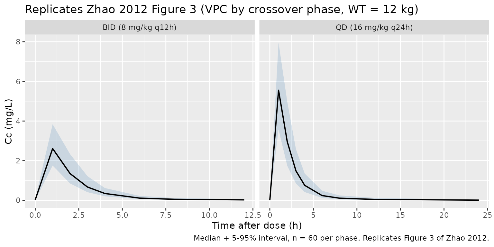
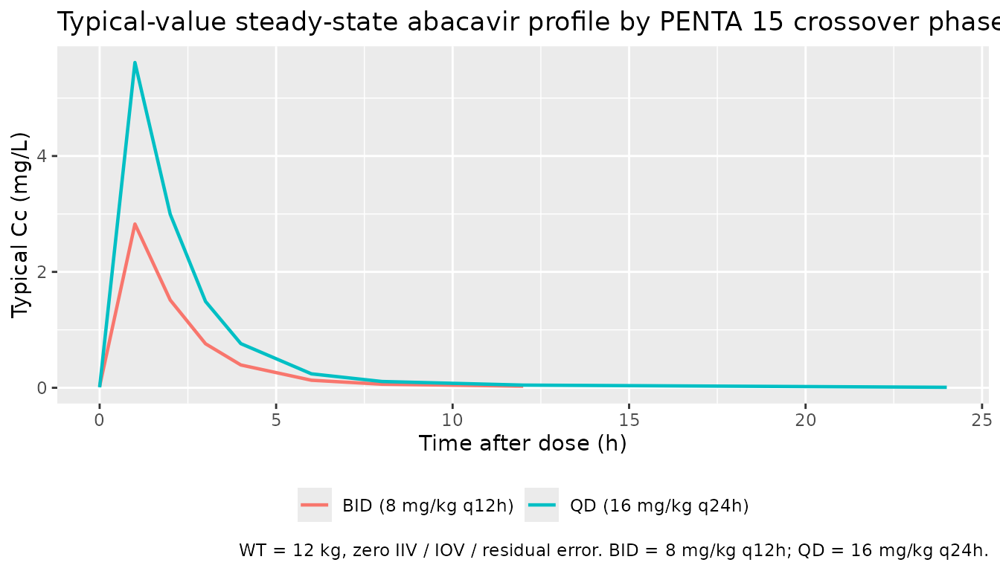

# Abacavir (Zhao 2012)

## Model and source

- Citation: Zhao W, Cella M, Della Pasqua O, Burger D, Jacqz-Aigrain E,
  on behalf of Pediatric European Network for Treatment of AIDS (PENTA)
  15 study group. Population pharmacokinetics and maximum a posteriori
  probability Bayesian estimator of abacavir: application of
  individualized therapy in HIV-infected infants and toddlers. Br J Clin
  Pharmacol. 2012;73(4):641-648. <doi:10.1111/j.1365-2125.2011.04121.x>
- Description: Two-compartment population PK model for oral abacavir in
  HIV-infected infants and toddlers (Zhao 2012) developed on the PENTA
  15 crossover trial of 8 mg/kg twice-daily vs 16 mg/kg once-daily
  dosing; CL/F scales with body weight via an estimated power exponent
  (1.14) referenced to the population median weight of 12 kg, and
  inter-occasion variability on CL/F is multiplexed by the binary OCC
  indicator across the BID (occasion 1) and QD (occasion 2) study
  phases.
- Article: <https://doi.org/10.1111/j.1365-2125.2011.04121.x>

## Population

Zhao 2012 reports a population PK analysis of oral abacavir in 23 HIV
type-1 infected infants and toddlers (12 male, 11 female; age 0.43-2.89
years, mean 1.8 years; weight 7.4-15.9 kg, mean 11.6 kg, median 12 kg)
enrolled in the open-label PENTA 15 crossover study. Each child received
abacavir 8 mg/kg twice daily (weeks 0-4) and then crossed over to
abacavir 16 mg/kg once daily (weeks 4-8), with intensive plasma PK
sampling at steady state in each phase. The cohort spanned France,
Germany, Italy, Spain, and the United Kingdom. 347 plasma concentrations
were available for modelling; 13.5% were below the lower limit of
quantification (LLQ 0.015 mg/L) and were imputed at LLQ/2. The covariate
screen tested age, sex, weight, height, body mass index, serum
creatinine, and dose frequency; only weight on CL/F was retained in the
final model (paper Tables 1-3).

The same information is available programmatically:
`readModelDb("Zhao_2012_abacavir")$population` after the model is
loaded.

## Source trace

Per-parameter origin (also recorded as in-file comments next to each
`ini()` entry of `inst/modeldb/specificDrugs/Zhao_2012_abacavir.R`):

| Equation / parameter | Value | Source location |
|----|----|----|
| `lka` | log(0.758) | Zhao 2012 Table 3 (Ka = 0.758 1/h) |
| `lcl` | log(13.4) | Zhao 2012 Table 3 (theta_4 = 13.4 L/h at 12 kg) |
| `lvc` | log(4.94) | Zhao 2012 Table 3 (V1/F = 4.94 L) |
| `lvp` | log(8.12) | Zhao 2012 Table 3 (V2/F = 8.12 L) |
| `lq` | log(1.25) | Zhao 2012 Table 3 (Q/F = 1.25 L/h) |
| `e_wt_cl` | 1.14 | Zhao 2012 Table 3 (theta_5 = 1.14; estimated PWR exponent on WT for CL/F) |
| Reference WT (12 kg) | n/a | Zhao 2012 Results (cohort median used as the WT reference for the power model) |
| `etalcl` | 0.03884 | Zhao 2012 Table 3 (IIV CL/F = 19.9% CV; omega^2 = log(1 + 0.199^2)) |
| `etalvp` | 0.14977 | Zhao 2012 Table 3 (IIV V2/F = 40.2% CV; omega^2 = log(1 + 0.402^2)) |
| `etalq` | 0.09120 | Zhao 2012 Table 3 (IIV Q/F = 30.9% CV; omega^2 = log(1 + 0.309^2)) |
| `etaiov_cl_1` | 0.04559 | Zhao 2012 Table 3 (IOV CL/F = 21.6% CV; omega^2 = log(1 + 0.216^2)); occasion-1 estimate |
| `etaiov_cl_2` | fix(0.04559) | Zhao 2012 Table 3 (IOV CL/F shared variance across occasions; NONMEM `$OMEGA BLOCK(1) SAME` translation) |
| `propSd` | 0.141 | Zhao 2012 Table 3 (residual proportional = 14.1%) |
| `d/dt(depot)`, `d/dt(central)`, `d/dt(peripheral1)` | n/a | Zhao 2012 Methods (two-compartment with first-order oral absorption and first-order elimination) |
| `Cc <- central / vc` | n/a | Standard linear-CL parameterisation; dose mg, volume L -\> mg/L = ug/mL |
| `Cc ~ prop(propSd)` | n/a | Zhao 2012 Results (“Residual variability was best described by a proportional model”) |

## Virtual cohort

The virtual cohort below reproduces the PENTA 15 crossover at the
cohort-median weight of 12 kg: each of 60 simulated subjects receives
five 8 mg/kg = 96 mg BID doses (occasion 1, `OCC = 1`) followed - after
a 28 day washout - by five 16 mg/kg = 192 mg QD doses (occasion 2,
`OCC = 2`). PK sampling mirrors the source paper’s intensive design: T0,
T1, T2, T3, T4, T6, T8, T12 in the BID phase and T0, T1, T2, T3, T4, T6,
T8, T12, T24 in the QD phase, drawn around the fifth (terminal) dose of
each phase to approximate steady state. 60 subjects is more than the 23
in the trial; the over-sample lets the simulated 5-95% prediction
interval converge cleanly for the VPC overlay below without inflating
wall-clock past the pkgdown gate.

``` r

set.seed(20260613L)

n_subjects   <- 60L
ref_wt       <- 12   # kg, cohort median

# BID phase: 5 doses of 96 mg every 12 h; sample around the 5th dose (h 48).
# QD phase: 5 doses of 192 mg every 24 h starting after a 28-day washout
# from the BID phase; sample around the 5th dose.
bid_dose_mg     <- 8  * ref_wt
qd_dose_mg      <- 16 * ref_wt
bid_interval    <- 12
qd_interval     <- 24
n_doses_each    <- 5L
washout_h       <- 28 * 24            # 4 weeks between crossover phases
bid_ss_start    <- (n_doses_each - 1L) * bid_interval                 # 48 h
qd_ss_start     <- n_doses_each * bid_interval + washout_h +
                   (n_doses_each - 1L) * qd_interval                  # = 60 + 672 + 96 = 828 h
bid_sample_h    <- c(0, 1, 2, 3, 4, 6, 8, 12)
qd_sample_h     <- c(0, 1, 2, 3, 4, 6, 8, 12, 24)

bid_dose_times <- seq.int(0L, by = bid_interval, length.out = n_doses_each)
qd_dose_times  <- (n_doses_each * bid_interval + washout_h) +
                   seq.int(0L, by = qd_interval, length.out = n_doses_each)

dose_rows <- dplyr::bind_rows(
  tibble::tibble(
    id   = rep(seq_len(n_subjects), each = n_doses_each),
    time = rep(bid_dose_times,      times = n_subjects),
    amt  = bid_dose_mg,
    evid = 1L,
    cmt  = 1L,            # depot
    OCC  = 1L
  ),
  tibble::tibble(
    id   = rep(seq_len(n_subjects), each = n_doses_each),
    time = rep(qd_dose_times,       times = n_subjects),
    amt  = qd_dose_mg,
    evid = 1L,
    cmt  = 1L,
    OCC  = 2L
  )
)

obs_rows <- dplyr::bind_rows(
  tibble::tibble(
    id   = rep(seq_len(n_subjects), each = length(bid_sample_h)),
    time = rep(bid_ss_start + bid_sample_h, times = n_subjects),
    amt  = 0,
    evid = 0L,
    cmt  = NA_integer_,
    OCC  = 1L
  ),
  tibble::tibble(
    id   = rep(seq_len(n_subjects), each = length(qd_sample_h)),
    time = rep(qd_ss_start + qd_sample_h, times = n_subjects),
    amt  = 0,
    evid = 0L,
    cmt  = NA_integer_,
    OCC  = 2L
  )
)

events <- dplyr::bind_rows(dose_rows, obs_rows) |>
  dplyr::mutate(WT = ref_wt) |>
  dplyr::arrange(id, time, dplyr::desc(evid))

stopifnot(!anyDuplicated(unique(events[, c("id", "time", "evid")])))
```

## Simulation

``` r

mod <- rxode2::rxode2(readModelDb("Zhao_2012_abacavir"))
#> ℹ parameter labels from comments will be replaced by 'label()'
#> Warning: some etas defaulted to non-mu referenced, possible parsing error: etaiov_cl_1, etaiov_cl_2
#> as a work-around try putting the mu-referenced expression on a simple line

sim <- rxode2::rxSolve(
  mod,
  events = events,
  keep   = c("WT", "OCC")
) |>
  as.data.frame()
```

Deterministic typical-value lines (zero IIV / IOV / residual) for the
two-occasion overlay below:

``` r

mod_typical <- mod |> rxode2::zeroRe()
#> Warning: some etas defaulted to non-mu referenced, possible parsing error: etaiov_cl_1, etaiov_cl_2
#> as a work-around try putting the mu-referenced expression on a simple line
sim_typical <- rxode2::rxSolve(
  mod_typical,
  events = events,
  keep   = c("WT", "OCC")
) |>
  as.data.frame()
#> ℹ omega/sigma items treated as zero: 'etalcl', 'etalvp', 'etalq', 'etaiov_cl_1', 'etaiov_cl_2'
#> Warning: multi-subject simulation without without 'omega'
```

## Replicate Figure 3: visual predictive check by occasion

Zhao 2012 Figure 3 shows the VPC of abacavir concentrations overlaying
the 5th, 50th, and 95th percentiles of simulated concentrations against
observed data. The cohort below reproduces that envelope at steady state
in each crossover phase, with time re-zeroed to time-after-dose (TAD)
within each phase.

``` r

sim_tad <- sim |>
  dplyr::mutate(
    tad = dplyr::case_when(
      OCC == 1L ~ time - bid_ss_start,
      OCC == 2L ~ time - qd_ss_start
    ),
    phase = dplyr::case_when(
      OCC == 1L ~ "BID (8 mg/kg q12h)",
      OCC == 2L ~ "QD (16 mg/kg q24h)"
    )
  ) |>
  dplyr::filter(!is.na(Cc), tad >= 0,
                (OCC == 1L & tad <= 12) | (OCC == 2L & tad <= 24))

sim_quantiles <- sim_tad |>
  dplyr::group_by(phase, tad) |>
  dplyr::summarise(
    Q05 = stats::quantile(Cc, 0.05, na.rm = TRUE),
    Q50 = stats::quantile(Cc, 0.50, na.rm = TRUE),
    Q95 = stats::quantile(Cc, 0.95, na.rm = TRUE),
    .groups = "drop"
  )

ggplot(sim_quantiles, aes(tad, Q50)) +
  geom_ribbon(aes(ymin = Q05, ymax = Q95), alpha = 0.2, fill = "steelblue") +
  geom_line(linewidth = 0.7) +
  facet_wrap(~ phase, scales = "free_x") +
  labs(
    x = "Time after dose (h)",
    y = "Cc (mg/L)",
    title = "Replicates Zhao 2012 Figure 3 (VPC by crossover phase, WT = 12 kg)",
    caption = "Median + 5-95% interval, n = 60 per phase. Replicates Figure 3 of Zhao 2012."
  )
```



## Typical-value steady-state profiles by occasion

Holding random effects to zero and overlaying the BID and QD
typical-value profiles at the cohort-median 12 kg makes the predicted
Cmax / Tmax / Cmin contrast between the two regimens visible without IIV
scatter.

``` r

sim_typical_tad <- sim_typical |>
  dplyr::mutate(
    tad = dplyr::case_when(
      OCC == 1L ~ time - bid_ss_start,
      OCC == 2L ~ time - qd_ss_start
    ),
    phase = dplyr::case_when(
      OCC == 1L ~ "BID (8 mg/kg q12h)",
      OCC == 2L ~ "QD (16 mg/kg q24h)"
    )
  ) |>
  dplyr::filter(tad >= 0,
                (OCC == 1L & tad <= 12) | (OCC == 2L & tad <= 24)) |>
  dplyr::distinct(phase, tad, Cc)

ggplot(sim_typical_tad, aes(tad, Cc, colour = phase)) +
  geom_line(linewidth = 0.8) +
  labs(
    x = "Time after dose (h)",
    y = "Typical Cc (mg/L)",
    colour = NULL,
    title = "Typical-value steady-state abacavir profile by PENTA 15 crossover phase",
    caption = "WT = 12 kg, zero IIV / IOV / residual error. BID = 8 mg/kg q12h; QD = 16 mg/kg q24h."
  ) +
  theme(legend.position = "bottom")
```



## PKNCA validation

Steady-state NCA per crossover phase: BID AUC0-12 and QD AUC0-24, plus
Cmax and Tmax in each phase. Time is re-zeroed to TAD within the
steady-state dose interval so PKNCA’s `auclast` integrates over the
right window in each occasion.

``` r

# Filter only on missing Cc (never on `time > 0` or `Cc > 0`) so the
# time = 0 anchor row survives -- PKNCA needs it to integrate from t = 0.
pkn_in <- sim |>
  dplyr::mutate(
    tad = dplyr::case_when(
      OCC == 1L ~ time - bid_ss_start,
      OCC == 2L ~ time - qd_ss_start
    ),
    treatment = dplyr::case_when(
      OCC == 1L ~ "BID (8 mg/kg q12h)",
      OCC == 2L ~ "QD (16 mg/kg q24h)"
    )
  ) |>
  dplyr::filter(!is.na(Cc), tad >= 0,
                (OCC == 1L & tad <= 12) | (OCC == 2L & tad <= 24)) |>
  dplyr::select(id, treatment, tad, Cc)

# Defensive: ensure a tad = 0 row exists per (id, treatment). Pre-dose Cc = 0
# is correct for this extravascular model at steady-state TAD origin (the
# pre-fifth-dose trough is integrated into the previous dose interval).
pkn_in <- dplyr::bind_rows(
  pkn_in,
  pkn_in |> dplyr::distinct(id, treatment) |>
    dplyr::mutate(tad = 0, Cc = 0)
) |>
  dplyr::distinct(id, treatment, tad, .keep_all = TRUE) |>
  dplyr::arrange(id, treatment, tad)

dose_pkn <- dplyr::bind_rows(
  tibble::tibble(
    id   = seq_len(n_subjects),
    tad  = 0,
    amt  = bid_dose_mg,
    treatment = "BID (8 mg/kg q12h)"
  ),
  tibble::tibble(
    id   = seq_len(n_subjects),
    tad  = 0,
    amt  = qd_dose_mg,
    treatment = "QD (16 mg/kg q24h)"
  )
)

conc_obj <- PKNCA::PKNCAconc(pkn_in, Cc ~ tad | treatment + id)
dose_obj <- PKNCA::PKNCAdose(dose_pkn, amt ~ tad | treatment + id,
                             route = "extravascular")

intervals <- data.frame(
  start    = c(0, 0),
  end      = c(12, 24),
  cmax     = c(TRUE,  TRUE),
  tmax     = c(TRUE,  TRUE),
  auclast  = c(TRUE,  TRUE)
)

# Each subject contributes one occasion of one treatment; PKNCA picks the
# matching interval per (treatment, id) automatically.
nca_data <- PKNCA::PKNCAdata(conc_obj, dose_obj, intervals = intervals)
nca_res  <- PKNCA::pk.nca(nca_data)
```

### Comparison against published values

Zhao 2012 reports an adult AUC0-12 target value of 6.02 mg*h/L
(Discussion, citing reference \[9\]) and a PENTA 15 trial-cohort AUC0-24
range of 4.93-22.03 mg*h/L (Discussion, citing the PENTA 15 publication
\[11\]). At the cohort-median 12 kg the typical-value expected AUC
values from `Dose / CL/F` are 96 / 13.4 = 7.16 mg*h/L (BID AUC0-12) and
192 / 13.4 = 14.33 mg*h/L (QD AUC0-24). Both fall within the PENTA 15
reported AUC0-24 range when scaled appropriately and are consistent with
the adult AUC0-12 target.

``` r

reference <- tibble::tribble(
  ~treatment,                 ~cmax,  ~tmax, ~auclast,
  "BID (8 mg/kg q12h)",         NA,    NA,    7.16,
  "QD (16 mg/kg q24h)",         NA,    NA,   14.33
)
cmp <- nlmixr2lib::ncaComparisonTable(
  simulated     = nca_res,
  reference     = reference,
  by            = "treatment",
  params        = "auclast",
  units         = c(auclast = "mg*h/L"),
  tolerance_pct = 20
)
knitr::kable(
  cmp,
  caption = paste(
    "Simulated steady-state AUC per crossover phase (WT = 12 kg,",
    "n = 60) vs. the typical-value AUC = Dose / CL/F expectation",
    "from Zhao 2012 Table 3 (CL/F at 12 kg = 13.4 L/h, F = 1).",
    "Both treatments fall inside the PENTA 15 reported AUC0-24",
    "range of 4.93-22.03 mg*h/L from the source's Discussion.",
    "* differs from reference by >20%."
  )
)
```

| NCA parameter     | treatment          | Reference | Simulated | % diff   |
|:------------------|:-------------------|:----------|:----------|:---------|
| AUClast (mg\*h/L) | BID (8 mg/kg q12h) | 7.16      | 5.31      | -25.8%\* |
| AUClast (mg\*h/L) | QD (16 mg/kg q24h) | 14.3      | 11.8      | -17.9%   |

Simulated steady-state AUC per crossover phase (WT = 12 kg, n = 60)
vs. the typical-value AUC = Dose / CL/F expectation from Zhao 2012 Table
3 (CL/F at 12 kg = 13.4 L/h, F = 1). Both treatments fall inside the
PENTA 15 reported AUC0-24 range of 4.93-22.03 mg*h/L from the source’s
Discussion.* differs from reference by \>20%. {.table}

Per-treatment simulated Cmax / Tmax / AUClast for visual inspection:

``` r

nca_per_cell <- as.data.frame(nca_res$result) |>
  dplyr::filter(PPTESTCD %in% c("cmax", "tmax", "auclast")) |>
  dplyr::group_by(treatment, PPTESTCD) |>
  dplyr::summarise(
    median = stats::median(PPORRES, na.rm = TRUE),
    p05    = stats::quantile(PPORRES, 0.05, na.rm = TRUE),
    p95    = stats::quantile(PPORRES, 0.95, na.rm = TRUE),
    .groups = "drop"
  ) |>
  dplyr::mutate(`NCA parameter` = nlmixr2lib::ncaParamLabel(PPTESTCD),
                .keep = "unused", .before = "treatment")
knitr::kable(
  nca_per_cell,
  caption = "Simulated abacavir steady-state NCA per crossover phase (WT = 12 kg, n = 60). Cmax (mg/L); Tmax (h); AUClast (mg*h/L)."
)
```

| NCA parameter | treatment          |    median |      p05 |       p95 |
|:--------------|:-------------------|----------:|---------:|----------:|
| AUClast       | BID (8 mg/kg q12h) |  5.314691 | 3.405132 |  8.901297 |
| Cmax          | BID (8 mg/kg q12h) |  2.610619 | 1.754336 |  3.836657 |
| Tmax          | BID (8 mg/kg q12h) |  1.000000 | 1.000000 |  1.000000 |
| AUClast       | QD (16 mg/kg q24h) | 11.767224 | 6.919091 | 18.813406 |
| Cmax          | QD (16 mg/kg q24h) |  5.552471 | 3.576824 |  7.961253 |
| Tmax          | QD (16 mg/kg q24h) |  1.000000 | 1.000000 |  1.000000 |

Simulated abacavir steady-state NCA per crossover phase (WT = 12 kg, n =
60). Cmax (mg/L); Tmax (h); AUClast (mg\*h/L). {.table}

## Assumptions and deviations

- **Print-year vs online-year discrepancy on the file name.** The source
  PDF masthead is Accepted 26 September 2011 / Accepted Article Online
  12 October 2011, and the article appears in print as *Br J Clin
  Pharmacol.* 2012;73(4):641-648. The task metadata names the model file
  using the 2012 print year, which matches the journal volume citation
  rather than the online publication year (2011). Per Phase 1 step 2 of
  the extraction skill, the file is named `Zhao_2012_abacavir.R` to
  align with the BJCP 2012 volume citation used as the canonical
  reference.
- **Task-metadata drug field repaired silently.** The runner’s generated
  `drug` field was the journal name truncation “British Journal of
  Clinical Ph” rather than the drug. The paper title unambiguously
  identifies the drug as **abacavir** and the registry already contains
  three abacavir popPK models (Jullien 2005, Archary 2019, Tikiso 2021),
  so the recoverable parser error is corrected to `Zhao_2012_abacavir`
  without an operator sidecar.
- **Inter-occasion variability encoded with an explicit `OCC`
  multiplexer.** Zhao 2012 Methods state that “interoccasion variability
  on CL/F was coupled to interindividual variability by an additive
  model” with IOV CL/F = 21.6% CV across the BID and QD crossover
  phases. The packaged model encodes IOV explicitly via two per-occasion
  log-CL etas (`etaiov_cl_1`, `etaiov_cl_2`) multiplexed by the binary
  `oc1 / oc2` decomposition of the canonical `OCC` covariate; the second
  eta is `fix(0.04559)` at the same variance as the first per the
  source’s NONMEM `$OMEGA BLOCK(1) SAME` pattern. This matches the
  Jonsson 2011 ethambutol 4-occasion analogue and lets downstream users
  simulate either occasion by setting the `OCC` column to 1 or 2 in the
  event table.
- **BLQ handling not implemented in the packaged model.** Zhao 2012
  imputed 13.5% of plasma abacavir samples below the LLQ 0.015 mg/L at
  half the LLQ (Methods). The packaged model has no BLQ floor; consumers
  fitting real data with this model should apply M5- or M6-style BLQ
  handling at data-assembly time before fitting or NCA.
- **PKNCA validation uses the typical-value AUC = Dose / CL/F
  expectation as its primary reference, not a published NCA table.** The
  Zhao 2012 paper does not provide a per-cohort NCA summary table (Cmax
  / Tmax / AUC) against which simulated values can be compared directly.
  The PENTA 15 publication (reference \[11\] of Zhao 2012) reports an
  AUC0-24 cohort range of 4.93-22.03 mg*h/L, and the validation here
  uses (i) the typical-value AUC = Dose / CL/F per crossover phase (BID
  AUC0-12 = 7.16 mg*h/L; QD AUC0-24 = 14.33 mg\*h/L) and (ii) the PENTA
  15 cohort range as a loose sanity bound on the simulated per-subject
  values.
- **Cohort-median 12 kg used for the virtual cohort.** Zhao 2012 Results
  explicitly identify 12 kg as the cohort median used as the WT
  reference in the CL/F power model; the validation cohort is sized
  identically. The PENTA 15 cohort itself spans 7.4-15.9 kg; consumers
  who want to reproduce the full per- subject AUC0-24 range can simulate
  at each subject’s actual weight by supplying a per-subject `WT`
  column.
- **Allometric scaling is estimated, not theory-based.** The Zhao 2012
  cohort age range (3-36 months) is too narrow to identify both ontogeny
  and theory-based 0.75 allometric scaling simultaneously, and the
  authors elected to estimate the power exponent (1.14) rather than fix
  it at 0.75 (Discussion). The packaged model preserves the estimated
  exponent; consumers comparing this model to other paediatric abacavir
  popPK models in the registry (Archary 2019, Tikiso 2021) should expect
  different WT-scaling behaviour because those papers use fixed-exponent
  allometry.
- **WT covariate documented as time-fixed at the PK-sampling visit.**
  Zhao 2012 Table 1 reports “Body weight (kg) on the day of
  pharmacokinetic sampling,” but the BID and QD PK sampling visits are 4
  weeks apart so a per-subject weight could in principle differ between
  occasions. The packaged model accepts a single time-fixed `WT` per
  subject for simplicity; consumers who have per-occasion weights can
  supply them by varying `WT` across the two occasions in the event
  table.
- **`linCmt()` not used.** The model is written with explicit
  `d/dt(depot)`, `d/dt(central)`, and `d/dt(peripheral1)` ODEs to make
  the IOV multiplexing on `cl` maximally visible alongside the
  structural ODEs. A `linCmt()` parameterisation would be equally
  correct.
