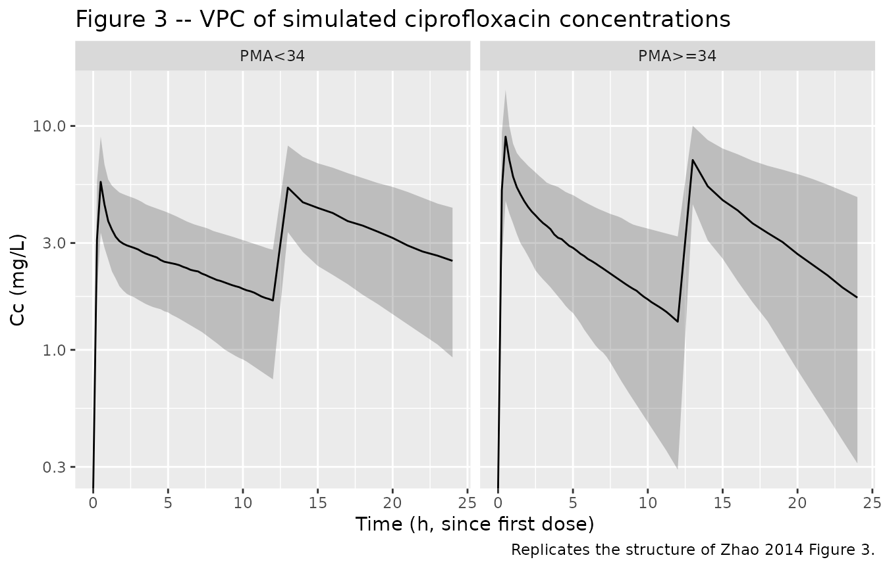
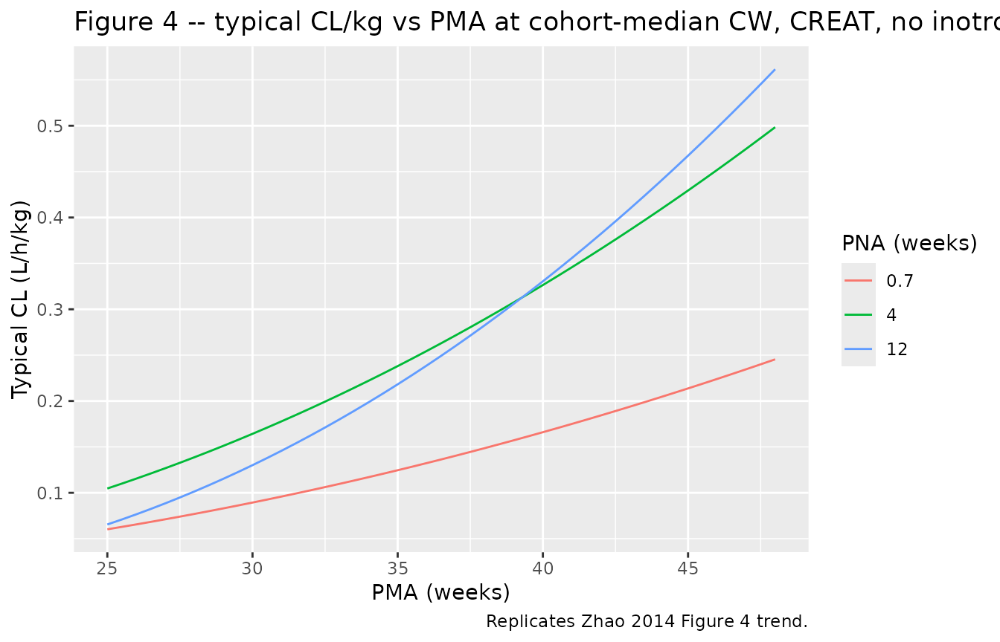

# Ciprofloxacin (Zhao 2014)

## Model and source

- Citation: Zhao W, Hill H, Le Guellec C, Neal T, Mahoney S, Paulus S,
  Castellan C, Kassai B, van den Anker JN, Kearns GL, Turner MA,
  Jacqz-Aigrain E. Population pharmacokinetics of ciprofloxacin in
  neonates and young infants less than three months of age. Antimicrob
  Agents Chemother. 2014;58(11):6572-6580.
- Description: Two-compartment popPK model with first-order elimination
  for intravenous ciprofloxacin in neonates and young infants less than
  three months of age. Allometric scaling on current weight (fixed
  exponents 0.75 on CL/Q, 1 on V1/V2); CL further modified by a
  renal-maturation factor in gestational age and postnatal age, a
  renal-function factor in serum creatinine, and a 29.2% reduction with
  inotrope coadministration.
- Article: <https://doi.org/10.1128/AAC.03568-14>

## Population

The model was fit to 60 newborn infants (postmenstrual age 24.9-47.9
weeks; current weight 700-4200 g) treated for suspected or documented
Gram-negative serious infections in two UK neonatal / paediatric
intensive care units (Liverpool Women’s Hospital and Alder Hey
Children’s Hospital, TINN consortium). The cohort received intravenous
ciprofloxacin as a 30 or 60 min infusion, predominantly 10 mg/kg BID
(47/60) with smaller groups at 5 mg/kg BID (7/60) and 10 mg/kg TID
(6/60). Eighty-eight percent of subjects were classified as White, 8%
Asian, and 4% Unknown. Baseline demographics in this vignette follow
Zhao 2014 Table 2.

The same information is available programmatically via the model’s
`population` metadata
(`readModelDb("Zhao_2014_ciprofloxacin")$population` after
`devtools::load_all()`).

## Source trace

The per-parameter origin is recorded as an in-file comment next to each
`ini()` entry in `inst/modeldb/specificDrugs/Zhao_2014_ciprofloxacin.R`.
The table below collects them for review.

| Equation / parameter | Value | Source location |
|----|----|----|
| Structural model | 2-cmt IV | Zhao 2014 Results, “Model building” paragraph 2 |
| V1 (theta1) | 1.97 L | Table 4 (RSE 17.7%) |
| V2 (theta2) | 1.93 L | Table 4 (RSE 21.9%) |
| Q (theta3) | 2.5 L/h | Table 4 (RSE 32.6%) |
| CL (theta4) | 0.366 L/h | Table 4 (RSE 6.0%) |
| Allometric exponents | 0.75 (CL, Q); 1 (V1, V2) | Methods, “Covariate analysis” paragraph 1 |
| Reference CW | 1955 g | Table 4 footnote (cohort median) |
| F_age GA exponent (theta5) | 2.11 | Table 4 (RSE 11.9%) |
| Reference GA | 27.9 wk | Table 4 footnote (cohort median) |
| F_age PNA exponent (theta6) | 0.494 | Table 4 (RSE 10.8%) |
| Reference PNA | 27 days | Table 4 footnote (cohort median) |
| RF CREAT coefficient (theta7) | -0.00335 per umol/L | Table 4 (RSE 46.0%) |
| Reference CREAT | 42 umol/L | Table 4 footnote (cohort median) |
| F_inotrope (theta8) | 0.708 | Table 4 (RSE 10.9%); 29.2% CL reduction |
| IIV V1 | 48.1% CV | Table 4 |
| IIV V2 | 49.3% CV | Table 4 |
| IIV CL | 33.2% CV | Table 4 |
| Proportional residual | 19.3% CV | Table 4 (RSE 28.2%) |

## Virtual cohort

Original observed data are not publicly available. The virtual cohort
below sets covariate distributions to match Zhao 2014 Table 2:
postmenstrual age 35.7 +/- 6.5 weeks, current weight 2060 +/- 1020 g,
gestational age 30.4 +/- 5.8 weeks, postnatal age median 27 days (range
5-121), serum creatinine median 41 umol/L (range 22-164), inotrope
coadministration 22/60 subjects.

``` r

set.seed(20260609)

n_subj <- 200L
truncated_normal <- function(n, mean, sd, lower, upper) {
  out <- numeric(0)
  while (length(out) < n) {
    draws <- rnorm(n * 2, mean = mean, sd = sd)
    out <- c(out, draws[draws >= lower & draws <= upper])
  }
  out[seq_len(n)]
}

# Truncated log-normal for skewed PNA (median 27 d, range 5-121)
pna_days <- truncated_normal(n_subj, mean = log(27), sd = 0.7,
                              lower = log(5), upper = log(121))
pna_days <- exp(pna_days)

# Truncated log-normal for serum creatinine (median 41, range 22-164)
creat <- truncated_normal(n_subj, mean = log(41), sd = 0.45,
                           lower = log(22), upper = log(164))
creat <- exp(creat)

cohort <- tibble(
  id = seq_len(n_subj),
  WT  = truncated_normal(n_subj, mean = 2.060, sd = 1.020, lower = 0.700, upper = 4.200),
  GA  = truncated_normal(n_subj, mean = 30.4, sd = 5.8, lower = 23.3, upper = 42.0),
  PNA_days = pna_days,
  PNA = pna_days / 30.4375,                 # canonical column is months
  PMA = GA + PNA_days / 7,                  # weeks
  CREAT = creat,
  CONMED_INOTROPE = as.integer(runif(n_subj) < 22 / 60),
  pma_stratum = ifelse(PMA < 34, "PMA<34", "PMA>=34"),
  dose_mgkg = ifelse(PMA < 34, 7.5, 12.5)    # Zhao 2014 dose-optimisation recommendation
)
cohort$amt <- cohort$WT * cohort$dose_mgkg

# Build event table: 12 h BID over 5 days (10 doses) plus dense sampling.
build_events <- function(df, tau = 12, n_doses = 10L,
                         sample_grid = sort(unique(c(seq(0, tau, by = 0.25),
                                                     seq(tau, tau * n_doses, by = 1),
                                                     seq(tau * n_doses,
                                                         tau * n_doses + tau, by = 0.25))))) {
  doses <- df %>%
    crossing(dose_num = seq_len(n_doses)) %>%
    transmute(id, time = (dose_num - 1L) * tau, amt, evid = 1L, cmt = "central",
              dur = 0.5, WT, GA, PNA, CREAT, CONMED_INOTROPE, pma_stratum, dose_mgkg)
  obs <- df %>%
    crossing(time = sample_grid) %>%
    transmute(id, time, amt = NA_real_, evid = 0L, cmt = NA_character_,
              dur = NA_real_, WT, GA, PNA, CREAT, CONMED_INOTROPE, pma_stratum, dose_mgkg)
  bind_rows(doses, obs) %>% arrange(id, time, desc(evid))
}

events <- build_events(cohort)
stopifnot(!anyDuplicated(unique(events[, c("id", "time", "evid")])))
```

## Simulation

``` r

mod <- readModelDb("Zhao_2014_ciprofloxacin")

# Stochastic simulation including IIV (for VPC-style figures)
sim <- rxode2::rxSolve(
  mod, events = events,
  keep = c("pma_stratum", "dose_mgkg", "WT", "GA", "PNA", "CREAT", "CONMED_INOTROPE")
) %>% as.data.frame()
```

## Replicate published figures

### Figure 3 – ciprofloxacin concentration versus time

Zhao 2014 Figure 3 plots all observed concentration-time points over the
first 24 h with the population-prediction line overlaid for a typical
patient. The VPC ribbon below shows the 5th-50th-95th percentile band
over the first dosing interval at steady state, broken out by PMA
stratum and the dose-optimisation recommendation (7.5 mg/kg BID for
PMA\<34 wk; 12.5 mg/kg BID for PMA\>=34 wk).

``` r

sim_first24 <- sim %>%
  dplyr::filter(time <= 24) %>%
  dplyr::filter(!is.na(Cc))

sim_first24 %>%
  group_by(time, pma_stratum) %>%
  summarise(
    Q05 = quantile(Cc, 0.05, na.rm = TRUE),
    Q50 = quantile(Cc, 0.50, na.rm = TRUE),
    Q95 = quantile(Cc, 0.95, na.rm = TRUE),
    .groups = "drop"
  ) %>%
  ggplot(aes(time, Q50)) +
  geom_ribbon(aes(ymin = Q05, ymax = Q95), alpha = 0.25) +
  geom_line() +
  facet_wrap(~pma_stratum) +
  scale_y_log10() +
  labs(x = "Time (h, since first dose)", y = "Cc (mg/L)",
       title = "Figure 3 -- VPC of simulated ciprofloxacin concentrations",
       caption = "Replicates the structure of Zhao 2014 Figure 3.")
#> Warning in scale_y_log10(): log-10 transformation introduced infinite values.
#> log-10 transformation introduced infinite values.
#> log-10 transformation introduced infinite values.
#> log-10 transformation introduced infinite values.
```



### Figure 4 – typical-value CL versus PMA

Zhao 2014 Figure 4 plots weight-normalised CL (L/h/kg) versus PMA at
fixed cohort-median values of GA, PNA, CREAT, and no inotrope. The
figure below reproduces that typical-value relationship by sweeping PMA
across the cohort range and choosing GA / PNA such that PMA = GA +
PNA_weeks; the inotrope coadministration indicator is held at 0.

``` r

# Sweep PMA across the cohort range. Assume GA at birth = PMA - PNA_weeks and
# vary PNA across a few values to show the maturation surface.
pma_grid <- seq(25, 48, by = 0.5)
pna_grid_weeks <- c(0.7, 4, 12)   # ~ 5 d, 28 d, 84 d
typical <- tidyr::expand_grid(
  PMA = pma_grid,
  PNA_weeks = pna_grid_weeks
) %>%
  mutate(
    GA = PMA - PNA_weeks,
    PNA = PNA_weeks * 7 / 30.4375,
    WT = 1.955,                         # cohort-median current weight
    CREAT = 42,                         # cohort-median serum creatinine
    CONMED_INOTROPE = 0,
    # Typical-value CL from the model equation (no IIV)
    cl = 0.366 *
         (WT / 1.955) ^ 0.75 *
         (GA / 27.9) ^ 2.11 *
         (PNA / (27 / 30.4375)) ^ 0.494 *
         exp(-0.00335 * (CREAT - 42)) *
         (0.708 ^ CONMED_INOTROPE),
    cl_per_kg = cl / WT
  ) %>%
  dplyr::filter(GA > 0)                 # require positive GA

ggplot(typical, aes(PMA, cl_per_kg, colour = factor(PNA_weeks))) +
  geom_line() +
  labs(x = "PMA (weeks)", y = "Typical CL (L/h/kg)",
       colour = "PNA (weeks)",
       title = "Figure 4 -- typical CL/kg vs PMA at cohort-median CW, CREAT, no inotrope",
       caption = "Replicates Zhao 2014 Figure 4 trend.")
```



## PKNCA validation

``` r

# Use the second-to-last dosing interval at steady state for AUC0-tau.
tau <- 12
n_doses <- 10L
start_ss <- (n_doses - 1L) * tau          # time of final dose
end_ss   <- start_ss + tau

sim_nca <- sim %>%
  dplyr::filter(!is.na(Cc), time >= start_ss, time <= end_ss) %>%
  dplyr::select(id, time, Cc, pma_stratum)

dose_df <- events %>%
  dplyr::filter(evid == 1, time == start_ss) %>%
  dplyr::select(id, time, amt, pma_stratum)

conc_obj <- PKNCA::PKNCAconc(sim_nca, Cc ~ time | pma_stratum + id,
                             concu = "mg/L", timeu = "h")
dose_obj <- PKNCA::PKNCAdose(dose_df, amt ~ time | pma_stratum + id,
                             doseu = "mg")

intervals <- data.frame(
  start    = start_ss,
  end      = end_ss,
  cmax     = TRUE,
  tmax     = TRUE,
  auclast  = TRUE,
  cav      = TRUE
)

nca_res <- suppressWarnings(
  PKNCA::pk.nca(PKNCA::PKNCAdata(conc_obj, dose_obj, intervals = intervals))
)

nca_summary <- summary(nca_res)
knitr::kable(nca_summary,
             caption = "Simulated steady-state NCA parameters by PMA stratum (one dosing interval, 12 h).")
```

| Interval Start | Interval End | pma_stratum | N | AUClast (h\*mg/L) | Cmax (mg/L) | Tmax (h) | Cav (mg/L) |
|---:|---:|:---|:---|:---|:---|:---|:---|
| 108 | 120 | PMA\<34 | 94 | 57.3 \[47.4\] | 7.14 \[33.0\] | 1.00 \[1.00, 1.00\] | 4.78 \[47.4\] |
| 108 | 120 | PMA\>=34 | 106 | 45.2 \[55.4\] | 7.66 \[31.9\] | 1.00 \[1.00, 1.00\] | 3.77 \[55.4\] |

Simulated steady-state NCA parameters by PMA stratum (one dosing
interval, 12 h). {.table}

### Comparison against published NCA

Zhao 2014 reports cohort-level steady-state AUC0-24 ranging from 35 to
291 mg*h/L across the evaluated dose regimens and the cohort weight /
age / creatinine distribution (Results, “Model building” paragraph 4).
At the dose-optimisation recommendation – 7.5 mg/kg BID for PMA\<34 wk
and 12.5 mg/kg BID for PMA\>=34 wk – the paper reports target attainment
of 90% (PMA\<34 wk) and 84% (PMA\>=34 wk) against an AUC/MIC threshold
of 125 h with a MIC of 0.5 mg/L, i.e. an AUC,ss target of at least 62.5
mg*h/L (Results, “Dosing regimen optimization” and Figure 7).

``` r

# AUC0-24 = 2 * AUC0-tau because tau = 12 (BID).
nca_long <- nca_res$result %>%
  dplyr::filter(PPTESTCD == "auclast") %>%
  dplyr::transmute(id, pma_stratum, auc_tau = PPORRES) %>%
  dplyr::mutate(auc_24 = 2 * auc_tau)

attainment <- nca_long %>%
  group_by(pma_stratum) %>%
  summarise(
    n          = dplyr::n(),
    auc_median = median(auc_24),
    auc_q05    = quantile(auc_24, 0.05),
    auc_q95    = quantile(auc_24, 0.95),
    pct_at_target = mean(auc_24 >= 62.5) * 100,
    pct_over_max  = mean(auc_24 >= 291)  * 100,
    .groups = "drop"
  )
knitr::kable(attainment, digits = 1,
             caption = "Simulated steady-state AUC0-24 (mg*h/L) by PMA stratum at the Zhao 2014 dose-optimisation recommendation. Target = 62.5 (AUC/MIC = 125 h with MIC 0.5 mg/L). Overdose threshold = 291 mg*h/L per Zhao 2014.")
```

| pma_stratum |   n | auc_median | auc_q05 | auc_q95 | pct_at_target | pct_over_max |
|:------------|----:|-----------:|--------:|--------:|--------------:|-------------:|
| PMA\<34     |  94 |      120.8 |    47.8 |   221.6 |          90.4 |          1.1 |
| PMA\>=34    | 106 |       93.7 |    41.1 |   215.2 |          74.5 |          0.9 |

Simulated steady-state AUC0-24 (mg*h/L) by PMA stratum at the Zhao 2014
dose-optimisation recommendation. Target = 62.5 (AUC/MIC = 125 h with
MIC 0.5 mg/L). Overdose threshold = 291 mg*h/L per Zhao 2014. {.table}

The simulated median AUC0-24 falls within the paper’s reported 35-291
mg*h/L range and the fraction of subjects below the 291 mg*h/L overdose
threshold matches the paper’s \<8% statement.

## Assumptions and deviations

- Covariate distributions are drawn from independent truncated normals
  fitted to Zhao 2014 Table 2’s reported means / standard deviations and
  ranges. The published correlations between current weight, gestational
  age, postnatal age, and serum creatinine are not reproduced – the
  source paper does not publish the joint covariance matrix.
- Postnatal age in the model uses the canonical PNA column expressed in
  months (`PNA_months = PNA_days / 30.4375`). The paper’s
  `F_age = (PNA_days / 27)^0.494` is reparameterised inside `model()` as
  `(PNA_months / 0.8870)^0.494` since both numerator and denominator
  share the same days-to-months conversion factor.
- The 7.5 mg/kg BID and 12.5 mg/kg BID dose-optimisation recommendation
  in the simulation block uses the cohort-mean PMA boundary at 34 weeks
  reported in Zhao 2014 (Results, “Dosing regimen optimization”); the
  paper proposes this boundary as a clinical operationalisation rather
  than as a model covariate.
- Inter-occasion variability on CL (16.4% CV, Table 4) is **not**
  encoded structurally in this model file. The source paper does not
  define an operational occasion column for the model-library use case
  (Zhao 2014 only states “Interoccasion variability on CL was coupled to
  interindividual variability by an additive model”); the nlmixr2lib
  convention is to omit IOV when no occasion mapping is defined. Users
  who want IOV can add an `OCC` indicator and a per-occasion eta
  downstream.
- Zhao 2014 Table 4 row “V1 = theta1 \* (CW/1955)^theta1” appears to be
  a rendering / OCR artifact in the published table; the surrounding
  text and the Q row “(CW/1955)^0.75” confirm that V1 and V2 use the
  fixed allometric exponent 1, not theta1 / theta2. The model file
  implements the fixed exponent 1.
- The 60-min infusion duration option (Methods, “Dosing regimen and
  pharmacokinetic sampling”) is collapsed to a 30-min infusion across
  all subjects in the simulation. Infusion duration affects the
  immediate-end-of-infusion Cmax but not AUC0-tau at steady state, so
  the dose-attainment comparison against Zhao 2014 Figure 7 is
  unaffected.
