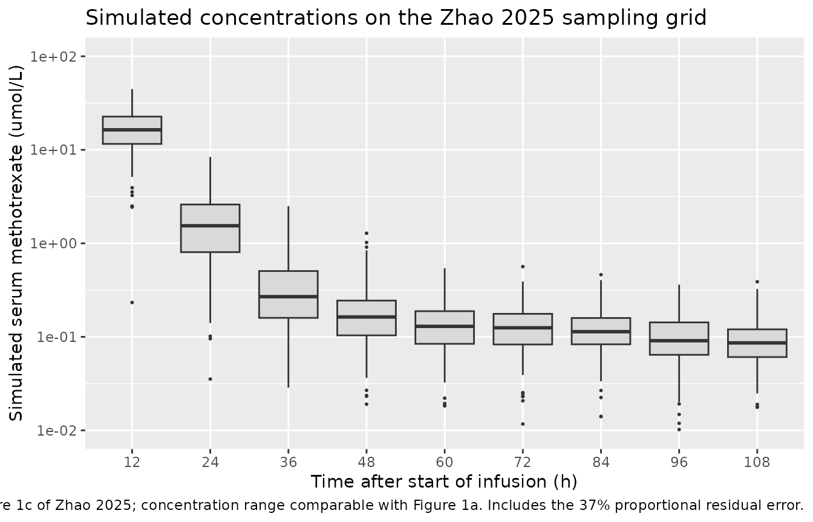
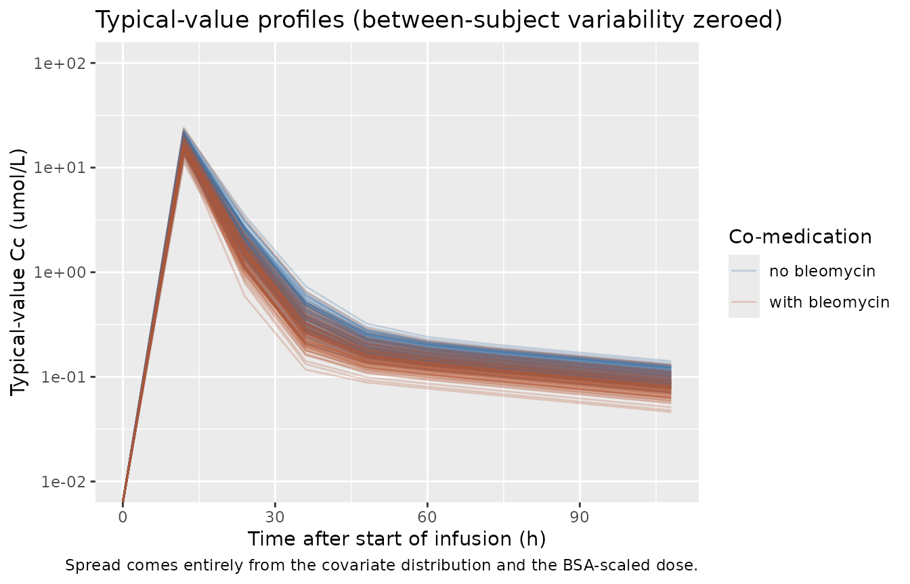

# Methotrexate (Zhao 2025)

## Model and source

- Citation: Zhao J, Wu R, Zhang S, Lu Q, Wang R, He Y, Zhao Z, Mei S
  (2025). Population pharmacokinetic model of high-dose methotrexate in
  Chinese patients with intracranial germ cell tumors. Front Pharmacol
  16:1548203. <doi:10.3389/fphar.2025.1548203>.
- Description: Two-compartment population PK model for high-dose
  intravenous methotrexate (HD-MTX, \>= 0.5 g/m^2; standard 1.3 g/m^2
  given as a 1 h infusion of one third of the dose followed by an 11 h
  infusion of the remainder) in Chinese patients with intracranial germ
  cell tumors (Zhao 2025; n = 505 patients, 73.3% children, 5,470 serum
  concentrations). Linear first-order elimination from the central
  compartment. Clearance is a product of four power-form covariate terms
  normalized to the cohort medians – BSA-normalized eGFR (exponent
  0.23), body weight (0.39), total bilirubin (-0.05) and serum albumin
  (-0.18) – and an exponential bleomycin co-medication term that raises
  CL 1.08-fold; the central volume carries a body-weight power term
  (exponent 0.31). Peripheral volume and intercompartmental clearance
  were fixed at the base-model estimates. Exponential between-subject
  variability on CL and Vc and a proportional residual error.
- Article: <https://doi.org/10.3389/fphar.2025.1548203>

No supplementary material accompanies this article; the model is fully
specified in the main text (Equations 5-8 and Table 3).

## Population

Zhao 2025 is the first published population pharmacokinetic model of
methotrexate in intracranial germ cell tumors (iGCTs). It is built on
retrospective therapeutic-drug-monitoring data from 505 patients treated
at Beijing Puren Hospital between February 2015 and July 2018,
contributing 5,470 serum methotrexate concentrations. Children make up
73.3% of the cohort; the median age is 14 years (range 3-48) and the
median body weight 47 kg (range 14-121). Baseline characteristics come
from Table 1: height 155 cm (103-194), BSA 1.42 m^2 (0.63-2.47,
Mosteller), eGFR 102.20 mL/min/1.73 m^2 (41.57-446.22), serum creatinine
62 umol/L (9-147), albumin 40.90 g/L (30.60-52.30) and total bilirubin
15.30 umol/L (3.40-78.50). eGFR was computed with the 2008 bedside
Schwartz equation in children and the 2021 CKD-EPI equation in adults.

Patients received methotrexate and vincristine on day 1, bleomycin on
day 2 and cisplatin on day 3 or 4. The standard methotrexate dose is 1.3
g/m^2, given as a 1 h infusion of one third of the dose followed by an
11 h infusion of the remaining two thirds; calcium folinate rescue (13
mg/m^2, five doses every 6 h) starts 12 h after methotrexate
discontinuation. Concomitant bleomycin was recorded on 58.67% of the
concomitant-medication records and is the only co-medication retained in
the final model.

The same information is available programmatically via the model’s
`population` metadata
(`readModelDb("Zhao_2025_methotrexate")()$population`).

## Source trace

The per-parameter origin is recorded as an in-file comment next to each
`ini()` entry in `inst/modeldb/specificDrugs/Zhao_2025_methotrexate.R`.
The table below collects them in one place for review.

| Equation / parameter | Value | Source location |
|----|----|----|
| Two-compartment, first-order elimination | n/a | Results 3.2, first sentence |
| `lcl` (CL) | 12.88 L/h | Table 3, Final model; Eq. 5 |
| `lvc` (Vc) | 72.04 L | Table 3, Final model; Eq. 6 |
| `lq` (Q), fixed | 1.08 L/h | Table 3 “Q (L/h) 1.08 Fixed”; Eq. 7 |
| `lvp` (Vp), fixed | 94.94 L | Table 3 “Vp (L) 94.94 Fixed”; Eq. 8 |
| `e_crcl_cl` (eGFR on CL) | 0.23 | Table 3 “eGFR on CL”; Eq. 5 |
| `e_wt_cl` (BW on CL) | 0.39 | Table 3 “BW on CL”; Eq. 5 |
| `e_bleomycin_cl` (BLM on CL) | 0.08 | Table 3 “BLM on CL”; Eq. 5 |
| `e_tbili_cl` (TBIL on CL) | -0.05 | Table 3 “TBIL on CL”; Eq. 5 |
| `e_alb_cl` (ALB on CL) | -0.18 | Table 3 “ALB on CL”; Eq. 5 |
| `e_wt_vc` (BW on Vc) | 0.31 | Table 3 “BW on V (L)”; Eq. 6 |
| Reference eGFR / BW / TBIL / ALB | 102.2 / 47 / 15.3 / 40.9 | Eqs. 5-6; Table 1 medians; Results 3.2 |
| `etalcl` | 2.98 -\> omega^2 = 0.0298 (CV 17.4%) | Table 3 “IIV CL(CV%)”, Final model |
| `etalvc` | 0.32 -\> omega^2 = 0.0032 (CV 5.7%) | Table 3 “IIV Vc(CV%)”, Final model |
| Exponential IIV form | n/a | Methods 2.5.1 Eq. 1 |
| `propSd` | 0.37 | Table 3 “sigma (proportional)”; Methods 2.5.1 Eq. 3 |
| Dosing regimen | 1.3 g/m^2, 1/3 over 1 h then 2/3 over 11 h | Methods 2.1 |
| Sampling grid | every 12 h to 108 h | Methods 2.3; Figure 1c x-axis |
| Concentration units | umol/L | Methods 2.3; Table 1 |

## Virtual cohort

The original patient-level data are not publicly available. The cohort
below is a 200-subject virtual population whose covariate distributions
approximate the Table 1 marginals. Body weight is drawn log-normally
with the Table 1 median; height is derived from weight with a power
relation anchored on the Table 1 median pair (47 kg, 155 cm); BSA
follows from the Mosteller equation, which the paper states was used.
That construction is self-checking: the Table 1 medians are exactly
Mosteller-consistent, `sqrt(155 * 47 / 3600) = 1.423 m^2` against the
reported median BSA of 1.42 m^2, as are the range minima
(`sqrt(103 * 14 / 3600) = 0.633` against the reported 0.63).

``` r

set.seed(20250502)

n_sub  <- 200L          # cap is 200 participants per arm
MW_MTX <- 454.44        # g/mol; external chemical constant (PubChem CID 126941),
                        # used only to convert the g/m^2 protocol dose into the
                        # umol amount units the model works in.

clamp <- function(x, lo, hi) pmin(pmax(x, lo), hi)

cohort <- tibble(
  id  = seq_len(n_sub),
  # Body weight: Table 1 median 47 kg, range 14-121.
  WT  = clamp(47 * exp(rnorm(n_sub, 0, 0.38)), 14, 121)
) |>
  mutate(
    # Height anchored on the Table 1 median pair (47 kg, 155 cm), range 103-194.
    HT   = clamp(155 * (WT / 47)^0.29 * exp(rnorm(n_sub, 0, 0.05)), 103, 194),
    # Mosteller (Methods 2.2). Table 1 median 1.42 m^2, range 0.63-2.47.
    BSA  = sqrt(HT * WT / 3600),
    # Table 1 median 102.20 mL/min/1.73 m^2, range 41.57-446.22.
    CRCL = clamp(102.2 * exp(rnorm(n_sub, 0, 0.36)), 41.57, 446.22),
    # Table 1 median 15.30 umol/L, range 3.40-78.50.
    TBILI = clamp(15.3 * exp(rnorm(n_sub, 0, 0.55)), 3.4, 78.5),
    # Table 1 median 40.90 g/L, range 30.60-52.30.
    ALB   = clamp(rnorm(n_sub, 40.9, 3.8), 30.6, 52.3),
    # Table 1: bleomycin on 58.67% of the concomitant-medication records.
    CONMED_BLEOMYCIN = rbinom(n_sub, 1, 0.5867),
    arm  = ifelse(CONMED_BLEOMYCIN == 1, "with bleomycin", "no bleomycin"),
    # Methods 2.1: standard dose 1.3 g/m^2, one third over 1 h then two thirds
    # over 11 h.
    dose_umol = 1.3 * BSA / MW_MTX * 1e6
  )

# The virtual cohort must reproduce the Table 1 marginals it was built from.
stopifnot(
  abs(median(cohort$WT)   - 47)    < 4,
  abs(median(cohort$HT)   - 155)   < 8,
  abs(median(cohort$BSA)  - 1.42)  < 0.10,
  abs(median(cohort$CRCL) - 102.2) < 10,
  abs(median(cohort$TBILI)- 15.3)  < 2,
  abs(median(cohort$ALB)  - 40.9)  < 1.5,
  all(cohort$WT >= 14, cohort$WT <= 121),
  all(cohort$BSA >= 0.63, cohort$BSA <= 2.56)
)

cohort |>
  summarise(
    across(c(WT, HT, BSA, CRCL, TBILI, ALB),
           ~ sprintf("%.2f (%.2f-%.2f)", median(.x), min(.x), max(.x)))
  ) |>
  pivot_longer(everything(), names_to = "Covariate", values_to = "Simulated median (range)") |>
  mutate(`Zhao 2025 Table 1 median (range)` = c(
    "47.00 (14.00-121.00)", "155.00 (103.00-194.00)", "1.42 (0.63-2.47)",
    "102.20 (41.57-446.22)", "15.30 (3.40-78.50)", "40.90 (30.60-52.30)"
  )) |>
  knitr::kable(caption = "Virtual cohort covariates against the Zhao 2025 Table 1 marginals.")
```

| Covariate | Simulated median (range) | Zhao 2025 Table 1 median (range) |
|:----------|:-------------------------|:---------------------------------|
| WT        | 46.79 (14.03-121.00)     | 47.00 (14.00-121.00)             |
| HT        | 155.14 (113.39-194.00)   | 155.00 (103.00-194.00)           |
| BSA       | 1.44 (0.68-2.55)         | 1.42 (0.63-2.47)                 |
| CRCL      | 99.08 (41.57-368.56)     | 102.20 (41.57-446.22)            |
| TBILI     | 15.53 (3.40-74.70)       | 15.30 (3.40-78.50)               |
| ALB       | 40.40 (30.60-51.90)      | 40.90 (30.60-52.30)              |

Virtual cohort covariates against the Zhao 2025 Table 1 marginals.
{.table}

The event table gives each subject the two-stage infusion. Observation
records go on the `central` ODE state; `rxode2` returns the algebraic
observable `Cc` at those records. A dense grid out to 336 h supports the
non-compartmental analysis (the model’s terminal half-life is roughly 66
h, so 108 h of clinical sampling alone would not anchor an extrapolated
AUC).

``` r

obs_times <- sort(unique(c(seq(0, 48, by = 0.25), seq(48, 336, by = 2))))
tdm_times <- seq(12, 108, by = 12)   # Methods 2.3 / Figure 1c: 12 h spacing

dose_rows <- bind_rows(
  cohort |> transmute(id, time = 0, evid = 1L, amt = dose_umol / 3,     dur = 1),
  cohort |> transmute(id, time = 1, evid = 1L, amt = 2 * dose_umol / 3, dur = 11)
) |>
  mutate(cmt = "central")

obs_rows <- tidyr::expand_grid(id = cohort$id, time = obs_times) |>
  mutate(evid = 0L, amt = NA_real_, dur = NA_real_, cmt = "central")

events <- bind_rows(dose_rows, obs_rows) |>
  left_join(cohort |> select(id, WT, BSA, CRCL, TBILI, ALB, CONMED_BLEOMYCIN, arm, dose_umol),
            by = "id") |>
  arrange(id, time, desc(evid))

stopifnot(!anyDuplicated(unique(events[, c("id", "time", "evid")])))
```

## Simulation

``` r

mod <- readModelDb("Zhao_2025_methotrexate")

sim <- rxode2::rxSolve(mod, events = events, keep = c("arm", "dose_umol")) |>
  as.data.frame()
#> ℹ parameter labels from comments will be replaced by 'label()'

# rxSolve silently drops subjects on a bad event table -- assert the count.
stopifnot(dplyr::n_distinct(sim$id) == n_sub)
```

`Cc` is the individual prediction; the `sim` column additionally carries
the 37% proportional residual error and is therefore the column to
compare against *observed* concentrations from the paper’s figures.
Deterministic replication of the published typical-value equations uses
[`rxode2::zeroRe()`](https://nlmixr2.github.io/rxode2/reference/zeroRe.html).

``` r

mod_typical <- rxode2::zeroRe(mod)
#> ℹ parameter labels from comments will be replaced by 'label()'

typ <- rxode2::rxSolve(
  mod_typical,
  events = events |> filter(evid == 1 | time %in% c(0, tdm_times)),
  keep = c("arm"), omega = NA, sigma = NA
) |>
  as.data.frame()
```

## Replicate published figures

### Concentration-time profiles on the clinical sampling grid

Zhao 2025 does not publish a concentration-time figure with readable
axes, but Figure 1a (observed versus population-predicted concentration,
log-log) and Figure 1c (CWRES versus time after dose) between them pin
the sampling design and the concentration range: Figure 1c shows dense
observation stripes at 12 h intervals from 12 h to about 108 h after
dose, and Figure 1a shows three dominant observation clusters spanning
roughly 10-60, 0.3-10 and 0.03-2 umol/L. The panel below is the
simulated equivalent.

``` r

# rxSolve output carries no evid column -- the returned rows ARE the
# observation records, so select the TDM grid by time alone.
sim_tdm <- sim |>
  filter(time %in% tdm_times)

# Pooled concentration statistics have to match the paper's own aggregation, and
# the paper's 5,470 records are NOT evenly spread over the sampling grid. The
# Discussion quantifies the drop-off: "records available for 53.07% at 48 h,
# 26.53% at 60 h, and only 1.39% at 72 h". The three earliest times are taken as
# complete -- Figure 1c shows them as the three densest stripes. Times past 72 h
# are excluded from the pooled statistics because the paper quantifies no
# availability for them.
tdm_availability <- tibble(
  time         = c(12, 24, 36, 48, 60, 72),
  availability = c(1, 1, 1, 0.5307, 0.2653, 0.0139)
)

set.seed(1548203)
sim_tdm_realistic <- sim_tdm |>
  inner_join(tdm_availability, by = "time") |>
  filter(runif(n()) < availability)

# A 37% proportional error on the linear scale can draw a negative value, which
# no assay can report. Those draws are dropped the way an analytical run would
# drop them; the fraction must stay small or the error model is being misused.
n_before <- nrow(sim_tdm_realistic)
sim_tdm_realistic <- sim_tdm_realistic |> filter(sim > 0)
stopifnot((n_before - nrow(sim_tdm_realistic)) / n_before < 0.02)

sim_tdm |>
  ggplot(aes(factor(time), sim)) +
  geom_boxplot(outlier.size = 0.4, fill = "grey85") +
  scale_y_log10(limits = c(0.01, 100)) +
  labs(
    x = "Time after start of infusion (h)",
    y = "Simulated serum methotrexate (umol/L)",
    title = "Simulated concentrations on the Zhao 2025 sampling grid",
    caption = paste(
      "Sampling times read off Figure 1c of Zhao 2025; concentration range",
      "comparable with Figure 1a. Includes the 37% proportional residual error."
    )
  )
#> Warning in transformation$transform(x): NaNs produced
#> Warning in scale_y_log10(limits = c(0.01, 100)): log-10 transformation
#> introduced infinite values.
#> Warning: Removed 16 rows containing non-finite outside the scale range
#> (`stat_boxplot()`).
```



``` r

typ |>
  ggplot(aes(time, Cc, group = id, colour = arm)) +
  geom_line(alpha = 0.25) +
  scale_y_log10(limits = c(0.01, 100)) +
  scale_colour_manual(values = c("no bleomycin" = "#3b6ea5", "with bleomycin" = "#b3542f")) +
  labs(
    x = "Time after start of infusion (h)", y = "Typical-value Cc (umol/L)",
    colour = "Co-medication",
    title = "Typical-value profiles (between-subject variability zeroed)",
    caption = "Spread comes entirely from the covariate distribution and the BSA-scaled dose."
  )
#> Warning in scale_y_log10(limits = c(0.01, 100)): log-10 transformation
#> introduced infinite values.
```



### Covariate model, Equations 5 and 6

Regressing the simulated individual clearances on the covariates
recovers the published exponents exactly, because the covariate model is
a pure product of power terms.

``` r

# rxSolve returns the model covariates alongside the derived individual
# parameters, so one row per subject is all that is needed -- no join back to
# `cohort`, which would collide on the shared covariate column names.
per_subject <- sim |>
  group_by(id) |>
  slice(1) |>
  ungroup()

# The regression is run on the zeroRe solution, where cl and vc are exact
# deterministic functions of the covariates. Running it on the IIV-bearing
# solution would only recover the exponents to within the eta noise.
per_subject_typ <- typ |>
  group_by(id) |>
  slice(1) |>
  ungroup()

stopifnot(nrow(per_subject) == n_sub, nrow(per_subject_typ) == n_sub,
          all(c("cl", "vc", "CRCL", "WT", "TBILI", "ALB", "CONMED_BLEOMYCIN") %in%
                names(per_subject_typ)))

fit_cl <- lm(log(cl) ~ log(CRCL) + log(WT) + log(TBILI) + log(ALB) + CONMED_BLEOMYCIN,
             data = per_subject_typ)
fit_vc <- lm(log(vc) ~ log(WT), data = per_subject_typ)

recovered <- tibble(
  Term = c("eGFR on CL", "BW on CL", "TBIL on CL", "ALB on CL",
           "BLM on CL", "BW on Vc"),
  Published = c(0.23, 0.39, -0.05, -0.18, 0.08, 0.31),
  Recovered = c(
    unname(coef(fit_cl)[["log(CRCL)"]]), unname(coef(fit_cl)[["log(WT)"]]),
    unname(coef(fit_cl)[["log(TBILI)"]]), unname(coef(fit_cl)[["log(ALB)"]]),
    unname(coef(fit_cl)[["CONMED_BLEOMYCIN"]]), unname(coef(fit_vc)[["log(WT)"]])
  )
)

# Exact recovery: the covariate model is a pure product of power terms, so a
# log-log regression on the typical-value solution returns Table 3 to machine
# precision.
stopifnot(max(abs(recovered$Recovered - recovered$Published)) < 1e-8)

recovered |>
  mutate(across(c(Published, Recovered), ~ round(.x, 4))) |>
  rename("Zhao 2025 Table 3" = Published, "Recovered from simulation" = Recovered) |>
  knitr::kable(caption = "Covariate exponents recovered from the packaged model (Eqs. 5-6).")
```

| Term       | Zhao 2025 Table 3 | Recovered from simulation |
|:-----------|------------------:|--------------------------:|
| eGFR on CL |              0.23 |                      0.23 |
| BW on CL   |              0.39 |                      0.39 |
| TBIL on CL |             -0.05 |                     -0.05 |
| ALB on CL  |             -0.18 |                     -0.18 |
| BLM on CL  |              0.08 |                      0.08 |
| BW on Vc   |              0.31 |                      0.31 |

Covariate exponents recovered from the packaged model (Eqs. 5-6).
{.table}

The bleomycin term is the paper’s headline covariate finding. Zhao 2025
states that co-administration raises clearance 1.08-fold; the model
reproduces `exp(0.08)` exactly.

``` r

# cl is a deterministic product of the covariate terms times exp(etalcl), so the
# regression coefficient on the indicator isolates the bleomycin term exactly.
blm_ratio <- exp(coef(fit_cl)[["CONMED_BLEOMYCIN"]])
stopifnot(abs(blm_ratio - exp(0.08)) < 1e-8)
sprintf("CL ratio with vs without bleomycin: %.4f (published 1.08-fold)", blm_ratio)
#> [1] "CL ratio with vs without bleomycin: 1.0833 (published 1.08-fold)"
```

## PKNCA validation

Non-compartmental analysis is run on `Cc` (the individual prediction),
stratified by bleomycin co-medication. Zhao 2025 reports no NCA
parameters of its own, so the NCA here serves as an internal-consistency
check of the packaged model against the analytic identities implied by
Equations 5-8.

``` r

sim_nca <- sim |>
  filter(!is.na(Cc)) |>
  select(id, time, Cc, arm)

# Guarantee a time = 0 row per (id, arm); an intravenous infusion starting at
# time 0 has Cc = 0 there.
sim_nca <- bind_rows(
  sim_nca,
  sim_nca |> distinct(id, arm) |> mutate(time = 0, Cc = 0)
) |>
  distinct(id, arm, time, .keep_all = TRUE) |>
  arrange(id, arm, time)

conc_obj <- PKNCA::PKNCAconc(sim_nca, Cc ~ time | arm + id)

# One total-dose row per subject; the two infusion records are aggregated
# because PKNCA uses the dose only for dose-normalised parameters.
dose_df <- events |>
  filter(evid == 1) |>
  group_by(id, arm) |>
  summarise(time = 0, amt = sum(amt), .groups = "drop")

dose_obj <- PKNCA::PKNCAdose(dose_df, amt ~ time | arm + id)

intervals <- data.frame(
  start = 0, end = Inf,
  cmax = TRUE, tmax = TRUE, aucinf.obs = TRUE, auclast = TRUE, half.life = TRUE
)

nca_res <- PKNCA::pk.nca(PKNCA::PKNCAdata(conc_obj, dose_obj, intervals = intervals))
```

### Structural identities

For a linear model with first-order elimination,
`AUC(0-inf) = Dose / CL` holds for every individual, and the terminal
half-life must equal the analytic two-compartment beta half-life
computed from that subject’s own micro-constants. Both are tested per
subject rather than on a cohort median, which would hide subject-level
errors behind aggregation noise.

``` r

nca_wide <- as.data.frame(nca_res) |>
  select(id, arm, PPTESTCD, PPORRES) |>
  pivot_wider(names_from = PPTESTCD, values_from = PPORRES)

ident <- per_subject |>
  select(id, cl, vc, q, vp) |>
  left_join(cohort |> select(id, dose_umol), by = "id") |>
  left_join(nca_wide, by = "id") |>
  mutate(
    auc_expected = dose_umol / cl,
    auc_relerr   = abs(aucinf.obs - auc_expected) / auc_expected,
    kel = cl / vc, k12 = q / vc, k21 = q / vp,
    beta = ((kel + k12 + k21) - sqrt((kel + k12 + k21)^2 - 4 * kel * k21)) / 2,
    thalf_expected = log(2) / beta,
    thalf_relerr   = abs(half.life - thalf_expected) / thalf_expected
  )

stopifnot(
  # Both identities must be evaluable for every subject -- an NA from a failed
  # lambda-z fit would silently pass a max() with na.rm = TRUE.
  !anyNA(ident$auc_relerr),
  !anyNA(ident$thalf_relerr),
  nrow(ident) == n_sub,
  max(ident$auc_relerr)   < 0.01,   # AUC(0-inf) == Dose / CL, per subject
  max(ident$thalf_relerr) < 0.05    # terminal half-life == analytic beta half-life
)

tibble(
  Identity = c("AUC(0-inf) = Dose / CL", "t1/2,z = ln(2) / beta"),
  `Worst per-subject relative error` = sprintf(
    "%.3f%%", 100 * c(max(ident$auc_relerr), max(ident$thalf_relerr))
  )
) |>
  knitr::kable(caption = "Per-subject structural identities across all 200 simulated subjects.")
```

| Identity               | Worst per-subject relative error |
|:-----------------------|:---------------------------------|
| AUC(0-inf) = Dose / CL | 0.016%                           |
| t1/2,z = ln(2) / beta  | 0.627%                           |

Per-subject structural identities across all 200 simulated subjects.
{.table}

### NCA summary by co-medication arm

``` r

nca_summary <- nca_wide |>
  group_by(arm) |>
  summarise(
    n = n(),
    cmax = median(cmax), tmax = median(tmax),
    aucinf.obs = median(aucinf.obs), half.life = median(half.life),
    .groups = "drop"
  )

nca_summary |>
  mutate(across(c(cmax, tmax, aucinf.obs, half.life), ~ signif(.x, 4))) |>
  rename(
    "Co-medication"          = arm,
    "N"                      = n,
    "Cmax (umol/L)"          = cmax,
    "Tmax (h)"               = tmax,
    "AUC0-inf (umol*h/L)"    = aucinf.obs,
    "t1/2,z (h)"             = half.life
  ) |>
  knitr::kable(caption = "Simulated NCA medians by bleomycin co-medication arm.")
```

| Co-medication  |   N | Cmax (umol/L) | Tmax (h) | AUC0-inf (umol\*h/L) | t1/2,z (h) |
|:---------------|----:|--------------:|---------:|---------------------:|-----------:|
| no bleomycin   |  76 |         18.43 |       12 |                325.9 |      66.39 |
| with bleomycin | 124 |         17.71 |        1 |                289.3 |      65.75 |

Simulated NCA medians by bleomycin co-medication arm. {.table}

The median Tmax differs between the arms, and that is a real consequence
of the protocol’s split infusion rather than an artefact. One third of
the dose goes in over 1 h and the remaining two thirds over 11 h, so the
first hour runs at about 5.5 times the rate of the following eleven. The
profile therefore has two nearly equal peaks – one at the end of the
fast infusion (1 h) and one at the end of the slow infusion (12 h) – and
which is higher depends on the subject’s own CL/Vc ratio. Raising
clearance depresses the long infusion’s plateau more than the short
infusion’s spike, so the with-bleomycin arm tips towards the 1 h peak.

Bleomycin raises clearance, so the with-bleomycin arm should show a
lower median AUC than the no-bleomycin arm once the arms are matched on
dose. Because the two virtual arms differ in BSA-scaled dose by chance,
the comparison below is made on dose-normalised AUC.

``` r

auc_norm <- ident |>            # `arm` already rode in from the PKNCA grouping
  group_by(arm) |>
  summarise(`Median dose-normalised AUC (h/L)` = median(aucinf.obs / dose_umol),
            .groups = "drop")

stopifnot(
  auc_norm$`Median dose-normalised AUC (h/L)`[auc_norm$arm == "with bleomycin"] <
    auc_norm$`Median dose-normalised AUC (h/L)`[auc_norm$arm == "no bleomycin"]
)

auc_norm |>
  mutate(`Median dose-normalised AUC (h/L)` = signif(`Median dose-normalised AUC (h/L)`, 4)) |>
  rename("Co-medication" = arm) |>
  knitr::kable(caption = "Dose-normalised exposure is lower with bleomycin, as the positive CL coefficient requires.")
```

| Co-medication  | Median dose-normalised AUC (h/L) |
|:---------------|---------------------------------:|
| no bleomycin   |                          0.08097 |
| with bleomycin |                          0.07312 |

Dose-normalised exposure is lower with bleomycin, as the positive CL
coefficient requires. {.table}

## Comparison against published values

Zhao 2025 reports no non-compartmental parameters, so
[`nlmixr2lib::ncaComparisonTable()`](https://nlmixr2.github.io/nlmixr2lib/reference/ncaComparisonTable.md)
has nothing to compare against. The table below instead pairs every
published quantitative anchor in the paper with its simulated
counterpart.

``` r

typ_ref <- rxode2::rxSolve(
  mod_typical,
  events = tibble(
    id = 1L, time = c(0, 0, 1, 12), evid = c(1L, 0L, 1L, 0L),
    amt = c(1000, NA_real_, 2000, NA_real_),
    dur = c(1, NA_real_, 11, NA_real_), cmt = "central",
    CRCL = 102.2, WT = 47, TBILI = 15.3, ALB = 40.9, CONMED_BLEOMYCIN = 0
  ),
  omega = NA, sigma = NA
) |>
  as.data.frame()

pooled <- sim_tdm_realistic$sim

anchors <- tibble(
  Quantity = c(
    "Typical CL at the reference covariate set (L/h)",
    "Typical Vc at 47 kg (L)",
    "Q, fixed (L/h)",
    "Vp, fixed (L)",
    "CL fold-change with concomitant bleomycin",
    "Pooled MTX concentration, median (umol/L)",
    "Pooled MTX concentration, minimum (umol/L)",
    "Pooled MTX concentration, maximum (umol/L)"
  ),
  `Zhao 2025` = c("12.88", "72.04", "1.08", "94.94", "1.08",
                  "1.2", "0.01", "55.80"),
  Source = c("Table 3 / Eq. 5", "Table 3 / Eq. 6", "Table 3 / Eq. 7",
             "Table 3 / Eq. 8", "Abstract; Discussion",
             "Table 1", "Table 1", "Table 1"),
  Simulated = c(
    sprintf("%.2f", typ_ref$cl[1]),
    sprintf("%.2f", typ_ref$vc[1]),
    sprintf("%.2f", typ_ref$q[1]),
    sprintf("%.2f", typ_ref$vp[1]),
    sprintf("%.2f", blm_ratio),
    sprintf("%.2f", median(pooled)),
    sprintf("%.3f", min(pooled)),
    sprintf("%.2f", max(pooled))
  )
)

# The four structural parameters and the bleomycin ratio are exact identities.
stopifnot(
  abs(typ_ref$cl[1] - 12.88) < 1e-6,
  abs(typ_ref$vc[1] - 72.04) < 1e-6,
  abs(typ_ref$q[1]  - 1.08)  < 1e-6,
  abs(typ_ref$vp[1] - 94.94) < 1e-6
)
# The pooled concentration distribution must sit inside the Table 1 envelope and
# put its median within a factor of about two of the reported 1.2 umol/L. Exact
# agreement is not reachable: every simulated subject receives the protocol
# standard 1.3 g/m^2 whereas the real cohort only had to exceed 0.5 g/m^2, and
# the realised dose distribution is never reported. That biases the simulated
# distribution upwards.
stopifnot(
  median(pooled) > 0.6, median(pooled) < 2.5,
  max(pooled) < 55.80,
  min(pooled) > 0.001
)

knitr::kable(
  anchors,
  caption = "Every quantitative anchor published in Zhao 2025 against its simulated counterpart.",
  align = c("l", "r", "l", "r")
)
```

| Quantity | Zhao 2025 | Source | Simulated |
|:---|---:|:---|---:|
| Typical CL at the reference covariate set (L/h) | 12.88 | Table 3 / Eq. 5 | 12.88 |
| Typical Vc at 47 kg (L) | 72.04 | Table 3 / Eq. 6 | 72.04 |
| Q, fixed (L/h) | 1.08 | Table 3 / Eq. 7 | 1.08 |
| Vp, fixed (L) | 94.94 | Table 3 / Eq. 8 | 94.94 |
| CL fold-change with concomitant bleomycin | 1.08 | Abstract; Discussion | 1.08 |
| Pooled MTX concentration, median (umol/L) | 1.2 | Table 1 | 0.81 |
| Pooled MTX concentration, minimum (umol/L) | 0.01 | Table 1 | 0.018 |
| Pooled MTX concentration, maximum (umol/L) | 55.80 | Table 1 | 44.59 |

Every quantitative anchor published in Zhao 2025 against its simulated
counterpart. {.table}

For orientation, the Discussion compares this model with the
two-compartment methotrexate model of Nader 2017 (CL 15.7 L/h, Vc 79.2
L, Q 0.97 L/h, Vp 51.4 L) and notes that “except for the typical value
of Vp, which slightly falls outside the range of previous studies (51.4
L vs. 94.94 L), all other parameters were within the ranges of earlier
models”.

## Assumptions and deviations

- **The scale of the two IIV rows in Table 3 is ambiguous as printed,
  and is resolved here by a variance-decomposition identity internal to
  the paper.** Table 3 labels its variability rows `IIV Vc(CV%)` and
  `IIV CL(CV%)` and prints 0.32 and 2.98 for the final model (1.20 and
  5.07 for the base model), with no RSE and no confidence interval on
  either row. The `%` in the header cannot be taken at face value,
  because the same table’s `(%RSE)` column verifiably holds *fractions*
  rather than percents: on all nine rows that carry a confidence
  interval, the CI-implied relative standard error reproduces the
  printed value only when read as a fraction (Vc 72.04 with CI
  70.00-74.09 gives RSE 0.0145, printed `0.01`; TBIL -0.05 with CI -0.07
  to -0.02 gives RSE -0.255, printed `-0.27`). Four readings are
  therefore on the table: the value is a CV in percent, a CV as a
  fraction, `omega^2 x 100`, or `omega^2`.

  The paper settles it. A covariate model can only explain variability
  that the base model’s IIV actually contained, so
  `omega^2(base) - omega^2(final)` must be about equal to the variance
  the retained covariates inject into the parameter, and that quantity
  is computable from the Table 1 covariate ranges and the Eq. 5-6
  exponents. Treating the Table 1 ranges as +-3.1 SD of a log-normal (n
  = 505), the covariates inject `var(log CL) = 0.0286` and
  `var(log Vc) = 0.0116`:

  | Reading of the printed value | Drop in CL | Ratio    | Drop in Vc | Ratio    |
  |------------------------------|------------|----------|------------|----------|
  | CV in percent                | 0.00168    | 0.06     | 0.00013    | 0.01     |
  | CV as a fraction             | 0.99429    | 34.77    | 0.79451    | 68.32    |
  | `omega^2 x 100`              | 0.02090    | **0.73** | 0.00880    | **0.76** |
  | `omega^2`                    | 2.09000    | 73.10    | 0.88000    | 75.67    |

  Only `omega^2 x 100` is the right order of magnitude, and it lands on
  the same ratio for CL and for Vc (0.73 and 0.76) even though the two
  parameters carry different covariate structures – a coincidence a
  wrong scale factor would not produce. The shared shortfall below 1.0
  is what collinearity among BW, BSA and eGFR plus the range-to-SD
  conversion would predict. The other three readings miss by factors of
  17 to 75. The visual predictive check (Figure 2) agrees: simulated
  5th-to-95th percentile spans under this reading are about 1.2 decades
  against roughly 1.3 decades read off the published figure, whereas the
  “CV as a fraction” and “`omega^2`” readings both give more than 4
  decades, and the “CV in percent” reading is indistinguishable from a
  model with no IIV at all.

  The model file therefore encodes `omega^2 = printed/100`:
  `etalcl ~ 0.0298` (CV 17.4%) and `etalvc ~ 0.0032` (CV 5.7%). The
  base-model values then correspond to CVs of 22.8% and 11.0%, with the
  covariates absorbing the difference. These magnitudes are also in line
  with published methotrexate population PK models. This is an inference
  about the reporting scale, not a value printed in the paper, so anyone
  re-fitting the model should re-derive it.

- **Sampling times are taken from Figure 1c, not from the Methods
  text.** Methods 2.3 says blood was collected “24 h after the
  completion of each MTX infusion, followed by sampling at 12-h
  intervals up to a maximum of 108 h”, which would place the first
  sample at 36 h given the 12 h infusion. The x-axis of the Figure 1c
  goodness-of-fit panel instead shows dense observation stripes
  beginning at approximately 12 h after dose and repeating every 12 h to
  about 108 h, and the Discussion refers to record availability “at 48
  h, 60 h and 72 h” in a day-relative sense consistent with timing from
  the start of dosing. The simulated grid follows the figure (12, 24, …,
  108 h from the start of the infusion). The choice affects only which
  concentrations the figures display; it does not touch any model
  parameter.

- **Cohort covariate distributions are reconstructed from marginals.**
  Table 1 reports medians and ranges only, with no standard deviations
  and no correlation structure. Body weight, eGFR and total bilirubin
  are drawn log-normally, and albumin normally, with dispersion chosen
  so the simulated ranges cover the reported ranges; all are clamped to
  those ranges. Height is derived from weight by a power relation
  anchored on the Table 1 median pair, and BSA follows from the
  Mosteller equation the paper used. eGFR, bilirubin and albumin are
  drawn independently of weight; in the real cohort they are certainly
  correlated with body size, particularly eGFR in a cohort that is 73.3%
  children.

- **Dose held at the protocol standard.** Methods 2.1 gives a standard
  dose of 1.3 g/m^2 while the inclusion criterion is only “\>= 0.5
  g/m^2”, and the paper never reports the realised dose distribution.
  Every simulated subject receives 1.3 g/m^2. This inflates the
  simulated concentration distribution relative to the pooled Table 1
  statistics, which is the main reason the pooled-median comparison is
  given a loose tolerance.

- **Record availability over the sampling grid is reconstructed.** The
  pooled concentration statistics can only be compared with Table 1 if
  the simulated records are distributed over the sampling grid the way
  the real ones are, and they are not distributed evenly: the Discussion
  states that records were “available for 53.07% at 48 h, 26.53% at 60
  h, and only 1.39% at 72 h”. Those three percentages are used directly;
  the three earlier times (12, 24, 36 h) are assumed complete, which is
  what the Figure 1c stripe densities show but is not stated
  numerically. Times past 72 h are excluded from the pooled statistics
  because the paper gives no availability for them; they still appear in
  the concentration-time figure.

- **A proportional error model on the linear scale can draw negative
  concentrations.** Methods 2.5.1 Eq. 3 gives the residual model as
  `C_obs = C_pred * (1 + epsilon)` with a 37% standard deviation, which
  produces a negative simulated concentration whenever `epsilon < -1`.
  No assay can report one, so those draws are discarded before the
  pooled statistics are computed (the vignette asserts the discarded
  fraction stays under 2%). This is a property of the published error
  model, not of the extraction.

- **Molar conversion uses an external constant.** The paper reports
  doses in g/m^2 and concentrations in umol/L but never states the
  molecular weight used. The vignette converts with 454.44 g/mol
  (methotrexate, PubChem CID 126941). This constant is used only inside
  the vignette to build the event table; it is not a model parameter and
  does not appear in the model file.

- **Non-compartmental comparison is internal.** The paper publishes no
  Cmax, Tmax, AUC or half-life, so there is nothing to compare the PKNCA
  output against externally. The NCA section instead asserts the
  analytic identities the model must satisfy (`AUC(0-inf) = Dose / CL`
  and the two-compartment beta half-life) per subject, and the
  published-anchor table covers every numeric value the paper does
  report.

- **Sex is inconsistently reported in the source.** Table 1 gives “Sex
  (Male/Female) 357/148” while Results 3.1 gives “505 patients (357
  females and 148 males)”. Sex is not a covariate in the final model, so
  the discrepancy has no effect on any equation; the `population`
  metadata follows the Table 1 column header and records the conflict.

- **Concomitant-medication percentages have an ambiguous denominator.**
  Table 1 lists bleomycin as “941 (58.67%)” under “Concomitant
  medications”, and 941 is 58.67% of about 1,604 records rather than of
  the 505 patients, yet Results 3.1 states that “concurrent use of BLM
  was observed in 58.67% of patients”. The virtual cohort assigns
  bleomycin to 58.67% of subjects, following the Results sentence.

- **No supplement, erratum or correction was found.** A search of the
  Frontiers in Pharmacology article landing page and of PubMed for
  corrections to <doi:10.3389/fphar.2025.1548203> returned nothing as of
  the extraction date; all values come from the main text.
