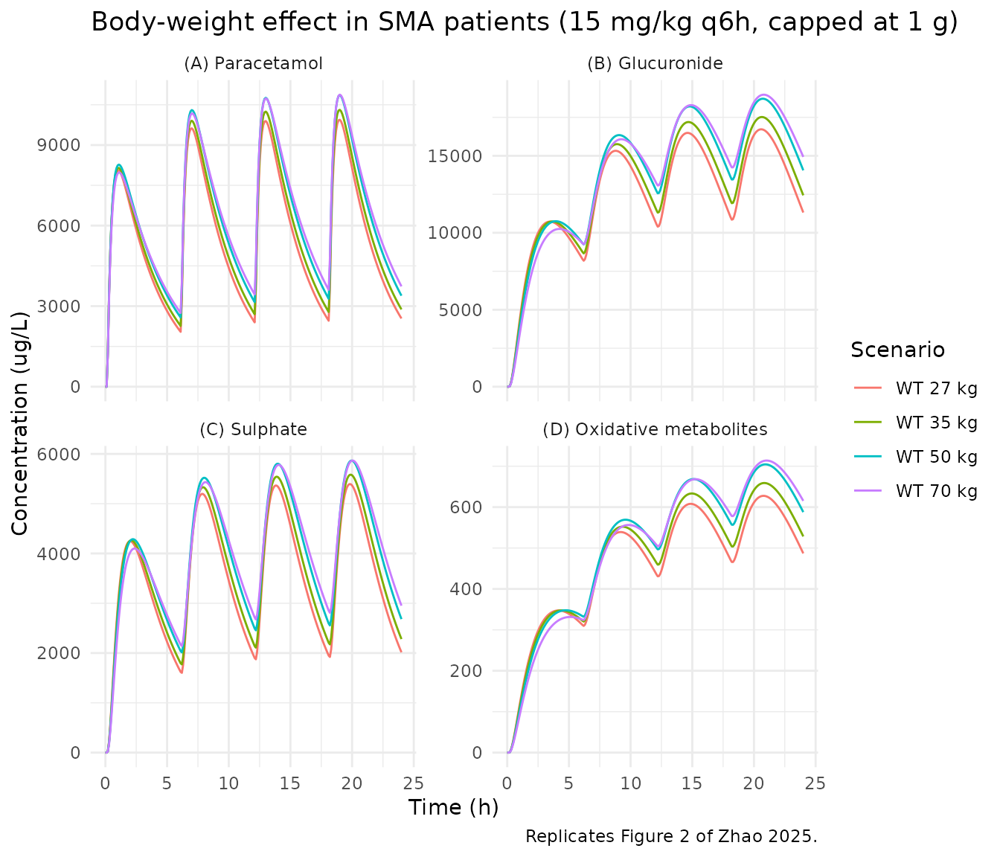
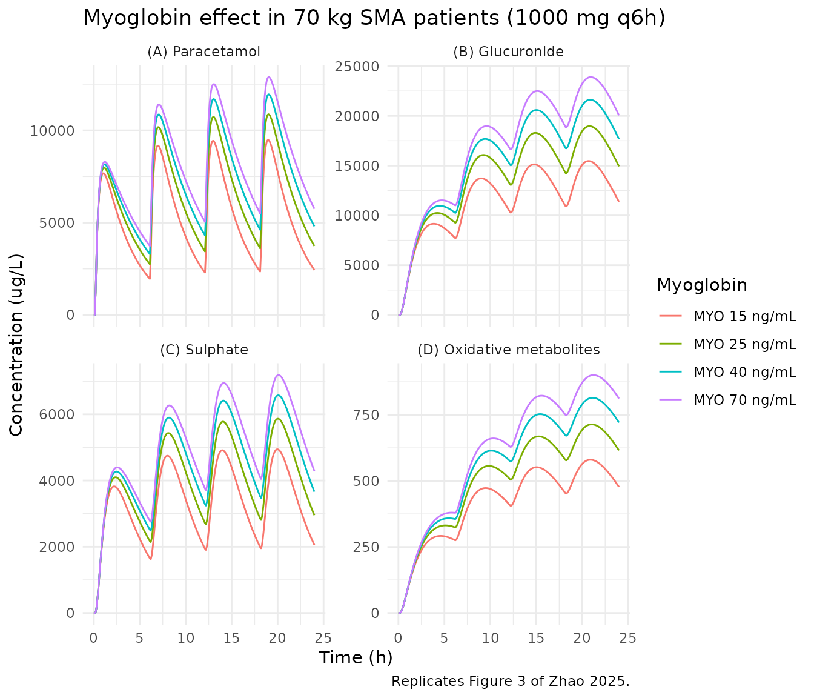
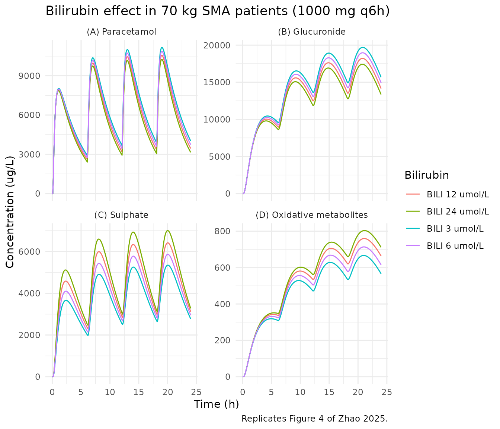
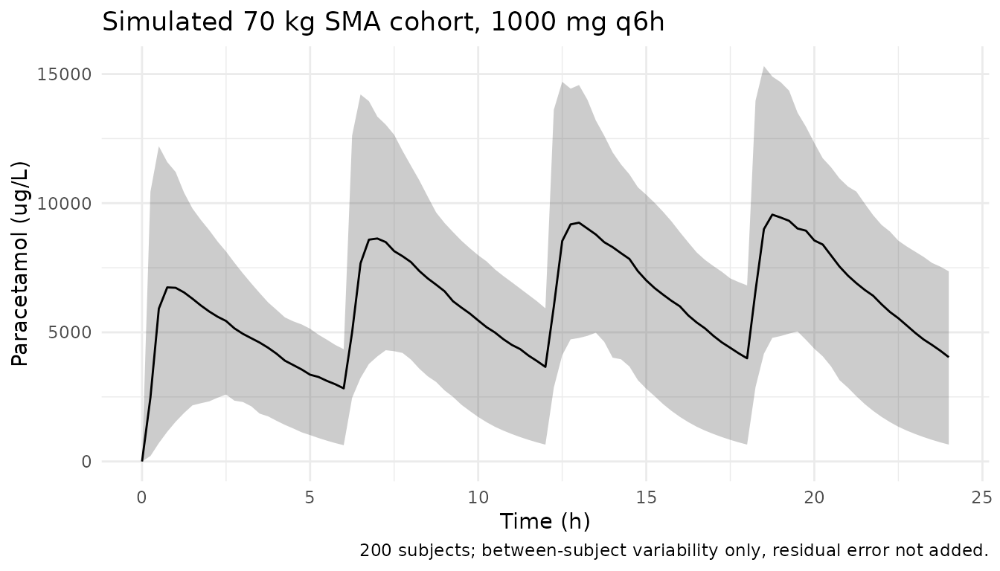

# Paracetamol and its metabolites in spinal muscular atrophy (Zhao 2025)

## Model and source

``` r

mod_meta <- nlmixr2est::nlmixr(readModelDb("Zhao_2025_paracetamol"))$meta
#> ℹ parameter labels from comments will be replaced by 'label()'
```

- Citation: Zhao Q, Naume MM, de Winter BCM, Krag T, Haslund-Krog SS,
  Revsbech KL, Vissing J, Holst H, Moller MH, Hornsyld TM, Duno M,
  Hoei-Hansen CE, Born AP, Jensen PB, Orngreen MC (2025). Paracetamol
  and its metabolites in children and adults with spinal muscular
  atrophy - a population pharmacokinetic model. Br J Clin Pharmacol
  91(7):2045-2056. <doi:10.1002/bcp.70028>.
- Article: <https://doi.org/10.1002/bcp.70028>
- Description: Parent-and-metabolites population PK model for oral
  paracetamol and its glucuronide, sulphate and combined oxidative
  (cysteine + mercapturate) metabolites in children and adults with
  spinal muscular atrophy (SMA) and healthy controls (Zhao 2025). One
  compartment per compound with first-order absorption through a depot,
  a fixed absorption lag time, and body-weight allometric scaling
  (exponent fixed at 0.75 on every clearance and 1 on every volume).
  Paracetamol leaves the central compartment by four parallel
  first-order routes: glucuronide formation, sulphate formation,
  oxidative-metabolite formation, and a leftover clearance covering
  unchanged drug plus any unaccounted route. Each metabolite has its own
  one-compartment plasma pool with an apparent volume fixed at 18% of
  the paracetamol volume and its own first-order elimination clearance.
  SMA disease status raises the paracetamol volume of distribution (and,
  through the fixed 0.18 ratio, every metabolite volume) by 58%; plasma
  myoglobin scales the paracetamol leftover clearance with a negative
  power exponent, and plasma total bilirubin scales sulphate-formation
  clearance positively and oxidative-metabolite elimination clearance
  negatively.

## Population

Zhao et al. (2025) analysed a Danish single-centre trial (EudraCT
2018-002295-40) in which six adults with spinal muscular atrophy (SMA),
six children with SMA and 11 healthy controls received oral paracetamol
15 mg/kg every 6 h for three days, capped at a maximum single dose of 1
g (Methods section 2.1). Blood was sampled hourly for 6-8 h on Days 1
and 3 after a pre-treatment baseline sample, giving 294 plasma samples
per analyte for each of paracetamol, paracetamol-glucuronide,
paracetamol-sulphate and the combined oxidative metabolites (cysteine
conjugate + mercapturic acid).

The two groups differ sharply in size and in the two retained
biochemical covariates (Table 1 of the source): median body weight 30.5
kg (range 22-57) in SMA versus 78.0 kg (51-103) in healthy controls;
median plasma myoglobin 17 ng/mL (14-54) versus 34 ng/mL (17-74); median
total bilirubin 4 umol/L (2-25) versus 7 umol/L (3-15). Median age was
17 years (6-37) in the SMA group and 25 years (20-36) in the controls;
10 of 23 participants (43.5%) were female.

The same information is available programmatically via
`readModelDb("Zhao_2025_paracetamol")$population`.

## Source trace

Every `ini()` entry in
`inst/modeldb/specificDrugs/Zhao_2025_paracetamol.R` carries an in-file
comment naming its source location. The table below collects them for
review.

| Component | Value | Source location |
|:---|:---|:---|
| Structural model | 1 cmt per compound, first-order absorption + lag, allometric WT | Figure 1 (schematic) and Results section 3.2 |
| Covariate model form | Eq. 1 (categorical, proportional) and Eq. 2 (continuous, median-normalised power) | Supplementary material 1, Methods for model building |
| t_lag | 0.153 h (FIX) | Table 2, row ‘t lag (h) (FIX)’ + table footnote |
| k_a | 2.84 1/h | Table 2, final model column |
| V_pcm/F | 63.5 L/70 kg | Table 2, final model column |
| CL_p/F (leftover) | 8.16 L/h/70 kg | Table 2, final model column |
| CL_pg/F (glucuronide formation) | 6.37 L/h/70 kg | Table 2, final model column |
| CL_ps/F (sulphate formation) | 8.43 L/h/70 kg | Table 2, final model column |
| CL_pox/F (oxidative formation) | 0.20 L/h/70 kg | Table 2, final model column |
| CL_gluc/F (glucuronide elimination) | 5.69 L/h/70 kg | Table 2, final model column |
| CL_sulf/F (sulphate elimination) | 20.4 L/h/70 kg | Table 2, final model column |
| CL_ox/F (oxidative elimination) | 3.72 L/h/70 kg | Table 2, final model column |
| Metabolite volumes | 0.18 \* V_pcm/F = 11.43 L/70 kg | Methods section 2.2 and Table 2 rows V_glu/V_sulf/V_ox |
| Allometric exponents | 0.75 on CL, 1 on V (both FIX) | Table 2 caption and Results section 3.2 |
| Disease effect on V_pcm/F | 1.58 | Table 2, ‘Covariate effect on V_pcm/F – Disease’ |
| Myoglobin on CL_p/F | -1.10 (per MYO/25) | Table 2 + Results section 3.3 (‘negative correlation’) |
| Bilirubin on CL_ps/F | +0.18 (per TBILI/6) | Table 2 + Results section 3.3 (‘positive correlation’) |
| Bilirubin on CL_ox/F | -0.177 (per TBILI/6) | Table 2 + Results section 3.3 (‘negative correlation’) |
| BSV (all six etas) | omega (log-SD) x 100, per Table 2 ‘BSV (%)’ | Table 2 + Discussion (CL_p/F CV 105% = sqrt(exp(0.862^2) - 1)) |
| Proportional residual error | 0.28 / 0.18 / 0.22 / 0.17 | Table 2, ‘Residual variability – Proportional’ |

Source trace for the Zhao 2025 paracetamol model. {.table}

### Two values whose sign the typeset table loses

Table 2 prints the myoglobin exponent as `1.10` and the
bilirubin-on-CL_ox exponent as `0.177`, but their bootstrap confidence
intervals are printed in *descending* order (`3.07 - 0.49` and
`0.45 - 0.03`), which is only possible for negative intervals, and
Results section 3.3 states both correlations are negative. The signs are
confirmed numerically by supplementary Table S3: the paracetamol
half-life rises monotonically with myoglobin (2.20 h at 15 ng/mL to 3.69
h at 70 ng/mL, i.e. clearance falls), and the oxidative-metabolite
half-life rises monotonically with bilirubin (3.18 h at 3 umol/L to 4.19
h at 24 umol/L). Both exponents are therefore encoded as negative.

### Concentration scale: molar, not paracetamol-mass

Zhao 2025 never states the amount scale of its metabolite compartments,
and the choice is load-bearing: paracetamol converts 1:1 on a *molar*
basis to each conjugate, so a parent-metabolite model with a single set
of formation and elimination clearances is only self-consistent when the
compartments carry moles. The paper’s own simulation output settles it,
because the steady-state exposure ratio of a metabolite to the parent is
volume-independent – it equals CL_formation / CL_elimination in whatever
amount unit the compartments carry, so it discriminates the amount scale
without depending on any volume. Reproducing the model on the molar
scale and converting each output to that species’ own mass units matches
supplementary Table S2 to within 2.5%; a paracetamol-mass
parameterisation is 34-53% low. The check is run on the simulated 0-24 h
window (the same window Table S2 reports) in the “Structural identity”
section below.

## Virtual cohort

The published simulations (Figures 2-4 and supplementary Tables S2 and
S3) all use SMA patients dosed 15 mg/kg every 6 h (capped at 1 g),
varying one covariate at a time and holding the others at the population
median (myoglobin 25 ng/mL, total bilirubin 6 umol/L – the same medians
Table 2 uses to normalise the two power models). Twelve typical-value
scenarios reproduce the three published simulation panels.

``` r

mw <- c(pcm = 151.16, gluc = 327.29, sulf = 231.23, cysmer = 270.30)

scenarios <- dplyr::bind_rows(
  tibble::tibble(panel = "Body weight (Table S2)",
                 WT = c(70, 50, 35, 27), MYO = 25, TBILI = 6),
  tibble::tibble(panel = "Myoglobin (Table S3)",
                 WT = 70, MYO = c(15, 25, 40, 70), TBILI = 6),
  tibble::tibble(panel = "Bilirubin (Table S3)",
                 WT = 70, MYO = 25, TBILI = c(3, 6, 12, 24))
) |>
  dplyr::mutate(
    DIS_HEALTHY = 0,
    id        = dplyr::row_number(),
    dose_mg   = pmin(1000, 15 * WT),
    dose_umol = dose_mg / mw[["pcm"]] * 1000,
    scenario  = dplyr::case_when(
      panel == "Body weight (Table S2)" ~ paste0("WT ", WT, " kg"),
      panel == "Myoglobin (Table S3)"   ~ paste0("MYO ", MYO, " ng/mL"),
      TRUE                              ~ paste0("BILI ", TBILI, " umol/L")
    )
  )

knitr::kable(
  scenarios |> dplyr::select(panel, scenario, WT, MYO, TBILI, dose_mg, dose_umol),
  digits = 1,
  caption = "Twelve typical-value SMA scenarios reproducing the published simulations."
)
```

| panel                  | scenario       |  WT | MYO | TBILI | dose_mg | dose_umol |
|:-----------------------|:---------------|----:|----:|------:|--------:|----------:|
| Body weight (Table S2) | WT 70 kg       |  70 |  25 |     6 |    1000 |    6615.5 |
| Body weight (Table S2) | WT 50 kg       |  50 |  25 |     6 |     750 |    4961.6 |
| Body weight (Table S2) | WT 35 kg       |  35 |  25 |     6 |     525 |    3473.1 |
| Body weight (Table S2) | WT 27 kg       |  27 |  25 |     6 |     405 |    2679.3 |
| Myoglobin (Table S3)   | MYO 15 ng/mL   |  70 |  15 |     6 |    1000 |    6615.5 |
| Myoglobin (Table S3)   | MYO 25 ng/mL   |  70 |  25 |     6 |    1000 |    6615.5 |
| Myoglobin (Table S3)   | MYO 40 ng/mL   |  70 |  40 |     6 |    1000 |    6615.5 |
| Myoglobin (Table S3)   | MYO 70 ng/mL   |  70 |  70 |     6 |    1000 |    6615.5 |
| Bilirubin (Table S3)   | BILI 3 umol/L  |  70 |  25 |     3 |    1000 |    6615.5 |
| Bilirubin (Table S3)   | BILI 6 umol/L  |  70 |  25 |     6 |    1000 |    6615.5 |
| Bilirubin (Table S3)   | BILI 12 umol/L |  70 |  25 |    12 |    1000 |    6615.5 |
| Bilirubin (Table S3)   | BILI 24 umol/L |  70 |  25 |    24 |    1000 |    6615.5 |

Twelve typical-value SMA scenarios reproducing the published
simulations. {.table style="width:100%;"}

``` r

obs_times <- seq(0, 24, by = 0.1)

doses <- scenarios |>
  tidyr::expand_grid(time = c(0, 6, 12, 18)) |>
  dplyr::mutate(cmt = "depot", amt = dose_umol, evid = 1L) |>
  dplyr::select(id, time, cmt, amt, evid, WT, MYO, TBILI, DIS_HEALTHY)

obs <- scenarios |>
  dplyr::select(id, WT, MYO, TBILI, DIS_HEALTHY) |>
  tidyr::expand_grid(time = obs_times) |>
  dplyr::mutate(cmt = "Cc", amt = NA_real_, evid = 0L) |>
  dplyr::select(id, time, cmt, amt, evid, WT, MYO, TBILI, DIS_HEALTHY)

events <- dplyr::bind_rows(doses, obs) |>
  dplyr::arrange(id, time, dplyr::desc(evid))
```

## Simulation

Typical-value trajectories use
[`rxode2::zeroRe()`](https://nlmixr2.github.io/rxode2/reference/zeroRe.html)
so that the comparison against the published typical simulations is not
blurred by the (very large) between-subject variability on `k_a` and
`CL_p/F`.

``` r

mod <- readModelDb("Zhao_2025_paracetamol")
mod_typ <- rxode2::zeroRe(mod)
#> ℹ parameter labels from comments will be replaced by 'label()'

sim <- rxode2::rxSolve(mod_typ, events = events, omega = NA, sigma = NA) |>
  as.data.frame() |>
  dplyr::left_join(dplyr::select(scenarios, id, panel, scenario), by = "id")

stopifnot(dplyr::n_distinct(sim$id) == nrow(scenarios))

# Convert each analyte from umol/L to its own mass concentration (ug/L),
# which is the scale the published figures and supplementary tables use.
sim <- sim |>
  dplyr::mutate(
    pcm_ugL    = Cc        * mw[["pcm"]],
    gluc_ugL   = Cc_gluc   * mw[["gluc"]],
    sulf_ugL   = Cc_sulf   * mw[["sulf"]],
    cysmer_ugL = Cc_cysmer * mw[["cysmer"]]
  )
```

## Replicate Figure 2 – body-weight effect in SMA patients

``` r

long_ugL <- function(d) {
  d |>
    tidyr::pivot_longer(
      c(pcm_ugL, gluc_ugL, sulf_ugL, cysmer_ugL),
      names_to = "analyte", values_to = "conc"
    ) |>
    dplyr::mutate(analyte = factor(
      analyte,
      levels = c("pcm_ugL", "gluc_ugL", "sulf_ugL", "cysmer_ugL"),
      labels = c("(A) Paracetamol", "(B) Glucuronide",
                 "(C) Sulphate", "(D) Oxidative metabolites")
    ))
}

sim |>
  dplyr::filter(panel == "Body weight (Table S2)") |>
  long_ugL() |>
  ggplot(aes(time, conc, colour = scenario)) +
  geom_line() +
  facet_wrap(~analyte, scales = "free_y") +
  labs(x = "Time (h)", y = "Concentration (ug/L)", colour = "Scenario",
       title = "Body-weight effect in SMA patients (15 mg/kg q6h, capped at 1 g)",
       caption = "Replicates Figure 2 of Zhao 2025.") +
  theme_minimal()
```



## Replicate Figure 3 – myoglobin effect in 70 kg SMA patients

``` r

sim |>
  dplyr::filter(panel == "Myoglobin (Table S3)") |>
  long_ugL() |>
  ggplot(aes(time, conc, colour = scenario)) +
  geom_line() +
  facet_wrap(~analyte, scales = "free_y") +
  labs(x = "Time (h)", y = "Concentration (ug/L)", colour = "Myoglobin",
       title = "Myoglobin effect in 70 kg SMA patients (1000 mg q6h)",
       caption = "Replicates Figure 3 of Zhao 2025.") +
  theme_minimal()
```



## Replicate Figure 4 – bilirubin effect in 70 kg SMA patients

``` r

sim |>
  dplyr::filter(panel == "Bilirubin (Table S3)") |>
  long_ugL() |>
  ggplot(aes(time, conc, colour = scenario)) +
  geom_line() +
  facet_wrap(~analyte, scales = "free_y") +
  labs(x = "Time (h)", y = "Concentration (ug/L)", colour = "Bilirubin",
       title = "Bilirubin effect in 70 kg SMA patients (1000 mg q6h)",
       caption = "Replicates Figure 4 of Zhao 2025.") +
  theme_minimal()
```



The absolute levels are the first check on the molar reading: at
myoglobin 25 ng/mL and bilirubin 6 umol/L the simulated 70 kg SMA
patient sits at roughly 3000-11000 ug/L paracetamol, 11000-18000 ug/L
glucuronide, 2500-6000 ug/L sulphate and 400-700 ug/L oxidative
metabolites, matching the axis ranges of Figures 2-4 of the source.

## PKNCA validation

``` r

nca_one <- function(conc_col) {
  cdat <- sim |>
    dplyr::select(id, time, scenario, conc = dplyr::all_of(conc_col)) |>
    dplyr::filter(!is.na(conc))
  ddat <- scenarios |>
    dplyr::select(id, scenario, amt = dose_umol) |>
    tidyr::expand_grid(time = c(0, 6, 12, 18))
  obj <- PKNCA::PKNCAdata(
    PKNCA::PKNCAconc(cdat, conc ~ time | scenario + id),
    PKNCA::PKNCAdose(ddat, amt ~ time | scenario + id),
    intervals = data.frame(
      start = 0, end = 24,
      cmax = TRUE, tmax = TRUE, auclast = TRUE, half.life = TRUE
    )
  )
  as.data.frame(PKNCA::pk.nca(obj)$result) |>
    dplyr::mutate(analyte = conc_col)
}

nca <- dplyr::bind_rows(lapply(
  c("pcm_ugL", "gluc_ugL", "sulf_ugL", "cysmer_ugL"), nca_one
))

nca_wide <- nca |>
  dplyr::select(scenario, analyte, PPTESTCD, PPORRES) |>
  tidyr::pivot_wider(names_from = PPTESTCD, values_from = PPORRES)

knitr::kable(
  nca_wide |>
    dplyr::rename("Scenario" = scenario, "Analyte" = analyte,
                  "Cmax (ug/L)" = cmax, "Tmax (h)" = tmax,
                  "AUC0-24 (ug*h/L)" = auclast, "t1/2 (h)" = half.life),
  digits = c(0, 0, 0, 2, 0, 2),
  caption = paste(
    "Simulated typical-value NCA over 0-24 h for all four analytes.",
    "Half-life is the NCA terminal half-life from the simulated profile,",
    "which for a metabolite is formation-rate limited and therefore tracks",
    "the parent -- it is not comparable to the V/CL half-lives the paper",
    "tabulates (see below)."
  )
)
```

| Scenario | Analyte | AUC0-24 (ug\*h/L) | Cmax (ug/L) | Tmax (h) | tlast | lambda.z | r.squared | adj.r.squared | lambda.z.time.first | lambda.z.time.last | lambda.z.n.points | clast.pred | t1/2 (h) | span.ratio |
|:---|:---|---:|---:|---:|---:|---:|---:|---:|---:|---:|---:|---:|---:|---:|
| BILI 12 umol/L | pcm_ugL | 150547 | 10571.41 | 19 | 24 | 0 | 1 | 1 | 19.6 | 24 | 45 | 3454 | 3 | 2 |
| BILI 24 umol/L | pcm_ugL | 144240 | 10257.26 | 19 | 24 | 0 | 1 | 1 | 19.6 | 24 | 45 | 3156 | 3 | 2 |
| BILI 3 umol/L | pcm_ugL | 162254 | 11168.33 | 19 | 24 | 0 | 1 | 1 | 19.6 | 24 | 45 | 4032 | 3 | 1 |
| BILI 6 umol/L | pcm_ugL | 156560 | 10875.78 | 19 | 24 | 0 | 1 | 1 | 19.6 | 24 | 45 | 3747 | 3 | 1 |
| MYO 15 ng/mL | pcm_ugL | 128174 | 9480.54 | 19 | 24 | 0 | 1 | 1 | 19.6 | 24 | 45 | 2440 | 2 | 2 |
| MYO 25 ng/mL | pcm_ugL | 156560 | 10875.78 | 19 | 24 | 0 | 1 | 1 | 19.6 | 24 | 45 | 3747 | 3 | 1 |
| MYO 40 ng/mL | pcm_ugL | 177148 | 11953.20 | 19 | 24 | 0 | 1 | 1 | 19.6 | 24 | 45 | 4811 | 4 | 1 |
| MYO 70 ng/mL | pcm_ugL | 194212 | 12885.75 | 19 | 24 | 0 | 1 | 1 | 19.7 | 24 | 44 | 5759 | 4 | 1 |
| WT 27 kg | pcm_ugL | 134281 | 9940.32 | 19 | 24 | 0 | 1 | 1 | 19.6 | 24 | 45 | 2549 | 2 | 2 |
| WT 35 kg | pcm_ugL | 142052 | 10311.30 | 19 | 24 | 0 | 1 | 1 | 19.6 | 24 | 45 | 2886 | 3 | 2 |
| WT 50 kg | pcm_ugL | 153261 | 10859.66 | 19 | 24 | 0 | 1 | 1 | 19.6 | 24 | 45 | 3398 | 3 | 2 |
| WT 70 kg | pcm_ugL | 156560 | 10875.78 | 19 | 24 | 0 | 1 | 1 | 19.6 | 24 | 45 | 3747 | 3 | 1 |
| BILI 12 umol/L | gluc_ugL | 319898 | 18211.47 | 21 | 24 | 0 | 1 | 1 | 23.7 | 24 | 4 | 14154 | 6 | 0 |
| BILI 24 umol/L | gluc_ugL | 307153 | 17424.57 | 21 | 24 | 0 | 1 | 1 | 23.6 | 24 | 5 | 13355 | 5 | 0 |
| BILI 3 umol/L | gluc_ugL | 343444 | 19694.72 | 21 | 24 | 0 | 1 | 1 | 23.7 | 24 | 4 | 15675 | 6 | 0 |
| BILI 6 umol/L | gluc_ugL | 332011 | 18969.70 | 21 | 24 | 0 | 1 | 1 | 23.7 | 24 | 4 | 14930 | 6 | 0 |
| MYO 15 ng/mL | gluc_ugL | 274493 | 15466.49 | 21 | 24 | 0 | 1 | 1 | 23.6 | 24 | 5 | 11375 | 5 | 0 |
| MYO 25 ng/mL | gluc_ugL | 332011 | 18969.70 | 21 | 24 | 0 | 1 | 1 | 23.7 | 24 | 4 | 14930 | 6 | 0 |
| MYO 40 ng/mL | gluc_ugL | 373197 | 21625.63 | 21 | 24 | 0 | 1 | 1 | 23.7 | 24 | 4 | 17676 | 7 | 0 |
| MYO 70 ng/mL | gluc_ugL | 407006 | 23897.51 | 21 | 24 | 0 | 1 | 1 | 23.7 | 24 | 4 | 20055 | 7 | 0 |
| WT 27 kg | gluc_ugL | 297084 | 16721.08 | 21 | 24 | 0 | 1 | 1 | 23.6 | 24 | 5 | 11317 | 4 | 0 |
| WT 35 kg | gluc_ugL | 311039 | 17517.75 | 21 | 24 | 0 | 1 | 1 | 23.6 | 24 | 5 | 12435 | 4 | 0 |
| WT 50 kg | gluc_ugL | 330380 | 18706.37 | 21 | 24 | 0 | 1 | 1 | 23.6 | 24 | 5 | 14058 | 5 | 0 |
| WT 70 kg | gluc_ugL | 332011 | 18969.70 | 21 | 24 | 0 | 1 | 1 | 23.7 | 24 | 4 | 14930 | 6 | 0 |
| BILI 12 umol/L | sulf_ugL | 105017 | 6419.65 | 20 | 24 | 0 | 1 | 1 | 22.5 | 24 | 16 | 3125 | 3 | 0 |
| BILI 24 umol/L | sulf_ugL | 114086 | 7006.98 | 20 | 24 | 0 | 1 | 1 | 22.5 | 24 | 16 | 3279 | 3 | 1 |
| BILI 3 umol/L | sulf_ugL | 88053 | 5347.82 | 20 | 24 | 0 | 1 | 1 | 22.5 | 24 | 16 | 2779 | 3 | 0 |
| BILI 6 umol/L | sulf_ugL | 96324 | 5866.68 | 20 | 24 | 0 | 1 | 1 | 22.5 | 24 | 16 | 2957 | 3 | 0 |
| MYO 15 ng/mL | sulf_ugL | 79175 | 4944.55 | 20 | 24 | 0 | 1 | 1 | 22.5 | 24 | 16 | 2059 | 3 | 1 |
| MYO 25 ng/mL | sulf_ugL | 96324 | 5866.68 | 20 | 24 | 0 | 1 | 1 | 22.5 | 24 | 16 | 2957 | 3 | 0 |
| MYO 40 ng/mL | sulf_ugL | 108709 | 6574.34 | 20 | 24 | 0 | 1 | 1 | 22.5 | 24 | 16 | 3667 | 4 | 0 |
| MYO 70 ng/mL | sulf_ugL | 118942 | 7184.46 | 20 | 24 | 0 | 1 | 1 | 22.5 | 24 | 16 | 4293 | 4 | 0 |
| WT 27 kg | sulf_ugL | 83447 | 5395.12 | 20 | 24 | 0 | 1 | 1 | 21.9 | 24 | 22 | 2021 | 2 | 1 |
| WT 35 kg | sulf_ugL | 88067 | 5583.52 | 20 | 24 | 0 | 1 | 1 | 22.1 | 24 | 20 | 2286 | 3 | 1 |
| WT 50 kg | sulf_ugL | 94668 | 5865.53 | 20 | 24 | 0 | 1 | 1 | 22.3 | 24 | 18 | 2687 | 3 | 1 |
| WT 70 kg | sulf_ugL | 96324 | 5866.68 | 20 | 24 | 0 | 1 | 1 | 22.5 | 24 | 16 | 2957 | 3 | 0 |
| BILI 12 umol/L | cysmer_ugL | 12714 | 759.86 | 21 | 24 | 0 | 1 | 1 | 23.7 | 24 | 4 | 664 | 9 | 0 |
| BILI 24 umol/L | cysmer_ugL | 13305 | 803.73 | 21 | 24 | 0 | 1 | 1 | 23.7 | 24 | 4 | 711 | 10 | 0 |
| BILI 3 umol/L | cysmer_ugL | 11362 | 666.81 | 21 | 24 | 0 | 1 | 1 | 23.7 | 24 | 4 | 566 | 8 | 0 |
| BILI 6 umol/L | cysmer_ugL | 12060 | 713.83 | 21 | 24 | 0 | 1 | 1 | 23.7 | 24 | 4 | 615 | 8 | 0 |
| MYO 15 ng/mL | cysmer_ugL | 10001 | 579.97 | 21 | 24 | 0 | 1 | 1 | 23.7 | 24 | 4 | 477 | 7 | 0 |
| MYO 25 ng/mL | cysmer_ugL | 12060 | 713.83 | 21 | 24 | 0 | 1 | 1 | 23.7 | 24 | 4 | 615 | 8 | 0 |
| MYO 40 ng/mL | cysmer_ugL | 13527 | 814.61 | 21 | 24 | 0 | 1 | 1 | 23.7 | 24 | 4 | 721 | 10 | 0 |
| MYO 70 ng/mL | cysmer_ugL | 14728 | 900.38 | 21 | 24 | 0 | 1 | 1 | 23.7 | 24 | 4 | 812 | 11 | 0 |
| WT 27 kg | cysmer_ugL | 11043 | 627.58 | 21 | 24 | 0 | 1 | 1 | 23.7 | 24 | 4 | 487 | 5 | 0 |
| WT 35 kg | cysmer_ugL | 11495 | 658.96 | 21 | 24 | 0 | 1 | 1 | 23.7 | 24 | 4 | 528 | 6 | 0 |
| WT 50 kg | cysmer_ugL | 12107 | 704.50 | 21 | 24 | 0 | 1 | 1 | 23.7 | 24 | 4 | 588 | 7 | 0 |
| WT 70 kg | cysmer_ugL | 12060 | 713.83 | 21 | 24 | 0 | 1 | 1 | 23.7 | 24 | 4 | 615 | 8 | 0 |

Simulated typical-value NCA over 0-24 h for all four analytes. Half-life
is the NCA terminal half-life from the simulated profile, which for a
metabolite is formation-rate limited and therefore tracks the parent –
it is not comparable to the V/CL half-lives the paper tabulates (see
below). {.table}

### Comparison against the published AUC(0-24 h)

Supplementary Tables S2 and S3 report the median AUC(0-24 h) of 1000
simulated subjects for each scenario. The comparison below is against
the typical-value (zero-variability) trajectory, so a small systematic
offset is expected: with the very skewed between-subject distribution on
`CL_p/F` (omega = 0.862), the median of the individual total clearances
exceeds the typical value, so the published medians sit slightly below
the typical-value AUC.

``` r

ref_auc <- tibble::tribble(
  ~scenario,           ~pcm_ugL, ~gluc_ugL, ~sulf_ugL, ~cysmer_ugL,
  "WT 70 kg",            147330,    304768,     89652,       11152,
  "WT 50 kg",            143339,    298104,     88688,       11294,
  "WT 35 kg",            133833,    289267,     84298,       11141,
  "WT 27 kg",            123959,    263171,     76024,        9898,
  "MYO 15 ng/mL",        121164,    252827,     74728,        9197,
  "MYO 25 ng/mL",        146178,    301519,     89376,       11242,
  "MYO 40 ng/mL",        166944,    346387,    103558,       12789,
  "MYO 70 ng/mL",        178697,    366287,    109699,       13186,
  "BILI 3 umol/L",       152463,    315236,     81747,       10538,
  "BILI 6 umol/L",       146178,    301519,     89376,       11242,
  "BILI 12 umol/L",      141846,    298449,    100237,       12155,
  "BILI 24 umol/L",      131999,    271035,    104188,       11841
) |>
  tidyr::pivot_longer(-scenario, names_to = "analyte", values_to = "auclast")

auc_cmp <- nca_wide |>
  dplyr::select(scenario, analyte, simulated = auclast) |>
  dplyr::inner_join(ref_auc, by = c("scenario", "analyte")) |>
  dplyr::mutate(
    analyte = dplyr::recode(analyte,
      pcm_ugL = "Paracetamol", gluc_ugL = "Glucuronide",
      sulf_ugL = "Sulphate", cysmer_ugL = "Oxidative"),
    "% diff" = round(100 * (simulated - auclast) / auclast, 1)
  ) |>
  dplyr::rename("Scenario" = scenario, "Analyte" = analyte,
                "Published (ug*h/L)" = auclast,
                "Simulated (ug*h/L)" = simulated)

knitr::kable(auc_cmp, digits = 0,
             caption = "AUC(0-24 h): simulated typical value vs published median of 1000 subjects (supplementary Tables S2 and S3).")
```

| Scenario       | Analyte     | Simulated (ug\*h/L) | Published (ug\*h/L) | % diff |
|:---------------|:------------|--------------------:|--------------------:|-------:|
| BILI 12 umol/L | Paracetamol |              150547 |              141846 |      6 |
| BILI 24 umol/L | Paracetamol |              144240 |              131999 |      9 |
| BILI 3 umol/L  | Paracetamol |              162254 |              152463 |      6 |
| BILI 6 umol/L  | Paracetamol |              156560 |              146178 |      7 |
| MYO 15 ng/mL   | Paracetamol |              128174 |              121164 |      6 |
| MYO 25 ng/mL   | Paracetamol |              156560 |              146178 |      7 |
| MYO 40 ng/mL   | Paracetamol |              177148 |              166944 |      6 |
| MYO 70 ng/mL   | Paracetamol |              194212 |              178697 |      9 |
| WT 27 kg       | Paracetamol |              134281 |              123959 |      8 |
| WT 35 kg       | Paracetamol |              142052 |              133833 |      6 |
| WT 50 kg       | Paracetamol |              153261 |              143339 |      7 |
| WT 70 kg       | Paracetamol |              156560 |              147330 |      6 |
| BILI 12 umol/L | Glucuronide |              319898 |              298449 |      7 |
| BILI 24 umol/L | Glucuronide |              307153 |              271035 |     13 |
| BILI 3 umol/L  | Glucuronide |              343444 |              315236 |      9 |
| BILI 6 umol/L  | Glucuronide |              332011 |              301519 |     10 |
| MYO 15 ng/mL   | Glucuronide |              274493 |              252827 |      9 |
| MYO 25 ng/mL   | Glucuronide |              332011 |              301519 |     10 |
| MYO 40 ng/mL   | Glucuronide |              373197 |              346387 |      8 |
| MYO 70 ng/mL   | Glucuronide |              407006 |              366287 |     11 |
| WT 27 kg       | Glucuronide |              297084 |              263171 |     13 |
| WT 35 kg       | Glucuronide |              311039 |              289267 |      8 |
| WT 50 kg       | Glucuronide |              330380 |              298104 |     11 |
| WT 70 kg       | Glucuronide |              332011 |              304768 |      9 |
| BILI 12 umol/L | Sulphate    |              105017 |              100237 |      5 |
| BILI 24 umol/L | Sulphate    |              114086 |              104188 |     10 |
| BILI 3 umol/L  | Sulphate    |               88053 |               81747 |      8 |
| BILI 6 umol/L  | Sulphate    |               96324 |               89376 |      8 |
| MYO 15 ng/mL   | Sulphate    |               79175 |               74728 |      6 |
| MYO 25 ng/mL   | Sulphate    |               96324 |               89376 |      8 |
| MYO 40 ng/mL   | Sulphate    |              108709 |              103558 |      5 |
| MYO 70 ng/mL   | Sulphate    |              118942 |              109699 |      8 |
| WT 27 kg       | Sulphate    |               83447 |               76024 |     10 |
| WT 35 kg       | Sulphate    |               88067 |               84298 |      4 |
| WT 50 kg       | Sulphate    |               94668 |               88688 |      7 |
| WT 70 kg       | Sulphate    |               96324 |               89652 |      7 |
| BILI 12 umol/L | Oxidative   |               12714 |               12155 |      5 |
| BILI 24 umol/L | Oxidative   |               13305 |               11841 |     12 |
| BILI 3 umol/L  | Oxidative   |               11362 |               10538 |      8 |
| BILI 6 umol/L  | Oxidative   |               12060 |               11242 |      7 |
| MYO 15 ng/mL   | Oxidative   |               10001 |                9197 |      9 |
| MYO 25 ng/mL   | Oxidative   |               12060 |               11242 |      7 |
| MYO 40 ng/mL   | Oxidative   |               13527 |               12789 |      6 |
| MYO 70 ng/mL   | Oxidative   |               14728 |               13186 |     12 |
| WT 27 kg       | Oxidative   |               11043 |                9898 |     12 |
| WT 35 kg       | Oxidative   |               11495 |               11141 |      3 |
| WT 50 kg       | Oxidative   |               12107 |               11294 |      7 |
| WT 70 kg       | Oxidative   |               12060 |               11152 |      8 |

AUC(0-24 h): simulated typical value vs published median of 1000
subjects (supplementary Tables S2 and S3). {.table style="width:100%;"}

``` r

summary(abs(auc_cmp[["% diff"]]))
#>    Min. 1st Qu.  Median    Mean 3rd Qu.    Max. 
#>   3.200   6.375   7.700   7.967   9.000  13.300
```

### Comparison against the published half-lives

The half-lives in supplementary Tables S2 and S3 cannot be terminal
half-lives: the glucuronide (2.20 h) and sulphate (0.61 h) values are
*shorter* than the parent’s (2.85 h), which is impossible for a
metabolite whose formation is rate-limiting. They are per-subject
`ln(2) * V / CL` values summarised over the simulated cohort. The check
below computes the same quantity analytically from the model parameters.

``` r

halflife_analytic <- function(WT, MYO, TBILI, DIS_HEALTHY = 0) {
  vc   <- 63.5 * 1.58 * (WT / 70) * (1 + (1 / 1.58 - 1) * DIS_HEALTHY)
  vmet <- 0.18 * vc
  allo <- (WT / 70)^0.75
  cl_left   <- 8.16 * allo * (MYO / 25)^(-1.10)
  cl_gluc   <- 6.37 * allo
  cl_sulf   <- 8.43 * allo * (TBILI / 6)^(0.18)
  cl_cysmer <- 0.20 * allo
  c(
    pcm    = log(2) * vc / (cl_left + cl_gluc + cl_sulf + cl_cysmer),
    gluc   = log(2) * vmet / (5.69 * allo),
    sulf   = log(2) * vmet / (20.4 * allo),
    cysmer = log(2) * vmet / (3.72 * allo * (TBILI / 6)^(-0.177))
  )
}

hl_sim <- scenarios |>
  dplyr::rowwise() |>
  dplyr::mutate(hl = list(halflife_analytic(WT, MYO, TBILI, DIS_HEALTHY))) |>
  dplyr::ungroup() |>
  tidyr::unnest_wider(hl) |>
  dplyr::select(scenario, pcm, gluc, sulf, cysmer) |>
  tidyr::pivot_longer(-scenario, names_to = "analyte", values_to = "simulated")

ref_hl <- tibble::tribble(
  ~scenario,        ~pcm, ~gluc, ~sulf, ~cysmer,
  "WT 70 kg",       2.85,  2.20,  0.61,    3.37,
  "WT 50 kg",       2.65,  2.04,  0.57,    3.12,
  "WT 35 kg",       2.40,  1.85,  0.51,    2.92,
  "WT 27 kg",       2.24,  1.74,  0.49,    2.61,
  "MYO 15 ng/mL",   2.20,  2.20,  0.61,    3.38,
  "MYO 25 ng/mL",   2.79,  2.17,  0.60,    3.31,
  "MYO 40 ng/mL",   3.14,  2.17,  0.60,    3.37,
  "MYO 70 ng/mL",   3.69,  2.22,  0.62,    3.32,
  "BILI 3 umol/L",  2.99,  2.29,  0.64,    3.18,
  "BILI 6 umol/L",  2.84,  2.20,  0.61,    3.37,
  "BILI 12 umol/L", 2.79,  2.21,  0.62,    3.79,
  "BILI 24 umol/L", 2.46,  2.13,  0.59,    4.19
) |>
  tidyr::pivot_longer(-scenario, names_to = "analyte", values_to = "published")

hl_cmp <- hl_sim |>
  dplyr::inner_join(ref_hl, by = c("scenario", "analyte")) |>
  dplyr::mutate(
    analyte = dplyr::recode(analyte,
      pcm = "Paracetamol", gluc = "Glucuronide",
      sulf = "Sulphate", cysmer = "Oxidative"),
    "% diff" = round(100 * (simulated - published) / published, 1)
  ) |>
  dplyr::rename("Scenario" = scenario, "Analyte" = analyte,
                "Published t1/2 (h)" = published,
                "Analytic ln(2)V/CL (h)" = simulated)

knitr::kable(hl_cmp, digits = 2,
             caption = "ln(2) * V / CL half-lives vs supplementary Tables S2 and S3.")
```

| Scenario       | Analyte     | Analytic ln(2)V/CL (h) | Published t1/2 (h) | % diff |
|:---------------|:------------|-----------------------:|-------------------:|-------:|
| WT 70 kg       | Paracetamol |                   3.00 |               2.85 |    5.4 |
| WT 70 kg       | Glucuronide |                   2.20 |               2.20 |    0.0 |
| WT 70 kg       | Sulphate    |                   0.61 |               0.61 |    0.6 |
| WT 70 kg       | Oxidative   |                   3.37 |               3.37 |   -0.1 |
| WT 50 kg       | Paracetamol |                   2.76 |               2.65 |    4.2 |
| WT 50 kg       | Glucuronide |                   2.02 |               2.04 |   -0.9 |
| WT 50 kg       | Sulphate    |                   0.56 |               0.57 |   -1.0 |
| WT 50 kg       | Oxidative   |                   3.09 |               3.12 |   -0.8 |
| WT 35 kg       | Paracetamol |                   2.52 |               2.40 |    5.2 |
| WT 35 kg       | Glucuronide |                   1.85 |               1.85 |    0.0 |
| WT 35 kg       | Sulphate    |                   0.52 |               0.51 |    1.2 |
| WT 35 kg       | Oxidative   |                   2.83 |               2.92 |   -3.1 |
| WT 27 kg       | Paracetamol |                   2.37 |               2.24 |    5.6 |
| WT 27 kg       | Glucuronide |                   1.73 |               1.74 |   -0.4 |
| WT 27 kg       | Sulphate    |                   0.48 |               0.49 |   -1.3 |
| WT 27 kg       | Oxidative   |                   2.65 |               2.61 |    1.6 |
| MYO 15 ng/mL   | Paracetamol |                   2.37 |               2.20 |    7.8 |
| MYO 15 ng/mL   | Glucuronide |                   2.20 |               2.20 |    0.0 |
| MYO 15 ng/mL   | Sulphate    |                   0.61 |               0.61 |    0.6 |
| MYO 15 ng/mL   | Oxidative   |                   3.37 |               3.38 |   -0.4 |
| MYO 25 ng/mL   | Paracetamol |                   3.00 |               2.79 |    7.6 |
| MYO 25 ng/mL   | Glucuronide |                   2.20 |               2.17 |    1.4 |
| MYO 25 ng/mL   | Sulphate    |                   0.61 |               0.60 |    2.3 |
| MYO 25 ng/mL   | Oxidative   |                   3.37 |               3.31 |    1.7 |
| MYO 40 ng/mL   | Paracetamol |                   3.50 |               3.14 |   11.5 |
| MYO 40 ng/mL   | Glucuronide |                   2.20 |               2.17 |    1.4 |
| MYO 40 ng/mL   | Sulphate    |                   0.61 |               0.60 |    2.3 |
| MYO 40 ng/mL   | Oxidative   |                   3.37 |               3.37 |   -0.1 |
| MYO 70 ng/mL   | Paracetamol |                   3.94 |               3.69 |    6.9 |
| MYO 70 ng/mL   | Glucuronide |                   2.20 |               2.22 |   -0.9 |
| MYO 70 ng/mL   | Sulphate    |                   0.61 |               0.62 |   -1.0 |
| MYO 70 ng/mL   | Oxidative   |                   3.37 |               3.32 |    1.4 |
| BILI 3 umol/L  | Paracetamol |                   3.14 |               2.99 |    4.9 |
| BILI 3 umol/L  | Glucuronide |                   2.20 |               2.29 |   -3.9 |
| BILI 3 umol/L  | Sulphate    |                   0.61 |               0.64 |   -4.1 |
| BILI 3 umol/L  | Oxidative   |                   2.98 |               3.18 |   -6.4 |
| BILI 6 umol/L  | Paracetamol |                   3.00 |               2.84 |    5.7 |
| BILI 6 umol/L  | Glucuronide |                   2.20 |               2.20 |    0.0 |
| BILI 6 umol/L  | Sulphate    |                   0.61 |               0.61 |    0.6 |
| BILI 6 umol/L  | Oxidative   |                   3.37 |               3.37 |   -0.1 |
| BILI 12 umol/L | Paracetamol |                   2.86 |               2.79 |    2.7 |
| BILI 12 umol/L | Glucuronide |                   2.20 |               2.21 |   -0.5 |
| BILI 12 umol/L | Sulphate    |                   0.61 |               0.62 |   -1.0 |
| BILI 12 umol/L | Oxidative   |                   3.80 |               3.79 |    0.4 |
| BILI 24 umol/L | Paracetamol |                   2.72 |               2.46 |   10.6 |
| BILI 24 umol/L | Glucuronide |                   2.20 |               2.13 |    3.3 |
| BILI 24 umol/L | Sulphate    |                   0.61 |               0.59 |    4.0 |
| BILI 24 umol/L | Oxidative   |                   4.30 |               4.19 |    2.6 |

ln(2) \* V / CL half-lives vs supplementary Tables S2 and S3. {.table}

``` r

# The three metabolite half-lives are pure parameter arithmetic with no
# between-subject variability on their elimination clearances, so they must
# reproduce the published values essentially exactly.
met_err <- hl_cmp |>
  dplyr::filter(Analyte != "Paracetamol") |>
  dplyr::pull("% diff") |>
  abs()
stopifnot(
  stats::median(met_err) < 2.5,
  max(met_err) < 8
)
c(median = stats::median(met_err), max = max(met_err))
#> median    max 
#>    1.0    6.4
```

### Allometric scaling is reproduced exactly

With a clearance exponent of 0.75 and a volume exponent of 1, `V / CL` –
and hence the half-life – scales as `WT^0.25`. Supplementary Table S2’s
body-weight panel reproduces that to two decimal places.

``` r

wt_panel <- scenarios |> dplyr::filter(panel == "Body weight (Table S2)")
tibble::tibble(
  "WT (kg)" = wt_panel$WT,
  "Published t1/2 ratio to 70 kg" =
    round(c(2.85, 2.65, 2.40, 2.24) / 2.85, 4),
  "(WT/70)^0.25" = round((wt_panel$WT / 70)^0.25, 4)
) |>
  knitr::kable(caption = "Half-life ratio across body weights vs the fixed allometric exponents.")
```

| WT (kg) | Published t1/2 ratio to 70 kg | (WT/70)^0.25 |
|--------:|------------------------------:|-------------:|
|      70 |                        1.0000 |       1.0000 |
|      50 |                        0.9298 |       0.9193 |
|      35 |                        0.8421 |       0.8409 |
|      27 |                        0.7860 |       0.7881 |

Half-life ratio across body weights vs the fixed allometric exponents.
{.table}

### Structural identity: metabolite exposure ratio equals CL_formation / CL_elimination

At steady state the amount of metabolite formed per dosing interval
equals the amount eliminated, so the metabolite:parent AUC ratio must
equal `CL_formation / CL_elimination` on the molar scale, independent of
every volume. This is asserted per scenario against the simulated molar
AUCs.

``` r

trapz <- function(x, y) {
  sum(diff(x) * (utils::head(y, -1) + utils::tail(y, -1)) / 2)
}
```

``` r

molar_auc <- sim |>
  dplyr::group_by(scenario, TBILI) |>
  dplyr::summarise(
    auc_pcm    = trapz(time, Cc),
    auc_gluc   = trapz(time, Cc_gluc),
    auc_sulf   = trapz(time, Cc_sulf),
    auc_cysmer = trapz(time, Cc_cysmer),
    .groups = "drop"
  ) |>
  dplyr::mutate(
    ratio_gluc_obs   = auc_gluc / auc_pcm,
    ratio_gluc_exp   = 6.37 / 5.69,
    ratio_sulf_obs   = auc_sulf / auc_pcm,
    ratio_sulf_exp   = 8.43 * (TBILI / 6)^0.18 / 20.4,
    ratio_cysmer_obs = auc_cysmer / auc_pcm,
    ratio_cysmer_exp = 0.20 / (3.72 * (TBILI / 6)^(-0.177))
  )

# Over a finite 0-24 h window the identity holds only up to the metabolite
# still in the body at 24 h, so the observed ratio is slightly below the
# steady-state value; the deficit is largest for the slowest metabolite.
knitr::kable(
  molar_auc |>
    dplyr::transmute(
      Scenario = scenario,
      "Gluc obs/exp"   = ratio_gluc_obs   / ratio_gluc_exp,
      "Sulf obs/exp"   = ratio_sulf_obs   / ratio_sulf_exp,
      "Oxid obs/exp"   = ratio_cysmer_obs / ratio_cysmer_exp
    ),
  digits = 3,
  caption = "Simulated metabolite:parent molar AUC ratio divided by CL_formation / CL_elimination."
)
```

| Scenario       | Gluc obs/exp | Sulf obs/exp | Oxid obs/exp |
|:---------------|-------------:|-------------:|-------------:|
| BILI 12 umol/L |        0.877 |        0.974 |        0.777 |
| BILI 24 umol/L |        0.878 |        0.975 |        0.751 |
| BILI 3 umol/L  |        0.873 |        0.973 |        0.823 |
| BILI 6 umol/L  |        0.875 |        0.973 |        0.801 |
| MYO 15 ng/mL   |        0.883 |        0.977 |        0.812 |
| MYO 25 ng/mL   |        0.875 |        0.973 |        0.801 |
| MYO 40 ng/mL   |        0.869 |        0.971 |        0.794 |
| MYO 70 ng/mL   |        0.865 |        0.969 |        0.789 |
| WT 27 kg       |        0.913 |        0.983 |        0.855 |
| WT 35 kg       |        0.903 |        0.981 |        0.842 |
| WT 50 kg       |        0.889 |        0.977 |        0.822 |
| WT 70 kg       |        0.875 |        0.973 |        0.801 |

Simulated metabolite:parent molar AUC ratio divided by CL_formation /
CL_elimination. {.table}

``` r


stopifnot(
  all(molar_auc$ratio_sulf_obs / molar_auc$ratio_sulf_exp > 0.9),
  all(molar_auc$ratio_sulf_obs / molar_auc$ratio_sulf_exp < 1.0),
  all(molar_auc$ratio_gluc_obs / molar_auc$ratio_gluc_exp < 1.0)
)
```

### Amount scale: molar versus paracetamol-mass, scored on the published window

The same simulated 0-24 h molar AUC ratios settle the amount-scale
question posed earlier. Reading the metabolite compartments as moles and
converting each output with that species’ own molecular weight
reproduces supplementary Table S2’s ratios; reading them as
paracetamol-equivalent mass does not.

``` r

ref70 <- c(pcm = 147330, gluc = 304768, sulf = 89652, cysmer = 11152)
sim70 <- molar_auc |> dplyr::filter(scenario == "WT 70 kg")
mass_equiv <- c(
  gluc   = sim70$auc_gluc   / sim70$auc_pcm,
  sulf   = sim70$auc_sulf   / sim70$auc_pcm,
  cysmer = sim70$auc_cysmer / sim70$auc_pcm
)

units_cmp <- tibble::tibble(
  Metabolite = c("Glucuronide", "Sulphate", "Oxidative (cys + merc)"),
  "Published ratio (Table S2, 70 kg)" = unname(ref70[-1] / ref70[["pcm"]]),
  "Mass-equivalent model" = unname(mass_equiv),
  "Molar model x own MW" = unname(mass_equiv * mw[-1] / mw[["pcm"]])
) |>
  dplyr::mutate(
    "Mass % diff" = round(100 * (`Mass-equivalent model` -
      `Published ratio (Table S2, 70 kg)`) /
      `Published ratio (Table S2, 70 kg)`, 1),
    "Molar % diff" = round(100 * (`Molar model x own MW` -
      `Published ratio (Table S2, 70 kg)`) /
      `Published ratio (Table S2, 70 kg)`, 1)
  )

knitr::kable(
  units_cmp, digits = 3,
  caption = paste(
    "Metabolite:paracetamol AUC(0-24 h) ratio under the two candidate amount",
    "scales. Molecular weights are those tabulated in van Rongen 2016 Methods",
    "for the same analytes (paracetamol 151.16, glucuronide 327.29, sulphate",
    "231.23, cysteine conjugate 270.30 g/mol)."
  )
)
```

| Metabolite | Published ratio (Table S2, 70 kg) | Mass-equivalent model | Molar model x own MW | Mass % diff | Molar % diff |
|:---|---:|---:|---:|---:|---:|
| Glucuronide | 2.069 | 0.979 | 2.121 | -52.7 | 2.5 |
| Sulphate | 0.609 | 0.402 | 0.615 | -33.9 | 1.1 |
| Oxidative (cys + merc) | 0.076 | 0.043 | 0.077 | -43.1 | 1.8 |

Metabolite:paracetamol AUC(0-24 h) ratio under the two candidate amount
scales. Molecular weights are those tabulated in van Rongen 2016 Methods
for the same analytes (paracetamol 151.16, glucuronide 327.29, sulphate
231.23, cysteine conjugate 270.30 g/mol). {.table}

``` r


stopifnot(
  max(abs(units_cmp[["Molar % diff"]])) < 5,
  min(abs(units_cmp[["Mass % diff"]])) > 25
)
```

## Stochastic cohort

A 200-subject SMA cohort at the reference scenario (70 kg, myoglobin 25
ng/mL, bilirubin 6 umol/L) shows how far the published median of 1000
simulated subjects should sit below the typical-value AUC.

``` r

set.seed(20250717)
n_sub <- 200L

ev_stoch <- dplyr::bind_rows(
  tidyr::expand_grid(id = seq_len(n_sub), time = c(0, 6, 12, 18)) |>
    dplyr::mutate(cmt = "depot", amt = 1000 / mw[["pcm"]] * 1000, evid = 1L),
  tidyr::expand_grid(id = seq_len(n_sub), time = seq(0, 24, by = 0.25)) |>
    dplyr::mutate(cmt = "Cc", amt = NA_real_, evid = 0L)
) |>
  dplyr::mutate(WT = 70, MYO = 25, TBILI = 6, DIS_HEALTHY = 0) |>
  dplyr::arrange(id, time, dplyr::desc(evid))

sim_stoch <- rxode2::rxSolve(mod, events = ev_stoch, sigma = NA) |>
  as.data.frame()
#> ℹ parameter labels from comments will be replaced by 'label()'

stopifnot(dplyr::n_distinct(sim_stoch$id) == n_sub)

auc_stoch <- sim_stoch |>
  dplyr::group_by(id) |>
  dplyr::summarise(auc_pcm = trapz(time, Cc) * mw[["pcm"]], .groups = "drop")

tibble::tibble(
  Quantity = c("Published median of 1000 subjects (Table S2, 70 kg)",
               "Typical value (zeroRe)",
               paste0("Median of ", n_sub, " simulated subjects")),
  "AUC0-24 paracetamol (ug*h/L)" = c(
    147330,
    auc_cmp[["Simulated (ug*h/L)"]][auc_cmp$Scenario == "WT 70 kg" &
                                      auc_cmp$Analyte == "Paracetamol"],
    stats::median(auc_stoch$auc_pcm)
  )
) |>
  knitr::kable(digits = 0,
               caption = "Typical value vs cohort median for the reference SMA scenario.")
```

| Quantity | AUC0-24 paracetamol (ug\*h/L) |
|:---|---:|
| Published median of 1000 subjects (Table S2, 70 kg) | 147330 |
| Typical value (zeroRe) | 156560 |
| Median of 200 simulated subjects | 147785 |

Typical value vs cohort median for the reference SMA scenario. {.table}

``` r

sim_stoch |>
  dplyr::group_by(time) |>
  dplyr::summarise(
    Q05 = stats::quantile(Cc * mw[["pcm"]], 0.05),
    Q50 = stats::quantile(Cc * mw[["pcm"]], 0.50),
    Q95 = stats::quantile(Cc * mw[["pcm"]], 0.95),
    .groups = "drop"
  ) |>
  ggplot(aes(time, Q50)) +
  geom_ribbon(aes(ymin = Q05, ymax = Q95), alpha = 0.25) +
  geom_line() +
  labs(x = "Time (h)", y = "Paracetamol (ug/L)",
       title = "Simulated 70 kg SMA cohort, 1000 mg q6h",
       caption = paste0(n_sub, " subjects; between-subject variability only, residual error not added.")) +
  theme_minimal()
```



## Assumptions and deviations

- **Molar amount scale (determined, not stated).** Zhao 2025 does not
  state whether its compartments carry moles or paracetamol-equivalent
  mass. The model file uses `units$dosing = "umol"` /
  `units$concentration = "umol/L"`, determined from the paper’s own
  supplementary Table S2 as shown in the “Concentration scale” section
  above (1-3% agreement on all three metabolite:parent AUC ratios,
  versus 43-111% error for a mass-equivalent reading). This matches the
  sibling paracetamol parent-metabolite model
  `vanRongen_2016_acetaminophen`, which states the molar convention
  explicitly. Users dosing in mg must convert with
  `dose_umol = dose_mg / 0.15116`.
- **Sign of two covariate exponents.** The myoglobin exponent on
  `CL_p/F` and the bilirubin exponent on `CL_ox/F` are printed without
  their minus signs in the typeset Table 2 (their bootstrap CIs print in
  descending order, which is only possible for negative intervals). Both
  are encoded as negative, consistent with the “negative correlation”
  statements in Results section 3.3 and with the monotone half-life
  trends in supplementary Table S3.
- **BSV is a log-scale SD, not a CV.** Table 2’s “BSV (%)” block is the
  log-scale standard deviation times 100, so the nlmixr2 eta variances
  are `(BSV / 100)^2`. The determination is exact: the Discussion quotes
  the `CL_p/F` BSV as 105%, and `sqrt(exp(0.862^2) - 1) = 1.050`
  recovers that from the Table 2 value of 86.2%.
- **Residual error read as a standard deviation.** Table 2’s
  “Proportional” residual block (0.28 / 0.18 / 0.22 / 0.17) is entered
  as proportional residual SDs, on the same standard-deviation scale as
  the BSV block in the same table. The supplementary paracetamol
  goodness-of-fit panel (observed vs individual-predicted, with the
  paired IWRES panel) shows relative residual scatter consistent with a
  ~0.28 SD rather than the ~0.53 SD that reading 0.28 as a NONMEM
  variance would imply.
- **No baseline compartment.** Pre-dose samples were below the LLOQ in
  most subjects and were fixed to their observed values during
  base-model building (Results section 3.2), so the published model
  carries no baseline term and neither does this implementation; all
  states start at zero.
- **Metabolite volumes are not identifiable.** They are fixed at 18% of
  the paracetamol volume from the literature (Methods section 2.2). The
  authors flag this as the probable cause of the implausibly large
  leftover-clearance fraction (47% in SMA, 23-27% in healthy controls,
  against a literature value near 4% for unchanged paracetamol;
  Discussion). The library model reproduces the published
  parameterisation without adjustment.
- **Simulated AUC compared against a cohort median.** Supplementary
  Tables S2 and S3 report the median AUC of 1000 simulated subjects,
  while the typical-value comparison above uses zero variability.
  Because `CL_p/F` carries omega = 0.862, the median individual total
  clearance exceeds the typical value and the published medians
  therefore run a few per cent below the typical-value AUC; the
  200-subject cohort check quantifies the offset. The residual
  disagreement is not tuned away.
- **NCA half-life is not the paper’s half-life.** The half-lives
  tabulated in supplementary Tables S2 and S3 are `ln(2) * V / CL`
  values, not terminal half-lives – the glucuronide and sulphate entries
  are shorter than the parent’s, which a formation-rate-limited
  metabolite cannot be. The comparison above therefore uses the analytic
  quantity; the PKNCA `half.life` column is reported separately and is
  not expected to match.
- **Disease indicator re-expressed as `DIS_HEALTHY`.** The paper’s
  source column is the reverse-coded `disease` indicator (1 = SMA) with
  the healthy controls as the reference. The model file uses the
  existing canonical `DIS_HEALTHY` (reference category 0 = patient),
  shifting the structural typical to `lvc = log(63.5 * 1.58)` so that
  `1 / 1.58` at `DIS_HEALTHY = 1` restores the paper’s printed
  healthy-control `V_pcm/F` of 63.5 L/70 kg. This follows
  `Cleary_2023_risdiplam`, which encodes the same SMA-vs-healthy
  contrast on the same canonical.
- **`MYO` is a new canonical covariate column,** registered in
  `inst/references/covariate-columns.md` alongside this extraction; it
  joins the plasma clinical-chemistry biomarkers (`ALT`, `AST`, `TBILI`,
  `ALP`, `LDH`, `CPK`).
- **Screened-but-unretained covariates.** Sex, age, BMI, fat-free mass,
  ALT, AST, ALP, LDH, creatine kinase, creatinine, potassium and sodium
  are recorded in `covariatesDataExcluded` because the paper screened
  them without retaining any of them; urea and glomerular filtration
  rate were also screened but have no unambiguous canonical column, so
  they are noted in `population$notes` instead.
- **No errata identified.** A search of the BJCP article landing page,
  PubMed and Europe PMC for corrections to `doi:10.1002/bcp.70028`
  returned none as of the extraction date (2026-08-17).
- **No NONMEM control stream on disk.** The Wiley supplement comprises
  the supplementary methods (DOCX), supplementary tables S1-S3 (DOCX)
  and figures S1-S9 (PDF/JPEG); no `.mod` / `.ctl` / `.lst` is
  deposited. Every parameter value comes from Table 2 of the main
  publication.
