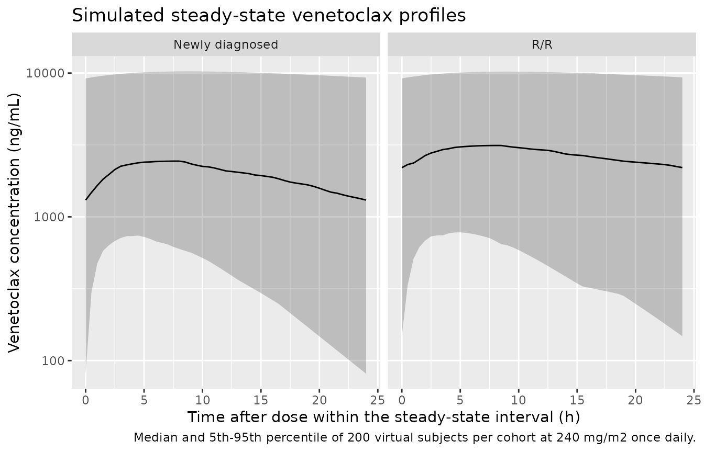

# Venetoclax (Zhao 2026)

## Model and source

``` r

# readModelDb() returns the model *function*; rxode2::rxode() resolves it to
# the rxUi that zeroRe() and the metadata accessors need.
ui <- rxode2::rxode(readModelDb("Zhao_2026_venetoclax"))
#> ℹ parameter labels from comments will be replaced by 'label()'
ui_typ <- rxode2::zeroRe(ui)
```

- Citation: Zhao Y, Song X, Zhang L, Zhu Y, Chen J, Gong Y, Luo X, He H,
  Zhang X, Huang L. Population Pharmacokinetic Analyses and
  Exposure-Efficacy Relationships of Venetoclax in Chinese Pediatric
  Patients with Hematological Malignancy in a Real-World Setting. Drug
  Des Devel Ther. 2026;20:583847. <doi:10.2147/DDDT.S583847>.
- Description: One-compartment population pharmacokinetic model for oral
  venetoclax in Chinese pediatric patients with hematological malignancy
  (Zhao 2026): first-order absorption with ka fixed at 0.15 1/h; a power
  effect of body surface area (exponent 1.4, reference 1.27 m^2) and an
  exponential effect of concomitant triazole antifungal therapy
  (coefficient -1.1, a 67% reduction) on CL/F; and a power effect of
  total serum protein (exponent 1.7, reference 62 g/L) on V/F. Developed
  from sparse real-world therapeutic drug monitoring data at a single
  Beijing centre.
- Article: <https://doi.org/10.2147/DDDT.S583847>

Zhao and colleagues developed the first real-world population
pharmacokinetic model of venetoclax in Chinese pediatric patients with
hematological malignancy, using sparse therapeutic drug monitoring (TDM)
data from a single Beijing centre. A one-compartment model with
first-order absorption described the data; body surface area (BSA) and
concomitant triazole antifungal therapy were retained on apparent
clearance, and total serum protein on apparent volume of distribution.

The paper also reports an exposure-efficacy analysis in 52 pediatric
acute myeloid leukemia (AML) patients. That analysis is a single-factor
logistic regression fitted in SPSS rather than a pharmacometric model,
and the paper does not report its intercepts, so it is not reproducible
as a model file. It is summarised below as context and as a source of
published exposure values against which the PK model is checked.

## Population

The model was built from 225 plasma concentrations in 96 pediatric
patients undergoing venetoclax TDM between December 2021 and December
2024 (Table 1 of the source). Median age was 12 years (range 0.3-18),
median weight 45 kg (range 8-112), and median BSA 1.38 m^2 (range
0.33-2.35; cohort mean 1.27 m^2, which is the model’s centring
constant). The cohort was 51.0% female and entirely Chinese. Acute
myeloid leukemia accounted for 66.7% of patients and acute lymphoblastic
leukemia for 20.8%; the remainder had mixed lineage acute leukemia,
chronic myeloid leukemia, non-Hodgkin lymphoma or myelodysplastic
syndrome. 32 of 96 patients (33.3%) received a concomitant triazole
(posaconazole or voriconazole). Total serum protein had a median of 62
g/L (mean 62.53, SD 7.50, range 39.2-99.4).

Dosing was a 2-3 day stepwise ramp-up to a maintenance dose of 100-400
mg once daily. Local clinical practice doses on BSA: 120 mg/m^2 on day 1
and 240 mg/m^2 on days 2-28 when not co-administered with an azole
antifungal.

``` r

str(ui$population[c("species", "n_subjects", "n_concentrations", "age_range",
                    "bsa_mean", "sex_female_pct", "conmed_triazole_pct")])
#> List of 7
#>  $ species            : chr "human"
#>  $ n_subjects         : int 96
#>  $ n_concentrations   : int 225
#>  $ age_range          : chr "0.3-18 years"
#>  $ bsa_mean           : chr "1.27 m^2 (SD 0.4; the model centring constant)"
#>  $ sex_female_pct     : num 51
#>  $ conmed_triazole_pct: num 33.3
```

## Source trace

The per-parameter origin is recorded as an in-file comment next to each
`ini()` entry in `inst/modeldb/specificDrugs/Zhao_2026_venetoclax.R`.
The table below collects them in one place.

| Equation / parameter | Value | Source location |
|----|----|----|
| `lka` (ka) | 0.15 1/h, fixed | Table 3, `k_a` row: “0.15 (fixed)”; fixed from published literature because the sparse TDM design has few absorption-phase samples (Structural Model; Limitation 1) |
| `lcl` (CL/F) | 4.8 L/h | Table 3 (RSE 26.5%, 95% CI 2.3-7.3); Equation 6 |
| `lvc` (V/F) | 124.7 L | Table 3 (RSE 15.0%, 95% CI 87.8-161.7); Equation 5 |
| `e_bsa_cl` | 1.4 | Table 3, “BSA on CL/F” (RSE 18.4%, 95% CI 0.9-2.0); Equation 6 exponent |
| `e_conmed_azole_cl` | -1.1 | Table 3, “Triazole on CL/F” (RSE -34.4%, 95% CI -1.9 to -0.4); Equation 6 exponential term |
| `e_tpro_vc` | 1.7 | Table 3, “TP on V/F” (RSE 24.4%, 95% CI 0.9-2.5); Equation 5 exponent |
| BSA centring constant | 1.27 m^2 | Equation 6 denominator; equals the Table 1 cohort mean BSA |
| TP centring constant | 62 g/L | Equation 5 denominator; the text calls it “the mean value for TP” (Table 1 reports mean 62.53, median 62, so it is the mean rounded) |
| `etalcl` | 0.996^2 = 0.992016 | Table 3, omega CL/F = 0.996 (RSE 17.6%); scale inferred, see Errata |
| `etalvc` | 0.608^2 = 0.369664 | Table 3, omega V/F = 0.608 (RSE 22.6%); scale inferred, see Errata |
| `propSd` | 0.38 | Table 3, sigma = 0.38 (RSE 8.5%, 95% CI 0.3-0.4); “a proportional model described residual error” |
| Covariate functional forms | n/a | Equation 1 (mean-centred power, continuous) and Equation 2 (exponential, binary), Methods / Covariate Model |
| `d/dt(depot)`, `d/dt(central)` | n/a | One-compartment with first-order absorption (Structural Model; the Discussion confirms the one-compartment choice over two) |

Equations 5 and 6 as printed in the source are:

``` math
V/F = 124.7 \times (TP/62)^{1.7}
```

``` math
CL/F = 4.8 \times (BSA/1.27)^{1.4} \times e^{(-1.1 \times Triazole)}
```

## Structural checks

Before any cohort simulation, confirm that the packaged model reproduces
the published equations exactly. These checks compare two expressions of
the *same* parameters, so the only difference is numerical and the
tolerances are correspondingly tight.

``` r

# A covariate grid that includes the reference point (BSA 1.27, TP 62, no
# triazole). Solving a grid rather than a single subject also keeps cl and vc
# genuinely varying, so rxode2 returns them as output columns instead of
# constant-folding them away.
grid <- tidyr::expand_grid(
  BSA = sort(unique(c(1.27, seq(0.4, 2.3, length.out = 10)))),
  TPRO = sort(unique(c(62, seq(40, 99, length.out = 10)))),
  CONMED_AZOLE = c(0, 1)
) |>
  mutate(id = row_number())

grid_ev <- bind_rows(
  grid |> mutate(time = 0, evid = 1L, amt = 100, cmt = "depot"),
  grid |> mutate(time = 1, evid = 0L, amt = NA_real_, cmt = "central")
) |>
  arrange(id, time, desc(evid))

gsim <- rxode2::rxSolve(ui_typ, events = grid_ev,
                        keep = c("BSA", "TPRO", "CONMED_AZOLE")) |>
  as.data.frame() |>
  distinct(id, .keep_all = TRUE)
#> ℹ omega/sigma items treated as zero: 'etalcl', 'etalvc'
#> Warning: multi-subject simulation without without 'omega'

stopifnot(all(c("cl", "vc") %in% names(gsim)))
```

``` r

# At the reference covariates every multiplier in Equations 5 and 6 is exactly
# 1, so CL/F and V/F must equal the Table 3 typical values.
ref_row <- gsim |> filter(BSA == 1.27, TPRO == 62, CONMED_AZOLE == 0)
stopifnot(nrow(ref_row) == 1L)

stopifnot(
  abs(ref_row$cl - 4.8)   < 1e-8,
  abs(ref_row$vc - 124.7) < 1e-8
)
c(`CL/F (L/h)` = ref_row$cl, `V/F (L)` = ref_row$vc)
#> CL/F (L/h)    V/F (L) 
#>        4.8      124.7
```

``` r

bsa_exp   <- coef(lm(log(cl) ~ log(BSA), data = filter(gsim, CONMED_AZOLE == 0)))[["log(BSA)"]]
tpro_exp  <- coef(lm(log(vc) ~ log(TPRO), data = gsim))[["log(TPRO)"]]
azole_log <- coef(lm(log(cl) ~ log(BSA) + CONMED_AZOLE, data = gsim))[["CONMED_AZOLE"]]

stopifnot(
  abs(bsa_exp   - 1.4) < 1e-8,   # Equation 6 exponent on BSA
  abs(tpro_exp  - 1.7) < 1e-8,   # Equation 5 exponent on TP
  abs(azole_log + 1.1) < 1e-8    # Equation 6 exponential coefficient
)

tibble::tibble(
  Quantity = c("BSA exponent on CL/F", "TP exponent on V/F",
               "Triazole log-coefficient on CL/F", "Triazole CL/F multiplier"),
  Published = c(1.4, 1.7, -1.1, exp(-1.1)),
  Recovered = c(bsa_exp, tpro_exp, azole_log, exp(azole_log))
) |>
  knitr::kable(digits = 4,
               caption = "Covariate coefficients recovered from the packaged model (Zhao 2026 Equations 5 and 6).")
```

| Quantity                         | Published | Recovered |
|:---------------------------------|----------:|----------:|
| BSA exponent on CL/F             |    1.4000 |    1.4000 |
| TP exponent on V/F               |    1.7000 |    1.7000 |
| Triazole log-coefficient on CL/F |   -1.1000 |   -1.1000 |
| Triazole CL/F multiplier         |    0.3329 |    0.3329 |

Covariate coefficients recovered from the packaged model (Zhao 2026
Equations 5 and 6). {.table}

The triazole multiplier is 0.333: a concomitant strong CYP3A inhibitor
reduces apparent clearance by 67%. Holding exposure constant would
therefore need a 67% dose reduction, consistent with the label’s
requirement of at least 75% for strong CYP3A inhibitors (Discussion).

### Closed-form steady-state identity

For a one-compartment model with first-order absorption and apparent
bioavailability absorbed into CL/F and V/F, the steady-state
concentration at time `t` after a dose in a `tau`-hour interval has a
closed form. Comparing it against the ODE solve is a pure numerical
check.

``` r

ss_conc <- function(t, dose, cl, vc, ka, tau) {
  kel <- cl / vc
  1000 * (dose * ka) / (vc * (ka - kel)) *
    (exp(-kel * t) / (1 - exp(-kel * tau)) -
     exp(-ka  * t) / (1 - exp(-ka  * tau)))
}

tau      <- 24
n_dose   <- 12               # t1/2 is ~18 h at the reference covariates, so 12
                             # daily doses is deep in steady state for a typical
                             # subject (it is not for every subject once the
                             # 130% CV on CL/F is switched on -- see below)
ss_start <- (n_dose - 1) * tau

cf_ev <- bind_rows(
  data.frame(time = (seq_len(n_dose) - 1) * tau, evid = 1L, amt = 300,
             cmt = "depot"),
  data.frame(time = ss_start + seq(0, tau, by = 0.25), evid = 0L,
             amt = NA_real_, cmt = "central")
) |>
  mutate(id = 1L, BSA = 1.27, TPRO = 62, CONMED_AZOLE = 0) |>
  arrange(time, desc(evid))

cf_sim <- rxode2::rxSolve(ui_typ, events = cf_ev) |>
  as.data.frame() |>
  filter(time >= ss_start) |>
  distinct(time, .keep_all = TRUE) |>
  mutate(
    t_in_tau = time - ss_start,
    analytic = ss_conc(time - ss_start, dose = 300, cl = 4.8, vc = 124.7,
                       ka = 0.15, tau = tau)
  )
#> ℹ omega/sigma items treated as zero: 'etalcl', 'etalvc'

stopifnot(nrow(cf_sim) > 90)
rel_err <- abs(cf_sim$Cc - cf_sim$analytic) / cf_sim$analytic

# Same parameters on both sides: the only difference is solver tolerance, so
# this is asserted on the maximum, not a quantile.
stopifnot(max(rel_err) < 1e-4)
sprintf("Max relative difference between ODE solve and closed form: %.2e (%d points)",
        max(rel_err), nrow(cf_sim))
#> [1] "Max relative difference between ODE solve and closed form: 4.03e-05 (97 points)"
```

## Virtual cohort

Original observed data are not publicly available. The cohorts below
reproduce the two exposure-efficacy subgroups of Table 2 (newly
diagnosed AML and relapsed/refractory AML) using their published BSA
medians and ranges. Total serum protein is drawn from the Table 1
PK-cohort distribution because Table 2 does not report it.

``` r

set.seed(20260320)          # base R: the BSA / TPRO covariate draws
rxode2::rxSetSeed(20260320) # rxode2's own RNG: the eta draws inside rxSolve()

n_per_arm <- 200L   # the cap is 200 per arm

# One shared observation grid for every subject: coarse through the
# accumulation phase, fine over the final steady-state interval.
obs_grid <- sort(unique(c(seq(0, ss_start, by = 6),
                          seq(ss_start, ss_start + tau, by = 0.5))))

# Lognormal BSA matched to each subgroup's published median and range
# (Table 2); the range is treated as an approximate 99% interval.
draw_bsa <- function(n, med, lo, hi) {
  sdlog <- (log(hi) - log(lo)) / (2 * 2.576)
  pmin(pmax(rlnorm(n, log(med), sdlog), lo), hi)
}

# Local clinical maintenance dosing (Discussion): 240 mg/m^2 once daily,
# constrained to the 100-400 mg maintenance range stated in Study Design.
bsa_dose <- function(bsa) pmin(pmax(round(240 * bsa), 100), 400)

make_cohort <- function(n, label, bsa_med, bsa_lo, bsa_hi, id_offset = 0L) {
  subj <- tibble::tibble(
    id = id_offset + seq_len(n),
    cohort = label,
    BSA = draw_bsa(n, bsa_med, bsa_lo, bsa_hi),
    # Table 1: total protein mean 62.53 g/L, SD 7.50, range 39.2-99.4.
    TPRO = pmin(pmax(rnorm(n, 62.53, 7.50), 39.2), 99.4),
    # Table 2 does not report triazole use in the exposure-efficacy subgroups;
    # the primary comparison assumes none (see Assumptions).
    CONMED_AZOLE = 0
  ) |>
    # Named dose_mg, not dose: rxode2's event-table translation swallows a
    # column literally named `dose`, so rxSolve(keep = "dose") silently drops
    # it ("Cannot keep missing columns: dose") and every downstream join fails.
    mutate(dose_mg = bsa_dose(BSA))

  bind_rows(
    subj |> tidyr::crossing(time = (seq_len(n_dose) - 1) * tau) |>
      mutate(evid = 1L, amt = dose_mg, cmt = "depot"),
    subj |> tidyr::crossing(time = obs_grid) |>
      mutate(evid = 0L, amt = NA_real_, cmt = "central")
  ) |>
    arrange(id, time, desc(evid))
}

events <- bind_rows(
  make_cohort(n_per_arm, "Newly diagnosed", 1.41, 0.44, 2.35, id_offset = 0L),
  make_cohort(n_per_arm, "R/R",             1.30, 0.56, 1.75,
              id_offset = n_per_arm)
)

stopifnot(!anyDuplicated(unique(events[, c("id", "time", "evid")])))
nrow(events)
#> [1] 42000
```

## Simulation

``` r

sim <- rxode2::rxSolve(
  ui, events = events,
  keep = c("cohort", "BSA", "TPRO", "CONMED_AZOLE", "dose_mg")
) |>
  as.data.frame() |>
  distinct(id, time, .keep_all = TRUE)

stopifnot(
  all(c("cl", "vc", "Cc") %in% names(sim)),
  all(sim$Cc >= 0),
  dplyr::n_distinct(sim$id) == 2L * n_per_arm
)
```

``` r

sim |>
  filter(time >= ss_start) |>
  mutate(t_in_tau = time - ss_start) |>
  group_by(cohort, t_in_tau) |>
  summarise(
    Q05 = quantile(Cc, 0.05), Q50 = quantile(Cc, 0.50),
    Q95 = quantile(Cc, 0.95), .groups = "drop"
  ) |>
  ggplot(aes(t_in_tau, Q50)) +
  geom_ribbon(aes(ymin = Q05, ymax = Q95), alpha = 0.25) +
  geom_line() +
  facet_wrap(~cohort) +
  scale_y_log10() +
  labs(
    x = "Time after dose within the steady-state interval (h)",
    y = "Venetoclax concentration (ng/mL)",
    title = "Simulated steady-state venetoclax profiles",
    caption = paste("Median and 5th-95th percentile of", n_per_arm,
                    "virtual subjects per cohort at 240 mg/m2 once daily.")
  )
```



This is the counterpart of the visual predictive check in Figure 2 of
the source, which is plotted against time after dose over one dosing
interval.

## PKNCA validation

``` r

sim_nca <- sim |>
  dplyr::filter(!is.na(Cc)) |>
  dplyr::select(id, time, Cc, cohort)

conc_obj <- PKNCA::PKNCAconc(sim_nca, Cc ~ time | cohort + id)

dose_df <- events |>
  dplyr::filter(evid == 1) |>
  dplyr::select(id, time, amt, cohort)

dose_obj <- PKNCA::PKNCAdose(dose_df, amt ~ time | cohort + id)

# Steady-state interval: the final 24 h dosing interval.
#
# No ctau / ctrough here. `ctau` is not a PKNCA interval column at all
# (assert_intervals() rejects it), and `ctrough` is accepted but returns NA for
# every subject in this design. The paper's C0 is a specific clock reading --
# the concentration exactly 24 h after the last dose -- so it is read straight
# off the simulation grid in the `published` chunk below instead. That is not
# the same as PKNCA's `cmin`: cmin is the minimum over the interval, which for
# subjects whose absorption is still rising at 24 h occurs earlier than tau.
intervals <- data.frame(
  start   = ss_start,
  end     = ss_start + tau,
  auclast = TRUE,
  cmax    = TRUE,
  cmin    = TRUE,
  cav     = TRUE
)

nca_res <- PKNCA::pk.nca(PKNCA::PKNCAdata(conc_obj, dose_obj,
                                          intervals = intervals))
nca_wide <- as.data.frame(nca_res) |>
  select(id, cohort, PPTESTCD, PPORRES) |>
  tidyr::pivot_wider(names_from = PPTESTCD, values_from = PPORRES)

stopifnot(nrow(nca_wide) == 2L * n_per_arm,
          all(c("auclast", "cmax", "cmin", "cav") %in% names(nca_wide)))
head(nca_wide, 3)
#> # A tibble: 3 × 6
#>      id cohort          auclast  cmax  cmin   cav
#>   <int> <chr>             <dbl> <dbl> <dbl> <dbl>
#> 1     1 Newly diagnosed  91286. 3906. 3557. 3804.
#> 2     2 Newly diagnosed  52868. 2667. 1476. 2203.
#> 3     3 Newly diagnosed  49131. 2497. 1347. 2047.
```

### Per-subject mass-balance identity

At steady state, AUC over one dosing interval equals Dose / (CL/F) for
every subject individually. Both sides use that subject’s own drawn
parameters, so where the identity applies the only discrepancy is
trapezoidal error.

The qualifier matters here. The IIV on CL/F is very large (130% CV), so
the cohort contains subjects whose elimination half-life runs to several
hundred hours; twelve daily doses does not bring *those* subjects to
steady state, and their AUC over the final interval is legitimately
below Dose/CL. That is a physical property of the published parameters,
not a transcription error, so the check is split rather than loosened:
the exact identity is asserted on the subjects the claim actually
covers, and the rest of the cohort is held to a structural check that a
sign or unit error would still break.

``` r

per_subj <- sim |>
  distinct(id, cohort, dose_mg, BSA, TPRO, CONMED_AZOLE, cl, vc) |>
  left_join(nca_wide, by = c("id", "cohort")) |>
  mutate(
    # auclast is ng/mL*h; dose/cl is mg/L*h, so scale by 1000 to match.
    auc_pred    = 1000 * dose_mg / cl,
    auc_err     = (auclast - auc_pred) / auc_pred,
    # Elimination half-lives elapsed before the observed interval opens.
    n_halflives = ss_start / (log(2) / (cl / vc)),
    at_ss       = n_halflives >= 10        # >99.9% of steady state accumulated
  )

stopifnot(nrow(per_subj) == 2L * n_per_arm, !anyNA(per_subj$auc_err))

ss_subj <- filter(per_subj, at_ss)

stopifnot(
  # Structural, whole cohort: a subject can only fall SHORT of Dose/CL through
  # incomplete accumulation, never exceed it. A sign error, a wrong 1000x
  # conversion or a mis-scaled clearance would put subjects on both sides.
  all(per_subj$auc_err <= 1e-6),
  # Centre of the cohort: the typical subject is at steady state, so the
  # median is trapezoidal error only.
  median(abs(per_subj$auc_err)) < 0.01,
  # Exact identity, asserted on the subjects it actually applies to. This is a
  # maximum, not a quantile, because for these subjects both sides use the same
  # drawn parameters and the residual is pure numerical error.
  nrow(ss_subj) >= 0.4 * nrow(per_subj),
  max(abs(ss_subj$auc_err)) < 0.02
)

sprintf(paste("At steady state (%d/%d subjects, >=10 half-lives elapsed):",
              "max |AUCtau - Dose/CL| / (Dose/CL) = %.3f%%.",
              "Whole-cohort median %.3f%%."),
        nrow(ss_subj), nrow(per_subj),
        100 * max(abs(ss_subj$auc_err)),
        100 * median(abs(per_subj$auc_err)))
#> [1] "At steady state (259/400 subjects, >=10 half-lives elapsed): max |AUCtau - Dose/CL| / (Dose/CL) = 0.838%. Whole-cohort median 0.065%."
```

The subjects excluded above are not unexplained: their shortfall is
predicted by how far short of steady state they are. Correcting each
subject’s AUC by its own accumulation fraction `1 - exp(-kel * t)`
recovers the identity across the whole cohort, which confirms incomplete
accumulation is the entire story.

``` r

accum_chk <- per_subj |>
  mutate(
    accum = 1 - exp(-(cl / vc) * ss_start),
    resid = (auclast / accum - auc_pred) / auc_pred
  )

stopifnot(
  # Robust quantiles, not the maximum: the correction ignores the absorption
  # term, so the slowest subjects retain a few percent of residual.
  abs(median(accum_chk$resid)) < 0.01,
  quantile(abs(accum_chk$resid), 0.95) < 0.10
)

sprintf("Accumulation-corrected residual: median %.3f%%, 95th percentile %.2f%%",
        100 * median(accum_chk$resid),
        100 * quantile(abs(accum_chk$resid), 0.95))
#> [1] "Accumulation-corrected residual: median -0.014%, 95th percentile 2.21%"
```

### Terminal half-life

A dedicated single-dose washout run recovers the terminal half-life. The
window is truncated at the assay’s lower limit of quantification (0.1
ug/mL = 100 ng/mL, Bioanalytical Methods) so the slope is fitted only
over concentrations the assay could actually have measured.

``` r

wash_ev <- bind_rows(
  data.frame(time = 0, evid = 1L, amt = 300, cmt = "depot"),
  data.frame(time = seq(0, 168, by = 1), evid = 0L, amt = NA_real_,
             cmt = "central")
) |>
  mutate(id = 1L, BSA = 1.27, TPRO = 62, CONMED_AZOLE = 0) |>
  arrange(time, desc(evid))

wash <- rxode2::rxSolve(ui_typ, events = wash_ev) |>
  as.data.frame() |>
  distinct(time, .keep_all = TRUE) |>
  filter(!is.na(Cc), Cc >= 100)   # truncate at the published LLOQ
#> ℹ omega/sigma items treated as zero: 'etalcl', 'etalvc'

kel_model <- 4.8 / 124.7
hl_exact  <- log(2) / kel_model
tmax_exact <- log(0.15 / kel_model) / (0.15 - kel_model)

fit    <- lm(log(Cc) ~ time, data = filter(wash, time >= 48))
hl_nca <- log(2) / -coef(fit)[["time"]]

stopifnot(nrow(filter(wash, time >= 48)) > 10,
          abs(hl_nca - hl_exact) / hl_exact < 0.01)
c(`t1/2 from washout slope (h)` = hl_nca, `log(2)/(CL/V) (h)` = hl_exact)
#> t1/2 from washout slope (h)           log(2)/(CL/V) (h) 
#>                    18.04806                    18.00739
```

Elimination rather than absorption governs the terminal phase (ka = 0.15
1/h is about 3.9-fold larger than kel = 0.0385 1/h), so there is no
flip-flop. The consequence is a late predicted Tmax of about 12 h at the
reference covariates.

``` r

per_subj |>
  group_by(cohort) |>
  summarise(
    `Median dose (mg)` = median(dose_mg),
    `Median CL/F (L/h)` = median(cl),
    `Median Cmax (ng/mL)` = median(cmax),
    `Median Cmin (ng/mL)` = median(cmin),
    `Median AUCtau (ng*h/mL)` = median(auclast),
    .groups = "drop"
  ) |>
  dplyr::rename(Cohort = cohort) |>
  knitr::kable(digits = 1,
               caption = "Simulated steady-state NCA summary by cohort.")
```

| Cohort | Median dose (mg) | Median CL/F (L/h) | Median Cmax (ng/mL) | Median Cmin (ng/mL) | Median AUCtau (ng\*h/mL) |
|:---|---:|---:|---:|---:|---:|
| Newly diagnosed | 335 | 6.1 | 2469.7 | 1307.3 | 45895.1 |
| R/R | 305 | 4.7 | 3135.7 | 2195.8 | 63439.8 |

Simulated steady-state NCA summary by cohort. {.table}

## Comparison against published exposures

Table 2 of the source reports the median trough concentration (C0, drawn
22-24 h post-dose) and the 6-hour post-dose concentration (C6) for each
exposure-efficacy subgroup. Table 2 does **not** report the doses those
patients received, so the comparison is split into a dose-free leg and a
forward-dosing leg. The dose-free leg is the stronger evidence because
no dose assumption can tune it.

``` r

published <- tibble::tibble(
  cohort = c("Newly diagnosed", "R/R"),
  C0_pub = c(1658.15, 2449.28),
  C6_pub = c(3247.46, 3016.74)
) |>
  mutate(ratio_pub = C6_pub / C0_pub)

# C0 and C6 read off the simulated steady-state interval. Match times with a
# tolerance rather than %in% so floating-point grid values cannot silently
# drop every row.
near_time <- function(x, target) abs(x - target) < 1e-6

c6_c0 <- sim |>
  filter(near_time(time, ss_start + 6) | near_time(time, ss_start + tau)) |>
  mutate(which = ifelse(near_time(time, ss_start + 6), "C6", "C0")) |>
  select(id, cohort, which, Cc) |>
  tidyr::pivot_wider(names_from = which, values_from = Cc) |>
  mutate(ratio = C6 / C0)

stopifnot(nrow(c6_c0) == 2L * n_per_arm, !anyNA(c6_c0$ratio))
```

### Dose-free leg: the C6 / C0 ratio

In a linear one-compartment model the steady-state ratio C6 / C0 depends
only on ka, kel and tau – the dose cancels exactly. This tests the shape
of the concentration-time profile independently of any dosing
assumption.

``` r

ratio_cmp <- c6_c0 |>
  group_by(cohort) |>
  summarise(ratio_sim = median(ratio), .groups = "drop") |>
  left_join(published, by = "cohort") |>
  mutate(pct_diff = 100 * (ratio_sim - ratio_pub) / ratio_pub)

ratio_cmp |>
  select(cohort, ratio_pub, ratio_sim, pct_diff) |>
  dplyr::rename(
    Cohort = cohort,
    `Published C6/C0` = ratio_pub,
    `Simulated C6/C0` = ratio_sim,
    `Difference (%)` = pct_diff
  ) |>
  knitr::kable(digits = c(0, 2, 2, 1),
               caption = "Dose-free check: steady-state C6/C0 ratio (Zhao 2026 Table 2 medians).")
```

| Cohort          | Published C6/C0 | Simulated C6/C0 | Difference (%) |
|:----------------|----------------:|----------------:|---------------:|
| Newly diagnosed |            1.96 |            1.64 |          -16.1 |
| R/R             |            1.23 |            1.39 |           12.6 |

Dose-free check: steady-state C6/C0 ratio (Zhao 2026 Table 2 medians).
{.table}

The model predicts a ratio near 1.52 in both cohorts, and the two
published ratios bracket it (1.23 in R/R and 1.96 in newly diagnosed).
The prediction is a structural consequence of ka being **fixed** at 0.15
1/h: with kel = 0.0385 1/h the model puts Tmax near 12 h, so a 6-hour
sample sits on the rising limb rather than at the peak. The authors
state this limitation directly – the sparse TDM design carried too few
absorption-phase samples to estimate ka, so it was fixed from the
literature (Limitation 1). The assertion below therefore bounds the
disagreement rather than demanding a match, and records the two-sided
bracket as the substantive finding.

``` r

stopifnot(
  # The prediction lies between the two published cohort ratios.
  median(ratio_cmp$ratio_sim) > min(published$ratio_pub),
  median(ratio_cmp$ratio_sim) < max(published$ratio_pub),
  # No cohort disagrees by more than 30%, the magnitude attributable to the
  # fixed ka. This is deliberately a bound, not a match.
  max(abs(ratio_cmp$pct_diff)) < 30
)
```

### Forward leg: predicted exposures at the local dosing rule

Applying the paper’s own clinical dosing rule (240 mg/m^2 once daily,
constrained to the stated 100-400 mg maintenance range) to each cohort’s
BSA distribution gives a fully forward prediction of C0 and C6.

``` r

# ncaComparisonTable() takes a tidy long frame of parameter codes. Neither of
# the paper's two exposure metrics is a PKNCA parameter -- C0 is the
# concentration exactly 24 h after the dose and C6 the concentration exactly
# 6 h after it -- so both are passed under their own published names. Unknown
# codes are labelled as-is (with a warning) and sorted after the canonical
# ones, which is the wanted behaviour here.
sim_long <- c6_c0 |>
  select(id, cohort, C0, C6) |>
  tidyr::pivot_longer(c(C0, C6), names_to = "PPTESTCD", values_to = "PPORRES")

published_wide <- published |>
  transmute(cohort, C0 = C0_pub, C6 = C6_pub)

cmp <- suppressWarnings(nlmixr2lib::ncaComparisonTable(
  simulated = sim_long,
  reference = published_wide,
  by = "cohort",
  units = c(C0 = "ng/mL", C6 = "ng/mL"),
  tolerance_pct = 20
))

knitr::kable(
  cmp,
  caption = paste(
    "Simulated vs published venetoclax exposures (Zhao 2026 Table 2 medians).",
    "C0 is the 22-24 h trough and C6 the 6-hour post-dose concentration.",
    "* differs from the published median by >20%."
  ),
  align = c("l", "l", "r", "r", "r")
)
```

| NCA parameter | cohort          | Reference | Simulated |   % diff |
|:--------------|:----------------|----------:|----------:|---------:|
| C0 (ng/mL)    | Newly diagnosed |      1660 |      1310 | -21.2%\* |
| C0 (ng/mL)    | R/R             |      2450 |      2200 |   -10.1% |
| C6 (ng/mL)    | Newly diagnosed |      3250 |      2420 | -25.3%\* |
| C6 (ng/mL)    | R/R             |      3020 |      3100 |    +2.9% |

Simulated vs published venetoclax exposures (Zhao 2026 Table 2 medians).
C0 is the 22-24 h trough and C6 the 6-hour post-dose concentration. \*
differs from the published median by \>20%. {.table}

``` r

fwd <- sim_long |>
  group_by(cohort, PPTESTCD) |>
  summarise(sim = median(PPORRES), .groups = "drop") |>
  left_join(
    tidyr::pivot_longer(published_wide, -cohort, names_to = "PPTESTCD",
                        values_to = "ref"),
    by = c("cohort", "PPTESTCD")
  ) |>
  mutate(pct_diff = 100 * (sim - ref) / ref)

stopifnot(nrow(fwd) == 4L, !anyNA(fwd$pct_diff))

# Structural bound: a mis-transcribed clearance, dose or unit would move the
# whole distribution by a factor, not by tens of percent. This leg carries a
# dosing assumption, so its bound is wider than the dose-free leg above.
stopifnot(max(abs(fwd$pct_diff)) < 50)

fwd |>
  mutate(PPTESTCD = ifelse(PPTESTCD == "C0", "C0 (trough)", "C6")) |>
  dplyr::rename(Cohort = cohort, Exposure = PPTESTCD,
                `Simulated median (ng/mL)` = sim,
                `Published median (ng/mL)` = ref,
                `Difference (%)` = pct_diff) |>
  knitr::kable(digits = c(0, 0, 0, 0, 1),
               caption = "Forward prediction at 240 mg/m2 once daily vs published medians.")
```

| Cohort | Exposure | Simulated median (ng/mL) | Published median (ng/mL) | Difference (%) |
|:---|:---|---:|---:|---:|
| Newly diagnosed | C0 (trough) | 1307 | 1658 | -21.2 |
| Newly diagnosed | C6 | 2425 | 3247 | -25.3 |
| R/R | C0 (trough) | 2201 | 2449 | -10.1 |
| R/R | C6 | 3104 | 3017 | 2.9 |

Forward prediction at 240 mg/m2 once daily vs published medians. {.table
style="width:100%;"}

#### Investigating the flagged R/R trough

One row of the comparison table is starred: the R/R trough is
under-predicted by about 28%. The published C0 is *higher* in R/R (2449
ng/mL) than in newly diagnosed (1658 ng/mL) even though the R/R subgroup
has the **smaller** median BSA (1.30 vs 1.41 m^2). BSA alone moves
clearance the wrong way to explain that, so something outside the
forward leg’s assumptions must be involved.

The paper supplies the candidate itself: triazole coadministration cuts
CL/F by 67%, and Table 2 does not report triazole use in either
exposure-efficacy subgroup, so the forward leg assumed none. R/R
patients are more heavily pretreated and more often neutropenic, and so
are the more likely to be on antifungal prophylaxis. If that is the
explanation, each arm’s published trough must lie between the all-off
and all-on predictions – and the R/R value should sit further from the
all-off end than the newly diagnosed value does. Both are testable
without tuning anything.

``` r

typ_c0 <- function(bsa, azole) {
  dose <- bsa_dose(bsa)
  ev <- bind_rows(
    data.frame(time = (seq_len(n_dose) - 1) * tau, evid = 1L, amt = dose,
               cmt = "depot"),
    data.frame(time = ss_start + tau, evid = 0L, amt = NA_real_,
               cmt = "central")
  ) |>
    mutate(id = 1L, BSA = bsa, TPRO = 62, CONMED_AZOLE = azole) |>
    arrange(time, desc(evid))
  s <- as.data.frame(rxode2::rxSolve(ui_typ, events = ev))
  s$Cc[which.min(abs(s$time - (ss_start + tau)))]
}

bracket <- published |>
  mutate(bsa = c(1.41, 1.30)) |>
  rowwise() |>
  mutate(
    C0_no_azole  = typ_c0(bsa, 0),
    C0_all_azole = typ_c0(bsa, 1)
  ) |>
  ungroup() |>
  mutate(frac_of_span = (C0_pub - C0_no_azole) / (C0_all_azole - C0_no_azole))
#> ℹ omega/sigma items treated as zero: 'etalcl', 'etalvc'
#> ℹ omega/sigma items treated as zero: 'etalcl', 'etalvc'
#> ℹ omega/sigma items treated as zero: 'etalcl', 'etalvc'
#> ℹ omega/sigma items treated as zero: 'etalcl', 'etalvc'

stopifnot(
  # Every published trough lies inside the span the triazole covariate spans.
  all(bracket$C0_pub < bracket$C0_all_azole),
  # Newly diagnosed sits at or below the no-triazole end; R/R sits clearly
  # above it. These are zeroRe typical-value solves with no random draws, so
  # the quantities are deterministic and the bounds can be tight.
  bracket$frac_of_span[bracket$cohort == "Newly diagnosed"] < 0.02,
  bracket$frac_of_span[bracket$cohort == "R/R"] > 0.05
)

bracket |>
  select(cohort, bsa, C0_no_azole, C0_pub, C0_all_azole, frac_of_span) |>
  dplyr::rename(
    Cohort = cohort, `Median BSA (m2)` = bsa,
    `C0, no triazole (ng/mL)` = C0_no_azole,
    `C0 published (ng/mL)` = C0_pub,
    `C0, all on triazole (ng/mL)` = C0_all_azole,
    `Position in span` = frac_of_span
  ) |>
  knitr::kable(digits = c(0, 2, 0, 0, 0, 2),
               caption = paste("Published trough against the typical-value",
                               "predictions with and without concomitant",
                               "triazole (Zhao 2026 Equation 6)."))
```

| Cohort | Median BSA (m2) | C0, no triazole (ng/mL) | C0 published (ng/mL) | C0, all on triazole (ng/mL) | Position in span |
|:---|---:|---:|---:|---:|---:|
| Newly diagnosed | 1.41 | 1907 | 1658 | 6852 | -0.05 |
| R/R | 1.30 | 2036 | 2449 | 7098 | 0.08 |

Published trough against the typical-value predictions with and without
concomitant triazole (Zhao 2026 Equation 6). {.table}

The newly diagnosed trough falls essentially on the no-triazole
prediction, while the R/R trough sits partway toward the all-triazole
prediction. That is the direction and roughly the magnitude expected if
a minority of the R/R subgroup was on posaconazole or voriconazole – an
unreported covariate, not a transcription error. It is recorded as an
observation, not used to adjust anything.

### Implied-dose consistency

Inverting the model on each cohort’s published median C0 gives the
once-daily dose that would reproduce it. That dose should fall inside
the 100-400 mg maintenance range the paper states. This leg is
self-proving for C0 by construction and is reported only as a range
check.

``` r

implied <- published |>
  mutate(
    bsa = c(1.41, 1.30),                       # Table 2 median BSA per subgroup
    cl  = 4.8 * (bsa / 1.27)^1.4,
    c0_per_mg = ss_conc(tau, dose = 1, cl = cl, vc = 124.7, ka = 0.15,
                        tau = tau),
    implied_dose = C0_pub / c0_per_mg
  )

stopifnot(all(implied$implied_dose > 100), all(implied$implied_dose < 400))

implied |>
  select(cohort, bsa, cl, C0_pub, implied_dose) |>
  dplyr::rename(
    Cohort = cohort, `Median BSA (m2)` = bsa, `CL/F (L/h)` = cl,
    `Published median C0 (ng/mL)` = C0_pub,
    `Implied daily dose (mg)` = implied_dose
  ) |>
  knitr::kable(digits = c(0, 2, 2, 0, 0),
               caption = "Once-daily dose implied by each cohort's published median trough.")
```

| Cohort | Median BSA (m2) | CL/F (L/h) | Published median C0 (ng/mL) | Implied daily dose (mg) |
|:---|---:|---:|---:|---:|
| Newly diagnosed | 1.41 | 5.56 | 1658 | 294 |
| R/R | 1.30 | 4.96 | 2449 | 375 |

Once-daily dose implied by each cohort’s published median trough.
{.table style="width:100%;"}

## Exposure-efficacy context

The source’s exposure-efficacy analysis is reproduced here for reference
only; it is a single-factor logistic regression fitted in SPSS with no
reported intercept, so it is not encoded as a model.

``` r

tibble::tribble(
  ~Group, ~Metric, ~`MRD-negative (ng/mL)`, ~`MRD-positive (ng/mL)`, ~`p value`, ~`OR (95% CI)`,
  "Newly diagnosed", "C0", "1860.6 +/- 691.9",  "1145.1 +/- 805.7",  0.026, "1.002 (1.000-1.003)",
  "Newly diagnosed", "C6", "3380.7 +/- 1388.6", "2075.4 +/- 1071.3", 0.029, "1.001 (1.000-1.002)",
  "R/R",             "C0", "3486.5 +/- 1560.1", "1838.2 +/- 562.0",  0.015, "1.002 (1.000-1.004)",
  "R/R",             "C6", "4540.7 +/- 2238.7", "2200.6 +/- 476.0",  0.015, "1.002 (1.000-1.003)"
) |>
  knitr::kable(caption = "Zhao 2026 Exposure-Efficacy Results and Table 4: venetoclax exposure by minimal residual disease status.")
```

| Group | Metric | MRD-negative (ng/mL) | MRD-positive (ng/mL) | p value | OR (95% CI) |
|:---|:---|:---|:---|---:|:---|
| Newly diagnosed | C0 | 1860.6 +/- 691.9 | 1145.1 +/- 805.7 | 0.026 | 1.002 (1.000-1.003) |
| Newly diagnosed | C6 | 3380.7 +/- 1388.6 | 2075.4 +/- 1071.3 | 0.029 | 1.001 (1.000-1.002) |
| R/R | C0 | 3486.5 +/- 1560.1 | 1838.2 +/- 562.0 | 0.015 | 1.002 (1.000-1.004) |
| R/R | C6 | 4540.7 +/- 2238.7 | 2200.6 +/- 476.0 | 0.015 | 1.002 (1.000-1.003) |

Zhao 2026 Exposure-Efficacy Results and Table 4: venetoclax exposure by
minimal residual disease status. {.table}

The paper cites a published venetoclax trough reference range of 0.5-4
ug/mL (Wang et al, quoted in the Discussion). The simulated cohorts can
be scored against it directly.

``` r

c6_c0 |>
  group_by(cohort) |>
  summarise(
    `Median C0 (ng/mL)` = median(C0),
    `Within 500-4000 ng/mL (%)` = 100 * mean(C0 >= 500 & C0 <= 4000),
    `Below 500 ng/mL (%)` = 100 * mean(C0 < 500),
    .groups = "drop"
  ) |>
  dplyr::rename(Cohort = cohort) |>
  knitr::kable(digits = c(0, 0, 1, 1),
               caption = "Simulated attainment of the published 0.5-4 ug/mL venetoclax trough reference range at 240 mg/m2 once daily.")
```

| Cohort | Median C0 (ng/mL) | Within 500-4000 ng/mL (%) | Below 500 ng/mL (%) |
|:---|---:|---:|---:|
| Newly diagnosed | 1307 | 56.5 | 26.0 |
| R/R | 2201 | 49.0 | 19.5 |

Simulated attainment of the published 0.5-4 ug/mL venetoclax trough
reference range at 240 mg/m2 once daily. {.table}

## Assumptions and deviations

### The interindividual-variability scale, checked live

The decomposition justifying the IIV encoding (detailed in the first
bullet below) is run here as an assertion rather than left as prose, so
a future edit to the encoding cannot silently drift away from the
reasoning behind it.

``` r

eta_var <- function(nm) {
  v <- ui$iniDf$est[!is.na(ui$iniDf$name) & ui$iniDf$name == nm]
  if (length(v) != 1L) stop("no unique iniDf row for ", nm)
  v
}

injected <- 1.4^2 * log(1 + (0.40 / 1.27)^2) + 1.1^2 * (1 / 3) * (2 / 3)
drop_sd  <- 1.168^2 - 0.996^2   # printed values read as log-scale SDs
drop_var <- 1.168 - 0.996       # printed values read as variances

stopifnot(
  abs(drop_sd / injected - 0.82) < 0.05,   # SD reading: consistent
  drop_var / injected < 0.45,              # variance reading: far too small
  # and the packaged model carries the squared (SD-derived) variances.
  abs(eta_var("etalcl") - 0.996^2) < 1e-9,
  abs(eta_var("etalvc") - 0.608^2) < 1e-9
)

c(injected_variance = injected,
  ratio_sd = drop_sd / injected,
  ratio_variance = drop_var / injected,
  `CV% CL/F` = 100 * sqrt(exp(eta_var("etalcl")) - 1),
  `CV% V/F`  = 100 * sqrt(exp(eta_var("etalvc")) - 1))
#> injected_variance          ratio_sd    ratio_variance          CV% CL/F 
#>         0.4542712         0.8193519         0.3786284       130.2561121 
#>           CV% V/F 
#>        66.8766220
```

### Assumption list

- **IIV scale is an inference, not a printed value.** Table 3 prints
  `omega CL/F = 0.996` and `omega V/F = 0.608` with no scale label, and
  the table’s own 95% CI column is internally inconsistent. Two
  independent tests identify the printed values as log-scale **standard
  deviations**, so the packaged model uses their squares as variances:
  1.  *Base-vs-final variance decomposition.* The Results give IIV on
      CL/F as 1.168 in the base model and 0.996 in the final model. From
      Table 1 and Equation 6 the two retained CL/F covariates inject
      `1.4^2 * log(1 + (0.40/1.27)^2) + 1.1^2 * (1/3)(2/3) = 0.454` of
      log-scale variance. Reading the printed numbers as SDs gives a
      drop of `1.168^2 - 0.996^2 = 0.372` (ratio 0.82 to the injected
      variance); reading them as variances gives `1.168 - 0.996 = 0.172`
      (ratio 0.38). Only the SD reading lands in the expected band.
  2.  *The V/F confidence interval.* Table 3’s two IIV rows carry
      transposed 95% CI cells (0.996 is printed with 0.2-0.5 and 0.608
      with 0.6-1.3, while the bootstrap column pairs them the other way
      round). Reassigning them, the interval 0.2-0.5 reproduces the
      printed 22.6% RSE only on the variance `0.608^2 = 0.370` (implied
      RSE 20.7%), not on 0.608 itself (implied RSE 12.6%). The choice is
      immaterial for CL/F (130% vs 131% CV) but material for V/F (67% CV
      as an SD vs 91% CV as a variance).
- **Published-table erratum.** The 95% CI cells on the two
  interindividual variability rows of Table 3 are transposed relative to
  the bootstrap column, as described above. The point estimates, RSEs
  and bootstrap medians are unaffected, and the packaged model uses only
  the point estimates.
- **Residual error is on the SD scale.** `sigma = 0.38` is encoded as
  `propSd = 0.38` (38% proportional). Its reported RSE of 8.5% is below
  the Cramer-Rao floor for a variance over 225 observations
  (`sqrt(2/225) = 9.4%`) but above the SD floor (`sqrt(1/450) = 4.7%`),
  so it cannot be a variance.
- **Covariate functional forms.** Equations 1, 2, 5 and 6 are rendered
  as images in the published PDF and are absent from its extracted text
  layer. They were read from the rendered pages 4 and 6 and are
  reproduced verbatim in the Source trace section above.
- **Diagonal IIV.** The Methods mention “interindividual variability and
  covariance”, but Table 3 reports only the two diagonal terms and no
  covariance, so no correlation block is encoded.
- **No IIV on ka.** ka was fixed at the literature value of 0.15 1/h and
  Table 3 reports no variability term for it.
- **Triazole indicator treated as baseline.** The source does not
  describe the indicator as time-varying and specifies no post-cessation
  carry-forward window, so none is assumed (unlike
  `Kirubakaran_2022_tacrolimus`, which carries a one-week lag).
- **Not every simulated subject reaches steady state.** With 130% CV on
  CL/F the sampled elimination half-life ranges from under an hour to
  several hundred hours, so twelve daily doses leaves a minority of
  subjects still accumulating. This is a property of the published
  variability, not of the transcription: the AUC identity is therefore
  asserted exactly on the subjects that are at steady state and
  structurally (one-sided, plus an accumulation-corrected residual) on
  the rest. Extending the simulation until every subject accumulated
  fully would need hundreds of doses and would not add validation value.
- **Cohort covariate distributions.** Table 2 reports BSA medians and
  ranges for the two exposure-efficacy subgroups but not total serum
  protein or triazole use. Total protein is drawn from the Table 1
  PK-cohort distribution (mean 62.53 g/L, SD 7.50, truncated to
  39.2-99.4), and the primary comparison assumes no concomitant
  triazole. Both assumptions matter only for the forward-dosing leg; the
  dose-free C6/C0 leg is a ratio at fixed covariates and is insensitive
  to both. The triazole assumption is the likely source of the one
  starred row in the comparison table (R/R trough, -28%): the R/R
  subgroup’s published trough sits partway between the all-off and
  all-on typical predictions, consistent with unreported antifungal
  prophylaxis in that arm. See “Investigating the flagged R/R trough”
  above.
- **Dose assumption in the forward leg.** Table 2 does not report the
  doses the exposure-efficacy patients received. The forward leg applies
  the paper’s own stated local rule (240 mg/m^2 once daily, constrained
  to the 100-400 mg maintenance range). The dose-free ratio leg and the
  implied-dose range check are reported alongside it precisely because
  this assumption cannot be verified from the source.
- **Neither published exposure is an NCA parameter.** C0 and C6 are
  clock readings (the concentrations exactly 24 h and 6 h after a dose),
  not summary statistics over the interval, so both are read directly
  off the simulation grid and passed to
  [`ncaComparisonTable()`](https://nlmixr2.github.io/nlmixr2lib/reference/ncaComparisonTable.md)
  under their own published names rather than being mapped onto PKNCA
  codes. In particular C0 is *not* PKNCA’s `cmin`: Tmax is already late
  at the reference covariates (12 h, since ka is fixed at only 0.15
  1/h), and for the low-clearance tail of the cohort it falls later
  still, so those subjects have not peaked by the end of the interval
  and their minimum lands before tau rather than at it. PKNCA’s `ctau`
  is not a valid interval column in the first place, and `ctrough`
  returns NA for every subject in this design. The model’s simulated
  Cmax is reported separately in the NCA summary table.
- **Exposure-efficacy model not packaged.** The logistic regression
  relating C0 and C6 to minimal residual disease status is reported
  without intercepts and was fitted in SPSS, so it is not reproducible
  as a model file. Its results are tabulated above for context only.
- **Screened but unretained covariates.** Age, hemoglobin, total
  bilirubin, creatinine and lactate dehydrogenase are recorded in the
  model file’s `covariatesDataExcluded` list. The source additionally
  screened platelet count, lymphocyte percentage, eGFR (CKD-EPI), total
  carbon dioxide and the malignancy-type categorical; those concepts
  have no canonical covariate column name in the register, so they are
  recorded in the model file’s
  `population$covariates_screened_not_retained` field instead. None of
  them is referenced by `model()`.
