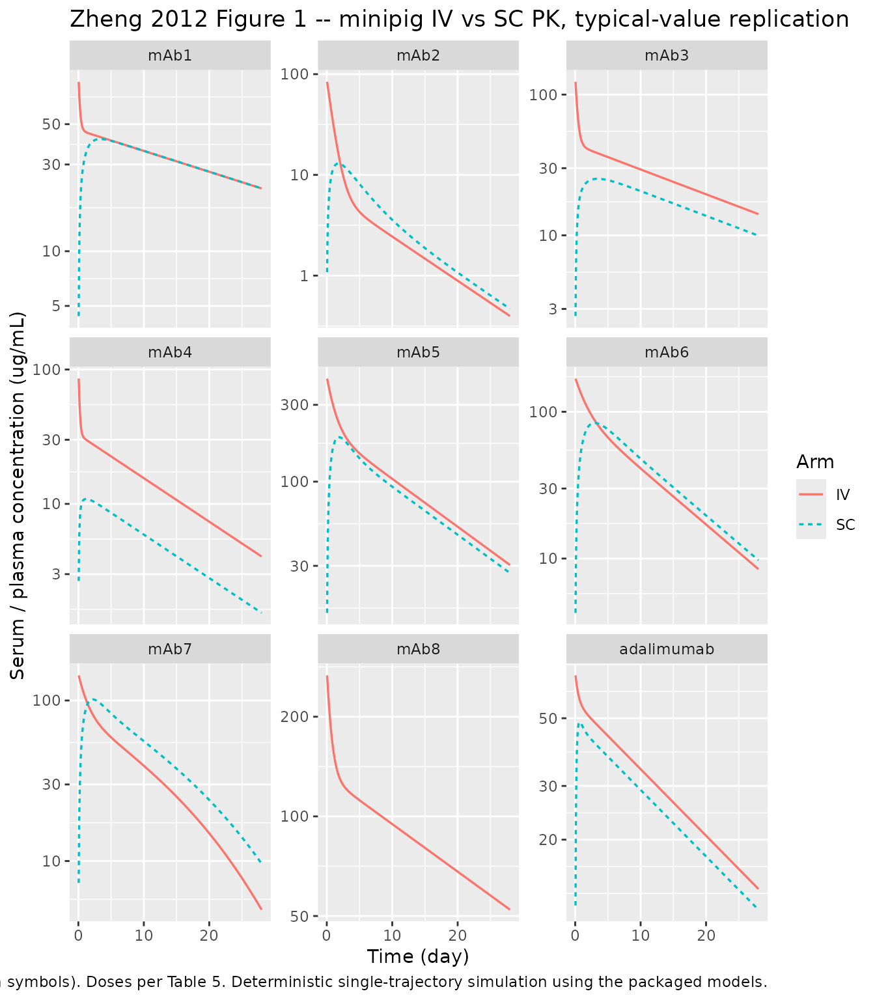

# Gottingen minipig mAb IV+SC PK panel (Zheng 2012)

## Paper and source

- Citation: Zheng Y, Tesar DB, Benincosa L, et al. Minipig as a
  potential translatable model for monoclonal antibody pharmacokinetics
  after intravenous and subcutaneous administration. *mAbs.*
  2012;4(2):243-255.
- Article: <https://doi.org/10.4161/mabs.4.2.19387>
- PMID: 22453096

This vignette is a joint validation of the nine minipig popPK models
packaged from Zheng 2012 – one per antibody tested in the study. The
paper reports population-mean IV and SC pharmacokinetics of nine IgGs
(eight non-disclosed humanized IgG1 / stabilized IgG4 antibodies
labelled mAb1..mAb8 plus commercial adalimumab) in Gottingen minipigs
across four contract research organisations.

Each mAb was fit independently to a two-compartment model with
first-order SC absorption and linear central clearance (paper Eq. 1).
mAb7 has an additional saturable (Michaelis-Menten) elimination arm
(paper Eq. 2). mAb8 was studied by IV only, so it carries no SC
absorption or bioavailability. In line with the standing “replicate the
author’s modelling structure” policy this yields nine `.R` files, one
per antibody, sharing this single vignette.

``` r

model_names <- c(
  "Zheng_2012_mAb1_minipig",
  "Zheng_2012_mAb2_minipig",
  "Zheng_2012_mAb3_minipig",
  "Zheng_2012_mAb4_minipig",
  "Zheng_2012_mAb5_minipig",
  "Zheng_2012_mAb6_minipig",
  "Zheng_2012_mAb7_minipig",
  "Zheng_2012_mAb8_minipig",
  "Zheng_2012_adalimumab_minipig"
)
mods <- setNames(lapply(model_names, readModelDb), sub("_minipig$", "", sub("^Zheng_2012_", "", model_names)))
```

## Population

Zheng 2012 pooled nine independent IV+SC single-dose studies in
Gottingen minipigs (male or female, 8-11 kg, aged for acclimation for
15-20 days before study). Studies were run across four CROs (Pipeline
Biotech / Denmark, Charles Rivers Labs / Ohio, Covance / Harrogate, LAB
Research / Denmark). Each mAb was dosed to three to five animals per IV
or SC arm. IV administration was a single bolus via jugular cannula or
ear-vein catheter; SC administration was in either the scapular or
inguinal region depending on the mAb (Table 5). Blood samples were drawn
from pre-dose through Day 28 post-dose.

Per Table 4, the antibodies span a wide pI range (6.1 for mAb1 up to 9.4
for mAb5). Their FcRn-binding affinities to porcine, human and
cynomolgus monkey FcRn are all in the same range (280-550 nM, Table 4),
confirming that non-FcRn-dependent mechanisms drive the observed PK
differences between mAbs.

The per-antibody `population` metadata (n_subjects, mean body weights,
dose, administration site) is preserved on each model file – for example
`readModelDb("Zheng_2012_mAb1_minipig")()$population`.

## Source trace

Every model parameter is sourced from Table 1 of Zheng 2012
(population-mean estimates); minipig study details are from Table 5, and
pI / FcRn KD are from Table 4. The in-file comments next to each `ini()`
entry give a per-parameter row-level pointer.

``` r

tbl1 <- tibble::tribble(
  ~mAb,          ~pI,   ~CL_mL_day_kg, ~Q_mL_day_kg, ~Vc_mL_kg, ~Vp_mL_kg, ~T12beta_days, ~Ka_1_day, ~F_pct,       ~Tmax_days,
  "mAb1",        6.1,   2.83,          128,          51.9,      54.6,      26.2,           1.02,      97.5,         4,
  "mAb2",        8.7,   36.4,          24.2,         56.4,      134,       6.86,           0.316,     79.9,         2,
  "mAb3",        9.1,   4.48,          72.5,         36.6,      70.9,      17.1,           0.635,     65.8,         2,
  "mAb4",        9.3,   11.1,          199,          47.3,      97.8,      9.29,           1.61,      36.3,         2,
  "mAb5",        9.4,   6.07,          16.0,         44.7,      37.0,      10.1,           0.862,     81.2,         2,
  "mAb6",        9.2,   8.06,          10.2,         58.5,      26.0,      7.91,           0.530,     68.9,         2,
  "mAb7",        8.9,   5.06,          17.6,         61.6,      37.4,      NA_real_,       0.828,     85.4,         3,
  "mAb8",        8.7,   2.45,          27.6,         36.0,      36.4,      20.9,           NA_real_,  NA_real_,     NA_real_,
  "adalimumab",  8.8,   3.48,          24.0,         55.4,      13.5,      13.8,           4.61,      82.9,         1
)
tbl1 |>
  dplyr::rename(
    "mAb"              = mAb,
    "pI"               = pI,
    "CL (mL/day/kg)"   = CL_mL_day_kg,
    "Q (mL/day/kg)"    = Q_mL_day_kg,
    "Vc (mL/kg)"       = Vc_mL_kg,
    "Vp (mL/kg)"       = Vp_mL_kg,
    "T1/2 beta (days)" = T12beta_days,
    "Ka (1/day)"       = Ka_1_day,
    "F (%)"            = F_pct,
    "Tmax (days)"      = Tmax_days
  ) |>
  knitr::kable(
    caption = "Zheng 2012 Table 1 (population mean PK parameters) with Table 4 pI; used as the source trace for the packaged models. mAb7 additionally has nonlinear Vmax = 165 ug/day/kg and Km = 8.27 ug/mL (Table 1 footnote g). mAb7 T1/2beta and mAb8 SC parameters are not reported."
  )
```

| mAb | pI | CL (mL/day/kg) | Q (mL/day/kg) | Vc (mL/kg) | Vp (mL/kg) | T1/2 beta (days) | Ka (1/day) | F (%) | Tmax (days) |
|:---|---:|---:|---:|---:|---:|---:|---:|---:|---:|
| mAb1 | 6.1 | 2.83 | 128.0 | 51.9 | 54.6 | 26.20 | 1.020 | 97.5 | 4 |
| mAb2 | 8.7 | 36.40 | 24.2 | 56.4 | 134.0 | 6.86 | 0.316 | 79.9 | 2 |
| mAb3 | 9.1 | 4.48 | 72.5 | 36.6 | 70.9 | 17.10 | 0.635 | 65.8 | 2 |
| mAb4 | 9.3 | 11.10 | 199.0 | 47.3 | 97.8 | 9.29 | 1.610 | 36.3 | 2 |
| mAb5 | 9.4 | 6.07 | 16.0 | 44.7 | 37.0 | 10.10 | 0.862 | 81.2 | 2 |
| mAb6 | 9.2 | 8.06 | 10.2 | 58.5 | 26.0 | 7.91 | 0.530 | 68.9 | 2 |
| mAb7 | 8.9 | 5.06 | 17.6 | 61.6 | 37.4 | NA | 0.828 | 85.4 | 3 |
| mAb8 | 8.7 | 2.45 | 27.6 | 36.0 | 36.4 | 20.90 | NA | NA | NA |
| adalimumab | 8.8 | 3.48 | 24.0 | 55.4 | 13.5 | 13.80 | 4.610 | 82.9 | 1 |

Zheng 2012 Table 1 (population mean PK parameters) with Table 4 pI; used
as the source trace for the packaged models. mAb7 additionally has
nonlinear Vmax = 165 ug/day/kg and Km = 8.27 ug/mL (Table 1 footnote g).
mAb7 T1/2beta and mAb8 SC parameters are not reported. {.table}

Study-design details per Table 5:

``` r

tbl5 <- tibble::tribble(
  ~mAb,          ~IV_weight_kg, ~IV_dose_per_kg, ~SC_weight_kg, ~SC_dose_per_kg, ~SC_site,
  "mAb1",        9.4,  "5 mg/kg IV",  9.9,  "5 mg/kg SC",              "scapular",
  "mAb2",        9.5,  "5 mg/kg IV",  9.7,  "5 mg/kg SC",              "scapular",
  "mAb3",        8.2,  "5 mg/kg IV",  8.3,  "5 mg/kg SC",              "scapular",
  "mAb4",        8.4,  "5 mg/kg IV",  8.4,  "5 mg/kg SC",              "scapular",
  "mAb5",        9.1,  "20 mg/kg IV", 8.9,  "180 mg SC (20.2 mg/kg)",  "inguinal",
  "mAb6",        8.9,  "10 mg/kg IV", 8.6,  "120 mg SC (13.95 mg/kg)", "inguinal",
  "mAb7",        8.4,  "9 mg/kg IV",  8.2,  "108 mg SC (13.17 mg/kg)", "inguinal",
  "mAb8",        9.7,  "10 mg/kg IV", NA,   "not conducted",           "-",
  "adalimumab",  10.2, "40 mg (3.92 mg/kg) IV", 10.0, "40 mg SC (4.00 mg/kg)", "inguinal"
)
tbl5 |>
  dplyr::rename(
    "mAb"                        = mAb,
    "IV mean body weight (kg)"   = IV_weight_kg,
    "IV dose"                    = IV_dose_per_kg,
    "SC mean body weight (kg)"   = SC_weight_kg,
    "SC dose"                    = SC_dose_per_kg,
    "SC site"                    = SC_site
  ) |>
  knitr::kable(caption = "Zheng 2012 Table 5 minipig dosing details.")
```

| mAb | IV mean body weight (kg) | IV dose | SC mean body weight (kg) | SC dose | SC site |
|:---|---:|:---|---:|:---|:---|
| mAb1 | 9.4 | 5 mg/kg IV | 9.9 | 5 mg/kg SC | scapular |
| mAb2 | 9.5 | 5 mg/kg IV | 9.7 | 5 mg/kg SC | scapular |
| mAb3 | 8.2 | 5 mg/kg IV | 8.3 | 5 mg/kg SC | scapular |
| mAb4 | 8.4 | 5 mg/kg IV | 8.4 | 5 mg/kg SC | scapular |
| mAb5 | 9.1 | 20 mg/kg IV | 8.9 | 180 mg SC (20.2 mg/kg) | inguinal |
| mAb6 | 8.9 | 10 mg/kg IV | 8.6 | 120 mg SC (13.95 mg/kg) | inguinal |
| mAb7 | 8.4 | 9 mg/kg IV | 8.2 | 108 mg SC (13.17 mg/kg) | inguinal |
| mAb8 | 9.7 | 10 mg/kg IV | NA | not conducted | \- |
| adalimumab | 10.2 | 40 mg (3.92 mg/kg) IV | 10.0 | 40 mg SC (4.00 mg/kg) | inguinal |

Zheng 2012 Table 5 minipig dosing details. {.table style="width:100%;"}

## Virtual cohort and simulation

Zheng 2012 reports population-mean estimates and standard error of the
mean, but not the inter-individual variability magnitudes (log-normal
IIV was assumed in fitting) nor the proportional / additive residual
error magnitudes. The packaged models therefore encode typical
population values only (no `eta*` blocks, no residual error) –
deterministic single-trajectory simulations per mAb are the intended
use. See the *Assumptions and deviations* section.

Doses per Table 5 are entered on a per-kg basis. IV bolus doses go to
`central`; SC doses go to `depot` and are attenuated by the fitted
bioavailability `F` via `f(depot)`.

``` r

obs_times <- sort(unique(c(seq(0, 1, by = 0.05),
                           seq(1, 7, by = 0.25),
                           seq(7, 28, by = 0.5))))

# Table 5 dosing (per-kg for consistency across mAbs; SC values converted from
# total mg / mean body weight for mAb5-7 and adalimumab)
dosing <- tibble::tribble(
  ~mAb,          ~iv_mg_per_kg, ~sc_mg_per_kg,
  "mAb1",        5,             5,
  "mAb2",        5,             5,
  "mAb3",        5,             5,
  "mAb4",        5,             5,
  "mAb5",        20,            20.22,   # 180 mg / 8.9 kg
  "mAb6",        10,            13.95,   # 120 mg / 8.6 kg
  "mAb7",        9,             13.17,   # 108 mg / 8.2 kg
  "mAb8",        10,            NA_real_,
  "adalimumab",  3.92,          4.00     # 40 mg / 10.2 kg IV; 40 mg / 10.0 kg SC
)

# One "id" per (mAb, route) combination; ids are disjoint integers so bind_rows
# never merges subjects. Because each rxSolve() below has a single id, rxode2
# drops the id column from the returned data frame; we add it back manually.
# The route indicator is named `arm` (not `route`) because PKNCA reserves the
# name `route` for its automatic IV / extravascular detection.
simulate_mab <- function(mab_name, iv_dose, sc_dose, id_iv, id_sc) {
  mod  <- rxode2::rxode2(mods[[mab_name]])

  # IV arm -- dose into central compartment
  ev_iv <- rxode2::et(amt = iv_dose, cmt = "central", id = id_iv) |>
    rxode2::et(time = obs_times, id = id_iv)
  sim_iv <- as.data.frame(rxode2::rxSolve(mod, ev_iv))
  sim_iv$id  <- id_iv
  sim_iv$mAb <- mab_name
  sim_iv$arm <- "IV"

  # SC arm -- dose into depot (skip if no SC data was reported)
  if (!is.na(sc_dose)) {
    ev_sc <- rxode2::et(amt = sc_dose, cmt = "depot", id = id_sc) |>
      rxode2::et(time = obs_times, id = id_sc)
    sim_sc <- as.data.frame(rxode2::rxSolve(mod, ev_sc))
    sim_sc$id  <- id_sc
    sim_sc$mAb <- mab_name
    sim_sc$arm <- "SC"
    return(dplyr::bind_rows(sim_iv, sim_sc))
  }
  sim_iv
}

sim_list <- vector("list", nrow(dosing))
id_counter <- 1L
for (i in seq_len(nrow(dosing))) {
  id_iv <- id_counter
  id_sc <- id_counter + 1L
  id_counter <- id_counter + 2L
  sim_list[[i]] <- simulate_mab(
    mab_name = dosing$mAb[i],
    iv_dose  = dosing$iv_mg_per_kg[i],
    sc_dose  = dosing$sc_mg_per_kg[i],
    id_iv    = id_iv,
    id_sc    = id_sc
  )
}
sim <- dplyr::bind_rows(sim_list)
sim$mAb <- factor(sim$mAb, levels = dosing$mAb)
```

## Replicate Figure 1 – concentration-time curves after IV and SC dosing

``` r

sim |>
  dplyr::filter(time > 0, Cc > 0) |>
  ggplot2::ggplot(ggplot2::aes(time, Cc, colour = arm, linetype = arm)) +
  ggplot2::geom_line(linewidth = 0.6) +
  ggplot2::scale_y_log10() +
  ggplot2::facet_wrap(~ mAb, ncol = 3, scales = "free_y") +
  ggplot2::labs(
    x = "Time (day)",
    y = "Serum / plasma concentration (ug/mL)",
    colour = "Arm", linetype = "Arm",
    title = "Zheng 2012 Figure 1 -- minipig IV vs SC PK, typical-value replication",
    caption = "Replicates the shape of Zheng 2012 Figure 1 (IV closed symbols; SC open symbols). Doses per Table 5. Deterministic single-trajectory simulation using the packaged models."
  )
```



## PKNCA validation

Non-compartmental analysis is run per (mAb x route) group. Simulated
Cmax, Tmax, AUC0-inf and terminal half-life are computed from the
deterministic trajectory and then compared against the corresponding
Table 1 published values.

``` r

# The concentration frame: one Cc per (id, time). Cc = 0 at time 0 is correct
# for SC (empty depot) and also correct for the deterministic IV output at t = 0
# because rxSolve returns the pre-dose zero row.
sim_nca <- sim |>
  dplyr::filter(!is.na(Cc)) |>
  dplyr::transmute(id = id, time = time, conc = Cc, mAb = as.character(mAb), arm = arm)

# Guarantee a time = 0 row per (id) with conc = 0 (correct for both IV and SC
# because rxSolve's t = 0 output is already 0 -- the row may nevertheless be
# absent when obs_times starts strictly above 0, so this guards the general
# case).
sim_nca <- dplyr::bind_rows(
  sim_nca,
  sim_nca |> dplyr::distinct(id, mAb, arm) |> dplyr::mutate(time = 0, conc = 0)
) |>
  dplyr::distinct(id, time, .keep_all = TRUE) |>
  dplyr::arrange(id, time)

# Build the dose frame directly from the dosing table so we have amt and arm
# alongside id. (The route indicator is `arm`, not `route`; PKNCA reserves
# `route` for its own IV / extravascular detection.)
dose_rows <- list()
id_counter <- 1L
for (i in seq_len(nrow(dosing))) {
  dose_rows[[length(dose_rows) + 1L]] <- tibble::tibble(
    id  = id_counter,
    time = 0,
    amt = dosing$iv_mg_per_kg[i],
    mAb = dosing$mAb[i],
    arm = "IV"
  )
  if (!is.na(dosing$sc_mg_per_kg[i])) {
    dose_rows[[length(dose_rows) + 1L]] <- tibble::tibble(
      id  = id_counter + 1L,
      time = 0,
      amt = dosing$sc_mg_per_kg[i],
      mAb = dosing$mAb[i],
      arm = "SC"
    )
  }
  id_counter <- id_counter + 2L
}
dose_df <- dplyr::bind_rows(dose_rows)

# Attach mAb + arm grouping to the concentration frame using a mapping from id
# (the concentration frame doesn't yet carry these labels after the
# time-zero-augmentation step).
group_map <- dose_df |> dplyr::select(id, mAb, arm)
sim_nca <- sim_nca |>
  dplyr::select(id, time, conc) |>
  dplyr::left_join(group_map, by = "id")

conc_obj <- PKNCA::PKNCAconc(sim_nca, conc ~ time | mAb + arm + id)
dose_obj <- PKNCA::PKNCAdose(dose_df, amt ~ time | mAb + arm + id)

intervals <- data.frame(
  start      = 0,
  end        = Inf,
  cmax       = TRUE,
  tmax       = TRUE,
  aucinf.obs = TRUE,
  half.life  = TRUE
)

nca <- PKNCA::pk.nca(PKNCA::PKNCAdata(conc_obj, dose_obj, intervals = intervals))
nca_wide <- as.data.frame(nca$result) |>
  dplyr::select(mAb, arm, PPTESTCD, PPORRES) |>
  tidyr::pivot_wider(names_from = PPTESTCD, values_from = PPORRES)

nca_wide |>
  dplyr::rename(
    "mAb"                     = mAb,
    "Arm"                     = arm,
    "Cmax (ug/mL)"            = cmax,
    "Tmax (day)"              = tmax,
    "AUC0-inf (ug*day/mL)"    = aucinf.obs,
    "Terminal T1/2 (day)"     = half.life
  ) |>
  knitr::kable(
    digits  = c(0, 0, 2, 2, 1, 2),
    caption = "Simulated NCA parameters per mAb and arm (deterministic typical-value trajectory)."
  )
```

| mAb | Arm | Cmax (ug/mL) | Tmax (day) | tlast | clast.obs | lambda.z | r.squared | adj.r.squared | lambda.z.time.first | lambda.z.time.last | lambda.z.n.points | clast.pred | Terminal T1/2 (day) | span.ratio | AUC0-inf (ug\*day/mL) |
|:---|:---|---:|---:|---:|---:|---:|---:|---:|---:|---:|---:|---:|---:|---:|---:|
| adalimumab | IV | 70.76 | 0.00 | 28 | 13.78 | 0 | 1 | 1 | 1.00 | 28 | 67 | 14 | 14 | 1.96 | 1125.53 |
| adalimumab | SC | 48.59 | 0.70 | 28 | 11.79 | 0 | 1 | 1 | 1.25 | 28 | 66 | 12 | 14 | 1.94 | 952.01 |
| mAb1 | IV | 96.34 | 0.00 | 28 | 22.15 | 0 | 1 | 1 | 0.95 | 28 | 68 | 22 | 26 | 1.03 | 1765.03 |
| mAb1 | SC | 41.41 | 3.25 | 28 | 22.17 | 0 | 1 | 1 | 4.25 | 28 | 54 | 22 | 26 | 0.90 | 1727.64 |
| mAb2 | IV | 88.65 | 0.00 | 28 | 0.40 | 0 | 1 | 1 | 5.50 | 28 | 49 | 0 | 7 | 3.30 | 137.39 |
| mAb2 | SC | 12.99 | 1.75 | 28 | 0.47 | 0 | 1 | 1 | 18.00 | 28 | 21 | 0 | 7 | 1.51 | 109.57 |
| mAb3 | IV | 136.61 | 0.00 | 28 | 14.15 | 0 | 1 | 1 | 1.50 | 28 | 65 | 14 | 17 | 1.56 | 1115.25 |
| mAb3 | SC | 25.23 | 3.50 | 28 | 9.95 | 0 | 1 | 1 | 6.00 | 28 | 47 | 10 | 17 | 1.28 | 736.36 |
| mAb4 | IV | 105.71 | 0.00 | 28 | 4.06 | 0 | 1 | 1 | 0.65 | 28 | 74 | 4 | 9 | 2.95 | 450.33 |
| mAb4 | SC | 10.88 | 1.25 | 28 | 1.54 | 0 | 1 | 1 | 1.50 | 28 | 65 | 2 | 9 | 2.84 | 163.56 |
| mAb5 | IV | 447.43 | 0.00 | 28 | 30.34 | 0 | 1 | 1 | 4.75 | 28 | 52 | 30 | 10 | 2.31 | 3291.93 |
| mAb5 | SC | 188.82 | 1.75 | 28 | 27.06 | 0 | 1 | 1 | 7.00 | 28 | 43 | 27 | 10 | 2.09 | 2701.96 |
| mAb6 | IV | 170.94 | 0.00 | 28 | 8.46 | 0 | 1 | 1 | 6.00 | 28 | 47 | 8 | 8 | 2.81 | 1239.93 |
| mAb6 | SC | 83.92 | 3.00 | 28 | 9.74 | 0 | 1 | 1 | 6.75 | 28 | 44 | 10 | 8 | 2.72 | 1190.80 |
| mAb7 | IV | 146.10 | 0.00 | 28 | 4.98 | 0 | 1 | 1 | 26.50 | 28 | 4 | 5 | 4 | 0.34 | 1032.21 |
| mAb7 | SC | 101.63 | 2.25 | 28 | 9.63 | 0 | 1 | 1 | 26.50 | 28 | 4 | 10 | 5 | 0.28 | 1356.60 |
| mAb8 | IV | 277.78 | 0.00 | 28 | 52.25 | 0 | 1 | 1 | 2.75 | 28 | 60 | 52 | 21 | 1.21 | 4074.71 |

Simulated NCA parameters per mAb and arm (deterministic typical-value
trajectory). {.table}

### Comparison against Table 1

The compartmental T1/2beta values in Table 1 are derived summaries; a
direct NCA half-life on the log-linear terminal phase should agree
closely for the linear-PK mAbs (all except mAb7). SC bioavailability is
recovered from `AUCsc / AUCiv * dose_iv / dose_sc`. SC Tmax should match
the reported median.

``` r

nca_iv <- nca_wide |> dplyr::filter(arm == "IV") |> dplyr::select(mAb, aucinf.obs, half.life)
nca_sc <- nca_wide |> dplyr::filter(arm == "SC") |> dplyr::select(mAb, aucinf_sc = aucinf.obs, tmax_sc = tmax)

compare <- tbl1 |>
  dplyr::left_join(nca_iv, by = "mAb") |>
  dplyr::left_join(nca_sc, by = "mAb") |>
  dplyr::left_join(dosing, by = "mAb") |>
  dplyr::mutate(
    sim_t12_iv_days = half.life,
    # F_sim = (AUC_sc / AUC_iv) * (dose_iv / dose_sc) * 100
    sim_F_pct = ifelse(!is.na(aucinf_sc),
                       100 * (aucinf_sc / aucinf.obs) * (iv_mg_per_kg / sc_mg_per_kg),
                       NA_real_),
    sim_Tmax_days = tmax_sc
  ) |>
  dplyr::select(mAb, T12beta_days, sim_t12_iv_days, F_pct, sim_F_pct, Tmax_days, sim_Tmax_days)

compare |>
  dplyr::rename(
    "mAb"                       = mAb,
    "Paper T1/2 beta (day)"     = T12beta_days,
    "Simulated IV T1/2 (day)"   = sim_t12_iv_days,
    "Paper F (%)"               = F_pct,
    "Simulated F (%)"           = sim_F_pct,
    "Paper Tmax (day)"          = Tmax_days,
    "Simulated Tmax (day)"      = sim_Tmax_days
  ) |>
  knitr::kable(
    digits  = 2,
    caption = "Simulated NCA versus Zheng 2012 Table 1. Simulated F is derived from SC/IV AUC ratio scaled by the dose ratio; simulated Tmax is the deterministic time of maximum SC Cc; simulated IV T1/2 is the terminal NCA half-life from the deterministic IV profile. mAb7's IV T1/2 disagrees with the paper's 'not available' because the deterministic linear-CL + MM-CL profile still has a nominal log-linear terminal tail. Table 1 percentages were transcribed to fractions in the models (e.g. 82.9% for adalimumab -> lfdepot = log(0.829))."
  )
```

| mAb | Paper T1/2 beta (day) | Simulated IV T1/2 (day) | Paper F (%) | Simulated F (%) | Paper Tmax (day) | Simulated Tmax (day) |
|:---|---:|---:|---:|---:|---:|---:|
| mAb1 | 26.20 | 26.18 | 97.5 | 97.88 | 4 | 3.25 |
| mAb2 | 6.86 | 6.82 | 79.9 | 79.76 | 2 | 1.75 |
| mAb3 | 17.10 | 17.04 | 65.8 | 66.03 | 2 | 3.50 |
| mAb4 | 9.29 | 9.26 | 36.3 | 36.32 | 2 | 1.25 |
| mAb5 | 10.10 | 10.05 | 81.2 | 81.19 | 2 | 1.75 |
| mAb6 | 7.91 | 7.84 | 68.9 | 68.84 | 2 | 3.00 |
| mAb7 | NA | 4.47 | 85.4 | 89.81 | 3 | 2.25 |
| mAb8 | 20.90 | 20.86 | NA | NA | NA | NA |
| adalimumab | 13.80 | 13.75 | 82.9 | 82.89 | 1 | 0.70 |

Simulated NCA versus Zheng 2012 Table 1. Simulated F is derived from
SC/IV AUC ratio scaled by the dose ratio; simulated Tmax is the
deterministic time of maximum SC Cc; simulated IV T1/2 is the terminal
NCA half-life from the deterministic IV profile. mAb7’s IV T1/2
disagrees with the paper’s ‘not available’ because the deterministic
linear-CL + MM-CL profile still has a nominal log-linear terminal tail.
Table 1 percentages were transcribed to fractions in the models
(e.g. 82.9% for adalimumab -\> lfdepot = log(0.829)). {.table}

For the linear-PK mAbs (mAb1-6, mAb8, adalimumab), simulated IV NCA
half-life should agree with Table 1’s T1/2beta to within a small
fraction of a day; simulated F% should agree with Table 1’s reported F%
since the models literally encode `lfdepot = log(F%/100)`. mAb7 is
deliberately different: the paper does not tabulate T1/2beta for mAb7
because the nonlinear MM arm makes half-life dose-dependent; the NCA
number here is the log-linear terminal tail after the MM arm has become
sub-saturating.

## Allometric scaling of clearance (Table 2)

Zheng 2012 also fitted an allometric relationship between minipig and
human clearance (paper Eq. 3), computing an allometric exponent per
antibody. The exponents ranged from 0.75 (mAb6) to 1.17 (adalimumab),
with an arithmetic mean of 0.98 and SD 0.16 across the eight linear-PK
mAbs (mAb2 was excluded because of its unusually fast minipig
clearance). This is a between-species scaling exercise reported in the
paper Discussion and is not part of the per-mAb structural model; it is
included here for completeness of the source trace but is not exercised
by the packaged models.

## Assumptions and deviations

- **No IIV encoded.** Paper Methods (page 252) state “Inter-individual
  differences of parameters were modeled by log-normal distribution”,
  but the paper does not tabulate the variance magnitudes for any of the
  log-normal IIV terms in any of the nine mAbs. Per the standing “never
  invent variances” policy (`references/pre-flight-checklist.md`), the
  packaged models omit the `eta*` blocks entirely. Downstream users can
  add typical mAb IIV values from other publications if they need a
  stochastic VPC. Silence on IIV in the paper is treated as
  “unquantified” rather than “zero” – the ini() encoding is a
  typical-value fit only.
- **No residual error encoded.** Same reasoning: paper Methods say
  “Proportional and additive error models were used”, but no magnitudes
  are reported. Downstream users can attach a residual error structure
  if fitting is intended.
- **Unit conversion in the observation equation.** The paper reports CL,
  Q, Vc, Vp in per-kg units (mL/day/kg, mL/kg). Compartments in the
  packaged models hold amount per kg (mg/kg); the observation
  `Cc <- 1000 * central / vc` performs the mL -\> L conversion
  explicitly, so `Cc` is in mg/L = ug/mL as expected. Dosing is
  therefore per-kg (mg/kg).
- **mAb7 nonlinear MM elimination units.** The paper (Table 1
  footnote g) reports Vmax = 165 ug/day/kg and Km = 8.27 ug/mL. In the
  packaged model, the MM elimination rate in `d/dt(central)` divides
  `vmax * Cc / (km + Cc)` (which is in ug/day/kg) by 1000 to give a
  mg/day/kg amount rate that matches the central compartment’s mg/kg
  units. This is an internal unit-conversion literal, not a fitted
  quantity.
- **mAb8 has no SC arm** – no absorption depot, no `Ka`, no
  bioavailability. The model is a plain two-compartment IV model.
- **Anti-therapeutic-antibody (ATA) effect on adalimumab is not
  modelled.** Adalimumab in minipigs shows evidence of ATA formation
  (paper Discussion); Zheng 2012 note that ATA-affected windows were
  excluded from the fit prior to reporting Table 1 population
  parameters. The packaged model reproduces the ATA-excluded structural
  fit, not the raw concentration-time curves.
- **Excluded animals.** Table 5 footnote a notes one animal was excluded
  from one mAb SC arm for a dosing problem; this is folded into the
  paper-reported population estimates.
- **All values traced to Zheng 2012 on disk.** Every parameter in every
  ini() block is sourced from Table 1, Table 4 (pI) or Table 5 (dosing /
  body weight) of the paper on disk. No values were substituted from
  training data.
