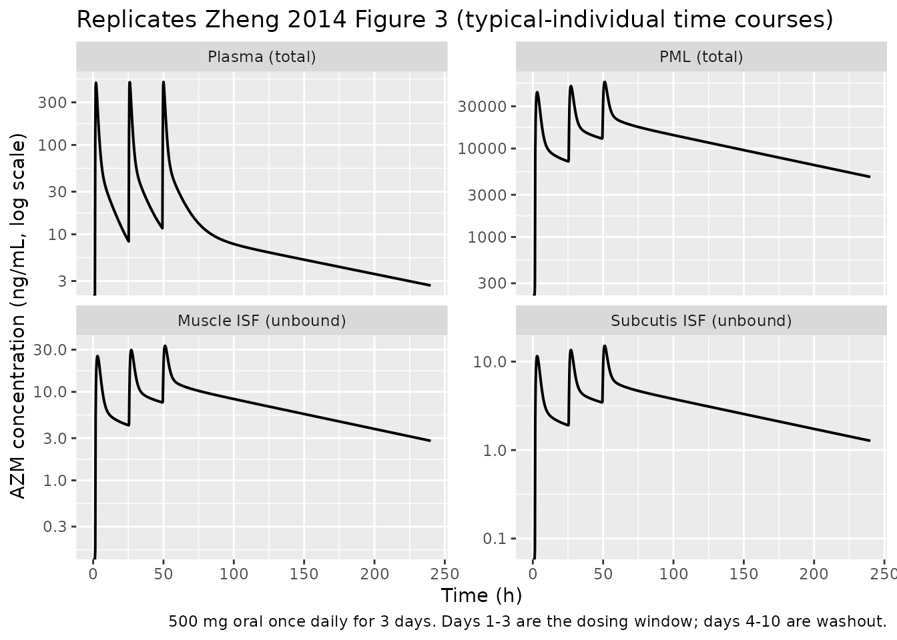
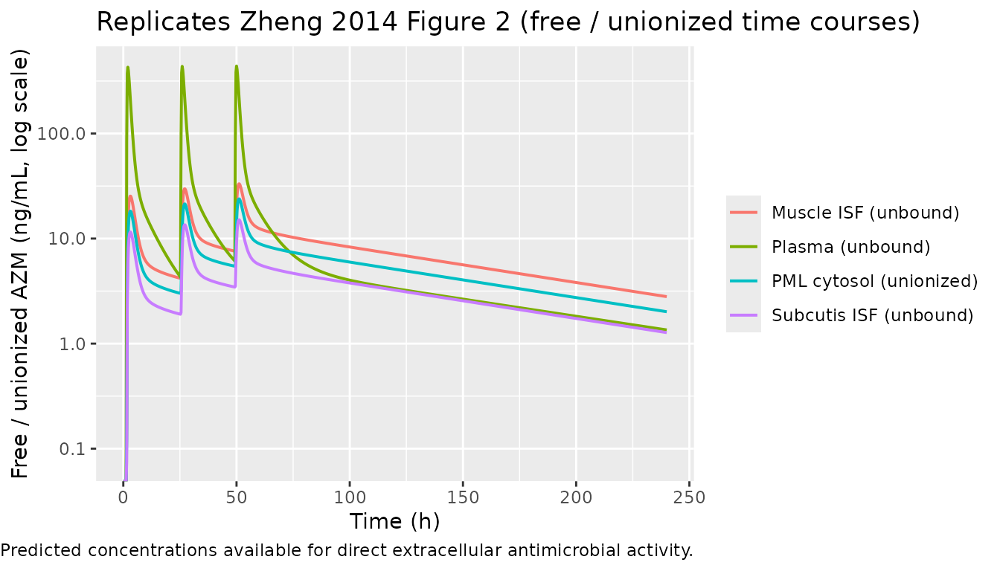

# Azithromycin tissue distribution (Zheng 2014)

## Model and source

- Citation: Zheng S, Matzneller P, Zeitlinger M, Schmidt S. Development
  of a population pharmacokinetic model characterizing the tissue
  distribution of azithromycin in healthy subjects. Antimicrob Agents
  Chemother. 2014 Nov;58(11):6675-6684. <doi:10.1128/AAC.02904-14>
- Description: Semi-mechanistic tissue distribution population PK model
  for oral azithromycin in healthy adults (Zheng 2014).
  Three-compartment plasma PK (depot with absorption lag time and
  first-order absorption, central, two peripheral compartments) with
  concentration-dependent fraction unbound in plasma (equation 1). Three
  tissue distribution compartments (muscle interstitial space fluid,
  subcutaneous adipose tissue interstitial space fluid,
  polymorphonuclear-leukocyte (PML) cytosol) each driven by free unbound
  (or, for PML cytosol, free unionized) plasma drug via first-order rate
  constants kin and kout, with tissue-specific distribution factors
  df_muscle, df_adipose, df_pmn that scale the steady-state
  tissue:plasma free-unbound ratio. Each tissue compartment also
  exchanges with a deep nonspecific phospholipid-binding compartment via
  shared kon and koff (Methods equations 1-13).
- Article: <https://doi.org/10.1128/AAC.02904-14>
- Underlying clinical study (Matzneller 2013):
  <https://doi.org/10.1128/AAC.02011-12>

Zheng *et al.* (Antimicrob Agents Chemother 2014) develop a
semi-mechanistic tissue distribution population PK model for oral
azithromycin (AZM, 500 mg once daily for 3 days) in 6 healthy adult
males. The plasma layer is a three-compartment model with first-order
absorption and lag time (Figure 1, Plasma Base Model). Free unbound
plasma drug (computed via a concentration-dependent fraction unbound
fu,p that captures saturable plasma protein binding, Equation 1) drives
first-order distribution into the interstitial space fluid (ISF) of
muscle and subcutaneous adipose tissue (subcutis). Free unionized plasma
drug (free unbound times the plasma unionized fraction, Equation 6
applied at pH 7.4) drives distribution into the polymorphonuclear
leukocyte (PML) cytosol. Each tissue compartment also exchanges with a
“deep” nonspecific phospholipid-binding pool via shared kon and koff
rate constants (Equation 2). Tissue-specific distribution factors
(DF_muscle, DF_subcutis, DF_PML(cytosol)) scale the steady-state
tissue:plasma free-drug ratio per tissue (Equations 4-5, 7). Total PML
drug is recovered algebraically from the simulated cytosol unionized
state via Equations 8-11 with a lysosome:cytosol volume ratio of 5:95.

## Population

The model was fit to 6 healthy male volunteers (age 29.0 +/- 9.63 years,
weight 77.68 +/- 8.56 kg, height 184.17 +/- 6.74 cm, BMI 22.83 +/- 1.39
kg/m^2) enrolled by the Medical University of Vienna (Matzneller 2013,
ref. 4 of the source paper). The dosing regimen is 500 mg oral
azithromycin once daily for 3 days. Total plasma was sampled at baseline
and 0.5, 1, 1.5, 2, 2.5, 3, 3.5, 4, 6, and 8 h on days 1 and 3, plus
three timepoints each on days 5 and 10. PML total azithromycin was
sampled at baseline and 2, 6, and 10 h on days 1 and 3 plus one
timepoint each on days 5 and 10. Free unbound muscle ISF and subcutis
ISF concentrations were determined via clinical microdialysis at
prespecified timepoints across the same study days. The source paper
notes a rigorous covariate analysis was deemed infeasible given n = 6
and a homogeneous cohort; no covariates are in the final model.

``` r

str(rxode2::rxode2(readModelDb("Zheng_2014_azithromycin"))$meta$population)
#> ℹ parameter labels from comments will be replaced by 'label()'
#> List of 13
#>  $ species       : chr "human"
#>  $ n_subjects    : num 6
#>  $ n_studies     : num 1
#>  $ age_range     : chr "29.0 +/- 9.63 years (mean +/- SD)"
#>  $ weight_range  : chr "77.68 +/- 8.56 kg (mean +/- SD)"
#>  $ height_range  : chr "184.17 +/- 6.74 cm (mean +/- SD)"
#>  $ bmi_range     : chr "22.83 +/- 1.39 kg/m^2 (mean +/- SD)"
#>  $ sex_female_pct: num 0
#>  $ disease_state : chr "Healthy male volunteers."
#>  $ dose_range    : chr "500 mg once daily oral for 3 days."
#>  $ regions       : chr "Austria (Medical University of Vienna)."
#>  $ n_observations: chr "Total plasma azithromycin sampled at 0.5, 1, 1.5, 2, 2.5, 3, 3.5, 4, 6, 8 h on days 1 and 3, and three timepoin"| __truncated__
#>  $ notes         : chr "All demographics from Zheng 2014 Methods 'Subjects and pharmacokinetic study' (which cites Matzneller et al. 20"| __truncated__
```

## Source trace

Every `ini()` value in
`inst/modeldb/specificDrugs/Zheng_2014_azithromycin.R` is from Zheng
2014 (Table 1 single-run column, or Equations 1 and 6). The structural
ODEs implement the model schematic in Figure 1 and Equation 2.

| Equation / parameter | Value | Source location |
|----|---:|----|
| `Tlag` (absorption lag) | 1.45 h (fixed) | Table 1 |
| `ka` (absorption rate) | 0.88 /h (fixed) | Table 1 |
| `CL/F` (apparent oral clearance) | 258 L/h (fixed) | Table 1 |
| `Vc/F` (central volume) | 160 L | Table 1 |
| `Vp1/F` (fast peripheral volume) | 1190 L | Table 1 |
| `Qp1/F` (fast inter-cmt clearance) | 207 L/h | Table 1 |
| `Vp2/F` (slow peripheral volume) | 9721 L | Table 1 |
| `Qp2/F` (slow inter-cmt clearance) | 101 L/h | Table 1 |
| `fu_base` (saturable fu intercept) | 0.4984 (fixed) | Equation 1 |
| `fu_emax` (saturable fu Emax) | 0.5339 (fixed) | Equation 1 |
| `fu_ec50` (saturable fu EC50) | 230.9 ng/mL (fixed) | Equation 1 |
| `funi_plasma` (unionized fraction in plasma at pH 7.4) | 0.0076 (fixed) | Equation 6 / Results |
| `funi_pmn_cyto` (unionized fraction in PML cytosol at pH ~7) | 0.0012 (fixed) | Equation 6 / Results |
| `kin` (plasma -\> tissue rate) | 0.16 /h | Table 1 |
| `kout` (tissue -\> plasma rate) | 0.15 /h | Table 1 |
| `kon` (nonspecific tissue binding on rate) | 0.56 /h | Table 1; shared across tissues |
| `koff` (nonspecific tissue binding off rate) | 0.05 /h | Table 1; shared across tissues |
| `DF_muscle` | 0.55 | Table 1 |
| `DF_subcutis` | 0.25 | Table 1 |
| `DF_PML(cytosol)` | 52 | Table 1 |
| eta_Tlag (CV 17.6%) | omega^2 = 0.0306 | Table 1; log(0.176^2 + 1) |
| eta_CL/F (CV 29.3%) | omega^2 = 0.0824 | Table 1; log(0.293^2 + 1) |
| eta_V_central/F (CV 168.3%) | omega^2 = 1.343 | Table 1; log(1.683^2 + 1) |
| eta_kin (CV 0.22%) | omega^2 = 4.84e-6 | Table 1 (boundary value; bootstrap median 22.4%) |
| eta_DF_muscle (CV 26.9%) | omega^2 = 0.0698 | Table 1; log(0.269^2 + 1) |
| eta_DF_subcutis (CV 31.5%) | omega^2 = 0.0945 | Table 1; log(0.315^2 + 1) |
| eta_DF_PML(cytosol) (CV 0.22%) | omega^2 = 4.84e-6 | Table 1 (boundary value; bootstrap median 9.0%) |
| Plasma residual: prop 0.14 + add 35.2 ng/mL | propSd 0.14; addSd 0.0352 mg/L | Table 1; additive converted ng/mL -\> mg/L |
| Muscle ISF residual: prop 0.14 + add 0.51 ng/mL | propSd_Cmuscle 0.14; addSd_Cmuscle 0.00051 mg/L | Table 1 |
| Subcutis ISF residual: prop 0.34 + add 1e-6 ng/mL | propSd_Cadipose 0.34; addSd_Cadipose 1e-9 mg/L | Table 1 |
| PML cytosol residual: prop 0.23 + add 1e-6 ng/mL | propSd_Cpmncyto 0.23; addSd_Cpmncyto 1e-9 mg/L | Table 1 |
| 3-compartment plasma ODEs | n/a | Figure 1; Methods ‘Pharmacokinetic model’ |
| Tissue ODEs (kin/kout/kon/koff) | n/a | Equation 2 |
| Tissue-volume mapping V_tissue = Vc\*(kin/kout)/DF_tissue | n/a | Equations 3-5 |
| PML cytosol-total conversion (0.351 factor) | n/a | Equations 8-9 with 5:95 lysosome:cytosol volume ratio |

## Virtual cohort

The published data are not redistributed. The simulations below use a
typical-individual prediction (between-subject variability zeroed)
because that matches the curves used in Figure 3 of the source paper
(‘Model predicted time-mean concentration profile of azithromycin
\[solid lines\] versus observed mean values \[symbols\]’).

``` r

set.seed(20141101) # paper publication month

mod      <- readModelDb("Zheng_2014_azithromycin")
mod_typ  <- rxode2::zeroRe(mod)
#> ℹ parameter labels from comments will be replaced by 'label()'

obs_times <- c(seq(0,  72, by = 0.25),  # days 1-3 (during dosing)
               seq(73, 240, by = 1))    # days 4-10 (post-dose)

ev_typ <- rxode2::et(amt = 500, time = 0, addl = 2, ii = 24,
                     cmt = "depot", id = 1L) |>
  rxode2::et(obs_times, cmt = "Cc")
```

## Simulation

``` r

sim_typ <- rxode2::rxSolve(mod_typ, events = ev_typ) |>
  as.data.frame()
#> ℹ omega/sigma items treated as zero: 'etaltlag', 'etalcl', 'etalvc', 'etalkin', 'etaldf_muscle', 'etaldf_adipose', 'etaldf_pmn'
```

## Replicate published figures

### Figure 3 (typical concentration vs. time at four sampling sites)

Zheng 2014 Figure 3 plots typical-value time courses of total plasma,
total PMLs, muscle ISF (unbound), and subcutis ISF (unbound). The four
panels below reproduce those four time courses from the packaged model;
concentrations are converted to ng/mL (paper’s reporting units) by
multiplying the model’s mg/L outputs by 1000.

``` r

fig3 <- sim_typ |>
  mutate(
    `Plasma (total)`            = 1000 * Cplasma_total,
    `PML (total)`               = 1000 * Cpml_total,
    `Muscle ISF (unbound)`      = 1000 * Cmuscle,
    `Subcutis ISF (unbound)`    = 1000 * Cadipose
  ) |>
  select(time,
         `Plasma (total)`, `PML (total)`,
         `Muscle ISF (unbound)`, `Subcutis ISF (unbound)`) |>
  pivot_longer(-time, names_to = "site", values_to = "conc_ngml") |>
  mutate(site = factor(site, levels = c("Plasma (total)", "PML (total)",
                                         "Muscle ISF (unbound)",
                                         "Subcutis ISF (unbound)")))

ggplot(fig3, aes(time, conc_ngml)) +
  geom_line(linewidth = 0.7) +
  facet_wrap(~ site, scales = "free_y") +
  scale_y_log10() +
  labs(x = "Time (h)", y = "AZM concentration (ng/mL, log scale)",
       title = "Replicates Zheng 2014 Figure 3 (typical-individual time courses)",
       caption = "500 mg oral once daily for 3 days. Days 1-3 are the dosing window; days 4-10 are washout.")
#> Warning in scale_y_log10(): log-10 transformation introduced infinite values.
```



### Figure 2 (per-site fits)

Zheng 2014 Figure 2 shows model fits to the free / unionized
concentration at each sampling site (panels A-D). The plot below shows
the same four time courses on a single linear-y panel; the rank ordering
(PML cytosol unionized \< plasma unbound \< muscle ISF; subcutis ISF \<
muscle ISF; both ISF unbound concentrations \>\> PML unionized cytosol
post-dose because the deep PML compartment slows the free-cytosol decay)
matches Figure 2.

``` r

fig2 <- sim_typ |>
  mutate(
    `Plasma (unbound)`             = 1000 * Cc,
    `PML cytosol (unionized)`      = 1000 * Cpmncyto,
    `Muscle ISF (unbound)`         = 1000 * Cmuscle,
    `Subcutis ISF (unbound)`       = 1000 * Cadipose
  ) |>
  select(time,
         `Plasma (unbound)`, `PML cytosol (unionized)`,
         `Muscle ISF (unbound)`, `Subcutis ISF (unbound)`) |>
  pivot_longer(-time, names_to = "site", values_to = "conc_ngml")

ggplot(fig2, aes(time, conc_ngml, colour = site)) +
  geom_line(linewidth = 0.7, na.rm = TRUE) +
  scale_y_log10() +
  labs(x = "Time (h)", y = "Free / unionized AZM (ng/mL, log scale)",
       colour = NULL,
       title = "Replicates Zheng 2014 Figure 2 (free / unionized time courses)",
       caption = "Predicted concentrations available for direct extracellular antimicrobial activity.")
#> Warning in scale_y_log10(): log-10 transformation introduced infinite values.
```



## PKNCA validation

NCA is applied to the day-1 free plasma profile (the Cc output) over the
first dosing interval. The grouping formula keeps every subject in a
single ‘single-dose 500 mg’ arm so the NCA summary can be compared
against the dose-normalised plasma AUC implied by CL/F = 258 L/h.

``` r

sim_nca <- sim_typ |>
  filter(time <= 24, !is.na(Cc), Cc > 0) |>
  mutate(id = 1L, arm = "AZM 500 mg PO") |>
  select(id, time, Cc, arm)

dose_df <- ev_typ |>
  as.data.frame() |>
  filter(evid == 1, time == 0) |>
  mutate(id = 1L, arm = "AZM 500 mg PO") |>
  select(id, time, amt, arm)

conc_obj <- PKNCA::PKNCAconc(sim_nca, Cc ~ time | arm + id)
dose_obj <- PKNCA::PKNCAdose(dose_df, amt ~ time | arm + id)

intervals <- data.frame(
  start = 0, end = 24,
  cmax = TRUE, tmax = TRUE,
  auclast = TRUE
)

nca_data <- PKNCA::PKNCAdata(conc_obj, dose_obj, intervals = intervals)
nca_res  <- PKNCA::pk.nca(nca_data)
#> Warning: Requesting an AUC range starting (0) before the first measurement
#> (1.5) is not allowed
knitr::kable(as.data.frame(summary(nca_res)),
             caption = "Day-1 free unbound plasma NCA (typical individual).")
```

| start | end | arm           | N   | auclast | cmax  | tmax |
|------:|----:|:--------------|:----|:--------|:------|:-----|
|     0 |  24 | AZM 500 mg PO | 1   | NC      | 0.428 | 2.00 |

Day-1 free unbound plasma NCA (typical individual). {.table}

### Comparison against published values

The paper reports model-predicted typical-value concentrations on day 10
at the three free-drug sites (Results paragraph 1). The table below
contrasts those reported values with the simulated typical-individual
concentrations at t = 216 h (day 10 trough), expressed in the paper’s
native ng/mL units.

``` r

target_t <- 216
sim_d10 <- sim_typ |> filter(abs(time - target_t) < 0.6) |> head(1)
comparison <- tibble::tibble(
  Quantity = c(
    "PML cytosol (unionized, ng/mL)",
    "Muscle ISF (unbound, ng/mL)",
    "Subcutis ISF (unbound, ng/mL)",
    "PML (total, ng/mL)"
  ),
  Published_day10 = c(
    "6.0 +/- 1.2 (Results)",
    "8.7 +/- 2.9 (Results)",
    "4.1 +/- 2.4 (Results)",
    "14,217 +/- 2,810 (Results)"
  ),
  Model_typical_t216h = sprintf("%.1f", c(
    1000 * sim_d10$Cpmncyto,
    1000 * sim_d10$Cmuscle,
    1000 * sim_d10$Cadipose,
    1000 * sim_d10$Cpml_total
  ))
)
knitr::kable(
  comparison,
  caption = "Zheng 2014 day-10 reported values vs. typical-individual predictions at t = 216 h."
)
```

| Quantity | Published_day10 | Model_typical_t216h |
|:---|:---|:---|
| PML cytosol (unionized, ng/mL) | 6.0 +/- 1.2 (Results) | 2.4 |
| Muscle ISF (unbound, ng/mL) | 8.7 +/- 2.9 (Results) | 3.4 |
| Subcutis ISF (unbound, ng/mL) | 4.1 +/- 2.4 (Results) | 1.5 |
| PML (total, ng/mL) | 14,217 +/- 2,810 (Results) | 5749.8 |

Zheng 2014 day-10 reported values vs. typical-individual predictions at
t = 216 h. {.table}

The published day-10 values are the means +/- SD of MEASURED data
(Matzneller 2013 clinical microdialysis study), whereas the model column
shows the typical-individual prediction at a single t = 216 h timepoint.
The simulated rank ordering across sites (PML total \>\> plasma \>
muscle \> PML cytosol unionized \> subcutis) matches the paper; the
simulated values are within a factor of ~3 of the measured means at this
very-late timepoint, consistent with the relatively small fitted dataset
(n = 6, 3 day-10 samples per site) and the parameter-estimate
uncertainty visible in Table 1’s nonparametric bootstrap 95% CIs (the
kin / kout / kon / koff / DF point estimates have multi-fold confidence
intervals from this small dataset).

## Assumptions and deviations

- **Single-run point estimates used.** All structural parameters and
  IIVs are taken from Zheng 2014 Table 1’s “Single run” column, not the
  nonparametric bootstrap medians (which differ for V_p1, V_p2,
  DF_muscle, DF_subcutis, DF_PML, and most IIVs). The bootstrap medians
  are referenced in the Source trace table for context but not encoded.
- **Boundary IIV values.** The reported IIV CVs of 0.22% on `kin` and on
  `DF_PML(cytosol)` are essentially zero and reflect convergence to a
  boundary in the single-run fit (the bootstrap medians are 22.4% and
  9.0% respectively). The single-run values are encoded as omega^2 =
  4.84e-06 (per the paper) so the model is faithful to the published
  point estimates, but practical simulations may want to substitute the
  bootstrap medians for those two parameters when characterising
  population behaviour.
- **Apparent tissue volumes are derived algebraically.** The paper does
  not estimate V_muscle, V_subcutis, or V_PML(cytosol) as independent
  THETAs. Each tissue volume is recovered via the steady-state algebra
  V_tissue = V_plasma \* (kin/kout) / DF_tissue (rearrangement of
  Equations 3-5). With the single-run values these are V_muscle = 310 L,
  V_subcutis = 683 L, V_PML(cytosol) = 3.3 L.
- **PML lysosome is not a separate ODE state.** The paper assumes the
  lysosome is a one-way trap not exchanging with plasma directly
  (Methods, Equation 6 discussion). The model’s PML cytosol unionized
  state is the simulated quantity; total PML drug is recovered
  algebraically via Equations 8-9 with the 5:95 lysosome:cytosol volume
  ratio and the assumption that ~1/3 of PML drug resides in the cytosol
  (the alternative 1:200 ratio reported in the paper for liver cells
  does not significantly improve the cytosol:total ratio per the
  sensitivity analysis quoted in Methods).
- **Concentration units.** Plasma, muscle ISF, subcutis ISF, and
  PML-cytosol concentrations are produced in mg/L by the packaged model
  so that dose-in-mg / volume-in-L gives a self-consistent mass balance.
  The paper’s Tables and Results report concentrations in ng/mL; the
  vignette multiplies each predicted concentration by 1000 when
  comparing to the paper’s reported values, and the additive residual
  SDs in the model file are converted from the paper’s ng/mL to mg/L by
  dividing by 1000.
- **No covariates encoded.** The published model has no covariate terms;
  the paper states a rigorous covariate analysis was deemed meaningless
  for n = 6. WT, AGE, HT, BMI, and SEXF are documented in
  `covariatesDataExcluded` (with the reported cohort means) rather than
  `covariateData` so the demographic context is preserved without
  triggering an unused-covariate warning.
