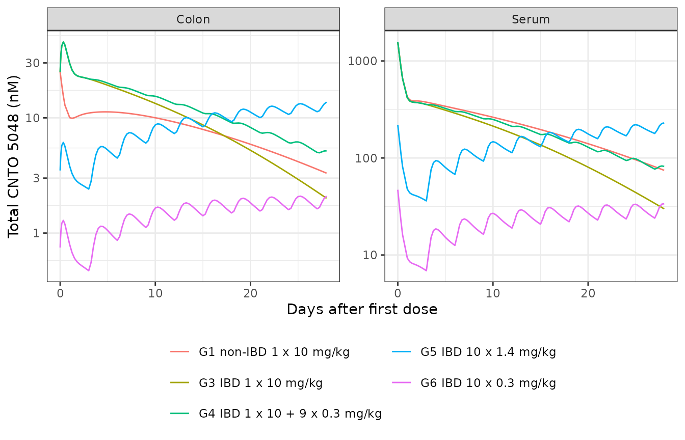
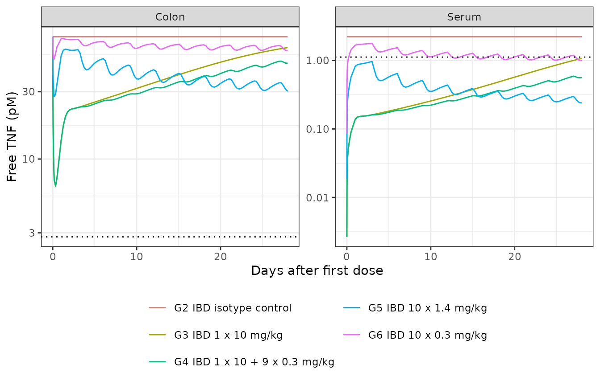

# CNTO 5048 anti-TNF mAb in mouse colitis, mPBPK/TMDD (Zheng 2020)

## Model and source

- Citation: Zheng S, Niu J, Geist B, Fink D, Xu Z, Zhou H, Wang W. A
  minimal physiologically based pharmacokinetic model to characterize
  colon TNF suppression and treatment effects of an anti-TNF monoclonal
  antibody in a mouse inflammatory bowel disease model. *mAbs.*
  2020;12(1):1813962.
- Article: <https://doi.org/10.1080/19420862.2020.1813962> (open access,
  PMC7531524)

CNTO 5048 is a rat/mouse chimeric IgG2a anti-murine-TNF antibody used as
a surrogate of golimumab. Zheng et al. built the model in four steps
(Figure 3): (a) the second-generation minimal PBPK model of Cao 2013 for
serum CNTO 5048 (serum, tight and leaky tissue interstitial fluid,
lymph, intraperitoneal absorption site, Michaelis-Menten serum
elimination); (b) two sequential colon interstitial-fluid segments; (c)
quasi-equilibrium TMDD with soluble TNF in serum; and (d)
quasi-equilibrium TMDD with soluble TNF in each colon segment. The
packaged model is the final step (d) model. Disease status (IBD versus
non-IBD mouse) switches the serum elimination capacity, the colon
reflection coefficient, the colon clearance and the colon volume and
lymph flow.

``` r

mod <- readModelDb("Zheng_2020_CNTO5048_mouse_mpbpk")
mod_typ <- rxode2::zeroRe(rxode2::rxode2(mod))
#> Warning: No omega parameters in the model
```

## Population

Female SCID mice (Fox Chase C.B-17). On study day 0, 114 mice received
an intraperitoneal injection of CD45RB-high T cells from female Balb/C
donors, which induces colitis within about 4 weeks (“IBD mice”, Groups
2-6); 30 non-IBD mice (Group 1) did not receive the transfer. The first
antibody dose was given on study day 21, which the model uses as time 0.
Dosing (Table 1):

| Group | N | Disease | Regimen |
|----|----|----|----|
| 1 | 30 | non-IBD | CNTO 5048 10 mg/kg IV once |
| 2 | 18 | IBD | isotype control CNTO 1322, 10 mg/kg IV + 9 x 0.3 mg/kg IP Q3D |
| 3 | 30 | IBD | CNTO 5048 10 mg/kg IV once |
| 4 | 22 | IBD | CNTO 5048 10 mg/kg IV + 9 x 0.3 mg/kg IP Q3D |
| 5 | 22 | IBD | CNTO 5048 1.4 mg/kg IV + 9 x 1.4 mg/kg IP Q3D |
| 6 | 22 | IBD | CNTO 5048 0.3 mg/kg IV + 9 x 0.3 mg/kg IP Q3D |

Sampling was sparse and destructive, so the authors fit the naive-pooled
data in Monolix 2019R1 with no between-animal variability. The packaged
metadata (`readModelDb("Zheng_2020_CNTO5048_mouse_mpbpk")$population`)
records the same context.

## Source trace

| Equation / parameter | Value | Source location |
|----|----|----|
| Serum, tight, leaky, lymph, absorption-site ODEs | – | Eq. 11-15 (Methods, Step III; Step I eq. 1-5 without TMDD) |
| V_tight = 0.65 ISF Kp, V_leaky = 0.35 ISF Kp - V_colon | – | Methods, Step I and Step II |
| L_tight = L/3, L_leaky = 2/3 L - L_colon | – | Methods, Step I and Step II |
| Colon segment ODEs (each 0.5 V_colon) | – | Eq. 24-25 (Step IV; Step II eq. 8-9) |
| Colon homogenate concentration | Ratio_ISF (C1 + C2)/2 + Ratio_s Cs | Eq. 10 (total), eq. 32 (free), eq. 35 (TNF) |
| Serum TMDD (quasi-equilibrium) | – | Eq. 16-21 |
| Colon TMDD (quasi-equilibrium) | – | Eq. 22-34 |
| Vs | 0.85 mL (fixed) | Table 2 |
| ISF | 4.35 mL (fixed) | Table 2 |
| Vlymph | 1.60 mL (fixed) | Table 2 |
| L | 0.12 mL/h (fixed) | Table 2 |
| sigma_L | 0.20 (fixed) | Table 2 |
| Kp | 0.8 | Methods, Step I |
| Vmax non-IBD / IBD | 3.39 / 4.53 pmol/h | Table 2 |
| Km | 221 nM | Table 2 |
| sigma_tight / sigma_leaky | 0.955 / 0.201 | Table 2 |
| ka (IP absorption) | 0.104 1/h | Table 2 |
| sigma_colon non-IBD / IBD | 0.978 / 0.391 | Table 2 |
| CL_colon non-IBD / IBD | 0.000106 / 0.00217 mL/h | Table 2 |
| V_colon non-IBD / IBD | 0.026 / 0.039 mL (fixed) | Table 2, eq. 6 |
| L_colon non-IBD / IBD | 0.00137 / 0.00205 mL/h (fixed) | Table 2, eq. 7 |
| Ratio_ISF / Ratio_s | 0.175 / 0.0159 | Methods, Step II (17.5% and 1.59%) |
| kdeg / kint (serum) | 12.8 / 0.866 1/h | Table 2 |
| R0 (serum, IBD) | 2.22 pM (fixed) | Table 2 |
| Kss (serum) | 1.88 nM | Table 2 |
| kdeg,colon / kint,colon | 1.17 / 0.0492 1/h | Table 2 |
| R0,colon (colon ISF, IBD) | 420 pM (fixed) | Table 2, footnote c |
| Kss,colon | 1.32 nM | Table 2 |
| Residual error forms | proportional (serum mAb); additive (colon mAb, serum and colon TNF) | Methods, Model fitting |

## Virtual cohort

The model has no between-animal variability, so each group is a single
typical animal. Doses are converted from mg/kg to pmol with the authors’
20 g mean body weight (Discussion) and a 150 kDa antibody molecular
weight (the paper’s 80 ng/mL = 0.533 nM assay limit).

``` r

bw_kg <- 0.020
mw_g_per_mol <- 150000
mgkg_to_pmol <- function(mgkg) mgkg * bw_kg * 1e-3 / mw_g_per_mol * 1e12

groups <- tibble::tribble(
  ~group, ~label,                           ~dis, ~iv,  ~ip,
  "G1",   "G1 non-IBD 1 x 10 mg/kg",         0,   10,   0,
  "G2",   "G2 IBD isotype control",          1,   0,    0,
  "G3",   "G3 IBD 1 x 10 mg/kg",             1,   10,   0,
  "G4",   "G4 IBD 1 x 10 + 9 x 0.3 mg/kg",   1,   10,   0.3,
  "G5",   "G5 IBD 10 x 1.4 mg/kg",           1,   1.4,  1.4,
  "G6",   "G6 IBD 10 x 0.3 mg/kg",           1,   0.3,  0.3
)
ip_times <- seq(72, 648, by = 72) # study days 24-48, every 3 days
obs_times <- sort(unique(c(0, 0.25, 0.5, 1, 2, 4, 8, 12, seq(24, 672, by = 6))))

make_group <- function(i) {
  g <- groups[i, ]
  doses <- data.frame(time = 0, amt = mgkg_to_pmol(g$iv), cmt = "plasma")
  if (g$ip > 0) {
    doses <- rbind(doses, data.frame(time = ip_times, amt = mgkg_to_pmol(g$ip), cmt = "depot"))
  }
  doses <- doses[doses$amt > 0, , drop = FALSE]
  doses$evid <- rep(1L, nrow(doses))
  doses$dvid <- rep(NA_integer_, nrow(doses))
  obs <- data.frame(time = obs_times, amt = 0, cmt = NA_character_, evid = 0L, dvid = 1L)
  out <- rbind(doses, obs)
  out$id <- i
  out$DIS_TCT_COLITIS <- g$dis
  out[order(out$time, -out$evid), c("id", "time", "amt", "cmt", "evid", "dvid", "DIS_TCT_COLITIS")]
}
events <- do.call(rbind, lapply(seq_len(nrow(groups)), make_group))
```

## Simulation

``` r

sim <- rxode2::rxSolve(mod_typ, events, returnType = "data.frame") |>
  dplyr::left_join(dplyr::mutate(groups, id = dplyr::row_number()), by = "id") |>
  dplyr::mutate(day = time / 24)
#> Warning: multi-subject simulation without without 'omega'
```

### Replicate Figure 4: CNTO 5048 in serum and colon

Replicates Figure 4(a) and 4(b) of Zheng 2020 (model lines only; the
paper overlays the observed means). Colon values are per gram of wet
colon tissue, the scale on which the paper reports its homogenate
results.

``` r

sim_mab <- sim |>
  dplyr::filter(group != "G2") |>
  dplyr::select(label, day, Serum = Cc, Colon = Ccolon) |>
  tidyr::pivot_longer(c(Serum, Colon), names_to = "matrix", values_to = "conc")

ggplot(sim_mab, aes(day, conc, colour = label)) +
  geom_line() +
  facet_wrap(~matrix, scales = "free_y") +
  scale_y_log10() +
  labs(x = "Days after first dose", y = "Total CNTO 5048 (nM)", colour = NULL) +
  theme_bw() +
  theme(legend.position = "bottom") +
  guides(colour = guide_legend(ncol = 2))
```



### Replicate Figure 5: free TNF in serum and colon

Replicates Figure 5(a) and 5(b) of Zheng 2020. Free TNF is shown in pM,
with the assay limits (1.12 pM serum, 2.81 pM colon) as dotted lines.
Non-IBD mice have no TNF in the model, as in the data, and are omitted.

``` r

lloq <- data.frame(matrix = c("Serum", "Colon"), lloq = c(1.12, 2.81))
sim_tnf <- sim |>
  dplyr::filter(group != "G1") |>
  dplyr::select(label, day, Serum = freeTnf, Colon = freeTnf_colon) |>
  tidyr::pivot_longer(c(Serum, Colon), names_to = "matrix", values_to = "tnf_nM") |>
  dplyr::mutate(tnf_pM = tnf_nM * 1000)

ggplot(sim_tnf, aes(day, tnf_pM, colour = label)) +
  geom_line() +
  geom_hline(data = lloq, aes(yintercept = lloq), linetype = "dotted") +
  facet_wrap(~matrix, scales = "free_y") +
  scale_y_log10() +
  labs(x = "Days after first dose", y = "Free TNF (pM)", colour = NULL) +
  theme_bw() +
  theme(legend.position = "bottom") +
  guides(colour = guide_legend(ncol = 2))
```



## Checks against values stated in the paper

The paper prints several quantities derived from the Table 2 estimates.
The simulated typical animals reproduce each of them; every check below
is deterministic because the model has no random effects.

``` r

at <- function(g, t) sim[sim$group == g & abs(sim$time - t) < 1e-8, ]
p <- as.list(mod_typ$theta)

# Intrinsic serum clearance Vmax/Km: 0.015 (non-IBD) and 0.020 (IBD) mL/h (Results)
cl_int <- c(healthy = exp(p$lvmax_healthy - p$lkm), ibd = exp(p$lvmax_ibd - p$lkm))
# TNF synthesis rates: 0.028 nM/h serum, 0.49 nM/h colon (Results)
ksyn <- c(serum = exp(p$lkdeg + p$lr0), colon = exp(p$lkdeg_colon + p$lr0_colon))
# CL_colon / L_colon: 1.06 (IBD) and 0.077 (non-IBD) (Results)
cl_over_l <- c(
  ibd = exp(p$lcl_colon_ibd - p$llymphflow_colon_ibd),
  healthy = exp(p$lcl_colon_healthy - p$llymphflow_colon_healthy)
)
# Complex clearance in colon, kint,colon * Vcolon/2 = 0.001 mL/h (Discussion)
cl_complex_colon <- exp(p$lkint_colon + p$lvcolon_ibd) / 2

knitr::kable(data.frame(
  Quantity = c(
    "Vmax/Km non-IBD (mL/h)", "Vmax/Km IBD (mL/h)",
    "ksyn serum (nM/h)", "ksyn colon (nM/h)",
    "CL_colon/L_colon IBD", "CL_colon/L_colon non-IBD",
    "kint,colon x Vcolon/2 (mL/h)"
  ),
  Model = signif(c(cl_int, ksyn, cl_over_l, cl_complex_colon), 3),
  Paper = c(0.015, 0.020, 0.028, 0.49, 1.06, 0.077, 0.001)
))
```

| Quantity                     |    Model | Paper |
|:-----------------------------|---------:|------:|
| Vmax/Km non-IBD (mL/h)       | 0.015300 | 0.015 |
| Vmax/Km IBD (mL/h)           | 0.020500 | 0.020 |
| ksyn serum (nM/h)            | 0.028400 | 0.028 |
| ksyn colon (nM/h)            | 0.491000 | 0.490 |
| CL_colon/L_colon IBD         | 1.060000 | 1.060 |
| CL_colon/L_colon non-IBD     | 0.077400 | 0.077 |
| kint,colon x Vcolon/2 (mL/h) | 0.000959 | 0.001 |

``` r


stopifnot(
  abs(cl_int[["healthy"]] / 0.015 - 1) < 0.05,
  abs(cl_int[["ibd"]] / 0.020 - 1) < 0.05,
  abs(ksyn[["serum"]] / 0.028 - 1) < 0.05,
  abs(ksyn[["colon"]] / 0.49 - 1) < 0.05,
  abs(cl_over_l[["ibd"]] / 1.06 - 1) < 0.05,
  abs(cl_over_l[["healthy"]] / 0.077 - 1) < 0.05,
  abs(cl_complex_colon / 0.001 - 1) < 0.05
)
```

Untreated IBD baselines and early target engagement:

``` r

g2 <- at("G2", 24)
tnf24 <- sapply(c("G3", "G4", "G5", "G6"), function(g) at(g, 24)$freeTnf * 1000)
tnf24_red_g6 <- 100 * (1 - tnf24[["G6"]] / (g2$freeTnf * 1000))
knitr::kable(data.frame(
  Quantity = c(
    "Serum free TNF, isotype control (pM)",
    "Colon homogenate free TNF, isotype control (pM)",
    paste("Serum free TNF at 24 h,", names(tnf24), "(pM)"),
    "G6 serum free TNF reduction at 24 h (%)"
  ),
  Model = signif(c(g2$freeTnf * 1000, g2$freeTnf_colon * 1000, tnf24, tnf24_red_g6), 3),
  Paper = c("2.2 (mean)", "73 (mean)", rep("< 1.12 (BLQ)", 3), "", "22")
))
```

| Quantity                                        |  Model | Paper         |
|:------------------------------------------------|-------:|:--------------|
| Serum free TNF, isotype control (pM)            |  2.220 | 2.2 (mean)    |
| Colon homogenate free TNF, isotype control (pM) | 73.500 | 73 (mean)     |
| Serum free TNF at 24 h, G3 (pM)                 |  0.139 | \< 1.12 (BLQ) |
| Serum free TNF at 24 h, G4 (pM)                 |  0.139 | \< 1.12 (BLQ) |
| Serum free TNF at 24 h, G5 (pM)                 |  0.822 | \< 1.12 (BLQ) |
| Serum free TNF at 24 h, G6 (pM)                 |  1.670 |               |
| G6 serum free TNF reduction at 24 h (%)         | 24.700 | 22            |

``` r


stopifnot(
  # R0 = 2.22 pM and R0,colon = 420 pM map to the observed control-group means (Results)
  abs(g2$freeTnf * 1000 / 2.2 - 1) < 0.05,
  abs(g2$freeTnf_colon * 1000 / 73 - 1) < 0.05,
  # Serum free TNF below the 1.12 pM LLOQ 24 h after the first dose in Groups 3-5
  all(tnf24[c("G3", "G4", "G5")] < 1.12),
  # Group 6 only partially suppressed (observed 22% reduction)
  tnf24_red_g6 > 10, tnf24_red_g6 < 40
)
```

Colon distribution in IBD versus non-IBD mice after 10 mg/kg IV
(Results): colon concentrations at 24 h are higher in IBD mice, colon
concentrations rise from day 1 to day 3 in non-IBD mice but fall in IBD
mice, and serum exposure is higher in non-IBD mice. The Methods (Step
III) also state that the complex is under 0.1% of free drug in serum and
under 2% in colon, which is why the complex was not distributed to
tissues. The serum figure is reproduced; the colon figure is not (see
below).

``` r

g1_24 <- at("G1", 24)
g1_72 <- at("G1", 72)
g3_24 <- at("G3", 24)
g3_72 <- at("G3", 72)
ratio_colon_24 <- g3_24$Ccolon / g1_24$Ccolon

cplx <- sim |>
  dplyr::filter(group %in% c("G3", "G4", "G5", "G6"), time > 0) |>
  dplyr::summarise(
    serum = max(ar / cfree_s),
    colon = max(pmax(ar_colon1 / cfree_colon1, ar_colon2 / cfree_colon2))
  )
knitr::kable(data.frame(
  Quantity = c(
    "Colon CNTO 5048 at 24 h, IBD / non-IBD",
    "Non-IBD colon, day 3 / day 1",
    "IBD colon, day 3 / day 1",
    "Max complex / free drug, serum (%)",
    "Max complex / free drug, colon (%)"
  ),
  Model = signif(c(
    ratio_colon_24, g1_72$Ccolon / g1_24$Ccolon, g3_72$Ccolon / g3_24$Ccolon,
    100 * cplx$serum, 100 * cplx$colon
  ), 3),
  Paper = c("about 2", "> 1", "< 1", "< 0.1", "< 2")
))
```

| Quantity                               |   Model | Paper   |
|:---------------------------------------|--------:|:--------|
| Colon CNTO 5048 at 24 h, IBD / non-IBD |  2.9600 | about 2 |
| Non-IBD colon, day 3 / day 1           |  1.1000 | \> 1    |
| IBD colon, day 3 / day 1               |  0.7350 | \< 1    |
| Max complex / free drug, serum (%)     |  0.0947 | \< 0.1  |
| Max complex / free drug, colon (%)     | 31.7000 | \< 2    |

``` r


stopifnot(
  ratio_colon_24 > 1.5, ratio_colon_24 < 4,
  g1_72$Ccolon > g1_24$Ccolon,
  g3_72$Ccolon < g3_24$Ccolon,
  cplx$serum < 0.001
)
```

The colon complex-to-free ratio in the simulated colon interstitial
fluid reaches about 32%, not under 2%. It follows directly from Table 2:
the complex is cleared from colon ISF about 24 times more slowly than
free TNF (kint,colon = 0.0492 versus kdeg,colon = 1.17 1/h), so total
colon TNF can rise to about ksyn,colon / kint,colon = 10 nM, which is
comparable to the free antibody concentration in the colon at the 0.3
and 1.4 mg/kg doses. The Table 2 estimates cannot give a ratio under 2%
at those doses. The paper does not say how it computed its figure, so
this is recorded as a discrepancy and not asserted.

## PKNCA validation

Serum NCA after the single 10 mg/kg IV dose in non-IBD (Group 1) and IBD
(Group 3) mice. The paper reports no NCA table; it states that exposure
was “approximately twofold higher in non-IBD mice than IBD mice”
(Results).

``` r

nca_conc <- sim |>
  dplyr::filter(group %in% c("G1", "G3"), !is.na(Cc)) |>
  dplyr::transmute(id, treatment = group, time, Cc)
nca_dose <- events |>
  dplyr::filter(evid == 1, id %in% c(1, 3)) |>
  dplyr::transmute(id, treatment = ifelse(id == 1, "G1", "G3"), time, amt)

conc_obj <- PKNCA::PKNCAconc(nca_conc, Cc ~ time | treatment + id,
  concu = "nM", timeu = "h"
)
dose_obj <- PKNCA::PKNCAdose(nca_dose, amt ~ time | treatment + id,
  doseu = "pmol", route = "intravascular"
)
intervals <- data.frame(start = 0, end = 672, cmax = TRUE, auclast = TRUE)
nca <- PKNCA::pk.nca(PKNCA::PKNCAdata(conc_obj, dose_obj, intervals = intervals))
nca_tab <- as.data.frame(nca$result) |>
  dplyr::select(treatment, PPTESTCD, PPORRES) |>
  tidyr::pivot_wider(names_from = PPTESTCD, values_from = PPORRES)
nca_tab |>
  dplyr::rename("Group" = treatment, "Cmax (nM)" = cmax, "AUC0-672h (nM*h)" = auclast) |>
  knitr::kable(digits = 0)
```

| Group | AUC0-672h (nM\*h) | Cmax (nM) |
|:------|------------------:|----------:|
| G1    |            158505 |      1569 |
| G3    |            127361 |      1569 |

``` r


auc_ratio <- nca_tab$auclast[nca_tab$treatment == "G1"] / nca_tab$auclast[nca_tab$treatment == "G3"]
late_ratio <- at("G1", 504)$Cc / at("G3", 504)$Cc
c(auc_ratio = auc_ratio, conc_ratio_day21 = late_ratio)
#>        auc_ratio conc_ratio_day21 
#>         1.244534         1.819613
stopifnot(
  # Deterministic: Vmax,IBD / Vmax,nonIBD = 1.34 bounds the AUC ratio of the
  # Michaelis-Menten arm, and TMDD is negligible in serum.
  auc_ratio > 1.1, auc_ratio < 1.5,
  # Figure 4(a): the non-IBD / IBD gap is about twofold by the last samples
  late_ratio > 1.5, late_ratio < 2.5
)
```

The simulated non-IBD / IBD serum AUC ratio over 28 days is 1.2, and the
concentration ratio grows from about 1 at day 1 to 1.8 at day 21 as the
faster IBD elimination accumulates. The paper’s “approximately twofold
higher” exposure in non-IBD mice matches the late concentrations in
Figure 4(a), not the whole-profile AUC, which the Table 2 Vmax ratio of
1.34 limits to well under twofold.

## Assumptions and deviations

- **Colon coupling to serum and lymph.** Figure 3(b)-(d) draws antibody
  entering colon segment 1 from serum and leaving colon segment 2 to
  lymph, and the Methods reduce the leaky-tissue volume and lymph flow
  by the colon values. The printed serum and lymph equations (eq. 1, 4,
  11 and 14), however, carry no colon terms. The model follows the
  printed equations, so the colon draws antibody from serum without
  depleting it and its efflux does not return to lymph. The colon lymph
  flow is under 2% of total lymph flow, so the effect on serum
  concentrations is small.
- **Leaky-tissue volume.** The Methods give V_leaky = 0.35 ISF Kp -
  V_colon. The paper’s derived percentages (colon ISF = 1.71% of leaky
  tissue in non-IBD mice) and its L_colon values (eq. 7) instead use
  0.35 ISF without Kp. The model uses the printed V_leaky formula and
  the tabulated L_colon.
- **Michaelis-Menten term.** Eq. 11 eliminates free drug with total drug
  in the denominator, `Cfree,s * Vmax / (Km + Cs)`; the model keeps this
  form.
- **TNF in non-IBD mice.** TNF was below the assay limit in every
  non-IBD mouse and TMDD was fit only to IBD mice. The model sets both
  TNF baselines to zero in non-IBD mice, which reduces it to the
  step (b) antibody model.
- **Residual error.** The Methods state a proportional error for serum
  CNTO 5048 and additive errors for the other three outputs, but do not
  report their magnitudes. They are encoded as `fixed(0)`; simulations
  are typical-value predictions.
- **Dose conversion.** Doses are converted with a 20 g body weight (the
  authors’ mean, Discussion) and a 150 kDa molecular weight (implied by
  the paper’s 80 ng/mL = 0.533 nM conversion). IP bioavailability is not
  mentioned and is taken as 1.
- **Isotype control.** Group 2 received the isotype control CNTO 1322,
  which does not bind murine TNF; the vignette simulates Group 2 as
  untreated IBD mice to show the TNF baselines.
- **Colon complex fraction.** The stated “\< 2% of free CNTO 5048 in
  colon” cannot be reproduced from the Table 2 estimates (about 30% in
  colon ISF at the low doses; see the checks above). The parameters are
  used as printed.
- **Typos in the printed equations.** Eq. 23 writes `K,colon` for
  `Kss,colon`, and the text after eq. 11 calls free CNTO 5048 “CNTO
  345”.
