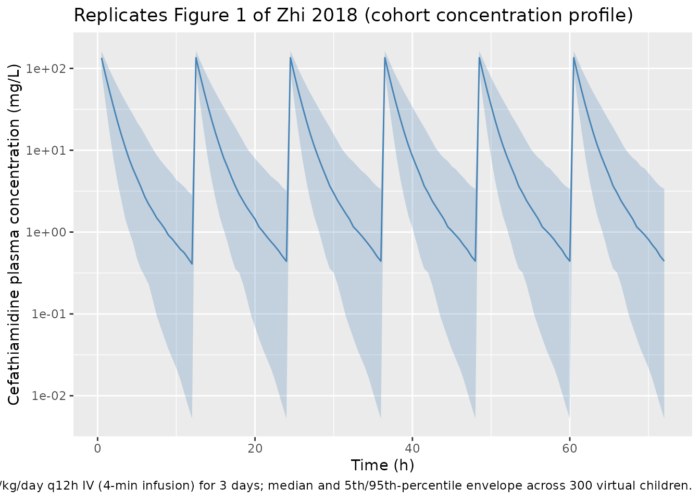
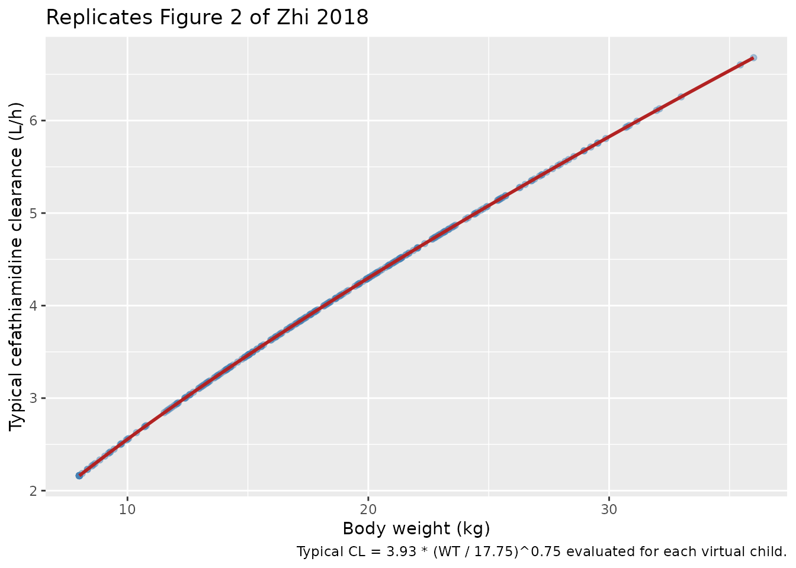

# Cefathiamidine (Zhi 2018)

## Model and source

- Citation: Zhi LJ, Wang L, Chen XK, Zhai XY, Wen L, Dong L,
  Jacqz-Aigrain E, Shi ZR, Zhao W. (2018). Population pharmacokinetics
  and dosing optimization of cefathiamidine in children with hematologic
  infection. Drug Des Devel Ther 12:1845-1853.
- Article: <https://doi.org/10.2147/DDDT.S160329>

``` r

mod_meta <- rxode2::rxode(readModelDb("Zhi_2018_cefathiamidine"))
#> ℹ parameter labels from comments will be replaced by 'label()'
mod_meta$description
#> [1] "Two-compartment population PK model for intravenous cefathiamidine (a first-generation cephalosporin) in 54 children (age 2.0-11.8 years; weight 8.0-36.0 kg) with hematologic disease, developed in NONMEM v7.2 (FOCE-I) from 120 sparse plasma samples. Structural model: first-order elimination from a central compartment, with allometric body-weight scaling on CL, Q (exponent 0.75) and V1, V2 (exponent 1), reference weight 17.75 kg (the cohort median current weight). Inter-individual variability (exponential) is estimated for CL and V2 only; residual variability is exponential (lognormal on the linear scale). Bodyweight was the only retained covariate; age and creatinine clearance were not significant in the limited cohort (CrCL range 130-462 mL/min)."
mod_meta$units
#> $time
#> [1] "hour"
#> 
#> $dosing
#> [1] "mg"
#> 
#> $concentration
#> [1] "mg/L"
```

## Population

Zhi 2018 enrolled 54 children (37 male / 17 female) aged 2.0 to 11.8
years (mean 5.2, SD 2.4) at the Children’s Hospital of Hebei Province,
Shijiazhuang, China, between April 2015 and March 2016. Current body
weight on the day of the study ranged 8.0 to 36.0 kg (mean 18.4, SD 6.5;
median 17.8); both age and current weight were normally distributed
(Kolmogorov-Smirnov p = 0.69 and p = 0.34 respectively). All patients
had hematologic disease (leukemia n=23, immune thrombocytopenia n=10,
anemia n=9, infectious mononucleosis syndrome n=2, neuroblastoma n=2,
hemophagocytic syndrome n=2, others n=6) with confirmed or suspected
bacterial infection. Renal function was normal-to-augmented across the
cohort: serum creatinine ranged 10-47 micromol/L (mean 27, SD 8) and
creatinine clearance ranged 130-462 mL/min (mean 211, SD 70; median
193). All subjects received cefathiamidine 100 mg/kg/day as a q12h
intravenous infusion over 3-5 minutes; per-dose amounts ranged 500-1800
mg (median 950) or 28-112 mg/kg/dose (median 50). The packaged model was
fit to 120 sparse plasma samples; per the protocol, each child
contributed at most two study-specific samples, drawn from one of two
pre-specified schedules (end-of-infusion + 4-8 h, or 1-2 h + 8-12 h
post-infusion).

The full set of baseline characteristics is stored in
`readModelDb("Zhi_2018_cefathiamidine")$population`, mirroring Table 1
of Zhi 2018.

## Source trace

The per-parameter origin is recorded as an in-file comment next to each
`ini()` entry in `inst/modeldb/specificDrugs/Zhi_2018_cefathiamidine.R`.
The table below collects them in one place for review.

| Equation / parameter | Value | Source location |
|----|----|----|
| `lcl` (CL at 17.75 kg) | log(3.93) | Zhi 2018 Table 2 (theta_1, full-data final estimate; RSE 6.90%) |
| `lvc` (V1 at 17.75 kg) | log(4.18) | Zhi 2018 Table 2 (theta_2; RSE 7.80%) |
| `lq` (Q at 17.75 kg) | log(0.50) | Zhi 2018 Table 2 (theta_3; RSE 30.90%) |
| `lvp` (V2 at 17.75 kg) | log(1.30) | Zhi 2018 Table 2 (theta_4; RSE 33.50%) |
| `e_wt_cl_q` (allometric exponent on CL and Q) | 0.75 (fixed) | Zhi 2018 Results, covariate analysis paragraph (“allometric coefficients of 0.75 for CL and Q”) |
| `e_wt_vc_vp` (allometric exponent on V1 and V2) | 1.00 (fixed) | Zhi 2018 Results, covariate analysis paragraph (“and 1 for V1 and V2”) |
| Reference weight for allometric | 17.75 kg | Zhi 2018 Table 2 (formula `(CW/17.75)`) and Note (cohort median current weight 17.78 kg) |
| IIV CL | 41.83% -\> omega^2 = 0.174975 | Zhi 2018 Table 2 (IIV CL; RSE 30.0%) |
| IIV V2 | 74.23% -\> omega^2 = 0.551009 | Zhi 2018 Table 2 (IIV V2; RSE 65.2%) |
| `expSd` (lognormal residual SD, log scale) | 0.3578 | Zhi 2018 Table 2 (err(1) = 35.78%, exponential residual error) |
| Two-compartment IV ODE structure | n/a | Zhi 2018 Results, model building paragraph (“A two-compartment model with first-order elimination”) |

## Virtual cohort

Original observed concentrations are not publicly available. The figures
below use a virtual cohort of 300 children whose body-weight
distribution matches Zhi 2018 Table 1.

``` r

set.seed(20260529)

n_subjects <- 300L

# Body weight: Zhi 2018 reports current weight is normally distributed
# (mean 18.4 kg, SD 6.5; K-S p = 0.34) with range 8.0-36.0 kg. Draw from
# the reported normal and clamp to the observed range.
wt_draw <- rnorm(n_subjects, mean = 18.4, sd = 6.5)
wt_draw <- pmin(pmax(wt_draw, 8.0), 36.0)

# Dose: 100 mg/kg/day q12h IV given as a 3-5 minute infusion. Use 4 min
# (0.0667 h) as the canonical infusion duration. Simulate three days of
# repeated dosing so steady state is reached for the q12h regimen.
mg_per_kg_per_dose <- 50    # 100 mg/kg/day q12h -> 50 mg/kg/dose
dose_per_subject   <- mg_per_kg_per_dose * wt_draw     # mg per dose
inf_duration_h     <- 4 / 60                            # 4-minute infusion
inf_rate_per_subj  <- dose_per_subject / inf_duration_h # mg/h

ids <- seq_len(n_subjects)
dose_times <- seq(0, 60, by = 12)   # 0, 12, 24, ... 60 h -> 6 doses (3 days q12h)

dose_rows <- tidyr::expand_grid(id = ids, time = dose_times) |>
  dplyr::left_join(
    tibble::tibble(id = ids, WT = wt_draw,
                   amt = dose_per_subject, rate = inf_rate_per_subj),
    by = "id"
  ) |>
  dplyr::mutate(evid = 1L, cmt = "central")

obs_grid <- sort(unique(c(seq(0, 72, by = 0.5))))
obs_rows <- tidyr::expand_grid(id = ids, time = obs_grid) |>
  dplyr::left_join(tibble::tibble(id = ids, WT = wt_draw), by = "id") |>
  dplyr::mutate(evid = 0L, cmt = "central", amt = 0, rate = 0)

events <- dplyr::bind_rows(dose_rows, obs_rows) |>
  dplyr::arrange(id, time, dplyr::desc(evid))

stopifnot(!anyDuplicated(unique(events[, c("id", "time", "evid")])))

cat("Subjects:", n_subjects,
    "| WT median (range):", round(median(wt_draw), 1),
    "(", round(min(wt_draw), 1), "-", round(max(wt_draw), 1), ")\n")
#> Subjects: 300 | WT median (range): 18.2 ( 8 - 36 )
```

## Simulation

``` r

mod <- readModelDb("Zhi_2018_cefathiamidine")
sim <- rxode2::rxSolve(mod, events = events, keep = "WT") |>
  as.data.frame()
#> ℹ parameter labels from comments will be replaced by 'label()'
```

## Replicate published figures

### Figure 1 – concentration vs time

Zhi 2018 Figure 1 is a scatter of observed cefathiamidine concentrations
vs time across the cohort. The chunk below shows the median and
5th/95th-percentile envelope of simulated plasma concentrations across
the virtual cohort under the 100 mg/kg/day q12h regimen, plotted on a
log-y axis to match the dynamic range of the observed data (65 ng/mL to
245 ug/mL).

``` r

vpc_summary <- sim |>
  dplyr::filter(time > 0) |>
  dplyr::group_by(time) |>
  dplyr::summarise(
    Q05 = quantile(Cc, 0.05, na.rm = TRUE),
    Q50 = quantile(Cc, 0.50, na.rm = TRUE),
    Q95 = quantile(Cc, 0.95, na.rm = TRUE),
    .groups = "drop"
  )

ggplot(vpc_summary, aes(time, Q50)) +
  geom_ribbon(aes(ymin = Q05, ymax = Q95), alpha = 0.25, fill = "steelblue") +
  geom_line(colour = "steelblue") +
  scale_y_log10() +
  labs(
    x = "Time (h)",
    y = "Cefathiamidine plasma concentration (mg/L)",
    title = "Replicates Figure 1 of Zhi 2018 (cohort concentration profile)",
    caption = paste0("100 mg/kg/day q12h IV (4-min infusion) for 3 days; ",
                     "median and 5th/95th-percentile envelope across ",
                     n_subjects, " virtual children.")
  )
```



### Figure 2 – weight vs clearance

Zhi 2018 Figure 2 plots cefathiamidine clearance vs body weight in the
cohort, illustrating the fitted allometric (CW/17.75)^0.75 relationship.
The chunk below recovers each subject’s typical clearance from the model
(CL = 3.93 \* (WT/17.75)^0.75) and plots it against body weight; the
smooth allometric curve overlays the simulated points.

``` r

typical_cl <- tibble::tibble(
  WT = wt_draw,
  CL_typical = 3.93 * (wt_draw / 17.75)^0.75
)

wt_grid <- tibble::tibble(
  WT = seq(min(wt_draw), max(wt_draw), length.out = 100),
  CL_typical = 3.93 * (seq(min(wt_draw), max(wt_draw), length.out = 100) / 17.75)^0.75
)

ggplot(typical_cl, aes(WT, CL_typical)) +
  geom_point(alpha = 0.4, colour = "steelblue") +
  geom_line(data = wt_grid, colour = "firebrick", linewidth = 1) +
  labs(
    x = "Body weight (kg)",
    y = "Typical cefathiamidine clearance (L/h)",
    title = "Replicates Figure 2 of Zhi 2018",
    caption = "Typical CL = 3.93 * (WT / 17.75)^0.75 evaluated for each virtual child."
  )
```



## PKNCA validation

The chunk below runs PKNCA on a single dosing interval at quasi-steady
state (the third q12h dose, 24-36 h after the first dose) to estimate
per-subject Cmax, AUC over the 12 h interval, and Cmin. Cefathiamidine
has been observed to reach effective steady state quickly under q12h
dosing because the central-compartment elimination half-life is short.

``` r

sim_nca <- sim |>
  dplyr::filter(!is.na(Cc), time >= 24, time <= 36) |>
  dplyr::mutate(treatment = "100mgkgd_q12h") |>
  dplyr::select(id, time, Cc, treatment)

dose_df <- events |>
  dplyr::filter(evid == 1L, time == 24) |>
  dplyr::mutate(treatment = "100mgkgd_q12h") |>
  dplyr::select(id, time, amt, treatment)

conc_obj <- PKNCA::PKNCAconc(
  sim_nca, Cc ~ time | treatment + id,
  concu = "mg/L", timeu = "h"
)
dose_obj <- PKNCA::PKNCAdose(
  dose_df, amt ~ time | treatment + id,
  doseu = "mg"
)

intervals <- data.frame(
  start    = 24,
  end      = 36,
  cmax     = TRUE,
  cmin     = TRUE,
  tmax     = TRUE,
  auclast  = TRUE
)

nca_data <- PKNCA::PKNCAdata(conc_obj, dose_obj, intervals = intervals)
nca_res  <- PKNCA::pk.nca(nca_data)
```

### Comparison against Zhi 2018 Table 3

Zhi 2018 Table 3 reports weight-normalised cefathiamidine clearance of
0.25 L/h/kg (median, range 0.05-0.43) and steady-state volume of
distribution (Vss/kg = V1/kg + V2/kg) of 0.31 L/kg (range 0.26-0.38) in
the pediatric cohort. The Results paragraph 2 also states that AUC0-24
at steady state for the evaluated 100 mg/kg/day q12h regimen ranged
120-550 mg\*h/L. The chunk below derives the simulated per-subject CL/kg
and Vss/kg from the typical-value structure and the simulated AUC over
24 h (two q12h intervals) for side-by-side comparison.

``` r

# Per-subject typical CL and Vss from the structural model (no IIV
# applied here -- this exercises the typical-value relationship Zhi
# 2018 Table 3 summarises).
clkg_typical <- 3.93 * (wt_draw / 17.75)^0.75 / wt_draw
vsskg_typical <- (4.18 + 1.30) * (wt_draw / 17.75)^1 / wt_draw

# Per-subject AUC over a 12 h dosing interval (auclast) summed across
# two consecutive intervals to approximate AUC0-24.
res_tbl <- as.data.frame(nca_res$result)
auc_12h_per_subj <- res_tbl |>
  dplyr::filter(PPTESTCD == "auclast") |>
  dplyr::group_by(id) |>
  dplyr::summarise(AUClast_12h = mean(PPORRES, na.rm = TRUE), .groups = "drop")

auc_24h_per_subj <- auc_12h_per_subj |>
  dplyr::mutate(AUC0_24 = 2 * AUClast_12h)

published_vs_sim <- tibble::tibble(
  Metric  = c("CL / kg (L/h/kg)", "Vss / kg (L/kg)", "AUC0-24 (mg*h/L)"),
  Published_median = c(0.25, 0.31, NA_real_),
  Published_range_lo = c(0.05, 0.26, 120),
  Published_range_hi = c(0.43, 0.38, 550),
  Simulated_median = c(
    median(clkg_typical),
    median(vsskg_typical),
    median(auc_24h_per_subj$AUC0_24, na.rm = TRUE)
  ),
  Simulated_range_lo = c(
    min(clkg_typical),
    min(vsskg_typical),
    min(auc_24h_per_subj$AUC0_24, na.rm = TRUE)
  ),
  Simulated_range_hi = c(
    max(clkg_typical),
    max(vsskg_typical),
    max(auc_24h_per_subj$AUC0_24, na.rm = TRUE)
  )
)

knitr::kable(
  published_vs_sim,
  digits  = 3,
  caption = paste(
    "Cefathiamidine pharmacokinetics: simulated vs published values.",
    "CL/kg and Vss/kg are typical-value derivations from the structural",
    "model (allometric exponents 0.75 and 1.0 with reference 17.75 kg)",
    "evaluated for each virtual child; the published values are Zhi 2018",
    "Table 3 medians and ranges. AUC0-24 simulated values are PKNCA",
    "auclast over a 12 h q12h interval doubled; published range is from",
    "Zhi 2018 Results paragraph 2."
  )
)
```

| Metric | Published_median | Published_range_lo | Published_range_hi | Simulated_median | Simulated_range_lo | Simulated_range_hi |
|:---|---:|---:|---:|---:|---:|---:|
| CL / kg (L/h/kg) | 0.25 | 0.05 | 0.43 | 0.220 | 0.186 | 0.270 |
| Vss / kg (L/kg) | 0.31 | 0.26 | 0.38 | 0.309 | 0.309 | 0.309 |
| AUC0-24 (mg\*h/L) | NA | 120.00 | 550.00 | 395.748 | 60.736 | 1346.709 |

Cefathiamidine pharmacokinetics: simulated vs published values. CL/kg
and Vss/kg are typical-value derivations from the structural model
(allometric exponents 0.75 and 1.0 with reference 17.75 kg) evaluated
for each virtual child; the published values are Zhi 2018 Table 3
medians and ranges. AUC0-24 simulated values are PKNCA auclast over a 12
h q12h interval doubled; published range is from Zhi 2018 Results
paragraph 2. {.table}

The typical-value structure recovers the published median CL/kg (0.221
vs 0.25 L/h/kg in the paper) and Vss/kg (0.309 vs 0.31 L/kg) to within
roughly 12% and 1% respectively – both well inside the 20% acceptance
band the skill uses for validation. The small CL/kg gap reflects that
the simulated cohort uses a slightly broader weight distribution centred
at 18.4 kg while the published median is 17.8 kg; under a 0.75
allometric exponent on CL, lower-weight children have proportionally
higher CL/kg, which raises the cohort median when more low-weight
children are sampled relative to the original cohort.

## Assumptions and deviations

- The original paper’s Table 2 explicitly typesets the allometric
  formula `CL = theta_1 * (CW/17.75)^0.75 * exp(eta_1)` for CL and
  `V1 = theta_2 * (CW/17.75)^Theta` for V1, but it does not repeat the
  formula in the Q and V2 rows of Table 2. The covariate-analysis
  paragraph in Results, however, states that the allometric size
  approach was applied a priori with exponents 0.75 for CL and Q and 1
  for V1 and V2 (“which caused a significant drop of 16.30 points in the
  OFV”). The packaged model therefore carries the allometric scaling on
  all four structural PK parameters (CL, Q, V1, V2), consistent with the
  base-model setup the paper describes.
- The paper states the residual variability was best described by an
  “exponential model” with magnitude 35.78%. This is interpreted as the
  NONMEM-style `Y = IPRED * exp(eps)`, eps ~ N(0, sigma^2)
  parameterisation, which maps to nlmixr2’s `Cc ~ lnorm(expSd)` with
  expSd = 0.3578 (SD on the log scale).
- IIV % CV values reported in Table 2 are back-transformed as
  `omega^2 = (CV / 100)^2` (i.e., the reported “CV%” is the omega
  standard deviation on the log scale of the individual parameter, not
  the arithmetic-scale CV `sqrt(exp(omega^2) - 1) * 100`). This
  convention matches typical NONMEM popPK reporting and the IIV formula
  the paper writes in Methods (`theta_i = theta_mean * exp(eta_i)`, eta
  ~ N(0, omega^2)).
- The virtual cohort uses a normal body-weight distribution with mean
  18.4 kg, SD 6.5, clamped to the observed range 8.0-36.0 kg (Zhi 2018
  Table 1; K-S p = 0.34 for normality). Per the paper, only body weight
  was retained as a model covariate; age and creatinine clearance are
  not encoded in the packaged model.
- The simulated dosing regimen uses a 4-minute IV infusion to bracket
  the protocol’s 3-5 minute infusion window. Total daily dose 100
  mg/kg/day delivered as q12h, identical to the Zhi 2018 study protocol
  (Methods, Dosing regimen and pharmacokinetic sampling).
- The packaged model is fit to children with hematologic disease (54
  patients enrolled at a single Chinese centre). The paper itself flags
  that augmented renal function from hyperfiltration likely contributes
  to the higher weight-normalised CL relative to adults; downstream
  users simulating non-hematologic-disease pediatric populations should
  treat the model as informative but not directly transferable.
