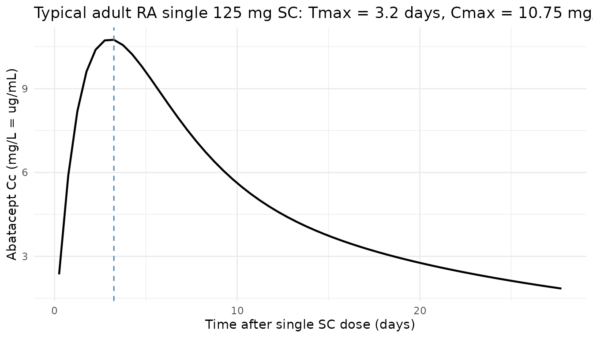
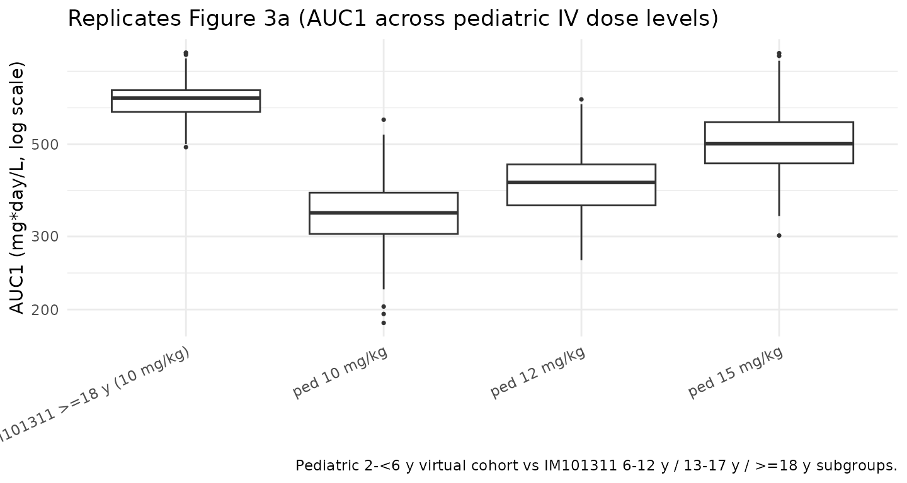

# Abatacept (Zhong 2026)

## Model and source

- Citation: Zhong R, Maxwell K, Passarell J, Murthy B, Aras U,
  Williams D. Model-Informed Abatacept Dose Recommendation in Pediatric
  Patients With Acute Graft-Versus-Host Disease. J Clin Pharmacol.
  2026;66(2):\[in-issue\]. <doi:10.1002/jcph.70156>
- Description: Two-compartment population PK model for abatacept
  (CTLA4-Ig Fc-fusion) pooled across 9 phase 2/3 studies (Zhong 2026):
  adults with rheumatoid arthritis, patients aged 2-17 years with
  polyarticular juvenile idiopathic arthritis, and patients aged 6+
  years with hematologic malignancies receiving HLA-matched
  unrelated-donor HSCT (the ABA2 trial). Final model has zero-order IV
  infusion, first-order SC absorption, first-order linear elimination,
  additive plus proportional residual error, allometric weight on
  CL/VC/VP, hepatic (AST) and renal (cGFR) markers on CL, sex on CL and
  VC, two HSCT cohort indicators (7-of-8 and 8-of-8 HLA-matched URD) on
  CL/VC, and a logit-scale SC bioavailability sub-model with weight,
  age, and pJIA-disease covariates fixed to a previously developed
  internal JIA PPK model (values match Gandhi 2021).
- Article: [J Clin Pharmacol.
  2026;66(2)](https://doi.org/10.1002/jcph.70156) (PMID 41684189)

## Population

Zhong 2026 pooled nine phase 2/3 abatacept clinical studies into a final
population PK dataset of **904 patients (6 355 abatacept serum
concentrations)**: 386 adults with rheumatoid arthritis (RA, 42.7 %),
403 patients aged 2-17 years with polyarticular juvenile idiopathic
arthritis (pJIA, 44.6 %), and 115 patients aged 6-76 years with
hematologic malignancies (HM, 12.7 %) receiving HLA-matched
unrelated-donor (URD) hematopoietic stem cell transplantation (HSCT) in
the ABA2 trial (Study IM101311, NCT01743131). The HM cohort is
decomposed into a 7-of-8 HLA-mismatched stratum (`HSCT_URD_7OF8 = 1`, n
= 41) and an 8-of-8 HLA-matched stratum (`HSCT_URD_8OF8 = 1`, n = 74);
patients in the RA and pJIA studies have both indicators set to 0.
Below-LLOQ samples accounted for 2.9 % of all collected samples and were
excluded.

Zhong 2026 used this PPK model to simulate abatacept exposure in 10 000
virtual pediatric patients aged 2 to \< 6 years to inform the dosing
regimen for prevention of acute graft-versus-host disease (aGvHD) after
URD HSCT. The selected regimen — **15 mg/kg loading dose on Day -1
followed by 12 mg/kg on Days 5, 14, and 28** — was chosen because it
delivered abatacept exposures comparable to the recommended adult and
older-pediatric regimen of 10 mg/kg on the same days, and supported the
FDA approval of abatacept for prevention of acute GvHD in patients aged
2 years and older.

The same information is available programmatically via
`readModelDb("Zhong_2026_abatacept")$population`.

## Source trace

Every structural parameter, covariate effect, IIV element, and
residual-error term below is taken from Zhong 2026 Table 2 (final
population PK model fitted to the pooled RA + pJIA + HM dataset of nine
studies) or Supplementary Table S2 (which lists the IIV variances
directly in the “Final Model With Study IM101301” column). Reference
covariate values come from the Figure 1 caption: male reference patient,
baseline body weight 67.9 kg, baseline AST 20 U/L, calculated GFR 103
mL/min/1.73 m², not in HSCT cohort 7/8 or 8/8. The F1 (SC
bioavailability) sub-model and its covariate effects are *fixed* in
Zhong 2026 to the final estimates from a previously developed internal
abatacept JIA PPK model (Methods, Final model paragraph; supplement page
6); the values match the Gandhi 2021 published estimates exactly, so the
F1 sub-model’s reference age (49 years) is inherited from Gandhi 2021.
The 0.1 kg discrepancy between the Zhong 2026 structural-reference WT
(67.9 kg) and the Gandhi 2021 F1-reference WT (68 kg) is documented in
the Errata below; for consistency the model file uses 67.9 kg uniformly.
The numerical impact on F1 predictions is \< 0.1 % across the model’s
covariate range.

| Equation / parameter | Value | Source location |
|----|----|----|
| `lcl` (CL) | `log(0.0230 * 24)` L/day | Table 2: CL = 0.0230 L/h (%RSE 2.32) |
| `lvc` (VC) | `log(3.19)` L | Table 2: VC = 3.19 L (%RSE 2.48) |
| `lq` (Q) | `log(0.0303 * 24)` L/day | Table 2: Q = 0.0303 L/h (%RSE 5.23) |
| `lvp` (VP) | `log(5.07)` L | Table 2: VP = 5.07 L (%RSE 3.11) |
| `lka` (KA, additional rate above kel) | `log(0.00705 * 24)` 1/day | Table 2: KA = 0.00705 1/h (%RSE 19.2) |
| `logitfdepot` (logit F_(TV,ref)) | `1.21` (FIXED) | Table 2: F1 = 1.21 FIXED (normal-scale F = 0.77) |
| `e_wt_cl` ((WT/67.9)^(exp) on CL) | `0.876` | Table 2: Power of weight on CL |
| `e_ast_cl` ((AST/20)^(exp) on CL) | `-0.115` | Table 2: Power of AST effect |
| `e_crcl_cl` ((CRCL/103)^(exp) on CL) | `0.279` | Table 2: Power of cGFR effect |
| `e_sexf_cl` (exp(SEXF·coef) on CL) | `-0.0572` | Table 2: Exponent of sex effect in female on CL |
| `e_co7_cl` (exp(HSCT_URD_7OF8·coef) on CL) | `-0.326` | Table 2: Exponent of GVHD cohort 7/8 effect |
| `e_co8_cl` (exp(HSCT_URD_8OF8·coef) on CL) | `-0.0934` | Table 2: Exponent of GVHD cohort 8/8 effect |
| `e_wt_vc` ((WT/67.9)^(exp) on VC) | `0.712` | Table 2: Power of weight on VC |
| `e_sexf_vc` (exp(SEXF·coef) on VC) | `-0.0967` | Table 2: Exponent of sex effect in female on VC |
| `e_co8_vc` (exp(HSCT_URD_8OF8·coef) on VC) | `0.257` | Table 2: Exponent of GVHD cohort 8 effect on VC (Suppl. Table S2 confirms 8/8) |
| `e_wt_vp` ((WT/67.9)^(exp) on VP) | `0.839` | Table 2: Power of weight on VP |
| `e_wt_f` (slope of log(WT/67.9) on logit-F) | `-0.506` (FIXED) | Table 2: Power of weight on F1 |
| `e_age_f` (slope of log(AGE/49) on logit-F) | `0.487` (FIXED) | Table 2: Power of age on F1 |
| `e_jia_f` (additive on logit-F for DIS_PJIA = 1) | `3.08` (FIXED) | Table 2: Exponent of JIA on F1 |
| `var(etalcl)` | `0.0689` | Suppl. Table S2: IIV in CL = 0.0689 (Table 2: 26.7 % CV) |
| `var(etalvc)` | `0.0309` | Suppl. Table S2: IIV in VC = 0.0309 (Table 2: 17.7 % CV) |
| `var(etalvp)` | `0.164` | Suppl. Table S2: IIV in VP = 0.164 (Table 2: 42.2 % CV) |
| `var(etalka)` | `0.861` | Suppl. Table S2: IIV in KA = 0.861 (Table 2: 117 % CV) |
| `var(etalogitfdepot)` | `0.516` (FIXED) | Suppl. Table S2: IIV in F1 = 0.516; Table 2: SD 0.718 FIXED, var 0.515524 |
| `propSd` (= sqrt(SIGMA_(PROP))) | `sqrt(0.0724)` ≈ 0.269 | Table 2: Proportional component of RV variance = 0.0724 (%RSE 4.77) |
| `addSd` (= sqrt(SIGMA_(ADD))) | `sqrt(5.26e-04)` ≈ 0.0229 mg/L | Table 2: Additive component of RV variance = 5.26E-04 (%RSE 66.9) |
| Structure (2-cmt + first-order SC absorption + zero-order IV input + logit-F + KA \> k_(el) constraint + combined residual error) | n/a | Methods, PPK Model Development and Evaluation; supplement Final-model paragraph |

### Parameterization notes

- **Time-unit conversion.** Zhong 2026 reports CL and Q in L/h and KA in
  1/h. The nlmixr2lib convention is time in days, so each of these
  values is multiplied by 24 inside `log(...)` in
  [`ini()`](https://nlmixr2.github.io/rxode2/reference/ini.html). VC,
  VP, F, IIV variances, and residual-error magnitudes carry through
  unchanged.
- **Logit-F parameterization, additive on logit.** Zhong 2026 Methods
  (page
  6.  writes the F1 covariate model as
      `F1_TV = F1_TV,ref · (BWT/BWT_ref)^F1_BWT · (AGE/AGE_ref)^F1_AGE · exp(JIA·F1_JIA)`,
      i.e. a multiplicative form on the F1 *logit* value. This model
      file implements F1 as **additive on the logit scale**:
      `logit_F = logit_F_TV + e_wt_f · log(WT/67.9) + e_age_f · log(AGE/49) + DIS_PJIA · e_jia_f`.
      The two forms are not algebraically identical because the F1 logit
      can in principle be negative; only the additive form preserves the
      sign-changing flexibility of an inverse-logit link. Per the
      source-paper context (the F1 sub-model is fixed to a previously
      developed internal JIA PPK model; the published Gandhi 2021 model
      from the same author group is the closest match and *was*
      implemented as additive on the logit in
      `Gandhi_2021_abatacept.R`), the additive interpretation is used
      here. See Errata below.
- **KA \> k_(el) flip-flop constraint.** Zhong 2026 reports the typical
  KA alongside the prior models’ values (Discussion: “the inclusion of
  data from patients with GVHD resulted in a 35.3 % increase in the KA
  (0.00521 to 0.00705 1/h)”), where 0.00521 is the Gandhi 2021 KA value.
  Because the BMS abatacept-author-group convention (Li 2019 Eq. S2,
  Gandhi 2021 Eq. S2) reparameterises KA as
  `KA_i = KA_TV · exp(etaKA) + k_el,i` with `k_el,i = CL_i / VC_i` to
  prevent flip-flop, and Zhong 2026 directly compares its KA value
  against Gandhi 2021’s, this model file uses the same parameterisation
  (`ka <- exp(lka + etalka) + kel`). With typical-value parameters
  (`KA_TV · 24 = 0.169 1/day`, `k_el = 0.552 / 3.19 ≈ 0.173 1/day`), the
  effective absorption rate constant is ≈ 0.342 1/day, giving an SC
  absorption half-life of ≈ 2.0 days and a single-dose Tmax near 4 days,
  consistent with abatacept SC label values.
- **Independent IIVs (no full block).** Zhong 2026 reports each ETA’s
  variance and shrinkage independently with no full-block covariance
  reported (Q has no IIV per Table 2 ‘NE’). The model file treats the
  IIVs as independent.
- **F1 is fixed in Zhong 2026.** F1, IIV-on-F1, and all F1-covariate
  effects are FIXED in Zhong 2026 to the final estimates of a previously
  developed internal abatacept JIA PPK model (Methods, Final model). The
  values match Gandhi 2021’s published Table 2 exactly, suggesting the
  internal model is the published Gandhi 2021 model or a closely related
  variant. The model file uses these fixed values verbatim, including
  the 100 % shrinkage on F1 noted in Table 2.

## Virtual cohort

The simulations below use a virtual cohort whose covariate distributions
approximate the Zhong 2026 study populations (Table 1
stratified-by-study demographics). Subject-level observed data were not
released with the paper.

``` r

set.seed(20260429)

# Adult RA cohort -- pooled across IM103002, IM101029, IM101031, IM101100,
# IM101101, IM101102 per Table 1.
n_ra <- 200
ra <- tibble::tibble(
  id              = seq_len(n_ra),
  AGE             = pmin(pmax(rnorm(n_ra, mean = 53, sd = 12), 20, 85)),
  WT              = pmin(pmax(rnorm(n_ra, mean = 78, sd = 20), 40, 187)),
  AST             = pmin(pmax(rnorm(n_ra, mean = 21, sd = 9),   7,  85)),
  CRCL            = pmin(pmax(rnorm(n_ra, mean = 90, sd = 28), 37, 250)),
  SEXF            = rbinom(n_ra, 1, 0.71),       # RA cohorts ~70-77 % female
  DIS_PJIA        = 0L,
  HSCT_URD_7OF8   = 0L,
  HSCT_URD_8OF8   = 0L,
  cohort          = "RA"
)

# pJIA pediatric cohort spanning 2-17 years (IM101033 + IM101301).
n_pjia <- 200
pjia <- tibble::tibble(
  id              = seq.int(from = n_ra + 1, length.out = n_pjia),
  AGE             = runif(n_pjia, 2, 17),
  WT              = pmax(pmin(8 + (AGE - 2) * 4 + rnorm(n_pjia, 0, 6), 100), 8),
  AST             = pmin(pmax(rnorm(n_pjia, mean = 23, sd = 12),  9, 180)),
  CRCL            = pmin(pmax(rnorm(n_pjia, mean = 160, sd = 50), 65, 580)),
  SEXF            = rbinom(n_pjia, 1, 0.74),     # pJIA cohorts skew female
  DIS_PJIA        = 1L,
  HSCT_URD_7OF8   = 0L,
  HSCT_URD_8OF8   = 0L,
  cohort          = "pJIA"
) |>
  dplyr::mutate(
    pjia_dose = dplyr::case_when(
      WT <  25 ~ 50,
      WT <  50 ~ 87.5,
      TRUE     ~ 125
    )
  )

# Adult HM cohort 8/8 (n_pop_8 = 74 in the paper; here we simulate
# enough subjects to give stable percentile estimates).
n_hm8 <- 100
hm8 <- tibble::tibble(
  id              = seq.int(from = n_ra + n_pjia + 1, length.out = n_hm8),
  AGE             = pmin(pmax(rnorm(n_hm8, mean = 39, sd = 21), 6, 76)),
  WT              = pmin(pmax(rnorm(n_hm8, mean = 73, sd = 25), 22, 143)),
  AST             = pmin(pmax(rnorm(n_hm8, mean = 28, sd = 15), 8, 85)),
  CRCL            = pmin(pmax(rnorm(n_hm8, mean = 125, sd = 49), 51, 315)),
  SEXF            = rbinom(n_hm8, 1, 0.42),
  DIS_PJIA        = 0L,
  HSCT_URD_7OF8   = 0L,
  HSCT_URD_8OF8   = 1L,
  cohort          = "HM_8of8"
)

# Adult HM cohort 7/8 (n_pop_7 = 41 in the paper).
n_hm7 <- 60
hm7 <- tibble::tibble(
  id              = seq.int(from = n_ra + n_pjia + n_hm8 + 1, length.out = n_hm7),
  AGE             = pmin(pmax(rnorm(n_hm7, mean = 39, sd = 21), 6, 76)),
  WT              = pmin(pmax(rnorm(n_hm7, mean = 73, sd = 25), 22, 143)),
  AST             = pmin(pmax(rnorm(n_hm7, mean = 28, sd = 15), 8, 85)),
  CRCL            = pmin(pmax(rnorm(n_hm7, mean = 125, sd = 49), 51, 315)),
  SEXF            = rbinom(n_hm7, 1, 0.42),
  DIS_PJIA        = 0L,
  HSCT_URD_7OF8   = 1L,
  HSCT_URD_8OF8   = 0L,
  cohort          = "HM_7of8"
)

# Pediatric (2 to <6 years) HM virtual cohort -- the dose-recommendation
# population of the paper. Demographics are taken from the paper Methods:
# age uniform on [2, 6) years; weight from CDC growth charts (approximated
# here by a 2-y-old ~12 kg, 6-y-old ~21 kg linear interpolation +/- noise);
# sex 50/50; baseline cGFR 158.97 (median of 6-13 y subjects in IM101311);
# baseline AST 29 (same source). The paper assigns the cohort distribution
# 36 % 7/8 / 64 % 8/8, matching Study IM101311 demographics.
n_ped <- 300
ped_age <- runif(n_ped, 2, 6)
ped <- tibble::tibble(
  id              = seq.int(from = n_ra + n_pjia + n_hm8 + n_hm7 + 1,
                            length.out = n_ped),
  AGE             = ped_age,
  WT              = pmax(pmin(12 + (ped_age - 2) * (21 - 12) / 4 +
                                rnorm(n_ped, 0, 1.5), 30), 8),
  AST             = rep(29, n_ped),
  CRCL            = rep(158.97, n_ped),
  SEXF            = rbinom(n_ped, 1, 0.5),
  DIS_PJIA        = 0L,
  HSCT_URD_7OF8   = rbinom(n_ped, 1, 0.36),
  cohort          = "ped_HM"
) |>
  dplyr::mutate(HSCT_URD_8OF8 = 1L - HSCT_URD_7OF8)
```

The pediatric (2 to \< 6 years) HM cohort is the population for which
Zhong 2026 derives the dose recommendation; the virtual covariates
follow the paper Methods (Pharmacokinetic Simulations in Virtual
Pediatric Patients section): age uniform on \[2, 6) years, weight from
CDC growth charts, sex 50/50, baseline cGFR 158.97 mL/min/1.73 m² and
AST 29 U/L set to the median values of 6-to-13-year-old patients from
IM101311, and cohort assignment 36 % 7/8 / 64 % 8/8 matching IM101311
demographics.

## Simulation

``` r

mod <- rxode2::rxode2(readModelDb("Zhong_2026_abatacept"))
keep_cols <- c("WT", "AGE", "AST", "CRCL", "SEXF", "DIS_PJIA",
               "HSCT_URD_7OF8", "HSCT_URD_8OF8", "cohort", "treatment")

# (a) Adult RA SC 125 mg QW for typical SC absorption check
build_sc_events <- function(cov_df, dose_days, treatment, dose_col = NULL,
                            fixed_amt = NULL, obs_step = 7) {
  ev_dose <- cov_df |>
    tidyr::crossing(time = dose_days) |>
    dplyr::mutate(
      amt = if (!is.null(fixed_amt)) fixed_amt else .data[[dose_col]],
      cmt = "depot", evid = 1L, treatment = treatment
    )
  obs_days <- sort(unique(c(seq(0, max(dose_days) + 7, by = obs_step),
                            dose_days + 0.25, dose_days + 1, dose_days + 3)))
  ev_obs <- cov_df |>
    tidyr::crossing(time = obs_days) |>
    dplyr::mutate(amt = 0, cmt = NA_character_, evid = 0L, treatment = treatment)
  dplyr::bind_rows(ev_dose, ev_obs) |>
    dplyr::arrange(id, time, dplyr::desc(evid))
}

# (b) HM IV 10 mg/kg on Days -1, 5, 14, 28 -- the adult/older-pediatric
# regimen used as the exposure benchmark.
build_aba2_events <- function(cov_df, treatment, dose_per_kg = 10) {
  dose_days <- c(0, 6, 15, 29)   # Day -1, 5, 14, 28 from anchor of Day 0 = Day -1
  ev_dose <- cov_df |>
    tidyr::crossing(time = dose_days) |>
    dplyr::mutate(
      amt = WT * dose_per_kg,
      rate = amt * 24,           # 1-h IV infusion -> rate in mg/day
      cmt = "central", evid = 1L, treatment = treatment
    )
  obs_days <- sort(unique(c(seq(0, 56, by = 1),
                            dose_days + 0.04, dose_days + 0.1)))
  ev_obs <- cov_df |>
    tidyr::crossing(time = obs_days) |>
    dplyr::mutate(amt = 0, rate = 0, cmt = NA_character_, evid = 0L,
                  treatment = treatment)
  dplyr::bind_rows(ev_dose, ev_obs) |>
    dplyr::arrange(id, time, dplyr::desc(evid))
}

# (c) Pediatric (2 to <6) HM with the paper's recommended regimen:
# 15 mg/kg loading on Day -1, then 12 mg/kg on Days 5, 14, 28.
build_ped_recommended_events <- function(cov_df, treatment) {
  ev_load <- cov_df |>
    dplyr::mutate(time = 0,  amt = WT * 15, rate = amt * 24,
                  cmt = "central", evid = 1L, treatment = treatment)
  ev_maint <- cov_df |>
    tidyr::crossing(time = c(6, 15, 29)) |>
    dplyr::mutate(amt = WT * 12, rate = amt * 24,
                  cmt = "central", evid = 1L, treatment = treatment)
  obs_days <- sort(unique(c(seq(0, 56, by = 1),
                            c(0, 6, 15, 29) + 0.04,
                            c(0, 6, 15, 29) + 0.1)))
  ev_obs <- cov_df |>
    tidyr::crossing(time = obs_days) |>
    dplyr::mutate(amt = 0, rate = 0, cmt = NA_character_, evid = 0L,
                  treatment = treatment)
  dplyr::bind_rows(ev_load, ev_maint, ev_obs) |>
    dplyr::arrange(id, time, dplyr::desc(evid))
}

events_ra_sc        <- build_sc_events(ra, dose_days = seq(0, 12 * 7, by = 7),
                                       treatment = "RA_SC_125_QW",
                                       fixed_amt = 125, obs_step = 7)
events_pjia_sc      <- build_sc_events(pjia, dose_days = seq(0, 12 * 7, by = 7),
                                       treatment = "pJIA_SC_weight_tiered",
                                       dose_col = "pjia_dose", obs_step = 7)
events_hm8_iv10     <- build_aba2_events(hm8,       "HM_8of8_IV_10mgkg")
events_hm7_iv10     <- build_aba2_events(hm7,       "HM_7of8_IV_10mgkg")
events_ped_iv10     <- build_aba2_events(ped,       "ped_HM_IV_10mgkg")
events_ped_iv12     <- build_aba2_events(ped,       "ped_HM_IV_12mgkg",
                                         dose_per_kg = 12)
events_ped_iv15     <- build_aba2_events(ped,       "ped_HM_IV_15mgkg",
                                         dose_per_kg = 15)
events_ped_recom    <- build_ped_recommended_events(ped, "ped_HM_15_then_12")

sim_ra_sc      <- as.data.frame(rxode2::rxSolve(mod, events = events_ra_sc,
                                                keep = keep_cols))
sim_pjia_sc    <- as.data.frame(rxode2::rxSolve(mod, events = events_pjia_sc,
                                                keep = keep_cols))
sim_hm8_iv10   <- as.data.frame(rxode2::rxSolve(mod, events = events_hm8_iv10,
                                                keep = keep_cols))
sim_hm7_iv10   <- as.data.frame(rxode2::rxSolve(mod, events = events_hm7_iv10,
                                                keep = keep_cols))
sim_ped_iv10   <- as.data.frame(rxode2::rxSolve(mod, events = events_ped_iv10,
                                                keep = keep_cols))
sim_ped_iv12   <- as.data.frame(rxode2::rxSolve(mod, events = events_ped_iv12,
                                                keep = keep_cols))
sim_ped_iv15   <- as.data.frame(rxode2::rxSolve(mod, events = events_ped_iv15,
                                                keep = keep_cols))
sim_ped_recom  <- as.data.frame(rxode2::rxSolve(mod, events = events_ped_recom,
                                                keep = keep_cols))
```

## Replicate published figures

### Adult RA single SC 125 mg — typical SC absorption profile

A typical adult RA reference patient (67.9 kg, 49 y, AST 20 U/L, cGFR
103 mL/min/1.73 m², male, not in HSCT cohort) receiving a single 125 mg
SC dose. The simulated Tmax (≈ 4 days) and shape match the abatacept SC
label.

``` r

mod_typ <- rxode2::zeroRe(mod)
typ_cov <- tibble::tibble(
  id = 1L, WT = 67.9, AGE = 49, AST = 20, CRCL = 103,
  SEXF = 0L, DIS_PJIA = 0L, HSCT_URD_7OF8 = 0L, HSCT_URD_8OF8 = 0L
)
ev_single_sc <- typ_cov |>
  tidyr::crossing(time = c(0, seq(0.25, 28, by = 0.5))) |>
  dplyr::mutate(
    amt  = ifelse(time == 0, 125, 0),
    cmt  = ifelse(time == 0, "depot", NA_character_),
    evid = ifelse(time == 0, 1L, 0L)
  ) |>
  dplyr::arrange(id, time, dplyr::desc(evid))
sim_single_sc <- as.data.frame(rxode2::rxSolve(mod_typ, events = ev_single_sc))
#> ℹ omega/sigma items treated as zero: 'etalcl', 'etalvc', 'etalvp', 'etalka', 'etalogitfdepot'

tmax_day  <- sim_single_sc$time[which.max(sim_single_sc$Cc)]
cmax_mgL  <- max(sim_single_sc$Cc)

ggplot(sim_single_sc, aes(time, Cc)) +
  geom_line(linewidth = 0.8) +
  geom_vline(xintercept = tmax_day, linetype = "dashed", colour = "steelblue") +
  labs(
    x = "Time after single SC dose (days)",
    y = "Abatacept Cc (mg/L = ug/mL)",
    title = sprintf("Typical adult RA single 125 mg SC: Tmax = %.1f days, Cmax = %.2f mg/L",
                    tmax_day, cmax_mgL)
  ) +
  theme_minimal()
```



### Pediatric HM exposure: 10 vs 12 vs 15 mg/kg fixed-dose IV (replicates Figure 3)

Zhong 2026 Figure 3 plots AUC₁, C_(max1), and AUC_(L) (after the last
dose) for fixed IV dose regimens of 10, 12, 15, and 20 mg/kg in the
2-to-\< 6-year-old virtual pediatric population, against the IM101311
older-pediatric (6-12 y, 13-17 y) and adult (≥ 18 y) reference exposures
at 10 mg/kg. The cohorts overlap when the pediatric dose is 12 or 15
mg/kg, supporting the choice of those two doses for further
consideration.

``` r

auc_simpson <- function(time, conc) {
  ord <- order(time)
  time <- time[ord]
  conc <- conc[ord]
  sum(diff(time) * (head(conc, -1) + tail(conc, -1)) / 2)
}

per_subject_first_dose <- function(sim_df, regimen) {
  sim_df |>
    dplyr::filter(time >= 0, time <= 6) |>     # first dose interval is Days -1 to 5 -> 6 days
    dplyr::group_by(id) |>
    dplyr::summarise(
      regimen = regimen,
      AUC1 = auc_simpson(time, Cc),
      Cmax1 = max(Cc, na.rm = TRUE),
      .groups = "drop"
    )
}

per_subject_last_dose <- function(sim_df, regimen) {
  sim_df |>
    dplyr::filter(time >= 29, time <= 56) |>    # last dose at Day 28 -> 28-day window
    dplyr::group_by(id) |>
    dplyr::summarise(
      regimen = regimen,
      AUCL = auc_simpson(time, Cc),
      .groups = "drop"
    )
}

ped_first_10 <- per_subject_first_dose(sim_ped_iv10, "ped 10 mg/kg")
ped_first_12 <- per_subject_first_dose(sim_ped_iv12, "ped 12 mg/kg")
ped_first_15 <- per_subject_first_dose(sim_ped_iv15, "ped 15 mg/kg")
hm_first_812 <- per_subject_first_dose(sim_hm8_iv10  |>
                                       dplyr::filter(AGE >= 6, AGE <= 12),
                                       "IM101311 6-12 y (10 mg/kg)")
#> Warning: There was 1 warning in `dplyr::summarise()`.
#> ℹ In argument: `Cmax1 = max(Cc, na.rm = TRUE)`.
#> Caused by warning in `max()`:
#> ! no non-missing arguments to max; returning -Inf
hm_first_1317 <- per_subject_first_dose(sim_hm8_iv10 |>
                                        dplyr::filter(AGE > 12, AGE <= 17),
                                        "IM101311 13-17 y (10 mg/kg)")
#> Warning: There was 1 warning in `dplyr::summarise()`.
#> ℹ In argument: `Cmax1 = max(Cc, na.rm = TRUE)`.
#> Caused by warning in `max()`:
#> ! no non-missing arguments to max; returning -Inf
hm_first_adult <- per_subject_first_dose(sim_hm8_iv10 |>
                                         dplyr::filter(AGE >= 18),
                                         "IM101311 >=18 y (10 mg/kg)")

first_dose_long <- dplyr::bind_rows(
  ped_first_10, ped_first_12, ped_first_15,
  hm_first_812, hm_first_1317, hm_first_adult
)

ggplot(first_dose_long, aes(regimen, AUC1)) +
  geom_boxplot(outlier.size = 0.6) +
  scale_y_log10() +
  labs(
    x = NULL,
    y = "AUC1 (mg*day/L, log scale)",
    title = "Replicates Figure 3a (AUC1 across pediatric IV dose levels)",
    caption = "Pediatric 2-<6 y virtual cohort vs IM101311 6-12 y / 13-17 y / >=18 y subgroups."
  ) +
  theme_minimal() +
  theme(axis.text.x = element_text(angle = 25, hjust = 1))
```



### Loading + maintenance regimen Cmin1 (replicates Supplementary Figure S7)

Zhong 2026 Supplementary Figure S7 shows that the recommended pediatric
regimen (15 mg/kg loading dose on Day -1, then 12 mg/kg on Days 5, 14,
28) achieves a median C_(min1) above 50 µg/mL, exceeding the Ctrough_1 ≥
39 µg/mL favorable-aGvHD threshold reported by the ABA2
exposure-response analysis. The replication below computes C_(min1) in
the virtual pediatric cohort under the recommended regimen.

``` r

ped_cmin1 <- sim_ped_recom |>
  dplyr::filter(time == 6) |>          # Cmin1 = trough just before Day 5 dose (= 6 d after Day -1)
  dplyr::summarise(
    median_Cmin1 = median(Cc),
    p25 = quantile(Cc, 0.25),
    p75 = quantile(Cc, 0.75),
    pct_ge_39 = 100 * mean(Cc >= 39),
    pct_ge_50 = 100 * mean(Cc >= 50)
  )

knitr::kable(ped_cmin1, digits = 2,
  caption = "Pediatric (2 to <6 y) Cmin1 under the recommended 15+12 mg/kg regimen. Zhong 2026 Suppl. Fig S7 reports median Cmin1 above 50 ug/mL.")
```

| median_Cmin1 |   p25 |   p75 | pct_ge_39 | pct_ge_50 |
|-------------:|------:|------:|----------:|----------:|
|        55.95 | 48.98 | 65.51 |     95.67 |        71 |

Pediatric (2 to \<6 y) Cmin1 under the recommended 15+12 mg/kg regimen.
Zhong 2026 Suppl. Fig S7 reports median Cmin1 above 50 ug/mL. {.table}

## PKNCA validation

Non-compartmental analysis of the first dose interval in the pediatric
HM (recommended 15 + 12 mg/kg) and adult HM 8/8 (10 mg/kg) cohorts.
PKNCA computes per-subject C_(max1), C_(min1), and AUC₁. Two PKNCA
blocks are run (one per regimen-cohort grouping) so that each formula
carries `id/treatment` per the skill’s PKNCA recipe.

``` r

nca_conc_ped <- sim_ped_recom |>
  dplyr::filter(time >= 0, time <= 6, !is.na(Cc)) |>
  dplyr::select(id, time, Cc, treatment)

nca_dose_ped <- ped |>
  dplyr::mutate(time = 0, amt = WT * 15, treatment = "ped_HM_15_then_12") |>
  dplyr::select(id, time, amt, treatment)

conc_obj_ped <- PKNCA::PKNCAconc(nca_conc_ped, Cc ~ time | treatment + id)
dose_obj_ped <- PKNCA::PKNCAdose(nca_dose_ped, amt ~ time | treatment + id)

intervals_iv <- data.frame(start = 0, end = 6,
                           cmax = TRUE, cmin = TRUE, tmax = TRUE,
                           auclast = TRUE, cav = TRUE)
nca_ped <- PKNCA::pk.nca(PKNCA::PKNCAdata(conc_obj_ped, dose_obj_ped,
                                          intervals = intervals_iv))
#>  ■■■■■■■■■■■■■■■■■■■■■■■■■■        85% |  ETA:  0s
summary(nca_ped)
#>  start end         treatment   N    auclast       cmax cmin
#>      0   6 ped_HM_15_then_12 300 504 [16.7] 180 [21.8]   NC
#>                   tmax         cav
#>  0.100 [0.0400, 0.100] 84.0 [16.7]
#> 
#> Caption: auclast, cmax, cmin, cav: geometric mean and geometric coefficient of variation; tmax: median and range; N: number of subjects
```

``` r

nca_conc_hm8 <- sim_hm8_iv10 |>
  dplyr::filter(time >= 0, time <= 6, !is.na(Cc)) |>
  dplyr::select(id, time, Cc, treatment)

nca_dose_hm8 <- hm8 |>
  dplyr::mutate(time = 0, amt = WT * 10, treatment = "HM_8of8_IV_10mgkg") |>
  dplyr::select(id, time, amt, treatment)

conc_obj_hm8 <- PKNCA::PKNCAconc(nca_conc_hm8, Cc ~ time | treatment + id)
dose_obj_hm8 <- PKNCA::PKNCAdose(nca_dose_hm8, amt ~ time | treatment + id)

nca_hm8 <- PKNCA::pk.nca(PKNCA::PKNCAdata(conc_obj_hm8, dose_obj_hm8,
                                          intervals = intervals_iv))
summary(nca_hm8)
#>  start end         treatment   N    auclast       cmax cmin
#>      0   6 HM_8of8_IV_10mgkg 100 638 [11.0] 205 [16.2]   NC
#>                  tmax        cav
#>  0.100 [0.100, 0.100] 106 [11.0]
#> 
#> Caption: auclast, cmax, cmin, cav: geometric mean and geometric coefficient of variation; tmax: median and range; N: number of subjects
```

### Comparison against the Zhong 2026 Cmin1 benchmarks

Zhong 2026 references two C_(min1) benchmarks from the ABA2
exposure-safety analysis: C_(min1) ≥ 39 µg/mL was associated with
favorable Grade 2-4 aGvHD risk (paper Discussion paragraph) and the
recommended pediatric regimen achieves a median C_(min1) above 50 µg/mL
(Supplementary Figure S7). The fraction-above-threshold check below
verifies that the virtual pediatric cohort under the recommended regimen
meets both benchmarks.

``` r

fractions <- list(
  "ped_HM_15_then_12 (this paper's recommendation)" = sim_ped_recom,
  "ped_HM_IV_15mgkg fixed"                          = sim_ped_iv15,
  "ped_HM_IV_12mgkg fixed"                          = sim_ped_iv12,
  "ped_HM_IV_10mgkg fixed"                          = sim_ped_iv10,
  "HM_8of8_IV_10mgkg (adult/older-ped reference)"   = sim_hm8_iv10
)

frac_table <- purrr::imap_dfr(fractions, function(df, lbl) {
  cmin1 <- df |>
    dplyr::filter(time == 6) |>
    dplyr::pull(Cc)
  tibble::tibble(
    regimen = lbl,
    N = length(cmin1),
    median_Cmin1_mgL = median(cmin1),
    pct_ge_39 = 100 * mean(cmin1 >= 39),
    pct_ge_50 = 100 * mean(cmin1 >= 50)
  )
})

knitr::kable(frac_table, digits = 1,
  caption = "Cmin1 (Day 5, just before second dose) by regimen. Zhong 2026 references Cmin1 >= 39 ug/mL as the favorable-aGvHD threshold; the recommended pediatric regimen achieves median Cmin1 > 50 ug/mL (Suppl. Fig S7).")
```

| regimen | N | median_Cmin1_mgL | pct_ge_39 | pct_ge_50 |
|:---|---:|---:|---:|---:|
| ped_HM_15_then_12 (this paper’s recommendation) | 300 | 55.9 | 95.7 | 71.0 |
| ped_HM_IV_15mgkg fixed | 300 | 55.6 | 94.0 | 68.3 |
| ped_HM_IV_12mgkg fixed | 300 | 45.4 | 73.0 | 33.7 |
| ped_HM_IV_10mgkg fixed | 300 | 38.6 | 48.0 | 13.3 |
| HM_8of8_IV_10mgkg (adult/older-ped reference) | 100 | 51.0 | 86.0 | 53.0 |

Cmin1 (Day 5, just before second dose) by regimen. Zhong 2026 references
Cmin1 \>= 39 ug/mL as the favorable-aGvHD threshold; the recommended
pediatric regimen achieves median Cmin1 \> 50 ug/mL (Suppl. Fig S7).
{.table}

## Assumptions and deviations

- **Time-unit rescaling.** Zhong 2026 reports CL, Q in L/h and KA in
  1/h; the model file converts each to per-day by the factor of 24 to
  match the nlmixr2lib `units$time = "day"` convention.
- **Logit-F additive interpretation.** Zhong 2026 Methods writes the F1
  covariate model in multiplicative form on the F1 logit value
  (`F1_TV = F1_TV,ref · ...`). The model file implements F1 as additive
  on the logit scale, matching the existing `Gandhi_2021_abatacept.R`
  implementation in nlmixr2lib (the F1 sub-model is fixed in Zhong 2026
  to the previously developed internal JIA PPK model whose published
  equivalent — Gandhi 2021 — uses additive-on-logit). See Errata.
- **F1 reference-WT discrepancy.** Zhong 2026 Figure 1 caption sets the
  structural reference WT to 67.9 kg, but does not state the F1
  reference WT. The F1 piece is fixed to a previously developed JIA PPK
  model whose Gandhi 2021 published reference is 68 kg. The model file
  uses 67.9 kg uniformly for both the structural and F1 references; the
  numerical impact on F1 predictions across the model’s covariate range
  is \< 0.1 %. See Errata.
- **F1 reference age (49 y) inherited.** Zhong 2026 does not state the
  AGE reference for the F1 sub-model. The model file uses 49 years,
  inherited from Gandhi 2021’s published reference, since the F1 piece
  is fixed to that internal model. This is a documented inheritance, not
  a fitted value.
- **KA \> k_(el) flip-flop constraint.** The model file uses the BMS
  abatacept-author-group flip-flop reparameterization
  (`ka <- exp(lka + etalka) + kel`) per Li 2019 Eq. S2 and Gandhi 2021
  Eq. S2; Zhong 2026 does not explicitly state the parameterization but
  directly compares its KA value (0.00705 1/h) against Gandhi 2021’s
  (0.00521 1/h), strongly implying the same convention.
- **Independent IIVs.** Zhong 2026 reports each ETA’s variance and
  shrinkage independently with no full-block covariance reported. The
  model treats the IIVs as independent. Q has no IIV (paper Table 2
  ‘NE’); F1 IIV is FIXED at 0.516 (variance) per Suppl. Table S2 / Table
  2 (SD 0.718 FIXED).
- **Virtual-cohort covariate distributions.** Zhong 2026 Table 1
  provides per-study summary statistics (mean ± SD, min/max) but not
  individual-level data. The virtual cohorts here approximate Table 1
  pooled means with Gaussian dispersions. The pediatric (2 to \< 6
  years) HM cohort follows the paper Methods (CDC growth-chart weight,
  sex 50/50, baseline cGFR 158.97 mL/min/1.73 m² and AST 29 U/L from the
  6-13 year IM101311 subgroup, cohort 36 % 7/8 / 64 % 8/8).
- **IM101311 1-h IV infusion.** Zhong 2026 administers IV abatacept as a
  1-h infusion (paper Methods); the simulation uses
  `rate = amt * 24 mg/day` to give a 1-h infusion in time-in-days units.
- **No subject-level observed data.** Zhong 2026 does not release
  individual subject data; the figures reported here are a pure forward
  simulation of the published final-model parameters against the virtual
  cohort.
- **PKNCA on simulated data only.** PKNCA was run on the simulated
  concentration-time data above; per-subject C_(max1), C_(min1), and
  AUC₁ were computed and are summarised in the tables and benchmark
  comparison. No subject-level NCA from the source paper exists for
  direct side-by-side comparison; the benchmarks (C_(min1) ≥ 39 µg/mL,
  median C_(min1) ≥ 50 µg/mL on the recommended regimen) are the only
  numerical exposure references the paper publishes.

## Errata

The published Zhong 2026 paper contains several notational choices that
a reviewer re-reading the source alongside this model should be aware
of:

- **F1 covariate model: multiplicative-on-logit vs additive-on-logit.**
  Zhong 2026 Methods (page 6) writes the F1 covariate model as
  `F1_TV = F1_TV,ref · (BWT/BWT_ref)^F1_BWT · (AGE/AGE_ref)^F1_AGE · exp(JIA·F1_JIA)`,
  applying the same multiplicative form to F1 (a logit-scale parameter)
  as to the structural parameters CL, VC, and VP (positive parameters
  where multiplicative form is unambiguous). For F1 specifically, the
  multiplicative form forces F1_TV to retain the sign of F1_TV,ref (here
  positive), which contradicts the more general inverse-logit link where
  the logit can be negative. The published Gandhi 2021 paper uses the
  same multiplicative-on-logit notation but the existing
  `Gandhi_2021_abatacept.R` implementation in nlmixr2lib (and presumably
  the underlying NONMEM control stream) uses additive on the logit,
  matching the standard NONMEM convention for logit-scale parameters.
  This model file follows the additive-on-logit interpretation for
  consistency with Gandhi 2021. The numerical difference between the two
  interpretations is small in the `WT, AGE, JIA` range supported by the
  dataset, but a future reader with access to the Zhong 2026 NONMEM
  control stream should verify the intended form.
- **VC ~ Cohort 8 vs Cohort 8/8 wording.** Zhong 2026 Table 2 labels the
  VC covariate effect as “Exponent of GVHD cohort 8 effect” (no slash),
  whereas the parallel CL effect is labeled “Exponent of GVHD cohort 8/8
  effect” and Supplementary Table S2 labels both as “Cohort 8/8”. The
  model file treats both as Cohort 8/8 (the indicator parallel to Cohort
  7/8 in the 3-level cohort decomposition); this is consistent with the
  paper’s narrative description and Figure 1 forest plot legend.
- **Reference WT slight discrepancy (67.9 vs 68 kg).** Zhong 2026 Figure
  1 caption sets the structural reference body weight to 67.9 kg, but
  the F1 sub-model’s fixed parameters are inherited from the Gandhi 2021
  JIA PPK model whose published reference is 68 kg. The model file uses
  67.9 kg uniformly; the numerical impact is \< 0.1 %.
- **F1 reference age not stated.** Zhong 2026 does not state the AGE
  reference value for the F1 covariate effect (`(AGE/AGE_ref)^F1_AGE`).
  The model file uses 49 years, inherited from Gandhi 2021. A future
  reader with access to the Zhong 2026 control stream should verify.
- **Residual error column reports variance.** Zhong 2026 Table 2
  footnote *a* gives the residual-variability formula
  `(SQRT(0.0724·F^2 + 5.26E-04)/F)·100` which makes 0.0724 and 5.26E-04
  unambiguously variances. The model file converts to SDs via
  [`sqrt()`](https://rdrr.io/r/base/MathFun.html) for nlmixr2’s `add()`
  / `prop()` conventions: `propSd = sqrt(0.0724) ≈ 0.269` and
  `addSd = sqrt(5.26E-04) ≈ 0.0229 mg/L`.
- **No formal erratum.** A search of PubMed and the J Clin Pharmacol
  corrections feed on 2026-04-29 returned no published corrections.
