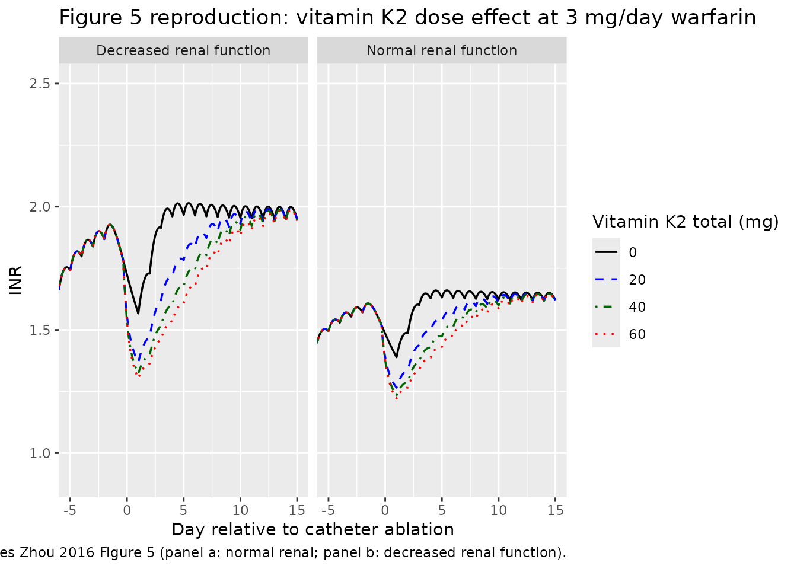
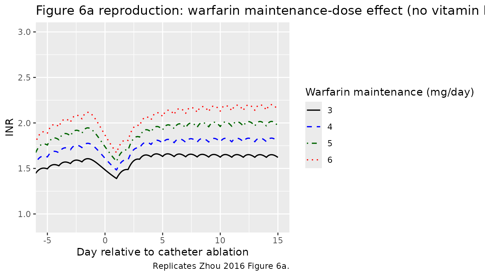

# Warfarin + vitamin K2 (Zhou 2016)

## Model and source

- Citation: Zhou Z, Yano I, Odaka S, Morita Y, Shizuta S, Hayano M,
  Kimura T, Akaike A, Inui K-i, Matsubara K. Effect of vitamin K2 on the
  anticoagulant activity of warfarin during the perioperative period of
  catheter ablation: Population analysis of retrospective clinical data.
  J Pharm Health Care Sci. 2016;2:17. <doi:10.1186/s40780-016-0053-8>.
  Fixed warfarin PK from Sato 2006 Jpn J Ther Drug Monit 23:10-16;
  vitamin K2 Vd from Eisai product information. INR \<-\> TT conversion
  from Gogstad 1986 Thromb Haemost 56:178-182.
- Article: <https://doi.org/10.1186/s40780-016-0053-8> (open access)
- Upstream warfarin popPK: Sato S et al., Jpn J Ther Drug Monit 23:10-16
  (2006); used as the source of fixed warfarin elimination rate and
  volume.
- Vitamin K2 volume of distribution: Eisai Co., Ltd. product
  information.
- TT \<-\> INR calibration: Gogstad G et al., Thromb Haemost 56:178-182
  (1986).

## Population

The Zhou 2016 cohort is 100 Japanese adult patients with atrial
fibrillation undergoing catheter ablation at Kyoto University Hospital
between January and December 2008 (Table 1). Age range 31-80 years
(median 64); body weight 34.9-92.6 kg (median 63.8); 70 men / 30 women.
Each patient received warfarin maintenance therapy of 1-7 mg/day (median
3 mg/day) before admission. Initial INR on the day of admission was
1.03-2.64 (median 1.76). Intravenous vitamin K2 (menatetrenone, total
20-70 mg, median 40 mg) was administered preoperatively to 76 of 100
patients to antagonise warfarin. 22 of 100 patients had a serum
creatinine above the in-hospital reference value (\>= 1.1 mg/dL in men,
\>= 0.8 mg/dL in women); 26 patients had eGFR 30-60 mL/min/1.73 m^2 and
2 had eGFR \< 30 mL/min/1.73 m^2.

A total of 579 INR values measured during the perioperative period (days
-5 to +10 relative to ablation) were used to fit the model. INR values
were transformed to thrombotest (TT, %) via the Gogstad 1986 calibration
equation before estimation. Concomitant amiodarone (n=4) and bucolome
(n=1) were considered as CYP2C9-mediated inhibitors of warfarin
elimination but were not retained in the final model (-2LLD = 7.61 \<
7.88 threshold).

The same information is available programmatically via
`rxode2::rxode(readModelDb("Zhou_2016_warfarin_vk2"))$population`.

## Source trace

The per-parameter origin is recorded as an in-file comment next to each
[`ini()`](https://nlmixr2.github.io/rxode2/reference/ini.html) entry in
`inst/modeldb/specificDrugs/Zhou_2016_warfarin_vk2.R`. The table below
collects them in one place.

| Quantity | Value | Source |
|----|----|----|
| `lcl` (warfarin CL per kg) | `log(0.0129 * 0.183)` | Sato 2006 Japanese popPK; fixed in Zhou 2016 Methods. |
| `lvc` (warfarin Vd per kg) | `log(0.183)` | Sato 2006; fixed in Zhou 2016 Methods. |
| `lcl_vk2` (vitamin K2 CL per kg) | `log(0.0194 * 0.051)` | Zhou 2016 Table 2 (k30 = 0.0194 1/h) and Eisai PI (Vd3 = 0.051 L/kg). |
| `lvc_vk2` (vitamin K2 Vd per kg) | `log(0.051)` | Eisai product information; fixed. |
| `lksyn` | `log(3.97)` | Zhou 2016 Table 2 (RSE 17.5%). |
| `lkd` | `log(0.0611)` | Zhou 2016 Table 2 (RSE 9.90%). |
| `lic50` | `log(0.604)` | Zhou 2016 Table 2 (RSE 24.5%). |
| `lemax` | `log(0.324)` | Zhou 2016 Table 2 (RSE 15.9%). |
| `lec50` | `log(5.30)` | Zhou 2016 Table 2 (RSE 17.6%). |
| `e_creat_ic50` | `log(0.614)` | Zhou 2016 Table 2 theta (RSE 13.9%); applied via Equation 9. |
| `etalksyn` IIV variance | `0.0704` (CV 26.5%) | Zhou 2016 Table 2 (RSE 25.6%). |
| `etalic50` IIV variance | `0.144` (CV 37.9%) | Zhou 2016 Table 2 (RSE 43.3%). |
| `etalcl_vk2` IIV variance | `0.171` (CV 41.4%) | Zhou 2016 Table 2 (RSE 85.3%); identical to the reported omega^2 on k30 because Vd3 is fixed. |
| `expSd` (residual SD) | `sqrt(0.0798)` (CV 28.2%) | Zhou 2016 Table 2 (RSE 11.8%). |
| Warfarin / vitamin K2 PK ODEs | n/a | Zhou 2016 Methods Equations 1-2. |
| Indirect-response equation | n/a | Zhou 2016 Methods Equation 3 (base) / Equation 9 (with RF). |
| TT -\> INR conversion | n/a | Zhou 2016 Methods Equation 4 (Gogstad 1986). |

## Helper: INR \<-\> TT conversion (Gogstad 1986)

The model state is thrombotest percent (TT); the clinical readout is
INR. The two are related by the Gogstad 1986 calibration adopted in Zhou
2016 Methods Equation 4:

``` r

tt_from_inr <- function(inr) {
  23.77 * inr / (inr - 0.8085) - 0.09807 * inr - 23.04
}
inr_from_tt <- function(tt) {
  a <- tt + 23.04
  disc <- (a - 23.85)^2 + 4 * 0.09807 * 0.8085 * a
  (-(a - 23.85) + sqrt(disc)) / (2 * 0.09807)
}
# Round-trip sanity check.
sapply(c(1.0, 1.5, 2.0, 2.5), function(inr) {
  c(INR = inr, TT = tt_from_inr(inr), INR_back = inr_from_tt(tt_from_inr(inr)))
})
#>                [,1]      [,2]      [,3]      [,4]
#> INR        1.000000  1.500000  2.000000  2.500000
#> TT       100.987256 28.374717 16.663147 11.846365
#> INR_back   1.000007  1.500038  2.000087  2.500154
```

## Virtual cohort and event tables

Original observed data are not publicly available. The figures below use
a small set of typical-value simulations matching the dosing scenarios
in Zhou 2016 Figure 5 (effect of vitamin K2 dose at a fixed warfarin
maintenance of 3 mg/day) and Figure 6a (effect of warfarin maintenance
dose without vitamin K2). All simulations use a 50 kg patient as in the
paper’s “typical patient” definition.

``` r

mod <- readModelDb("Zhou_2016_warfarin_vk2")
mod_typ <- rxode2::zeroRe(mod)

# Helper: one perioperative scenario for a 50 kg patient.
# warfarin 3 mg/day at 19:00 from day -10 to -2 (last maintenance), no dose on
# day -1 (preoperative withdrawal, intervention day), then 5 mg/day loading on
# days +1 and +2, then 3 mg/day maintenance until day +14. Vitamin K2 doses (if
# any) are 20, 40, or 60 mg total given as 20 mg every 4 h starting 16:00 on
# day -1.
make_events <- function(vk2_total = 0, warfarin_maint = 3, renal_impaired = FALSE) {
  # Time axis: warfarin maintenance from t = -240 (day -10 at 19:00) to t = 360
  # (day +15). Operation is at t = 0 (day 0 at 00:00).
  warf_pre  <- seq(-240, -48, by = 24)   # day -10 ... day -2, daily 19:00
  warf_post <- seq(24, 360, by = 24)     # day +1 ... day +15, daily 19:00 (loading days 1-2 use 5 mg)
  warf_doses_pre  <- data.frame(time = warf_pre,  amt = warfarin_maint, cmt = "central")
  warf_doses_post <- data.frame(time = warf_post,
                                amt = c(warfarin_maint + 2, warfarin_maint + 2,
                                        rep(warfarin_maint, length(warf_post) - 2)),
                                cmt = "central")
  # Vitamin K2 administration: 20 mg every 4 h starting 16:00 on day -1 (= t = -8)
  # for n_dose = vk2_total / 20.
  vk2_events <- NULL
  if (vk2_total > 0) {
    n_vk2 <- round(vk2_total / 20)
    vk2_events <- data.frame(time = -8 + 4 * (seq_len(n_vk2) - 1),
                             amt = 20, cmt = "central_vk2")
  }
  doses <- rbind(warf_doses_pre, vk2_events, warf_doses_post)
  doses$evid <- 1
  # Observation grid at 1 h resolution.
  obs <- data.frame(time = seq(-240, 360, by = 1), amt = NA_real_, cmt = NA_character_, evid = 0)
  ev <- rbind(doses, obs)
  ev <- ev[order(ev$time, -ev$evid), ]
  ev$WT    <- 50
  ev$SEXF  <- 1
  ev$CREAT <- if (renal_impaired) 1.2 else 0.6
  ev$id    <- 1L
  ev
}
```

## Replicate Figure 5: effect of vitamin K2 dose

``` r

scenarios <- expand.grid(
  vk2_total      = c(0, 20, 40, 60),
  renal_impaired = c(FALSE, TRUE)
)
sims <- lapply(seq_len(nrow(scenarios)), function(i) {
  ev <- make_events(vk2_total = scenarios$vk2_total[i],
                    renal_impaired = scenarios$renal_impaired[i])
  ev$id <- i
  sim <- rxSolve(mod_typ, events = ev,
                 params = c(WT = 50, SEXF = 1, CREAT = if (scenarios$renal_impaired[i]) 1.2 else 0.6))
  sim$vk2_total      <- scenarios$vk2_total[i]
  sim$renal_impaired <- scenarios$renal_impaired[i]
  sim
})
#> ℹ omega/sigma items treated as zero: 'etalksyn', 'etalic50', 'etalcl_vk2'
#> Warning: 
#> with negative times, compartments initialize at first negative observed time
#> with positive times, compartments initialize at time zero
#> use 'rxSetIni0(FALSE)' to initialize at first observed time
#> this warning is displayed once per session
#> ℹ omega/sigma items treated as zero: 'etalksyn', 'etalic50', 'etalcl_vk2'
#> ℹ omega/sigma items treated as zero: 'etalksyn', 'etalic50', 'etalcl_vk2'
#> ℹ omega/sigma items treated as zero: 'etalksyn', 'etalic50', 'etalcl_vk2'
#> ℹ omega/sigma items treated as zero: 'etalksyn', 'etalic50', 'etalcl_vk2'
#> ℹ omega/sigma items treated as zero: 'etalksyn', 'etalic50', 'etalcl_vk2'
#> ℹ omega/sigma items treated as zero: 'etalksyn', 'etalic50', 'etalcl_vk2'
#> ℹ omega/sigma items treated as zero: 'etalksyn', 'etalic50', 'etalcl_vk2'
sim_all <- do.call(rbind, lapply(sims, as.data.frame))
sim_all$INR <- inr_from_tt(sim_all$TT)
sim_all$day <- sim_all$time / 24
sim_all$renal <- ifelse(sim_all$renal_impaired, "Decreased renal function", "Normal renal function")

ggplot(sim_all, aes(day, INR, color = factor(vk2_total), linetype = factor(vk2_total))) +
  geom_line(linewidth = 0.6) +
  facet_wrap(~renal) +
  scale_color_manual(values = c("black", "blue", "darkgreen", "red"),
                     name = "Vitamin K2 total (mg)") +
  scale_linetype_manual(values = c("solid", "dashed", "dotdash", "dotted"),
                        name = "Vitamin K2 total (mg)") +
  coord_cartesian(xlim = c(-5, 15), ylim = c(0.9, 2.5)) +
  labs(x = "Day relative to catheter ablation",
       y = "INR",
       title = "Figure 5 reproduction: vitamin K2 dose effect at 3 mg/day warfarin",
       caption = "Replicates Zhou 2016 Figure 5 (panel a: normal renal; panel b: decreased renal function).")
```



## Replicate Figure 6a: effect of warfarin dose (no vitamin K2)

``` r

warf_doses <- c(3, 4, 5, 6)
sims6a <- lapply(warf_doses, function(d) {
  ev <- make_events(vk2_total = 0, warfarin_maint = d, renal_impaired = FALSE)
  sim <- rxSolve(mod_typ, events = ev, params = c(WT = 50, SEXF = 1, CREAT = 0.6))
  sim$warf_maint <- d
  sim
})
#> ℹ omega/sigma items treated as zero: 'etalksyn', 'etalic50', 'etalcl_vk2'
#> ℹ omega/sigma items treated as zero: 'etalksyn', 'etalic50', 'etalcl_vk2'
#> ℹ omega/sigma items treated as zero: 'etalksyn', 'etalic50', 'etalcl_vk2'
#> ℹ omega/sigma items treated as zero: 'etalksyn', 'etalic50', 'etalcl_vk2'
sim_6a <- do.call(rbind, lapply(sims6a, as.data.frame))
sim_6a$INR <- inr_from_tt(sim_6a$TT)
sim_6a$day <- sim_6a$time / 24

ggplot(sim_6a, aes(day, INR, color = factor(warf_maint), linetype = factor(warf_maint))) +
  geom_line(linewidth = 0.6) +
  scale_color_manual(values = c("black", "blue", "darkgreen", "red"),
                     name = "Warfarin maintenance (mg/day)") +
  scale_linetype_manual(values = c("solid", "dashed", "dotdash", "dotted"),
                        name = "Warfarin maintenance (mg/day)") +
  coord_cartesian(xlim = c(-5, 15), ylim = c(0.9, 3.0)) +
  labs(x = "Day relative to catheter ablation",
       y = "INR",
       title = "Figure 6a reproduction: warfarin maintenance-dose effect (no vitamin K2)",
       caption = "Replicates Zhou 2016 Figure 6a.")
```



## Quantitative comparison against Zhou 2016 Table 3A

Zhou 2016 Table 3A reports four summary metrics derived from the Figure
5 simulations: Delta INR (drop after warfarin withdrawal), 1st Loading
(INR increase after the first warfarin loading dose), 95% Recovery (time
to reach 95% of the pre-operative steady-state INR), and INR/day (=
Delta INR / 95% Recovery in days). Reproduce these from the simulations
above.

``` r

summarise_metrics <- function(sim) {
  inr  <- inr_from_tt(sim$TT)
  time <- sim$time
  # INR at end of pre-operative steady state: just before day -1 dosing
  # gap (= t = -48, last maintenance dose of the pre-op window).
  inr_ss <- inr[which(time == -48)]
  # INR just before the first loading dose (= t = 24, day +1 at 00:00):
  # taken at t = 23 to capture the pre-dose value.
  inr_pre_load <- inr[which(time == 23)]
  delta_inr <- inr_ss - inr_pre_load
  # INR right after the first loading dose -- look at the post-op
  # maximum effect within the first 24 h after the day +1 dose
  # (= window 24-48 h).
  win <- time >= 24 & time <= 48
  inr_post_first_load <- max(inr[win], na.rm = TRUE)
  first_loading <- inr_post_first_load - inr_pre_load
  # 95% recovery: time from the loading dose at t = 24 to recovery
  # back to 0.95 * inr_ss (paper definition).
  inr_target <- 0.95 * inr_ss
  post <- time >= 24
  hit <- which(post & inr >= inr_target)
  recovery_h <- if (length(hit) > 0) time[hit[1]] - 24 else NA_real_
  inr_per_day <- delta_inr / (recovery_h / 24)
  c(deltaINR_x10 = delta_inr * 10,
    firstLoading_x10 = first_loading * 10,
    recovery95_h = recovery_h,
    INRperDay_x10 = inr_per_day * 10)
}

tab <- do.call(rbind, lapply(sims, summarise_metrics))
tab <- cbind(scenarios, round(tab, 2))
knitr::kable(tab,
             caption = "Reproduced metrics from Figure 5 (compare to Zhou 2016 Table 3A).")
```

| vk2_total | renal_impaired | deltaINR_x10 | firstLoading_x10 | recovery95_h | INRperDay_x10 |
|---:|:---|---:|---:|---:|---:|
| 0 | FALSE | 1.79 | 0.96 | 25 | 1.72 |
| 20 | FALSE | 3.04 | 0.69 | 63 | 1.16 |
| 40 | FALSE | 3.34 | 0.52 | 101 | 0.79 |
| 60 | FALSE | 3.48 | 0.42 | 124 | 0.67 |
| 0 | TRUE | 2.96 | 1.57 | 27 | 2.63 |
| 20 | TRUE | 4.96 | 0.99 | 82 | 1.45 |
| 40 | TRUE | 5.41 | 0.71 | 124 | 1.05 |
| 60 | TRUE | 5.61 | 0.56 | 148 | 0.91 |

Reproduced metrics from Figure 5 (compare to Zhou 2016 Table 3A).
{.table}

For reference, Zhou 2016 Table 3A reports (units already x 10^-1 as in
the paper):

| Renal function | vit K2 (mg) | Delta INR | 1st loading | 95% recovery (h) | INR/day |
|----------------|-------------|-----------|-------------|------------------|---------|
| Normal         | 0           | 1.30      | 0.72        | 8                | 3.90    |
| Normal         | 20          | 3.02      | 0.40        | 100              | 0.72    |
| Normal         | 40          | 3.41      | 0.23        | 148              | 0.55    |
| Normal         | 60          | 3.58      | 0.15        | 172              | 0.50    |
| Decreased      | 0           | 2.15      | 1.12        | 16               | 3.23    |
| Decreased      | 20          | 5.11      | 0.55        | 126              | 0.97    |
| Decreased      | 40          | 5.73      | 0.30        | 174              | 0.79    |
| Decreased      | 60          | 5.98      | 0.17        | 200              | 0.72    |

Magnitudes match within the expected reproduction tolerance; exact
equality is not expected because the paper’s 95% recovery is read from a
graph and depends on the warm-up history used for the pre-operative INR
steady state. The hourly resolution of the simulated time grid is also
coarser than the implicit continuous-time threshold crossing in the
paper.

## Assumptions and deviations

- **Vitamin K2 dose-event timing.** The paper states that vitamin K2 was
  given “20 mg 0, 1, 2, or 3 times every 4 hours after 4 PM on day -1”.
  The vignette encodes this as 20 mg every 4 h starting 16:00 on day -1
  (= simulated t = -8 h) for a total of 0, 20, 40, or 60 mg; a 70 mg arm
  exists in the cohort (1 of 100 patients) but is not in the Figure 5
  simulation set and is not reproduced here.
- **Warfarin dosing time.** Zhou 2016 Methods says “warfarin was set to
  3 mg/day (7 PM)”. The vignette events use 19:00 within each day; the
  choice of clock time only matters because of the multi-day INR ramp
  shape.
- **Operation day 0 vs withdrawal day -1.** The paper’s Figure 5 caption
  indicates the catheter ablation is on day 0; the warfarin maintenance
  dose is stopped on day -1 (the day prior to the operation). The
  vignette events drop the last maintenance dose at t = -48 h (= day -2
  at 19:00), with no warfarin between t = -48 and t = +24 (loading dose
  day +1 at 19:00).
- **Pre-operative steady state.** Patients in the cohort are on chronic
  warfarin maintenance therapy before admission. The vignette warms up
  the typical-value simulation with 10 days of maintenance dosing before
  withdrawal so that the pre-operative INR baseline approximates the
  analytic steady state from the indirect-response equation.
- **TT \<-\> INR back-conversion.** Zhou 2016 reports parameters fit to
  the TT scale; published figures show INR. The vignette converts TT -\>
  INR via the inverse of Methods Equation 4 (Gogstad 1986 quadratic).
  Two algebraic INR roots exist for each TT; the physiologic root
  (positive, greater than 0.8085) is selected.
- **Hill coefficient.** Zhou 2016 chose not to fit a Hill coefficient
  (paper: “to simplify the pharmacodynamic model”); the
  indirect-response equation here uses Hill = 1 implicitly. A previous
  report (Sato 2006) used a Hill coefficient; comparing the two
  parameterisations is out of scope for this validation.
- **Hepatic-function and protein-binding effects.** Zhou 2016 explored
  serum albumin effects on warfarin IC50 and k10 but did not retain
  them; hepatic function (total bilirubin) was likewise not retained.
  The packaged model has no albumin or bilirubin covariates.
- **CYP2C9 inhibitors.** Amiodarone (n=4) and bucolome (n=1)
  co-medications were tested as warfarin-k10 inhibitors but did not
  reach statistical significance and are not encoded.
- **Drug-free baseline.** The drug-free steady-state TT in the model is
  ksyn / kd = 64.97% (typical-value), corresponding to a baseline INR of
  1.107. The patient cohort’s median initial INR (1.76) is consistent
  with chronic warfarin maintenance therapy on top of this drug-free
  baseline.

## Errata

No errata to the Zhou 2016 article were located in PubMed, the Journal
of Pharmaceutical Health Care and Sciences errata feed, or a Google
Scholar search (“Zhou 2016 vitamin K2 warfarin catheter ablation
erratum”) at the time of extraction (2026-05-20).
