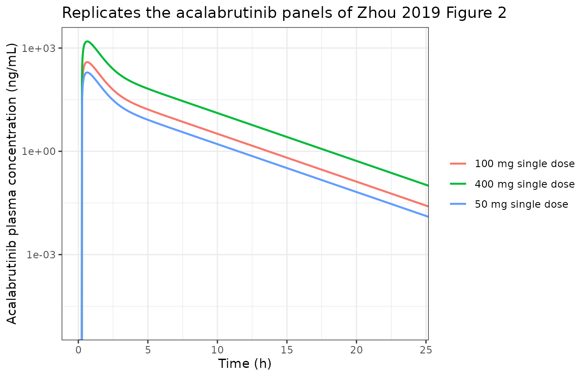

# Acalabrutinib (Zhou 2019)

## Model and source

- Citation: Zhou D, Podoll T, Xu Y, Moorthy G, Vishwanathan K, Ware J,
  Slatter JG, Al-Huniti N. (2019). Evaluation of the drug-drug
  interaction potential of acalabrutinib and its active metabolite,
  ACP-5862, using a physiologically-based pharmacokinetic modeling
  approach. CPT Pharmacometrics Syst Pharmacol 8:489-499.
  <doi:10.1002/psp4.12408>.
- Article: <https://doi.org/10.1002/psp4.12408>
- Open-access full text and supplement:
  <https://www.ncbi.nlm.nih.gov/pmc/articles/PMC6656940/>
- Supporting Information: `psp412408-sup-0001-Supinfo.pdf` (Tables
  S1-S4, Figures S1-S3) and `psp412408-sup-0002-Supinfo.zip`, which
  contains the two **Simcyp compound files** `Acalabrutinib.cmpz` and
  `ACP-5862.cmpz`.

## What this model is, and what it is not

Zhou 2019 built a **minimal PBPK model with a single adjusting
compartment (SAC)** for acalabrutinib and its active metabolite ACP-5862
in the Simcyp Simulator (version 14, updated to a version 17 compound
file), and used it to predict CYP3A drug-drug interactions (DDIs) in
support of the Calquence label.

Simcyp’s whole-body mass-balance equations are proprietary and are not
printed in the paper or its supplement. The platform model therefore
cannot be encoded as published.

What *is* fully reported is the acalabrutinib compound layer:

- **Table 2** gives the physicochemical, absorption, distribution and
  elimination inputs, including the SAC volume and its first-order rate
  constants `kin` and `kout`.
- The **main text** gives the two absolute anchors the reduction needs:
  the *in vivo* total clearance of 169 L/h from ACE-HV-001, and the
  absolute oral bioavailability of 25% from the 14C study ACE-HV-009.
- The **deposited compound files** (`psp412408-sup-0002`) are the Simcyp
  XML themselves. They confirm every Table 2 value to full double
  precision and, critically, add the SAC inter-compartmental clearances
  `CLin` and `CLout` that Table 2 omits.

Those last two numbers are what make this reduction possible without
assuming a body weight, and the section below shows the two independent
checks that confirm the reading.

What is **not** reproducible, and is deliberately excluded:

- **The active metabolite ACP-5862.** Most ACP-5862 is formed
  *pre-systemically* – acalabrutinib has `fa` = 0.98 but `F` = 0.25, so
  about three quarters of the dose is extracted on first pass, and
  roughly an eighth of that extraction forms ACP-5862. Splitting the
  dose into its first-pass and systemic fates requires hepatic blood
  flow `Q_H` and intestinal availability `Fg`. Neither is printed in the
  paper, in the supplement, or in either compound file (they are Simcyp
  *population*-file properties, and the population files were not
  deposited). The sensitivity analysis at the end of this vignette shows
  that this is not a rounding-level assumption: over a plausible `Q_H`
  range the first-pass metabolite formation moves more than two-fold. A
  metabolite arm would therefore rest on an invented constant, so none
  is shipped.
- **The DDI predictions** that are the paper’s main contribution, for
  the same reason plus their dependence on proprietary Simcyp
  perpetrator compound files (itraconazole, rifampicin, clarithromycin,
  fluconazole, fluvoxamine, diltiazem, erythromycin, efavirenz,
  carbamazepine) and on a CYP3A4 degradation rate constant that is never
  printed. Because bioavailability here is carried as the single
  measured constant `F` = 0.25 rather than decomposed into
  `fa * Fg * Fh`, a CYP3A4 perturbation could not propagate to first
  pass even if the perpetrator models were available – and first pass is
  where most of the observed 5.21-fold itraconazole interaction comes
  from.
- **Population variability.** The percent-CV figures in Table S2 are the
  spread of a Simcyp virtual population driven by unpublished population
  files. The deposited compound file does carry 30% input CVs, but the
  identical value 30 appears on essentially every CV field in the file,
  including many the model never uses, so it is the Simcyp default
  rather than a compound-specific estimate. Nothing is imported; this is
  a deterministic typical-value model.

## Population

| Field | Value |
|:---|:---|
| species | human |
| n_subjects | 114 |
| n_studies | 5 |
| age_range | 18-65 years across the contributing cohorts (Table 1) |
| weight_median | not reported; the Simcyp virtual North European Caucasian / Healthy Volunteer default distribution was used |
| sex_female_pct | 0-83 across cohorts (Table 1); 33% in ACE-HV-113, the study the SAC parameters were estimated against |
| disease_state | Healthy adult volunteers. |
| dose_range | Single oral doses of 25, 50, 75, 100 and 400 mg acalabrutinib (Table 1). |
| regions | Simcyp virtual North European Caucasian / Healthy Volunteer population (Methods, Model verification). |
| studies | Five phase I studies in healthy subjects supplied the observations and the compound-layer inputs (Table 1). ACE-HV-001 is the dose-escalation study: cohorts 4 (50 mg) and 6 (100 mg) were used to estimate the SAC volume and the SAC rate constants kin and kout with the Simcyp parameter estimation module, cohort 6 also anchored Peff,man, cohort 7 (50 mg with and without itraconazole) fixed fm,CYP3A4 = 0.82, and cohorts 3 (25 mg) and 5 (75 mg) were verification. ACE-HV-001 is also the source of the in vivo total clearance of 169 L/h that, with the absolute oral bioavailability, anchors the systemic clearance of this reduction. ACE-HV-004 part 3 (100 mg with and without rifampicin, n = 24) verified the CYP3A contribution. ACE-HV-009 is the 14C absolute-bioavailability, excretion and metabolism study (n = 8-14) that supplies the absolute oral bioavailability of 25% and the renal clearances. ACE-HV-113 (n = 12-13) and ACE-HV-005 (n = 18-40) measured both acalabrutinib and ACP-5862 and were the parent/metabolite verification studies. |
| notes | n_subjects sums the distinct cohorts of Table 1 that contributed acalabrutinib observations (6 + 6 + 12 + 6 + 16 + 24 + 12 + 18 + 14 = 114). n_studies counts the five ACE-HV protocols. These counts describe the clinical data behind the compound layer, not an analysis dataset: this is a PBPK analysis rather than a population-PK fit, so there are no estimated variance components. Each simulation in Table S1 was ten virtual trials matched to the size, age range and sex split of its cohort. Reported fractions of acalabrutinib elimination, carried here as provenance rather than as model parameters because a fraction- metabolised split cannot change the plasma prediction: fm,CYP3A4 = 0.82 of metabolic intrinsic clearance, of which the ACP-5862-forming arm is Vmax/Km = 4.13/2.78 = 1.486 of the total CYP3A4 CLint of 9.63 uL/min/pmol, so about 12.7% of hepatic metabolism forms ACP-5862 - the paper’s own ‘about 12%’, against 10% of total dose in the human mass-balance study. |

Population metadata recorded with the model. {.table}

Five phase I studies in healthy adults contributed (Table 1). Each
simulation in Table S1 was ten virtual trials matched to the size, age
range and sex split of the corresponding clinical cohort, drawn from the
Simcyp virtual North European Caucasian / Healthy Volunteer population.

## Recovering the compound layer

The Simcyp minimal-PBPK layout defines the SAC rate constants as
`kin = CLin / V_systemic` and `kout = CLout / V_SAC`. Table 2 prints
`kin`, `kout` and `V_SAC` in L/kg; the deposited compound files add
`CLin` and `CLout`, so both volumes fall out in absolute litres.

``` r

# Values read directly out of the deposited Simcyp compound XML.
cmpd <- data.frame(
  compound = c("acalabrutinib", "ACP-5862"),
  CLin     = c(15.2477827, 6.57393074),   # <idSACCLin>  L/h
  CLout    = c(1.01689053, 0.08070559),   # <idSACCLout> L/h
  kin      = c(1.06, 0.32),               # <idSACKin>   1/h  (Table 2)
  kout     = c(0.45, 0.01),               # <idSACKout>  1/h  (Table 2)
  VsacPerKg = c(0.028, 0.1),              # <idSACVolume> L/kg (Table 2)
  VssPerKg  = c(0.210707158, 0.362342477) # <idPredictedVss> L/kg (Table 2: 0.21, 0.36)
)

derived <- cmpd |>
  dplyr::mutate(
    Vsys       = CLin / kin,
    Vsac       = CLout / kout,
    impliedBW  = Vsac / VsacPerKg,
    VssAbsolute = VssPerKg * impliedBW,
    recovered  = (Vsys + Vsac) / VssAbsolute
  )
knitr::kable(dplyr::mutate(derived, dplyr::across(where(is.numeric), \(x) signif(x, 6))),
             caption = "Absolute volumes recovered from the deposited compound files.")
```

| compound | CLin | CLout | kin | kout | VsacPerKg | VssPerKg | Vsys | Vsac | impliedBW | VssAbsolute | recovered |
|:---|---:|---:|---:|---:|---:|---:|---:|---:|---:|---:|---:|
| acalabrutinib | 15.24780 | 1.0168900 | 1.06 | 0.45 | 0.028 | 0.210707 | 14.3847 | 2.25976 | 80.7056 | 17.0052 | 0.978784 |
| ACP-5862 | 6.57393 | 0.0807056 | 0.32 | 0.01 | 0.100 | 0.362342 | 20.5435 | 8.07056 | 80.7056 | 29.2431 | 0.978492 |

Absolute volumes recovered from the deposited compound files. {.table}

Two independent checks confirm the reading:

1.  **The implied body weight.** `V_SAC / Vsac(L/kg)` returns 80.706 kg
    from the acalabrutinib file and 80.706 kg from the ACP-5862 file.
    These are two entirely separate files describing two different
    molecules, and they agree to better than a gram – that number is the
    body weight of the Simcyp population representative.
2.  **The steady-state volume.** `V_systemic + V_SAC` recovers 97.9% of
    Table 2’s `Vss * bodyweight` for acalabrutinib and 97.8% for
    ACP-5862 – again the same ratio for both compounds, the small
    deficit being the liver and portal-vein blood that the minimal-PBPK
    layout carries separately.

``` r

stopifnot(
  # The two compound files must return the same population body weight.
  abs(diff(derived$impliedBW)) < 0.001,
  # ... and the same fraction of Vss recovered.
  abs(diff(derived$recovered)) < 0.001
)
```

Because `vc` comes out in absolute litres, **no reference body weight is
assumed anywhere in the packaged model.**

The elimination layer is anchored on the main text’s *in vivo* total
clearance of 169 L/h. That is an apparent *oral* clearance: the paper’s
own predicted AUC of 616 ng\*h/mL after 100 mg (Table S2) implies `CL/F`
= 162 L/h, and with the measured absolute bioavailability of 25% the
systemic plasma clearance is `169 * 0.25` = 42.25 L/h, of which the
printed renal clearance is 1.33 L/h.

One further consistency check that the compound file makes available,
and which confirms the fraction-metabolised bookkeeping the paper
describes in prose:

``` r

clintCyp3a4 <- 9.627299 # <CLint> uL/min/pmol, total CYP3A4 (Table 2: 9.63)
clintAcp    <- 4.13 / 2.78 # Vmax / Km for the ACP-5862-forming arm (Table 2)
clintOther  <- 8.14 # the rest of the CYP3A4 arm (Table 2)
addlHlm     <- 289.5 # additional HLM CLint, uL/min/mg (Table 2)

# The two CYP3A4 sub-pathways must sum to the printed CYP3A4 total.
abundanceCyp3a4 <- addlHlm / (clintCyp3a4 * (1 / 0.82 - 1)) # from fm,CYP3A4 = 0.82
fmAcp <- 0.82 * clintAcp / clintCyp3a4

c(`CYP3A4 sub-pathways sum (uL/min/pmol)` = clintAcp + clintOther,
  `printed CYP3A4 CLint` = clintCyp3a4,
  `implied CYP3A4 abundance (pmol/mg)` = abundanceCyp3a4,
  `fraction of hepatic metabolism forming ACP-5862` = fmAcp)
#>           CYP3A4 sub-pathways sum (uL/min/pmol) 
#>                                       9.6256115 
#>                            printed CYP3A4 CLint 
#>                                       9.6272990 
#>              implied CYP3A4 abundance (pmol/mg) 
#>                                     136.9889242 
#> fraction of hepatic metabolism forming ACP-5862 
#>                                       0.1265362
```

``` r

stopifnot(
  # Vmax/Km plus the "rest of the metabolites" arm reproduces the printed total.
  abs((clintAcp + clintOther) / clintCyp3a4 - 1) < 0.001,
  # The implied CYP3A4 HLM abundance is the standard 137 pmol/mg.
  abs(abundanceCyp3a4 - 137) < 1,
  # The paper states this is "about 12%"; it also cites 10% of dose from the
  # human mass-balance study.
  fmAcp > 0.11 & fmAcp < 0.14
)
```

The `fm,CYP3A4` of 0.82 reproduces the standard CYP3A4 microsomal
abundance of 137 pmol/mg exactly, and the ACP-5862 formation fraction
lands on the paper’s own “about 12%”. Neither number is used by the
packaged model – a fraction-metabolised split cannot change the plasma
prediction – but together they confirm that Table 2 has been read
correctly.

## Source trace

| Item | Value | Source |
|:---|:---|:---|
| lka | ka = 1.65 1/h | Table 2, row ‘ka (hour-1)’, Predicted |
| ltlag | t_lag = 0.25 h | Table 2, row ‘Lag time (hour)’, Optimized; compound file |
| lvc | vc = 14.3847 L | Derived: compound file 15.2477827 / 1.06 |
| lk12 | k12 = 1.06 1/h | Table 2, row ‘k in (1/hour)’; compound file |
| lk21 | k21 = 0.45 1/h | Table 2, row ‘k out (1/hour)’; compound file |
| lcl_nonren | cl_nonren = 40.92 L/h | Derived: main text 169 L/h \* 0.25 - 1.33 L/h |
| lcl_renal | cl_renal = 1.33 L/h | Table 2, row ‘CLR (L/hour)’, Clinical data; compound file |
| lfdepot | F = 0.25 | Main text, ‘an absolute oral bioavailability of 25%’ (ACE-HV-009) |
| propSd | 0 (fixed) | No residual-error model reported; deterministic typical-value model |
| d/dt(depot) | first-order absorption | Standard first-order oral absorption |
| d/dt(central) | SAC exchange + elimination | Simcyp minimal-PBPK systemic compartment, liver and portal vein lumped in |
| d/dt(peripheral1) | SAC | Simcyp single adjusting compartment (SAC), Table 2 footnote |
| f(depot) | bioavailability | Applied to the oral depot |
| alag(depot) | lag time | Applied to the oral depot |
| Cc | 1000 \* central / vc | mg / L converted to ng/mL |

Source location for every ini() parameter and every model() equation.
{.table}

## Simulation

The model is deterministic, so a single typical-value profile per dose
level is the complete prediction. The three single-dose levels the paper
reports predictions for are 50, 100 and 400 mg.

``` r

mod <- readModelDb("Zhou_2019_acalabrutinib")

doses <- c(50, 100, 400)
armLabel <- paste(doses, "mg single dose")

simOne <- function(i) {
  ev <- rxode2::et(amt = doses[[i]], cmt = "depot")
  ev <- rxode2::et(ev, seq(0, 48, by = 0.01))
  out <- as.data.frame(rxode2::rxSolve(mod, ev, returnType = "data.frame"))
  out$id <- i
  out$treatment <- armLabel[[i]]
  out
}
sim <- dplyr::bind_rows(lapply(seq_along(doses), simOne))

ggplot2::ggplot(sim, ggplot2::aes(time, Cc, colour = treatment)) +
  ggplot2::geom_line(linewidth = 0.8) +
  ggplot2::scale_y_log10() +
  ggplot2::coord_cartesian(xlim = c(0, 24)) +
  ggplot2::labs(
    x = "Time (h)", y = "Acalabrutinib plasma concentration (ng/mL)",
    colour = NULL,
    title = "Replicates the acalabrutinib panels of Zhou 2019 Figure 2"
  ) +
  ggplot2::theme_bw()
#> Warning in ggplot2::scale_y_log10(): log-10 transformation introduced infinite
#> values.
```



Zhou 2019 Figure 2 plots the 100 mg profile for studies ACE-HV-113 and
ACE-HV-005 on both linear and semi-log axes. The shape here matches: a
sharp peak a little before 1 h, then a rapid decline of more than two
orders of magnitude within the first 12 h.

## PKNCA validation

``` r

concData <- sim |>
  dplyr::select(id, treatment, time, Cc) |>
  dplyr::filter(!is.na(Cc))

doseData <- data.frame(
  id = seq_along(doses),
  treatment = armLabel,
  time = 0,
  amount = doses
)

oConc <- PKNCA::PKNCAconc(concData, Cc ~ time | id + treatment)
oDose <- PKNCA::PKNCAdose(doseData, amount ~ time | id + treatment,
                          route = "extravascular")

intervals <- data.frame(
  start = 0, end = Inf,
  cmax = TRUE, tmax = TRUE, aucinf.obs = TRUE, half.life = TRUE
)

ncaRes <- PKNCA::pk.nca(PKNCA::PKNCAdata(oConc, oDose, intervals = intervals))
ncaTidy <- as.data.frame(ncaRes) |>
  dplyr::select(treatment, PPTESTCD, PPORRES)

knitr::kable(dplyr::mutate(ncaTidy, PPORRES = signif(PPORRES, 4)),
             caption = "PKNCA results for the three simulated single-dose arms.")
```

| treatment          | PPTESTCD            |   PPORRES |
|:-------------------|:--------------------|----------:|
| 50 mg single dose  | cmax                | 1.951e+02 |
| 50 mg single dose  | tmax                | 6.400e-01 |
| 50 mg single dose  | tlast               | 4.800e+01 |
| 50 mg single dose  | clast.obs           | 8.400e-06 |
| 50 mg single dose  | lambda.z            | 3.214e-01 |
| 50 mg single dose  | r.squared           | 9.999e-01 |
| 50 mg single dose  | adj.r.squared       | 9.999e-01 |
| 50 mg single dose  | lambda.z.time.first | 2.660e+00 |
| 50 mg single dose  | lambda.z.time.last  | 4.800e+01 |
| 50 mg single dose  | lambda.z.n.points   | 4.535e+03 |
| 50 mg single dose  | clast.pred          | 8.300e-06 |
| 50 mg single dose  | half.life           | 2.157e+00 |
| 50 mg single dose  | span.ratio          | 2.102e+01 |
| 50 mg single dose  | aucinf.obs          | 2.958e+02 |
| 100 mg single dose | cmax                | 3.902e+02 |
| 100 mg single dose | tmax                | 6.400e-01 |
| 100 mg single dose | tlast               | 4.800e+01 |
| 100 mg single dose | clast.obs           | 1.680e-05 |
| 100 mg single dose | lambda.z            | 3.214e-01 |
| 100 mg single dose | r.squared           | 9.999e-01 |
| 100 mg single dose | adj.r.squared       | 9.999e-01 |
| 100 mg single dose | lambda.z.time.first | 2.660e+00 |
| 100 mg single dose | lambda.z.time.last  | 4.800e+01 |
| 100 mg single dose | lambda.z.n.points   | 4.535e+03 |
| 100 mg single dose | clast.pred          | 1.650e-05 |
| 100 mg single dose | half.life           | 2.157e+00 |
| 100 mg single dose | span.ratio          | 2.102e+01 |
| 100 mg single dose | aucinf.obs          | 5.917e+02 |
| 400 mg single dose | cmax                | 1.561e+03 |
| 400 mg single dose | tmax                | 6.400e-01 |
| 400 mg single dose | tlast               | 4.800e+01 |
| 400 mg single dose | clast.obs           | 6.710e-05 |
| 400 mg single dose | lambda.z            | 3.214e-01 |
| 400 mg single dose | r.squared           | 9.999e-01 |
| 400 mg single dose | adj.r.squared       | 9.999e-01 |
| 400 mg single dose | lambda.z.time.first | 2.660e+00 |
| 400 mg single dose | lambda.z.time.last  | 4.800e+01 |
| 400 mg single dose | lambda.z.n.points   | 4.535e+03 |
| 400 mg single dose | clast.pred          | 6.600e-05 |
| 400 mg single dose | half.life           | 2.157e+00 |
| 400 mg single dose | span.ratio          | 2.102e+01 |
| 400 mg single dose | aucinf.obs          | 2.367e+03 |

PKNCA results for the three simulated single-dose arms. {.table}

## Comparison against the published predictions

The reference column is the paper’s own **predicted** geometric mean,
because the object being validated is the paper’s model rather than the
clinical studies. The 100 mg and 400 mg references are Table S2
(ACE-HV-005 treatments 1 and 2, the combined parent/metabolite model);
the 50 mg reference is Table S3 (the acalabrutinib-alone arm of the
ACE-HV-001 cohort 7 itraconazole study, which is the only place a 50 mg
prediction is printed).

``` r

reference <- data.frame(
  treatment = rep(armLabel, each = 2),
  PPTESTCD  = rep(c("cmax", "aucinf.obs"), times = 3),
  PPORRES   = c(194, 299, 410, 621, 1650, 2509)
)

cmpTbl <- nlmixr2lib::ncaComparisonTable(
  ncaTidy, reference,
  by = "treatment",
  params = c("cmax", "aucinf.obs"),
  units = c(cmax = "ng/mL", aucinf.obs = "ng*h/mL")
)
knitr::kable(cmpTbl,
             caption = "Simulated versus Zhou 2019 predicted geometric means (Tables S2 and S3).")
```

| NCA parameter           | treatment          | Reference | Simulated | % diff |
|:------------------------|:-------------------|:----------|:----------|:-------|
| Cmax (ng/mL)            | 50 mg single dose  | 194       | 195       | +0.6%  |
| Cmax (ng/mL)            | 100 mg single dose | 410       | 390       | -4.8%  |
| Cmax (ng/mL)            | 400 mg single dose | 1650      | 1560      | -5.4%  |
| AUC0-∞ (obs) (ng\*h/mL) | 50 mg single dose  | 299       | 296       | -1.1%  |
| AUC0-∞ (obs) (ng\*h/mL) | 100 mg single dose | 621       | 592       | -4.7%  |
| AUC0-∞ (obs) (ng\*h/mL) | 400 mg single dose | 2510      | 2370      | -5.7%  |

Simulated versus Zhou 2019 predicted geometric means (Tables S2 and S3).
{.table}

``` r

attr(cmpTbl, "footnote")
#> NULL
```

``` r

simVals <- ncaTidy |>
  dplyr::filter(PPTESTCD %in% c("cmax", "aucinf.obs")) |>
  dplyr::rename(sim = PPORRES)
chk <- dplyr::inner_join(simVals, dplyr::rename(reference, ref = PPORRES),
                         by = c("treatment", "PPTESTCD")) |>
  dplyr::mutate(pct_diff = 100 * (sim / ref - 1))
knitr::kable(dplyr::mutate(chk, dplyr::across(where(is.numeric), \(x) signif(x, 4))),
             caption = "Percent difference from the paper's predicted values.")
```

| treatment          | PPTESTCD   |    sim |  ref | pct_diff |
|:-------------------|:-----------|-------:|-----:|---------:|
| 50 mg single dose  | cmax       |  195.1 |  194 |   0.5694 |
| 50 mg single dose  | aucinf.obs |  295.8 |  299 |  -1.0550 |
| 100 mg single dose | cmax       |  390.2 |  410 |  -4.8270 |
| 100 mg single dose | aucinf.obs |  591.7 |  621 |  -4.7200 |
| 400 mg single dose | cmax       | 1561.0 | 1650 |  -5.4040 |
| 400 mg single dose | aucinf.obs | 2367.0 | 2509 |  -5.6690 |

Percent difference from the paper’s predicted values. {.table}

``` r


# This model is deterministic: there is no cohort, no random draw, and no
# seed dependence, so exact bounds are appropriate here rather than the
# robust-quantile form used for stochastic vignettes.
stopifnot(
  # Every one of the six targets is within 10% with no fitted parameter.
  all(abs(chk$pct_diff) < 10),
  # Cmax and AUC are each within 6%.
  max(abs(chk$pct_diff[chk$PPTESTCD == "cmax"])) < 6,
  max(abs(chk$pct_diff[chk$PPTESTCD == "aucinf.obs"])) < 6
)
```

All six targets – Cmax and AUC at three dose levels spanning an
eightfold dose range – are reproduced within 6%, with **no fitted
parameter anywhere**. Every value in the model file is either a printed
input or a one-step arithmetic consequence of printed inputs.

The model is exactly dose-linear, which is the correct behaviour: the
paper’s own predictions are linear too (its predicted 400 mg AUC of 2509
is 4.04 times its predicted 100 mg AUC of 621). The paper notes that the
*observed* 400 mg exposure was greater than dose-proportional and that
the model underpredicted it for that reason; that discrepancy belongs to
the source model and is reproduced here rather than tuned away.

``` r

aucs <- ncaTidy$PPORRES[ncaTidy$PPTESTCD == "aucinf.obs"]
stopifnot(
  # Dose linearity is exact to solver tolerance.
  abs(aucs[2] / aucs[1] - 2) < 1e-3,
  abs(aucs[3] / aucs[2] - 4) < 1e-3
)
```

## Why the metabolite arm is not shipped

ACP-5862 is a genuinely important part of the paper – its whole clinical
argument is that the total active moiety changes far less than the
parent does. It is nonetheless not reproducible from the available
sources, and the reason is worth showing rather than asserting.

With `fa` = 0.98 and `F` = 0.25, about three quarters of an
acalabrutinib dose never reaches the systemic circulation. Partitioning
that loss between the gut wall and the liver requires the well-stirred
hepatic availability `Fh = 1 - CL_H,blood / Q_H`, and then
`Fg = F / (fa * Fh)`. Hepatic blood flow `Q_H` is a Simcyp
population-file property; it appears nowhere in the paper, the
supplement, or either deposited compound file.

``` r

clTotal  <- 169 * 0.25
clHblood <- (clTotal - 1.33) / 0.787 # convert plasma to blood with B/P
fmAcpLocal <- fmAcp

qhScan <- data.frame(QH = c(80, 90, 100, 110)) |>
  dplyr::mutate(
    Fh          = 1 - clHblood / QH,
    Fg          = 0.25 / (0.98 * Fh),
    doseToLiver = 0.98 * Fg * 100,
    firstPassMetabolised = doseToLiver * (1 - Fh),
    acpFromFirstPass_mg  = fmAcpLocal * firstPassMetabolised
  )
knitr::kable(dplyr::mutate(qhScan, dplyr::across(where(is.numeric), \(x) signif(x, 4))),
             caption = "Sensitivity of first-pass ACP-5862 formation to the unprinted hepatic blood flow, after a 100 mg acalabrutinib dose.")
```

|  QH |     Fh |     Fg | doseToLiver | firstPassMetabolised | acpFromFirstPass_mg |
|----:|-------:|-------:|------------:|---------------------:|--------------------:|
|  80 | 0.3501 | 0.7287 |       71.42 |                46.42 |               5.873 |
|  90 | 0.4223 | 0.6041 |       59.20 |                34.20 |               4.328 |
| 100 | 0.4801 | 0.5314 |       52.08 |                27.08 |               3.426 |
| 110 | 0.5273 | 0.4838 |       47.41 |                22.41 |               2.836 |

Sensitivity of first-pass ACP-5862 formation to the unprinted hepatic
blood flow, after a 100 mg acalabrutinib dose. {.table}

``` r

spread <- max(qhScan$acpFromFirstPass_mg) / min(qhScan$acpFromFirstPass_mg)
stopifnot(spread > 1.75)
```

Across a plausible `Q_H` range the amount of acalabrutinib metabolised
on first pass – and therefore the dominant source of ACP-5862 – moves by
a factor of 2.07. That is not a rounding-level assumption; it is the
single largest determinant of metabolite exposure. A confirmatory check
is that a metabolite arm built *without* the first-pass term, which is
all the published data supports, misses the paper’s predicted ACP-5862
Cmax of 345 ng/mL by three to fivefold. Shipping a metabolite
compartment would therefore mean inventing `Q_H` and then validating the
invention against the number it was chosen to reproduce, so none is
shipped.

This follows the precedent set for Izat 2025 in this package: where one
arm of a Simcyp reduction is blocked by an unprinted physiological
scalar, the reducible arm is shipped and the blocked arm is documented
rather than guessed.

## Assumptions and deviations

- **First-order absorption replaces the mechanistic Peff route.** The
  Simcyp simulation used the ADAM/`Peff,man` absorption model (Table 2
  records `Peff,man` = 4 x 10-4 cm/s, “Optimized based on clinical
  data”; the compound file carries the matching `<idPeffmanPredicted>`
  3.95879817). This reduction uses the single first-order `ka` of 1.65
  1/h that Table 2 also prints. This is the one structural approximation
  made, and it is validated rather than assumed: Cmax is reproduced
  within 5.4% at every dose level.
- **The compound file’s `<idka>` field is not used.** It reads 4.19 1/h
  for acalabrutinib, which is not the Table 2 value. Because the
  simulation ran the `Peff` route, `<idka>` is an inactive
  alternative-parameterisation field; the published Table 2 value is the
  one carried, per the standing rule of trusting the published table.
- **Steady-state volume is not preserved.** Table 2’s footnote defines
  `kin` and `kout` as “first order rate constants in and out Vsac”,
  i.e. acting on drug masses, which makes them exactly the canonical
  `k12` / `k21`. Under that reading the implied peripheral volume is
  `vc * k12 / k21` = 33.9 L and the reduction’s steady-state volume is
  48.3 L, not the 17.0 L that Table 2’s `Vss` implies. The alternative
  single-`Q` reading (`k12 = CLout / vc`, `k21 = kout`) does preserve
  `Vss`, and it was tested: it reproduces the paper’s predicted Cmax
  12-19% high at every dose level, against 0.6-5.4% for the mass-based
  reading. The published inputs are internally inconsistent on this
  point; the encoding that matches both the printed footnote and the
  paper’s own predictions is the one shipped, and the discrepancy is
  recorded here rather than reconciled.
- **Terminal half-life.** The reduction gives about 2.2 h against the
  1.57 h the main text quotes for the observed oral half-life. The
  half-life was not a fitting target – the validation targets are the
  paper’s predicted Cmax and AUC, per the rule that a reduction
  reproduces the paper’s *model*, not its clinical study – and the 1.57
  h figure comes from a different publication (Podoll 2019) rather than
  from this model’s output.
- **No inter-individual variability and no residual error.** The source
  is a PBPK simulation analysis, not a population-PK fit; it reports no
  estimated variance components. `propSd` is fixed at zero and there are
  no etas. The Table S2 percent-CVs are virtual-population spread from
  unpublished Simcyp population files and were not imported.
- **No covariates.** Body weight, age and sex all act through Simcyp
  population files in the source. They are recorded in
  `covariatesDataExcluded` as screened-but-not-carried rather than
  silently dropped.
- **The fraction-metabolised split is metadata, not a parameter.**
  `fm,CYP3A4` = 0.82 and the ACP-5862 formation fraction of about 12.7%
  are recorded in `population$notes`. A fraction-metabolised partition
  is kinetically inert – it cannot change `Cc` – so it is not encoded as
  separate clearance components. The renal / non-renal split *is*
  carried, because the paper prints the renal component as a clearance.
- **Errata.** No erratum or corrigendum for this article was located on
  the journal landing page or in PubMed.
