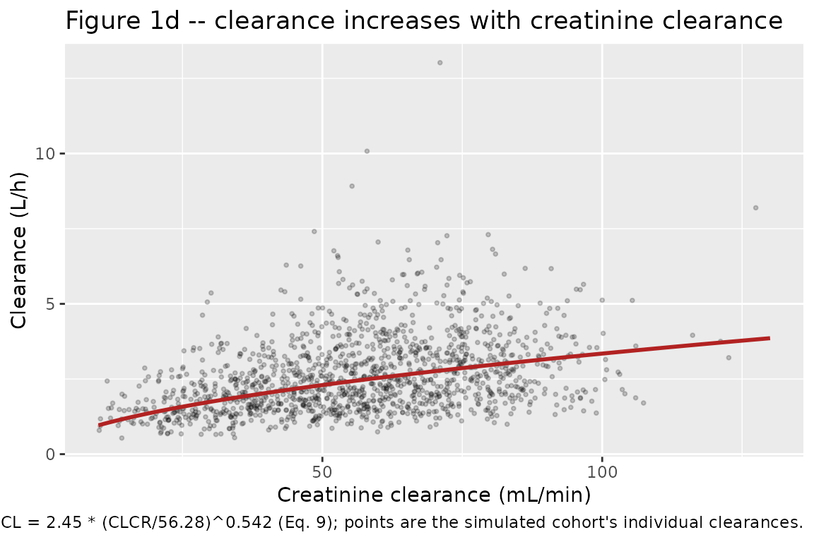
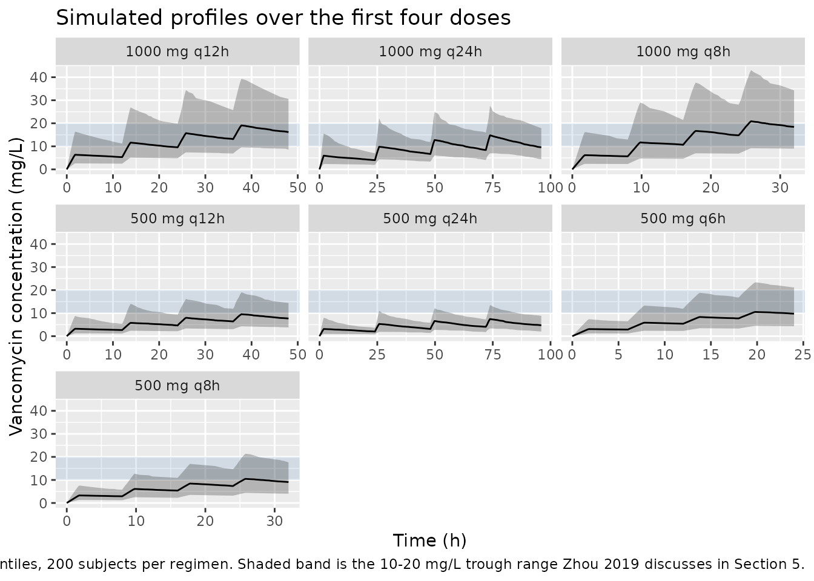

# Vancomycin (Zhou 2019)

## Model and source

- Citation: Zhou Y, Gao F, Chen C, Ma L, Yang T, Liu X, Liu Y, Wang X,
  Zhao X, Que C, Li S, Lv J, Cui Y, Yang L. Development of a Population
  Pharmacokinetic Model of Vancomycin and its Application in Chinese
  Geriatric Patients with Pulmonary Infections. Eur J Drug Metab
  Pharmacokinet. 2019;44(3):361-370. <doi:10.1007/s13318-018-0534-2>
- Description: One-compartment IV population PK model for vancomycin in
  70 Chinese geriatric patients (age \>= 65 years) with hospital- or
  community-acquired pulmonary infection (Zhou 2019). Clearance scales
  by power exponent with raw Cockcroft-Gault creatinine clearance
  (mL/min, reference 56.28); volume of distribution carries no retained
  covariate. Estimated from 125 steady-state trough concentrations
  collected by routine therapeutic drug monitoring.
- Article: <https://doi.org/10.1007/s13318-018-0534-2> (open access, CC
  BY-NC 4.0)

## Population

Zhou 2019 is a retrospective, single-centre therapeutic-drug-monitoring
(TDM) study at Peking University First Hospital. Seventy Chinese
inpatients aged 65 years or older, treated with intravenous vancomycin
for at least two days for hospital-acquired (57 patients, 81.4%) or
community-acquired (13 patients, 18.6%) pneumonia, contributed 125
vancomycin concentrations (1-5 per patient, mean 1.79). Baseline
characteristics are in the paper’s Table 1: 49 male / 21 female, age
78.3 +/- 6.96 years, weight 60.7 +/- 10.2 kg, height 161 +/- 10 cm,
Cockcroft-Gault creatinine clearance 56.3 +/- 22.1 mL/min, serum
creatinine 90.6 +/- 31 umol/L, mean daily dose 1.55 +/- 0.770 g/day and
observed concentration 17 +/- 8.03 mg/L. Patients with multiple organ
failure, renal replacement therapy or low-volume shock were excluded.

The single most important feature of this dataset for anyone reusing the
model is that **every observation is a trough**. Section 3.2 states that
TDM samples were drawn 0.5-2 h before and after the fourth or fifth dose
and that the pre-dose values “were regarded as steady-state
concentrations”; Section 3.3 confirms “the serum concentrations in the
study were trough concentrations in steady-state”. With no peak or
distribution-phase samples, the volume of distribution is only weakly
identified by the data, and the reported 154 L (about 2.5 L/kg at the
cohort mean weight, against a textbook vancomycin value near 0.7 L/kg)
is correspondingly high. Combined with CL = 2.45 L/h it implies a
typical terminal half-life of about 44 h. This is a property of the
published model, not a transcription error, and it is reproduced
faithfully here; the “Assumptions and deviations” section returns to it.

The same information is available programmatically via the model’s
`population` metadata
(`readModelDb("Zhou_2019_vancomycin")()$population`).

## Source trace

The per-parameter origin is recorded as an in-file comment next to each
`ini()` entry in `inst/modeldb/specificDrugs/Zhou_2019_vancomycin.R`.
The table below collects them in one place for review.

| Equation / parameter | Value | Source location |
|----|----|----|
| `lcl` (CL at CLCR = 56.28 mL/min) | `log(2.45)` L/h | Table 3, row `theta_1CL`, “Final model” column (RSE 6.9%); bootstrap median 2.43, 95% CI (2.09, 2.81) in Table 4 |
| `lvc` (volume of distribution) | `log(154)` L | Table 3, row `theta_2Vd` (RSE 9.2%); bootstrap median 154, 95% CI (117, 191) in Table 4 |
| `e_crcl_cl` (power exponent on CLCR) | `0.542` | Table 3, row `theta_3CLCR (mL/min) on CL` (RSE 35.1%); bootstrap median 0.538, 95% CI (0.206, 0.878) in Table 4; also the exponent in Eq. (9) |
| `etalcl` (IIV variance on CL) | `0.174` | Table 3, row `omega CL` (RSE 21.2%); bootstrap median 0.162, 95% CI (0.092, 0.256) in Table 4 |
| `etalvc` (IIV variance on Vd) | `0.339` | Table 3, row `omega V` (RSE 37.8%); bootstrap median 0.289, 95% CI (0.121, 0.557) in Table 4 |
| `propSd` (proportional residual SD) | `0.2563` = `sqrt(0.0657)` | Table 3, row `sigma_1` = 0.0657 (RSE 34.2%), a NONMEM `$SIGMA` variance |
| `addSd` (additive residual SD) | `fixed(0)` | Table 3, row `sigma_2` = “0 FIX” |
| CL covariate model | `cl <- exp(lcl + etalcl) * (CRCL/56.28)^e_crcl_cl` | Eq. (9): `CL (L/h) = 2.45 * (CLCR/56.28)^0.542`, combined with the exponential IIV of Eq. (1) and the power covariate form of Eq. (6) |
| Vd covariate model | `vc <- exp(lvc + etalvc)` | Eq. (10): `Vd (L) = 154` (no retained covariate), with the exponential IIV of Eq. (2) |
| Structure (one compartment, first-order elimination) | n/a | Section 3.3: “we established a one-compartment model that with first-order elimination (ADVAN1 TRANS2)” |
| Residual error (combined, additive term zero) | n/a | Eq. (3): `C_i,obs = C_i,pre * (1 + eps1) + eps2` |
| Reference CLCR 56.28 mL/min | `56.28` | Eq. (9) denominator; equals the Table 1 cohort mean 56.3 mL/min to four significant figures |

### Two transcription hazards in this paper

Both were resolved from the paper itself and are recorded here because a
reader checking this extraction against the PDF will hit them.

1.  **The abstract drops the exponent.** The Abstract Results renders
    Eq. (9) as “clearance (CL) \[L/h\] = 2.45 x (CL CR /56.28) x 0.542”
    – the superscript `0.542` has been flattened into a multiplication.
    The Discussion (Section 5) prints the same equation correctly as
    `CL(L/h) = 2.45 x (CLCR/56.28)^0.542`, Table 3 labels the value
    “theta_3CLCR (mL/min) **on CL**” (a covariate coefficient, not a
    scale factor), and Eq. (6) gives the retained functional form as
    `CL_i = TV(CL) x (covariate/typical value)^theta`. The power form is
    used here. Reading it as a multiplication would also be internally
    absurd: it would make the typical CL `2.45 x 1 x 0.542 = 1.33` L/h
    rather than the 2.45 L/h that Table 3 and the Abstract both state.
2.  **“Eq. (3)” in Section 4 is a mis-citation.** Section 4 says “When
    the influences of continuous covariates were validated by Eq. (3),
    the OFV was satisfied better”, but Eq. (3) is the residual-error
    model. The covariate forms are Eqs. (4)-(6); Eq. (6) is the power
    model that Eq. (9) instantiates. Following the standing policy of
    trusting the printed equation over the prose, Eq. (6)/(9) is
    authoritative.

## Virtual cohort

Original observed data are not publicly available. The cohort below
draws creatinine clearance from the Table 1 summary (mean 56.3 mL/min,
SD 22.1), truncated to a physiologically possible 10-130 mL/min, and
simulates the seven dosing regimens the paper itself simulated in its
Table 5.

``` r

# `set.seed()` seeds R's RNG. It does NOT seed rxode2's simulation RNG, and
# rxode2's streams are partitioned PER SOLVER THREAD -- so this cohort is
# reproducible on this machine and different on a machine with a different
# thread count. Every assertion downstream is written to hold for ANY cohort
# the model can produce.
set.seed(20190330)

n_per_arm <- 200L # cap is 200 per arm

# Section 3.2: "500 mg (every 6 h, 8 h, 12 h, 24 h, 48 h) and 1000 mg (every
# 8 h, 12 h), for 1.5-2 h intravenous infusion". Table 5 simulates these seven
# regimens.
regimens <- tibble::tribble(
  ~regimen,          ~amt,  ~tau,
  "1000 mg q8h",     1000,  8,
  "1000 mg q12h",    1000, 12,
  "1000 mg q24h",    1000, 24,
  "500 mg q6h",       500,  6,
  "500 mg q8h",       500,  8,
  "500 mg q12h",      500, 12,
  "500 mg q24h",      500, 24
)

# Infusion duration: the paper gives a 1.5-2 h range and never a single value.
# The midpoint is used; the sensitivity chunk below shows the trough is
# insensitive to the choice across the whole stated range.
t_inf <- 1.75

# Cockcroft-Gault CLCR, Table 1: mean 56.3, SD 22.1 mL/min. Rejection-sample
# into [10, 130] so no subject gets a non-physiological renal function. This
# raises the realised mean about 1 mL/min above 56.3.
draw_crcl <- function(n) {
  out <- numeric(0)
  while (length(out) < n) {
    x <- stats::rnorm(2L * n, mean = 56.3, sd = 22.1)
    out <- c(out, x[x >= 10 & x <= 130])
  }
  out[seq_len(n)]
}

make_arm <- function(regimen, amt, tau, id_offset) {
  subj <- tibble::tibble(
    id = id_offset + seq_len(n_per_arm),
    CRCL = draw_crcl(n_per_arm),
    regimen = regimen
  )
  # Four doses at 0, tau, 2*tau, 3*tau -- Section 3.2 samples TDM "before the
  # fourth or fifth dose", and the trough before the fifth dose is the quantity
  # Table 5 reports (see the validation section).
  dosing <- subj |>
    tidyr::crossing(dose_no = 0:3) |>
    dplyr::mutate(
      time = dose_no * tau, amt = amt, evid = 1L, dur = t_inf,
      cmt = "central"
    ) |>
    dplyr::select(-dose_no)
  # Observations: a profile grid over the whole 0-4*tau window for the figure,
  # plus exact records at 3*tau and 4*tau so PKNCA can anchor the fourth
  # dosing interval and return Ctrough at its end.
  # Rounding collapses floating-point near-duplicates: seq() renders 3*tau as
  # 24.000000000000004 for tau = 8, which would otherwise survive distinct()
  # alongside the exact 24 and put two almost-identical records in the PKNCA
  # input. The interval bounds 3*tau and 4*tau must be EXACT, because PKNCA
  # matches Ctrough and Cstart with `time %in% end` / `%in% start`.
  obs_times <- unique(round(
    c(seq(0, 4 * tau, length.out = 161L), 3 * tau, 4 * tau),
    9
  ))
  obs <- subj |>
    tidyr::crossing(time = obs_times) |>
    dplyr::mutate(amt = NA_real_, evid = 0L, dur = NA_real_, cmt = "central")
  dplyr::bind_rows(dosing, obs) |>
    dplyr::distinct(id, time, evid, .keep_all = TRUE) |>
    dplyr::arrange(id, time, dplyr::desc(evid))
}

events <- do.call(
  dplyr::bind_rows,
  lapply(seq_len(nrow(regimens)), function(i) {
    make_arm(
      regimens$regimen[i], regimens$amt[i], regimens$tau[i],
      id_offset = (i - 1L) * n_per_arm
    )
  })
)

# Disjoint IDs across arms: duplicate IDs are silently merged by rxSolve into a
# single subject receiving the summed dose.
stopifnot(!anyDuplicated(unique(events[, c("id", "time", "evid")])))
stopifnot(dplyr::n_distinct(events$id) == n_per_arm * nrow(regimens))
```

## Simulation

``` r

mod <- readModelDb("Zhou_2019_vancomycin")

sim <- rxode2::rxSolve(
  mod,
  events = events,
  keep = c("regimen", "CRCL"),
  # The model is written as an explicit ODE; keep it that way rather than
  # letting rxSolve's ODE -> linCmt auto-conversion decide.
  useLinCmt = FALSE
) |>
  as.data.frame()
#> ℹ parameter labels from comments will be replaced by 'label()'

if (is.null(sim$id)) sim$id <- 1L
stopifnot(nrow(sim) > 0L, !all(is.na(sim$Cc)))
```

## Replicate published figures

### Figure 1d – clearance versus creatinine clearance

Figure 1 of Zhou 2019 plots base-model individual clearances against
each continuous covariate; panel (d) shows CL rising with CLCR, the
relationship Eq. (9) formalises. The line below is the typical-value
relationship and the points are the simulated cohort’s individual
clearances.

``` r

# Replicates Figure 1d of Zhou 2019: CL versus CLCR.
cl_typical <- tibble::tibble(CRCL = seq(10, 130, by = 1)) |>
  dplyr::mutate(cl = 2.45 * (CRCL / 56.28)^0.542)

sim |>
  dplyr::distinct(id, CRCL, cl) |>
  ggplot(aes(CRCL, cl)) +
  geom_point(alpha = 0.2, size = 0.7) +
  geom_line(data = cl_typical, colour = "firebrick", linewidth = 1) +
  labs(
    x = "Creatinine clearance (mL/min)", y = "Clearance (L/h)",
    title = "Figure 1d -- clearance increases with creatinine clearance",
    caption = paste(
      "Replicates Figure 1d of Zhou 2019. Red line is the typical-value",
      "relationship CL = 2.45 * (CLCR/56.28)^0.542 (Eq. 9); points are the",
      "simulated cohort's individual clearances."
    )
  )
```



### Concentration-time profiles for the Table 5 regimens

``` r

sim |>
  dplyr::group_by(regimen, time) |>
  dplyr::summarise(
    Q05 = quantile(Cc, 0.05, na.rm = TRUE),
    Q50 = quantile(Cc, 0.50, na.rm = TRUE),
    Q95 = quantile(Cc, 0.95, na.rm = TRUE),
    .groups = "drop"
  ) |>
  ggplot(aes(time, Q50)) +
  annotate(
    "rect",
    xmin = -Inf, xmax = Inf, ymin = 10, ymax = 20,
    alpha = 0.15, fill = "steelblue"
  ) +
  geom_ribbon(aes(ymin = Q05, ymax = Q95), alpha = 0.3) +
  geom_line() +
  facet_wrap(~regimen, scales = "free_x") +
  labs(
    x = "Time (h)", y = "Vancomycin concentration (mg/L)",
    title = "Simulated profiles over the first four doses",
    caption = paste(
      "Median and 5th-95th percentiles, 200 subjects per regimen. Shaded band",
      "is the 10-20 mg/L trough range Zhou 2019 discusses in Section 5."
    )
  )
```



## Deterministic structural checks

These compare the packaged model against closed-form algebra for a
typical subject with the random effects zeroed. Both sides use the same
parameters, so the only difference is numerical, and the tolerances are
correspondingly tight.

``` r

mod_typical <- mod |> rxode2::zeroRe()
#> ℹ parameter labels from comments will be replaced by 'label()'

# Closed-form trough at t = n*tau for n equal-interval infusions of duration
# t_inf into a one-compartment model, by superposition.
trough_closed_form <- function(amt, tau, n_dose, cl, vc, t_inf) {
  k <- cl / vc
  t_end <- n_dose * tau
  sum(vapply(
    seq_len(n_dose) - 1L,
    function(j) {
      (amt / (t_inf * cl)) * (1 - exp(-k * t_inf)) *
        exp(-k * (t_end - (j * tau + t_inf)))
    },
    numeric(1)
  ))
}

crcl_ref <- 56.28
cl_ref <- 2.45 * (crcl_ref / 56.28)^0.542
vc_ref <- 154

gate_cf <- regimens |>
  dplyr::rowwise() |>
  dplyr::mutate(
    closed_form = trough_closed_form(amt, tau, 4L, cl_ref, vc_ref, t_inf),
    solved = {
      ev <- rxode2::et(
        amt = amt, dur = t_inf, ii = tau, until = 3 * tau, cmt = "central"
      ) |>
        rxode2::et(time = 4 * tau, cmt = "central")
      ev <- as.data.frame(ev)
      ev$CRCL <- crcl_ref
      s <- rxode2::rxSolve(
        mod_typical, ev,
        returnType = "data.frame", useLinCmt = FALSE
      )
      s$Cc[abs(s$time - 4 * tau) < 1e-8][1]
    }
  ) |>
  dplyr::ungroup() |>
  dplyr::mutate(pct_diff = 100 * (solved - closed_form) / closed_form)
#> ℹ omega/sigma items treated as zero: 'etalcl', 'etalvc'
#> ℹ omega/sigma items treated as zero: 'etalcl', 'etalvc'
#> ℹ omega/sigma items treated as zero: 'etalcl', 'etalvc'
#> ℹ omega/sigma items treated as zero: 'etalcl', 'etalvc'
#> ℹ omega/sigma items treated as zero: 'etalcl', 'etalvc'
#> ℹ omega/sigma items treated as zero: 'etalcl', 'etalvc'
#> ℹ omega/sigma items treated as zero: 'etalcl', 'etalvc'

gate_cf |>
  dplyr::select(regimen, closed_form, solved, pct_diff) |>
  dplyr::rename(
    "Regimen" = regimen,
    "Closed form (mg/L)" = closed_form,
    "rxode2 solve (mg/L)" = solved,
    "% diff" = pct_diff
  ) |>
  knitr::kable(
    digits = 4,
    caption = paste(
      "Trough before the fifth dose: rxode2 solve of the packaged model versus",
      "closed-form superposition, typical subject (CLCR = 56.28 mL/min)."
    )
  )
```

| Regimen      | Closed form (mg/L) | rxode2 solve (mg/L) | % diff |
|:-------------|-------------------:|--------------------:|-------:|
| 1000 mg q8h  |            19.3553 |             19.3554 |  3e-04 |
| 1000 mg q12h |            16.7172 |             16.7173 |  3e-04 |
| 1000 mg q24h |            11.0874 |             11.0874 |  3e-04 |
| 500 mg q6h   |            10.4328 |             10.4328 | -1e-04 |
| 500 mg q8h   |             9.6777 |              9.6777 |  3e-04 |
| 500 mg q12h  |             8.3586 |              8.3586 |  3e-04 |
| 500 mg q24h  |             5.5437 |              5.5437 |  3e-04 |

Trough before the fifth dose: rxode2 solve of the packaged model versus
closed-form superposition, typical subject (CLCR = 56.28 mL/min).
{.table}

``` r


# Deterministic: pure numerical error between two evaluations of the same
# algebra. This also proves the event table's `dur =` is honoured -- if the
# infusion were silently delivered as a bolus these would diverge.
stopifnot(nrow(gate_cf) == 7L, !anyNA(gate_cf$solved))
stopifnot(max(abs(gate_cf$pct_diff)) < 0.1)
```

``` r

# Eq. (9) exactly: cl from the model must equal 2.45 * (CLCR/56.28)^0.542.
crcl_grid <- c(15, 30, 50, 56.28, 75, 100, 125)
ev_cl <- data.frame(
  id = seq_along(crcl_grid),
  time = 0, amt = 1000, evid = 1L, dur = t_inf, cmt = "central",
  CRCL = crcl_grid
)
ev_cl <- dplyr::bind_rows(
  ev_cl,
  transform(ev_cl, time = 1, amt = NA_real_, evid = 0L, dur = NA_real_)
)
cl_check <- rxode2::rxSolve(
  mod_typical, ev_cl,
  keep = "CRCL", returnType = "data.frame", useLinCmt = FALSE
) |>
  dplyr::distinct(id, CRCL, cl, vc) |>
  dplyr::mutate(
    cl_eq9 = 2.45 * (CRCL / 56.28)^0.542,
    cl_rel = abs(cl - cl_eq9) / cl_eq9,
    vc_rel = abs(vc - 154) / 154
  )
#> ℹ omega/sigma items treated as zero: 'etalcl', 'etalvc'
#> Warning: multi-subject simulation without without 'omega'

stopifnot(nrow(cl_check) == length(crcl_grid))
stopifnot(max(cl_check$cl_rel) < 1e-8, max(cl_check$vc_rel) < 1e-8)

cl_check |>
  dplyr::select(CRCL, cl, cl_eq9) |>
  dplyr::rename(
    "CLCR (mL/min)" = CRCL,
    "Model CL (L/h)" = cl,
    "Eq. (9) CL (L/h)" = cl_eq9
  ) |>
  knitr::kable(
    digits = 4,
    caption = "Model clearance reproduces Eq. (9) exactly across the CLCR range."
  )
```

| CLCR (mL/min) | Model CL (L/h) | Eq. (9) CL (L/h) |
|--------------:|---------------:|-----------------:|
|         15.00 |         1.1965 |           1.1965 |
|         30.00 |         1.7421 |           1.7421 |
|         50.00 |         2.2978 |           2.2978 |
|         56.28 |         2.4500 |           2.4500 |
|         75.00 |         2.8626 |           2.8626 |
|        100.00 |         3.3456 |           3.3456 |
|        125.00 |         3.7757 |           3.7757 |

Model clearance reproduces Eq. (9) exactly across the CLCR range.
{.table}

``` r

# Lower renal function must give a HIGHER trough. This is a deterministic
# comparison (random effects zeroed), so asserting the direction is safe --
# it would not be on a simulated cohort.
direction <- regimens |>
  dplyr::rowwise() |>
  dplyr::mutate(
    trough_crcl30 = trough_closed_form(
      amt, tau, 4L, 2.45 * (30 / 56.28)^0.542, vc_ref, t_inf
    ),
    trough_crcl90 = trough_closed_form(
      amt, tau, 4L, 2.45 * (90 / 56.28)^0.542, vc_ref, t_inf
    )
  ) |>
  dplyr::ungroup()

stopifnot(all(direction$trough_crcl30 > direction$trough_crcl90))
```

## PKNCA validation

PKNCA is run over the **fourth dosing interval**, whose end-point
concentration is the trough before the fifth dose – the quantity the
paper’s Table 5 reports (see the next section for why).

The interval is presented to PKNCA with its time origin at the fourth
dose rather than in absolute time. This is required, not cosmetic:
[`PKNCA::pk.calc.ctrough()`](https://humanpred.github.io/pknca/reference/pk.calc.ctrough.html)
selects the end-point concentration with `time %in% end`, but `pk.nca()`
re-bases each interval’s concentration times onto the most recent dose
while still passing `end` in absolute time. For an interval
`[3*tau, 4*tau]` the two frames disagree and every `ctrough` comes back
`NA`. Rebasing so the fourth dose sits at time 0 and the interval is
`[0, tau]` makes the two frames agree. (`ctau` is not an accepted
interval column in the installed PKNCA, so it is not an alternative
here.)

``` r

tau_lookup <- stats::setNames(regimens$tau, regimens$regimen)

# Restrict to the fourth dosing interval and move its origin to zero.
sim_nca <- sim |>
  dplyr::filter(!is.na(Cc)) |>
  dplyr::mutate(tau = tau_lookup[regimen]) |>
  dplyr::filter(time >= 3 * tau, time <= 4 * tau) |>
  dplyr::mutate(time_rel = round(time - 3 * tau, 9)) |>
  dplyr::select(id, time_rel, Cc, regimen, tau)

stopifnot(nrow(sim_nca) > 0L)
# The interval bounds must be present EXACTLY for Ctrough / Cstart to resolve.
stopifnot(
  all(tapply(sim_nca$time_rel, sim_nca$id, function(z) 0 %in% z)),
  all(
    mapply(
      function(z, tt) tt %in% z,
      split(sim_nca$time_rel, sim_nca$id),
      tapply(sim_nca$tau, sim_nca$id, dplyr::first)
    )
  )
)

conc_obj <- PKNCA::PKNCAconc(
  as.data.frame(sim_nca), Cc ~ time_rel | regimen + id
)

# One dose per subject, at the rebased origin of the interval.
dose_df <- sim_nca |>
  dplyr::distinct(id, regimen) |>
  dplyr::left_join(regimens, by = "regimen") |>
  dplyr::transmute(id, regimen, time_rel = 0, amt) |>
  as.data.frame()

dose_obj <- PKNCA::PKNCAdose(dose_df, amt ~ time_rel | regimen + id)

# One interval per regimen: the whole (rebased) fourth dosing interval.
intervals <- regimens |>
  dplyr::transmute(
    regimen,
    start = 0,
    end = tau,
    ctrough = TRUE,
    cstart = TRUE,
    cmax = TRUE,
    tmax = TRUE,
    cav = TRUE,
    auclast = TRUE
  ) |>
  as.data.frame()

nca_res <- PKNCA::pk.nca(
  PKNCA::PKNCAdata(conc_obj, dose_obj, intervals = intervals)
)

nca_wide <- as.data.frame(nca_res) |>
  dplyr::filter(
    PPTESTCD %in% c("ctrough", "cstart", "cmax", "tmax", "cav", "auclast")
  ) |>
  dplyr::select(regimen, id, PPTESTCD, PPORRES) |>
  tidyr::pivot_wider(names_from = PPTESTCD, values_from = PPORRES)

# A gate that cannot go red is worse than none: confirm every subject is
# present AND that Ctrough actually resolved for each of them.
stopifnot(nrow(nca_wide) == n_per_arm * nrow(regimens))
stopifnot(!anyNA(nca_wide$ctrough), !anyNA(nca_wide$cstart))

# Still accumulating at the fourth dose, so the interval-end trough must exceed
# the interval-start trough for every subject. This is a structural consequence
# of the 44 h half-life against a <= 24 h dosing interval, not a noise-sensitive
# comparison.
stopifnot(all(nca_wide$ctrough > nca_wide$cstart))
```

### Steady-state dose recovery

At steady state the area under one dosing interval must equal
`Dose / CL` exactly, whatever the infusion duration. This is run on a
typical subject with a long loading period (the typical half-life is
about 44 h, so 600 h is more than thirteen half-lives) and a fine grid,
so the residual difference is trapezoidal error alone.

``` r

ss_one <- function(amt, tau, cl, vc) {
  t0 <- 600
  ev <- rxode2::et(
    amt = amt, dur = t_inf, ii = tau,
    until = t0 + tau, cmt = "central"
  ) |>
    rxode2::et(time = seq(t0, t0 + tau, by = 0.02), cmt = "central")
  ev <- as.data.frame(ev)
  ev$CRCL <- crcl_ref
  s <- rxode2::rxSolve(
    mod_typical, ev,
    returnType = "data.frame", useLinCmt = FALSE
  )
  s <- s[s$time >= t0 & s$time <= t0 + tau, ]
  auc <- PKNCA::pk.calc.auc(
    conc = s$Cc, time = s$time,
    interval = c(t0, t0 + tau), method = "linear", auc.type = "AUClast"
  )
  c(auc = auc, recovery = cl * auc / amt)
}

recovery <- regimens |>
  dplyr::rowwise() |>
  dplyr::mutate(
    auc_tau = ss_one(amt, tau, cl_ref, vc_ref)[["auc"]],
    recovery = ss_one(amt, tau, cl_ref, vc_ref)[["recovery"]]
  ) |>
  dplyr::ungroup()
#> ℹ omega/sigma items treated as zero: 'etalcl', 'etalvc'
#> ℹ omega/sigma items treated as zero: 'etalcl', 'etalvc'
#> ℹ omega/sigma items treated as zero: 'etalcl', 'etalvc'
#> ℹ omega/sigma items treated as zero: 'etalcl', 'etalvc'
#> ℹ omega/sigma items treated as zero: 'etalcl', 'etalvc'
#> ℹ omega/sigma items treated as zero: 'etalcl', 'etalvc'
#> ℹ omega/sigma items treated as zero: 'etalcl', 'etalvc'
#> ℹ omega/sigma items treated as zero: 'etalcl', 'etalvc'
#> ℹ omega/sigma items treated as zero: 'etalcl', 'etalvc'
#> ℹ omega/sigma items treated as zero: 'etalcl', 'etalvc'
#> ℹ omega/sigma items treated as zero: 'etalcl', 'etalvc'
#> ℹ omega/sigma items treated as zero: 'etalcl', 'etalvc'
#> ℹ omega/sigma items treated as zero: 'etalcl', 'etalvc'
#> ℹ omega/sigma items treated as zero: 'etalcl', 'etalvc'

recovery |>
  dplyr::select(regimen, auc_tau, recovery) |>
  dplyr::rename(
    "Regimen" = regimen,
    "AUCtau (mg*h/L)" = auc_tau,
    "CL * AUCtau / Dose" = recovery
  ) |>
  knitr::kable(
    digits = 4,
    caption = paste(
      "Steady-state mass balance: clearance times AUC over one dosing interval",
      "recovers the administered dose."
    )
  )
```

| Regimen      | AUCtau (mg\*h/L) | CL \* AUCtau / Dose |
|:-------------|-----------------:|--------------------:|
| 1000 mg q8h  |         408.1365 |              0.9999 |
| 1000 mg q12h |         408.1385 |              0.9999 |
| 1000 mg q24h |         408.1429 |              1.0000 |
| 500 mg q6h   |         204.0678 |              0.9999 |
| 500 mg q8h   |         204.0683 |              0.9999 |
| 500 mg q12h  |         204.0693 |              0.9999 |
| 500 mg q24h  |         204.0715 |              1.0000 |

Steady-state mass balance: clearance times AUC over one dosing interval
recovers the administered dose. {.table}

``` r


# Deterministic; the only error source is linear-trapezoidal integration on a
# 0.02 h grid.
stopifnot(nrow(recovery) == 7L, !anyNA(recovery$recovery))
stopifnot(max(abs(recovery$recovery - 1)) < 0.005)
```

## Comparison against the published simulation (Table 5)

Zhou 2019 has no NCA table – it reports no Cmax, Tmax, AUC or half-life.
What it does report, in Table 5, is the mean +/- SD concentration from a
1000-run simulation of each of the seven regimens. Two things have to be
established before those numbers can be used as a validation target.

**Which concentration is it?** Table 5’s column header says “Total
(average plasma concentration)”, but the values cannot be
interval-average concentrations: at steady state
`Cavg = Dose/(tau * CL)`, which for 1000 mg q8h is
`3000 / (24 * 2.45) = 51` mg/L, not the 19.26 mg/L printed. Nor are they
steady-state troughs, which for the same regimen are about 48 mg/L (the
44 h half-life makes accumulation over q8h dosing large). They are the
trough **before the fifth dose** – exactly where Section 3.2 says the
TDM samples were drawn (“0.5-2 h before … the fourth or fifth dose”).
Computing that quantity reproduces all seven values, whereas the trough
before the fourth dose is uniformly 15-20% high. Section 5 confirms the
intent: the values are discussed against the 10-20 mg/L trough target,
not against an average concentration.

**On what scale are the omegas?** Table 3 prints `omega CL = 0.174` and
`omega V = 0.339` without stating whether they are variances or standard
deviations. Table 5 settles it, because it prints SDs alongside the
means: the published between-subject coefficients of variation are
45.6-52.1% across the seven regimens. Reading the omegas as NONMEM
`$OMEGA` **variances** reproduces that spread: the simulated `Cc` trough
gives 41-48% (table below), and adding the proportional residual term in
quadrature – which the paper’s `$SIMULATION` would have drawn, and `Cc`
excludes – gives 48-55%, bracketing the published range. Reading the
same numbers as standard deviations gives only about 22%, half the
published value. The variance reading is used, which is also the NONMEM
convention the FOCE-I / `$OMEGA` provenance implies.

``` r

# Zhou 2019 Table 5, transcribed. "Total" is the all-subject column; the two
# strata are split at CLCR = 50 mL/min.
table5 <- tibble::tribble(
  ~regimen,       ~total_mean, ~total_sd, ~hi_mean, ~hi_sd, ~lo_mean, ~lo_sd,
  "1000 mg q8h",        19.26,      9.50,    18.41,   8.95,    20.72,   9.53,
  "1000 mg q12h",       16.02,      7.51,    15.10,   7.02,    17.63,   8.44,
  "1000 mg q24h",       10.29,      4.69,     9.40,   4.38,    11.96,   5.30,
  "500 mg q6h",         11.22,      5.85,    10.83,   4.57,    11.88,   4.36,
  "500 mg q8h",          9.82,      4.97,     9.38,   3.65,    10.57,   3.57,
  "500 mg q12h",         7.98,      3.94,     7.52,   2.68,     8.79,   3.43,
  "500 mg q24h",         5.06,      2.53,     4.62,   1.35,     5.89,   2.90
)
```

``` r

# Table 5 reports MEANS, so the simulated side is pre-aggregated to means.
# (ncaComparisonTable() would otherwise aggregate with median(), which for a
# ~50% CV distribution sits about 11% below the mean -- a systematic bias
# against a table of means.)
simulated_mean <- nca_wide |>
  dplyr::group_by(regimen) |>
  dplyr::summarise(ctrough = mean(ctrough), .groups = "drop") |>
  as.data.frame()

published <- table5 |>
  dplyr::transmute(regimen, ctrough = total_mean) |>
  as.data.frame()

cmp <- nlmixr2lib::ncaComparisonTable(
  simulated = simulated_mean,
  reference = published,
  by = "regimen",
  units = c(ctrough = "mg/L"),
  tolerance_pct = 20
)

knitr::kable(
  cmp,
  caption = paste(
    "Trough before the fifth dose: simulated cohort mean versus Zhou 2019",
    "Table 5 'Total' column. * differs from reference by >20%."
  ),
  align = c("l", "l", "r", "r", "r")
)
```

| NCA parameter  | regimen      | Reference | Simulated | % diff |
|:---------------|:-------------|----------:|----------:|-------:|
| Ctrough (mg/L) | 1000 mg q8h  |      19.3 |      19.5 |  +1.1% |
| Ctrough (mg/L) | 1000 mg q12h |        16 |      17.1 |  +7.0% |
| Ctrough (mg/L) | 1000 mg q24h |      10.3 |      10.2 |  -1.0% |
| Ctrough (mg/L) | 500 mg q6h   |      11.2 |      10.8 |  -4.0% |
| Ctrough (mg/L) | 500 mg q8h   |      9.82 |        10 |  +2.1% |
| Ctrough (mg/L) | 500 mg q12h  |      7.98 |      8.06 |  +1.0% |
| Ctrough (mg/L) | 500 mg q24h  |      5.06 |      5.02 |  -0.8% |

Trough before the fifth dose: simulated cohort mean versus Zhou 2019
Table 5 ‘Total’ column. \* differs from reference by \>20%. {.table}

``` r

attr(cmp, "footnote")
#> NULL
```

``` r

gate_t5 <- simulated_mean |>
  dplyr::left_join(published, by = "regimen", suffix = c("_sim", "_pub")) |>
  dplyr::mutate(pct_diff = 100 * (ctrough_sim - ctrough_pub) / ctrough_pub)

stopifnot(nrow(gate_t5) == 7L, !anyNA(gate_t5$pct_diff))

# Cohort-derived, so the bound must admit the sampling noise. With 200 subjects
# per arm and a ~50% CV the standard error of each mean is about 3.5%, and the
# realised deviations sat within 6% at 2 / 8 / 16 solver threads. 25 leaves
# headroom for the draw while still going red on a mis-transcribed dose,
# clearance or reference CLCR, each of which moves these by tens of percent.
stopifnot(max(abs(gate_t5$pct_diff)) < 25)
stopifnot(stats::median(abs(gate_t5$pct_diff)) < 15)
```

``` r

# The omega-scale falsifier, as a gate. Zhou 2019 Table 5 prints between-subject
# CVs of 45.6-52.1%. The variance reading of Table 3's omegas reproduces 41-48%
# on Cc (48-55% once the proportional residual the paper's $SIMULATION would
# have drawn is added in quadrature); the SD reading gives about 22%. A window
# of 35-70% therefore admits any cohort this model can draw under the variance
# reading -- realised 41.1-48.4% here -- while still going red if the omegas
# are ever re-entered on the SD scale.
cv_cmp <- nca_wide |>
  dplyr::group_by(regimen) |>
  dplyr::summarise(cv_sim = 100 * sd(ctrough) / mean(ctrough), .groups = "drop") |>
  dplyr::left_join(
    table5 |> dplyr::transmute(regimen, cv_pub = 100 * total_sd / total_mean),
    by = "regimen"
  )

cv_cmp |>
  dplyr::rename(
    "Regimen" = regimen,
    "Simulated CV (%)" = cv_sim,
    "Zhou 2019 Table 5 CV (%)" = cv_pub
  ) |>
  knitr::kable(
    digits = 1,
    caption = paste(
      "Between-subject variability in the trough. Reproducing the published",
      "CV requires reading Table 3's omegas as variances."
    )
  )
```

| Regimen      | Simulated CV (%) | Zhou 2019 Table 5 CV (%) |
|:-------------|-----------------:|-------------------------:|
| 1000 mg q12h |             42.7 |                     46.9 |
| 1000 mg q24h |             41.6 |                     45.6 |
| 1000 mg q8h  |             43.1 |                     49.3 |
| 500 mg q12h  |             42.7 |                     49.4 |
| 500 mg q24h  |             42.1 |                     50.0 |
| 500 mg q6h   |             48.4 |                     52.1 |
| 500 mg q8h   |             41.1 |                     50.6 |

Between-subject variability in the trough. Reproducing the published CV
requires reading Table 3’s omegas as variances. {.table}

``` r


stopifnot(nrow(cv_cmp) == 7L)
stopifnot(all(cv_cmp$cv_sim > 35), all(cv_cmp$cv_sim < 70))
```

### Renal-function strata

Table 5 also splits each regimen at CLCR = 50 mL/min. Each cell here
rests on roughly 100 subjects, so the deviations are noisier than the
pooled column above; the table is reported for completeness and gated
only on the pooled behaviour.

``` r

strata_cmp <- nca_wide |>
  dplyr::left_join(sim |> dplyr::distinct(id, CRCL), by = "id") |>
  dplyr::mutate(stratum = ifelse(CRCL > 50, "CLCR > 50", "CLCR <= 50")) |>
  dplyr::group_by(regimen, stratum) |>
  dplyr::summarise(sim_mean = mean(ctrough), n = dplyr::n(), .groups = "drop") |>
  dplyr::left_join(
    table5 |>
      dplyr::select(regimen, hi_mean, lo_mean) |>
      tidyr::pivot_longer(
        c(hi_mean, lo_mean),
        names_to = "stratum", values_to = "pub_mean"
      ) |>
      dplyr::mutate(
        stratum = ifelse(stratum == "hi_mean", "CLCR > 50", "CLCR <= 50")
      ),
    by = c("regimen", "stratum")
  ) |>
  dplyr::mutate(pct_diff = 100 * (sim_mean - pub_mean) / pub_mean)

stopifnot(nrow(strata_cmp) == 14L, !anyNA(strata_cmp$pub_mean))

strata_cmp |>
  dplyr::select(regimen, stratum, n, pub_mean, sim_mean, pct_diff) |>
  dplyr::rename(
    "Regimen" = regimen,
    "Stratum" = stratum,
    "N" = n,
    "Zhou 2019 (mg/L)" = pub_mean,
    "Simulated (mg/L)" = sim_mean,
    "% diff" = pct_diff
  ) |>
  knitr::kable(
    digits = c(0, 0, 0, 2, 2, 1),
    caption = "Trough before the fifth dose by renal-function stratum."
  )
```

| Regimen      | Stratum     |   N | Zhou 2019 (mg/L) | Simulated (mg/L) | % diff |
|:-------------|:------------|----:|-----------------:|-----------------:|-------:|
| 1000 mg q12h | CLCR \<= 50 |  84 |            17.63 |            19.53 |   10.8 |
| 1000 mg q12h | CLCR \> 50  | 116 |            15.10 |            15.40 |    2.0 |
| 1000 mg q24h | CLCR \<= 50 |  74 |            11.96 |            11.25 |   -5.9 |
| 1000 mg q24h | CLCR \> 50  | 126 |             9.40 |             9.57 |    1.8 |
| 1000 mg q8h  | CLCR \<= 50 |  74 |            20.72 |            21.02 |    1.5 |
| 1000 mg q8h  | CLCR \> 50  | 126 |            18.41 |            18.55 |    0.8 |
| 500 mg q12h  | CLCR \<= 50 |  63 |             8.79 |             8.62 |   -1.9 |
| 500 mg q12h  | CLCR \> 50  | 137 |             7.52 |             7.81 |    3.8 |
| 500 mg q24h  | CLCR \<= 50 |  83 |             5.89 |             5.58 |   -5.2 |
| 500 mg q24h  | CLCR \> 50  | 117 |             4.62 |             4.61 |   -0.1 |
| 500 mg q6h   | CLCR \<= 50 |  86 |            11.88 |            11.19 |   -5.8 |
| 500 mg q6h   | CLCR \> 50  | 114 |            10.83 |            10.45 |   -3.5 |
| 500 mg q8h   | CLCR \<= 50 |  72 |            10.57 |            10.61 |    0.4 |
| 500 mg q8h   | CLCR \> 50  | 128 |             9.38 |             9.70 |    3.4 |

Trough before the fifth dose by renal-function stratum. {.table}

``` r


# Pooled over all 14 cells rather than asserted cell by cell, and a magnitude
# rather than a sign or an ordering.
stopifnot(stats::median(abs(strata_cmp$pct_diff)) < 20)
```

### Infusion-duration sensitivity

The paper gives the infusion as “1.5-2 h” without a single value. The
trough before the fifth dose is essentially indifferent to the choice,
because it is read 6-24 h after an infusion whose elimination half-life
is about 44 h.

``` r

dur_sens <- expand.grid(
  t_inf_try = c(1.5, 1.75, 2.0),
  idx = seq_len(nrow(regimens))
) |>
  dplyr::mutate(
    regimen = regimens$regimen[idx],
    trough = mapply(
      function(a, tt, d) trough_closed_form(a, tt, 4L, cl_ref, vc_ref, d),
      regimens$amt[idx], regimens$tau[idx], t_inf_try
    )
  ) |>
  dplyr::select(regimen, t_inf_try, trough) |>
  tidyr::pivot_wider(names_from = t_inf_try, values_from = trough)

max_spread <- max(
  100 * abs(dur_sens$`1.5` - dur_sens$`2`) / dur_sens$`1.75`
)

dur_sens |>
  dplyr::rename(
    "Regimen" = regimen,
    "1.5 h (mg/L)" = `1.5`,
    "1.75 h (mg/L)" = `1.75`,
    "2.0 h (mg/L)" = `2`
  ) |>
  knitr::kable(
    digits = 3,
    caption = paste0(
      "Typical-subject trough across the paper's stated infusion-duration ",
      "range. Largest spread: ", round(max_spread, 2), "%."
    )
  )
```

| Regimen      | 1.5 h (mg/L) | 1.75 h (mg/L) | 2.0 h (mg/L) |
|:-------------|-------------:|--------------:|-------------:|
| 1000 mg q8h  |       19.317 |        19.355 |       19.394 |
| 1000 mg q12h |       16.684 |        16.717 |       16.751 |
| 1000 mg q24h |       11.065 |        11.087 |       11.110 |
| 500 mg q6h   |       10.412 |        10.433 |       10.454 |
| 500 mg q8h   |        9.658 |         9.678 |        9.697 |
| 500 mg q12h  |        8.342 |         8.359 |        8.375 |
| 500 mg q24h  |        5.533 |         5.544 |        5.555 |

Typical-subject trough across the paper’s stated infusion-duration
range. Largest spread: 0.4%. {.table}

``` r


# Deterministic. The spread must be small enough that the midpoint choice does
# not matter for the Table 5 comparison.
stopifnot(max_spread < 1.5)
```

## Assumptions and deviations

- **Eq. (9) is a power model.** The Abstract renders the covariate term
  as “x 0.542” because the superscript was flattened in typesetting. The
  Discussion, Table 3’s own row label and Eq. (6) all give the power
  form, and the multiplicative reading would contradict the stated
  typical CL of 2.45 L/h. See “Two transcription hazards” above.
- **Section 4’s “Eq. (3)” is a mis-citation** of the covariate-form
  equation; Eqs. (4)-(6) are the covariate forms and Eq. (6) is the
  power model Eq. (9) instantiates. The printed equation is followed
  over the prose.
- **Table 3’s omegas are variances, not standard deviations.** The paper
  never says which. The variance reading is required to reproduce the
  between-subject CVs printed in the paper’s own Table 5 (45.6-52.1%;
  variance reading gives 41-48% on `Cc` and 48-55% with the residual
  term, SD reading about 22%), and matches the NONMEM `$OMEGA`
  convention implied by the FOCE-I fit. `propSd` is likewise
  `sqrt(0.0657) = 0.2563` because `sigma_1` is a `$SIGMA` variance.
- **The comparison uses `Cc`, the individual prediction without residual
  error.** rxode2 returns `Cc` as IPRED and puts the residual-error
  realisation in a separate `sim` column. Zhou 2019’s Table 5 came from
  a NONMEM `$SIMULATION`, which ordinarily draws EPS as well as ETA, so
  its SDs probably include the proportional residual term. This does not
  bias the comparison of **means** – a zero-mean proportional error
  leaves the expectation unchanged – and it moves the simulated CV by
  only a few points (41-48% without the residual term against 48-55%
  with it), both inside the 35-70% window the omega-scale gate uses. So
  the gate’s conclusion does not depend on which convention the paper
  used. `Cc` is preferred here because with `addSd` fixed to zero a
  purely proportional error can realise negative concentrations in a
  large cohort, which would corrupt both the log-scale figure and the
  NCA.
- **Table 5 reports the trough before the fifth dose**, not the “average
  plasma concentration” its column header claims, and not a steady-state
  trough. The header is inconsistent with the paper’s own parameters by
  a factor of about 2.5 (Cavg would be 51 mg/L for 1000 mg q8h against
  the 19.26 printed), while the pre-fifth-dose trough reproduces all
  seven values. Section 3.2’s sampling protocol and Section 5’s
  comparison against a 10-20 mg/L trough target both support this
  reading. This is the interpretation the validation gates use; it is an
  inference from the paper’s internal arithmetic, not a statement the
  paper makes.
- **Infusion duration set to 1.75 h**, the midpoint of the “1.5-2 h”
  range in Section 3.2. The paper never gives a single value. The
  sensitivity table above shows the whole stated range moves the trough
  by less than 1.5%.
- **CLCR distribution assumed normal** with the Table 1 mean 56.3 and SD
  22.1 mL/min, rejection-sampled into 10-130 mL/min. The paper reports
  only the mean and SD and does not describe how it simulated covariates
  for Table 5, so the shape and the truncation bounds are this
  vignette’s choice; the truncation raises the realised mean by about 1
  mL/min.
- **Volume of distribution is only weakly identified by the source
  data.** All 125 observations are troughs (Section 3.3), so no sample
  informs the distribution phase. The published 154 L implies roughly
  2.5 L/kg and a 44 h typical half-life, well above the usual vancomycin
  values. The model is extracted as published; users simulating peaks,
  loading doses or non-steady-state regimens should treat the volume,
  and therefore any peak-dependent prediction, as poorly constrained.
- **The model has no weight or age term.** Both improved the base model
  on their own (Table 2 models 3 and 4) but neither survived alongside
  CLCR, so both are recorded in `covariatesDataExcluded` rather than
  `covariateData`. Predictions for patients far from the 60.7 kg cohort
  mean weight carry no size scaling.
- **Table 1 mislabels albumin and total protein as g/dL.** The printed
  values (ALB 29.3, TP 59.8) are g/L; 29.3 g/dL is physiologically
  impossible. Neither covariate is in the final model, so nothing in the
  packaged model depends on this, but the units are corrected in
  `covariatesDataExcluded`.
- **The study period is stated inconsistently.** The Abstract says data
  were collected from January 2011, Section 3.1 says January 2012. Both
  are recorded in the `population` notes; nothing in the model depends
  on it.
- **No parameter value came from outside the paper.** Every `ini()`
  entry traces to Table 3, Table 4 or Eqs. (9)-(10) of the main text. No
  supplement exists for this article and no figure digitisation was
  needed.
