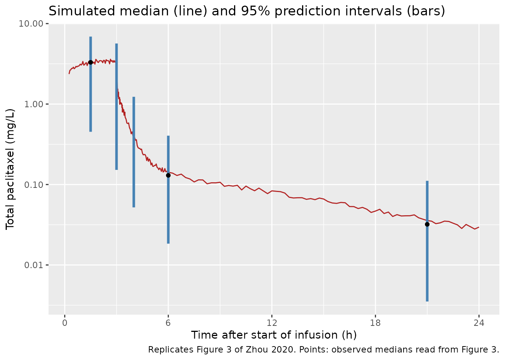
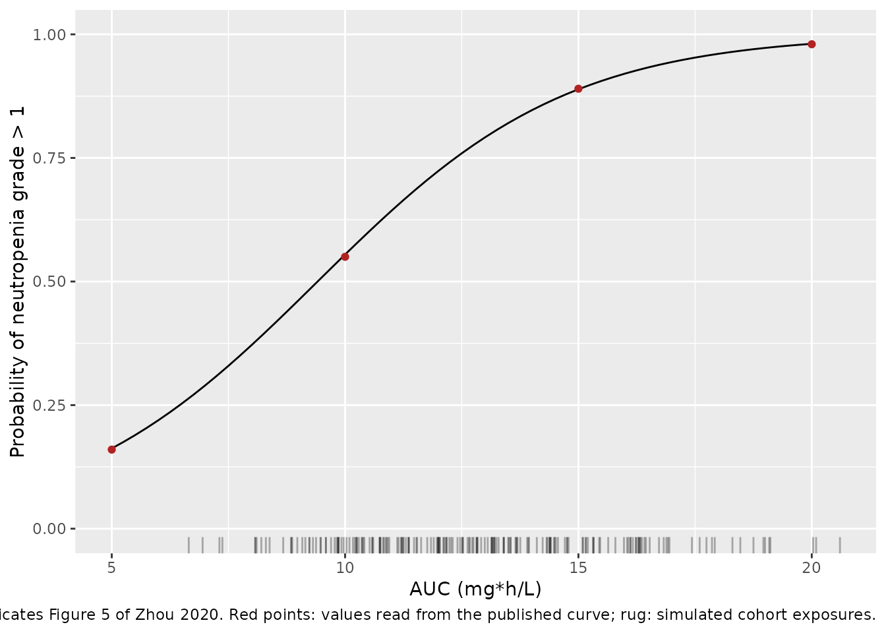

# Paclitaxel liposome PK and neutropenia (Zhou 2020)

## Model and source

Zhou 2020 contributes two models, which are packaged separately because
the authors fitted them in sequence: a population PK model for total
plasma paclitaxel after paclitaxel liposome (Lipusu), and a logistic
exposure-safety regression for neutropenia on the individual AUC derived
from that PK model.

- Citation: Zhou H, Yan J, Chen W, Yang J, Liu M, Zhang Y, Shen X, Ma Y,
  Hu X, Wang Y, Du K, Li G. Population Pharmacokinetics and
  Exposure-Safety Relationship of Paclitaxel Liposome in Patients With
  Non-small Cell Lung Cancer. Front Oncol. 2020;10:1731 (issue dated 5
  February 2021). <doi:10.3389/fonc.2020.01731>. Final estimates from
  Table 2; model structure confirmed against the NONMEM control stream
  in Supplementary Data Sheet 1.
- PK model: Three-compartment population PK model for total plasma
  paclitaxel (liposome-encapsulated plus released drug) after a 3-h
  intravenous infusion of paclitaxel liposome (Lipusu) 175 mg/m^2 in
  adults with squamous non-small cell lung cancer (Zhou 2020, n = 45).
  Linear first-order elimination from the central compartment, a deep
  and a shallow peripheral compartment, and between-subject variability
  on clearance only. No covariate was retained: age, sex, body weight,
  total bilirubin, albumin, serum creatinine, creatinine clearance and
  co-administration of aidi injection were all screened and rejected.
  The companion exposure-safety model is
  Zhou_2020_paclitaxel_liposomal_neutropenia.
- Exposure-safety model: Landmark logistic-regression exposure-safety
  model for neutropenia of CTCAE v4.0 grade 2 or worse (the source’s
  ‘grade \> 1’) as a linear function of the individual total-paclitaxel
  AUC, in adults with squamous non-small cell lung cancer given
  paclitaxel liposome (Lipusu) 175 mg/m^2 as a 3-h infusion followed by
  platinum chemotherapy (Zhou 2020, n = 45). There is no PK layer and no
  ODE: the exposure metric is supplied as the AUC_PTX data column, which
  the source computed from each patient’s dose and post hoc clearance
  from the companion population PK model Zhou_2020_paclitaxel_liposomal.
  The exposure slope was significant at p = 0.0469.
- Article: <https://doi.org/10.3389/fonc.2020.01731>
- Supplement (NONMEM control stream, Data Sheet 1):
  <https://www.frontiersin.org/articles/10.3389/fonc.2020.01731/full#supplementary-material>

## Population

Forty-five adults with squamous non-small cell lung cancer from a single
centre in Beijing (Chinese Clinical Trial Registry ChiCTR2000029106)
received paclitaxel liposome 175 mg/m^2 as a 3-h intravenous infusion on
day 1 of a 3-week cycle, followed on day 2 by cisplatin 75 mg/m^2 or
carboplatin AUC 4-5. The dose was rounded to the nearest vial size,
giving 210, 240, 270 or 300 mg (4 / 29 / 31 / 24 administrations over
the two sampled cycles). In cycle 2 the traditional Chinese medicine
aidi injection was given before chemotherapy. Table 1 gives the baseline
characteristics: median age 59 (36-75) years, median weight 71.5
(45-100) kg, 91% male, median creatinine clearance 101.1 (53.4-159.1)
mL/min, total bilirubin 8.4 (2.3-35.5) umol/L and albumin 42.6
(30.7-50.5) g/L. Sparse samples were taken at 1.5, 3, 4, 6 and 21 h
after the start of the infusion in each cycle, 349 concentrations in
all; 43 patients completed cycle 2. The assay measured total paclitaxel
(liposome-encapsulated plus released), LLOQ 10 ng/mL.

The same information is available programmatically via
`readModelDb("Zhou_2020_paclitaxel_liposomal")()$population`.

## Source trace

| Equation / parameter | Value | Source location |
|----|----|----|
| Three-compartment structure, first-order elimination from central | n/a | Results ‘Model’; supplementary control stream (`ADVAN6`, `$DES`) |
| `Pi = exp(PTV + eta_i)` for every structural parameter | n/a | Methods ‘Model Development and Evaluation’; control stream `$PK` |
| `CLi = exp(theta_CL + eta_CL)` (only CL carries IIV) | n/a | Results ‘Model’ equation; control stream `$OMEGA` (all other diagonals `0 FIX`) |
| `lcl` | log(21.55 L/h) | Table 2, CL |
| `lvc` | log(0.9248 L) | Table 2, Vc |
| `lq` (deep) | log(4.62 L/h) | Table 2, Q1; control stream CL2 / V2 pair |
| `lvp` (deep) | log(44.15 L) | Table 2, Vp1 |
| `lq2` (shallow) | log(15.85 L/h) | Table 2, Q2; control stream CL3 / V3 pair |
| `lvp2` (shallow) | log(5.577 L) | Table 2, Vp2 |
| `etalcl` | 0.04264 (= 0.2065^2) | Table 2, IIV CL 20.65% |
| `propSd` | 0.4455 | Table 2, sigma1 44.55%; control stream `Y = F*(1+EPS(1))` |
| `logit[P(NE > 1)] = a + b * AUC` | n/a | Results ‘Exposure-Safety Analysis’ equation |
| `logit_ref` (a) | -3.5008 | Table 3 |
| `e_auc_logit` (b) | 0.372 per mg\*h/L | Table 3; units from Figure 5 x-axis |
| `AUC_PTX = Dose / CL_i` | n/a | Methods ‘Exposure-Safety Analysis’ (‘individual post hoc PK parameters and dosage’) |

## Virtual cohort

Original observed data are not publicly available. The cohort below
draws the administered dose from the Table 1 dose frequencies. No
covariate enters either model, so no other characteristic needs to be
simulated.

``` r

set.seed(20210205)
n_sub <- 200L
dose_levels <- c(210, 240, 270, 300)
dose_weights <- c(4, 29, 31, 24) # Table 1, administrations per dose

obs_times <- sort(unique(c(
  seq(0, 3, by = 0.05),
  seq(3.01, 3.5, by = 0.01),
  seq(3.55, 6, by = 0.05),
  seq(6.25, 24, by = 0.25),
  seq(25, 72, by = 1)
)))

subjects <- tibble::tibble(
  id = seq_len(n_sub),
  dose = sample(dose_levels, n_sub, replace = TRUE, prob = dose_weights)
) |>
  mutate(treatment = paste0(dose, " mg"))

dose_rows <- subjects |>
  mutate(time = 0, amt = dose, rate = dose / 3, evid = 1L, cmt = "central")
obs_rows <- subjects |>
  tidyr::crossing(time = obs_times) |>
  mutate(amt = 0, rate = 0, evid = 0L, cmt = "central")
events <- bind_rows(dose_rows, obs_rows) |>
  arrange(id, time, desc(evid)) |>
  as.data.frame()

stopifnot(!anyDuplicated(unique(events[, c("id", "time", "evid")])))
table(subjects$treatment)
#> 
#> 210 mg 240 mg 270 mg 300 mg 
#>      9     71     78     42
```

## Simulation

``` r

mod <- readModelDb("Zhou_2020_paclitaxel_liposomal")

# The model must be integrated as written (three d/dt() states), not
# silently converted to a closed-form solution.
stopifnot(is.null(rxode2::rxode(mod)$linCmt))
#> ℹ parameter labels from comments will be replaced by 'label()'

sim <- rxode2::rxSolve(
  mod,
  events = events,
  keep = "treatment",
  rtol = 1e-10,
  atol = 1e-12
) |>
  as.data.frame()
#> ℹ parameter labels from comments will be replaced by 'label()'
```

### Typical-value profile

``` r

ev_typ <- data.frame(
  id = 1L,
  time = c(0, obs_times),
  amt = c(240, rep(0, length(obs_times))),
  rate = c(80, rep(0, length(obs_times))),
  evid = c(1L, rep(0L, length(obs_times))),
  cmt = "central"
)
sim_typ <- rxode2::rxSolve(
  rxode2::zeroRe(mod),
  events = ev_typ,
  rtol = 1e-10,
  atol = 1e-12
) |>
  as.data.frame()
#> ℹ parameter labels from comments will be replaced by 'label()'
#> ℹ omega/sigma items treated as zero: 'etalcl'

typ_at <- function(t) {
  v <- sim_typ$Cc[abs(sim_typ$time - t) < 1e-9]
  if (length(v) != 1L) {
    stop("no unique typical-value row at time ", t)
  }
  v
}

# Observed medians read from the solid line of Figure 3 (mixed 210-300 mg
# doses; Figure 3 plots every sample at its actual time).
fig3 <- tibble::tribble(
  ~time, ~observed_median,
  1.5, 3.3,
  6, 0.13,
  21, 0.032
) |>
  mutate(
    typical_240mg = vapply(time, typ_at, numeric(1)),
    ratio = typical_240mg / observed_median
  )
knitr::kable(
  fig3 |>
    rename(
      "Time (h)" = time,
      "Figure 3 observed median (mg/L)" = observed_median,
      "Model typical value, 240 mg (mg/L)" = typical_240mg,
      "Ratio" = ratio
    ),
  digits = 3,
  caption = "Typical-value concentrations against the Figure 3 observed median."
)
```

| Time (h) | Figure 3 observed median (mg/L) | Model typical value, 240 mg (mg/L) | Ratio |
|---:|---:|---:|---:|
| 1.5 | 3.300 | 3.020 | 0.915 |
| 6.0 | 0.130 | 0.127 | 0.975 |
| 21.0 | 0.032 | 0.033 | 1.037 |

Typical-value concentrations against the Figure 3 observed median.
{.table style="width:100%;"}

``` r


# A mis-transcribed CL, volume or unit shifts at least one of these three
# phases by far more than the precision of a figure read.
stopifnot(all(fig3$ratio > 0.7 & fig3$ratio < 1.4))
```

## Replicate published figures

``` r

# Replicates Figure 3 of Zhou 2020: VPC of total paclitaxel concentrations.
# `sim` carries residual error, as the VPC prediction intervals do. The
# median is drawn on the full grid; the 2.5th-97.5th percentile intervals are
# drawn at the five nominal sampling times, pooling simulated observations
# within +/- 0.25 h of each (600 to 6200 values per time) as the binned
# Figure 3 does.
vpc_median <- sim |>
  filter(time >= 0.25, time <= 24) |>
  group_by(time) |>
  summarise(Q50 = median(sim), .groups = "drop")

nominal <- c(1.5, 3, 4, 6, 21)
vpc_pi <- sim |>
  tidyr::crossing(nominal = nominal) |>
  filter(abs(time - nominal) <= 0.25) |>
  group_by(nominal) |>
  summarise(
    n = n(),
    Q025 = quantile(sim, 0.025),
    Q50 = median(sim),
    Q975 = quantile(sim, 0.975),
    .groups = "drop"
  )
stopifnot(nrow(vpc_pi) == 5L, all(vpc_pi$n >= 600))

# A proportional error with SD 0.4455 draws a negative observation about 1.3%
# of the time (P(eps < -1)), so a 2.5th percentile can occasionally fall at or
# below zero. Floor it for the log axis only; the table shows the raw value.
vpc_plot <- vpc_pi |> mutate(Q025 = pmax(Q025, 1e-3))

ggplot(vpc_median, aes(time, Q50)) +
  geom_line(colour = "firebrick") +
  geom_linerange(
    data = vpc_plot,
    aes(x = nominal, ymin = Q025, ymax = Q975),
    inherit.aes = FALSE,
    colour = "steelblue",
    linewidth = 1.2
  ) +
  geom_point(data = fig3, aes(time, observed_median), inherit.aes = FALSE) +
  scale_y_log10() +
  scale_x_continuous(breaks = seq(0, 24, by = 6)) +
  labs(
    x = "Time after start of infusion (h)",
    y = "Total paclitaxel (mg/L)",
    title = "Simulated median (line) and 95% prediction intervals (bars)",
    caption = paste(
      "Replicates Figure 3 of Zhou 2020. Points: observed medians read",
      "from Figure 3."
    )
  )
```



``` r


knitr::kable(
  vpc_pi |>
    select(-n) |>
    rename(
      "Nominal time (h)" = nominal,
      "2.5th percentile (mg/L)" = Q025,
      "Median (mg/L)" = Q50,
      "97.5th percentile (mg/L)" = Q975
    ),
  digits = 3,
  caption = "Simulated observation percentiles at the nominal sampling times."
)
```

| Nominal time (h) | 2.5th percentile (mg/L) | Median (mg/L) | 97.5th percentile (mg/L) |
|---:|---:|---:|---:|
| 1.5 | 0.452 | 3.236 | 6.896 |
| 3.0 | 0.152 | 1.497 | 5.659 |
| 4.0 | 0.052 | 0.390 | 1.231 |
| 6.0 | 0.018 | 0.145 | 0.405 |
| 21.0 | 0.004 | 0.035 | 0.111 |

Simulated observation percentiles at the nominal sampling times.
{.table}

The concentration falls roughly ten-fold within the first hour after the
end of the infusion: with Vc = 0.92 L the initial disposition half-life
is about one minute. This is why the paper’s 3-h (‘immediately at the
end of infusion’) samples in Figure 3 span more than an order of
magnitude, and why a few minutes of sampling delay matters when
comparing against those samples.

## PKNCA validation

``` r

sim_nca <- sim |>
  filter(!is.na(Cc)) |>
  select(id, time, Cc, treatment)
sim_nca <- bind_rows(
  sim_nca,
  sim_nca |> distinct(id, treatment) |> mutate(time = 0, Cc = 0)
) |>
  distinct(id, treatment, time, .keep_all = TRUE) |>
  arrange(id, treatment, time)

# Integrator undershoot in the far tail is noise; floor it before NCA.
stopifnot(all(sim_nca$Cc >= -1e-6 * max(sim_nca$Cc)))
sim_nca <- sim_nca |>
  mutate(Cc = pmax(Cc, 0)) |>
  group_by(id) |>
  filter(time <= time[which.max(Cc)] | Cc >= 1e-6 * max(Cc)) |>
  ungroup()

conc_obj <- PKNCA::PKNCAconc(sim_nca, Cc ~ time | treatment + id)
dose_obj <- PKNCA::PKNCAdose(
  events |> filter(evid == 1) |> select(id, time, amt, treatment),
  amt ~ time | treatment + id
)
intervals <- data.frame(
  start = 0,
  end = Inf,
  cmax = TRUE,
  tmax = TRUE,
  aucinf.obs = TRUE,
  half.life = TRUE
)
nca_res <- PKNCA::pk.nca(PKNCA::PKNCAdata(conc_obj, dose_obj, intervals = intervals))

nca_wide <- as.data.frame(nca_res) |>
  filter(PPTESTCD %in% c("cmax", "tmax", "aucinf.obs", "half.life")) |>
  select(id, treatment, PPTESTCD, PPORRES) |>
  tidyr::pivot_wider(names_from = PPTESTCD, values_from = PPORRES)

nca_wide |>
  group_by(treatment) |>
  summarise(
    n = n(),
    cmax = median(cmax),
    tmax = median(tmax),
    aucinf.obs = median(aucinf.obs),
    half.life = median(half.life),
    .groups = "drop"
  ) |>
  rename(
    "Dose" = treatment,
    "N" = n,
    "Cmax (mg/L)" = cmax,
    "Tmax (h)" = tmax,
    "AUC0-inf (mg*h/L)" = aucinf.obs,
    "Terminal t1/2 (h)" = half.life
  ) |>
  knitr::kable(digits = 2, caption = "Simulated NCA medians by dose.")
```

| Dose   |   N | Cmax (mg/L) | Tmax (h) | AUC0-inf (mg\*h/L) | Terminal t1/2 (h) |
|:-------|----:|------------:|---------:|-------------------:|------------------:|
| 210 mg |   9 |        2.89 |        3 |              10.20 |              8.13 |
| 240 mg |  71 |        3.38 |        3 |              11.98 |              8.17 |
| 270 mg |  78 |        3.71 |        3 |              13.08 |              8.13 |
| 300 mg |  42 |        3.91 |        3 |              13.66 |              8.03 |

Simulated NCA medians by dose. {.table style="width:100%;"}

Zhou 2020 reports no NCA table, so there is no published NCA to compare
against. Two checks stand in for it. First, for a linear model each
subject’s AUC0-inf must equal Dose / CL_i, which ties the NCA to the
individual clearance and to the dose units:

``` r

# One row per subject: the individual clearance from the solve and the dose
# from the per-subject cohort table (a one-to-one join on id).
cl_by_id <- sim |>
  group_by(id) |>
  summarise(cl = first(cl), .groups = "drop") |>
  inner_join(subjects |> select(id, dose), by = "id")
stopifnot(nrow(cl_by_id) == n_sub)

auc_check <- nca_wide |>
  select(id, aucinf.obs) |>
  inner_join(cl_by_id, by = "id") |>
  mutate(ratio = aucinf.obs * cl / dose)
stopifnot(nrow(auc_check) == n_sub)
summary(auc_check$ratio)
#>    Min. 1st Qu.  Median    Mean 3rd Qu.    Max. 
#>  0.9977  0.9984  0.9986  0.9986  0.9988  0.9992

# Trapezoidal error on the one-minute distribution phase is well under 1%
# on this grid; a wrong dose or clearance unit moves the ratio by 1000-fold.
stopifnot(
  abs(median(auc_check$ratio) - 1) < 0.01,
  quantile(abs(auc_check$ratio - 1), 0.9) < 0.02
)
```

Second, the Discussion converts the population clearance to a
body-surface basis, 21.55 L/h / 1.84 m^2 = 11.71 L/h/m^2, and compares
it with 12.3 +/- 2.7 L/h/m^2 from an earlier Lipusu report:

``` r

cl_typ <- exp(rxode2::rxode(mod)$theta[["lcl"]])
#> ℹ parameter labels from comments will be replaced by 'label()'
cl_bsa <- cl_typ / 1.84
cl_bsa
#> [1] 11.71196
stopifnot(abs(cl_bsa - 11.71) < 0.01)
```

## Exposure-safety model

The Figure 5 exposures (x-axis, mg\*h/L) are the individual AUCs. They
are recomputed here as Dose / CL_i for the simulated cohort and passed
to the neutropenia model as the `AUC_PTX` column.

``` r

er_mod <- readModelDb("Zhou_2020_paclitaxel_liposomal_neutropenia")

# The logistic model has no random effects by design, so rxode2's
# "multi-subject simulation without omega" warning is expected; muffle that
# one message and let any other warning through.
solve_er <- function(data) {
  withCallingHandlers(
    rxode2::rxSolve(er_mod, events = data, keep = "AUC_PTX"),
    warning = function(w) {
      if (grepl("without 'omega'", conditionMessage(w), fixed = TRUE)) {
        invokeRestart("muffleWarning")
      }
    }
  ) |>
    as.data.frame()
}

er_data <- cl_by_id |>
  mutate(time = 0, AUC_PTX = dose / cl) |>
  select(id, time, AUC_PTX)

quantile(er_data$AUC_PTX, c(0.05, 0.5, 0.95))
#>        5%       50%       95% 
#>  8.659573 12.666580 17.940683

# Figure 5 plots observed exposures from about 7.7 to 17 mg*h/L, centred
# near 12. The median of the simulated distribution is robust to the draw.
stopifnot(
  median(er_data$AUC_PTX) > 10,
  median(er_data$AUC_PTX) < 14
)

er_sim <- solve_er(er_data)
mean(er_sim$prob_neutropenia_grade2)
#> [1] 0.7385482
```

``` r

# Replicates Figure 5 of Zhou 2020: probability of neutropenia grade > 1
# against AUC.
curve_data <- data.frame(id = 1L, time = 0, AUC_PTX = seq(5, 20, by = 0.25))
curve_data$id <- seq_len(nrow(curve_data))
curve <- solve_er(curve_data)

curve_at <- function(a) {
  v <- curve$prob_neutropenia_grade2[abs(curve$AUC_PTX - a) < 1e-9]
  if (length(v) != 1L) {
    stop("no unique curve row at AUC ", a)
  }
  v
}

# Probabilities read from the fitted curve of Figure 5.
fig5 <- tibble::tribble(
  ~AUC_PTX, ~figure5,
  5, 0.16,
  10, 0.55,
  15, 0.89,
  20, 0.98
) |>
  mutate(
    model = vapply(AUC_PTX, curve_at, numeric(1))
  )

ggplot(curve, aes(AUC_PTX, prob_neutropenia_grade2)) +
  geom_line() +
  geom_point(data = fig5, aes(AUC_PTX, figure5), colour = "firebrick") +
  geom_rug(data = er_sim, aes(AUC_PTX), inherit.aes = FALSE, alpha = 0.3) +
  coord_cartesian(ylim = c(0, 1)) +
  labs(
    x = "AUC (mg*h/L)",
    y = "Probability of neutropenia grade > 1",
    caption = paste(
      "Replicates Figure 5 of Zhou 2020. Red points: values read from the",
      "published curve; rug: simulated cohort exposures."
    )
  )
```



``` r


knitr::kable(
  fig5 |>
    rename(
      "AUC (mg*h/L)" = AUC_PTX,
      "Figure 5 curve" = figure5,
      "Model" = model
    ),
  digits = 3
)
```

| AUC (mg\*h/L) | Figure 5 curve | Model |
|--------------:|---------------:|------:|
|             5 |           0.16 | 0.162 |
|            10 |           0.55 | 0.555 |
|            15 |           0.89 | 0.889 |
|            20 |           0.98 | 0.981 |

``` r


# Deterministic: the logistic curve has no random component. A sign or
# decimal error in either Table 3 coefficient moves these by >0.1.
stopifnot(all(abs(fig5$model - fig5$figure5) < 0.03))
```

## Assumptions and deviations

- **Year.** The article is in volume 10 (2020) of Frontiers in Oncology,
  which is the year PubMed and Europe PMC index it under (PMID 33614470)
  and the year in its DOI, so the models are named `Zhou_2020_*`. The
  issue itself is dated 5 February 2021, and the article’s own suggested
  citation gives 2021.
- **IIV scale.** Table 2 prints the CL variability as 20.65%. It is
  encoded as the standard deviation of eta,
  `omega^2 = 0.2065^2 = 0.04264`. The supplementary control stream’s
  `$OMEGA` value for CL (0.0427, whose square root is 20.66%) supports
  this reading over `log(CV^2 + 1)`, which would give 0.0418.
- **Control stream values are initial estimates.** The `$THETA` block of
  the supplementary stream (for example `exp(3.09) = 21.98` L/h for CL)
  differs from Table 2 in the third digit, so it holds starting values.
  The stream was used only to confirm the model structure and the
  deep/shallow compartment mapping; all numbers come from Table 2.
- **Compartment naming.** The paper’s deep compartment (Vp1, Q1) is
  `peripheral1` (`vp`, `q`) and its shallow compartment (Vp2, Q2) is
  `peripheral2` (`vp2`, `q2`), following the paper’s numbering.
- **Cycles.** The PK model pools both cycles with no between-occasion
  variability and no cycle or aidi effect, so one cycle is simulated.
  The 21-day interval is more than 60 terminal half-lives, so there is
  no accumulation between cycles.
- **AUC for the exposure-safety model.** The source says only that the
  AUC was computed from the individual post hoc PK parameters and the
  dose. For a linear model the single-dose AUC0-inf is `Dose / CL_i`;
  which cycle’s dose and clearance were used, and whether per-cycle AUCs
  were combined, is not stated. Figure 5 plots one exposure per patient
  in the 7.7-17 mg\*h/L range, which matches a single-cycle AUC.
- **Neutropenia endpoint.** ‘Grade \> 1’ is encoded as grade 2 or worse
  (`prob_neutropenia_grade2`). The source took the event from electronic
  medical records by CTCAE v4.0, with any cycle of platinum doublet
  therapy contributing; the platinum exposure is not in the model.
- **Placeholder residual.** The logistic model was fitted with a
  Bernoulli likelihood and has no residual error.
  `addSd_prob_neutropenia_grade2 = 0.001` (fixed) exists only so the
  nlmixr2 observation machinery accepts the model; it is not a published
  quantity.
- **Figure reads.** The Figure 3 observed medians and the Figure 5 curve
  values used in the checks above were read from the published figures
  by the maintainers and are approximate; the checks’ tolerances allow
  for this.
- **Errata.** No correction notice for this article was found as of
  2026-09-27.
