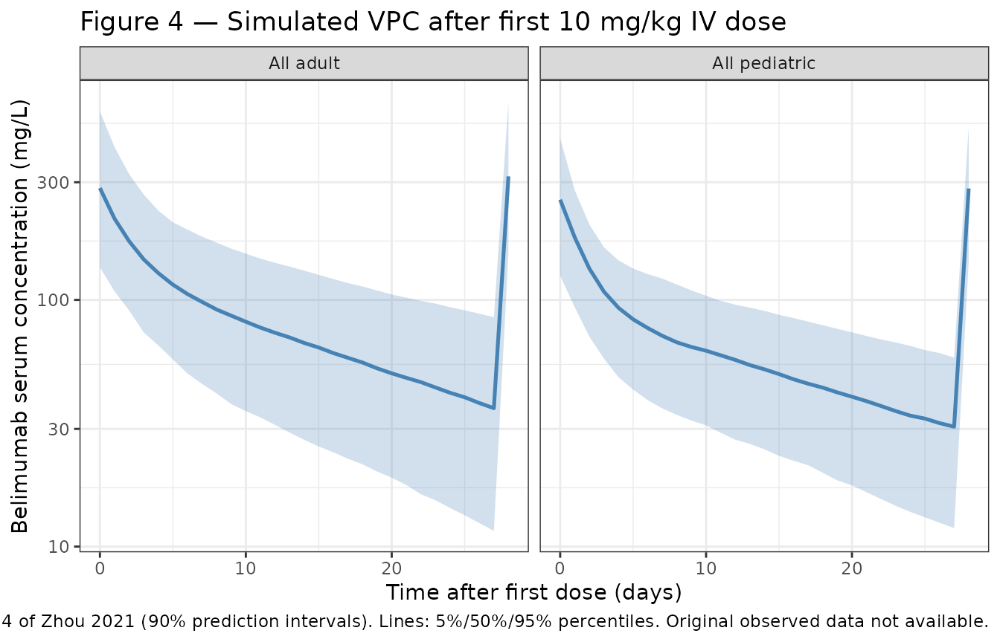
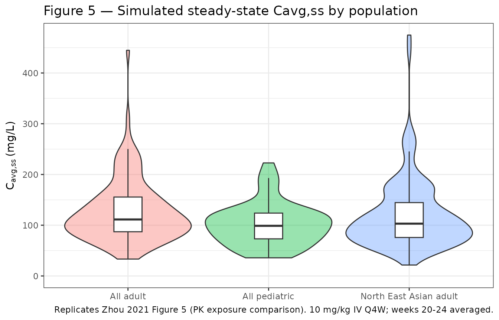

# Zhou_2021_belimumab

``` r

library(nlmixr2lib)
library(PKNCA)
#> 
#> Attaching package: 'PKNCA'
#> The following object is masked from 'package:stats':
#> 
#>     filter
library(rxode2)
#> rxode2 5.0.2 using 2 threads (see ?getRxThreads)
#>   no cache: create with `rxCreateCache()`
library(dplyr)
#> 
#> Attaching package: 'dplyr'
#> The following objects are masked from 'package:stats':
#> 
#>     filter, lag
#> The following objects are masked from 'package:base':
#> 
#>     intersect, setdiff, setequal, union
library(tidyr)
library(ggplot2)
```

## Model and source

``` r

mod <- readModelDb("Zhou_2021_belimumab")
mod_meta <- rxode2::rxode(mod)
```

- Citation: Zhou L, Lee S, Zhu L, Roy A, Zhou H, Yang H. Prediction of
  Belimumab Pharmacokinetics in Chinese Pediatric Patients with Systemic
  Lupus Erythematosus. Drugs R D. 2021;21(4):407-417.
  <doi:10.1007/s40268-021-00363-2>
- Description: Linear two-compartment IV population PK model for
  belimumab in Chinese and non-Chinese adult and pediatric patients with
  systemic lupus erythematosus (Zhou 2021)
- Article: <https://doi.org/10.1007/s40268-021-00363-2>

## Population

The model was estimated from a pooled population PK dataset comprising
9650 serum belimumab concentrations from 1783 patients enrolled in nine
clinical studies (Zhou 2021, Methods and Table 1):

- **Adult patients (n = 1730):** systemic lupus erythematosus (SLE) and
  healthy volunteers; median age 38 years (range 18–80); median weight
  65.7 kg (range 35.8–165.4); median fat-free mass 41.08 kg (range
  24.32–87.93); 93.4 % female; 13.4 % North East Asian (Chinese,
  Japanese, or Korean heritage).
- **Pediatric patients (n = 53):** SLE; median age 14 years (range
  6–18); median weight 52.5 kg (range 17–85.5); median fat-free mass
  34.45 kg (range 12.56–57.16); 92.5 % female; 5.7 % North East Asian.
  Drawn from the PLUTO study (NCT01649765).
- **Studies pooled (9):** BEL114055 (PLUTO), LBSL01, LBSL02, BEL113750
  (BLISS-NEA), BEL116119, BEL110751 (BLISS-76), BEL110752 (BLISS-52),
  200909, BEL114448. The two early-phase studies LBSL01 and LBSL02 used
  an ELISA-based assay; the seven later studies used an
  electrochemiluminescence-based assay. The model carries an `STDY_LBSL`
  indicator that adjusts CL and V1 in the two early studies.
- **Disease state:** active autoantibody-positive SLE (or healthy
  participants in the early-phase studies); median baseline serum IgG
  14.7 g/L (adults) and 14.5 g/L (pediatric); median baseline serum
  albumin 40 g/L (adults) and 43 g/L (pediatric).
- **Dosing for the validation regimen:** belimumab 10 mg/kg IV every 4
  weeks (Q4W).

The same information is available programmatically via
`readModelDb("Zhou_2021_belimumab")$population`.

## Source trace

Per-parameter origins are recorded as in-file comments next to each
[`ini()`](https://nlmixr2.github.io/rxode2/reference/ini.html) entry in
`inst/modeldb/specificDrugs/Zhou_2021_belimumab.R`. The table below
collects them in one place for review. All values are from the
final-model column (“run613”) of Zhou 2021 Table 2 unless otherwise
noted.

| Equation / parameter | Source value | Source location |
|----|----|----|
| Linear two-compartment IV structural model (NONMEM ADVAN3 TRANS4) | n/a | Zhou 2021, Methods § “Software and Estimation Methods” and § “Population Pharmacokinetic Model Development” |
| `lcl` (CL, L/day) | log(0.238) | Table 2: θ1 = 238 mL/day |
| `lvc` (V1, L) | log(2.597) | Table 2: θ2 = 2597 mL |
| `lq` (Q, L/day) | log(0.591) | Table 2: θ3 = 591 mL/day |
| `lvp` (V2, L) | log(2.318) | Table 2: θ4 = 2318 mL |
| `e_ffm_cl` (FFM exponent on CL) | 0.673 | Table 2: θ7 |
| `e_alb_cl` (BALB exponent on CL) | -1.12 | Table 2: θ9 |
| `e_igg_cl` (BIGG exponent on CL) | 0.293 | Table 2: θ10 |
| `e_stdy_cl` (LBSL01/02 multiplier on CL) | 1.63 | Table 2: θ11 |
| `e_ffm_vc` (FFM exponent on V1) | 0.891 | Table 2: θ8 |
| `e_stdy_vc` (LBSL01/02 multiplier on V1) | 1.26 | Table 2: θ12 |
| `e_neas_vc` (RACE_NEAS multiplier on V1) | 1.07 | Table 2: row “Race (RAC4)” — the printed θ index “θ12” is a labelling typo (it is the next-distinct theta, equivalent to θ13) |
| `age50_vc` (V1 maturation half-saturation, years) | 1.58 | Table 2: row “AGE × AGE/(AGE + θ14)” — formula factor = AGE/(AGE + 1.58) |
| `etalcl + etalvp` block (variances and covariance) | 0.0682, 0.0125, 0.0781 | Table 2: η1 var = 0.0682; η4 var = 0.0781; footnote c: Cov(CL, V2) = 0.0125 |
| `etalvc` (V1 IIV variance) | 0.0079 | Table 2: η2 var = 0.0079 |
| Q IIV | none (fixed at 0) | Table 2: η3 = 0 (fixed) |
| `propSd` (proportional residual error fraction) | 0.247 | Table 2: ε1 = θ5 = 0.247 |
| `addSd` (additive residual error, mg/L) | 0.221 | Table 2: ε2 = θ6 = 0.221 |
| Reference fat-free mass | 40.69 kg | Table 2: covariate normalisation `(FFM/40.69)` |
| Reference baseline albumin | 40 g/L | Table 2: covariate normalisation `(BALB/40)` |
| Reference baseline IgG | 14.8 g/L | Table 2: covariate normalisation `(BIGG/14.8)` |
| `STDY_LBSL` semantics | INDR = 1 for LBSL01 and LBSL02 only | Table 2 footnote: “INDR=1 for study LBSL01 and LBSL02, INDR=0 for the rest of studies” |
| `RACE_NEAS` semantics | RAC4 = 1 for North East Asian (Chinese / Japanese / Korean) | Table 2 footnote d: “RAC4 = 1 for North East Asian population and RAC4 = 0 for other populations” |

The published abstract reports a typical adult steady-state volume of
distribution of 4915 mL = 4.915 L, which equals
`θ2 + θ4 = 2.597 + 2.318`.

## Virtual cohort

Original observed data are not publicly available. The cohort below is a
virtual population whose covariate distributions approximate the
published trial demographics in Table 1. The validation focus is the
steady-state average concentration (`Cavg,ss`) under the labelled
regimen of belimumab 10 mg/kg IV every 4 weeks, which can be compared
against Zhou 2021 Table 3.

``` r

set.seed(34628605)

# Helper: sample fat-free mass directly from the published Table 1 ranges
# rather than re-deriving it from height/weight/sex (height was not
# tabulated, so a Janmahasatian re-computation is not possible).
make_cohort <- function(n,
                        age_range, age_median,
                        wt_range,  wt_median,
                        ffm_range, ffm_median,
                        igg_median, alb_median,
                        sex_female_pct,
                        race_neas_pct,
                        stdy_lbsl_pct = 0,
                        id_offset = 0L) {
  # Triangle-ish distributions anchored on published median + min + max
  rtri <- function(n, lo, mid, hi) {
    u <- runif(n)
    out <- ifelse(
      u < (mid - lo) / (hi - lo),
      lo  + sqrt(u                * (hi - lo) * (mid - lo)),
      hi  - sqrt((1 - u)          * (hi - lo) * (hi - mid))
    )
    pmax(lo, pmin(hi, out))
  }
  AGE <- rtri(n, age_range[1], age_median, age_range[2])
  WT  <- rtri(n, wt_range[1],  wt_median,  wt_range[2])
  FFM <- rtri(n, ffm_range[1], ffm_median, ffm_range[2])
  IGG <- rlnorm(n, meanlog = log(igg_median), sdlog = 0.30)
  ALB <- pmin(55, pmax(20, rnorm(n, mean = alb_median, sd = 4)))
  data.frame(
    id        = id_offset + seq_len(n),
    AGE       = AGE,
    WT        = WT,
    FFM       = FFM,
    IGG       = IGG,
    ALB       = ALB,
    SEXF      = as.integer(runif(n) < sex_female_pct / 100),
    RACE_NEAS = as.integer(runif(n) < race_neas_pct / 100),
    STDY_LBSL = as.integer(runif(n) < stdy_lbsl_pct / 100)
  )
}

adult_cohort <- make_cohort(
  n              = 500,
  age_range      = c(18, 80),
  age_median     = 38,
  wt_range       = c(35.8, 165.4),
  wt_median      = 65.7,
  ffm_range      = c(24.32, 87.93),
  ffm_median     = 41.08,
  igg_median     = 14.7,
  alb_median     = 40,
  sex_female_pct = 93.35,
  race_neas_pct  = 13.41,
  id_offset      = 0L
) |> mutate(cohort = "All adult")

ped_cohort <- make_cohort(
  n              = 200,
  age_range      = c(6, 18),
  age_median     = 14,
  wt_range       = c(17, 85.5),
  wt_median      = 52.5,
  ffm_range      = c(12.56, 57.16),
  ffm_median     = 34.45,
  igg_median     = 14.5,
  alb_median     = 43,
  sex_female_pct = 92.45,
  race_neas_pct  = 5.66,
  id_offset      = 1000L
) |> mutate(cohort = "All pediatric")

neas_adult_cohort <- make_cohort(
  n              = 500,
  age_range      = c(18, 80),
  age_median     = 38,
  wt_range       = c(35.8, 165.4),
  wt_median      = 65.7,
  ffm_range      = c(24.32, 87.93),
  ffm_median     = 41.08,
  igg_median     = 14.7,
  alb_median     = 40,
  sex_female_pct = 93.35,
  race_neas_pct  = 100,
  id_offset      = 2000L
) |> mutate(cohort = "North East Asian adult")

cohort_all <- bind_rows(adult_cohort, ped_cohort, neas_adult_cohort)
stopifnot(!anyDuplicated(cohort_all$id))
```

## Simulation

Belimumab 10 mg/kg IV every 4 weeks for 24 weeks (six doses; reaches
steady state by approximately week 16 per the published profile). The
dose is a bolus into `central` because the model has no extravascular
compartment.

``` r

make_events <- function(cohort_df, n_doses = 6, tau = 28, max_day = 24 * 7) {
  obs_days <- seq(0, max_day, by = 1)
  dose_days <- seq(0, by = tau, length.out = n_doses)
  d_dose <- cohort_df[rep(seq_len(nrow(cohort_df)), each = length(dose_days)), ] |>
    mutate(
      time = rep(dose_days, times = nrow(cohort_df)),
      evid = 1L,
      cmt  = "central",
      amt  = 10 * WT          # 10 mg/kg IV
    )
  d_obs <- cohort_df[rep(seq_len(nrow(cohort_df)), each = length(obs_days)), ] |>
    mutate(
      time = rep(obs_days, times = nrow(cohort_df)),
      evid = 0L,
      cmt  = "central",
      amt  = 0
    )
  bind_rows(d_dose, d_obs) |>
    arrange(id, time, desc(evid))
}

events <- make_events(cohort_all)

sim <- rxode2::rxSolve(
  mod,
  events = events,
  keep   = c("cohort", "WT")
) |> as.data.frame()
```

## Replicate published figures

### Figure 4 — Visual predictive check by adult vs pediatric (first dose)

The published figure shows 5%, 50%, and 95% percentiles of belimumab
concentrations after the first 10 mg/kg IV dose in adults and pediatric
patients (Zhou 2021 Figure 4). Below is the simulated equivalent from
this implementation; only adults and pediatric “All” cohorts are shown.

``` r

sim_first_cycle <- sim |>
  filter(cohort %in% c("All adult", "All pediatric"),
         time >= 0, time <= 28)

f4 <- sim_first_cycle |>
  group_by(cohort, time) |>
  summarise(
    Q05 = quantile(Cc, 0.05, na.rm = TRUE),
    Q50 = quantile(Cc, 0.50, na.rm = TRUE),
    Q95 = quantile(Cc, 0.95, na.rm = TRUE),
    .groups = "drop"
  )

ggplot(f4, aes(x = time, y = Q50)) +
  geom_ribbon(aes(ymin = Q05, ymax = Q95), fill = "#4682b4", alpha = 0.25) +
  geom_line(colour = "#4682b4", linewidth = 0.9) +
  facet_wrap(~cohort) +
  scale_y_log10() +
  labs(
    x = "Time after first dose (days)",
    y = "Belimumab serum concentration (mg/L)",
    title = "Figure 4 — Simulated VPC after first 10 mg/kg IV dose",
    caption = paste(
      "Replicates Figure 4 of Zhou 2021 (90% prediction intervals).",
      "Lines: 5%/50%/95% percentiles. Original observed data not available."
    )
  ) +
  theme_bw()
```



### Figure 5 — Steady-state exposure: pediatric vs adult and NEAS vs non-NEAS

Replicates the four-panel exposure-comparison figure of Zhou 2021 in
condensed form: simulated `Cavg,ss` distributions by cohort.

``` r

# Last dosing interval (week 20-24) is fully at steady state for belimumab
ss_window <- sim |> filter(time >= 20 * 7, time <= 24 * 7)

# Mean of dense daily samples is a close approximation to AUC0-tau / tau over
# the final dosing interval; PKNCA below produces the authoritative value.
cavg_ss <- ss_window |>
  group_by(id, cohort) |>
  summarise(Cavg_ss = mean(Cc, na.rm = TRUE), .groups = "drop")

ggplot(cavg_ss, aes(x = cohort, y = Cavg_ss, fill = cohort)) +
  geom_violin(alpha = 0.4, scale = "width") +
  geom_boxplot(width = 0.2, outlier.shape = NA, fill = "white") +
  scale_y_continuous(limits = c(0, NA)) +
  labs(
    x = NULL,
    y = expression(C[avg*","*ss] ~ "(mg/L)"),
    title = "Figure 5 — Simulated steady-state Cavg,ss by population",
    caption = paste(
      "Replicates Zhou 2021 Figure 5 (PK exposure comparison).",
      "10 mg/kg IV Q4W; weeks 20-24 averaged."
    )
  ) +
  theme_bw() +
  theme(legend.position = "none")
```



## PKNCA validation

PKNCA is used to compute the steady-state average concentration over the
final dosing interval (`Cavg,ss = AUC0-tau / tau`). The treatment
grouping variable is `cohort` per the skill template.

``` r

sim_nca <- sim |>
  filter(time >= 20 * 7, time <= 24 * 7, !is.na(Cc)) |>
  select(id, time, Cc, cohort)

dose_df <- events |>
  filter(evid == 1, time == 20 * 7) |>
  select(id, time, amt) |>
  left_join(distinct(cohort_all, id, cohort), by = "id")

conc_obj <- PKNCA::PKNCAconc(sim_nca, Cc ~ time | cohort + id,
                             concu = "mg/L", timeu = "day")
dose_obj <- PKNCA::PKNCAdose(dose_df, amt ~ time | cohort + id,
                             doseu = "mg")

intervals <- data.frame(
  start    = 20 * 7,
  end      = 24 * 7,
  cmax     = TRUE,
  cmin     = TRUE,
  cav      = TRUE,
  auclast  = TRUE
)

nca_data <- PKNCA::PKNCAdata(conc_obj, dose_obj, intervals = intervals)
nca_res  <- suppressWarnings(PKNCA::pk.nca(nca_data))
#>  ■■■■■■■■                          23% |  ETA:  7s
#>  ■■■■■■■■■■■■■■■■■                 54% |  ETA:  4s
#>  ■■■■■■■■■■■■■■■■■■■■■■■■■■■       86% |  ETA:  1s
nca_tbl  <- as.data.frame(nca_res$result)
```

### Comparison against published Cavg,ss distributions

Zhou 2021 Table 3 reports the first and third quartiles of `Cavg,ss`
(mg/L) by population. The simulated values from PKNCA are summarised
below.

``` r

sim_q <- nca_tbl |>
  filter(PPTESTCD == "cav") |>
  group_by(cohort) |>
  summarise(
    Q1_sim = round(quantile(PPORRES, 0.25, na.rm = TRUE), 1),
    Q3_sim = round(quantile(PPORRES, 0.75, na.rm = TRUE), 1),
    .groups = "drop"
  )

published <- tibble::tibble(
  cohort = c("All adult", "North East Asian adult", "All pediatric"),
  Q1_pub = c(81.0, 75.8,  78.2),
  Q3_pub = c(111.2, 98.0, 105.8)
)

comparison <- published |>
  left_join(sim_q, by = "cohort") |>
  mutate(
    Q1_pct_diff = round(100 * (Q1_sim - Q1_pub) / Q1_pub, 1),
    Q3_pct_diff = round(100 * (Q3_sim - Q3_pub) / Q3_pub, 1)
  )

knitr::kable(
  comparison,
  caption = "Cavg,ss (mg/L) at steady state under 10 mg/kg IV Q4W: simulated vs Zhou 2021 Table 3."
)
```

| cohort                 | Q1_pub | Q3_pub | Q1_sim | Q3_sim | Q1_pct_diff | Q3_pct_diff |
|:-----------------------|-------:|-------:|-------:|-------:|------------:|------------:|
| All adult              |   81.0 |  111.2 |   80.8 |  158.4 |        -0.2 |        42.4 |
| North East Asian adult |   75.8 |   98.0 |   79.6 |  153.8 |         5.0 |        56.9 |
| All pediatric          |   78.2 |  105.8 |   65.1 |  122.4 |       -16.8 |        15.7 |

Cavg,ss (mg/L) at steady state under 10 mg/kg IV Q4W: simulated vs Zhou
2021 Table 3. {.table}

Differences within roughly ±20 % are expected given that the virtual
covariate distributions are reconstructed from the published medians and
ranges only (height, individual subject-level data, and time-varying
covariates were not available for replication).

## Assumptions and deviations

- **Fat-free mass distribution** — Sampled directly from the published
  Table 1 ranges as a triangle distribution anchored on the median. The
  Janmahasatian formula could not be re-applied because height was not
  reported in the source paper.
- **IgG and albumin distributions** — IgG sampled from a log-normal
  distribution centered on the published median (CV 30%). Albumin
  sampled as Normal centered on the published median with σ = 4 g/L,
  truncated to \[20, 55\] g/L. The paper reports only median and range,
  so the parametric form is a working assumption.
- **Race and study-indicator distributions** — `RACE_NEAS` and
  `STDY_LBSL` sampled as Bernoulli at the published prevalences;
  `STDY_LBSL` defaults to 0 % for the validation cohort because the 10
  mg/kg Q4W exposure-comparison analysis (Zhou 2021 Table 3) is driven
  by the later, primary-assay studies.
- **No IIV on residual error** — Zhou 2021 Table 2 reports an
  inter-individual variance of 0.186 on the proportional residual error
  itself (η5, shrinkage 7.8 %). This between-subject component of
  residual variability is not implemented in the packaged model (only
  the typical-value `propSd = 0.247` and `addSd = 0.221` are carried).
  The omission narrows the simulated prediction bands modestly relative
  to the published VPC.
- **Theta-13 labelling** — Zhou 2021 Table 2 prints the V1 race effect
  with the same θ-index as the V1 study-indicator effect (“× θ12 RAC4”).
  This is a labelling typo in the published table; the value 1.07 is a
  distinct parameter from the value 1.26 (study indicator on V1). The
  in-file comment notes this for transparency.
- **High V1 IIV shrinkage** — Zhou 2021 Table 2 reports 35.8 % shrinkage
  on η2 (V1). This is documented for transparency; the variance was
  retained as published.
- **Dosing scheme for validation** — Six 10 mg/kg Q4W IV doses were
  simulated to reach steady state. The paper’s Cavg,ss values were
  generated either post-hoc from empirical Bayes estimates or from
  simulations using the same regimen.
