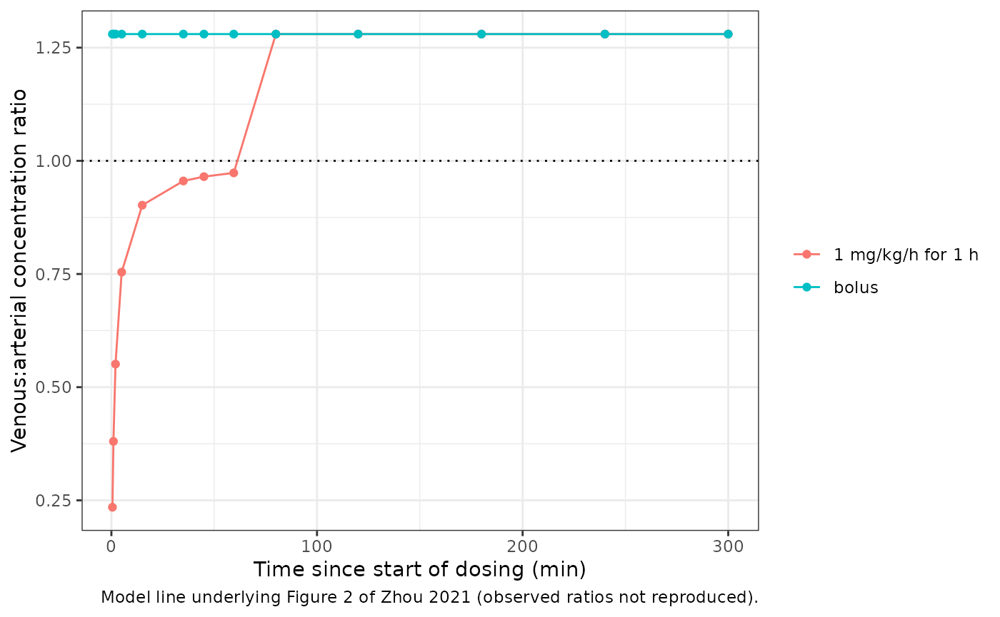
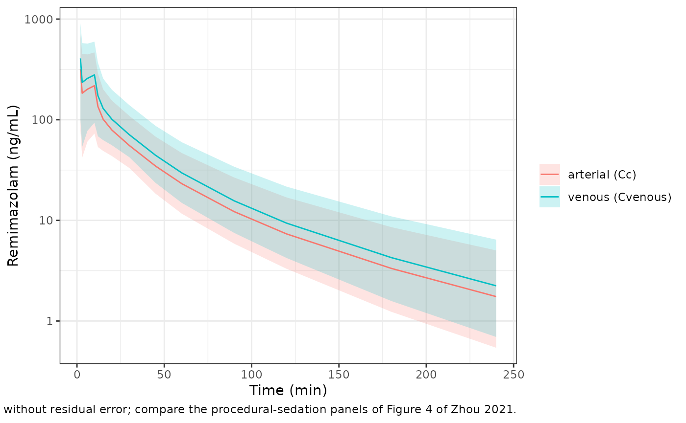

# Remimazolam (Zhou 2021)

## Model and source

- Citation: Zhou J, Curd L, Lohmer LL, Ossig J, Schippers F, Stoehr T,
  Schmith V. Population Pharmacokinetics of Remimazolam in Procedural
  Sedation With Nonhomogeneously Mixed Arterial and Venous
  Concentrations. Clin Transl Sci. 2021;14(1):326-334.
  <doi:10.1111/cts.12875>. PMC7877848.
- Description: Three-compartment population pharmacokinetic model for
  intravenous remimazolam pooled across 11 phase I-III studies (359
  subjects: healthy volunteers, procedural-sedation patients and
  general-anaesthesia patients) with arterial and venous plasma sampling
  (Zhou 2021). Clearance and volumes scale allometrically on body weight
  (fixed exponents 0.75 and 1, reference 70 kg); clearance is 10% higher
  in women and 13% lower in African Americans, and all three volumes are
  16% lower in African Americans. The central volume is fixed at 4.83
  L/70 kg from a pilot fit to two infusion studies, and its
  inter-individual variability applies only to subjects from studies
  with early (\< 2 min) sampling. Cc is the arterial concentration;
  venous samples are predicted as Cvenous = Cc times a venous:arterial
  ratio that rises as an Emax function of time since the start of an
  infusion and is a constant 1.28 after the infusion or bolus ends. One
  proportional residual error is shared by both sampling sites.
- Article: <https://doi.org/10.1111/cts.12875> (open access, PMC7877848)
- Supplement: Table S1 (studies), Table S2 (pilot, base and final
  models), Table S3 (sensitivity analyses) and Figure S3 (final NONMEM
  control stream), published with the article.

Remimazolam is an ultra-short-acting ester benzodiazepine hydrolysed by
hepatic carboxylesterase 1 to the inactive metabolite CNS7054. Earlier
population analyses estimated a very variable central volume (87% IIV)
because concentrations drawn in the first minutes after a bolus reflect
incomplete intravascular mixing and differ between arterial and venous
blood. Zhou 2021 addressed both problems: the central volume was
estimated in a pilot fit to two infusion studies only and then fixed,
and arterial and venous samples were combined by multiplying the venous
prediction by an empirical venous:arterial (VtoA) ratio inside the
residual-error model.

## Population

The analysis pooled 3,642 plasma concentrations (2,168 arterial, 1,474
venous) from 359 subjects in 11 studies conducted in Japan, the United
States and the European Union (Table S1): 126 healthy volunteers in five
phase I studies, 193 procedural-sedation patients (colonoscopy and
bronchoscopy, ASA class 1-4) in two phase II and three phase III
studies, and 40 surgical patients in one general-anaesthesia study
included to span the age range. Subjects were 63% men; 51.3% White,
22.8% African American and 25.3% Asian; mean age 46.1 years (SD 16.2)
and mean weight 76.1 kg (SD 17.5) (Table 1). Procedural-sedation
patients received 5-8 mg over 1 minute with 2-3 mg top-ups; healthy
volunteers received single boluses of 0.01-0.5 mg/kg or infusions (1
mg/kg/h for 1 h, or a 5 / 3 / 1 mg/min stepped infusion totalling 85
mg).

The same information is available programmatically:

``` r

str(readModelDb("Zhou_2021_remimazolam")()$population)
#> List of 12
#>  $ species       : chr "human"
#>  $ n_subjects    : int 359
#>  $ n_studies     : int 11
#>  $ n_observations: chr "3642 plasma concentrations (2168 arterial, 1474 venous)"
#>  $ age_range     : chr "mean 46.1 years (SD 16.2); study means 25.0-79.2 years"
#>  $ weight_range  : chr "mean 76.1 kg (SD 17.5); study means 56.1-91.0 kg"
#>  $ sex_female_pct: num 37
#>  $ race_ethnicity: Named num [1:4] 51.3 22.8 25.3 0.6
#>   ..- attr(*, "names")= chr [1:4] "White" "Black" "Asian" "Other"
#>  $ disease_state : chr "126 healthy volunteers, 193 procedural-sedation patients (colonoscopy, bronchoscopy; ASA class 1-4) and 40 surg"| __truncated__
#>  $ dose_range    : chr "Procedural sedation: 5-8 mg over 1 minute with 2, 2.5 or 3 mg top-ups. Healthy volunteers: single IV bolus 0.01"| __truncated__
#>  $ regions       : chr "Japan, United States, European Union"
#>  $ notes         : chr "Studies CNS7056-001, -002, -004, -006, -008, -015, -017 and ONO-2745-01, -02, -03, -IVU007 (Table S1). Two stud"| __truncated__
```

## Source trace

Every `ini()` value carries an in-file comment naming its source. The
final model’s structure is taken from the Figure S3 control stream and
its estimates from Table 2 (identical to the “Final Model” column of
Table S2).

| Equation / parameter | Value | Source location |
|----|----|----|
| `lcl` | log(1.18) L/min/70 kg | Table 2, CL; Figure S3 THETA(1) |
| `lvc` | fixed(log(4.83)) L/70 kg | Table 2, V1 “4.83 Fixed” (pilot estimate, Table S2) |
| `lq` | log(0.284) L/min/70 kg | Table 2, Q2 |
| `lvp` | log(18.7) L/70 kg | Table 2, V2 |
| `lq2` | log(1.92) L/min/70 kg | Table 2, Q3 |
| `lvp2` | log(18) L/70 kg | Table 2, V3 |
| `e_wt_cl_q` | fixed(0.75) | Methods Eq. 1; Figure S3 `ASCL = (WT/70)**0.75` |
| `e_wt_vc_vp` | fixed(1) | Methods Eq. 1; Figure S3 `ASV = (WT/70)**1` |
| `e_sexf_cl` | log(1.1) | Table 2, female:male ratio on CL; Figure S3 `THETA(10)**SEX` |
| `e_race_black_cl` | log(0.87) | Table 2, African Americans vs. Asians and whites on CL |
| `e_race_black_vc_vp` | log(0.839) | Table 2, “effect on Vss”; Figure S3 applies `COEFFV` to V1, V2 and V3 |
| `cfven_max` | fixed(1) | Table 2, Rmax; Methods Eq. 3 |
| `cfven_t50` | fixed(1.63) min | Table 2, T50; Methods Eq. 3 |
| `cfven` | fixed(1.28) | Table 2, Ratio2; Methods Eq. 3 (after dose) |
| `etalcl`, `etalq2`, `etalvp2` block | 22.9%, 92.9%, 74.1%; r = 0.51, 0.55, 0.9 | Table 2; Figure S3 `$OMEGA BLOCK(3)` (CL, Q3, V3) |
| `etalvc` | 61.7% | Table 2; only in studies with early sampling (Figure S3 `IF (STDY...)`) |
| `etalvp` | 24.8% | Table 2 |
| `propSd` | 0.207 | Table 2, residual error 20.7% |
| three-compartment ODE | n/a | Figure S3 `$DES` |
| `Cc = central / vc * 1000` | n/a | Figure S3 `S1=V1/1000 ; dose in mg and DV in ng/mL` |
| `Cvenous = Cc * ratio_ven` | n/a | Methods Eqs. 3-4; Figure S3 `$ERROR` `Y = RATIO*(F + F*EPS(1))` |

## Typical-value structure

A 70 kg reference subject has V1 = 4.83 L, i.e. 0.069 L/kg, which the
Discussion describes as “similar to plasma volume” (0.07 L/kg). The
steady-state volume is the sum of the three volumes, and the terminal
half-life follows from the eigenvalues of the three-compartment rate
matrix.

``` r

mod <- readModelDb("Zhou_2021_remimazolam")
mod_ui <- rxode2::rxode2(mod)
#> ℹ parameter labels from comments will be replaced by 'label()'
th <- mod_ui$theta

cl_ref <- exp(th[["lcl"]])
v1_ref <- exp(th[["lvc"]])
q2_ref <- exp(th[["lq"]])
v2_ref <- exp(th[["lvp"]])
q3_ref <- exp(th[["lq2"]])
v3_ref <- exp(th[["lvp2"]])
vss_ref <- v1_ref + v2_ref + v3_ref

rate_matrix <- matrix(c(
  -(cl_ref + q2_ref + q3_ref) / v1_ref, q2_ref / v2_ref, q3_ref / v3_ref,
  q2_ref / v1_ref, -q2_ref / v2_ref, 0,
  q3_ref / v1_ref, 0, -q3_ref / v3_ref
), nrow = 3, byrow = TRUE)
lambda <- sort(-Re(eigen(rate_matrix)$values))
thalf_terminal <- log(2) / min(lambda)

stopifnot(
  abs(v1_ref / 70 - 0.069) < 0.001,
  abs(vss_ref - 41.53) < 1e-6
)
data.frame(
  quantity = c("CL (L/min)", "V1 (L)", "V1 (L/kg)", "Vss (L)",
               "half-lives (min)"),
  value = c(
    signif(cl_ref, 3), signif(v1_ref, 3), signif(v1_ref / 70, 2),
    signif(vss_ref, 4),
    paste(signif(log(2) / lambda, 3), collapse = " / ")
  )
) |>
  knitr::kable(caption = "Typical values for a 70 kg male, non-African-American subject.")
```

| quantity         | value               |
|:-----------------|:--------------------|
| CL (L/min)       | 1.18                |
| V1 (L)           | 4.83                |
| V1 (L/kg)        | 0.069               |
| Vss (L)          | 41.53               |
| half-lives (min) | 60.2 / 15.5 / 0.905 |

Typical values for a 70 kg male, non-African-American subject. {.table}

## Venous:arterial ratio (Figure 2)

The model predicts a venous sample as the arterial concentration
multiplied by a ratio that rises as `Rmax * TSLC / (TSLC + T50)` during
an infusion, where TSLC is the time since the start of the infusion, and
is a constant 1.28 once the infusion or bolus has ended (Methods Eq. 3).
The ratio does not depend on any random effect, so it can be read
directly from a typical-value solve. The chunk below reproduces the
model line underlying Figure 2 for the ONO-2745-02 regimen (1 mg/kg/h
for 1 h) and for a bolus (entered as a 15-second infusion with
`TINF = 0`, i.e. never “during” an infusion).

``` r

fig2_times <- c(0.5, 1, 2, 5, 15, 35, 45, 59.5, 80, 120, 180, 240, 300)

make_fig2_events <- function(id, amt, dur_min, tinf_h, regimen) {
  dose <- data.frame(
    id = id, time = 0, amt = amt, rate = amt / dur_min, evid = 1,
    cmt = "central", dvid = NA_integer_
  )
  obs <- data.frame(
    id = id, time = fig2_times, amt = NA_real_, rate = NA_real_, evid = 0,
    cmt = "central", dvid = 2L
  )
  dplyr::bind_rows(dose, obs) |>
    dplyr::mutate(
      WT = 70, SEXF = 0, RACE_BLACK = 0, STUDY_NOEARLYPK = 0,
      TINF = tinf_h, regimen = regimen
    )
}

fig2_events <- dplyr::bind_rows(
  make_fig2_events(1L, 70, 60, 1, "1 mg/kg/h for 1 h"),
  make_fig2_events(2L, 7, 0.25, 0, "bolus")
)

fig2 <- rxode2::rxSolve(
  rxode2::zeroRe(mod), events = fig2_events, keep = "regimen",
  returnType = "data.frame"
)
#> ℹ parameter labels from comments will be replaced by 'label()'
#> ℹ omega/sigma items treated as zero: 'etalcl', 'etalq2', 'etalvp2', 'etalvc', 'etalvp'
#> Warning: multi-subject simulation without without 'omega'

# Closed form of Eq. 3 for the infusion: Emax during 0-60 min, then 1.28.
expected_ratio <- ifelse(fig2_times < 60, fig2_times / (fig2_times + 1.63), 1.28)
infusion_ratio <- fig2$Cvenous[fig2$regimen == "1 mg/kg/h for 1 h"] /
  fig2$Cc[fig2$regimen == "1 mg/kg/h for 1 h"]
bolus_ratio <- fig2$Cvenous[fig2$regimen == "bolus"] /
  fig2$Cc[fig2$regimen == "bolus"]
stopifnot(
  max(abs(infusion_ratio - expected_ratio)) < 1e-8,
  max(abs(bolus_ratio - 1.28)) < 1e-8
)

fig2 |>
  dplyr::mutate(ratio = Cvenous / Cc) |>
  ggplot(aes(time, ratio, colour = regimen)) +
  geom_hline(yintercept = 1, linetype = "dotted") +
  geom_line() +
  geom_point() +
  labs(
    x = "Time since start of dosing (min)",
    y = "Venous:arterial concentration ratio",
    colour = NULL,
    caption = "Model line underlying Figure 2 of Zhou 2021 (observed ratios not reproduced)."
  ) +
  theme_bw()
```



During the 1-hour infusion the ratio is below 1 for the first minutes
(venous blood lags the arterial rise) and approaches 1 by the end of the
infusion; after the infusion ends venous concentrations are predicted
28% above arterial. The paper notes this late excess has no clear
biological explanation but describes the paired samples well; a single
Emax model with no post-dose constant was tested as a sensitivity
analysis and fitted worse (residual error 26.6% vs 20.7%, Table S3).

## Covariate effects

Because remimazolam is an intravenous drug, `AUC = Dose / CL` for every
subject, so the covariate effects on clearance translate directly into
exposure: women have 1 / 1.1 = 0.91 times, and African Americans 1 /
0.87 = 1.15 times, the exposure of a male non-African-American subject
of the same weight. The paper judged these differences not clinically
relevant.

``` r

cov_grid <- tidyr::expand_grid(SEXF = c(0, 1), RACE_BLACK = c(0, 1)) |>
  dplyr::mutate(
    id = dplyr::row_number(),
    group = paste0(ifelse(SEXF == 1, "female", "male"), ", ",
                   ifelse(RACE_BLACK == 1, "African American", "other race"))
  )

nca_events <- cov_grid |>
  dplyr::rowwise() |>
  dplyr::reframe(
    id = id, group = group, SEXF = SEXF, RACE_BLACK = RACE_BLACK,
    time = c(0, 0, 1, 2, 5, 10, 20, 30, 45, 60, 62, 65, 70, 80, 90, 120, 150,
             180, 240, 300, 360, 480, 600, 720, 900, 1080, 1440, 1800, 2160,
             2880),
    evid = c(1, rep(0, 29))
  ) |>
  dplyr::mutate(
    amt = ifelse(evid == 1, 70, NA_real_),
    rate = ifelse(evid == 1, 70 / 60, NA_real_),
    cmt = "central",
    dvid = ifelse(evid == 1, NA_integer_, 1L),
    WT = 70, STUDY_NOEARLYPK = 0, TINF = 1,
    treatment = group
  )

nca_sim <- rxode2::rxSolve(
  rxode2::zeroRe(mod), events = nca_events,
  keep = c("treatment"), rtol = 1e-10, atol = 1e-12,
  returnType = "data.frame"
)
#> ℹ parameter labels from comments will be replaced by 'label()'
#> ℹ omega/sigma items treated as zero: 'etalcl', 'etalq2', 'etalvp2', 'etalvc', 'etalvp'
#> Warning: multi-subject simulation without without 'omega'
```

## PKNCA validation

The paper reports no non-compartmental results, so the NCA below
validates the packaged model against its own typical values: a 70 mg,
1-hour infusion (ONO-2745-02 regimen for a 70 kg subject) in the four
sex-by-race reference subjects. PKNCA’s observed clearance and
steady-state volume should recover the model’s CL and V1 + V2 + V3 for
each group.

``` r

stopifnot(all(nca_sim$Cc >= -1e-6 * max(nca_sim$Cc)))
conc_df <- nca_sim |>
  dplyr::filter(!is.na(Cc)) |>
  dplyr::mutate(Cc = pmax(Cc, 0)) |>
  dplyr::select(id, time, Cc, treatment)
conc_df <- dplyr::bind_rows(
  conc_df,
  conc_df |> dplyr::distinct(id, treatment) |> dplyr::mutate(time = 0, Cc = 0)
) |>
  dplyr::distinct(id, treatment, time, .keep_all = TRUE) |>
  dplyr::arrange(treatment, id, time)

dose_df <- nca_events |>
  dplyr::filter(evid == 1) |>
  dplyr::mutate(dur = 60) |>
  dplyr::select(id, time, amt, dur, treatment)

conc_obj <- PKNCA::PKNCAconc(conc_df, Cc ~ time | treatment + id,
                             concu = "ng/mL", timeu = "min")
dose_obj <- PKNCA::PKNCAdose(dose_df, amt ~ time | treatment + id,
                             route = "intravascular", duration = "dur",
                             doseu = "mg")
intervals <- data.frame(
  start = 0, end = Inf,
  cmax = TRUE, tmax = TRUE, aucinf.obs = TRUE, half.life = TRUE,
  cl.obs = TRUE, vss.iv.obs = TRUE
)
nca_res <- PKNCA::pk.nca(PKNCA::PKNCAdata(conc_obj, dose_obj,
                                          intervals = intervals))

nca_wide <- as.data.frame(nca_res) |>
  dplyr::filter(PPTESTCD %in% c("cmax", "aucinf.obs", "half.life", "cl.obs",
                                "vss.iv.obs")) |>
  dplyr::select(treatment, PPTESTCD, PPORRES) |>
  tidyr::pivot_wider(names_from = PPTESTCD, values_from = PPORRES)

expected <- cov_grid |>
  dplyr::mutate(
    treatment = group,
    cl_model = cl_ref * 1.1^SEXF * 0.87^RACE_BLACK,
    vss_model = vss_ref * 0.839^RACE_BLACK
  ) |>
  dplyr::select(treatment, cl_model, vss_model)

nca_check <- dplyr::inner_join(nca_wide, expected, by = "treatment") |>
  dplyr::mutate(
    # PKNCA reports CL in mg/(ng/mL)/min; 1 mg/(ng/mL) = 1000 L.
    cl_nca = cl.obs * 1000,
    vss_nca = vss.iv.obs * 1000,
    cl_pct_diff = 100 * (cl_nca / cl_model - 1),
    vss_pct_diff = 100 * (vss_nca / vss_model - 1)
  )

# The profile is sampled to 48 h, far beyond 5 terminal half-lives, so the
# extrapolated area is negligible and the identities are limited only by
# trapezoidal error on the sampling grid.
ref_row <- nca_check$treatment == "male, other race"
stopifnot(
  nrow(nca_check) == 4,
  all(abs(nca_check$cl_pct_diff) < 2),
  all(abs(nca_check$vss_pct_diff) < 5),
  # Reference subject: the PKNCA terminal half-life recovers the slowest
  # eigenvalue of the rate matrix (60.2 min).
  abs(nca_check$half.life[ref_row] / thalf_terminal - 1) < 0.03
)

nca_check |>
  dplyr::transmute(
    treatment,
    "Cmax (ng/mL)" = signif(cmax, 3),
    "AUC0-inf (ng*min/mL)" = signif(aucinf.obs, 4),
    "t1/2 (min)" = signif(half.life, 3),
    "CL NCA (L/min)" = signif(cl_nca, 3),
    "CL model (L/min)" = signif(cl_model, 3),
    "Vss NCA (L)" = signif(vss_nca, 3),
    "Vss model (L)" = signif(vss_model, 3)
  ) |>
  dplyr::rename("Group" = treatment) |>
  knitr::kable(caption = "PKNCA on typical-value arterial profiles (70 mg over 1 h, 70 kg).")
```

| Group | Cmax (ng/mL) | AUC0-inf (ng\*min/mL) | t1/2 (min) | CL NCA (L/min) | CL model (L/min) | Vss NCA (L) | Vss model (L) |
|:---|---:|---:|---:|---:|---:|---:|---:|
| female, African American | 874 | 61990 | 55.1 | 1.13 | 1.13 | 35.3 | 34.8 |
| female, other race | 758 | 53940 | 58.5 | 1.30 | 1.30 | 42.1 | 41.5 |
| male, African American | 940 | 68200 | 55.4 | 1.03 | 1.03 | 35.3 | 34.8 |
| male, other race | 815 | 59330 | 60.2 | 1.18 | 1.18 | 42.0 | 41.5 |

PKNCA on typical-value arterial profiles (70 mg over 1 h, 70 kg).
{.table}

## Procedural-sedation simulation (Figure 4)

Figure 4 of the paper is a visual predictive check of all studies
pooled. The simulation below reproduces its procedural-sedation
component: a virtual cohort of 200 patients with the Table 1 sex and
race mix receives 5 mg over 1 minute followed by 2.5 mg top-ups
(15-second infusions) at 4 and 8 minutes, as in CNS7056-006, with venous
samples from 2 minutes onward. Following the source, these patients
carry no random effect on V1 (`STUDY_NOEARLYPK = 1`).

``` r

set.seed(20210101)
n_sub <- 200L

draw_weight <- function(n, mean_wt, sd_wt, lower, upper) {
  out <- numeric(0)
  while (length(out) < n) {
    draw <- rnorm(n, mean_wt, sd_wt)
    out <- c(out, draw[draw >= lower & draw <= upper])
  }
  out[seq_len(n)]
}

subjects <- data.frame(
  id = seq_len(n_sub),
  WT = draw_weight(n_sub, 82.6, 18.4, 45, 150),
  SEXF = rbinom(n_sub, 1, 37 / 85),
  RACE_BLACK = rbinom(n_sub, 1, 14 / 85),
  STUDY_NOEARLYPK = 1
)

dose_rows <- tidyr::expand_grid(
  id = subjects$id,
  data.frame(time = c(0, 4, 8), amt = c(5, 2.5, 2.5), dur = c(1, 0.25, 0.25))
) |>
  dplyr::mutate(rate = amt / dur, evid = 1, dvid = NA_integer_,
                TINF = dur / 60)
obs_times <- c(2, 3, 6, 10, 12, 15, 20, 30, 45, 60, 90, 120, 180, 240)
obs_rows <- tidyr::expand_grid(id = subjects$id, time = obs_times) |>
  dplyr::mutate(amt = NA_real_, rate = NA_real_, evid = 0, dvid = 2L,
                TINF = NA_real_)

sed_events <- dplyr::bind_rows(dose_rows, obs_rows) |>
  dplyr::arrange(id, time, dplyr::desc(evid)) |>
  dplyr::group_by(id) |>
  tidyr::fill(TINF, .direction = "down") |>
  dplyr::ungroup() |>
  dplyr::left_join(subjects, by = "id") |>
  dplyr::mutate(cmt = "central") |>
  dplyr::select(id, time, amt, rate, evid, cmt, dvid, WT, SEXF, RACE_BLACK,
                STUDY_NOEARLYPK, TINF)
stopifnot(!anyDuplicated(sed_events[, c("id", "time", "evid")]))
```

``` r

rxode2::rxSetSeed(20210101)
sed_sim <- rxode2::rxSolve(mod, events = sed_events, returnType = "data.frame")
#> ℹ parameter labels from comments will be replaced by 'label()'

# The V1 switch: with STUDY_NOEARLYPK = 1 every subject's V1 equals the
# typical value for its weight and race exactly, while the other volumes vary.
v1_typical <- 4.83 * sed_sim$WT / 70 * 0.839^sed_sim$RACE_BLACK
stopifnot(
  max(abs(sed_sim$vc / v1_typical - 1)) < 1e-10,
  sd(log(unique(sed_sim[, c("id", "vp")])$vp)) > 0.1
)

# Every venous sample here falls after the infusion that preceded it, so the
# ratio is the post-dose constant for every subject and every eta draw.
stopifnot(max(abs(sed_sim$Cvenous / sed_sim$Cc - 1.28)) < 1e-8)

sed_sim |>
  dplyr::select(time, Cc, Cvenous) |>
  tidyr::pivot_longer(c(Cc, Cvenous), names_to = "site", values_to = "conc") |>
  dplyr::mutate(site = ifelse(site == "Cc", "arterial (Cc)", "venous (Cvenous)")) |>
  dplyr::group_by(time, site) |>
  dplyr::summarise(
    p025 = quantile(conc, 0.025), p50 = median(conc), p975 = quantile(conc, 0.975),
    .groups = "drop"
  ) |>
  ggplot(aes(time, p50, colour = site, fill = site)) +
  geom_ribbon(aes(ymin = p025, ymax = p975), alpha = 0.2, colour = NA) +
  geom_line() +
  scale_y_log10() +
  labs(
    x = "Time (min)", y = "Remimazolam (ng/mL)", colour = NULL, fill = NULL,
    caption = paste(
      "Median and 95% prediction interval without residual error;",
      "compare the procedural-sedation panels of Figure 4 of Zhou 2021."
    )
  ) +
  theme_bw()
```



The individual clearances of the simulated cohort should spread with the
Table 2 IIV. With 200 subjects the standard deviation of `log(CL)`,
after removing the sex and race effects, estimates omega to within about
10% (standard error 0.226 / sqrt(400) = 0.011).

``` r

ind <- sed_sim |>
  dplyr::distinct(id, cl, WT, SEXF, RACE_BLACK) |>
  dplyr::mutate(eta_cl = log(cl / (cl_ref * (WT / 70)^0.75 * 1.1^SEXF *
                                     0.87^RACE_BLACK)))
omega_cl <- sqrt(log(1 + 0.229^2))
stopifnot(abs(sd(ind$eta_cl) / omega_cl - 1) < 0.25)
c(simulated_sd = sd(ind$eta_cl), model_omega = omega_cl)
#> simulated_sd  model_omega 
#>    0.2301054    0.2260801
```

## Assumptions and deviations

- **IIV convention.** Table 2 prints each IIV as a bare percentage and
  the paper does not state how it was derived from the NONMEM omega. The
  maintainers applied the library’s default log-normal relation
  `omega^2 = log(1 + CV^2)`. If the percentages are instead
  `100 * sqrt(omega^2)`, the variances would be 0.0524 (CL), 0.863 (Q3),
  0.549 (V3), 0.381 (V1) and 0.0615 (V2); the difference is negligible
  for CL and V2 but material for Q3, V3 and V1. No published output (the
  paper has no NCA or exposure-percentile table) can separate the two
  readings.
- **V1 random effect.** The source switches the random effect on V1 off
  for subjects from the six studies without early sampling (Figure S3).
  This is carried as the `STUDY_NOEARLYPK` covariate. It was an
  estimation device; for simulating new subjects set it to 0 so V1
  varies as it did in the early-sampled studies.
- **Time since start of infusion.** Eq. 3 uses TSLC, the time since the
  start of the infusion or bolus, and flags a sample as “during
  infusion” from the data-set column TSEOI. The model reconstructs TSLC
  as `tad(central)` and the flag as `tad(central) < TINF * 60`, which
  needs the infusion duration (hours) as the `TINF` covariate. For a
  stepped infusion (CNS7056-017, ONO-2745-03), entering each rate step
  as its own dose record restarts TSLC at every step; the paper does not
  say whether its TSLC restarted at a rate change. The CNS7056-017 study
  sampled arterial blood only, so it is unaffected.
- **Shared residual error.** The source has a single proportional
  epsilon for arterial and venous samples. nlmixr2 needs a distinct
  endpoint parameter per output, so the venous output reads the same
  `propSd` through the model variable `propSd_Cvenous`. Simulation is
  identical to the source; a re-estimation keeps one sigma.
- **Race coding.** The control stream tests `RACE.EQ.1`; Table 2 names
  the contrast “African Americans vs. Asians and whites”, so
  `RACE_BLACK` is 1 for African Americans. The two subjects of other
  race fall in the reference group.
- **Virtual cohort.** The procedural-sedation cohort uses the
  CNS7056-006 weight distribution (mean 82.6 kg, SD 18.4, Table 1,
  redrawn outside 45-150 kg) and its sex (37/85 female) and race (14/85
  African American) proportions. Top-up timing (4 and 8 minutes) is
  illustrative; the paper states only the dose sizes.
- No erratum or correction notice for this article was found as of
  2026-09-27.
