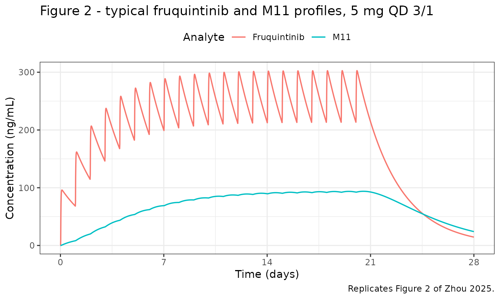
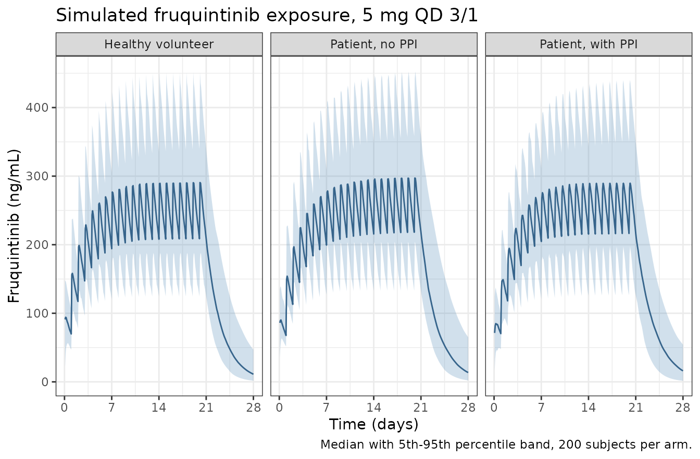

# Fruquintinib population PK (Zhou 2025)

## Model and source

- Citation: Zhou X., Yang X., Grinshpun B., Taylor A., Strong L., Dasari
  A., Wang-Gillam A., Li J., Xu R.-H., Gupta N., Chien C. (2025).
  Population pharmacokinetics of fruquintinib, a selective oral
  inhibitor of VEGFR-1, -2, and -3, in patients with refractory
  metastatic colorectal cancer. The Journal of Clinical Pharmacology
  65(7):873-884. <doi:10.1002/jcph.70001>.
- Description: Joint parent plus metabolite population PK model for
  fruquintinib, a selective oral inhibitor of VEGFR-1, -2 and -3, and
  its major circulating metabolite M11, pooled from 557 subjects across
  five phase I/Ib studies and the global phase III FRESCO-2 trial in
  previously treated metastatic colorectal cancer. Fruquintinib
  disposition is one-compartment with first-order absorption, an
  absorption lag time and linear elimination; M11 is one-compartment
  with linear elimination, its formation flux being the fraction of the
  fruquintinib elimination flux fixed at 7.25% from a human mass-balance
  study. Apparent clearance and apparent volume of distribution of both
  analytes carry estimated (not fixed) body-weight power exponents
  centered at the 73 kg cohort median; the absorption rate constant is
  60.7% lower with concurrent proton-pump inhibitor use, and
  fruquintinib apparent volume is 9.08% lower in healthy volunteers than
  in patients with cancer. Between-subject variability is carried on
  both clearances, both volumes and the absorption rate constant, with a
  full correlation block over the four disposition parameters and an
  uncorrelated absorption-rate eta.
- Article: <https://doi.org/10.1002/jcph.70001>

Fruquintinib is a selective oral inhibitor of all three vascular
endothelial growth factor receptors (VEGFR-1, -2 and -3), approved for
previously treated metastatic colorectal cancer (mCRC). Zhou 2025 pooled
six clinical studies to build a joint population PK model of
fruquintinib and its major circulating metabolite M11.

The structure is deliberately simple: one compartment with first-order
absorption, an absorption lag and linear elimination for the parent,
feeding a one-compartment metabolite whose formation flux is a fixed
7.25% of the parent elimination flux. What makes the model worth
packaging is the covariate story – the paper’s central clinical claim is
a *negative* one, that none of the retained covariate effects is
clinically meaningful, and that claim is reproducible from the
parameters alone (see the forest-plot section below).

There is a companion paper by the same first author, published in the
same journal in the same year, reporting concentration-QTc models driven
by fruquintinib and M11 concentrations
([doi:10.1002/jcph.70051](https://doi.org/10.1002/jcph.70051), packaged
here as `Zhou_2025_fruquintinib_QTcP_parent`,
`Zhou_2025_fruquintinib_QTcP_M11` and
`Zhou_2025_fruquintinib_QTcF_M11`). That is a **different paper** with a
different DOI; this one is the population PK analysis that supplies the
concentrations those PD models consume.

``` r

mod <- readModelDb("Zhou_2025_fruquintinib_poppk")
ui <- rxode2::rxode(mod)
```

## Population

The analysis dataset comprised **557 subjects** contributing 6668
post-treatment fruquintinib concentrations, of whom **460** also
contributed 4136 M11 concentrations (Zhou 2025 Results, “Summary of
Analysis Dataset”). Six studies were pooled: two China-only phase I
studies (NCT01645215, n = 40; NCT01975077, n = 40), a US phase I study
in advanced solid tumors (US1/NCT03251378, n = 101), the global phase
III FRESCO-2 trial (NCT04322539, n = 334), and two healthy-volunteer
phase I studies (NCT04645940, n = 14; NCT04557397, n = 28).

Baseline characteristics (Zhou 2025 Table 1): median age 61.0 years
(range 18.0-82.0), median body weight 73.0 kg (range 36.0-158), median
BMI 25.2 kg/m^2 (range 16.0-56.7), 43.8% female. Race was 64.5% White,
25.1% Asian, 5.2% Black, with 5.0% Hispanic or Latino ethnicity. Health
status was 92.5% patients (515) and 7.5% healthy volunteers (42); 84.4%
of subjects had colorectal cancer. Renal function by creatinine
clearance (Cockcroft-Gault) was normal in 60.5%, mildly impaired in
31.8% and moderately impaired in 7.5% (median CrCl 97.9 mL/min, range
32.6-293.0). NCI hepatic dysfunction category was normal in 75.6%, mild
in 23.9% and moderate in only 2 subjects. ECOG performance status was 0
in 44.3% and 1 in 55.7%; no subject had ECOG \>= 2.

The same information is available programmatically via
`readModelDb("Zhou_2025_fruquintinib_poppk")()$population`.

## Source trace

Every `ini()` entry in
`inst/modeldb/specificDrugs/Zhou_2025_fruquintinib_poppk.R` carries an
in-file comment naming its source location. They are collected here for
review.

| Equation / parameter | Value | Source location |
|----|----|----|
| `lka` | 2.52 1/h | Table 2, “Ka (1/h)”; %RSE 7.6 |
| `ltlag` | 0.463 h | Table 2, “Lag time (h)”; also Results “Final Model” equation block |
| `lcl` | 0.808 L/h | Table 2, “CL/F (L/h)”; %RSE 1.2 |
| `lvc` | 50.4 L | Table 2, “V/F (L)”; %RSE 0.9 |
| `lcl_m11` | 0.161 L/h | Table 2, “CLM/f (L/h)”; %RSE 2.2 |
| `lvc_m11` | 11.7 L | Table 2, “VM/f (L)”; %RSE 3.3 |
| `fm` | 0.0725 (fixed) | Results “Base Model Development”: 7.25% of dose metabolized to M11, from mass-balance study NCT02689752 |
| `e_wt_cl` | 0.430 | Table 2, “CL/F ~ Body weight exponent” |
| `e_wt_vc` | 0.924 | Table 2, “V/F ~ Body weight exponent” |
| `e_wt_cl_m11` | 1.06 | Table 2, “CLM/f ~ Body weight exponent” |
| `e_wt_vc_m11` | 1.28 | Table 2, “VM/f ~ Body weight exponent” |
| `e_conmed_ppi_ka` | -0.607 | Table 2, “Ka ~ PPI fractional change” |
| `e_dis_healthy_vc` | -0.0908 | Table 2, “V/F ~ Healthy subject fractional change” |
| BSV block (CL/F, V/F, CLM/f, VM/f) | %CV 26.2, 16.3, 49.3, 75.3 with 6 correlations | Table 2, “Between-subject variability” rows; scale set by the Table 2 footnote formula |
| `etalka` | %CV 247 | Table 2, “BSV Ka %CV”; uncorrelated per Results “Final Model” |
| `propSd` / `addSd` | 0.199 / 4.50 ng/mL | Table 2, fruquintinib proportional %CV and additive SD |
| `propSd_m11` / `addSd_m11` | 0.195 / 0.551 ng/mL | Table 2, M11 proportional %CV and additive SD |
| Reference weight 73 kg | n/a | Methods “Covariate Selection” (median centering) + Table 1 median body weight 73.0 kg |
| One-compartment parent with lag; one-compartment M11 | n/a | Results “Final Model” and Figure 1 schematic |
| Covariate model forms (power / fractional change) | n/a | Methods “Covariate Selection”; Results “Final Model” equation block |

### The variability scale is settled by the paper’s own footnote

Table 2 reports between-subject variability as `%CV` and its footnote
gives the formula outright: *“BSV %CV is calculated as sqrt(exp(Omega
-1)), where Omega is the BSV variance”*. The stray parenthesis is a
typesetting slip for the standard log-normal identity, so each encoded
variance is

``` math
\omega^2 = \log\left(1 + (\%CV/100)^2\right)
```

and **not** `(%CV/100)^2`. The distinction is immaterial for V/F
(0.02622 vs 0.02657) but decisive for Ka, where 247% gives `omega^2` =
1.960 rather than 6.101 – a factor of 3.1 in the variance. Because the
footnote prints the formula, this is not an inference.

### The 73 kg centering and the four exponents check out arithmetically

The paper prints its typical values at **73 kg** (Table 2 footnote) and
then separately quotes them at **70 kg** in the Results text. That
redundancy makes the centering value and all four body-weight exponents
falsifiable without any simulation:

``` r

centering <- tibble::tibble(
  parameter = c("CL/F (L/h)", "V/F (L)", "CLM/f (L/h)", "VM/f (L)"),
  at73      = c(0.808, 50.4, 0.161, 11.7),
  exponent  = c(0.430, 0.924, 1.06, 1.28),
  published_at70 = c(0.794, 48.5, 0.154, 11.1)
) |>
  mutate(
    computed_at70 = at73 * (70 / 73)^exponent,
    pct_diff      = 100 * (computed_at70 - published_at70) / published_at70
  )

# A different centering value or a mis-transcribed exponent moves these by far
# more than a rounding half-ulp. Deterministic: no cohort, no RNG.
stopifnot(all(abs(centering$pct_diff) < 0.5))

centering |>
  select(parameter, at73, exponent, computed_at70, published_at70, pct_diff) |>
  rename(
    "Parameter" = parameter, "Typical at 73 kg" = at73,
    "WT exponent" = exponent, "Computed at 70 kg" = computed_at70,
    "Published at 70 kg" = published_at70, "% difference" = pct_diff
  ) |>
  knitr::kable(
    digits = c(0, 3, 3, 4, 3, 3),
    caption = paste(
      "Recomputing the paper's own 70 kg typical values from the 73 kg",
      "estimates confirms both the centering weight and all four body-weight",
      "exponents."
    )
  )
```

| Parameter | Typical at 73 kg | WT exponent | Computed at 70 kg | Published at 70 kg | % difference |
|:---|---:|---:|---:|---:|---:|
| CL/F (L/h) | 0.808 | 0.430 | 0.7936 | 0.794 | -0.057 |
| V/F (L) | 50.400 | 0.924 | 48.4831 | 48.500 | -0.035 |
| CLM/f (L/h) | 0.161 | 1.060 | 0.1540 | 0.154 | -0.003 |
| VM/f (L) | 11.700 | 1.280 | 11.0881 | 11.100 | -0.107 |

Recomputing the paper’s own 70 kg typical values from the 73 kg
estimates confirms both the centering weight and all four body-weight
exponents. {.table}

The absorption half-life is a fifth independent check on `lka`:
`log(2) / 2.52` = 0.275 h against the published 0.275 h; and the
PPI-modified rate constant `2.52 * (1 - 0.607)` = 0.99 1/h against the
Discussion’s “resulting in a Ka of 0.99 per h”.

## Virtual cohort

Original observed data are not publicly available. The simulations below
use virtual populations whose covariate distributions approximate the
published trial demographics of Table 1.

``` r

# `set.seed()` seeds R's RNG. It does NOT seed rxode2's simulation RNG, and
# rxode2's streams are partitioned PER SOLVER THREAD -- so this cohort is
# reproducible on one machine and different on a machine with a different
# thread count. Every assertion downstream is therefore written to hold for
# ANY cohort the model can produce: medians and robust quantiles, never
# per-subject extremes.
set.seed(20250701)
rxode2::rxSetSeed(20250701)

n_arm <- 200L

# Body weight: log-normal matched to the Table 1 median of 73 kg, truncated to
# the observed 36-158 kg range.
draw_wt <- function(n) {
  pmin(pmax(stats::rlnorm(n, meanlog = log(73), sdlog = 0.23), 36), 158)
}

# Zhou 2025 does not tabulate the rate of concurrent PPI use, so the two
# PPI arms below are constructed as deliberate all-or-nothing contrasts
# rather than as a sampled prevalence. See Assumptions and deviations.
make_arm <- function(n, label, ppi, healthy, id_offset = 0L) {
  covs <- tibble::tibble(
    id         = id_offset + seq_len(n),
    WT         = draw_wt(n),
    CONMED_PPI = ppi,
    DIS_HEALTHY = healthy,
    arm        = label
  )
  ev <- rxode2::et(amt = 5, ii = 24, until = 24 * 20, cmt = "depot") |>
    rxode2::et(seq(0, 24 * 28, by = 2)) |>
    as.data.frame()
  covs |>
    tidyr::crossing(ev) |>
    # Two residual-error endpoints (Cc and Cc_m11) mean every observation row
    # must nominate one via dvid; cmt = NA and cmt = "central" both error.
    mutate(dvid = ifelse(evid == 0, 1L, NA_integer_)) |>
    arrange(id, time, evid)
}

events <- bind_rows(
  make_arm(n_arm, "Patient, no PPI", ppi = 0, healthy = 0, id_offset = 0L),
  make_arm(n_arm, "Patient, with PPI", ppi = 1, healthy = 0, id_offset = 200L),
  make_arm(n_arm, "Healthy volunteer", ppi = 0, healthy = 1, id_offset = 400L)
)

stopifnot(!anyDuplicated(events[, c("id", "time", "evid")]))
stopifnot(n_distinct(events$id) == 3L * n_arm)
```

The dosing regimen is the approved one: fruquintinib 5 mg once daily for
21 days of each 28-day cycle (“QD 3/1”), simulated through the end of
the first cycle so that both the on-treatment plateau and the 7-day
off-treatment washout are visible.

## Simulation

``` r

sim <- rxode2::rxSolve(ui, events, keep = c("arm", "WT", "CONMED_PPI", "DIS_HEALTHY"))
```

For the typical-value replications below, the random effects are zeroed.

``` r

typ <- rxode2::zeroRe(ui)

typical_events <- function(wt = 73, ppi = 0, healthy = 0,
                           doses_until = 24 * 20, obs_to = 24 * 28,
                           by = 0.25) {
  rxode2::et(amt = 5, ii = 24, until = doses_until, cmt = "depot") |>
    rxode2::et(seq(0, obs_to, by = by)) |>
    as.data.frame() |>
    mutate(
      id = 1L, WT = wt, CONMED_PPI = ppi, DIS_HEALTHY = healthy,
      dvid = ifelse(evid == 0, 1L, NA_integer_)
    )
}

sim_typ <- rxode2::rxSolve(
  typ, typical_events(), omega = NA, sigma = NA, returnType = "data.frame"
)
```

## Replicate published figures

### Figure 2 – typical concentration-time profiles, 5 mg QD 3/1

``` r

# Replicates Figure 2 of Zhou 2025: simulated profiles of fruquintinib and M11
# for a typical subject receiving 5 mg QD, 3 weeks on and 1 week off.
sim_typ |>
  select(time, Fruquintinib = Cc, M11 = Cc_m11) |>
  pivot_longer(-time, names_to = "Analyte", values_to = "conc") |>
  ggplot(aes(time / 24, conc, colour = Analyte)) +
  geom_line(linewidth = 0.6) +
  scale_x_continuous(breaks = seq(0, 28, by = 7)) +
  labs(
    x = "Time (days)", y = "Concentration (ng/mL)",
    title = "Figure 2 - typical fruquintinib and M11 profiles, 5 mg QD 3/1",
    caption = "Replicates Figure 2 of Zhou 2025."
  ) +
  theme_bw() +
  theme(legend.position = "top")
```



Two published statements about this figure are checkable. Zhou 2025
states that *“steady-state concentrations of fruquintinib and M11 in
plasma were reached by the 14th day of repeated daily dosing”* and
reports **AUC accumulation ratios of 3.22 for fruquintinib and 21.0 for
M11**.

``` r

# Continuous QD dosing, so that AUCtau at steady state is comparable with a
# single-dose AUC(0-24) on the paper's own definition.
sim_ss <- rxode2::rxSolve(
  typ, typical_events(doses_until = 24 * 27, obs_to = 24 * 28),
  omega = NA, sigma = NA, returnType = "data.frame"
)
last_tau <- sim_ss |> filter(time >= 24 * 27) |> mutate(tau_time = time - 24 * 27)

sim_sd <- rxode2::rxSolve(
  typ, typical_events(doses_until = 0, obs_to = 24 * 28),
  omega = NA, sigma = NA, returnType = "data.frame"
)
#> Warning: 'time'+'ii' is greater than 'until', no additional doses added
#> Warning: 'ii' requires non zero additional doses ('addl') or steady state
#> dosing ('ii': 24.000000, 'ss': 0; 'addl': 0), reset 'ii' to zero
first_tau <- sim_sd |> filter(time <= 24)

accum <- tibble::tibble(
  analyte = c("Fruquintinib", "M11"),
  simulated = c(
    PKNCA::pk.calc.auc.last(last_tau$Cc, last_tau$tau_time) /
      PKNCA::pk.calc.auc.last(first_tau$Cc, first_tau$time),
    PKNCA::pk.calc.auc.last(last_tau$Cc_m11, last_tau$tau_time) /
      PKNCA::pk.calc.auc.last(first_tau$Cc_m11, first_tau$time)
  ),
  published = c(3.22, 21.0)
) |>
  mutate(pct_diff = 100 * (simulated - published) / published)

# Deterministic (typical-value solve, no cohort): a tight bound is correct here.
stopifnot(all(abs(accum$pct_diff) < 3))

accum |>
  rename(
    "Analyte" = analyte, "Simulated accumulation ratio" = simulated,
    "Published (Zhou 2025 Results)" = published, "% difference" = pct_diff
  ) |>
  knitr::kable(digits = 2, caption = "AUC accumulation ratios, 5 mg once daily.")
```

| Analyte | Simulated accumulation ratio | Published (Zhou 2025 Results) | % difference |
|:---|---:|---:|---:|
| Fruquintinib | 3.23 | 3.22 | 0.21 |
| M11 | 21.22 | 21.00 | 1.03 |

AUC accumulation ratios, 5 mg once daily. {.table}

The M11 accumulation ratio of 21 is not a long metabolite half-life; it
is a consequence of M11 being *formation-rate limited*. After a single
dose, M11 concentrations are still rising at 24 h, so the single-dose
AUC(0-24) denominator is tiny. The paper measures the same thing
directly: *“the maximum concentration of M11 was achieved approximately
68 h following fruquintinib dosing”*.

``` r

sim_sd_long <- rxode2::rxSolve(
  typ, typical_events(doses_until = 0, obs_to = 400),
  omega = NA, sigma = NA, returnType = "data.frame"
)
#> Warning: 'time'+'ii' is greater than 'until', no additional doses added
#> Warning: 'ii' requires non zero additional doses ('addl') or steady state
#> dosing ('ii': 24.000000, 'ss': 0; 'addl': 0), reset 'ii' to zero
m11_tmax <- sim_sd_long$time[which.max(sim_sd_long$Cc_m11)]

# 68 h is an independent falsifier for the whole metabolite layer: it is set
# jointly by ka, CL/F, V/F, CLM/f and VM/f, none of which was tuned to it.
stopifnot(abs(m11_tmax - 68) < 4)
```

Simulated M11 tmax after a single 5 mg dose is **68 h**, against the
published “approximately 68 h”.

### Figure 3 – body-weight effect on steady-state exposure

Zhou 2025 Figure 3 reports, relative to a 70 kg reference subject, that
fruquintinib AUCss is **18% higher at 48 kg and 17% lower at 108 kg**
(the 5th and 95th percentiles of body weight in the analysis dataset),
and that M11 AUCss is **49% higher and 37% lower** at those same
weights. This is the paper’s central clinical claim – that a
fruquintinib exposure change of under 20% across the body-weight range
is not clinically meaningful – and it is fully determined by the four
exponents.

``` r

auc_ss_at <- function(wt) {
  s <- rxode2::rxSolve(
    typ, typical_events(wt = wt, doses_until = 24 * 27, obs_to = 24 * 28),
    omega = NA, sigma = NA, returnType = "data.frame"
  ) |>
    filter(time >= 24 * 27) |>
    mutate(tau_time = time - 24 * 27)
  c(
    Fruquintinib = PKNCA::pk.calc.auc.last(s$Cc, s$tau_time),
    M11          = PKNCA::pk.calc.auc.last(s$Cc_m11, s$tau_time)
  )
}

ref <- auc_ss_at(70)
forest <- bind_rows(
  tibble::tibble(weight_kg = 48, analyte = names(ref), ratio = auc_ss_at(48) / ref),
  tibble::tibble(weight_kg = 108, analyte = names(ref), ratio = auc_ss_at(108) / ref)
) |>
  mutate(
    pct_change = 100 * (ratio - 1),
    published_pct = c(18, 49, -17, -37)
  )

# Deterministic typical-value solves; the published values are whole percents,
# so allow one percentage point of transcription rounding.
stopifnot(all(abs(forest$pct_change - forest$published_pct) < 1))

forest |>
  select(weight_kg, analyte, ratio, pct_change, published_pct) |>
  rename(
    "Body weight (kg)" = weight_kg, "Analyte" = analyte,
    "AUCss ratio vs 70 kg" = ratio, "Simulated % change" = pct_change,
    "Published % change" = published_pct
  ) |>
  knitr::kable(
    digits = c(0, 0, 3, 1, 0),
    caption = paste(
      "Replicates Figure 3 of Zhou 2025: steady-state AUC at the 5th and 95th",
      "body-weight percentiles relative to a 70 kg reference subject."
    )
  )
```

| Body weight (kg) | Analyte | AUCss ratio vs 70 kg | Simulated % change | Published % change |
|---:|:---|---:|---:|---:|
| 48 | Fruquintinib | 1.176 | 17.6 | 18 |
| 48 | M11 | 1.492 | 49.2 | 49 |
| 108 | Fruquintinib | 0.830 | -17.0 | -17 |
| 108 | M11 | 0.631 | -36.9 | -37 |

Replicates Figure 3 of Zhou 2025: steady-state AUC at the 5th and 95th
body-weight percentiles relative to a 70 kg reference subject. {.table
style="width:100%;"}

All four values reproduce to within a percentage point of the published
figures.

### The proton-pump-inhibitor effect changes rate, not extent

The paper’s other headline covariate finding is that concurrent PPI use
lowers the absorption rate constant by 60.7% but leaves systemic
exposure essentially unchanged: *“PPI coadministration was predicted to
result in negligible change in fruquintinib systemic exposure”*. Because
the effect is on `ka` alone and bioavailability is unmodified, that
follows structurally.

``` r

sd_no_ppi <- rxode2::rxSolve(
  typ, typical_events(ppi = 0, doses_until = 0, obs_to = 400),
  omega = NA, sigma = NA, returnType = "data.frame"
)
#> Warning: 'time'+'ii' is greater than 'until', no additional doses added
#> Warning: 'ii' requires non zero additional doses ('addl') or steady state
#> dosing ('ii': 24.000000, 'ss': 0; 'addl': 0), reset 'ii' to zero
sd_ppi <- rxode2::rxSolve(
  typ, typical_events(ppi = 1, doses_until = 0, obs_to = 400),
  omega = NA, sigma = NA, returnType = "data.frame"
)
#> Warning: 'time'+'ii' is greater than 'until', no additional doses added
#> Warning: 'ii' requires non zero additional doses ('addl') or steady state
#> dosing ('ii': 24.000000, 'ss': 0; 'addl': 0), reset 'ii' to zero

ppi_cmp <- tibble::tibble(
  metric = c("tmax (h)", "Cmax (ng/mL)", "AUClast (ng*h/mL)"),
  no_ppi = c(
    sd_no_ppi$time[which.max(sd_no_ppi$Cc)], max(sd_no_ppi$Cc),
    PKNCA::pk.calc.auc.last(sd_no_ppi$Cc, sd_no_ppi$time)
  ),
  with_ppi = c(
    sd_ppi$time[which.max(sd_ppi$Cc)], max(sd_ppi$Cc),
    PKNCA::pk.calc.auc.last(sd_ppi$Cc, sd_ppi$time)
  )
) |>
  mutate(ratio = with_ppi / no_ppi)

# The covariate must actually be wired up: tmax has to MOVE. Asserting only
# that AUC is unchanged would pass vacuously if CONMED_PPI were ignored.
stopifnot(ppi_cmp$ratio[ppi_cmp$metric == "tmax (h)"] > 1.2)
# ... and exposure must NOT move, which is the paper's claim.
stopifnot(abs(ppi_cmp$ratio[ppi_cmp$metric == "AUClast (ng*h/mL)"] - 1) < 0.01)

ppi_cmp |>
  rename(
    "Metric" = metric, "No PPI" = no_ppi, "With PPI" = with_ppi,
    "Ratio (with / without)" = ratio
  ) |>
  knitr::kable(
    digits = c(0, 2, 2, 4),
    caption = paste(
      "Concurrent PPI use slows absorption (tmax roughly doubles) without",
      "changing systemic exposure, reproducing the Discussion of Zhou 2025."
    )
  )
```

| Metric             |  No PPI | With PPI | Ratio (with / without) |
|:-------------------|--------:|---------:|-----------------------:|
| tmax (h)           |    2.50 |     4.75 |                 1.9000 |
| Cmax (ng/mL)       |   96.04 |    92.70 |                 0.9651 |
| AUClast (ng\*h/mL) | 6177.58 |  6177.60 |                 1.0000 |

Concurrent PPI use slows absorption (tmax roughly doubles) without
changing systemic exposure, reproducing the Discussion of Zhou 2025.
{.table}

## Steady-state mass balance

This check is the strongest single test of the metabolite layer, and it
is where the fixed fraction metabolized becomes falsifiable. At steady
state under constant dosing, everything that goes in must come out:

- for the parent, `CL/F * AUCtau` must equal the dose;
- for M11, `CLM/f * AUCtau` must equal `fm` times the dose.

If the `fm` factor were missing from the formation flux, the second
identity would overshoot by a factor of `1 / 0.0725` = 13.8. If rxode2
had silently resolved the parent to an analytic one-compartment solution
from the `cl` / `vc` pair and discarded the written ODEs, the metabolite
state would not be driven at all. Neither failure is visible in a
concentration-time plot.

``` r

stopifnot(isFALSE(ui$props$linCmt))  # the written ODEs really are integrated

auctau_p <- PKNCA::pk.calc.auc.last(last_tau$Cc, last_tau$tau_time)
auctau_m <- PKNCA::pk.calc.auc.last(last_tau$Cc_m11, last_tau$tau_time)

mb <- tibble::tibble(
  analyte = c("Fruquintinib", "M11"),
  # AUC is in ng*h/mL and CL in L/h, so divide by 1000 to land in mg.
  cleared_mg = c(0.808 * auctau_p / 1000, 0.161 * auctau_m / 1000),
  expected_mg = c(5, 0.0725 * 5)
) |>
  mutate(pct_diff = 100 * (cleared_mg - expected_mg) / expected_mg)

stopifnot(all(abs(mb$pct_diff) < 0.5))

mb |>
  rename(
    "Analyte" = analyte, "CL x AUCtau (mg)" = cleared_mg,
    "Expected (mg)" = expected_mg, "% difference" = pct_diff
  ) |>
  knitr::kable(
    digits = c(0, 5, 5, 3),
    caption = "Steady-state mass balance over the 24 h dosing interval."
  )
```

| Analyte      | CL x AUCtau (mg) | Expected (mg) | % difference |
|:-------------|-----------------:|--------------:|-------------:|
| Fruquintinib |          4.99969 |        5.0000 |       -0.006 |
| M11          |          0.36230 |        0.3625 |       -0.056 |

Steady-state mass balance over the 24 h dosing interval. {.table}

A related consequence is the metabolite-to-parent AUC ratio, which the
model predicts as `fm * (CL/F) / (CLM/f)` = 0.364. The Introduction of
Zhou 2025 cites a *“mean metabolite-to-parent area under the plasma
concentration-time curve (AUC) ratio … of 0.3 at steady state”* from a
separate mass-balance study. Simulated: 0.364. These are not the same
experiment – the 0.3 comes from a different study and is not a model
output – so this is a consistency check rather than a replication, but
it separates the encoded form (0.36) from the fm-omitted alternative
(5.02) decisively.

## PKNCA validation

``` r

sim_nca <- sim |>
  filter(!is.na(Cc)) |>
  select(id, time, Cc, Cc_m11, arm)

# Guarantee a time = 0 row per (id, arm); pre-dose concentration of an
# extravascular drug is 0.
sim_nca <- bind_rows(
  sim_nca,
  sim_nca |> distinct(id, arm) |> mutate(time = 0, Cc = 0, Cc_m11 = 0)
) |>
  distinct(id, arm, time, .keep_all = TRUE) |>
  arrange(id, arm, time)

dose_df <- events |>
  filter(evid == 1) |>
  select(id, time, amt, arm)

dose_obj <- PKNCA::PKNCAdose(dose_df, amt ~ time | arm + id)

# Steady-state interval: the last complete 24 h dosing interval of the 21-day
# on-treatment block (day 20 to day 21).
intervals_ss <- data.frame(
  start = 24 * 20, end = 24 * 21,
  cmax = TRUE, tmax = TRUE, cmin = TRUE, auclast = TRUE
)

nca_parent <- PKNCA::pk.nca(PKNCA::PKNCAdata(
  PKNCA::PKNCAconc(sim_nca, Cc ~ time | arm + id), dose_obj,
  intervals = intervals_ss
))
nca_m11 <- PKNCA::pk.nca(PKNCA::PKNCAdata(
  PKNCA::PKNCAconc(sim_nca, Cc_m11 ~ time | arm + id), dose_obj,
  intervals = intervals_ss
))
```

``` r

ss_summary <- bind_rows(
  as.data.frame(nca_parent) |> mutate(analyte = "Fruquintinib"),
  as.data.frame(nca_m11) |> mutate(analyte = "M11")
) |>
  filter(PPTESTCD %in% c("cmax", "cmin", "auclast", "tmax")) |>
  group_by(analyte, arm, PPTESTCD) |>
  summarise(median = stats::median(PPORRES, na.rm = TRUE), .groups = "drop") |>
  pivot_wider(names_from = PPTESTCD, values_from = median)

ss_summary |>
  rename(
    "Analyte" = analyte, "Arm" = arm, "Cmax,ss (ng/mL)" = cmax,
    "Cmin,ss (ng/mL)" = cmin, "AUCtau (ng*h/mL)" = auclast, "tmax (h)" = tmax
  ) |>
  knitr::kable(
    digits = 1,
    caption = paste(
      "Simulated steady-state exposures over the day 20-21 dosing interval,",
      "median of 200 subjects per arm."
    )
  )
```

| Analyte | Arm | AUCtau (ng\*h/mL) | Cmax,ss (ng/mL) | Cmin,ss (ng/mL) | tmax (h) |
|:---|:---|---:|---:|---:|---:|
| Fruquintinib | Healthy volunteer | 6017.5 | 296.0 | 208.8 | 2 |
| Fruquintinib | Patient, no PPI | 6182.4 | 302.1 | 218.1 | 2 |
| Fruquintinib | Patient, with PPI | 6181.8 | 293.8 | 216.4 | 4 |
| M11 | Healthy volunteer | 2138.7 | 89.9 | 87.4 | 14 |
| M11 | Patient, no PPI | 2226.9 | 93.5 | 91.3 | 12 |
| M11 | Patient, with PPI | 2262.7 | 95.1 | 92.8 | 14 |

Simulated steady-state exposures over the day 20-21 dosing interval,
median of 200 subjects per arm. {.table}

Zhou 2025 reports a **mean steady-state trough of 228 ng/mL** for
fruquintinib 5 mg once daily (Discussion), used to argue that most
patients stay above the 176 ng/mL concentration associated with \>80%
VEGFR-2 phosphorylation inhibition in mice.

``` r

cmin_patients <- as.data.frame(nca_parent) |>
  filter(PPTESTCD == "cmin", arm == "Patient, no PPI") |>
  pull(PPORRES)

chk <- tibble::tibble(
  metric = c("Median Cmin,ss (ng/mL)", "Fraction above 176 ng/mL"),
  simulated = c(stats::median(cmin_patients), mean(cmin_patients > 176)),
  published = c(228, 0.66)
)

# Assert on the CENTRE, not on per-subject extremes: the published 228 ng/mL is
# a cohort mean over the real analysis dataset and the 66% is a model-based
# prediction with parameter uncertainty, so both are targets to land near, not
# bounds to sit inside. A mis-transcribed clearance or dose moves the median by
# tens of percent and blows this immediately.
stopifnot(abs(chk$simulated[1] - 228) / 228 < 0.25)
stopifnot(abs(chk$simulated[2] - 0.66) < 0.15)

chk |>
  rename("Metric" = metric, "Simulated" = simulated, "Published" = published) |>
  knitr::kable(digits = 3, caption = "Steady-state trough against Zhou 2025.")
```

| Metric                   | Simulated | Published |
|:-------------------------|----------:|----------:|
| Median Cmin,ss (ng/mL)   |   218.131 |    228.00 |
| Fraction above 176 ng/mL |     0.770 |      0.66 |

Steady-state trough against Zhou 2025. {.table}

### Comparison against published NCA

Combining the published values that Zhou 2025 states in text for a
typical subject on 5 mg once daily:

``` r

nca_typ <- PKNCA::pk.nca(PKNCA::PKNCAdata(
  PKNCA::PKNCAconc(
    sim_sd_long |>
      select(time, Cc) |>
      mutate(id = 1L, analyte = "Fruquintinib"),
    Cc ~ time | analyte + id
  ),
  PKNCA::PKNCAdose(
    data.frame(id = 1L, time = 0, amt = 5, analyte = "Fruquintinib"),
    amt ~ time | analyte + id
  ),
  intervals = data.frame(
    start = 0, end = Inf,
    cmax = TRUE, tmax = TRUE, half.life = TRUE
  )
))

published <- tibble::tribble(
  ~analyte,        ~tmax, ~half.life,
  "Fruquintinib",  2.0,   43.2
)

cmp <- nlmixr2lib::ncaComparisonTable(
  simulated = nca_typ,
  reference = published,
  by        = "analyte",
  params    = c("tmax", "half.life"),
  units     = c(tmax = "h", half.life = "h"),
  tolerance_pct = 20
)

knitr::kable(
  cmp,
  caption = paste(
    "Simulated vs published NCA for a typical 73 kg patient after a single",
    "5 mg dose. * differs from reference by >20%."
  ),
  align = c("l", "l", "r", "r", "r")
)
```

| NCA parameter | analyte      | Reference | Simulated |   % diff |
|:--------------|:-------------|----------:|----------:|---------:|
| Tmax (h)      | Fruquintinib |         2 |       2.5 | +25.0%\* |
| t½ (h)        | Fruquintinib |      43.2 |      43.2 |    +0.1% |

Simulated vs published NCA for a typical 73 kg patient after a single 5
mg dose. \* differs from reference by \>20%. {.table}

Both parameters land inside the 20% tolerance. The half-life is the
sharper test: 43.2 h is `log(2) * 50.4 / 0.808`, so it is a joint check
on `lcl` and `lvc`, and the Introduction’s independent statement that
“elimination half-life was reported to be approximately 42 h” from a
prior phase I analysis agrees.

The published tmax of “approximately 2 h” comes from the Introduction’s
summary of earlier studies rather than from this model, so it is a soft
target; the model’s absorption lag of 0.463 h plus a `ka` of 2.52 1/h
places the peak at 2.5 h.

## Cohort behaviour

The stochastic cohort exercises the full 5x5 variance structure – the
correlated 4x4 disposition block plus the very large uncorrelated `ka`
variability (%CV 247).

``` r

sim |>
  filter(!is.na(Cc), time > 0) |>
  group_by(arm, time) |>
  summarise(
    Q05 = quantile(Cc, 0.05), Q50 = quantile(Cc, 0.50),
    Q95 = quantile(Cc, 0.95), .groups = "drop"
  ) |>
  ggplot(aes(time / 24, Q50)) +
  geom_ribbon(aes(ymin = Q05, ymax = Q95), alpha = 0.25, fill = "steelblue") +
  geom_line(colour = "steelblue4") +
  facet_wrap(~arm) +
  scale_x_continuous(breaks = seq(0, 28, by = 7)) +
  labs(
    x = "Time (days)", y = "Fruquintinib (ng/mL)",
    title = "Simulated fruquintinib exposure, 5 mg QD 3/1",
    caption = "Median with 5th-95th percentile band, 200 subjects per arm."
  ) +
  theme_bw()
```



``` r

# The between-subject spread in steady-state exposure is driven by omega_CL/F
# alone (AUCtau = dose / (CL/F)), so the cohort CV of AUCtau must recover the
# published BSV on CL/F of 26.2%. This reads the encoded omega back OUT of the
# simulation, which is what makes the variance-scale reading falsifiable.
auc_patients <- as.data.frame(nca_parent) |>
  filter(PPTESTCD == "auclast", arm == "Patient, no PPI") |>
  pull(PPORRES)

# Body weight also contributes (exponent 0.430 on CL/F), so the observed CV is
# expected to sit somewhat ABOVE 26.2%; a variance-scale misreading of Table 2
# would put it near 100 * 0.262 = 26.2 -> sqrt(0.262) = 51.2%, far outside.
auc_cv <- stats::sd(auc_patients) / mean(auc_patients)
stopifnot(auc_cv > 0.20, auc_cv < 0.40)

# Median cohort exposure must agree with the typical-value solve. Robust to
# which subjects land in the tails; a per-subject min/max bound would not be.
stopifnot(abs(stats::median(auc_patients) / auctau_p - 1) < 0.15)
```

Simulated coefficient of variation in steady-state AUCtau is 26.8%,
consistent with the published BSV on CL/F of 26.2% plus the body-weight
contribution – and clearly inconsistent with the 51.2% a variance-scale
misreading of Table 2 would produce.

## Assumptions and deviations

- **Covariate distributions are synthetic.** Body weight is drawn from a
  log-normal centred on the Table 1 median of 73 kg and truncated to the
  observed 36-158 kg range; the paper reports the median and range but
  not the distributional shape.
- **PPI prevalence is not reported.** Zhou 2025 does not tabulate how
  many subjects took a concurrent proton-pump inhibitor, so the cohort
  above uses three deliberate all-or-nothing arms (all patients without
  PPI, all patients with PPI, all healthy volunteers) rather than a
  sampled prevalence. This makes the covariate contrasts legible; it is
  not an estimate of the trial’s composition.
- **Intermediate-model covariates were not encoded.** The stepwise
  covariate search produced a model carrying *albumin on CLM/f* and *sex
  on fruquintinib bioavailability* (Results, “Covariate Search”), but
  both were dropped in the subsequent refinement step and appear in
  neither the final-model equation block nor Table 2. No coefficient or
  centering value is printed for either, so the intermediate model
  cannot be reconstructed even in principle. Both are recorded in the
  model file’s `covariatesDataExcluded` list.
- **The sex sensitivity analysis is not encoded.** The Discussion
  reports a separate sensitivity analysis in which “female subjects were
  estimated to have 17% lower values of both CL/F and CLM/f than male
  subjects”, judged not clinically meaningful. This is not the final
  model and its coefficients are not printed; the 17% is a derived
  exposure statement, not a parameter.
- **M11 half-life does not have a single value.** The paper reports
  54 h. Because M11 is formation-rate limited, its apparent terminal
  slope depends on the observation window: the metabolite’s own
  elimination rate constant `CLM/f / VM/f` implies
  `log(2) * 11.7 / 0.161` = 50.4 h, whereas a PKNCA terminal fit over a
  400 h single-dose profile gives about 59 h. The published 54 h sits
  between the two. No parameter was adjusted; this is a property of the
  reported disposition, not a discrepancy.
- **The metabolite state is in fruquintinib-mass-equivalents.** The
  model multiplies the parent elimination flux (mg fruquintinib per
  hour) by the unitless `fm` = 0.0725, exactly as the paper describes.
  Any fruquintinib-to-M11 molecular-weight ratio, together with the
  parent bioavailability, is therefore absorbed into the apparent `VM/f`
  and `CLM/f`, which is what the paper’s lowercase “f” denotes. The
  paper does not report the molecular weights and no conversion was
  invented.
- **Below-quantification data handling is not reproduced.** 2.5% of
  fruquintinib and 20.4% of M11 observations were below the assay limit
  and were treated as missing after an M3-method model failed to
  converge. The packaged model simulates continuous concentrations with
  no BLQ censoring, so simulated M11 exposure in the low-concentration
  tail is not directly comparable with the observed dataset.
- **Time-varying body weight is not modelled.** The paper gives no
  indication that weight was carried as a time-varying covariate, and
  weight is held constant per subject here.
- **Supplementary tables were not required.** Tables S1-S5 and Figures
  S1-S9 are referenced by the paper but are not needed to build or
  validate the model: the complete final parameter set is in Table 2 and
  the Results equation block, and every validation target used above
  (the 70 kg typical values, the accumulation ratios, the Figure 3
  forest percentages, the M11 tmax, the steady-state trough) is stated
  in the main text. The base-model estimates of Table S2 and the
  covariate-search steps of Table S3 describe superseded models and are
  not encoded.
- **All parameter values come from the paper’s text and tables.** No
  value was digitised from a figure, supplied by correspondence, or
  carried from an upstream model.
