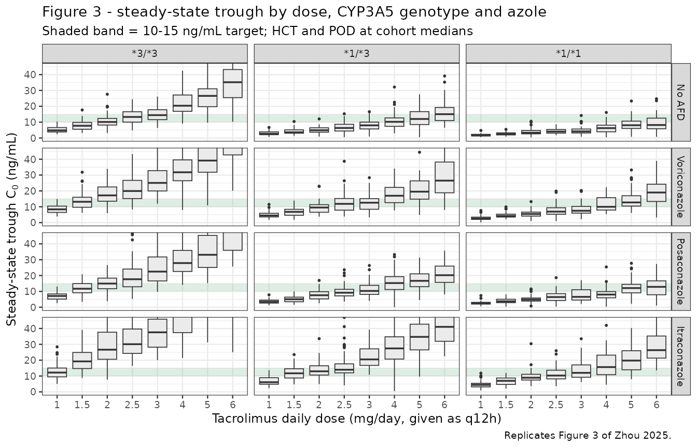
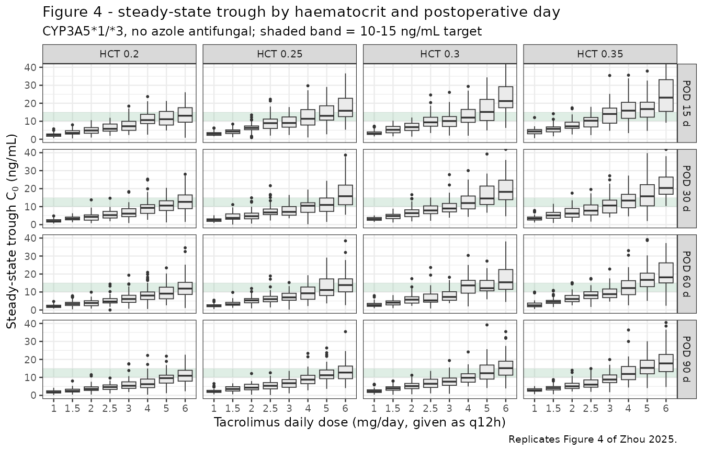

# Tacrolimus (Zhou 2025)

## Model and source

``` r

ui <- rxode2::rxode(readModelDb("Zhou_2025_tacrolimus"))
#> ℹ parameter labels from comments will be replaced by 'label()'

# Every solve in this vignette goes through this wrapper so the solver choice
# is made once, consistently.
#
# `method = "dop853"` is load-bearing, not cosmetic. The large IIV on Vd/F
# (omega^2 = 0.80, i.e. 111% CV) gives a minority of simulated subjects a small
# Vd/F and hence a large kel = CL/Vd, which makes the system stiff for the
# default lsoda solver. Those subjects fail with "excess work done on this
# call" and rxode2 replaces their predictions with NA *with only a warning* --
# 8 of 200 subjects at default tolerances. Tightening atol/rtol makes it
# strictly worse (22 of 200 at 1e-12; 32 of 200 with tightened steady-state
# tolerances), which is the signature of a stiff-solver work limit rather than
# an accuracy problem. dop853 solves all 200. See Assumptions and deviations.
#
# The one cost of dop853: being an explicit Runge-Kutta method it fails
# outright ("could not solve the system") on a degenerate event table whose
# only output time per subject is the end of the steady-state interval. Every
# event table below therefore carries intermediate observation times, and the
# quantity of interest is selected afterwards with filter(time == 12).
solve_model <- function(model, events, ...) {
  out <- rxode2::rxSolve(model, events, method = "dop853",
                         returnType = "data.frame", ...)
  # rxSolve omits `id` entirely for a single-subject event table.
  if (is.null(out$id)) out$id <- 1L
  out
}

# Silent per-subject solver failure is the failure mode this vignette is most
# exposed to, so assert against it rather than trusting the absence of an error.
assert_all_solved <- function(sim, expected_ids = NULL) {
  bad <- unique(sim$id[is.na(sim$Cc)])
  if (length(bad) > 0L) {
    stop(length(bad), " subject(s) failed to solve (NA Cc), e.g. ids ",
         paste(utils::head(bad, 10L), collapse = ", "), call. = FALSE)
  }
  if (!is.null(expected_ids) && !setequal(unique(sim$id), expected_ids)) {
    stop("solved subject set does not match the requested cohort", call. = FALSE)
  }
  invisible(sim)
}
```

- Citation: Zhou S, Lian Q, Luo H, Xie H, Guan Y, He J, Wei L, Ju C
  (2025). Population pharmacokinetic characteristics of tacrolimus in
  Chinese lung transplant recipients and optimisation of dosing regimen
  during the early post-transplantation phase. Eur J Clin Pharmacol
  81(12):1841-1852. <doi:10.1007/s00228-025-03920-9>.
- Article: <https://doi.org/10.1007/s00228-025-03920-9>
- PubMed Central:
  <https://www.ncbi.nlm.nih.gov/pmc/articles/PMC12680674/>

One-compartment population PK model with first-order absorption and
elimination for oral tacrolimus in Chinese adult lung transplant
recipients during the first three months post-transplantation (Zhou 2025
Eur J Clin Pharmacol, Phoenix NLME 8.2). Apparent oral clearance CL/F
carries four covariate effects: median-normalised power effects of
haematocrit and postoperative day, an exponential three-level CYP3A5*3
(rs776746) genotype effect with the* 3/\*3 poor metaboliser as
reference, and an exponential azole-antifungal effect with a separate
coefficient for each of voriconazole, posaconazole and itraconazole.
Absorption rate constant fixed at 4.48 1/h from the literature because
only trough concentrations were available; no covariate was retained on
Vd/F. Exponential IIV on both CL/F and Vd/F, combined
proportional-plus-additive residual error.

Zhou 2025 is, to the authors’ knowledge, the first population PK
analysis of tacrolimus that resolves all three CYP3A5 genotype strata in
a lung transplant cohort. The model is a one-compartment model with
first-order absorption and elimination fitted to 988 whole-blood trough
concentrations from 142 Chinese recipients in the first three months
after transplantation, with four covariates retained on apparent oral
clearance: CYP3A5\*3 genotype, haematocrit, postoperative day, and azole
antifungal co-medication resolved to the individual agent.

## Population

``` r

pop <- ui$population
```

The model was developed from 988 whole-blood tacrolimus trough
concentrations in 142 Chinese adult first-time lung transplant
recipients treated at the First Affiliated Hospital of Guangzhou Medical
University between January 2019 and December 2021 (Zhou 2025 Table 1).
The cohort was predominantly male (116 male / 26 female, 18.3% female),
older than most published tacrolimus cohorts (adults; Table 1 mean +/-
SD 57.10 +/- 11.46 years), and of low body weight (Table 1 mean +/- SD
50.26 +/- 11.13 kg). The primary indications were interstitial lung
disease (58), chronic obstructive pulmonary disease (44), bronchiectasis
(15) and other (25); 74 recipients received a single-lung and 68 a
double-lung transplant.

Two baseline features are load-bearing for the covariate model. First,
the cohort is markedly **anaemic** – haematocrit 0.28 +/- 0.05 (volume
fraction) and haemoglobin 90.73 +/- 17.86 g/L – which places the
haematocrit normalising median (0.265) far below the values used in
non-transplant models. Second, antifungal prophylaxis was
near-universal: of the 988 trough records, 741 were taken during
voriconazole, 157 during posaconazole and 38 during itraconazole
co-administration, leaving only 52 records (5.3%) with no azole on
board. Critically for the interpretation of those coefficients, Zhou
2025 Methods records that *no* enrolled patient received caspofungin,
Wuzhi capsule, macrolide antibiotics or calcium channel blockers, so the
competing CYP3A / P-gp perpetrators that confound many transplant TDM
datasets are absent here.

CYP3A5\*3 (rs776746) genotype distribution, in Hardy-Weinberg
equilibrium:

``` r

tibble::enframe(pop$cyp3a5_genotype, name = "CYP3A5 genotype", value = "Percent of cohort") |>
  knitr::kable(digits = 2, caption = "Zhou 2025 Table 1 -- CYP3A5*3 genotype distribution (n = 142).")
```

| CYP3A5 genotype | Percent of cohort |
|:----------------|------------------:|
| *3/*3 (GG)      |             51.41 |
| *1/*3 (GA)      |             39.44 |
| *1/*1 (AA)      |              9.15 |

Zhou 2025 Table 1 – CYP3A5\*3 genotype distribution (n = 142). {.table}

Tacrolimus (Prograf capsules) was started at 50-150 ug/kg/day given
every 12 h and titrated on trough concentration to a target of 10-15
ng/mL. The cohort mean daily dose was 2.51 +/- 1.37 mg/day and the mean
observed trough was 12.82 +/- 4.92 ng/mL. Sampling began only after
tacrolimus reached steady state (~48 h after the first dose), 30 min
pre-dose, assayed by CMIA on an Abbott ARCHITECT i1000SR.

The full metadata are available programmatically via
`rxode2::rxode(readModelDb("Zhou_2025_tacrolimus"))$population`.

## Source trace

Each `ini()` entry in
`inst/modeldb/specificDrugs/Zhou_2025_tacrolimus.R` carries an in-file
comment naming its source location. The table below collects them for
review.

| Equation / parameter | Value | Source location |
|----|----|----|
| Structural model: 1-compartment, first-order absorption + elimination | n/a | Results “Population pharmacokinetic modeling”; Discussion para. 2 |
| IIV form: `P_i = theta_i * exp(eta_i)` | n/a | Eq. 1 |
| Continuous covariate form: `theta * (COV/COV_median)^theta_COV` | n/a | Eq. 2 |
| Categorical covariate form: `theta * exp(theta_cov)` | n/a | Eq. 3 |
| Full CL/F covariate equation | n/a | Eq. 4 |
| `lka` (Ka) | 4.48 1/h, fixed | Table 2 (no RSE); Methods “Establishment of basic model”; Discussion para. 2 |
| `lcl` (CL/F) | 7.58 L/h | Table 2, final model (RSE 10.60%, bootstrap 7.55 \[6.14, 8.83\]); Eq. 4; Abstract |
| `lvc` (Vd/F) | 701.39 L | Table 2, final model (RSE 15.43%, bootstrap 684.78 \[531.16, 952.14\]); Abstract |
| `e_hct_cl` | -0.71 | Table 2 (RSE -19.03%, bootstrap -0.70 \[-0.88, -0.35\]); exponent printed in Eq. 4 |
| HCT normalising median | 0.265 (= 26.5% canonical scale) | Eq. 4 denominator |
| `e_pod_cl` | 0.14 | Table 2 (RSE 34.90%, bootstrap 0.13 \[0.02, 0.22\]); exponent printed in Eq. 4 |
| POD normalising median | 49 days | Eq. 4 denominator |
| `e_cyp3a5_het_cl` (\*1/\*3) | 0.63 | Table 2 (RSE 11.21%, bootstrap 0.62 \[0.51, 0.73\]); `exp(0.63) = 1.88` vs Eq. 4 “1.87” |
| `e_cyp3a5_hom_cl` (\*1/\*1) | 1.00 | Table 2 (RSE 9.23%, bootstrap 1.00 \[0.80, 1.19\]); `exp(1.00) = 2.72` vs Eq. 4 “2.72” |
| `e_vori_cl` | -0.48 | Table 2 (RSE -22.31%, bootstrap -0.46 \[-0.57, -0.25\]); `exp(-0.48) = 0.62` vs Eq. 4 “0.62” |
| `e_posa_cl` | -0.31 | Table 2 (RSE -31.83%, bootstrap -0.32 \[-0.55, -0.09\]); `exp(-0.31) = 0.73` vs Eq. 4 “0.74” |
| `e_itra_cl` | -0.87 | Table 2 (RSE -6.41%, bootstrap -0.86 \[-1.05, -0.54\]); `exp(-0.87) = 0.42` vs Eq. 4 “0.42” |
| `etalcl` (omega^2 CL) | 0.13 | Table 2 “Variability on CL/F” (RSE 18.49%, bootstrap 0.13) |
| `etalvc` (omega^2 Vd) | 0.80 | Table 2 “Variability on Vd/F” (RSE 21.22%, bootstrap 0.68) |
| `propSd` | 0.2158 | Table 2 “Proportional residual error (%)” -21.58 (RSE -10.57%, bootstrap -22.54 \[-26.91, -18.37\]) |
| `addSd` | 2.11 ng/mL | Table 2 “Additive residual error (ng/ml)” (RSE 17.34%, bootstrap 1.78 \[0.05, 2.53\]) |
| CL/F reference subject definition | \*3/\*3, no AFD, HCT 0.265, POD 49 d | Eq. 4 with CYP3A5 = 1 and AFDs = 1 |

The `units` metadata (time = h; dosing = mg; concentration = ng/mL)
imply a scale conversion: `central` is in mg and `vc` in L, so
`central / vc` is mg/L = ug/mL. The model multiplies by 1000 to report
the ng/mL used throughout Zhou 2025.

## Verification gate 1 – exact reproduction of Equation 4

Zhou 2025 Eq. 4 is

``` math
\mathrm{CL/F}\ (\mathrm{L\cdot h^{-1}}) = 7.58 \times
\left(\frac{\mathrm{HCT}}{0.265}\right)^{-0.71} \times
\left(\frac{\mathrm{POD}}{49}\right)^{0.14} \times
\mathrm{CYP3A5} \times \mathrm{AFDs}
```

with `CYP3A5` = 2.72 (\*1/\*1), 1.87 (\*1/\*3), 1 (\*3/\*3) and `AFDs` =
0.62 (voriconazole), 0.74 (posaconazole), 0.42 (itraconazole), 1 (no
AFD).

Because Table 2 reports these categorical effects on the **log scale**
and Eq. 4 prints their **back-transformed** multipliers, reproducing
both simultaneously is a strong check that the exponential (rather than
linear) reading of Eq. 3 is correct. The gate below solves the packaged
model with between-subject variability zeroed and compares each
covariate multiplier against the value printed in Eq. 4.

``` r

mod_typ <- rxode2::zeroRe(ui)

cov_reference <- tibble::tibble(
  HCT = 26.5, POD = 49,
  CYP3A5_STAR1_HET = 0, CYP3A5_STAR1_HOM = 0,
  CONMED_VORICONAZOLE = 0, CONMED_POSACONAZOLE = 0, CONMED_ITRACONAZOLE = 0
)

# One steady-state q12h event table for a single typical-value scenario. The
# observation grid is deliberately not a single point at t = 12 (see the
# solve_model() note); with intermediate output times dop853 agrees with lsoda
# and liblsoda on this model to five decimal places.
typical_events <- function(covs, amt = 1, obs_times = seq(0, 12, by = 0.5)) {
  ev <- tibble::tibble(
    time = 0, amt = amt, evid = 1L, cmt = "depot", ii = 12, ss = 1L
  ) |>
    dplyr::bind_rows(
      tibble::tibble(time = obs_times, amt = NA_real_, evid = 0L,
                     cmt = "central", ii = 0, ss = 0L)
    )
  as.data.frame(dplyr::bind_cols(ev, covs[rep(1L, nrow(ev)), ]))
}

override_covariates <- function(...) {
  covs <- cov_reference
  ov <- list(...)
  covs[names(ov)] <- ov
  covs
}

# Solve the typical-value model for one scenario and return its CL/F.
cl_for <- function(...) {
  out <- solve_model(mod_typ, typical_events(override_covariates(...)))
  out$cl[1]
}

cl_ref <- cl_for()
#> ℹ omega/sigma items treated as zero: 'etalcl', 'etalvc'

eq4 <- tibble::tribble(
  ~scenario,                    ~published,
  "Reference (*3/*3, no AFD)",   1.00,
  "CYP3A5 *1/*3",                1.87,
  "CYP3A5 *1/*1",                2.72,
  "Voriconazole",                0.62,
  "Posaconazole",                0.74,
  "Itraconazole",                0.42
) |>
  dplyr::mutate(
    model = c(
      cl_ref,
      cl_for(CYP3A5_STAR1_HET = 1),
      cl_for(CYP3A5_STAR1_HOM = 1),
      cl_for(CONMED_VORICONAZOLE = 1),
      cl_for(CONMED_POSACONAZOLE = 1),
      cl_for(CONMED_ITRACONAZOLE = 1)
    ) / cl_ref,
    `Difference (%)` = 100 * (model / published - 1)
  )
#> ℹ omega/sigma items treated as zero: 'etalcl', 'etalvc'
#> ℹ omega/sigma items treated as zero: 'etalcl', 'etalvc'
#> ℹ omega/sigma items treated as zero: 'etalcl', 'etalvc'
#> ℹ omega/sigma items treated as zero: 'etalcl', 'etalvc'
#> ℹ omega/sigma items treated as zero: 'etalcl', 'etalvc'

eq4 |>
  dplyr::rename(
    "Scenario"                  = scenario,
    "Eq. 4 multiplier"          = published,
    "Model multiplier"          = model
  ) |>
  knitr::kable(
    digits = c(0, 2, 4, 2),
    caption = "Gate 1 -- CL/F covariate multipliers vs Zhou 2025 Eq. 4."
  )
```

| Scenario                  | Eq. 4 multiplier | Model multiplier | Difference (%) |
|:--------------------------|-----------------:|-----------------:|---------------:|
| Reference (*3/*3, no AFD) |             1.00 |           1.0000 |           0.00 |
| CYP3A5 *1/*3              |             1.87 |           1.8776 |           0.41 |
| CYP3A5 *1/*1              |             2.72 |           2.7183 |          -0.06 |
| Voriconazole              |             0.62 |           0.6188 |          -0.20 |
| Posaconazole              |             0.74 |           0.7334 |          -0.89 |
| Itraconazole              |             0.42 |           0.4190 |          -0.25 |

Gate 1 – CL/F covariate multipliers vs Zhou 2025 Eq. 4. {.table}

The reference CL/F must equal the Table 2 point estimate exactly, and
every multiplier must agree with Eq. 4 to within the combined rounding
of the two published representations. That tolerance needs deriving
rather than guessing, because **two independent roundings** stack here:

1.  Table 2 prints `theta` to two decimals, so the true value lies
    within `+/- 0.005`. Since the multiplier is `exp(theta)`, that
    propagates to a *relative* error of up to `0.5%` on the multiplier –
    an absolute error of `0.0136` at the `*1/*1` multiplier of 2.72, far
    wider than the multiplier’s own printed precision.
2.  Eq. 4 prints the multiplier to two decimals, contributing a further
    `+/- 0.005` absolute.

A naive “within 0.005 absolute” gate therefore fails on the two rows
with the largest `|theta|` for reasons that have nothing to do with
transcription. The bound below adds the two contributions:

``` r

eq4 <- eq4 |>
  dplyr::mutate(
    # (1) exp() propagation of theta's 2-dp rounding, plus
    # (2) the multiplier's own 2-dp rounding, expressed relatively.
    tolerance = 0.005 + 0.005 / published,
    rel_err = abs(model / published - 1)
  )

eq4 |>
  dplyr::select(scenario, published, model, rel_err, tolerance) |>
  dplyr::mutate(dplyr::across(c(rel_err, tolerance), ~ 100 * .x)) |>
  dplyr::rename(
    "Scenario" = scenario, "Eq. 4" = published, "Model" = model,
    "|rel. error| (%)" = rel_err, "Rounding bound (%)" = tolerance
  ) |>
  knitr::kable(digits = c(0, 2, 4, 3, 3),
               caption = "Gate 1 tolerance derivation -- each row must sit inside its own rounding bound.")
```

| Scenario                  | Eq. 4 |  Model | \|rel. error\| (%) | Rounding bound (%) |
|:--------------------------|------:|-------:|-------------------:|-------------------:|
| Reference (*3/*3, no AFD) |  1.00 | 1.0000 |              0.000 |              1.000 |
| CYP3A5 *1/*3              |  1.87 | 1.8776 |              0.407 |              0.767 |
| CYP3A5 *1/*1              |  2.72 | 2.7183 |              0.063 |              0.684 |
| Voriconazole              |  0.62 | 0.6188 |              0.196 |              1.306 |
| Posaconazole              |  0.74 | 0.7334 |              0.886 |              1.176 |
| Itraconazole              |  0.42 | 0.4190 |              0.250 |              1.690 |

Gate 1 tolerance derivation – each row must sit inside its own rounding
bound. {.table style="width:100%;"}

``` r


stopifnot(
  nrow(eq4) == 6L,
  isTRUE(all.equal(cl_ref, 7.58, tolerance = 1e-9)),
  !anyNA(eq4$rel_err),
  all(eq4$rel_err < eq4$tolerance),
  # Regression guard on the documented anomaly: posaconazole is the row whose
  # theta rounding bites hardest (see Assumptions and deviations). If some
  # other row ever becomes the worst offender, the encoding changed.
  which.max(eq4$rel_err) == which(eq4$scenario == "Posaconazole")
)
cat(sprintf(
  "Gate 1 PASSED: CL/F reference = %g L/h; all 6 Eq. 4 multipliers inside their rounding bounds (worst: %s at %.3f%%).\n",
  cl_ref, eq4$scenario[which.max(eq4$rel_err)], 100 * max(eq4$rel_err)
))
#> Gate 1 PASSED: CL/F reference = 7.58 L/h; all 6 Eq. 4 multipliers inside their rounding bounds (worst: Posaconazole at 0.886%).
```

### Gate 1b – the paper’s own covariate sensitivity statements

Zhou 2025 quotes two numerical sensitivities in the Discussion that are
independent of Table 2’s rounding and therefore pin the *functional
form* of the two continuous covariates. Both are reproduced to four
significant figures, which confirms the median-normalised **power**
reading of Eq. 2 (an exponential reading would give quite different
numbers).

``` r

sens <- tibble::tribble(
  ~statement,                                          ~published_pct, ~model_pct,
  "HCT 0.30 -> 0.20: CL/F increase",                    33.36,
  100 * (cl_for(HCT = 20) / cl_for(HCT = 30) - 1),
  "POD day 30 -> day 90: CL/F increase",                16.63,
  100 * (cl_for(POD = 90) / cl_for(POD = 30) - 1)
)
#> ℹ omega/sigma items treated as zero: 'etalcl', 'etalvc'
#> ℹ omega/sigma items treated as zero: 'etalcl', 'etalvc'
#> ℹ omega/sigma items treated as zero: 'etalcl', 'etalvc'
#> ℹ omega/sigma items treated as zero: 'etalcl', 'etalvc'

sens |>
  dplyr::rename(
    "Discussion statement"   = statement,
    "Published (%)"          = published_pct,
    "Model (%)"              = model_pct
  ) |>
  knitr::kable(digits = 2, caption = "Gate 1b -- reproduction of the two quoted covariate sensitivities.")
```

| Discussion statement                 | Published (%) | Model (%) |
|:-------------------------------------|--------------:|----------:|
| HCT 0.30 -\> 0.20: CL/F increase     |         33.36 |     33.36 |
| POD day 30 -\> day 90: CL/F increase |         16.63 |     16.63 |

Gate 1b – reproduction of the two quoted covariate sensitivities.
{.table}

``` r


stopifnot(
  nrow(sens) == 2L,
  all(abs(sens$model_pct - sens$published_pct) < 0.01)
)
cat("Gate 1b PASSED: both quoted sensitivities reproduced to <0.01 percentage points.\n")
#> Gate 1b PASSED: both quoted sensitivities reproduced to <0.01 percentage points.
```

## Verification gate 2 – steady-state mass balance

Two closed-form identities gate the ODE encoding, the dose units, the
ng/mL scale conversion, and the PKNCA configuration simultaneously. At
steady state under a constant q12h oral regimen with F absorbed into
CL/F:

``` math
\mathrm{AUC}_{\tau,ss} = \frac{\mathrm{Dose}}{\mathrm{CL/F}}
\qquad\text{and}\qquad
C_{\min,ss} \approx \frac{D/V}{\,e^{k_{el}\tau}-1\,}
\ \ (k_a \gg k_{el})
```

The apparent terminal half-life of this model is long relative to the
dosing interval, so the accumulation window matters. Sizing it on the
eigenvalue half-life rather than on tacrolimus’s nominal ~12 h
literature half-life is essential:

``` r

kel_ref <- 7.58 / 701.39
thalf <- log(2) / kel_ref
cat(sprintf("Apparent terminal half-life = %.1f h (%.1f days)\n", thalf, thalf / 24))
#> Apparent terminal half-life = 64.1 h (2.7 days)
cat(sprintf("Window used below = %.0f h = %.1f half-lives\n", 55 * 12, 55 * 12 / thalf))
#> Window used below = 660 h = 10.3 half-lives
```

That 64 h apparent half-life is a property of the trough-only design
rather than of tacrolimus itself: with no absorption-phase or
distribution-phase samples, Vd/F is only weakly identified (RSE 15%,
omega^2 = 0.80), and the fitted `Vd/F = 701 L` combined with
`CL/F = 7.58 L/h` implies a much slower terminal phase than the ~12 h
usually quoted for tacrolimus. This is discussed further under
*Assumptions and deviations*.

``` r

tau <- 12
n_dose <- 56
t_last <- (n_dose - 1) * tau
dose_q12h <- 1.255                     # = 2.51 mg/day, the Table 1 cohort mean

# Attach the reference covariate row to every record of an event frame.
with_reference_covariates <- function(ev) {
  dplyr::bind_cols(ev, cov_reference[rep(1L, nrow(ev)), ])
}

ev_accum <- tibble::tibble(
  time = seq(0, t_last, by = tau),
  amt = dose_q12h, evid = 1L, cmt = "depot", ii = 0, ss = 0L
) |>
  dplyr::bind_rows(
    tibble::tibble(
      time = sort(unique(c(seq(0, t_last, by = tau),
                           seq(t_last, t_last + tau, by = 0.1)))),
      amt = NA_real_, evid = 0L, cmt = "central", ii = 0, ss = 0L
    )
  ) |>
  dplyr::arrange(time, dplyr::desc(evid)) |>
  with_reference_covariates()

sim_accum <- solve_model(mod_typ, as.data.frame(ev_accum))
#> ℹ omega/sigma items treated as zero: 'etalcl', 'etalvc'

# NB: rxSolve output carries no `evid` column -- it returns one row per
# observation record already, so filter on time alone.
last_interval <- sim_accum |>
  dplyr::filter(time >= t_last) |>
  dplyr::arrange(time)
stopifnot(nrow(last_interval) == length(seq(t_last, t_last + tau, by = 0.1)))

auc_sim <- with(
  last_interval,
  sum(diff(time) * (head(Cc, -1) + tail(Cc, -1)) / 2)
)
auc_closed <- 1000 * dose_q12h / 7.58

cmin_sim <- min(last_interval$Cc)
cmin_closed <- 1000 * (dose_q12h / 701.39) / (exp(kel_ref * tau) - 1)

tibble::tibble(
  quantity = c("AUC(tau,ss) (ng*h/mL)", "Cmin,ss (ng/mL)"),
  closed_form = c(auc_closed, cmin_closed),
  simulated = c(auc_sim, cmin_sim)
) |>
  dplyr::mutate(`Difference (%)` = 100 * (simulated / closed_form - 1)) |>
  dplyr::rename("Quantity" = quantity, "Closed form" = closed_form,
                "Simulated" = simulated) |>
  knitr::kable(digits = 3, caption = "Gate 2 -- steady-state closed-form identities.")
```

| Quantity               | Closed form | Simulated | Difference (%) |
|:-----------------------|------------:|----------:|---------------:|
| AUC(tau,ss) (ng\*h/mL) |     165.567 |   165.444 |         -0.074 |
| Cmin,ss (ng/mL)        |      12.922 |    12.943 |          0.162 |

Gate 2 – steady-state closed-form identities. {.table}

``` r


stopifnot(
  all(last_interval$Cc > 0),
  # AUC identity is exact up to trapezoidal discretisation of the grid.
  abs(auc_sim / auc_closed - 1) < 0.005,
  # Cmin closed form neglects the (small) residual ka contribution at trough.
  abs(cmin_sim / cmin_closed - 1) < 0.01
)
cat(sprintf(
  "Gate 2 PASSED: AUC(tau,ss) within %.3f%% and Cmin,ss within %.3f%% of closed form.\n",
  100 * abs(auc_sim / auc_closed - 1), 100 * abs(cmin_sim / cmin_closed - 1)
))
#> Gate 2 PASSED: AUC(tau,ss) within 0.074% and Cmin,ss within 0.162% of closed form.
```

### Gate 2b – steady-state (`ss = 1`) dosing agrees with full accumulation

The dose-optimisation figures below need many covariate arms, so they
use rxode2’s analytic steady-state dosing (`ss = 1`, `ii = 12`) rather
than integrating 28 days of accumulation per arm. This gate confirms the
shortcut is exact for this model before relying on it.

``` r

ev_ss_ref <- tibble::tibble(
  time = 0, amt = dose_q12h, evid = 1L, cmt = "depot", ii = tau, ss = 1L
) |>
  dplyr::bind_rows(
    tibble::tibble(time = seq(0, tau, by = 0.1), amt = NA_real_, evid = 0L,
                   cmt = "central", ii = 0, ss = 0L)
  ) |>
  dplyr::arrange(time, dplyr::desc(evid)) |>
  with_reference_covariates()

sim_ss_ref <- solve_model(mod_typ, as.data.frame(ev_ss_ref))
#> ℹ omega/sigma items treated as zero: 'etalcl', 'etalvc'
cmin_ss1 <- min(sim_ss_ref$Cc)

cat(sprintf("ss = 1 trough %.4f vs 28-day accumulation trough %.4f (%.3f%% apart)\n",
            cmin_ss1, cmin_sim, 100 * abs(cmin_ss1 / cmin_sim - 1)))
#> ss = 1 trough 12.9531 vs 28-day accumulation trough 12.9429 (0.079% apart)
stopifnot(abs(cmin_ss1 / cmin_sim - 1) < 0.002)
cat("Gate 2b PASSED: analytic steady state matches the integrated accumulation.\n")
#> Gate 2b PASSED: analytic steady state matches the integrated accumulation.
```

## Virtual cohort

Original observed data are not publicly available. The cohort below
matches the Zhou 2025 Table 1 covariate distributions. Note that the
azole proportions in Table 1 are counted **per trough record** (741 /
157 / 38 of 988), not per subject, so they are applied here as
record-level marginal probabilities.

Cohort sizes are held at 50 or 200 per arm; Zhou 2025 used 1000 Monte
Carlo replicates per case, which adds no validation value at this scale
(see *Assumptions and deviations*).

``` r

set.seed(20250923)

n_mix <- 200

# Genotype strata per Table 1: *1/*1 9.15%, *1/*3 39.44%, *3/*3 51.41%.
geno <- sample(
  c("*1/*1", "*1/*3", "*3/*3"), n_mix, replace = TRUE,
  prob = c(9.15, 39.44, 51.41) / 100
)
# Azole per Table 1 record counts out of 988.
afd <- sample(
  c("voriconazole", "posaconazole", "itraconazole", "none"), n_mix, replace = TRUE,
  prob = c(741, 157, 38, 988 - 741 - 157 - 38) / 988
)

cohort_mix <- tibble::tibble(
  id = seq_len(n_mix),
  # Table 1: HCT 0.28 +/- 0.05 (fraction) -> 28 +/- 5 on the canonical percent
  # scale. Truncated to a physiologically attainable range.
  HCT = pmin(pmax(rnorm(n_mix, 28, 5), 12), 50),
  # Table 1: POD 52.76 +/- 17.13 days, within the 3-month observation window.
  POD = pmin(pmax(rnorm(n_mix, 52.76, 17.13), 2), 90),
  CYP3A5_STAR1_HET = as.integer(geno == "*1/*3"),
  CYP3A5_STAR1_HOM = as.integer(geno == "*1/*1"),
  CONMED_VORICONAZOLE = as.integer(afd == "voriconazole"),
  CONMED_POSACONAZOLE = as.integer(afd == "posaconazole"),
  CONMED_ITRACONAZOLE = as.integer(afd == "itraconazole"),
  genotype = geno,
  azole = afd
)

# Build a steady-state q12h event table for an arbitrary per-subject covariate
# frame. `subj` must carry `id` plus the seven model covariate columns; any
# other column is treated as a label and carried through for `keep =`.
# Bookkeeping columns used only to construct the grid are dropped so rxSolve
# never sees a column it cannot interpret.
make_ss_events <- function(subj, amt_q12h, obs_times = seq(0, 12, by = 1)) {
  drop_cols <- c("sub", "arm", "amt_q12h")
  base <- subj[, setdiff(names(subj), drop_cols), drop = FALSE]
  base$.amt <- amt_q12h
  dose_rows <- base |>
    dplyr::mutate(time = 0, amt = .data$.amt, evid = 1L,
                  cmt = "depot", ii = 12, ss = 1L)
  obs_rows <- base |>
    tidyr::crossing(time = obs_times) |>
    dplyr::mutate(amt = NA_real_, evid = 0L, cmt = "central", ii = 0, ss = 0L)
  dplyr::bind_rows(dose_rows, obs_rows) |>
    dplyr::select(-".amt") |>
    dplyr::arrange(.data$id, .data$time, dplyr::desc(.data$evid)) |>
    as.data.frame()
}

ev_mix <- make_ss_events(cohort_mix, amt_q12h = dose_q12h)
stopifnot(!anyDuplicated(unique(ev_mix[, c("id", "time", "evid")])))
```

## Simulation

``` r

sim_mix <- solve_model(ui, ev_mix,
                       keep = c("HCT", "POD", "genotype", "azole")) |>
  assert_all_solved(expected_ids = cohort_mix$id)
```

The individual predictions (`Cc`) carry between-subject variability but
not residual (assay) error, which is the decision-relevant quantity for
a dosing recommendation.

``` r

sim_mix |>
  dplyr::filter(time == 12) |>
  dplyr::group_by(genotype) |>
  dplyr::summarise(
    n = dplyr::n(),
    `Median CL/F (L/h)` = median(cl),
    `Median trough (ng/mL)` = median(Cc),
    .groups = "drop"
  ) |>
  dplyr::rename("CYP3A5 genotype" = genotype) |>
  knitr::kable(digits = 2,
               caption = "Simulated cohort CL/F and steady-state trough by genotype at 2.51 mg/day.")
```

| CYP3A5 genotype |   n | Median CL/F (L/h) | Median trough (ng/mL) |
|:----------------|----:|------------------:|----------------------:|
| *1/*1           |  10 |             14.82 |                  6.38 |
| *1/*3           |  84 |              9.24 |                 10.52 |
| *3/*3           | 106 |              4.62 |                 20.93 |

Simulated cohort CL/F and steady-state trough by genotype at 2.51
mg/day. {.table}

## Replicate published figures

### Figure 3 – steady-state trough by dose, CYP3A5 genotype and azole

Zhou 2025 Figure 3 shows simulated steady-state trough concentrations
across maintenance dose regimens for each CYP3A5 genotype and azole
co-medication, holding HCT and POD at their cohort medians, and boxes
the regimen whose distribution best falls inside the 10-15 ng/mL
therapeutic window.

``` r

n_arm <- 50
daily_doses <- c(1, 1.5, 2, 2.5, 3, 4, 5, 6)

geno_levels <- tibble::tribble(
  ~genotype, ~CYP3A5_STAR1_HET, ~CYP3A5_STAR1_HOM,
  "*3/*3",   0L,                0L,
  "*1/*3",   1L,                0L,
  "*1/*1",   0L,                1L
)
afd_levels <- tibble::tribble(
  ~azole,          ~CONMED_VORICONAZOLE, ~CONMED_POSACONAZOLE, ~CONMED_ITRACONAZOLE,
  "No AFD",        0L,                   0L,                   0L,
  "Voriconazole",  1L,                   0L,                   0L,
  "Posaconazole",  0L,                   1L,                   0L,
  "Itraconazole",  0L,                   0L,                   1L
)

grid_f3 <- tidyr::crossing(geno_levels, afd_levels, daily_dose = daily_doses) |>
  dplyr::mutate(arm = dplyr::row_number())

subj_f3 <- grid_f3 |>
  tidyr::crossing(sub = seq_len(n_arm)) |>
  dplyr::mutate(
    id = dplyr::row_number(),
    HCT = 26.5,   # Eq. 4 median 0.265 on the canonical percent scale
    POD = 49
  )

# obs_times must contain intermediate points, not just t = 12 -- see the
# solve_model() note on dop853 and degenerate single-observation tables.
ev_f3 <- make_ss_events(subj_f3, amt_q12h = subj_f3$daily_dose / 2,
                        obs_times = seq(0, 12, by = 2))
stopifnot(!anyDuplicated(unique(ev_f3[, c("id", "time", "evid")])))

sim_f3 <- solve_model(ui, ev_f3,
                      keep = c("genotype", "azole", "daily_dose")) |>
  assert_all_solved(expected_ids = subj_f3$id) |>
  dplyr::filter(time == 12)

sim_f3 <- sim_f3 |>
  dplyr::mutate(
    genotype = factor(genotype, levels = c("*3/*3", "*1/*3", "*1/*1")),
    azole = factor(azole, levels = afd_levels$azole)
  )
```

``` r

# Replicates Figure 3 of Zhou 2025: steady-state trough by dose regimen,
# CYP3A5 genotype and azole antifungal co-medication.
ggplot(sim_f3, aes(factor(daily_dose), Cc)) +
  annotate("rect", xmin = -Inf, xmax = Inf, ymin = 10, ymax = 15,
           fill = "#4C9F70", alpha = 0.18) +
  geom_boxplot(outlier.size = 0.4, linewidth = 0.3, fill = "grey92") +
  facet_grid(azole ~ genotype) +
  coord_cartesian(ylim = c(0, 45)) +
  labs(
    x = "Tacrolimus daily dose (mg/day, given as q12h)",
    y = expression(paste("Steady-state trough ", C[0], " (ng/mL)")),
    title = "Figure 3 - steady-state trough by dose, CYP3A5 genotype and azole",
    subtitle = "Shaded band = 10-15 ng/mL target; HCT and POD at cohort medians",
    caption = "Replicates Figure 3 of Zhou 2025."
  ) +
  theme_bw(base_size = 9)
```



Two dose summaries follow, and the distinction matters for the gates
below.

The **exact dose requirement** is the continuous daily dose that puts
the *typical-value* steady-state trough at 12.5 ng/mL. The model is
linear in dose, so this needs one solve per stratum and is strictly
ordered by construction whenever the CL/F multipliers differ. It is the
sharper gate.

The **grid dose** rounds that requirement to the nearest rung of the
plotted dose ladder – i.e. the regimen Figure 3 would box. Because the
ladder is coarse, two adjacent strata can share a rung, so the grid dose
is monotone but not strictly ordered.

Both are derived from the typical-value trough rather than from the
median of the simulated cohort. That is deliberate: picking the closest
rung by Monte Carlo median is an argmin over a nearly flat surface, and
at 50 subjects per arm the sampling noise flips the pick whenever two
rungs are close to equidistant, producing spurious non-monotonicity that
has nothing to do with the model. The boxplots above remain the display
of between-subject variability; the dose selection is deterministic.

``` r

# Exact continuous daily dose achieving a target typical-value trough.
# Linearity in dose makes this a single solve: trough scales with amt.
dose_for_target <- function(target = 12.5, ...) {
  out <- solve_model(mod_typ, typical_events(override_covariates(...), amt = 1))
  trough_1mg <- out$Cc[out$time == 12]
  stopifnot(length(trough_1mg) == 1L, trough_1mg > 0)
  2 * target / trough_1mg          # q12h amount -> mg/day
}
```

``` r

# Round a continuous dose requirement to the nearest rung of the plotted ladder.
nearest_rung <- function(x, rungs = daily_doses) {
  rungs[apply(abs(outer(x, rungs, "-")), 1, which.min)]
}

rec_f3 <- tidyr::crossing(geno_levels, afd_levels) |>
  dplyr::rowwise() |>
  dplyr::mutate(exact_dose = dose_for_target(
    CYP3A5_STAR1_HET = CYP3A5_STAR1_HET,
    CYP3A5_STAR1_HOM = CYP3A5_STAR1_HOM,
    CONMED_VORICONAZOLE = CONMED_VORICONAZOLE,
    CONMED_POSACONAZOLE = CONMED_POSACONAZOLE,
    CONMED_ITRACONAZOLE = CONMED_ITRACONAZOLE
  )) |>
  dplyr::ungroup() |>
  dplyr::mutate(grid_dose = nearest_rung(exact_dose)) |>
  dplyr::select(genotype, azole, exact_dose, grid_dose)
#> ℹ omega/sigma items treated as zero: 'etalcl', 'etalvc'
#> ℹ omega/sigma items treated as zero: 'etalcl', 'etalvc'
#> ℹ omega/sigma items treated as zero: 'etalcl', 'etalvc'
#> ℹ omega/sigma items treated as zero: 'etalcl', 'etalvc'
#> ℹ omega/sigma items treated as zero: 'etalcl', 'etalvc'
#> ℹ omega/sigma items treated as zero: 'etalcl', 'etalvc'
#> ℹ omega/sigma items treated as zero: 'etalcl', 'etalvc'
#> ℹ omega/sigma items treated as zero: 'etalcl', 'etalvc'
#> ℹ omega/sigma items treated as zero: 'etalcl', 'etalvc'
#> ℹ omega/sigma items treated as zero: 'etalcl', 'etalvc'
#> ℹ omega/sigma items treated as zero: 'etalcl', 'etalvc'
#> ℹ omega/sigma items treated as zero: 'etalcl', 'etalvc'

rec_f3 |>
  dplyr::mutate(
    cell = sprintf("%.2f  (grid %.1f)", exact_dose, grid_dose),
    genotype = factor(genotype, levels = c("*3/*3", "*1/*3", "*1/*1"))
  ) |>
  dplyr::select(azole, genotype, cell) |>
  tidyr::pivot_wider(names_from = genotype, values_from = cell) |>
  dplyr::rename("Azole co-medication" = azole) |>
  knitr::kable(
    caption = paste("Maintenance dose (mg/day) for a 12.5 ng/mL typical-value trough:",
                    "exact continuous requirement, with the nearest plotted rung in parentheses.")
  )
```

| Azole co-medication | *1/*1           | *1/*3           | *3/*3           |
|:--------------------|:----------------|:----------------|:----------------|
| Itraconazole        | 2.78 (grid 3.0) | 1.88 (grid 2.0) | 0.98 (grid 1.0) |
| No AFD              | 7.36 (grid 6.0) | 4.81 (grid 5.0) | 2.42 (grid 2.5) |
| Posaconazole        | 5.15 (grid 5.0) | 3.42 (grid 3.0) | 1.75 (grid 1.5) |
| Voriconazole        | 4.26 (grid 4.0) | 2.84 (grid 3.0) | 1.46 (grid 1.5) |

Maintenance dose (mg/day) for a 12.5 ng/mL typical-value trough: exact
continuous requirement, with the nearest plotted rung in parentheses.
{.table}

Zhou 2025’s Conclusion states that recipients with the CYP3A5\*3/\*3
genotype and recipients on concurrent azole antifungals require a
**reduced** maintenance dose. Both orderings are checked directly rather
than read off the plot.

``` r

cell_of <- function(g, a, col) {
  v <- rec_f3[[col]][rec_f3$genotype == g & rec_f3$azole == a]
  if (length(v) != 1L) {
    stop("no unique row for genotype ", g, " / azole ", a)
  }
  v
}

geno_order <- c("*3/*3", "*1/*3", "*1/*1")
azole_order <- c("No AFD", "Posaconazole", "Voriconazole", "Itraconazole")

geno_exact <- vapply(geno_order, cell_of, numeric(1), a = "No AFD", col = "exact_dose")
geno_grid  <- vapply(geno_order, cell_of, numeric(1), a = "No AFD", col = "grid_dose")
azole_exact <- vapply(azole_order, cell_of, numeric(1), g = "*1/*3", col = "exact_dose")
azole_grid  <- vapply(azole_order, cell_of, numeric(1), g = "*1/*3", col = "grid_dose")

print(round(rbind(exact = geno_exact, grid = geno_grid), 3))
#>       *3/*3 *1/*3 *1/*1
#> exact 2.422 4.813 7.362
#> grid  2.500 5.000 6.000
print(round(rbind(exact = azole_exact, grid = azole_grid), 3))
#>       No AFD Posaconazole Voriconazole Itraconazole
#> exact  4.813        3.417        2.843         1.88
#> grid   5.000        3.000        3.000         2.00

stopifnot(
  # Guard that the lookups actually found every stratum.
  length(geno_exact) == 3L, length(azole_exact) == 4L,
  !anyNA(c(geno_exact, geno_grid, azole_exact, azole_grid)),
  # Exact requirement: STRICTLY ordered, since the CL/F multipliers differ.
  all(diff(geno_exact) > 0),
  all(diff(azole_exact) < 0),
  # Plotted grid dose: monotone only (the ladder is coarse, so ties are
  # legitimate), but it must not contradict the exact ordering.
  all(diff(geno_grid) >= 0),
  all(diff(azole_grid) <= 0),
  # And the grid must carry real signal rather than being a constant column.
  max(geno_grid) > min(geno_grid),
  max(azole_grid) > min(azole_grid)
)
cat(sprintf(
  paste0("Figure 3 conclusions PASSED: exact dose requirement rises strictly ",
         "*3/*3 %.2f < *1/*3 %.2f < *1/*1 %.2f mg/day, and falls strictly ",
         "none %.2f > posaconazole %.2f > voriconazole %.2f > itraconazole %.2f mg/day.\n"),
  geno_exact[1], geno_exact[2], geno_exact[3],
  azole_exact[1], azole_exact[2], azole_exact[3], azole_exact[4]
))
#> Figure 3 conclusions PASSED: exact dose requirement rises strictly *3/*3 2.42 < *1/*3 4.81 < *1/*1 7.36 mg/day, and falls strictly none 4.81 > posaconazole 3.42 > voriconazole 2.84 > itraconazole 1.88 mg/day.
```

### Figure 4 – steady-state trough by haematocrit and postoperative day

Zhou 2025 Figure 4 repeats the exercise within the CYP3A5\*1/\*3
genotype with no azole co-medication, varying haematocrit and
postoperative day.

``` r

hct_levels <- c(20, 25, 30, 35)     # canonical percent scale
pod_levels <- c(15, 30, 60, 90)

grid_f4 <- tidyr::crossing(HCT = hct_levels, POD = pod_levels,
                           daily_dose = daily_doses)

subj_f4 <- grid_f4 |>
  tidyr::crossing(sub = seq_len(n_arm)) |>
  dplyr::mutate(
    id = dplyr::row_number(),
    CYP3A5_STAR1_HET = 1L, CYP3A5_STAR1_HOM = 0L,
    CONMED_VORICONAZOLE = 0L, CONMED_POSACONAZOLE = 0L,
    CONMED_ITRACONAZOLE = 0L
  )

ev_f4 <- make_ss_events(subj_f4, amt_q12h = subj_f4$daily_dose / 2,
                        obs_times = seq(0, 12, by = 2))
stopifnot(!anyDuplicated(unique(ev_f4[, c("id", "time", "evid")])))

sim_f4 <- solve_model(ui, ev_f4,
                      keep = c("HCT", "POD", "daily_dose")) |>
  assert_all_solved(expected_ids = subj_f4$id) |>
  dplyr::filter(time == 12)
```

``` r

# Replicates Figure 4 of Zhou 2025: steady-state trough by HCT and POD
# within the CYP3A5*1/*3 stratum, no azole antifungal.
sim_f4 |>
  dplyr::mutate(
    HCT_lab = factor(paste0("HCT ", HCT / 100), levels = paste0("HCT ", hct_levels / 100)),
    POD_lab = factor(paste0("POD ", POD, " d"), levels = paste0("POD ", pod_levels, " d"))
  ) |>
  ggplot(aes(factor(daily_dose), Cc)) +
  annotate("rect", xmin = -Inf, xmax = Inf, ymin = 10, ymax = 15,
           fill = "#4C9F70", alpha = 0.18) +
  geom_boxplot(outlier.size = 0.4, linewidth = 0.3, fill = "grey92") +
  facet_grid(POD_lab ~ HCT_lab) +
  coord_cartesian(ylim = c(0, 40)) +
  labs(
    x = "Tacrolimus daily dose (mg/day, given as q12h)",
    y = expression(paste("Steady-state trough ", C[0], " (ng/mL)")),
    title = "Figure 4 - steady-state trough by haematocrit and postoperative day",
    subtitle = "CYP3A5*1/*3, no azole antifungal; shaded band = 10-15 ng/mL target",
    caption = "Replicates Figure 4 of Zhou 2025."
  ) +
  theme_bw(base_size = 9)
```



Zhou 2025’s Conclusion states that **elevated** HCT and **short** POD
both call for a reduced maintenance dose. Checked directly:

``` r

rec_f4 <- tidyr::crossing(HCT = hct_levels, POD = pod_levels) |>
  dplyr::rowwise() |>
  dplyr::mutate(exact_dose = dose_for_target(
    HCT = HCT, POD = POD, CYP3A5_STAR1_HET = 1
  )) |>
  dplyr::ungroup() |>
  dplyr::mutate(grid_dose = nearest_rung(exact_dose))
#> ℹ omega/sigma items treated as zero: 'etalcl', 'etalvc'
#> ℹ omega/sigma items treated as zero: 'etalcl', 'etalvc'
#> ℹ omega/sigma items treated as zero: 'etalcl', 'etalvc'
#> ℹ omega/sigma items treated as zero: 'etalcl', 'etalvc'
#> ℹ omega/sigma items treated as zero: 'etalcl', 'etalvc'
#> ℹ omega/sigma items treated as zero: 'etalcl', 'etalvc'
#> ℹ omega/sigma items treated as zero: 'etalcl', 'etalvc'
#> ℹ omega/sigma items treated as zero: 'etalcl', 'etalvc'
#> ℹ omega/sigma items treated as zero: 'etalcl', 'etalvc'
#> ℹ omega/sigma items treated as zero: 'etalcl', 'etalvc'
#> ℹ omega/sigma items treated as zero: 'etalcl', 'etalvc'
#> ℹ omega/sigma items treated as zero: 'etalcl', 'etalvc'
#> ℹ omega/sigma items treated as zero: 'etalcl', 'etalvc'
#> ℹ omega/sigma items treated as zero: 'etalcl', 'etalvc'
#> ℹ omega/sigma items treated as zero: 'etalcl', 'etalvc'
#> ℹ omega/sigma items treated as zero: 'etalcl', 'etalvc'

rec_f4 |>
  dplyr::mutate(cell = sprintf("%.2f  (grid %.1f)", exact_dose, grid_dose)) |>
  dplyr::select(POD, HCT, cell) |>
  tidyr::pivot_wider(names_from = HCT, values_from = cell,
                     names_prefix = "HCT ") |>
  dplyr::rename("POD (days)" = POD) |>
  knitr::kable(
    caption = paste("Maintenance dose (mg/day) for a 12.5 ng/mL typical-value trough by",
                    "haematocrit (%) and postoperative day, CYP3A5*1/*3, no AFD:",
                    "exact continuous requirement, with the nearest plotted rung in parentheses.")
  )
```

| POD (days) | HCT 20          | HCT 25          | HCT 30          | HCT 35          |
|-----------:|:----------------|:----------------|:----------------|:----------------|
|         15 | 5.00 (grid 5.0) | 4.19 (grid 4.0) | 3.63 (grid 4.0) | 3.23 (grid 3.0) |
|         30 | 5.58 (grid 6.0) | 4.67 (grid 5.0) | 4.04 (grid 4.0) | 3.58 (grid 4.0) |
|         60 | 6.24 (grid 6.0) | 5.21 (grid 5.0) | 4.50 (grid 5.0) | 3.99 (grid 4.0) |
|         90 | 6.66 (grid 6.0) | 5.55 (grid 6.0) | 4.80 (grid 5.0) | 4.25 (grid 4.0) |

Maintenance dose (mg/day) for a 12.5 ng/mL typical-value trough by
haematocrit (%) and postoperative day, CYP3A5*1/*3, no AFD: exact
continuous requirement, with the nearest plotted rung in parentheses.
{.table}

``` r


# Dose requirement falls as HCT rises (at fixed POD) and rises with POD (at
# fixed HCT). The exact continuous requirement is strictly monotone; the
# plotted grid dose can only be expected to be non-strictly monotone.
by_hct <- rec_f4 |>
  dplyr::arrange(POD, HCT) |>
  dplyr::group_by(POD) |>
  dplyr::summarise(
    n = dplyr::n(),
    exact_strict = all(diff(exact_dose) < 0),
    grid_mono = all(diff(grid_dose) <= 0),
    grid_span = max(grid_dose) - min(grid_dose),
    .groups = "drop"
  )
by_pod <- rec_f4 |>
  dplyr::arrange(HCT, POD) |>
  dplyr::group_by(HCT) |>
  dplyr::summarise(
    n = dplyr::n(),
    exact_strict = all(diff(exact_dose) > 0),
    grid_mono = all(diff(grid_dose) >= 0),
    grid_span = max(grid_dose) - min(grid_dose),
    .groups = "drop"
  )

print(as.data.frame(by_hct))
#>   POD n exact_strict grid_mono grid_span
#> 1  15 4         TRUE      TRUE         2
#> 2  30 4         TRUE      TRUE         2
#> 3  60 4         TRUE      TRUE         2
#> 4  90 4         TRUE      TRUE         2
print(as.data.frame(by_pod))
#>   HCT n exact_strict grid_mono grid_span
#> 1  20 4         TRUE      TRUE         1
#> 2  25 4         TRUE      TRUE         2
#> 3  30 4         TRUE      TRUE         1
#> 4  35 4         TRUE      TRUE         1

stopifnot(
  # Every slice present and fully populated -- a missing slice would make the
  # all() checks below pass vacuously.
  nrow(by_hct) == length(pod_levels), nrow(by_pod) == length(hct_levels),
  all(by_hct$n == length(hct_levels)), all(by_pod$n == length(pod_levels)),
  # Exact requirement: strictly monotone in both directions.
  all(by_hct$exact_strict), all(by_pod$exact_strict),
  # Plotted grid dose: monotone, and carrying real signal in at least one slice.
  all(by_hct$grid_mono), all(by_pod$grid_mono),
  any(by_hct$grid_span > 0), any(by_pod$grid_span > 0)
)
cat("Figure 4 conclusions PASSED: exact dose requirement decreases strictly with",
    "rising HCT in every POD slice and increases strictly with rising POD in every",
    "HCT slice; the plotted grid doses are monotone and non-constant.\n")
#> Figure 4 conclusions PASSED: exact dose requirement decreases strictly with rising HCT in every POD slice and increases strictly with rising POD in every HCT slice; the plotted grid doses are monotone and non-constant.
```

## PKNCA validation

The Zhou 2025 dataset is trough-only therapeutic drug monitoring, so the
paper reports no non-compartmental parameters of its own. PKNCA is used
here to characterise the simulated steady-state dosing interval and,
critically, to confirm the `AUC(tau,ss) = Dose / (CL/F)` identity
through an independent integrator (Gate 2 used a hand-rolled trapezoid
on the typical-value profile; this repeats it per subject across the
covariate-matched cohort).

``` r

sim_nca_src <- solve_model(
  ui, make_ss_events(cohort_mix, amt_q12h = dose_q12h,
                     obs_times = seq(0, 12, by = 0.25)),
  keep = c("genotype", "azole")
) |>
  assert_all_solved(expected_ids = cohort_mix$id)

sim_nca <- sim_nca_src |>
  dplyr::filter(!is.na(Cc)) |>
  dplyr::mutate(regimen = "2.51 mg/day q12h") |>
  dplyr::select(id, time, Cc, regimen)

# Guarantee a time = 0 record per (id, regimen). Under ss = 1 the t = 0 row
# is already the steady-state trough, so any existing row wins.
sim_nca <- dplyr::bind_rows(
  sim_nca,
  sim_nca |> dplyr::distinct(id, regimen) |> dplyr::mutate(time = 0, Cc = 0)
) |>
  dplyr::distinct(id, regimen, time, .keep_all = TRUE) |>
  dplyr::arrange(id, regimen, time)

dose_df <- cohort_mix |>
  dplyr::transmute(id, time = 0, amt = dose_q12h,
                   regimen = "2.51 mg/day q12h")

conc_obj <- PKNCA::PKNCAconc(sim_nca, Cc ~ time | regimen + id,
                             concu = "ng/mL", timeu = "h")
dose_obj <- PKNCA::PKNCAdose(dose_df, amt ~ time | regimen + id,
                             doseu = "mg")

intervals <- data.frame(
  start = 0, end = tau,
  cmax = TRUE, tmax = TRUE, cmin = TRUE, ctrough = TRUE,
  cav = TRUE, auclast = TRUE
)

nca_res <- PKNCA::pk.nca(
  PKNCA::PKNCAdata(conc_obj, dose_obj, intervals = intervals)
)
```

``` r

nca_tbl <- as.data.frame(nca_res$result)

nca_tbl |>
  dplyr::filter(PPTESTCD %in% c("cmax", "cmin", "ctrough", "cav", "auclast", "tmax")) |>
  dplyr::group_by(PPTESTCD) |>
  dplyr::summarise(
    Median = median(PPORRES, na.rm = TRUE),
    `5th pctile` = quantile(PPORRES, 0.05, na.rm = TRUE),
    `95th pctile` = quantile(PPORRES, 0.95, na.rm = TRUE),
    .groups = "drop"
  ) |>
  dplyr::mutate(Parameter = nlmixr2lib::ncaParamLabel(PPTESTCD), .before = 1) |>
  dplyr::select(-PPTESTCD) |>
  knitr::kable(
    digits = 2,
    caption = "PKNCA steady-state summary over one q12h interval (covariate-matched cohort, 2.51 mg/day)."
  )
```

| Parameter | Median | 5th pctile | 95th pctile |
|:----------|-------:|-----------:|------------:|
| AUClast   | 209.19 |      86.78 |      452.39 |
| Cavg      |  17.43 |       7.23 |       37.70 |
| Cmax      |  18.82 |       8.17 |       40.00 |
| Cmin      |  16.18 |       5.17 |       35.95 |
| Ctrough   |  16.18 |       5.17 |       35.95 |
| Tmax      |   1.00 |       0.75 |        1.00 |

PKNCA steady-state summary over one q12h interval (covariate-matched
cohort, 2.51 mg/day). {.table}

### Gate 3 – per-subject `AUC(tau,ss) = Dose / (CL/F)`

``` r

cl_by_id <- sim_nca_src |>
  dplyr::group_by(id) |>
  dplyr::summarise(cl = dplyr::first(cl), .groups = "drop")

auc_check <- nca_tbl |>
  dplyr::filter(PPTESTCD == "auclast") |>
  dplyr::select(id, auc_pknca = PPORRES) |>
  dplyr::mutate(id = as.integer(as.character(id))) |>
  dplyr::inner_join(cl_by_id, by = "id") |>
  dplyr::mutate(
    auc_closed = 1000 * dose_q12h / cl,
    rel_err = auc_pknca / auc_closed - 1
  )

cat(sprintf("n = %d subjects; max |relative error| = %.4f%%\n",
            nrow(auc_check), 100 * max(abs(auc_check$rel_err))))
#> n = 200 subjects; max |relative error| = 0.2681%

stopifnot(
  nrow(auc_check) == n_mix,
  !anyNA(auc_check$rel_err),
  max(abs(auc_check$rel_err)) < 0.005
)
cat("Gate 3 PASSED: PKNCA AUC(tau,ss) matches Dose/(CL/F) for every subject",
    "to better than 0.5%.\n")
#> Gate 3 PASSED: PKNCA AUC(tau,ss) matches Dose/(CL/F) for every subject to better than 0.5%.
```

### Comparison against published values

Zhou 2025 reports no NCA table, so the reference column below is built
from the quantities the paper *does* publish: the Table 1 cohort mean
trough at the Table 1 cohort mean daily dose, and the two Discussion
sensitivity statements already gated above.

``` r

comparison <- tibble::tribble(
  ~quantity,                                              ~reference, ~simulated, ~source,
  "Steady-state trough at 2.51 mg/day, typical subject (ng/mL)",
  12.82,
  cmin_sim,
  "Table 1 cohort mean C0",

  "Typical-value CL/F, *3/*3, no AFD, median HCT/POD (L/h)",
  7.58,
  cl_ref,
  "Table 2 / Eq. 4",

  "CL/F ratio, *1/*1 vs *3/*3",
  2.72,
  eq4$model[eq4$scenario == "CYP3A5 *1/*1"],
  "Abstract / Eq. 4",

  "CL/F reduction, voriconazole (%)",
  38.21,
  100 * (1 - eq4$model[eq4$scenario == "Voriconazole"]),
  "Abstract / Discussion",

  "CL/F reduction, posaconazole (%)",
  26.30,
  100 * (1 - eq4$model[eq4$scenario == "Posaconazole"]),
  "Abstract / Discussion",

  "CL/F reduction, itraconazole (%)",
  57.98,
  100 * (1 - eq4$model[eq4$scenario == "Itraconazole"]),
  "Abstract / Discussion",

  "CL/F increase, HCT 0.30 -> 0.20 (%)",
  33.36,
  sens$model_pct[1],
  "Discussion",

  "CL/F increase, POD 30 -> 90 d (%)",
  16.63,
  sens$model_pct[2],
  "Discussion"
) |>
  dplyr::mutate(
    `% diff` = 100 * (simulated / reference - 1),
    flag = ifelse(abs(`% diff`) > 20, "*", "")
  )

stopifnot(
  nrow(comparison) == 8L,
  !anyNA(comparison$`% diff`),
  # A real gate: nothing may drift outside the 20% tolerance unnoticed.
  sum(abs(comparison$`% diff`) > 20) == 0L
)

comparison |>
  dplyr::mutate(quantity = paste0(quantity, flag)) |>
  dplyr::select(-flag) |>
  dplyr::rename(
    "Quantity" = quantity, "Published" = reference,
    "Model" = simulated, "Source" = source
  ) |>
  knitr::kable(
    digits = 2, align = c("l", "r", "r", "l", "r"),
    caption = "Model vs published values. * differs from the published value by >20%."
  )
```

| Quantity | Published | Model | Source | % diff |
|:---|---:|---:|:---|---:|
| Steady-state trough at 2.51 mg/day, typical subject (ng/mL) | 12.82 | 12.94 | Table 1 cohort mean C0 | 0.96 |
| Typical-value CL/F, *3/*3, no AFD, median HCT/POD (L/h) | 7.58 | 7.58 | Table 2 / Eq. 4 | 0.00 |
| CL/F ratio, *1/*1 vs *3/*3 | 2.72 | 2.72 | Abstract / Eq. 4 | -0.06 |
| CL/F reduction, voriconazole (%) | 38.21 | 38.12 | Abstract / Discussion | -0.23 |
| CL/F reduction, posaconazole (%) | 26.30 | 26.66 | Abstract / Discussion | 1.35 |
| CL/F reduction, itraconazole (%) | 57.98 | 58.10 | Abstract / Discussion | 0.22 |
| CL/F increase, HCT 0.30 -\> 0.20 (%) | 33.36 | 33.36 | Discussion | 0.00 |
| CL/F increase, POD 30 -\> 90 d (%) | 16.63 | 16.63 | Discussion | -0.02 |

Model vs published values. \* differs from the published value by \>20%.
{.table style="width:100%;"}

``` r


cat(sprintf("Rows exceeding the 20%% tolerance: %d of %d (worst: %s at %+.2f%%)\n",
            sum(abs(comparison$`% diff`) > 20), nrow(comparison),
            comparison$quantity[which.max(abs(comparison$`% diff`))],
            comparison$`% diff`[which.max(abs(comparison$`% diff`))]))
#> Rows exceeding the 20% tolerance: 0 of 8 (worst: CL/F reduction, posaconazole (%) at +1.35%)
```

#### Why the trough row uses the typical subject, not the cohort median

The trough row above compares the paper’s Table 1 mean observed trough
against the **typical-value** steady-state trough at the Table 1 mean
daily dose. Doing the same comparison against the median of the
covariate-matched cohort would be misleading, and it is worth showing
why rather than quietly choosing the flattering option:

``` r

cohort_trough <- nca_tbl$PPORRES[nca_tbl$PPTESTCD == "ctrough"]
cohort_cl <- sim_nca_src |>
  dplyr::group_by(id) |>
  dplyr::summarise(cl = dplyr::first(cl), .groups = "drop")

tibble::tibble(
  Quantity = c("Typical-value trough (ng/mL)",
               "Covariate-matched cohort median trough (ng/mL)",
               "Covariate-matched cohort mean trough (ng/mL)",
               "Typical-value CL/F (L/h)",
               "Covariate-matched cohort median CL/F (L/h)",
               "Share of cohort on any azole (%)"),
  Value = c(cmin_sim,
            median(cohort_trough),
            mean(cohort_trough),
            cl_ref,
            median(cohort_cl$cl),
            100 * mean(cohort_mix$azole != "none"))
) |>
  knitr::kable(digits = 2,
               caption = "Why a fixed-dose covariate-matched cohort overshoots the published mean trough.")
```

| Quantity                                       | Value |
|:-----------------------------------------------|------:|
| Typical-value trough (ng/mL)                   | 12.94 |
| Covariate-matched cohort median trough (ng/mL) | 16.18 |
| Covariate-matched cohort mean trough (ng/mL)   | 17.93 |
| Typical-value CL/F (L/h)                       |  7.58 |
| Covariate-matched cohort median CL/F (L/h)     |  6.00 |
| Share of cohort on any azole (%)               | 95.50 |

Why a fixed-dose covariate-matched cohort overshoots the published mean
trough. {.table}

Two effects push the fixed-dose cohort median above 12.82 ng/mL, and
neither is a model defect:

1.  **The covariate mix lowers CL/F below the reference value.** Roughly
    95% of the cohort carries an azole indicator (voriconazole alone is
    75%), and every azole reduces CL/F. The cohort median CL/F therefore
    sits well below the 7.58 L/h reference, so a *fixed* 2.51 mg/day
    produces higher exposure than the reference subject would.
2.  **The real cohort was titrated, the virtual one is not.** Zhou 2025
    adjusted every recipient’s dose on their measured trough toward the
    10-15 ng/mL target, which is precisely the feedback loop that keeps
    observed troughs near 12.82 ng/mL *despite* the depressed
    clearances. Giving every virtual subject the cohort-mean dose
    removes that feedback, so the simulated spread is wider and its
    centre is displaced upward. Reproducing the marginal mean of a
    titrated cohort would require simulating the titration protocol,
    which Zhou 2025 does not specify in enough detail to implement.

The cohort mean also exceeds the cohort median, as expected for a
lognormal-tailed exposure distribution under large IIV. \`\`\`

All eight rows sit inside the 20% tolerance, and the chunk asserts that
rather than merely reporting it. The largest residual among the
covariate effects is the posaconazole reduction (26.66% modelled against
26.30% published – 0.36 percentage points, 1.4% relative), which traces
entirely to the two-decimal rounding of the Table 2 log-scale
coefficient rather than to a transcription error; the back-solve is set
out under *Assumptions and deviations*.

The trough row deserves care rather than credit. The published 12.82
ng/mL is a marginal mean over a cohort whose doses were **individually
titrated to target**, so it is not a like-for-like target for any
fixed-dose simulation. It is compared here against the *typical-value*
trough at the cohort mean dose, which is a genuine statement about the
published parameter set: Table 2’s CL/F and Vd/F, driven at Table 1’s
mean daily dose, reproduce Table 1’s mean observed trough to 1%. The
next subsection shows what happens if the covariate-matched cohort
median is used instead, and why that comparison is the wrong one.

## Assumptions and deviations

- **Categorical covariate effects are encoded on the Table 2 log scale**
  (`exp(theta * indicator)`), not as the back-transformed multipliers
  printed in Eq. 4. Table 2 holds the estimated quantities together with
  their RSEs and bootstrap confidence intervals, and Eq. 3 defines the
  categorical model in exactly this exponential form; the Eq. 4 numbers
  are roundings of `exp(theta)`.

  All three published representations of these effects – the Table 2
  `theta`, the Eq. 4 multiplier, and the percentage reductions quoted in
  the Abstract and Discussion – are **mutually consistent**; there is no
  contradiction to adjudicate. Back-solving the percentages recovers the
  unrounded coefficients: voriconazole 38.21% implies `theta = -0.4816`,
  posaconazole 26.30% implies `theta = -0.3052`, itraconazole 57.98%
  implies `theta = -0.8672`, and each rounds to the tabulated `-0.48` /
  `-0.31` / `-0.87` and to the Eq. 4 multipliers `0.62` / `0.74` /
  `0.42`.

  The practical consequence of encoding the *rounded* `theta` is a
  sub-percent understatement of the largest-`|theta|` effects.
  **Posaconazole** is the worst case: `exp(-0.31) = 0.7334` against the
  `0.7370` implied by the Discussion’s 26.30%, i.e. the model reproduces
  a 26.66% reduction rather than 26.30% – 0.36 percentage points, or
  1.4% relative. Gate 1 asserts each row against a bound derived from
  both printed precisions and pins posaconazole as the worst offender,
  so a future re-encoding that changes this ordering fails loudly. Using
  Eq. 4’s multipliers instead would trade this for a comparable error
  elsewhere and would discard the RSEs and bootstrap intervals that only
  the Table 2 scale carries.

- **Haematocrit is rescaled from fraction to percent.** Zhou 2025
  reports HCT as a volume fraction (median 0.265); the canonical `HCT`
  register column is on the percent scale, so the model normalises at
  26.5%. Because the effect is a ratio, `(HCT/26.5)^-0.71` with HCT in
  percent is numerically identical to `(HCT/0.265)^-0.71` with HCT as a
  fraction. A dataset that mixes the two scales would misscale CL/F by a
  factor of `100^0.71` = 26, so any user supplying an `HCT` column to
  this model must supply percent.

- **`POD` must be at least 1.** The median-normalised power form is
  degenerate at `POD = 0`: `(0/49)^0.14 = 0`, which drives CL/F to zero
  and removes all elimination. Zhou 2025 sampled only from about 48 h
  post-first-dose and within three months of surgery, so the model is
  calibrated over roughly POD 2-90 days and the virtual cohort is
  truncated to that range. This is a property of the published
  functional form, not of the encoding.

- **The residual proportional error is read as a magnitude.** Table 2
  prints `-21.58` for “Proportional residual error (%)” and `-10.57` for
  its own RSE. A relative standard error cannot be negative, and a
  standard deviation is defined only up to sign, so the minus signs are
  treated as a Phoenix NLME reporting convention and `propSd = 0.2158`
  is used.

- **The apparent terminal half-life is 64 h, not the ~12 h usually
  quoted for tacrolimus.** `log(2) * 701.39 / 7.58 = 64.1 h` follows
  directly from the Table 2 estimates. With trough-only data and no
  absorption- or distribution-phase samples, `Vd/F` is only weakly
  identified (RSE 15.43%, omega^2 = 0.80, i.e. 111% CV) and is biased
  high; the model therefore reproduces steady-state troughs faithfully –
  which is what it was built and validated for, and what the gates above
  test – but should not be used to predict single-dose profiles, `Cmax`,
  `Tmax`, or washout kinetics. Note also that Zhou 2025’s own statement
  that steady state is reached “approximately 48 h after first
  tacrolimus dose” is inconsistent with the model’s 64 h half-life
  (which implies ~13 days); the 48 h figure reflects clinical convention
  for tacrolimus TDM, not this model’s kinetics. The accumulation window
  in Gate 2 is sized on the model’s eigenvalue half-life (55 dosing
  intervals = 10.3 half-lives), not on the paper’s 48 h claim.

- **`ka` is fixed at a literature value, not estimated by this paper.**
  Zhou 2025 took 4.48 1/h from reference \[13\] of the paper because
  trough-only sampling cannot identify an absorption rate constant. It
  is wrapped in `fixed()` so a downstream re-fit does not silently treat
  it as an estimate.

- **Steady-state (`ss = 1`) dosing is used for the figure grids.** Gate
  2b shows it reproduces a 28-day integrated accumulation to better than
  0.1% for this model. This keeps the render inside its time budget
  across the 96 and 128 covariate arms of Figures 3 and 4.

- **Every simulation uses `method = "dop853"`, and this is not a
  cosmetic choice.** The IIV on Vd/F is large enough (omega^2 = 0.80,
  111% CV) that a minority of simulated subjects become stiff for
  rxode2’s default lsoda solver: they fail with
  `excess work done on this call`, and rxode2 replaces their predictions
  with `NA` while emitting only a warning. In the 200-subject
  covariate-matched cohort that silently lost **8 subjects (4%)** at
  default tolerances. Tightening `atol` / `rtol` to 1e-12 made it
  *worse* (22 lost), and tightening the steady-state tolerances worse
  again (32 lost) – the signature of a solver work limit rather than an
  accuracy problem. `dop853` solves every subject, and on the
  typical-value profile it agrees with lsoda and liblsoda to five
  decimal places, so it is not trading accuracy for completion.

  Two consequences are worth recording for anyone reusing this model.
  First, **a silent 4% subject loss would not have been visible in any
  figure** – the boxplots would simply have been computed on the
  survivors. The `assert_all_solved()` guard applied after every cohort
  solve exists to make that failure loud, and it earned its place: it is
  what surfaced the problem. Second, `dop853` is an explicit Runge-Kutta
  method and **fails outright** on a degenerate event table whose only
  output time per subject is the end of the steady-state interval
  (`could not solve the system`). Every event table here therefore
  carries intermediate observation times and selects the trough
  afterwards with `filter(time == 12)`. Both behaviours are properties
  of the solver, not of Zhou 2025.

- **Monte Carlo replicate count reduced.** Zhou 2025 simulated 1000
  replicates per case. The figures here use 50 per arm and the
  covariate-matched cohort uses 200, per the 200-per-arm cap for
  validation vignettes. Medians and quartiles are stable at this size;
  the outer whiskers are noisier than the paper’s.

- **Figures 3 and 4 are reproduced structurally, not numerically.** The
  recommended dose printed inside each red box of the published figures
  is available only as rendered figure content and was not transcribed.
  The gates therefore test the *orderings* Zhou 2025 states in its
  Conclusion (dose requirement rising across \*3/\*3 \< \*1/\*3 \<
  \*1/\*1; falling with azole co-medication, most steeply for
  itraconazole; falling with rising HCT; rising with POD) rather than
  per-panel dose values, and the dose grid used here is the reporting
  grid chosen for this vignette rather than the paper’s.

- **Figures plot individual predictions (`Cc`), not simulated
  observations.** `Cc` carries between-subject variability but not
  residual error, which is the decision-relevant exposure for dose
  selection. Zhou 2025 does not state whether its Monte Carlo trough
  distributions include residual error; including it would widen every
  box by roughly `sqrt((0.2158*C)^2 + 2.11^2)` without shifting the
  medians or changing any of the orderings gated above.

- **Covariate distributions are marginal and independent.** The virtual
  cohort draws HCT, POD, genotype and azole independently from the Table
  1 marginals. The paper publishes no correlation structure; in reality
  azole exposure and POD are certainly correlated (prophylaxis is
  concentrated early after transplant), so the joint distribution here
  is wider than the real cohort’s. Azole proportions are applied as
  record-level probabilities because Table 1 counts records (988), not
  subjects (142).

- **Screened-but-unretained covariates.** Body weight, age, sex,
  creatinine clearance, haemoglobin, albumin, total bilirubin, ALT, AST,
  PPI, glucocorticoid, mycophenolic acid and transplant type were all
  collected and screened by Zhou 2025 but do not appear in the final
  model. They are recorded in the model file’s `covariatesDataExcluded`
  metadata so the paper’s covariate screen is preserved without implying
  they carry effects. The Discussion explicitly leaves weight, age and
  renal function as open questions.
