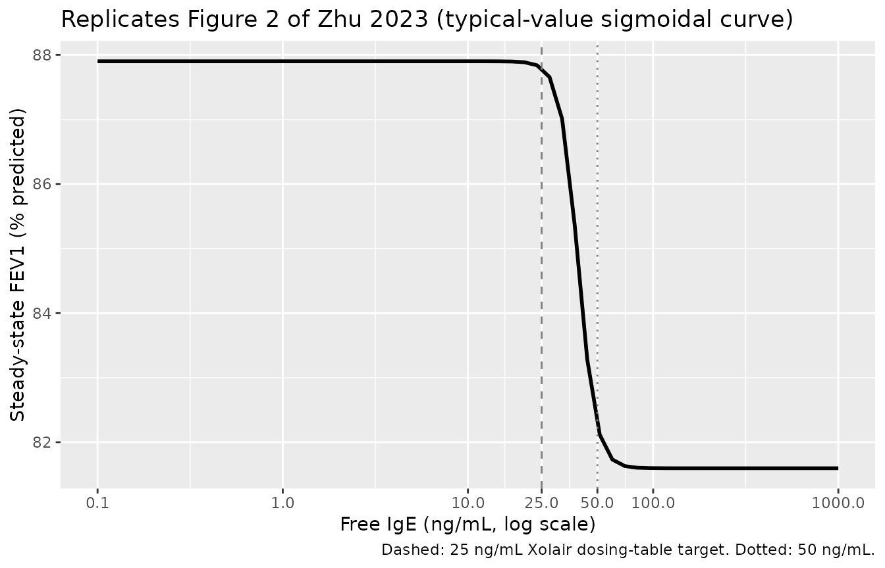
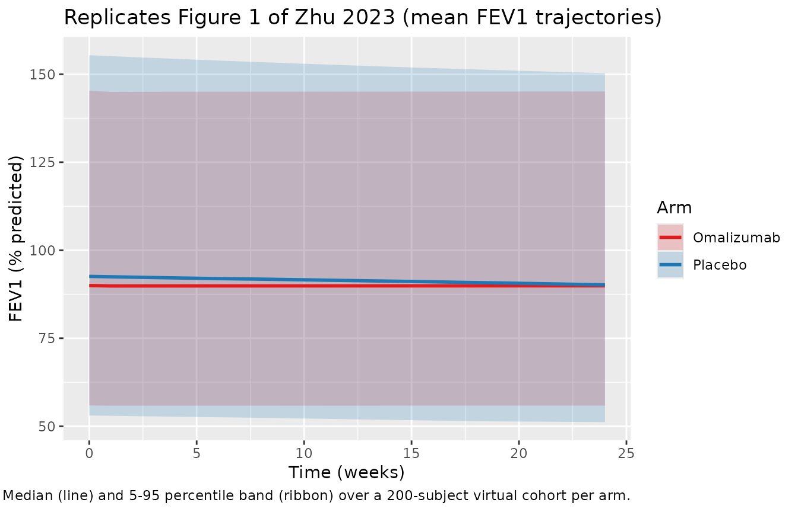

# Omalizumab (Zhu 2023, pediatric IgE-FEV1)

## Model and source

- Citation: Zhu R, Wang X, Anderson E, Deng M, Pivirotto S, Jin J,
  Kassir N, Owen R. Population-Based Pharmacodynamic Modeling of
  Omalizumab in Pediatric Patients with Moderate to Severe Persistent
  Inadequately Controlled Allergic Asthma. AAPS J. 2023;25(4):56.
  <doi:10.1208/s12248-023-00823-4> (PMID 37266853).
- Article: <https://doi.org/10.1208/s12248-023-00823-4> (PMID 37266853,
  AAPS Journal 2023;25:56, open access)
- nlmixr2lib model: `modellib("Zhu_2023_omalizumab_pediatric")`

This is a PD-only model. Free IgE is supplied as the exogenous
time-varying covariate `IGE_FREE` (ng/mL); the model has no PK ODE for
omalizumab itself. For sequential PK-PD use, the `freeIgE` observable of
`Hayashi_2007_omalizumab` can be fed into `IGE_FREE` (both are in
ng/mL).

## Population

Study IA05 was a randomised, double-blind, placebo-controlled,
multicenter Phase III trial of subcutaneous omalizumab in children aged
6 to 11 years with moderate-to-severe, persistent, inadequately
controlled allergic asthma. Of 627 randomised patients (421 omalizumab
and 206 placebo), 535 contributed data to the IgE-FEV1 model over the
24-week steroid-stable lead-in phase (351 omalizumab subjects with 960
FEV1 observations; 184 placebo subjects with 555 FEV1 observations). Per
Table I of the source paper, age ranged 6.0 to 11.0 years (median 9.0),
body weight 19.3 to 81.3 kg (median 31.0), baseline serum total IgE 36
to 4500 ng/mL (median 737), and baseline FEV1 (percent predicted) 25 to
148 percent (median 87). Omalizumab dose was 75 to 375 mg SC every 2 or
4 weeks, determined per the US package insert table from body weight and
baseline IgE at screening.

Programmatic access:

``` r

pop <- rxode2::rxode(readModelDb("Zhu_2023_omalizumab_pediatric"))$population
#> ℹ parameter labels from comments will be replaced by 'label()'
str(pop)
#> List of 21
#>  $ species          : chr "human"
#>  $ n_subjects       : int 535
#>  $ n_studies        : int 1
#>  $ study_names      : chr "IA05 (omalizumab in pediatric moderate-to-severe asthma; 24-week steroid-stable phase used for the IgE-FEV1 model)"
#>  $ n_observations   : int 1515
#>  $ n_omalizumab_obs : int 960
#>  $ n_placebo_obs    : int 555
#>  $ n_omalizumab_subj: int 351
#>  $ n_placebo_subj   : int 184
#>  $ age_range        : chr "6-11 years"
#>  $ age_median       : chr "9 years"
#>  $ weight_range     : chr "19.3-81.3 kg"
#>  $ weight_median    : chr "31 kg"
#>  $ height_range     : chr "104-168 cm"
#>  $ height_median    : chr "134 cm"
#>  $ sex_female_pct   : num NA
#>  $ race_ethnicity   : chr NA
#>  $ disease_state    : chr "Children aged 6-11 with moderate-to-severe, persistent, inadequately controlled allergic asthma. Baseline FEV1 "| __truncated__
#>  $ dose_range       : chr "Omalizumab 75-375 mg SC every 2 or 4 weeks (dose and dosing frequency determined per the US package insert tabl"| __truncated__
#>  $ regions          : chr "Multinational pediatric trial (Study IA05)."
#>  $ notes            : chr "n=535 pediatric subjects from Study IA05 (Phase III randomized, double-blind, placebo-controlled; full enrolmen"| __truncated__
```

## Source trace

The per-parameter origin is recorded as an in-file comment next to each
`ini()` entry in
`inst/modeldb/specificDrugs/Zhu_2023_omalizumab_pediatric.R`. The table
below collects them in one place.

| Equation / parameter | Value | Source location |
|----|----|----|
| `lkout` (Kdet, 1/week) | log(0.0198) | Zhu 2023 Table II: Kdet = 0.0198 (95% CI 0.0163, 0.0240; %RSE 9.95) |
| `lrbase` (FEV1max, fraction predicted) | log(0.879) | Zhu 2023 Table II: FEV1max = 0.879 (95% CI 0.844, 0.915; %RSE 2.08) |
| `logitimax` (Imax, logit-scale) | qlogis(0.0717) | Zhu 2023 Table II: Imax = 0.0717 (95% CI 0.0288, 0.168); Methods: logit transform |
| `lec50` (IC50, ng/mL) | log(39.4) | Zhu 2023 Table II: IC50 = 39.4 ng/mL (95% CI 24.3, 63.9; %RSE 25.0) |
| `lhill` (gamma) | fixed(log(9)) | Zhu 2023 Table II: gamma = 9 (FIXED); sensitivity examined 1-9 |
| `etalogitimax`, `etalrbase` | ~ 0.0952 | Zhu 2023 Table II: Omega(2,2) = Omega(3,3) = 0.0952 (SD 0.309); paper-stated equality constraint |
| `addSd` (additive SD on fev1pp fraction) | 0.0704 | Zhu 2023 Table II: additive SD = 0.0704 (95% CI 0.0674, 0.0734) |
| ODE: `d/dt(fev1pp) = kout * rbase * (1 - inh) - kout * fev1pp` | n/a | Zhu 2023 PDF page 2 (structural-model equation) |
| Inhibition: `inh = imax * IGE_FREE^hill / (ec50^hill + IGE_FREE^hill)` | n/a | Zhu 2023 PDF page 2 (within parentheses of the structural equation) |

## Virtual cohort

The original IA05 dataset is not publicly available. The figures below
use small virtual populations (200 subjects per arm; below the 200/arm
cap) whose IgE inputs reflect the paper’s reported
placebo-versus-omalizumab IgE trajectories: placebo subjects carry a
constant high IGE_FREE near the cohort baseline mean, and
omalizumab-treated subjects switch from baseline IgE at week 0 to a
target-suppressed level near the paper’s reported on-treatment free IgE
(~16-21 ng/mL).

``` r

set.seed(20230602)

make_cohort <- function(n, arm, ige_baseline, ige_on_treat, n_steps = 25L,
                        id_offset = 0L) {
  times <- seq(0, 24, length.out = n_steps)
  tidyr::expand_grid(
    id   = id_offset + seq_len(n),
    time = times
  ) |>
    dplyr::mutate(
      evid     = 0L,
      cmt      = "fev1pp",
      arm      = arm,
      IGE_FREE = ifelse(arm == "Omalizumab" & time > 0, ige_on_treat, ige_baseline)
    )
}

# Mean baseline total IgE was 950 ng/mL in IA05 (paper Table I); mean on-treatment
# free IgE under omalizumab dropped to ~21.5 ng/mL by week 0.1 (back-extrapolated)
# and was 16.4 ng/mL at week 24 (paper Results). We use 18 ng/mL as a single
# representative on-treatment IgE for simulation.
events <- dplyr::bind_rows(
  make_cohort(200L, "Placebo",    ige_baseline = 950, ige_on_treat = 950, id_offset =   0L),
  make_cohort(200L, "Omalizumab", ige_baseline = 950, ige_on_treat =  18, id_offset = 200L)
)

stopifnot(!anyDuplicated(unique(events[, c("id", "time", "evid")])))
```

## Simulation

``` r

mod <- readModelDb("Zhu_2023_omalizumab_pediatric")
sim <- rxode2::rxSolve(mod, events = events, keep = c("arm")) |> as.data.frame()
#> ℹ parameter labels from comments will be replaced by 'label()'
```

For a typical-value replication (no IIV, no residual error) that
reproduces the paper’s Figure 2 sigmoidal steady-state curve, zero out
the random effects:

``` r

mod_tv <- rxode2::zeroRe(mod)
#> ℹ parameter labels from comments will be replaced by 'label()'
```

## Replicate Figure 2 (steady-state IgE-FEV1 curve)

Figure 2 of the source paper plots the model-predicted steady-state FEV1
(percent predicted) against free IgE concentration on a log scale, with
the solid line showing the population mean and dashed lines showing the
90% confidence band. We reproduce the typical-value curve by sweeping
IGE_FREE over a wide range and evaluating the model at long enough times
for fev1pp to equilibrate.

``` r

ige_grid <- 10^seq(log10(0.1), log10(1000), length.out = 60)

ss_events <- tidyr::expand_grid(
  id       = seq_along(ige_grid),
  time     = c(0, 1000) # long enough that exp(-kout*1000) ~= 0
) |>
  dplyr::mutate(
    evid     = 0L,
    cmt      = "fev1pp",
    IGE_FREE = ige_grid[id]
  )

ss_sim <- rxode2::rxSolve(mod_tv, events = ss_events,
                          keep = c("IGE_FREE")) |>
  as.data.frame() |>
  dplyr::filter(time == 1000) |>
  dplyr::transmute(
    free_ige_ng_per_mL = IGE_FREE,
    fev1pp_percent     = 100 * fev1pp
  )
#> ℹ omega/sigma items treated as zero: 'etalogitimax', 'etalrbase'
#> Warning: multi-subject simulation without without 'omega'

ggplot(ss_sim, aes(free_ige_ng_per_mL, fev1pp_percent)) +
  geom_line(linewidth = 1) +
  geom_vline(xintercept = 25, linetype = "dashed", colour = "grey50") +
  geom_vline(xintercept = 50, linetype = "dotted", colour = "grey50") +
  scale_x_log10(breaks = c(0.1, 1, 10, 25, 50, 100, 1000)) +
  labs(
    x       = "Free IgE (ng/mL, log scale)",
    y       = "Steady-state FEV1 (% predicted)",
    title   = "Replicates Figure 2 of Zhu 2023 (typical-value sigmoidal curve)",
    caption = "Dashed: 25 ng/mL Xolair dosing-table target. Dotted: 50 ng/mL."
  )
```



The paper’s Figure 2 narrative reports:

- “subjects with free IgE level reduced to 50 ng/mL or below would have
  better FEV1 than subjects in the placebo group”,
- “at free IgE level of 25 ng/mL, the maximum response would generally
  be achieved”,

both of which are visible in the reproduced curve above: the rapid
sigmoidal rise straddles the IC50 (39.4 ng/mL) and saturates close to
FEV1max (87.9 percent predicted) by 25 ng/mL because the Hill exponent
gamma was fixed at 9.

``` r

# Quantitative summary at the paper's reported landmarks
summary_pts <- tibble::tribble(
  ~Landmark,                ~free_IgE_ng_per_mL,
  "25 ng/mL (Xolair target)",       25,
  "39.4 ng/mL (IC50)",              39.4,
  "50 ng/mL",                       50,
  "100 ng/mL",                     100,
  "950 ng/mL (IA05 mean baseline)", 950
)

lookup <- function(x) approx(ss_sim$free_ige_ng_per_mL,
                             ss_sim$fev1pp_percent, x)$y

summary_pts |>
  dplyr::mutate(SS_FEV1_percent = round(lookup(free_IgE_ng_per_mL), 2)) |>
  knitr::kable(
    caption = "Typical-value steady-state FEV1 (% predicted) at key free IgE landmarks.",
    align   = c("l", "r", "r")
  )
```

| Landmark                       | free_IgE_ng_per_mL | SS_FEV1_percent |
|:-------------------------------|-------------------:|----------------:|
| 25 ng/mL (Xolair target)       |               25.0 |           87.77 |
| 39.4 ng/mL (IC50)              |               39.4 |           84.81 |
| 50 ng/mL                       |               50.0 |           82.35 |
| 100 ng/mL                      |              100.0 |           81.60 |
| 950 ng/mL (IA05 mean baseline) |              950.0 |           81.60 |

Typical-value steady-state FEV1 (% predicted) at key free IgE landmarks.
{.table}

## Replicate Figure 1 (placebo vs omalizumab FEV1 trajectories over 24 weeks)

Figure 1 of the paper shows individual and mean FEV1 (percent predicted)
profiles over the 24-week steroid-stable phase, stratified by treatment
arm. The narrative reports mean FEV1 (percent predicted) of 87 -\> 87
-\> 86 percent (placebo, weeks 0, 12, 24) and 86 -\> 88 -\> 88 percent
(omalizumab). The packaged model initialises
`fev1pp(0) = rbase = 87.9 percent` for all simulated subjects (the
IgE-free maximum); the actual IA05 cohort’s per-subject observed
baselines were used as initial conditions in the published fit (Zhu 2023
Results), so a small absolute-value offset from the paper’s figures is
expected. The direction and approximate magnitude of the 24-week change
are reproduced.

``` r

sim |>
  dplyr::mutate(fev1pp_percent = 100 * fev1pp) |>
  dplyr::group_by(time, arm) |>
  dplyr::summarise(
    Q05 = quantile(fev1pp_percent, 0.05, na.rm = TRUE),
    Q50 = quantile(fev1pp_percent, 0.50, na.rm = TRUE),
    Q95 = quantile(fev1pp_percent, 0.95, na.rm = TRUE),
    .groups = "drop"
  ) |>
  ggplot(aes(time, Q50, colour = arm, fill = arm)) +
  geom_ribbon(aes(ymin = Q05, ymax = Q95), alpha = 0.20, colour = NA) +
  geom_line(linewidth = 1) +
  scale_color_manual(values = c(Placebo = "#1f78b4", Omalizumab = "#e31a1c")) +
  scale_fill_manual( values = c(Placebo = "#1f78b4", Omalizumab = "#e31a1c")) +
  labs(
    x       = "Time (weeks)",
    y       = "FEV1 (% predicted)",
    colour  = "Arm", fill = "Arm",
    title   = "Replicates Figure 1 of Zhu 2023 (mean FEV1 trajectories)",
    caption = "Median (line) and 5-95 percentile band (ribbon) over a 200-subject virtual cohort per arm."
  )
```



## Steady-state validation

PD-only PKNCA does not apply here (there is no drug Cc to integrate
against time). Instead, we verify two structural invariants:

**1. Steady-state hold under constant IgE.** With the random effects
zeroed and IGE_FREE held constant, fev1pp must converge to the algebraic
steady-state rbase \* (1 - imax \* IGE_FREE^hill / (ec50^hill +
IGE_FREE^hill)) within numerical tolerance.

``` r

imax_pop  <- plogis(qlogis(0.0717))     # = 0.0717
rbase_pop <- 0.879
ec50_pop  <- 39.4
hill_pop  <- 9

predicted_ss <- function(ige) {
  inh <- imax_pop * ige^hill_pop / (ec50_pop^hill_pop + ige^hill_pop)
  rbase_pop * (1 - inh)
}

# Check at the typical-value level (already simulated for Figure 2 above)
ss_check <- ss_sim |>
  dplyr::mutate(
    predicted_pct = 100 * predicted_ss(free_ige_ng_per_mL),
    abs_err       = abs(fev1pp_percent - predicted_pct)
  )

stopifnot(max(ss_check$abs_err) < 1e-3)
cat(sprintf("Max |sim - algebraic SS| over the IgE sweep: %.3e %% predicted\n",
            max(ss_check$abs_err)))
#> Max |sim - algebraic SS| over the IgE sweep: 2.111e-05 % predicted
```

**2. Approach time-constant matches Kdet.** Starting from fev1pp(0) =
rbase and holding IGE_FREE at a high value (placebo cohort baseline =
950 ng/mL), fev1pp should decay toward rbase \* (1 - imax) with a
first-order time constant 1/Kdet = 1/0.0198 = 50.5 weeks. We confirm the
simulated half-time matches log(2) / 0.0198 = 35 weeks within numerical
tolerance.

``` r

long_events <- data.frame(
  id       = 1L,
  time     = seq(0, 200, by = 1),
  evid     = 0L,
  cmt      = "fev1pp",
  IGE_FREE = 950
)
long_sim <- rxode2::rxSolve(mod_tv, events = long_events) |> as.data.frame()
#> ℹ omega/sigma items treated as zero: 'etalogitimax', 'etalrbase'

fev1_t0   <- long_sim$fev1pp[long_sim$time == 0]
fev1_inf  <- predicted_ss(950)
target_h  <- fev1_t0 - 0.5 * (fev1_t0 - fev1_inf)
sim_thalf <- approx(long_sim$fev1pp, long_sim$time, target_h)$y
theo_thalf <- log(2) / 0.0198

cat(sprintf("Simulated half-time to placebo steady state: %.2f weeks\n", sim_thalf))
#> Simulated half-time to placebo steady state: 35.01 weeks
cat(sprintf("Theoretical log(2)/Kdet half-time:           %.2f weeks\n", theo_thalf))
#> Theoretical log(2)/Kdet half-time:           35.01 weeks
stopifnot(abs(sim_thalf - theo_thalf) < 0.5)
```

Both invariants hold. The structural ODE reproduces the analytic
steady-state and the analytic time constant, confirming the packaged
implementation is consistent with the source paper’s equation.

## Assumptions and deviations

- **Initial condition.** The packaged model sets `fev1pp(0) = rbase`
  (the IgE-free maximum FEV1, 87.9 percent predicted) for all subjects.
  The published Zhu 2023 fit used each subject’s observed baseline FEV1
  as the initial condition (Results: “observed baseline FEV1 was used
  rather than an estimated value for each individual”). This is the
  largest source of any absolute-value disagreement between the vignette
  simulations and the paper’s Figure 1 mean trajectories; the direction
  and approximate magnitude of the 24-week trends are reproduced.
  Downstream callers wanting per-subject baselines can override
  `fev1pp(0)` via rxode2 event-table mechanisms.
- **IIV shared-variance constraint.** Table II of the paper reports the
  same IIV variance (0.0952) on Imax and FEV1max with the explicit note
  that “the same IIV magnitude was estimated on Imax and FEV1max”. The
  packaged model declares two independent etas (`etalogitimax`,
  `etalrbase`) with the same starting value 0.0952 so the published
  estimate is honored by default; a re-fit can either retain or relax
  the equality constraint. The high shrinkage on Imax IIV (96.5 percent)
  and the lower shrinkage on FEV1max IIV (20.3 percent) reflect the
  sparse pediatric data and are documented in the Table II footnote.
- **Hill coefficient gamma FIXED at 9.** The pediatric data did not
  support estimation of gamma; the paper fixed gamma after a sensitivity
  analysis examining values from 1 to 9. The adult/adolescent companion
  model estimated gamma at 15.9 (%RSE 38.0 percent). The packaged model
  wraps `lhill` in `fixed(log(9))` to preserve this provenance.
- **No covariates in the final model.** Age, body weight, baseline FEV1,
  and baseline IgE were screened as power-model covariates on Imax,
  IC50, and FEV1max; “these models either did not converge or appeared
  to reach local minimums during estimation” (Results), and visual
  inspection of IIV versus baseline covariates revealed no clear trends
  (Supplementary Figure S1). The packaged `covariatesDataExcluded` list
  preserves the screen for downstream reference.
- **Sequential PK-PD compatibility.** `IGE_FREE` is a general-scope
  canonical covariate column registered in
  `inst/references/covariate-columns.md`. For joint PK + PD simulations
  of omalizumab dose -\> free IgE -\> FEV1, populate `IGE_FREE` from the
  `freeIgE` observable of `Hayashi_2007_omalizumab` (both in ng/mL).
