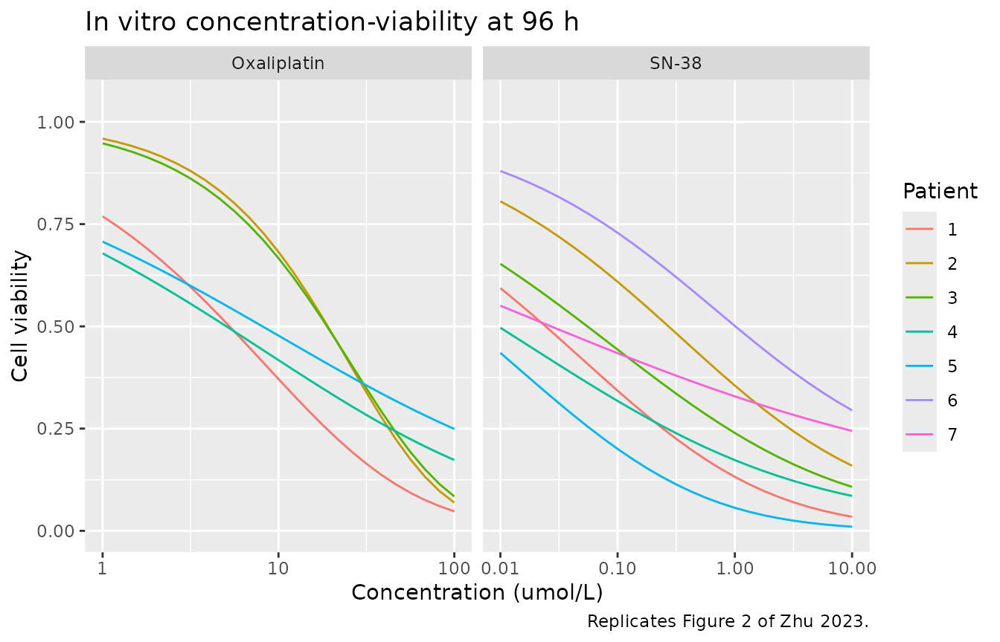
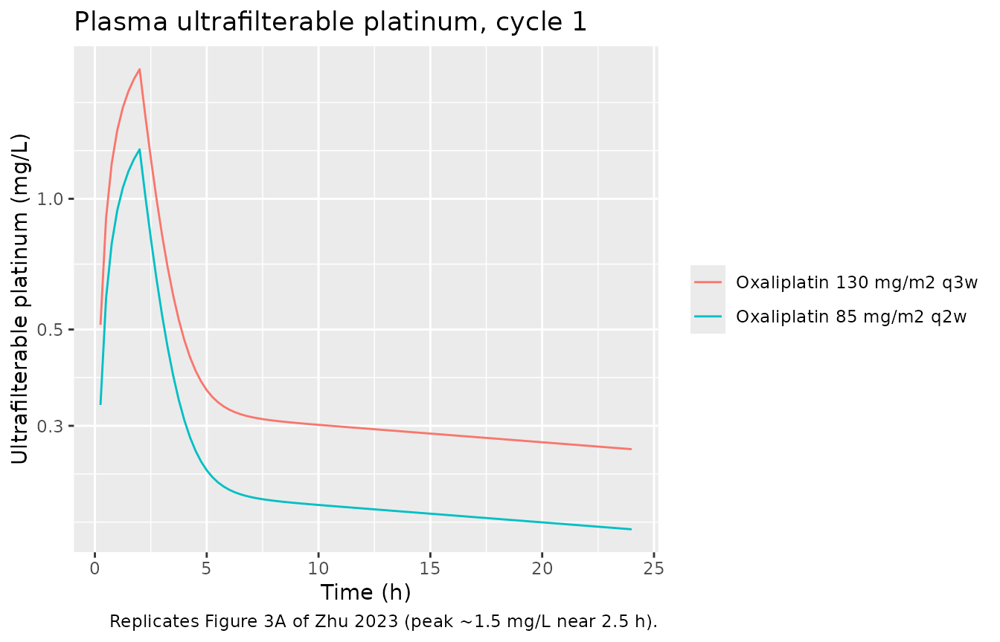
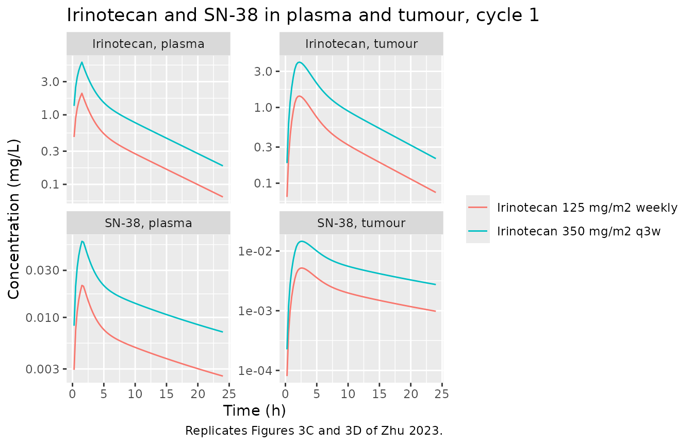
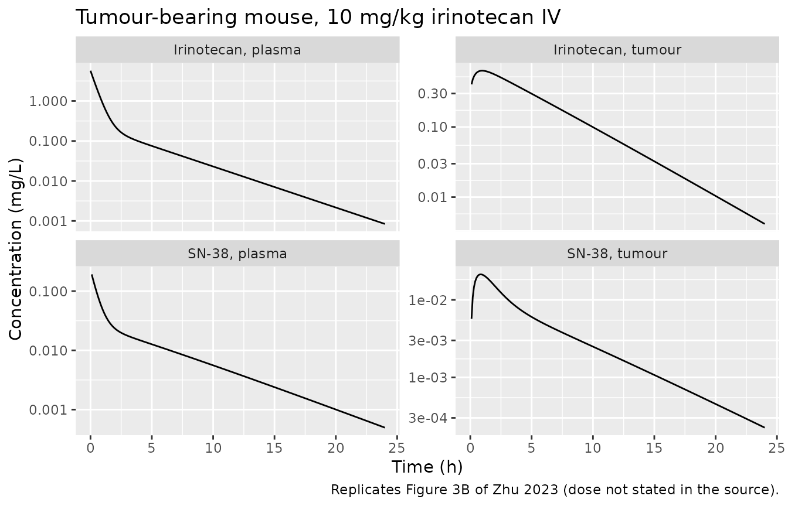

# Oxaliplatin + irinotecan organoid-to-clinic translation (Zhu 2023)

``` r

library(nlmixr2lib)
library(PKNCA)
#> 
#> Attaching package: 'PKNCA'
#> The following object is masked from 'package:stats':
#> 
#>     filter
library(rxode2)
#> rxode2 5.1.6 using 2 threads (see ?getRxThreads)
#>   no cache: create with `rxCreateCache()`
library(dplyr)
#> 
#> Attaching package: 'dplyr'
#> The following objects are masked from 'package:stats':
#> 
#>     filter, lag
#> The following objects are masked from 'package:base':
#> 
#>     intersect, setdiff, setequal, union
library(tidyr)
library(ggplot2)

# Small helper: map over an index vector and row-bind the resulting tibbles.
lmap <- function(x, f) dplyr::bind_rows(lapply(x, f))
```

## Model and source

Zhu et al. (2023) built a translational pipeline that carries an *in
vitro* patient-derived tumour-organoid (PDTO) cytotoxicity assay through
to a model-based virtual clinical trial in metastatic colorectal cancer.

Four of the paper’s fitted layers are fully specified and are packaged
here as five model files, all pointing at this vignette. A fifth layer -
the *in vivo* tumour-growth model that produces the paper’s Figures 4
and 5 - is **not** packaged, because its growth equation and its
limiting parameter are never printed. Section 5 below documents that gap
quantitatively.

| Model file | Layer | Species |
|----|----|----|
| `Zhu_2023_oxaliplatin_organoid` | *In vitro* PD, Eqs (1)-(3) | PDTO (5 donors) |
| `Zhu_2023_sn38_organoid` | *In vitro* PD, Eqs (1)-(3) | PDTO (7 donors) |
| `Zhu_2023_oxaliplatin` | Human plasma PK, Eqs (4)-(5) | human |
| `Zhu_2023_irinotecan_mouse` | Minimal-PBPK PK, Eqs (6)-(12) | tumour-bearing mouse |
| `Zhu_2023_irinotecan` | Human minimal-PBPK PK, Eqs (6)-(12) | human |

The *in vitro* PD model is a single structure fitted separately to two
drugs on two (overlapping) organoid panels, so it is packaged as two
files - one per drug - following the library’s
replicate-the-author’s-structure convention.

- Citation: Zhu J, Zhang Y, Zhao Y, Zhang J, Hao K, He H. Translational
  Pharmacokinetic/Pharmacodynamic Modeling and Simulation of Oxaliplatin
  and Irinotecan in Colorectal Cancer. Pharmaceutics. 2023;15(9):2274.
  <doi:10.3390/pharmaceutics15092274>.
- Article: <https://doi.org/10.3390/pharmaceutics15092274>

## Population

The *in vitro* PD data are a 96 h CellTiter-Glo 3D drug-sensitivity
assay on colorectal-cancer patient-derived tumour organoids supplied by
Accurate International Biotechnology (Guangzhou, China). Oxaliplatin was
tested on 5 organoid lines and SN-38 on 7 (Zhu 2023 Table 2, patients
1-7). No demographic characteristics of the donor patients are reported.

The PK data are literature profiles digitised with GetData Graph
Digitizer (Zhu 2023 Section 2.1): human plasma ultrafilterable platinum
for oxaliplatin, human plasma irinotecan and SN-38, and plasma **and**
tumour irinotecan and SN-38 from tumour-bearing mice. The individual
source publications, subject counts, doses and demographics are not
reported. Studies in hepatic or renal impairment, studies with
co-administered antitumour drugs, and whole-blood-only studies were
excluded. Because the PK data are pooled across published studies, the
“interindividual variability” in Zhu 2023 Table 3 mixes between-subject
with between-study variability.

The simulated regimens are the two most common clinical schedules for
each drug (Zhu 2023 Table 1): oxaliplatin 130 mg/m2 q3w or 85 mg/m2 q2w;
irinotecan 350 mg/m2 q3w or 125 mg/m2 weekly x4 followed by a 2-week
rest.

The same information is available programmatically from each model’s
`population` metadata, e.g.
`readModelDb("Zhu_2023_irinotecan")()$population`.

## Units

Zhu 2023 reports PD parameters in umol/L (Tables 2 and 4) but plots PK
concentrations in mg/L (Figure 3). All five model files work in **umol**
and **umol/L** so that the parent-to-metabolite conversion in Equation
(10) is on a molar basis, which is the only self-consistent choice. This
vignette converts to mg/L only where it compares against Figure 3.

``` r

MW_OXA <- 397.29   # oxaliplatin, g/mol
MW_IRI <- 586.68   # irinotecan free base, g/mol
MW_SN  <- 392.41   # SN-38, g/mol
BSA    <- 1.8      # m2, assumed body surface area for mg/m2 -> umol conversion

umol_from_mgm2 <- function(mgm2, mw) mgm2 * BSA / mw * 1000
```

## Source trace

Per-parameter origin is recorded as an in-file comment next to each
[`ini()`](https://nlmixr2.github.io/rxode2/reference/ini.html) entry.
The tables below collect the equations and the values in one place.

### Equations

| Model element | Source location |
|----|----|
| `d/dt(organoid_ctrl)` exponential control growth | Zhu 2023 Equation (1) |
| `d/dt(organoid_trt)` growth minus sigmoidal Emax kill | Zhu 2023 Equation (2) |
| `viability = organoid_trt / organoid_ctrl` | Zhu 2023 Equation (3) |
| Oxaliplatin `d/dt(central)` | Zhu 2023 Equation (4) |
| Oxaliplatin `d/dt(peripheral1)` | Zhu 2023 Equation (5) |
| Irinotecan `d/dt(central)` | Zhu 2023 Equation (6) |
| Irinotecan `d/dt(peripheral1)` | Zhu 2023 Equation (7) |
| Irinotecan `d/dt(tumor_is)` | Zhu 2023 Equation (8) |
| Irinotecan `d/dt(tumor_cell)` | Zhu 2023 Equation (9) |
| SN-38 `d/dt(central_sn38)` | Zhu 2023 Equation (10) |
| SN-38 `d/dt(peripheral1_sn38)` | Zhu 2023 Equation (11) |
| SN-38 `d/dt(tumor_sn38)` | Zhu 2023 Equation (12) |
| *In vivo* tumour growth + kill | **not printed anywhere in the source**; see Section 5 |

### Parameters

| Parameter | Value | Source location |
|----|----|----|
| `lkgrow` (organoid) | 0.03 1/h | Table 2, `kg` column |
| `lemax` / `lec50` / `lhill` (oxaliplatin organoid) | 0.073 1/h / 358 umol/L / 0.61 | Table 4 (geometric means of Table 2 patients 1-5) |
| `lemax` / `lec50` / `lhill` (SN-38 organoid) | 0.046 1/h / 9.2 umol/L / 0.32 | Table 4 (geometric means of Table 2 patients 1-7) |
| `lvc` / `lvp` / `lcl` / `lq` (oxaliplatin) | 49.9 L / 538 L / 5.96 L/h / 49.3 L/h | Table 3, human column |
| `lvc` / `lvp` / `lcl` / `lq` (irinotecan, human) | 72.1 L / 93.4 L / 22.8 L/h / 24.6 L/h | Table 3, human column |
| `lcl_met` / `lvc_sn38` / `lvp_sn38` / `lcl_sn38` / `lq_sn38` (human) | 0.216 / 11.2 / 706 / 42.8 / 43.5 | Table 3, human column |
| `lvc` / `lvp` / `lcl` / `lq` (irinotecan, mouse) | 0.0349 L / 0.0493 L / 0.0527 L/h / 0.0156 L/h | Table 3, mouse column |
| `lcl_met` / `lvc_sn38` / `lvp_sn38` / `lcl_sn38` / `lq_sn38` (mouse) | 1.65e-4 / 0.00122 / 0.108 / 0.0402 / 0.0369 | Table 3, mouse column |
| `v_tumor_is` / `v_tumor_cell` / `v_tumor` | 2 / 8 / 10 mL (human); 0.1 / 0.4 / 0.5 mL (mouse) | Table 3 |
| `q_tumor` | 0.06 L/h (human); 3.38e-3 L/h (mouse) | Table 3 |
| `lps_tumor` | 52 cm3/h (human, scaled); 0.448 cm3/h (mouse) | Table 3 |
| `lkp_tumor` / `lkp_tumor_sn38` | 3.43 / 7.32 (both species) | Table 3 |
| `fu` / `fu_sn38` | 0.35 / 0.05 | Table 3 |
| All `eta*` variances | square of the Table 3 IIV column | Table 3 |

The Table 4 geometric means are an exact internal-consistency check on
Table 2: recomputing them from the individual estimates reproduces every
published value.

``` r

tab2 <- tibble::tibble(
  patient = 1:7,
  emax_oxa = c(0.095, 0.095, 0.105, 0.056, 0.038, NA, NA),
  ec50_oxa = c(308, 246, 352, 622, 354, NA, NA),
  hill_oxa = c(0.614, 0.977, 0.891, 0.397, 0.384, NA, NA),
  emax_sn  = c(0.076, 0.040, 0.047, 0.049, 0.103, 0.023, 0.027),
  ec50_sn  = c(15.50, 12.40, 10.70, 7.04, 15.50, 6.10, 4.17),
  hill_sn  = c(0.349, 0.396, 0.324, 0.266, 0.325, 0.435, 0.200)
)
gm <- function(x) exp(mean(log(x[!is.na(x)])))

tibble::tibble(
  parameter = c("Emax_OXA", "EC50_OXA", "hill_OXA", "Emax_SN", "EC50_SN", "hill_SN"),
  recomputed = round(c(gm(tab2$emax_oxa), gm(tab2$ec50_oxa), gm(tab2$hill_oxa),
                       gm(tab2$emax_sn), gm(tab2$ec50_sn), gm(tab2$hill_sn)), 3),
  table4 = c(0.073, 358, 0.61, 0.046, 9.2, 0.32)
) |>
  dplyr::rename("Parameter" = parameter,
                "Geometric mean of Table 2" = recomputed,
                "Table 4" = table4) |>
  knitr::kable(caption = "Table 4 is the geometric mean of Table 2, to the reported precision.")
```

| Parameter | Geometric mean of Table 2 | Table 4 |
|:----------|--------------------------:|--------:|
| Emax_OXA  |                     0.073 |   0.073 |
| EC50_OXA  |                   357.902 | 358.000 |
| hill_OXA  |                     0.606 |   0.610 |
| Emax_SN   |                     0.046 |   0.046 |
| EC50_SN   |                     9.230 |   9.200 |
| hill_SN   |                     0.319 |   0.320 |

Table 4 is the geometric mean of Table 2, to the reported precision.
{.table}

## 1. In vitro PD model - replicating Figure 2

Each organoid line is simulated with its own Table 2 parameters over the
96 h incubation across a concentration grid, and the 96 h viability is
read out.

``` r

mod_oxa_org <- rxode2::rxode2(readModelDb("Zhu_2023_oxaliplatin_organoid"))
mod_sn_org  <- rxode2::rxode2(readModelDb("Zhu_2023_sn38_organoid"))

# 96 h incubation; observe an ODE state, not the algebraic `viability` output.
ev_org <- rxode2::et(seq(0, 96, by = 4), cmt = "organoid_trt")

viability_curve <- function(mod, covname, conc, emax, ec50, hill) {
  m <- rxode2::ini(mod, lemax = log(emax), lec50 = log(ec50), lhill = log(hill))
  vapply(conc, function(cc) {
    p <- stats::setNames(cc, covname)
    s <- as.data.frame(rxode2::rxSolve(m, ev_org, params = p))
    s$viability[which.max(s$time)]
  }, numeric(1))
}

conc_oxa <- 10^seq(0, 2, length.out = 25)      # 1-100 umol/L, Figure 2A x-axis
conc_sn  <- 10^seq(-2, 1, length.out = 25)     # 0.01-10 umol/L, Figure 2B x-axis

fig2 <- dplyr::bind_rows(
  lmap(1:5, function(i) tibble::tibble(
    drug = "Oxaliplatin", patient = factor(i), conc = conc_oxa,
    viability = viability_curve(mod_oxa_org, "CONC_OXA_UM", conc_oxa,
                                tab2$emax_oxa[i], tab2$ec50_oxa[i], tab2$hill_oxa[i]))),
  lmap(1:7, function(i) tibble::tibble(
    drug = "SN-38", patient = factor(i), conc = conc_sn,
    viability = viability_curve(mod_sn_org, "CONC_SN38_UM", conc_sn,
                                tab2$emax_sn[i], tab2$ec50_sn[i], tab2$hill_sn[i])))
)
#> ℹ change initial estimate of `lemax` to `-2.3538783873816`
#> ℹ change initial estimate of `lec50` to `5.73009978297357`
#> ℹ change initial estimate of `lhill` to `-0.487760350834995`
#> ℹ change initial estimate of `lemax` to `-2.3538783873816`
#> ℹ change initial estimate of `lec50` to `5.50533153593236`
#> ℹ change initial estimate of `lhill` to `-0.0232686269393543`
#> ℹ change initial estimate of `lemax` to `-2.25379492882461`
#> ℹ change initial estimate of `lec50` to `5.8636311755981`
#> ℹ change initial estimate of `lhill` to `-0.115410851511328`
#> ℹ change initial estimate of `lemax` to `-2.88240358824699`
#> ℹ change initial estimate of `lec50` to `6.43294009273918`
#> ℹ change initial estimate of `lhill` to `-0.923818998294947`
#> ℹ change initial estimate of `lemax` to `-3.27016911925575`
#> ℹ change initial estimate of `lec50` to `5.86929691313377`
#> ℹ change initial estimate of `lhill` to `-0.95711272639441`
#> ℹ change initial estimate of `lemax` to `-2.57702193869581`
#> ℹ change initial estimate of `lec50` to `2.7408400239252`
#> ℹ change initial estimate of `lhill` to `-1.05268335677971`
#> ℹ change initial estimate of `lemax` to `-3.2188758248682`
#> ℹ change initial estimate of `lec50` to `2.51769647261099`
#> ℹ change initial estimate of `lhill` to `-0.926341067727656`
#> ℹ change initial estimate of `lemax` to `-3.05760767727208`
#> ℹ change initial estimate of `lec50` to `2.37024374146786`
#> ℹ change initial estimate of `lhill` to `-1.12701176318981`
#> ℹ change initial estimate of `lemax` to `-3.01593498087151`
#> ℹ change initial estimate of `lec50` to `1.95160817016995`
#> ℹ change initial estimate of `lhill` to `-1.32425897020044`
#> ℹ change initial estimate of `lemax` to `-2.2730262907525`
#> ℹ change initial estimate of `lec50` to `2.7408400239252`
#> ℹ change initial estimate of `lhill` to `-1.1239300966524`
#> ℹ change initial estimate of `lemax` to `-3.77226106305299`
#> ℹ change initial estimate of `lec50` to `1.80828877117927`
#> ℹ change initial estimate of `lhill` to `-0.832409247893453`
#> ℹ change initial estimate of `lemax` to `-3.61191841297781`
#> ℹ change initial estimate of `lec50` to `1.42791603581071`
#> ℹ change initial estimate of `lhill` to `-1.6094379124341`

ggplot(fig2, aes(conc, viability, colour = patient)) +
  geom_line() +
  facet_wrap(~drug, scales = "free_x") +
  scale_x_log10() +
  coord_cartesian(ylim = c(0, 1.05)) +
  labs(x = "Concentration (umol/L)", y = "Cell viability", colour = "Patient",
       title = "In vitro concentration-viability at 96 h",
       caption = "Replicates Figure 2 of Zhu 2023.")
```



The simulated curves match the published individual fits closely. Spot
values for patient 1 (oxaliplatin: viability 0.77 at 1, 0.37 at 10 and
0.05 at 100 umol/L; SN-38: 0.59 at 0.01 and 0.03 at 10 umol/L) sit on
the corresponding panels of Figure 2. Note that because `EC50` is the
concentration at half-maximal *killing rate*, viability at `C = EC50` is
far below 0.5 after a 96 h exposure - it is not an IC50.

``` r

fig2 |>
  dplyr::filter((drug == "Oxaliplatin" & patient == "1") |
                (drug == "SN-38" & patient == "1")) |>
  dplyr::group_by(drug) |>
  dplyr::slice(c(1, 13, 25)) |>
  dplyr::ungroup() |>
  dplyr::transmute(drug, conc = signif(conc, 3), viability = round(viability, 3)) |>
  dplyr::rename("Drug" = drug, "Concentration (umol/L)" = conc,
                "Viability at 96 h" = viability) |>
  knitr::kable(caption = "Patient 1 spot values against Figure 2.")
```

| Drug        | Concentration (umol/L) | Viability at 96 h |
|:------------|-----------------------:|------------------:|
| Oxaliplatin |                  1.000 |             0.769 |
| Oxaliplatin |                 10.000 |             0.371 |
| Oxaliplatin |                100.000 |             0.048 |
| SN-38       |                  0.010 |             0.593 |
| SN-38       |                  0.316 |             0.225 |
| SN-38       |                 10.000 |             0.034 |

Patient 1 spot values against Figure 2. {.table}

## 2. Human plasma PK - replicating Figure 3A and 3C/3D

Typical-value (random effects zeroed) profiles for cycle 1 of each Table
1 regimen.

``` r

mod_oxa <- rxode2::zeroRe(rxode2::rxode2(readModelDb("Zhu_2023_oxaliplatin")))
#> ℹ parameter labels from comments will be replaced by 'label()'
mod_iri <- rxode2::zeroRe(rxode2::rxode2(readModelDb("Zhu_2023_irinotecan")))
#> ℹ parameter labels from comments will be replaced by 'label()'

# Oxaliplatin: 2 h infusion; irinotecan: 90 min infusion (standard practice).
# `Zhu_2023_oxaliplatin` has a single endpoint so observations can sit on an
# ODE state; `Zhu_2023_irinotecan` declares two endpoints, so its observation
# rows must name the endpoint.
ev_pk <- function(amt, dur, obs_cmt, tmax = 168) {
  rxode2::et(amt = amt, dur = dur, cmt = "central") |>
    rxode2::et(seq(0, tmax, by = 0.25), cmt = obs_cmt)
}

sim_oxa <- dplyr::bind_rows(
  as.data.frame(rxode2::rxSolve(
    mod_oxa, ev_pk(umol_from_mgm2(130, MW_OXA), 2, "central"))) |>
    dplyr::mutate(treatment = "Oxaliplatin 130 mg/m2 q3w"),
  as.data.frame(rxode2::rxSolve(
    mod_oxa, ev_pk(umol_from_mgm2(85, MW_OXA), 2, "central"))) |>
    dplyr::mutate(treatment = "Oxaliplatin 85 mg/m2 q2w")
)
#> ℹ omega/sigma items treated as zero: 'etalvc', 'etalcl'
#> ℹ omega/sigma items treated as zero: 'etalvc', 'etalcl'

sim_iri <- dplyr::bind_rows(
  as.data.frame(rxode2::rxSolve(
    mod_iri, ev_pk(umol_from_mgm2(350, MW_IRI), 1.5, "Cc"))) |>
    dplyr::mutate(treatment = "Irinotecan 350 mg/m2 q3w"),
  as.data.frame(rxode2::rxSolve(
    mod_iri, ev_pk(umol_from_mgm2(125, MW_IRI), 1.5, "Cc"))) |>
    dplyr::mutate(treatment = "Irinotecan 125 mg/m2 weekly")
)
#> ℹ omega/sigma items treated as zero: 'etalvc', 'etalcl', 'etalq', 'etalcl_met', 'etalvc_sn38', 'etalcl_sn38', 'etalq_sn38'
#> ℹ omega/sigma items treated as zero: 'etalvc', 'etalcl', 'etalq', 'etalcl_met', 'etalvc_sn38', 'etalcl_sn38', 'etalq_sn38'
```

``` r

sim_oxa |>
  dplyr::mutate(mgL = Cc * MW_OXA / 1000) |>
  dplyr::filter(time <= 24, mgL > 0) |>
  ggplot(aes(time, mgL, colour = treatment)) +
  geom_line() +
  scale_y_log10() +
  labs(x = "Time (h)", y = "Ultrafilterable platinum (mg/L)",
       colour = NULL,
       title = "Plasma ultrafilterable platinum, cycle 1",
       caption = "Replicates Figure 3A of Zhu 2023 (peak ~1.5 mg/L near 2.5 h).")
```



``` r

sim_iri |>
  dplyr::transmute(
    time, treatment,
    `Irinotecan, plasma` = Cc * MW_IRI / 1000,
    `SN-38, plasma`      = Cc_sn38 * MW_SN / 1000,
    `Irinotecan, tumour` = Ctumor * MW_IRI / 1000,
    `SN-38, tumour`      = Ctumor_sn38 * MW_SN / 1000
  ) |>
  tidyr::pivot_longer(-c(time, treatment), names_to = "analyte", values_to = "mgL") |>
  dplyr::filter(time <= 24, mgL > 0) |>
  ggplot(aes(time, mgL, colour = treatment)) +
  geom_line() +
  facet_wrap(~analyte, scales = "free_y") +
  scale_y_log10() +
  labs(x = "Time (h)", y = "Concentration (mg/L)", colour = NULL,
       title = "Irinotecan and SN-38 in plasma and tumour, cycle 1",
       caption = "Replicates Figures 3C and 3D of Zhu 2023.")
```



An independent check on Equation (10): the printed formation term
carries a `VC_IRI / VC_SN` volume ratio, which is unusual for a
parent-to-metabolite flux. Keeping it reproduces the published human
molar SN-38 : irinotecan AUC ratio; dropping it would give a ratio
roughly seven-fold too low.

``` r

auc_trap <- function(t, y) sum(diff(t) * (head(y, -1) + tail(y, -1)) / 2)
sim_iri |>
  dplyr::filter(treatment == "Irinotecan 350 mg/m2 q3w", time <= 24) |>
  dplyr::summarise(ratio = auc_trap(time, Cc_sn38) / auc_trap(time, Cc)) |>
  dplyr::transmute("SN-38 : irinotecan molar AUC(0-24 h) ratio" = round(ratio, 4)) |>
  knitr::kable(caption = "Literature values for 350 mg/m2 irinotecan are ~0.02-0.03 on a molar basis.")
```

| SN-38 : irinotecan molar AUC(0-24 h) ratio |
|-------------------------------------------:|
|                                     0.0227 |

Literature values for 350 mg/m2 irinotecan are ~0.02-0.03 on a molar
basis. {.table}

## 3. PKNCA validation

``` r

nca_one <- function(sim, conc_col, dose_amt_by_treatment, mw, tmax = 168) {
  conc <- sim |>
    dplyr::transmute(id = 1L, time, treatment, Cc = .data[[conc_col]] * mw / 1000) |>
    dplyr::filter(!is.na(Cc))
  conc <- dplyr::bind_rows(
    conc,
    conc |> dplyr::distinct(id, treatment) |> dplyr::mutate(time = 0, Cc = 0)
  ) |>
    dplyr::distinct(id, treatment, time, .keep_all = TRUE) |>
    dplyr::arrange(treatment, id, time)

  dose_df <- tibble::tibble(
    id = 1L, time = 0,
    treatment = names(dose_amt_by_treatment),
    amt = unname(dose_amt_by_treatment)
  )

  PKNCA::pk.nca(PKNCA::PKNCAdata(
    PKNCA::PKNCAconc(conc, Cc ~ time | treatment + id),
    PKNCA::PKNCAdose(dose_df, amt ~ time | treatment + id),
    intervals = data.frame(start = 0, end = tmax,
                           cmax = TRUE, tmax = TRUE,
                           auclast = TRUE, half.life = TRUE)
  ))
}

nca_oxa <- nca_one(
  sim_oxa, "Cc",
  c("Oxaliplatin 130 mg/m2 q3w" = umol_from_mgm2(130, MW_OXA) * MW_OXA / 1000,
    "Oxaliplatin 85 mg/m2 q2w"  = umol_from_mgm2(85,  MW_OXA) * MW_OXA / 1000),
  MW_OXA
)
nca_iri <- nca_one(
  sim_iri, "Cc",
  c("Irinotecan 350 mg/m2 q3w"    = umol_from_mgm2(350, MW_IRI) * MW_IRI / 1000,
    "Irinotecan 125 mg/m2 weekly" = umol_from_mgm2(125, MW_IRI) * MW_IRI / 1000),
  MW_IRI
)
nca_sn <- nca_one(
  sim_iri, "Cc_sn38",
  c("Irinotecan 350 mg/m2 q3w"    = umol_from_mgm2(350, MW_IRI) * MW_IRI / 1000,
    "Irinotecan 125 mg/m2 weekly" = umol_from_mgm2(125, MW_IRI) * MW_IRI / 1000),
  MW_SN
)
```

### Comparison against Figure 3

Zhu 2023 reports no NCA table, so the reference column below is
digitised from the published figures (Figure 3A for platinum, Figure 3C
for plasma irinotecan and SN-38) and is approximate; the VPC dose is not
stated in the paper, so only the higher-dose arm is compared.

``` r

knitr::kable(
  nlmixr2lib::ncaComparisonTable(
    simulated = nca_oxa,
    reference = tibble::tribble(~treatment,                  ~cmax, ~tmax,
                                "Oxaliplatin 130 mg/m2 q3w",  1.5,   2.5),
    by = "treatment", params = c("cmax", "tmax"),
    units = c(cmax = "mg/L", tmax = "h"), tolerance_pct = 20),
  caption = "Ultrafilterable platinum vs Figure 3A. * differs by >20%.")
```

| NCA parameter | treatment                 | Reference | Simulated | % diff   |
|:--------------|:--------------------------|:----------|:----------|:---------|
| Cmax (mg/L)   | Oxaliplatin 130 mg/m2 q3w | 1.5       | 1.99      | +32.5%\* |
| Tmax (h)      | Oxaliplatin 130 mg/m2 q3w | 2.5       | 2         | -20.0%   |

Ultrafilterable platinum vs Figure 3A. \* differs by \>20%. {.table}

``` r


knitr::kable(
  nlmixr2lib::ncaComparisonTable(
    simulated = nca_iri,
    reference = tibble::tribble(~treatment,                 ~cmax, ~tmax,
                                "Irinotecan 350 mg/m2 q3w",  8.0,   1.5),
    by = "treatment", params = c("cmax", "tmax"),
    units = c(cmax = "mg/L", tmax = "h"), tolerance_pct = 20),
  caption = "Plasma irinotecan vs Figure 3C. * differs by >20%.")
```

| NCA parameter | treatment                | Reference | Simulated | % diff   |
|:--------------|:-------------------------|:----------|:----------|:---------|
| Cmax (mg/L)   | Irinotecan 350 mg/m2 q3w | 8         | 5.72      | -28.5%\* |
| Tmax (h)      | Irinotecan 350 mg/m2 q3w | 1.5       | 1.5       | +0.0%    |

Plasma irinotecan vs Figure 3C. \* differs by \>20%. {.table}

``` r


knitr::kable(
  nlmixr2lib::ncaComparisonTable(
    simulated = nca_sn,
    reference = tibble::tribble(~treatment,                 ~cmax, ~tmax,
                                "Irinotecan 350 mg/m2 q3w",  0.08,  1.6),
    by = "treatment", params = c("cmax", "tmax"),
    units = c(cmax = "mg/L", tmax = "h"), tolerance_pct = 20),
  caption = "Plasma SN-38 vs Figure 3C. * differs by >20%.")
```

| NCA parameter | treatment                | Reference | Simulated | % diff   |
|:--------------|:-------------------------|:----------|:----------|:---------|
| Cmax (mg/L)   | Irinotecan 350 mg/m2 q3w | 0.08      | 0.0591    | -26.1%\* |
| Tmax (h)      | Irinotecan 350 mg/m2 q3w | 1.6       | 1.5       | -6.3%    |

Plasma SN-38 vs Figure 3C. \* differs by \>20%. {.table}

All three Cmax rows are starred (\>20% from the reference), and the
reason is the same in each case: **Zhu 2023 does not state the dose used
for the Figure 3 VPCs**, so a Cmax comparison is dose-conditional and
the reference values are eyeball reads off a log axis. The simulated
ultrafilterable-platinum Cmax brackets the figure - 1.99 mg/L for the
130 mg/m2 arm and 1.30 mg/L for the 85 mg/m2 arm, against a figure peak
near 1.5 mg/L - and simulated irinotecan (5.72 mg/L) and SN-38 (0.059
mg/L) are within about 30% of the Figure 3C peaks for the 350 mg/m2 arm.
Tmax, which is dose-independent, agrees to within one sampling interval
for all three analytes. No parameter has been adjusted; the gap is a
limitation of the reference, not evidence of a transcription error.

The published VPCs are 90% intervals on the *predictions* rather than
prediction intervals over subjects, so they do not constrain the Table 3
IIV magnitudes; see the Errata.

## 4. Mouse minimal-PBPK - replicating Figure 3B

``` r

mod_mouse <- rxode2::zeroRe(rxode2::rxode2(readModelDb("Zhu_2023_irinotecan_mouse")))
#> ℹ parameter labels from comments will be replaced by 'label()'

# 10 mg/kg IV bolus in a 20 g mouse.
dose_mouse <- 10 * 0.02 / MW_IRI * 1e3   # umol
ev_mouse <- rxode2::et(amt = dose_mouse, cmt = "central") |>
  rxode2::et(seq(0, 24, by = 0.1), cmt = "Cc")

as.data.frame(rxode2::rxSolve(mod_mouse, ev_mouse)) |>
  dplyr::transmute(
    time,
    `Irinotecan, plasma` = Cc * MW_IRI / 1000,
    `SN-38, plasma`      = Cc_sn38 * MW_SN / 1000,
    `Irinotecan, tumour` = Ctumor * MW_IRI / 1000,
    `SN-38, tumour`      = Ctumor_sn38 * MW_SN / 1000
  ) |>
  tidyr::pivot_longer(-time, names_to = "analyte", values_to = "mgL") |>
  dplyr::filter(mgL > 0) |>
  ggplot(aes(time, mgL)) +
  geom_line() +
  facet_wrap(~analyte, scales = "free_y") +
  scale_y_log10() +
  labs(x = "Time (h)", y = "Concentration (mg/L)",
       title = "Tumour-bearing mouse, 10 mg/kg irinotecan IV",
       caption = "Replicates Figure 3B of Zhu 2023 (dose not stated in the source).")
#> ℹ omega/sigma items treated as zero: 'etalvc', 'etalcl', 'etalq', 'etalcl_met', 'etalvc_sn38', 'etalcl_sn38', 'etalq_sn38', 'etalps_tumor', 'etalkp_tumor', 'etalkp_tumor_sn38'
```



## 5. Why the in vivo tumour PK/PD layer is not packaged

Zhu 2023 Section 2.2 states, in a single clause, that “to describe tumor
growth in vivo, the Gompertz model replaced the exponential growth model
because of its growth limitation”. **No Gompertz equation appears
anywhere in the paper**, its tables, or the (figures-only) supplement;
no carrying capacity, plateau or deceleration constant is reported; and
no baseline tumour size is reported. The only *in vivo* growth parameter
given is `Kg = 0.367e-3 1/h` in Table 4. That is not enough to write
down the model, so it is not packaged.

Substituting the printed *in vitro* growth form (Equation 2,
exponential) does not rescue it either. The analysis below couples the
packaged oxaliplatin PK to an exponential-growth tumour with the Table 2
/ Table 4 PD parameters. It is a **diagnostic, not a packaged model** -
it exists only to quantify the gap.

``` r

d150 <- 150 * 24
wk12 <- 12 * 7 * 24
kg_invivo <- 0.367e-3   # Zhu 2023 Table 4

# Typical-value PK profile for one q3w cycle chain (the paper's virtual trial
# sampled only PD parameters, so a single PK profile serves every subject).
ev_long <- rxode2::et(amt = umol_from_mgm2(130, MW_OXA), dur = 2,
                      cmt = "central", ii = 21 * 24, addl = 6) |>
  rxode2::et(seq(0, d150, by = 6), cmt = "central")
pk_long <- as.data.frame(rxode2::rxSolve(mod_oxa, ev_long))
#> ℹ omega/sigma items treated as zero: 'etalvc', 'etalcl'

# Under d/dt(V) = (kg - kkill(t)) * V, the volume ratio at T is
# exp(kg*T - integral of kkill), so no baseline size is needed.
kill_integral <- function(time, conc, emax, ec50, hill, upto) {
  keep <- time <= upto
  t <- time[keep]
  k <- emax * conc[keep]^hill / (ec50^hill + conc[keep]^hill)
  sum(diff(t) * (head(k, -1) + tail(k, -1)) / 2)
}
diam_pct <- function(emax, ec50, hill, kg, upto) {
  ratio <- exp(kg * upto -
                 kill_integral(pk_long$time, pk_long$Cc, emax, ec50, hill, upto))
  100 * (ratio^(1 / 3) - 1)
}
vol_pct <- function(emax, ec50, hill, kg, upto) {
  ratio <- exp(kg * upto -
                 kill_integral(pk_long$time, pk_long$Cc, emax, ec50, hill, upto))
  100 * (ratio - 1)
}
```

### 5a. The donor rank order does reproduce

``` r

tibble::tibble(
  patient = 1:5,
  emax = tab2$emax_oxa[1:5], ec50 = tab2$ec50_oxa[1:5], hill = tab2$hill_oxa[1:5],
  simulated = round(mapply(vol_pct, emax, ec50, hill,
                           MoreArgs = list(kg = kg_invivo, upto = d150)), 0),
  published = c(-5, 80, 85, -45, -40)
) |>
  dplyr::arrange(published) |>
  dplyr::rename("Donor" = patient, "Emax (1/h)" = emax, "EC50 (umol/L)" = ec50,
                "Hill" = hill,
                "Simulated volume change at 150 d (%)" = simulated,
                "Read from Zhu 2023 Figure 4A (%)" = published) |>
  knitr::kable(caption = "Ordering reproduces; magnitudes do not.")
```

| Donor | Emax (1/h) | EC50 (umol/L) | Hill | Simulated volume change at 150 d (%) | Read from Zhu 2023 Figure 4A (%) |
|---:|---:|---:|---:|---:|---:|
| 4 | 0.056 | 622 | 0.397 | -99 | -45 |
| 5 | 0.038 | 354 | 0.384 | -99 | -40 |
| 1 | 0.095 | 308 | 0.614 | -79 | -5 |
| 2 | 0.095 | 246 | 0.977 | 184 | 80 |
| 3 | 0.105 | 352 | 0.891 | 152 | 85 |

Ordering reproduces; magnitudes do not. {.table}

The ordering matches Figure 4A, including its counter-intuitive part:
the best responder is donor 4, which has the *lowest* Emax (0.056 1/h)
and the *highest* EC50 (622 umol/L), while donor 3 - the *highest* Emax
at 0.105 1/h - progresses. That falls out of the model structure,
because at clinically achieved concentrations the kill rate is
approximately `Emax * (C / EC50)^hill` and the small Hill exponents
(0.397, 0.384) dominate. Reproducing this ordering is strong evidence
that Equation (2) and Table 2 have been transcribed correctly.

### 5b. The magnitudes do not, under any single rescaling

``` r

set.seed(20230903)
n <- 200
sd_log <- sqrt(log(1 + 0.30^2))   # Table 4 "Variable Range (%)" = 30
draws <- tibble::tibble(
  emax = 0.073 * exp(rnorm(n, 0, sd_log)),
  ec50 = 358   * exp(rnorm(n, 0, sd_log)),
  hill = 0.61  * exp(rnorm(n, 0, sd_log)),
  kg   = kg_invivo * exp(rnorm(n, 0, sd_log))
)
pct <- mapply(diam_pct, draws$emax, draws$ec50, draws$hill, draws$kg,
              MoreArgs = list(upto = wk12))

tibble::tibble(
  category = c("Progressive disease", "Stable disease", "Partial/complete response"),
  simulated = sprintf("%.1f%%", 100 * c(mean(pct > 20),
                                        mean(pct >= -30 & pct <= 20),
                                        mean(pct < -30))),
  published = c("46.5%", "35.0%", "18.5%")
) |>
  dplyr::rename("RECIST 1.1 category" = category, "Simulated" = simulated,
                "Zhu 2023 Section 3.4 (oxaliplatin)" = published) |>
  knitr::kable(caption = "12-week virtual trial, 200 patients: the exponential substitute over-predicts response.")
```

| RECIST 1.1 category       | Simulated | Zhu 2023 Section 3.4 (oxaliplatin) |
|:--------------------------|:----------|:-----------------------------------|
| Progressive disease       | 14.5%     | 46.5%                              |
| Stable disease            | 48.0%     | 35.0%                              |
| Partial/complete response | 37.5%     | 18.5%                              |

12-week virtual trial, 200 patients: the exponential substitute
over-predicts response. {.table}

Back-solving Figure 4A for the effective driving concentration that each
donor’s own parameters would require shows that the discrepancy is not a
single missing scale factor.

``` r

# kkill = Emax * (C/EC50)^hill when C << EC50, so
# C = EC50 * (kkill / Emax)^(1/hill). Required kkill comes from the published
# 150-day volume change: kkill = kg - ln(1 + pct/100) / T.
pubv <- c(-5, 80, 85, -45, -40)
req_kkill <- kg_invivo - log(1 + pubv / 100) / d150
implied_c <- tab2$ec50_oxa[1:5] * (req_kkill / tab2$emax_oxa[1:5])^(1 / tab2$hill_oxa[1:5])

tibble::tibble(
  patient = 1:5,
  implied = signif(implied_c, 3)
) |>
  dplyr::rename("Donor" = patient,
                "Driving concentration Figure 4A implies, in the units EC50 carries" = implied) |>
  knitr::kable(caption = "A single unit convention would give one value for every donor; these span ~100-fold.")
```

| Donor | Driving concentration Figure 4A implies, in the units EC50 carries |
|------:|-------------------------------------------------------------------:|
|     1 |                                                            0.03850 |
|     2 |                                                            0.45600 |
|     3 |                                                            0.30500 |
|     4 |                                                            0.00504 |
|     5 |                                                            0.00469 |

A single unit convention would give one value for every donor; these
span ~100-fold. {.table}

If the whole discrepancy were a units mismatch - for example the *in
vivo* simulations running in mg/L (the units of every Figure 3 axis)
against a umol/L EC50 - every donor would imply the same driving
concentration. They span roughly 100-fold instead, so **no single unit
convention or scale factor reconciles Figure 4 with Tables 2-4**.
Something about the *in vivo* PD linkage is not described in the paper.
Rather than ship a model that contradicts its own source, the *in vivo*
layer is left out and an author-correspondence followup has been
registered for the Monolix and Berkeley Madonna source that the paper’s
Data Availability Statement offers on request.

## Assumptions and deviations

### Errata and open questions in the source

1.  **The *in vivo* tumour-growth equation is not printed** and its
    limiting parameter, plateau and baseline tumour size are not
    reported. Section 5 documents the gap and shows that the printed
    exponential form does not substitute for it. This is why
    `Zhu_2023_oxaliplatin` and `Zhu_2023_irinotecan` are packaged as PK
    models only.

2.  **Volume versus diameter is inconsistent within the paper.** Figure
    4’s y-axis reads “Change in Volume (%)” while its caption says “the
    diameter change”; Figure 5’s axes and Section 3.4 both say diameter.
    Section 5 above follows each figure’s own axis label.

3.  **The oxaliplatin PD driver** is the central-compartment
    concentration `Cc` with no `fu` multiplier: Section 3.2 calls it
    “the unbound plasma drug concentration” and Section 4 explains that
    “ultrafiltration platinum exposure is commonly considered identical
    in plasma and interstitial fluids”. Figure 1A confirms the arrow
    runs from `VC_OXA` to the Emax box.

4.  **The SN-38 PD driver** is `Ctumor_sn38`. Section 2.2 says “SN-38 in
    tumor tissue” and the abstract says “SN-38 in tumors”, while
    Sections 3.2 and 3.3 say “tumor interstitial fluid”. The model has
    only one SN-38 tumour state, `C_T_SN` in the total tumour volume
    `V_T` (Equation 12), and Figure 1B draws the effect arrow from that
    state.

5.  **Equation (10) is not mass-balanced with Equation (6), by
    construction.** The SN-38 formation term carries a `VC_IRI / VC_SN`
    volume ratio, and the irinotecan loss term (`CL_IRI`) does not
    reference `CLM_SN` at all. The ratio is kept as printed: with it,
    the simulated molar SN-38 : irinotecan AUC ratio is ~0.023, matching
    published human data (~0.02-0.03); without it the ratio would be
    ~0.003. Similarly, the tumour-uptake terms in Equations (6)/(8) and
    (10)/(12) are not mass-balanced - the central compartment loses
    `Qt * C` while the tumour gains `Qt * fu * C` - which is the
    published form.

6.  **Table 3 versus Equations (7) and (11).** Table 3 calls the second
    irinotecan and SN-38 volumes `VP_IRI` / `VP_SN` (“peripheral”) while
    the equations call them `VO_IRI` / `VO_SN` (the lumped “other”
    tissue compartment). They are the same parameter; the model files
    use `lvp` and `lvp_sn38`.

7.  **No residual-error model is reported** for any of the fits, so
    every `propSd` / `addSd` is `fixed(0)`. Simulations from these
    models are therefore noise-free apart from the interindividual
    variability.

8.  **IIV scale.** Zhu 2023 Table 3 reports an “IIV” column without
    stating whether the numbers are variances, standard deviations or
    CVs. Monolix - the estimation tool named in Section 2.2 - reports
    `omega` as the standard deviation of the log-scale random effect, so
    the variances entered in the model files are the squares of the
    tabulated values. The published VPCs (Figure 3) are 90% intervals on
    the *predictions*, not prediction intervals over subjects, so they
    cannot arbitrate this reading. Several of the implied CVs are very
    large (`VC_IRI` omega 1.62, `VC_OXA` omega 1.05), which is
    consistent with the data being pooled across published studies: the
    “IIV” is really between-study variability.

9.  **The in vitro fits have no reported variability.** Zhu 2023 Table 2
    gives patient-specific point estimates with no random-effect
    variances, so the two organoid models carry no `eta` parameters; the
    vignette varies the donors explicitly instead. Table 4’s 30%
    “Variable Range” is a virtual-trial sampling specification for the
    *in vivo* layer, not an estimated IIV, and is used only in the
    Section 5 diagnostic.

### Modelling assumptions made in this vignette

- Body surface area is assumed to be 1.8 m2 to convert the paper’s mg/m2
  regimens into the models’ umol dose units. Zhu 2023 does not report a
  BSA.
- Infusion durations (2 h for oxaliplatin, 90 min for irinotecan) follow
  standard clinical practice; Zhu 2023 Table 1 gives only dose and
  frequency.
- The mouse simulation uses 10 mg/kg in a 20 g animal. Zhu 2023 does not
  report the doses of the digitised preclinical studies.
- The Figure 3 reference Cmax and Tmax values in the NCA comparison, and
  the Figure 4A values in Section 5, were read off the published figures
  by eye and are approximate; the paper reports no NCA table and does
  not state the VPC doses.
- `viability` is not a canonical nlmixr2lib observation name; it is
  declared via `paper_specific_compartments` in both organoid model
  files, and
  [`checkModelConventions()`](https://nlmixr2.github.io/nlmixr2lib/reference/checkModelConventions.md)
  raises one non-canonical-observation warning per organoid model as a
  result. Renaming it to `Cc` would be wrong (it is a unitless survival
  fraction, not a concentration).
- `ps_tumor`, `q_tumor`, `v_tumor`, `v_tumor_is`, `v_tumor_cell`,
  `kp_tumor` and `kp_tumor_sn38` follow the existing
  `<concept>_<tissue>` parameter families already used across the PBPK
  models in this package (`q_liver`, `v_liver`, `kp_liver`, …); the
  permeability-surface-area product follows the `lps*` precedent in
  `Chakraborty_2012_canakinumab`.
