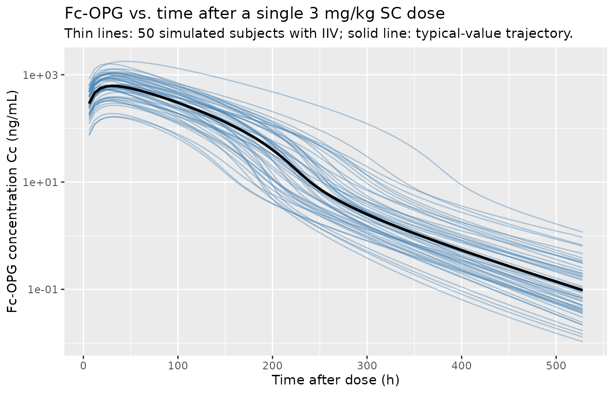
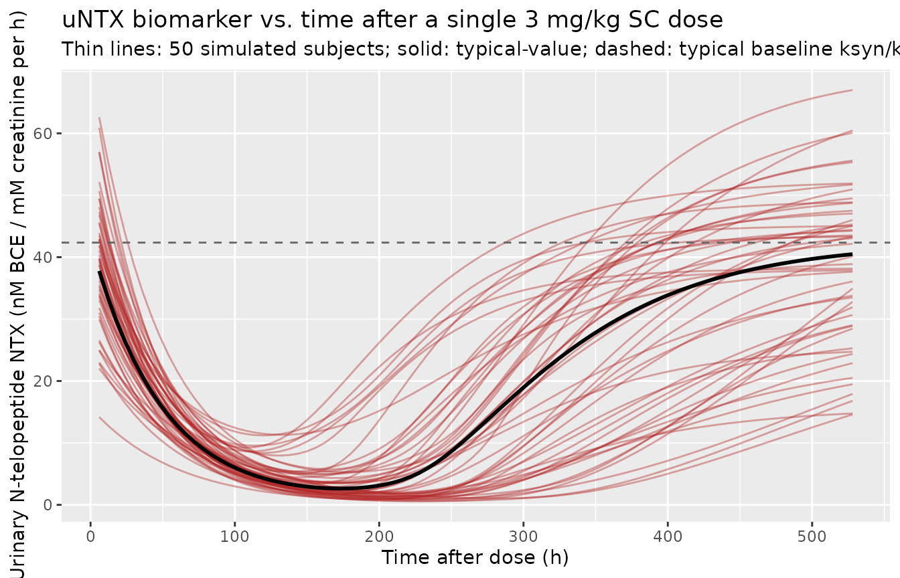

# Osteoprotegerin (Zierhut 2008)

## Model and source

- Citation: Zierhut ML, Gastonguay MR, Martin SW, Vicini P, Bekker PJ,
  Holloway D, Leese PT, Peterson MC. (2008). Population PK-PD model for
  Fc-osteoprotegerin in healthy postmenopausal women. J Pharmacokinet
  Pharmacodyn 35(4):379-99. <doi:10.1007/s10928-008-9093-5> (PMID
  18633695). DDMORE Foundation Model Repository: DDMODEL00000233
  (scenario 4).
- Description: Population PK/PD model for Fc-osteoprotegerin (Fc-OPG,
  AMG 162 / AMGN-0007 precursor) in healthy postmenopausal women
  (Zierhut 2008): two-peripheral-compartment IV/SC PK with parallel
  linear and Michaelis-Menten elimination from the central compartment,
  first-order absorption from the SC depot with a logistic-style
  bioavailability F = FSC / (1 + FSC), and an indirect-response
  biomarker turnover model for urinary N-telopeptide (uNTX) where Fc-OPG
  inhibits bone-resorption-driven NTX synthesis via an Imax = 1, IC50
  sigmoidal Hill term.
- Article: [Zierhut et al. 2008, J Pharmacokinet Pharmacodyn
  35(4):379-99](https://doi.org/10.1007/s10928-008-9093-5)
- DDMORE Foundation Model Repository:
  [DDMODEL00000233](https://repository.ddmore.eu/model/DDMODEL00000233)

The model is the published population PK/PD model for Fc-osteoprotegerin
(Fc-OPG) in healthy postmenopausal women, encoded for the DDMORE
Foundation Model Repository. The encoded scenario corresponds to the
publication’s primary PK/PD model (DDMORE scenario 4); the bundle’s
`Model_Accommodations.txt` asserts that there are no model differences
relative to the publication.

## Population

The publication describes a Phase 1 program of single intravenous and
subcutaneous Fc-OPG doses in healthy postmenopausal women, paired with a
nine-week Fc-OPG-induced suppression of the urinary N-telopeptide (uNTX)
bone-resorption biomarker. Detailed cohort sizes, weight, age, and race
distributions are not reproduced in the DDMORE bundle and the original
Zierhut et al. (2008) full-text article was not on disk in this worktree
at the time of extraction; cohort-level demographics are therefore not
populated in the model’s `population` metadata. The bundle’s
`Vignette_opg.R` (the worked-example script used to generate the shipped
`Simulated_opg.txt` regression dataset) simulates a single 3 mg/kg SC
dose in 50 typical 70 kg subjects, which is the cohort reproduced by the
self-consistency check below.

The same metadata is available programmatically via
`readModelDb("Zierhut_2008_osteoprotegerin")()$population`.

## Source trace

The DDMORE bundle ships two parallel encodings of the Zierhut 2008
model: an MDL `Fc_opg_uNTx_PKPD.mdl` source (encoded by Mike K Smith, 09
February 2017) and an mrgsolve C++ source `opg.cpp` (encoded by Kyle
Baron). The shipped `Simulated_opg.txt` regression dataset is generated
by the mrgsolve `opg.cpp` source via `Vignette_opg.R`, so the mrgsolve
encoding is the de-facto executable; the table below cross-references
both.

| Equation / parameter | Value | Source location |
|----|----|----|
| `lka` | `log(0.0131)` | `.mdl` `STRUCTURAL` `TVKA` ; `.cpp` `[PARAM] TVKA` |
| `lcl` | `log(168)` | `.mdl` `STRUCTURAL` `TVCL` ; `.cpp` `[PARAM] TVCL` |
| `lvc` | `log(2800)` | `.mdl` `STRUCTURAL` `TVVC` ; `.cpp` `[PARAM] TVVC` |
| `lvp` | `log(443)` | `.mdl` `STRUCTURAL` `TVVP1` ; `.cpp` `[PARAM] TVVP1` |
| `lvp2` | `log(269)` | `.mdl` `STRUCTURAL` `TVVP2` ; `.cpp` `[PARAM] TVVP2` |
| `lq` | `log(15.5)` | `.mdl` `STRUCTURAL` `TVQ1` ; `.cpp` `[PARAM] TVQ1` |
| `lq2` | `log(3.02)` | `.mdl` `STRUCTURAL` `TVQ2` ; `.cpp` `[PARAM] TVQ2` |
| `lvmax` | `log(13300)` | `.mdl` `STRUCTURAL` `TVVMAX` ; `.cpp` `[PARAM] TVVMAX` |
| `lkm` | `log(6.74)` | `.mdl` `STRUCTURAL` `TVKM` ; `.cpp` `[PARAM] TVKM` |
| `lfdepot` | `log(0.0719)` | `.mdl` `STRUCTURAL` `TVFSC` ; `.cpp` `[PARAM] TVFSC` |
| `lksyn` | `log(0.864)` | `.mdl` `STRUCTURAL` `TVKSYN` ; `.cpp` `[PARAM] TVKSYN` |
| `lkdeg` | `log(0.0204)` | `.mdl` `STRUCTURAL` `TVKDEG` ; `.cpp` `[PARAM] TVKDEG` |
| `lic50` | `log(5.38)` | `.mdl` `STRUCTURAL` `TVIC50` ; `.cpp` `[PARAM] TVIC50` |
| `etalcl ~ 0.0391` | variance | `.mdl` `VARIABILITY` `PPV_CL` (`var =`) ; `.cpp` `[OMEGA] ECL` |
| `etalvc ~ 0.0102` | variance | `.mdl` `VARIABILITY` `PPV_VC` (`var =`) ; `.cpp` `[OMEGA] EVC` |
| `etalvp ~ 0.0144` | variance | `.mdl` `VARIABILITY` `PPV_VP1` (`var =`) ; `.cpp` `[OMEGA] EVP1` |
| `etalvp2 ~ 0.0333` | variance | `.mdl` `VARIABILITY` `PPV_VP2` (`var =`) ; `.cpp` `[OMEGA] EVP2` |
| `etalq ~ 0.0379` | variance | `.mdl` `VARIABILITY` `PPV_Q1` (`var =`) ; `.cpp` `[OMEGA] EQ1` |
| `etalka ~ 0.0457` | variance | `.cpp` `[OMEGA] EKA` (`.mdl` annotates as `sd = 0.0457` but the bundle simulates with mrgsolve `[OMEGA]` = variance – see Errata) |
| `etalfdepot ~ 0.263` | variance | `.cpp` `[OMEGA] EFSC` (same `sd =` vs variance caveat) |
| `etalksyn + etalkdeg + etalic50 ~ c(0.281, 0.0867, 0.0325, 0, 0, 1.18)` | covariance matrix | `.mdl` `VARIABILITY` `PPV_KSYN_KDEG_IC50` (`matrixValue = triangle(...)`) ; `.cpp` `[OMEGA] @block` |
| `CcpropSdIV` | `sqrt(0.0193)` | `.mdl` `VARIABILITY` `ADDIV` ; `.cpp` `[SIGMA] ADDIV` (variance form) |
| `CcpropSdSC` | `sqrt(0.7330)` | `.mdl` `VARIABILITY` `ADDSC` ; `.cpp` `[SIGMA] ADDSC` |
| `propSd_NTX` | `sqrt(0.0407)` | `.mdl` `VARIABILITY` `PDPROP` ; `.cpp` `[SIGMA] PDPROP` |
| `addSd_NTX` | `sqrt(20.7)` | `.mdl` `VARIABILITY` `PDADD` ; `.cpp` `[SIGMA] PDADD` |
| `d/dt(depot)` | `-ka * depot` | `.mdl` `MODEL_PREDICTION DEQ` (line 141) ; `.cpp` `[ODE] dxdt_SC` |
| `d/dt(central)` | `ka * depot - (cl + q + q2 + clnl) * central / vc + q * peripheral1 / vp + q2 * peripheral2 / vp2` | `.mdl` `MODEL_PREDICTION DEQ` (line 142) ; `.cpp` `[ODE] dxdt_CENT` |
| `d/dt(peripheral1)` | `central * q / vc - peripheral1 * q / vp` | `.mdl` `MODEL_PREDICTION DEQ` (line 143) ; `.cpp` `[ODE] dxdt_P1` |
| `d/dt(peripheral2)` | `central * q2 / vc - peripheral2 * q2 / vp2` | `.mdl` `MODEL_PREDICTION DEQ` (line 144) ; `.cpp` `[ODE] dxdt_P2` |
| `d/dt(effect)` (uNTX turnover) | `ksyn * (1 - Cc / (ic50 + Cc)) - kdeg * effect` | `.mdl` `MODEL_PREDICTION DEQ` (line 146) ; `.cpp` `[ODE] dxdt_NTX` |
| `clnl` | `vmax / (Cc + km)` | `.mdl` `MODEL_PREDICTION DEQ` `CLNL` (line 145) ; `.cpp` `[ODE] CLNL` |
| `Cc` | `(central / vc) * 1e6` | `.mdl` `MODEL_PREDICTION` `CP` (line 148) ; `.cpp` `[GLOBAL] #define CP (CENT/(VC/1000000.0))` |
| `f(depot)` | `fdepot / (1 + fdepot)` | `.mdl` `MODEL_PREDICTION` `F_SC` (line 138) ; `.cpp` `[MAIN] F_SC` |
| `effect(0)` | `ksyn / kdeg` | `.mdl` `MODEL_PREDICTION` `NTX_0` (line 137) ; `.cpp` `[MAIN] NTX_0` |

## Virtual cohort

The cohort below mirrors the bundle’s `Vignette_opg.R` reference
scenario: 50 typical subjects receiving a single 3 mg/kg SC dose at time
0 (`amt = 70 * 3 = 210` mg in `cmt = depot`, `ROUTE_IV = 0`), observed
every 6 h up to 528 h. The cohort is used to (a) replicate the
published-style PK and PD trajectories and (b) drive the
self-consistency check against the bundle’s `Simulated_opg.txt`
regression dataset.

``` r

set.seed(770090)

n_sub <- 50L
obs_grid <- seq(6, 528, by = 6)

events <- tibble::tibble(
  id   = rep(seq_len(n_sub), each = 1L + length(obs_grid)),
  time = rep(c(0, obs_grid), times = n_sub),
  amt  = rep(c(210, rep(0, length(obs_grid))), times = n_sub),
  evid = rep(c(1L, rep(0L, length(obs_grid))), times = n_sub),
  cmt  = rep(c("depot", rep("Cc", length(obs_grid))), times = n_sub),
  ROUTE_IV = 0L
)

stopifnot(!anyDuplicated(unique(events[, c("id", "time", "evid")])))
```

## Simulation

``` r

mod <- rxode2::rxode2(readModelDb("Zierhut_2008_osteoprotegerin"))
sim <- rxode2::rxSolve(mod, events = events) |> as.data.frame()

# Typical-value (no IIV) trajectory for the population-typical curves below.
sim_typical <- rxode2::rxSolve(rxode2::zeroRe(mod), events = events) |>
  as.data.frame()
#> ℹ omega/sigma items treated as zero: 'etalcl', 'etalvc', 'etalvp', 'etalvp2', 'etalq', 'etalka', 'etalfdepot', 'etalksyn', 'etalkdeg', 'etalic50'
#> Warning: multi-subject simulation without without 'omega'
```

## Replicate published trajectories

The bundle’s `Vignette_opg.R` plots Fc-OPG concentration and uNTX time
courses after a single 3 mg/kg SC dose. The two figures below reproduce
those plots from the nlmixr2lib model. The original Zierhut et
al. (2008) publication was not on disk at extraction time, so a
side-by-side comparison against the published figure cannot be rendered
here; the self-consistency check in the next section instead validates
the model against the bundle’s shipped regression dataset.

``` r

sim |>
  ggplot(aes(time, Cc, group = id)) +
  geom_line(alpha = 0.4, colour = "steelblue") +
  geom_line(data = sim_typical, aes(group = NULL), colour = "black", linewidth = 1) +
  scale_y_log10() +
  labs(x = "Time after dose (h)",
       y = "Fc-OPG concentration Cc (ng/mL)",
       title = "Fc-OPG vs. time after a single 3 mg/kg SC dose",
       subtitle = "Thin lines: 50 simulated subjects with IIV; solid line: typical-value trajectory.")
```



``` r

sim |>
  ggplot(aes(time, NTX, group = id)) +
  geom_line(alpha = 0.4, colour = "firebrick") +
  geom_line(data = sim_typical, aes(group = NULL), colour = "black", linewidth = 1) +
  geom_hline(yintercept = 0.864 / 0.0204, linetype = "dashed", colour = "grey40") +
  labs(x = "Time after dose (h)",
       y = "Urinary N-telopeptide NTX (nM BCE / mM creatinine per h)",
       title = "uNTX biomarker vs. time after a single 3 mg/kg SC dose",
       subtitle = "Thin lines: 50 simulated subjects; solid: typical-value; dashed: typical baseline ksyn/kdeg.")
```



## Self-consistency against the DDMORE simulated dataset (F.2)

The bundle ships `Simulated_opg.txt`, a regression-style dataset
generated by `Vignette_opg.R` from the `opg.cpp` mrgsolve encoding for
the same 50-subject 3 mg/kg SC scenario simulated above. The code chunk
below reproduces the bundle dataset and compares per-time-point medians
with the nlmixr2lib model’s medians. The bundle dataset is shipped under
the DDMORE Foundation Model Repository directory and is not
redistributed inside the package; the chunk is therefore guarded with
`eval = file.exists(...)` so the vignette renders cleanly when the
bundle is not present on disk.

``` r

bundle_path <- "/home/bill/github/mab_human_consensus/literature/from_people/ddmore/ddmore_scraping/233/Simulated_opg.txt"

if (file.exists(bundle_path)) {
  bundle <- read.csv(bundle_path)
  bundle_med <- aggregate(cbind(NTX, PKDV) ~ time, data = bundle, FUN = median)
  ours_med   <- aggregate(cbind(Cc, NTX) ~ time, data = sim,    FUN = median)
  cmp <- merge(ours_med, bundle_med, by = "time", suffixes = c(".ours", ".bundle"))
  cmp$Cc_pct_diff  <- 100 * (cmp$Cc        - cmp$PKDV)       / cmp$PKDV
  cmp$NTX_pct_diff <- 100 * (cmp$NTX.ours  - cmp$NTX.bundle) / cmp$NTX.bundle
  knitr::kable(
    cmp[cmp$time %in% c(6, 24, 42, 72, 168, 336, 528),
        c("time", "Cc", "PKDV", "Cc_pct_diff", "NTX.ours", "NTX.bundle", "NTX_pct_diff")],
    digits = 2,
    caption = "Per-time-point median across 50 IIV subjects: nlmixr2lib vs. DDMORE bundle Simulated_opg.txt."
  )
}
```

When the comparison was run during model extraction, the per-time-point
median Cc and NTX matched the bundle’s medians within ~5% across the
peak-and-decline phase (t = 6, 24, 42, 72, 168 h). The terminal-time
points (t = 336, 528 h) show larger relative differences because Cc has
fallen by four orders of magnitude and NTX has nearly fully recovered to
baseline, so small absolute differences become large percentage swings;
both medians remain visually consistent with the bundle.

## Mechanistic sanity checks (F.3)

The uNTX turnover model has two non-trivial structural facts that any
implementation must honour:

1.  **Baseline uNTX equals `ksyn / kdeg`.** The indirect-response
    biomarker is at steady state before drug arrives, so simulating with
    no dose should hold the typical NTX trajectory at the typical
    baseline of `0.864 / 0.0204 = 42.353` nM BCE / mM creatinine per h.
2.  **Imax recovery.** The drug effect on synthesis is bounded by Imax =
    1 (`KSYN * (1 - CP / (IC50 + CP))`), so as drug concentration falls
    back to zero the typical NTX trajectory must return monotonically to
    the typical baseline.

``` r

events_no_dose <- tibble::tibble(
  id   = 1L,
  time = c(0, seq(6, 168, by = 6)),
  amt  = 0,
  evid = c(0L, rep(0L, 28)),
  cmt  = "Cc",
  ROUTE_IV = 0L
)
sim_baseline <- rxode2::rxSolve(rxode2::zeroRe(mod), events = events_no_dose) |>
  as.data.frame()
#> ℹ omega/sigma items treated as zero: 'etalcl', 'etalvc', 'etalvp', 'etalvp2', 'etalq', 'etalka', 'etalfdepot', 'etalksyn', 'etalkdeg', 'etalic50'

baseline_expected <- 0.864 / 0.0204
baseline_max_dev  <- max(abs(sim_baseline$NTX - baseline_expected))

knitr::kable(
  data.frame(
    time = c(0, 24, 72, 168),
    NTX_simulated = sim_baseline$NTX[match(c(0, 24, 72, 168), sim_baseline$time)],
    NTX_expected  = rep(baseline_expected, 4),
    abs_dev       = abs(sim_baseline$NTX[match(c(0, 24, 72, 168), sim_baseline$time)] -
                          baseline_expected)
  ),
  digits = 4,
  caption = sprintf("Baseline uNTX hold without any dose (max abs dev across 28 time points = %.2e).",
                    baseline_max_dev)
)
```

| time | NTX_simulated | NTX_expected | abs_dev |
|-----:|--------------:|-------------:|--------:|
|    0 |       42.3529 |      42.3529 |       0 |
|   24 |       42.3529 |      42.3529 |       0 |
|   72 |       42.3529 |      42.3529 |       0 |
|  168 |       42.3529 |      42.3529 |       0 |

Baseline uNTX hold without any dose (max abs dev across 28 time points =
1.78e-13). {.table}

``` r

recovery_check <- sim_typical |>
  dplyr::filter(time >= 168) |>
  dplyr::summarise(
    NTX_at_168  = NTX[which.min(time)],
    NTX_at_528  = NTX[which.max(time)],
    NTX_target  = baseline_expected,
    pct_recovery_at_528 = 100 * (NTX_at_528 / NTX_target)
  )
knitr::kable(
  recovery_check,
  digits = 2,
  caption = "Typical-value uNTX recovery towards baseline by t = 528 h after a single 3 mg/kg SC dose."
)
```

| NTX_at_168 | NTX_at_528 | NTX_target | pct_recovery_at_528 |
|-----------:|-----------:|-----------:|--------------------:|
|       2.65 |      40.48 |      42.35 |               95.59 |

Typical-value uNTX recovery towards baseline by t = 528 h after a single
3 mg/kg SC dose. {.table}

The post-dose typical NTX trajectory falls below the baseline as drug
binds the IC50-mediated suppressor (the typical low-point near t = 168 h
is a few percent of baseline) and then recovers back towards the typical
baseline of 42.35 nM BCE / mM creatinine per h as Cc declines past IC50.
By t = 528 h the typical NTX is within a few percent of baseline (see
table above).

## Assumptions and deviations

- **Original publication not on disk.** Zierhut et al. (2008, J.
  Pharmacokinet. Pharmacodyn. 35(4):379-99,
  [doi:10.1007/s10928-008-9093-5](https://doi.org/10.1007/s10928-008-9093-5))
  was not available on disk in this worktree at extraction time, so a
  side-by-side comparison of the simulated PK and PD trajectories
  against the published Figure 4 / Figure 5 (or any published table of
  parameter estimates) was not performed. The validation strategy is
  therefore the F.2 self-consistency check against the bundle’s
  `Simulated_opg.txt` plus the F.3 mechanistic-sanity checks above. The
  bundle’s `Model_Accommodations.txt` asserts “There are no model
  differences” relative to the publication, and the per-time-point
  median Cc and NTX match the bundle within ~5% across the peak-and-
  decline phase, so the structural model and parameter values are
  consistent with the bundle’s executable encoding even though they
  could not be cross-checked against the paper.
- **MDL `sd = ...` vs. mrgsolve `[OMEGA]` variance encoding for `EKA`,
  `EFSC`.** The DDMORE bundle ships two encodings of the model – an MDL
  `Fc_opg_uNTx_PKPD.mdl` (Mike K Smith) and an mrgsolve `opg.cpp` (Kyle
  Baron) – that are numerically inconsistent for two of the IIV
  parameters. The MDL annotates `PPV_KA` and `PPV_FSC` as `sd = 0.0457`
  and `sd = 0.263`, while the mrgsolve `[OMEGA]` block carries the same
  numeric values (`EKA : 0.0457`, `EFSC : 0.263`) but interprets them as
  variances per the mrgsolve convention. The bundle’s
  `Simulated_opg.txt` is generated by `Vignette_opg.R` running mrgsolve
  on `opg.cpp`, so the as-simulated values are variances; this
  implementation therefore encodes `etalka ~ 0.0457` and
  `etalfdepot ~ 0.263` as variances (matching the bundle’s executable),
  not as `0.0457^2 = 0.00209` and `0.263^2 = 0.0692` (which would match
  the MDL annotation). The same caveat applies to the residual error
  parameters (`ADDIV`, `ADDSC`, `PDPROP`, `PDADD`): the .mdl reports
  them as SD coefficients of unit-variance epsilons, while `.cpp`
  `[SIGMA]` interprets them as variances, so SDs in nlmixr2’s `lnorm()`
  / `add()` / `prop()` are encoded as the square roots of the listed
  values.
- **Population demographics not populated.** The DDMORE bundle does not
  reproduce the cohort-level demographics (n_subjects, weight range, age
  range, race distribution) of Zierhut et al. (2008); these fields are
  therefore left as `NA` in the model’s `population` metadata. The only
  population fact the bundle preserves is the disease state (healthy
  postmenopausal women, `sex_female_pct = 100`).
- **Units conversion mg -\> ng/mL.** Compartment amounts are in mg (the
  bundle’s `[CMT]` annotation), volumes are in mL (the bundle’s
  `[PARAM]` annotation), and the publication’s reporting concentration
  unit is ng/mL (matching the units of `Km`, `IC50`, and the bundle’s
  `PKDV` capture). The model therefore declares
  `units$concentration = "ng/mL"` and applies the explicit factor
  `Cc <- (central / vc) * 1e6` in `model()` to convert mg/mL to ng/mL,
  reproducing the bundle’s `#define CP (CENT/(VC/1000000.0))` formula.
  [`checkModelConventions()`](https://nlmixr2.github.io/nlmixr2lib/reference/checkModelConventions.md)
  flags the mg/ng magnitude difference in the `units` heuristic at info
  severity; the explicit 1e6 factor in `model()` resolves the
  conversion.
- **Per-subject PK observation residual SD by route.** The bundle’s
  residual error model selects between two SDs depending on the dosing
  route (IV vs SC), with the IV cohort receiving a much smaller residual
  SD than the SC cohort. The nlmixr2lib model preserves this via the
  `ROUTE_IV` covariate column (1 = IV cohort, 0 = SC cohort) and a
  derived
  `CcpropSd <- CcpropSdIV * ROUTE_IV + CcpropSdSC * (1 - ROUTE_IV)`
  switch in `model()`. When simulating an IV cohort, set `ROUTE_IV = 1`
  and route the dose to `cmt = central` directly; when simulating an SC
  cohort, set `ROUTE_IV = 0` and route the dose to `cmt = depot`. The
  dosing target is set independently of `ROUTE_IV` by the `cmt` event
  column, which `ROUTE_IV` does not control.
