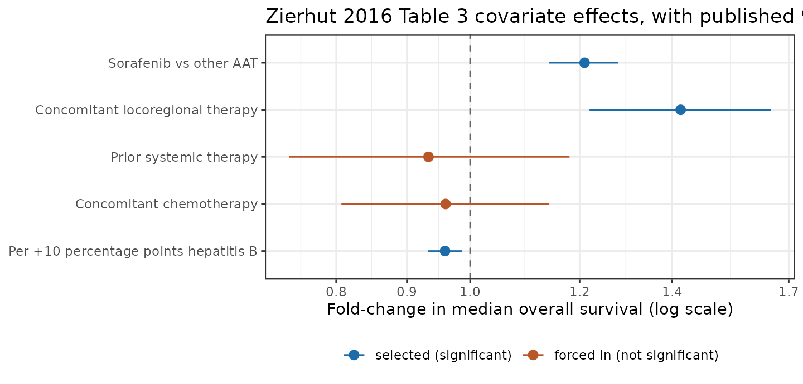
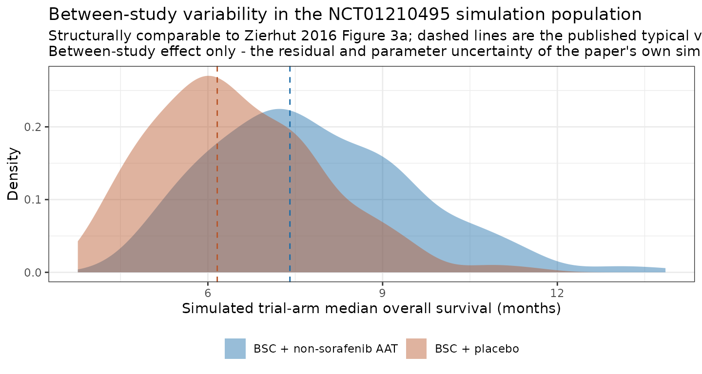
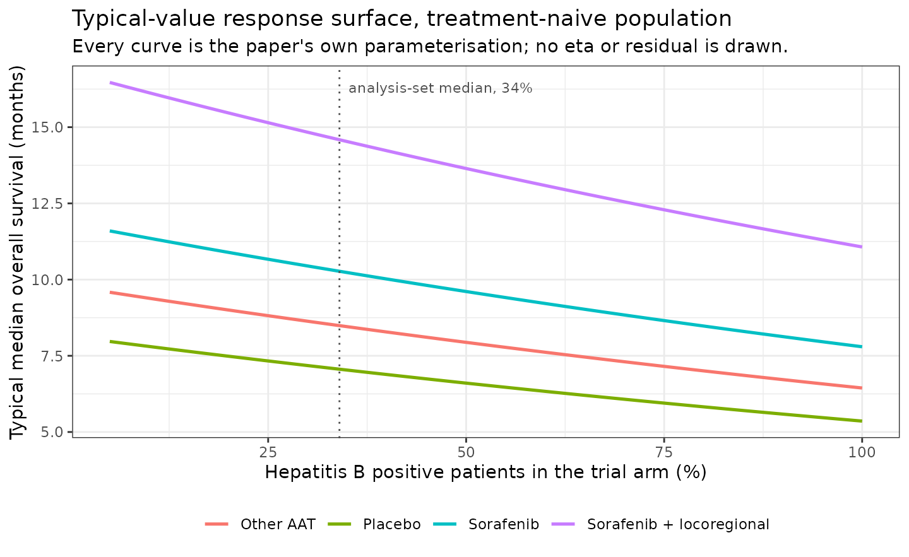

# Advanced hepatocellular carcinoma antiangiogenic-therapy survival MBMA (Zierhut 2016)

## Model and source

- Citation: Zierhut ML, Chen Y, Pithavala YK, Nickens DJ, Valota O,
  Amantea MA. Clinical trial simulations from a model-based
  meta-analysis of studies in patients with advanced hepatocellular
  carcinoma receiving antiangiogenic therapy. CPT Pharmacometrics Syst
  Pharmacol. 2016;5(5):274-282. <doi:10.1002/psp4.12078>. Structural
  model: the displayed ln(mOS_ij) equation in Results ‘Final model’ and
  the displayed fixed/random-effect equation in Methods ‘Model
  building’. Parameter values: Table 3. Covariate medians and
  analysis-set summaries: Tables 1 and 2.
- Article (open access): <https://doi.org/10.1002/psp4.12078>

Zierhut 2016 is a model-based meta-analysis (MBMA) of **median overall
survival** in advanced hepatocellular carcinoma (aHCC). It was built at
Pfizer to answer a decision-support question about a specific ongoing
study: the phase II trial NCT01210495 was comparing axitinib plus best
supportive care against placebo plus best supportive care in patients
who had already failed one antiangiogenic therapy, and the team wanted
to know, *before* the readout, how likely that trial was to show
superiority.

Because no axitinib aHCC data existed yet, the authors assembled what
the literature already knew. They screened 350 publications and
extracted 68 treatment arms from 59 studies (4,813 patients) in which a
systemic antiangiogenic therapy (AAT) had been given to an aHCC
population and median overall survival had been reported, then regressed
that survival on the arms’ design and population characteristics.

**Every observation is a published trial arm, not a patient.** The
dependent variable is one number per arm - `ln(mOS)` - so the model has
no time axis, no dose, no exposure and no individual-level survival
time. It predicts what a *trial arm* of a given composition will report
as its median overall survival. It cannot produce a survival curve, and
a hazard ratio can only be approximated from it under an explicit
exponential-survival assumption (which is what the paper does, and says
so).

``` r

mod <- readModelDb("Zierhut_2016_hcc_antiangiogenic_os_mbma")
# readModelDb() hands back the model function; rxode() compiles it to the
# rxUi object that carries iniDf, the reference string and the metadata.
ui <- rxode2::rxode(mod)
#> ℹ parameter labels from comments will be replaced by 'label()'
```

## Population

The analysis set is 4,813 patients in 68 arms of 59 studies, published
between 2005 and 2012. Trial-arm mean age was 60.2 years (range of arm
means 47 to 75) and 78.6% of patients were male. Liver function was
predominantly preserved (82.7% Child-Pugh A, 13.7% Child-Pugh B) and
98.1% of the pooled population had advanced disease.

Hepatitis B positivity - the only continuous covariate that survived
selection - averaged 38.2% per arm with a **median of 34.0%** and a
range of 4.8% to 100%, reflecting the strong regional split in aHCC
aetiology: 22 of the 59 trials were run at Asian study sites, where
hepatitis B is the dominant cause, and the rest largely elsewhere.

By treatment, the 68 arms comprise 6 placebo arms, 26 sorafenib arms and
36 arms of 14 other antiangiogenic agents (1 to 9 arms each). 24 arms
used a combination regimen, 13 gave concomitant chemotherapy and 7 gave
concomitant locoregional therapy (transarterial chemoembolization,
SIR-Spheres or cryoablation). Only 7 arms consisted entirely of patients
who had received prior systemic therapy, and only 49 of the 59 studies
were single-arm - two facts the paper’s own Discussion flags as the main
limits on what the model can support.

All patients received best supportive care in addition to whatever else
they were given, so best supportive care is built into **both**
intercepts rather than being a covariate.

## Source trace

Every value in `ini()` and every term in `model()`, with its location in
the source.

| Model quantity | Source location | Printed value | Encoded as |
|----|----|----|----|
| Structural equation | Results, “Final model”, displayed `ln(mOS_ij)` equation | `theta_AAT*AAT + theta_PBO*PBO + gamma_j + theta_SOR*SOR + theta_LOC*LOC + theta_HBV*HBV + theta_PTx*PTx + theta_CTx*CTx + eps_ij*SE_ij` | the `lnmos <- ...` sum in `model()` |
| Covariate parameterisation | Methods, “Model building”, displayed fixed/random-effect equation | continuous covariates median-centred; binary covariates enter as an additive shift | `hbvCentred`; bare indicator products |
| Log-scale interpretation | Methods, “Model building” | “the additive covariates were interpreted as proportional to mOS” | `mos <- exp(lnmos)` |
| `lmos_aat` | Table 3, `exp(theta_AAT)` | 8.49 months (95% CI 7.72 to 9.36) | `log(8.49)` |
| `lmos_pbo` | Table 3, `exp(theta_PBO)` | 7.06 months (95% CI 6.28 to 7.86) | `log(7.06)` |
| `e_sorafenib_mos` | Table 3, `exp(theta_SOR)` | 121% (95% CI 114 to 128) | `log(1.21)` |
| `e_loc_mos` | Table 3, `exp(theta_LOC)` | 142% (95% CI 122 to 165) | `log(1.42)` |
| `e_hbv_mos` | Table 3, `theta_HBV` | -0.00418 d.u./% (95% CI -7.02e-3 to -1.34e-3) | `-0.00418`, unchanged (already log-domain) |
| `e_ptx_mos` | Table 3, `exp(theta_PTx)` | 93.3% (95% CI 74.0 to 118); forced in, not significant | `log(0.933)` |
| `e_ctx_mos` | Table 3, `exp(theta_CTx)` | 96.0% (95% CI 80.7 to 114); forced in, not significant | `log(0.960)` |
| `eta_study_lnmos` | Table 3, `xi`, with footnote d (“`xi` and `sigma` are reported as SDs”) | 0.216 (95% CI 0.166 to 0.266), shrinkage 21.2% | variance `0.216^2 = 0.046656` |
| `expSd` | Table 3, `sigma`, with footnote d | 1 (fixed), shrinkage 41.5% | `fixed(1)`, on the ln scale via `lnorm()` |
| HBV centring constant 34.0 | Table 2, “Percent with HBV” median row; restated in Results as the typical population’s “34% of patients with HBV” | 34.0% | the literal `34.0` in `hbvCentred` |
| `ON_TREATMENT` semantics | Results, “Final model”: AAT and PBO are “mutually exclusive and collectively exhaustive” | \- | one column; PBO is `1 - ON_TREATMENT` |

Two notes on the encoding, both consequences of the table’s own
footnotes rather than choices:

- **Table 3 prints `exp(theta)`, not `theta`.** The two intercept rows
  are in months and the four binary-covariate rows are in percent of the
  uncovariated value, which is why they enter `ini()` as `log(8.49)` and
  `log(1.21)` rather than as the printed numbers. The HBV row is the
  exception - its footnote b says “Parameter in log-domain, thus
  unitless” - so it is entered unchanged.
- **`xi` and `sigma` are SDs, not variances.** Footnote d says so
  explicitly, so the `ini()` variance is `0.216^2`, not `0.216`.

## Parameters as encoded

``` r

ini_tbl <- as.data.frame(ui$iniDf)[, c("name", "est", "fix")]
ini_tbl$`Back-transformed` <- ifelse(
  grepl("^lmos_", ini_tbl$name), sprintf("%.2f months", exp(ini_tbl$est)),
  ifelse(grepl("^e_.*_mos$", ini_tbl$name) & ini_tbl$name != "e_hbv_mos",
         sprintf("%.1f%% of the uncovariated value", 100 * exp(ini_tbl$est)),
         ifelse(ini_tbl$name == "e_hbv_mos",
                sprintf("%.3f%% of mOS per percentage point", 100 * (exp(ini_tbl$est) - 1)),
                ifelse(ini_tbl$name == "eta_study_lnmos",
                       sprintf("SD = %.3f on ln(mOS)", sqrt(ini_tbl$est)),
                       sprintf("SD = %.1f on ln(mOS), unit study weight", ini_tbl$est)))))
#> Warning in sqrt(ini_tbl$est): NaNs produced

ini_tbl |>
  dplyr::rename(
    "Parameter" = name,
    "Estimate (model scale)" = est,
    "Fixed" = fix
  ) |>
  knitr::kable(digits = 6)
```

| Parameter | Estimate (model scale) | Fixed | Back-transformed |
|:---|---:|:---|:---|
| lmos_aat | 2.138889 | FALSE | 8.49 months |
| lmos_pbo | 1.954445 | FALSE | 7.06 months |
| e_sorafenib_mos | 0.190620 | FALSE | 121.0% of the uncovariated value |
| e_loc_mos | 0.350657 | FALSE | 142.0% of the uncovariated value |
| e_hbv_mos | -0.004180 | FALSE | -0.417% of mOS per percentage point |
| e_ptx_mos | -0.069350 | FALSE | 93.3% of the uncovariated value |
| e_ctx_mos | -0.040822 | FALSE | 96.0% of the uncovariated value |
| expSd | 1.000000 | TRUE | SD = 1.0 on ln(mOS), unit study weight |
| eta_study_lnmos | 0.046656 | FALSE | SD = 0.216 on ln(mOS) |

## Validation

This model has no concentration, no dose and no time course, so
non-compartmental analysis does not apply. What it does have is an
unusually good validation target: the paper published the numerical
results of its own clinical trial simulations, and those simulations
were run from exactly these parameters on a fully specified population.
The typical-value predictions are therefore a **closed-form** check
against six published numbers.

### 1. The paper’s clinical trial simulation, reproduced

Methods, “Clinical trial simulations”, specifies the simulated
population precisely: 132 patients on active therapy and 66 on placebo,
**50% hepatitis B positive**, **all patients had received prior systemic
therapy**, and **no** patient received concomitant locoregional therapy
or chemotherapy. Two active scenarios were run - axitinib behaving like
a non-sorafenib AAT, and axitinib behaving like sorafenib.

That maps onto covariate columns with no ambiguity at all.

``` r

cts_arms <- data.frame(
  arm             = c("BSC + placebo", "BSC + non-sorafenib AAT", "BSC + sorafenib"),
  id              = 1:3,
  time            = 0,
  evid            = 0,
  amt             = NA_real_,
  ON_TREATMENT    = c(0, 1, 1),
  SORAFENIB       = c(0, 0, 1),
  CONMED_LOCOREGIONAL = 0,
  DIS_CHB_PERCENT = 50,
  PRIOR_SYSTEMIC  = 1,
  CONMED_CHEMO    = 0
)

typical <- rxSolve(
  rxode2::zeroRe(mod),
  cts_arms[, setdiff(names(cts_arms), "arm")],
  returnType = "data.frame"
)
#> ℹ parameter labels from comments will be replaced by 'label()'
#> ℹ omega/sigma items treated as zero: 'eta_study_lnmos'
#> Warning: multi-subject simulation without without 'omega'
typical$arm <- cts_arms$arm[match(typical$id, cts_arms$id)]

published_mos <- c(6.16, 7.40, 8.95)

cts_check <- data.frame(
  Arm         = cts_arms$arm,
  Simulated   = round(typical$mos[order(typical$id)], 3),
  Published   = published_mos,
  `Pct diff`  = round(100 * (typical$mos[order(typical$id)] / published_mos - 1), 3),
  check.names = FALSE
)
knitr::kable(cts_check, caption = "Reproduces the median overall survival values reported in Results, 'Clinical trial simulations', of Zierhut 2016.")
```

| Arm                     | Simulated | Published | Pct diff |
|:------------------------|----------:|----------:|---------:|
| BSC + placebo           |     6.161 |      6.16 |    0.014 |
| BSC + non-sorafenib AAT |     7.409 |      7.40 |    0.118 |
| BSC + sorafenib         |     8.965 |      8.95 |    0.163 |

Reproduces the median overall survival values reported in Results,
‘Clinical trial simulations’, of Zierhut 2016. {.table}

The paper additionally reports the “true” mOS ratio (placebo : active) -
the ratio with the influence of trial size removed - as 0.831 for
non-sorafenib AAT and 0.687 for sorafenib.

``` r

mos_by_arm <- typical$mos[order(typical$id)]
ratio_check <- data.frame(
  Comparison  = c("placebo : non-sorafenib AAT", "placebo : sorafenib"),
  Simulated   = round(mos_by_arm[1] / mos_by_arm[2:3], 4),
  Published   = c(0.831, 0.687),
  `Pct diff`  = round(100 * ((mos_by_arm[1] / mos_by_arm[2:3]) / c(0.831, 0.687) - 1), 3),
  check.names = FALSE
)
knitr::kable(ratio_check, caption = "Reproduces the 'true' mOS ratios reported in Results, 'Clinical trial simulations', of Zierhut 2016.")
```

| Comparison                  | Simulated | Published | Pct diff |
|:----------------------------|----------:|----------:|---------:|
| placebo : non-sorafenib AAT |    0.8316 |     0.831 |    0.068 |
| placebo : sorafenib         |    0.6872 |     0.687 |    0.036 |

Reproduces the ‘true’ mOS ratios reported in Results, ‘Clinical trial
simulations’, of Zierhut 2016. {.table}

All five published quantities reproduce to better than 0.2%, which is
the rounding of the three-significant-figure inputs in Table 3. This is
a genuinely strict gate: it exercises the intercept selection, the sign
and centring of the hepatitis B slope, the multiplicative sorafenib
effect and the prior-systemic-therapy shift simultaneously, and a
transcription error in any one of them moves at least one row by several
percent.

``` r

stopifnot(
  # Deterministic, closed-form: no cohort is drawn, so these are exact up
  # to the rounding of Table 3's printed values. Tight bounds are correct
  # here and must NOT be loosened.
  max(abs(mos_by_arm / published_mos - 1)) < 0.005,
  max(abs((mos_by_arm[1] / mos_by_arm[2:3]) / c(0.831, 0.687) - 1)) < 0.005
)
```

### 2. The headline effect statements

The Results and Abstract state the model’s implications in prose. Each
one is a direct arithmetic consequence of Table 3, and each is checked
here rather than taken on trust.

``` r

th <- setNames(ui$iniDf$est, ui$iniDf$name)

headline <- data.frame(
  Statement = c(
    "mOS after AAT (8.5 months)",
    "mOS after placebo (7.1 months)",
    "average 1.43-month benefit of AAT over placebo, typical population",
    "mOS increased 21% when the AAT was sorafenib",
    "mOS increased 42% when locoregional therapy was coadministered",
    "mOS decreased ~0.4% per 1% increase in hepatitis-B-positive patients",
    "mOS decreased with prior systemic therapy (6.7% decrease)",
    "mOS decreased with concomitant chemotherapy (4% decrease)"
  ),
  Published = c(8.5, 7.1, 1.43, 21, 42, -0.4, -6.7, -4.0),
  Derived = round(c(
    exp(th[["lmos_aat"]]),
    exp(th[["lmos_pbo"]]),
    exp(th[["lmos_aat"]]) - exp(th[["lmos_pbo"]]),
    100 * (exp(th[["e_sorafenib_mos"]]) - 1),
    100 * (exp(th[["e_loc_mos"]]) - 1),
    100 * (exp(th[["e_hbv_mos"]]) - 1),
    100 * (exp(th[["e_ptx_mos"]]) - 1),
    100 * (exp(th[["e_ctx_mos"]]) - 1)
  ), 3),
  check.names = FALSE
)
knitr::kable(headline, caption = "Zierhut 2016 Abstract and Results, 'Final model'.")
```

| Statement | Published | Derived |
|:---|---:|---:|
| mOS after AAT (8.5 months) | 8.50 | 8.490 |
| mOS after placebo (7.1 months) | 7.10 | 7.060 |
| average 1.43-month benefit of AAT over placebo, typical population | 1.43 | 1.430 |
| mOS increased 21% when the AAT was sorafenib | 21.00 | 21.000 |
| mOS increased 42% when locoregional therapy was coadministered | 42.00 | 42.000 |
| mOS decreased ~0.4% per 1% increase in hepatitis-B-positive patients | -0.40 | -0.417 |
| mOS decreased with prior systemic therapy (6.7% decrease) | -6.70 | -6.700 |
| mOS decreased with concomitant chemotherapy (4% decrease) | -4.00 | -4.000 |

Zierhut 2016 Abstract and Results, ‘Final model’. {.table}

``` r


stopifnot(
  abs(exp(th[["lmos_aat"]]) - exp(th[["lmos_pbo"]]) - 1.43) < 0.005,
  abs(100 * (exp(th[["e_sorafenib_mos"]]) - 1) - 21) < 0.05,
  abs(100 * (exp(th[["e_loc_mos"]]) - 1) - 42) < 0.05,
  abs(100 * (exp(th[["e_hbv_mos"]]) - 1) + 0.4) < 0.05,
  abs(100 * (exp(th[["e_ptx_mos"]]) - 1) + 6.7) < 0.05,
  abs(100 * (exp(th[["e_ctx_mos"]]) - 1) + 4.0) < 0.05
)
```

### 3. Table 3 as a forest plot

Table 3 also prints a 95% confidence interval for every parameter,
computed (footnote a) as `estimate +/- 1.96 SE` on the scale the row is
printed in. Plotting them shows at a glance which effects the paper
treats as established and which it explicitly warns against
over-reading.

``` r

forest <- data.frame(
  term  = factor(
    c("Sorafenib vs other AAT", "Concomitant locoregional therapy",
      "Prior systemic therapy", "Concomitant chemotherapy",
      "Per +10 percentage points hepatitis B"),
    levels = rev(c("Sorafenib vs other AAT", "Concomitant locoregional therapy",
                   "Prior systemic therapy", "Concomitant chemotherapy",
                   "Per +10 percentage points hepatitis B"))
  ),
  est   = c(1.21, 1.42, 0.933, 0.960, exp(10 * -0.00418)),
  lo    = c(1.14, 1.22, 0.740, 0.807, exp(10 * -7.02e-3)),
  hi    = c(1.28, 1.65, 1.180, 1.140, exp(10 * -1.34e-3)),
  forced = c(FALSE, FALSE, TRUE, TRUE, FALSE)
)

ggplot(forest, aes(x = est, y = term, colour = forced)) +
  geom_vline(xintercept = 1, linetype = "dashed", colour = "grey40") +
  geom_pointrange(aes(xmin = lo, xmax = hi)) +
  scale_x_continuous(trans = "log", breaks = c(0.7, 0.8, 0.9, 1.0, 1.2, 1.4, 1.7)) +
  scale_colour_manual(
    values = c(`FALSE` = "#1b6ca8", `TRUE` = "#b8562a"),
    labels = c(`FALSE` = "selected (significant)", `TRUE` = "forced in (not significant)"),
    name = NULL
  ) +
  labs(
    x = "Fold-change in median overall survival (log scale)",
    y = NULL,
    title = "Zierhut 2016 Table 3 covariate effects, with published 95% CIs"
  ) +
  theme_bw() +
  theme(legend.position = "bottom")
```



The two forced-in terms straddle 1.0, exactly as the paper says: “the
95% confidence intervals of their estimates spanned both beneficial and
detrimental effects.”

### 4. The between-study random effect cancels within a trial

`gamma_j` is a **study-level** draw shared by every arm of the same
trial. That structure is load-bearing, and it is what makes the paper’s
“true” mOS ratio so much tighter (0.774 to 0.891) than the distribution
of either arm’s mOS on its own: within one simulated trial, `gamma_j`
appears identically in both arms and cancels exactly from the ratio.

Encoding that in rxode2 means one `id` per **trial**, with one
observation record per **arm**. The records are distinguished by `time`,
which here is a bare arm index and carries no elapsed-time meaning - the
model has no time axis at all.

``` r

n_trials <- 200  # simulated trials, not patients

paired <- do.call(rbind, lapply(seq_len(n_trials), function(i) {
  data.frame(
    id = i, time = c(0, 1), evid = 0, amt = NA_real_,
    ON_TREATMENT = c(0, 1), SORAFENIB = 0, CONMED_LOCOREGIONAL = 0,
    DIS_CHB_PERCENT = 50, PRIOR_SYSTEMIC = 1, CONMED_CHEMO = 0
  )
}))

rxode2::rxSetSeed(20160515)
# zeroRe(..., "sigma") keeps the between-study effect and drops the
# residual, which the source scales per record by each arm's own
# published standard error (see Errata).
sim_trials <- rxSolve(rxode2::zeroRe(mod, "sigma"), paired, returnType = "data.frame")
#> ℹ parameter labels from comments will be replaced by 'label()'

wide <- sim_trials |>
  dplyr::select(id, time, mos) |>
  tidyr::pivot_wider(names_from = time, values_from = mos, names_prefix = "arm") |>
  dplyr::mutate(ratio = arm0 / arm1)

ratio_spread <- diff(range(wide$ratio))
xi_recovered <- sd(log(wide$arm1))
```

The ratio is identical in every one of the 200 simulated trials -
0.831567, against the closed-form `exp(theta_PBO - theta_AAT)` of
0.831567 - while the arms themselves vary substantially across trials.

``` r

stopifnot(
  # Exact cancellation: gamma_j is shared within a trial, so the ratio
  # carries no between-study variance whatsoever. This is a structural
  # identity, not a statistical one, so the bound is at solver precision.
  ratio_spread < 1e-8,
  abs(unique(round(wide$ratio, 10))[1] - exp(th[["lmos_pbo"]] - th[["lmos_aat"]])) < 1e-8,

  # Recovery of xi from the simulated cohort. The band is the Monte Carlo
  # standard error of a sample SD at n = 200, xi / sqrt(2 * (n - 1)) =
  # 0.0108, widened to 4 SE so a different rxode2 RNG stream (CI resolves
  # a different rxode2 build, and the draw is not portable across solver
  # thread counts) cannot flip it.
  abs(xi_recovered - 0.216) < 4 * 0.216 / sqrt(2 * (n_trials - 1))
)
```

``` r

sim_trials |>
  dplyr::mutate(arm = ifelse(time == 0, "BSC + placebo", "BSC + non-sorafenib AAT")) |>
  ggplot(aes(x = mos, fill = arm)) +
  geom_density(alpha = 0.45, colour = NA) +
  geom_vline(
    data = data.frame(x = mos_by_arm[1:2],
                      arm = c("BSC + placebo", "BSC + non-sorafenib AAT")),
    aes(xintercept = x, colour = arm), linetype = "dashed", show.legend = FALSE
  ) +
  scale_fill_manual(values = c("BSC + placebo" = "#b8562a",
                               "BSC + non-sorafenib AAT" = "#1b6ca8"), name = NULL) +
  scale_colour_manual(values = c("BSC + placebo" = "#b8562a",
                                 "BSC + non-sorafenib AAT" = "#1b6ca8")) +
  labs(
    x = "Simulated trial-arm median overall survival (months)",
    y = "Density",
    title = "Between-study variability in the NCT01210495 simulation population",
    subtitle = paste0(
      "Structurally comparable to Zierhut 2016 Figure 3a; dashed lines are the ",
      "published typical values.\nBetween-study effect only - the residual and ",
      "parameter uncertainty of the paper's own simulation are not included."
    )
  ) +
  theme_bw() +
  theme(legend.position = "bottom")
```



This reproduces the *structure* of Figure 3a but deliberately not its
width: the published distribution also carries parameter-estimate
uncertainty (drawn from the Hessian) and the per-arm-size residual,
neither of which travels with a packaged model. See Errata.

### 5. Covariate response surface

The hepatitis B slope is the only continuous effect in the model, and it
is the one most likely to be mis-signed or mis-scaled in transcription
(a fraction-versus-percent slip would be a 100-fold error). Sweeping it
across the observed 4.8% to 100% range, for each combination of the
binary indicators, shows both the sign and the magnitude directly.

``` r

grid <- tidyr::expand_grid(
  DIS_CHB_PERCENT = seq(5, 100, by = 1),
  scenario = c("Placebo", "Other AAT", "Sorafenib", "Sorafenib + locoregional")
) |>
  dplyr::mutate(
    ON_TREATMENT        = as.numeric(scenario != "Placebo"),
    SORAFENIB           = as.numeric(scenario %in% c("Sorafenib", "Sorafenib + locoregional")),
    CONMED_LOCOREGIONAL = as.numeric(scenario == "Sorafenib + locoregional"),
    PRIOR_SYSTEMIC      = 0,
    CONMED_CHEMO        = 0,
    id                  = dplyr::row_number(),
    time                = 0,
    evid                = 0,
    amt                 = NA_real_
  )

surface <- rxSolve(
  rxode2::zeroRe(mod),
  as.data.frame(grid[, setdiff(names(grid), "scenario")]),
  returnType = "data.frame"
)
#> ℹ parameter labels from comments will be replaced by 'label()'
#> ℹ omega/sigma items treated as zero: 'eta_study_lnmos'
#> Warning: multi-subject simulation without without 'omega'
surface$scenario <- grid$scenario[match(surface$id, grid$id)]

ggplot(surface, aes(x = DIS_CHB_PERCENT, y = mos, colour = scenario)) +
  geom_line(linewidth = 0.9) +
  geom_vline(xintercept = 34, linetype = "dotted", colour = "grey30") +
  annotate("text", x = 34, y = max(surface$mos), hjust = -0.05, vjust = 1,
           label = "analysis-set median, 34%", size = 3, colour = "grey30") +
  labs(
    x = "Hepatitis B positive patients in the trial arm (%)",
    y = "Typical median overall survival (months)",
    colour = NULL,
    title = "Typical-value response surface, treatment-naive population",
    subtitle = "Every curve is the paper's own parameterisation; no eta or residual is drawn."
  ) +
  theme_bw() +
  theme(legend.position = "bottom")
```



``` r

# The slope must be negative everywhere and must deliver exactly the
# published per-percentage-point effect. Comparing the arm-type curves to
# each other also confirms the covariate effects are multiplicative
# (constant ratio across the whole hepatitis B range) rather than
# additive, which is the substance of the source's statement that
# "the additive covariates were interpreted as proportional to mOS".
by_scen <- split(surface[order(surface$DIS_CHB_PERCENT), ], surface$scenario[order(surface$DIS_CHB_PERCENT)])
per_point <- sapply(by_scen, function(d) exp(mean(diff(log(d$mos)))) - 1)
sor_over_aat <- by_scen[["Sorafenib"]]$mos / by_scen[["Other AAT"]]$mos
loc_over_sor <- by_scen[["Sorafenib + locoregional"]]$mos / by_scen[["Sorafenib"]]$mos

stopifnot(
  all(per_point < 0),
  max(abs(per_point - (exp(-0.00418) - 1))) < 1e-8,
  diff(range(sor_over_aat)) < 1e-8, abs(mean(sor_over_aat) - 1.21) < 1e-6,
  diff(range(loc_over_sor)) < 1e-8, abs(mean(loc_over_sor) - 1.42) < 1e-6
)
```

The full sweep spans 5.36 to 16.47 months, against an observed range
across the 68 published arms of 4.2 to 20.8 months - so the model’s
covariate space covers the data it was fitted to, without the covariate
effects being large enough to reach the extremes on their own (which is
what the between-study term and the arms’ own residuals supply).

## Assumptions and deviations

- **The residual is encoded at unit study weight.** Zierhut 2016 scales
  the residual by each arm’s own reported standard error of `ln(mOS)`
  (`eps_ij * SE_ij`) and fixes the unit-weight SD at 1, because an
  estimated value below 1 would mean the model was less variable than
  the published arms themselves. That per-arm standard error is a
  property of each published trial, not of the model, so it has no
  `ini()` home - the packaged model carries `expSd = fixed(1)` and the
  scaling must be supplied downstream. **A bare stochastic `rxSolve()`
  therefore applies a residual about five-fold too wide**: the per-arm
  SE had median 0.183 across the analysis set (Table 2), so the
  unit-weight draw is roughly `1 / 0.183` times too large at the median
  arm. Every simulation in this vignette uses
  `rxode2::zeroRe(mod, "sigma")` or full `zeroRe()` for that reason.
  This follows the convention of the library’s other MBMA extractions
  (see the `N_ARM` entry in `inst/references/covariate-columns.md`,
  which blesses the unweighted encoding where the arm weight touches
  only the residual).
- **Parameter-estimate uncertainty is not carried.** The paper’s
  simulations draw the fixed effects from the Hessian-derived covariance
  matrix; the packaged model carries point estimates only, and the
  source publishes marginal 95% CIs but no covariance matrix. The
  simulated distributions here are therefore narrower than Figure 3’s,
  and the reproduction targets are the typical values and the “true”
  ratios, which are unaffected.
- **AAT and PBO are carried as one column, not two.** The source’s
  equation has separate `AAT` and `PBO` indicators, but its own text
  states they are “mutually exclusive and collectively exhaustive”. The
  model consumes `ON_TREATMENT` and computes the placebo indicator as
  `1 - ON_TREATMENT`, which is algebraically identical and makes the
  exhaustiveness structural - an input row cannot set both to 1 and
  silently sum two intercepts.
- **`time` is an arm index, not a time.** The model has no time axis.
  Where a simulation puts two records under one `id` (to share a
  between-study draw across a trial’s arms), `time` only distinguishes
  the records.
- **Prior systemic therapy is all-or-nothing at the arm level.** The
  binary `PRIOR_SYSTEMIC` is 1 only for the 7 arms whose entire
  population was pretreated. The 18 arms of mixed treatment line take 0,
  so this column is **not** the complement of a first-line indicator,
  and the continuous “percent with prior systemic tx” of Table 2 is not
  what the model consumes.
- **No individual-level interpretation is available.** Covariate
  relationships estimated on trial-arm aggregates need not hold within
  patients (the ecological-inference problem), which the paper lists as
  its first limitation. `DIS_CHB_PERCENT` in particular is an arm
  composition, and the fitted slope is a property of trials, not a
  statement that an individual hepatitis-B-positive patient survives
  0.4% less long.
- **Locoregional therapy means concomitant, not prior.** The model
  carries no prior-locoregional covariate, which is a real gap in aHCC
  where prior transarterial chemoembolization is common. The 42% effect
  also rests on only 7 arms.

## Errata and source observations

- **Table 2’s arithmetic mean mOS of 6.6 months is not reproducible and
  is treated here as a typographical error.** With 68 arms, a minimum of
  4.2 months and a median of 9.4 months, the arithmetic mean cannot fall
  below `(9.4 + 4.2) / 2 = 6.8` months. The paper’s own `ln(mOS)` row
  (mean 2.18, SD 0.36) implies an arithmetic mean of
  `exp(2.18 + 0.36^2 / 2) = 9.4` months. The median and range are
  internally consistent with that row - `exp(2.24) = 9.4`,
  `exp(1.44) = 4.2`, `exp(3.04) = 20.9` - so only the mean cell is
  affected. No model parameter depends on it; it appears in the packaged
  `population` metadata with this note attached.
- **No erratum or corrigendum was found** for this article. CPT:PSP
  lists none against the DOI, and the paper has been in print since May
  2016. 
- **The “other AAT” class is heterogeneous by construction.** 36 of the
  68 arms pool 14 different agents at 1 to 9 arms each, and the model
  gives them a single shared intercept with sorafenib as the only named
  exception. A prediction for a specific non-sorafenib agent inherits
  that pooling.
- **Asian study site was investigated but not encodable.** After the
  axitinib trial reported a site effect, the authors re-examined Asian
  geography as a placebo-arm-specific covariate post hoc. It showed a
  trend only (change in objective function -2.63, against the 3.84 entry
  threshold), and the Discussion reports the implied mOS ratios (0.821
  Asian, 0.902 non-Asian) without a fitted coefficient - so there is no
  value to encode. The same applies to publication year (-0.449), which
  the Discussion argues is the most likely explanation for the phase II
  trial’s higher observed survival in both arms.
- **Supplementary Figure S1** (the literature-screening flow diagram) is
  the only supplementary material referenced, and it contains no
  parameter values.
- **The trial this model was built to predict did not behave as
  predicted.** NCT01210495 read out afterwards with 12.7 months on
  axitinib against 9.7 on placebo (HR 0.870, p = 0.211) - both arms well
  above the simulated 7.40 and 6.16. The simulated *ratio* nonetheless
  bracketed the observed hazard ratio. The paper’s proposed explanation,
  improving best supportive care over time, is untested in this dataset.
  \`\`\`
