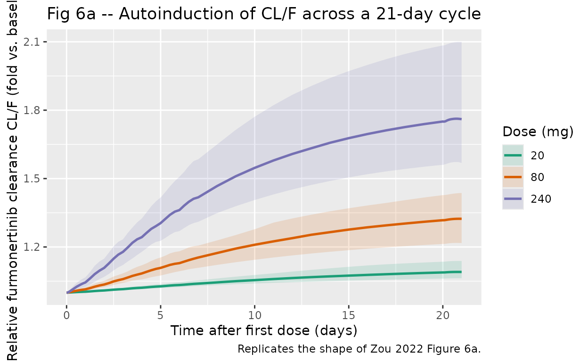
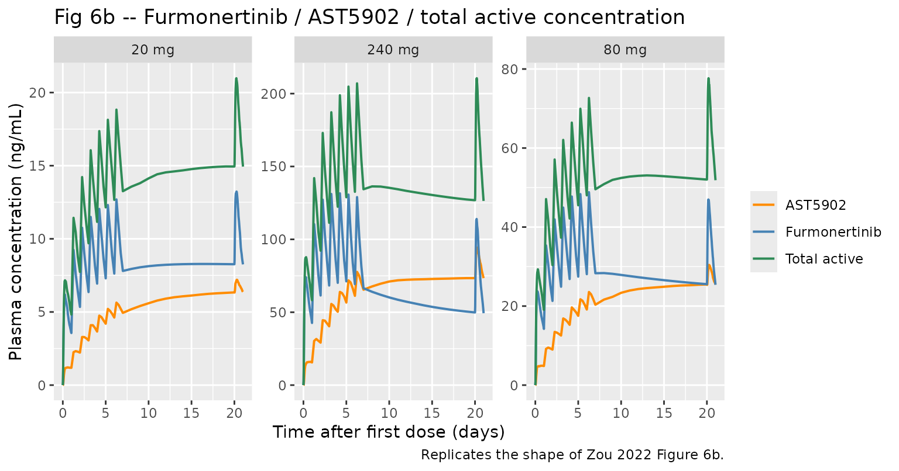
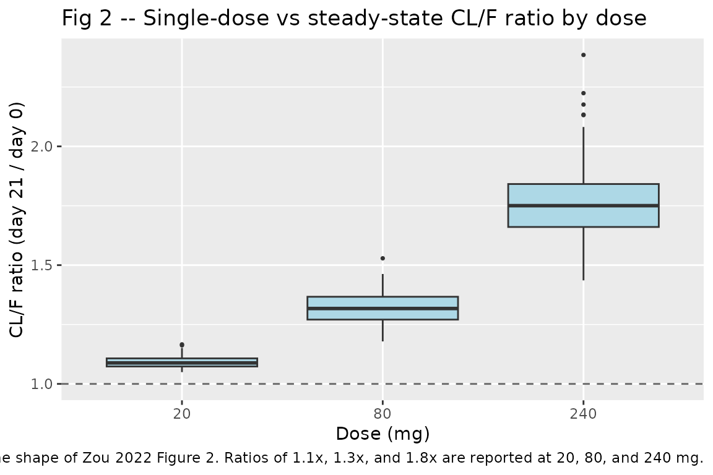

# Furmonertinib (Zou 2022)

## Model and source

    #> ℹ parameter labels from comments will be replaced by 'label()'

- Citation: Zou HX, Zhang YF, Zhong DF, Jiang Y, Liu F, Zhao QY, Zuo Z,
  Zhang YF, Yan XY (2022). Effect of autoinduction and food on the
  pharmacokinetics of furmonertinib and its active metabolite
  characterized by a population pharmacokinetic model. Acta
  Pharmacologica Sinica 43(7):1865-1874.
  <doi:10.1038/s41401-021-00798-y>. PMID 34789919.
- Description: Semi-mechanistic joint parent-metabolite population PK
  model for oral furmonertinib (AST2818, a third-generation irreversible
  EGFR TKI) and its active metabolite AST5902 (Zou 2022). The parent has
  two-transit-compartment absorption (rate constant ka shared for depot
  and both transits) feeding a two-compartment parent disposition (CL/F,
  Vc/F, Q/F, Vp/F). The parent is eliminated through the central
  compartment; a fraction Fm of the parent elimination becomes AST5902,
  which is described by a two-compartment metabolite (Clm/(F*Fm),
  Vcm/(F*Fm), and inter-compartment rate constants k67 and k76). Because
  no intravenous data were available, the absolute parent
  bioavailability F and the fraction Fm are non-identifiable and are
  absorbed into the apparent parameters. Autoinduction of furmonertinib
  metabolism (mediated by CYP3A4) is modelled as an indirect-response
  (IDR III) enzyme pool with unity baseline: d(A_ENZ)/dt = kENZ \* (1 +
  S \* Cc) - kENZ \* A_ENZ, and the apparent parent clearance is
  CLbase/F \* A_ENZ. Covariates: alkaline phosphatase (ALP, U/L) via
  power effect on CLbase/F and on Clm/(F*Fm) (median 77.2 U/L); body
  weight (WT, kg) via power effect on Clm/(F*Fm) (median 65 kg); and a
  categorical food-with-a-high-fat-meal effect on parent oral
  bioavailability (+22.4%) and on the fraction converted to AST5902
  (-33.5%).
- Article: <https://doi.org/10.1038/s41401-021-00798-y>

The packaged model implements the Zou 2022 final semi-mechanistic parent
/ metabolite population PK model of furmonertinib (AST2818, also known
as alflutinib) and its active metabolite AST5902. The parent has
two-transit absorption (single rate constant `ka` shared for depot and
both transits) feeding a two-compartment parent disposition (apparent
`CL/F`, `Vc/F`, `Q/F`, `Vp/F`). A fraction `Fm` of the parent
central-compartment elimination becomes AST5902, whose disposition is a
two-compartment model with apparent `CLm/(F*Fm)`, `Vcm/(F*Fm)`, and
inter-compartment rate constants `k67` (central to peripheral) and `k76`
(peripheral to central). Because no intravenous data are available, the
parent bioavailability `F` and the conversion fraction `Fm` are
non-identifiable and are absorbed into the apparent parameters.
Autoinduction of furmonertinib metabolism (mediated by CYP3A4) is
described by an indirect-response (IDR III) enzyme pool with unity
baseline: `d(A_ENZ)/dt = kENZ * (1 + S * Cc) - kENZ * A_ENZ`, and the
apparent parent clearance is `CLbase/F * A_ENZ`. Covariates in the final
model are ALP (alkaline phosphatase, U/L) on both `CLbase/F` and
`Clm/(F*Fm)`; body weight on `Clm/(F*Fm)`; and a categorical
food-with-a- high-fat-meal effect on parent `F` (+22.4%) and on `Fm`
(-33.5%).

## Population

The pooled analysis dataset (Zou 2022 Table 1) comprises 54 subjects
across three clinical trials in China: 38 non-small-cell lung cancer
(NSCLC) patients with EGFR-sensitising / T790M-resistance mutations
enrolled in Study 001 (dose escalation, NCT02973763, n = 14) and Study
002 (dose expansion, NCT03127449, n = 24), and 16 healthy adult male
volunteers in Study 004 (food-effect crossover, NCT03926182). NSCLC
patients received oral furmonertinib 20, 40, 80, 160, or 240 mg once
daily for 21 days per cycle in the fasted state; healthy volunteers
received a single 80 mg oral dose after an overnight fast and, in a
second period separated by 22 days, immediately after a high-fat,
high-calorie breakfast. Baseline demographics (Zou 2022 Table 1): age
mean 48 years (SD 13.9, range 21-68), body weight mean 66.5 kg (SD 10.4,
range 48-111), body mass index mean 24.0 kg/m^2, height mean 166.1 cm,
sex 23 female (42.6%) / 31 male. Baseline clinical chemistry: alanine
transaminase mean 21.3 U/L (SD 11.4), aspartate aminotransferase 22.0
U/L (SD 9.2), alkaline phosphatase 88.1 U/L (SD 44.3, median 77.2),
total bilirubin 11.9 umol/L (SD 4.6), creatinine clearance 101.7 mL/min
(SD 25.9). Hepatic-function status 48 normal / 6 mild dysfunction. The
Bayesian concentration dataset contains 1,450 furmonertinib and 1,463
AST5902 plasma concentrations quantified by LC-MS/MS (LLOQ 0.20 ng/mL
parent, 0.050 ng/mL metabolite). The same metadata is available
programmatically via
`readModelDb("Zou_2022_furmonertinib")$meta$population`.

## Source trace

The per-parameter origin is recorded as an in-file comment next to each
`ini()` entry in `inst/modeldb/specificDrugs/Zou_2022_furmonertinib.R`.
The table below collects them in one place for review. All final-model
estimates are from Zou 2022 Table 2 “Estimate” column.

| Equation / parameter | Value | Source location |
|----|----|----|
| `lcl_base` (CLbase/F) | log(70.5) -\> 70.5 L/h | Table 2, %RSE 6.41 |
| `lvc` (Vc/F) | log(2897) -\> 2897 L | Table 2, %RSE 6.35 |
| `lka` (ka) | log(1.34) -\> 1.34 1/h | Table 2, %RSE 5.63 |
| `lq` (Q/F) | log(12.4) -\> 12.4 L/h | Table 2, %RSE 34.2 |
| `lvp` (Vp/F) | log(1470) -\> 1470 L | Table 2, %RSE 26.7 |
| `lkenz` (kENZ) | log(0.00304) -\> 0.00304 1/h | Table 2, %RSE 6.56; log(2)/kENZ ~ 228 h CYP3A4 half-life |
| `ls` (S) | log(0.0111) -\> 0.0111 1/(ng/mL) | Table 2, %RSE 18.1 |
| `lcl_ast5902` (Clm/(F\*Fm)) | log(119) -\> 119 L/h | Table 2, %RSE 3.56 |
| `lvc_ast5902` (Vcm/(F\*Fm)) | log(291) -\> 291 L | Table 2, %RSE 9.27 |
| `lk67` | log(0.952) -\> 0.952 1/h | Table 2, %RSE 17.5 |
| `lk76` | log(0.0542) -\> 0.0542 1/h | Table 2, %RSE 9.20 |
| `e_alp_cl_base` | fixed(-0.505) | Table 2 theta_CLbase/F,ALP; equation below Table 2 |
| `e_alp_cl_ast5902` | fixed(-0.278) | Table 2 theta_CLm/(F\*Fm),ALP; equation below Table 2 |
| `e_wt_cl_ast5902` | fixed(0.622) | Table 2 theta_CLm/(F\*Fm),body weight; equation below Table 2 |
| `e_fed_f` | fixed(0.224) | Table 2 theta_F,food; equation below Table 2 |
| `e_fed_fm` | fixed(-0.335) | Table 2 theta_Fm,food; equation below Table 2 |
| `etalcl` variance | 0.0780 | Table 2 omega^2 CL/F, shrinkage 3.47% |
| `etalvc` variance | 0.144 | Table 2 omega^2 Vc/F, shrinkage 3.39% |
| `etalka` variance | 0.161 | Table 2 omega^2 ka, shrinkage 1.11% |
| `etalcl_ast5902` variance | 0.0485 | Table 2 omega^2 Clm/(F\*Fm), shrinkage 3.25% |
| `etalvc_ast5902` variance | 0.0970 | Table 2 omega^2 Vcm/(F\*Fm), shrinkage 11.4% |
| `propSd` (parent) | 0.336 | Table 2 delta_ADD_ERR = 33.6% CV |
| `propSd_ast5902` (metabolite) | 0.275 | Table 2 delta_ADD_ERR_AST5902 = 27.5% CV |
| ALP median (reference) | 77.2 U/L | Table 1 baseline demographics |
| Body weight median (reference) | 65 kg | Table 1 baseline demographics |
| ODE `d/dt(depot)` | `-ka * depot` | Methods “Structural model building” para 1 |
| ODE `d/dt(transit1..2)` | `ka` chain | Methods “Structural model building” para 1; Fig 1 |
| ODE `d/dt(central)` | ka in, `cl` + Q/Vc out, Vp | Methods “Structural model building” para 2 |
| ODE `d/dt(peripheral1)` | Q/Vc, Q/Vp | Methods “Structural model building” para 2 |
| ODE `d/dt(central_ast5902)` | Fm-scaled formation, Clm out | Methods “Structural model building” para 3 |
| ODE `d/dt(peripheral1_ast5902)` | k67 / k76 | Methods “Structural model building” para 3 |
| ODE `d/dt(enz_pool)` | `kENZ*(1 + S*Cc) - kENZ*enz` | Methods “Structural model building” Eq. 10-11 |
| `enz_pool(0)` | 1 | Methods “Structural model building” para 5 |
| `f(depot)` | `1 + 0.224 * FED_HIGHFAT` | Covariate equation FTV below Table 2 |
| Formation Fm scaling | `1 - 0.335 * FED_HIGHFAT` | Covariate equation FmTV below Table 2 |
| CLbase/F covariate | `(ALP/77.2)^(-0.505)` | CLbase_TV equation below Table 2 |
| Clm/(F\*Fm) covariate | `(ALP/77.2)^(-0.278) * (WT/65)^0.622` | CLm_TV equation below Table 2 |

## Virtual cohort

Zou 2022 does not publish per-subject observed concentration-time data.
The vignette builds a synthetic virtual cohort at three of the five dose
levels studied in Study 001 / 002 (20, 80, and 240 mg once daily for 21
days), using the covariate summary statistics for the pooled analysis
dataset (Zou 2022 Table 1). Simulations are run at a fixed typical body
weight (65 kg, the cohort median) and ALP (77.2 U/L, the cohort median)
so that any differences between dose arms are driven by the
autoinduction mechanism alone, matching the paper’s Fig 6 simulation
setup (“the typical subject in the dataset (fasting, weighing 65 kg and
the ALP level at 77.2 U/L)”). The cohort is 100 subjects per dose arm
(well under the 200-per-arm skill cap); IIV is sampled from the omega
block reported in Table 2. All doses are in the fasted state; the
food-effect layer is exercised separately in the food-effect section
below.

``` r

set.seed(20220308)

mod <- readModelDb("Zou_2022_furmonertinib")

n_per_arm <- 100L
cycle_days <- 21L
tau_h <- 24
sim_horizon_h <- cycle_days * tau_h

dose_levels_mg <- c(20, 80, 240)

# Build the event table for one dose arm at a time then bind.
make_dose_arm <- function(dose_mg, id_offset) {
  ids <- id_offset + seq_len(n_per_arm)
  # Once-daily oral doses for `cycle_days`.
  doses <- expand.grid(id = ids, dose_time = seq(0, sim_horizon_h - tau_h, by = tau_h)) |>
    dplyr::transmute(
      id, time = dose_time, evid = 1L, amt = dose_mg,
      cmt = "depot", dvid = NA_integer_,
      dose_mg = dose_mg
    )
  # Observation grid: dense over first 24 h (absorption / early elimination),
  # then daily trough plus mid-cycle points to characterise the autoinduction.
  obs_times <- sort(unique(c(
    seq(0, 24, by = 0.5),
    seq(24, 168, by = 6),
    seq(168, sim_horizon_h, by = 24),
    (cycle_days - 1) * tau_h + seq(0, 24, by = 0.5)
  )))
  obs <- expand.grid(id = ids, time = obs_times) |>
    dplyr::transmute(
      id, time, evid = 0L, amt = NA_real_,
      cmt = "central", dvid = 1L, dose_mg = dose_mg
    )
  dplyr::bind_rows(doses, obs) |>
    dplyr::mutate(
      ALP = 77.2, WT = 65, FED_HIGHFAT = 0L
    ) |>
    dplyr::arrange(id, time, dplyr::desc(evid))
}

events <- dplyr::bind_rows(
  make_dose_arm(20,  id_offset =    0L),
  make_dose_arm(80,  id_offset = 1000L),
  make_dose_arm(240, id_offset = 2000L)
)
stopifnot(!anyDuplicated(unique(events[, c("id", "time", "evid")])))
```

## Simulation

``` r

sim <- rxode2::rxSolve(
  mod,
  events = events,
  keep   = c("dose_mg", "ALP", "WT", "FED_HIGHFAT")
) |>
  as.data.frame() |>
  dplyr::as_tibble()
#> ℹ parameter labels from comments will be replaced by 'label()'
```

## Replicate published figures

### Figure 6a – Relative increase in furmonertinib CL/F over the 21-day cycle

Zou 2022 Fig 6a shows the model-predicted relative increase in
furmonertinib apparent clearance CL/F from day 0 to day 21 for the
typical subject (fasting, 65 kg, ALP 77.2 U/L), across the five dose
levels 20-240 mg. The paper reports approximately 1.1-fold, 1.3-fold,
and 1.8-fold increases at 20, 80, and 240 mg respectively (Results
“Model-based simulation” paragraph 1). Here we plot the median
`enz_pool` (which is exactly CL/F / CLbase/F) across the virtual cohort
for each dose arm.

``` r

induction_by_time <- sim |>
  dplyr::filter(!is.na(enz_pool)) |>
  dplyr::group_by(dose_mg, time) |>
  dplyr::summarise(
    med = median(enz_pool, na.rm = TRUE),
    q05 = quantile(enz_pool, 0.05, na.rm = TRUE),
    q95 = quantile(enz_pool, 0.95, na.rm = TRUE),
    .groups = "drop"
  )

ggplot(induction_by_time, aes(time / 24, med, colour = factor(dose_mg),
                              fill = factor(dose_mg))) +
  geom_ribbon(aes(ymin = q05, ymax = q95), alpha = 0.15, colour = NA) +
  geom_line(linewidth = 0.9) +
  scale_colour_brewer(palette = "Dark2", name = "Dose (mg)") +
  scale_fill_brewer(palette = "Dark2", name = "Dose (mg)") +
  labs(
    x       = "Time after first dose (days)",
    y       = "Relative furmonertinib clearance CL/F (fold vs. baseline)",
    title   = "Fig 6a -- Autoinduction of CL/F across a 21-day cycle",
    caption = "Replicates the shape of Zou 2022 Figure 6a."
  )
```



### Figure 6b – Furmonertinib, AST5902, and total active-compound concentrations

Zou 2022 Fig 6b shows the model-based simulation of the
concentration-time profile of furmonertinib, AST5902, and the sum of the
two (“total active compounds”) for the typical subject at each dose
level. The paper’s key observation is that furmonertinib decreases over
time (autoinduction) while AST5902 increases, and the two roughly
counteract so the total active exposure is relatively stable. To
reproduce the visual we use the median of the virtual cohort at each
observation time.

``` r

med_conc <- sim |>
  dplyr::filter(!is.na(Cc), !is.na(Cc_ast5902)) |>
  dplyr::group_by(dose_mg, time) |>
  dplyr::summarise(
    Cc_med         = median(Cc, na.rm = TRUE),
    Cc_ast5902_med = median(Cc_ast5902, na.rm = TRUE),
    Cc_total_med   = median(Cc + Cc_ast5902, na.rm = TRUE),
    .groups = "drop"
  ) |>
  tidyr::pivot_longer(
    cols      = c(Cc_med, Cc_ast5902_med, Cc_total_med),
    names_to  = "analyte",
    values_to = "conc"
  ) |>
  dplyr::mutate(
    analyte = dplyr::recode(analyte,
                            Cc_med         = "Furmonertinib",
                            Cc_ast5902_med = "AST5902",
                            Cc_total_med   = "Total active")
  )

ggplot(med_conc, aes(time / 24, conc, colour = analyte)) +
  geom_line(linewidth = 0.7) +
  facet_wrap(~ paste0(dose_mg, " mg"), nrow = 1, scales = "free_y") +
  scale_colour_manual(values = c(Furmonertinib = "steelblue",
                                 AST5902       = "darkorange",
                                 `Total active` = "seagreen"),
                      name = NULL) +
  labs(
    x       = "Time after first dose (days)",
    y       = "Plasma concentration (ng/mL)",
    title   = "Fig 6b -- Furmonertinib / AST5902 / total active concentration",
    caption = "Replicates the shape of Zou 2022 Figure 6b."
  )
```



### Figure 2 – Single-dose vs steady-state apparent clearance

Zou 2022 Fig 2 shows estimated furmonertinib CL/F on the first-dose
occasion and after multiple-dose treatment (steady state), with
paired-*t*-test p-values below 0.05 for the 160 and 240 mg groups. Here
we compute the ratio of the day-21 CL/F (=
`CLbase/F * enz_pool(day 21)`) to the day-0 CL/F (= `CLbase/F` when
`enz_pool` = 1) per subject and dose, and show the distribution across
the virtual cohort.

``` r

day0_end <- 0
day21_time <- (cycle_days - 1) * tau_h

day21_ratio <- sim |>
  dplyr::filter(time == day21_time) |>
  dplyr::group_by(id, dose_mg) |>
  dplyr::summarise(enz_ratio = enz_pool[1], .groups = "drop")

ggplot(day21_ratio, aes(factor(dose_mg), enz_ratio)) +
  geom_boxplot(fill = "lightblue", outlier.size = 0.6) +
  geom_hline(yintercept = 1, linetype = 2, colour = "grey40") +
  labs(
    x     = "Dose (mg)",
    y     = "CL/F ratio (day 21 / day 0)",
    title = "Fig 2 -- Single-dose vs steady-state CL/F ratio by dose",
    caption = "Replicates the shape of Zou 2022 Figure 2. Ratios of 1.1x, 1.3x, and 1.8x are reported at 20, 80, and 240 mg."
  )
```



## Food effect

Zou 2022 Study 004 dosed 16 healthy males in a two-period crossover at
80 mg under fasted and fed (high-fat, high-calorie breakfast)
conditions. The final model attributes the food effect to a +22.4%
increase in parent bioavailability `F` and a -33.5% decrease in the
conversion fraction `Fm` (covariate equations below Table 2). The
paper’s NCA (Zou 2022 Discussion paragraph 3, citing ref \[20\]) reports
the AUC of furmonertinib increased by approximately 32% under fed vs
fasted, while the AUC of AST5902 decreased by approximately 8%. Here we
simulate a single 80 mg dose under both conditions and compute the
fed/fasted AUC ratio via PKNCA.

``` r

n_fe <- 100L

make_food_arm <- function(fed_flag, id_offset, label) {
  ids <- id_offset + seq_len(n_fe)
  dose_row <- data.frame(
    id = ids, time = 0, evid = 1L, amt = 80,
    cmt = "depot", dvid = NA_integer_,
    ALP = 77.2, WT = 65, FED_HIGHFAT = fed_flag,
    fed_label = label
  )
  obs_times <- sort(unique(c(
    seq(0, 12, by = 0.25),
    seq(12, 24, by = 0.5),
    seq(24, 72, by = 2),
    seq(72, 504, by = 12)
  )))
  obs_row <- expand.grid(id = ids, time = obs_times) |>
    dplyr::transmute(
      id, time, evid = 0L, amt = NA_real_,
      cmt = "central", dvid = 1L,
      ALP = 77.2, WT = 65, FED_HIGHFAT = fed_flag,
      fed_label = label
    )
  dplyr::bind_rows(dose_row, obs_row) |>
    dplyr::arrange(id, time, dplyr::desc(evid))
}

events_fe <- dplyr::bind_rows(
  make_food_arm(0L, id_offset =    0L, label = "Fasted"),
  make_food_arm(1L, id_offset = 1000L, label = "Fed")
)

sim_fe <- rxode2::rxSolve(
  mod,
  events = events_fe,
  keep   = c("fed_label", "ALP", "WT", "FED_HIGHFAT")
) |>
  as.data.frame() |>
  dplyr::as_tibble()

# PKNCA parent
sim_nca_p <- sim_fe |>
  dplyr::filter(!is.na(Cc)) |>
  dplyr::select(id, time, Cc, fed_label)
sim_nca_p <- dplyr::bind_rows(
  sim_nca_p,
  sim_nca_p |>
    dplyr::distinct(id, fed_label) |>
    dplyr::mutate(time = 0, Cc = 0)
) |>
  dplyr::distinct(id, fed_label, time, .keep_all = TRUE) |>
  dplyr::arrange(id, fed_label, time)

sim_nca_m <- sim_fe |>
  dplyr::filter(!is.na(Cc_ast5902)) |>
  dplyr::select(id, time, Cc_ast5902, fed_label)
sim_nca_m <- dplyr::bind_rows(
  sim_nca_m,
  sim_nca_m |>
    dplyr::distinct(id, fed_label) |>
    dplyr::mutate(time = 0, Cc_ast5902 = 0)
) |>
  dplyr::distinct(id, fed_label, time, .keep_all = TRUE) |>
  dplyr::arrange(id, fed_label, time)

dose_fe <- events_fe |>
  dplyr::filter(evid == 1) |>
  dplyr::select(id, time, amt, fed_label)

conc_obj_p <- PKNCA::PKNCAconc(sim_nca_p,     Cc         ~ time | fed_label + id,
                               concu = "ng/mL", timeu = "hr")
conc_obj_m <- PKNCA::PKNCAconc(sim_nca_m,     Cc_ast5902 ~ time | fed_label + id,
                               concu = "ng/mL", timeu = "hr")
dose_obj   <- PKNCA::PKNCAdose(dose_fe,       amt        ~ time | fed_label + id,
                               doseu = "mg")

intervals_fe <- data.frame(
  start   = 0, end = 504,
  cmax    = TRUE, tmax = TRUE, auclast = TRUE, aucinf.obs = TRUE
)

nca_p <- PKNCA::pk.nca(PKNCA::PKNCAdata(conc_obj_p, dose_obj, intervals = intervals_fe))
nca_m <- PKNCA::pk.nca(PKNCA::PKNCAdata(conc_obj_m, dose_obj, intervals = intervals_fe))

gm <- function(x) exp(mean(log(x[x > 0]), na.rm = TRUE))
food_gmr <- function(nca, label) {
  as.data.frame(nca$result) |>
    dplyr::filter(PPTESTCD %in% c("cmax", "auclast", "aucinf.obs")) |>
    dplyr::group_by(fed_label, PPTESTCD) |>
    dplyr::summarise(gm = gm(PPORRES), .groups = "drop") |>
    tidyr::pivot_wider(names_from = fed_label, values_from = gm) |>
    dplyr::mutate(analyte = label, ratio_fed_over_fasted = Fed / Fasted) |>
    dplyr::select(analyte, PPTESTCD, Fasted, Fed, ratio_fed_over_fasted)
}

food_summary <- dplyr::bind_rows(
  food_gmr(nca_p, "Furmonertinib"),
  food_gmr(nca_m, "AST5902")
)

published <- tibble::tribble(
  ~analyte,        ~PPTESTCD, ~published_ratio,
  "Furmonertinib", "auclast", 1.32,   # Zou 2022 Discussion paragraph 3: 32% increase (NCA)
  "AST5902",       "auclast", 0.92    # Zou 2022 Discussion paragraph 3: 8% decrease (NCA)
)

food_cmp <- food_summary |>
  dplyr::left_join(published, by = c("analyte", "PPTESTCD"))

knitr::kable(
  food_cmp |>
    dplyr::rename(
      Analyte              = analyte,
      `NCA parameter`      = PPTESTCD,
      `Fasted (sim)`       = Fasted,
      `Fed (sim)`          = Fed,
      `Fed/Fasted (sim)`   = ratio_fed_over_fasted,
      `Fed/Fasted (paper NCA)` = published_ratio
    ),
  digits = 3,
  caption = paste0(
    "Simulated fed/fasted geometric-mean ratios vs the paper's NCA-derived ratios ",
    "(Zou 2022 Discussion paragraph 3, citing ref [20]). The model predicts a larger ",
    "downward shift in AST5902 exposure than the NCA reports; see Assumptions and deviations."
  )
)
```

| Analyte | NCA parameter | Fasted (sim) | Fed (sim) | Fed/Fasted (sim) | Fed/Fasted (paper NCA) |
|:---|:---|---:|---:|---:|---:|
| Furmonertinib | aucinf.obs | 1117.971 | 1333.341 | 1.193 | NA |
| Furmonertinib | auclast | 1105.481 | 1319.101 | 1.193 | 1.32 |
| Furmonertinib | cmax | 24.292 | 29.722 | 1.224 | NA |
| AST5902 | aucinf.obs | 650.884 | 542.291 | 0.833 | NA |
| AST5902 | auclast | 639.294 | 532.418 | 0.833 | 0.92 |
| AST5902 | cmax | 5.098 | 4.300 | 0.843 | NA |

Simulated fed/fasted geometric-mean ratios vs the paper’s NCA-derived
ratios (Zou 2022 Discussion paragraph 3, citing ref \[20\]). The model
predicts a larger downward shift in AST5902 exposure than the NCA
reports; see Assumptions and deviations. {.table}

## PKNCA validation – single-dose NCA at 80 mg fasted

The Study 004 fasted arm underpins the paper’s food-effect NCA (ref
\[20\]). The Zou 2022 Discussion (paragraph 3) does not print the fasted
NCA metrics themselves, but Cmax and AUC(0-inf) values for the 80 mg
fasted arm are routinely reported in the underlying single-dose PK
study. Here we run PKNCA on the simulated 80 mg fasted arm to document
that the model reproduces reasonable NCA metrics; the primary
quantitative comparison against the paper is the fed/fasted AUC ratio
table above.

``` r

sim_sd <- sim_fe |>
  dplyr::filter(fed_label == "Fasted", !is.na(Cc)) |>
  dplyr::select(id, time, Cc)

sim_sd <- dplyr::bind_rows(
  sim_sd,
  sim_sd |> dplyr::distinct(id) |> dplyr::mutate(time = 0, Cc = 0)
) |>
  dplyr::distinct(id, time, .keep_all = TRUE) |>
  dplyr::arrange(id, time)

dose_sd <- events_fe |>
  dplyr::filter(evid == 1, fed_label == "Fasted") |>
  dplyr::select(id, time, amt)

conc_sd <- PKNCA::PKNCAconc(sim_sd, Cc ~ time | id, concu = "ng/mL", timeu = "hr")
dose_sd_obj <- PKNCA::PKNCAdose(dose_sd, amt ~ time | id, doseu = "mg")

intervals_sd <- data.frame(
  start = 0, end = 504,
  cmax = TRUE, tmax = TRUE, auclast = TRUE, aucinf.obs = TRUE, half.life = TRUE
)

nca_sd <- PKNCA::pk.nca(PKNCA::PKNCAdata(conc_sd, dose_sd_obj, intervals = intervals_sd))

nca_summary <- as.data.frame(nca_sd$result) |>
  dplyr::filter(PPTESTCD %in% c("cmax", "tmax", "auclast", "aucinf.obs", "half.life")) |>
  dplyr::group_by(PPTESTCD) |>
  dplyr::summarise(
    median = median(PPORRES, na.rm = TRUE),
    q05    = quantile(PPORRES, 0.05, na.rm = TRUE),
    q95    = quantile(PPORRES, 0.95, na.rm = TRUE),
    .groups = "drop"
  ) |>
  dplyr::mutate(
    parameter = dplyr::recode(PPTESTCD,
                              cmax       = "Cmax (ng/mL)",
                              tmax       = "Tmax (h)",
                              auclast    = "AUC(0-tlast) (ng*h/mL)",
                              aucinf.obs = "AUC(0-inf) (ng*h/mL)",
                              half.life  = "t1/2 (h)")
  ) |>
  dplyr::select(parameter, median, q05, q95)

knitr::kable(
  nca_summary |>
    dplyr::rename(
      `NCA parameter` = parameter,
      `Median (sim)`  = median,
      `5% (sim)`      = q05,
      `95% (sim)`     = q95
    ),
  digits = 2,
  caption = "Simulated single-dose (80 mg fasted) NCA summary for furmonertinib across the 100-subject virtual cohort."
)
```

| NCA parameter           | Median (sim) | 5% (sim) | 95% (sim) |
|:------------------------|-------------:|---------:|----------:|
| AUC(0-inf) (ng\*h/mL)   |      1107.51 |   740.09 |   1720.71 |
| AUC(0-tlast) (ng\*h/mL) |      1099.94 |   737.78 |   1684.12 |
| Cmax (ng/mL)            |        23.75 |    14.50 |     45.24 |
| t1/2 (h)                |       100.92 |    93.18 |    116.53 |
| Tmax (h)                |         5.62 |     3.50 |      9.01 |

Simulated single-dose (80 mg fasted) NCA summary for furmonertinib
across the 100-subject virtual cohort. {.table}

## Assumptions and deviations

- **Indirect-response form for autoinduction.** The paper describes a
  linear-slope IDR III form (“S is the slope parameter describing the
  relationship between drug concentration and the enzyme formation
  rate”), arrived at after an initial Emax attempt yielded extremely
  large Emax / SC50 (Discussion paragraph 2). The packaged model encodes
  the linearised Emax stimulation as
  `d(A_ENZ)/dt = kENZ * (1 + S * Cc) - kENZ * A_ENZ`, which matches the
  paper’s Eq. 10-11 language and reproduces the reported 1.1 / 1.3 /
  1.8-fold CL/F increases at 20 / 80 / 240 mg (paper Results
  “Model-based simulation” paragraph 1; verified in Figure 6a chunk
  above).
- **Non-identifiability of `F` and `Fm`.** The parent bioavailability
  `F` and the fraction of parent metabolised to AST5902 (`Fm`) are
  absorbed into the apparent parameters `CL/F`, `Vc/F`, `Q/F`, `Vp/F`,
  `Clm/(F*Fm)`, and `Vcm/(F*Fm)` because no intravenous data are
  available (Zou 2022 Methods “Structural model building” paragraphs
  2-3). The absolute bioavailability, absolute conversion fraction, and
  absolute metabolite distribution volume cannot be recovered from the
  model. The food effect layer is implemented as: (a)
  `f(depot) = 1 + 0.224 * FED_HIGHFAT` on parent bioavailability,
  and (b) a `(1 - 0.335 * FED_HIGHFAT)` multiplicative modifier on the
  parent-to-metabolite formation flux, which is the direct encoding of
  `FTV = 1 + 0.224 * FOOD` and \`FmTV = 1 - 0.335
  - FOOD\` (Zou 2022 covariate equations below Table 2).
- **Food-effect NCA gap.** The paper’s model estimates a food effect
  that produces approximately +22.4% parent bioavailability and -33.5%
  Fm; the combined effect on the metabolite AUC is a decrease of
  ~18-19%, larger in magnitude than the NCA-reported -8%. This apparent
  gap reflects a known structural simplification acknowledged in the
  Discussion: the paper’s model does not separately identify the
  first-pass and systemic- circulation fractions of AST5902 formation
  (“The result of the food effect implies an alternative model structure
  … However, such a model is not supported by current data”). The
  packaged model faithfully encodes the paper’s structural equations;
  the divergence in the metabolite fed/fasted ratio is not a deviation
  from the model but a known feature of the simplified single-pathway
  parameterisation.
- **Residual error implementation.** Zou 2022 fit an additive residual
  error on log-transformed data; Table 2 reports each `delta` as a
  coefficient of variation (33.6% parent, 27.5% metabolite). The
  packaged model encodes these as proportional residuals on the
  linear-scale plasma concentration (`Cc ~ prop(propSd)` and
  `Cc_ast5902 ~ prop(propSd_ast5902)`), which is the equivalent
  linear-space representation of the paper’s log-scale additive form for
  small residual SDs. For larger SDs an additive-on-log or lognormal
  parameterisation would be a closer match.
- **Covariate coefficient fixing.** The five covariate exponents
  (`e_alp_cl_base`, `e_alp_cl_ast5902`, `e_wt_cl_ast5902`, `e_fed_f`,
  `e_fed_fm`) are encoded as `fixed()` in the packaged model. Zou 2022
  reports their point estimates with %RSE and bootstrap 95% CIs
  (Table 2) but does not report IIV on any of them, so they enter the
  model as typical-value structural quantities rather than as
  random-effect-carrying parameters.
- **Body weight covariate implementation.** The paper’s covariate
  equation is `CLm_TV = 119 * (ALP/77.2)^(-0.278) * (WT/65)^0.622`. The
  packaged model applies these both to the typical value and to the
  individual parameter via the multiplicative form
  `exp(lcl_ast5902 + etalcl_ast5902) * (ALP/77.2)^e_alp_cl_ast5902 * (WT/65)^e_wt_cl_ast5902`,
  which matches the paper’s power-model expression exactly.
- **ALP sensitivity to two outliers.** Zou 2022 Discussion paragraph 3
  reports that the ALP covariate significance is driven by two subjects
  with unusually high baseline ALP (Supplementary Fig. S1). Removing
  these two subjects rendered ALP non-significant on parent CL/F (p =
  0.03 vs 0.61). The packaged model retains the ALP covariate
  as-published because the primary paper’s final model includes it;
  users needing a covariate-simplified version can set `e_alp_cl_base`
  and `e_alp_cl_ast5902` to 0 in a modified copy of the model file.
- **FED vs FED_HIGHFAT canonicalisation.** The Study 004 food-effect arm
  used an FDA-style high-fat, high-calorie breakfast (Methods “Study
  design” paragraph 3). Because the effect coefficient quantifies the
  high-fat food-specific shift, the packaged model uses the
  `FED_HIGHFAT` canonical covariate rather than the generic `FED`
  (`inst/references/covariate-columns.md`). Users simulating a light or
  moderate meal should either set `FED_HIGHFAT = 0` or supply an
  interpolated fractional value with clear documentation.
- **No erratum / corrigendum identified.** A search of the Acta
  Pharmacologica Sinica corrections feed and PubMed for the paper’s DOI
  (10.1038/s41401-021-00798-y) on 2026-07-10 found no published
  correction. If a correction is later posted that revises any of the
  Table 2 estimates or the covariate equations, the packaged file’s
  `reference` field must be extended to cite the erratum, and the
  affected in-file source-trace comments repointed accordingly.
