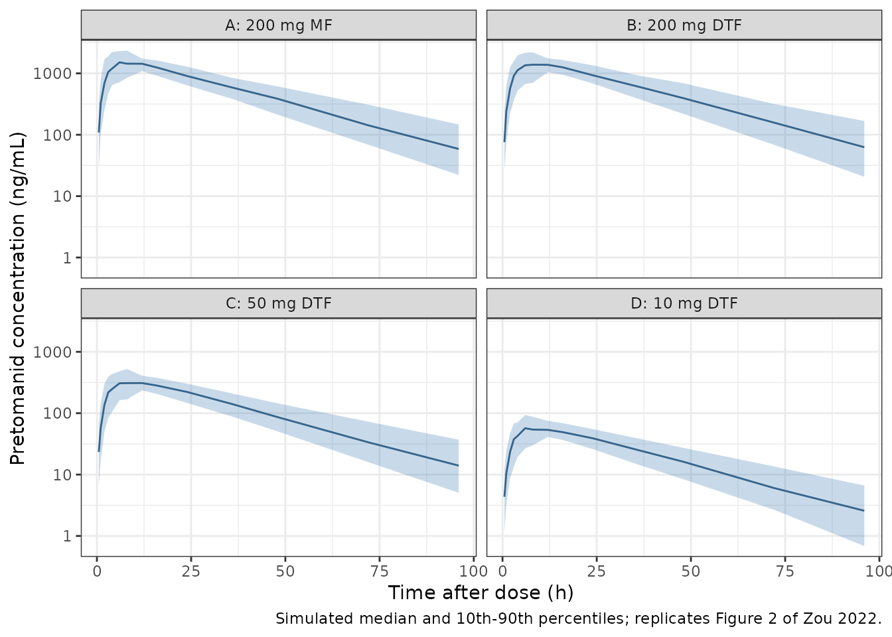

# Pretomanid (Zou 2022)

``` r

ui <- rxode2::rxode(readModelDb("Zou_2022_pretomanid"))
#> ℹ parameter labels from comments will be replaced by 'label()'
#> Warning: some etas defaulted to non-mu referenced, possible parsing error: etaiov_fdepot_1, etaiov_fdepot_2, etaiov_fdepot_3, etaiov_fdepot_4, etaiov_ka_1, etaiov_ka_2, etaiov_ka_3, etaiov_ka_4, etaiov_mtt_1, etaiov_mtt_2, etaiov_mtt_3, etaiov_mtt_4
#> as a work-around try putting the mu-referenced expression on a simple line
```

## Model and source

- Citation: Zou Y, Nedelman J, Lombardi A, Pappas F, Karlsson MO,
  Svensson EM. Characterizing Absorption Properties of Dispersible
  Pretomanid Tablets Using Population Pharmacokinetic Modelling. Clin
  Pharmacokinet. 2022;61(11):1585-1593. <doi:10.1007/s40262-022-01163-w>
- Description: One-compartment population PK model with one transit
  compartment and first-order absorption for pretomanid dispersible
  (pediatric) and marketed tablets given with a high-fat meal to healthy
  adults, with dose-dependent relative bioavailability and
  inter-occasion variability on absorption

Zou 2022 characterised a pediatric dispersible-tablet formulation (DTF)
of pretomanid against the marketed 200 mg tablet (MF) in study CL-011, a
phase 1 single-dose, four-period crossover in healthy adults. Each
participant received 10, 50 and 200 mg (4 x 50 mg) DTF and 200 mg MF,
separated by 7-day washouts. Only the panel dosed after an FDA standard
high-fat breakfast was modelled, because pretomanid is labelled to be
taken with food.

The starting point was the Salinger 2019 pooled model (also in this
package as `Salinger_2019_pretomanid`). Zou 2022 kept its
one-compartment disposition and its transit-plus-absorption-compartment
layout, but reduced the transit chain from three compartments to one:

    dose --> transit1 --> depot --> central --> eliminated
               ktr         ka         kel

with `ktr = 1 / MTT`, so the mean absorption time is `MAT = 1/KA + MTT`.
As in the Salinger 2019 model, `depot` is the source control stream’s
`ABS` compartment and sits downstream of the transit compartment; **oral
doses enter `transit1`**, which is why the model file declares
`dosing <- "transit1"`.

Covariates in the final model:

- body weight, allometric with fixed exponents 0.75 (CL) and 1 (V)
  around a 55 kg reference participant;
- formulation, on KA only: the marketed tablet absorbs 1.65-fold faster
  than the dispersible tablet. Formulation was tested on bioavailability
  (ratio 1.00, 90% CI 0.87-1.14) and not retained;
- dose, as a power function on relative bioavailability,
  `F = (DOSE/200)^0.0822`.

Interindividual variability is on CL and V (correlated). Inter-occasion
variability, one occasion per crossover period, is on F, KA and MTT. The
residual error is combined proportional and additive, and both
components are multiplied by 3.46 for samples taken less than 10 h after
the dose.

``` r

cat("ODE states:", paste(ui$state, collapse = " -> "), "\n")
#> ODE states: transit1 -> depot -> central
cat("Observation:", paste(ui$predDf$var, collapse = ", "), "\n")
#> Observation: Cc
stopifnot(identical(ui$state, c("transit1", "depot", "central")))
```

## Population

The model was fitted to the fed panel of CL-011: 24 healthy adults (16
male, 8 female) contributing 1377 concentrations. Zou 2022 Table 1
(‘Fed’ column) reports a median age of 39.0 years (range 23-50), median
weight 76.2 kg (64.4-117), median height 170 cm (155-193) and median BMI
27.0 kg/m^2 (22.6-31.5). The study was run at a single site in San
Antonio, Texas. The same information is stored in the model’s
`population` metadata:

``` r

str(readModelDb("Zou_2022_pretomanid")()$population, give.attr = FALSE)
#> Warning: some etas defaulted to non-mu referenced, possible parsing error: etaiov_fdepot_1, etaiov_fdepot_2, etaiov_fdepot_3, etaiov_fdepot_4, etaiov_ka_1, etaiov_ka_2, etaiov_ka_3, etaiov_ka_4, etaiov_mtt_1, etaiov_mtt_2, etaiov_mtt_3, etaiov_mtt_4
#> as a work-around try putting the mu-referenced expression on a simple line
#> List of 15
#>  $ species       : chr "human"
#>  $ n_subjects    : int 24
#>  $ n_studies     : int 1
#>  $ n_observations: int 1377
#>  $ age_range     : chr "23-50 years"
#>  $ age_median    : chr "39.0 years"
#>  $ weight_range  : chr "64.4-117 kg"
#>  $ weight_median : chr "76.2 kg"
#>  $ height_median : chr "170 cm (range 155-193)"
#>  $ bmi_median    : chr "27.0 kg/m^2 (range 22.6-31.5)"
#>  $ sex_female_pct: num 33.3
#>  $ disease_state : chr "healthy adult volunteers"
#>  $ dose_range    : chr "single oral doses of 10, 50 and 200 mg (4 x 50 mg) dispersible tablet and 200 mg marketed tablet, each after an"| __truncated__
#>  $ regions       : chr "United States (San Antonio, Texas)"
#>  $ notes         : chr "Phase 1 relative-bioavailability and food-effect study CL-011 (NCT04309656). The model uses the fed panel only "| __truncated__
```

## Source trace

Every value comes from Zou 2022 Table 2 and the NONMEM control stream
printed in Section C of the Electronic Supplementary Material (ESM). The
control stream’s `$THETA`, `$OMEGA` and `$SIGMA` hold the final
estimates: each one rounds to the corresponding Table 2 entry.

| Quantity | Value | Source |
|----|----|----|
| `lka` (KA, DTF) | log(0.396) 1/h | Table 2 ‘Absorption rate of DTF’; ESM THETA(3) |
| `e_form_mf_ka` | 1.65 | Table 2 ‘Proportional effect (theta3) of MF on KA’; ESM THETA(5) |
| `lmtt` | log(1.13) h | Table 2 ‘Mean transit time’; ESM THETA(4) |
| `lcl` | log(2.81) L/h | Table 2 ‘Apparent clearance’; ESM THETA(1) |
| `lvc` | log(68.0) L | Table 2 ‘Apparent volume of distribution’; ESM THETA(2) |
| `e_wt_cl`, `e_wt_vc` | 0.75, 1 (fixed) | Table 2 weight-scaling rows; ESM `$PK` TVLCL / TVLV2 |
| Weight reference | 55 kg | Table 2 footnote a; ESM `LOG(WT/55)` |
| `lfdepot` | log(1) (fixed) | Table 2 ‘Bioavailability (F)’ |
| `e_dose_fdepot` | 0.0822 | Table 2 ‘Dose effect (theta4) on F’; ESM THETA(6) |
| `etalcl`, `etalvc` block | 0.0622, 0.0111, 0.00751 | ESM `$OMEGA BLOCK(2)`; Table 2 CVs 24.9% and 8.67% |
| `etaiov_fdepot_*` | 0.00561 | ESM `$OMEGA BLOCK(3)` ‘IOV.F1’; Table 2 7.49% |
| `etaiov_ka_*` | 0.284 | ESM ‘IOV.KA’; Table 2 53.3% |
| `etaiov_mtt_*` | 0.77 | ESM ‘IOV.MATT’; Table 2 87.8% |
| `propSd` | 0.0889 | Table 2 ‘Proportional error’ 8.89%; ESM `$SIGMA` 0.0079 |
| `addSd` | 0.401 ng/mL | Table 2 ‘Additive error’; ESM `$SIGMA` 0.161 |
| `e_tad_early_ruv` | 3.46 | Table 2 ‘Time-varying error term (theta5)’; ESM THETA(7) |
| `ktr = 1/MTT`, dose into transit compartment | – | ESM `$MODEL` and `$PK` (K13 = KTR, K32 = KA) |
| `F = (DOSE/200)^theta4` | – | Table 2; ESM `TVLF1 = LOG(DOSE/200) * THETA(6)` |
| `ERRT` = 3.46 when TAD \< 10 h | – | Table 2 footnote d; ESM `$ERROR` |

Table 2 footnote b states that the IIV, IOV and proportional-error
entries are `sqrt(variance) x 100`, and the control-stream variances
reproduce them: `sqrt(0.0622) = 0.249`, `sqrt(0.00751) = 0.0867`,
`sqrt(0.00561) = 0.0749`, `sqrt(0.284) = 0.533`, `sqrt(0.77) = 0.878`,
`sqrt(0.0079) = 0.0889` and `sqrt(0.161) = 0.401`.

## Typical-value checks against the paper

The paper states three derived typical values that follow from the
parameters alone, so they are checked exactly.

``` r

p <- as.list(ui$theta)
mat_dtf <- 1 / exp(p$lka) + exp(p$lmtt)
mat_mf <- 1 / (exp(p$lka) * p$e_form_mf_ka) + exp(p$lmtt)
frel <- (c(10, 50) / 200)^p$e_dose_fdepot

typical <- data.frame(
  Quantity = c(
    "MAT, dispersible tablet (h)",
    "MAT, marketed tablet (h)",
    "MAT ratio DTF / MF (%)",
    "Relative F, 10 mg vs 200 mg (%)",
    "Relative F, 50 mg vs 200 mg (%)"
  ),
  Paper = c(3.7, 2.7, 137, 78, 89),
  Model = c(mat_dtf, mat_mf, 100 * mat_dtf / mat_mf, 100 * frel)
)
typical$Model <- signif(typical$Model, 3)
knitr::kable(
  typical,
  caption = "MAT from the Discussion and Results Section 3.2; relative bioavailability from Results Section 3.2."
)
```

| Quantity                        | Paper |  Model |
|:--------------------------------|------:|-------:|
| MAT, dispersible tablet (h)     |   3.7 |   3.66 |
| MAT, marketed tablet (h)        |   2.7 |   2.66 |
| MAT ratio DTF / MF (%)          | 137.0 | 137.00 |
| Relative F, 10 mg vs 200 mg (%) |  78.0 |  78.20 |
| Relative F, 50 mg vs 200 mg (%) |  89.0 |  89.20 |

MAT from the Discussion and Results Section 3.2; relative
bioavailability from Results Section 3.2. {.table}

``` r

# Each paper value is printed to 2-3 significant figures; the model must
# reproduce it to that rounding.
stopifnot(
  abs(mat_dtf - 3.7) < 0.05,
  abs(mat_mf - 2.7) < 0.05,
  abs(100 * mat_dtf / mat_mf - 137) < 1,
  abs(100 * frel - c(78, 89)) < 0.5
)
```

## Virtual cohort

A crossover cohort mirroring CL-011: every virtual participant receives
all four treatments, one per period, with a 168-h interval between doses
and the CL-011 sampling schedule (0-96 h after each dose). Treatments
are assigned to periods in a fixed order (MF 200 mg, DTF 200 mg, DTF 50
mg, DTF 10 mg); with the same inter-occasion variance on every occasion
and a half-life near 13 h, period order and carry-over do not affect the
comparison. Body weight is log-normal around the fed-panel median of
76.2 kg, truncated to the observed 64.4-117 kg range.

``` r

n_sub <- 200
set.seed(20221163)
wt <- numeric(0)
while (length(wt) < n_sub) {
  draw <- rlnorm(2 * n_sub, log(76.2), 0.15)
  wt <- c(wt, draw[draw >= 64.4 & draw <= 117])
}
wt <- wt[seq_len(n_sub)]

treatments <- data.frame(
  OCC = 1:4,
  treatment = c("A: 200 mg MF", "B: 200 mg DTF", "C: 50 mg DTF", "D: 10 mg DTF"),
  DOSE_PRETOMANID_MG = c(200, 200, 50, 10),
  FORM_PRETOMANID_DT = c(0, 1, 1, 1)
)
period_h <- 168
sample_times <- c(0, 0.5, 1, 2, 3, 4, 6, 8, 12, 16, 24, 36, 48, 72, 96)

dose_rows <- tidyr::expand_grid(id = seq_len(n_sub), OCC = 1:4) |>
  dplyr::mutate(
    time = (OCC - 1) * period_h,
    evid = 1L,
    amt = treatments$DOSE_PRETOMANID_MG[OCC],
    cmt = "transit1"
  )
obs_rows <- tidyr::expand_grid(id = seq_len(n_sub), OCC = 1:4, tad = sample_times) |>
  dplyr::mutate(
    time = (OCC - 1) * period_h + tad,
    evid = 0L,
    amt = 0,
    cmt = "central"
  ) |>
  dplyr::select(-tad)

events <- dplyr::bind_rows(dose_rows, obs_rows) |>
  dplyr::left_join(treatments |> dplyr::select(-treatment), by = "OCC") |>
  dplyr::mutate(WT = wt[id]) |>
  dplyr::arrange(id, time, dplyr::desc(evid)) |>
  dplyr::select(id, time, evid, amt, cmt, dplyr::everything())

stopifnot(
  !anyNA(events),
  dplyr::n_distinct(events$id) == n_sub,
  sum(events$evid == 1) == 4 * n_sub
)
```

## Simulation

``` r

rxode2::rxSetSeed(20221163)
sim <- rxode2::rxSolve(ui, events, returnType = "data.frame")
# Recover the occasion and time after dose from the clock time: each dose
# opens a 168-h period, and every sample falls 0-96 h into its period.
sim <- sim |>
  dplyr::select(-dplyr::any_of(c("OCC", "DOSE_PRETOMANID_MG", "FORM_PRETOMANID_DT"))) |>
  dplyr::mutate(
    OCC = as.integer(floor(time / period_h)) + 1L,
    tad_h = time - (OCC - 1) * period_h
  ) |>
  dplyr::left_join(treatments, by = "OCC")
stopifnot(
  nrow(sim) == n_sub * 4 * length(sample_times),
  !anyNA(sim$Cc),
  all(sim$tad_h %in% sample_times)
)
```

### Visual predictive check (replicates Figure 2)

Figure 2 of Zou 2022 shows the 10th, 50th and 90th percentiles of the
fed-panel concentrations by treatment on a log scale. The simulated
percentiles below include residual error (`sim`) and are the model’s
counterpart of those bands.

``` r

vpc <- sim |>
  dplyr::filter(tad_h > 0) |>
  dplyr::group_by(treatment, tad_h) |>
  dplyr::summarise(
    p10 = quantile(sim, 0.10),
    p50 = quantile(sim, 0.50),
    p90 = quantile(sim, 0.90),
    .groups = "drop"
  )
ggplot(vpc, aes(tad_h)) +
  geom_ribbon(aes(ymin = p10, ymax = p90), fill = "steelblue", alpha = 0.3) +
  geom_line(aes(y = p50), colour = "steelblue4") +
  facet_wrap(~treatment) +
  scale_y_log10() +
  labs(
    x = "Time after dose (h)",
    y = "Pretomanid concentration (ng/mL)",
    caption = "Simulated median and 10th-90th percentiles; replicates Figure 2 of Zou 2022."
  ) +
  theme_bw()
```



### Absorption-phase residual error

The residual SD is 3.46-fold larger for samples taken less than 10 h
after the dose. At the 200 mg concentrations the proportional term
dominates the additive one, so the ratio of the relative-residual SDs
before and after 10 h recovers the multiplier.

``` r

ruv <- sim |>
  dplyr::filter(DOSE_PRETOMANID_MG == 200, tad_h > 0, Cc > 50) |>
  dplyr::mutate(rel_resid = (sim - Cc) / Cc, early = tad_h < 10) |>
  dplyr::group_by(early) |>
  dplyr::summarise(sd_rel = sd(rel_resid), n = dplyr::n(), .groups = "drop")
knitr::kable(ruv, digits = 4, caption = "Relative-residual SD before (TRUE) and after (FALSE) 10 h, 200 mg arms.")
```

| early | sd_rel |    n |
|:------|-------:|-----:|
| FALSE | 0.0899 | 2621 |
| TRUE  | 0.3135 | 2687 |

Relative-residual SD before (TRUE) and after (FALSE) 10 h, 200 mg arms.
{.table}

``` r

ratio <- ruv$sd_rel[ruv$early] / ruv$sd_rel[!ruv$early]
cat("Early / late residual SD ratio:", signif(ratio, 3), "(model multiplier 3.46)\n")
#> Early / late residual SD ratio: 3.49 (model multiplier 3.46)
# Thousands of residuals per group put the SD ratio within a few percent of
# 3.46 (the additive term lowers it slightly); omitting the multiplier gives
# 1, and applying it to every sample also gives 1.
stopifnot(ratio > 3.0, ratio < 3.9)
```

## Non-compartmental analysis

NCA uses the individual predictions (`Cc`, no residual error) on the
CL-011 sampling schedule, per treatment. Reference values are the
fed-panel geometric least-squares means in the ESM: Table D1 for
treatments A and B, and Table D5 (primary analysis, ‘Test’ = fed) for
treatments C and D. The simulated values are cohort medians, which for
log-normally distributed exposure estimate the same quantity as a
geometric mean.

``` r

conc <- sim |>
  dplyr::filter(!is.na(Cc)) |>
  dplyr::mutate(conc = pmax(Cc, 0)) |>
  dplyr::select(id, treatment, time = tad_h, conc)
dose <- events |>
  dplyr::filter(evid == 1) |>
  dplyr::left_join(treatments |> dplyr::select(OCC, treatment), by = "OCC") |>
  dplyr::transmute(id, treatment, time = 0, amt)

conc_obj <- PKNCA::PKNCAconc(conc, conc ~ time | treatment + id)
dose_obj <- PKNCA::PKNCAdose(dose, amt ~ time | treatment + id)
intervals <- data.frame(
  start = c(0, 0),
  end = c(96, Inf),
  cmax = c(TRUE, FALSE),
  tmax = c(TRUE, FALSE),
  auclast = c(TRUE, FALSE),
  aucinf.obs = c(FALSE, TRUE),
  half.life = c(FALSE, TRUE)
)
nca_res <- PKNCA::pk.nca(PKNCA::PKNCAdata(conc_obj, dose_obj, intervals = intervals))
nca_long <- as.data.frame(nca_res$result) |>
  dplyr::filter(PPTESTCD %in% c("cmax", "tmax", "auclast", "aucinf.obs", "half.life"))
```

``` r

reference <- data.frame(
  treatment = c("A: 200 mg MF", "B: 200 mg DTF", "C: 50 mg DTF", "D: 10 mg DTF"),
  cmax = c(2120, 1820, 384, 75.3),
  auclast = c(53900, 54200, 12000, 1970),
  aucinf.obs = c(56100, 56700, 12400, 2030)
)
cmp <- nlmixr2lib::ncaComparisonTable(
  simulated = nca_long,
  reference = reference,
  by = "treatment",
  units = c(cmax = "ng/mL", auclast = "ng*h/mL", aucinf.obs = "ng*h/mL"),
  tolerance_pct = 20
)
knitr::kable(
  cmp,
  caption = paste(
    "Zou 2022 ESM Tables D1 and D5 (fed-panel geometric LS means) vs simulated",
    "cohort medians. AUC0-t is AUC over 0-96 h. * differs by more than 20%."
  )
)
```

| NCA parameter           | treatment     | Reference | Simulated | % diff   |
|:------------------------|:--------------|:----------|:----------|:---------|
| Cmax (ng/mL)            | A: 200 mg MF  | 2120      | 1620      | -23.6%\* |
| Cmax (ng/mL)            | B: 200 mg DTF | 1820      | 1520      | -16.4%   |
| Cmax (ng/mL)            | C: 50 mg DTF  | 384       | 345       | -10.2%   |
| Cmax (ng/mL)            | D: 10 mg DTF  | 75.3      | 60.4      | -19.8%   |
| AUC0-∞ (obs) (ng\*h/mL) | A: 200 mg MF  | 56100     | 53400     | -4.7%    |
| AUC0-∞ (obs) (ng\*h/mL) | B: 200 mg DTF | 56700     | 54800     | -3.4%    |
| AUC0-∞ (obs) (ng\*h/mL) | C: 50 mg DTF  | 12400     | 12100     | -2.4%    |
| AUC0-∞ (obs) (ng\*h/mL) | D: 10 mg DTF  | 2030      | 2150      | +5.8%    |
| AUClast (ng\*h/mL)      | A: 200 mg MF  | 53900     | 51800     | -3.9%    |
| AUClast (ng\*h/mL)      | B: 200 mg DTF | 54200     | 52800     | -2.6%    |
| AUClast (ng\*h/mL)      | C: 50 mg DTF  | 12000     | 11700     | -2.6%    |
| AUClast (ng\*h/mL)      | D: 10 mg DTF  | 1970      | 2050      | +4.1%    |

Zou 2022 ESM Tables D1 and D5 (fed-panel geometric LS means) vs
simulated cohort medians. AUC0-t is AUC over 0-96 h. \* differs by more
than 20%. {.table}

``` r

pct <- nca_long |>
  dplyr::group_by(treatment, PPTESTCD) |>
  dplyr::summarise(sim = median(PPORRES), .groups = "drop") |>
  dplyr::inner_join(
    tidyr::pivot_longer(reference, -treatment, names_to = "PPTESTCD", values_to = "pub"),
    by = c("treatment", "PPTESTCD")
  ) |>
  dplyr::mutate(pct_diff = 100 * (sim / pub - 1))
auc_pct <- pct$pct_diff[pct$PPTESTCD != "cmax"]
cmax_pct <- pct$pct_diff[pct$PPTESTCD == "cmax"]
# AUC is set by F * dose / CL, so a mis-transcribed clearance, weight
# reference, dose exponent or unit moves every arm by tens of percent.
# Cmax is underpredicted in every arm, by about 10-25%, which is the peak
# underprediction the paper reports for its own model (Discussion), so it
# is gated on its centre with an envelope that admits cohort noise.
stopifnot(
  abs(median(auc_pct)) < 8,
  max(abs(auc_pct)) < 15,
  abs(median(cmax_pct)) < 25,
  max(abs(cmax_pct)) < 35
)
```

Simulated and observed AUCs agree across the 20-fold dose range. The
largest AUC difference is at 10 mg, where the power model’s relative
bioavailability of 78% sits slightly above the observed dose-normalised
exposure (the observed 10 mg/200 mg AUC0-inf ratio is about 72%).

Cmax is underpredicted in every arm, most for the marketed 200 mg tablet
and the 10 mg dispersible tablet (about 20-25% below the observed
geometric means) and least at 50 mg. This reproduces a limitation of the
published model rather than an encoding error: Zou 2022 reports that its
own peak concentrations were underpredicted at 10 mg and for the 200 mg
marketed tablet (Discussion and ESM Section B VPCs). The model was built
to predict AUC, the exposure metric used for pediatric dose selection.

## Assumptions and deviations

- **Fed conditions only.** The model was fitted to the fed panel; it
  carries no food effect and should not be used to simulate fasted
  dosing. The fasted panel was analysed by NCA only, and the dose
  dependence of exposure reverses under fasting (NCA slope 0.824 versus
  1.086 fed).
- **Weight reference.** Clearance and volume are referenced to 55 kg,
  inherited from Salinger 2019, even though the fed panel weighed
  64.4-117 kg. The typical values `CL = 2.81 L/h` and `V = 68.0 L`
  therefore describe a lighter participant than any enrolled.
- **Formulation indicator polarity.** The source column `DTF` (1 =
  dispersible tablet) is carried as `FORM_PRETOMANID_DT`; the model
  forms the marketed-formulation indicator `1 - FORM_PRETOMANID_DT`
  internally, as the control stream does.
- **Occasions.** One occasion per crossover period (`OCC` 1-4). The ESM
  `$OMEGA BLOCK(3) SAME` blocks are encoded as independent per-occasion
  etas with occasions 2-4 fixed to the occasion-1 variances; the
  BLOCK(3) off-diagonals are zero in the source, so the etas are
  uncorrelated. Records with `OCC` outside 1-4 receive no inter-occasion
  variability.
- **Mu-referencing warning.** rxode2 has no occasion level for random
  effects, so the per-occasion etas are combined through occasion
  indicators. rxode2 warns that these etas are not mu-referenced. The
  warning concerns estimation speed only; simulation is unaffected.
- **Time-varying residual error.** The control stream switches on a
  `TAD` data column; the model uses rxode2’s `tad()`, the time since the
  most recent dose, which is the same quantity for single doses
  separated by washouts. NONMEM’s
  `Y = IPRED + ERRT * (EPS(1) * IPRED + EPS(2))` with a diagonal
  `$SIGMA` is a combined error whose variances add (`combined2()`).
- **Unpublished covariance.** The CL-V covariance (0.0111, correlation
  0.51) is printed only in the ESM control stream, not in Table 2; the
  control stream’s other estimates all match Table 2, so it is taken as
  the final estimate.
- **NCA reference statistic.** The ESM reports geometric least-squares
  means; the comparison uses simulated cohort medians.
- **Peak concentrations.** Simulated Cmax is about 10-25% below the
  observed geometric means, as the source reports for its own model; AUC
  is reproduced within about 6%.
- **Virtual cohort.** Body weight is log-normal (median 76.2 kg, log-SD
  0.15) truncated to the fed-panel range; sex, age and height do not
  enter the model.
