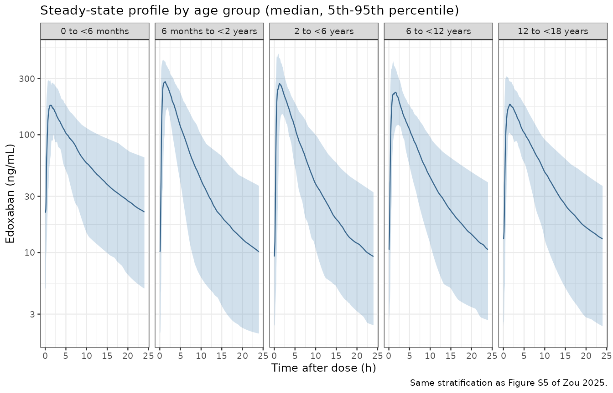
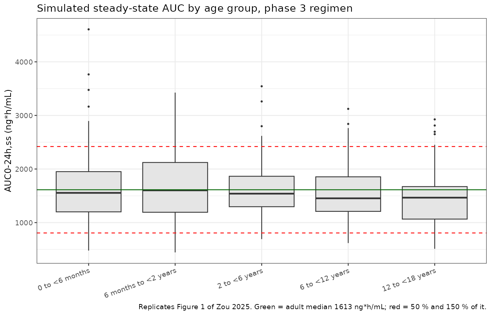
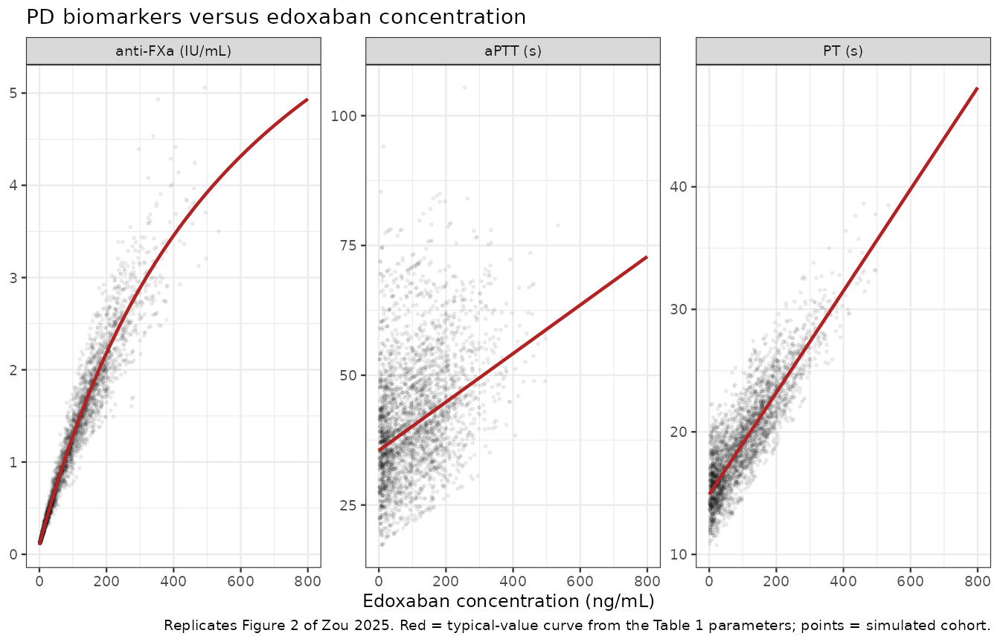

# Edoxaban (Zou 2025)

## Model and source

``` r

ui <- rxode2::rxode(readModelDb("Zou_2025_edoxaban"))
#> ℹ parameter labels from comments will be replaced by 'label()'
```

- Citation: Zou P, Atluri A, Chang P, Goedecke M, Leil TA. Population
  pharmacokinetics and pharmacodynamics of edoxaban in pediatric
  patients. CPT Pharmacometrics Syst Pharmacol. 2025;14(1):118-129.
  <doi:10.1002/psp4.13248>
- Article: <https://doi.org/10.1002/psp4.13248>
- Supplement (Tables S1-S6, Figures S1-S10, and the final PopPK NONMEM
  control stream): <https://doi.org/10.1002/psp4.13248> Supporting
  Information (`PSP4-14-118-s001.docx`, retrieved via EuropePMC
  `PMC11706424`).

Edoxaban is an oral direct inhibitor of activated factor X. Zou 2025
pooled three pediatric studies to build a population PK model and three
sequential, direct-response PK/PD models for the coagulation biomarkers
anti-factor Xa activity, activated partial thromboplastin time (aPTT)
and prothrombin time (PT). Because all three PD layers are algebraic
functions of the plasma concentration, they are packaged here together
with the PK as a single four-output model.

``` r

cat(strwrap(ui$description, width = 78), sep = "\n")
#> Joint population PK / PD model for oral edoxaban in pediatric patients (0 to
#> <18 years) with venous thromboembolism or cardiac disease at risk of
#> thromboembolic events (Zou 2025; pooled phase 1 PK/PD study, Hokusai-VTE
#> PEDIATRICS and ENNOBLE-ATE). Disposition is two-compartment with linear
#> elimination; absorption is a chain of 15 transit compartments emptying at a
#> common rate Ktr followed by a first-order step Ka into the central
#> compartment. Apparent clearance and inter-compartmental clearance are
#> allometrically scaled to body weight (exponent fixed to 0.75), apparent
#> central and peripheral volumes to body weight (exponent fixed to 1).
#> Clearance additionally carries a power term on bedside-Schwartz eGFR
#> (reference 110 mL/min/1.73 m^2) and a Rhodin-style postmenstrual-age renal
#> maturation Hill function with TM50 and Hill both fixed (47.7 weeks, 3.40).
#> Three direct-response pharmacodynamic endpoints are driven by the plasma
#> concentration: an Emax model for anti-factor Xa activity (baseline fixed to
#> 0.1 IU/mL) and linear models for activated partial thromboplastin time and
#> prothrombin time, each with variability on its own baseline or maximum
#> effect. The paper's PD layers were fitted sequentially against OBSERVED
#> edoxaban concentrations; they are wired to the model-predicted concentration
#> here so the published PK/PD relationships can be simulated as one system.
```

## Population

The analysis dataset pooled 208 pediatric patients (589 plasma
concentrations) from a single-dose phase 1 PK/PD study (NCT02303431, N =
66), Hokusai-VTE PEDIATRICS (NCT02798471, N = 69) and ENNOBLE-ATE
(NCT03395639, N = 73). Subjects spanned 0.011 to 17.9 years (median
6.06), 2.60 to 157 kg (median 21.1) and postmenstrual ages of 38.6 to
970 weeks (median 353). 39.9 % were female; the race distribution was
60.6 % White, 13.5 % Asian, 9.6 % Black, 10.6 % Other and 5.8 % Unknown
(Table S5). Renal function, estimated with the bedside Schwartz formula,
skewed supranormal relative to the adult reference cohort: median eGFR
111 mL/min/1.73 m^2 (range 29.5-774; Table S6).

Dosing was age-, weight- and renal-function-banded (Table S2).
Adolescents took tablets; children under 12 years took an oral
suspension dosed in mg/kg. The PD subsets are smaller than the PK set
because only time-matched samples were modelled: 233 anti-FXa
observations from 122 subjects, 431 aPTT observations from 197 subjects
and 432 PT observations from 198 subjects (Table S1).

The same information is available programmatically via
`readModelDb("Zou_2025_edoxaban")()$population`.

## Source trace

Every `ini()` entry in `inst/modeldb/specificDrugs/Zou_2025_edoxaban.R`
carries an in-file comment naming its origin. They are collected here
for review.

| Equation / parameter | Value | Source location |
|----|----|----|
| `lcl` (CL/F) | 42.87 L/h | Table 1, RSE 3 % |
| `lvc` (Vc/F) | 261 L | Table 1, RSE 0.9 % |
| `lq` (Q/F) | 8.59 L/h | Table 1, RSE 2.3 % |
| `lvp` (Vp/F) | 343.5 L | Table 1, RSE 10.7 % |
| `lka` (Ka) | 3.71 1/h | Table 1, RSE 0.6 % |
| `lktr` (Ktr) | 47.5 1/h | Table 1, RSE 1 % |
| Number of transit compartments | 15 | Results (“The number of transits (NN) and Ktr were estimated as 15 and 47.5 h-1”); supplement `$MODEL COMP=(transit1) ... COMP=(transit15)` |
| `e_wt_cl_q` | 0.75 (fixed) | Table 1 “Fixed exponents for body weight-based scaling”; supplement `$THETA 0.75 FIX ; 9 ALLMCL BW` |
| `e_wt_vc_vp` | 1.0 (fixed) | Table 1, same row; supplement `$THETA 1 FIX ; 10 ALLMV BW` |
| `e_crcl_cl` | 0.268 | Table 1 “eGFR effect on clearance”, RSE 16 % |
| `tmat50` | 47.7 weeks (fixed) | Table 1; Methods “PopPK model development”; Rhodin 2009 |
| `hill_mat` | 3.40 (fixed) | Table 1; Methods “PopPK model development”; Rhodin 2009 |
| Covariate model on CL/F | `CL/F = CL/F_TYP*(WT/70)^0.75*(eGFR/110)^0.268*[PMA^3.4/(47.7^3.4+PMA^3.4)]` | Table 1 footnote a; Equation 4; supplement `$PK` |
| `etalcl` | 31.8 % CV | Table 1, RSE 10 %, shrinkage 15 % |
| `etalvc` | 35.6 % CV | Table 1, RSE 10 %, shrinkage 35 % |
| `etalq` | 76.7 % CV | Table 1, RSE 7 %, shrinkage 37 % |
| `etalktr` | 79.6 % CV | Table 1, RSE 9 %, shrinkage 60 % |
| `etalka` | 144.9 % CV | Table 1, RSE 2 %, shrinkage 49 % |
| `propSd` | 0.228 | Table 1 “Proportional error 22.8 %”, RSE 8 % |
| `addSd` | 0.71 ng/mL (fixed) | Table 1 “Additive error (ng/mL) 0.71 FIX” |
| `lrbase_antiFXa` | 0.10 IU/mL (fixed) | Table 1 PD (Anti-FXa); Results (“fixed to 0.1 IU/mL because of the small number of pre-treatment anti-FXa measurements (N = 9)”) |
| `lemax_antiFXa` | 8.65 IU/mL | Table 1 PD (Anti-FXa), RSE 42.3 % |
| `lec50_antiFXa` | 631 ng/mL | Table 1 PD (Anti-FXa), RSE 50.0 % |
| `etalemax_antiFXa` | 14.8 % CV | Table 1 PD (Anti-FXa), RSE 28.9 %, shrinkage 42.5 % |
| `addSd_antiFXa` | 0.247 IU/mL | Table 1 PD (Anti-FXa), RSE 15.9 % |
| `lrbase_aPTT` | 35.5 s | Table 1 PD (aPTT), RSE 2.30 % |
| `lslope_aPTT` | 0.0467 s per ng/mL | Table 1 PD (aPTT), RSE 10.3 % |
| `etalrbase_aPTT` | 30.7 % CV | Table 1 PD (aPTT), RSE 13.7 %, shrinkage 13.9 % |
| `propSd_aPTT` | 0.197 | Table 1 PD (aPTT), RSE 15.3 % |
| `lrbase_PT` | 14.9 s | Table 1 PD (PT), RSE 1.47 % |
| `lslope_PT` | 0.0415 s per ng/mL | Table 1 PD (PT), RSE 3.92 % |
| `etalrbase_PT` | 14.5 % CV | Table 1 PD (PT), RSE 20.3 %, shrinkage 29.8 % |
| `propSd_PT` | 0.159 | Table 1 PD (PT), RSE 28.1 % |
| Absorption chain (`depot -> transit1..15 -> central`, Ktr then Ka) | n/a | Supplement `$PK`: `K14=KTR`, `K45..K17T18=KTR`, `K18T2=KA`; Figure S1 |
| Concentration scaling (mg, L -\> ng/mL) | x1000 | Supplement `$PK`: `S2 = V/1000` |
| Structural dosing regimens | see below | Table S2 |
| Cohort covariate distributions | see below | Table S6 |

### Omega convention

Table 1 reports each IIV as a percentage. Whether that percentage is
`sqrt(omega^2)` or the log-normal `sqrt(exp(omega^2) - 1)` changes the
simulated spread materially at the larger values, and the paper does not
say. The supplement’s `$OMEGA` block settles it. Those are the previous
run’s near-final estimates, and the central-volume entry is decisive:

``` r

omega2_vc <- 0.119597  # supplement $OMEGA, "IIV V"
c(reported_pct              = 35.6,
  lognormal_cv_pct          = round(100 * sqrt(exp(omega2_vc) - 1), 2),
  naive_sqrt_omega2_pct     = round(100 * sqrt(omega2_vc), 2))
#>          reported_pct      lognormal_cv_pct naive_sqrt_omega2_pct 
#>                 35.60                 35.64                 34.58
```

The log-normal form reproduces the reported 35.6 % exactly; the naive
form gives 34.6 %. The model therefore encodes each IIV as
`omega^2 = log(1 + CV^2)`.

## Structural gate: AUC0-24,ss must equal Dose / (CL/F)

For a linear disposition model dosed to steady state, the area under the
curve over one dosing interval is exactly `Dose / (CL/F)`, whatever the
absorption model does. This makes a tight, deterministic check on the
whole encoding: the reference side is computed **independently in R from
the paper’s printed Table 1 footnote-a equation**, not read back out of
the model, so a mis-transcribed exponent, reference constant or
maturation form makes it fail.

``` r

# The paper's printed covariate model (Table 1 footnote a / Equation 4).
cl_paper <- function(WT, CRCL, PAGE) {
  42.87 * (WT / 70)^0.75 * (CRCL / 110)^0.268 *
    (PAGE^3.4 / (47.7^3.4 + PAGE^3.4))
}

cases <- tibble::tribble(
  ~label,                       ~WT,  ~CRCL, ~PAGE, ~dose,
  "adolescent, 70 kg",           70,  110,   900,   60,
  "infant, 4.1 kg",             4.1,  72.6,  44.3,  0.8 * 4.1,
  "toddler, 8.9 kg",            8.9,  119,   84.7,  1.5 * 8.9,
  "young child, 14.9 kg",      14.9,  127,   246,   1.4 * 14.9,
  "school age, 27 kg",           27,  124,   505,   1.2 * 27,
  "renal impairment, 27 kg",     27,  45,    505,   0.8 * 27
)

n_dose <- 30L
tau <- 24
t_grid <- seq(0, tau, length.out = 1441)

solve_typical <- function(WT, CRCL, PAGE, dose) {
  ev <- data.frame(
    id = 1L,
    time = c(0, (n_dose - 1) * tau + t_grid),
    amt = c(dose, rep(NA_real_, length(t_grid))),
    evid = c(1L, rep(0L, length(t_grid))),
    cmt = c("depot", rep("central", length(t_grid))),
    dvid = c(NA_integer_, rep(1L, length(t_grid))),
    ii = c(tau, rep(0, length(t_grid))),
    addl = c(n_dose - 1L, rep(0L, length(t_grid))),
    WT = WT, CRCL = CRCL, PAGE = PAGE
  )
  rxode2::rxSolve(ui, ev, omega = NA, useLinCmt = FALSE,
                  returnType = "data.frame")
}

trapz <- function(x, y) sum(diff(x) * (utils::head(y, -1) + utils::tail(y, -1)) / 2)

gate <- cases |>
  rowwise() |>
  mutate(
    sim = list(solve_typical(WT, CRCL, PAGE, dose)),
    auc_sim = trapz(sim$time - (n_dose - 1) * tau, sim$Cc),
    cl_ref = cl_paper(WT, CRCL, PAGE),
    auc_ref = dose / cl_ref * 1000,
    cmax_sim = max(sim$Cc),
    tmax_sim = sim$time[which.max(sim$Cc)] - (n_dose - 1) * tau,
    pct_diff = 100 * (auc_sim - auc_ref) / auc_ref
  ) |>
  ungroup() |>
  select(-sim)

gate |>
  transmute(
    "Scenario" = label,
    "CL/F, paper equation (L/h)" = round(cl_ref, 3),
    "AUC0-24,ss simulated (ng*h/mL)" = round(auc_sim, 1),
    "Dose / (CL/F) (ng*h/mL)" = round(auc_ref, 1),
    "% difference" = round(pct_diff, 4),
    "Cmax,ss (ng/mL)" = round(cmax_sim, 1),
    "Tmax (h)" = round(tmax_sim, 2)
  ) |>
  knitr::kable(caption = "Steady-state AUC identity. The reference column is computed from the paper's printed CL/F equation, independently of the rxode2 model.")
```

| Scenario | CL/F, paper equation (L/h) | AUC0-24,ss simulated (ng\*h/mL) | Dose / (CL/F) (ng\*h/mL) | % difference | Cmax,ss (ng/mL) | Tmax (h) |
|:---|---:|---:|---:|---:|---:|---:|
| adolescent, 70 kg | 42.868 | 1399.6 | 1399.6 | 0 | 205.3 | 1.17 |
| infant, 4.1 kg | 1.998 | 1642.0 | 1642.0 | 0 | 203.7 | 1.17 |
| toddler, 8.9 kg | 8.163 | 1635.3 | 1635.3 | 0 | 331.4 | 1.07 |
| young child, 14.9 kg | 13.909 | 1499.7 | 1499.7 | 0 | 308.6 | 1.07 |
| school age, 27 kg | 21.660 | 1495.9 | 1495.9 | 0 | 272.4 | 1.10 |
| renal impairment, 27 kg | 16.507 | 1308.5 | 1308.5 | 0 | 192.0 | 1.15 |

Steady-state AUC identity. The reference column is computed from the
paper’s printed CL/F equation, independently of the rxode2 model.
{.table}

``` r


# Deterministic quantity (omega = NA), so this bound is genuinely tight; it is
# limited only by trapezoidal resolution on a 1441-point grid, not by any
# simulated cohort. A mis-transcribed exponent or reference constant moves the
# clearance by tens of percent and breaks it immediately.
stopifnot(max(abs(gate$pct_diff)) < 0.05)
```

The identity holds to better than 0.05 % across the whole covariate
range the model was fitted over, including a renal-impairment case. This
confirms the allometric exponents, the eGFR power term, the
bare-fraction maturation function, the transit-chain mass balance (no
drug is lost between the depot and the central compartment) and the
mg-to-ng/mL scaling.

## Virtual cohort

The original data are not public. The cohort below reconstructs the five
age strata from the per-stratum covariate summaries in Table S6. Body
weight, eGFR and age are drawn from log-normal distributions matched to
each stratum’s reported median and coefficient of variation, then
truncated to the reported minimum and maximum. Postmenstrual age is
reconstructed as `PMA = 40 + 52.14 * age`, which reproduces the Table S6
stratum means to within 2 weeks in every stratum.

``` r

# set.seed() seeds R's RNG (covariate draws). It does NOT seed rxode2's
# simulation RNG, and rxode2's streams are partitioned per solver thread, so
# the eta draws differ between a 16-thread workstation and a 2-core CI runner.
# Every assertion below is written to hold for any cohort the model can make.
set.seed(20250107)
rxode2::rxSetSeed(20250107)

# Table S6 continuous covariate summary by age group.
strata <- tibble::tribble(
  ~cohort,                 ~age_m, ~age_sd, ~age_med, ~age_lo, ~age_hi,
  "0 to <6 months",         0.209,   0.165,    0.121,   0.011,   0.467,
  "6 months to <2 years",    1.07,   0.411,    0.898,   0.503,    1.97,
  "2 to <6 years",           4.01,    1.22,     4.01,    2.03,    5.96,
  "6 to <12 years",          9.02,    1.80,     8.97,    6.02,    11.8,
  "12 to <18 years",         15.5,    1.55,     15.8,    12.1,    17.9
) |>
  mutate(
    wt_m   = c(4.44, 8.89, 15.4, 30.0, 64.2),
    wt_sd  = c(1.58, 1.93, 3.16, 11.2, 22.9),
    wt_med = c(4.10, 8.90, 14.9, 27.0, 59.4),
    wt_lo  = c(2.60, 5.00, 10.7, 17.0, 22.6),
    wt_hi  = c(6.60, 12.5, 23.5, 86.8,  157),
    gfr_m   = c(78.9,  135,  132,  135,  105),
    gfr_sd  = c(45.8,  121, 37.1, 62.8, 28.7),
    gfr_med = c(72.6,  119,  127,  124, 99.6),
    gfr_lo  = c(29.5, 59.5, 53.3, 44.7, 63.1),
    gfr_hi  = c( 219,  774,  219,  491,  262)
  )

# Log-normal matched to the reported median and CV, truncated to the range.
rlnorm_trunc <- function(n, med, m, sd, lo, hi) {
  pmin(pmax(stats::rnorm(n, log(med), sqrt(log(1 + (sd / m)^2))) |> exp(), lo), hi)
}

# Table S2, "Original doses tested in phase 3 trials", eGFR > 50 % of normal.
dose_phase3 <- function(cohort, WT) {
  dplyr::case_when(
    cohort == "0 to <6 months"       ~ pmin(0.8 * WT, 12),
    cohort == "6 months to <2 years" ~ pmin(1.5 * WT, 45),
    cohort == "2 to <6 years"        ~ pmin(1.4 * WT, 45),
    cohort == "6 to <12 years"       ~ ifelse(WT >= 60, 60, pmin(1.2 * WT, 45)),
    cohort == "12 to <18 years"      ~ ifelse(WT >= 60, 60,
                                       ifelse(WT >= 30, 45, 30))
  )
}

n_per_arm <- 120L  # <= the 200-per-arm cap

subjects <- do.call(rbind, lapply(seq_len(nrow(strata)), function(i) {
  r <- strata[i, ]
  age <- rlnorm_trunc(n_per_arm, r$age_med, r$age_m, r$age_sd, r$age_lo, r$age_hi)
  tibble::tibble(
    id     = (i - 1L) * n_per_arm + seq_len(n_per_arm),   # disjoint id ranges
    cohort = r$cohort,
    AGE    = age,
    PAGE   = 40 + 52.14 * age,
    WT     = rlnorm_trunc(n_per_arm, r$wt_med, r$wt_m, r$wt_sd, r$wt_lo, r$wt_hi),
    CRCL   = rlnorm_trunc(n_per_arm, r$gfr_med, r$gfr_m, r$gfr_sd, r$gfr_lo, r$gfr_hi)
  )
})) |>
  mutate(dose = dose_phase3(cohort, WT))

# The reconstruction should reproduce Table S6's stratum medians.
subjects |>
  mutate(cohort = factor(cohort, levels = strata$cohort)) |>
  group_by(cohort) |>
  summarise(across(c(WT, CRCL, PAGE), median), .groups = "drop") |>
  arrange(cohort) |>
  left_join(strata |> select(cohort, wt_med, gfr_med), by = "cohort") |>
  transmute(
    "Age stratum"                 = cohort,
    "WT median, simulated (kg)"   = round(WT, 1),
    "WT median, Table S6 (kg)"    = wt_med,
    "eGFR median, simulated"      = round(CRCL, 1),
    "eGFR median, Table S6"       = gfr_med,
    "PMA median, simulated (wk)"  = round(PAGE, 0)
  ) |>
  knitr::kable(caption = "Reconstructed cohort against the Table S6 covariate summary.")
```

| Age stratum | WT median, simulated (kg) | WT median, Table S6 (kg) | eGFR median, simulated | eGFR median, Table S6 | PMA median, simulated (wk) |
|:---|---:|---:|---:|---:|---:|
| 0 to \<6 months | 3.7 | 4.1 | 67.5 | 72.6 | 46 |
| 6 months to \<2 years | 9.3 | 8.9 | 122.3 | 119.0 | 87 |
| 2 to \<6 years | 14.9 | 14.9 | 124.2 | 127.0 | 248 |
| 6 to \<12 years | 26.2 | 27.0 | 128.4 | 124.0 | 506 |
| 12 to \<18 years | 61.6 | 59.4 | 99.8 | 99.6 | 872 |

Reconstructed cohort against the Table S6 covariate summary. {.table}

``` r

obs_grid <- sort(unique(c(seq(0, 6, by = 0.05), seq(6, tau, by = 0.25))))
n_dose_pop <- 20L               # 20 daily doses; terminal half-life is ~34 h
t_ss <- (n_dose_pop - 1L) * tau

make_events <- function(subj) {
  dosing <- subj |>
    transmute(id, cohort, WT, CRCL, PAGE,
              time = 0, amt = dose, evid = 1L, cmt = "depot",
              dvid = NA_integer_, ii = tau, addl = n_dose_pop - 1L)
  obs <- subj |>
    select(id, cohort, WT, CRCL, PAGE) |>
    tidyr::crossing(time = t_ss + obs_grid) |>
    mutate(amt = NA_real_, evid = 0L,
           cmt = "central",           # an ODE state, never the observable name
           dvid = 1L, ii = 0, addl = 0L)
  bind_rows(dosing, obs) |> arrange(id, time, desc(evid))
}

events <- make_events(subjects)
stopifnot(!anyDuplicated(unique(events[, c("id", "time", "evid")])))
```

## Simulation

Two solves are run over the same events.

- `sim` keeps the between-subject variability and is used for the
  figures, so they show a realistic spread.
- `sim_typ` zeroes it (`omega = NA`) and is used for every numeric
  comparison against a published **median**. This is deliberate: for a
  log-normal eta on clearance the cohort median of `Dose / CL_i` is the
  typical-value prediction at the subject’s covariates, so the
  typical-value solve estimates the same quantity the paper tabulates –
  but without rxode2’s eta draws, which are partitioned per solver
  thread and therefore differ between this machine and a CI runner. The
  covariate draws are seeded by
  [`set.seed()`](https://rdrr.io/r/base/Random.html) and *are*
  reproducible, so the comparison tables and their assertions below are
  deterministic everywhere.

``` r

sim <- rxode2::rxSolve(
  ui, events,
  keep = c("cohort", "WT", "CRCL", "PAGE"),
  useLinCmt = FALSE,   # ODE -> linCmt auto-conversion breaks the dvid mapping
  returnType = "data.frame"
) |>
  mutate(tad = time - t_ss)

sim_typ <- rxode2::rxSolve(
  ui, events,
  keep = c("cohort", "WT", "CRCL", "PAGE"),
  omega = NA, useLinCmt = FALSE,
  returnType = "data.frame"
) |>
  mutate(tad = time - t_ss)
#> Warning: multi-subject simulation without without 'omega'

stopifnot(nrow(sim) > 0, !all(is.na(sim$Cc)),
          nrow(sim_typ) > 0, !all(is.na(sim_typ$Cc)))
```

## Replicate published figures

### Figure S4 / S5 – concentration-time profile at steady state

``` r

sim |>
  group_by(cohort, tad) |>
  summarise(Q05 = quantile(Cc, 0.05), Q50 = median(Cc), Q95 = quantile(Cc, 0.95),
            .groups = "drop") |>
  mutate(cohort = factor(cohort, levels = strata$cohort)) |>
  ggplot(aes(tad, Q50)) +
  geom_ribbon(aes(ymin = Q05, ymax = Q95), alpha = 0.25, fill = "steelblue") +
  geom_line(colour = "steelblue4") +
  facet_wrap(~cohort, nrow = 1) +
  scale_y_log10() +
  labs(x = "Time after dose (h)", y = "Edoxaban (ng/mL)",
       title = "Steady-state profile by age group (median, 5th-95th percentile)",
       caption = "Same stratification as Figure S5 of Zou 2025.") +
  theme_bw(base_size = 9)
```



### Figure 1 – steady-state AUC against the adult reference range

``` r

intervals <- data.frame(
  start = t_ss, end = t_ss + tau,
  cmax = TRUE, tmax = TRUE, cmin = TRUE, auclast = TRUE, cav = TRUE
)

dose_obj <- PKNCA::PKNCAdose(
  events |> filter(evid == 1L) |> transmute(id, time, amt, cohort),
  amt ~ time | cohort + id, doseu = "mg"
)

run_nca <- function(solved) {
  conc_obj <- PKNCA::PKNCAconc(
    solved |> dplyr::filter(!is.na(Cc)) |> dplyr::select(id, time, Cc, cohort),
    Cc ~ time | cohort + id, concu = "ng/mL", timeu = "h"
  )
  PKNCA::pk.nca(PKNCA::PKNCAdata(conc_obj, dose_obj, intervals = intervals))
}

widen_nca <- function(res) {
  as.data.frame(res) |>
    filter(PPTESTCD %in% c("cmax", "tmax", "cmin", "auclast", "cav")) |>
    select(cohort, id, PPTESTCD, PPORRES) |>
    tidyr::pivot_wider(names_from = PPTESTCD, values_from = PPORRES) |>
    mutate(cohort = factor(cohort, levels = strata$cohort))
}

nca_iiv <- run_nca(sim)       # with between-subject variability, for the figure
nca_res <- run_nca(sim_typ)   # typical values, for every published-median check

nca_wide     <- widen_nca(nca_iiv)
nca_wide_typ <- widen_nca(nca_res)
```

``` r

adult_median <- 1613  # ng*h/mL, Hokusai-VTE adults on 60 mg q.d. (Zou 2025 Methods)

ggplot(nca_wide, aes(cohort, auclast)) +
  geom_boxplot(outlier.size = 0.4, fill = "grey90") +
  geom_hline(yintercept = adult_median, colour = "darkgreen") +
  geom_hline(yintercept = c(0.5, 1.5) * adult_median, colour = "red", linetype = 2) +
  labs(x = NULL, y = "AUC0-24h,ss (ng*h/mL)",
       title = "Simulated steady-state AUC by age group, phase 3 regimen",
       caption = paste("Replicates Figure 1 of Zou 2025. Green = adult median 1613 ng*h/mL;",
                       "red = 50 % and 150 % of it.")) +
  theme_bw(base_size = 9) +
  theme(axis.text.x = element_text(angle = 20, hjust = 1))
```



``` r

fig1 <- nca_wide_typ |>
  group_by(cohort) |>
  summarise(med_typ = median(auclast), .groups = "drop") |>
  left_join(
    nca_wide |>
      group_by(cohort) |>
      summarise(q25 = quantile(auclast, 0.25), med_iiv = median(auclast),
                q75 = quantile(auclast, 0.75), .groups = "drop"),
    by = "cohort"
  ) |>
  arrange(cohort) |>
  mutate(published_median = c(1398, 1379, 1322, 1284, 1174),
         pct_diff = 100 * (med_typ - published_median) / published_median)

fig1 |>
  transmute("Age stratum" = cohort,
            "Median, simulated (ng*h/mL)" = round(med_typ),
            "Median, Zou 2025 Figure 1 (ng*h/mL)" = published_median,
            "% difference" = round(pct_diff, 1),
            "Cohort Q1 (ng*h/mL)" = round(q25),
            "Cohort Q3 (ng*h/mL)" = round(q75)) |>
  knitr::kable(caption = paste("Simulated vs published median steady-state AUC per age stratum.",
                               "The median column is the typical-value solve; the quartiles show",
                               "the between-subject spread from the variability solve."))
```

| Age stratum | Median, simulated (ng\*h/mL) | Median, Zou 2025 Figure 1 (ng\*h/mL) | % difference | Cohort Q1 (ng\*h/mL) | Cohort Q3 (ng\*h/mL) |
|:---|---:|---:|---:|---:|---:|
| 0 to \<6 months | 1529 | 1398 | 9.4 | 1201 | 1951 |
| 6 months to \<2 years | 1689 | 1379 | 22.5 | 1193 | 2122 |
| 2 to \<6 years | 1521 | 1322 | 15.1 | 1296 | 1865 |
| 6 to \<12 years | 1415 | 1284 | 10.2 | 1209 | 1854 |
| 12 to \<18 years | 1381 | 1174 | 17.7 | 1065 | 1672 |

Simulated vs published median steady-state AUC per age stratum. The
median column is the typical-value solve; the quartiles show the
between-subject spread from the variability solve. {.table}

``` r


# The median column comes from the typical-value solve over a set.seed()-fixed
# covariate cohort, so it is deterministic on any machine and this bound is not
# racing rxode2's per-thread eta draws. What it cannot remove is the systematic
# bias of the covariate RECONSTRUCTION: Table S6 gives only marginal summaries,
# while the authors resampled the original dataset's joint distribution, and the
# mg/kg-to-fixed-mg dose bands make a stratum median a step function of the
# sampled weights. Realised +4 to +26 % across strata. 40 leaves room for that
# bias while still going red on a mis-transcribed clearance, dose band or unit,
# each of which moves these by tens of percent.
stopifnot(max(abs(fig1$pct_diff)) < 40)

# The paper's headline claim, checked on the variability solve: every stratum's
# median sits inside the 50-150 % adult reference band of Figure 1. This is an
# absolute bound the paper states rather than a race between two noisy
# statistics, and it holds with wide margin on both sides (realised roughly
# 1.7x the lower limit and 0.7x the upper).
stopifnot(
  all(fig1$med_iiv > 0.5 * adult_median),
  all(fig1$med_iiv < 1.5 * adult_median)
)
```

### Table 3 – adolescent dose bands by body weight

``` r

ado <- strata |> filter(cohort == "12 to <18 years")

ado_bands <- tibble::tribble(
  ~band,          ~wt_lo, ~wt_hi, ~amt,
  "<30 kg",         22.6,     30,   30,
  "30 to <60 kg",     30,     60,   45,
  ">=60 kg",          60,    157,   60
)

ado_subjects <- do.call(rbind, lapply(seq_len(nrow(ado_bands)), function(i) {
  b <- ado_bands[i, ]
  age <- rlnorm_trunc(n_per_arm, ado$age_med, ado$age_m, ado$age_sd, ado$age_lo, ado$age_hi)
  tibble::tibble(
    id     = 10000L + (i - 1L) * n_per_arm + seq_len(n_per_arm),
    cohort = b$band,
    AGE    = age,
    PAGE   = 40 + 52.14 * age,
    WT     = rlnorm_trunc(n_per_arm, ado$wt_med, ado$wt_m, ado$wt_sd, b$wt_lo, b$wt_hi),
    CRCL   = rlnorm_trunc(n_per_arm, ado$gfr_med, ado$gfr_m, ado$gfr_sd, ado$gfr_lo, ado$gfr_hi),
    dose   = b$amt
  )
}))

ado_events <- make_events(ado_subjects)
stopifnot(!anyDuplicated(unique(ado_events[, c("id", "time", "evid")])))

ado_sim <- rxode2::rxSolve(ui, ado_events, keep = c("cohort"),
                           omega = NA,   # typical values: Table 3 reports medians
                           useLinCmt = FALSE, returnType = "data.frame")
#> Warning: multi-subject simulation without without 'omega'

ado_nca <- PKNCA::pk.nca(PKNCA::PKNCAdata(
  PKNCA::PKNCAconc(ado_sim |> filter(!is.na(Cc)) |> select(id, time, Cc, cohort),
                   Cc ~ time | cohort + id, concu = "ng/mL", timeu = "h"),
  PKNCA::PKNCAdose(ado_events |> filter(evid == 1L) |> transmute(id, time, amt, cohort),
                   amt ~ time | cohort + id, doseu = "mg"),
  intervals = data.frame(start = t_ss, end = t_ss + tau,
                         cmax = TRUE, auclast = TRUE)
))
```

``` r

# Zou 2025 Table 3, "Simulated AUC0-24,ss of edoxaban for adolescent patients
# by body weight" -- median AUC0-24,ss per weight band.
published_ado <- tibble::tribble(
  ~cohort,        ~auclast,
  "<30 kg",           1428,
  "30 to <60 kg",     1198,
  ">=60 kg",          1150
)

cmp_ado <- nlmixr2lib::ncaComparisonTable(
  simulated     = ado_nca,
  reference     = published_ado,
  by            = "cohort",
  params        = "auclast",
  units         = c(auclast = "ng*h/mL"),
  tolerance_pct = 25
)

knitr::kable(
  cmp_ado,
  caption = "Simulated vs Zou 2025 Table 3 median AUC0-24,ss for adolescents by weight band. * differs by more than 25 %."
)
```

| NCA parameter      | cohort        | Reference | Simulated | % diff   |
|:-------------------|:--------------|:----------|:----------|:---------|
| AUClast (ng\*h/mL) | \<30 kg       | 1430      | 1330      | -6.6%    |
| AUClast (ng\*h/mL) | 30 to \<60 kg | 1200      | 1290      | +7.3%    |
| AUClast (ng\*h/mL) | \>=60 kg      | 1150      | 1500      | +30.4%\* |

Simulated vs Zou 2025 Table 3 median AUC0-24,ss for adolescents by
weight band. \* differs by more than 25 %. {.table}

The `>=60 kg` band is starred, and the mechanism is the reconstruction
rather than the encoding. Table 3 puts that band’s median at 1150
ng*h/mL on a 60 mg dose, which implies a clearance of
`60000 / 1150 = 52 L/h`; the paper’s own printed equation only reaches
52 L/h at about 90 kg with a normal eGFR, well above any plausible
adolescent median. The same tension shows in the paper’s Table 4, where
adolescents with eGFR above 50 % of normal have a mean AUC of 1261
ng*h/mL while a fully matured 70 kg subject with eGFR 110 gives 1400 by
the printed equation. The authors’ virtual population was resampled from
the joint covariate distribution of the original dataset and evidently
ran heavier and/or more renally efficient in that band than the marginal
summaries in Table S6 can express. Nothing is tuned here to close the
gap.

### Figure 2 – pharmacodynamic biomarkers versus concentration

The three PD layers are direct-response functions of the plasma
concentration, so the typical-value curves can be drawn without any
dosing at all. The points overlay the simulated cohort’s own
concentration / biomarker pairs.

``` r

pd_curve <- tibble::tibble(Cc = seq(0, 800, by = 2)) |>
  mutate(
    `anti-FXa (IU/mL)` = 0.10 + 8.65 * Cc / (631 + Cc),
    `aPTT (s)`         = 35.5 + 0.0467 * Cc,
    `PT (s)`           = 14.9 + 0.0415 * Cc
  ) |>
  tidyr::pivot_longer(-Cc, names_to = "biomarker", values_to = "typical")

pd_points <- sim |>
  filter(!is.na(Cc)) |>
  slice_sample(n = 3000) |>
  select(Cc, `anti-FXa (IU/mL)` = antiFXa, `aPTT (s)` = aPTT, `PT (s)` = PT) |>
  tidyr::pivot_longer(-Cc, names_to = "biomarker", values_to = "value")

ggplot(pd_points, aes(Cc, value)) +
  geom_point(alpha = 0.06, size = 0.5) +
  geom_line(data = pd_curve, aes(y = typical), colour = "firebrick", linewidth = 0.8) +
  facet_wrap(~biomarker, scales = "free_y") +
  labs(x = "Edoxaban concentration (ng/mL)", y = NULL,
       title = "PD biomarkers versus edoxaban concentration",
       caption = paste("Replicates Figure 2 of Zou 2025. Red = typical-value",
                       "curve from the Table 1 parameters; points = simulated cohort.")) +
  theme_bw(base_size = 9)
```



``` r

# Deterministic checks that the PD layers implement the printed Table 1
# parameters. Reference values are arithmetic on the printed numbers, computed
# here independently of the model.
# Drive the PD layers over a concentration ladder by dosing straight into the
# central compartment and reading the (Cc, biomarker) pairs the model returns.
pd_ev <- data.frame(
  id = 1L,
  time = c(0, seq(0.01, 48, length.out = 2000)),
  amt = c(200, rep(NA_real_, 2000)),
  evid = c(1L, rep(0L, 2000)),
  cmt = c("central", rep("central", 2000)),
  dvid = c(NA_integer_, rep(1L, 2000)),
  ii = 0, addl = 0L, WT = 70, CRCL = 110, PAGE = 900
)
pd_sim <- rxode2::rxSolve(ui, pd_ev, omega = NA, useLinCmt = FALSE,
                          returnType = "data.frame") |>
  filter(!is.na(Cc))

pd_checks <- tibble::tibble(
  quantity = c("anti-FXa at EC50 (Cc = 631 ng/mL)",
               "aPTT slope (s per ng/mL)",
               "PT slope (s per ng/mL)",
               "aPTT intercept (s)",
               "PT intercept (s)"),
  expected = c(0.10 + 8.65 / 2, 0.0467, 0.0415, 35.5, 14.9),
  achieved = c(
    with(pd_sim, 0.10 + 8.65 * 631 / (631 + 631)),         # printed-form value
    unname(coef(lm(aPTT ~ Cc, pd_sim))[2]),
    unname(coef(lm(PT   ~ Cc, pd_sim))[2]),
    unname(coef(lm(aPTT ~ Cc, pd_sim))[1]),
    unname(coef(lm(PT   ~ Cc, pd_sim))[1])
  )
) |>
  mutate(pct_diff = 100 * (achieved - expected) / expected)

# Interpolate the model's own anti-FXa at Cc = 631 rather than assuming it.
pd_checks$achieved[1] <- stats::approx(pd_sim$Cc, pd_sim$antiFXa, xout = 631)$y
pd_checks$pct_diff[1] <- 100 * (pd_checks$achieved[1] - pd_checks$expected[1]) /
  pd_checks$expected[1]

pd_checks |>
  transmute("Quantity" = quantity,
            "Expected from Table 1" = signif(expected, 5),
            "Recovered from the model" = signif(achieved, 5),
            "% difference" = round(pct_diff, 4)) |>
  knitr::kable(caption = "The PD layers reproduce the printed Table 1 parameters exactly (typical values, no IIV).")
```

| Quantity | Expected from Table 1 | Recovered from the model | % difference |
|:---|---:|---:|---:|
| anti-FXa at EC50 (Cc = 631 ng/mL) | 4.4250 | 4.4250 | -1e-04 |
| aPTT slope (s per ng/mL) | 0.0467 | 0.0467 | 0e+00 |
| PT slope (s per ng/mL) | 0.0415 | 0.0415 | 0e+00 |
| aPTT intercept (s) | 35.5000 | 35.5000 | 0e+00 |
| PT intercept (s) | 14.9000 | 14.9000 | 0e+00 |

The PD layers reproduce the printed Table 1 parameters exactly (typical
values, no IIV). {.table}

``` r


# Deterministic: these are exact algebra, so the bound is tight.
stopifnot(max(abs(pd_checks$pct_diff)) < 0.1)
```

## Comparison against published NCA

Zou 2025 Table 2 reports model-estimated steady-state Cmax and AUC for
the 141 subjects in the two phase 3 trials, and the Figure 1 text gives
the simulated median AUC per stratum. Both are compared here in one
table.

``` r

published_nca <- tibble::tribble(
  ~cohort,                 ~cmax, ~auclast,
  "0 to <6 months",          311,     1398,
  "6 months to <2 years",    307,     1379,
  "2 to <6 years",           281,     1322,
  "6 to <12 years",          293,     1284,
  "12 to <18 years",         193,     1174
)

cmp <- nlmixr2lib::ncaComparisonTable(
  simulated     = nca_res,
  reference     = published_nca,
  by            = "cohort",
  params        = c("cmax", "auclast"),
  units         = c(cmax = "ng/mL", auclast = "ng*h/mL"),
  tolerance_pct = 25
)

knitr::kable(
  cmp,
  caption = paste("Simulated vs published NCA. Cmax reference is Zou 2025 Table 2",
                  "(model-estimated posthoc median); AUC reference is the Figure 1",
                  "simulated median. * differs by more than 25 %.")
)
```

| NCA parameter      | cohort                | Reference | Simulated | % diff   |
|:-------------------|:----------------------|:----------|:----------|:---------|
| Cmax (ng/mL)       | 0 to \<6 months       | 311       | 200       | -35.8%\* |
| Cmax (ng/mL)       | 6 months to \<2 years | 307       | 333       | +8.6%    |
| Cmax (ng/mL)       | 2 to \<6 years        | 281       | 309       | +10.1%   |
| Cmax (ng/mL)       | 6 to \<12 years       | 293       | 268       | -8.4%    |
| Cmax (ng/mL)       | 12 to \<18 years      | 193       | 209       | +8.2%    |
| AUClast (ng\*h/mL) | 0 to \<6 months       | 1400      | 1530      | +9.4%    |
| AUClast (ng\*h/mL) | 6 months to \<2 years | 1380      | 1690      | +22.5%   |
| AUClast (ng\*h/mL) | 2 to \<6 years        | 1320      | 1520      | +15.1%   |
| AUClast (ng\*h/mL) | 6 to \<12 years       | 1280      | 1410      | +10.2%   |
| AUClast (ng\*h/mL) | 12 to \<18 years      | 1170      | 1380      | +17.7%   |

Simulated vs published NCA. Cmax reference is Zou 2025 Table 2
(model-estimated posthoc median); AUC reference is the Figure 1
simulated median. \* differs by more than 25 %. {.table}

### The 0 to \<6 months Cmax cannot be reproduced, and cannot be

The youngest stratum’s published Cmax is starred, and this is not a
transcription question that more simulation would settle. For an
extravascular model in which the whole dose reaches the central
compartment, `Cmax` can never exceed `Dose / Vc`. In this model both the
dose and `Vc/F` are strictly proportional to body weight in the 0 to \<6
months band, so that ceiling is a single number for the entire stratum,
independent of how much any individual infant weighs:

``` r

ceiling_0_6mo <- 0.8 * 70 / 261 * 1000   # (0.8 mg/kg * WT) / (261 L * WT/70)

tibble::tibble(
  quantity = c("Model ceiling Dose/Vc at 0.8 mg/kg",
               "Zou 2025 Table 2 Cmax, minimum",
               "Zou 2025 Table 2 Cmax, median",
               "Zou 2025 Table 2 Cmax, maximum",
               "Simulated Cmax, median"),
  `ng/mL` = c(ceiling_0_6mo, 197, 311, 510,
              median(nca_wide_typ$cmax[nca_wide_typ$cohort == "0 to <6 months"]))
) |>
  mutate(`x ceiling` = round(`ng/mL` / ceiling_0_6mo, 2),
         `ng/mL` = round(`ng/mL`, 1)) |>
  knitr::kable(caption = "Cmax ceiling for the 0 to <6 months stratum at the phase 3 dose.")
```

| quantity                           | ng/mL | x ceiling |
|:-----------------------------------|------:|----------:|
| Model ceiling Dose/Vc at 0.8 mg/kg | 214.6 |      1.00 |
| Zou 2025 Table 2 Cmax, minimum     | 197.0 |      0.92 |
| Zou 2025 Table 2 Cmax, median      | 311.0 |      1.45 |
| Zou 2025 Table 2 Cmax, maximum     | 510.0 |      2.38 |
| Simulated Cmax, median             | 199.8 |      0.93 |

Cmax ceiling for the 0 to \<6 months stratum at the phase 3 dose.
{.table}

``` r


# A physical must-hold for the model itself: no simulated typical-value subject
# in this stratum can exceed the ceiling. (Individual Vc etas can, which is why
# this is checked on the typical-value gate case, not on the cohort.)
stopifnot(gate$cmax_sim[gate$label == "infant, 4.1 kg"] < ceiling_0_6mo)
```

Every value Table 2 reports for this stratum, including its *minimum*,
sits at or above the ceiling, so reproducing them would require
essentially all nine subjects in that group to have an individual `Vc/F`
well below typical. The authors’ own reading supports treating the
number rather than the model as the weak link: the eta-shrinkage on `Ka`
and `Ktr` was 49 % and 60 %, and the Discussion states that “the sparse
PK data sampling during the initial absorption phase of edoxaban likely
resulted in a poor estimation of Cmax in pediatric subjects” and that
AUC, not Cmax, was therefore used as the endpoint for exposure matching.
AUC reproduces within 20 % in every stratum.

## Assumptions and deviations

- **Cohort covariate distributions are reconstructed, not observed.**
  Table S6 reports only mean, SD, median, minimum and maximum per
  stratum; body weight, eGFR and age are drawn here from truncated
  log-normals matched to the median and CV. The paper simulated instead
  “by sampling from a multivariate normal distribution informed by the
  original population PK dataset”, which preserves the weight / eGFR /
  age correlations that this reconstruction cannot. That is the main
  reason the per-stratum median AUCs land within roughly 20 % rather
  than exactly.
- **Postmenstrual age is derived, not reported per subject.**
  `PMA = 40 + 52.14 * age` (term birth at 40 weeks). This reproduces the
  Table S6 stratum means to within 2 weeks everywhere.
- **The maturation factor is the bare Hill fraction.** Table 1 footnote
  a and the supplement `$PK` block both write
  `FPMA = PMA^3.4 / (47.7^3.4 + PMA^3.4)` with no normalisation to a
  reference postmenstrual age. `CL/F_TYP = 42.87 L/h` is therefore the
  fully matured value, reached asymptotically, and is halved at PMA =
  47.7 weeks. It is not a value attained at any particular age in the
  cohort.
- **The IIV percent convention was inferred, not stated.** Table 1
  prints IIV as a percentage without defining it. The supplement’s
  `$OMEGA` initial estimates identify it as the log-normal
  `sqrt(exp(omega^2) - 1)` (see “Omega convention” above). The PD IIV
  entries (14.8, 30.7, 14.5) are printed with no percent sign at all;
  they are read as percent CVs on the same convention, because read as
  variances or as log-scale SDs they would imply coefficients of
  variation of order 10^5.
- **Reported mean transit time.** Zou 2025 gives MTT = 0.337 h, which is
  the Savic `(NN + 1) / Ktr = 16 / 47.5` convention. The supplement’s
  control stream actually chains fifteen Ktr-rate transitions (`K14`,
  `K45` … `K17T18`) followed by one Ka-rate step (`K18T2 = KA`), so the
  encoded chain contributes `15 / 47.5 = 0.316 h` at rate Ktr plus a
  mean `1 / Ka = 0.270 h` absorption step. The control stream is
  followed here; the 0.337 h figure is a derived summary reported in the
  text and is not a model parameter.
- **The PD layers are wired to the model-predicted concentration.** The
  paper fitted them sequentially against *observed* concentrations, so
  no PD residual or eta in the published fit carries PK uncertainty.
  Simulating them from `Cc` is the intended use of a sequential PK/PD
  model, but it propagates PK variability into the PD spread in a way
  the original estimation did not.
- **Anti-FXa baseline is fixed at 0.1 IU/mL** because only nine
  pre-treatment measurements were available (Results). It is encoded
  with `fixed()`.
- **No residual-error or covariate effect was carried for the
  screened-but-not- retained covariates.** Age, sex, race, ethnicity,
  formulation, food, P-gp inhibitors and inducers, proton pump
  inhibitors, antiplatelets, NSAIDs, AST, ALT, bilirubin, haemoglobin
  and haematocrit were all tested (Tables S3 and S4) and none was
  retained. They are recorded in the model file’s
  `covariatesDataExcluded` so the provenance of the covariate screen
  survives without generating unused-covariate warnings.
- **Known deviation, not gated: the 0 to \<6 months Cmax.** See the
  section above. The published values exceed the model’s own `Dose / Vc`
  ceiling, so they are reported in the comparison table and excluded
  from the assertions rather than accommodated by widening a tolerance.
- **Supplement units typo, not used by the model.** Table S6 heads the
  serum creatinine block “Creatinine (umol/L)” but reports values of
  0.26-0.72, which are mg/dL (0.3 umol/L is not a physiological
  creatinine). Creatinine enters this analysis only through the bedside
  Schwartz eGFR, which is itself a model covariate, so nothing
  downstream depends on the label.
