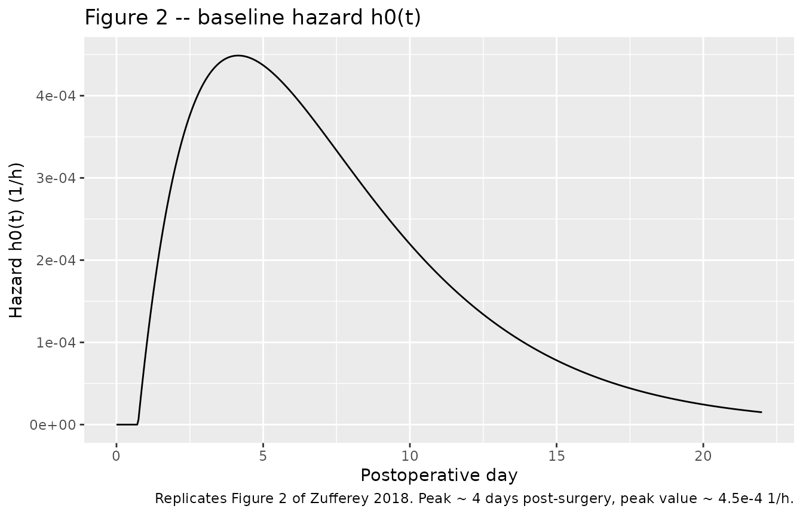
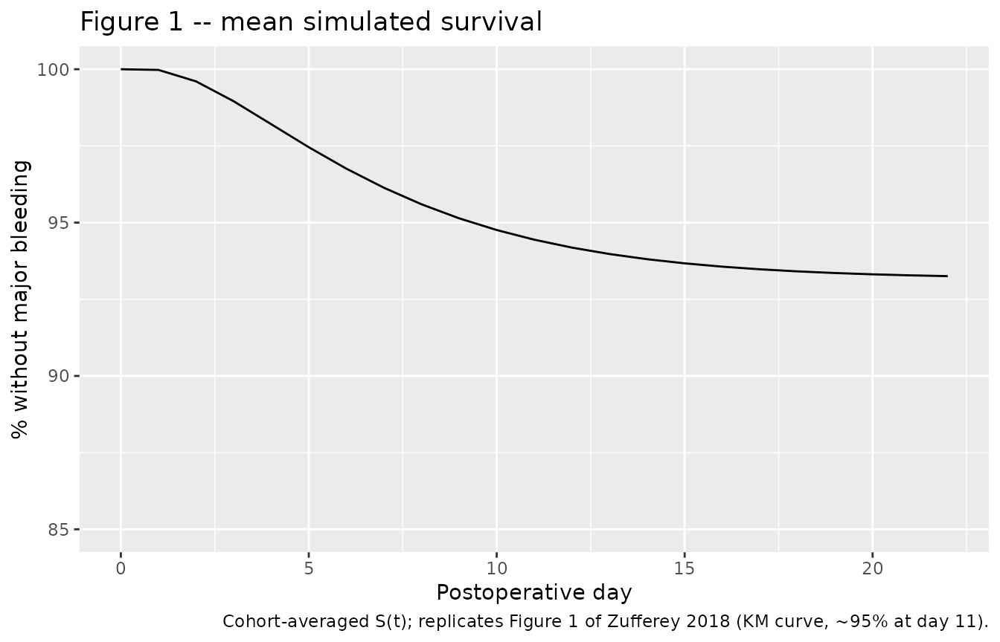
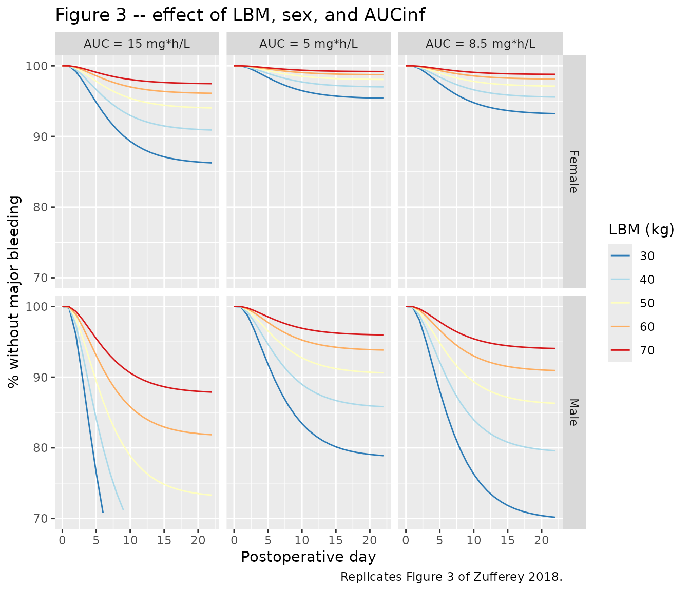

# Fondaparinux (Zufferey 2018)

## Model and source

- Citation: Zufferey PJ, Ollier E, Delavenne X, Laporte S, Mismetti P,
  Duffull SB. Incidence and risk factors of major bleeding following
  major orthopaedic surgery with fondaparinux thromboprophylaxis. A
  time-to-event analysis. Br J Clin Pharmacol. 2018;84(10):2242-2251.
  <doi:10.1111/bcp.13663>.
- Description: Parametric time-to-event model for major bleeding after
  major orthopaedic surgery under fondaparinux thromboprophylaxis
  (POP-A-RIX 2.5 mg once daily and PROPICE 1.5 mg once daily pooled
  cohorts; n = 1393, 64 adjudicated bleeding events). The hazard is
  hz(t) = h0(t) \* exp(beta1*SEX + beta2*AUCinf/8.5 + beta3*LBM/44),
  with gamma-shaped baseline h0(t) =
  theta1*theta2*(t-theta3)*exp(-theta2*(t-theta3)) for t \> theta3 and 0
  otherwise (lag time theta3 ~= 17.6 h, peak ~4 days post-surgery).
  AUCinf is derived inside the model from daily dose and clearance using
  the paper’s PK equation CL = 0.34* (CRCL/60)^0.485 \* exp(eta)
  (lean-body-weight Cockcroft-Gault CrCl).
- Article: <https://doi.org/10.1111/bcp.13663>

This vignette validates the parametric time-to-event (TTE) model
packaged at `inst/modeldb/specificDrugs/Zufferey_2018_fondaparinux.R`.
The model predicts the probability of major bleeding during fondaparinux
thromboprophylaxis after major orthopaedic surgery; clearance is
computed from Cockcroft-Gault creatinine clearance with lean body weight
(CrCl_LBW), AUCinf is derived as daily-dose / CL, and the hazard depends
on sex, AUCinf, and lean body mass.

## Population

The pooled cohort combines two French multicentre prospective open-label
studies in adults undergoing major orthopaedic surgery (hip
arthroplasty, knee arthroplasty, or hip fracture surgery):

- POP-A-RIX (n = 957; ClinicalTrials.gov NCT01063543) – subjects with
  preoperative CrCl \> 30 mL/min, treated with fondaparinux 2.5 mg
  subcutaneously once daily.
- PROPICE (n = 436; NCT00555438) – subjects with moderate renal
  impairment (CrCl 20-50 mL/min by Cockcroft-Gault), treated with
  fondaparinux 1.5 mg SC once daily.

Pooled baseline characteristics (Zufferey 2018 Table 1): n = 1393, mean
age 76 +/- 11 years (range 24-101), mean body weight 68 +/- 16 kg
(35-172), mean lean body weight 44 +/- 10 kg (26-93), mean CrCl_LBW 41
+/- 20 mL/min (10-173), 74% female. Surgical mix: 38% hip arthroplasty,
27% knee arthroplasty, 35% hip fracture. Sixty-four adjudicated major
bleedings were observed (5.2% by day 11; Table 2).

The population metadata is available programmatically:

``` r

m <- readModelDb("Zufferey_2018_fondaparinux")
str(m()$meta$population, max.level = 1)
#> List of 13
#>  $ species       : chr "human"
#>  $ n_subjects    : int 1393
#>  $ n_studies     : int 2
#>  $ age_range     : chr "24-101 years (mean 76)"
#>  $ age_median    : chr "76 years"
#>  $ weight_range  : chr "35-172 kg (mean 68)"
#>  $ weight_median : chr "68 kg"
#>  $ sex_female_pct: num 74
#>  $ race_ethnicity: NULL
#>  $ disease_state : chr "Adults undergoing major orthopaedic surgery (primary or revision hip arthroplasty, primary or revision knee art"| __truncated__
#>  $ dose_range    : chr "1.5 mg or 2.5 mg subcutaneously once daily, first dose at least 6 h postoperatively; recommended thromboprophyl"| __truncated__
#>  $ regions       : chr "France (two multicentre prospective open-label cohorts)"
#>  $ notes         : chr "64 adjudicated major-bleeding events (4.6% of pooled cohort; 5.2% by day 11). LBM mean 44 kg (range 26-93). Coc"| __truncated__
```

## Source trace

The per-parameter origin is captured as in-file comments next to each
`ini()` entry in
`inst/modeldb/specificDrugs/Zufferey_2018_fondaparinux.R`. The table
below collects them in one place.

| Equation / parameter | Value | Source location |
|----|----|----|
| CL = 0.34 \* (CrCl_LBW/60)^0.485 \* exp(b) | n/a | Page 5 (clearance equation, simulation section) |
| `lcl` (log typical CL, L/h) | log(0.34) | Page 5 CL equation: TVCL = 0.34 L/h |
| `e_crcl_cl` (CRCL power exponent) | 0.485 | Page 5 CL equation |
| `etalcl` (CV% = 34 on CL) | 0.10936 | Page 5: “log normal between subject variability of 34 (CV%)” |
| `base_haz1` (theta1, 1/h) | 0.00122 | Table 3, Full hazard model row theta1; bootstrap 95% CI 2e-5 to 2.4e-3 |
| `base_haz2` (theta2, 1/h) | 0.0122 | Table 3, Full hazard model row theta2; bootstrap 95% CI 0.0086-0.0158 |
| `t_lag` (theta3, h) | 17.6 | Table 3, Full hazard model row theta3; bootstrap 95% CI 9.23-25.9 |
| `e_sexf_bleed` (beta1, sex effect) | 1.62 | Table 3, beta1 \* SEX; HR for males = exp(1.62) = 5.05 |
| `e_auc_bleed` (beta2, AUC effect) | 0.975 | Table 3, beta2 \* AUCinf/8.5 |
| `e_lbm_bleed` (beta3, LBM effect) | -1.93 | Table 3, beta3 \* LBW/44; LBM increase reduces hazard |
| Hazard h0(t) gamma form (lag, peak ~day 4) | n/a | Derived by differentiating page 7 Hz(t) closed form; Figure 2 confirms shape |
| AUCinf reference 8.5 mg\*h/L | – | Table 1 pooled-cohort mean AUCinf |
| LBW reference 44 kg | – | Table 1 pooled-cohort mean LBW |

## Virtual cohort

The original POP-A-RIX and PROPICE per-subject data are not publicly
available. We construct two virtual cohorts whose marginal distributions
of CrCl_LBW, LBM, and sex approximate the pooled-cohort baseline
characteristics (Table 1):

``` r

set.seed(20260526)

make_cohort <- function(n, dose_mg, crcl_mean, crcl_sd, crcl_lo, crcl_hi,
                        id_offset = 0L) {
  tibble(
    id    = id_offset + seq_len(n),
    SEXF  = as.integer(runif(n) < 0.74),
    LBM   = pmax(26, pmin(93, round(ifelse(SEXF == 1L,
                                           rnorm(n, mean = 42, sd = 9),
                                           rnorm(n, mean = 55, sd = 10)), 1))),
    CRCL  = pmax(crcl_lo, pmin(crcl_hi,
                               round(rnorm(n, mean = crcl_mean, sd = crcl_sd), 1))),
    DOSE  = dose_mg
  )
}

# POP-A-RIX: CrCl > 30 (LBW-Cockcroft mean 48, range 13-173) on 2.5 mg
poparix  <- make_cohort(n = 600, dose_mg = 2.5,
                        crcl_mean = 48, crcl_sd = 20, crcl_lo = 15, crcl_hi = 173,
                        id_offset = 0L)
# PROPICE: moderate renal impairment (LBW-Cockcroft mean 27, range 10-44) on 1.5 mg
propice  <- make_cohort(n = 400, dose_mg = 1.5,
                        crcl_mean = 27, crcl_sd = 7, crcl_lo = 10, crcl_hi = 44,
                        id_offset = 600L)

cohort_subjects <- bind_rows(
  poparix |> mutate(study = "POP-A-RIX"),
  propice |> mutate(study = "PROPICE")
)

# Observation grid: every 4 h out to day 22
obs_grid <- tibble(time = seq(0, 24 * 22, by = 4), evid = 0L, amt = 0)

events <- crossing(cohort_subjects, obs_grid) |>
  select(id, time, evid, amt, DOSE, CRCL, LBM, SEXF, study)
stopifnot(!anyDuplicated(unique(events[, c("id", "time", "evid")])))
cat("Cohort: ", nrow(cohort_subjects), " subjects, ", nrow(events), " event rows\n",
    sep = "")
#> Cohort: 1000 subjects, 133000 event rows
```

## Simulation

``` r

mod <- readModelDb("Zufferey_2018_fondaparinux")
sim <- rxode2::rxSolve(mod, events = events,
                       keep = c("DOSE", "CRCL", "LBM", "SEXF", "study")) |>
  as.data.frame()
#> ℹ parameter labels from comments will be replaced by 'label()'
```

A typical-value (no-IIV) trajectory for population-level interpretation:

``` r

mod_typ <- mod |> rxode2::zeroRe()
#> ℹ parameter labels from comments will be replaced by 'label()'
#> Warning: No sigma parameters in the model
typical <- tibble(
  id   = 1L:4L,
  SEXF = c(1L, 1L, 0L, 0L),
  LBM  = c(42, 42, 55, 55),
  CRCL = c(48, 27, 48, 27),
  DOSE = c(2.5, 1.5, 2.5, 1.5),
  label = c("Female / CrCl 48 / 2.5 mg",
            "Female / CrCl 27 / 1.5 mg",
            "Male / CrCl 48 / 2.5 mg",
            "Male / CrCl 27 / 1.5 mg")
)
ev_typ <- crossing(typical, obs_grid) |>
  select(id, time, evid, amt, DOSE, CRCL, LBM, SEXF, label)
sim_typ <- rxode2::rxSolve(mod_typ, events = ev_typ, keep = c("label")) |>
  as.data.frame()
#> ℹ omega/sigma items treated as zero: 'etalcl'
```

## Replicate Figure 2 – baseline hazard h0(t)

Figure 2 of Zufferey 2018 plots the parametric baseline hazard h0(t)
against postoperative day. We reproduce the typical-value curve using
the FULL hazard model parameters (Table 3 full-model row) with all
covariate effects set to zero (sex = female and AUCinf and LBM at their
reference values 8.5 mg\*h/L and 44 kg, so phi = 0 and h0 is what is
plotted).

``` r

t_hours <- seq(0, 24 * 22, by = 1)
theta1 <- 0.00122
theta2 <- 0.0122
t_lag  <- 17.6
u <- pmax(0, t_hours - t_lag)
h0 <- theta1 * theta2 * u * exp(-theta2 * u)

tibble(time_days = t_hours / 24, h0 = h0) |>
  ggplot(aes(time_days, h0)) +
  geom_line() +
  scale_y_continuous(labels = function(x) format(x, scientific = TRUE)) +
  labs(x = "Postoperative day", y = "Hazard h0(t) (1/h)",
       title = "Figure 2 -- baseline hazard h0(t)",
       caption = "Replicates Figure 2 of Zufferey 2018. Peak ~ 4 days post-surgery, peak value ~ 4.5e-4 1/h.")
```



## Replicate Figure 1 – Kaplan-Meier of % without major bleeding

Figure 1 shows the percentage of patients without major bleeding versus
postoperative day. We construct simulated Kaplan-Meier curves from the
typical-value survival trajectory of the virtual pooled cohort.

``` r

sim |>
  filter(time %% 24 == 0) |>
  group_by(time) |>
  summarise(S_mean = mean(sur), .groups = "drop") |>
  mutate(time_days = time / 24) |>
  ggplot(aes(time_days, 100 * S_mean)) +
  geom_line() +
  scale_y_continuous(limits = c(85, 100)) +
  labs(x = "Postoperative day", y = "% without major bleeding",
       title = "Figure 1 -- mean simulated survival",
       caption = "Cohort-averaged S(t); replicates Figure 1 of Zufferey 2018 (KM curve, ~95% at day 11).")
```



## Replicate Figure 3 – LBM, sex, and AUCinf effect panels

Figure 3 of Zufferey 2018 shows, for each combination of sex (rows) and
AUCinf level (columns), the probability of avoiding major bleeding for
LBM = 30, 40, 50, 60, 70 kg.

``` r

auc_levels <- c(5, 8.5, 15)
lbm_levels <- c(30, 40, 50, 60, 70)
sex_levels <- c(0L, 1L)

grid_subjects <- expand.grid(
  AUC = auc_levels,
  LBM = lbm_levels,
  SEXF = sex_levels
) |>
  mutate(id   = row_number(),
         DOSE = 1.0,
         # Force AUCinf = AUC by setting CRCL so that CL = DOSE / AUC = 1 / AUC
         # CL = 0.34 * (CRCL/60)^0.485 => CRCL = 60 * (CL/0.34)^(1/0.485)
         CL_target = 1 / AUC,
         CRCL = 60 * (CL_target / 0.34)^(1 / 0.485))
ev_grid <- crossing(grid_subjects, obs_grid) |>
  select(id, time, evid, amt, DOSE, CRCL, LBM, SEXF, AUC) |>
  as.data.frame()
sim_grid <- rxode2::rxSolve(mod_typ, events = ev_grid,
                            keep = c("DOSE", "CRCL", "LBM", "SEXF", "AUC")) |>
  as.data.frame() |>
  mutate(sex_lab = ifelse(SEXF == 1L, "Female", "Male"),
         auc_lab = paste0("AUC = ", AUC, " mg*h/L"),
         lbm_lab = factor(LBM, levels = lbm_levels))
#> ℹ omega/sigma items treated as zero: 'etalcl'

sim_grid |>
  filter(time %% 24 == 0) |>
  mutate(time_days = time / 24) |>
  ggplot(aes(time_days, 100 * sur, colour = lbm_lab, group = lbm_lab)) +
  geom_line() +
  facet_grid(sex_lab ~ auc_lab) +
  scale_y_continuous(limits = c(70, 100)) +
  scale_colour_brewer(palette = "RdYlBu", direction = -1, name = "LBM (kg)") +
  labs(x = "Postoperative day", y = "% without major bleeding",
       title = "Figure 3 -- effect of LBM, sex, and AUCinf",
       caption = "Replicates Figure 3 of Zufferey 2018.")
#> Warning: Removed 29 rows containing missing values or values outside the scale range
#> (`geom_line()`).
```



## Replicate Table 4 – probability of bleeding at day 11 by dose, sex, and renal function

Table 4 reports the simulated probability of major bleeding at day 11
for the 1.5 mg and 2.5 mg fondaparinux regimens, stratified by sex and
renal function (CrCl_Wt; defined with total body weight). The paper
draws bootstrap subjects from the actual cohort distribution; we
approximate this using the virtual cohort built above, separating by
CrCl_LBW \<= 30 vs \> 30 mL/min as a proxy for the paper’s CrCl_Wt
strata (the proxy is approximate because CrCl_Wt and CrCl_LBW differ by
the LBW/Wt ratio, which is sex-dependent).

``` r

day11_h <- 24 * 11
day11 <- sim |>
  filter(time == day11_h) |>
  mutate(
    sex_lab  = ifelse(SEXF == 1L, "Women", "Men"),
    dose_lab = paste0("Fondaparinux ", DOSE, " mg")
  )

# Overall (matching the unstratified rows of Table 4)
overall <- day11 |>
  group_by(dose_lab) |>
  summarise(p_bleed_pct = 100 * (1 - mean(sur)), .groups = "drop")
knitr::kable(overall, digits = 1,
             caption = "Simulated probability (%) of major bleeding at day 11, overall by dose.")
```

| dose_lab            | p_bleed_pct |
|:--------------------|------------:|
| Fondaparinux 1.5 mg |         4.7 |
| Fondaparinux 2.5 mg |         6.1 |

Simulated probability (%) of major bleeding at day 11, overall by dose.
{.table}

``` r


# By sex and dose (matches the women / men rows of Table 4)
sex_dose <- day11 |>
  group_by(sex_lab, dose_lab) |>
  summarise(p_bleed_pct = 100 * (1 - mean(sur)), n = n(), .groups = "drop")
knitr::kable(sex_dose, digits = 1,
             caption = "Simulated probability (%) of major bleeding at day 11 by sex and dose.")
```

| sex_lab | dose_lab            | p_bleed_pct |   n |
|:--------|:--------------------|------------:|----:|
| Men     | Fondaparinux 1.5 mg |         9.3 | 102 |
| Men     | Fondaparinux 2.5 mg |        11.5 | 150 |
| Women   | Fondaparinux 1.5 mg |         3.1 | 298 |
| Women   | Fondaparinux 2.5 mg |         4.4 | 450 |

Simulated probability (%) of major bleeding at day 11 by sex and dose.
{.table}

The paper’s Table 4 (CrCl_Wt strata) for context:

| Subgroup       | CrCl_Wt 20-50 mL/min | CrCl_Wt \> 50 mL/min |
|----------------|----------------------|----------------------|
| Pooled, 2.5 mg | 6.5% (6.2-6.9)       | 4.2% (4.0-4.4)       |
| Pooled, 1.5 mg | 3.8% (3.7-4.0)       | 2.8% (2.7-3.0)       |
| Women, 2.5 mg  | 5.9% (5.5-6.1)       | 3.4% (3.2-3.5)       |
| Women, 1.5 mg  | 3.5% (3.4-3.7)       | 2.3% (2.2-2.4)       |
| Men, 2.5 mg    | 11.6% (10.3-12.7)    | 6.8% (6.4-7.3)       |
| Men, 1.5 mg    | 7.4% (6.8-8.0)       | 5.0% (4.7-5.3)       |

## Compare AUCinf summary against Table 1

Table 1 reports a pooled-cohort mean AUCinf of 8.5 +/- 3.4 mg\*h/L
(range 2.7-27). We compute simulated AUCinf at the same per-subject
level and compare.

``` r

auc_summary <- events |>
  distinct(id, DOSE, CRCL, LBM, SEXF, study) |>
  mutate(cl_typical = 0.34 * (CRCL / 60)^0.485,
         auc_inf    = DOSE / cl_typical) |>
  group_by(study) |>
  summarise(n = n(),
            mean_auc = mean(auc_inf),
            sd_auc   = sd(auc_inf),
            min_auc  = min(auc_inf),
            max_auc  = max(auc_inf),
            .groups  = "drop")
knitr::kable(auc_summary, digits = 2,
             caption = "Simulated AUCinf summary by virtual study cohort (typical-value clearance, no IIV).")
```

| study     |   n | mean_auc | sd_auc | min_auc | max_auc |
|:----------|----:|---------:|-------:|--------:|--------:|
| POP-A-RIX | 600 |     8.86 |   2.16 |    5.39 |   14.40 |
| PROPICE   | 400 |     6.73 |   1.05 |    5.13 |   10.52 |

Simulated AUCinf summary by virtual study cohort (typical-value
clearance, no IIV). {.table}

Reported values for context (Table 1): POP-A-RIX 9.3 +/- 3.4, PROPICE
6.4 +/- 1.9, pooled 8.5 +/- 3.4 mg\*h/L.

## Assumptions and deviations

- **Drug encoded as the post-surgery TTE model only.** This package
  extracts the parametric survival model published in the main text. The
  pharmacokinetic sub-equation
  `CL = 0.34 * (CrCl_LBW/60)^0.485 * exp(eta)` is embedded so that
  AUCinf can be derived inside the model from the user-supplied daily
  dose and CrCl_LBW, exactly as in the paper’s simulation procedure
  (page 5). The fuller PK structural model that produced this clearance
  term is described in the paper’s online Supporting Information (Table
  S1), which was not on disk at extraction time; users who need
  concentration-time profiles (rather than just AUCinf-driven hazard)
  should consult the upstream popPK references (Delavenne 2010 and
  Delavenne 2012, cited as references 7 and 8 of Zufferey 2018).
- **Baseline hazard functional form derived from the closed-form
  Hz(t).** The typeset h0(t) on page 6 reads “h0(t) = theta1 \* theta2
  \* t \* exp(-theta2 \* (t - theta3))“, but the published closed-form
  cumulative hazard `Hz(theta3) = 0` (page 7) implies h0 must equal 0 on
  `[0, theta3]`. The only form of h0 that integrates to the published Hz
  is the gamma-density form
  `h0(t) = theta1 * theta2 * (t - theta3) * exp(-theta2 * (t - theta3))`
  for `t > theta3` and 0 otherwise. This shape also matches Figure 2
  (peak ~ 4 days post-surgery; peak hazard ~ 3.5e-4 1/h ~ theta1 / e).
  The model file uses this derived form.
- **Sex encoding inverted.** The source paper uses `SEX = 1` for male,
  `SEX = 0` for female (Table 3 footnote a). The canonical nlmixr2lib
  covariate is `SEXF` (1 = female, 0 = male; see
  `inst/references/covariate-columns.md`). The hazard log-coefficient
  `e_sexf_bleed = +1.62` is applied as \`e_sexf_bleed
  - (1 - SEXF)`inside`model()\` so the paper’s published positive value
    and male-reference interpretation are preserved.
- **CrCl_LBW vs CrCl_Wt.** The model’s CRCL column carries
  Cockcroft-Gault creatinine clearance computed with **lean body
  weight** as the body-size descriptor (the form used in the PK
  clearance equation). Table 4 of the source paper, by contrast, reports
  bleeding-probability strata in terms of CrCl_Wt (total body weight);
  the two scales differ by the LBW/Wt ratio (sex-dependent). The
  vignette’s stratified bleeding-probability table is therefore an
  approximation rather than a one-to-one replication of Table 4.
- **PK IIV applied; hazard parameters have no IIV.** The clearance term
  carries the published CV% = 34 inter-individual variability as
  `omega^2 = log(1 + 0.34^2) = 0.10936`. The hazard parameters
  (`theta1`, `theta2`, `theta3`, `beta1`, `beta2`, `beta3`) carry no
  random effects – Table 3 reports only point estimates and bootstrap
  95% CIs, consistent with a typical-value hazard.
- **Virtual cohort.** Sex-conditional LBM and study-conditional CrCl
  distributions are approximated from the Table 1 summary statistics;
  the per-subject joint distribution from the actual POP-A-RIX / PROPICE
  cohorts is not publicly available. Bleeding-probability summaries from
  the virtual cohort therefore differ from the paper’s bootstrap-based
  Table 4 values by the discrepancy between the approximated marginals
  and the true joint distribution.
- **NCA validation not applicable.** The source paper reports survival /
  hazard outputs rather than drug-concentration NCA values; PKNCA is
  omitted. AUCinf is validated against Table 1 summary statistics
  instead.
