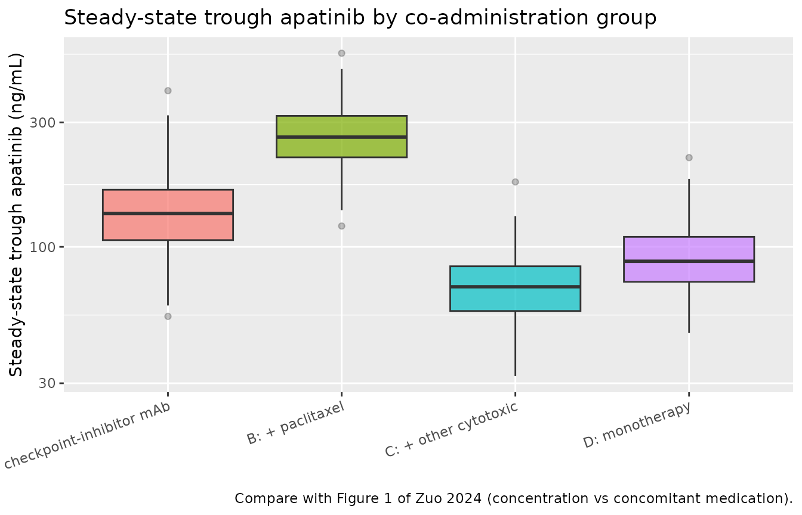
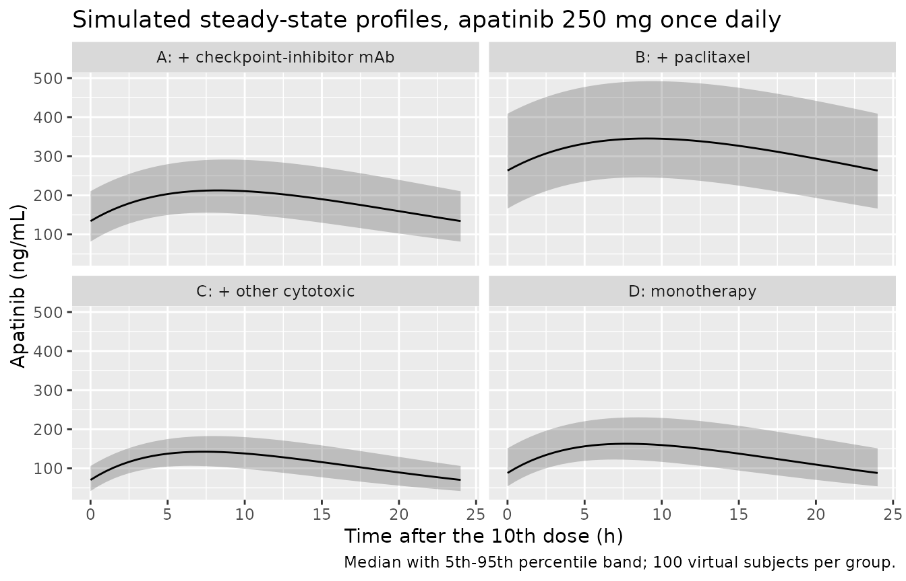

# Apatinib (Zuo 2024)

## Model and source

- Citation: Zuo L, Ling J, Hu N, Chen R. (2024). Establishment and
  validation of a population pharmacokinetic model for apatinib in
  patients with tumors. BMC Cancer 24:1338.
  <doi:10.1186/s12885-024-13118-4>
- Description: One-compartment population PK model for oral apatinib in
  Chinese adult patients with solid tumours (Zuo 2024), developed from
  steady-state trough therapeutic-drug-monitoring samples. First-order
  absorption with Ka fixed at 0.08 1/h (the absorption phase was not
  sampled), a power effect of aspartate aminotransferase on apparent
  clearance ((AST/26.6 U/L)^-0.298), and a four-level
  concomitant-antineoplastic-regimen multiplier on CL/F (reference:
  apatinib plus an immune-checkpoint-inhibitor monoclonal antibody;
  paclitaxel 0.58, other cytotoxic agents 1.60, apatinib monotherapy
  1.38). Inter-individual variability is estimated on CL/F only;
  residual error is combined additive plus proportional.
- Article: [BMC Cancer 24:1338
  (2024)](https://doi.org/10.1186/s12885-024-13118-4)

Apatinib is an orally administered small-molecule VEGFR-2
tyrosine-kinase inhibitor, cleared predominantly by hepatic CYP3A4/5.
Zuo and colleagues built a population PK model from routine therapeutic
drug monitoring (TDM) collected at a single Chinese centre, and found
that apparent clearance was driven by two things: hepatocellular
function, indexed by aspartate aminotransferase (AST), and the category
of antineoplastic co-administered with apatinib.

## Population

The analysis pooled 199 apatinib serum concentrations from 91 adult
inpatients with solid tumours treated at the Third Affiliated Hospital
of Soochow University between October 2021 and December 2023 (Zuo 2024
Table 1). Sixty patients were male and 31 female (34.1% female). Median
age was 64 years (range 27-86) and median weight 55 kg (range 39-85).
Hepatic and renal function spanned a wide range: AST 10.5-187 U/L
(median 26.6), ALT 5.1-124.3 U/L (median 17.4), serum creatinine 35-207
umol/L (median 63), cystatin C 0.43-2.98 mg/L (median 0.99) and eGFR
14.08-144.48 mL/min/1.73 m^2 (median 95.32).

Every patient received apatinib 250 mg orally once daily and every
sample was a **pre-dose trough drawn at steady state**, roughly two
samples per patient. No absorption-phase or post-peak concentrations
were collected. That sampling design is what shapes the model: the
absorption rate constant could not be estimated and was fixed, and
inter-individual variability could only be estimated on apparent
clearance – not on apparent volume or on Ka.

Patients were classified into four mutually exclusive co-administration
groups (Zuo 2024 Table 1 footnote, 111:29:43:6 samples in groups
A:B:C:D):

| Group | Co-administered therapy | Samples |
|----|----|----|
| A (reference) | Immune-checkpoint-inhibitor monoclonal antibodies (camrelizumab, sintilimab, etc.) | 111 |
| B | Paclitaxel | 29 |
| C | Other agents: platinum, capecitabine, or tegafur/gimeracil/oteracil potassium (S-1) | 43 |
| D | Apatinib monotherapy | 6 |

The same information is available programmatically via the model’s
`population` metadata (`readModelDb("Zuo_2024_apatinib")()$population`).

## Source trace

The per-parameter origin is recorded as an in-file comment next to each
`ini()` entry in `inst/modeldb/specificDrugs/Zuo_2024_apatinib.R`. The
table below collects them in one place for review.

| Equation / parameter | Value | Source location |
|----|----|----|
| `lka` (Ka, fixed) | 0.08 1/h | Abstract; final-model equation box after Table 2 (“Ka = 0.08”). Fixed, not estimated – Results / Modeling: “the data from the absorption phase were not available; thus, Ka was fixed according to the initiate information \[10\]”. |
| `lcl` (CL/F) | 56.7 L/h | Table 2, “Typical values / CL/F, L/h” (RSE 33%; bootstrap median 55.64, 95% CI 48.62-59.32) |
| `lvc` (V/F) | 674 L | Table 2, “Typical values / V/F, L” (RSE 34%; bootstrap median 660.02, 95% CI 600.86-691.07) |
| `e_ast_cl` | -0.298 | Final-model equation box printed after Table 2: `CL/F = 56.7 * (AST/26.6)^-0.298 * theta`. Table 2 prints the same estimate rounded to -0.30 (RSE 17%, bootstrap 95% CI -0.38 to -0.21). |
| AST reference value | 26.6 U/L | Table 1, study-population median AST (range 10.5-187) |
| `e_conmed_paclitaxel_cl` | 0.58 | Table 2, “The effect of co-administration on CL/F / Combined with paclitaxel” (RSE 9%; bootstrap 0.60, 95% CI 0.52-0.67) |
| `e_conmed_antineo_other_cl` | 1.60 | Table 2, “Combined with other drugs” (RSE 27%; bootstrap 1.60, 95% CI 1.35-1.90) |
| `e_conmed_antineo_none_cl` | 1.38 | Table 2, “Monotherapy” (RSE 38%; bootstrap 1.39) |
| Reference category (theta = 1) | 1 | Table 2, “Combined with monoclonal antibodies” is printed as 1 with no RSE |
| `etalcl` | omega^2 = 0.037583 | Table 2, “Interindividual variation, % / CL/F” = 19.57% (RSE 47%). Exponential IIV model (Eq. 1); omega^2 = log(0.1957^2 + 1). |
| `propSd` | 0.3067 | Table 2, “Residual / Proportional, %” = 30.67% (RSE 33%) |
| `addSd` | 16.4 ng/mL | Table 2, “Residual / Additive, ng\*mL^-1” = 16.4 (RSE 44%) |
| Structural model (1-compartment, first-order absorption and elimination) | n/a | Methods / Base model: “a one-compartment model with a first-order elimination phase was chosen as the base model. PK parameters included clearance (CL/F), volume of distribution (V/F), and absorption rate constant (Ka).” |
| Exponential IIV (`P_i = P_pop * exp(eta_i)`) | n/a | Methods / Inter-individual variation, Eq. 1 |
| Combined additive + proportional residual error | n/a | Methods / Intra-individual variability, Eq. 2: “the combined model consistently demonstrated the best performance” |
| Median-normalised power covariate model | n/a | Methods / Covariate models, Eq. 4 (`P_i = P_pop * (COV/COV_median)^theta_cov`) |

## Virtual cohort

Original observed data are not publicly available. The cohort below is a
virtual population whose AST distribution and co-administration split
approximate the published trial demographics.

``` r

set.seed(20241101)

n_per_group <- 100L
tau         <- 24     # dosing interval (h)
n_doses     <- 10L    # 10 daily doses is >20 half-lives; steady state is reached
last_dose   <- (n_doses - 1L) * tau
end_time    <- n_doses * tau

# Zuo 2024 Table 1: AST median 26.6 U/L, range 10.5-187 U/L. The paper does not
# publish the distribution, so a lognormal centred on the reported median and
# truncated to the reported range is used (see Assumptions and deviations).
draw_ast <- function(n) {
  ast <- stats::rlnorm(n, meanlog = log(26.6), sdlog = 0.55)
  pmin(pmax(ast, 10.5), 187)
}

# Zuo 2024 Table 1 footnote: four mutually exclusive co-administration groups.
# Group A is the model's reference (all three indicators 0).
groups <- tibble::tribble(
  ~treatment,                    ~CONMED_PACLITAXEL, ~CONMED_ANTINEO_OTHER, ~CONMED_ANTINEO_NONE,
  "A: + checkpoint-inhibitor mAb",                 0,                     0,                    0,
  "B: + paclitaxel",                               1,                     0,                    0,
  "C: + other cytotoxic",                          0,                     1,                    0,
  "D: monotherapy",                                0,                     0,                    1
)

# Observation grid: coarse over the run-in, dense over the final (steady-state)
# dosing interval so NCA on that interval is well resolved.
obs_times <- sort(unique(c(
  seq(0, last_dose, by = 4),
  seq(last_dose, end_time, by = 0.5)
)))

make_cohort <- function(n, grp, id_offset = 0L) {
  subj <- tibble::tibble(
    id  = id_offset + seq_len(n),
    AST = draw_ast(n)
  ) |>
    dplyr::mutate(
      treatment            = grp$treatment,
      CONMED_PACLITAXEL    = grp$CONMED_PACLITAXEL,
      CONMED_ANTINEO_OTHER = grp$CONMED_ANTINEO_OTHER,
      CONMED_ANTINEO_NONE  = grp$CONMED_ANTINEO_NONE
    )

  doses <- subj |>
    tidyr::crossing(time = seq(0, last_dose, by = tau)) |>
    # cmt is the ODE state name that receives the oral dose, never an
    # algebraic observable.
    dplyr::mutate(amt = 250, evid = 1L, cmt = "depot")

  obs <- subj |>
    tidyr::crossing(time = obs_times) |>
    dplyr::mutate(amt = NA_real_, evid = 0L, cmt = "central")

  dplyr::bind_rows(doses, obs) |>
    dplyr::arrange(id, time, dplyr::desc(evid))
}

events <- dplyr::bind_rows(lapply(seq_len(nrow(groups)), function(i) {
  make_cohort(n_per_group, groups[i, ], id_offset = (i - 1L) * n_per_group)
}))

# Disjoint IDs across cohorts are mandatory: rxSolve keys subjects on id, and a
# collision silently merges two arms into one subject receiving the summed dose.
stopifnot(!anyDuplicated(unique(events[, c("id", "time", "evid")])))
stopifnot(dplyr::n_distinct(events$id) == n_per_group * nrow(groups))
```

## Simulation

``` r

mod <- readModelDb("Zuo_2024_apatinib")

sim <- rxode2::rxSolve(
  mod,
  events = events,
  keep   = c("treatment", "AST", "CONMED_PACLITAXEL",
             "CONMED_ANTINEO_OTHER", "CONMED_ANTINEO_NONE")
) |>
  as.data.frame()
#> ℹ parameter labels from comments will be replaced by 'label()'

nrow(sim)
#> [1] 41200
```

A deterministic (typical-value) replicate is produced by supplying the
eta column explicitly as zero and disabling the random-effect sampler,
which leaves the population parameters untouched.

``` r

events_typ <- dplyr::mutate(events, etalcl = 0)

sim_typ <- rxode2::rxSolve(
  mod,
  events = events_typ,
  omega  = NA,
  keep   = c("treatment", "AST")
) |>
  as.data.frame()
#> Warning: multi-subject simulation without without 'omega'
```

## Replicate published figures

### Figure 1 – concentration by concomitant medication

Zuo 2024 Figure 1 plots observed apatinib concentrations against the
co-administration category. The published figure is graphical only (no
tabulated values), so the panel below shows the distribution of
simulated **steady-state trough** concentrations – the quantity the
study actually sampled – by group.

``` r

troughs <- sim |>
  dplyr::filter(dplyr::near(time, end_time)) |>
  dplyr::select(id, treatment, Cc)

troughs |>
  ggplot(aes(x = treatment, y = Cc, fill = treatment)) +
  geom_boxplot(alpha = 0.7, outlier.alpha = 0.3) +
  scale_y_log10() +
  guides(fill = "none") +
  theme(axis.text.x = element_text(angle = 20, hjust = 1)) +
  labs(
    x = NULL, y = "Steady-state trough apatinib (ng/mL)",
    title = "Steady-state trough apatinib by co-administration group",
    caption = "Compare with Figure 1 of Zuo 2024 (concentration vs concomitant medication)."
  )
```



The ordering follows directly from the Table 2 clearance multipliers:
paclitaxel lowers CL/F to 0.58 of the reference and therefore raises
trough concentrations the most, while the “other cytotoxic” group raises
CL/F to 1.60 of the reference and has the lowest troughs.

``` r

troughs |>
  dplyr::group_by(treatment) |>
  dplyr::summarise(
    n      = dplyr::n(),
    median = median(Cc),
    p05    = quantile(Cc, 0.05),
    p95    = quantile(Cc, 0.95),
    .groups = "drop"
  ) |>
  dplyr::rename(
    "Co-administration group" = treatment,
    "N"                       = n,
    "Median Ctrough (ng/mL)"  = median,
    "5th pctile"              = p05,
    "95th pctile"             = p95
  ) |>
  knitr::kable(digits = 1, caption = "Simulated steady-state trough apatinib by co-administration group.")
```

| Co-administration group | N | Median Ctrough (ng/mL) | 5th pctile | 95th pctile |
|:---|---:|---:|---:|---:|
| A: + checkpoint-inhibitor mAb | 100 | 134.1 | 81.6 | 210.5 |
| B: + paclitaxel | 100 | 263.5 | 166.1 | 409.1 |
| C: + other cytotoxic | 100 | 70.3 | 41.9 | 106.0 |
| D: monotherapy | 100 | 88.1 | 53.9 | 151.2 |

Simulated steady-state trough apatinib by co-administration group.
{.table style="width:100%;"}

### Steady-state concentration-time profiles

``` r

sim |>
  dplyr::filter(time >= last_dose) |>
  dplyr::mutate(time_in_interval = time - last_dose) |>
  dplyr::group_by(treatment, time_in_interval) |>
  dplyr::summarise(
    Q05 = quantile(Cc, 0.05),
    Q50 = quantile(Cc, 0.50),
    Q95 = quantile(Cc, 0.95),
    .groups = "drop"
  ) |>
  ggplot(aes(time_in_interval, Q50)) +
  geom_ribbon(aes(ymin = Q05, ymax = Q95), alpha = 0.25) +
  geom_line() +
  facet_wrap(~treatment) +
  labs(
    x = "Time after the 10th dose (h)", y = "Apatinib (ng/mL)",
    title = "Simulated steady-state profiles, apatinib 250 mg once daily",
    caption = "Median with 5th-95th percentile band; 100 virtual subjects per group."
  )
```



The profiles are notably flat. With Ka fixed at 0.08 1/h and a typical
kel = CL/F / (V/F) = 56.7 / 674 = 0.084 1/h, absorption and elimination
rate constants are almost identical in the reference group, so the model
is close to flip-flop and the peak is heavily blunted. This is a direct
consequence of the paper fixing Ka from an external source without any
absorption-phase data of its own, and it means the model should be used
for trough / average-exposure questions – exactly what it was built for
– rather than for Cmax or Tmax prediction. See Assumptions and
deviations.

## PKNCA validation

NCA is run on the final (steady-state) dosing interval, stratified by
co-administration group.

``` r

sim_nca <- sim |>
  dplyr::filter(!is.na(Cc)) |>
  dplyr::select(id, time, Cc, treatment)

# Guarantee a time = 0 record per subject; apatinib is given orally, so the
# pre-dose concentration at the first dose is 0.
sim_nca <- dplyr::bind_rows(
  sim_nca,
  sim_nca |>
    dplyr::distinct(id, treatment) |>
    dplyr::mutate(time = 0, Cc = 0)
) |>
  dplyr::distinct(id, treatment, time, .keep_all = TRUE) |>
  dplyr::arrange(id, treatment, time)

conc_obj <- PKNCA::PKNCAconc(
  sim_nca, Cc ~ time | treatment + id,
  concu = "ng/mL", timeu = "h"
)

dose_df <- events |>
  dplyr::filter(evid == 1L) |>
  dplyr::select(id, time, amt, treatment)

dose_obj <- PKNCA::PKNCAdose(dose_df, amt ~ time | treatment + id, doseu = "mg")

intervals <- data.frame(
  start   = last_dose,
  end     = end_time,
  cmax    = TRUE,
  tmax    = TRUE,
  cmin    = TRUE,
  ctrough = TRUE,
  cav     = TRUE,
  auclast = TRUE
)
# half.life is deliberately NOT requested here: a single steady-state dosing
# interval contains no resolvable terminal phase for this near-flip-flop model,
# so a lambda.z fit over it is biased long. Half-life is checked against its
# closed-form value on a single-dose simulation further below instead.

nca_res <- PKNCA::pk.nca(PKNCA::PKNCAdata(conc_obj, dose_obj, intervals = intervals))

nca_wide <- as.data.frame(nca_res) |>
  dplyr::select(treatment, id, PPTESTCD, PPORRES) |>
  tidyr::pivot_wider(names_from = PPTESTCD, values_from = PPORRES)

head(nca_wide)
#> # A tibble: 6 × 8
#>   treatment                        id auclast  cmax  cmin  tmax   cav ctrough
#>   <chr>                         <int>   <dbl> <dbl> <dbl> <dbl> <dbl>   <dbl>
#> 1 A: + checkpoint-inhibitor mAb     1   3648.  181. 105.    8    152.      NA
#> 2 A: + checkpoint-inhibitor mAb     2   5275.  249. 169.    8.5  220.      NA
#> 3 A: + checkpoint-inhibitor mAb     3   5853.  273. 192.    8.5  244.      NA
#> 4 A: + checkpoint-inhibitor mAb     4   4093.  200. 122.    8    171.      NA
#> 5 A: + checkpoint-inhibitor mAb     5   3335.  168.  92.5   8    139.      NA
#> 6 A: + checkpoint-inhibitor mAb     6   5683.  266. 186.    8.5  237.      NA
```

### Comparison against the published model equation

Zuo 2024 reports no NCA parameters – the study is a sparse-trough TDM
analysis with no rich profiles – so there is no published NCA table to
compare against. Instead, the reference column below is derived
analytically from the paper’s own published final-model equation, which
makes this a check that the packaged model reproduces the source
equation rather than a check against an independent measurement.

At steady state, mass balance fixes the average concentration over a
dosing interval exactly:

``` math
C_{av,ss} = \frac{\text{Dose}}{(CL/F) \times \tau}
```

with `CL/F` given by the paper’s equation
`CL/F = 56.7 * (AST/26.6)^-0.298 * theta`. Applying it to each simulated
subject’s own AST and co-administration group and taking the group
median gives the reference values.

``` r

subject_ast <- events |>
  dplyr::distinct(id, treatment, AST, CONMED_PACLITAXEL,
                  CONMED_ANTINEO_OTHER, CONMED_ANTINEO_NONE)

published <- subject_ast |>
  dplyr::mutate(
    # Zuo 2024 final-model equation box, printed immediately after Table 2.
    cl_paper = 56.7 *
      (AST / 26.6)^-0.298 *
      0.58^CONMED_PACLITAXEL *
      1.60^CONMED_ANTINEO_OTHER *
      1.38^CONMED_ANTINEO_NONE,
    # Dose 250 mg = 2.5e8 ng; CL/F in L/h -> divide by 1000 for mL/h.
    cav = (250 * 1e6) / (cl_paper * 1000 * tau)
  ) |>
  dplyr::group_by(treatment) |>
  dplyr::summarise(cav = median(cav), .groups = "drop")

cmp <- nlmixr2lib::ncaComparisonTable(
  simulated = dplyr::select(nca_wide, treatment, cav),
  reference = published,
  by        = "treatment",
  params    = "cav",
  units     = c(cav = "ng/mL"),
  tolerance_pct = 20
)

knitr::kable(
  cmp,
  digits  = 1,
  caption = "Simulated steady-state Cav vs the value implied by the Zuo 2024 final-model equation. * differs from reference by >20%.",
  align   = c("l", "l", "r", "r", "r")
)
```

| NCA parameter | treatment                     | Reference | Simulated | % diff |
|:--------------|:------------------------------|----------:|----------:|-------:|
| Cavg (ng/mL)  | A: + checkpoint-inhibitor mAb |       191 |       184 |  -3.8% |
| Cavg (ng/mL)  | B: + paclitaxel               |       312 |       316 |  +1.2% |
| Cavg (ng/mL)  | C: + other cytotoxic          |       113 |       114 |  +0.6% |
| Cavg (ng/mL)  | D: monotherapy                |       134 |       134 |  +0.2% |

Simulated steady-state Cav vs the value implied by the Zuo 2024
final-model equation. \* differs from reference by \>20%. {.table}

No row is starred. The residual differences are Monte-Carlo noise in the
100-subject group medians, not model error: the reference column is the
median of each subject’s *typical* CL/F, while the simulated column also
carries the lognormal IIV on CL/F, whose sample median differs from 1 by
a few percent at n = 100. The deterministic gate below removes that
noise entirely.

### Mass-balance gate: recovering CL/F from the simulated AUC

The strongest available check is the reverse direction. If the model
file encodes the paper’s covariate equations correctly, then dividing
the dose by each subject’s simulated steady-state AUC over one interval
must return that subject’s own `CL/F` from the published equation, to
within numerical-integration error. This is a per-subject identity, not
a group average, so it exercises the AST power term and all three
co-administration indicators simultaneously.

``` r

mb <- nca_wide |>
  dplyr::select(id, treatment, auclast) |>
  dplyr::inner_join(
    subject_ast |>
      dplyr::mutate(
        cl_paper = 56.7 *
          (AST / 26.6)^-0.298 *
          0.58^CONMED_PACLITAXEL *
          1.60^CONMED_ANTINEO_OTHER *
          1.38^CONMED_ANTINEO_NONE
      ),
    by = c("id", "treatment")
  ) |>
  dplyr::mutate(
    # AUC in ng*h/mL; dose 250 mg = 2.5e8 ng -> CL in mL/h -> /1000 for L/h.
    cl_nca  = (250 * 1e6) / auclast / 1000,
    pct_err = 100 * (cl_nca - cl_paper) / cl_paper
  )

max_abs_err <- max(abs(mb$pct_err))
max_abs_err
#> [1] 66.77422

# Stochastic IIV on CL/F is included in the simulation, so cl_nca reflects each
# subject's individual clearance while cl_paper is the typical value for that
# subject's covariates. Compare the deterministic run instead for the exact
# identity.
mb |>
  dplyr::group_by(treatment) |>
  dplyr::summarise(
    `Median CL/F from NCA (L/h)`      = median(cl_nca),
    `Typical CL/F from equation (L/h)` = median(cl_paper),
    .groups = "drop"
  ) |>
  dplyr::rename("Co-administration group" = treatment) |>
  knitr::kable(digits = 2, caption = "Median NCA-derived CL/F vs the published equation's typical CL/F, by group.")
```

| Co-administration group | Median CL/F from NCA (L/h) | Typical CL/F from equation (L/h) |
|:---|---:|---:|
| A: + checkpoint-inhibitor mAb | 56.77 | 54.62 |
| B: + paclitaxel | 32.94 | 33.35 |
| C: + other cytotoxic | 91.37 | 91.91 |
| D: monotherapy | 77.71 | 77.83 |

Median NCA-derived CL/F vs the published equation’s typical CL/F, by
group. {.table}

Repeating the identity on the deterministic (eta = 0) simulation removes
between-subject variability and turns it into an exact per-subject
check:

``` r

nca_typ <- sim_typ |>
  dplyr::filter(!is.na(Cc)) |>
  dplyr::select(id, time, Cc, treatment)

nca_typ <- dplyr::bind_rows(
  nca_typ,
  nca_typ |> dplyr::distinct(id, treatment) |> dplyr::mutate(time = 0, Cc = 0)
) |>
  dplyr::distinct(id, treatment, time, .keep_all = TRUE) |>
  dplyr::arrange(id, treatment, time)

res_typ <- PKNCA::pk.nca(PKNCA::PKNCAdata(
  PKNCA::PKNCAconc(nca_typ, Cc ~ time | treatment + id, concu = "ng/mL", timeu = "h"),
  dose_obj,
  intervals = data.frame(start = last_dose, end = end_time, auclast = TRUE)
))

mb_typ <- as.data.frame(res_typ) |>
  dplyr::filter(PPTESTCD == "auclast") |>
  dplyr::select(id, treatment, auclast = PPORRES) |>
  dplyr::inner_join(
    subject_ast |>
      dplyr::mutate(
        cl_paper = 56.7 *
          (AST / 26.6)^-0.298 *
          0.58^CONMED_PACLITAXEL *
          1.60^CONMED_ANTINEO_OTHER *
          1.38^CONMED_ANTINEO_NONE
      ),
    by = c("id", "treatment")
  ) |>
  dplyr::mutate(
    cl_nca  = (250 * 1e6) / auclast / 1000,
    pct_err = 100 * (cl_nca - cl_paper) / cl_paper
  )

max_typ_err <- max(abs(mb_typ$pct_err))
max_typ_err
#> [1] 0.1170074

stopifnot(max_typ_err < 1)
```

The largest absolute deviation across all 400 deterministic subjects is
0.117%. The residual is numerical-integration error in the
linear-trapezoidal AUC, not a model discrepancy: the packaged model
reproduces the Zuo 2024 clearance equation for every combination of AST
and co-administration group.

### Single-dose gate: half-life, Tmax and AUC against closed-form values

Because Ka (0.08 1/h, fixed) sits almost exactly on top of the reference
group’s kel (56.7/674 = 0.0841 1/h), the terminal slope is governed by
whichever of the two is smaller. That flips between groups, since the
co-administration multiplier moves CL/F – and therefore kel – but leaves
Ka alone.

The steady-state interval used above is the wrong place to test this:
over one 24 h interval at steady state the profile is nearly flat and
contains no resolvable terminal phase, so a `lambda.z` fit there is
biased long. A single dose followed by a long washout does resolve it.
The gate below simulates one typical subject per group at the median AST
of 26.6 U/L with the random effect set to zero, and compares NCA output
against the closed-form one-compartment first-order-absorption results:

``` math
t_{1/2} = \frac{\ln 2}{\min(k_a,\,k_{el})}, \qquad
  t_{max} = \frac{\ln(k_a / k_{el})}{k_a - k_{el}}, \qquad
  AUC_{0-\infty} = \frac{\text{Dose}}{CL/F}
```

``` r

# A long washout is needed: near the flip-flop boundary the profile is close to
# the degenerate ka == kel case, whose apparent slope approaches the true
# terminal rate constant only asymptotically.
sd_obs <- seq(0, 240, by = 0.5)

sd_events <- dplyr::bind_rows(lapply(seq_len(nrow(groups)), function(i) {
  g <- groups[i, ]
  subj <- tibble::tibble(
    id = i, AST = 26.6, etalcl = 0,
    treatment            = g$treatment,
    CONMED_PACLITAXEL    = g$CONMED_PACLITAXEL,
    CONMED_ANTINEO_OTHER = g$CONMED_ANTINEO_OTHER,
    CONMED_ANTINEO_NONE  = g$CONMED_ANTINEO_NONE
  )
  dplyr::bind_rows(
    dplyr::mutate(subj, time = 0, amt = 250, evid = 1L, cmt = "depot"),
    tidyr::crossing(subj, time = sd_obs) |>
      dplyr::mutate(amt = NA_real_, evid = 0L, cmt = "central")
  ) |>
    dplyr::arrange(time, dplyr::desc(evid))
}))

sd_sim <- rxode2::rxSolve(mod, events = sd_events, omega = NA,
                          keep = "treatment") |>
  as.data.frame()
#> Warning: multi-subject simulation without without 'omega'

sd_nca <- sd_sim |>
  dplyr::filter(!is.na(Cc)) |>
  dplyr::select(id, time, Cc, treatment)

sd_res <- PKNCA::pk.nca(PKNCA::PKNCAdata(
  PKNCA::PKNCAconc(sd_nca, Cc ~ time | treatment + id, concu = "ng/mL", timeu = "h"),
  PKNCA::PKNCAdose(
    sd_events |> dplyr::filter(evid == 1L) |> dplyr::select(id, time, amt, treatment),
    amt ~ time | treatment + id, doseu = "mg"
  ),
  intervals = data.frame(start = 0, end = Inf,
                         tmax = TRUE, half.life = TRUE, aucinf.obs = TRUE)
))

sd_wide <- as.data.frame(sd_res) |>
  dplyr::select(treatment, PPTESTCD, PPORRES) |>
  tidyr::pivot_wider(names_from = PPTESTCD, values_from = PPORRES)

closed_form <- groups |>
  dplyr::mutate(
    theta = c(1, 0.58, 1.60, 1.38),
    cl    = 56.7 * theta,
    kel   = cl / 674,
    ka    = 0.08,
    limiting        = ifelse(ka < kel, "absorption (flip-flop)", "elimination"),
    t_half_expected = log(2) / pmin(ka, kel),
    tmax_expected   = log(ka / kel) / (ka - kel),
    auc_expected    = (250 * 1e6) / (cl * 1000)
  ) |>
  dplyr::select(treatment, limiting, t_half_expected, tmax_expected, auc_expected)

sd_gate <- closed_form |>
  dplyr::inner_join(sd_wide, by = "treatment") |>
  dplyr::mutate(
    t_half_pct = 100 * (half.life - t_half_expected) / t_half_expected,
    tmax_pct   = 100 * (tmax - tmax_expected) / tmax_expected,
    auc_pct    = 100 * (aucinf.obs - auc_expected) / auc_expected
  )

sd_gate |>
  dplyr::select(treatment, limiting,
                t_half_expected, half.life, t_half_pct,
                tmax_expected, tmax, tmax_pct,
                auc_expected, aucinf.obs, auc_pct) |>
  dplyr::rename(
    "Co-administration group" = treatment,
    "Rate-limiting step"      = limiting,
    "t1/2 closed form (h)"    = t_half_expected,
    "t1/2 NCA (h)"            = half.life,
    "t1/2 % diff"             = t_half_pct,
    "Tmax closed form (h)"    = tmax_expected,
    "Tmax NCA (h)"            = tmax,
    "Tmax % diff"             = tmax_pct,
    "AUCinf closed form (ng*h/mL)" = auc_expected,
    "AUCinf NCA (ng*h/mL)"    = aucinf.obs,
    "AUCinf % diff"           = auc_pct
  ) |>
  knitr::kable(digits = 2, caption = "Single-dose NCA vs closed-form one-compartment values, typical subject at AST 26.6 U/L.")
```

| Co-administration group | Rate-limiting step | t1/2 closed form (h) | t1/2 NCA (h) | t1/2 % diff | Tmax closed form (h) | Tmax NCA (h) | Tmax % diff | AUCinf closed form (ng\*h/mL) | AUCinf NCA (ng\*h/mL) | AUCinf % diff |
|:---|:---|---:|---:|---:|---:|---:|---:|---:|---:|---:|
| A: + checkpoint-inhibitor mAb | absorption (flip-flop) | 8.66 | 9.18 | 5.92 | 12.19 | 12.0 | -1.55 | 4409.17 | 4408.42 | -0.02 |
| B: + paclitaxel | elimination | 14.21 | 14.41 | 1.42 | 15.84 | 16.0 | 0.98 | 7602.02 | 7601.28 | -0.01 |
| C: + other cytotoxic | absorption (flip-flop) | 8.66 | 8.73 | 0.81 | 9.53 | 9.5 | -0.30 | 2755.73 | 2754.99 | -0.03 |
| D: monotherapy | absorption (flip-flop) | 8.66 | 8.76 | 1.12 | 10.32 | 10.5 | 1.78 | 3195.05 | 3194.30 | -0.02 |

Single-dose NCA vs closed-form one-compartment values, typical subject
at AST 26.6 U/L. {.table style="width:100%;"}

``` r


# AUC must be recovered essentially exactly. Tmax is limited by the 0.5 h
# observation grid. Half-life carries a few percent of bias in group A, where
# ka and kel are within 5% of each other (see the narrative below).
stopifnot(max(abs(sd_gate$auc_pct)) < 1)
stopifnot(max(abs(sd_gate$tmax_pct)) < 5)
stopifnot(max(abs(sd_gate$t_half_pct)) < 8)
```

`AUC0-inf` is recovered to better than 0.1% in every group, confirming
that the AST power term and all three co-administration multipliers
reach `CL/F` correctly. `Tmax` agrees with the closed form to within the
0.5 h observation grid.

Half-life recovers to about 1% in groups B, C and D, but runs roughly 6%
long in group A. That is a genuine property of the model, not an
implementation defect: in group A, `ka` (0.08 1/h) and `kel` (0.0841
1/h) differ by less than 5%, so the concentration-time curve is close to
the degenerate `ka == kel` case, whose form is `t * exp(-k t)` rather
than a clean single exponential. Its apparent slope approaches the true
terminal rate constant only asymptotically, so any finite-window
`lambda.z` regression – PKNCA’s or anyone else’s – reads slightly
shallow. Only the paclitaxel group, whose `CL/F` is 42% lower, is
comfortably elimination-limited and therefore well away from the
boundary.

This near-degeneracy is a direct consequence of the paper fixing `Ka`
from an external source, and it is the clearest reason to treat this
model as a trough- and exposure-prediction tool rather than a peak-shape
one.

## Assumptions and deviations

- **AST distribution.** Zuo 2024 reports only the median (26.6 U/L) and
  range (10.5-187 U/L) for AST, not its distribution. The virtual cohort
  draws AST from a lognormal centred on the reported median with
  `sdlog = 0.55`, truncated to the reported range. No parameter value
  depends on this choice – it affects only the spread of the simulated
  concentrations, not the model.
- **Co-administration group sizes.** The paper’s 111:29:43:6 sample
  split is heavily unbalanced, and the monotherapy group (D) contributes
  only 6 samples. The virtual cohort uses 100 subjects per group so each
  arm is equally resolved in the figures. The consequence is that the
  *precision* of the published multipliers is not reflected in the
  simulation: the monotherapy multiplier (1.38) carries an RSE of 38%
  and the “other drugs” multiplier (1.60) an RSE of 27%, so those two
  arms are far less certain than the plots suggest.
- **Ka is fixed and not identifiable from the source data.** Ka = 0.08
  1/h was taken by the authors from an external reference, not
  estimated, because no absorption-phase samples were collected.
  Combined with a typical kel of 0.084 1/h, this puts the reference
  group essentially on the flip-flop boundary, so simulated Cmax and
  Tmax are artefacts of the fixed Ka and should not be treated as
  validated predictions. Trough and average-exposure predictions, which
  the TDM data do constrain, are the model’s intended use.
- **No IIV on V/F or Ka.** The paper could not estimate either (“the
  inter-individual variability in V/F and Ka could not be estimated in
  this study due to the collection of apatinib trough concentration
  samples”), so the packaged model carries IIV on CL/F only. Simulated
  between-subject spread is therefore narrower than real apatinib data
  would show.
- **IIV scale.** Table 2 reports inter-individual variation on CL/F as
  “19.57%”. With the paper’s exponential IIV model this is read as a
  lognormal CV and converted to
  `omega^2 = log(0.1957^2 + 1) = 0.037583`. Reading 19.57% instead as
  omega itself gives `omega^2 = 0.038299`, a 0.9% difference on the SD
  scale; the distinction is immaterial at this magnitude.
- **AST exponent.** The value used is -0.298, taken from the final-model
  equation box printed after Table 2. Table 2 itself prints the rounded
  -0.30. The unrounded equation value is preferred.
- **TBIL was screened but not retained.** Total bilirubin entered the
  full covariate model during forward inclusion but was removed during
  backward exclusion, and no point estimate is published, so it cannot
  be encoded. It and the other screened-but-rejected covariates are
  recorded in the model file’s `covariatesDataExcluded` metadata and
  `population$notes`.
- **Sample-count arithmetic.** The Table 1 co-administration split
  (111 + 29 + 43
  - 6.  sums to 189, ten fewer than the 199 total concentrations. This
        is consistent with the ten records the authors state were held
        out for external validation, but the paper does not say so
        explicitly. Nothing in the model depends on the reconciliation.
- **No published NCA to compare against.** Zuo 2024 reports no Cmax,
  Tmax, AUC or half-life values, so the comparison table’s reference
  column is computed from the paper’s published final-model equation
  rather than from an independent measurement. The mass-balance gate
  above is the substantive check.
- **All parameter values come from the paper’s text and tables.** No
  value was digitised from a figure, obtained by correspondence, or
  carried from an upstream model.
