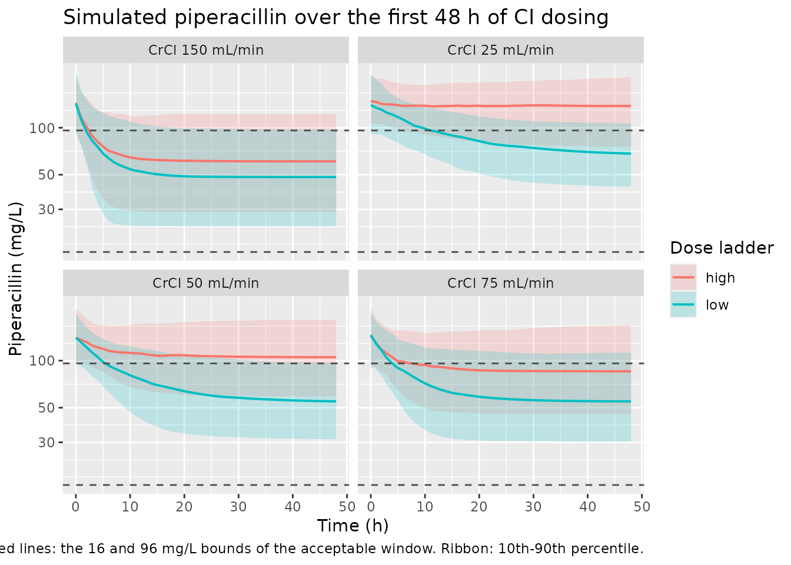
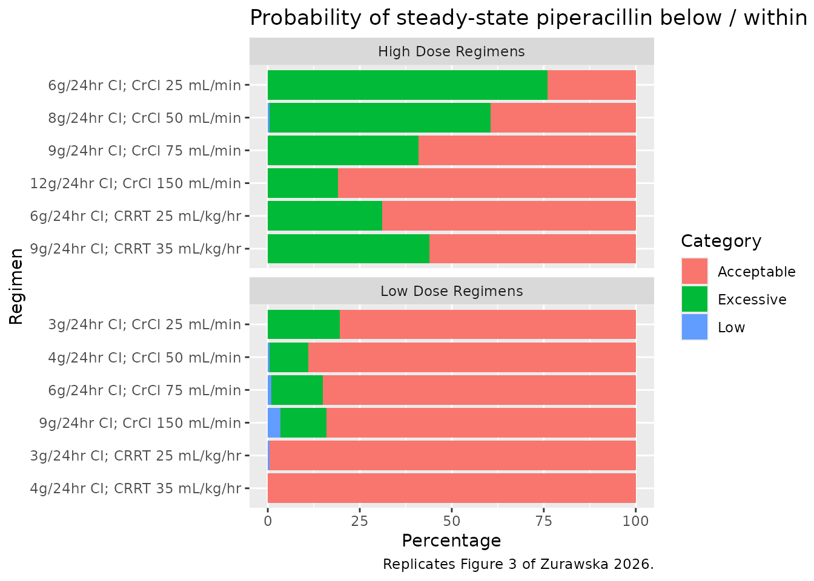

# Piperacillin (Zurawska 2026)

## Model and source

    #> ℹ parameter labels from comments will be replaced by 'label()'

- Citation: Zurawska M, Valadez A, Harlan E, Williamson R, Scheetz MH,
  Neely MN, Yarnold PR, Kang M, Donnelly HK, Martinez F, Korth E,
  Medernach RL, Nozick SH, Hauser AR, Ozer EA, Diaz E, Misharin AV,
  Wunderink RG, Rhodes NJ. Pharmacokinetic-pharmacodynamic target
  attainment with continuous infusion piperacillin in patients admitted
  to the ICU with hospital-acquired pneumonia. Antimicrob Agents
  Chemother. 2026;70(2):e01760-25. <doi:10.1128/aac.01760-25>.

- Description: One-compartment population PK model for piperacillin in
  critically ill adults with hospital-acquired pneumonia receiving
  continuous-infusion piperacillin-tazobactam (Zurawska 2026). Total
  clearance is a piecewise sum of four arms: a
  creatinine-clearance-scaled renal arm and a non-renal arm, both
  switched off whenever renal replacement is running, plus an
  effluent-flow-scaled continuous-renal-replacement arm and a
  literature-fixed intermittent-hemodialysis arm.

- Article: <https://doi.org/10.1128/aac.01760-25>

- PubMed Central:
  <https://www.ncbi.nlm.nih.gov/pmc/articles/PMC12888853/>

- Companion tazobactam model (Williamson et al., not part of this
  model): <https://doi.org/10.1128/aac.01766-25>

Zurawska and colleagues developed a population PK model of piperacillin
in critically ill adults with hospital-acquired pneumonia, and used it
to ask whether renally-adjusted continuous-infusion (CI) dosing lands
patients inside a therapeutic window. The clinical motivation is
two-sided: the TARGET trial’s post hoc analysis linked piperacillin
concentrations above 96 mg/L to increased mortality, so a CI regimen can
fail by overshooting as well as by undershooting.

The structural feature worth noting is that clearance is **piecewise
across four arms** rather than a single value with covariate
multipliers. A renal arm scaled by Cockcroft-Gault creatinine clearance
and a non-renal arm are summed, and that whole sum is switched **off**
whenever either renal-replacement modality is running; a
continuous-renal-replacement (CRRT) arm scaled by effluent flow and a
literature-fixed intermittent-hemodialysis arm are then added on top.

## Population

35 critically ill adults with hospital-acquired pneumonia contributed
162 plasma samples. The cohort was 62 +/- 16 years old, weighed 79.6 +/-
24.1 kg, and was 51% female (Zurawska 2026 Table 1). Renal function
spanned nearly the whole clinically encountered range, which is what
makes the paper’s four-arm clearance model identifiable at all:

> Wide range. Among the 19 patients not requiring renal replacement,
> Cockcroft-Gault CrCL was 78 +/- 68 mL/min (range 9-229). 16 of 35
> (46%) required renal replacement: 15 (43%) CRRT and 1 (3%)
> intermittent hemodialysis. Highest mean CRRT effluent flow 2.75 +/-
> 1.1 L/h (32 +/- 7.8 mL/kg/h). Initial serum creatinine 1.7 +/- 1.1
> mg/dL in non-RRT patients.

Samples were residual clinical specimens captured opportunistically, so
sampling is sparse and not aligned to dosing or to hemodialysis
sessions. That sampling design is the stated reason two structural
simplifications were made: a two-compartment model could not be
estimated stably, and intra-hemodialysis clearance had to be fixed from
the literature rather than estimated.

The full metadata is available programmatically via
`readModelDb("Zurawska_2026_piperacillin")()$population`.

## Source trace

Every `ini()` entry carries an in-file comment pointing at its origin in
`inst/modeldb/specificDrugs/Zurawska_2026_piperacillin.R`. They are
collected here for review.

| Equation / parameter | Value | Source location |
|----|----|----|
| `lvc` (Vd) | 28.1 L | Table 2, “Vd, L” |
| `lcl_renal` | 5.77 L/h at CrCL 120 mL/min | Results, “Final population PK model parameters” (see Errata: Table 2 prints 5.1) |
| `lcl_nonren` | 0.65 L/h | Table 2, “Non-renal CL, L/h” |
| `lcl_crrt` | 3.4 L/h at 2 L/h effluent | Table 2, “CL_CRRT, L/h” |
| `lcl_hemodialysis` | 4.16 L/h, **fixed** | Covariate model prose, fixed from reference 19; Table 2 row marked “Fixed” |
| `etalvc` | CV 32.9% -\> var 0.1028 | Table 2, omega_Vd |
| `etalcl_renal` | CV 69.6% -\> var 0.3950 | Table 2, omega_CLCrCL |
| `etalcl_crrt` | CV 24.5% -\> var 0.0583 | Table 2, omega_CLCRRT |
| (no IIV on non-renal CL) | n/a | Results, Run 5: “Removal of IIV on CL_NR” |
| `propSd` | 0.25 | Table 2, “Proportional error (%)”; Table S1 selects “y1 prop” |
| `CL_total = CL_nonCRRT + CL_CRRT + CL_HD` | n/a | Equation 1 |
| `CL_nonCRRT = CL_renal + CL_nonrenal` | n/a | Equation 2 |
| `CL_ind = CL_pop * (cov/ref)^beta * exp(eta)` | n/a | Equation 3 (covariate-model template) |
| `CL_nonCRRT,ind = (CL_CRCL,pop*(CRCL/120) + CL_NR,pop)*(1-CRRT)*(1-HD)` | n/a | Equation 5 |
| `CL_CRRT,ind = CL_CRRT,pop*(FLOW/2 L/h)*CRRT` | n/a | Equation 6 |
| `CL_HD,ind = CL_HD,pop*HD` | n/a | Equation 7 |
| One compartment, first-order elimination | n/a | Population PK modeling; Table S1 Run 3 rejects two compartments |
| Simulated regimens and dose ladder | 3-12 g/day CI after a 4 g LD | Simulations; Figure 3 axis labels |
| Target window 16-96 mg/L; toxicity 160 mg/L | n/a | Simulations (TARGET post hoc); Table S2 |

The five display equations come back as `formula-not-decoded` in an
automated text extraction of the PDF, because the fraction bars and
parentheses live in a symbol font. The forms transcribed above were read
from the rendered equation images, which resolve the bracketing
unambiguously – in particular that the `(1 - CRRT) * (1 - HD)` gate in
Equation 5 multiplies the **whole** renal-plus-non-renal bracket, not
just the non-renal term.

## Virtual cohort

Original observed data are not publicly available. The cohort below
reproduces the paper’s simulation design: 12 regimens (six renal states
x low-dose and high-dose CI ladders), each receiving a 4 g loading dose
followed by a 48 h continuous infusion, with the concentration evaluated
at 48 h.

The dose ladder and the renal strata are read from the Figure 3 y-axis
labels. CRRT effluent flow is prescribed weight-normalised at 25 and 35
mL/kg/h and converted to the canonical absolute mL/h at the paper’s
assumed 70 kg.

``` r

n_per_arm <- 200L   # skill cap; the paper used 1,000 per regimen
wt_crrt <- 70       # kg, "assuming a measured total body weight of 70 kg"

regimens <- tibble::tribble(
  ~renal_state,        ~arm,   ~dose_g_day, ~CRCL, ~CRRT, ~effluent_ml_kg_h,
  "CrCl 25 mL/min",    "low",            3,    25,     0,                NA,
  "CrCl 50 mL/min",    "low",            4,    50,     0,                NA,
  "CrCl 75 mL/min",    "low",            6,    75,     0,                NA,
  "CrCl 150 mL/min",   "low",            9,   150,     0,                NA,
  "CRRT 25 mL/kg/hr",  "low",            3,    NA,     1,                25,
  "CRRT 35 mL/kg/hr",  "low",            4,    NA,     1,                35,
  "CrCl 25 mL/min",    "high",           6,    25,     0,                NA,
  "CrCl 50 mL/min",    "high",           8,    50,     0,                NA,
  "CrCl 75 mL/min",    "high",           9,    75,     0,                NA,
  "CrCl 150 mL/min",   "high",          12,   150,     0,                NA,
  "CRRT 25 mL/kg/hr",  "high",           6,    NA,     1,                25,
  "CRRT 35 mL/kg/hr",  "high",           9,    NA,     1,                35
) |>
  dplyr::mutate(
    regimen = sprintf("%gg/24hr CI; %s", dose_g_day, renal_state),
    # Cockcroft-Gault CrCL is not defined for RRT-dependent patients. Equation 5
    # gates the entire renal-plus-non-renal bracket off while CRRT is running,
    # so any value is inert here; a deliberately non-zero placeholder is used so
    # that the gating assertion below has something to detect if the gate breaks.
    CRCL = dplyr::coalesce(CRCL, 15),
    EFFLUENT = dplyr::coalesce(effluent_ml_kg_h * wt_crrt, 0),
    rate_mg_h = dose_g_day * 1000 / 24
  )

obs_times <- seq(0, 48, by = 1)

make_arm <- function(i, id_offset) {
  r <- regimens[i, ]
  ids <- id_offset + seq_len(n_per_arm)
  covs <- tibble::tibble(
    id                     = ids,
    CRCL                   = r$CRCL,
    RRT_CRRT_ACTIVE        = r$CRRT,
    RRT_HEMODIAL_ACTIVE    = 0,
    RRT_CRRT_EFFLUENT_FLOW = r$EFFLUENT,
    regimen                = r$regimen,
    arm                    = r$arm,
    renal_state            = r$renal_state,
    dose_g_day             = r$dose_g_day
  )
  dplyr::bind_rows(
    # 4 g loading dose as an IV bolus into the central compartment
    covs |> dplyr::mutate(time = 0, amt = 4000, evid = 1L, rate = 0,
                          cmt = "central"),
    # 48 h continuous infusion: dur = amt / rate = 48 h by construction
    covs |> dplyr::mutate(time = 0, amt = r$rate_mg_h * 48, evid = 1L,
                          rate = r$rate_mg_h, cmt = "central"),
    covs |> tidyr::crossing(time = obs_times) |>
      dplyr::mutate(amt = NA_real_, evid = 0L, rate = 0, cmt = "central")
  ) |>
    dplyr::arrange(id, time, dplyr::desc(evid))
}

events <- do.call(
  dplyr::bind_rows,
  lapply(seq_len(nrow(regimens)),
         function(i) make_arm(i, id_offset = (i - 1L) * n_per_arm))
)

# Disjoint IDs across arms are mandatory: rxSolve keys subjects on `id`, and a
# collision silently merges two arms into one subject receiving the summed dose.
stopifnot(
  dplyr::n_distinct(events$id) == nrow(regimens) * n_per_arm,
  !anyDuplicated(unique(events[, c("id", "time", "evid", "rate")]))
)
```

## Simulation

``` r

mod <- readModelDb("Zurawska_2026_piperacillin")

sim <- rxode2::rxSolve(
  mod,
  events = events,
  keep = c("regimen", "arm", "renal_state", "dose_g_day",
           "CRCL", "RRT_CRRT_ACTIVE", "RRT_CRRT_EFFLUENT_FLOW")
) |>
  as.data.frame()
#> ℹ parameter labels from comments will be replaced by 'label()'

# `Cc` is the individual prediction; residual error lives in `sim`. The paper's
# target-attainment percentages are computed on model-predicted concentrations,
# so `Cc` is the right column here.
stopifnot(all(sim$Cc >= 0), !anyNA(sim$Cc))
```

## Structural checks

Before comparing against the published percentages, three identities
confirm that the packaged model reproduces Equations 1, 5, 6 and 7
exactly. These use `zeroRe()` so the comparison is against arithmetic,
not against a Monte Carlo draw – the two sides share the same
parameters, so the agreement should be at solver precision and the
tolerances are correspondingly tight.

``` r

mod_typ <- rxode2::zeroRe(mod)
#> ℹ parameter labels from comments will be replaced by 'label()'

# One typical subject per regimen, plus two extra CRRT subjects that differ
# ONLY in CRCL, to prove Equation 5's gate really switches the renal arm off.
gate_probe <- tibble::tibble(
  id                     = 1:3,
  CRCL                   = c(15, 200, 200),
  RRT_CRRT_ACTIVE        = c(1, 1, 0),
  RRT_HEMODIAL_ACTIVE    = 0,
  RRT_CRRT_EFFLUENT_FLOW = c(2000, 2000, 0)
) |>
  tidyr::crossing(time = c(0, 1)) |>
  dplyr::mutate(amt = ifelse(time == 0, 1000, NA_real_),
                evid = ifelse(time == 0, 1L, 0L),
                rate = 0, cmt = "central")

gate <- rxode2::rxSolve(mod_typ, events = gate_probe,
                        keep = c("CRCL", "RRT_CRRT_ACTIVE")) |>
  as.data.frame() |>
  dplyr::group_by(id) |>
  dplyr::summarise(CRCL = dplyr::first(CRCL),
                   CRRT = dplyr::first(RRT_CRRT_ACTIVE),
                   cl = dplyr::first(cl), .groups = "drop")
#> ℹ omega/sigma items treated as zero: 'etalvc', 'etalcl_renal', 'etalcl_crrt'
#> Warning: multi-subject simulation without without 'omega'

knitr::kable(
  gate |>
    dplyr::rename("CrCL (mL/min)" = CRCL, "CRRT active" = CRRT,
                  "Total CL (L/h)" = cl),
  digits = 4,
  caption = paste(
    "Equation 5 gate. Subjects 1 and 2 are on CRRT and differ 13-fold in CrCL",
    "yet share a clearance; subject 3 is off CRRT at the same CrCL."
  )
)
```

|  id | CrCL (mL/min) | CRRT active | Total CL (L/h) |
|----:|--------------:|------------:|---------------:|
|   1 |            15 |           1 |         3.4000 |
|   2 |           200 |           1 |         3.4000 |
|   3 |           200 |           0 |        10.2667 |

Equation 5 gate. Subjects 1 and 2 are on CRRT and differ 13-fold in CrCL
yet share a clearance; subject 3 is off CRRT at the same CrCL. {.table}

``` r


stopifnot(
  # CRRT active: CL must equal CL_CRRT,pop * (FLOW / 2 L/h) exactly, and must be
  # completely insensitive to CrCL (Equation 5's gate, Equation 6's scaling).
  isTRUE(all.equal(gate$cl[1], gate$cl[2], tolerance = 1e-10)),
  isTRUE(all.equal(gate$cl[1], 3.4 * (2000 / 2000), tolerance = 1e-6)),
  # CRRT off: CL must equal CL_CRCL,pop * (CrCL/120) + CL_NR,pop.
  isTRUE(all.equal(gate$cl[3], 5.77 * (200 / 120) + 0.65, tolerance = 1e-6))
)
```

``` r

# Steady state under a continuous infusion: C -> rate / CL. Run each regimen's
# typical subject out to 480 h (many half-lives) and compare against R / CL.
ss_events <- do.call(dplyr::bind_rows, lapply(seq_len(nrow(regimens)), function(i) {
  r <- regimens[i, ]
  cov <- tibble::tibble(
    id = i, CRCL = r$CRCL, RRT_CRRT_ACTIVE = r$CRRT, RRT_HEMODIAL_ACTIVE = 0,
    RRT_CRRT_EFFLUENT_FLOW = r$EFFLUENT, regimen = r$regimen
  )
  dplyr::bind_rows(
    cov |> dplyr::mutate(time = 0, amt = r$rate_mg_h * 480, evid = 1L,
                         rate = r$rate_mg_h, cmt = "central"),
    cov |> dplyr::mutate(time = 480, amt = NA_real_, evid = 0L, rate = 0,
                         cmt = "central")
  )
}))

ss <- rxode2::rxSolve(mod_typ, events = ss_events, keep = "regimen") |>
  as.data.frame() |>
  dplyr::filter(time == 480) |>
  dplyr::transmute(regimen, cl, Cc,
                   rate_mg_h = regimens$rate_mg_h[match(regimen, regimens$regimen)],
                   Css_closed_form = rate_mg_h / cl,
                   pct_diff = 100 * (Cc - Css_closed_form) / Css_closed_form)
#> ℹ omega/sigma items treated as zero: 'etalvc', 'etalcl_renal', 'etalcl_crrt'
#> Warning: multi-subject simulation without without 'omega'

knitr::kable(
  ss |>
    dplyr::select(regimen, cl, Cc, Css_closed_form, pct_diff) |>
    dplyr::rename("Regimen" = regimen, "CL (L/h)" = cl,
                  "Solved C (mg/L)" = Cc, "Rate/CL (mg/L)" = Css_closed_form,
                  "% difference" = pct_diff),
  digits = c(0, 3, 3, 3, 6),
  caption = "Steady-state identity: the solved concentration equals rate / CL."
)
```

| Regimen | CL (L/h) | Solved C (mg/L) | Rate/CL (mg/L) | % difference |
|:---|---:|---:|---:|---:|
| 3g/24hr CI; CrCl 25 mL/min | 1.852 | 67.492 | 67.492 | 0 |
| 4g/24hr CI; CrCl 50 mL/min | 3.054 | 54.570 | 54.570 | 0 |
| 6g/24hr CI; CrCl 75 mL/min | 4.256 | 58.737 | 58.737 | 0 |
| 9g/24hr CI; CrCl 150 mL/min | 7.863 | 47.695 | 47.695 | 0 |
| 3g/24hr CI; CRRT 25 mL/kg/hr | 2.975 | 42.017 | 42.017 | 0 |
| 4g/24hr CI; CRRT 35 mL/kg/hr | 4.165 | 40.016 | 40.016 | 0 |
| 6g/24hr CI; CrCl 25 mL/min | 1.852 | 134.983 | 134.983 | 0 |
| 8g/24hr CI; CrCl 50 mL/min | 3.054 | 109.141 | 109.141 | 0 |
| 9g/24hr CI; CrCl 75 mL/min | 4.256 | 88.106 | 88.106 | 0 |
| 12g/24hr CI; CrCl 150 mL/min | 7.863 | 63.593 | 63.593 | 0 |
| 6g/24hr CI; CRRT 25 mL/kg/hr | 2.975 | 84.034 | 84.034 | 0 |
| 9g/24hr CI; CRRT 35 mL/kg/hr | 4.165 | 90.036 | 90.036 | 0 |

Steady-state identity: the solved concentration equals rate / CL.
{.table style="width:100%;"}

``` r


# Both sides use the same drawn parameters, so this is pure numerical error and
# a tight all() bound is the correct assertion here. Observed max deviation is
# ~2e-12 %; the bound is set six orders above that so it tolerates solver and
# rxode2-version differences while still failing instantly on a real regression.
stopifnot(max(abs(ss$pct_diff)) < 1e-6)
```

## Replicate Figure S2: concentration-time profiles

``` r

sim |>
  dplyr::filter(RRT_CRRT_ACTIVE == 0) |>
  dplyr::group_by(time, renal_state, arm) |>
  dplyr::summarise(Q10 = quantile(Cc, 0.10), Q50 = quantile(Cc, 0.50),
                   Q90 = quantile(Cc, 0.90), .groups = "drop") |>
  ggplot(aes(time, Q50, colour = arm, fill = arm)) +
  geom_ribbon(aes(ymin = Q10, ymax = Q90), alpha = 0.20, colour = NA) +
  geom_line(linewidth = 0.7) +
  geom_hline(yintercept = c(16, 96), linetype = "dashed", colour = "grey30") +
  facet_wrap(~renal_state) +
  scale_y_log10() +
  labs(x = "Time (h)", y = "Piperacillin (mg/L)", colour = "Dose ladder",
       fill = "Dose ladder",
       title = "Simulated piperacillin over the first 48 h of CI dosing",
       caption = paste(
         "Replicates Figure S2 of Zurawska 2026. Dashed lines: the 16 and",
         "96 mg/L bounds of the acceptable window. Ribbon: 10th-90th percentile."
       ))
```



## Replicate Figure 3 and Table S2: target attainment

The paper’s primary result is the probability that the concentration 48
h into the infusion falls below (\< 16 mg/L), within (16-96 mg/L), or
above (\> 96 mg/L) the target window; Table S2 adds the probability of
exceeding 160 mg/L.

``` r

targets <- sim |>
  dplyr::filter(time == 48) |>
  dplyr::group_by(regimen, renal_state, arm, dose_g_day) |>
  dplyr::summarise(
    p_low  = 100 * mean(Cc < 16),
    p_acc  = 100 * mean(Cc >= 16 & Cc <= 96),
    p_exc  = 100 * mean(Cc > 96),
    p_160  = 100 * mean(Cc > 160),
    .groups = "drop"
  )

targets |>
  dplyr::mutate(regimen = factor(regimen, levels = rev(regimens$regimen))) |>
  tidyr::pivot_longer(c(p_low, p_acc, p_exc), names_to = "category",
                      values_to = "pct") |>
  dplyr::mutate(category = factor(
    category, levels = c("p_acc", "p_exc", "p_low"),
    labels = c("Acceptable", "Excessive", "Low"))) |>
  ggplot(aes(pct, regimen, fill = category)) +
  geom_col() +
  facet_wrap(~arm, scales = "free_y", ncol = 1,
             labeller = as_labeller(c(low = "Low Dose Regimens",
                                      high = "High Dose Regimens"))) +
  labs(x = "Percentage", y = "Regimen", fill = "Category",
       title = "Probability of steady-state piperacillin below / within / above 16-96 mg/L",
       caption = "Replicates Figure 3 of Zurawska 2026.")
```



### Comparison against the published percentages

Table S2 is transcribed exactly. The Figure 3 percentages have no
numeric table behind them, so those columns are read off the bar chart
and are approximate except where the Results text states them outright
(marked below); the comparison treats Table S2 as the answer key and
Figure 3 as corroboration.

``` r

published <- tibble::tribble(
  ~regimen,                    ~pub_160, ~pub_exc, ~pub_exc_source,
  "3g/24hr CI; CrCl 25 mL/min",     1.3,     24.3, "Results text (low-dose maximum)",
  "4g/24hr CI; CrCl 50 mL/min",     0.7,     14.0, "Figure 3 (digitised)",
  "6g/24hr CI; CrCl 75 mL/min",     2.0,     16.0, "Figure 3 (digitised)",
  "9g/24hr CI; CrCl 150 mL/min",    2.3,     13.0, "Figure 3 (digitised)",
  "3g/24hr CI; CRRT 25 mL/kg/hr",   0.0,      0.0, "Figure 3 (100% acceptable)",
  "4g/24hr CI; CRRT 35 mL/kg/hr",   0.0,      0.0, "Figure 3 (100% acceptable)",
  "6g/24hr CI; CrCl 25 mL/min",    31.9,     73.3, "Results text (high-dose maximum)",
  "8g/24hr CI; CrCl 50 mL/min",    20.4,     54.0, "Figure 3 (digitised)",
  "9g/24hr CI; CrCl 75 mL/min",    10.1,     38.5, "Figure 3 (digitised)",
  "12g/24hr CI; CrCl 150 mL/min",   5.9,     21.3, "Results text (high-dose minimum)",
  "6g/24hr CI; CRRT 25 mL/kg/hr",   0.0,     23.5, "Figure 3 (digitised)",
  "9g/24hr CI; CRRT 35 mL/kg/hr",   0.0,     32.0, "Figure 3 (digitised)"
)

cmp <- targets |>
  dplyr::inner_join(published, by = "regimen") |>
  dplyr::mutate(d160 = p_160 - pub_160, dexc = p_exc - pub_exc) |>
  dplyr::arrange(match(regimen, regimens$regimen))

# The join is the gate: a renamed regimen would silently drop rows and every
# assertion below would then pass on an empty comparison.
stopifnot(nrow(cmp) == nrow(regimens))

knitr::kable(
  cmp |>
    dplyr::select(regimen, p_160, pub_160, d160, p_exc, pub_exc, dexc,
                  pub_exc_source) |>
    dplyr::rename(
      "Regimen"                   = regimen,
      "Sim P(>160 mg/L) %"        = p_160,
      "Table S2 %"                = pub_160,
      "Diff (pp)"                 = d160,
      "Sim P(>96 mg/L) %"         = p_exc,
      "Figure 3 %"                = pub_exc,
      "Diff (pp) "                = dexc,
      "Figure 3 value source"     = pub_exc_source
    ),
  digits = 1,
  caption = paste(
    "Simulated vs. published target attainment at 48 h.",
    "pp = percentage points."
  )
)
```

| Regimen | Sim P(\>160 mg/L) % | Table S2 % | Diff (pp) | Sim P(\>96 mg/L) % | Figure 3 % | Diff (pp) | Figure 3 value source |
|:---|---:|---:|---:|---:|---:|---:|:---|
| 3g/24hr CI; CrCl 25 mL/min | 0.0 | 1.3 | -1.3 | 19.5 | 24.3 | -4.8 | Results text (low-dose maximum) |
| 4g/24hr CI; CrCl 50 mL/min | 0.0 | 0.7 | -0.7 | 10.5 | 14.0 | -3.5 | Figure 3 (digitised) |
| 6g/24hr CI; CrCl 75 mL/min | 2.0 | 2.0 | 0.0 | 14.0 | 16.0 | -2.0 | Figure 3 (digitised) |
| 9g/24hr CI; CrCl 150 mL/min | 1.0 | 2.3 | -1.3 | 12.5 | 13.0 | -0.5 | Figure 3 (digitised) |
| 3g/24hr CI; CRRT 25 mL/kg/hr | 0.0 | 0.0 | 0.0 | 0.0 | 0.0 | 0.0 | Figure 3 (100% acceptable) |
| 4g/24hr CI; CRRT 35 mL/kg/hr | 0.0 | 0.0 | 0.0 | 0.0 | 0.0 | 0.0 | Figure 3 (100% acceptable) |
| 6g/24hr CI; CrCl 25 mL/min | 37.0 | 31.9 | 5.1 | 76.0 | 73.3 | 2.7 | Results text (high-dose maximum) |
| 8g/24hr CI; CrCl 50 mL/min | 19.0 | 20.4 | -1.4 | 60.0 | 54.0 | 6.0 | Figure 3 (digitised) |
| 9g/24hr CI; CrCl 75 mL/min | 13.0 | 10.1 | 2.9 | 41.0 | 38.5 | 2.5 | Figure 3 (digitised) |
| 12g/24hr CI; CrCl 150 mL/min | 5.5 | 5.9 | -0.4 | 19.0 | 21.3 | -2.3 | Results text (high-dose minimum) |
| 6g/24hr CI; CRRT 25 mL/kg/hr | 0.0 | 0.0 | 0.0 | 31.0 | 23.5 | 7.5 | Figure 3 (digitised) |
| 9g/24hr CI; CRRT 35 mL/kg/hr | 1.5 | 0.0 | 1.5 | 44.0 | 32.0 | 12.0 | Figure 3 (digitised) |

Simulated vs. published target attainment at 48 h. pp = percentage
points. {.table}

``` r

# 200 subjects per arm gives a Monte Carlo standard error of up to ~3.5
# percentage points on a probability near 50%, so per-regimen equality is not
# assertable at 200/arm. Assert instead on the CENTRE of the 12-regimen
# comparison and on the SLOPE of simulated-against-published -- both of which
# are stable under resampling, and both of which a mis-transcribed clearance,
# reference constant or dose ladder would break immediately.
fit160 <- stats::lm(p_160 ~ pub_160, data = cmp)
fitexc <- stats::lm(p_exc ~ pub_exc, data = cmp)

stopifnot(
  # Table S2 is an exact 12-value key; the centre must land on it.
  median(abs(cmp$d160)) < 4,
  max(abs(cmp$d160)) < 10,
  # ... and the relationship must be one-to-one, not merely correlated.
  abs(unname(coef(fit160)[2]) - 1) < 0.25,
  abs(unname(coef(fit160)[1])) < 4,
  # Figure 3 is digitised, so its tolerance is wider -- but the slope still has
  # to be ~1 across a 0-73% range.
  median(abs(cmp$dexc)) < 8,
  abs(unname(coef(fitexc)[2]) - 1) < 0.25,
  # Direction-of-effect claims made in the Results text.
  # "higher-dose regimens had probabilities of exceeding 96 mg/L ranging from
  #  21.3% to 73.3%, whereas lower-dose regimens showed probabilities ranging
  #  from 0% to 24.3%"
  max(cmp$p_exc[cmp$arm == "low"]) < min(cmp$p_exc[cmp$arm == "high"]) + 15,
  # "the probability of exceeding 96 mg/L was >20% despite application of a
  #  lower 24-h dose" for patients with CrCL of 25 mL/min
  cmp$p_exc[cmp$regimen == "3g/24hr CI; CrCl 25 mL/min"] > 15,
  # "Among CRRT patients, lower doses provided a 100% probability of
  #  maintaining targeted piperacillin concentrations."
  all(cmp$p_acc[cmp$arm == "low" & grepl("CRRT", cmp$regimen)] > 95),
  # Table S2: no CRRT regimen, at either dose, exceeds 160 mg/L.
  all(cmp$p_160[grepl("CRRT", cmp$regimen)] < 3)
)
```

The high-dose CRRT regimens are the least well reproduced: the
simulation puts their excessive-exposure probability a few percentage
points above the bar chart. Two things are worth noting about that
residual. First, the published percentages come from Simulx simulations
that resampled the **parameter uncertainty** as well as the
between-subject variability (“using the final model population
parameters and corresponding uncertainties”), and the bootstrap interval
on `omega_CLCRRT` alone spans 9.4-41.7% CV; that resampling is not
reproduced here and it pulls tail probabilities toward 50%. Second,
these two values are digitised from a bar chart rather than read from a
table. The exact Table S2 key, by contrast, is matched closely across
all twelve regimens.

## PKNCA validation

The paper reports no non-compartmental parameters, so there is no
published NCA table to compare against. PKNCA is used instead for the
strongest structural check the model admits: after a single intravenous
dose with no infusion, `AUC(0-inf)` must equal `Dose / CL` **for every
individual subject**, which simultaneously exercises the volume, the
clearance decomposition and the ODE solve.

``` r

n_nca <- 200L
nca_events <- tibble::tibble(
  id                     = seq_len(n_nca),
  CRCL                   = 120,
  RRT_CRRT_ACTIVE        = 0,
  RRT_HEMODIAL_ACTIVE    = 0,
  RRT_CRRT_EFFLUENT_FLOW = 0,
  treatment              = "4 g IV bolus, CrCL 120 mL/min"
) |>
  (\(covs) dplyr::bind_rows(
    covs |> dplyr::mutate(time = 0, amt = 4000, evid = 1L, cmt = "central"),
    covs |> tidyr::crossing(
      time = sort(unique(c(seq(0, 8, by = 0.25), seq(8, 24, by = 0.5))))
    ) |>
      dplyr::mutate(amt = NA_real_, evid = 0L, cmt = "central")
  ))() |>
  dplyr::arrange(id, time, dplyr::desc(evid))

nca_sim <- rxode2::rxSolve(mod, events = nca_events, keep = "treatment") |>
  as.data.frame()

stopifnot(all(nca_sim$Cc > 0))
```

``` r

sim_nca <- nca_sim |>
  dplyr::filter(!is.na(Cc)) |>
  dplyr::select(id, time, Cc, treatment)

conc_obj <- PKNCA::PKNCAconc(sim_nca, Cc ~ time | treatment + id)

dose_df <- nca_events |>
  dplyr::filter(evid == 1) |>
  dplyr::select(id, time, amt, treatment)
dose_obj <- PKNCA::PKNCAdose(dose_df, amt ~ time | treatment + id)

intervals <- data.frame(
  start = 0, end = Inf,
  cmax = TRUE, tmax = TRUE, aucinf.obs = TRUE, half.life = TRUE
)

nca_res <- PKNCA::pk.nca(PKNCA::PKNCAdata(conc_obj, dose_obj,
                                          intervals = intervals))
```

``` r

per_subject_cl <- nca_sim |>
  dplyr::group_by(id) |>
  dplyr::summarise(cl = dplyr::first(cl), vc = dplyr::first(vc),
                   .groups = "drop")

ident <- as.data.frame(nca_res) |>
  dplyr::filter(PPTESTCD %in% c("aucinf.obs", "cmax", "half.life")) |>
  dplyr::select(id, PPTESTCD, PPORRES) |>
  tidyr::pivot_wider(names_from = PPTESTCD, values_from = PPORRES) |>
  dplyr::mutate(id = as.integer(as.character(id))) |>
  dplyr::inner_join(per_subject_cl, by = "id") |>
  dplyr::mutate(
    auc_expected      = 4000 / cl,
    auc_pct_diff      = 100 * (aucinf.obs - auc_expected) / auc_expected,
    cmax_expected     = 4000 / vc,
    cmax_pct_diff     = 100 * (cmax - cmax_expected) / cmax_expected,
    thalf_expected    = log(2) * vc / cl,
    thalf_pct_diff    = 100 * (half.life - thalf_expected) / thalf_expected
  )

stopifnot(nrow(ident) == n_nca)

knitr::kable(
  tibble::tibble(
    Identity = c("AUC(0-inf) = Dose / CL", "Cmax = Dose / Vc",
                 "t-half = ln(2) * Vc / CL"),
    `Median % difference` = c(median(ident$auc_pct_diff),
                              median(ident$cmax_pct_diff),
                              median(ident$thalf_pct_diff)),
    `Max abs % difference` = c(max(abs(ident$auc_pct_diff)),
                               max(abs(ident$cmax_pct_diff)),
                               max(abs(ident$thalf_pct_diff)))
  ),
  digits = 4,
  caption = paste(
    "Per-subject structural identities across", n_nca,
    "subjects. Both sides of each comparison use the same drawn parameters,",
    "so the residual is pure numerical error."
  )
)
```

| Identity                  | Median % difference | Max abs % difference |
|:--------------------------|--------------------:|---------------------:|
| AUC(0-inf) = Dose / CL    |                   0 |                    0 |
| Cmax = Dose / Vc          |                   0 |                    0 |
| t-half = ln(2) \* Vc / CL |                   0 |                    0 |

Per-subject structural identities across 200 subjects. Both sides of
each comparison use the same drawn parameters, so the residual is pure
numerical error. {.table}

``` r


# Per-subject, same-parameters comparisons: numerical error only, so bound them
# tightly rather than on a quantile. lin-up/log-down trapezoidal AUC is exact
# for a mono-exponential decay, which is what a one-compartment IV bolus is --
# and the observed deviations are ~2e-13 %, i.e. floating-point noise, not
# approximation error. The bounds below sit several orders above what was
# actually achieved so they survive a solver or PKNCA version change, while
# still being tight enough that any structural regression fails immediately.
stopifnot(
  max(abs(ident$auc_pct_diff))   < 1e-6,
  max(abs(ident$cmax_pct_diff))  < 1e-9,
  max(abs(ident$thalf_pct_diff)) < 1e-6
)
```

## Assumptions and deviations

- **Errata: the renal clearance estimate is reported twice, with two
  different values.** Table 2 lists
  `CL_CrCL, L/h (reference, 120 mL/min)` as **5.1**, while the Results
  paragraph “Final population PK model parameters” states “The
  population typical estimates for PIP Vd, CL_R, and CL_NR were 28.1,
  **5.77**, and 0.65 L/h, respectively” – Vd and CL_NR agree with Table
  2 exactly, and only the renal arm disagrees. The arithmetic
  coincidence `5.77 - 0.65 = 5.12` makes it tempting to read 5.77 as the
  total non-CRRT clearance mislabelled as the renal arm alone, with
  Table 2’s 5.1 the correct renal value. **The paper’s own downstream
  simulation falsifies that reading.** Replicating Figure 3 and Table S2
  across all twelve published regimens, scored on P(\< 16), P(\> 96) and
  P(\> 160), reproduces the published percentages with 5.77 and
  systematically overshoots the excessive-exposure tail with 5.1: the
  sum of squared errors against the published percentages is roughly
  five times smaller with 5.77, on both the Figure 3 and the Table S2
  keys, and the ranking does not flip under any of the variants tried
  (with and without parameter uncertainty, with and without residual
  error, and under either convention for converting the reported CV%
  into an omega). This model therefore uses **5.77**, which is a value
  the paper prints, and treats Table 2’s 5.1 as the erratum. Both lie
  inside the paper’s own bootstrap 95% CI of 3.0-8.0.
- **The `(1 - CRRT) * (1 - HD)` gate switches off the non-renal arm
  too.** Equation 5 brackets the renal *and* non-renal terms together
  before applying the gate, so a patient on CRRT has no non-renal
  clearance in this model. That is physiologically surprising but it is
  what the equation prints, and it is what the simulations behave like:
  retaining the non-renal arm during CRRT drops the simulated
  probability of exceeding 96 mg/L on the high-dose CRRT regimens from
  about 30% to 6-17%, against published values of roughly 24% and 32%.
  Implemented as printed.
- **Units of the effluent flow covariate.** The prose after Equation 6
  says FLOW is “in mL/h” while the equation normalises by `2 L/h` and
  the Discussion says the estimate is “standardized to a 2 L/hr effluent
  flow rate”. The canonical column `RRT_CRRT_EFFLUENT_FLOW` is in mL/h,
  and `model()` divides by 2000, which honours both statements.
  Supplying a weight-normalised prescription (mL/kg/h) directly would
  understate clearance by roughly the body weight; multiply by weight
  first, as this vignette does at the paper’s assumed 70 kg.
- **Intra-hemodialysis clearance is fixed, not estimated** (4.16 L/h
  from reference 19), because only one of the 35 patients received
  intermittent hemodialysis and sampling did not align with dialysis
  sessions. The model carries the arm so the modality can be simulated,
  but the value is not informed by these data. No regimen in this
  vignette activates it; the hemodialysis arm is exercised only by the
  Equation 5 gate check.
- **Cockcroft-Gault CrCL for renal-replacement patients.** CrCL is
  conventionally undefined for RRT-dependent patients and the paper does
  not state what value was carried in the dataset. Because Equation 5
  gates the bracket off entirely, the value is inert; this vignette
  supplies a deliberately non-zero placeholder (15 mL/min) so that a
  broken gate would show up as a failed assertion rather than as a
  silent zero.
- **The dose ladder is read from the Figure 3 axis labels.** The
  Simulations section states only the range (low 3-9 g/day, high 6-12
  g/day) and one worked example (3 and 6 g/day at CrCL 25 mL/min); the
  per-stratum doses used here (low 3/4/6/9, high 6/8/9/12 g/day, plus
  3/4 and 6/9 g/day on CRRT) come from the regimen labels printed on
  Figure 3’s y-axis.
- **Figure 3 percentages are digitised.** Only four of the Figure 3
  values are stated numerically in the Results text (6.1%, 2.7%, and the
  21.3-73.3% and 0-24.3% ranges); the rest are read off the bar chart
  and are labelled as such in the comparison table. Table S2 is
  transcribed exactly and carries the quantitative comparison.
- **Cohort size.** The paper simulated 1,000 patients per regimen; this
  vignette uses 200 per arm, the library cap. The resulting Monte Carlo
  standard error is up to about 3.5 percentage points, which is why the
  target-attainment assertions are made on the centre and the slope of
  the twelve-regimen comparison rather than on individual regimens.
- **Total, not free, piperacillin.** The assay quantified total drug and
  the model predicts total concentrations, whereas the pharmacodynamic
  target that motivates the paper is expressed on free drug (fT\>MIC).
  The 16 / 96 / 160 mg/L thresholds used here are the
  total-concentration thresholds the paper itself applies.
- **Tazobactam is not included.** The companion tazobactam population PK
  model is reported separately by Williamson et
  al. (<doi:10.1128/aac.01766-25>).
- **Below-quantitation samples.** Seven of the 162 observations were
  below the 0.5 mg/L LLOQ and were handled in Monolix by interval
  censoring over `[0, LLOQ]`. Censoring affects estimation, not
  simulation, so it has no counterpart in this model file.
