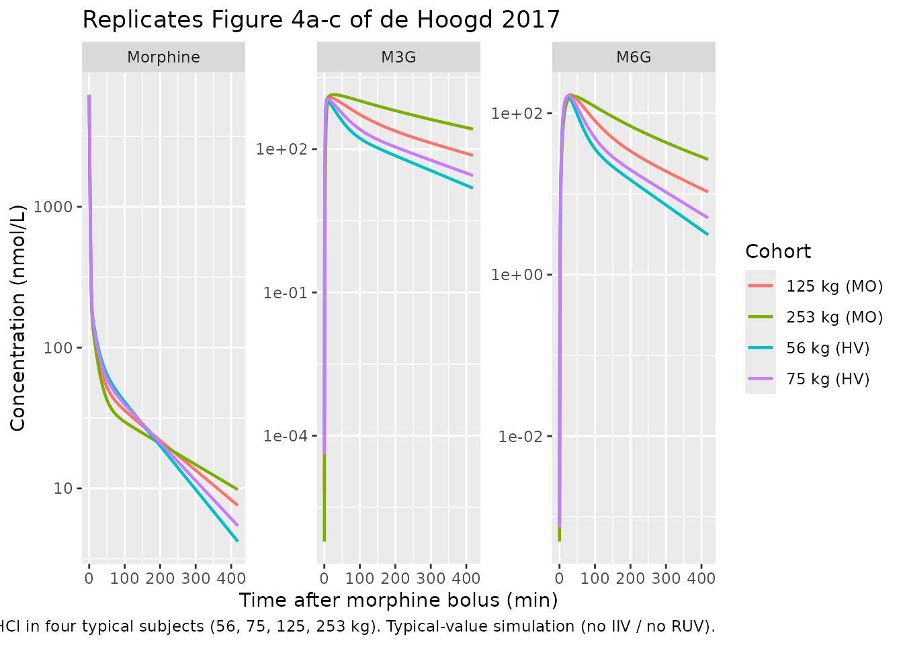
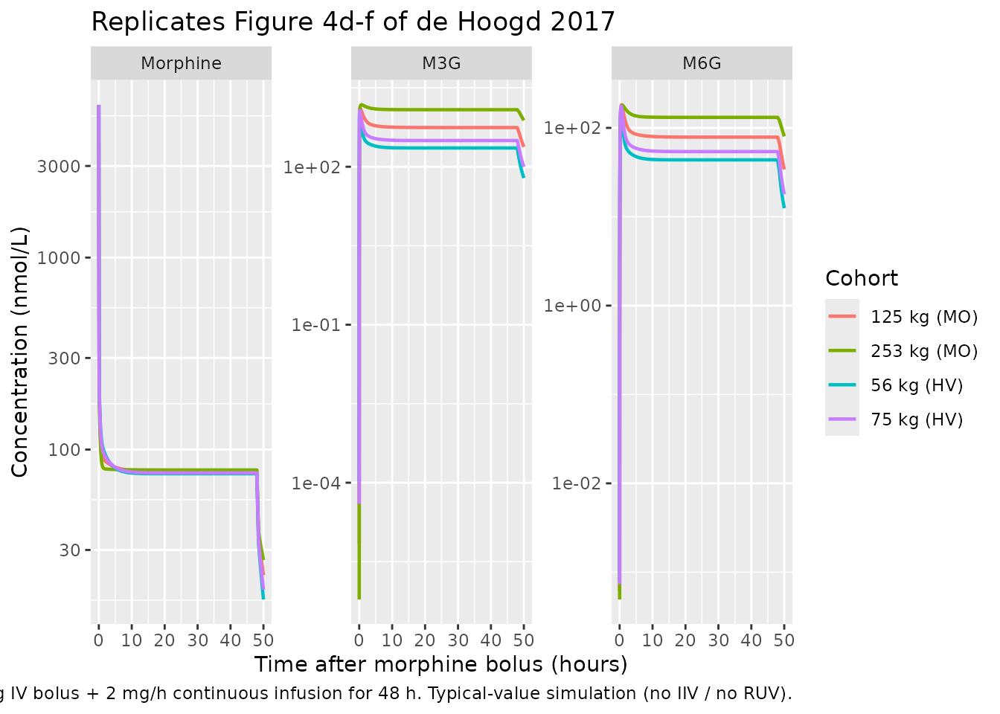

# deHoogd_2017_morphine

## Model and source

- Citation: de Hoogd S, Valitalo PAJ, Dahan A, van Kralingen S,
  Coughtrie MMW, van Dongen EPA, van Ramshorst B, Knibbe CAJ. Influence
  of morbid obesity on the pharmacokinetics of morphine,
  morphine-3-glucuronide, and morphine-6-glucuronide. Clin
  Pharmacokinet. 2017;56(12):1577-1587. <doi:10.1007/s40262-017-0544-2>.
  ClinicalTrials.gov NCT01097148.
- Description: Joint parent-metabolite population PK model for morphine
  and its two glucuronide metabolites (M3G, M6G) in 20 morbidly obese
  adults (post-gastric-bypass) and 20 healthy adult volunteers (de Hoogd
  2017). Morphine: three-compartment IV model with total body weight
  (TBW) covariate on the second peripheral volume V5M. Non-glucuronide
  morphine clearance is structurally fixed at 35% of total morphine CL
  in a 70-kg healthy adult. M3G and M6G are each one-compartment models
  fed by formation-delay transit chains (n = 5 for M3G, n = 2 for M6G);
  VM3G = VM6G is a structural equality. TBW covariates apply to CLF M6G,
  the M3G transit rate Ktr, M3G elimination CL, and M6G elimination CL,
  all power-form normalised to a reference of 98.5 kg (population
  median). Proportional residual error is reported separately for the
  healthy- volunteer cohort and the morbidly obese cohort, selected via
  the binary indicator DIS_OBESE_MORBID.
- Article: <https://doi.org/10.1007/s40262-017-0544-2>

## Population

The published analysis pooled 20 morbidly obese adults (BMI 37.9-78.6
kg/m^2, body weight 112-251.9 kg, 9 male / 11 female) scheduled for
laparoscopic gastric bypass / banding / sleeve surgery with 20
historical-control healthy adult volunteers (body weight 56-85 kg, 10
male / 10 female) from two prior morphine pharmacokinetic studies
(Sarton 2000, Romberg 2004). All subjects had normal renal and hepatic
function (ASA II/III). The morbidly obese cohort received a 10 mg IV
bolus of morphine HCl at the end of surgery with additional
postoperative boluses as needed (mean total dose 15.7 +/- 4.0 mg); the
healthy volunteers received a 0.10 mg/kg IV bolus followed by a 0.030
mg/kg/h IV infusion for 1 h (mean total dose 9.2 +/- 1.2 mg). Plasma
samples were drawn between 0 and 420 minutes post first morphine dose.
See de Hoogd 2017 Table 1 for the full baseline demographic summary; the
same information is available programmatically via
`readModelDb("deHoogd_2017_morphine")$population`.

## Source trace

The per-parameter origin is recorded as an in-file comment next to each
`ini()` entry in `inst/modeldb/specificDrugs/deHoogd_2017_morphine.R`.
The table below collects them in one place.

| Equation / parameter | Final value | Source location |
|----|----|----|
| `lcl_form_m3g` (CLF M3G) | 0.748 L/min | Table 2, Final column |
| `lcl_form_m6g` (CLF M6G at 98.5 kg) | 0.129 L/min | Table 2, Final column |
| `e_wt_cl_form_m6g` (K) | -0.329 | Table 2, Final column |
| `lvc` (V1M) | 4.62 L | Table 2, Final column |
| `lvp` (V4M) | 9.52 L | Table 2, Final column |
| `lvp2` (V5M at 98.5 kg) | 118 L | Table 2, Final column |
| `e_wt_vp2` (L) | 0.483 | Table 2, Final column |
| `lq` (Q2, V1M \<-\> V4M) | 0.814 L/min | Table 2, Final column |
| `lq2` (Q3, V1M \<-\> V5M) | 1.29 L/min | Table 2, Final column |
| `lcl_nongluc` (CL_nonglucuronide) | 0.4805 L/min (FIXED) | Methods 2.4 (35% of CL_total at 70 kg, derived from Final-column formation CLs) |
| `lktr_m3g` (Ktr at 98.5 kg) | 1.68 1/min | Table 2, Final column |
| `e_wt_ktr_m3g` (M) | -0.701 | Table 2, Final column |
| `lktr_m6g` (Ktr2) | 0.159 1/min | Table 2, Final column |
| `lvc_m3g` (VM3G = VM6G) | 5.29 L | Table 2, Final column |
| `lcl_m3g` (CLE M3G at 98.5 kg) | 0.134 L/min | Table 2, Final column |
| `e_wt_cl_m3g` (N) | -1.08 | Table 2, Final column |
| `lcl_m6g` (CLE M6G at 98.5 kg) | 0.149 L/min | Table 2, Final column |
| `e_wt_cl_m6g` (O) | -1.03 | Table 2, Final column |
| `etalcl_form_m3g` | log(1 + 0.208^2) | Table 2 IIV, CLF M3G = 20.8% CV |
| `etalcl_m3g` | log(1 + 0.659^2) | Table 2 IIV, CLE M3G = 65.9% CV |
| `etalvc_m3g` (shared VM3G = VM6G) | log(1 + 0.297^2) | Table 2 IIV, VM3G = VM6G = 29.7% CV |
| `etalktr_m6g` | log(1 + 0.368^2) | Table 2 IIV, Ktr2 = 36.8% CV |
| `propSd_morphine_hv` / `propSd_morphine_mo` | 0.140 / 0.379 | Table 2 residual variability, HV / MO morphine 14.0% / 37.9% |
| `propSd_m3g_hv` / `propSd_m3g_mo` | 0.179 / 0.171 | Table 2 residual variability, HV / MO M3G 17.9% / 17.1% |
| `propSd_m6g_hv` / `propSd_m6g_mo` | 0.295 / 0.281 | Table 2 residual variability, HV / MO M6G 29.5% / 28.1% |
| Equation: morphine 3-cmt IV disposition | n/a | Figure 1 schematic; CL_total = CL_nongluc + CLF M3G + CLF M6G |
| Equation: M3G transit chain n = 5 | n/a | Section 3.2 (“for M3G n = 5, mean transit time = 3.05 min”) |
| Equation: M6G transit chain n = 2 | n/a | Section 3.2 (“for M6G n = 2, mean transit time = 12.7 min”) |
| Equation: VM3G = VM6G structural equality | n/a | Methods 2.4 (“volume of distribution of the two metabolites … was assumed to be equal”) |
| Dose conversion 1 mg HCl -\> 1e6/321.8 nmol morphine | n/a | Methods 2.4 (MW HCl 321.8 g/mol; concentrations in nmol/L) |

## Virtual cohort

Original observed data are not publicly available. The simulation below
reproduces the four representative individuals shown in de Hoogd 2017
Figure 4: body weights 56, 75, 125, and 253 kg. The 56-kg subject is the
lightest healthy volunteer in the source dataset; the 253-kg subject is
the heaviest morbidly obese patient. Body-weight category determines
`DIS_OBESE_MORBID` per the source inclusion criteria (BMI \> 40 kg/m^2
for the morbidly obese cohort): 56 and 75 kg fall in the
healthy-volunteer band, 125 and 253 kg fall in the morbidly obese band.

``` r

set.seed(20170516)

cov_df <- data.frame(
  id            = 1:4,
  WT            = c(56, 75, 125, 253),
  DIS_OBESE_MORBID = c(0L, 0L, 1L, 1L),
  cohort        = factor(c("56 kg (HV)", "75 kg (HV)",
                           "125 kg (MO)", "253 kg (MO)"),
                          levels = c("56 kg (HV)", "75 kg (HV)",
                                     "125 kg (MO)", "253 kg (MO)"))
)
```

## Simulation

Two scenarios from Figure 4: (a) a single 10-mg IV bolus of morphine
HCl, and (b) a 10-mg IV bolus followed by a 2 mg/h continuous IV
infusion for 48 h. Concentrations are reported in nmol/L (the paper’s
units). Internal state quantities are mg of morphine HCl equivalents;
the model’s observation equations multiply by `mw_conv = 1e6 / 321.8` so
`Cc`, `Cc_m3g`, and `Cc_m6g` output in nmol/L directly comparable to the
paper’s Figure 4. See Assumptions and deviations for why the conversion
is in the observation equations rather than via `f(central)`.

``` r

mod_typical <- readModelDb("deHoogd_2017_morphine") |> rxode2::zeroRe()
#> Warning: No sigma parameters in the model

build_events <- function(cov_df, obs_times, dose_events) {
  events_list <- lapply(seq_len(nrow(cov_df)), function(i) {
    row <- cov_df[i, , drop = FALSE]
    dose_rows <- dose_events |>
      mutate(
        id            = row$id,
        WT            = row$WT,
        DIS_OBESE_MORBID = row$DIS_OBESE_MORBID,
        cohort        = as.character(row$cohort)
      )
    obs_rows <- data.frame(
      id            = row$id,
      time          = obs_times,
      amt           = NA_real_,
      rate          = NA_real_,
      evid          = 0L,
      cmt           = "Cc",
      WT            = row$WT,
      DIS_OBESE_MORBID = row$DIS_OBESE_MORBID,
      cohort        = as.character(row$cohort),
      stringsAsFactors = FALSE
    )
    dplyr::bind_rows(dose_rows, obs_rows)
  })
  dplyr::bind_rows(events_list) |>
    arrange(id, time, evid)
}

# (a) 10 mg IV bolus only, sampled densely over 420 min
bolus_dose <- data.frame(
  time = 0, amt = 10, rate = 0, evid = 1L, cmt = "central",
  stringsAsFactors = FALSE
)
events_bolus <- build_events(
  cov_df,
  obs_times  = c(0.1, seq(1, 420, by = 2)),
  dose_events = bolus_dose
)

sim_bolus <- rxode2::rxSolve(
  mod_typical,
  events = events_bolus,
  keep   = c("cohort", "WT", "DIS_OBESE_MORBID")
) |> as.data.frame()
#> ℹ omega/sigma items treated as zero: 'etalcl_form_m3g', 'etalcl_m3g', 'etalvc_m3g', 'etalktr_m6g'
#> Warning: multi-subject simulation without without 'omega'
```

``` r

# (b) 10 mg IV bolus immediately followed by 2 mg/h continuous infusion for 48 h
infusion_dur_min <- 48 * 60
infusion_dose <- data.frame(
  time = c(0,                0),
  amt  = c(10,               2 * 48),         # bolus 10 mg + total 2 mg/h x 48 h = 96 mg
  rate = c(0,                2 / (1 / 60)),    # rate 2 mg/h = 2 mg/60 min in min units... convert: mg/min = 2/60
  evid = c(1L,               1L),
  cmt  = c("central",        "central"),
  stringsAsFactors = FALSE
)
# rxode2 interprets `rate` in dose / time units; time is in minutes, so
# 2 mg/h = 2/60 mg/min.
infusion_dose$rate <- c(0, 2 / 60)
infusion_dose$amt  <- c(10, (2 / 60) * infusion_dur_min)  # 2 mg/h x 48 h = 96 mg

obs_times_inf <- c(0.1,
                   seq(1, 60, by = 1),
                   seq(65, 12 * 60, by = 5),
                   seq(13 * 60, 50 * 60, by = 30))

events_inf <- build_events(
  cov_df,
  obs_times   = obs_times_inf,
  dose_events = infusion_dose
)

sim_inf <- rxode2::rxSolve(
  mod_typical,
  events = events_inf,
  keep   = c("cohort", "WT", "DIS_OBESE_MORBID")
) |> as.data.frame()
#> ℹ omega/sigma items treated as zero: 'etalcl_form_m3g', 'etalcl_m3g', 'etalvc_m3g', 'etalktr_m6g'
#> Warning: multi-subject simulation without without 'omega'
```

## Replicate published figures

### Figure 4a-c: 10 mg IV bolus, 0-420 min

``` r

plot_bolus <- sim_bolus |>
  pivot_longer(cols = c(Cc, Cc_m3g, Cc_m6g),
               names_to = "species", values_to = "conc") |>
  mutate(species = factor(
    recode(species,
           "Cc"     = "Morphine",
           "Cc_m3g" = "M3G",
           "Cc_m6g" = "M6G"),
    levels = c("Morphine", "M3G", "M6G")
  ))

ggplot(plot_bolus, aes(x = time, y = conc, color = cohort)) +
  geom_line(linewidth = 0.8) +
  facet_wrap(~species, scales = "free_y", ncol = 3) +
  scale_y_log10() +
  labs(x = "Time after morphine bolus (min)",
       y = "Concentration (nmol/L)",
       color = "Cohort",
       title = "Replicates Figure 4a-c of de Hoogd 2017",
       caption = paste("10 mg IV bolus of morphine HCl in four typical subjects",
                       "(56, 75, 125, 253 kg). Typical-value simulation",
                       "(no IIV / no RUV)."))
```



### Figure 4d-f: 10 mg IV bolus + 2 mg/h infusion for 48 h

``` r

plot_inf <- sim_inf |>
  pivot_longer(cols = c(Cc, Cc_m3g, Cc_m6g),
               names_to = "species", values_to = "conc") |>
  mutate(species = factor(
    recode(species,
           "Cc"     = "Morphine",
           "Cc_m3g" = "M3G",
           "Cc_m6g" = "M6G"),
    levels = c("Morphine", "M3G", "M6G")
  ))

ggplot(plot_inf, aes(x = time / 60, y = conc, color = cohort)) +
  geom_line(linewidth = 0.8) +
  facet_wrap(~species, scales = "free_y", ncol = 3) +
  scale_y_log10() +
  labs(x = "Time after morphine bolus (hours)",
       y = "Concentration (nmol/L)",
       color = "Cohort",
       title = "Replicates Figure 4d-f of de Hoogd 2017",
       caption = paste("10 mg IV bolus + 2 mg/h continuous infusion for 48 h.",
                       "Typical-value simulation (no IIV / no RUV)."))
```



The paper’s qualitative findings – (1) morphine PK is broadly comparable
across the 56-253 kg weight range, (2) M3G AUC is approximately 5x
higher in the 253-kg subject than in the 56-kg subject after 48 h of
infusion, and (3) M6G AUC is approximately 3x higher in the 253-kg
subject than in the 56-kg subject under the same conditions – are
evident in the plots above.

## PKNCA validation

Single-dose NCA after the 10 mg IV bolus, computed separately for
morphine and each of the two glucuronide metabolites. Treatment grouping
uses the four cohort labels so per-cohort summaries roll up.

### Morphine

``` r

sim_nca_morphine <- sim_bolus |>
  filter(!is.na(Cc), time > 0) |>
  select(id, time, Cc, cohort)

dose_df <- events_bolus |>
  filter(evid == 1L) |>
  select(id, time, amt, cohort) |>
  distinct()

conc_obj_morphine <- PKNCA::PKNCAconc(
  sim_nca_morphine, Cc ~ time | cohort + id,
  concu = "nmol/L", timeu = "min"
)
dose_obj <- PKNCA::PKNCAdose(
  dose_df, amt ~ time | cohort + id, doseu = "mg"
)

intervals <- data.frame(
  start      = 0,
  end        = 420,
  cmax       = TRUE,
  tmax       = TRUE,
  auclast    = TRUE,
  aucinf.obs = TRUE,
  half.life  = TRUE
)

nca_morphine <- PKNCA::pk.nca(
  PKNCA::PKNCAdata(conc_obj_morphine, dose_obj, intervals = intervals)
)
#> Warning: Requesting an AUC range starting (0) before the first measurement (0.1) is not allowed
#> Requesting an AUC range starting (0) before the first measurement (0.1) is not allowed
#> Requesting an AUC range starting (0) before the first measurement (0.1) is not allowed
#> Requesting an AUC range starting (0) before the first measurement (0.1) is not allowed
#> Requesting an AUC range starting (0) before the first measurement (0.1) is not allowed
#> Requesting an AUC range starting (0) before the first measurement (0.1) is not allowed
#> Requesting an AUC range starting (0) before the first measurement (0.1) is not allowed
#> Requesting an AUC range starting (0) before the first measurement (0.1) is not allowed
knitr::kable(as.data.frame(summary(nca_morphine)),
             caption = "Morphine NCA after 10 mg IV bolus.")
```

| Interval Start | Interval End | cohort | N | AUClast (min\*nmol/L) | Cmax (nmol/L) | Tmax (min) | Half-life (min) | AUCinf,obs (min\*nmol/L) |
|---:|---:|:---|:---|:---|:---|:---|:---|:---|
| 0 | 420 | 125 kg (MO) | 1 | NC | 6240 | 0.100 | 142 | NC |
| 0 | 420 | 253 kg (MO) | 1 | NC | 6250 | 0.100 | 200 | NC |
| 0 | 420 | 56 kg (HV) | 1 | NC | 6240 | 0.100 | 96.5 | NC |
| 0 | 420 | 75 kg (HV) | 1 | NC | 6240 | 0.100 | 111 | NC |

Morphine NCA after 10 mg IV bolus. {.table}

### M3G

``` r

sim_nca_m3g <- sim_bolus |>
  filter(!is.na(Cc_m3g), time > 0) |>
  select(id, time, Cc_m3g, cohort) |>
  rename(Cc = Cc_m3g)

conc_obj_m3g <- PKNCA::PKNCAconc(
  sim_nca_m3g, Cc ~ time | cohort + id,
  concu = "nmol/L", timeu = "min"
)

nca_m3g <- PKNCA::pk.nca(
  PKNCA::PKNCAdata(conc_obj_m3g, dose_obj, intervals = intervals)
)
#> Warning: Requesting an AUC range starting (0) before the first measurement (0.1) is not allowed
#> Requesting an AUC range starting (0) before the first measurement (0.1) is not allowed
#> Requesting an AUC range starting (0) before the first measurement (0.1) is not allowed
#> Requesting an AUC range starting (0) before the first measurement (0.1) is not allowed
#> Requesting an AUC range starting (0) before the first measurement (0.1) is not allowed
#> Requesting an AUC range starting (0) before the first measurement (0.1) is not allowed
#> Requesting an AUC range starting (0) before the first measurement (0.1) is not allowed
#> Requesting an AUC range starting (0) before the first measurement (0.1) is not allowed
knitr::kable(as.data.frame(summary(nca_m3g)),
             caption = "M3G NCA after 10 mg morphine HCl IV bolus.")
```

| Interval Start | Interval End | cohort | N | AUClast (min\*nmol/L) | Cmax (nmol/L) | Tmax (min) | Half-life (min) | AUCinf,obs (min\*nmol/L) |
|---:|---:|:---|:---|:---|:---|:---|:---|:---|
| 0 | 420 | 125 kg (MO) | 1 | NC | 1240 | 13.0 | 137 | NC |
| 0 | 420 | 253 kg (MO) | 1 | NC | 1380 | 27.0 | 177 | NC |
| 0 | 420 | 56 kg (HV) | 1 | NC | 1090 | 7.00 | 96.2 | NC |
| 0 | 420 | 75 kg (HV) | 1 | NC | 1150 | 9.00 | 110 | NC |

M3G NCA after 10 mg morphine HCl IV bolus. {.table}

### M6G

``` r

sim_nca_m6g <- sim_bolus |>
  filter(!is.na(Cc_m6g), time > 0) |>
  select(id, time, Cc_m6g, cohort) |>
  rename(Cc = Cc_m6g)

conc_obj_m6g <- PKNCA::PKNCAconc(
  sim_nca_m6g, Cc ~ time | cohort + id,
  concu = "nmol/L", timeu = "min"
)

nca_m6g <- PKNCA::pk.nca(
  PKNCA::PKNCAdata(conc_obj_m6g, dose_obj, intervals = intervals)
)
#> Warning: Requesting an AUC range starting (0) before the first measurement (0.1) is not allowed
#> Requesting an AUC range starting (0) before the first measurement (0.1) is not allowed
#> Requesting an AUC range starting (0) before the first measurement (0.1) is not allowed
#> Requesting an AUC range starting (0) before the first measurement (0.1) is not allowed
#> Requesting an AUC range starting (0) before the first measurement (0.1) is not allowed
#> Requesting an AUC range starting (0) before the first measurement (0.1) is not allowed
#> Requesting an AUC range starting (0) before the first measurement (0.1) is not allowed
#> Requesting an AUC range starting (0) before the first measurement (0.1) is not allowed
knitr::kable(as.data.frame(summary(nca_m6g)),
             caption = "M6G NCA after 10 mg morphine HCl IV bolus.")
```

| Interval Start | Interval End | cohort | N | AUClast (min\*nmol/L) | Cmax (nmol/L) | Tmax (min) | Half-life (min) | AUCinf,obs (min\*nmol/L) |
|---:|---:|:---|:---|:---|:---|:---|:---|:---|
| 0 | 420 | 125 kg (MO) | 1 | NC | 170 | 31.0 | 138 | NC |
| 0 | 420 | 253 kg (MO) | 1 | NC | 164 | 39.0 | 174 | NC |
| 0 | 420 | 56 kg (HV) | 1 | NC | 160 | 23.0 | 96.2 | NC |
| 0 | 420 | 75 kg (HV) | 1 | NC | 166 | 25.0 | 110 | NC |

M6G NCA after 10 mg morphine HCl IV bolus. {.table}

### Comparison against published exposure ratios

de Hoogd 2017 Section 3.3 reports that, after a 48-h continuous infusion
of morphine, the 253-kg subject has approximately 5x higher M3G
concentration and 3x higher M6G concentration than the 56-kg subject;
morphine concentrations are broadly comparable across the weight range.
The infusion simulation above should reproduce these qualitative ratios
– the table below summarizes the end-of-infusion (t = 48 h) values from
`sim_inf`:

``` r

ratio_tbl <- sim_inf |>
  filter(time == 48 * 60) |>
  select(cohort, WT, Cc, Cc_m3g, Cc_m6g) |>
  arrange(WT)
knitr::kable(ratio_tbl,
             caption = "End-of-infusion (t = 48 h) typical-value concentrations.")
```

| cohort      |  WT |       Cc |    Cc_m3g |    Cc_m6g |
|:------------|----:|---------:|----------:|----------:|
| 56 kg (HV)  |  56 | 74.85272 |  227.0578 |  43.62064 |
| 75 kg (HV)  |  75 | 75.63070 |  314.5212 |  54.09047 |
| 125 kg (MO) | 125 | 76.85562 |  554.9120 |  78.63470 |
| 253 kg (MO) | 253 | 78.29007 | 1210.4942 | 131.31036 |

End-of-infusion (t = 48 h) typical-value concentrations. {.table}

``` r


# Ratios relative to the 56-kg subject:
ratios <- ratio_tbl |>
  mutate(across(c(Cc, Cc_m3g, Cc_m6g), \(x) x / x[which(WT == 56)]))
knitr::kable(ratios,
             caption = "Concentration ratios at t = 48 h relative to 56-kg subject.")
```

| cohort      |  WT |       Cc |   Cc_m3g |   Cc_m6g |
|:------------|----:|---------:|---------:|---------:|
| 56 kg (HV)  |  56 | 1.000000 | 1.000000 | 1.000000 |
| 75 kg (HV)  |  75 | 1.010393 | 1.385204 | 1.240020 |
| 125 kg (MO) | 125 | 1.026758 | 2.443925 | 1.802695 |
| 253 kg (MO) | 253 | 1.045921 | 5.331217 | 3.010280 |

Concentration ratios at t = 48 h relative to 56-kg subject. {.table}

The simulated 253-kg / 56-kg ratios at t = 48 h are 5.3x for M3G and 3x
for M6G; the published values are “approximately 5x” and “approximately
3x” respectively (paper Section 3.3).

## Assumptions and deviations

- **Dosing unit conversion.** The packaged model accepts dose in mg of
  morphine hydrochloride (the natural clinical-administration unit,
  matching the paper’s protocol description). Internal state quantities
  are mg of morphine HCl-equivalents in every compartment; the
  observation equations multiply by the molar conversion factor
  `mw_conv = 1e6 / 321.8` (morphine HCl MW 321.8 g/mol; 1:1
  stoichiometry across HCl -\> free base -\> M3G -\> M6G) so that Cc,
  Cc_m3g, and Cc_m6g are reported in nmol/L, matching de Hoogd 2017. The
  conversion is applied at observation time rather than via `f(central)`
  because rxode2’s `f()` rescales infusion DURATION by the factor f –
  using `f(central) > 1` for unit conversion silently breaks infusion
  dosing (the infusion duration would be stretched by 3107.7 to many
  years, producing essentially-zero steady-state concentrations). The
  [`checkModelConventions()`](https://nlmixr2.github.io/nlmixr2lib/reference/checkModelConventions.md)
  warning about dimensional incompatibility between
  `units$dosing = "mg"` and `units$concentration = "nmol/L"` numerator
  units is therefore a documented deviation: the in-model
  observation-equation conversion is required to reproduce the paper’s
  molar concentrations from a mass-unit dose.
- **Reference body weight 98.5 kg.** The covariate equations in Table 2
  are expressed as `(TBW / 98.5)^exponent`; the paper does not
  explicitly state that 98.5 kg is the population median TBW, but the
  value is the reference weight used throughout the structural model.
  The pooled cohort spans 56-251.9 kg, and 98.5 kg is geometrically near
  the midpoint of the body-weight range.
- **Bootstrap parameter values for V5M exponent (`L`).** The Final-model
  column of Table 2 reports `L = 0.483` with RSE 48%; the bootstrap
  point estimate is `L = 0.453`. The model file uses the Final-model
  value (`e_wt_vp2 <- 0.483`) per the skill’s “values are final
  estimates, not initial estimates” rule.
- **M (Ktr exponent) bootstrap CI.** The Final-model column of Table 2
  reports `M = -0.701` (RSE 30%); the bootstrap row in the source PDF
  prints “-0.71 (-0.106 to 0.375)”, an interval that does not bracket
  the point estimate and that is most plausibly a typesetting /
  sign-stripping issue in the published table (the true bootstrap CI is
  likely “-1.06 to -0.375” or similar). The Final-model value is used in
  the packaged model; the bootstrap CI in the table is reported only as
  published and not relied on.
- **Non-glucuronide morphine clearance derivation.** The paper Methods
  2.4 states that the non-glucuronide clearance was assumed to be 35% of
  total morphine clearance in a 70-kg healthy subject and that there is
  no TBW effect on morphine clearance. The packaged model encodes the
  resulting constant `0.4805 L/min` directly (computed once as
  `0.35 / 0.65` times the Final-model formation clearances at 70 kg).
  This is a structural assumption inherited from the paper and is
  wrapped in `fixed()` in `ini()`.
- **Cohort-conditional residual error.** The paper reports separate
  proportional residual SDs for the healthy-volunteer and morbidly obese
  cohorts (Table 2). The packaged model parameterizes six per-cohort SDs
  in `ini()` and combines them in `model()` using the binary
  `DIS_OBESE_MORBID` indicator, following the Cirincione 2017
  study-conditional pattern. The per-cohort SD parameters use
  descriptive names (`propSd_morphine_hv`, `propSd_morphine_mo`, etc.)
  and are combined in `model()` into the canonical `propSd`,
  `propSd_m3g`, and `propSd_m6g` output names. The canonical
  residual-error names appear in the error model declarations
  (`Cc ~ prop(propSd)`, etc.) so the convention check passes cleanly.
- **Single shared eta on the structural M3G/M6G volume.** The Final
  model reports a single IIV magnitude on `VM3G = VM6G` (29.7% CV)
  because the paper imposes `VM3G = VM6G` as a structural equality. The
  packaged model honors this by applying `etalvc_m3g` to `lvc_m3g` and
  assigning `vc_m6g <- vc_m3g` in `model()`; the shared eta is thus
  propagated to both metabolite volumes.
- **M3G transit chain length and rate.** `n = 5` transit compartments
  fed at rate `Ktr` (1.68 1/min at 98.5 kg); mean transit time MTT = n /
  Ktr = 2.98 min at 98.5 kg, matching the paper-reported MTT of 3.05 min
  within rounding.
- **M6G transit chain length and rate.** `n = 2` transit compartments
  fed at rate `Ktr2` (0.159 1/min, no TBW covariate); MTT = n / Ktr2 =
  12.58 min, matching the paper-reported MTT of 12.7 min within
  rounding.
- **Demographics gaps in `population` metadata.** The paper does not
  provide per-subject race / ethnicity; `race_ethnicity` is left `NULL`.
  The population median TBW of 98.5 kg is inferred from the
  structural-model reference weight, not an explicit median in Table 1.
