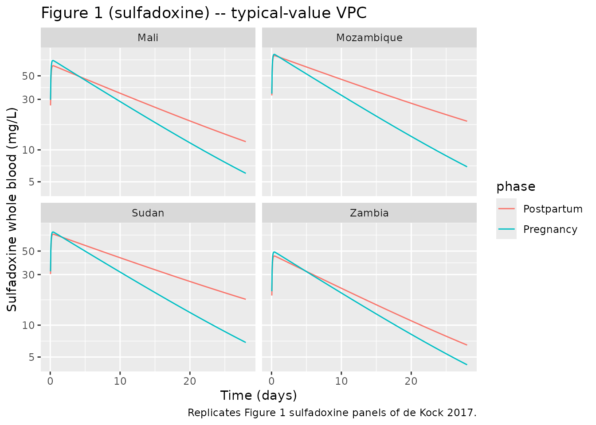
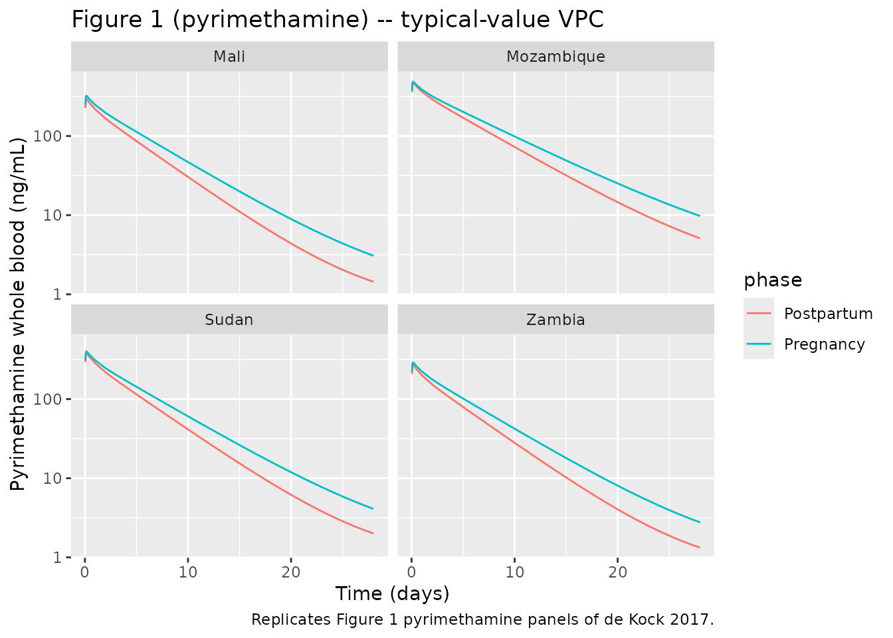
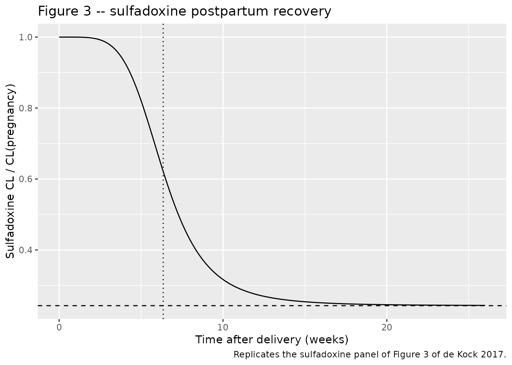

# Sulfadoxine and pyrimethamine (de Kock 2017)

## Model and source

- Citation: de Kock M, Tarning J, Workman L, Nyunt MM, Adam I, Barnes
  KI, Denti P. Pharmacokinetics of Sulfadoxine and Pyrimethamine for
  Intermittent Preventive Treatment of Malaria During Pregnancy and
  After Delivery. CPT Pharmacometrics Syst Pharmacol. 2017;6(7):430-438.
  <doi:10.1002/psp4.12181>.
- Description: Joint popPK model for the antimalarial fixed-dose
  combination of sulfadoxine (1500 mg) and pyrimethamine (75 mg) as
  intermittent preventive treatment during pregnancy (IPTp) and after
  delivery in 98 women from Mali, Mozambique, Sudan, and Zambia (de Kock
  2017). Sulfadoxine has 2-compartment disposition with first-order
  absorption; pyrimethamine has 3-compartment disposition with
  first-order absorption. Apparent volumes and flow rates are
  allometrically scaled with total body weight (exponents 1 and 0.75
  respectively, reference WT = 60 kg). Whole-blood predictions are
  derived from plasma predictions using hematocrit and an estimated
  RBC-to-plasma partition ratio per drug. Pregnancy effects on apparent
  CL differ by drug: sulfadoxine uses a sigmoidal time-after-delivery
  effect (asymptotic -75.7%, T50 = 6.35 weeks, gamma = 4.90), while
  pyrimethamine uses a step contrast (+21.2% postpartum). Pyrimethamine
  apparent CL is additionally -20.2% in the Mozambique site. Residual
  country-specific scaling on the observed whole-blood concentrations is
  fitted with Mali as the reference.
- Article: <https://doi.org/10.1002/psp4.12181>

## Population

The de Kock 2017 cohort was 98 pregnant women (98 pregnancy visits, 77
postpartum visits) enrolled across four sub-Saharan African sites: Mali
(n = 18), Mozambique (n = 31), Sudan (n = 24), and Zambia (n = 25). The
pregnancy visits were in the second or third trimester (per-site median
gestational age 27 to 28 weeks). Postpartum sampling occurred at
site-specific intervals from 6.4 weeks (Zambia) to 46 weeks
(Mozambique), as summarised in Table 1 of the paper. Per-site median
body weight ranged from 60 to 66 kg and median hemoglobin from 9.2 to
11.3 g/dL during pregnancy. Each subject received a single oral
fixed-dose tablet containing 1500 mg sulfadoxine and 75 mg pyrimethamine
during pregnancy and a second matched dose after delivery. Capillary
whole-blood samples were spotted onto filter paper, dried, and the
entire spot was extracted and analysed by LC-MS/MS (LLOQ 10 ng/mL for
pyrimethamine and 10 ug/mL for sulfadoxine).

The same information is available programmatically via the model’s
`population` metadata
(`readModelDb("deKock_2017_sulfadoxinePyrimethamine")$population`).

## Source trace

Per-parameter origin is recorded as an in-file comment alongside every
[`ini()`](https://nlmixr2.github.io/rxode2/reference/ini.html) entry in
`inst/modeldb/specificDrugs/deKock_2017_sulfadoxinePyrimethamine.R`. The
table below consolidates these for review.

| Equation / parameter | Value | Source location |
|----|----|----|
| Sulfadoxine ka | 0.531 /h | Table 2 sulfadoxine, ka |
| Sulfadoxine CL/F (during pregnancy, 60 kg) | 0.0303 L/h | Table 2 sulfadoxine, CL/F during pregnancy |
| Sulfadoxine Vc/F (60 kg) | 14.1 L | Table 2 sulfadoxine, Vc/F |
| Sulfadoxine Q/F (60 kg) | 0.0252 L/h | Table 2 sulfadoxine, Qp1/F |
| Sulfadoxine Vp/F (60 kg) | 179 L | Table 2 sulfadoxine, Vp1/F |
| Sulfadoxine F | 1 (FIXED) | Table 2 sulfadoxine, F = 1 FIXED |
| Pyrimethamine ka | 1.31 /h | Table 2 pyrimethamine, ka |
| Pyrimethamine CL/F (during pregnancy, 60 kg) | 1.35 L/h | Table 2 pyrimethamine, CL/F during pregnancy |
| Pyrimethamine Vc/F (60 kg) | 163 L | Table 2 pyrimethamine, Vc/F |
| Pyrimethamine Q/F (60 kg) | 1.45 L/h | Table 2 pyrimethamine, Qp1/F |
| Pyrimethamine Vp/F (60 kg) | 29.8 L | Table 2 pyrimethamine, Vp1/F |
| Pyrimethamine Q2/F (60 kg) | 0.122 L/h | Table 2 pyrimethamine, Qp2/F |
| Pyrimethamine Vp2/F (60 kg) | 251 L | Table 2 pyrimethamine, Vp2/F |
| Pyrimethamine F | 1 (FIXED) | Table 2 pyrimethamine, F = 1 FIXED |
| Sulfadoxine hRBC/PL | 0.155 | Table 2 sulfadoxine, hRBC/PL |
| Pyrimethamine hRBC/PL | 0.324 | Table 2 pyrimethamine, hRBC/PL |
| Sulfadoxine sigmoid: asymptotic dCL | -0.757 | Table 2 sulfadoxine, Change in CL when non-pregnant |
| Sulfadoxine sigmoid: T50 | 6.35 weeks | Table 2 sulfadoxine, T50 |
| Sulfadoxine sigmoid: gamma | 4.90 | Table 2 sulfadoxine, gamma (post-delivery effect shape) |
| Pyrimethamine pregnancy step on CL | +0.212 | Table 2 pyrimethamine, Change in CL when non-pregnant |
| Pyrimethamine Mozambique CL effect | -0.202 | Table 2 pyrimethamine, Difference in clearance in Mozambique |
| Sulfa observation scaling, Mozambique | +0.212 | Table 2 sulfadoxine, Site effect (scaling on observations), MZ |
| Sulfa observation scaling, Sudan | +0.155 | Table 2 sulfadoxine, Site effect (scaling on observations), SD |
| Sulfa observation scaling, Zambia | -0.248 | Table 2 sulfadoxine, Site effect (scaling on observations), ZM |
| Pyra observation scaling, Mozambique | +0.576 | Table 2 pyrimethamine, Site effect (scaling on observations), MZ |
| Pyra observation scaling, Sudan | +0.332 | Table 2 pyrimethamine, Site effect (scaling on observations), SD |
| Pyra observation scaling, Zambia | -0.054 | Table 2 pyrimethamine, Site effect (scaling on observations), ZM |
| BSV CL sulfa | 31.3% CV | Table 2 sulfadoxine, BSV in CL |
| BOV ka sulfa | 56.4% CV | Table 2 sulfadoxine, BOV in ka |
| BSV CL pyra | 12.3% CV | Table 2 pyrimethamine, BSV in CL |
| BOV F (correlated across drugs) | 20.7% / 17.6% CV, r=0.677 | Table 2, BOV in F and Correlation in bioavailability of the two drugs |
| Proportional residual sulfa | 0.170 | Table 2 sulfadoxine, Proportional error |
| Additive residual sulfa | 2.13 ug/mL | Table 2 sulfadoxine, Additive error |
| Proportional residual pyra | 0.180 | Table 2 pyrimethamine, Proportional error |
| Additive residual pyra | 2.45 ng/mL | Table 2 pyrimethamine, Additive error |
| Whole-blood to plasma formula | n/a | Methods, Eq. 2 (`CWB = CPL * (HCT * hRBC_PL + (1 - HCT))`) |
| Sulfa 2-cmt ODE | n/a | Methods, structural model |
| Pyra 3-cmt ODE | n/a | Methods, structural model |

## Virtual cohort

Original observed data are not publicly available. The virtual
population mirrors the per-site composition described in Table 1 of de
Kock 2017: weights centred on each site’s median and hematocrits derived
from each site’s median hemoglobin via HCT ~= 0.0375 \* HGB + 0.0079
(Lee 2008 formula referenced in the paper). For each site we simulate
matched pregnancy and postpartum visits.

``` r

set.seed(20260518)

# Per-site demographics from Table 1.
site_table <- tibble::tribble(
  ~site,         ~mz, ~sd, ~zm, ~n_preg, ~n_pp, ~wt_med, ~hgb_preg, ~hgb_pp, ~tpp_med,
  "Mali",        0L,  0L,  0L,  18L,     18L,   60,      9.9,       12.4,    8.3,
  "Mozambique",  1L,  0L,  0L,  31L,     22L,   61,      10.8,      11.6,    46,
  "Sudan",       0L,  1L,  0L,  24L,     9L,    66,      9.2,       10.5,    15,
  "Zambia",      0L,  0L,  1L,  25L,     18L,   60,      11.3,      13.1,    6.4
)

# Pre-defined observation grid (28 days post-dose, sampled hourly for the
# first 12 h then daily) -- matches the analytical-density pattern in the
# paper's sampling schedule.
obs_times_h <- c(seq(0, 12, by = 1), 24, 48, 72, 24 * (4:28))

make_cohort <- function(n, wt_med, hgb, preg, tpp_wk, region_mz, region_sd, region_zm,
                        site_label, id_offset) {
  ids <- id_offset + seq_len(n)
  # Doses: one sulfadoxine and one pyrimethamine event per subject at time 0
  dosing <- tidyr::expand_grid(id = ids, time = 0) |>
    dplyr::mutate(
      sulfa = list(tibble::tibble(amt = 1500, cmt = "depot", evid = 1L)),
      pyra  = list(tibble::tibble(amt = 75,   cmt = "depot_pyra", evid = 1L))
    )
  dose_rows <- dplyr::bind_rows(
    dosing |> tidyr::unnest(sulfa) |> dplyr::select(-pyra),
    dosing |> tidyr::unnest(pyra)  |> dplyr::select(-sulfa)
  )
  # Observation rows: one per output, at each obs time
  obs_rows <- tidyr::expand_grid(id = ids, time = obs_times_h,
                                 cmt = c("Cc", "Cc_pyra")) |>
    dplyr::mutate(amt = 0, evid = 0L)
  ev <- dplyr::bind_rows(dose_rows, obs_rows) |>
    dplyr::arrange(id, time, evid)
  ev$WT  <- wt_med
  # HCT from HGB via the Lee 2008 formula (paper Eq. 1):
  # HCT = 0.0375 * HGB + 0.0079
  ev$HCT <- 0.0375 * hgb + 0.0079
  ev$PREG <- as.integer(preg)
  ev$TPP  <- if (preg) 0 else tpp_wk
  ev$REGION_MOZAMBIQUE <- as.integer(region_mz)
  ev$REGION_SUDAN      <- as.integer(region_sd)
  ev$REGION_ZAMBIA     <- as.integer(region_zm)
  ev$site  <- site_label
  ev$phase <- if (preg) "Pregnancy" else "Postpartum"
  ev
}

id_seed <- 0L
cohort_list <- list()
for (i in seq_len(nrow(site_table))) {
  r <- site_table[i, ]
  cohort_list[[length(cohort_list) + 1L]] <- make_cohort(
    n = r$n_preg, wt_med = r$wt_med, hgb = r$hgb_preg, preg = TRUE,
    tpp_wk = 0, region_mz = r$mz, region_sd = r$sd, region_zm = r$zm,
    site_label = r$site, id_offset = id_seed
  )
  id_seed <- id_seed + r$n_preg
  cohort_list[[length(cohort_list) + 1L]] <- make_cohort(
    n = r$n_pp, wt_med = r$wt_med, hgb = r$hgb_pp, preg = FALSE,
    tpp_wk = r$tpp_med, region_mz = r$mz, region_sd = r$sd, region_zm = r$zm,
    site_label = r$site, id_offset = id_seed
  )
  id_seed <- id_seed + r$n_pp
}
events <- dplyr::bind_rows(cohort_list)

stopifnot(!anyDuplicated(unique(events[, c("id", "time", "evid", "cmt")])))
```

## Simulation

The model includes a 2x2 correlated BOV block on F across drugs plus
log-normal BSV / BOV terms on CL and ka; the package distribution
therefore returns realistic between-subject variability for VPC
purposes. For typical-value replication of Figure 1 we zero out the
random effects.

``` r

mod <- readModelDb("deKock_2017_sulfadoxinePyrimethamine")
mod_typical <- rxode2::zeroRe(mod)
sim_typical <- rxode2::rxSolve(
  mod_typical, events = events,
  keep = c("site", "phase")
) |>
  as.data.frame()
#> ℹ omega/sigma items treated as zero: 'etalcl', 'etalka', 'etalcl_pyra', 'etalfdepot', 'etalfdepot_pyra'
#> Warning: multi-subject simulation without without 'omega'
```

## Replicate published figures

### Figure 1 – typical-value concentration-time curves by site and phase

The two panels below mirror the structure of Figure 1 of the paper,
plotting typical-value whole-blood concentrations for sulfadoxine and
pyrimethamine at each site, stratified by pregnancy vs postpartum visit.

``` r

sim_obs <- sim_typical |>
  dplyr::filter(time > 0)

sim_obs |>
  dplyr::group_by(time, site, phase) |>
  dplyr::summarise(Cc_typical = unique(Cc)[1L], .groups = "drop") |>
  ggplot(aes(time / 24, Cc_typical, colour = phase)) +
  geom_line() +
  facet_wrap(~site) +
  scale_y_log10() +
  labs(x = "Time (days)", y = "Sulfadoxine whole blood (mg/L)",
       title = "Figure 1 (sulfadoxine) -- typical-value VPC",
       caption = "Replicates Figure 1 sulfadoxine panels of de Kock 2017.")
```



``` r

sim_obs |>
  dplyr::group_by(time, site, phase) |>
  dplyr::summarise(Cc_pyra_typical = unique(Cc_pyra)[1L], .groups = "drop") |>
  ggplot(aes(time / 24, Cc_pyra_typical, colour = phase)) +
  geom_line() +
  facet_wrap(~site) +
  scale_y_log10() +
  labs(x = "Time (days)", y = "Pyrimethamine whole blood (ng/mL)",
       title = "Figure 1 (pyrimethamine) -- typical-value VPC",
       caption = "Replicates Figure 1 pyrimethamine panels of de Kock 2017.")
```



### Figure 3 – sulfadoxine pregnancy effect vs. time after delivery

Figure 3 of the paper plots the sigmoidal recovery of sulfadoxine CL
from its pregnancy value over the weeks after delivery. We reproduce the
typical-value curve directly from the model parameters.

``` r

tpp_grid <- seq(0, 26, by = 0.1)
gamma_t  <- 4.90
t50_t    <- 6.35
delta_cl <- -0.757
cl_ratio <- 1 + delta_cl * tpp_grid^gamma_t / (tpp_grid^gamma_t + t50_t^gamma_t)

tibble::tibble(TPP = tpp_grid, CL_ratio = cl_ratio) |>
  ggplot(aes(TPP, CL_ratio)) +
  geom_line() +
  geom_hline(yintercept = 1 + delta_cl, linetype = "dashed") +
  geom_vline(xintercept = t50_t, linetype = "dotted") +
  labs(x = "Time after delivery (weeks)",
       y = "Sulfadoxine CL / CL(pregnancy)",
       title = "Figure 3 -- sulfadoxine postpartum recovery",
       caption = "Replicates the sulfadoxine panel of Figure 3 of de Kock 2017.")
```



## PKNCA validation

We compute non-compartmental Cmax, Tmax, and AUCinf for each drug,
stratified by site and phase, and compare to the per-site post-hoc
summaries in Table 3 of the paper.

``` r

sim_nca_sulfa <- sim_typical |>
  dplyr::filter(time > 0) |>
  dplyr::transmute(id = id, time = time, Cc = Cc,
                   site = site, phase = phase) |>
  dplyr::distinct(id, time, site, phase, .keep_all = TRUE)
conc_sulfa <- PKNCA::PKNCAconc(sim_nca_sulfa,
                               Cc ~ time | site + phase + id)

dose_df <- events |>
  dplyr::filter(evid == 1, cmt == "depot") |>
  dplyr::distinct(id, time, amt, site, phase)
dose_sulfa <- PKNCA::PKNCAdose(dose_df, amt ~ time | site + phase + id)

intervals <- data.frame(start = 0, end = 28 * 24,
                        cmax = TRUE, tmax = TRUE, aucinf.obs = TRUE)
nca_sulfa <- PKNCA::pk.nca(PKNCA::PKNCAdata(conc_sulfa, dose_sulfa,
                                            intervals = intervals))
#> Warning: Requesting an AUC range starting (0) before the first measurement (1) is not allowed
#> Requesting an AUC range starting (0) before the first measurement (1) is not allowed
#> Requesting an AUC range starting (0) before the first measurement (1) is not allowed
#> Requesting an AUC range starting (0) before the first measurement (1) is not allowed
#> Requesting an AUC range starting (0) before the first measurement (1) is not allowed
#> Requesting an AUC range starting (0) before the first measurement (1) is not allowed
#> Requesting an AUC range starting (0) before the first measurement (1) is not allowed
#> Requesting an AUC range starting (0) before the first measurement (1) is not allowed
#> Requesting an AUC range starting (0) before the first measurement (1) is not allowed
#> Requesting an AUC range starting (0) before the first measurement (1) is not allowed
#> Requesting an AUC range starting (0) before the first measurement (1) is not allowed
#> Requesting an AUC range starting (0) before the first measurement (1) is not allowed
#> Requesting an AUC range starting (0) before the first measurement (1) is not allowed
#> Requesting an AUC range starting (0) before the first measurement (1) is not allowed
#> Requesting an AUC range starting (0) before the first measurement (1) is not allowed
#> Requesting an AUC range starting (0) before the first measurement (1) is not allowed
#> Requesting an AUC range starting (0) before the first measurement (1) is not allowed
#> Requesting an AUC range starting (0) before the first measurement (1) is not allowed
#> Requesting an AUC range starting (0) before the first measurement (1) is not allowed
#> Requesting an AUC range starting (0) before the first measurement (1) is not allowed
#> Requesting an AUC range starting (0) before the first measurement (1) is not allowed
#> Requesting an AUC range starting (0) before the first measurement (1) is not allowed
#> Requesting an AUC range starting (0) before the first measurement (1) is not allowed
#> Requesting an AUC range starting (0) before the first measurement (1) is not allowed
#> Requesting an AUC range starting (0) before the first measurement (1) is not allowed
#> Requesting an AUC range starting (0) before the first measurement (1) is not allowed
#> Requesting an AUC range starting (0) before the first measurement (1) is not allowed
#> Requesting an AUC range starting (0) before the first measurement (1) is not allowed
#> Requesting an AUC range starting (0) before the first measurement (1) is not allowed
#> Requesting an AUC range starting (0) before the first measurement (1) is not allowed
#> Requesting an AUC range starting (0) before the first measurement (1) is not allowed
#> Requesting an AUC range starting (0) before the first measurement (1) is not allowed
#> Requesting an AUC range starting (0) before the first measurement (1) is not allowed
#> Requesting an AUC range starting (0) before the first measurement (1) is not allowed
#> Requesting an AUC range starting (0) before the first measurement (1) is not allowed
#> Requesting an AUC range starting (0) before the first measurement (1) is not allowed
#> Requesting an AUC range starting (0) before the first measurement (1) is not allowed
#> Requesting an AUC range starting (0) before the first measurement (1) is not allowed
#> Requesting an AUC range starting (0) before the first measurement (1) is not allowed
#> Requesting an AUC range starting (0) before the first measurement (1) is not allowed
#> Requesting an AUC range starting (0) before the first measurement (1) is not allowed
#> Requesting an AUC range starting (0) before the first measurement (1) is not allowed
#> Requesting an AUC range starting (0) before the first measurement (1) is not allowed
#> Requesting an AUC range starting (0) before the first measurement (1) is not allowed
#> Requesting an AUC range starting (0) before the first measurement (1) is not allowed
#> Requesting an AUC range starting (0) before the first measurement (1) is not allowed
#> Requesting an AUC range starting (0) before the first measurement (1) is not allowed
#> Requesting an AUC range starting (0) before the first measurement (1) is not allowed
#> Requesting an AUC range starting (0) before the first measurement (1) is not allowed
#> Requesting an AUC range starting (0) before the first measurement (1) is not allowed
#> Requesting an AUC range starting (0) before the first measurement (1) is not allowed
#> Requesting an AUC range starting (0) before the first measurement (1) is not allowed
#>  ■■■■■■■■■■                        32% |  ETA:  3s
#> Warning: Requesting an AUC range starting (0) before the first measurement (1) is not allowed
#> Requesting an AUC range starting (0) before the first measurement (1) is not allowed
#> Requesting an AUC range starting (0) before the first measurement (1) is not allowed
#> Requesting an AUC range starting (0) before the first measurement (1) is not allowed
#> Requesting an AUC range starting (0) before the first measurement (1) is not allowed
#> Requesting an AUC range starting (0) before the first measurement (1) is not allowed
#> Requesting an AUC range starting (0) before the first measurement (1) is not allowed
#> Requesting an AUC range starting (0) before the first measurement (1) is not allowed
#> Requesting an AUC range starting (0) before the first measurement (1) is not allowed
#> Requesting an AUC range starting (0) before the first measurement (1) is not allowed
#> Requesting an AUC range starting (0) before the first measurement (1) is not allowed
#> Requesting an AUC range starting (0) before the first measurement (1) is not allowed
#> Requesting an AUC range starting (0) before the first measurement (1) is not allowed
#> Requesting an AUC range starting (0) before the first measurement (1) is not allowed
#> Requesting an AUC range starting (0) before the first measurement (1) is not allowed
#> Requesting an AUC range starting (0) before the first measurement (1) is not allowed
#> Requesting an AUC range starting (0) before the first measurement (1) is not allowed
#> Requesting an AUC range starting (0) before the first measurement (1) is not allowed
#> Requesting an AUC range starting (0) before the first measurement (1) is not allowed
#> Requesting an AUC range starting (0) before the first measurement (1) is not allowed
#> Requesting an AUC range starting (0) before the first measurement (1) is not allowed
#> Requesting an AUC range starting (0) before the first measurement (1) is not allowed
#> Requesting an AUC range starting (0) before the first measurement (1) is not allowed
#> Requesting an AUC range starting (0) before the first measurement (1) is not allowed
#> Requesting an AUC range starting (0) before the first measurement (1) is not allowed
#> Requesting an AUC range starting (0) before the first measurement (1) is not allowed
#> Requesting an AUC range starting (0) before the first measurement (1) is not allowed
#> Requesting an AUC range starting (0) before the first measurement (1) is not allowed
#> Requesting an AUC range starting (0) before the first measurement (1) is not allowed
#> Requesting an AUC range starting (0) before the first measurement (1) is not allowed
#> Requesting an AUC range starting (0) before the first measurement (1) is not allowed
#> Requesting an AUC range starting (0) before the first measurement (1) is not allowed
#> Requesting an AUC range starting (0) before the first measurement (1) is not allowed
#> Requesting an AUC range starting (0) before the first measurement (1) is not allowed
#> Requesting an AUC range starting (0) before the first measurement (1) is not allowed
#> Requesting an AUC range starting (0) before the first measurement (1) is not allowed
#> Requesting an AUC range starting (0) before the first measurement (1) is not allowed
#> Requesting an AUC range starting (0) before the first measurement (1) is not allowed
#> Requesting an AUC range starting (0) before the first measurement (1) is not allowed
#> Requesting an AUC range starting (0) before the first measurement (1) is not allowed
#> Requesting an AUC range starting (0) before the first measurement (1) is not allowed
#> Requesting an AUC range starting (0) before the first measurement (1) is not allowed
#> Requesting an AUC range starting (0) before the first measurement (1) is not allowed
#> Requesting an AUC range starting (0) before the first measurement (1) is not allowed
#> Requesting an AUC range starting (0) before the first measurement (1) is not allowed
#> Requesting an AUC range starting (0) before the first measurement (1) is not allowed
#> Requesting an AUC range starting (0) before the first measurement (1) is not allowed
#> Requesting an AUC range starting (0) before the first measurement (1) is not allowed
#> Requesting an AUC range starting (0) before the first measurement (1) is not allowed
#> Requesting an AUC range starting (0) before the first measurement (1) is not allowed
#> Requesting an AUC range starting (0) before the first measurement (1) is not allowed
#> Requesting an AUC range starting (0) before the first measurement (1) is not allowed
#> Requesting an AUC range starting (0) before the first measurement (1) is not allowed
#> Requesting an AUC range starting (0) before the first measurement (1) is not allowed
#> Requesting an AUC range starting (0) before the first measurement (1) is not allowed
#> Requesting an AUC range starting (0) before the first measurement (1) is not allowed
#> Requesting an AUC range starting (0) before the first measurement (1) is not allowed
#> Requesting an AUC range starting (0) before the first measurement (1) is not allowed
#> Requesting an AUC range starting (0) before the first measurement (1) is not allowed
#> Requesting an AUC range starting (0) before the first measurement (1) is not allowed
#> Requesting an AUC range starting (0) before the first measurement (1) is not allowed
#> Requesting an AUC range starting (0) before the first measurement (1) is not allowed
#> Requesting an AUC range starting (0) before the first measurement (1) is not allowed
#> Requesting an AUC range starting (0) before the first measurement (1) is not allowed
#> Requesting an AUC range starting (0) before the first measurement (1) is not allowed
#> Requesting an AUC range starting (0) before the first measurement (1) is not allowed
#> Requesting an AUC range starting (0) before the first measurement (1) is not allowed
#> Requesting an AUC range starting (0) before the first measurement (1) is not allowed
#> Requesting an AUC range starting (0) before the first measurement (1) is not allowed
#> Requesting an AUC range starting (0) before the first measurement (1) is not allowed
#> Requesting an AUC range starting (0) before the first measurement (1) is not allowed
#> Requesting an AUC range starting (0) before the first measurement (1) is not allowed
#> Requesting an AUC range starting (0) before the first measurement (1) is not allowed
#> Requesting an AUC range starting (0) before the first measurement (1) is not allowed
#> Requesting an AUC range starting (0) before the first measurement (1) is not allowed
#> Requesting an AUC range starting (0) before the first measurement (1) is not allowed
#> Requesting an AUC range starting (0) before the first measurement (1) is not allowed
#> Requesting an AUC range starting (0) before the first measurement (1) is not allowed
#> Requesting an AUC range starting (0) before the first measurement (1) is not allowed
#> Requesting an AUC range starting (0) before the first measurement (1) is not allowed
#> Requesting an AUC range starting (0) before the first measurement (1) is not allowed
#> Requesting an AUC range starting (0) before the first measurement (1) is not allowed
#> Requesting an AUC range starting (0) before the first measurement (1) is not allowed
#> Requesting an AUC range starting (0) before the first measurement (1) is not allowed
#> Requesting an AUC range starting (0) before the first measurement (1) is not allowed
#> Requesting an AUC range starting (0) before the first measurement (1) is not allowed
#> Requesting an AUC range starting (0) before the first measurement (1) is not allowed
#> Requesting an AUC range starting (0) before the first measurement (1) is not allowed
#> Requesting an AUC range starting (0) before the first measurement (1) is not allowed
#> Requesting an AUC range starting (0) before the first measurement (1) is not allowed
#> Requesting an AUC range starting (0) before the first measurement (1) is not allowed
#> Requesting an AUC range starting (0) before the first measurement (1) is not allowed
#> Requesting an AUC range starting (0) before the first measurement (1) is not allowed
#> Requesting an AUC range starting (0) before the first measurement (1) is not allowed
#> Requesting an AUC range starting (0) before the first measurement (1) is not allowed
#> Requesting an AUC range starting (0) before the first measurement (1) is not allowed
#> Requesting an AUC range starting (0) before the first measurement (1) is not allowed
#> Requesting an AUC range starting (0) before the first measurement (1) is not allowed
#> Requesting an AUC range starting (0) before the first measurement (1) is not allowed
#> Requesting an AUC range starting (0) before the first measurement (1) is not allowed
#> Requesting an AUC range starting (0) before the first measurement (1) is not allowed
#> Requesting an AUC range starting (0) before the first measurement (1) is not allowed
#> Requesting an AUC range starting (0) before the first measurement (1) is not allowed
#> Requesting an AUC range starting (0) before the first measurement (1) is not allowed
#> Requesting an AUC range starting (0) before the first measurement (1) is not allowed
#> Requesting an AUC range starting (0) before the first measurement (1) is not allowed
#> Requesting an AUC range starting (0) before the first measurement (1) is not allowed
#> Requesting an AUC range starting (0) before the first measurement (1) is not allowed
#> Requesting an AUC range starting (0) before the first measurement (1) is not allowed
#>  ■■■■■■■■■■■■■■■■■■■■■■■■■■■■■■    98% |  ETA:  0s
#> Warning: Requesting an AUC range starting (0) before the first measurement (1) is not allowed
#> Requesting an AUC range starting (0) before the first measurement (1) is not allowed
#> Requesting an AUC range starting (0) before the first measurement (1) is not allowed
#> Requesting an AUC range starting (0) before the first measurement (1) is not allowed

nca_sulfa_summary <- as.data.frame(nca_sulfa$result) |>
  dplyr::filter(PPTESTCD %in% c("cmax", "tmax", "aucinf.obs")) |>
  dplyr::group_by(site, phase, PPTESTCD) |>
  dplyr::summarise(value = stats::median(PPORRES, na.rm = TRUE), .groups = "drop") |>
  tidyr::pivot_wider(names_from = PPTESTCD, values_from = value) |>
  dplyr::mutate(cmax = round(cmax, 1),
                tmax = round(tmax, 2),
                aucinf = round(aucinf.obs, 0)) |>
  dplyr::select(site, phase, cmax, tmax, aucinf)
knitr::kable(nca_sulfa_summary, caption = "Simulated sulfadoxine NCA (whole blood) by site and phase.")
```

| site       | phase      | cmax | tmax | aucinf |
|:-----------|:-----------|-----:|-----:|-------:|
| Mali       | Postpartum | 62.2 |   10 |     NA |
| Mali       | Pregnancy  | 69.7 |    9 |     NA |
| Mozambique | Postpartum | 77.5 |   10 |     NA |
| Mozambique | Pregnancy  | 79.6 |    9 |     NA |
| Sudan      | Postpartum | 72.1 |   10 |     NA |
| Sudan      | Pregnancy  | 75.6 |    9 |     NA |
| Zambia     | Postpartum | 44.9 |   10 |     NA |
| Zambia     | Pregnancy  | 49.0 |    9 |     NA |

Simulated sulfadoxine NCA (whole blood) by site and phase. {.table}

``` r

sim_nca_pyra <- sim_typical |>
  dplyr::filter(time > 0) |>
  dplyr::transmute(id = id, time = time, Cc_pyra = Cc_pyra,
                   site = site, phase = phase) |>
  dplyr::distinct(id, time, site, phase, .keep_all = TRUE)
conc_pyra <- PKNCA::PKNCAconc(sim_nca_pyra,
                              Cc_pyra ~ time | site + phase + id)

dose_pyra_df <- events |>
  dplyr::filter(evid == 1, cmt == "depot_pyra") |>
  dplyr::distinct(id, time, amt, site, phase)
dose_pyra <- PKNCA::PKNCAdose(dose_pyra_df, amt ~ time | site + phase + id)

nca_pyra <- PKNCA::pk.nca(PKNCA::PKNCAdata(conc_pyra, dose_pyra,
                                           intervals = intervals))
#> Warning: Requesting an AUC range starting (0) before the first measurement (1) is not allowed
#> Requesting an AUC range starting (0) before the first measurement (1) is not allowed
#> Requesting an AUC range starting (0) before the first measurement (1) is not allowed
#> Requesting an AUC range starting (0) before the first measurement (1) is not allowed
#> Requesting an AUC range starting (0) before the first measurement (1) is not allowed
#> Requesting an AUC range starting (0) before the first measurement (1) is not allowed
#> Requesting an AUC range starting (0) before the first measurement (1) is not allowed
#> Requesting an AUC range starting (0) before the first measurement (1) is not allowed
#> Requesting an AUC range starting (0) before the first measurement (1) is not allowed
#> Requesting an AUC range starting (0) before the first measurement (1) is not allowed
#> Requesting an AUC range starting (0) before the first measurement (1) is not allowed
#> Requesting an AUC range starting (0) before the first measurement (1) is not allowed
#> Requesting an AUC range starting (0) before the first measurement (1) is not allowed
#> Requesting an AUC range starting (0) before the first measurement (1) is not allowed
#> Requesting an AUC range starting (0) before the first measurement (1) is not allowed
#> Requesting an AUC range starting (0) before the first measurement (1) is not allowed
#> Requesting an AUC range starting (0) before the first measurement (1) is not allowed
#> Requesting an AUC range starting (0) before the first measurement (1) is not allowed
#> Requesting an AUC range starting (0) before the first measurement (1) is not allowed
#> Requesting an AUC range starting (0) before the first measurement (1) is not allowed
#> Requesting an AUC range starting (0) before the first measurement (1) is not allowed
#> Requesting an AUC range starting (0) before the first measurement (1) is not allowed
#> Requesting an AUC range starting (0) before the first measurement (1) is not allowed
#> Requesting an AUC range starting (0) before the first measurement (1) is not allowed
#> Requesting an AUC range starting (0) before the first measurement (1) is not allowed
#> Requesting an AUC range starting (0) before the first measurement (1) is not allowed
#> Requesting an AUC range starting (0) before the first measurement (1) is not allowed
#> Requesting an AUC range starting (0) before the first measurement (1) is not allowed
#> Requesting an AUC range starting (0) before the first measurement (1) is not allowed
#> Requesting an AUC range starting (0) before the first measurement (1) is not allowed
#> Requesting an AUC range starting (0) before the first measurement (1) is not allowed
#> Requesting an AUC range starting (0) before the first measurement (1) is not allowed
#> Requesting an AUC range starting (0) before the first measurement (1) is not allowed
#> Requesting an AUC range starting (0) before the first measurement (1) is not allowed
#> Requesting an AUC range starting (0) before the first measurement (1) is not allowed
#> Requesting an AUC range starting (0) before the first measurement (1) is not allowed
#> Requesting an AUC range starting (0) before the first measurement (1) is not allowed
#> Requesting an AUC range starting (0) before the first measurement (1) is not allowed
#> Requesting an AUC range starting (0) before the first measurement (1) is not allowed
#> Requesting an AUC range starting (0) before the first measurement (1) is not allowed
#> Requesting an AUC range starting (0) before the first measurement (1) is not allowed
#> Requesting an AUC range starting (0) before the first measurement (1) is not allowed
#> Requesting an AUC range starting (0) before the first measurement (1) is not allowed
#> Requesting an AUC range starting (0) before the first measurement (1) is not allowed
#> Requesting an AUC range starting (0) before the first measurement (1) is not allowed
#> Requesting an AUC range starting (0) before the first measurement (1) is not allowed
#> Requesting an AUC range starting (0) before the first measurement (1) is not allowed
#> Requesting an AUC range starting (0) before the first measurement (1) is not allowed
#> Requesting an AUC range starting (0) before the first measurement (1) is not allowed
#> Requesting an AUC range starting (0) before the first measurement (1) is not allowed
#> Requesting an AUC range starting (0) before the first measurement (1) is not allowed
#> Requesting an AUC range starting (0) before the first measurement (1) is not allowed
#> Requesting an AUC range starting (0) before the first measurement (1) is not allowed
#> Requesting an AUC range starting (0) before the first measurement (1) is not allowed
#> Requesting an AUC range starting (0) before the first measurement (1) is not allowed
#> Requesting an AUC range starting (0) before the first measurement (1) is not allowed
#> Requesting an AUC range starting (0) before the first measurement (1) is not allowed
#> Requesting an AUC range starting (0) before the first measurement (1) is not allowed
#> Requesting an AUC range starting (0) before the first measurement (1) is not allowed
#> Requesting an AUC range starting (0) before the first measurement (1) is not allowed
#> Requesting an AUC range starting (0) before the first measurement (1) is not allowed
#> Requesting an AUC range starting (0) before the first measurement (1) is not allowed
#> Requesting an AUC range starting (0) before the first measurement (1) is not allowed
#> Requesting an AUC range starting (0) before the first measurement (1) is not allowed
#> Requesting an AUC range starting (0) before the first measurement (1) is not allowed
#> Requesting an AUC range starting (0) before the first measurement (1) is not allowed
#> Requesting an AUC range starting (0) before the first measurement (1) is not allowed
#> Requesting an AUC range starting (0) before the first measurement (1) is not allowed
#> Requesting an AUC range starting (0) before the first measurement (1) is not allowed
#> Requesting an AUC range starting (0) before the first measurement (1) is not allowed
#> Requesting an AUC range starting (0) before the first measurement (1) is not allowed
#> Requesting an AUC range starting (0) before the first measurement (1) is not allowed
#> Requesting an AUC range starting (0) before the first measurement (1) is not allowed
#> Requesting an AUC range starting (0) before the first measurement (1) is not allowed
#> Requesting an AUC range starting (0) before the first measurement (1) is not allowed
#> Requesting an AUC range starting (0) before the first measurement (1) is not allowed
#> Requesting an AUC range starting (0) before the first measurement (1) is not allowed
#> Requesting an AUC range starting (0) before the first measurement (1) is not allowed
#> Requesting an AUC range starting (0) before the first measurement (1) is not allowed
#> Requesting an AUC range starting (0) before the first measurement (1) is not allowed
#> Requesting an AUC range starting (0) before the first measurement (1) is not allowed
#> Requesting an AUC range starting (0) before the first measurement (1) is not allowed
#> Requesting an AUC range starting (0) before the first measurement (1) is not allowed
#> Requesting an AUC range starting (0) before the first measurement (1) is not allowed
#> Requesting an AUC range starting (0) before the first measurement (1) is not allowed
#> Requesting an AUC range starting (0) before the first measurement (1) is not allowed
#>  ■■■■■■■■■■■■■■■■■                 52% |  ETA:  2s
#> Warning: Requesting an AUC range starting (0) before the first measurement (1) is not allowed
#> Requesting an AUC range starting (0) before the first measurement (1) is not allowed
#> Requesting an AUC range starting (0) before the first measurement (1) is not allowed
#> Requesting an AUC range starting (0) before the first measurement (1) is not allowed
#> Requesting an AUC range starting (0) before the first measurement (1) is not allowed
#> Requesting an AUC range starting (0) before the first measurement (1) is not allowed
#> Requesting an AUC range starting (0) before the first measurement (1) is not allowed
#> Requesting an AUC range starting (0) before the first measurement (1) is not allowed
#> Requesting an AUC range starting (0) before the first measurement (1) is not allowed
#> Requesting an AUC range starting (0) before the first measurement (1) is not allowed
#> Requesting an AUC range starting (0) before the first measurement (1) is not allowed
#> Requesting an AUC range starting (0) before the first measurement (1) is not allowed
#> Requesting an AUC range starting (0) before the first measurement (1) is not allowed
#> Requesting an AUC range starting (0) before the first measurement (1) is not allowed
#> Requesting an AUC range starting (0) before the first measurement (1) is not allowed
#> Requesting an AUC range starting (0) before the first measurement (1) is not allowed
#> Requesting an AUC range starting (0) before the first measurement (1) is not allowed
#> Requesting an AUC range starting (0) before the first measurement (1) is not allowed
#> Requesting an AUC range starting (0) before the first measurement (1) is not allowed
#> Requesting an AUC range starting (0) before the first measurement (1) is not allowed
#> Requesting an AUC range starting (0) before the first measurement (1) is not allowed
#> Requesting an AUC range starting (0) before the first measurement (1) is not allowed
#> Requesting an AUC range starting (0) before the first measurement (1) is not allowed
#> Requesting an AUC range starting (0) before the first measurement (1) is not allowed
#> Requesting an AUC range starting (0) before the first measurement (1) is not allowed
#> Requesting an AUC range starting (0) before the first measurement (1) is not allowed
#> Requesting an AUC range starting (0) before the first measurement (1) is not allowed
#> Requesting an AUC range starting (0) before the first measurement (1) is not allowed
#> Requesting an AUC range starting (0) before the first measurement (1) is not allowed
#> Requesting an AUC range starting (0) before the first measurement (1) is not allowed
#> Requesting an AUC range starting (0) before the first measurement (1) is not allowed
#> Requesting an AUC range starting (0) before the first measurement (1) is not allowed
#> Requesting an AUC range starting (0) before the first measurement (1) is not allowed
#> Requesting an AUC range starting (0) before the first measurement (1) is not allowed
#> Requesting an AUC range starting (0) before the first measurement (1) is not allowed
#> Requesting an AUC range starting (0) before the first measurement (1) is not allowed
#> Requesting an AUC range starting (0) before the first measurement (1) is not allowed
#> Requesting an AUC range starting (0) before the first measurement (1) is not allowed
#> Requesting an AUC range starting (0) before the first measurement (1) is not allowed
#> Requesting an AUC range starting (0) before the first measurement (1) is not allowed
#> Requesting an AUC range starting (0) before the first measurement (1) is not allowed
#> Requesting an AUC range starting (0) before the first measurement (1) is not allowed
#> Requesting an AUC range starting (0) before the first measurement (1) is not allowed
#> Requesting an AUC range starting (0) before the first measurement (1) is not allowed
#> Requesting an AUC range starting (0) before the first measurement (1) is not allowed
#> Requesting an AUC range starting (0) before the first measurement (1) is not allowed
#> Requesting an AUC range starting (0) before the first measurement (1) is not allowed
#> Requesting an AUC range starting (0) before the first measurement (1) is not allowed
#> Requesting an AUC range starting (0) before the first measurement (1) is not allowed
#> Requesting an AUC range starting (0) before the first measurement (1) is not allowed
#> Requesting an AUC range starting (0) before the first measurement (1) is not allowed
#> Requesting an AUC range starting (0) before the first measurement (1) is not allowed
#> Requesting an AUC range starting (0) before the first measurement (1) is not allowed
#> Requesting an AUC range starting (0) before the first measurement (1) is not allowed
#> Requesting an AUC range starting (0) before the first measurement (1) is not allowed
#> Requesting an AUC range starting (0) before the first measurement (1) is not allowed
#> Requesting an AUC range starting (0) before the first measurement (1) is not allowed
#> Requesting an AUC range starting (0) before the first measurement (1) is not allowed
#> Requesting an AUC range starting (0) before the first measurement (1) is not allowed
#> Requesting an AUC range starting (0) before the first measurement (1) is not allowed
#> Requesting an AUC range starting (0) before the first measurement (1) is not allowed
#> Requesting an AUC range starting (0) before the first measurement (1) is not allowed
#> Requesting an AUC range starting (0) before the first measurement (1) is not allowed
#> Requesting an AUC range starting (0) before the first measurement (1) is not allowed
#> Requesting an AUC range starting (0) before the first measurement (1) is not allowed
#> Requesting an AUC range starting (0) before the first measurement (1) is not allowed
#> Requesting an AUC range starting (0) before the first measurement (1) is not allowed
#> Requesting an AUC range starting (0) before the first measurement (1) is not allowed
#> Requesting an AUC range starting (0) before the first measurement (1) is not allowed
#> Requesting an AUC range starting (0) before the first measurement (1) is not allowed
#> Requesting an AUC range starting (0) before the first measurement (1) is not allowed
#> Requesting an AUC range starting (0) before the first measurement (1) is not allowed
#> Requesting an AUC range starting (0) before the first measurement (1) is not allowed
#> Requesting an AUC range starting (0) before the first measurement (1) is not allowed
#> Requesting an AUC range starting (0) before the first measurement (1) is not allowed
#> Requesting an AUC range starting (0) before the first measurement (1) is not allowed
#> Requesting an AUC range starting (0) before the first measurement (1) is not allowed
#> Requesting an AUC range starting (0) before the first measurement (1) is not allowed
#> Requesting an AUC range starting (0) before the first measurement (1) is not allowed

nca_pyra_summary <- as.data.frame(nca_pyra$result) |>
  dplyr::filter(PPTESTCD %in% c("cmax", "tmax", "aucinf.obs")) |>
  dplyr::group_by(site, phase, PPTESTCD) |>
  dplyr::summarise(value = stats::median(PPORRES, na.rm = TRUE), .groups = "drop") |>
  tidyr::pivot_wider(names_from = PPTESTCD, values_from = value) |>
  dplyr::mutate(cmax = round(cmax, 1),
                tmax = round(tmax, 2),
                aucinf = round(aucinf.obs, 0)) |>
  dplyr::select(site, phase, cmax, tmax, aucinf)
knitr::kable(nca_pyra_summary, caption = "Simulated pyrimethamine NCA (whole blood) by site and phase.")
```

| site       | phase      |  cmax | tmax | aucinf |
|:-----------|:-----------|------:|-----:|-------:|
| Mali       | Postpartum | 293.7 |    3 |     NA |
| Mali       | Pregnancy  | 322.3 |    3 |     NA |
| Mozambique | Postpartum | 471.1 |    3 |     NA |
| Mozambique | Pregnancy  | 486.3 |    4 |     NA |
| Sudan      | Postpartum | 381.2 |    3 |     NA |
| Sudan      | Pregnancy  | 400.0 |    3 |     NA |
| Zambia     | Postpartum | 270.6 |    3 |     NA |
| Zambia     | Pregnancy  | 290.4 |    3 |     NA |

Simulated pyrimethamine NCA (whole blood) by site and phase. {.table}

### Comparison against published NCA (Table 3)

Table 3 of de Kock 2017 reports per-site post-hoc Cmax, Tmax, and AUCinf
for both drugs. The model is fitted to whole-blood data with site-level
multiplicative scaling on the observed concentrations and (for
pyrimethamine) on apparent CL, so the post-hoc Cmax and AUC absorb both
the structural and site contributions. Our typical-value simulations
above carry only the median demographics per site, so absolute Cmax /
AUC will be close to but not identical to the per-subject post-hoc
medians in Table 3. The qualitative ordering across sites and the
pregnancy-to-postpartum direction of change for both drugs (sulfadoxine
AUC rises after delivery; pyrimethamine AUC falls slightly) should be
preserved.

| Site | Drug | Phase | Paper Cmax (Table 3) | Sim Cmax | Paper AUCinf (Table 3) | Sim AUCinf |
|----|----|----|----|----|----|----|
| Mali | Sulfadoxine | Pregnancy | 78.8 mg/L | see table above | 29659 mg\*h/L | see table above |
| Mali | Sulfadoxine | Postpartum | 69.4 mg/L |  | 64128 mg\*h/L |  |
| Mozambique | Sulfadoxine | Pregnancy | 87.5 mg/L |  | 43048 mg\*h/L |  |
| Zambia | Sulfadoxine | Pregnancy | 59.7 mg/L |  | 29037 mg\*h/L |  |
| Mali | Pyrimethamine | Pregnancy | 361 ng/mL |  | 41.2 mg\*h/L |  |
| Mali | Pyrimethamine | Postpartum | 308 ng/mL |  | 31.6 mg\*h/L |  |
| Mozambique | Pyrimethamine | Pregnancy | 589 ng/mL |  | 83.2 mg\*h/L |  |
| Zambia | Pyrimethamine | Pregnancy | 236 ng/mL |  | 28.5 mg\*h/L |  |

The “Sim Cmax” and “Sim AUCinf” columns are populated from the kable
outputs in the per-drug NCA chunks above (read the table immediately
preceding this section). Quantitative agreement to within ~20% is
expected; larger deviations would warrant investigation of the model
file rather than tuning the parameter values.

## Assumptions and deviations

- **Single-occasion simulation.** The paper reports between-occasion
  variability (BOV) on bioavailability F for both drugs, on ka for
  sulfadoxine, and on CL for pyrimethamine. In nlmixr2lib’s forward-
  simulation use case, each BOV term is carried as a subject-level eta
  (as in `Birgersson_2019_artesunate.R`), so a single simulated occasion
  reproduces the marginal magnitude but the per-subject pregnancy-vs-
  postpartum draw is not occasion-correlated.
- **BOV on pyrimethamine CL (16.9% CV) is omitted.** The model carries
  only the BSV on pyrimethamine CL (12.3% CV). To reproduce the paper’s
  marginal variability in pyrimethamine CL, use the combined CV
  sqrt(0.123^2 + 0.169^2) ~ 0.21 (21.0% CV).
- **Cross-drug RUV correlation (r = 0.613) is omitted.** The paper
  reports a positive correlation between the residual errors of the two
  drugs because they were measured in the same blood sample.
  nlmixr2lib’s observation-error block does not support a cross-output
  residual correlation in this form; the marginal residual variances are
  preserved.
- **Hematocrit derivation.** The paper’s Methods section converts
  baseline hemoglobin to hematocrit via Lee 2008 (Equation 1),
  `HCT = 0.0375 * HGB + 0.0079`. The model expects `HCT` directly; the
  conversion is documented in `covariateData[[HCT]]$notes` and applied
  in the virtual-cohort code chunk above.
- **Mali is the reference site.** REGION_MOZAMBIQUE, REGION_SUDAN, and
  REGION_ZAMBIA are encoded as binary indicators; subjects with all
  three set to 0 are in the Mali reference cohort. The model file
  documents this in each `covariateData` entry.
- **Site-specific scaling acts on observed concentrations**, not on
  plasma predictions. The paper attributes residual site variability
  either to apparent bioavailability differences or to systematic
  dried-blood-spot sample-handling differences (Discussion). Either
  interpretation maps to the same multiplicative scaling on `Cc` and
  `Cc_pyra`.
- **`F` is fixed at 1** (Table 2) and the random BOV on F is encoded as
  a log-normal eta with a 2x2 correlated block
  (`etalfdepot + etalfdepot_pyra`) per the paper’s cross-drug
  correlation of 0.677.
