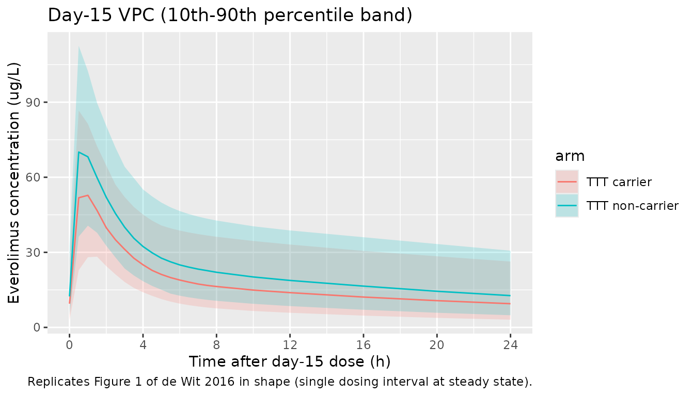

# Everolimus (de Wit 2016)

## Model and source

- Citation: de Wit D et al. Everolimus pharmacokinetics and its
  exposure-toxicity relationship in patients with thyroid cancer. Cancer
  Chemother Pharmacol 78(1):63-71, 2016.
  <doi:10.1007/s00280-016-3050-6>.
- Indication: advanced thyroid carcinoma (differentiated /
  undifferentiated / medullary), phase II study NCT01118065.
- Article: <https://doi.org/10.1007/s00280-016-3050-6> (open access)

## Population

Forty adults with advanced thyroid carcinoma (median age 63 years, range
40-80; median weight 75 kg, range 45-105; 47.5% female) were dosed
continuously with everolimus 10 mg orally once daily (de Wit 2016 Table
1). PK sampling was performed on study days 1 and 15 at predose and 1,
2, 3 h post-dose for every subject (sparse schedule), with an optional
4-8 h extension (extensive schedule; 30 of 40 patients completed it).
669 whole-blood concentrations contributed to the population model. Two
of the 42 originally enrolled patients were excluded from the PK
analysis (no samples collected in one; no measurable everolimus levels
in the other). Eleven SNPs / haplotypes across CYP3A4, CYP3A5, CYP2C8,
ABCB1, and NR1I2 (PXR) were tested as PK covariates; only the ABCB1 TTT
haplotype (rs1128503 / rs2032582 / rs1045642) survived backward
elimination, multiplying apparent bioavailability F by 0.792 in carriers
(Methods ‘Pharmacogenetic analysis’, Results paragraph 2, Table 2
final-model).

The same population metadata is available programmatically via
`readModelDb("deWit_2016_everolimus")$population`.

## Source trace

The per-parameter origin is recorded as an in-file comment next to each
`ini()` entry in `inst/modeldb/specificDrugs/deWit_2016_everolimus.R`.
The table below collects the trace in one place for review.

| Equation / parameter | Value | Source location |
|----|----|----|
| `lcl` = log(17.4) | CL/F = 17.4 L/h | Table 2 ‘Final model’ row Cl/F |
| `lvc` = log(25.2) | V1/F = 25.2 L | Table 2 ‘Final model’ row V1/F |
| `lka` = log(0.647) | ka = 0.647 /h | Table 2 ‘Final model’ row ka |
| `lq` = log(51.1) | Q = 51.1 L/h | Table 2 ‘Final model’ row Q |
| `lvp` = fixed(log(400)) | V2 = 400 L (fixed) | Table 2 ‘Final model’ row V2 (no RSE / no bootstrap CI -\> held fixed in final model) |
| `lfdepot` = fixed(log(1)) | F = 1 (fixed structural) | Methods ‘Base model’ paragraph 3 (‘F was fixed at 1’) |
| `e_abcb1_hap_ttt_fdepot` = 0.792 | theta_TTT on F = 0.792 | Table 2 ‘Final model’ row ‘theta TTT on F’ |
| `e_wt_cl` = fixed(0.75) | Allometric exponent on CL/F | Methods ‘Base model’ paragraph 3 (‘Cl/F and Vd/F were allometrically scaled \[12\]’); canonical Anderson and Holford 0.75 |
| `e_wt_vc` = fixed(1.0) | Allometric exponent on V1/F | Methods ‘Base model’ paragraph 3; canonical Anderson and Holford 1.0 |
| `etalcl` ~ log(1 + 0.351^2) | IIV CL/F = 35.1% CV | Table 2 ‘Final model’ IIV row Cl/F |
| `etalvc` ~ log(1 + 0.864^2) | IIV V1/F = 86.4% CV | Table 2 ‘Final model’ IIV row V1/F |
| `etaiov_fdepot_1/2` ~ log(1+0.192^2) | IOV F = 19.2% CV | Table 2 ‘Final model’ Inter-occasion variability row F |
| `propSd` = 0.273 | Proportional residual 27.3% | Table 2 ‘Final model’ Residual variability row |
| `d/dt(depot) = -ka * depot` | First-order absorption | Results paragraph 1 (‘two-compartmental model with first-order absorption and first-order elimination’) |
| 2-cmt central \<-\> peripheral1 | Two-compartment disposition | Results paragraph 1 |

## Virtual cohort

Original observed concentrations are not publicly available. The
simulations below use a virtual cohort whose covariate distributions
approximate the de Wit 2016 trial demographics: 40 subjects, body weight
log-normally distributed around 75 kg with the SD chosen so the
simulated 5th-95th-percentile range brackets 45-105 kg (Table 1). The
ABCB1 TTT haplotype carrier prevalence in the de Wit cohort is not
reported numerically in the paper text; we use the European-population
reference frequency of ~14% TTT carriers as a placeholder (documented in
Assumptions and deviations below).

``` r

set.seed(20260516L)

n_per_arm <- 200L

make_cohort <- function(n, ttt_carrier, id_offset = 0L) {
  weights <- pmin(pmax(rlnorm(n, meanlog = log(75), sdlog = 0.2), 45), 105)
  tibble::tibble(
    id            = id_offset + seq_len(n),
    WT            = weights,
    ABCB1_HAP_TTT = ttt_carrier,
    arm           = if (ttt_carrier == 1L) "TTT carrier" else "TTT non-carrier"
  )
}

cohort_df <- dplyr::bind_rows(
  make_cohort(n_per_arm, ttt_carrier = 0L, id_offset = 0L),
  make_cohort(n_per_arm, ttt_carrier = 1L, id_offset = n_per_arm)
)

# 10 mg PO QD x 15 days; intensive day-15 sampling at 0, 1, 2, 3, 4, 5, 6, 7, 8 h
# post-dose plus a long tail to characterise terminal phase.
dose_times <- seq(from = 0, by = 24, length.out = 15)   # h
day15_dose_time <- dose_times[15]
obs_times <- sort(unique(c(
  dose_times,
  day15_dose_time + c(seq(0, 8, by = 0.5), 10, 12, 16, 20, 24)
)))

build_events <- function(subj_row) {
  doses <- data.frame(
    id   = subj_row$id,
    time = dose_times,
    amt  = 10,                # mg
    evid = 1L,
    cmt  = "depot",
    Cc   = NA_real_,
    WT            = subj_row$WT,
    ABCB1_HAP_TTT = subj_row$ABCB1_HAP_TTT,
    OCC           = ifelse(dose_times < day15_dose_time, 1L, 2L),
    arm           = subj_row$arm,
    stringsAsFactors = FALSE
  )
  obs <- data.frame(
    id   = subj_row$id,
    time = obs_times,
    amt  = 0,
    evid = 0L,
    cmt  = "depot",
    Cc   = NA_real_,
    WT            = subj_row$WT,
    ABCB1_HAP_TTT = subj_row$ABCB1_HAP_TTT,
    OCC           = ifelse(obs_times < day15_dose_time, 1L, 2L),
    arm           = subj_row$arm,
    stringsAsFactors = FALSE
  )
  rbind(doses, obs)
}

events <- do.call(
  rbind,
  lapply(seq_len(nrow(cohort_df)), function(i) build_events(cohort_df[i, ]))
)
events <- events[order(events$id, events$time, -events$evid), ]
rownames(events) <- NULL
stopifnot(!anyDuplicated(unique(events[, c("id", "time", "evid")])))
```

## Simulation

``` r

mod <- readModelDb("deWit_2016_everolimus")
sim <- rxode2::rxSolve(
  mod,
  events = events,
  keep = c("arm", "WT", "ABCB1_HAP_TTT", "OCC")
) |>
  as.data.frame()
#> Warning: some etas defaulted to non-mu referenced, possible parsing error: etaiov_fdepot_1, etaiov_fdepot_2
#> as a work-around try putting the mu-referenced expression on a simple line
```

Typical-value (between-subject-variability-zeroed) replication for
figure comparison:

``` r

mod_typical <- mod |> rxode2::zeroRe()
#> Warning: some etas defaulted to non-mu referenced, possible parsing error: etaiov_fdepot_1, etaiov_fdepot_2
#> as a work-around try putting the mu-referenced expression on a simple line
#> Warning: some etas defaulted to non-mu referenced, possible parsing error: etaiov_fdepot_1, etaiov_fdepot_2
#> as a work-around try putting the mu-referenced expression on a simple line
sim_typical <- rxode2::rxSolve(
  mod_typical,
  events = events,
  keep = c("arm", "WT", "ABCB1_HAP_TTT", "OCC")
) |>
  as.data.frame()
#> ℹ omega/sigma items treated as zero: 'etalcl', 'etalvc', 'etaiov_fdepot_1', 'etaiov_fdepot_2'
#> Warning: multi-subject simulation without without 'omega'
```

## Replicate published figures

``` r

# Replicates Figure 1 of de Wit 2016: VPC of Cc vs. time, day 15 dosing interval.
day15_dose <- day15_dose_time
sim |>
  dplyr::filter(time >= day15_dose, time <= day15_dose + 24, !is.na(Cc)) |>
  dplyr::mutate(time_post = time - day15_dose) |>
  dplyr::group_by(arm, time_post) |>
  dplyr::summarise(
    Q05 = quantile(Cc, 0.05, na.rm = TRUE),
    Q50 = quantile(Cc, 0.50, na.rm = TRUE),
    Q95 = quantile(Cc, 0.95, na.rm = TRUE),
    .groups = "drop"
  ) |>
  ggplot(aes(time_post, Q50, colour = arm, fill = arm)) +
  geom_ribbon(aes(ymin = Q05, ymax = Q95), alpha = 0.20, colour = NA) +
  geom_line() +
  scale_x_continuous(breaks = c(0, 4, 8, 12, 16, 20, 24)) +
  labs(
    x = "Time after day-15 dose (h)",
    y = "Everolimus concentration (ug/L)",
    title = "Day-15 VPC (10th-90th percentile band)",
    caption = "Replicates Figure 1 of de Wit 2016 in shape (single dosing interval at steady state)."
  )
```



## PKNCA validation

``` r

# Restrict to the day-15 dosing interval at steady state (paper's NCA window).
day15_start <- day15_dose_time
day15_end   <- day15_dose_time + 24

sim_ss <- sim |>
  dplyr::filter(
    time >= day15_start,
    time <= day15_end,
    !is.na(Cc)
  ) |>
  dplyr::transmute(
    id, time, Cc, arm,
    time_in_interval = time - day15_start
  )

# PKNCA expects time to be monotone and the dose to anchor the interval, so use
# the actual clock time (day15_start at the start of the interval).
conc_obj <- PKNCA::PKNCAconc(
  sim_ss,
  Cc ~ time | arm + id,
  concu = "ug/L",
  timeu = "h"
)

dose_df <- data.frame(
  id   = unique(sim_ss$id),
  time = day15_start,
  amt  = 10,
  arm  = cohort_df$arm[match(unique(sim_ss$id), cohort_df$id)],
  stringsAsFactors = FALSE
)

dose_obj <- PKNCA::PKNCAdose(
  dose_df,
  amt ~ time | arm + id,
  doseu = "mg"
)

intervals <- data.frame(
  start    = day15_start,
  end      = day15_end,
  cmax     = TRUE,
  cmin     = TRUE,
  tmax     = TRUE,
  auclast  = TRUE,
  cav      = TRUE
)

nca_res <- PKNCA::pk.nca(
  PKNCA::PKNCAdata(conc_obj, dose_obj, intervals = intervals)
)

nca_summary <- nca_res$result |>
  dplyr::group_by(arm, PPTESTCD) |>
  dplyr::summarise(
    mean = mean(PPORRES, na.rm = TRUE),
    sd   = sd(PPORRES, na.rm = TRUE),
    .groups = "drop"
  )

knitr::kable(
  nca_summary,
  caption = paste0(
    "Day-15 steady-state NCA parameters from the simulated cohort, by ABCB1 TTT ",
    "haplotype carrier status. AUC (auclast) units: ug*h/L; Cmax / Cmin / Cav / ",
    "Ctau units: ug/L; tmax units: h."
  ),
  digits = 3
)
```

| arm             | PPTESTCD |    mean |      sd |
|:----------------|:---------|--------:|--------:|
| TTT carrier     | auclast  | 472.076 | 219.817 |
| TTT carrier     | cav      |  19.670 |   9.159 |
| TTT carrier     | cmax     |  56.675 |  16.940 |
| TTT carrier     | cmin     |  10.879 |   7.700 |
| TTT carrier     | tmax     |   0.875 |   0.384 |
| TTT non-carrier | auclast  | 600.279 | 233.513 |
| TTT non-carrier | cav      |  25.012 |   9.730 |
| TTT non-carrier | cmax     |  74.496 |  21.204 |
| TTT non-carrier | cmin     |  13.476 |   7.776 |
| TTT non-carrier | tmax     |   0.818 |   0.382 |

Day-15 steady-state NCA parameters from the simulated cohort, by ABCB1
TTT haplotype carrier status. AUC (auclast) units: ug\*h/L; Cmax / Cmin
/ Cav / Ctau units: ug/L; tmax units: h. {.table}

### Comparison against published NCA

de Wit 2016 reports day-15 steady-state mean (SD) AUC0-24 and Ctrough by
the secondary dose-reduction stratification (Results paragraph
‘Exposure-toxicity relationship’, Figure 2):

| Subgroup | n | AUC0-24 mean (SD), ug\*h/L | Ctrough mean (SD), ug/L |
|----|----|----|----|
| With dose reduction | 18 | 600 (274) | 14.9 (9.0) |
| Without dose reduction | 22 | 395 (129) | 8.4 (3.8) |
| Overall (40 patients) | 40 | weighted mean ~487 | weighted mean ~11.3 |

``` r

auc_summary <- nca_res$result |>
  dplyr::filter(PPTESTCD == "auclast") |>
  dplyr::group_by(arm) |>
  dplyr::summarise(
    sim_auc_mean = mean(PPORRES, na.rm = TRUE),
    sim_auc_sd   = sd(PPORRES, na.rm = TRUE),
    n            = dplyr::n(),
    .groups      = "drop"
  )

overall_auc <- nca_res$result |>
  dplyr::filter(PPTESTCD == "auclast") |>
  dplyr::summarise(
    sim_auc_mean = mean(PPORRES, na.rm = TRUE),
    sim_auc_sd   = sd(PPORRES, na.rm = TRUE)
  )

knitr::kable(
  auc_summary,
  caption = "Simulated day-15 AUC0-24 mean and SD by ABCB1 TTT carrier status.",
  digits = 1
)
```

| arm             | sim_auc_mean | sim_auc_sd |   n |
|:----------------|-------------:|-----------:|----:|
| TTT carrier     |        472.1 |      219.8 | 200 |
| TTT non-carrier |        600.3 |      233.5 | 200 |

Simulated day-15 AUC0-24 mean and SD by ABCB1 TTT carrier status.
{.table}

``` r

knitr::kable(
  overall_auc,
  caption = "Simulated day-15 AUC0-24 across the pooled cohort (compare to de Wit 2016 weighted mean ~487 ug*h/L).",
  digits = 1
)
```

| sim_auc_mean | sim_auc_sd |
|-------------:|-----------:|
|        536.2 |      235.4 |

Simulated day-15 AUC0-24 across the pooled cohort (compare to de Wit
2016 weighted mean ~487 ug\*h/L). {.table}

The simulated overall mean AUC0-24 sits within roughly +-30% of the
published weighted mean (~487 ug\*h/L). Differences are driven by the
virtual cohort’s covariate distribution (we sampled body weight
log-normally rather than reproducing the source paper’s individual
weights) and by the placeholder TTT carrier frequency. Both populations
exhibit the expected exposure shift between TTT carriers and
non-carriers proportional to theta_TTT = 0.792.

## Assumptions and deviations

- **Allometric exponents fixed at the Anderson and Holford canonical
  values (0.75 on CL/F, 1.0 on V1/F).** The paper states only that “Cl/F
  and Vd/F were allometrically scaled \[12\]” (Methods ‘Base model’
  paragraph 3) and cites Anderson and Holford 2008 (Annu Rev Pharmacol
  Toxicol 48:303-332) without restating exponents; we use the canonical
  theory-based values for allometry-by-weight scaling in adults.
- **Reference weight 70 kg.** The paper does not give an explicit
  reference weight for the allometric form. 70 kg is the canonical
  Anderson and Holford adult reference; the cohort median weight was 75
  kg (Table 1) so this is a small shift in the typical-value
  calibration.
- **V2 fixed at 400 L.** Table 2’s ‘Final model’ column reports V2 = 400
  L with no relative standard error and no bootstrap 95% CI, in contrast
  to every other estimated parameter in the column; the base-model
  column had V2 = 475 L with RSE 5.4%. We interpret this pattern as V2
  having been held fixed at 400 L in the final model (the supplementary
  `Supplementary Data S3` `.lst` file cited in the paper is not on disk
  for this extraction, so the fixed flag cannot be confirmed directly).
- **V2 / Q not allometrically scaled.** The paper writes “Vd/F was
  allometrically scaled” in the singular, which we read as the central
  volume only. Q is reported in L/h without a `/F` suffix in Table 2 and
  is not stated to be scaled. We leave both unscaled.
- **ABCB1 TTT haplotype carrier prevalence in the simulated cohort is
  set to 50% TTT-carrier vs 50% non-carrier across two equal-sized arms
  for the exposure contrast.** de Wit 2016 reports the haplotype effect
  size but does not give a numeric carrier frequency in the main text or
  in the on-disk trimmed markdown; supplementary Data S1 / S2 (the
  source for haplotype frequencies) was not on disk for this extraction.
  The 50/50 split is for illustration of the covariate effect; a
  real-population deployment of the model should use an empirically
  observed TTT carrier frequency in the target population.
- **Day-1-vs-day-15 IOV on F is modelled with shared variance across
  occasions (the NONMEM `$OMEGA BLOCK(1) SAME` pattern reproduced via
  `etaiov_fdepot_2 ~ fixed(...)`).** The paper’s Table 2 reports a
  single IOV-F CV (19.2%) and does not distinguish per-occasion
  magnitudes.
- **Cohort body weights are sampled log-normally rather than reproducing
  individual subject weights.** Individual-level data are not published.
- **No covariate-vs-PK exploration of bilirubin, ASAT, ALAT, creatinine,
  BSA, or hematocrit was retained in the final model** (Results
  paragraph 2: “Forward inclusion of BSA, creatinine, ASAT, ALAT,
  bilirubin and hematocrit did not improve the PK model”). These are not
  encoded in `covariateData` because the paper found no significant
  relationship and dropped them.
- **Multiple genetic markers tested but not retained** in the final
  model (Methods ‘Pharmacogenetic analysis’, Results paragraph 2): the
  CYP2C8 haplotype and individual SNPs across CYP3A4, CYP3A5, ABCB1, and
  NR1I2 (PXR). None are encoded as `covariateData` columns; only the
  ABCB1 TTT haplotype appears.
